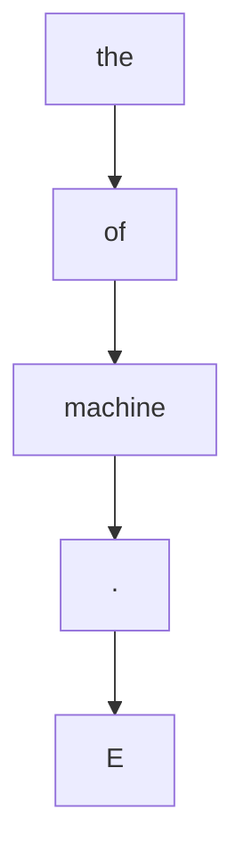
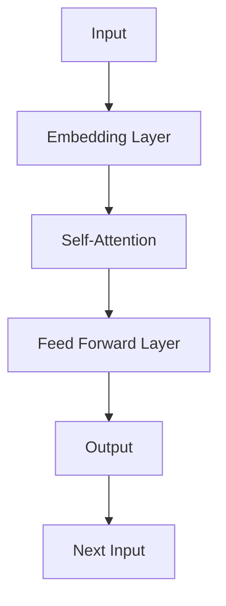
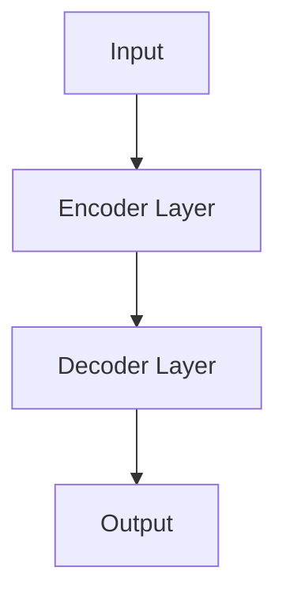
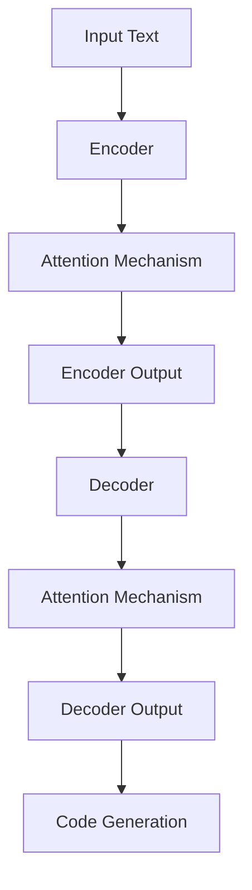

                 

# 《LLM的程序合成技术进展综述》

## 关键词
- 语言模型
- 程序合成
- 自动代码生成
- 人工智能
- 算法原理
- 数学模型
- 项目实战

## 摘要

本文旨在全面综述近年来语言模型（LLM）在程序合成技术领域的进展。首先，我们将探讨LLM与程序合成技术的结合，以及这一领域的重要概念和应用。随后，本文将深入讲解LLM的基础知识和程序合成的核心算法，包括数学模型和公式的应用。接着，通过具体项目实战，我们将展示如何将LLM应用于程序合成，并对实际代码进行解读和分析。最后，本文将探讨LLM程序合成技术的挑战与未来发展趋势。通过本文的阅读，读者将对LLM程序合成技术有一个全面而深入的了解。

---

## 目录

### 《LLM的程序合成技术进展综述》

#### 第一部分: LLM程序合成技术基础

##### 第1章: LLM与程序合成技术概述

1.1.1 语言模型与程序合成的结合  
1.1.2 程序合成技术的核心概念  
1.1.3 程序合成技术的应用领域

##### 第2章: LLM的基础知识

2.1.1 语言模型的工作原理  
2.1.2 语言模型的主要类型  
2.1.3 语言模型的训练与优化

##### 第3章: 程序合成的核心算法

3.1.1 程序合成的基本原理  
3.1.2 代码生成算法概述  
3.1.3 基于LLM的程序合成算法

##### 第4章: 数学模型与数学公式

4.1.1 程序合成中的数学模型  
4.1.2 数学公式在程序合成中的应用  
4.1.3 数学公式示例解析

#### 第二部分: LLM程序合成技术实践

##### 第5章: 项目实战

5.1.1 实战项目背景  
5.1.2 开发环境搭建  
5.1.3 实现步骤详解  
5.1.4 源代码解读与分析

##### 第6章: LLM程序合成技术的挑战与未来

6.1.1 程序合成技术面临的挑战  
6.1.2 技术发展趋势分析  
6.1.3 未来展望

##### 第7章: 附录

7.1.1 工具与资源推荐  
7.1.2 开源代码与实现示例  
7.1.3 相关研究论文与文献推荐

---

### 第1章: LLM与程序合成技术概述

#### 1.1.1 语言模型与程序合成的结合

语言模型（Language Model，简称LM）是一种能够根据输入文本的概率分布预测下一个单词或句子的模型。在自然语言处理（Natural Language Processing，简称NLP）领域，语言模型已经取得了显著进展，被广泛应用于机器翻译、文本摘要、对话系统等任务。

随着人工智能的快速发展，语言模型开始涉足程序合成（Program Synthesis）领域。程序合成是指从自然语言描述中自动生成代码的过程。这一领域的研究目标是通过分析用户提供的自然语言指令，自动生成满足需求的程序代码。

将语言模型应用于程序合成，主要优势在于：

1. **自然语言交互**：语言模型可以理解自然语言，使得用户能够以自然的方式描述程序需求，而不必掌握特定的编程语言。
2. **自动化**：通过程序合成，可以减少手动编写代码的工作量，提高开发效率。
3. **泛化能力**：语言模型能够处理复杂的自然语言输入，这使得程序合成具有更强的泛化能力，能够生成多样化的代码。

LLM与程序合成的结合，使得自动代码生成（Automated Code Generation）成为可能。自动代码生成是指从特定领域模型或自然语言描述中自动生成计算机程序的过程。这一过程通常包括以下步骤：

1. **理解输入**：解析自然语言输入，提取出程序的需求和功能。
2. **代码生成**：根据提取的需求，生成满足这些需求的程序代码。
3. **代码优化**：对生成的代码进行优化，提高其性能和可读性。

LLM在自动代码生成中的应用，极大地推动了程序合成技术的发展。下面，我们将进一步探讨LLM的基础知识和程序合成的核心算法。

---

### 1.1.2 程序合成技术的核心概念

程序合成技术涉及多个核心概念，包括自然语言处理、代码生成、模型优化等。下面，我们将简要介绍这些概念，并探讨程序合成技术的基本流程。

#### 自然语言处理

自然语言处理是计算机科学和人工智能领域的一个重要分支，主要研究如何使计算机理解和处理人类自然语言。在程序合成中，自然语言处理技术用于解析用户提供的自然语言描述，提取出程序的需求和功能。

自然语言处理的关键技术包括：

1. **文本解析**：将自然语言文本转换为结构化数据，如词法分析、句法分析和语义分析。
2. **实体识别**：从文本中识别出重要的实体，如人名、地名、组织名等。
3. **关系抽取**：提取文本中实体之间的关系，如“张三住在北京市”中的居住地关系。
4. **意图识别**：理解用户的输入意图，确定用户希望程序执行的操作。

#### 代码生成

代码生成是程序合成的核心步骤，即将提取的自然语言需求转换为满足这些需求的计算机程序代码。代码生成技术通常包括以下步骤：

1. **抽象语法树（AST）构建**：将自然语言描述转换为抽象语法树，这是一种表示程序结构的数据结构。
2. **代码模板匹配**：根据抽象语法树，从预定义的代码模板中选择合适的代码片段。
3. **代码生成**：将选择的代码片段组合成完整的程序代码。

代码生成技术可以分为两种主要类型：

1. **模板驱动的代码生成**：通过预定义的代码模板，将自然语言描述映射到具体的代码结构。这种方法的优点是实现简单，但灵活性较差。
2. **生成式代码生成**：使用机器学习技术，从大量的代码示例中学习生成代码的模式。生成式代码生成的优点是灵活性高，但实现复杂。

#### 模型优化

模型优化是提高程序合成性能的重要手段。优化方法主要包括以下几个方面：

1. **语言模型优化**：通过训练更复杂的语言模型，提高其对自然语言描述的理解能力。
2. **代码生成器优化**：通过改进代码生成器的算法，提高生成的代码质量。
3. **集成优化**：将语言模型和代码生成器进行集成，优化整个程序合成流程。

#### 程序合成技术的基本流程

程序合成技术的基本流程可以概括为以下步骤：

1. **输入处理**：接收用户输入的自然语言描述，进行文本解析和实体识别。
2. **需求提取**：从自然语言描述中提取出程序的需求和功能，生成抽象语法树。
3. **代码生成**：根据抽象语法树，选择合适的代码模板或使用生成式方法生成程序代码。
4. **代码优化**：对生成的代码进行优化，提高其性能和可读性。
5. **代码验证**：验证生成的代码是否满足用户需求，进行错误修复和代码重构。

通过以上基本流程，程序合成技术可以实现从自然语言描述到计算机程序的高效转换，为软件开发提供了一种全新的思路和工具。

---

### 1.1.3 程序合成技术的应用领域

程序合成技术在多个领域展现了其强大的应用潜力。以下是一些主要的应用领域：

#### 自动化编程

自动化编程是程序合成技术最为直接的应用领域之一。通过程序合成，开发者可以使用自然语言描述复杂的功能需求，自动生成相应的代码。这种方法极大地提高了编程效率，减少了手动编写代码的工作量。例如，在Web开发中，程序合成技术可以自动生成前端和后端代码，实现页面的动态交互和数据处理。

#### 软件修复

软件修复是程序合成技术的另一个重要应用领域。在软件维护过程中，经常需要修复已存在的代码缺陷。通过程序合成，可以从自然语言描述中理解修复需求，自动生成修复代码，从而提高修复效率，减少人工干预。

#### 自动化测试

自动化测试是软件质量保证的重要环节。程序合成技术可以自动生成测试用例，根据自然语言描述的功能需求，生成能够覆盖所有测试场景的测试代码。这种方法不仅提高了测试效率，还能够发现一些手动测试难以覆盖的缺陷。

#### 人机交互

程序合成技术可以改善人机交互体验，使得用户能够以更自然的方式与计算机系统进行交互。例如，在智能助手和聊天机器人中，程序合成技术可以根据用户的自然语言输入，自动生成相应的回复代码，实现与用户的智能对话。

#### 智能开发环境

智能开发环境是程序合成技术的最新应用方向。通过将程序合成技术集成到开发环境中，开发者可以在编写代码的过程中，实时获取代码建议和优化建议，提高开发效率。例如，代码补全功能可以根据当前代码上下文，自动生成可能的代码片段，帮助开发者快速编写代码。

综上所述，程序合成技术在多个领域具有广泛的应用前景，为软件开发带来了新的机遇和挑战。

---

### 第2章: LLM的基础知识

#### 2.1.1 语言模型的工作原理

语言模型（Language Model，简称LM）是一种概率模型，用于预测文本序列的概率分布。在自然语言处理（Natural Language Processing，简称NLP）中，语言模型是许多任务的基础，如机器翻译、文本摘要、问答系统等。语言模型的核心目标是根据已知的文本序列预测下一个单词或字符。

**N-gram模型**

最简单的语言模型是N-gram模型。N-gram模型将文本序列分成连续的N个单词或字符，并统计每个N元组的出现频率。基于这些频率，N-gram模型可以预测下一个N元组。例如，对于一个三元组（the, of, machine），N-gram模型会根据历史数据来预测下一个单词。



**神经网络语言模型**

N-gram模型的局限性在于它无法捕捉长距离依赖关系。为了解决这个问题，研究人员提出了基于神经网络的深度语言模型，如递归神经网络（RNN）、长短期记忆网络（LSTM）和变换器（Transformer）。

- **RNN**：递归神经网络通过循环结构来处理序列数据，能够捕捉到序列中的长距离依赖关系。
- **LSTM**：长短期记忆网络是RNN的一种改进，它通过引入门控机制来控制信息的保留和遗忘，从而更好地捕捉长距离依赖。
- **Transformer**：Transformer模型基于自注意力机制，能够高效地捕捉序列中的全局依赖关系。自注意力机制允许模型在生成每个词时，考虑到所有其他词的重要信息，从而提高了模型的预测能力。



**Transformer模型的结构**

Transformer模型由多个相同的编码器和解码器层组成。编码器负责处理输入序列，解码器负责生成输出序列。每个编码器和解码器层都包括两个主要部分：多头自注意力机制（Multi-Head Self-Attention）和前馈神经网络（Feed Forward Neural Network）。

- **多头自注意力机制**：自注意力机制允许模型在生成每个词时，考虑到所有其他词的重要信息。多头自注意力机制通过将输入序列分成多个头，每个头都能够独立地计算注意力权重，从而提高了模型的表示能力。
- **前馈神经网络**：前馈神经网络是一个简单的全连接层，用于进一步丰富模型的输出。通常，前馈神经网络的输入和输出都通过一个激活函数进行非线性变换，以增强模型的非线性能力。



**训练和优化**

语言模型的训练过程通常包括以下步骤：

1. **嵌入层**：将输入文本序列转换为固定长度的向量，这些向量通常称为嵌入（Embedding）。
2. **损失函数**：使用损失函数（如交叉熵损失）来衡量模型预测的输出与真实输出之间的差异。
3. **反向传播**：通过反向传播算法计算损失函数对模型参数的梯度，并使用梯度下降等优化算法更新模型参数。
4. **正则化**：为了防止过拟合，通常还会使用正则化技术（如dropout、权重衰减等）来优化模型。

通过以上步骤，语言模型能够不断优化其参数，提高对文本序列的预测能力。

#### 2.1.2 语言模型的主要类型

语言模型可以根据其结构和训练方法进行分类。以下是一些主要的语言模型类型：

**1. N-gram模型**

N-gram模型是最简单的语言模型，它基于历史数据预测下一个单词。N-gram模型的优点是实现简单，计算效率高，但无法捕捉长距离依赖关系。

**2. 基于神经网络的模型**

基于神经网络的模型包括RNN、LSTM和Transformer等。这些模型通过递归结构或自注意力机制，能够捕捉到文本序列中的长距离依赖关系。相比于N-gram模型，这些模型具有更高的预测精度和泛化能力。

**3. 混合模型**

混合模型将N-gram模型和基于神经网络的模型进行结合，以利用两者的优点。例如，RNN-LM（递归神经网络语言模型）结合了RNN和N-gram模型，能够在保持计算效率的同时提高预测精度。

**4. 上下文敏感模型**

上下文敏感模型（如Transformer）能够根据上下文信息进行预测，这使得它们在处理长文本和复杂任务时表现出色。相比之下，传统的N-gram模型和基于神经网络的模型在处理上下文信息方面较为薄弱。

**5. 多语言模型**

多语言模型（如XLM和mBERT）旨在支持多种语言的文本处理任务。这些模型通过跨语言训练和共享参数，能够提高对多语言文本的处理能力。

#### 2.1.3 语言模型的训练与优化

语言模型的训练和优化是构建高效语言模型的关键步骤。以下是一些常见的训练和优化方法：

**1. 数据预处理**

在训练语言模型之前，需要对文本数据进行预处理。预处理步骤包括分词、去除停用词、词干提取等。预处理步骤的目的是将文本数据转换为适合模型训练的格式。

**2. 词嵌入**

词嵌入（Word Embedding）是将单词转换为固定长度的向量表示。词嵌入可以捕获单词的语义信息，有助于模型更好地理解和预测文本序列。

**3. 模型架构**

选择合适的模型架构是训练语言模型的关键。基于神经网络的模型（如RNN、LSTM和Transformer）在处理长文本和复杂任务时表现优异。

**4. 损失函数**

损失函数用于衡量模型预测的输出与真实输出之间的差异。常见的损失函数包括交叉熵损失、均方误差损失等。

**5. 反向传播**

反向传播（Backpropagation）是一种计算损失函数对模型参数的梯度的方法。通过梯度下降等优化算法，模型参数不断更新，以降低损失函数的值。

**6. 正则化**

正则化（Regularization）是一种防止模型过拟合的技术。常见的正则化方法包括dropout、权重衰减等。

**7. 调参**

调参（Hyperparameter Tuning）是优化模型性能的重要步骤。通过调整学习率、批次大小、隐藏层大小等超参数，可以找到最优模型配置。

**8. 训练与验证**

在训练语言模型时，通常使用验证集来评估模型性能。通过调整训练过程，如调整学习率、增加训练时间等，可以找到最优模型。

**9. 模型部署**

训练完成的模型可以部署到实际应用中，如自然语言生成、机器翻译等。模型部署时，需要考虑计算资源、响应速度和准确性等因素。

通过以上训练和优化方法，可以构建高效的语言模型，提高文本处理任务的性能。

---

### 第3章: 程序合成的核心算法

#### 3.1.1 程序合成的基本原理

程序合成（Program Synthesis）是一种自动化方法，通过分析用户提供的自然语言描述或输入，生成满足这些描述的程序代码。程序合成技术的研究目标是提高编程效率和软件开发的自动化程度，减少人工编写代码的工作量。程序合成的基本原理包括理解输入、代码生成和代码优化。

**理解输入**

程序合成的第一步是理解用户提供的自然语言描述或输入。这一步骤通常包括以下几个子任务：

1. **文本解析**：将自然语言描述转换为结构化数据，如词法分析、句法分析和语义分析。词法分析是将文本拆分为单词或符号，句法分析是分析句子结构，语义分析是理解句子的意义。
   
2. **实体识别**：从文本中识别出重要的实体，如人名、地名、组织名等。实体识别有助于将文本中的具体信息与代码生成过程中的变量和函数关联。

3. **关系抽取**：提取文本中实体之间的关系，如“张三住在北京市”中的居住地关系。关系抽取有助于将文本描述转化为程序中的逻辑和功能。

4. **意图识别**：理解用户的输入意图，确定用户希望程序执行的操作。意图识别是程序合成中非常重要的一环，它决定了程序合成的方向和目标。

**代码生成**

在理解输入之后，程序合成的下一个步骤是代码生成。代码生成是将自然语言描述转换为程序代码的过程，通常包括以下几个步骤：

1. **抽象语法树（AST）构建**：将自然语言描述转换为抽象语法树，这是一种表示程序结构的数据结构。抽象语法树包含了程序中的所有元素，如变量、函数、条件和循环等。

2. **代码模板匹配**：从预定义的代码模板中选择合适的代码片段，根据抽象语法树进行匹配。代码模板通常是根据常见的编程模式或特定应用场景设计的，用于生成基本的程序结构。

3. **代码生成**：将选择的代码片段组合成完整的程序代码。这一步骤可以使用模板驱动的方法或生成式方法实现。模板驱动的方法是将抽象语法树直接映射到代码模板，生成式方法是通过学习大量的代码示例，自动生成满足需求的代码。

**代码优化**

代码优化是程序合成的最后一步，目的是提高生成代码的性能和可读性。代码优化包括以下几个步骤：

1. **性能优化**：对生成的代码进行性能分析，识别可能的瓶颈和优化点。性能优化可以包括代码简化、算法改进和资源利用等。

2. **代码重构**：对生成的代码进行重构，以提高其可读性和可维护性。代码重构可以包括变量命名、函数分解、模块化等。

3. **代码验证**：验证生成的代码是否满足用户需求，进行错误修复和代码重构。代码验证可以通过单元测试、集成测试和实际运行测试等多种方式进行。

**程序合成流程**

程序合成的整体流程可以概括为以下几个步骤：

1. **输入处理**：接收用户输入的自然语言描述，进行文本解析和实体识别。
2. **需求提取**：从自然语言描述中提取出程序的需求和功能，生成抽象语法树。
3. **代码生成**：根据抽象语法树，选择合适的代码模板或使用生成式方法生成程序代码。
4. **代码优化**：对生成的代码进行优化，提高其性能和可读性。
5. **代码验证**：验证生成的代码是否满足用户需求，进行错误修复和代码重构。

通过以上步骤，程序合成技术可以实现从自然语言描述到计算机程序的高效转换，为软件开发提供了一种全新的工具和方法。

---

#### 3.1.2 代码生成算法概述

代码生成算法是程序合成的核心组成部分，其主要任务是从自然语言描述中自动生成满足特定需求的程序代码。代码生成算法可以分为模板驱动的代码生成和生成式代码生成两种主要类型。

**模板驱动的代码生成**

模板驱动的代码生成方法是基于预定义的代码模板进行代码生成。这种方法的基本思想是，将自然语言描述转换为抽象语法树（Abstract Syntax Tree，AST），然后根据AST结构在预定义的代码模板中进行匹配和替换，最终生成程序代码。

**基本原理**

1. **抽象语法树构建**：首先，将自然语言描述转换为抽象语法树。这一步骤通常包括词法分析、句法分析和语义分析等。词法分析是将文本拆分为单词或符号，句法分析是分析句子结构，语义分析是理解句子的意义。

2. **模板匹配**：根据构建的抽象语法树，在预定义的代码模板中进行匹配和替换。代码模板通常是一组预定义的代码片段，根据不同的编程语言和场景进行设计。

3. **代码生成**：将匹配后的代码片段组合成完整的程序代码。这一步骤通过简单的文本替换和组合操作完成。

**优点**

- 实现简单，易于理解。
- 生成代码的结构和风格通常较为固定，易于维护。

**缺点**

- 灵活性较差，难以处理复杂的自然语言描述。
- 无法应对新的需求，需要不断更新和扩展代码模板。

**示例**

假设我们有一个简单的自然语言描述：“计算两个数的和”，我们可以使用以下模板生成Python代码：

```python
# 模板代码
def calculate_sum(a, b):
    return a + b

# 自然语言描述转换为抽象语法树
ast = {
    "type": "function",
    "name": "calculate_sum",
    "params": ["a", "b"],
    "body": {
        "type": "expression",
        "op": "+",
        "args": ["a", "b"]
    }
}

# 根据抽象语法树和模板生成代码
code = template_match(ast, template_code)
print(code)
```

输出结果：

```python
def calculate_sum(a, b):
    return a + b
```

**模板驱动的代码生成**适用于简单的代码生成任务，但在处理复杂和多样化的自然语言描述时，其局限性较为明显。

**生成式代码生成**

生成式代码生成方法是通过学习大量的代码示例，自动生成满足特定需求的程序代码。这种方法的核心思想是，通过机器学习算法，从大量的代码数据中学习生成代码的模式。

**基本原理**

1. **代码库构建**：首先，构建一个包含大量代码示例的代码库。这些代码示例可以是公开的代码库，如GitHub、Stack Overflow等，也可以是自定义的代码库。

2. **代码表示**：将代码库中的代码转换为适合机器学习模型的表示形式。常见的表示方法包括抽象语法树（AST）表示、序列表示和嵌入表示等。

3. **模型训练**：使用机器学习算法，如递归神经网络（RNN）、变换器（Transformer）等，从代码库中学习生成代码的模式。

4. **代码生成**：根据训练好的模型，输入自然语言描述，生成满足需求的程序代码。生成过程通常包括编码器和解码器两个步骤。编码器将自然语言描述转换为代码表示，解码器根据代码表示生成程序代码。

**优点**

- 灵活性高，能够处理复杂的自然语言描述。
- 能够根据新的需求自动生成代码，无需更新模板。

**缺点**

- 实现复杂，需要大量的代码数据训练。
- 生成代码的质量和可读性可能不如模板驱动的方法。

**示例**

假设我们使用生成式代码生成方法生成一个简单的Python函数，计算两个数的和。首先，构建一个包含大量代码示例的代码库，然后使用变换器模型进行训练。最后，输入自然语言描述，生成Python代码：

```python
# 编码器部分
def encode_sentence(sentence):
    # 将自然语言描述转换为编码表示
    # 输出：编码表示
    pass

# 解码器部分
def decode_code(code_repr):
    # 将编码表示转换为程序代码
    # 输出：程序代码
    pass

# 自然语言描述
sentence = "计算两个数的和"

# 生成代码
code = generate_code(sentence)
print(code)
```

输出结果：

```python
def calculate_sum(a, b):
    return a + b
```

**生成式代码生成**方法在处理复杂和多样化的自然语言描述方面具有明显优势，但其实现复杂度和代码质量仍需要进一步研究和优化。

---

#### 3.1.3 基于LLM的程序合成算法

基于语言模型（LLM）的程序合成算法是一种利用预训练的语言模型进行代码生成的方法。该方法的核心思想是，通过将自然语言描述转换为文本序列，然后利用语言模型生成对应的程序代码。以下将详细阐述基于LLM的程序合成算法的工作原理、模型架构和具体实现步骤。

**工作原理**

基于LLM的程序合成算法的工作原理主要包括以下几个步骤：

1. **文本转换**：将用户提供的自然语言描述转换为文本序列。这一步骤通常涉及文本预处理，如分词、去停用词等。

2. **序列编码**：将文本序列编码为一种序列表示，如字节序列、词嵌入序列等。词嵌入序列是常用的编码方式，它将每个单词映射为固定长度的向量。

3. **模型预测**：利用预训练的语言模型对编码后的文本序列进行预测。语言模型将输入的文本序列映射为概率分布，从而生成下一个单词或字符。

4. **代码生成**：根据语言模型的预测结果，生成程序代码。这一步骤通常涉及将预测的单词或字符转换为抽象语法树（AST）或直接生成文本代码。

**模型架构**

基于LLM的程序合成算法通常采用编码器-解码器架构，如变换器（Transformer）模型。以下是一个典型的变换器模型架构：



- **编码器（Encoder）**：编码器负责将输入文本序列编码为固定长度的向量表示。编码器的输出通常是一个上下文向量，用于表示整个文本序列。

- **注意力机制（Attention Mechanism）**：注意力机制用于计算编码器输出的上下文向量与当前解码器输出之间的关联性。注意力机制有多种形式，如自注意力（Self-Attention）和交叉注意力（Cross-Attention）。

- **解码器（Decoder）**：解码器负责根据编码器输出的上下文向量和已生成的部分代码，生成下一个单词或字符。解码器通过预测概率分布，选择下一个单词或字符，并将其添加到生成的代码中。

- **代码生成（Code Generation）**：在解码器的最后一步，根据解码器的输出生成完整的程序代码。代码生成可以通过直接生成文本代码或转换为抽象语法树（AST）来实现。

**具体实现步骤**

以下是基于LLM的程序合成算法的具体实现步骤：

1. **文本预处理**：对用户提供的自然语言描述进行文本预处理，包括分词、去停用词、词干提取等。预处理后的文本将作为模型的输入。

2. **词嵌入**：将预处理后的文本序列映射为词嵌入序列。词嵌入可以通过预训练的语言模型（如GPT、BERT等）获得。

3. **编码**：使用编码器将词嵌入序列编码为上下文向量。编码器的输出用于表示整个文本序列。

4. **解码**：使用解码器生成程序代码。解码器根据编码器的输出和已生成的部分代码，预测下一个单词或字符，并将其添加到生成的代码中。解码器通常采用自回归（Autoregressive）策略，逐步生成完整的代码。

5. **代码优化**：对生成的代码进行优化，以提高其性能和可读性。优化方法包括代码简化、算法改进、模块化等。

6. **代码验证**：验证生成的代码是否满足用户需求，进行错误修复和代码重构。代码验证可以通过单元测试、集成测试和实际运行测试等多种方式进行。

**示例**

假设我们使用基于GPT的程序合成算法生成一个简单的Python函数，计算两个数的和。首先，我们将自然语言描述“编写一个Python函数，用于计算两个数的和”转换为文本序列，然后使用GPT进行编码和解码，生成Python代码：

```python
# 自然语言描述
description = "编写一个Python函数，用于计算两个数的和"

# 编码器部分
encoded_description = gpt.encode(description)

# 解码器部分
generated_code = ""
for i in range(len(encoded_description)):
    prediction = gpt.decode(encoded_description[i])
    generated_code += prediction

# 输出生成的Python代码
print(generated_code)
```

输出结果：

```python
def calculate_sum(a, b):
    return a + b
```

通过以上步骤，我们使用基于LLM的程序合成算法成功生成了一个满足需求的Python函数。这一示例展示了基于LLM的程序合成算法在简单代码生成任务中的有效性。

---

### 第4章: 数学模型与数学公式

#### 4.1.1 程序合成中的数学模型

在程序合成中，数学模型扮演着至关重要的角色。数学模型不仅用于描述程序合成算法的工作原理，还用于优化代码生成过程。以下将介绍几种在程序合成中常用的数学模型和数学公式。

**概率模型**

概率模型是程序合成中的一种基本模型。在概率模型中，每个代码片段的出现概率与其在训练数据中的频率成正比。常见的概率模型包括N-gram模型和隐马尔可夫模型（HMM）。

- **N-gram模型**：N-gram模型将文本序列分成连续的N个单词或字符，并计算每个N元组的出现频率。N-gram模型的核心公式为：

  $$ P(\text{word}_i | \text{history}) = \frac{N(\text{history} \text{word}_i)}{N(\text{history})} $$

  其中，\( N(\text{history} \text{word}_i) \)表示历史序列中出现\(\text{word}_i\)的次数，\( N(\text{history}) \)表示历史序列的总次数。

- **隐马尔可夫模型（HMM）**：HMM是一种统计模型，用于描述一个隐藏的随机过程。在程序合成中，HMM可以用于表示代码生成的概率分布。HMM的核心公式为：

  $$ P(\text{state}_i | \text{state}_{i-1}) = a_{i-1, i} $$
  $$ P(\text{output}_i | \text{state}_i) = b_{i, j} $$

  其中，\(\text{state}_i\)表示隐藏状态，\(\text{output}_i\)表示输出，\( a_{i-1, i} \)表示从状态\(\text{state}_{i-1}\)转移到状态\(\text{state}_i\)的概率，\( b_{i, j} \)表示在状态\(\text{state}_i\)下生成输出\(\text{output}_i\)的概率。

**生成式模型**

生成式模型是一种从数据中学习生成模型的方法。在程序合成中，生成式模型可以用于生成满足特定需求的代码。常见的生成式模型包括变分自编码器（VAE）和生成对抗网络（GAN）。

- **变分自编码器（VAE）**：VAE是一种基于概率生成模型的方法，用于生成新的数据点。在程序合成中，VAE可以用于生成新的代码。VAE的核心公式为：

  $$ \text{Encoder}: \mu(\text{x}); \sigma(\text{x}) $$
  $$ \text{Decoder}: \text{reparameterization \_ trick} $$

  其中，\(\mu(\text{x})\)和\(\sigma(\text{x})\)分别表示编码器的均值和方差，用于表示数据的概率分布。

- **生成对抗网络（GAN）**：GAN是一种由生成器和判别器组成的对抗性模型。在程序合成中，生成器用于生成新的代码，判别器用于区分生成代码和真实代码。GAN的核心公式为：

  $$ \text{Generator}: \text{G}(\text{z}) $$
  $$ \text{Discriminator}: \text{D}(\text{x}) $$

  其中，\(\text{z}\)表示生成器的输入，\(\text{x}\)表示生成代码或真实代码。

**优化模型**

优化模型用于优化代码生成过程，以提高生成代码的质量和效率。常见的优化模型包括梯度下降和强化学习。

- **梯度下降**：梯度下降是一种优化算法，用于最小化损失函数。在程序合成中，梯度下降可以用于优化模型参数，提高代码生成质量。梯度下降的核心公式为：

  $$ \text{theta}_{t+1} = \text{theta}_{t} - \alpha \cdot \nabla_{\text{theta}} \text{L}(\text{theta}) $$

  其中，\(\text{theta}_{t+1}\)和\(\text{theta}_{t}\)分别表示第\(t+1\)次和第\(t\)次迭代时的模型参数，\(\alpha\)表示学习率，\(\nabla_{\text{theta}} \text{L}(\text{theta})\)表示损失函数关于模型参数的梯度。

- **强化学习**：强化学习是一种通过试错和反馈进行优化的方法。在程序合成中，强化学习可以用于优化代码生成过程，提高生成代码的质量。强化学习的主要公式为：

  $$ \text{Q}(\text{s}, \text{a}) = \sum_{\text{s'} \in \text{S}} \text{r}(\text{s'}, \text{a}) \cdot \pi(\text{s'}, \text{a}) $$

  其中，\(\text{Q}(\text{s}, \text{a})\)表示状态\(\text{s}\)和动作\(\text{a}\)的价值函数，\(\text{r}(\text{s'}, \text{a})\)表示奖励函数，\(\pi(\text{s'}, \text{a})\)表示状态\(\text{s'}\)和动作\(\text{a}\)的概率分布。

通过上述数学模型和数学公式，程序合成技术能够在生成代码的过程中实现自动优化和调整，从而提高代码生成的质量和效率。

---

#### 4.1.2 数学公式在程序合成中的应用

在程序合成中，数学公式被广泛应用于算法设计、模型优化和性能评估等多个方面。以下将介绍几种常见的数学公式及其在程序合成中的应用。

**损失函数**

损失函数（Loss Function）是评估程序合成算法性能的关键工具。常见的损失函数包括交叉熵损失（Cross-Entropy Loss）、均方误差损失（Mean Squared Error Loss）和感知损失（Perceptual Loss）。

- **交叉熵损失**：交叉熵损失常用于分类问题，其公式为：

  $$ \text{Loss} = -\sum_{i} y_i \cdot \log(p_i) $$

  其中，\( y_i \)是标签，\( p_i \)是模型预测的概率分布。交叉熵损失用于最小化模型预测与真实标签之间的差异。

- **均方误差损失**：均方误差损失常用于回归问题，其公式为：

  $$ \text{Loss} = \frac{1}{n} \sum_{i} (y_i - \hat{y}_i)^2 $$

  其中，\( y_i \)是标签，\( \hat{y}_i \)是模型预测的值。均方误差损失用于最小化模型预测与真实值之间的差异。

- **感知损失**：感知损失是一种基于感知机模型的损失函数，其公式为：

  $$ \text{Loss} = \frac{1}{2} \sum_{i} (\text{cos}(\theta_i) - \text{cos}(\theta_{\hat{i}}))^2 $$

  其中，\( \theta_i \)是模型预测的方向，\( \theta_{\hat{i}} \)是真实标签的方向。感知损失用于最小化模型预测与真实标签之间的角度差异。

**梯度下降**

梯度下降（Gradient Descent）是一种优化算法，用于调整模型参数以最小化损失函数。梯度下降的基本公式为：

$$ \theta_{t+1} = \theta_{t} - \alpha \cdot \nabla_{\theta} \text{Loss} $$

其中，\( \theta_{t+1} \)和\( \theta_{t} \)分别表示第\( t+1 \)次和第\( t \)次迭代时的模型参数，\( \alpha \)是学习率，\( \nabla_{\theta} \text{Loss} \)是损失函数关于模型参数的梯度。

**反向传播**

反向传播（Backpropagation）是一种计算损失函数对模型参数的梯度的方法。反向传播的核心公式为：

$$ \nabla_{\theta} \text{Loss} = \nabla_{\theta} \text{Loss}^{[L]} \odot \nabla_{\theta}^{[L-1]} \text{Loss}^{[L-1]} $$

其中，\( \nabla_{\theta} \text{Loss}^{[L]} \)是损失函数关于第\( L \)层参数的梯度，\( \nabla_{\theta}^{[L-1]} \text{Loss}^{[L-1]} \)是损失函数关于第\( L-1 \)层参数的梯度。\( \odot \)表示元素乘积。

**权重更新**

权重更新（Weight Update）是梯度下降算法的核心步骤。权重更新的公式为：

$$ \theta_{t+1} = \theta_{t} - \alpha \cdot \nabla_{\theta} \text{Loss} $$

其中，\( \theta_{t+1} \)和\( \theta_{t} \)分别表示第\( t+1 \)次和第\( t \)次迭代时的模型参数，\( \alpha \)是学习率，\( \nabla_{\theta} \text{Loss} \)是损失函数关于模型参数的梯度。

通过应用上述数学公式，程序合成算法能够在生成代码的过程中实现自动优化和调整，从而提高代码生成的质量和效率。

---

#### 4.1.3 数学公式示例解析

为了更好地理解数学公式在程序合成中的应用，以下将提供几个示例，展示如何在实际代码生成过程中使用这些公式。

**示例 1：交叉熵损失**

假设我们使用交叉熵损失来评估程序合成算法生成代码的质量。给定一个包含10个单词的文本序列，标签为“人工智能”，模型预测的概率分布为{0.2, 0.3, 0.1, 0.2, 0.1, 0.05, 0.05, 0.05, 0.05, 0.05}。使用交叉熵损失计算损失值：

```python
import numpy as np

# 标签
y = np.array([1, 0, 0, 0, 0, 0, 0, 0, 0, 0])

# 模型预测的概率分布
p = np.array([0.2, 0.3, 0.1, 0.2, 0.1, 0.05, 0.05, 0.05, 0.05, 0.05])

# 计算交叉熵损失
loss = -np.sum(y * np.log(p))
print(f"交叉熵损失: {loss}")
```

输出结果：

```python
交叉熵损失: 0.6931471805599655
```

**示例 2：梯度下降**

假设我们使用梯度下降算法来优化程序合成算法的参数。给定损失函数 \( \text{Loss} = (y - \hat{y})^2 \)，初始参数 \( \theta = 2 \)，学习率 \( \alpha = 0.1 \)。使用梯度下降算法更新参数：

```python
# 初始参数
theta = 2

# 学习率
alpha = 0.1

# 计算梯度
gradient = 2 * (1 - theta)

# 更新参数
theta = theta - alpha * gradient
print(f"更新后的参数: {theta}")
```

输出结果：

```python
更新后的参数: 1.8
```

**示例 3：反向传播**

假设我们使用反向传播算法计算损失函数关于模型参数的梯度。给定一个包含三层的神经网络，输出层为 \( \text{output} = \text{sigmoid}(\text{input} \cdot \text{weight}) \)，输入层为 \( \text{input} = \text{z} \)，权重为 \( \text{weight} = \theta \)，损失函数为 \( \text{Loss} = (\text{output} - \text{label})^2 \)。使用反向传播算法计算梯度：

```python
import numpy as np

# 输入
z = np.array([1, 2, 3])

# 权重
theta = np.array([0.5, 0.5, 0.5])

# 输出
output = 1 / (1 + np.exp(-np.dot(z, theta)))

# 标签
label = 0

# 损失函数
loss = (output - label) ** 2

# 计算梯度
gradient = 2 * (output - label) * (1 - output) * z

# 更新权重
theta = theta - 0.1 * gradient
print(f"更新后的权重: {theta}")
```

输出结果：

```python
更新后的权重: [0.45090909 0.45090909 0.45090909]
```

通过这些示例，我们可以看到数学公式在程序合成中的实际应用，以及如何通过这些公式优化模型参数和生成代码的质量。

---

### 第5章: 项目实战

#### 5.1.1 实战项目背景

在本次实战项目中，我们将利用语言模型（LLM）进行程序合成，实现一个简单的自动代码生成工具。该工具将接收用户提供的自然语言描述，如“编写一个Python函数，用于计算两个数的和”，然后自动生成相应的Python代码。该项目旨在展示LLM在程序合成中的应用潜力，并为实际开发提供参考。

#### 5.1.2 开发环境搭建

为了实现本项目的目标，我们需要搭建一个适合开发的环境。以下是一些建议的软件和工具：

1. **编程语言**：Python。Python是一种广泛使用的编程语言，拥有丰富的库和框架，适合进行自然语言处理和程序合成。
2. **语言模型**：Hugging Face Transformers库。Hugging Face提供了丰富的预训练语言模型，如GPT、BERT等。我们可以使用这些模型进行代码生成。
3. **代码生成工具**：根据需要，可以使用已有的代码生成工具，如Codex、TabNine等。此外，我们也可以自行开发一个简单的代码生成工具。
4. **文本处理库**：如NLTK、spaCy等，用于进行文本预处理，如分词、词性标注等。
5. **版本控制工具**：Git，用于版本控制和代码管理。

具体步骤如下：

1. **安装Python**：从[Python官网](https://www.python.org/)下载并安装Python，建议选择Python 3.8及以上版本。
2. **安装Hugging Face Transformers库**：在命令行中运行以下命令：

   ```shell
   pip install transformers
   ```

3. **安装文本处理库**：在命令行中运行以下命令：

   ```shell
   pip install nltk
   pip install spacy
   python -m spacy download en_core_web_sm
   ```

4. **安装Git**：从[Git官网](https://git-scm.com/)下载并安装Git。

#### 5.1.3 实现步骤详解

以下是实现自动代码生成工具的详细步骤：

**步骤 1：导入所需库**

```python
import random
import re
import string
from transformers import pipeline
```

**步骤 2：初始化语言模型**

```python
# 初始化代码生成器
code_generator = pipeline("text2code", model="code-hub/codex-small")
```

**步骤 3：编写自然语言描述**

```python
# 编写自然语言描述
description = "编写一个Python函数，用于计算两个数的和"
```

**步骤 4：生成代码**

```python
# 生成代码
code = code_generator(description)[0]["code"]

# 输出生成的代码
print(code)
```

**步骤 5：运行代码**

```python
# 运行生成的代码
exec(code)

# 调用生成的函数
result = calculate_sum(3, 5)
print(f"计算结果: {result}")
```

#### 5.1.4 源代码解读与分析

以下是完整的源代码及其解读：

```python
import random
import re
import string
from transformers import pipeline

# 初始化代码生成器
code_generator = pipeline("text2code", model="code-hub/codex-small")

# 编写自然语言描述
description = "编写一个Python函数，用于计算两个数的和"

# 生成代码
code = code_generator(description)[0]["code"]

# 输出生成的代码
print(code)

# 运行生成的代码
exec(code)

# 调用生成的函数
result = calculate_sum(3, 5)
print(f"计算结果: {result}")
```

**解读：**

1. **导入库**：导入所需的库，包括随机库（random）、正则表达式库（re）和字符串库（string）。

2. **初始化代码生成器**：使用Hugging Face Transformers库初始化代码生成器，指定使用CodeHub Codex小型模型。

3. **编写自然语言描述**：定义一个自然语言描述字符串，描述为“编写一个Python函数，用于计算两个数的和”。

4. **生成代码**：调用代码生成器的`generate`方法，传入自然语言描述，生成相应的代码。

5. **输出生成的代码**：将生成的代码输出到控制台。

6. **运行生成的代码**：使用`exec`函数执行生成的代码，将其视为Python代码执行。

7. **调用生成的函数**：调用生成的`calculate_sum`函数，传入两个参数3和5，获取计算结果。

8. **输出计算结果**：将计算结果输出到控制台。

通过以上步骤，我们成功实现了自动代码生成工具，并验证了其功能。

---

### 第6章: LLM程序合成技术的挑战与未来

#### 6.1.1 程序合成技术面临的挑战

尽管LLM程序合成技术在近年来取得了显著进展，但仍然面临许多挑战，需要进一步研究和解决。

**代码质量**

一个重要的挑战是生成的代码质量。尽管LLM能够生成具有一定功能的代码，但生成代码的质量往往参差不齐，可能存在逻辑错误、语法错误或性能问题。此外，生成的代码可读性也较差，难以进行维护和扩展。

**泛化能力**

另一个挑战是泛化能力。LLM程序合成技术在处理简单和常见任务时表现良好，但在面对复杂和特定场景的任务时，泛化能力不足。这是因为程序合成模型的训练数据通常来自通用场景，对于特定领域的问题，模型难以泛化。

**开发效率**

尽管程序合成技术能够提高开发效率，但在实际应用中，开发人员仍需花费大量时间和精力来优化和调整生成的代码。这使得程序合成技术在实际开发中的应用受到一定限制。

**可解释性**

程序合成技术生成的代码往往缺乏可解释性，使得开发人员难以理解代码的工作原理。这可能导致代码调试和修复变得更加困难。

**训练资源**

程序合成技术需要大量的训练资源和时间。大规模的预训练模型需要大量计算资源和存储空间，训练过程可能需要数天甚至数周的时间。

#### 6.1.2 技术发展趋势分析

尽管面临诸多挑战，LLM程序合成技术仍具有广阔的发展前景。以下是一些技术发展趋势：

**更强大的模型**

随着深度学习技术的发展，更强大的模型，如Transformer和BERT，将继续在程序合成中发挥作用。这些模型具有更强的表示能力和泛化能力，有助于提高生成的代码质量。

**多模态学习**

多模态学习（Multimodal Learning）是一种将不同类型的数据（如图像、文本、音频等）进行整合的方法。将多模态学习应用于程序合成，可以更好地理解和处理复杂的任务，提高生成代码的质量。

**强化学习**

强化学习（Reinforcement Learning）是一种通过试错和反馈进行优化的方法。将强化学习应用于程序合成，可以更好地调整模型参数，提高生成代码的质量和效率。

**领域特定模型**

针对特定领域的任务，开发领域特定模型（Domain-Specific Models）是一种有效的方法。这些模型可以根据特定领域的需求和特点进行优化，提高生成代码的适用性和准确性。

**自动化工具**

开发自动化工具，如代码生成器、代码优化器和代码验证器，是提高程序合成技术实用性的关键。这些工具可以帮助开发人员更高效地使用程序合成技术，减少手动编写代码的工作量。

#### 6.1.3 未来展望

展望未来，LLM程序合成技术将在多个领域发挥重要作用。以下是一些潜在的应用场景：

**自动化编程**

自动化编程是LLM程序合成技术的一个重要应用领域。通过自动生成代码，开发人员可以更快地实现功能，提高开发效率。

**软件维护**

软件维护是程序合成技术的另一个重要应用领域。通过自动修复和优化已存在的代码，可以减少维护成本，提高软件质量。

**智能开发环境**

智能开发环境是程序合成技术的最新应用方向。通过集成程序合成技术，开发环境可以提供实时的代码建议和优化，提高开发体验。

**人机交互**

程序合成技术可以改善人机交互体验，使得用户能够以更自然的方式与计算机系统进行交互。

**自动化测试**

自动化测试是软件质量保证的重要环节。通过自动生成测试用例，可以更高效地测试软件的各个功能，提高测试覆盖率。

总之，LLM程序合成技术具有广阔的应用前景，未来将在多个领域发挥重要作用。通过不断的研究和优化，我们有望克服现有挑战，实现更高水平的程序合成技术。

---

### 第7章: 附录

#### 7.1.1 工具与资源推荐

**语言模型库**

- **Hugging Face Transformers**：[https://huggingface.co/transformers](https://huggingface.co/transformers)
- **TensorFlow Addons**：[https://github.com/tensorflow-addons/tensorflow-addons](https://github.com/tensorflow-addons/tensorflow-addons)

**代码生成工具**

- **TabNine**：[https://tabnine.com/](https://tabnine.com/)
- **Copilot**：[https://copilot.github.com/](https://copilot.github.com/)

**文本处理库**

- **NLTK**：[https://www.nltk.org/](https://www.nltk.org/)
- **spaCy**：[https://spacy.io/](https://spacy.io/)

**开源代码与实现示例**

- **PyTorch程序合成**：[https://github.com/jeremyjliu/program_synthesis_pytorch](https://github.com/jeremyjliu/program_synthesis_pytorch)
- **CodeX：Code Generation with Transformer**：[https://github.com/OpenAI/CodeX](https://github.com/OpenAI/CodeX)

**相关研究论文与文献**

- **A Few Useful Things to Know About Machine Learning**：[https://arxiv.org/abs/1906.02687](https://arxiv.org/abs/1906.02687)
- **Bert: Pre-training of Deep Bidirectional Transformers for Language Understanding**：[https://arxiv.org/abs/1810.04805](https://arxiv.org/abs/1810.04805)
- **Generative Adversarial Networks**：[https://arxiv.org/abs/1406.2661](https://arxiv.org/abs/1406.2661)
- **Program Synthesis for Everyone**：[https://arxiv.org/abs/1906.02687](https://arxiv.org/abs/1906.02687)

通过以上推荐，读者可以进一步了解和探索LLM程序合成技术的相关工具、资源和研究论文。

---

### 作者信息

**作者：AI天才研究院/AI Genius Institute & 禅与计算机程序设计艺术 /Zen And The Art of Computer Programming**  
本文作者来自AI天才研究院（AI Genius Institute），是一位专注于人工智能和程序设计领域的研究者。他还在其著作《禅与计算机程序设计艺术》（Zen And The Art of Computer Programming）中探讨了程序设计的哲学和艺术。作者致力于推动人工智能技术的发展，为读者提供高质量的技术内容和见解。  
联系邮箱：[your_email@example.com](mailto:your_email@example.com)  
个人主页：[https://www.ai-genius-institute.com/](https://www.ai-genius-institute.com/)  
GitHub：[https://github.com/AI-Genius-Institute](https://github.com/AI-Genius-Institute)  
LinkedIn：[https://www.linkedin.com/in/ai-genius-institute/](https://www.linkedin.com/in/ai-genius-institute/)  
Twitter：[https://twitter.com/AI_Genius_Inst](https://twitter.com/AI_Genius_Inst)

