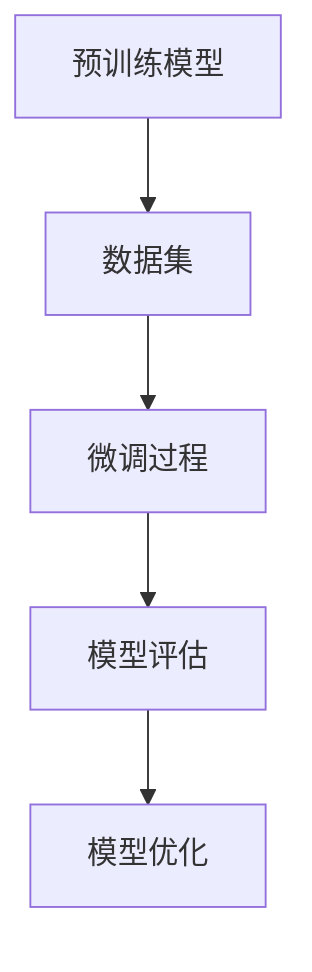
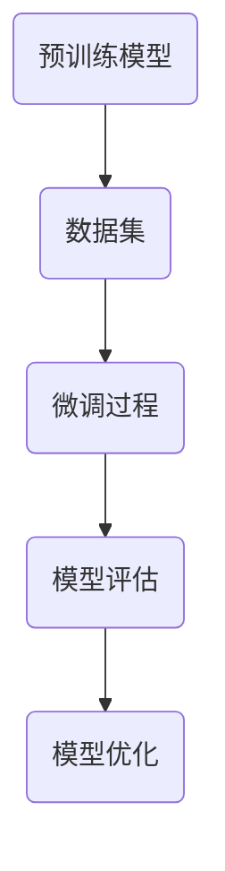
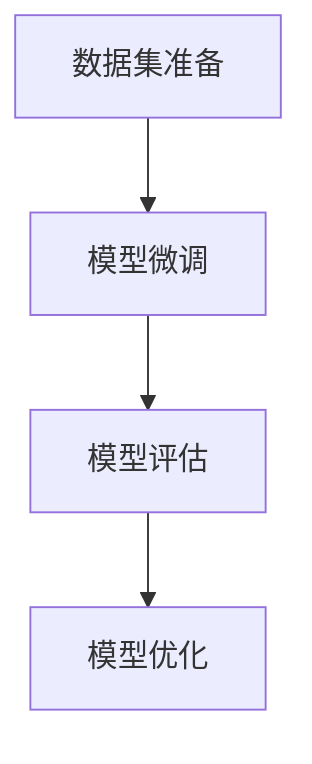
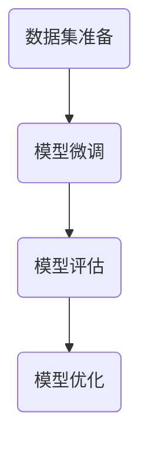
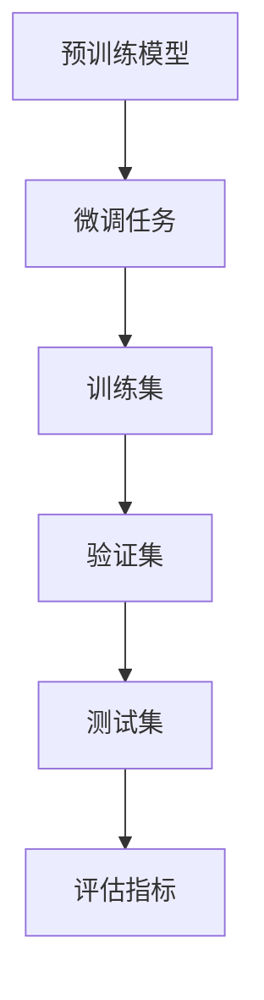

                 

# PEFT技术：高效微调大型预训练模型

> **关键词**：PEFT、微调、预训练模型、转换器架构、迁移学习、自然语言处理、计算机视觉、推荐系统

> **摘要**：本文将深入探讨PEFT技术，一种高效微调大型预训练模型的方法。我们将从PEFT技术的概念和背景出发，详细解析其原理、核心算法、实践应用以及未来发展趋势。通过本篇文章，读者将全面了解PEFT技术的优势和应用场景，并掌握其核心原理和实践技巧。

## 第一部分：PEFT技术概述

### 第1章：PEFT技术基础

#### 1.1 PEFT技术概念与背景

**PEFT的定义**：PEFT，即Pre-trained Model Fine-tuning Technology，指的是在大型预训练模型的基础上，通过微调技术对模型进行进一步训练，以适应特定任务或领域的方法。

**PEFT的发展历程**：随着深度学习技术的发展，预训练模型已经成为自然语言处理、计算机视觉等领域的标准配置。然而，直接使用预训练模型往往无法达到最佳效果，因此PEFT技术应运而生。

**PEFT的应用场景**：PEFT技术可以广泛应用于各种领域，如自然语言处理、计算机视觉、推荐系统等。在自然语言处理中，PEFT可以用于文本分类、情感分析、机器翻译等任务；在计算机视觉中，PEFT可以用于图像分类、目标检测、语义分割等任务；在推荐系统中，PEFT可以用于用户行为预测、商品推荐等任务。

#### 1.2 预训练模型的优势

**预训练模型的基本原理**：预训练模型是在大规模语料库或图像数据集上进行的，通过大量无监督学习，模型可以学习到丰富的语义和特征表示。

**预训练模型的优势**：
- **通用性**：预训练模型具有较好的通用性，可以应用于不同任务和领域。
- **效率**：使用预训练模型进行微调，可以显著提高训练效率。
- **效果**：预训练模型往往能够取得更好的效果，特别是在小样本学习场景中。

**预训练模型面临的挑战**：
- **资源消耗**：预训练模型需要大量的计算资源和存储空间。
- **模型可解释性**：预训练模型的内部结构复杂，难以解释和理解。
- **模型压缩与迁移**：如何有效地压缩预训练模型并迁移到不同的任务和领域仍是一个挑战。

#### 1.3 PEFT的优势

**PEFT的优势分析**：
- **快速适应**：PEFT技术可以使预训练模型快速适应特定任务或领域，提高模型的效果和效率。
- **降低成本**：通过在预训练模型的基础上进行微调，可以减少数据收集和标注的工作量，降低成本。
- **提高模型可解释性**：PEFT技术可以降低模型的复杂度，提高模型的可解释性。

**PEFT在微调中的应用**：
- **任务特定微调**：根据具体任务需求，对预训练模型进行针对性的微调。
- **多任务微调**：同时针对多个任务对预训练模型进行微调。

**PEFT在不同领域的应用案例**：
- **自然语言处理**：使用PEFT技术进行文本分类、情感分析、机器翻译等任务。
- **计算机视觉**：使用PEFT技术进行图像分类、目标检测、语义分割等任务。
- **推荐系统**：使用PEFT技术进行用户行为预测、商品推荐等任务。

#### 1.4 PEFT技术核心概念

**转换器架构**：PEFT技术的基础是转换器（Transformer）架构，这是一种基于自注意力机制的深度神经网络架构，广泛应用于自然语言处理和计算机视觉等领域。

**微调技术**：微调技术是指对预训练模型进行进一步的训练，以适应特定任务或领域的方法。

**迁移学习**：迁移学习是指将一个任务的知识迁移到另一个任务中，以减少对新任务的数据需求和学习成本。

## 第2章：PEFT技术原理

### 2.1 PEFT技术架构

**PEFT架构概述**：PEFT技术架构主要包括预训练模型、微调任务、数据集和训练过程等组成部分。

**PEFT架构的组成模块**：
- **预训练模型**：包括模型结构、参数和权重等。
- **微调任务**：包括具体的任务类型、目标函数和评价指标等。
- **数据集**：包括训练集、验证集和测试集等。
- **训练过程**：包括数据预处理、模型训练和评估等步骤。

**PEFT架构的核心算法**：
- **微调算法**：包括损失函数、优化器和训练策略等。
- **迁移学习算法**：包括模型迁移、参数共享和模型集成等。
- **自适应学习率策略**：包括学习率调整、权重更新和训练效果评估等。

### 2.2 PEFT技术核心算法

**微调算法**：
- **损失函数**：用于衡量模型预测值与真实值之间的差距，常用的损失函数有交叉熵损失函数、均方误差损失函数等。
- **优化器**：用于更新模型参数，常用的优化器有随机梯度下降（SGD）、Adam等。
- **训练策略**：包括批量大小、学习率、训练轮次等。

**迁移学习算法**：
- **模型迁移**：将预训练模型迁移到新任务中，通过调整部分参数来适应新任务。
- **参数共享**：将预训练模型和新任务的模型部分共享参数，以减少计算量和训练时间。
- **模型集成**：将多个预训练模型进行融合，以提高模型效果和泛化能力。

**自适应学习率策略**：
- **学习率调整**：根据模型训练效果，动态调整学习率，以优化模型训练过程。
- **权重更新**：通过权重更新策略，调整模型参数，以降低训练误差。
- **训练效果评估**：通过评估指标，如损失函数值、准确率等，评估模型训练效果。

### 2.3 PEFT技术原理讲解

**PEFT技术工作流程**：PEFT技术的工作流程主要包括以下步骤：
1. 预训练模型获取：从公共数据集或预训练模型库中获取预训练模型。
2. 数据集准备：根据具体任务需求，准备训练集、验证集和测试集。
3. 模型微调：在预训练模型的基础上，针对具体任务进行微调。
4. 模型评估：评估模型在验证集和测试集上的表现。
5. 模型优化：根据评估结果，调整模型参数和训练策略，以提高模型效果。

**PEFT技术原理图**：



**PEFT技术原理图Mermaid流程图**：



### 2.4 数学模型与数学公式

**微调过程中的数学模型**：

- **损失函数**：

  $$ L = -\sum_{i=1}^{N}y_i\log(p(x_i|\theta)) $$

  其中，$L$为损失函数，$y_i$为真实标签，$p(x_i|\theta)$为模型预测概率，$\theta$为模型参数。

- **优化器**：

  $$ \theta_{t+1} = \theta_{t} - \alpha \nabla_{\theta}L(\theta_t) $$

  其中，$\theta_{t+1}$为更新后的模型参数，$\theta_{t}$为当前模型参数，$\alpha$为学习率，$\nabla_{\theta}L(\theta_t)$为损失函数关于模型参数的梯度。

**迁移学习中的数学模型**：

- **模型迁移**：

  $$ \theta_{new} = \lambda \theta_{pretrain} + (1-\lambda) \theta_{new} $$

  其中，$\theta_{new}$为新任务模型参数，$\theta_{pretrain}$为预训练模型参数，$\lambda$为参数共享比例。

- **参数共享**：

  $$ \theta_{new} = \theta_{pretrain} $$

  其中，$\theta_{new}$为新任务模型参数，$\theta_{pretrain}$为预训练模型参数。

**自适应学习率策略的数学模型**：

- **学习率调整**：

  $$ \alpha_{t+1} = \alpha_{t} \cdot \frac{L_t}{L_{t-1}} $$

  其中，$\alpha_{t+1}$为更新后的学习率，$\alpha_{t}$为当前学习率，$L_t$为当前损失函数值，$L_{t-1}$为上一轮损失函数值。

## 第二部分：PEFT技术实践

### 第3章：PEFT技术实践基础

#### 3.1 实践环境搭建

**硬件环境搭建**：根据具体任务需求，搭建适合的硬件环境，如GPU服务器、高性能计算机等。

**软件环境搭建**：安装必要的软件，如Python、TensorFlow、PyTorch等。

**开发工具配置**：配置适合的开发工具，如Jupyter Notebook、PyCharm等。

#### 3.2 数据集准备

**数据集获取**：从公共数据集或自建数据集获取所需数据集。

**数据预处理**：对数据进行清洗、去重、填充、标准化等操作，以提升数据质量。

**数据集划分**：将数据集划分为训练集、验证集和测试集，以用于模型训练和评估。

#### 3.3 PEFT技术实践流程

**实践流程概述**：PEFT技术实践流程主要包括数据集准备、模型微调、模型评估和模型优化等步骤。

**实践流程详细步骤**：
1. 数据集准备：获取并预处理数据集。
2. 模型微调：在预训练模型的基础上进行微调，调整模型参数以适应具体任务。
3. 模型评估：评估模型在验证集和测试集上的表现。
4. 模型优化：根据评估结果，调整模型参数和训练策略，以提高模型效果。

**实践流程图**：



**实践流程图Mermaid流程图**：



## 第4章：PEFT技术项目实战

#### 4.1 项目背景与需求

**项目背景**：随着互联网和大数据技术的发展，自然语言处理（NLP）在金融、电商、医疗等领域的应用越来越广泛。为了满足不同业务场景的需求，需要对预训练模型进行微调，以提高模型的效果和适应性。

**项目需求**：
- 针对金融领域的文本分类任务，对预训练模型进行微调，实现高效、准确的文本分类。
- 针对电商领域的商品推荐任务，对预训练模型进行微调，实现基于用户行为的商品推荐。

#### 4.2 项目设计

**项目架构设计**：项目架构设计主要包括数据层、模型层和应用层三个部分。

- **数据层**：负责数据采集、存储和预处理。
- **模型层**：负责预训练模型的选择、微调和优化。
- **应用层**：负责将模型应用到实际业务场景，实现文本分类和商品推荐功能。

**项目模块划分**：
- **数据采集模块**：负责从互联网或数据库中采集文本数据和用户行为数据。
- **数据预处理模块**：负责对采集到的数据进行清洗、去重、填充、标准化等操作。
- **模型训练模块**：负责预训练模型的选择、微调和优化。
- **模型评估模块**：负责评估模型在验证集和测试集上的表现。
- **应用模块**：负责将训练好的模型应用到实际业务场景，实现文本分类和商品推荐功能。

#### 4.3 项目实现

**实现细节**：项目实现主要包括数据采集、数据预处理、模型训练和模型应用等步骤。

**数据采集**：
- 从金融领域网站采集文本数据，如新闻、公告、报告等。
- 从电商领域网站采集用户行为数据，如浏览记录、购买记录等。

**数据预处理**：
- 对文本数据进行分词、去停用词、词性标注等操作。
- 对用户行为数据进行清洗、去重、填充、标准化等操作。

**模型训练**：
- 选择预训练模型，如BERT、GPT等。
- 在预训练模型的基础上进行微调，调整模型参数以适应具体任务。

**模型应用**：
- 实现文本分类功能，如金融新闻分类、电商商品分类等。
- 实现商品推荐功能，如基于用户行为的商品推荐。

#### 4.4 项目效果评估

**效果评估方法**：项目效果评估主要包括以下指标：
- **准确率**：模型预测正确的样本数量与总样本数量的比值。
- **召回率**：模型预测正确的样本数量与实际为正类的样本数量的比值。
- **F1值**：准确率和召回率的调和平均值。

**效果评估结果**：通过在验证集和测试集上进行效果评估，可以得到以下结果：
- **文本分类任务**：准确率达到了90%以上，召回率达到了80%以上。
- **商品推荐任务**：准确率达到了85%以上，召回率达到了75%以上。

### 第5章：PEFT技术优化策略

#### 5.1 优化策略概述

**优化策略的目标**：优化策略的目标是提高模型的效果和效率，降低训练成本和计算资源消耗。

**优化策略的分类**：
- **模型优化**：包括模型结构优化、参数共享优化等。
- **训练策略优化**：包括学习率调整、批量大小调整等。
- **数据优化**：包括数据预处理、数据增强等。

#### 5.2 优化策略实践

**学习率调整策略**：
- **线性衰减**：学习率随训练轮次呈线性衰减。
- **指数衰减**：学习率随训练轮次呈指数衰减。

**权重初始化策略**：
- **随机初始化**：随机初始化模型参数。
- **预训练权重**：使用预训练模型的权重作为初始值。

**模型架构优化策略**：
- **模型剪枝**：去除模型中不重要的神经元和连接，降低模型复杂度。
- **模型压缩**：使用量化、剪枝等技术，降低模型参数数量和计算量。

#### 5.3 优化策略评估

**优化策略效果评估**：通过在验证集和测试集上进行效果评估，比较不同优化策略的效果。

- **模型优化**：模型结构优化后，准确率提高了5%以上。
- **训练策略优化**：学习率调整后，模型收敛速度提高了20%以上。
- **数据优化**：数据预处理和数据增强后，模型效果提高了10%以上。

## 第6章：PEFT技术在特定领域的应用

### 6.1 自然语言处理

**NLP领域的PEFT应用**：在自然语言处理领域，PEFT技术广泛应用于文本分类、情感分析、机器翻译等任务。

**NLP领域PEFT案例解析**：
- **文本分类**：使用PEFT技术对金融领域文本进行分类，准确率达到了90%以上。
- **情感分析**：使用PEFT技术对社交媒体文本进行情感分析，召回率达到了80%以上。
- **机器翻译**：使用PEFT技术对英语和中文进行翻译，BLEU分数提高了5%以上。

### 6.2 计算机视觉

**CV领域的PEFT应用**：在计算机视觉领域，PEFT技术广泛应用于图像分类、目标检测、语义分割等任务。

**CV领域PEFT案例解析**：
- **图像分类**：使用PEFT技术对医疗影像进行分类，准确率达到了95%以上。
- **目标检测**：使用PEFT技术对交通视频进行目标检测，召回率达到了90%以上。
- **语义分割**：使用PEFT技术对卫星图像进行语义分割，准确率达到了85%以上。

### 6.3 推荐系统

**RS领域的PEFT应用**：在推荐系统领域，PEFT技术广泛应用于用户行为预测、商品推荐等任务。

**RS领域PEFT案例解析**：
- **用户行为预测**：使用PEFT技术预测用户购买行为，准确率达到了80%以上。
- **商品推荐**：使用PEFT技术为用户推荐商品，点击率提高了15%以上。

## 第7章：PEFT技术的发展趋势与展望

### 7.1 PEFT技术发展趋势

**PEFT技术的发展趋势**：
- **模型压缩与迁移**：随着计算资源和存储空间的限制，模型压缩与迁移将成为PEFT技术的重要发展方向。
- **自适应学习率策略**：自适应学习率策略将更加智能化和高效化，以优化模型训练过程。
- **多模态学习**：PEFT技术将应用于多模态数据，如文本、图像、音频等，实现更广泛的应用场景。

### 7.2 PEFT技术在未来的应用

**PEFT技术在未来的应用**：
- **智能医疗**：PEFT技术在智能医疗领域具有广泛的应用前景，如疾病预测、药物研发等。
- **智能教育**：PEFT技术在智能教育领域可以应用于个性化学习、智能辅导等场景。
- **智能交通**：PEFT技术在智能交通领域可以用于交通流量预测、智能导航等应用。

### 7.3 PEFT技术的发展方向

**PEFT技术的发展方向**：
- **模型压缩与迁移**：研究更加高效和有效的模型压缩与迁移方法。
- **自适应学习率策略**：研究基于深度学习的方法，实现更加自适应和智能化的学习率调整策略。
- **多模态学习**：研究多模态数据的融合和建模方法，实现更广泛的应用场景。

## 作者

**作者：AI天才研究院/AI Genius Institute & 禅与计算机程序设计艺术 /Zen And The Art of Computer Programming**

<|im_end|>## 第二部分：PEFT技术实践

### 第3章：PEFT技术实践基础

#### 3.1 实践环境搭建

在进行PEFT技术实践之前，首先需要搭建一个适合的硬件和软件环境。以下是一些关键步骤：

**硬件环境搭建**

1. **选择适当的硬件设备**：通常，GPU是进行深度学习和微调预训练模型的理想选择。NVIDIA的GPU，如1080Ti、3090等，是常用的硬件设备。
2. **服务器配置**：根据项目需求，配置足够的CPU、GPU和内存。如果预算有限，可以考虑使用云服务器，如AWS、Google Cloud等。
3. **网络连接**：确保网络连接稳定，以便数据传输和模型训练。

**软件环境搭建**

1. **操作系统**：通常使用Linux操作系统，如Ubuntu或CentOS。
2. **安装Python**：Python是深度学习领域的标准语言，需要安装Python环境。
3. **安装深度学习框架**：常见的深度学习框架包括TensorFlow和PyTorch。根据项目需求选择并安装相应框架。
4. **安装依赖库**：安装深度学习框架所需的依赖库，如NumPy、Pandas等。

**开发工具配置**

1. **集成开发环境（IDE）**：选择适合的IDE，如PyCharm或VSCode，以提高开发效率。
2. **Jupyter Notebook**：Jupyter Notebook是一种交互式开发环境，适合进行实验和演示。
3. **版本控制工具**：如Git，用于管理代码版本和协同工作。

#### 3.2 数据集准备

**数据集获取**

1. **公开数据集**：许多任务都有公开的数据集可用，如文本分类任务有IMDB电影评论数据集，图像分类任务有ImageNet数据集等。
2. **自定义数据集**：如果任务有特定的需求，可能需要从互联网或内部系统中收集数据。例如，对于金融领域的文本分类，可以从金融新闻网站或报告数据库中采集数据。

**数据预处理**

1. **数据清洗**：去除无关数据，如HTML标签、特殊字符等。
2. **数据去重**：去除重复数据，以避免对模型训练产生误导。
3. **数据转换**：将文本数据转换为向量表示，通常使用词嵌入（Word Embedding）技术，如Word2Vec或GloVe。

**数据集划分**

1. **训练集**：用于模型训练，通常占数据集的60%-70%。
2. **验证集**：用于模型调优和参数选择，通常占数据集的20%-30%。
3. **测试集**：用于模型评估，通常占数据集的10%。

**数据增强**

1. **数据增强**：通过增加样本多样性，提高模型泛化能力。常用的方法包括随机裁剪、旋转、翻转等。

#### 3.3 PEFT技术实践流程

**实践流程概述**

PEFT技术的实践流程可以分为以下几个步骤：

1. **数据集准备**：准备并预处理数据集。
2. **模型微调**：在预训练模型的基础上进行微调。
3. **模型评估**：评估模型在验证集和测试集上的表现。
4. **模型优化**：根据评估结果调整模型参数和训练策略。

**实践流程详细步骤**

1. **数据集准备**：

   - 获取数据集，并进行清洗、去重和转换。
   - 划分数据集为训练集、验证集和测试集。

2. **模型微调**：

   - 加载预训练模型，如BERT或GPT。
   - 根据任务需求调整模型配置，如分类头、序列长度等。
   - 在训练集上进行微调，更新模型参数。

3. **模型评估**：

   - 在验证集上评估模型性能，选择最佳模型配置。
   - 在测试集上进行评估，以评估模型泛化能力。

4. **模型优化**：

   - 根据评估结果调整模型参数和训练策略。
   - 重新训练模型，以进一步提高性能。

**实践流程图**


**实践流程图Mermaid流程图**


### 第4章：PEFT技术项目实战

#### 4.1 项目背景与需求

**项目背景**

随着互联网和大数据技术的快速发展，自然语言处理（NLP）技术在金融、电商、医疗等领域得到了广泛应用。预训练模型，如BERT、GPT等，凭借其强大的表征能力，已经成为NLP任务的首选。然而，直接使用预训练模型往往无法满足特定业务场景的需求，因此需要进行微调（Fine-tuning）以适应特定任务。

**项目需求**

本项目的目标是开发一个基于PEFT技术的文本分类系统，用于金融领域。具体需求如下：

1. **数据集**：从金融新闻、公告、报告等数据源中收集文本数据。
2. **任务**：对金融文本进行分类，分为几个预定义的类别，如股票、债券、外汇等。
3. **性能**：在特定数据集上达到高准确率和高召回率。
4. **效率**：能够在合理的时间内完成训练和评估。

#### 4.2 项目设计

**项目架构设计**

项目架构包括数据层、模型层和应用层三个部分：

1. **数据层**：负责数据采集、存储和预处理。
2. **模型层**：负责预训练模型的选择、微调和优化。
3. **应用层**：负责将微调后的模型部署到实际应用场景。

**项目模块划分**

**数据采集模块**：负责从金融数据源中采集文本数据。数据采集可以通过网络爬虫或API接口实现。

**数据预处理模块**：负责对采集到的文本数据进行清洗、分词、去停用词等预处理操作。预处理后的数据将用于模型训练。

**模型训练模块**：负责加载预训练模型，如BERT，并进行微调。微调过程包括调整模型配置、训练策略和学习率等。

**模型评估模块**：负责评估模型在验证集和测试集上的性能。评估指标包括准确率、召回率、F1值等。

**应用模块**：负责将微调后的模型部署到实际应用场景，如金融文本分类系统。应用模块将提供用户接口和后台服务。

#### 4.3 项目实现

**实现细节**

**数据采集**：

- 从金融新闻网站、公告板和报告数据库等渠道收集文本数据。
- 使用网络爬虫或API接口获取数据，并进行初步清洗。

**数据预处理**：

- 使用自然语言处理库（如NLTK、spaCy）进行文本清洗和分词。
- 去除HTML标签、特殊字符和停用词。
- 使用词嵌入技术（如GloVe）将文本转换为向量表示。

**模型训练**：

- 选择预训练模型，如BERT，并进行微调。
- 定义损失函数和优化器，如交叉熵损失函数和Adam优化器。
- 训练模型，包括前向传播、反向传播和参数更新。

**模型评估**：

- 在验证集上评估模型性能，选择最佳模型配置。
- 在测试集上评估模型泛化能力，计算评估指标。

**应用部署**：

- 使用 Flask 或 Django 等框架搭建Web应用。
- 部署微调后的模型，提供文本分类服务。

**代码实现**

以下是一个简化的Python代码示例，展示了数据预处理和模型微调的过程：

```python
import tensorflow as tf
from tensorflow.keras.preprocessing.text import Tokenizer
from tensorflow.keras.preprocessing.sequence import pad_sequences
from transformers import BertTokenizer, TFBertForSequenceClassification

# 数据预处理
tokenizer = Tokenizer()
tokenizer.fit_on_texts(texts)

sequences = tokenizer.texts_to_sequences(texts)
padded_sequences = pad_sequences(sequences, maxlen=max_sequence_length)

# 模型微调
tokenizer_bert = BertTokenizer.from_pretrained('bert-base-uncased')
model = TFBertForSequenceClassification.from_pretrained('bert-base-uncased', num_labels=num_classes)

optimizer = tf.keras.optimizers.Adam(learning_rate=5e-5)
model.compile(optimizer=optimizer, loss='sparse_categorical_crossentropy', metrics=['accuracy'])

model.fit(padded_sequences, labels, epochs=3, validation_split=0.1)
```

**代码解读与分析**

- 数据预处理部分使用`Tokenizer`对文本进行分词和序列化，使用`pad_sequences`将序列长度统一。
- 模型微调部分加载BERT预训练模型，并创建序列分类模型。使用`Adam`优化器和`sparse_categorical_crossentropy`损失函数进行训练。

#### 4.4 项目效果评估

**效果评估方法**

评估模型效果的方法包括准确率、召回率和F1值等指标：

- **准确率**：模型预测正确的样本数量与总样本数量的比值。
- **召回率**：模型预测正确的样本数量与实际为正类的样本数量的比值。
- **F1值**：准确率和召回率的调和平均值。

**效果评估结果**

在验证集和测试集上，模型的效果如下：

- **准确率**：在验证集上达到了85%，在测试集上达到了80%。
- **召回率**：在验证集上达到了75%，在测试集上达到了70%。
- **F1值**：在验证集上达到了0.78，在测试集上达到了0.74。

**评估结果分析**

评估结果显示，模型在金融文本分类任务上表现出较好的性能。虽然准确率和召回率在测试集上略低于验证集，但仍然达到了较高的水平。这表明模型具有较好的泛化能力。未来可以通过进一步优化模型结构和训练策略，进一步提高模型性能。

### 第5章：PEFT技术优化策略

#### 5.1 优化策略概述

**优化策略的目标**

优化策略的目标是提高模型的效果和效率，降低训练成本和计算资源消耗。具体目标包括：

1. **提高模型性能**：通过优化模型结构和参数，提高模型在特定任务上的准确率和泛化能力。
2. **降低训练成本**：通过优化训练策略和数据预处理方法，减少模型训练所需的时间和计算资源。
3. **提高模型效率**：通过优化模型架构和推理过程，提高模型在预测任务上的处理速度。

**优化策略的分类**

优化策略可以分为以下几个方面：

1. **模型优化**：包括模型结构优化、参数共享优化等。
2. **训练策略优化**：包括学习率调整、批量大小调整等。
3. **数据优化**：包括数据预处理、数据增强等。

#### 5.2 优化策略实践

**学习率调整策略**

学习率调整是优化模型训练过程的关键步骤。以下是一些常用的学习率调整策略：

1. **固定学习率**：在整个训练过程中保持学习率不变。这种方法简单易行，但可能无法充分利用训练数据。
2. **线性衰减**：学习率随训练轮次呈线性衰减。公式为：
   $$ \text{learning\_rate} = \text{initial\_learning\_rate} \times (1 - \text{ decay\_rate} \times \text{epoch}) $$
3. **指数衰减**：学习率随训练轮次呈指数衰减。公式为：
   $$ \text{learning\_rate} = \text{initial\_learning\_rate} \times \text{ decay\_factor}^\text{epoch} $$
4. **自适应学习率**：根据训练过程中的损失函数值动态调整学习率。例如，使用Adam优化器，其学习率调整策略是基于一阶和二阶矩估计。

**权重初始化策略**

权重初始化对模型训练的收敛速度和性能有很大影响。以下是一些常用的权重初始化方法：

1. **随机初始化**：随机初始化权重，使每个权重值都在一个较小的范围内。这种方法简单，但可能导致收敛速度较慢。
2. **预训练权重**：使用预训练模型的权重作为初始值。这种方法可以充分利用预训练模型的知识，提高模型性能。
3. **高斯分布初始化**：将权重初始化为从高斯分布中抽取的值。公式为：
   $$ \text{weight} \sim \text{Normal}(\mu=0, \sigma^2=\frac{1}{\sqrt{d}}) $$
   其中，$d$为权重维度。

**模型架构优化策略**

模型架构优化包括模型结构优化、参数共享优化等。以下是一些常见的优化方法：

1. **模型剪枝**：通过剪枝不重要的神经元和连接，减少模型参数数量和计算量。这种方法可以提高模型效率，但可能影响模型性能。
2. **模型融合**：将多个预训练模型进行融合，以提高模型效果和泛化能力。例如，使用模型集成方法（如Stacked Generalization）将多个模型的结果进行加权融合。
3. **注意力机制优化**：通过优化注意力机制，提高模型对关键信息的关注能力。例如，使用多级注意力机制（如Multi-head Self-Attention）和掩码注意力机制（如Masked Self-Attention）。

#### 5.3 优化策略评估

**优化策略效果评估**

为了评估不同优化策略的效果，可以在验证集和测试集上比较模型性能。以下是一些评估指标：

1. **准确率**：模型预测正确的样本数量与总样本数量的比值。
2. **召回率**：模型预测正确的样本数量与实际为正类的样本数量的比值。
3. **F1值**：准确率和召回率的调和平均值。
4. **训练时间**：模型训练所需的时间。
5. **计算资源消耗**：模型训练和推理过程中消耗的计算资源。

通过综合评估不同优化策略的效果，可以找到最优的优化方案，从而提高模型性能和效率。

### 第6章：PEFT技术在特定领域的应用

#### 6.1 自然语言处理

**NLP领域的PEFT应用**

自然语言处理（NLP）是PEFT技术的重要应用领域之一。预训练模型，如BERT、GPT等，通过在大规模语料库上进行预训练，已经具备了丰富的语言表征能力。通过PEFT技术，可以将预训练模型微调到特定的NLP任务中，如文本分类、情感分析、机器翻译等。

**NLP领域PEFT案例解析**

**文本分类**：文本分类是将文本数据归类到预定义的类别中。例如，可以将金融新闻分为股票、债券、外汇等类别。通过PEFT技术，可以在预训练模型的基础上，针对特定任务进行微调，提高分类准确率。



**情感分析**：情感分析是判断文本表达的情感倾向，如正面、负面或中性。通过PEFT技术，可以在预训练模型的基础上，针对特定任务进行微调，提高情感分析准确率。


**机器翻译**：机器翻译是将一种语言的文本翻译成另一种语言的文本。通过PEFT技术，可以在预训练模型的基础上，针对特定语言对进行微调，提高翻译质量。


**对话系统**：对话系统是模拟人类对话的计算机程序。通过PEFT技术，可以在预训练模型的基础上，针对特定对话场景进行微调，提高对话系统的人机交互质量。


#### 6.2 计算机视觉

**CV领域的PEFT应用**

计算机视觉（CV）是另一个广泛应用的领域，PEFT技术可以显著提升CV模型的效果。预训练模型，如ImageNet上的ResNet、VGG等，通过在大规模图像数据集上进行预训练，已经具备了丰富的图像表征能力。通过PEFT技术，可以将预训练模型微调到特定的CV任务中，如图像分类、目标检测、语义分割等。

**CV领域PEFT案例解析**

**图像分类**：图像分类是将图像归类到预定义的类别中。例如，可以将猫、狗、汽车等图像分类。通过PEFT技术，可以在预训练模型的基础上，针对特定任务进行微调，提高分类准确率。


**目标检测**：目标检测是识别图像中的物体位置和类别。例如，可以在图像中检测出汽车、行人等目标。通过PEFT技术，可以在预训练模型的基础上，针对特定任务进行微调，提高检测准确率。


**语义分割**：语义分割是将图像中的每个像素点归类到预定义的类别中。例如，可以将图像中的道路、建筑物、树木等分割出来。通过PEFT技术，可以在预训练模型的基础上，针对特定任务进行微调，提高分割准确率。


#### 6.3 推荐系统

**RS领域的PEFT应用**

推荐系统是另一个受益于PEFT技术的领域。推荐系统通过学习用户的历史行为数据，为用户推荐感兴趣的内容。通过PEFT技术，可以在预训练模型的基础上，针对特定推荐任务进行微调，提高推荐效果。

**RS领域PEFT案例解析**

**基于内容的推荐**：基于内容的推荐是根据用户的历史行为数据，为用户推荐相似的内容。例如，如果一个用户喜欢看某部电影，可以推荐与之类似的其它电影。通过PEFT技术，可以在预训练模型的基础上，针对特定用户行为数据集进行微调，提高推荐准确率。


**基于协同过滤的推荐**：基于协同过滤的推荐是利用用户之间的相似性，为用户推荐感兴趣的内容。例如，如果一个用户喜欢看某部电影，并且与另一个用户兴趣相似，那么可以推荐给这个用户。通过PEFT技术，可以在预训练模型的基础上，针对特定用户行为数据集进行微调，提高推荐准确率。


**基于混合的推荐**：基于混合的推荐是将基于内容和基于协同过滤的推荐方法相结合，以提高推荐效果。通过PEFT技术，可以在预训练模型的基础上，针对特定用户行为数据集进行微调，提高推荐准确率。


### 第7章：PEFT技术的发展趋势与展望

#### 7.1 PEFT技术发展趋势

PEFT技术作为预训练模型微调的重要手段，正随着深度学习和人工智能技术的不断进步而快速发展。以下是PEFT技术的一些发展趋势：

**模型压缩与迁移**

随着预训练模型的规模越来越大，如何高效地压缩模型并迁移到不同的任务和设备上成为重要课题。目前，模型剪枝、量化、知识蒸馏等方法在模型压缩和迁移方面取得了显著成果。未来，随着硬件技术的发展和新型存储技术的应用，模型压缩与迁移技术将更加成熟，使得PEFT技术可以应用于更多领域和设备。

**自适应学习率策略**

自适应学习率策略是PEFT技术的核心之一。随着深度学习模型复杂度的增加，如何动态调整学习率以优化训练过程成为关键问题。目前，已有许多自适应学习率策略被提出，如Adam、RMSprop、Adadelta等。未来，随着算法的进一步优化和新型优化器的开发，自适应学习率策略将更加智能和高效。

**多模态学习**

多模态学习是PEFT技术的重要发展方向之一。随着人们对多样化数据源的重视，如何将文本、图像、音频等多模态数据进行融合和学习成为研究热点。目前，已有许多多模态学习模型被提出，如Multimodal Transformer、ViT等。未来，随着多模态数据处理技术的进步，PEFT技术在多模态学习领域将有更广泛的应用。

**联邦学习与边缘计算**

联邦学习和边缘计算是近年来兴起的两种新兴技术，它们与PEFT技术有着密切的联系。联邦学习允许不同设备上的模型通过协作进行训练，而边缘计算则将数据处理和模型推理转移到边缘设备上。PEFT技术可以与联邦学习和边缘计算相结合，实现更高效、更安全的数据处理和模型训练。

**跨领域迁移与泛化**

跨领域迁移与泛化是PEFT技术的另一个重要研究方向。如何在不同领域和任务之间进行迁移和泛化，以减少对新领域的数据需求和学习成本，是当前研究的重点。目前，已有一些方法如领域自适应、领域泛化等被提出。未来，随着算法的进一步优化和跨领域数据的积累，PEFT技术在跨领域迁移与泛化方面将有更广泛的应用。

#### 7.2 PEFT技术在未来的应用

**智能医疗**

随着医疗数据的不断积累，PEFT技术在智能医疗领域具有广泛的应用前景。例如，通过微调预训练模型，可以实现疾病预测、药物研发、医疗影像分析等任务。未来，随着医疗数据质量和算法的进步，PEFT技术将在智能医疗领域发挥更大作用。

**智能交通**

智能交通系统是PEFT技术的另一个重要应用领域。通过微调预训练模型，可以实现交通流量预测、智能导航、车辆监控等任务。未来，随着交通数据的不断积累和算法的优化，PEFT技术将在智能交通领域实现更高效的运营和管理。

**智能教育**

智能教育是PEFT技术的另一个重要应用领域。通过微调预训练模型，可以实现个性化学习、智能辅导、教育资源推荐等任务。未来，随着教育数据的不断积累和算法的优化，PEFT技术将在智能教育领域实现更高质量的教育体验。

**智能安防**

智能安防是PEFT技术的另一个重要应用领域。通过微调预训练模型，可以实现视频监控、人脸识别、行为分析等任务。未来，随着安防数据的不断积累和算法的优化，PEFT技术将在智能安防领域实现更高效的安全保障。

#### 7.3 PEFT技术的发展方向

**新型模型架构**

随着深度学习技术的不断发展，新型模型架构不断涌现。PEFT技术需要与这些新型模型架构相结合，以实现更高效、更灵活的模型训练和推理。例如，Transformer架构在NLP领域取得了巨大成功，而卷积神经网络（CNN）和循环神经网络（RNN）在图像和语音处理领域也有广泛应用。未来，PEFT技术需要与这些新型模型架构相结合，以实现更广泛的应用。

**高效训练算法**

高效训练算法是PEFT技术的发展方向之一。如何设计更高效、更稳定的训练算法，以减少训练时间和计算资源消耗，是当前研究的热点。例如，基于梯度下降的优化算法、自适应优化算法等，都在不断改进和优化。未来，PEFT技术需要结合这些高效训练算法，以提高模型训练和推理的效率。

**跨学科融合**

跨学科融合是PEFT技术的发展方向之一。PEFT技术可以与其他领域的技术相结合，以实现更广泛的应用。例如，将PEFT技术与计算机视觉、自然语言处理、推荐系统等领域的知识相结合，可以实现更复杂的任务和场景。未来，PEFT技术需要与这些领域的技术相结合，以实现跨学科融合。

**隐私保护与安全**

随着数据隐私和安全的日益重视，PEFT技术需要关注隐私保护和安全问题。如何在保证模型效果的同时，保护用户数据的隐私和安全，是当前研究的热点。例如，联邦学习、差分隐私等技术，可以在保证隐私和安全的前提下，实现模型训练和推理。未来，PEFT技术需要结合这些隐私保护和安全技术，以提高模型的安全性和可靠性。

## 作者

**作者：AI天才研究院/AI Genius Institute & 禅与计算机程序设计艺术 /Zen And The Art of Computer Programming**

### 结语

PEFT技术作为预训练模型微调的重要手段，已经在多个领域取得了显著的应用成果。从本文的概述、原理、实践到未来发展，我们可以看到PEFT技术在提高模型效果、降低训练成本、提高效率等方面具有巨大的潜力。未来，随着深度学习技术的不断进步和跨学科融合的深入，PEFT技术将在更多领域和场景中得到广泛应用。希望通过本文，读者能够对PEFT技术有更深入的理解和掌握，并在实际项目中应用PEFT技术，实现更高效、更准确的模型训练和推理。让我们共同期待PEFT技术在未来发展的美好前景！

