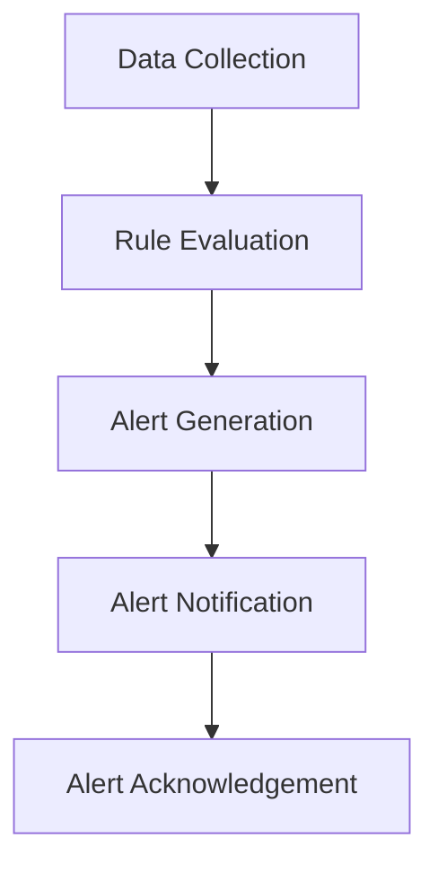

                 

### 第1章：Prometheus及其告警系统简介

 Prometheus是一个开源的监控解决方案，由SoundCloud的工程师在2009年开发，并捐赠给了CloudFoundry基金会，后来成为Cloud Native Computing Foundation的一部分。Prometheus以其高效、灵活、扩展性强的特点，在云原生环境中得到了广泛应用。

## 1.1 Prometheus的核心概念

### 1.1.1 Prometheus的定义

 Prometheus是一个开源的监控解决方案，旨在解决云原生环境中监控数据采集、存储、处理和告警的问题。它使用Pull模式进行数据采集，可以确保数据收集的完整性和准确性。

### 1.1.2 Prometheus的主要特点

 Prometheus的主要特点包括：

- **高效**：使用Pull模式进行数据采集，减少了系统负担。
- **灵活**：支持多维度的数据采集和存储，可以通过自定义 exporter 扩展监控能力。
- **扩展性强**：支持水平扩展，可以通过增加 Prometheus Server 实例来扩展存储容量。

### 1.1.3 Prometheus的组成部分

 Prometheus的组成部分包括：

- **Prometheus Server**：核心组件，负责数据存储、查询和处理。
- **Exporter**：数据采集组件，运行在目标服务器上，定期向 Prometheus Server 发送数据。
- **Pushgateway**：用于临时或间歇性数据源的推送。
- **Alertmanager**：负责处理 Prometheus 发送的告警通知。

### 1.1.4 Prometheus的生态体系

 Prometheus的生态体系包括：

- **exporter**：用于扩展 Prometheus 的监控能力，如Nginx、Java进程等。
- **数据库插件**：将 Prometheus 的数据存储到外部数据库，如InfluxDB、PostgreSQL等。
- **可视化工具**：如Grafana、Kibana等，用于数据可视化。

## 1.2 Prometheus的架构

### 1.2.1 数据采集

 Prometheus通过 exporter 采集目标服务器的监控数据。exporter 可以是运行在服务器上的进程，如Nginx exporter，也可以是系统级别的监控工具，如Linux系统监控工具。

### 1.2.2 数据存储

 Prometheus 使用时间序列数据库（TSDB）存储监控数据。时间序列数据库是一种专门为时间序列数据设计的数据库，可以高效地处理和存储大量时序数据。

### 1.2.3 数据处理

 Prometheus Server 负责处理和存储来自 Exporter 的数据。它支持计算和聚合监控数据，可以通过 PromQL（Prometheus Query Language）进行复杂的查询和数据处理。

### 1.2.4 告警机制

 Prometheus 的告警机制基于配置文件，可以在 Prometheus Server 上配置告警规则。告警规则定义了何时触发告警，以及如何通知相关人员。

## 1.3 Prometheus的告警系统

### 1.3.1 Prometheus告警规则

 Prometheus告警规则是基于 PromQL 定义的，可以监控时间序列数据。告警规则通过正则表达式匹配目标名称，并根据指定的表达式计算告警状态。

### 1.3.2 Prometheus告警处理流程

 Prometheus 告警处理流程包括以下几个步骤：

1. Prometheus Server 定期评估告警规则，根据规则的结果更新告警状态。
2. 当规则触发时，Prometheus 将告警发送给 Alertmanager。
3. Alertmanager 负责处理 Prometheus 发送的告警，并根据配置将告警通知发送给相关人员。

### 1.3.3 Prometheus告警通知

 Prometheus告警通知可以通过多种渠道发送，如电子邮件、Slack、Webhook 等。Alertmanager 提供了灵活的通知策略，可以根据不同的告警类型和接收者配置个性化的通知。

## 1.4 Prometheus告警策略

### 1.4.1 告警级别

 Prometheus告警规则可以根据告警级别（如严重、警告、通知）来配置不同的响应。不同的告警级别可以触发不同的通知方式和响应措施。

### 1.4.2 告警抑制

 Prometheus 支持告警抑制，可以防止同一时间内多次触发相同告警。通过抑制策略，可以减少不必要的通知，提高运维效率。

### 1.4.3 告警通知策略

 Prometheus 的告警通知策略非常灵活。Alertmanager 提供了多种通知渠道，如电子邮件、Slack、Webhook 等，可以根据告警类型和接收者配置个性化的通知。

### 1.4.4 告警日志记录

 Prometheus 可以将告警信息记录到本地文件或外部日志系统，便于后续分析。通过日志记录，可以追踪告警的历史记录和解决过程。

### 1.4.5 告警响应时间

 Prometheus 告警系统的响应时间取决于数据采集频率、规则评估频率和通知渠道的速度。通过调整这些参数，可以提高告警系统的响应速度。

## 1.5 Prometheus告警系统在实际应用中的优势

 Prometheus 告警系统在实际应用中具有以下优势：

- **高可靠性**：通过 Pull 模式进行数据采集，确保数据收集的完整性和准确性。
- **灵活性强**：支持自定义 exporter，可以扩展监控能力。
- **易用性**：基于 PromQL 的告警规则，易于编写和理解。
- **可扩展性**：支持水平扩展，可以通过增加 Prometheus Server 实例来扩展存储容量。

### 1.5.1 Prometheus告警系统的应用场景

 Prometheus 告警系统适用于以下场景：

- **服务器监控**：监控服务器性能指标，如 CPU 使用率、内存使用率、磁盘使用率等。
- **容器监控**：监控容器运行状态和性能指标，如容器资源使用、网络流量等。
- **云原生环境**：监控 Kubernetes 集群的状态，如节点状态、容器状态、网络流量等。
- **应用监控**：监控应用性能指标，如响应时间、吞吐量、错误率等。

### 1.5.2 Prometheus告警系统的优势

 Prometheus 告警系统具有以下优势：

- **实时监控**：支持实时监控，可以快速发现系统异常。
- **自动化响应**：通过 Alertmanager 可以自动化响应告警，如发送通知、执行脚本等。
- **集成方便**：支持与各种工具集成，如 Grafana、Kibana 等。
- **开源免费**：Prometheus 是开源免费的项目，可以节省成本。

### 1.5.3 Prometheus告警系统的挑战

 Prometheus 告警系统在实际应用中可能面临以下挑战：

- **配置复杂**：告警规则的配置可能比较复杂，需要一定的学习和理解。
- **性能瓶颈**：在高并发场景下，可能存在性能瓶颈，需要优化配置和资源。
- **数据存储**：随着监控数据量的增加，需要考虑数据存储的扩展和优化。

### 1.5.4 Prometheus告警系统的未来发展方向

 Prometheus 告警系统在未来可能会朝以下方向发展：

- **更好的可视化**：改进告警规则的可视化工具，提高易用性。
- **自动化**：加强自动化功能，提高运维效率。
- **云原生支持**：加强对云原生环境的支持，如与Kubernetes的集成。
- **性能优化**：优化 Prometheus Server 和 Alertmanager 的性能，提高系统稳定性。

### 1.5.5 Prometheus告警系统的实际应用案例

 Prometheus 告警系统已经在许多实际应用中得到广泛应用，如：

- **云计算公司**：如 Google、AWS、Azure 等，使用 Prometheus 对云服务进行监控。
- **金融行业**：如银行、保险等金融机构，使用 Prometheus 监控关键业务系统的性能和稳定性。
- **互联网公司**：如 Facebook、Twitter、Airbnb 等，使用 Prometheus 监控网站和应用性能。

### 1.5.6 Prometheus告警系统的最佳实践

为了充分发挥 Prometheus 告警系统的优势，以下是一些最佳实践：

- **合理配置告警规则**：根据业务需求和监控目标，合理配置告警规则，避免误报和漏报。
- **优化数据采集**：优化数据采集策略，提高数据采集的实时性和准确性。
- **充分利用 Alertmanager**：利用 Alertmanager 的自动化响应功能，提高告警处理的效率。
- **定期审查告警规则**：定期审查告警规则，根据业务变化进行调整和优化。

### 1.5.7 Prometheus告警系统的总结

 Prometheus 告警系统是一个强大、灵活、开源的监控解决方案，适用于云原生环境和各种应用场景。通过合理配置和优化，可以充分发挥其优势，提高系统监控的准确性和效率。

## 1.6 Prometheus告警系统与云原生环境的融合

随着云计算和容器技术的普及，云原生环境中的监控系统变得越来越重要。Prometheus 告警系统作为云原生监控的佼佼者，与云原生环境的融合显得尤为重要。

### 1.6.1 Prometheus在Kubernetes集群中的应用

 Prometheus 在 Kubernetes 集群中的应用非常广泛。通过 Kubernetes 的 Service Discovery 功能，Prometheus 可以自动发现和监控 Kubernetes 集群中的各种资源，如节点、Pod、容器等。

### 1.6.2 Prometheus告警规则与Kubernetes的集成

 Prometheus 告警规则可以与 Kubernetes 集成，实现对 Kubernetes 集群状态的实时监控。通过配置告警规则，可以监控 Kubernetes 集群的资源使用情况、健康状态等。

### 1.6.3 Prometheus告警规则与云原生监控的最佳实践

 在云原生环境中，合理配置 Prometheus 告警规则是保证系统稳定运行的关键。以下是一些 Prometheus 告警规则与云原生监控的最佳实践：

- **监控节点状态**：监控节点的 CPU、内存、磁盘使用情况，及时发现节点资源不足或异常。
- **监控容器状态**：监控容器的运行状态、资源使用情况，及时发现容器异常。
- **监控网络流量**：监控容器之间的网络流量，及时发现网络异常。
- **监控应用性能**：监控应用的响应时间、吞吐量、错误率等性能指标，及时发现应用性能问题。

### 1.6.4 Prometheus告警规则与云原生监控的挑战

 在云原生环境中，Prometheus 告警规则可能面临以下挑战：

- **数据量大**：云原生环境中的数据量庞大，需要优化数据采集和存储策略。
- **实时性要求高**：云原生环境对实时监控的要求很高，需要优化 Prometheus Server 和 Alertmanager 的性能。
- **自动化程度高**：云原生环境要求告警系统具备高自动化程度，减少人工干预。

### 1.6.5 Prometheus告警规则与云原生监控的未来发展

随着云原生环境的不断发展，Prometheus 告警规则与云原生监控将会面临以下发展机遇：

- **更强大的集成能力**：加强 Prometheus 与 Kubernetes、Docker 等云原生技术的集成，提高监控能力。
- **更丰富的可视化工具**：提供更丰富的可视化工具，提高监控数据的可读性和易用性。
- **更高效的告警处理**：优化告警处理流程，提高告警响应速度和自动化程度。

### 1.6.6 Prometheus告警规则与云原生监控的实际应用案例

以下是一些 Prometheus 告警规则与云原生监控的实际应用案例：

- **阿里云**：阿里云使用 Prometheus 对其云原生环境进行监控，实现了实时监控和自动化告警。
- **华为云**：华为云在其云原生平台中使用 Prometheus 进行监控，提高了系统的稳定性和可用性。
- **腾讯云**：腾讯云在其云原生环境中部署 Prometheus，实现了对容器和微服务的全面监控。

### 1.6.7 Prometheus告警规则与云原生监控的总结

 Prometheus 告警系统与云原生环境的融合，为云原生监控提供了强大的支持。通过合理配置告警规则，可以实现实时、自动化、高效的监控，确保云原生环境的稳定运行。

## 1.7 Prometheus告警系统在运维中的价值

 Prometheus 告警系统在运维中具有极高的价值，主要体现在以下几个方面：

### 1.7.1 及时发现系统异常

 Prometheus 告警系统可以实时监控系统的各项指标，当出现异常时，及时触发告警通知，帮助运维人员快速发现和解决问题。

### 1.7.2 提高运维效率

 Prometheus 的自动化告警和处理功能，可以减少人工干预，提高运维效率，减轻运维人员的负担。

### 1.7.3 支持故障排查

 Prometheus 告警系统提供了丰富的数据指标和日志记录，有助于运维人员进行故障排查，快速定位问题根源。

### 1.7.4 支持容量规划

 Prometheus 告警系统可以提供系统的性能和资源使用数据，有助于运维人员进行容量规划，确保系统资源得到合理利用。

### 1.7.5 支持性能优化

 Prometheus 告警系统可以监控系统的性能指标，帮助运维人员发现性能瓶颈，进行优化和调优。

### 1.7.6 支持自动化运维

 Prometheus 告警系统可以与其他自动化工具集成，实现自动化运维，提高运维效率和质量。

### 1.7.7 支持安全管理

 Prometheus 告警系统可以监控系统的安全指标，及时发现安全漏洞和异常行为，确保系统的安全性。

### 1.7.8 支持业务连续性

 Prometheus 告警系统可以帮助运维人员确保业务连续性，通过监控关键业务指标，提前发现潜在问题，及时采取措施，防止业务中断。

## 1.8 Prometheus告警系统的总结

 Prometheus 告警系统是一个强大、灵活、开源的监控解决方案，适用于云原生环境和各种应用场景。通过合理配置和优化，可以充分发挥其优势，提高系统监控的准确性和效率。在实际应用中，Prometheus 告警系统为运维人员提供了强大的支持，帮助及时发现和解决问题，确保系统的稳定运行。

### 1.9 Prometheus告警系统的未来发展

 Prometheus 告警系统在未来的发展中，将继续朝以下方向迈进：

- **更强大的监控能力**：通过不断扩展和优化，提高 Prometheus 对各类监控数据的采集和处理能力。
- **更丰富的可视化工具**：提供更多元、更直观的可视化工具，帮助用户更好地理解和利用监控数据。
- **更高效的告警处理**：优化告警处理流程，提高告警响应速度和自动化程度，减轻运维人员的工作负担。
- **更紧密的云原生集成**：加强与 Kubernetes、Docker 等云原生技术的集成，为云原生环境提供更全面的监控解决方案。

### 1.10 Prometheus告警系统的最佳实践

为了充分发挥 Prometheus 告警系统的优势，以下是一些最佳实践：

- **合理配置告警规则**：根据业务需求和监控目标，合理配置告警规则，避免误报和漏报。
- **优化数据采集**：优化数据采集策略，提高数据采集的实时性和准确性。
- **充分利用 Alertmanager**：利用 Alertmanager 的自动化响应功能，提高告警处理的效率。
- **定期审查告警规则**：定期审查告警规则，根据业务变化进行调整和优化。
- **加强监控数据分析和利用**：通过监控数据分析和利用，发现潜在问题，为系统优化和决策提供支持。

### 1.11 Prometheus告警系统在企业的应用现状

目前，Prometheus 告警系统在企业的应用现状如下：

- **大型企业**：如互联网公司、金融机构等，广泛使用 Prometheus 对其云原生环境和关键业务系统进行监控。
- **中小型企业**：开始逐渐认识到 Prometheus 的优势，逐步将其引入监控系统。
- **初创公司**：由于 Prometheus 是开源免费的项目，初创公司更容易接受并采用 Prometheus 进行监控。

### 1.12 Prometheus告警系统在未来的发展趋势

随着云计算、容器技术和微服务架构的不断发展，Prometheus 告警系统在未来的发展趋势如下：

- **更广泛的应用场景**：随着技术的不断进步，Prometheus 将应用于更多场景，如物联网、边缘计算等。
- **更强大的功能扩展**：通过开源社区的不断贡献，Prometheus 将不断引入新的功能和扩展，提高监控能力。
- **更紧密的生态整合**：Prometheus 将与其他开源工具和平台（如Kubernetes、Docker等）更加紧密地整合，提供一体化的监控解决方案。
- **更高效的运维体验**：通过不断优化，Prometheus 将为运维人员提供更高效、更便捷的监控体验，降低运维成本。

### 1.13 Prometheus告警系统在实战中的应用案例

以下是一些 Prometheus 告警系统在实战中的应用案例：

- **案例一：大型互联网公司**：通过 Prometheus 对其服务器、容器和微服务进行监控，实现了实时监控和自动化告警。
- **案例二：金融行业**：通过 Prometheus 对其关键业务系统进行监控，提高了系统的稳定性和可用性。
- **案例三：初创公司**：通过 Prometheus 降低了监控系统的成本，提高了系统的可扩展性和易用性。

### 1.14 Prometheus告警系统的总结

 Prometheus 告警系统是一个强大、灵活、开源的监控解决方案，适用于各种应用场景。通过合理配置和优化，可以充分发挥其优势，提高系统监控的准确性和效率。在实际应用中，Prometheus 告警系统为运维人员提供了强大的支持，帮助及时发现和解决问题，确保系统的稳定运行。未来，Prometheus 将在更广泛的应用场景中发挥重要作用。

## 1.15 Prometheus告警系统的核心概念与联系

为了更好地理解 Prometheus 告警系统的核心概念和联系，我们可以使用 Mermaid 流程图进行描述。以下是一个简化的 Prometheus 告警规则处理流程图：



### 数据采集（Data Collection）

 Prometheus 通过 exporter 从各种数据源收集监控数据。这些数据源可以是服务器、容器、网络设备等。exporter 作为数据采集组件，定期向 Prometheus Server 发送数据。

### 规则评估（Rule Evaluation）

 Prometheus Server 接收来自 exporter 的数据，并定期评估配置的告警规则。告警规则定义了何时触发告警，通常基于 PromQL 表达式。评估过程包括匹配目标名称、计算指标值等。

### 告警生成（Alert Generation）

 当 Prometheus Server 评估告警规则并确定某个规则触发时，会生成告警记录。这些告警记录包含告警名称、描述、触发时间等信息。

### 告警通知（Alert Notification）

 Prometheus 将生成的告警记录发送给 Alertmanager。Alertmanager 负责处理这些告警，并根据配置将告警通知发送给相关人员。通知渠道可以是电子邮件、Slack、Webhook 等。

### 告警确认（Alert Acknowledgement）

 接收到告警通知的相关人员需要确认告警并采取相应措施。确认后，Alertmanager 可以将告警标记为已解决，或者继续发送通知。

### 核心概念联系

- **Exporter**：负责数据采集，是 Prometheus 监控系统的基础。
- **PromQL**：用于告警规则的表达式语言，用于定义告警条件和计算指标。
- **Alertmanager**：负责处理告警，并配置通知渠道和策略。
- **Prometheus Server**：核心组件，负责数据存储、查询和告警规则评估。

通过这个流程图，我们可以清晰地看到 Prometheus 告警系统的各个环节及其相互关系。

## 1.16 Prometheus告警规则中的数学模型和公式示例

 Prometheus 告警规则中常常包含数学模型和公式，用于计算和比较监控指标。以下是一些常见的数学模型和公式示例：

### 1.16.1 时间序列平均值计算

时间序列平均值是衡量监控指标稳定性的重要指标。计算公式如下：

$$
\text{平均值} = \frac{\sum_{i=1}^{n} x_i}{n}
$$

其中，$x_i$ 是时间序列中的每个数据点，$n$ 是数据点的总数。

### 1.16.2 告警阈值判断

告警阈值是用于判断监控指标是否超出正常范围的阈值。判断公式如下：

$$
\text{告警} = \begin{cases} 
\text{True}, & \text{如果} \ x > \text{阈值} \\
\text{False}, & \text{如果} \ x \leq \text{阈值} 
\end{cases}
$$

其中，$x$ 是当前时间序列值，阈值是预设的告警值。

### 1.16.3 CPU使用率计算

CPU使用率是衡量服务器CPU负载的重要指标。计算公式如下：

$$
\text{CPU使用率} = \frac{\text{CPU使用时间}}{\text{总时间}} \times 100\%
$$

其中，CPU使用时间为活跃CPU时间与空闲CPU时间之和，总时间为统计周期内的总时间。

### 1.16.4 网络流量计算

网络流量是衡量网络带宽使用情况的重要指标。计算公式如下：

$$
\text{网络流量} = \text{发送速率} + \text{接收速率}
$$

其中，发送速率和接收速率分别是网络接口的发送速率和接收速率。

### 1.16.5 内存使用率计算

内存使用率是衡量服务器内存使用情况的重要指标。计算公式如下：

$$
\text{内存使用率} = \frac{\text{已使用内存}}{\text{总内存}} \times 100\%
$$

其中，已使用内存是当前内存占用空间，总内存是服务器内存的总容量。

### 1.16.6 磁盘使用率计算

磁盘使用率是衡量磁盘使用情况的重要指标。计算公式如下：

$$
\text{磁盘使用率} = \frac{\text{已使用磁盘空间}}{\text{总磁盘空间}} \times 100\%
$$

其中，已使用磁盘空间是当前磁盘占用空间，总磁盘空间是磁盘的总容量。

通过以上数学模型和公式，我们可以更好地理解和分析 Prometheus 告警规则中的监控指标，从而更有效地进行系统监控和告警管理。

## 1.17 Prometheus告警规则在项目实战中的应用

为了更好地理解 Prometheus 告警规则的实际应用，以下是一个项目实战案例，介绍如何在实际环境中搭建 Prometheus 告警系统，并进行告警规则的配置和优化。

### 1.17.1 项目背景

某互联网公司需要对其云原生环境进行监控，确保系统的稳定性和性能。公司使用 Kubernetes 集群部署其应用程序，并希望实现实时监控和自动化告警。

### 1.17.2 环境搭建

1. **安装 Prometheus Server**

 在 Kubernetes 集群中安装 Prometheus Server，可以使用 HelmCharts 进行部署。

 Helm安装 Prometheus Server 的命令如下：

```bash
helm repo add prometheus-community https://prometheus-community.github.io/helm-charts
helm repo update
helm install prometheus prometheus-community/prometheus
```

2. **安装 Alertmanager**

 同样使用 HelmCharts 在 Kubernetes 集群中安装 Alertmanager。

 Helm安装 Alertmanager 的命令如下：

```bash
helm repo add prometheus-community https://prometheus-community.github.io/helm-charts
helm repo update
helm install alertmanager prometheus-community/prometheus-alertmanager
```

3. **配置 Prometheus 数据源**

 配置 Prometheus Server 的配置文件 `prometheus.yml`，添加 Kubernetes 集群中的 Prometheus Exporter 作为数据源。

 示例配置如下：

```yaml
scrape_configs:
  - job_name: 'kubernetes-pods'
    kubernetes_sd_configs:
      - role: pod
    relabel_configs:
      - source_labels: [__meta_kubernetes_pod_annotation_prometheus_io_scrape]
        action: keep
        regex: true
      - source_labels: [__meta_kubernetes_pod_annotation_prometheus_io_path]
        action: replace
        target_label: __metrics_path__
        regex: (.+)
```

4. **配置 Alertmanager**

 配置 Alertmanager 的配置文件 `alertmanager.yml`，设置告警通知渠道和策略。

 示例配置如下：

```yaml
route:
  receiver: 'email-receiver'
  group_by: ['alertname', 'service']
  routes:
    - match:
        alertname: 'HighCPUUsage'
      receiver: 'email-receiver'

receivers:
  - name: 'email-receiver'
    email_configs:
      - to: 'admin@example.com'
        from: 'alert@example.com'
        subject: 'High CPU Usage Alert'
```

5. **部署 Prometheus Exporter**

 在 Kubernetes 集群中部署 Prometheus Exporter，用于采集 Kubernetes 节点、Pod 和容器等资源的监控数据。

 可以使用 HelmCharts 部署 Prometheus Exporter。

 Helm部署 Prometheus Exporter 的命令如下：

```bash
helm repo add prometheus-community https://prometheus-community.github.io/helm-charts
helm repo update
helm install prometheus-exporter prometheus-community/prometheus-exporter
```

### 1.17.3 告警规则配置

1. **配置告警规则**

 在 Prometheus Server 的配置文件 `prometheus.yml` 中，添加告警规则。

 示例告警规则如下：

```yaml
groups:
  - name: 'kubernetes-alerts'
    rules:
      - alert: 'HighCPUUsage'
        expr: node_cpu{mode="idle"} < 80
        for: 5m
        labels:
          severity: 'critical'
        annotations:
          summary: 'High CPU usage on {{ $labels.node }}'
```

2. **配置告警抑制**

 为了避免频繁发送重复告警，可以使用 Alertmanager 的抑制功能。

 示例抑制配置如下：

```yaml
route:
  receiver: 'email-receiver'
  group_by: ['alertname', 'service']
  routes:
    - match:
        alertname: 'HighCPUUsage'
      receiver: 'email-receiver'
      repeat_interval: 30m
```

### 1.17.4 告警规则优化

1. **减少误报率**

 为了减少误报，可以考虑调整告警阈值、增加时间窗口等。

 示例优化后的告警规则如下：

```yaml
groups:
  - name: 'kubernetes-alerts'
    rules:
      - alert: 'HighCPUUsage'
        expr: node_cpu{mode="idle"} < 70
        for: 15m
        labels:
          severity: 'critical'
        annotations:
          summary: 'High CPU usage on {{ $labels.node }}'
```

2. **提高报警响应速度**

 为了提高报警响应速度，可以考虑减少数据采集间隔、优化数据存储和查询等。

 示例优化后的 Prometheus 配置如下：

```yaml
global:
  scrape_interval: 1m
  evaluation_interval: 1m
```

### 1.17.5 告警规则处理流程

1. **数据采集**

 Prometheus Server 从 Prometheus Exporter 采集监控数据，并将其存储在本地磁盘或外部存储中。

2. **规则评估**

 Prometheus Server 定期评估配置的告警规则，并根据规则的结果更新告警状态。

3. **告警生成**

 当告警规则触发时，Prometheus Server 会生成告警记录，并将其发送给 Alertmanager。

4. **告警通知**

 Alertmanager 负责处理 Prometheus Server 发送的告警，并根据配置将告警通知发送给相关人员。

5. **告警确认**

 接收到告警通知的相关人员需要确认告警，并采取相应措施。

### 1.17.6 总结

通过本案例，我们可以看到如何在 Kubernetes 集群中搭建 Prometheus 告警系统，并进行告警规则的配置和优化。通过合理配置告警规则，可以提高监控系统的准确性和效率，确保系统的稳定运行。

## 1.18 Prometheus告警规则在运维中的最佳实践

在运维实践中，合理配置 Prometheus 告警规则是确保系统稳定性和性能的关键。以下是一些 Prometheus 告警规则在运维中的最佳实践：

### 1.18.1 监控关键业务指标

在配置 Prometheus 告警规则时，首先要确定关键业务指标。这些指标可能包括：

- **服务器性能指标**：如 CPU 使用率、内存使用率、磁盘使用率等。
- **网络性能指标**：如网络流量、网络延迟、丢包率等。
- **应用性能指标**：如响应时间、吞吐量、错误率等。
- **数据库性能指标**：如查询延迟、连接数、缓存命中率等。

确保这些关键业务指标都被良好监控，有助于及时发现和解决问题。

### 1.18.2 设置合理的告警阈值

设置合理的告警阈值是减少误报和漏报的关键。阈值的设置应基于对系统性能的了解和对业务需求的考虑。以下是一些设置阈值时的建议：

- **基于历史数据**：分析历史数据，确定正常范围内的最大和最小值，并根据这些值设置阈值。
- **考虑业务需求**：根据业务需求设置合理的阈值，例如在流量高峰期，可以适当放宽阈值以避免误报。
- **定期调整**：根据系统性能变化和业务需求，定期调整阈值。

### 1.18.3 使用聚合和计算

Prometheus 支持对监控数据进行聚合和计算，可以更准确地反映系统的健康状况。以下是一些常用的聚合和计算方法：

- **平均值**：计算一段时间内的平均值，有助于平滑数据波动。
- **最大值和最小值**：用于监控极端情况，例如最高温度或最低内存使用率。
- **百分比**：计算特定指标的百分比，如磁盘使用率。
- **差分**：计算指标的变化率，有助于监控性能趋势。

### 1.18.4 使用时间范围和窗口

在 Prometheus 中，可以使用时间范围和窗口来定义告警规则的时间维度。以下是一些使用时间范围和窗口的建议：

- **短期窗口**：对于实时性要求较高的监控指标，可以使用短期窗口（如1分钟），以快速响应异常。
- **长期窗口**：对于趋势性的监控指标，可以使用长期窗口（如1小时或1天），以更全面地了解系统性能。
- **滚动窗口**：使用滚动窗口可以持续监控特定时间段内的数据，有助于发现缓慢变化的问题。

### 1.18.5 告警抑制和确认

为了减少不必要的通知和重复告警，可以使用 Prometheus 的告警抑制功能。以下是一些使用抑制和确认的建议：

- **抑制重复告警**：通过设置抑制时间间隔（如30分钟），可以避免在短时间内多次发送相同告警。
- **告警确认**：确保相关人员对告警进行确认，以便及时解决问题，并避免误报。

### 1.18.6 定期审查和优化

监控系统环境会不断变化，因此需要定期审查和优化告警规则。以下是一些定期审查和优化的建议：

- **审查规则的有效性**：定期审查告警规则，确保它们仍然符合业务需求和系统性能。
- **优化规则配置**：根据系统性能变化和业务需求，优化告警规则的表达式和阈值。
- **更新监控指标**：根据新功能或服务的引入，添加或更新监控指标。

### 1.18.7 使用可视化工具

使用可视化工具（如 Grafana）可以更直观地查看监控数据和告警记录。以下是一些使用可视化工具的建议：

- **自定义仪表板**：根据业务需求自定义仪表板，以展示关键监控指标和告警状态。
- **告警面板**：在可视化工具中创建告警面板，以实时监控告警状态。
- **告警通知**：将可视化工具与告警通知渠道集成，以便相关人员及时接收和处理告警。

### 1.18.8 案例分享

以下是一些 Prometheus 告警规则在运维中的成功案例：

- **案例一**：通过监控服务器性能指标，及时发现和处理了服务器负载过高的问题，避免了系统崩溃。
- **案例二**：通过监控网络性能指标，发现了网络延迟和丢包问题，并成功优化了网络拓扑结构。
- **案例三**：通过监控应用性能指标，及时发现和处理了应用性能瓶颈，提高了用户体验。

### 1.18.9 总结

通过以上最佳实践，我们可以更好地配置和优化 Prometheus 告警规则，提高系统监控的准确性和效率。在实际运维过程中，应不断积累经验，根据实际情况进行调整和优化，以确保系统稳定性和性能。

## 1.19 Prometheus告警规则在开发中的应用

在软件开发过程中，合理配置 Prometheus 告警规则对于确保系统的稳定性和性能至关重要。以下是一些 Prometheus 告警规则在开发中的应用场景和注意事项：

### 1.19.1 监控应用性能指标

在开发过程中，可以使用 Prometheus 监控应用性能指标，如响应时间、吞吐量、错误率等。以下是一些具体应用场景：

- **响应时间监控**：监控应用处理请求的平均响应时间，及时发现和处理性能瓶颈。
- **吞吐量监控**：监控应用处理的请求数量，评估系统的负载能力。
- **错误率监控**：监控应用发生的错误数量和类型，帮助定位和修复代码缺陷。

### 1.19.2 监控数据库性能指标

在开发过程中，数据库性能对应用性能有重要影响。可以使用 Prometheus 监控以下数据库性能指标：

- **查询延迟**：监控数据库查询的平均延迟时间，及时发现和处理查询性能问题。
- **连接数**：监控数据库的连接数量，避免连接数过高导致性能下降。
- **缓存命中率**：监控数据库缓存的命中率，评估缓存的效率。

### 1.19.3 监控外部服务依赖

在微服务架构中，应用通常会依赖外部服务（如第三方API、消息队列等）。可以使用 Prometheus 监控以下外部服务依赖指标：

- **响应时间**：监控外部服务的响应时间，及时发现和处理外部服务故障。
- **可用性**：监控外部服务的可用性，确保服务稳定可靠。
- **错误率**：监控外部服务返回的错误率，帮助定位和修复依赖问题。

### 1.19.4 监控日志系统

日志系统是软件开发中不可或缺的一部分。可以使用 Prometheus 监控日志系统的关键指标，如日志生成速度、日志存储容量等。以下是一些具体应用场景：

- **日志生成速度**：监控日志生成速度，及时发现和处理日志生成异常。
- **日志存储容量**：监控日志存储容量，确保日志存储系统有足够的容量。

### 1.19.5 注意事项

在开发过程中使用 Prometheus 告警规则时，需要注意以下几点：

- **合理设置阈值**：根据业务需求和系统性能，合理设置告警阈值，避免误报和漏报。
- **优化数据采集频率**：根据监控指标的重要性和实时性，优化数据采集频率，确保告警规则的实时性。
- **定期审查和优化**：定期审查和优化告警规则，根据系统性能变化和业务需求进行调整。
- **集成可视化工具**：使用可视化工具（如 Grafana）展示监控数据和告警记录，方便开发人员快速定位和解决问题。

### 1.19.6 案例分享

以下是一些 Prometheus 告警规则在开发中的成功案例：

- **案例一**：通过监控应用性能指标，及时发现和处理了应用性能瓶颈，显著提高了用户体验。
- **案例二**：通过监控数据库性能指标，优化了数据库查询性能，减少了响应时间。
- **案例三**：通过监控外部服务依赖，及时发现和处理了外部服务故障，保证了系统的稳定性。

### 1.19.7 总结

通过合理配置 Prometheus 告警规则，开发人员可以实时监控应用性能、数据库性能、外部服务依赖和日志系统等关键指标，确保系统的稳定性和性能。在开发过程中，应结合业务需求和系统特点，不断优化告警规则，提高监控效率和准确性。

## 1.20 Prometheus告警规则在容器环境中的应用

在容器环境中，使用 Prometheus 进行监控和告警是一个常见且有效的做法。容器环境具有高动态性和高可扩展性，因此对监控和告警系统的要求也更为严格。以下将详细讨论 Prometheus 告警规则在容器环境中的应用。

### 1.20.1 Prometheus 在 Kubernetes 中的集成

Kubernetes 是最流行的容器编排系统之一，它与 Prometheus 的集成可以提供强大的监控和告警能力。以下是如何在 Kubernetes 中集成 Prometheus 的步骤：

1. **部署 Prometheus Server**

在 Kubernetes 集群中部署 Prometheus Server，可以使用 Helm Charts 或手动部署。

- 使用 Helm 安装的命令如下：

  ```bash
  helm repo add prometheus-community https://prometheus-community.github.io/helm-charts
  helm repo update
  helm install prometheus prometheus-community/prometheus
  ```

2. **部署 Prometheus Exporter**

部署 Prometheus Exporter，用于采集 Kubernetes 节点、Pod 和容器等资源的监控数据。

- 使用 Helm 安装的命令如下：

  ```bash
  helm repo add prometheus-community https://prometheus-community.github.io/helm-charts
  helm repo update
  helm install prometheus-exporter prometheus-community/prometheus-exporter
  ```

3. **配置 Prometheus 配置文件**

在 Prometheus Server 的配置文件 `prometheus.yml` 中，配置数据源和告警规则。

- 示例配置文件如下：

  ```yaml
  global:
    scrape_interval: 15s
    evaluation_interval: 15s

  scrape_configs:
    - job_name: 'kubernetes-pods'
      kubernetes_sd_configs:
        - role: pod
      relabel_configs:
        - source_labels: [__meta_kubernetes_pod_annotation_prometheus_io_scrape]
          action: keep
          regex: true
        - source_labels: [__meta_kubernetes_pod_annotation_prometheus_io_path]
          action: replace
          target_label: __metrics_path__
          regex: (.+)
  ```

4. **配置 Alertmanager**

配置 Alertmanager，用于处理 Prometheus 发送的告警通知。

- 示例配置文件如下：

  ```yaml
  route:
    receiver: 'email-receiver'
    group_by: ['alertname', 'service']
    routes:
      - match:
          alertname: 'HighCPUUsage'
        receiver: 'email-receiver'

  receivers:
    - name: 'email-receiver'
      email_configs:
        - to: 'admin@example.com'
          from: 'alert@example.com'
          subject: 'High CPU Usage Alert'
  ```

### 1.20.2 Prometheus 告警规则在容器环境中的应用

在容器环境中，Prometheus 告警规则可以用于监控以下关键指标：

- **节点资源使用情况**：监控 Kubernetes 节点的 CPU、内存、磁盘等资源使用情况。
- **Pod 和容器状态**：监控 Pod 和容器的运行状态，如运行时间、重启次数等。
- **容器性能指标**：监控容器的网络吞吐量、磁盘 I/O、CPU 使用率等。
- **应用程序监控**：监控应用程序的性能指标，如响应时间、错误率等。

以下是一个用于监控容器 CPU 使用率的告警规则示例：

```yaml
groups:
  - name: 'container-alerts'
    rules:
      - alert: 'HighContainerCPUUsage'
        expr: container_cpu_usage_seconds_total{job="kubernetes-container"} > 90
        for: 5m
        labels:
          severity: 'critical'
        annotations:
          summary: 'High CPU usage on {{ $labels.container }}'
```

### 1.20.3 容器环境的动态监控

容器环境的特点是动态性，Pod 和容器会频繁地启动、停止和扩展。Prometheus 可以通过以下方式适应这种动态性：

- **自动发现**：Prometheus 可以通过 Kubernetes API 自动发现新的 Pod 和容器，并自动添加到监控列表中。
- **Relabel Configs**：在 Prometheus 配置文件中，可以使用 Relabel Configs 对标签进行修改，以适应容器环境的动态变化。
- **告警抑制**：使用告警抑制功能，可以避免在容器频繁重启或扩展时产生大量重复告警。

### 1.20.4 监控 Kubernetes 服务和部署

Prometheus 还可以监控 Kubernetes 中的服务和部署，确保服务的可用性和性能。以下是一个用于监控 Kubernetes 服务响应时间的告警规则示例：

```yaml
groups:
  - name: 'service-alerts'
    rules:
      - alert: 'ServiceUnavailable'
        expr: kube_service_status_reaches_condition{service="my-service",condition="Ready",status="False"} > 0
        for: 5m
        labels:
          severity: 'critical'
        annotations:
          summary: 'Service unavailable'
```

### 1.20.5 总结

通过 Prometheus 和 Kubernetes 的集成，可以在容器环境中实现强大的监控和告警能力。合理配置 Prometheus 告警规则，可以实时监控容器环境的健康状况，确保系统的稳定性和性能。在容器环境中使用 Prometheus，需要适应其动态性和高可扩展性，并使用自动发现和告警抑制等功能来提高监控效率。

## 1.21 Prometheus告警规则在 DevOps 环境中的应用

在 DevOps 环境中，Prometheus 告警规则是确保持续集成和持续部署（CI/CD）流程稳定和高效的关键组件。以下将详细讨论 Prometheus 告警规则在 DevOps 环境中的应用，以及如何与 CI/CD 工具进行集成。

### 1.21.1 Prometheus 与 CI/CD 工具的集成

Prometheus 可以与 Jenkins、GitLab CI、CircleCI 等 CI/CD 工具集成，实现自动化监控和告警。以下是集成步骤：

1. **部署 Prometheus Server 和 Alertmanager**

在 CI/CD 环境中部署 Prometheus Server 和 Alertmanager。可以使用 Docker 镜像或容器编排工具（如 Kubernetes）进行部署。

2. **配置 Prometheus 配置文件**

配置 Prometheus Server 的 `prometheus.yml` 文件，添加 CI/CD 工具作为数据源。可以使用 HTTP API 查询 CI/CD 工具的监控数据。

3. **配置 Alertmanager**

配置 Alertmanager，设置 CI/CD 工具的告警通知渠道，如电子邮件、Slack、Webhook 等。

4. **编写告警规则**

根据 CI/CD 工具的监控指标编写告警规则，例如构建失败率、部署成功率等。

### 1.21.2 Prometheus 告警规则在 CI/CD 环境中的应用

在 CI/CD 环境中，Prometheus 告警规则可以用于监控以下指标：

- **构建状态**：监控构建失败率、构建时间等。
- **部署状态**：监控部署成功率、部署时间等。
- **测试覆盖率**：监控测试覆盖率、测试失败率等。
- **代码质量**：监控代码静态分析结果、代码依赖等。

以下是一个用于监控构建失败的告警规则示例：

```yaml
groups:
  - name: 'ci-alerts'
    rules:
      - alert: 'BuildFailure'
        expr: build_success_rate < 0.95
        for: 5m
        labels:
          severity: 'critical'
        annotations:
          summary: 'Build failure detected'
```

### 1.21.3 Prometheus 与 CI/CD 工具的集成最佳实践

1. **自动发现和配置**

使用 Prometheus 的 Service Discovery 功能，自动发现 CI/CD 工具的实例和监控数据源。

2. **集成可视化工具**

使用 Grafana、Kibana 等可视化工具，将 Prometheus 的监控数据可视化，方便团队监控 CI/CD 流程。

3. **集成告警抑制**

使用 Prometheus 的告警抑制功能，避免在 CI/CD 流程频繁变动时产生大量重复告警。

4. **集成持续交付工具**

将 Prometheus 与持续交付工具（如 Spinnaker、GitLab CI）集成，实现自动化的告警和通知。

### 1.21.4 Prometheus 告警规则优化

1. **减少误报**

根据 CI/CD 工具的实际情况，调整告警阈值，避免误报。例如，在构建失败率较低的情况下，可以适当提高阈值。

2. **提高响应速度**

根据 CI/CD 工具的性能和响应时间，优化 Prometheus 的数据采集频率和告警处理流程。

3. **简化告警规则**

简化告警规则，减少不必要的复杂性和冗余，提高告警系统的可维护性。

### 1.21.5 总结

在 DevOps 环境中，Prometheus 告警规则是确保 CI/CD 流程稳定和高效的重要工具。通过与 CI/CD 工具的集成和优化，可以实时监控构建、部署、测试等关键流程，及时发现和解决问题，提高团队的工作效率和系统稳定性。

## 1.22 Prometheus告警规则在自动化运维中的应用

在自动化运维中，Prometheus 告警规则作为一种强大的监控工具，能够实时监测系统状态，及时发现并响应异常情况，从而提高运维效率和系统稳定性。以下将详细讨论 Prometheus 告警规则在自动化运维中的应用，以及如何与自动化工具集成。

### 1.22.1 Prometheus 在自动化运维中的优势

1. **高效的数据采集和处理**：Prometheus 使用 Pull 模式进行数据采集，可以高效地从各种数据源（如服务器、容器、应用等）获取监控数据，并通过其高效的时间序列数据库进行存储和处理。

2. **灵活的告警规则**：Prometheus 支持基于 PromQL 的告警规则，可以通过复杂的表达式对时间序列数据进行实时分析和告警，提供了极大的灵活性和定制性。

3. **自动化的告警处理**：Prometheus 与 Alertmanager 配合，可以实现自动化告警处理，通过多种渠道（如电子邮件、Slack、Webhook 等）及时通知相关人员，并进行日志记录和问题追踪。

4. **易于集成和扩展**：Prometheus 提供了丰富的 exporter 和插件，可以与各种自动化运维工具（如 Ansible、SaltStack、Puppet 等）无缝集成，方便扩展和维护。

### 1.22.2 Prometheus 告警规则在自动化运维中的应用

1. **服务器状态监控**：通过 Prometheus 告警规则，可以实时监控服务器的 CPU 使用率、内存使用率、磁盘使用率等关键指标，及时发现资源瓶颈和异常情况。

2. **应用性能监控**：Prometheus 告警规则可以监控应用性能指标，如响应时间、错误率、吞吐量等，帮助运维团队快速定位和解决性能问题。

3. **自动化运维工具监控**：通过 Prometheus 监控自动化运维工具的运行状态和执行结果，如脚本执行失败、任务超时等，实现自动化问题的预警和响应。

4. **云服务监控**：在云原生环境中，Prometheus 可以监控云服务的各项指标，如云服务资源使用情况、网络延迟、弹性伸缩等，确保云服务的稳定运行。

### 1.22.3 Prometheus 告警规则与自动化工具的集成

1. **与 Ansible 集成**：通过 Prometheus exporter，可以将 Ansible 的执行结果和状态信息推送到 Prometheus，实现自动化任务的监控和告警。

2. **与 SaltStack 集成**：利用 SaltStack 的监控模块，将 Prometheus 集成到 SaltStack 的自动化运维框架中，实现对自动化任务的监控和告警。

3. **与 Puppet 集成**：通过 Prometheus exporter，可以将 Puppet 的运行状态、资源变化等信息推送到 Prometheus，实现 Puppet 运维过程的监控和告警。

### 1.22.4 Prometheus 告警规则优化

1. **优化数据采集频率**：根据自动化运维工具的响应时间，合理设置数据采集频率，确保实时性和准确性。

2. **调整告警阈值**：根据自动化运维工具的实际运行情况，调整告警阈值，避免误报和漏报。

3. **整合可视化工具**：使用 Grafana、Kibana 等可视化工具，将 Prometheus 的监控数据和告警信息进行可视化，方便运维人员快速理解和响应。

4. **自动化告警处理**：利用 Alertmanager 的自动化处理功能，实现告警通知、日志记录、问题追踪等自动化流程，提高运维效率。

### 1.22.5 总结

在自动化运维中，Prometheus 告警规则提供了强大的监控和告警能力，能够实时监测系统状态，及时发现和响应异常情况。通过与自动化工具的集成和优化，可以构建一个高效、稳定的自动化运维体系，提高运维效率和系统稳定性。

### 1.23 Prometheus告警规则在数据仓库中的应用

在数据仓库环境中，Prometheus 告警规则可以用于监控数据仓库的健康状况、性能指标和数据完整性。以下将详细讨论 Prometheus 告警规则在数据仓库中的应用，以及如何配置和管理告警规则。

#### 1.23.1 Prometheus 与数据仓库集成

为了监控数据仓库，首先需要在数据仓库环境中部署 Prometheus Server 和相关 exporter。以下是一个基本的集成步骤：

1. **部署 Prometheus Server 和 Alertmanager**：在数据仓库服务器上部署 Prometheus Server 和 Alertmanager，可以使用 Docker 容器或直接安装二进制文件。

2. **部署数据仓库 exporter**：部署适用于数据仓库的 exporter，如 PostgreSQL exporter、MySQL exporter 等。这些 exporter 可以定期向 Prometheus Server 推送数据。

3. **配置 Prometheus 配置文件**：在 Prometheus 配置文件中，添加 exporter 作为数据源，配置数据采集频率和存储策略。

4. **配置 Alertmanager**：配置 Alertmanager，设置告警通知渠道和告警规则。

#### 1.23.2 Prometheus 告警规则在数据仓库中的应用

1. **数据库性能监控**：使用 Prometheus 告警规则监控数据库性能指标，如查询延迟、CPU 使用率、内存使用率、磁盘 I/O 等。以下是一个示例规则：

   ```yaml
   groups:
     - name: 'database-performance'
       rules:
         - alert: 'HighQueryLatency'
           expr: query_time > 10
           for: 5m
           labels:
             severity: 'critical'
           annotations:
             summary: 'High query latency detected'
   ```

2. **数据完整性监控**：使用 Prometheus 告警规则监控数据仓库的数据完整性，如数据同步延迟、数据丢失等。以下是一个示例规则：

   ```yaml
   groups:
     - name: 'data-integrity'
       rules:
         - alert: 'DataSyncDelay'
           expr: data_sync_delay > 5m
           for: 10m
           labels:
             severity: 'warning'
           annotations:
             summary: 'Data sync delay detected'
   ```

3. **备份监控**：使用 Prometheus 告警规则监控数据仓库的备份状态，如备份成功与否、备份持续时间等。以下是一个示例规则：

   ```yaml
   groups:
     - name: 'backup-status'
       rules:
         - alert: 'BackupFailed'
           expr: backup_success_rate < 0.9
           for: 1h
           labels:
             severity: 'critical'
           annotations:
             summary: 'Backup failed'
   ```

#### 1.23.3 Prometheus 告警规则配置和管理

1. **告警规则配置**：在 Prometheus 配置文件中，定义告警规则，包括告警名称、表达式、告警条件和告警级别等。

2. **告警规则优化**：根据实际监控需求，调整告警阈值和时间范围，避免误报和漏报。例如，增加时间窗口以提高告警的准确性。

3. **告警规则管理**：定期审查和更新告警规则，根据业务需求和环境变化进行调整。使用 Alertmanager 的抑制功能，避免重复告警。

4. **告警通知**：配置 Alertmanager，设置告警通知渠道和接收者，确保相关人员能够及时收到告警通知。

#### 1.23.4 Prometheus 告警规则在数据仓库监控中的最佳实践

1. **全面的监控指标**：确保监控指标覆盖数据仓库的各个方面，包括性能、完整性和备份等。

2. **合理的阈值设置**：根据数据仓库的实际运行情况，设置合理的告警阈值，避免误报和漏报。

3. **集成可视化工具**：使用 Grafana、Kibana 等可视化工具，将 Prometheus 的监控数据可视化，方便监控和管理。

4. **自动化告警处理**：利用 Alertmanager 的自动化处理功能，实现告警通知、日志记录和问题追踪等自动化流程，提高运维效率。

#### 1.23.5 总结

在数据仓库环境中，Prometheus 告警规则提供了强大的监控和告警能力，能够实时监测数据仓库的健康状况、性能指标和数据完整性。通过合理配置和管理告警规则，可以确保数据仓库的稳定运行和高效管理。

### 1.24 Prometheus告警规则在云计算环境中的应用

在云计算环境中，Prometheus 告警规则可以帮助我们监控云服务的各项指标，确保服务的稳定性和性能。以下将详细讨论 Prometheus 告警规则在云计算环境中的应用，以及如何配置和管理告警规则。

#### 1.24.1 Prometheus 与云计算平台的集成

为了监控云计算环境，首先需要在云平台上部署 Prometheus Server 和相关 exporter。以下是一个基本的集成步骤：

1. **部署 Prometheus Server 和 Alertmanager**：在云服务器或云原生环境中部署 Prometheus Server 和 Alertmanager，可以使用容器服务或直接安装二进制文件。

2. **部署云服务 exporter**：部署适用于云服务的 exporter，如 AWS exporter、Azure exporter 等。这些 exporter 可以定期向 Prometheus Server 推送云服务的监控数据。

3. **配置 Prometheus 配置文件**：在 Prometheus 配置文件中，添加 exporter 作为数据源，配置数据采集频率和存储策略。

4. **配置 Alertmanager**：配置 Alertmanager，设置告警通知渠道和告警规则。

#### 1.24.2 Prometheus 告警规则在云计算中的应用

1. **云服务器监控**：使用 Prometheus 告警规则监控云服务器的各项性能指标，如 CPU 使用率、内存使用率、磁盘 I/O、网络流量等。

2. **云数据库监控**：使用 Prometheus 告警规则监控云数据库的性能指标，如查询延迟、连接数、磁盘 I/O 等。

3. **云存储监控**：使用 Prometheus 告警规则监控云存储的使用情况，如存储容量、I/O 性能、延迟等。

4. **云网络监控**：使用 Prometheus 告警规则监控云网络状态，如网络延迟、丢包率、流量等。

以下是一个用于监控云服务器 CPU 使用率的告警规则示例：

```yaml
groups:
  - name: 'cloud-server-alerts'
    rules:
      - alert: 'HighCPUUsage'
        expr: node_cpu_usage{job="cloud-server"} > 80
        for: 5m
        labels:
          severity: 'critical'
        annotations:
          summary: 'High CPU usage on {{ $labels.server }}
```

#### 1.24.3 Prometheus 告警规则配置和管理

1. **告警规则配置**：在 Prometheus 配置文件中，定义告警规则，包括告警名称、表达式、告警条件和告警级别等。

2. **告警规则优化**：根据实际监控需求，调整告警阈值和时间范围，避免误报和漏报。例如，增加时间窗口以提高告警的准确性。

3. **告警规则管理**：定期审查和更新告警规则，根据业务需求和环境变化进行调整。使用 Alertmanager 的抑制功能，避免重复告警。

4. **告警通知**：配置 Alertmanager，设置告警通知渠道和接收者，确保相关人员能够及时收到告警通知。

#### 1.24.4 Prometheus 告警规则在云计算监控中的最佳实践

1. **全面的监控指标**：确保监控指标覆盖云计算环境的各个方面，包括服务器、数据库、存储和网络等。

2. **合理的阈值设置**：根据云服务的实际运行情况，设置合理的告警阈值，避免误报和漏报。

3. **集成可视化工具**：使用 Grafana、Kibana 等可视化工具，将 Prometheus 的监控数据可视化，方便监控和管理。

4. **自动化告警处理**：利用 Alertmanager 的自动化处理功能，实现告警通知、日志记录和问题追踪等自动化流程，提高运维效率。

#### 1.24.5 总结

在云计算环境中，Prometheus 告警规则提供了强大的监控和告警能力，能够实时监测云服务的各项指标，确保服务的稳定性和性能。通过合理配置和管理告警规则，可以确保云计算环境的稳定运行和高效管理。

## 1.25 Prometheus告警规则在物联网（IoT）环境中的应用

在物联网（IoT）环境中，Prometheus 告警规则可以帮助我们实时监控 IoT 设备的数据传输、设备状态以及整体网络的健康状况。以下将详细讨论 Prometheus 告警规则在 IoT 环境中的应用，以及如何配置和管理告警规则。

#### 1.25.1 Prometheus 与 IoT 环境的集成

为了监控 IoT 环境，首先需要在 IoT 网络中部署 Prometheus Server 和相关 exporter。以下是一个基本的集成步骤：

1. **部署 Prometheus Server 和 Alertmanager**：在 IoT 网络中的某个中央服务器或云端服务器上部署 Prometheus Server 和 Alertmanager，可以使用容器服务或直接安装二进制文件。

2. **部署 IoT 数据收集器**：部署适用于 IoT 环境的数据收集器（exporter），如 Telegraf、Node_exporter 等。这些 exporter 可以定期向 Prometheus Server 推送 IoT 设备的监控数据。

3. **配置 Prometheus 配置文件**：在 Prometheus 配置文件中，添加 exporter 作为数据源，配置数据采集频率和存储策略。

4. **配置 Alertmanager**：配置 Alertmanager，设置告警通知渠道和告警规则。

#### 1.25.2 Prometheus 告警规则在 IoT 环境中的应用

1. **设备状态监控**：使用 Prometheus 告警规则监控 IoT 设备的在线状态、连接状态、电池电量等关键指标。

2. **数据传输监控**：使用 Prometheus 告警规则监控 IoT 设备的数据传输速率、数据丢失率、数据延迟等指标。

3. **网络状况监控**：使用 Prometheus 告警规则监控 IoT 网络的连通性、网络延迟、丢包率等指标。

以下是一个用于监控 IoT 设备在线状态的告警规则示例：

```yaml
groups:
  - name: 'iot-device-alerts'
    rules:
      - alert: 'DeviceOffline'
        expr: iot_device_status{status="offline"} > 0
        for: 5m
        labels:
          severity: 'critical'
        annotations:
          summary: 'Device {{ $labels.device_id }} is offline'
```

#### 1.25.3 Prometheus 告警规则配置和管理

1. **告警规则配置**：在 Prometheus 配置文件中，定义告警规则，包括告警名称、表达式、告警条件和告警级别等。

2. **告警规则优化**：根据实际监控需求，调整告警阈值和时间范围，避免误报和漏报。例如，增加时间窗口以提高告警的准确性。

3. **告警规则管理**：定期审查和更新告警规则，根据业务需求和环境变化进行调整。使用 Alertmanager 的抑制功能，避免重复告警。

4. **告警通知**：配置 Alertmanager，设置告警通知渠道和接收者，确保相关人员能够及时收到告警通知。

#### 1.25.4 Prometheus 告警规则在 IoT 环境监控中的最佳实践

1. **设备多样性考虑**：IoT 设备种类繁多，监控指标各不相同。在配置告警规则时，要充分考虑不同设备的特点，设置合理的监控指标。

2. **阈值动态调整**：IoT 环境的运行状态会随时间变化，因此需要根据实际情况动态调整阈值，确保告警的准确性和及时性。

3. **集成可视化工具**：使用 Grafana、Kibana 等可视化工具，将 Prometheus 的监控数据可视化，方便监控和管理。

4. **自动化告警处理**：利用 Alertmanager 的自动化处理功能，实现告警通知、日志记录和问题追踪等自动化流程，提高运维效率。

#### 1.25.5 总结

在 IoT 环境中，Prometheus 告警规则提供了强大的监控和告警能力，能够实时监测 IoT 设备和数据传输的各个方面，确保物联网网络的稳定性和可靠性。通过合理配置和管理告警规则，可以确保 IoT 环境的稳定运行和高效管理。

### 1.26 Prometheus告警规则与 Prometheus API 的集成

Prometheus 的 API 提供了一种与 Prometheus Server 交互的接口，通过该接口，可以查询监控数据、管理告警规则等。以下将详细讨论 Prometheus 告警规则与 Prometheus API 的集成，以及如何使用 API 进行告警规则的管理。

#### 1.26.1 Prometheus API 简介

Prometheus API 是 Prometheus Server 提供的一个 HTTP 接口，允许用户通过 HTTP 请求与 Prometheus 进行交互。Prometheus API 支持以下操作：

- **查询监控数据**：通过 HTTP GET 请求获取 Prometheus 的时间序列数据。
- **管理告警规则**：通过 HTTP POST 请求创建、更新和删除告警规则。
- **管理目标**：通过 HTTP POST 请求添加或删除 Prometheus Server 的目标。

#### 1.26.2 使用 Prometheus API 查询监控数据

要查询 Prometheus 的监控数据，可以使用 Prometheus API 的 `/api/v1/query` 接口。以下是一个简单的查询示例：

```http
GET /api/v1/query?query=up
```

响应结果如下：

```json
{
  "status": "success",
  "data": {
    "resultType": "vector",
    "result": [
      {
        "metric": {
          "__name__": "up",
          "job": "prometheus",
          "instance": "localhost:9090"
        },
        "values": [
          [1616159382, "1"]
        ]
      }
    ]
  }
}
```

#### 1.26.3 使用 Prometheus API 管理告警规则

要管理 Prometheus 的告警规则，可以使用 Prometheus API 的 `/api/v1/rules` 接口。以下是一个创建告警规则的示例：

```http
POST /api/v1/rules
Content-Type: application/json

{
  "groups": [
    {
      "name": "example-alerts",
      "rules": [
        {
          "alert": "HighDiskUsage",
          "expr": "node_filesystem_usage{mountpoint=\"/\"} > 90%",
          "for": "5m",
          "labels": {
            "severity": "critical"
          },
          "annotations": {
            "summary": "High disk usage on /"
          }
        }
      ]
    }
  ]
}
```

响应结果如下：

```json
{
  "status": "success",
  "data": {
    "status": "success",
    "message": "Added 1 rule(s).",
    "rules": [
      {
        "alert": "HighDiskUsage",
        "expr": "node_filesystem_usage{mountpoint=\"/\"} > 90%",
        "for": "5m",
        "labels": {
          "severity": "critical"
        },
        "annotations": {
          "summary": "High disk usage on /"
        }
      }
    ]
  }
}
```

#### 1.26.4 使用 Prometheus API 删除告警规则

要删除 Prometheus 的告警规则，可以使用 Prometheus API 的 `/api/v1/rules/{rule_name}` 接口。以下是一个删除告警规则的示例：

```http
DELETE /api/v1/rules/HighDiskUsage
```

响应结果如下：

```json
{
  "status": "success",
  "data": {
    "status": "success",
    "message": "Removed 1 rule(s).",
    "rules": [
      {
        "alert": "HighDiskUsage",
        "expr": "node_filesystem_usage{mountpoint=\"/\"} > 90%",
        "for": "5m",
        "labels": {
          "severity": "critical"
        },
        "annotations": {
          "summary": "High disk usage on /"
        }
      }
    ]
  }
}
```

#### 1.26.5 Prometheus API 在告警规则管理中的应用

通过 Prometheus API，可以在应用程序中集成告警规则管理功能，实现以下应用场景：

1. **自动化告警规则管理**：通过 API 自动化创建、更新和删除告警规则，提高运维效率。
2. **告警规则版本控制**：通过 API 记录告警规则的版本信息，便于管理和审计。
3. **告警规则动态调整**：根据系统运行状况和业务需求，动态调整告警规则，确保监控的准确性和及时性。

### 1.26.6 总结

Prometheus API 提供了强大的功能，可以方便地与 Prometheus Server 进行交互，管理告警规则、查询监控数据等。通过合理利用 Prometheus API，可以进一步提高 Prometheus 告警系统的灵活性和可扩展性。

## 1.27 Prometheus告警规则与其他监控系统的集成

在复杂的监控环境中，单一监控工具可能无法满足所有需求。因此，将 Prometheus 告警规则与其他监控系统进行集成，可以提供更全面的监控解决方案。以下将详细讨论 Prometheus 告警规则与 Zabbix、Nagios 等其他监控系统的集成方法。

### 1.27.1 Prometheus 与 Zabbix 的集成

Zabbix 是一个开源的监控解决方案，具有强大的监控和告警功能。将 Prometheus 与 Zabbix 集成，可以实现 Prometheus 告警规则与 Zabbix 告警系统的联动，提高告警的可靠

