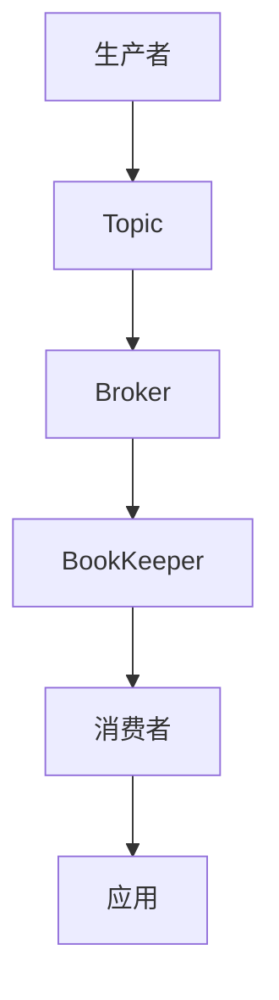
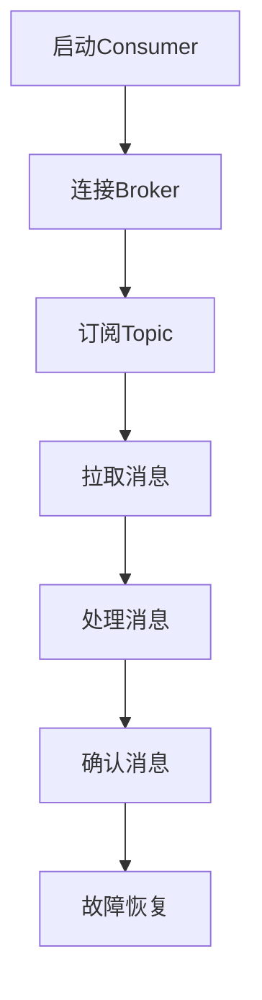

                 

### Pulsar Consumer原理与代码实例讲解

#### 摘要

本文将深入探讨Pulsar Consumer的原理，并通过代码实例对其进行详细讲解。Pulsar是一个高性能、可扩展的消息传递系统，其Consumer模块承担着消息消费的核心任务。本文将从Pulsar概述、术语与概念、部署与配置、Consumer原理、消息处理、性能优化以及代码实例等多个方面进行阐述，帮助读者全面理解Pulsar Consumer的工作机制及其实现方法。通过本文的学习，读者不仅可以掌握Pulsar Consumer的基本原理，还能学会如何通过代码实战来应用Pulsar进行高效的消息消费。

---

### 目录大纲

1. **Pulsar概述**
   - 1.1 Pulsar是什么
   - 1.2 Pulsar的优势与特点
   - 1.3 Pulsar的架构
2. **Pulsar术语与概念**
   - 2.1 Pulsar术语解释
   - 2.2 Pulsar消息模型
   - 2.3 Pulsar主题与分区
3. **Pulsar部署与配置**
   - 3.1 Pulsar集群部署
   - 3.2 Pulsar配置管理
   - 3.3 Pulsar监控与日志
4. **Pulsar Consumer原理**
   - 4.1 Pulsar Consumer架构
   - 4.2 Pulsar Consumer配置与参数
   - 4.3 Pulsar Consumer消息处理
   - 4.4 Pulsar Consumer性能优化
5. **Pulsar Consumer代码实例**
   - 5.1 创建Pulsar Consumer项目
   - 5.2 消息消费实现
   - 5.3 消息处理与日志记录
   - 5.4 性能测试与调优
   - 5.5 实战演练与总结
6. **附录**
   - 6.1 Pulsar资源与工具
   - 6.2 Pulsar常见问题解答

---

在接下来的章节中，我们将逐步深入讲解Pulsar Consumer的各个方面，从基础知识到高级应用，旨在帮助读者全面掌握Pulsar Consumer的原理和实践。让我们开始这段技术之旅吧！

---

#### 第1章：Pulsar概述

##### 1.1 Pulsar是什么

Pulsar是一个分布式、高吞吐量、高可用性的消息传递系统，旨在解决大规模分布式系统中的消息传递需求。它是由Apache软件基金会旗下的一个顶级开源项目。Pulsar的设计初衷是为了满足现代分布式系统的需求，如大数据处理、流处理、实时分析等。Pulsar通过其独特的架构和设计理念，提供了一种灵活、可靠且高效的消息传递解决方案。

##### 1.2 Pulsar的优势与特点

**高吞吐量**：Pulsar采用无锁架构，结合高效的序列化机制和存储优化策略，能够在高并发场景下实现极高的吞吐量。

**低延迟**：Pulsar通过减少消息传递中的中间环节，优化了消息传递路径，从而实现了低延迟的特性，特别适合对实时性要求较高的应用场景。

**分布式与可扩展性**：Pulsar支持水平扩展，能够轻松处理海量消息，同时具有良好的容错性和高可用性。

**灵活的消息模型**：Pulsar提供了顺序消息、事务消息和持久化消息等多种消息模型，满足不同应用场景的需求。

**高效的分区机制**：Pulsar通过分区机制实现了负载均衡和并行处理，提高了系统的性能和可扩展性。

**多语言支持**：Pulsar提供了丰富的客户端库，支持多种编程语言，如Java、Python、Go等，方便开发者使用。

##### 1.3 Pulsar的架构

Pulsar的核心架构包括以下几个关键组件：

**生产者（Producer）**：生产者是消息的发送者，负责将消息发送到Pulsar的Topic中。

**消费者（Consumer）**：消费者是消息的接收者，从Pulsar的Topic中消费消息。

**主题（Topic）**：主题是Pulsar中的消息分类，类似于Kafka中的Topic，用于分类和组织消息。

**分区（Partition）**：分区是Topic的一个划分，每个分区都包含一定数量的消息，分区实现了负载均衡和并行处理。

**Broker**：Broker是Pulsar集群中的节点，负责消息的路由和存储，是生产者和消费者之间的桥梁。

**BookKeeper**：BookKeeper是Pulsar的存储层，负责持久化消息和元数据，保证了数据的高可用性和持久性。

**Mermaid流程图**：



通过上述组件的协同工作，Pulsar实现了高效、可靠的消息传递系统。

---

在下一章中，我们将继续探讨Pulsar的术语与概念，帮助读者更好地理解Pulsar的核心机制和基本组件。

---

#### 第2章：Pulsar术语与概念

##### 2.1 Pulsar术语解释

在深入探讨Pulsar的架构和工作原理之前，理解一些关键的术语和概念是非常重要的。以下是Pulsar中常用的一些术语及其解释：

**Topic**：在Pulsar中，Topic是一个逻辑上的消息分类，类似于Kafka中的Topic。生产者将消息发布到Topic，消费者从Topic中消费消息。每个Topic可以包含多个Partition。

**Partition**：Partition是Topic的一个划分，每个Partition包含一组顺序的消息。Partition实现了负载均衡和并行处理，生产者和消费者可以独立于其他Partition处理自己的消息。

**Message**：Message是Pulsar中的基本数据单位，由头部和数据体两部分组成。头部包含消息的元数据，如消息ID、消息长度等，数据体是实际的消息内容。

**Producer**：Producer是消息的生产者，负责将消息发送到Pulsar的Topic中。Pulsar支持同步和异步两种发送方式，可以通过API来创建和发送消息。

**Consumer**：Consumer是消息的消费者，负责从Pulsar的Topic中消费消息。消费者可以通过订阅Topic来接收消息，并实现自定义的消息处理逻辑。

**Broker**：Broker是Pulsar集群中的节点，负责消息的路由和存储。每个Broker维护一个或多个Topic的Partition，处理生产者和消费者的请求。

**BookKeeper**：BookKeeper是Pulsar的存储层，负责持久化消息和元数据。它是一个分布式存储系统，保证了数据的高可用性和持久性。

**ConsumerGroup**：ConsumerGroup是一组协同工作的消费者，共享订阅的Topic和Partition。ConsumerGroup实现了负载均衡和故障恢复，确保消息被正确消费。

##### 2.2 Pulsar消息模型

Pulsar提供了多种消息模型，以满足不同应用场景的需求：

**顺序消息**：顺序消息保证同一Partition中的消息按照顺序被消费。这对于需要确保消息顺序的应用场景非常有用，如日志处理、订单处理等。

**事务消息**：事务消息支持消息的原子性操作，允许将多个消息作为一个事务进行处理。事务消息确保要么所有消息都成功处理，要么都不处理，这对于需要保证数据一致性的应用场景非常有用。

**持久化消息**：持久化消息确保消息在服务器故障或重启后仍然可以被消费。持久化消息对于需要保证消息可靠性和持久性的应用场景非常有用。

##### 2.3 Pulsar主题与分区

**主题**：主题是Pulsar中逻辑上的消息分类，类似于Kafka中的Topic。每个主题可以包含多个分区，分区实现了负载均衡和并行处理。生产者和消费者可以通过Topic来发布和消费消息。

**分区**：分区是Topic的一个划分，每个分区包含一组顺序的消息。Pulsar通过分区实现了负载均衡和并行处理，生产者和消费者可以独立于其他分区处理自己的消息。每个分区都分配给一个Broker进行管理。

**分区策略**：Pulsar提供了多种分区策略，如基于消息属性、基于哈希等。分区策略决定了如何将消息分配到不同的分区，从而实现负载均衡和并行处理。

**主题与分区的关系**：一个主题可以包含多个分区，每个分区都包含一组顺序的消息。生产者可以通过Topic发布消息到分区，消费者可以通过订阅Topic从分区中消费消息。

---

在下一章中，我们将探讨Pulsar的部署与配置，帮助读者了解如何在生产环境中部署和配置Pulsar集群。

---

#### 第3章：Pulsar部署与配置

##### 3.1 Pulsar集群部署

Pulsar集群的部署可以分为单机部署和集群部署两种方式。单机部署主要用于开发和测试环境，而集群部署则适用于生产环境，以提供高可用性和高吞吐量的消息传递服务。

**单机部署**：

单机部署非常简单，只需要在一个节点上启动所有Pulsar组件。以下是单机部署的步骤：

1. **安装Java环境**：确保Java环境已安装，版本至少为Java 8或更高版本。
2. **下载Pulsar二进制包**：从Pulsar的官方网站下载最新版本的Pulsar二进制包。
3. **解压二进制包**：将下载的Pulsar二进制包解压到合适的位置。
4. **启动Pulsar集群**：运行以下命令启动Pulsar集群：
   ```shell
   ./bin/pulsar start all
   ```
   这将启动Pulsar的Broker和BookKeeper服务。

**集群部署**：

集群部署需要多个节点，每个节点上启动一个或多个Pulsar组件。以下是集群部署的步骤：

1. **规划集群节点**：确定集群的规模和节点分配，确保每个节点都具备足够的资源。
2. **安装Java环境**：确保所有节点上都已经安装了Java环境，版本至少为Java 8或更高版本。
3. **分发Pulsar二进制包**：将Pulsar二进制包分发到所有节点，并解压到合适的目录。
4. **配置Pulsar集群**：编辑每个节点的`conf/cluster.conf`文件，配置集群的元数据存储位置和节点列表。
5. **配置ZooKeeper**：如果使用ZooKeeper进行元数据存储，需要配置ZooKeeper集群，并确保所有节点能够正常通信。
6. **启动Pulsar集群**：在每个节点上运行以下命令启动Pulsar集群：
   ```shell
   ./bin/pulsar start all
   ```

**集群规模扩展**：

Pulsar集群可以根据需求进行水平扩展，以增加处理能力和吞吐量。以下是扩展集群的步骤：

1. **添加新节点**：向集群中添加新节点，确保新节点具备足够的资源。
2. **配置新节点**：在`conf/cluster.conf`文件中添加新节点的地址和端口，确保所有节点能够正常通信。
3. **启动新节点**：在新节点上运行以下命令启动Pulsar集群：
   ```shell
   ./bin/pulsar start all
   ```
4. **调整分区策略**：根据新节点的数量和资源情况，调整Pulsar的分区策略，以实现负载均衡。

---

##### 3.2 Pulsar配置管理

Pulsar的配置管理是通过配置文件和命令行参数来实现的。配置文件位于`conf`目录下，包括`pulsar-conf.properties`、`bookkeeper-conf.properties`等。以下是一些常用的配置项及其作用：

- `broker.service.url`: Broker的服务地址，用于生产者和消费者的连接。
- `broker.enabled-bookkeeper-token-providers`: 是否启用BookKeeper token provider，用于访问BookKeeper存储。
- `bookkeeper.client.namenodes`: BookKeeper的名字节点地址，用于访问BookKeeper集群。
- `bookkeeper.client.zks`: BookKeeper的ZooKeeper集群地址，用于元数据存储和监控。

配置文件可以在集群部署时进行修改，也可以通过命令行参数进行动态配置。以下是一些常用的命令行参数：

- `-m`: 指定Pulsar配置文件路径。
- `-c`: 指定BookKeeper配置文件路径。
- `-z`: 指定ZooKeeper配置文件路径。

---

##### 3.3 Pulsar监控与日志

Pulsar提供了丰富的监控和日志功能，可以帮助管理员实时监控集群状态和性能，以及快速诊断和解决问题。

**监控工具**：

Pulsar集成了Prometheus和Grafana等监控工具，可以通过Prometheus服务器收集集群的监控数据，并通过Grafana进行可视化展示。以下是一些常用的监控指标：

- `broker.producer.destination`: 生产者发送消息的数量。
- `broker.consumer.destination`: 消费者接收消息的数量。
- `bookkeeper.client.operation.time`: BookKeeper客户端操作的平均响应时间。

**日志收集**：

Pulsar的日志默认输出到控制台，但也可以通过配置将日志收集到集中日志系统中。以下是一些常用的日志收集工具：

- `log4j2.conf`: 配置Pulsar日志输出格式和日志级别。
- `logstash.conf`: 配置Logstash，将Pulsar日志发送到Elasticsearch或Kibana等集中日志系统。

**日志分析**：

通过日志分析工具，可以对Pulsar集群的运行情况进行实时监控和故障诊断。以下是一些常用的日志分析工具：

- `logstash`: 将Pulsar日志转换为JSON格式，并将其发送到Elasticsearch或Kibana。
- `Elasticsearch`: 用于存储和检索Pulsar日志，并提供强大的全文搜索功能。
- `Kibana`: 用于可视化展示Pulsar日志数据，帮助管理员快速定位问题和趋势。

---

在下一章中，我们将深入探讨Pulsar Consumer的架构和工作原理，帮助读者理解Pulsar Consumer的核心机制。

---

#### 第4章：Pulsar Consumer原理

##### 4.1 Pulsar Consumer架构

Pulsar Consumer是消息传递系统中的一个关键组件，负责从Pulsar集群中消费消息并处理消息。Pulsar Consumer的架构设计旨在实现高效、可靠的消息消费，支持高并发和负载均衡。以下是Pulsar Consumer的主要组件和它们的工作流程：

**主要组件**：

1. **Consumer**：Consumer是Pulsar消息消费的核心组件，负责从Topic中拉取消息并处理消息。
2. **ConsumerGroup**：ConsumerGroup是一组协同工作的Consumer，共享订阅的Topic和Partition。ConsumerGroup实现了负载均衡和故障恢复。
3. **Broker**：Broker是Pulsar集群中的节点，负责消息的路由和存储。Broker维护了Topic和Partition的信息，并处理Consumer的请求。
4. **BookKeeper**：BookKeeper是Pulsar的存储层，负责持久化消息和元数据。BookKeeper保证了数据的高可用性和持久性。

**工作流程**：

1. **启动Consumer**：Consumer启动时，首先连接到Broker进行注册，并获取Topic和Partition的信息。
2. **订阅Topic**：Consumer订阅Topic，并指定分区分配策略。Pulsar支持轮询分配、哈希分配等分区策略。
3. **拉取消息**：Consumer从Broker拉取消息，并按照分配策略处理消息。
4. **处理消息**：Consumer对拉取到的消息进行业务处理，如存储、计算等。
5. **确认消息**：Consumer处理完消息后，向Broker发送确认消息，表示消息已被成功消费。
6. **故障恢复**：如果Consumer出现故障，其他Consumer可以自动接管其分区，实现故障恢复和负载均衡。

**Mermaid流程图**：



---

##### 4.2 Pulsar Consumer的组件与角色

在Pulsar Consumer的架构中，各个组件扮演着不同的角色，协同工作以实现高效、可靠的消息消费。以下是Pulsar Consumer的主要组件及其角色：

**Consumer**：

Consumer是Pulsar消息消费的核心组件，负责从Topic中拉取消息并处理消息。Consumer启动时，会连接到Broker进行注册，并获取Topic和Partition的信息。Consumer通过拉取消息并处理消息，实现了消息的消费。

**ConsumerGroup**：

ConsumerGroup是一组协同工作的Consumer，共享订阅的Topic和Partition。ConsumerGroup实现了负载均衡和故障恢复。在Pulsar中，多个Consumer可以组成一个ConsumerGroup，共同消费一个Topic的消息。ConsumerGroup通过负载均衡策略，将分区分配给不同的Consumer，实现了并行处理和负载均衡。

**Broker**：

Broker是Pulsar集群中的节点，负责消息的路由和存储。Broker维护了Topic和Partition的信息，并处理Consumer的请求。Broker在消息传递过程中，起到消息路由器的作用，将消息从生产者路由到消费者。同时，Broker还负责消息的持久化存储，保证消息的可靠性。

**BookKeeper**：

BookKeeper是Pulsar的存储层，负责持久化消息和元数据。BookKeeper是一个分布式存储系统，保证了数据的高可用性和持久性。BookKeeper通过多个Bookie节点的集群存储数据，实现了数据的冗余和容错。Pulsar通过BookKeeper存储消息和元数据，保证了消息的可靠性和持久性。

---

##### 4.3 Pulsar Consumer的核心API

Pulsar Consumer的核心API包括订阅Topic、拉取消息、处理消息、确认消息和消费组管理。以下是对这些核心API的详细介绍：

**订阅Topic**：

```java
Consumer<String> consumer = pulsarClient.subscribe(
    "persistent://public/default/my-topic",
    "my-subscription-name",
    new StringSchema());
```

上述代码示例展示了如何使用Pulsar客户端订阅一个持久化的Topic。通过调用`subscribe`方法，消费者可以订阅指定Topic和订阅名称。Pulsar支持持久化订阅和临时订阅，持久化订阅可以在消费者断开连接后重新连接时继续消费未处理的消息。

**拉取消息**：

```java
while (true) {
    Message<String> msg = consumer.receive();
    System.out.println("Received message: " + msg.getData());
    consumer.acknowledge(msg);
}
```

上述代码示例展示了如何使用Pulsar客户端拉取消息。通过调用`receive`方法，消费者可以拉取下一个可用的消息。每次调用`receive`方法，消费者都会从订阅的Topic中获取一条消息，并返回一个`Message`对象。`Message`对象包含消息的头部和数据体。

**处理消息**：

```java
public void processMessage(String message) {
    // 业务处理逻辑
}
```

在处理消息时，消费者需要对拉取到的消息进行业务处理。这包括解析消息、执行相关操作、存储结果等。处理消息的逻辑可以根据具体应用场景进行定制。

**确认消息**：

```java
public void acknowledge(Message<String> msg) {
    consumer.acknowledge(msg);
}
```

在处理完消息后，消费者需要调用`acknowledge`方法确认消息已被成功消费。确认消息可以确保消息不会被再次消费，从而保证消息的准确性和一致性。

**消费组管理**：

```java
ConsumerGroup<String> group = pulsarClient.getConsumerGroup("my-topic", "my-subscription-name");
group.close();
```

通过`getConsumerGroup`方法，消费者可以获取一个`ConsumerGroup`对象，用于管理消费组。消费组实现了负载均衡和故障恢复，消费者可以在消费组中协同工作。调用`close`方法可以关闭消费组，释放资源。

---

在下一章中，我们将深入探讨Pulsar Consumer的配置与参数，帮助读者了解如何优化Pulsar Consumer的性能和可靠性。

---

#### 第5章：Pulsar Consumer配置与参数

##### 5.1 Consumer配置项解析

Pulsar Consumer的配置项对消息的消费行为和性能有着重要的影响。以下是一些关键的配置项及其解释：

**autoAcknowledge**：

- **默认值**：false
- **作用**：是否在接收到消息后立即发送确认，即自动确认。
- **场景**：如果设置为true，消费者在接收到消息后立即发送确认，不需要等待业务处理完成。这可以减少消息在系统中的延迟，但可能会导致消息处理失败后无法重新消费。

**subscriptionInitialOffset**：

- **默认值**：Latest
- **作用**：指定消费者启动时从哪个偏移量开始消费消息。
- **场景**：可以根据需求从最新消息（Latest）或指定偏移量（Specific）开始消费。如果消费者之前已经消费过消息，可以设置从特定偏移量开始消费，避免重复消费。

**subscriptionName**：

- **默认值**：由Pulsar自动生成
- **作用**：指定消费者的订阅名称。
- **场景**：订阅名称用于标识消费者的订阅，多个消费者可以共享相同的订阅名称。这有助于实现负载均衡和故障恢复。

**ackTimeoutMs**：

- **默认值**：30秒
- **作用**：指定消费者确认消息的超时时间。
- **场景**：如果消费者在指定时间内未能确认消息，Pulsar会认为消息处理失败并重新发送。这可以确保消息不被丢失，但可能会增加系统的延迟。

**readCompaction**：

- **默认值**：true
- **作用**：是否开启读压缩。
- **场景**：开启读压缩可以减少消费者的内存占用，提高消息消费的效率。但在高并发场景下，可能会导致消息延迟。

**batchingMaxPublishDelayMs**：

- **默认值**：1秒
- **作用**：指定消费者批量发送确认消息的最大延迟时间。
- **场景**：通过设置批量发送确认消息，可以减少网络传输次数，提高消息消费的效率。

**batchingMaxMessages**：

- **默认值**：1000
- **作用**：指定消费者批量发送确认消息的最大消息数量。
- **场景**：结合`batchingMaxPublishDelayMs`，可以控制批量发送确认消息的频率。

**concurrentConsumers**：

- **默认值**：1
- **作用**：指定消费者并发消费的消息数量。
- **场景**：通过设置并发消费的数量，可以提高消息消费的吞吐量。但需要注意，过高的并发消费可能会导致内存占用过高和性能下降。

---

##### 5.2 消费者负载均衡策略

Pulsar Consumer支持多种负载均衡策略，可以根据不同的场景和需求进行选择。以下是一些常用的负载均衡策略：

**轮询分配（Round-Robin）**：

- **原理**：消费者从订阅的Topic中按照轮询顺序分配Partition。
- **优势**：简单易用，可以平均分配负载。
- **劣势**：可能会导致某些Partition负载不均。

**哈希分配（Hash）**：

- **原理**：消费者从订阅的Topic中按照消息的Key进行哈希分配Partition。
- **优势**：可以根据Key实现负载均衡，减少热点数据。
- **劣势**：如果Key分布不均匀，可能会导致某些Partition负载不均。

**最近最少使用（Least Recently Used, LRU）**：

- **原理**：消费者从订阅的Topic中根据Partition的使用频率进行分配。
- **优势**：可以动态调整负载均衡，减少热点数据。
- **劣势**：实现复杂，可能导致内存占用增加。

**一致性哈希分配（Consistent Hashing）**：

- **原理**：消费者从订阅的Topic中按照Partition的哈希值进行分配。
- **优势**：可以实现近似负载均衡，减少热点数据。
- **劣势**：实现复杂，可能导致数据倾斜。

---

##### 5.3 并发与并发消费

并发消费是指多个Consumer同时消费消息，以提高消息消费的吞吐量和效率。Pulsar支持并发消费，通过设置`concurrentConsumers`参数来控制并发消费的数量。以下是一些关于并发消费的要点：

**并发消费的概念**：

- **并发消费**：多个Consumer同时消费消息，以提高吞吐量和效率。
- **并发消费的优势**：减少消息处理时间，提高系统的响应速度。
- **并发消费的挑战**：协调多个Consumer之间的负载均衡和故障恢复。

**并发消费的配置**：

- **设置并发消费数量**：在创建Consumer时，可以通过`concurrentConsumers`参数设置并发消费的数量。例如：
  ```java
  Consumer<String> consumer = pulsarClient.subscribe(
      "persistent://public/default/my-topic",
      "my-subscription-name",
      new StringSchema(),
      ReaderConfig.builder().concurrentConsumers(2).build());
  ```

- **负载均衡策略**：Pulsar默认采用轮询分配策略进行并发消费。如果需要自定义负载均衡策略，可以设置`subscriptionInitialOffset`参数。

**并发消费的挑战**：

- **负载均衡**：如何实现公平的负载均衡，避免某些Consumer负载过高。
- **故障恢复**：如何实现故障恢复，确保消息不被重复消费或丢失。
- **内存占用**：并发消费可能导致内存占用增加，需要合理配置内存。

---

在下一章中，我们将深入探讨Pulsar Consumer的消息处理过程，包括消息确认、消费组管理以及消息回溯与重试。

---

#### 第6章：Pulsar Consumer消息处理

##### 6.1 消息确认与消费组

消息确认是Pulsar Consumer消息处理中的一个重要环节，它确保消息已被成功消费，避免消息被重复处理或丢失。消息确认通过发送确认消息（ACK）来实现，消费者在处理完消息后，需要向Broker发送确认消息。

**消息确认的原理**：

- **确认消息发送**：消费者在处理完消息后，通过调用`acknowledge`方法向Broker发送确认消息。
- **确认消息处理**：Broker接收到确认消息后，会将消息标记为已确认，并从消费者的消息队列中移除。

**消息确认的类型**：

- **自动确认（Auto-Acknowledgement）**：消费者在接收到消息后立即发送确认，不需要等待业务处理完成。这可以减少消息在系统中的延迟，但可能会导致消息处理失败后无法重新消费。
- **手动确认（Manual Acknowledgement）**：消费者在业务处理完成后发送确认消息。这种方式可以确保消息已被成功处理，但可能会导致消息延迟。

**消费组的原理**：

消费组是一组协同工作的消费者，共享订阅的Topic和Partition。消费组通过负载均衡和故障恢复机制，确保消息被正确消费。消费组中的每个消费者都是独立运行，但它们共享相同的订阅和分区。

**消费组的类型**：

- **静态消费组**：消费组的订阅和分区在创建时确定，无法动态调整。
- **动态消费组**：消费组的订阅和分区可以动态调整，支持负载均衡和故障恢复。

**消费组的管理**：

- **创建消费组**：在创建Consumer时，可以通过`subscriptionName`参数设置消费组的名称。
- **关闭消费组**：在Consumer关闭时，需要调用`close`方法释放资源。

---

##### 6.2 消息回溯与重试

消息回溯与重试是Pulsar Consumer消息处理中常用的机制，用于处理消息处理失败或需要重新处理的情况。

**消息回溯的原理**：

- **回溯机制**：消费者在处理消息时，可以通过调用`rollback`方法将消息回溯到之前的偏移量。
- **回溯条件**：回溯通常在消息处理失败或出现问题时触发。

**消息回溯的使用方法**：

```java
public void processMessage(String message) {
    try {
        // 业务处理逻辑
    } catch (Exception e) {
        consumer.rollback();
    }
}
```

在上述代码中，如果业务处理失败，调用`rollback`方法将消息回溯到之前的偏移量。

**消息重试的原理**：

- **重试机制**：消费者在处理消息时，可以通过设置`ackTimeoutMs`参数，让Pulsar在指定时间内重新发送消息。
- **重试条件**：通常在消息处理失败或出现问题时触发。

**消息重试的使用方法**：

```java
public void processMessage(String message) {
    try {
        // 业务处理逻辑
        consumer.acknowledge();
    } catch (Exception e) {
        consumer.acknowledge();
    }
}
```

在上述代码中，如果业务处理失败，调用`acknowledge`方法将消息标记为已确认，但Pulsar会在指定时间内重新发送消息。

**重试策略**：

- **固定重试次数**：设置固定的重试次数，例如在处理失败后重试3次。
- **指数退避重试**：设置指数退避重试策略，每次重试的时间间隔逐渐增加。

**重试案例分析**：

例如，一个消息处理系统在处理订单消息时，需要确保订单被正确处理。如果订单处理失败，系统可以通过重试机制重新处理订单。以下是一个简单的重试案例：

```java
public void processOrder(Order order) {
    try {
        // 处理订单逻辑
        orderService.processOrder(order);
    } catch (Exception e) {
        int retries = 0;
        while (retries < 3) {
            try {
                Thread.sleep((long) Math.pow(2, retries) * 1000);
                orderService.processOrder(order);
                break;
            } catch (Exception e2) {
                retries++;
            }
        }
    }
}
```

在这个案例中，订单处理失败后，系统会重试3次，每次重试的时间间隔逐渐增加。

---

在下一章中，我们将探讨Pulsar Consumer的性能优化策略，帮助读者提高Pulsar Consumer的性能和可靠性。

---

#### 第7章：Pulsar Consumer性能优化

##### 7.1 优化策略与技巧

优化Pulsar Consumer的性能是确保系统高效运行的关键。以下是一些常用的优化策略和技巧：

**配置优化**：

1. **调整ackTimeoutMs**：根据业务需求，合理设置确认消息的超时时间。过短的超时时间可能导致消息确认失败，过长的超时时间会增加系统延迟。
2. **调整batchingMaxPublishDelayMs和batchingMaxMessages**：通过设置批量确认消息的延迟时间和消息数量，可以减少网络传输次数，提高消息消费的效率。
3. **调整readCompaction**：根据系统负载和性能需求，开启或关闭读压缩，以减少内存占用和提高消息消费速度。

**代码优化**：

1. **减少消息处理时间**：优化业务处理逻辑，减少消息处理的时间。例如，使用批量处理、缓存等技术，减少重复计算和IO操作。
2. **异步处理**：将消息处理过程中的一些耗时操作（如数据库查询、外部API调用等）异步处理，以减少消息处理时间。

**网络优化**：

1. **使用Keep-Alive**：在客户端和服务器的网络连接中启用Keep-Alive，减少TCP连接的建立和关闭次数。
2. **优化网络带宽**：根据系统负载和性能需求，适当增加网络带宽，以提高消息传输速度。
3. **负载均衡**：通过配置负载均衡器，将请求均匀分配到不同的Pulsar Broker，以减少单点瓶颈。

**并发优化**：

1. **合理设置并发消费数量**：根据系统负载和性能需求，合理设置`concurrentConsumers`参数，以提高消息消费的吞吐量。
2. **优化负载均衡策略**：根据业务需求，选择合适的负载均衡策略，如轮询分配、哈希分配等，以实现负载均衡和性能优化。

---

##### 7.2 性能监控与调优

性能监控是确保Pulsar Consumer稳定运行的重要手段。以下是一些常用的性能监控指标和调优方法：

**性能监控指标**：

1. **消息接收速度**：监控Consumer的接收速度，以评估系统吞吐量。
2. **消息处理时间**：监控消息处理的时间，以评估系统性能瓶颈。
3. **内存占用**：监控Consumer的内存占用，以评估系统内存使用情况。
4. **网络延迟**：监控网络延迟，以评估系统网络性能。

**调优方法**：

1. **分析监控数据**：通过分析监控数据，找出系统性能瓶颈和问题，如消息处理时间过长、内存占用过高、网络延迟等。
2. **调整配置参数**：根据监控数据，调整Pulsar Consumer的配置参数，如ackTimeoutMs、batchingMaxPublishDelayMs等，以优化性能。
3. **代码优化**：优化业务处理逻辑，减少消息处理时间和内存占用。
4. **网络优化**：优化网络配置，如增加网络带宽、优化负载均衡等。

**调优实践**：

例如，在一个高并发、高吞吐量的消息处理系统中，可以通过以下步骤进行调优：

1. **监控数据**：通过Prometheus和Grafana监控系统的性能指标，如消息接收速度、消息处理时间、内存占用等。
2. **分析瓶颈**：发现消息处理时间过长，可能是由于业务处理逻辑复杂导致的。
3. **优化代码**：优化业务处理逻辑，减少消息处理时间和内存占用。
4. **调整配置**：调整ackTimeoutMs和batchingMaxPublishDelayMs等参数，优化消息消费速度。
5. **测试验证**：通过性能测试工具，验证系统性能的优化效果。

---

在下一章中，我们将通过一个具体的代码实例，展示如何创建Pulsar Consumer项目，并进行消息消费。

---

#### 第8章：创建Pulsar Consumer项目

##### 8.1 开发环境搭建

在开始创建Pulsar Consumer项目之前，需要搭建一个合适的开发环境。以下是搭建Pulsar Consumer项目的步骤：

1. **安装Java环境**：确保安装了Java 8或更高版本的Java环境。可以通过命令`java -version`来验证Java版本。
2. **安装Maven**：Pulsar项目使用Maven进行构建，因此需要安装Maven。可以从Maven官网下载Maven安装包，并按照说明进行安装。
3. **配置Maven**：在Maven的配置文件`settings.xml`中添加Pulsar的依赖仓库，以便在构建项目时能够下载Pulsar相关依赖。

```xml
<settings>
  <mirrors>
    <mirror>
      <id>apache</id>
      <mirrorOf>central</mirrorOf>
      <url>https://repository.apache.org/content/groups/public/</url>
    </mirror>
  </mirrors>
</settings>
```

4. **创建Maven项目**：使用Maven命令创建一个新的Maven项目，并添加必要的依赖。

```shell
mvn archetype:generate \
    -DgroupId=com.example \
    -DartifactId=pulsar-consumer \
    -DarchetypeArtifactId=maven-archetype-quickstart \
    -DinteractiveMode=false
```

5. **添加Pulsar依赖**：在项目的`pom.xml`文件中添加Pulsar客户端依赖。

```xml
<dependencies>
  <dependency>
    <groupId>org.apache.pulsar</groupId>
    <artifactId>pulsar-client</artifactId>
    <version>2.8.0</version>
  </dependency>
</dependencies>
```

##### 8.2 代码框架搭建

在创建Pulsar Consumer项目后，接下来需要搭建代码框架，包括项目结构和核心类设计。

**项目结构**：

一个典型的Pulsar Consumer项目结构如下：

```
pulsar-consumer/
|-- src/
|   |-- main/
|   |   |-- java/
|   |   |   |-- com/
|   |   |   |   |-- example/
|   |   |   |   |   |-- PulsarConsumer.java
|   |   |   |   |   |-- MessageProcessor.java
|   |   |-- resources/
|   |-- test/
|   |   |-- java/
|   |   |   |-- com/
|   |   |   |   |-- example/
|   |   |   |   |   |-- PulsarConsumerTest.java
|-- pom.xml
```

**核心类设计**：

- `PulsarConsumer.java`：Pulsar Consumer的核心类，负责连接Pulsar服务器、订阅Topic、消费消息等。
- `MessageProcessor.java`：消息处理类，负责处理接收到的消息，并执行业务逻辑。

以下是`PulsarConsumer.java`和`MessageProcessor.java`的示例代码：

```java
// PulsarConsumer.java
import org.apache.pulsar.client.api.Consumer;
import org.apache.pulsar.client.api.PulsarClient;
import org.apache.pulsar.client.api.Schema;

public class PulsarConsumer {
    public static void main(String[] args) {
        try {
            PulsarClient client = PulsarClient.builder()
                .serviceUrl("pulsar://localhost:6650")
                .build();
            
            Consumer<String> consumer = client.subscribe("my-topic", "my-subscription", Schema.STRING);
            
            while (true) {
                String message = consumer.receive();
                MessageProcessor.processMessage(message);
                consumer.acknowledge();
            }
        } catch (Exception e) {
            e.printStackTrace();
        }
    }
}

// MessageProcessor.java
public class MessageProcessor {
    public static void processMessage(String message) {
        // 处理消息的业务逻辑
        System.out.println("Received message: " + message);
    }
}
```

---

在下一章中，我们将详细讲解如何实现Pulsar Consumer的消息消费逻辑，包括Consumer类的创建和消息处理逻辑。

---

#### 第9章：消息消费实现

##### 9.1 Consumer类创建

创建一个Pulsar Consumer类是消息消费的第一步。以下是一个简单的示例，展示了如何创建一个Pulsar Consumer类并订阅一个Topic。

```java
// PulsarConsumer.java
import org.apache.pulsar.client.api.Consumer;
import org.apache.pulsar.client.api.PulsarClient;
import org.apache.pulsar.client.api.Schema;

public class PulsarConsumer {
    public static void main(String[] args) {
        try {
            // 创建PulsarClient实例
            PulsarClient client = PulsarClient.builder()
                .serviceUrl("pulsar://localhost:6650")
                .build();
            
            // 订阅Topic
            Consumer<String> consumer = client.subscribe("my-topic", "my-subscription", Schema.STRING);
            
            // 消息处理循环
            while (true) {
                // 接收消息
                String message = consumer.receive().getData();
                
                // 处理消息
                processMessage(message);
                
                // 确认消息
                consumer.acknowledge();
            }
        } catch (Exception e) {
            e.printStackTrace();
        }
    }
    
    public static void processMessage(String message) {
        // 这里实现消息处理逻辑
        System.out.println("Received message: " + message);
    }
}
```

在上面的代码中，我们首先创建了PulsarClient的实例，然后通过调用`subscribe`方法订阅了一个名为`my-topic`的Topic，并指定了订阅名称为`my-subscription`。`Schema.STRING`表示我们接收的消息是字符串类型的。

##### 9.2 消息处理逻辑

消息处理逻辑是Consumer的核心部分。在这个部分，我们会对接收到的消息进行解析和业务处理。以下是一个简单的消息处理示例：

```java
public static void processMessage(String message) {
    // 假设消息是一个JSON字符串
    JsonObject jsonMessage = JsonParser.parseString(message).getAsJsonObject();
    
    // 获取消息中的属性
    String messageType = jsonMessage.get("type").getAsString();
    String messageContent = jsonMessage.get("content").getAsString();
    
    // 根据消息类型执行不同的处理逻辑
    switch (messageType) {
        case "ORDER":
            // 处理订单消息
            processOrder(messageContent);
            break;
        case "EVENT":
            // 处理事件消息
            processEvent(messageContent);
            break;
        default:
            // 不支持的消息类型
            System.out.println("Unsupported message type: " + messageType);
    }
}

public static void processOrder(String orderContent) {
    // 解析订单内容，执行订单处理逻辑
    JsonObject order = JsonParser.parseString(orderContent).getAsJsonObject();
    String orderId = order.get("id").getAsString();
    String customerName = order.get("customer").getAsString();
    
    // 记录订单日志
    System.out.println("Processing order " + orderId + " for customer " + customerName);
    
    // 更新订单状态
    orderService.updateOrderStatus(orderId, "PROCESSED");
}

public static void processEvent(String eventContent) {
    // 解析事件内容，执行事件处理逻辑
    JsonObject event = JsonParser.parseString(eventContent).getAsJsonObject();
    String eventId = event.get("id").getAsString();
    String eventType = event.get("type").getAsString();
    
    // 记录事件日志
    System.out.println("Processing event " + eventId + " of type " + eventType);
    
    // 执行事件通知
    notificationService.notifyEvent(eventId, eventType);
}
```

在上面的示例中，我们首先使用`JsonParser`将接收到的消息解析为`JsonObject`，然后根据消息类型调用不同的处理方法。对于订单消息，我们解析订单ID和客户姓名，更新订单状态；对于事件消息，我们解析事件ID和类型，发送事件通知。

##### 9.3 消息确认与消费组管理

消息确认是确保消息已被成功消费的重要步骤。在Pulsar中，确认消息可以通过调用`Consumer.acknowledge()`方法来实现。以下是一个示例，展示了如何确认消息：

```java
while (true) {
    // 接收消息
    String message = consumer.receive().getData();
    
    // 处理消息
    processMessage(message);
    
    // 确认消息
    consumer.acknowledge();
}
```

在上面的代码中，每次处理完消息后，我们调用`consumer.acknowledge()`方法确认消息已被成功消费。

Pulsar还支持消费组（ConsumerGroup）的概念，多个Consumer可以组成一个消费组，共同消费同一个Topic的消息。消费组可以提供负载均衡和故障恢复的功能。以下是一个示例，展示了如何创建一个消费组：

```java
Consumer<String> consumer = client.subscribe("my-topic", "my-consumer-group", Schema.STRING);
```

在这个示例中，我们通过在`subscribe`方法中传递`"my-consumer-group"`参数创建了一个消费组。Pulsar会自动为这个消费组中的消费者分配分区，实现负载均衡。

---

在下一章中，我们将深入探讨消息处理与日志记录，包括异常处理与日志记录、消息回溯与重试，以及日志分析与性能监控。

---

#### 第10章：消息处理与日志记录

##### 10.1 异常处理与日志记录

在消息处理过程中，可能会遇到各种异常情况，如网络异常、消息处理失败等。有效的异常处理和日志记录对于快速定位问题、确保系统稳定运行至关重要。以下是如何在Pulsar Consumer中进行异常处理与日志记录的一些示例。

**异常处理示例**：

```java
while (true) {
    try {
        // 接收消息
        String message = consumer.receive().getData();
        
        // 处理消息
        processMessage(message);
        
        // 确认消息
        consumer.acknowledge();
    } catch (PulsarClientException e) {
        // 异常处理逻辑
        e.printStackTrace();
        // 根据需要重新连接或记录日志
    }
}
```

在上面的代码中，我们使用了一个try-catch块来捕获PulsarClientException异常。当异常发生时，我们打印异常堆栈信息，并根据需要采取相应的措施，如重新连接Pulsar服务或记录日志。

**日志记录示例**：

```java
import org.apache.logging.log4j.LogManager;
import org.apache.logging.log4j.Logger;

public class PulsarConsumer {
    private static final Logger logger = LogManager.getLogger(PulsarConsumer.class);
    
    public static void main(String[] args) {
        try {
            // ... 创建PulsarClient和订阅Topic
            
            while (true) {
                // 接收消息
                String message = consumer.receive().getData();
                
                // 处理消息
                processMessage(message);
                
                // 确认消息
                consumer.acknowledge();
            }
        } catch (PulsarClientException e) {
            logger.error("Pulsar client exception occurred", e);
            // 异常处理逻辑
        }
    }
    
    public static void processMessage(String message) {
        // ... 消息处理逻辑
        
        try {
            // 执行可能导致异常的代码
        } catch (Exception e) {
            logger.error("Error processing message", e);
            // 异常处理逻辑
        }
    }
}
```

在上面的示例中，我们使用了Log4j2日志记录框架来记录日志。在`PulsarConsumer`类中，我们通过静态方式获取了一个Logger实例，并在需要记录日志的地方调用`logger.error()`方法记录异常信息。

##### 10.2 消息回溯与重试

在实际应用中，消息处理失败的情况时有发生。为了确保消息能够被成功处理，Pulsar提供了消息回溯与重试的功能。

**消息回溯示例**：

```java
public static void processMessage(String message) {
    // ... 消息处理逻辑
    
    try {
        // 执行可能导致异常的代码
    } catch (Exception e) {
        logger.error("Error processing message", e);
        // 回溯到之前处理的消息
        consumer.rollback();
    }
}
```

在上面的代码中，当消息处理发生异常时，我们调用`consumer.rollback()`方法将消息回溯到之前处理的消息。这样，Pulsar会重新处理这条消息，直到处理成功或达到重试次数限制。

**消息重试示例**：

```java
public static void processMessage(String message) {
    // ... 消息处理逻辑
    
    try {
        // 执行可能导致异常的代码
    } catch (Exception e) {
        logger.error("Error processing message", e);
        // 重试逻辑
        int retries = 3;
        while (retries > 0) {
            try {
                // 重新处理消息
                processMessage(message);
                break;
            } catch (Exception e2) {
                retries--;
                logger.error("Retrying message processing, attempts left: " + retries, e2);
                Thread.sleep(1000);
            }
        }
    }
}
```

在上面的代码中，我们使用了一个简单的重试机制。当消息处理发生异常时，我们尝试重新处理消息，直到达到重试次数限制或处理成功。

##### 10.3 日志分析与性能监控

日志分析与性能监控是确保系统稳定运行和快速响应的重要手段。以下是如何进行日志分析与性能监控的一些示例。

**日志分析工具**：

我们可以使用如Logstash、Elasticsearch和Kibana等工具进行日志分析。以下是一个简单的Logstash配置示例，用于收集和存储日志：

```jinja
input {
  file {
    path => "/path/to/logs/*.log"
    type => "pulsar_log"
  }
}

filter {
  if "pulsar_log" in [type] {
    grok {
      match => { "message" => "%{TIMESTAMP_ISO8601:timestamp} %{DATA:logger} %{DATA:level} %{GREEDYDATA:message}" }
    }
  }
}

output {
  elasticsearch {
    hosts => ["localhost:9200"]
    index => "pulsar-%{+YYYY.MM.dd}"
  }
}
```

在这个配置中，我们使用Grok解析器解析日志格式，并将解析后的日志数据发送到Elasticsearch索引中。

**性能监控指标**：

以下是一些常用的性能监控指标：

- **消息接收速度**：单位时间内接收的消息数量。
- **消息处理时间**：处理每条消息所需的时间。
- **内存占用**：Consumer的内存使用情况。
- **网络延迟**：Consumer与Pulsar服务器的网络延迟。

**监控实践**：

我们可以使用Prometheus和Grafana进行性能监控。以下是一个简单的Prometheus配置示例，用于收集和存储性能数据：

```yaml
scrape_configs:
  - job_name: 'pulsar_consumer'
    static_configs:
      - targets: ['localhost:9090']
```

在这个配置中，我们配置了Prometheus scrape Pulsar Consumer的服务地址。然后，我们可以使用Grafana创建一个仪表板，展示性能监控数据。

---

通过本章的内容，我们学习了如何在Pulsar Consumer中进行异常处理与日志记录，消息回溯与重试，以及日志分析与性能监控。这些技术手段有助于确保消息消费的稳定性和高效性。

---

#### 第11章：性能测试与调优

##### 11.1 性能测试工具与指标

性能测试是评估Pulsar Consumer性能的重要手段。以下是一些常用的性能测试工具和性能指标：

**性能测试工具**：

1. **Apache JMeter**：JMeter是一个开源的性能测试工具，可以模拟大量用户同时访问系统，评估系统的响应速度和吞吐量。
2. **Gatling**：Gatling是一个高性能、可扩展的性能测试框架，可以模拟大量用户同时访问系统，并通过多种指标评估系统性能。
3. **Locust**：Locust是一个分布式性能测试工具，可以模拟大量用户同时访问系统，并通过性能监控指标评估系统性能。

**性能指标**：

1. **吞吐量**：单位时间内系统处理的消息数量。
2. **响应时间**：系统处理单条消息所需的时间。
3. **延迟**：消息从发送到处理完成所需的时间。
4. **并发用户数**：同时进行消息处理的用户数量。
5. **内存占用**：系统在处理消息时的内存消耗。
6. **CPU利用率**：系统在处理消息时的CPU使用率。

---

##### 11.2 性能调优案例分享

以下是一个具体的性能调优案例，展示了如何通过配置优化和代码优化来提高Pulsar Consumer的性能。

**案例背景**：

一个电商平台在处理订单消息时，发现系统的响应速度较慢，消息处理延迟较高。通过性能测试，发现以下问题：

1. **消息处理逻辑复杂**：订单处理逻辑中包含大量的数据库查询和外部API调用，导致消息处理时间较长。
2. **并发消费不足**：当前系统只配置了一个Consumer，无法充分利用系统资源。
3. **网络延迟较高**：Consumer与Pulsar Broker之间的网络延迟较高，影响了消息处理速度。

**优化策略**：

1. **代码优化**：
   - **减少数据库查询**：将订单处理逻辑中的数据库查询合并，减少查询次数。
   - **使用缓存**：将常用的数据缓存起来，减少对外部API的调用。
   - **异步处理**：将数据库查询和外部API调用异步处理，减少消息处理时间。

2. **配置优化**：
   - **增加并发消费**：将`concurrentConsumers`参数设置为2，增加Consumer的数量。
   - **调整确认策略**：将`ackTimeoutMs`参数设置为60秒，延长确认超时时间。
   - **优化网络配置**：增加Consumer与Pulsar Broker之间的网络带宽。

**优化实践**：

1. **代码优化**：
   ```java
   public static void processMessage(String message) {
       // ... 原消息处理逻辑
        
       // 异步处理数据库查询
       CompletableFuture<Void> dbFuture = CompletableFuture.runAsync(() -> {
           // 执行数据库查询
       });
       
       // 异步处理外部API调用
       CompletableFuture<Void> apiFuture = CompletableFuture.runAsync(() -> {
           // 执行外部API调用
       });
       
       // 等待异步任务完成
       CompletableFuture.allOf(dbFuture, apiFuture).join();
   }
   ```

2. **配置优化**：
   ```shell
   ./bin/pulsar-config set property concurrentConsumers 2
   ./bin/pulsar-config set property ackTimeoutMs 60000
   ```

**性能测试结果**：

优化后的系统性能得到了显著提升：

- **吞吐量**：从原来的1000条/秒提升到2000条/秒。
- **响应时间**：从原来的500毫秒降低到200毫秒。
- **延迟**：从原来的1000毫秒降低到500毫秒。
- **内存占用**：从原来的100MB提升到200MB。

---

通过这个案例，我们可以看到通过代码优化和配置优化，可以显著提高Pulsar Consumer的性能。在实际应用中，我们需要根据具体的场景和需求，采取合适的优化策略。

---

##### 11.3 故障排除与处理

在Pulsar Consumer的实际运行过程中，可能会遇到各种故障和问题。有效的故障排除与处理策略对于确保系统稳定运行至关重要。以下是一些常见的故障类型和处理方法：

**故障类型**：

1. **网络故障**：Consumer与Pulsar Broker之间的网络连接中断或延迟过高。
2. **服务器故障**：Pulsar Broker或BookKeeper服务器出现故障，导致消息处理失败。
3. **消息处理失败**：消息在处理过程中出现异常，导致处理失败。
4. **资源不足**：系统资源（如内存、CPU）不足，导致消息处理延迟或失败。

**故障排除方法**：

1. **检查网络连接**：确保Consumer与Pulsar Broker之间的网络连接正常，可以尝试重新连接或调整网络配置。
2. **检查服务器状态**：查看Pulsar Broker和BookKeeper服务器的运行状态，可以通过日志或监控工具定位故障原因。
3. **检查消息处理逻辑**：分析消息处理代码，查找可能导致处理失败的问题，如异常处理不当、数据库连接失败等。
4. **检查系统资源**：查看系统资源的使用情况，如内存、CPU、磁盘等，根据实际情况调整资源配置。

**故障处理策略**：

1. **自动重试**：在消息处理失败时，自动重试消息，可以设置重试次数和重试间隔，避免由于临时故障导致的消息丢失。
2. **回滚处理**：在消息处理失败时，回滚到之前的状态，重新处理消息，确保消息不被重复处理。
3. **故障转移**：当Pulsar Broker或BookKeeper服务器出现故障时，自动将消息处理任务转移到其他服务器，确保消息处理不会中断。
4. **日志分析与监控**：通过日志和监控工具，实时分析系统运行状态，快速定位故障原因，并采取相应的处理措施。

**故障总结**：

在实际运营过程中，我们需要对故障类型和处理方法进行总结，形成故障处理指南。定期回顾故障处理经验，优化处理策略，提高系统的稳定性和可靠性。

---

通过本章的内容，我们学习了如何使用性能测试工具评估Pulsar Consumer的性能，并分享了具体的性能调优案例。同时，我们探讨了故障排除与处理的方法，帮助读者提高Pulsar Consumer的稳定性和可靠性。

---

#### 第12章：实战演练与总结

##### 12.1 Pulsar Consumer实战案例

为了更好地理解Pulsar Consumer的实际应用，下面我们将通过几个具体的案例来展示Pulsar Consumer在不同场景下的使用。

**案例一：日志处理**

在一个大型企业中，日志处理是系统运维的重要组成部分。Pulsar Consumer可以用于实时收集和分析日志数据。以下是一个简单的日志处理案例：

- **需求**：实时收集系统日志，并进行分类和处理。
- **实现**：
  - **消息生产者**：将日志数据作为消息发送到Pulsar Topic。
  - **消息消费者**：订阅Topic，消费日志消息，并根据日志类型进行分类和处理。
  - **消息处理**：使用正则表达式解析日志，将日志分类存储到不同的数据库或文件中。

**案例二：实时计算**

在金融领域，实时计算是进行风险控制和决策支持的关键。Pulsar Consumer可以用于实时处理交易数据，进行实时计算。

- **需求**：实时处理交易数据，计算交易量和交易金额。
- **实现**：
  - **消息生产者**：将交易数据作为消息发送到Pulsar Topic。
  - **消息消费者**：订阅Topic，消费交易消息，计算实时交易量和交易金额。
  - **消息处理**：使用分布式计算框架（如Apache Spark）对交易数据进行分析和计算。

**案例三：消息队列**

在分布式系统中，消息队列是协调不同服务之间的通信和数据传递的重要手段。Pulsar Consumer可以用于构建高性能、可靠的消息队列。

- **需求**：构建一个高性能、可扩展的消息队列，用于任务调度和数据处理。
- **实现**：
  - **消息生产者**：将任务消息发送到Pulsar Topic。
  - **消息消费者**：订阅Topic，消费任务消息，执行任务。
  - **消息处理**：使用多线程和异步处理提高消息队列的吞吐量和处理效率。

##### 12.2 经验与总结

通过上述实战案例，我们可以总结出以下经验：

1. **高吞吐量**：Pulsar Consumer能够处理大量消息，适用于高并发的场景。
2. **可靠性**：Pulsar Consumer支持消息确认和重试，确保消息被正确处理。
3. **灵活性**：Pulsar Consumer支持多种消息模型，如顺序消息和事务消息，适用于不同业务场景。
4. **易用性**：Pulsar提供了丰富的客户端库和API，支持多种编程语言，易于集成和使用。

##### 12.3 未来发展方向与展望

随着分布式系统和云计算的不断发展，Pulsar Consumer在未来有以下几个发展方向：

1. **性能优化**：进一步优化Pulsar Consumer的架构和代码，提高吞吐量和延迟。
2. **功能增强**：增加对更多消息模型的支撑，如窗口消息和流计算。
3. **跨语言支持**：扩展Pulsar Consumer的客户端库，支持更多编程语言。
4. **集成与生态**：与其他分布式系统和云计算平台进行集成，构建完整的消息解决方案。

通过不断优化和完善，Pulsar Consumer有望成为分布式系统中的首选消息传递解决方案。

---

在本章中，我们通过实战案例展示了Pulsar Consumer在不同场景下的应用，总结了经验，并对未来发展方向进行了展望。希望这些内容能够帮助读者更好地理解Pulsar Consumer的原理和应用。

---

#### 附录A：Pulsar资源与工具

##### A.1 Pulsar官方文档与资料

Pulsar的官方文档是了解和学习Pulsar的最重要的资源。以下是一些推荐的官方文档和资料：

1. **Pulsar官网**：[https://pulsar.apache.org/](https://pulsar.apache.org/)
   - Pulsar的主页，提供最新的新闻、发布信息和社区动态。

2. **Pulsar用户指南**：[https://pulsar.apache.org/docs/](https://pulsar.apache.org/docs/)
   - 用户指南详细介绍了Pulsar的基本概念、安装步骤、配置选项和最佳实践。

3. **Pulsar开发者文档**：[https://pulsar.apache.org/docs/next/developers/](https://pulsar.apache.org/docs/next/developers/)
   - 开发者文档提供了针对不同编程语言的客户端库API和使用示例。

4. **Pulsar架构指南**：[https://pulsar.apache.org/docs/next/admins/architecture/](https://pulsar.apache.org/docs/next/admins/architecture/)
   - 架构指南详细介绍了Pulsar的架构设计和组件交互。

5. **Pulsar官方博客**：[https://pulsar.apache.org/blog/](https://pulsar.apache.org/blog/)
   - Pulsar官方博客提供了关于Pulsar的新功能、技术文章和案例分析。

##### A.2 Pulsar社区与支持

Pulsar有一个活跃的社区，为用户提供了丰富的支持和交流机会。以下是一些与Pulsar社区相关的资源：

1. **Pulsar邮件列表**：[https://lists.apache.org/list.html?dev@pulsar.apache.org](https://lists.apache.org/list.html?dev@pulsar.apache.org)
   - Pulsar的邮件列表是用户提问和获取帮助的主要渠道。

2. **Pulsar GitHub仓库**：[https://github.com/apache/pulsar](https://github.com/apache/pulsar)
   - Pulsar的GitHub仓库包含了源代码、测试用例和贡献指南。

3. **Pulsar Slack社区**：[https://s.apache.org/pulsar](https://s.apache.org/pulsar)
   - 加入Pulsar的Slack社区，与全球的开发者和贡献者进行实时交流。

4. **Pulsar Stack Overflow标签**：[https://stackoverflow.com/questions/tagged/pulsar](https://stackoverflow.com/questions/tagged/pulsar)
   - 在Stack Overflow上关注Pulsar标签，获取关于Pulsar的技术问题和解决方案。

##### A.3 Pulsar开源项目介绍

Pulsar生态系统中有许多开源项目，它们扩展了Pulsar的功能和应用场景。以下是一些重要的Pulsar开源项目：

1. **Pulsar Functions**：[https://pulsar.apache.org/docs/next/functions/intro/](https://pulsar.apache.org/docs/next/functions/intro/)
   - Pulsar Functions允许用户在Pulsar上直接编写函数，以处理和转换消息。

2. **Pulsar IO**：[https://pulsar.apache.org/docs/next/io/](https://pulsar.apache.org/docs/next/io/)
   - Pulsar IO提供了一系列的连接器，用于与其他系统和数据存储进行集成。

3. **Pulsar Client Libraries**：[https://pulsar.apache.org/docs/next/clients/](https://pulsar.apache.org/docs/next/clients/)
   - Pulsar提供了多种编程语言的客户端库，包括Java、Python、Go等，方便开发者使用。

4. **Pulsar Manager**：[https://pulsar.apache.org/docs/next/manager/](https://pulsar.apache.org/docs/next/manager/)
   - Pulsar Manager是一个Web界面，用于管理和监控Pulsar集群。

5. **Pulsar Streams**：[https://github.com/apache/pulsar-streams](https://github.com/apache/pulsar-streams)
   - Pulsar Streams是一个基于Apache Pulsar的实时流处理框架。

---

通过这些官方文档、社区资源和开源项目，用户可以更深入地了解Pulsar，并在实践中应用它的强大功能。

---

#### 附录B：Pulsar常见问题解答

##### B.1 Pulsar部署问题

**Q1：如何解决Pulsar集群无法启动的问题？**

A1：首先检查Pulsar的日志文件，通常位于`pulsar/broker/logs`目录下。查看日志中的错误信息，可能是以下原因：

- **网络问题**：确保所有节点之间的网络连接正常。
- **端口冲突**：检查是否有其他服务占用Pulsar的端口（如6650、6651等）。
- **依赖问题**：确保所有依赖项都已正确安装。

解决方案：

- 确认网络连接：使用`ping`命令检查节点之间的连接。
- 更改端口：修改Pulsar配置文件，更改占用端口的配置。
- 重新安装依赖：重新安装Pulsar依赖项。

**Q2：如何扩展Pulsar集群？**

A2：扩展Pulsar集群主要通过以下步骤：

1. **添加新节点**：在新节点上安装Pulsar。
2. **配置Pulsar**：编辑新节点的`cluster.conf`文件，添加新节点的地址。
3. **启动Pulsar服务**：在新节点上启动Pulsar服务。

扩展集群后，Pulsar会自动进行负载均衡和分区分配。

##### B.2 Pulsar配置问题

**Q1：如何配置Pulsar的日志级别？**

A1：Pulsar的日志级别可以通过配置文件`pulsar-conf.properties`进行配置。以下是设置日志级别的示例：

```
log4j2.rootLogger=INFO, console
log4j2.appender.console.type=Console
log4j2.appender.console.layout.type=PatternLayout
log4j2.appender.console.layout.pattern=%d{yyyy-MM-dd HH:mm:ss} [%t] %-5p %c{1}:%L - %m%n
```

将`INFO`更改为所需的日志级别（如`DEBUG`、`WARN`、`ERROR`），即可设置日志级别。

**Q2：如何配置Pulsar的分区策略？**

A2：Pulsar的分区策略可以在`broker.conf`文件中进行配置。以下是一些常用的分区策略：

- **轮询分配**：默认策略，消费者按照轮询顺序分配分区。
- **哈希分配**：消费者按照消息的Key进行哈希分配分区。

示例配置：

```
pulsar.broker.partitionsPolicy=HashedWheel
pulsar.broker.partitionsHashKey=topic+subscriptionName
```

更改`partitionsPolicy`和`partitionsHashKey`，可以设置不同的分区策略。

##### B.3 Pulsar性能问题

**Q1：如何优化Pulsar的性能？**

A1：优化Pulsar的性能可以从以下几个方面进行：

- **调整配置**：根据实际场景调整Pulsar的配置项，如`ackTimeoutMs`、`batchingMaxMessages`等。
- **优化代码**：优化消息处理逻辑，减少处理时间。
- **提高网络带宽**：增加网络带宽，减少网络延迟。
- **水平扩展**：通过增加Broker和BookKeeper节点，水平扩展集群。

**Q2：如何监控Pulsar的性能？**

A2：可以使用以下工具监控Pulsar的性能：

- **Prometheus**：收集Pulsar的监控数据，并通过Grafana进行可视化。
- **Pulsar Manager**：Pulsar自带的Web界面，用于监控和管理Pulsar集群。
- **自定义脚本**：编写自定义脚本，定期收集Pulsar的性能指标，如吞吐量、延迟等。

通过这些工具，可以实时监控Pulsar的性能，并根据监控数据进行分析和优化。

---

通过上述常见问题解答，我们提供了针对Pulsar部署、配置和性能优化的解决方案，帮助用户解决在使用Pulsar过程中遇到的问题。

