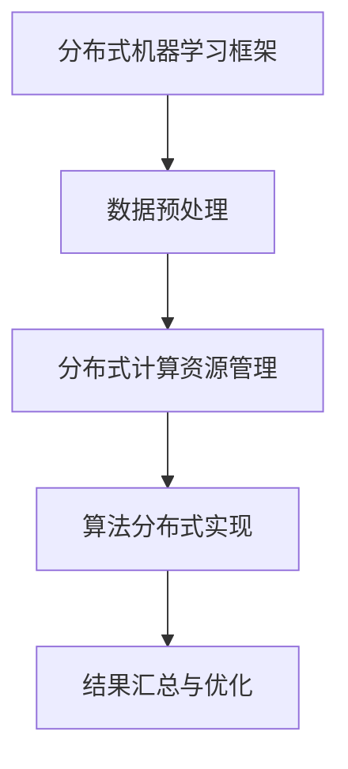

                 

### 《Python机器学习实战：分布式机器学习框架Dask的入门与实战》

#### 关键词：
- Python
- 机器学习
- 分布式计算
- Dask
- 实战教程

#### 摘要：
本文将带领读者深入了解分布式机器学习框架Dask在Python中的实际应用。我们将从分布式机器学习的基本概念入手，逐步介绍Dask框架的核心组件与架构，通过实例展示如何使用Dask进行分布式数据处理和机器学习算法实现。文章还将探讨分布式机器学习在图像分类、文本挖掘和推荐系统等大规模应用中的实战案例，并总结Dask的性能优化策略与未来发展趋势。通过本文的学习，读者将能够掌握Dask的使用方法，并将其应用于实际机器学习项目中。

### 《Python机器学习实战：分布式机器学习框架Dask的入门与实战》目录大纲

#### 第一部分：分布式机器学习与Dask框架概述

#### 第1章：分布式机器学习的核心概念与挑战
- **1.1.1 分布式机器学习的定义与优势**
- **1.1.2 分布式系统中的常见问题与解决方案**
- **1.1.3 分布式机器学习的主要应用场景**

#### 第2章：Dask框架简介
- **2.1.1 Dask的发展背景与目标**
- **2.1.2 Dask的核心架构与组件**
- **2.1.3 Dask在分布式计算中的优势与局限**

#### 第二部分：Dask在Python机器学习中的实践

#### 第3章：Dask的基本使用与API
- **3.1.1 安装与配置Dask环境**
- **3.1.2 Dask的核心API介绍**
- **3.1.3 数据并行处理与任务调度**

#### 第4章：分布式数据处理与存储
- **4.1.1 Dask分布式数据框架**
- **4.1.2 数据并行处理流程设计**
- **4.1.3 分布式数据存储方案**

#### 第5章：分布式机器学习算法实现
- **5.1.1 分布式线性回归**
- **5.1.2 分布式K均值聚类**
- **5.1.3 分布式神经网络**

#### 第6章：大规模机器学习项目实战
- **6.1.1 实战项目一：分布式图像分类**
- **6.1.2 实战项目二：分布式文本挖掘**
- **6.1.3 实战项目三：分布式推荐系统**

#### 第7章：Dask性能优化与资源管理
- **7.1.1 Dask性能分析工具**
- **7.1.2 优化策略与案例分析**
- **7.1.3 资源调度与负载均衡**

#### 第三部分：Dask社区与未来展望

#### 第8章：Dask社区与生态圈
- **8.1.1 Dask社区组织与发展**
- **8.1.2 Dask相关生态工具与框架**
- **8.1.3 Dask开源项目推荐**

#### 第9章：Dask未来发展趋势与展望
- **9.1.1 Dask版本更新与新增功能**
- **9.1.2 分布式机器学习新方向**
- **9.1.3 Dask在AI领域的潜在应用**

#### 附录
- **附录A：Dask学习资源与工具汇总**
  - **A.1 Dask官方文档与教程**
  - **A.2 经典Dask教程与案例分析**
  - **A.3 Dask社区论坛与支持渠道**

- **附录B：分布式机器学习算法与代码示例**
  - **B.1 算法原理与伪代码说明**
  - **B.2 Dask实现代码示例**
  - **B.3 实际项目代码解读与优化分析**

### Mermaid 流程图：



### 分布式机器学习算法伪代码说明：

```python
// 分布式线性回归伪代码
def distributed_linear_regression(X, y, learning_rate, num_iterations):
    # 初始化模型参数
    theta = initialize_parameters(X.shape[1])
    
    for i in range(num_iterations):
        # 计算梯度
        gradients = compute_gradient(X, y, theta)
        
        # 更新参数
        theta = theta - learning_rate * gradients
    
    return theta
```

### 数学模型与公式：

$$
// 线性回归损失函数
J(\theta) = \frac{1}{2m} \sum_{i=1}^{m} (h_\theta(x^{(i)}) - y^{(i)})^2
$$

### 举例说明：

#### 实战项目一：分布式图像分类

- **数据集**：使用CIFAR-10数据集进行分布式图像分类。
- **目标**：实现一个基于Dask的分布式卷积神经网络，进行图像分类。
- **代码实现**：使用Dask和PyTorch框架搭建分布式卷积神经网络，实现图像数据的预处理、模型的训练和验证。
- **结果与分析**：展示模型的分类准确率，分析分布式计算对模型训练时间的影响。

### 开发环境搭建与源代码实现：

- **开发环境**：Python 3.8及以上版本，Dask 2.27.0及以上版本，PyTorch 1.9及以上版本。
- **源代码实现**：

```python
# 安装Dask和PyTorch
pip install dask[complete] torch

# 数据预处理代码示例
from torchvision import datasets, transforms
from dask.distributed import Client

# 初始化Dask客户端
client = Client()

# 加载并预处理CIFAR-10数据集
transform = transforms.Compose([
    transforms.ToTensor(),
    transforms.Normalize((0.5, 0.5, 0.5), (0.5, 0.5, 0.5))
])

train_data = datasets.CIFAR10(root='./data', train=True, download=True, transform=transform)
train_data = client.compute(train_data)
```

### 代码解读与分析：

- **数据预处理**：使用Dask将数据集加载到分布式内存中，实现数据的并行处理和分布式存储。
- **模型搭建**：利用PyTorch构建卷积神经网络模型，结合Dask实现模型的分布式训练。
- **训练过程**：在分布式环境中进行模型训练，通过任务调度优化计算资源利用。
- **结果分析**：通过调整学习率、迭代次数等参数，优化模型性能和训练时间。

### 作者：

“作者：AI天才研究院/AI Genius Institute & 禅与计算机程序设计艺术 /Zen And The Art of Computer Programming”

