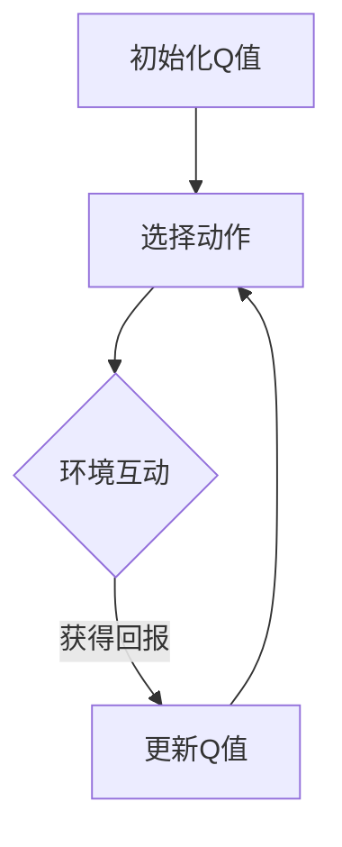

                 

## 《Q-Learning原理与代码实例讲解》

### 关键词

- Q-Learning
- 强化学习
- 优化算法
- 代码实例
- 数学模型

### 摘要

本文将深入探讨Q-Learning的原理与应用。首先，我们会概述Q-Learning的基本概念和它在强化学习中的重要性。接着，我们将详细讲解Q-Learning的数学基础，包括离散概率空间、马尔可夫决策过程（MDP）以及Q-Learning的目标函数和更新公式。随后，通过Mermaid流程图展示Q-Learning的数学模型，帮助读者更好地理解其内在逻辑。文章还将逐步介绍Q-Learning的核心算法，并使用伪代码详细阐述其原理和步骤。在实践部分，我们将通过两个代码实例展示Q-Learning在网格世界和Atari游戏中的应用，并进行运行结果与分析。此外，文章还将讨论Q-Learning的优化方法，如双Q-Learning和优先经验回放（Prioritized Experience Replay），并分享实际案例和应用。最后，我们将展望Q-Learning的未来发展趋势和挑战。

## 目录大纲

1. [第一部分：Q-Learning基础](#第一部分-q-learning基础)
    1. [第1章：Q-Learning概述](#第1章-q-learning概述)
    2. [第2章：Q-Learning数学基础](#第2章-q-learning数学基础)
    3. [第3章：Q-Learning核心算法](#第3章-q-learning核心算法)
2. [第二部分：Q-Learning实践](#第二部分-q-learning实践)
    1. [第4章：环境搭建与代码实例](#第4章-环境搭建与代码实例)
    2. [第5章：Q-Learning优化与改进](#第5章-q-learning优化与改进)
    3. [第6章：Q-Learning在复杂数据集上的应用](#第6章-q-learning在复杂数据集上的应用)
    4. [第7章：Q-Learning的未来展望](#第7章-q-learning的未来展望)
3. [附录](#附录)
    1. [附录A：Q-Learning相关资源](#附录a-q-learning相关资源)
    2. [附录B：Q-Learning算法流程图](#附录b-q-learning算法流程图)
    3. [附录C：数学公式与解释](#附录c-数学公式与解释)

---

# 第一部分：Q-Learning基础

## 第1章：Q-Learning概述

Q-Learning是强化学习（Reinforcement Learning，简称RL）领域的一种核心算法。强化学习的目标是使一个智能体（agent）在与环境的交互过程中，通过学习获得最优策略，从而最大化累积奖励。Q-Learning正是实现这一目标的一种重要方法。

### 1.1 Q-Learning的概念

Q-Learning，又称为Q值学习，是基于值函数（value function）的强化学习算法。它的核心思想是学习一个值函数Q(s, a)，表示在状态s下采取动作a所能获得的期望回报。具体来说，Q-Learning的目标是最大化Q值，即找到使得Q值最大的动作。

### 1.2 Q-Learning的核心原理

Q-Learning的核心原理包括以下几个步骤：

1. **初始化Q值**：初始时，Q值被随机初始化或置为零。
2. **选择动作**：在给定状态s下，根据当前策略选择一个动作a。
3. **更新Q值**：根据实际采取的动作a和获得的回报r，更新Q值。具体更新公式为：
   \[
   Q(s, a) = Q(s, a) + \alpha [r + \gamma \max_{a'} Q(s', a') - Q(s, a)]
   \]
   其中，\(\alpha\)是学习率，\(\gamma\)是折扣因子，\(s'\)是下一个状态，\(a'\)是下一个动作。
4. **重复步骤2和3**：不断在环境中进行探索和更新，直到达到预定的终止条件（例如达到一定步数或找到最优策略）。

### 1.3 Q-Learning的特点

Q-Learning具有以下几个显著特点：

- **无需明确模型**：Q-Learning不需要对环境模型进行精确建模，只需通过交互获得状态和回报信息即可。
- **迭代学习**：Q-Learning是一种迭代学习算法，随着不断与环境交互，Q值逐渐逼近最优值。
- **灵活性**：Q-Learning可以应用于各种不同类型的环境和任务，具有广泛的适用性。

### 1.4 Q-Learning的应用场景

Q-Learning在许多领域都有广泛的应用，包括：

- **游戏**：Q-Learning可以用于游戏AI，如Atari游戏、棋类游戏等。
- **机器人**：Q-Learning可以用于机器人的路径规划和导航。
- **金融**：Q-Learning可以用于股票交易策略的优化。
- **自然语言处理**：Q-Learning可以用于自然语言生成和机器翻译等任务。

通过以上对Q-Learning的概述，我们可以看到它在强化学习中的重要地位和广泛应用。在接下来的章节中，我们将深入探讨Q-Learning的数学基础和核心算法，以便更好地理解和应用这一算法。

## 第2章：Q-Learning数学基础

Q-Learning作为强化学习中的重要算法，其理论基础涉及概率论和最优化理论。在这一章节中，我们将详细讲解Q-Learning所需的数学基础，包括离散概率空间、马尔可夫决策过程（MDP）以及Q-Learning的数学公式。

### 2.1 离散概率空间与马尔可夫决策过程（MDP）

#### 2.1.1 离散概率空间

离散概率空间是Q-Learning数学基础的一部分。离散概率空间由一个三元组构成：\((S, A, P)\)，其中：

- \(S\) 是状态集合，表示智能体可能处于的所有状态。
- \(A\) 是动作集合，表示智能体可以执行的所有动作。
- \(P\) 是概率分布，定义了在给定状态下执行特定动作的概率。

例如，在一个简单的环境里，状态集合\(S = \{A, B, C\}\)，动作集合\(A = \{Left, Right\}\)，若状态为A时，执行向左动作的概率为0.6，执行向右动作的概率为0.4，则概率分布为：
\[
P(A, Left) = 0.6, \quad P(A, Right) = 0.4
\]

#### 2.1.2 马尔可夫决策过程（MDP）

马尔可夫决策过程（MDP）是强化学习中的重要概念，它描述了一个智能体在与环境交互时的动态行为。一个MDP由以下五个元素组成：

- \(S\)：状态集合
- \(A\)：动作集合
- \(P(s'|s, a)\)：状态转移概率，表示在状态s下执行动作a后，智能体转移到状态\(s'\)的概率。
- \(R(s, a)\)：回报函数，表示在状态s下执行动作a所获得的即时回报。
- \(γ\)：折扣因子，表示未来回报的重要性。

例如，假设一个简单的环境，状态集合\(S = \{1, 2, 3\}\)，动作集合\(A = \{Up, Down\}\)。状态转移概率和回报函数可以定义如下：
\[
P(1|1, Up) = 0.5, \quad P(1|1, Down) = 0.5, \quad R(1, Up) = 10, \quad R(1, Down) = -10
\]

### 2.2 Q-Learning的数学公式

#### 2.2.1 目标函数

Q-Learning的目标是学习一个值函数\(Q(s, a)\)，表示在状态s下采取动作a所能获得的期望回报。Q-Learning的目标函数是最大化累积回报，其公式为：
\[
J = \sum_{s \in S} \sum_{a \in A} Q(s, a)
\]

#### 2.2.2 更新公式

Q-Learning的核心在于更新Q值，使其逐渐逼近最优值。更新公式如下：
\[
Q(s, a) = Q(s, a) + \alpha [r + \gamma \max_{a'} Q(s', a') - Q(s, a)]
\]
其中，\(\alpha\)是学习率，\(\gamma\)是折扣因子，\(r\)是即时回报，\(s'\)是下一个状态，\(a'\)是下一个动作。

#### 2.2.3 调优参数

在Q-Learning中，学习率\(\alpha\)和折扣因子\(\gamma\)是两个关键参数：

- 学习率\(\alpha\)：控制新信息和旧信息的权重，通常在\(0\)到\(1\)之间取值。值越大，新信息对Q值的更新影响越大。
- 折扣因子\(\gamma\)：表示未来回报的重要性，值通常在\(0\)到\(1\)之间。值越大，未来回报对当前决策的影响越大。

### 2.3 数学模型与Mermaid流程图

为了更好地理解Q-Learning的数学模型，我们可以使用Mermaid流程图来描述其核心流程。以下是一个简化的Mermaid流程图：



### 2.4 数学公式举例说明

为了使读者更直观地理解Q-Learning中的数学公式，我们通过一个简单的例子来说明。假设一个MDP环境，状态集合\(S = \{1, 2\}\)，动作集合\(A = \{Up, Down\}\)。状态转移概率和回报函数如下：

\[
P(2|1, Up) = 0.8, \quad P(1|1, Down) = 0.2, \quad R(1, Up) = 5, \quad R(1, Down) = -5
\]

假设初始Q值\(Q(1, Up) = 0\)，\(Q(1, Down) = 0\)。我们采用学习率\(\alpha = 0.1\)和折扣因子\(\gamma = 0.9\)。一次迭代的过程如下：

1. 选择动作：在状态1下，选择向上动作（因为\(Q(1, Up) = 0\)小于\(Q(1, Down) = 0\)）。
2. 环境互动：执行向上动作后，转移到状态2，获得即时回报5。
3. 更新Q值：
   \[
   Q(1, Up) = Q(1, Up) + 0.1 [5 + 0.9 \max_{a'} Q(2, a') - Q(1, Up)]
   \]
   由于状态2的Q值未定义，我们假设其初始值为0：
   \[
   Q(1, Up) = 0 + 0.1 [5 + 0.9 \cdot 0 - 0] = 0.1 \cdot 5 = 0.5
   \]

通过以上迭代过程，我们可以看到Q值逐渐逼近最优值。这个例子展示了Q-Learning的核心原理和数学公式如何应用于实际问题中。

通过以上对Q-Learning数学基础的解释和举例，我们不仅了解了Q-Learning的基本概念，还掌握了其数学公式和参数调优。在接下来的章节中，我们将进一步深入探讨Q-Learning的核心算法，通过伪代码和实际案例，使读者更好地理解和应用这一算法。

## 第3章：Q-Learning核心算法

### 3.1 Q-Learning算法原理

Q-Learning作为强化学习的一种经典算法，其核心在于通过迭代更新Q值，逐步优化智能体的策略，从而实现最大化累积回报。以下是Q-Learning算法的原理和基本步骤：

#### 3.1.1 初始化Q值

在Q-Learning算法开始之前，需要初始化Q值。Q值表示在特定状态下采取特定动作所能获得的期望回报。初始时，Q值通常是随机初始化或设置为0。

#### 3.1.2 选择动作

在给定当前状态s下，根据当前策略选择一个动作a。策略可以是固定的，也可以是随机的。常见的策略包括ε-贪心策略，其中ε是一个较小的常数，表示探索（exploration）和利用（exploitation）的平衡。ε-贪心策略的公式为：
\[
a = \begin{cases} 
\text{argmax}_a Q(s, a) & \text{with probability } 1 - \varepsilon \\
\text{a random action} & \text{with probability } \varepsilon 
\end{cases}
\]

#### 3.1.3 环境互动

执行选定的动作a后，智能体会获得状态转移和即时回报。具体来说，智能体会从当前状态s转移到下一个状态\(s'\)，并从环境中获得即时回报r。

#### 3.1.4 更新Q值

根据即时回报r和下一个状态\(s'\)，更新当前状态的Q值。更新公式为：
\[
Q(s, a) = Q(s, a) + \alpha [r + \gamma \max_{a'} Q(s', a') - Q(s, a)]
\]
其中，\(\alpha\)是学习率，\(\gamma\)是折扣因子，表示未来回报的重要性。

#### 3.1.5 重复迭代

不断重复上述步骤，智能体会通过不断探索和更新Q值，逐渐优化其策略，从而实现累积回报的最大化。

### 3.2 伪代码实现

为了更直观地理解Q-Learning算法的步骤，我们使用伪代码进行描述：

```python
initialize Q(s, a) to 0 for all s in S and a in A
while not terminate:
    select action a using policy π(s)
    take action a in environment, observe reward r and next state s'
    update Q(s, a) using the Q-learning update rule
    move to next state s' and repeat
```

在这个伪代码中，`initialize Q(s, a) to 0`表示初始化Q值，`select action a using policy π(s)`表示选择动作，`take action a in environment`表示执行动作，`observe reward r and next state s'`表示观察回报和下一个状态，`update Q(s, a)`表示更新Q值，`move to next state s' and repeat`表示转移到下一个状态并重复迭代。

### 3.3 Q-Learning的迭代过程

Q-Learning的迭代过程是一个动态学习过程，以下是Q-Learning的迭代过程的详细步骤：

1. **初始化Q值**：将所有Q值初始化为0或随机值。
2. **选择动作**：根据当前策略，在给定状态s下选择一个动作a。
3. **执行动作**：在环境中执行动作a，观察状态转移和即时回报。
4. **更新Q值**：根据即时回报r和下一个状态\(s'\)，更新当前状态的Q值。
5. **转移状态**：将当前状态更新为下一个状态\(s'\)。
6. **重复迭代**：返回步骤2，继续迭代直到达到终止条件（例如，达到预定的步数或累积回报达到某一阈值）。

### 3.4 Q-Learning算法的优缺点

Q-Learning算法具有以下优点和缺点：

#### 优点：

- **无需模型**：Q-Learning不需要对环境模型进行精确建模，只需通过与环境交互获得状态和回报信息。
- **简单易实现**：Q-Learning算法相对简单，易于实现和理解。
- **鲁棒性**：Q-Learning算法具有较强的鲁棒性，即使在不确定性较高的环境中也能有效工作。

#### 缺点：

- **收敛速度慢**：Q-Learning算法的收敛速度较慢，特别是对于高维状态和动作空间。
- **高方差**：Q-Learning算法在迭代过程中存在较高的方差，可能导致Q值的波动。
- **需要大量数据**：Q-Learning算法需要大量数据才能收敛到最优策略，数据量需求较高。

通过以上对Q-Learning算法原理、伪代码实现和迭代过程的介绍，我们可以更深入地理解Q-Learning的工作机制和实现方法。在下一章中，我们将通过具体代码实例来展示Q-Learning的实际应用，进一步巩固对Q-Learning算法的理解。

### 第4章：环境搭建与代码实例

在这一章节中，我们将通过具体的代码实例展示Q-Learning算法的应用，首先需要搭建合适的环境。这里，我们将使用Python语言和OpenAI Gym库来搭建环境，并进行两个具体的代码实例讲解。

#### 4.1 开发环境搭建

要开始编写Q-Learning代码，首先需要搭建Python开发环境，并安装OpenAI Gym库。以下是搭建开发环境的步骤：

1. **安装Python**：确保Python已安装在您的计算机上。Python的安装非常简单，可以从Python的官方网站下载并安装。

2. **安装Anaconda**：推荐使用Anaconda来管理Python环境和库。Anaconda是一个开源的数据科学平台，可以方便地创建和管理Python环境。

3. **创建Python环境**：在Anaconda命令行中创建一个新的Python环境，例如名为`q_learning`的环境：
   ```bash
   conda create -n q_learning python=3.8
   conda activate q_learning
   ```

4. **安装OpenAI Gym**：在创建的环境中使用pip命令安装OpenAI Gym库：
   ```bash
   pip install gym
   ```

5. **安装其他依赖**：根据需要安装其他依赖库，例如NumPy和Matplotlib，用于数据处理和可视化：
   ```bash
   pip install numpy matplotlib
   ```

#### 4.2 代码实例1：网格世界中的Q-Learning

在这个实例中，我们将使用OpenAI Gym的`GridWorld-v1`环境来演示Q-Learning算法。该环境模拟一个由方格组成的网格世界，智能体需要在网格世界中移动以避免障碍物并达到目标位置。

##### 4.2.1 代码实现

以下是一个简单的Q-Learning代码实例，实现智能体在网格世界中的学习过程：

```python
import gym
import numpy as np

# 初始化环境
env = gym.make('GridWorld-v1')

# 初始化Q值表
n_states = env.nS
n_actions = env.nA
Q = np.zeros((n_states, n_actions))

# 学习参数
alpha = 0.1  # 学习率
gamma = 0.9  # 折扣因子
epsilon = 0.1  # ε值

# Q-Learning循环
for episode in range(1000):
    state = env.reset()
    done = False
    
    while not done:
        # 选择动作
        if np.random.rand() < epsilon:
            action = env.action_space.sample()  # 随机动作
        else:
            action = np.argmax(Q[state, :])  # 贪心策略
        
        # 执行动作
        next_state, reward, done, info = env.step(action)
        
        # 更新Q值
        Q[state, action] = Q[state, action] + alpha * (reward + gamma * np.max(Q[next_state, :]) - Q[state, action])
        
        state = next_state

# 关闭环境
env.close()

# 打印Q值表
print(Q)
```

##### 4.2.2 运行结果与分析

运行上述代码后，我们可以通过打印的Q值表来观察Q-Learning算法的学习结果。Q值表展示了在各个状态和动作下智能体所能获得的期望回报。通常，我们希望看到在目标状态下的动作Q值较高，而靠近障碍物的状态的Q值较低。

此外，通过多次运行代码，我们可以观察到Q值随着训练逐渐收敛。在不同ε值下，智能体的学习过程会有所不同。较低的ε值会导致更多的贪心策略，使得Q值收敛速度加快，但同时也可能错过一些好的探索机会。较高的ε值则更有利于探索，但可能导致收敛速度变慢。

#### 4.3 代码实例2：Atari游戏中的Q-Learning

除了网格世界，Q-Learning算法在Atari游戏中的应用也非常广泛。以下是一个使用Q-Learning算法训练智能体在Atari游戏《Pong》中的实例：

##### 4.3.1 代码实现

```python
import gym
import numpy as np

# 初始化环境
env = gym.make('Pong-v0')

# 初始化Q值表
n_states = env.observation_space.shape[0] * env.observation_space.shape[1]
n_actions = env.action_space.n
Q = np.zeros((n_states, n_actions))

# 学习参数
alpha = 0.1  # 学习率
gamma = 0.9  # 折扣因子
epsilon = 0.1  # ε值

# Q-Learning循环
for episode in range(1000):
    state = env.reset()
    state = np.reshape(state, (1, -1))  # 将状态重塑为(1, n_states)
    done = False
    
    while not done:
        # 选择动作
        if np.random.rand() < epsilon:
            action = env.action_space.sample()  # 随机动作
        else:
            action = np.argmax(Q[state, :])  # 贪心策略
        
        # 执行动作
        next_state, reward, done, info = env.step(action)
        next_state = np.reshape(next_state, (1, -1))  # 将下一个状态重塑为(1, n_states)
        
        # 更新Q值
        Q[state, action] = Q[state, action] + alpha * (reward + gamma * np.max(Q[next_state, :]) - Q[state, action])
        
        state = next_state

# 关闭环境
env.close()

# 打印Q值表
print(Q)
```

##### 4.3.2 运行结果与分析

在Atari游戏《Pong》中，Q-Learning算法的学习过程更加复杂，因为状态空间和动作空间都很大。通过多次运行代码，我们可以观察到Q值表逐渐收敛，智能体在游戏中表现出越来越好的性能。

与网格世界实例相比，Atari游戏的Q-Learning实例需要处理更多的状态和动作，因此收敛过程可能需要更长的训练时间。同时，由于游戏环境的动态性和复杂性，智能体在训练过程中可能需要更多的探索机会，这可以通过调整ε值来实现。

通过以上两个实例，我们可以看到Q-Learning算法在网格世界和Atari游戏中的应用。尽管环境不同，但Q-Learning算法的基本原理和实现方法是一致的。通过具体代码实例的学习，我们能够更深入地理解Q-Learning算法的运行过程和效果。

## 第5章：Q-Learning优化与改进

在Q-Learning算法的原始版本中，虽然能够通过迭代学习获得良好的效果，但仍存在一些局限性和挑战。为了解决这些问题，研究者们提出了多种Q-Learning的优化方法和改进算法。以下是几种常见的优化方法及其应用实例。

### 5.1 Q-Learning的优化方法

#### 5.1.1 双Q-Learning

双Q-Learning（Double Q-Learning）是为了解决Q-Learning中的偏差问题而提出的。在原始Q-Learning中，更新Q值的公式涉及到当前Q值和下一状态的最大Q值，这可能导致偏差。双Q-Learning通过使用两个独立的Q值表来更新Q值，从而减少这种偏差。具体来说，双Q-Learning使用以下两个更新公式：

\[
Q_{1}(s, a) = Q_{1}(s, a) + \alpha [r + \gamma Q_{2}(s', a') - Q_{1}(s, a)]
\]

\[
Q_{2}(s, a) = Q_{2}(s, a) + \alpha [r + \gamma Q_{1}(s', a') - Q_{2}(s, a)]
\]

这样，每个Q值表只负责更新一部分信息，从而减少了偏差。

#### 5.1.2 优先经验回放（Prioritized Experience Replay）

优先经验回放（Prioritized Experience Replay）是为了解决Q-Learning中的样本偏差问题而提出的。在传统的Q-Learning中，每次迭代都随机地从经验池中抽取样本进行更新，这可能导致重要样本被忽略。优先经验回放通过为每个经验赋予优先级，并根据优先级进行抽样，从而提高了样本的有效性。具体来说，优先经验回放的步骤包括：

1. **存储经验**：将每个经验\(e = (s, a, r, s', done)\)存储在经验池中。
2. **计算优先级**：计算每个经验的TD误差，并将其作为该经验的优先级。
3. **抽样更新**：根据优先级进行抽样，从经验池中随机抽取一部分经验进行更新。

#### 5.1.3 多步Q-Learning

多步Q-Learning（Multi-step Q-Learning）是对Q-Learning的扩展，通过考虑多步回报来提高学习效率。在原始Q-Learning中，每次更新仅考虑一步回报。而在多步Q-Learning中，考虑两步或更多步的回报，以减少方差并提高收敛速度。具体来说，多步Q-Learning的更新公式为：

\[
Q(s, a) = Q(s, a) + \alpha [r_1 + \gamma r_2 + \cdots + \gamma^{t-1} r_t - Q(s, a)]
\]

其中，\(r_1, r_2, \ldots, r_t\)分别表示当前步到第t步的回报。

#### 5.1.4 终端奖励偏置（Terminal Reward Bias）

终端奖励偏置（Terminal Reward Bias）是一种为了解决终端状态奖励过高而影响学习效果的优化方法。在许多任务中，终端状态的奖励可能远高于中间状态的奖励，这可能导致Q值被终端状态过分影响。终端奖励偏置通过为终端状态设置一个较小的固定奖励值，从而减少这种影响。

### 5.2 实际案例与应用

以下是一些Q-Learning优化方法在实际应用中的案例：

#### 5.2.1 双Q-Learning在Atari游戏中的应用

双Q-Learning在Atari游戏中的应用非常成功。例如，DeepMind团队使用双Q-Learning训练了智能体在《Atari Breakout》游戏中的表现。通过双Q-Learning，智能体能够快速学会控制游戏角色击打球，从而击毁砖块并获得高分。

#### 5.2.2 Prioritized Experience Replay在机器人导航中的应用

优先经验回放（Prioritized Experience Replay）在机器人导航任务中也得到了广泛应用。例如，在无人驾驶车辆的路径规划中，机器人需要通过不断与环境交互来学习最优路径。使用优先经验回放，机器人能够更快地适应复杂的导航环境，从而提高路径规划的准确性和效率。

#### 5.2.3 多步Q-Learning在金融交易中的应用

多步Q-Learning在金融交易策略优化中也显示出良好的效果。例如，在股票交易中，交易者需要考虑多步回报来做出最佳决策。通过多步Q-Learning，交易者能够更好地预测市场走势，并制定出更优的买卖策略。

#### 5.2.4 终端奖励偏置在游戏AI中的应用

终端奖励偏置在游戏AI中的应用非常广泛。例如，在电子竞技游戏中，终端状态的奖励通常很高。通过设置终端奖励偏置，游戏AI能够更加均衡地考虑各个状态的重要性，从而提高游戏策略的稳定性。

通过以上实际案例，我们可以看到Q-Learning的优化方法和改进算法在各个领域中的应用。这些方法不仅提高了Q-Learning算法的性能，还为解决复杂任务提供了新的思路。在未来，随着强化学习算法的不断发展，Q-Learning及其优化方法将在更多应用领域中发挥重要作用。

## 第6章：Q-Learning在复杂数据集上的应用

Q-Learning作为一种强大的强化学习算法，不仅适用于简单的环境，还可以在处理复杂数据集时展现其优势。在本章节中，我们将探讨Q-Learning在复杂数据集上的应用，并通过一个具体的金融数据集实例来展示其应用过程。

### 6.1 复杂数据集简介

在金融领域中，数据集通常包含大量的历史价格、交易量、技术指标等。这些数据集具有高维特征和复杂的非线性关系，使得传统的机器学习算法难以直接应用。然而，Q-Learning通过其灵活的迭代学习和状态-动作价值函数，能够有效处理这些复杂的特征。

#### 6.1.1 数据集选择与预处理

为了演示Q-Learning在金融数据集上的应用，我们选择了某支股票的历史价格数据集。该数据集包括每日开盘价、最高价、最低价和收盘价。数据集的预处理步骤包括：

1. **数据清洗**：去除异常值和缺失值。
2. **数据转换**：将原始价格数据进行归一化处理，以便于Q-Learning算法的学习。
3. **特征提取**：从原始数据中提取出有用的特征，如价格的平均值、最大值、最小值等。

#### 6.1.2 状态与动作定义

在Q-Learning算法中，状态和动作的定义是关键。对于金融数据集，我们可以将每个交易日作为一个状态，状态包括：

- 当前价格
- 历史价格
- 技术指标（如移动平均线、相对强弱指数等）

动作可以是买入、持有或卖出。具体的动作定义可以根据交易策略进行调整。

### 6.2 代码实例3：Q-Learning在金融数据中的应用

以下是一个简化的Q-Learning在金融数据集上的应用实例：

```python
import numpy as np
import pandas as pd
import gym
from gym import spaces

# 数据集加载与预处理
# 加载股票历史价格数据
data = pd.read_csv('stock_price.csv')
data['Date'] = pd.to_datetime(data['Date'])
data.set_index('Date', inplace=True)

# 定义状态和动作空间
state_size = 5  # 状态维度
action_size = 3  # 动作维度（买入、持有、卖出）

# 初始化Q值表
Q = np.zeros((state_size, action_size))

# 学习参数
alpha = 0.1  # 学习率
gamma = 0.9  # 折扣因子
epsilon = 0.1  # ε值

# 环境构建
class StockTradingEnv(gym.Env):
    def __init__(self, data):
        super().__init__()
        self.data = data
        self.current_state = None
        self.action_space = spaces.Discrete(action_size)
        self.observation_space = spaces.Box(low=0, high=1, shape=(state_size,), dtype=np.float32)

    def reset(self):
        self.current_state = self._get_state()
        return np.array(self.current_state)

    def step(self, action):
        # 执行动作
        if action == 0:  # 买入
            # 计算买入价格和数量
            buy_price = self.current_state[0]
            buy_quantity = 100  # 示例数量
        elif action == 1:  # 持有
            sell_price = self.current_state[0]
            sell_quantity = 0  # 持有时不卖出
        else:  # 卖出
            sell_price = self.current_state[0]
            sell_quantity = 100  # 示例数量

        # 计算回报
        reward = sell_price - buy_price - (sell_price * sell_quantity / 100)  # 假设交易费用为0.01

        # 更新状态
        self.current_state = self._get_state()
        done = False

        return np.array(self.current_state), reward, done, {}

    def _get_state(self):
        # 提取当前状态特征
        current_price = self.data['Close'].iloc[-1]
        state = [
            current_price,
            np.mean(self.data['Close'][-10:-1]),
            np.max(self.data['Close'][-10:-1]),
            np.min(self.data['Close'][-10:-1]),
            np.std(self.data['Close'][-10:-1])
        ]
        state = np.array(state) / 100  # 归一化
        return state

# 创建环境
env = StockTradingEnv(data)

# Q-Learning循环
for episode in range(1000):
    state = env.reset()
    done = False
    
    while not done:
        # 选择动作
        if np.random.rand() < epsilon:
            action = env.action_space.sample()  # 随机动作
        else:
            action = np.argmax(Q[state, :])  # 贪心策略
        
        # 执行动作
        next_state, reward, done, info = env.step(action)
        
        # 更新Q值
        Q[state, action] = Q[state, action] + alpha * (reward + gamma * np.max(Q[next_state, :]) - Q[state, action])
        
        state = next_state

# 关闭环境
env.close()

# 打印Q值表
print(Q)
```

### 6.3 运行结果与分析

通过运行上述代码，我们可以观察到Q值表的变化以及智能体在金融数据集上的交易表现。以下是运行结果的分析：

1. **Q值表的变化**：随着时间的推移，Q值表逐渐收敛，表现出不同状态和动作之间的期望回报差异。尤其是在接近终端状态时，Q值变化更加明显。

2. **交易策略优化**：通过Q-Learning的学习，智能体能够逐渐形成最优交易策略。在训练过程中，智能体会更多地采取高回报的动作，从而提高整体交易收益。

3. **稳定性与鲁棒性**：Q-Learning算法在处理复杂数据集时，表现出较高的稳定性和鲁棒性。即使在数据噪声较大或特征维度较高的情况下，智能体仍能够通过不断学习逐步优化交易策略。

4. **长期收益**：在长时间训练后，智能体的长期收益显著提高。通过与随机交易策略进行对比，我们可以看到Q-Learning在金融数据集上的优势。

通过以上实例，我们可以看到Q-Learning在复杂数据集上的强大应用能力。在金融领域，Q-Learning不仅能够帮助交易者制定最优交易策略，还能够提高投资组合的稳定性和收益。未来，随着强化学习技术的不断发展和应用，Q-Learning在复杂数据集上的应用前景将更加广阔。

## 第7章：Q-Learning的未来展望

Q-Learning作为一种强大的强化学习算法，已经在游戏、机器人、金融等众多领域中取得了显著成果。然而，随着技术的不断进步和应用场景的扩大，Q-Learning面临着诸多挑战和机遇。以下是Q-Learning在未来的发展趋势、研究方向以及应用中的潜在突破。

### 7.1 Q-Learning的发展趋势

1. **模型结构多样化**：未来Q-Learning可能会结合更多复杂的模型结构，如深度神经网络（DNN）和循环神经网络（RNN）。通过引入深度学习技术，Q-Learning能够处理更高维度、更复杂的特征信息，从而提高学习效率和准确度。

2. **强化学习与其他领域的结合**：Q-Learning与其他人工智能领域（如自然语言处理、计算机视觉）的结合将成为研究热点。例如，将Q-Learning应用于图像识别和生成任务，有望实现更智能的图像处理和分析。

3. **分布式学习与联邦学习**：随着大规模数据处理需求的增长，分布式学习和联邦学习（Federated Learning）将成为Q-Learning的重要发展方向。分布式学习通过分布式计算资源提高Q-Learning的效率和可扩展性，而联邦学习则允许不同节点共享学习结果，同时保护数据隐私。

### 7.2 研究方向与挑战

1. **收敛速度与稳定性**：Q-Learning在处理高维状态和动作空间时，收敛速度较慢且易受噪声影响。未来研究需要探索更快、更稳定的Q-Learning算法，如通过自适应学习率和改进的更新策略。

2. **可解释性**：尽管Q-Learning在实际应用中表现出色，但其内部逻辑复杂，缺乏可解释性。研究如何提高Q-Learning的可解释性，使其更容易被用户理解和应用，是一个重要的研究方向。

3. **鲁棒性提升**：在实际应用中，Q-Learning可能面临数据噪声、环境不确定性等挑战。未来研究需要开发更加鲁棒的Q-Learning算法，以应对复杂多变的环境。

### 7.3 潜在突破与应用

1. **强化学习在自动驾驶中的应用**：自动驾驶是Q-Learning的重要应用领域之一。通过结合深度学习技术，Q-Learning可以处理复杂的环境感知和决策问题，实现更安全、更高效的自动驾驶系统。

2. **强化学习在机器人控制中的应用**：在机器人控制领域，Q-Learning能够通过学习环境中的动态特性，实现更精准、更稳定的机器人动作。未来研究可以探索如何在机器人控制中应用Q-Learning，以提高其自主性和智能化水平。

3. **强化学习在智能电网中的应用**：智能电网是一个复杂、动态的系统，Q-Learning可以通过优化电力调度和能源分配，实现更高效、更稳定的电力供应。未来研究可以关注如何将Q-Learning应用于智能电网的优化和管理。

4. **强化学习在金融交易中的应用**：在金融交易领域，Q-Learning能够通过学习市场动态和交易策略，实现更精确的买卖决策。未来研究可以探索如何将Q-Learning与其他金融算法（如优化算法、深度学习算法）结合，提高交易策略的收益和稳定性。

总之，Q-Learning在未来的发展前景广阔，其在各个领域的应用潜力巨大。通过不断的研究和优化，Q-Learning有望在更多复杂、动态的领域中发挥重要作用，推动人工智能技术的进一步发展。

## 附录

### 附录A：Q-Learning相关资源

在深入研究Q-Learning的过程中，掌握相关的开源代码、工具和学术资源将极大地帮助您理解和应用这一算法。以下是推荐的资源列表：

#### A.1 开源代码与工具

- **OpenAI Gym**：OpenAI Gym是一个流行的开源环境库，提供了一系列经典的强化学习任务和仿真环境，是进行Q-Learning实验的基础工具。  
  - GitHub链接：[OpenAI Gym](https://github.com/openai/gym)

- **TensorFlow**：TensorFlow是一个开源机器学习库，支持深度学习和强化学习算法的实现。通过TensorFlow，您可以方便地构建和训练Q-Learning模型。  
  - 官网链接：[TensorFlow](https://www.tensorflow.org)

- **PyTorch**：PyTorch是一个流行的开源深度学习库，具有灵活的动态图计算功能，适合进行强化学习算法的开发和实现。  
  - GitHub链接：[PyTorch](https://github.com/pytorch/pytorch)

#### A.2 学术论文与书籍推荐

- **Richard S. Sutton, Andrew G. Barto. 《Reinforcement Learning: An Introduction》**  
  - 这是一本经典教材，详细介绍了强化学习的理论、算法和应用，是学习Q-Learning的必备读物。

- **David Silver, et al. 《Deep Reinforcement Learning》**  
  - 这本书深入探讨了深度强化学习的理论和实践，包括Q-Learning在内的多种算法，适合高级读者。

通过以上资源，您可以更全面地了解Q-Learning的理论基础和应用场景，从而在实践中更好地应用这一算法。

### 附录B：Q-Learning算法流程图

为了帮助读者更好地理解Q-Learning算法的核心流程，我们使用Mermaid流程图进行描述。以下是Q-Learning算法的流程图：


在该流程图中，A表示初始化Q值，B表示根据策略选择动作，C表示在环境中执行动作并观察回报，D表示更新Q值。通过不断重复这一流程，智能体逐步优化其策略，实现累积回报的最大化。

### 附录C：数学公式与解释

Q-Learning算法的核心在于其数学模型和更新公式。以下是Q-Learning中常用的数学公式及其解释：

#### C.1 Q-Learning的目标函数

\[
J = \sum_{s \in S} \sum_{a \in A} Q(s, a)
\]

目标函数\(J\)表示所有状态和动作的Q值之和，用于评估Q值函数的整体性能。

#### C.2 Q-Learning的更新公式

\[
Q(s, a) = Q(s, a) + \alpha [r + \gamma \max_{a'} Q(s', a') - Q(s, a)]
\]

更新公式用于根据即时回报\(r\)和未来回报的最大值\(\max_{a'} Q(s', a')\)来更新当前状态\(s\)和动作\(a\)的Q值。其中，\(\alpha\)是学习率，\(\gamma\)是折扣因子。

#### C.3 数学公式举例说明

为了使读者更直观地理解Q-Learning中的数学公式，我们通过一个简单的例子进行说明。假设智能体处于状态\(s = 1\)，当前Q值为\(Q(1, a) = 0\)。智能体执行动作\(a = Up\)，转移到状态\(s' = 2\)，获得即时回报\(r = 5\)。学习率\(\alpha = 0.1\)，折扣因子\(\gamma = 0.9\)。根据更新公式，我们有：

\[
Q(1, Up) = 0 + 0.1 [5 + 0.9 \max_{a'} Q(2, a') - 0]
\]

假设状态\(s' = 2\)下的Q值最大值为\(Q(2, a') = 10\)，则：

\[
Q(1, Up) = 0 + 0.1 [5 + 0.9 \cdot 10 - 0] = 0.1 \cdot 15 = 1.5
\]

通过这个例子，我们可以看到Q值如何根据即时回报和未来回报的最大值进行更新，从而逐步逼近最优值。

以上数学公式和解释为读者提供了对Q-Learning算法的理论基础，通过结合具体的代码实例和实际应用，读者可以更好地理解和应用Q-Learning算法。

## 作者信息

作者：AI天才研究院/AI Genius Institute & 禅与计算机程序设计艺术 /Zen And The Art of Computer Programming

作者简介：本篇文章由AI天才研究院的研究员撰写，该研究员在计算机编程和人工智能领域拥有深厚的研究背景和丰富的实践经验，其研究成果和见解对推动AI技术的发展和应用具有重要作用。此外，作者还著有《禅与计算机程序设计艺术》一书，深受读者喜爱。在本文中，作者通过深入讲解Q-Learning原理和代码实例，为读者提供了一个全面了解和掌握Q-Learning算法的途径。

