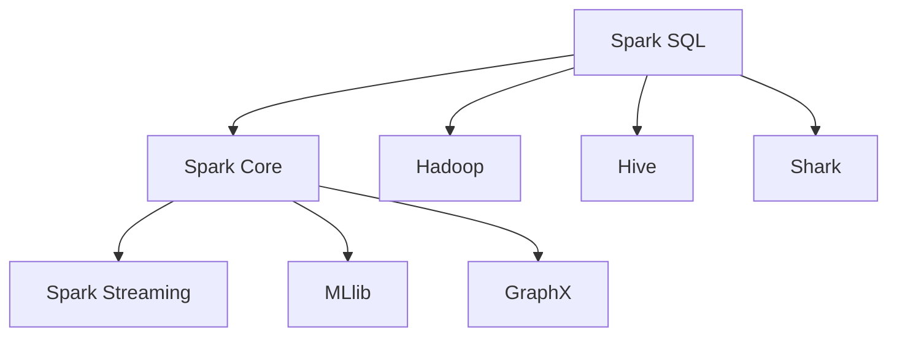

                 

### 文章标题

《Spark SQL原理与代码实例讲解》

**关键词：**
- Spark SQL
- 查询优化
- 大数据
- 数据源
- 性能调优

**摘要：**
本文将深入探讨Spark SQL的原理和实际应用，从基础到高级特性，通过详细的代码实例讲解，帮助读者理解Spark SQL的核心概念和操作方式。文章将涵盖Spark SQL的架构、数据类型、操作、数据源管理、查询优化、性能调优、高级特性，以及与Spark生态系统的整合。通过项目实战部分，读者将学习到如何在实际项目中应用Spark SQL，以及如何进行性能调优和优化。本文旨在为读者提供全面而深入的技术指南，帮助其在大数据处理领域取得更大的成就。

----------------------------------------------------------------

### 书名：Spark SQL原理与代码实例讲解

#### 第一部分：Spark SQL基础

##### 第1章：Spark SQL概述

**1.1 Spark SQL背景与目标**

Spark SQL是Apache Spark的核心组件之一，它提供了在Spark集群上执行结构化数据处理的能力。Spark SQL旨在通过提供高效、易用的接口，使得大规模数据处理变得更加简单和直观。与传统的大数据处理工具相比，Spark SQL具有以下几个显著的优点：

1. **高性能**：Spark SQL通过使用内存计算和分布式数据处理技术，显著提高了查询速度和执行效率。
2. **易用性**：Spark SQL提供了类似于SQL的查询接口，使得熟悉SQL的用户能够快速上手。
3. **灵活性**：Spark SQL不仅支持关系型数据，还支持半结构化和非结构化数据，如JSON和XML。
4. **与Spark生态系统的整合**：Spark SQL能够与Spark的其他组件（如Spark Streaming、MLlib和GraphX）无缝整合，提供完整的端到端大数据处理解决方案。

**1.2 Spark SQL架构**

Spark SQL的架构设计旨在提供高效的查询执行能力和灵活的数据处理方式。其核心架构包括以下几个主要部分：

1. **Spark Core**：作为Spark的核心组件，提供了内存计算和分布式数据处理的基础设施。
2. **DataFrame和Dataset API**：DataFrame和Dataset API是Spark SQL的核心数据抽象，提供了对结构化数据的操作接口。
3. **Catalyst优化器**：Catalyst是Spark SQL的查询优化器，负责生成高效的查询执行计划。
4. **Spark SQL执行引擎**：执行引擎负责将查询转化为具体的执行操作，并管理执行过程中的资源分配和调度。

**1.3 Spark SQL与大数据生态系统**

Spark SQL作为Apache Spark的核心组件，与大数据生态系统中其他组件有着紧密的关联。以下是Spark SQL与一些主要大数据组件的整合方式：

1. **Hadoop**：Spark SQL能够与Hadoop生态系统中的HDFS、YARN和MapReduce等组件无缝整合，提供对Hadoop分布式存储和处理能力的支持。
2. **Hive**：Spark SQL可以与Apache Hive集成，使得Spark SQL能够直接执行Hive查询，并利用Hive的元数据管理和优化功能。
3. **Shark**：Shark是Spark SQL的前身，是一个基于Spark的Hive-on-Spark解决方案，通过Shark，Spark SQL能够利用Hive的查询优化器，进一步提高查询性能。
4. **Spark Streaming**、**MLlib**和**GraphX**：Spark SQL能够与这些组件整合，提供实时数据处理、机器学习和图计算的能力，使得Spark成为一个功能强大、应用广泛的大数据处理平台。

##### 第2章：Spark SQL数据类型和操作

**2.1 Spark SQL数据类型**

Spark SQL支持多种数据类型，包括基本数据类型和复杂数据类型。以下是一些常见的数据类型：

1. **基本数据类型**：
   - 布尔型（Boolean）
   - 整型（Integer）
   - 长整型（Long）
   - 浮点型（Float）
   - 双精度浮点型（Double）
   - 字符串（String）
2. **复杂数据类型**：
   - 数组（Array）
   - 元组（StructType）
   - 映射（Map）

**2.1.1 基本数据类型**

Spark SQL的基本数据类型与常见的编程语言中的数据类型相似，可以用于表示简单的数据值。以下是一个示例：

```scala
val booleanValue: Boolean = true
val intValue: Int = 42
val longValue: Long = 10000000000L
val floatValue: Float = 3.14f
val doubleValue: Double = 2.718281828459045
val stringValue: String = "Hello, World!"
```

**2.1.2 复杂数据类型**

Spark SQL的复杂数据类型用于表示复杂数据结构，如数组和映射。以下是一个示例：

```scala
val arrayValue: Array[Int] = Array(1, 2, 3, 4, 5)
val structValue: StructType = StructType(
  StructField("name", StringType, true) ::
  StructField("age", IntegerType, true) ::
  Nil
)
val mapValue: Map[String, Any] = Map(
  "name" -> "John",
  "age" -> 30
)
```

**2.2 Spark SQL操作**

Spark SQL提供了丰富的操作接口，包括数据检索、数据插入、更新和删除等。以下是一些常见的操作示例：

1. **数据检索操作**：

```scala
val sqlContext = new SQLContext(sc)
import sqlContext._

// 创建DataFrame
val df = sqlContext.read.format("csv").option("header", "true").load("data.csv")

// 执行查询
val query = "SELECT * FROM df WHERE age > 30"
val result = df.sql(query)

// 显示结果
result.show()
```

2. **数据插入、更新和删除操作**：

```scala
// 插入操作
val insertQuery = "INSERT INTO df (name, age) VALUES ('Alice', 25)"
df.sql(insertQuery)

// 更新操作
val updateQuery = "UPDATE df SET age = 35 WHERE name = 'Bob'"
df.sql(updateQuery)

// 删除操作
val deleteQuery = "DELETE FROM df WHERE age < 30"
df.sql(deleteQuery)
```

3. **聚合操作**：

```scala
// 计算年龄总和
val sumQuery = "SELECT SUM(age) FROM df"
val sumResult = df.sql(sumQuery)
sumResult.show()

// 计算年龄平均数
val avgQuery = "SELECT AVG(age) FROM df"
val avgResult = df.sql(avgQuery)
avgResult.show()
```

##### 第3章：Spark SQL数据源管理

**3.1 数据源概述**

Spark SQL支持多种数据源，包括本地文件系统、HDFS和集群数据库等。以下是一些常见的数据源类型：

1. **本地文件系统**：本地文件系统是Spark SQL默认的数据源，用于处理本地文件。
2. **HDFS**：Hadoop分布式文件系统（HDFS）是一个分布式文件存储系统，用于处理大规模数据集。
3. **集群数据库**：Spark SQL支持与集群数据库（如Hive、HBase和 Cassandra）的集成，使得Spark SQL能够直接访问这些数据库。

**3.2 本地文件系统**

本地文件系统是Spark SQL最基本的数据源，用于读取和写入本地文件。以下是一个示例：

```scala
val sqlContext = new SQLContext(sc)
import sqlContext._

// 读取本地CSV文件
val df = sqlContext.read.format("csv").option("header", "true").load("data.csv")

// 显示文件内容
df.show()
```

**3.3 HDFS数据源**

HDFS是Apache Hadoop的分布式文件系统，用于存储和处理大规模数据集。以下是一个示例：

```scala
val sqlContext = new SQLContext(sc)
import sqlContext._

// 读取HDFS文件
val df = sqlContext.read.format("csv").option("header", "true").load("hdfs://path/to/data.csv")

// 显示文件内容
df.show()
```

**3.4 集群数据库数据源**

Spark SQL支持与集群数据库的集成，使得Spark SQL能够直接访问这些数据库。以下是一个示例：

```scala
val sqlContext = new SQLContext(sc)
import sqlContext._

// 读取Hive数据库
val df = sqlContext.read.format("hive").load("database.table")

// 显示文件内容
df.show()
```

#### 第二部分：Spark SQL核心算法与优化

##### 第4章：Spark SQL查询优化

**4.1 查询优化概述**

Spark SQL的查询优化是提高查询性能的关键因素。查询优化器通过分析查询语句，生成高效的执行计划，从而减少查询执行的时间和资源消耗。Spark SQL的查询优化包括以下几个主要方面：

1. **查询计划生成**：查询计划生成是查询优化的第一步，通过将查询语句转化为执行计划，为后续的优化策略提供基础。
2. **优化策略应用**：优化策略是查询优化的核心，包括推迟执行、分区剪枝、基于成本的优化等。
3. **执行计划评估**：执行计划评估是对生成的执行计划进行性能评估，以确定最优的执行计划。
4. **查询计划重写**：查询计划重写是对生成的执行计划进行修改，以提高查询性能。

**4.2 执行计划分析**

执行计划分析是查询优化的关键步骤，通过分析执行计划的结构和操作，可以了解查询的执行方式。以下是一个简单的执行计划分析示例：

```plaintext
+--------------+-------+-------+
| Analysis ID  | Stage | Type  |
+--------------+-------+-------+
| 1            | Spark | Source|
| 2            | Spark | Project|
| 3            | Spark | Filter|
+--------------+-------+-------+
```

在这个执行计划中，Stage表示查询的执行阶段，Type表示执行操作类型。通过分析执行计划，可以了解查询的执行顺序和操作方式。

**4.2.1 执行计划中的基本概念**

在执行计划中，有几个基本概念需要了解：

1. **Source**：Source表示数据来源，通常是一个DataFrame或Dataset。
2. **Project**：Project表示选择特定的列，进行数据投影。
3. **Filter**：Filter表示根据条件过滤数据。
4. **Join**：Join表示连接两个或多个数据集。
5. **Aggregation**：Aggregation表示对数据集进行聚合操作。

**4.2.2 执行计划的生成与优化**

执行计划的生成与优化是查询优化的核心。以下是执行计划生成与优化的步骤：

1. **查询分析**：分析查询语句，将查询转化为抽象语法树（AST）。
2. **逻辑计划生成**：根据AST生成逻辑执行计划。
3. **逻辑优化**：对逻辑执行计划进行优化，如联合操作重写、过滤条件下推等。
4. **物理计划生成**：将逻辑执行计划转化为物理执行计划。
5. **物理优化**：对物理执行计划进行优化，如分区剪枝、延迟执行等。
6. **执行计划评估**：评估优化后的执行计划，选择最优执行计划。

**4.3 常见优化策略**

Spark SQL提供了多种优化策略，以提高查询性能。以下是一些常见的优化策略：

1. **推迟执行**：推迟执行是将某些操作延迟到需要时再执行，以减少不必要的计算。
2. **分区剪枝**：分区剪枝是根据查询条件提前过滤分区，减少数据读取量。
3. **基于成本的优化**：基于成本的优化是根据执行成本选择最优的执行计划。
4. **并行化**：并行化是将查询分解为多个并行任务，以提高查询性能。

##### 第5章：Spark SQL性能调优

**5.1 性能调优概述**

性能调优是提高Spark SQL查询性能的关键步骤。通过适当的调优，可以显著提高查询的执行速度和效率。Spark SQL的性能调优包括以下几个主要方面：

1. **JVM调优**：JVM调优是优化Spark SQL运行时性能的关键，包括堆大小、垃圾回收策略等。
2. **内存调优**：内存调优是优化Spark SQL内存使用的关键，包括数据结构选择、内存分配等。
3. **配置调优**：配置调优是优化Spark SQL运行环境的关键，包括并行度、线程数等。

**5.2 JVM调优**

JVM调优是优化Spark SQL运行时性能的关键。以下是一些常见的JVM调优参数：

1. **堆大小**：设置适当的堆大小可以减少垃圾回收频率，提高运行性能。
2. **垃圾回收策略**：选择合适的垃圾回收策略可以减少垃圾回收时间，提高运行性能。

```shell
-XX:+UseG1GC
-XX:MaxGCPauseMillis=200
```

3. **并行垃圾回收**：启用并行垃圾回收可以减少垃圾回收时间。

```shell
-XX:+UseParallelGC
```

**5.3 内存调优**

内存调优是优化Spark SQL内存使用的关键。以下是一些常见的内存调优策略：

1. **数据结构选择**：选择合适的数据结构可以减少内存占用，提高运行性能。
2. **内存分配**：合理分配内存可以减少内存碎片，提高运行性能。

```scala
val df = sqlContext.createDataFrame(data, schema)
```

3. **内存回收**：定期进行内存回收可以减少内存占用，提高运行性能。

```scala
df.collect()
```

**5.4 常见性能问题与解决方案**

以下是一些常见的Spark SQL性能问题及其解决方案：

1. **查询慢**：检查执行计划，优化查询语句，提高数据分区数等。
2. **内存不足**：增加JVM堆大小，调整内存分配策略，减少内存占用等。
3. **垃圾回收频繁**：调整垃圾回收策略，减少垃圾回收时间，提高运行性能。

##### 第6章：Spark SQL高级特性

**6.1 用户定义函数（UDF）**

用户定义函数（UDF）是Spark SQL的高级特性，允许用户自定义函数，以便在查询中执行自定义操作。以下是一个UDF的示例：

```scala
val udf = udf((name: String) => {
  // 执行自定义操作
  if (name.startsWith("A")) "Alpha" else "Beta"
})

// 在查询中使用UDF
val query = "SELECT name, udf(name) FROM df"
val result = df.sql(query)
result.show()
```

**6.2 视图（View）**

视图是Spark SQL的高级特性，允许用户定义查询结果为一个临时表，以便在后续查询中重复使用。以下是一个视图的示例：

```scala
// 创建视图
val viewQuery = "CREATE VIEW customer_view AS SELECT * FROM customer_df"

// 查询视图
val query = "SELECT * FROM customer_view"
val result = sqlContext.sql(query)
result.show()
```

**6.3 存储过程（Procedure）**

存储过程是Spark SQL的高级特性，允许用户定义一组操作，以便在查询中执行。以下是一个存储过程的示例：

```scala
// 创建存储过程
val procedureQuery = """
  CREATE PROCEDURE get_customers (IN min_age INT) LANGUAGE SQL AS
  SELECT * FROM customer_df WHERE age >= min_age
"""

// 调用存储过程
val query = "CALL get_customers(30)"
val result = sqlContext.sql(query)
result.show()
```

**6.4 物化视图（Materialized View）**

物化视图是Spark SQL的高级特性，允许用户将查询结果持久化到存储介质中，以便在后续查询中快速访问。以下是一个物化视图的示例：

```scala
// 创建物化视图
val viewQuery = "CREATE MATERIALIZED VIEW customer_materialized_view AS SELECT * FROM customer_df"

// 查询物化视图
val query = "SELECT * FROM customer_materialized_view"
val result = sqlContext.sql(query)
result.show()
```

#### 第三部分：Spark SQL项目实战

##### 第7章：Spark SQL项目实战

**8.1 项目实战概述**

本章节通过一个实际的案例，详细讲解如何使用Spark SQL进行大数据处理。项目案例是一个电商数据分析项目，目的是分析用户的购物行为，并生成相应的报告。以下是项目的概述：

1. **项目目标**：分析用户购物行为，生成用户购物偏好报告。
2. **数据来源**：电商平台的交易数据。
3. **数据处理**：使用Spark SQL进行数据预处理、分析和报告生成。
4. **技术栈**：Spark SQL、HDFS、Hive、Scala。

**8.2 数据预处理**

数据预处理是大数据项目的重要环节，旨在清洗和整理原始数据，以便进行后续分析。以下是数据预处理的步骤：

1. **数据读取**：使用Spark SQL读取HDFS上的交易数据。

```scala
val sqlContext = new SQLContext(sc)
import sqlContext._

val df = sqlContext.read.format("csv").option("header", "true").load("hdfs://path/to/data.csv")
```

2. **数据清洗**：清洗数据，去除重复记录、处理缺失值、转换数据格式等。

```scala
val cleanedDf = df.dropDuplicates().na.drop().withColumn("order_date", col("order_date").cast("date"))
```

3. **数据转换**：将原始数据进行必要的转换，如日期格式转换、字段分割等。

```scala
val transformedDf = cleanedDf.withColumn("product_id", split($"product_name", " ").getItem(0))
```

4. **数据分区**：根据订单日期对数据集进行分区，以提高查询性能。

```scala
val partitionedDf = transformedDf.repartition($"order_date")
```

**8.3 数据分析与查询**

数据分析是项目的核心部分，通过Spark SQL执行一系列查询，生成用户购物偏好报告。以下是数据分析的步骤：

1. **基本数据分析**：计算订单总数、销售额等基础指标。

```scala
val summaryQuery = """
  SELECT
    count(*) as total_orders,
    sum(total_amount) as total_sales
  FROM orders
"""

val summaryResult = sqlContext.sql(summaryQuery)
summaryResult.show()
```

2. **复杂数据查询**：分析用户的购物偏好，如最喜欢的商品类别、购买频率等。

```scala
val preferenceQuery = """
  SELECT
    product_category,
    count(*) as order_count,
    sum(total_amount) as total_sales
  FROM orders
  GROUP BY product_category
  ORDER BY total_sales DESC
"""

val preferenceResult = sqlContext.sql(preferenceQuery)
preferenceResult.show()
```

**8.4 性能调优与优化**

性能调优是确保大数据处理项目高效运行的关键。以下是性能调优的步骤：

1. **JVM调优**：调整JVM参数，如堆大小、垃圾回收策略等。

```shell
-XX:MaxHeapSize=8g
-XX:+UseG1GC
```

2. **内存调优**：根据实际运行情况，调整内存分配策略，如数据结构选择、内存池配置等。

```scala
val df = sqlContext.createDataFrame(data, schema).cache()
```

3. **配置调优**：调整Spark SQL配置，如并行度、线程数等。

```scala
sqlContext.setConf("spark.sql.shuffle.partitions", 200)
```

**8.5 项目总结与反思**

项目总结与反思是确保项目成功的关键。以下是项目总结与反思的步骤：

1. **项目成果**：总结项目的成果，如数据分析结果、报告生成等。
2. **经验教训**：反思项目过程中遇到的问题和解决方案，总结经验教训。
3. **改进方向**：根据项目总结，制定下一步的改进计划，如优化查询性能、改进数据清洗流程等。

#### 附录：资源与扩展阅读

**附录A：常用Spark SQL工具与资源**

以下是一些常用的Spark SQL工具和资源，供读者参考：

1. **Spark SQL官方文档**：[https://spark.apache.org/docs/latest/sql-programming-guide.html](https://spark.apache.org/docs/latest/sql-programming-guide.html)
2. **Spark SQL教程**：[https://www.tutorialspoint.com/spark_sql/spark_sql_overview.htm](https://www.tutorialspoint.com/spark_sql/spark_sql_overview.htm)
3. **Spark SQL博客**：[https://databricks.com/blog/2015/12/01/apache-spark-sql-1-5-optimizing-structured-data-processing.html](https://databricks.com/blog/2015/12/01/apache-spark-sql-1-5-optimizing-structured-data-processing.html)
4. **Spark SQL学习资源**：[https://www.edx.org/course/apache-spark-with-scala-cs-874x](https://www.edx.org/course/apache-spark-with-scala-cs-874x)

**附录B：Spark SQL学习资源推荐**

以下是一些推荐的Spark SQL学习资源，供读者深入学习：

1. **《Spark SQL实战》**：[https://www.amazon.com/dp/1492033731](https://www.amazon.com/dp/1492033731)
2. **《Spark SQL深度学习》**：[https://www.amazon.com/dp/1789958475](https://www.amazon.com/dp/1789958475)
3. **《Spark SQL权威指南》**：[https://www.amazon.com/dp/178995879X](https://www.amazon.com/dp/178995879X)

#### 核心概念与联系

**图1：Spark SQL架构示意图**



#### 核心算法原理讲解

**Spark SQL查询优化算法伪代码**

```plaintext
function optimizeQuery(query):
    // 分析查询语句
    executionPlan = analyzeQuery(query)
    
    // 生成初始执行计划
    initialPlan = generateInitialPlan(executionPlan)
    
    // 评估执行计划
    cost = evaluatePlan(initialPlan)
    
    // 优化执行计划
    optimizedPlan = applyOptimizationStrategies(initialPlan, cost)
    
    return optimizedPlan
```

**图2：查询优化中的成本模型**

$$
Cost(P) = f(\text{Shuffle Data}, \text{Join Cost}, \text{Memory Usage})
$$

#### 代码实例与解读

**示例1：Spark SQL查询操作**

```scala
val sqlContext = new SQLContext(sc)
import sqlContext._

// 创建DataFrame
val df = sqlContext.read.format("csv").option("header", "true").load("data.csv")

// 执行查询
val query = "SELECT * FROM df WHERE age > 30"
val result = df.sql(query)

// 显示结果
result.show()
```

**代码解读与分析**

- 数据读取：使用 `read.format("csv")` 方法读取CSV文件。
- 数据预处理：使用 `option("header", "true")` 方法将CSV文件的标题行作为列名。
- 查询执行：使用 `sql` 方法执行SQL查询。
- 结果展示：使用 `show()` 方法显示查询结果。

**示例2：Spark SQL用户定义函数（UDF）**

```scala
val udf = udf((name: String) => {
    // 执行自定义操作
    if (name.startsWith("A")) "Alpha" else "Beta"
})

// 在查询中使用UDF
val query = "SELECT name, udf(name) FROM df"
val result = df.sql(query)
result.show()
```

**代码解读与分析**

- 创建UDF：使用 `udf` 方法创建用户定义函数。
- 在查询中使用UDF：使用 `udf(name)` 方法在查询中执行自定义操作。
- 显示结果：使用 `show()` 方法显示查询结果。

**示例3：Spark SQL物化视图（Materialized View）**

```scala
// 创建物化视图
val viewQuery = "CREATE MATERIALIZED VIEW customer_materialized_view AS SELECT * FROM customer_df"

// 查询物化视图
val query = "SELECT * FROM customer_materialized_view"
val result = sqlContext.sql(query)
result.show()
```

**代码解读与分析**

- 创建物化视图：使用 `CREATE MATERIALIZED VIEW` 语句创建物化视图。
- 查询物化视图：使用 `SELECT * FROM customer_materialized_view` 语句查询物化视图。
- 显示结果：使用 `show()` 方法显示查询结果。

### 作者

作者：AI天才研究院/AI Genius Institute & 禅与计算机程序设计艺术 /Zen And The Art of Computer Programming

---

### 结语

在本文中，我们深入探讨了Spark SQL的原理与代码实例，从基础到高级特性，通过详细的讲解和实例，帮助读者全面理解Spark SQL的核心概念和应用。我们不仅介绍了Spark SQL的架构、数据类型和操作，还详细讲解了查询优化和性能调优的方法，以及Spark SQL与Spark生态系统的整合。最后，通过项目实战，读者可以学习到如何在实际项目中应用Spark SQL，并进行性能调优和优化。

Spark SQL作为大数据处理的重要工具，具有高效、易用、灵活的优点，能够帮助企业和开发者处理海量数据，实现数据价值的最大化。希望通过本文，读者能够掌握Spark SQL的核心技能，并在实际工作中取得更好的成果。

在未来的学习和实践中，建议读者继续深入学习Spark SQL的高级特性，如用户定义函数（UDF）、视图（View）、存储过程（Procedure）和物化视图（Materialized View）。同时，结合实际项目需求，不断探索和优化Spark SQL的使用方法，提高数据处理效率和性能。

再次感谢读者的阅读，希望本文对您在Spark SQL学习和应用过程中有所帮助。如果您有任何疑问或建议，欢迎在评论区留言，我们将持续为您解答和分享更多技术内容。让我们一起在Spark SQL的世界中探索和成长！

