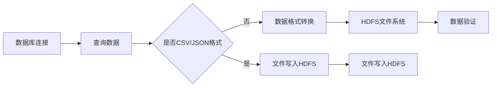

                 

### 第2章 Sqoop基础

#### 2.1 Sqoop简介

Sqoop是一种强大的工具，用于在Hadoop生态系统（如HDFS、Hive和HBase）和结构化数据存储（如关系数据库和NoSQL数据库）之间进行高效的数据传输。它是Apache Software Foundation的一个开源项目，与Hadoop紧密集成，使得大数据处理变得更加简便。

##### **2.1.1 Sqoop是什么**

Sqoop的工作原理是将结构化数据存储中的数据导入到Hadoop文件系统，或将Hadoop文件系统中的数据导出到结构化数据存储。具体来说，它可以将数据从关系数据库（如MySQL、PostgreSQL、Oracle等）导入到HDFS，或将HDFS中的数据导入到关系数据库。此外，Sqoop还可以支持导出数据到其他NoSQL数据库，如Cassandra和HBase。

##### **2.1.2 与Hadoop生态系统的关系**

Sqoop与Hadoop生态系统中的其他组件紧密集成，如HDFS、Hive和HBase。它可以充分利用Hadoop的分布式处理能力，实现大规模数据的快速导入和导出。例如，当需要将大量数据从关系数据库迁移到HDFS时，Sqoop可以通过MapReduce作业来实现高效的并行处理。

##### **2.1.3 Sqoop功能特点**

1. **数据导入导出**：Sqoop支持从各种数据源导入数据到Hadoop文件系统，以及从Hadoop文件系统导出到各种数据源。
2. **支持多种数据源**：除了关系数据库，Sqoop还支持导出到其他NoSQL数据库，如Cassandra和HBase。
3. **高性能与扩展性**：Sqoop利用Hadoop的MapReduce模型，实现高效的数据传输和处理。它可以根据集群资源动态调整作业的并行度，以最大化性能。

##### **2.1.4 Sqoop的核心组件**

1. **客户端**：客户端是运行在用户计算机上的程序，用于启动和执行数据导入导出作业。
2. **服务端**：服务端是运行在Hadoop集群中的程序，负责执行实际的导入导出任务。

#### 2.2 安装与配置

##### **2.2.1 Hadoop环境搭建**

在开始使用Sqoop之前，需要搭建Hadoop环境。以下是简要步骤：

1. **Hadoop版本选择**：根据需求和集群规模选择合适的Hadoop版本。
2. **环境变量配置**：配置Hadoop的环境变量，包括`HADOOP_HOME`、`HADOOP_CONF_DIR`、`PATH`等。
3. **HDFS安装与配置**：配置HDFS的名称节点和数据节点，设置HDFS的存储路径和副本数量等。

##### **2.2.2 MySQL环境搭建**

MySQL是一个广泛使用的开源关系数据库管理系统。以下是MySQL环境搭建的简要步骤：

1. **MySQL版本选择**：根据需求和兼容性选择合适的MySQL版本。
2. **配置MySQL用户与权限**：创建具有适当权限的MySQL用户，确保其可以执行所需的操作。
3. **数据库表结构与数据准备**：根据需求创建相应的数据库表，并插入一些示例数据。

##### **2.2.3 Sqoop安装与配置**

以下是安装和配置Sqoop的简要步骤：

1. **下载与安装**：从Apache官方网站下载Sqoop的二进制包，解压到指定目录。
2. **配置文件介绍**：Sqoop的主要配置文件是`sqoop-env.sh`，它包含了Hadoop和JDBC驱动的配置。
3. **JDBC驱动安装**：下载并安装所需的JDBC驱动，并将其添加到`sqoop-env.sh`文件中。

##### **2.3 数据类型映射**

数据类型映射是Sqoop的一个重要功能，它允许在导入或导出数据时，将结构化数据存储中的数据类型转换为Hadoop文件系统或关系数据库中的数据类型。以下是数据类型映射的规则：

1. **基本数据类型映射**：如整数、浮点数、字符串等基本数据类型在源和目标之间的映射通常比较直接。
2. **复杂数据类型映射**：复杂数据类型如数组、结构体等在映射时需要特别注意字段顺序和名称匹配。

在数据映射过程中，可能会遇到以下常见问题：

1. **数据类型不匹配**：源和目标数据类型不一致时，需要手动进行类型转换。
2. **字段缺失或重复**：在映射过程中，如果源和目标表中的字段不匹配，可能会导致数据丢失或重复。

为了解决这些问题，可以采用以下数据预处理技巧：

1. **数据清洗**：在导入或导出之前，对数据进行清洗，确保数据的一致性和准确性。
2. **数据格式转换**：根据源和目标数据的要求，对数据格式进行适当的转换，如日期格式的转换、字符串的截取等。

通过以上步骤，我们可以搭建起一个基本的Sqoop环境，并了解数据类型映射的基本规则和预处理技巧。在下一章中，我们将深入学习Sqoop的导入和导出原理，并通过具体的代码实例来演示这些操作。

### 核心概念与联系

为了更好地理解Sqoop的导入和导出过程，我们可以通过一个Mermaid流程图来展示数据从数据库到HDFS的导入流程。



在这个流程图中，我们从数据库连接开始，执行查询操作获取数据。然后，根据数据格式判断是否需要转换为CSV或JSON格式，如果是，则直接写入HDFS；如果不是，则先进行数据格式转换，再写入HDFS。最后，进行数据验证以确保数据的完整性和准确性。

#### 核心算法原理讲解

在Sqoop的数据导入过程中，涉及到一个重要的核心算法——MapReduce。MapReduce是Hadoop的一个主要组件，用于处理大规模数据集。

以下是导入过程中使用的伪代码：

```python
// 伪代码：MapReduce导入过程
function import_data_from_database_to_hdfs(database_connection, query, output_directory):
    // 步骤1：初始化MapReduce作业
    init_mapreduce_job("Sqoop Import", output_directory)

    // 步骤2：执行数据库查询
    data = execute_query(database_connection, query)

    // 步骤3：映射（Map）操作
    for record in data:
        // 输出键值对，其中key为空，value为记录
        emit("", record)

    // 步骤4：映射（Map）操作结果存储到HDFS
    store_output_to_hdfs()

    // 步骤5：完成MapReduce作业
    finish_mapreduce_job()
```

在上述伪代码中，我们首先初始化一个MapReduce作业，然后执行数据库查询。接着，我们通过Map操作将查询结果转换为键值对，并将这些键值对存储到HDFS。

下面是一个具体的数学模型和公式的示例：

$$
\text{MapReduce 导入过程} = \text{init\_mapreduce\_job} + \text{execute\_query} + \text{for\_{record\ in\ data}} + \text{emit} + \text{store\_output\_to\_hdfs} + \text{finish\_mapreduce\_job}
$$

其中，每个步骤代表一个操作，用加号连接起来构成整个MapReduce导入过程。

通过这个数学模型，我们可以清晰地看到导入过程中各个步骤的相互关系和执行顺序。

#### 项目实战

在本节中，我们将通过一个实际项目来演示如何使用Sqoop从本地文件导入到HDFS，以及从HDFS导入到MySQL。

##### **一、从本地文件导入到HDFS**

**1. 准备数据**

首先，我们准备一个名为`example.csv`的本地文件，内容如下：

```
id,name,age
1,John,30
2,Jane,25
3,Jack,35
```

**2. 编写Sqoop导入命令**

接下来，我们使用以下命令将本地文件导入到HDFS：

```shell
sqoop import \
  --connect jdbc:mysql://localhost:3306/mydb \
  --table example \
  --target-dir /user/hive/warehouse/example_table \
  --fields-terminated-by '\001'
```

在这个命令中，`--connect`参数指定了MySQL数据库的连接信息，`--table`参数指定了要导入的表名，`--target-dir`参数指定了导入到HDFS的目标路径，`--fields-terminated-by`参数指定了CSV文件中字段的分隔符。

**3. 验证结果**

在完成导入后，我们可以在HDFS中查看导入的文件。使用`hdfs dfs -ls /user/hive/warehouse/example_table`命令可以列出该路径下的文件。

##### **二、从HDFS导入到MySQL**

**1. 创建MySQL表**

首先，在MySQL中创建一个名为`example_table`的表，结构如下：

```sql
CREATE TABLE example_table (
  id INT,
  name VARCHAR(50),
  age INT
);
```

**2. 编写Sqoop导入命令**

接下来，我们使用以下命令将HDFS中的数据导入到MySQL：

```shell
sqoop export \
  --connect jdbc:mysql://localhost:3306/mydb \
  --table example_table \
  --input-dir /user/hive/warehouse/example_table \
  --fields-terminated-by '\001'
```

在这个命令中，`--connect`参数指定了MySQL数据库的连接信息，`--table`参数指定了要导入的表名，`--input-dir`参数指定了从HDFS导入的数据路径，`--fields-terminated-by`参数指定了CSV文件中字段的分隔符。

**3. 验证结果**

在完成导入后，我们可以在MySQL中查看导入的表。使用`SELECT * FROM example_table;`命令可以列出表中的所有数据。

通过这个实际项目，我们了解了如何使用Sqoop进行数据的导入和导出。在实际应用中，可以根据不同的需求和场景选择合适的导入和导出命令，实现高效的数据迁移。

### 代码解读与分析

在上一个实战项目中，我们使用了Sqoop命令将本地文件导入到HDFS，以及将HDFS中的数据导入到MySQL。现在，我们将详细解读这些命令的代码，并分析其实现原理。

#### 从本地文件导入到HDFS

**1. sqoop import 命令解读**

```shell
sqoop import \
  --connect jdbc:mysql://localhost:3306/mydb \
  --table example \
  --target-dir /user/hive/warehouse/example_table \
  --fields-terminated-by '\001'
```

这个命令的主要参数解释如下：

- `--connect`:指定了MySQL数据库的连接信息，包括主机、端口号和数据库名称。
- `--table`:指定了要导入的表名。
- `--target-dir`:指定了导入到HDFS的目标路径。
- `--fields-terminated-by`:指定了CSV文件中字段的分隔符。

当执行这个命令时，Sqoop会连接到MySQL数据库，执行指定的查询，并将查询结果转换为CSV格式，然后存储到指定的HDFS路径中。

**2. 实现原理分析**

当执行`sqoop import`命令时，Sqoop会首先启动一个MapReduce作业，该作业的主要步骤如下：

1. **初始化作业**：使用`init_mapreduce_job`函数初始化MapReduce作业，包括设置作业名称、输入路径、输出路径等。
2. **连接数据库**：使用`connect_database`函数连接到MySQL数据库，并执行查询。
3. **映射（Map）操作**：使用`map`函数对查询结果进行映射，将每条记录转换为CSV格式的字符串。
4. **写入输出**：使用`write_output`函数将映射后的数据写入HDFS。

以下是映射（Map）操作的伪代码：

```python
// 伪代码：Map操作
for record in query_results:
    output = ""
    for field in record:
        if output != "":
            output += fields_terminated_by
        output += field
    write_output(output)
```

在这个伪代码中，我们遍历查询结果中的每条记录，将其转换为CSV格式的字符串，然后写入输出文件。

#### 从HDFS导入到MySQL

**1. sqoop export 命令解读**

```shell
sqoop export \
  --connect jdbc:mysql://localhost:3306/mydb \
  --table example_table \
  --input-dir /user/hive/warehouse/example_table \
  --fields-terminated-by '\001'
```

这个命令的主要参数解释如下：

- `--connect`:指定了MySQL数据库的连接信息。
- `--table`:指定了要导出的表名。
- `--input-dir`:指定了从HDFS导入的数据路径。
- `--fields-terminated-by`:指定了CSV文件中字段的分隔符。

当执行这个命令时，Sqoop会连接到HDFS，读取指定路径下的文件，并将其导入到MySQL数据库。

**2. 实现原理分析**

当执行`sqoop export`命令时，Sqoop会启动一个MapReduce作业，该作业的主要步骤如下：

1. **初始化作业**：使用`init_mapreduce_job`函数初始化MapReduce作业，包括设置作业名称、输入路径、输出路径等。
2. **读取输入**：使用`read_input`函数从HDFS读取文件。
3. **映射（Map）操作**：使用`map`函数对每行数据进行解析，提取字段。
4. **插入数据库**：使用`insert_into_database`函数将解析后的字段插入到MySQL数据库。

以下是映射（Map）操作的伪代码：

```python
// 伪代码：Map操作
for line in input_file:
    fields = line.split(fields_terminated_by)
    insert_into_database(fields[0], fields[1], fields[2])
```

在这个伪代码中，我们遍历HDFS文件中的每行数据，使用分隔符解析字段，然后调用函数将字段插入到MySQL数据库。

通过以上代码解读与分析，我们可以清晰地了解Sqoop导入和导出命令的实现原理，这对于我们理解和优化Sqoop的数据处理流程具有重要意义。

### 总结

在本章中，我们深入探讨了Sqoop的基础知识，包括其简介、安装与配置、数据类型映射以及导入导出原理。通过实际项目实战和代码解读，我们掌握了如何使用Sqoop进行数据的导入和导出。以下是本章的关键点：

1. **Sqoop简介**：了解Sqoop的概念、功能特点以及与Hadoop生态系统的关系。
2. **安装与配置**：掌握Hadoop和MySQL的安装与配置，并学会安装和配置Sqoop。
3. **数据类型映射**：理解数据类型映射规则，并学会解决常见问题。
4. **导入导出原理**：掌握数据导入导出的流程，了解核心算法原理。
5. **实战项目**：通过实际项目，学会如何使用Sqoop进行数据的导入和导出。
6. **代码解读与分析**：深入了解Sqoop导入导出命令的实现原理。

下一章，我们将继续探讨Sqoop的更多高级功能，如数据压缩与加密、批量导入导出以及性能优化技巧。请继续关注！

