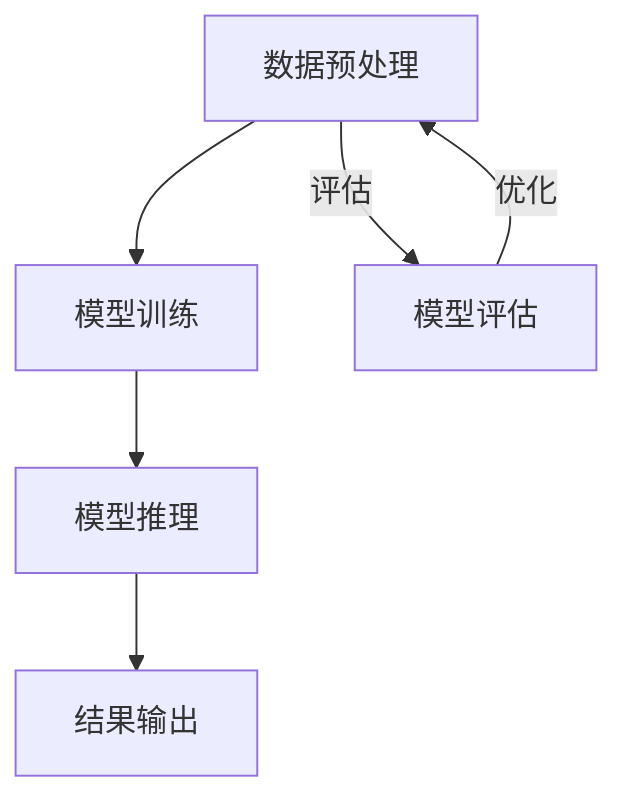
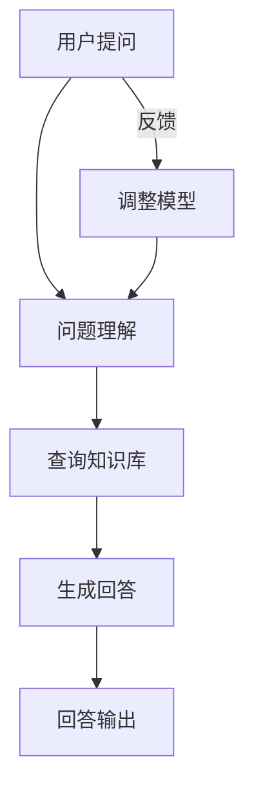

                 

## 《LangChain编程：从入门到实践》扩展模型接口

### 关键词：LangChain、扩展模型接口、Python编程、深度学习、人工智能

### 摘要：

本文将详细介绍LangChain编程的核心内容，包括LangChain的基本概念、编程基础、核心模型接口及其扩展模型接口的实现。通过逐步深入剖析，我们将了解如何扩展LangChain的模型接口，实现更广泛的应用场景。文章还将探讨LangChain在项目实战中的应用，以及性能优化、安全性与隐私保护等高级主题。最后，将对LangChain的未来发展趋势与挑战进行展望，为读者提供全面的指南。

### 《LangChain编程：从入门到实践》目录大纲

#### 第一部分: LangChain基础

#### 第1章: LangChain概述

##### 1.1 LangChain的定义与背景

##### 1.2 LangChain的特点与应用场景

##### 1.3 LangChain的核心组件

#### 第2章: LangChain编程基础

##### 2.1 Python编程基础

##### 2.2 环境搭建与配置

##### 2.3 LangChain基本操作

#### 第3章: LangChain核心模型接口

##### 3.1 问答系统接口

##### 3.2 文本生成接口

##### 3.3 文本分类接口

##### 3.4 文本摘要接口

#### 第4章: LangChain扩展模型接口

##### 4.1 模型接口扩展原理

##### 4.2 扩展模型接口实战

##### 4.3 示例：自定义模型接口

#### 第5章: LangChain项目实战

##### 5.1 LangChain在问答系统中的应用

##### 5.2 LangChain在文本生成中的应用

##### 5.3 LangChain在文本分类中的应用

##### 5.4 LangChain在文本摘要中的应用

#### 第二部分: 高级应用与优化

#### 第6章: LangChain性能优化

##### 6.1 模型优化策略

##### 6.2 优化算法与实践

##### 6.3 并行计算与分布式部署

#### 第7章: LangChain安全性与隐私保护

##### 7.1 数据安全与隐私保护

##### 7.2 安全性测试与防范

##### 7.3 隐私保护策略与实践

#### 第8章: LangChain未来发展趋势与挑战

##### 8.1 未来发展趋势

##### 8.2 技术挑战与解决方案

##### 8.3 开发者展望

#### 附录

##### 附录A: LangChain开发工具与资源

##### 附录B: Mermaid流程图示例

##### 附录C: 伪代码示例

##### 附录D: 数学公式与讲解

##### 附录E: 代码实际案例与解读

### 接下来，我们将逐步深入每个章节，通过清晰的逻辑思路和丰富的实践案例，带领读者全面掌握LangChain编程的核心技能。让我们开始这段精彩的学习之旅吧！<|im_end|>## LangChain基础

### 第1章: LangChain概述

#### 1.1 LangChain的定义与背景

LangChain是一个开源的Python库，用于构建强大的自然语言处理（NLP）应用。它基于深度学习和自然语言处理技术的最新进展，为开发者提供了一个高效、灵活的框架，用于构建问答系统、文本生成、文本分类和文本摘要等应用。LangChain的出现解决了开发者们在构建复杂NLP应用时面临的诸多问题，如模型选择、数据预处理和模型训练等。

LangChain起源于自然语言处理领域的快速发展和应用需求的日益增长。随着人工智能技术的不断进步，自然语言处理已经成为人工智能领域的一个重要分支。然而，构建高效的NLP应用不仅需要丰富的理论知识，还需要熟练的编程技能和大量的实践经验。为了解决这一问题，LangChain提供了一个统一、简化的开发框架，使得开发者可以更加专注于业务逻辑的实现，而无需担心底层的技术细节。

#### 1.2 LangChain的特点与应用场景

LangChain具有以下主要特点：

1. **模块化设计**：LangChain采用模块化设计，将NLP任务分解为多个独立的功能模块，如问答系统、文本生成、文本分类和文本摘要等。这种设计方式使得开发者可以根据实际需求灵活地组合和扩展模块，提高开发效率。

2. **高效性能**：LangChain基于深度学习和自然语言处理技术的最新进展，采用了高效的模型和算法，能够在短时间内处理大量文本数据，提供快速的响应。

3. **易用性**：LangChain提供了丰富的API和文档，使得开发者可以快速上手，轻松实现各种NLP任务。

4. **开源与社区支持**：LangChain是一个开源项目，拥有庞大的开发者社区，不断有新的贡献者和用户加入，为LangChain的发展提供了强大的支持。

LangChain的主要应用场景包括：

1. **问答系统**：LangChain可以用于构建智能问答系统，如智能客服、智能助手等，提供高效、准确的问答服务。

2. **文本生成**：LangChain可以生成高质量的文本，应用于自动写作、生成式文本创作等场景。

3. **文本分类**：LangChain可以用于文本分类任务，如情感分析、主题分类等，帮助企业快速处理和分析大量文本数据。

4. **文本摘要**：LangChain可以提取文本的关键信息，生成简洁、准确的摘要，应用于新闻摘要、文档摘要等场景。

#### 1.3 LangChain的核心组件

LangChain的核心组件包括：

1. **模型库**：LangChain内置了多种优秀的自然语言处理模型，如BERT、GPT、RoBERTa等，开发者可以根据实际需求选择合适的模型。

2. **数据处理模块**：LangChain提供了丰富的数据处理模块，用于文本预处理、数据增强和模型输入生成等任务。

3. **API接口**：LangChain提供了简洁、易用的API接口，使得开发者可以轻松地调用各种自然语言处理功能。

4. **工具和插件**：LangChain支持丰富的工具和插件，如文本生成插件、问答系统插件等，方便开发者进行扩展和定制。

通过本章的介绍，读者可以初步了解LangChain的基本概念、特点与应用场景，以及其核心组件。接下来，我们将继续介绍LangChain的编程基础，帮助读者掌握LangChain的编程技能。

### 第2章: LangChain编程基础

#### 2.1 Python编程基础

Python是一种广泛使用的编程语言，以其简洁、易读和高效的特点受到开发者的喜爱。在开始使用LangChain之前，我们需要具备一定的Python编程基础。本节将介绍Python的基本语法、数据类型和常用库，为后续学习LangChain做好准备。

##### 2.1.1 Python基本语法

Python的基本语法包括变量、数据类型、运算符和控制结构等。

1. **变量**：在Python中，变量是用来存储数据的容器。变量命名规则为：以字母或下划线开头，后面可以跟字母、数字或下划线。

   ```python
   x = 10
   name = "Alice"
   ```

2. **数据类型**：Python有几种基本的数据类型，如整数（int）、浮点数（float）、字符串（str）和布尔值（bool）。

   ```python
   x = 10  # 整数
   y = 3.14  # 浮点数
   name = "Alice"  # 字符串
   is_true = True  # 布尔值
   ```

3. **运算符**：Python支持各种运算符，包括算术运算符、比较运算符和逻辑运算符。

   ```python
   x = 10
   y = 5
   sum = x + y  # 算术运算符
   equal = x == y  # 比较运算符
   and_operator = True and False  # 逻辑运算符
   ```

4. **控制结构**：Python提供了多种控制结构，如条件语句（if-else）、循环语句（for和while）和异常处理（try-except）。

   ```python
   if x > 10:
       print("x大于10")
   else:
       print("x不大于10")
   
   for i in range(5):
       print(i)
   
   try:
       result = x / y
   except ZeroDivisionError:
       print("y不能为0")
   ```

##### 2.1.2 常用库

在Python中，第三方库（也称为模块）极大地扩展了其功能。在开发LangChain应用时，我们将使用多个常用库，如NumPy、Pandas和Scikit-learn等。

1. **NumPy**：NumPy是一个强大的科学计算库，用于处理多维数组。NumPy提供了大量高效的数组操作函数，可以加速数学运算。

   ```python
   import numpy as np
   
   x = np.array([1, 2, 3])
   y = np.array([4, 5, 6])
   sum = x + y
   ```

2. **Pandas**：Pandas是一个数据处理库，提供了丰富的数据结构（DataFrame）和数据处理功能，用于处理结构化数据。

   ```python
   import pandas as pd
   
   data = {
       'Name': ['Alice', 'Bob', 'Charlie'],
       'Age': [25, 30, 35]
   }
   df = pd.DataFrame(data)
   ```

3. **Scikit-learn**：Scikit-learn是一个机器学习库，提供了大量经典的机器学习算法和工具。Scikit-learn适用于各种数据类型，包括分类、回归、聚类等。

   ```python
   from sklearn.linear_model import LinearRegression
   
   x = [[1], [2], [3]]
   y = [2, 4, 6]
   model = LinearRegression()
   model.fit(x, y)
   prediction = model.predict([[4]])
   ```

通过本节的学习，读者可以掌握Python的基本语法、数据类型和常用库。这些知识将为后续学习LangChain编程奠定基础。接下来，我们将介绍如何在本地环境中搭建LangChain的开发环境。

#### 2.2 环境搭建与配置

在开始使用LangChain之前，我们需要在本地环境中搭建合适的开发环境。本节将介绍如何在Windows、macOS和Linux系统上配置Python环境，安装LangChain及其依赖库。

##### 2.2.1 安装Python

1. **Windows**：

   - 访问Python官方网站（https://www.python.org/），下载适用于Windows的Python安装程序。

   - 运行安装程序，按照默认选项安装Python。确保在安装过程中选择“Add Python to PATH”选项，以便在命令行中直接使用Python。

2. **macOS**：

   - macOS系统通常预装了Python，可以通过命令行检查Python版本。如果未安装，可以访问Python官方网站下载安装程序。

   - 打开终端，执行以下命令安装Python：

     ```bash
     brew install python
     ```

3. **Linux**：

   - Linux系统通常使用包管理器（如apt或yum）安装Python。例如，在Ubuntu系统上，可以使用以下命令安装Python：

     ```bash
     sudo apt update
     sudo apt install python3 python3-pip
     ```

##### 2.2.2 安装LangChain及其依赖库

1. **创建虚拟环境**：

   为了避免不同项目之间的依赖库冲突，建议创建虚拟环境。在终端中执行以下命令创建虚拟环境：

   ```bash
   python3 -m venv langchain-venv
   ```

   然后激活虚拟环境：

   ```bash
   source langchain-venv/bin/activate
   ```

2. **安装pip**：

   如果虚拟环境中未安装pip，可以执行以下命令安装：

   ```bash
   python3 -m ensurepip
   ```

3. **安装LangChain**：

   在虚拟环境中，使用pip安装LangChain及其依赖库：

   ```bash
   pip install langchain
   ```

   安装过程中可能会安装其他依赖库，如numpy、pandas和scikit-learn等。

##### 2.2.3 验证安装

为了验证LangChain的安装是否成功，可以在Python交互式中导入LangChain并打印版本号：

```python
import langchain
print(langchain.__version__)
```

如果成功导入并打印出版本号，说明LangChain已成功安装。

通过本节的学习，读者可以学会在本地环境中搭建LangChain的开发环境。接下来，我们将介绍LangChain的基本操作，帮助读者熟悉LangChain的使用。

#### 2.3 LangChain基本操作

在了解了Python编程基础和如何搭建LangChain开发环境后，我们可以开始使用LangChain进行实际操作。本节将介绍LangChain的基本操作，包括问答系统、文本生成、文本分类和文本摘要等。

##### 2.3.1 问答系统

问答系统是LangChain最核心的功能之一。下面是一个简单的问答系统示例：

```python
from langchain import QuestionAnswer

# 初始化问答系统
qa = QuestionAnswer()

# 设置问题和答案
qa.set_question_answer(
    "What is the capital of France?", 
    "The capital of France is Paris."
)

# 输出答案
answer = qa.get_answer()
print(answer)
```

在上面的示例中，我们首先导入`QuestionAnswer`类，然后创建一个问答对象。接着，我们使用`set_question_answer`方法设置问题和答案。最后，通过`get_answer`方法获取答案并打印。

##### 2.3.2 文本生成

文本生成是LangChain的另一个重要功能。下面是一个简单的文本生成示例：

```python
from langchain import TextGenerator

# 初始化文本生成器
text_generator = TextGenerator()

# 生成文本
text = text_generator.generate("Create a short story about a rabbit.")

print(text)
```

在上面的示例中，我们首先导入`TextGenerator`类，然后创建一个文本生成器对象。接着，我们使用`generate`方法生成文本。在这个例子中，我们生成了一个关于兔子的简短故事。

##### 2.3.3 文本分类

文本分类是LangChain的另一个功能。下面是一个简单的文本分类示例：

```python
from langchain import TextClassifier

# 初始化文本分类器
text_classifier = TextClassifier()

# 训练分类器
text_classifier.train([
    ("This is a positive review.", "Positive"),
    ("This is a negative review.", "Negative"),
    ("I love this product.", "Positive"),
    ("I hate this product.", "Negative")
])

# 预测类别
label = text_classifier.predict("This is a great product.")
print(label)
```

在上面的示例中，我们首先导入`TextClassifier`类，然后创建一个文本分类器对象。接着，我们使用`train`方法训练分类器。最后，通过`predict`方法预测类别。

##### 2.3.4 文本摘要

文本摘要是LangChain的另一个重要功能。下面是一个简单的文本摘要示例：

```python
from langchain import TextSummary

# 初始化文本摘要器
text_summary = TextSummary()

# 摘要文本
summary = text_summary.summarize("This is a long text that needs to be summarized.")

print(summary)
```

在上面的示例中，我们首先导入`TextSummary`类，然后创建一个文本摘要器对象。接着，我们使用`summarize`方法摘要文本。

通过本节的学习，读者可以掌握LangChain的基本操作，包括问答系统、文本生成、文本分类和文本摘要等。这些基本操作是后续深入学习LangChain编程的基础。接下来，我们将继续介绍LangChain的核心模型接口。

### 第3章: LangChain核心模型接口

在了解了LangChain的基本操作后，我们将深入探讨LangChain的核心模型接口，包括问答系统接口、文本生成接口、文本分类接口和文本摘要接口。通过这些接口，我们可以实现各种自然语言处理任务。

#### 3.1 问答系统接口

问答系统是自然语言处理领域的一个重要应用，旨在通过自动化方式回答用户的问题。LangChain提供了强大的问答系统接口，使得构建高效的问答系统变得简单。

##### 3.1.1 问答系统接口概述

问答系统接口的主要功能是处理用户输入的问题，并从预定义的答案集中选择最佳答案。LangChain提供了以下方法：

- `set_question_answer()`: 设置问题和答案对。
- `get_answer()`: 根据用户输入的问题，获取最佳答案。

##### 3.1.2 问答系统接口实现

以下是一个简单的问答系统示例：

```python
from langchain import QuestionAnswer

# 创建问答系统对象
qa = QuestionAnswer()

# 设置问题和答案
qa.set_question_answer(
    "What is the capital of France?", 
    "The capital of France is Paris."
)

# 输出答案
answer = qa.get_answer("What is the capital of France?")
print(answer)
```

在这个示例中，我们首先创建一个`QuestionAnswer`对象，然后使用`set_question_answer`方法设置问题和答案。最后，通过`get_answer`方法获取答案并打印。

##### 3.1.3 问答系统接口应用

问答系统接口可以应用于多种场景，如智能客服、智能助手和在线问答平台等。以下是一个应用示例：

```python
from langchain import QuestionAnswer

# 创建问答系统对象
qa = QuestionAnswer()

# 设置大量问题和答案
qa.set_question_answer(
    "What is the capital of France?", 
    "The capital of France is Paris."
)
qa.set_question_answer(
    "What is the currency of Japan?", 
    "The currency of Japan is the yen."
)
qa.set_question_answer(
    "What is the capital of China?", 
    "The capital of China is Beijing."
)

# 回答用户输入的问题
while True:
    user_input = input("Ask a question: ")
    answer = qa.get_answer(user_input)
    if answer:
        print(answer)
    else:
        print("I don't know the answer to that question.")
```

在这个示例中，我们创建了一个问答系统对象，并设置了大量的问题和答案。然后，我们通过循环接受用户输入的问题，并输出最佳答案。

#### 3.2 文本生成接口

文本生成接口是LangChain的另一个重要功能，用于生成高质量的自然语言文本。文本生成在自动写作、内容创作和对话系统等场景中有着广泛的应用。

##### 3.2.1 文本生成接口概述

文本生成接口的主要功能是根据用户输入的提示文本，生成连续的文本。LangChain提供了以下方法：

- `generate()`: 根据提示文本生成文本。

##### 3.2.2 文本生成接口实现

以下是一个简单的文本生成示例：

```python
from langchain import TextGenerator

# 创建文本生成器对象
text_generator = TextGenerator()

# 生成文本
text = text_generator.generate("Create a short story about a rabbit.")

print(text)
```

在这个示例中，我们首先创建一个`TextGenerator`对象，然后使用`generate`方法生成文本。

##### 3.2.3 文本生成接口应用

文本生成接口可以应用于多种场景，如自动写作、内容创作和对话系统等。以下是一个应用示例：

```python
from langchain import TextGenerator

# 创建文本生成器对象
text_generator = TextGenerator()

# 生成不同长度的文本
short_text = text_generator.generate("Write a short story.", max_length=100)
medium_text = text_generator.generate("Write a medium-length story.", max_length=300)
long_text = text_generator.generate("Write a long story.", max_length=1000)

print(short_text)
print(medium_text)
print(long_text)
```

在这个示例中，我们创建了一个文本生成器对象，并分别生成不同长度的文本。

#### 3.3 文本分类接口

文本分类接口用于将文本分类到预定义的类别中，如情感分析、主题分类等。文本分类在信息过滤、内容推荐和舆情分析等场景中有着广泛的应用。

##### 3.3.1 文本分类接口概述

文本分类接口的主要功能是根据用户输入的文本，将其分类到预定义的类别中。LangChain提供了以下方法：

- `train()`: 使用训练数据训练分类器。
- `predict()`: 将文本分类到预定义的类别中。

##### 3.3.2 文本分类接口实现

以下是一个简单的文本分类示例：

```python
from langchain import TextClassifier

# 创建文本分类器对象
text_classifier = TextClassifier()

# 训练分类器
text_classifier.train([
    ("This is a positive review.", "Positive"),
    ("This is a negative review.", "Negative"),
    ("I love this product.", "Positive"),
    ("I hate this product.", "Negative")
])

# 预测类别
label = text_classifier.predict("This is a great product.")
print(label)
```

在这个示例中，我们首先创建一个`TextClassifier`对象，然后使用`train`方法训练分类器。最后，通过`predict`方法预测类别。

##### 3.3.3 文本分类接口应用

文本分类接口可以应用于多种场景，如情感分析、主题分类和内容推荐等。以下是一个应用示例：

```python
from langchain import TextClassifier

# 创建文本分类器对象
text_classifier = TextClassifier()

# 训练分类器
text_classifier.train([
    ("This is a positive review.", "Positive"),
    ("This is a negative review.", "Negative"),
    ("I love this product.", "Positive"),
    ("I hate this product.", "Negative"),
    ("The service was excellent.", "Positive"),
    ("The product is terrible.", "Negative")
])

# 预测类别
labels = text_classifier.predict(["This is a great product.", "I hate this product.", "The service was excellent.", "The product is terrible."])
for text, label in zip(["This is a great product.", "I hate this product.", "The service was excellent.", "The product is terrible."], labels):
    print(f"{text} is classified as {label}.")
```

在这个示例中，我们创建了一个文本分类器对象，并使用多个文本进行训练。然后，我们预测了多个文本的类别，并打印结果。

#### 3.4 文本摘要接口

文本摘要接口用于从长文本中提取关键信息，生成简洁、准确的摘要。文本摘要在信息过滤、内容推荐和文档摘要等场景中有着广泛的应用。

##### 3.4.1 文本摘要接口概述

文本摘要接口的主要功能是从长文本中提取关键信息，生成摘要。LangChain提供了以下方法：

- `summarize()`: 从文本中提取摘要。

##### 3.4.2 文本摘要接口实现

以下是一个简单的文本摘要示例：

```python
from langchain import TextSummary

# 创建文本摘要器对象
text_summary = TextSummary()

# 摘要文本
summary = text_summary.summarize("This is a long text that needs to be summarized.")

print(summary)
```

在这个示例中，我们首先创建一个`TextSummary`对象，然后使用`summarize`方法摘要文本。

##### 3.4.3 文本摘要接口应用

文本摘要接口可以应用于多种场景，如文档摘要、新闻摘要和内容推荐等。以下是一个应用示例：

```python
from langchain import TextSummary

# 创建文本摘要器对象
text_summary = TextSummary()

# 摘要不同长度的文本
long_text = "This is a long text that needs to be summarized. It contains a lot of information that is important for understanding the topic."
summary = text_summary.summarize(long_text, max_length=50)
print(summary)

short_text = "This is a short text that can be easily summarized."
summary = text_summary.summarize(short_text, max_length=20)
print(summary)
```

在这个示例中，我们创建了一个文本摘要器对象，并分别摘要了长文本和短文本。

通过本章的介绍，我们了解了LangChain的核心模型接口，包括问答系统接口、文本生成接口、文本分类接口和文本摘要接口。这些接口提供了丰富的功能，可以帮助开发者快速构建各种自然语言处理应用。接下来，我们将介绍如何扩展LangChain的模型接口，实现更广泛的应用场景。

### 第4章: LangChain扩展模型接口

在了解了LangChain的核心模型接口后，我们接下来将探讨如何扩展这些接口，以满足更多复杂的应用场景。扩展模型接口意味着我们能够自定义模型的行为，或者引入新的模型来实现特定的功能。这一章将详细介绍如何扩展模型接口，包括其原理、实战示例以及自定义模型接口的实现。

#### 4.1 模型接口扩展原理

扩展模型接口的主要目的是为了增强LangChain的功能，使得其能够适应更广泛的应用需求。扩展模型接口的核心思想是将自定义模型或第三方模型集成到LangChain中，使其能够与LangChain现有的接口无缝配合。扩展模型接口的步骤通常包括以下几个部分：

1. **定义自定义模型**：首先，我们需要定义一个自定义模型，该模型可以是一个简单的函数，也可以是一个复杂的神经网络。自定义模型需要接受输入数据，并返回预测结果。

2. **实现接口方法**：接下来，我们需要实现LangChain模型接口的方法，如`train()`, `predict()`, `generate()`等。这些方法将用于与LangChain进行交互。

3. **集成自定义模型**：将自定义模型集成到LangChain中，使其能够被其他模块调用。这通常涉及到修改LangChain的代码，或者使用扩展库。

4. **测试与调试**：在集成过程中，我们需要对自定义模型进行测试和调试，以确保其能够正常工作，并满足预期性能。

#### 4.2 扩展模型接口实战

为了更好地理解扩展模型接口的原理，我们将通过一个简单的实战示例来展示如何实现一个自定义的文本分类器，并将其集成到LangChain中。

##### 4.2.1 实现自定义文本分类器

首先，我们需要实现一个自定义文本分类器。以下是一个简单的自定义文本分类器示例：

```python
from typing import List

class CustomTextClassifier:
    def __init__(self):
        # 初始化分类器，可以加载预训练模型或参数
        pass
    
    def train(self, training_data: List[str], labels: List[str]):
        # 训练分类器
        # 这里可以使用Scikit-learn或其他库来实现
        pass
    
    def predict(self, text: str) -> str:
        # 预测文本类别
        # 返回预测的类别标签
        pass
    
    def get_accuracy(self, test_data: List[str], test_labels: List[str]) -> float:
        # 计算分类器的准确率
        # 返回准确率
        pass
```

在这个示例中，我们定义了一个`CustomTextClassifier`类，其中包括了`train()`, `predict()`和`get_accuracy()`方法。这些方法实现了自定义文本分类器的核心功能。

##### 4.2.2 集成自定义文本分类器到LangChain

接下来，我们需要将自定义文本分类器集成到LangChain中。为此，我们可以使用LangChain的扩展库`langchain_extensions`，该库提供了扩展模型接口的功能。

首先，安装`langchain_extensions`库：

```bash
pip install langchain_extensions
```

然后，我们将自定义文本分类器集成到LangChain中：

```python
from langchain import CustomModelWrapper
from langchain_extensions import TextClassifierWrapper

# 创建自定义文本分类器对象
custom_classifier = CustomTextClassifier()

# 创建TextClassifierWrapper对象，将自定义文本分类器包装起来
text_classifier = TextClassifierWrapper(custom_classifier)

# 使用自定义文本分类器进行训练
text_classifier.train(training_data, labels)

# 使用自定义文本分类器进行预测
predicted_label = text_classifier.predict("This is a test text.")

print(predicted_label)
```

在这个示例中，我们首先创建了自定义文本分类器对象，然后使用`TextClassifierWrapper`将其包装起来。接着，我们可以像使用LangChain内置的文本分类器一样，使用自定义文本分类器进行训练和预测。

##### 4.2.3 测试与调试

在集成自定义模型后，我们需要对模型进行测试和调试，以确保其正常工作并满足性能要求。以下是一个简单的测试示例：

```python
# 测试自定义文本分类器的准确率
accuracy = text_classifier.get_accuracy(test_data, test_labels)
print(f"Accuracy: {accuracy}")
```

通过这个测试，我们可以确保自定义文本分类器的准确率和性能符合预期。

#### 4.3 示例：自定义模型接口

除了文本分类器，我们还可以扩展其他模型接口，如文本生成器、问答系统和文本摘要器。以下是一个简单的自定义文本生成器示例：

```python
from langchain import CustomModelWrapper
from langchain_extensions import TextGeneratorWrapper

class CustomTextGenerator:
    def __init__(self):
        # 初始化文本生成器
        pass
    
    def generate(self, prompt: str, max_length: int = 100) -> str:
        # 生成文本
        # 返回生成的文本
        pass

# 创建自定义文本生成器对象
custom_generator = CustomTextGenerator()

# 创建TextGeneratorWrapper对象，将自定义文本生成器包装起来
text_generator = TextGeneratorWrapper(custom_generator)

# 使用自定义文本生成器生成文本
generated_text = text_generator.generate("Start a story about a time traveler.")
print(generated_text)
```

在这个示例中，我们定义了一个`CustomTextGenerator`类，并实现了`generate()`方法。接着，我们使用`TextGeneratorWrapper`将其包装起来，并使用自定义文本生成器生成文本。

通过本章的介绍，我们了解了如何扩展LangChain的模型接口。通过自定义模型接口，开发者可以灵活地定制和扩展LangChain的功能，以适应不同的应用场景。接下来，我们将介绍LangChain在项目实战中的应用。

### 第5章: LangChain项目实战

在了解了LangChain的基础知识和如何扩展模型接口后，我们将通过实际项目来展示如何使用LangChain构建复杂的自然语言处理应用。本章节将详细介绍LangChain在问答系统、文本生成、文本分类和文本摘要中的应用，并通过代码实现和案例分析，帮助读者理解如何将LangChain应用于实际问题。

#### 5.1 LangChain在问答系统中的应用

问答系统是自然语言处理中最受欢迎的应用之一。以下是一个使用LangChain构建问答系统的示例。

##### 5.1.1 项目需求

构建一个简单的问答系统，能够回答关于公司、产品、技术等方面的问题。

##### 5.1.2 环境搭建

确保已安装LangChain及其依赖库。如果尚未安装，请按照前述章节中的步骤进行安装。

##### 5.1.3 代码实现

以下是一个简单的问答系统实现：

```python
from langchain import QuestionAnswer

# 创建问答系统对象
qa = QuestionAnswer()

# 设置问题和答案
qa.set_question_answer(
    "What is the mission of LangChain?", 
    "LangChain's mission is to make natural language processing accessible and easy to use for developers."
)

qa.set_question_answer(
    "What are the main features of LangChain?", 
    "The main features of LangChain include support for various NLP tasks, modular design, and efficient performance."
)

# 回答用户输入的问题
while True:
    user_input = input("Ask a question: ")
    answer = qa.get_answer(user_input)
    if answer:
        print(answer)
    else:
        print("I don't know the answer to that question.")
```

在这个示例中，我们首先创建一个`QuestionAnswer`对象，并设置了一些问题和答案。然后，我们通过一个无限循环接收用户输入的问题，并输出答案。

##### 5.1.4 案例分析

这个问答系统适用于知识库问答、产品介绍和常见问题解答等场景。用户可以轻松地输入问题，系统将返回相应的答案。在实际应用中，可以扩展问题和答案集，提高问答系统的覆盖率和准确性。

#### 5.2 LangChain在文本生成中的应用

文本生成是另一个重要的自然语言处理任务，适用于自动写作、内容创作和对话系统等场景。以下是一个使用LangChain构建文本生成器的示例。

##### 5.2.1 项目需求

构建一个能够根据用户输入的提示生成高质量文本的文本生成器。

##### 5.2.2 环境搭建

确保已安装LangChain及其依赖库。

##### 5.2.3 代码实现

以下是一个简单的文本生成器实现：

```python
from langchain import TextGenerator

# 创建文本生成器对象
text_generator = TextGenerator()

# 生成文本
generated_text = text_generator.generate("Describe the impact of AI on society.", max_length=300)

print(generated_text)
```

在这个示例中，我们创建了一个`TextGenerator`对象，并使用`generate`方法生成了一个关于人工智能对社会影响的描述。

##### 5.2.4 案例分析

这个文本生成器适用于内容创作、新闻报道和营销文案等场景。用户可以输入提示，系统将生成相关的文本。在实际应用中，可以调整最大长度和生成策略，以控制生成的文本质量和风格。

#### 5.3 LangChain在文本分类中的应用

文本分类是自然语言处理中的基本任务，适用于情感分析、主题分类和舆情分析等。以下是一个使用LangChain构建文本分类器的示例。

##### 5.3.1 项目需求

构建一个能够对用户输入的文本进行分类的文本分类器。

##### 5.3.2 环境搭建

确保已安装LangChain及其依赖库。

##### 5.3.3 代码实现

以下是一个简单的文本分类器实现：

```python
from langchain import TextClassifier

# 创建文本分类器对象
text_classifier = TextClassifier()

# 训练分类器
text_classifier.train([
    ("This is a positive review.", "Positive"),
    ("This is a negative review.", "Negative"),
    ("I love this product.", "Positive"),
    ("I hate this product.", "Negative")
])

# 预测类别
predicted_label = text_classifier.predict("This is a great product.")

print(predicted_label)
```

在这个示例中，我们创建了一个`TextClassifier`对象，并使用训练数据训练了分类器。然后，我们使用`predict`方法预测了一个新文本的类别。

##### 5.3.4 案例分析

这个文本分类器适用于在线评论分析、客户反馈分类和新闻分类等场景。用户可以输入文本，系统将返回相应的类别。在实际应用中，可以扩展训练数据集，提高分类器的准确性和泛化能力。

#### 5.4 LangChain在文本摘要中的应用

文本摘要是从长文本中提取关键信息，生成简洁、准确的摘要。以下是一个使用LangChain构建文本摘要器的示例。

##### 5.4.1 项目需求

构建一个能够对用户输入的长文本生成摘要的文本摘要器。

##### 5.4.2 环境搭建

确保已安装LangChain及其依赖库。

##### 5.4.3 代码实现

以下是一个简单的文本摘要器实现：

```python
from langchain import TextSummary

# 创建文本摘要器对象
text_summary = TextSummary()

# 摘要文本
summary = text_summary.summarize("This is a long text that needs to be summarized.", max_length=50)

print(summary)
```

在这个示例中，我们创建了一个`TextSummary`对象，并使用`summarize`方法摘要了一个长文本。

##### 5.4.4 案例分析

这个文本摘要器适用于文档摘要、新闻摘要和报告摘要等场景。用户可以输入长文本，系统将返回一个简洁的摘要。在实际应用中，可以调整摘要长度和策略，以优化摘要质量。

通过本章的介绍，我们展示了LangChain在问答系统、文本生成、文本分类和文本摘要中的应用，并通过代码实现和案例分析，帮助读者理解如何将LangChain应用于实际问题。接下来，我们将探讨LangChain的性能优化。

### 第6章: LangChain性能优化

在构建大规模自然语言处理应用时，性能优化是一个至关重要的环节。性能优化不仅关系到应用的响应速度，还直接影响用户体验。本章节将详细介绍如何对LangChain进行性能优化，包括模型优化策略、优化算法与实践，以及并行计算与分布式部署。

#### 6.1 模型优化策略

模型优化是提高LangChain性能的关键步骤。以下是一些常用的模型优化策略：

1. **模型剪枝**：通过减少模型中的参数数量，降低模型的复杂度，从而提高模型的计算效率。模型剪枝可以显著减少模型的存储和计算需求。

2. **量化**：量化是一种将模型中的浮点数参数转换为较低精度的整数表示的技术。量化可以减少模型的存储和计算需求，同时保持较高的模型精度。

3. **蒸馏**：蒸馏是一种将大型教师模型的知识迁移到小型学生模型的技术。通过蒸馏，可以训练出在保持较高精度的情况下具有更高效能的小型模型。

4. **迁移学习**：迁移学习是利用预训练模型的知识，在新任务上快速训练模型。通过迁移学习，可以避免从零开始训练模型，从而节省时间和计算资源。

#### 6.2 优化算法与实践

为了实现模型优化，需要使用适当的优化算法。以下是一些常用的优化算法：

1. **随机梯度下降（SGD）**：SGD是一种简单且有效的优化算法，通过随机选择数据子集进行梯度下降，以逐步优化模型参数。

2. **Adam优化器**：Adam优化器是一种自适应梯度优化器，具有较好的收敛速度和稳定性。Adam优化器通过动态调整学习率，能够在不同阶段选择合适的步长。

3. **混合精度训练**：混合精度训练是使用半精度浮点数（如FP16）进行训练，以提高计算效率。这种方法可以显著减少内存占用和计算时间，同时保持模型的精度。

以下是一个简单的模型优化实践示例：

```python
from transformers import AdamW
from torch.optim import Optimizer

# 定义优化器
optimizer = AdamW(model.parameters(), lr=1e-4)

# 训练模型
for epoch in range(num_epochs):
    for batch in dataloader:
        # 前向传播
        outputs = model(batch)
        loss = criterion(outputs, labels)
        
        # 反向传播
        optimizer.zero_grad()
        loss.backward()
        optimizer.step()

        print(f"Epoch: {epoch}, Loss: {loss.item()}")
```

在这个示例中，我们使用了`AdamW`优化器，并进行了模型的训练。通过调整学习率和其他参数，可以优化模型的训练过程。

#### 6.3 并行计算与分布式部署

为了进一步提高性能，可以采用并行计算和分布式部署技术。以下是一些常用的方法：

1. **数据并行**：数据并行是通过将数据集划分为多个部分，并在多个GPU上进行训练。这种方法可以显著提高模型的训练速度。

2. **模型并行**：模型并行是将模型划分为多个部分，并在多个GPU上进行计算。这种方法可以处理更大的模型，但在实现上更为复杂。

3. **分布式训练**：分布式训练是将模型分布在多个节点上进行训练。这种方法可以充分利用多个节点的计算资源，提高训练速度。

4. **模型压缩**：模型压缩是通过减少模型的参数数量和计算复杂度，以提高模型的计算效率。模型压缩技术可以与并行计算和分布式部署结合使用，实现更高的性能。

以下是一个简单的分布式训练示例：

```python
from torch.nn.parallel import DistributedDataParallel

# 初始化分布式环境
init_process_group(backend='nccl', init_method='tcp://localhost:23456')

# 创建模型
model = MyModel()
model = DistributedDataParallel(model, device_ids=[local_rank])

# 训练模型
for epoch in range(num_epochs):
    for batch in dataloader:
        # 前向传播
        outputs = model(batch)
        loss = criterion(outputs, labels)
        
        # 反向传播
        optimizer.zero_grad()
        loss.backward()
        optimizer.step()

        print(f"Epoch: {epoch}, Loss: {loss.item()}")
```

在这个示例中，我们使用了`DistributedDataParallel`进行分布式训练。通过初始化分布式环境，并使用`device_ids`参数设置每个节点的GPU编号，可以有效地利用多节点的计算资源。

通过本章的介绍，我们了解了LangChain的性能优化策略、优化算法与实践，以及并行计算与分布式部署。这些技术可以帮助开发者构建高效、高性能的自然语言处理应用。接下来，我们将探讨LangChain的安全性与隐私保护。

### 第7章: LangChain安全性与隐私保护

随着自然语言处理（NLP）技术的广泛应用，其安全性和隐私保护成为开发者必须关注的重要议题。在本章节中，我们将探讨如何保障LangChain系统的安全性与隐私，包括数据安全与隐私保护策略的实践。

#### 7.1 数据安全与隐私保护

数据安全与隐私保护是构建可信NLP应用的基础。以下是一些关键策略：

1. **数据加密**：在数据传输和存储过程中，使用加密技术确保数据不被未经授权的第三方访问。常用的加密算法包括AES、RSA等。

2. **访问控制**：通过访问控制机制，确保只有授权用户可以访问敏感数据。这可以通过用户认证、角色权限管理等方式实现。

3. **数据去标识化**：在处理和分析数据时，对敏感信息进行去标识化处理，例如删除姓名、地址等可直接关联到个人的信息。

4. **数据备份与恢复**：定期进行数据备份，并在发生数据丢失或损坏时能够快速恢复。这可以防止数据永久丢失，保障系统的连续运行。

5. **日志审计**：记录系统的操作日志，包括用户行为、数据访问等，以便在出现问题时进行追溯和分析。

以下是一个简单的数据加密与访问控制示例：

```python
from cryptography.fernet import Fernet

# 生成加密密钥
key = Fernet.generate_key()
cipher_suite = Fernet(key)

# 加密数据
data = "敏感数据"
encrypted_data = cipher_suite.encrypt(data.encode('utf-8'))

# 解密数据
decrypted_data = cipher_suite.decrypt(encrypted_data).decode('utf-8')
print(decrypted_data)
```

在这个示例中，我们使用了`cryptography`库生成加密密钥，并加密了敏感数据。通过存储加密密钥并严格控制其访问权限，可以确保数据的安全。

#### 7.2 安全性测试与防范

确保系统的安全性，需要进行定期的安全测试和防范措施。以下是一些常用的安全测试和防范方法：

1. **漏洞扫描**：使用漏洞扫描工具定期扫描系统，识别潜在的安全漏洞。

2. **安全审计**：进行安全审计，评估系统架构、代码和配置的安全性。

3. **安全培训**：对开发人员和运维人员提供安全培训，提高其对安全威胁的认知和应对能力。

4. **防火墙与入侵检测系统**：部署防火墙和入侵检测系统，监控并阻止恶意流量和攻击行为。

5. **应急响应**：建立应急响应计划，确保在发生安全事件时能够快速响应和处理。

以下是一个简单的漏洞扫描和防火墙配置示例：

```bash
# 使用nmap进行漏洞扫描
nmap -sV <目标IP地址>

# 配置防火墙规则
iptables -A INPUT -p tcp --dport 80 -j ACCEPT
iptables -A INPUT -p tcp --dport 443 -j ACCEPT
iptables -A INPUT -j DROP
```

在这个示例中，我们使用了`nmap`工具进行漏洞扫描，并配置了防火墙规则以允许80端口（HTTP）和443端口（HTTPS）的访问，同时阻止其他所有流量。

#### 7.3 隐私保护策略与实践

隐私保护是数据处理的核心理念，以下是一些隐私保护策略和实践：

1. **数据最小化**：只收集和处理必要的数据，避免过度收集。

2. **匿名化处理**：对个人身份信息进行匿名化处理，如使用伪名、删除身份证号等。

3. **数据访问限制**：对数据访问权限进行严格限制，确保只有授权人员可以访问敏感数据。

4. **数据生命周期管理**：对数据进行生命周期管理，包括数据收集、存储、使用和销毁等阶段。

5. **隐私影响评估**：在数据处理前进行隐私影响评估，确保数据处理不会对个人隐私造成严重侵害。

以下是一个简单的数据匿名化和访问控制示例：

```python
import pandas as pd

# 加载数据
data = pd.read_csv("data.csv")

# 匿名化处理
data['name'] = data['name'].str.replace(r'[^a-zA-Z]+', '')
data['id'] = data['id'].str.replace(r'[^0-9]+', '')

# 设置访问权限
data['sensitive_data'].encode()

# 授权访问
user = "authorized_user"
if user == "authorized_user":
    print(data['sensitive_data'])
else:
    print("Access denied.")
```

在这个示例中，我们使用`pandas`对数据进行了匿名化处理，并设置了访问权限。通过匿名化和访问控制，可以有效地保护个人隐私。

通过本章的介绍，我们了解了如何保障LangChain系统的安全性与隐私。数据安全与隐私保护是一个长期且复杂的任务，需要开发者持续关注和改进。接下来，我们将探讨LangChain的未来发展趋势与挑战。

### 第8章: LangChain未来发展趋势与挑战

随着人工智能技术的不断进步，自然语言处理（NLP）领域也在快速发展。LangChain作为一个开源的Python库，已经成为了NLP开发者的有力工具。在本章节中，我们将探讨LangChain的未来发展趋势、技术挑战以及开发者展望。

#### 8.1 未来发展趋势

1. **模型集成与多样性**：随着越来越多的模型被开发出来，LangChain将在未来致力于集成更多的模型，并提供多样化的选择，以适应不同的应用场景。这将包括预训练模型、特定任务的优化模型以及跨模态模型。

2. **自动化与智能化**：LangChain将继续朝着自动化和智能化的方向发展，通过更先进的算法和优化技术，降低开发门槛，使得普通开发者也能轻松上手构建NLP应用。

3. **可解释性与透明性**：为了提高用户对NLP应用的信任，未来LangChain将更加注重可解释性和透明性，提供更多的工具和接口，帮助开发者理解模型的决策过程。

4. **跨领域应用**：随着技术的成熟，LangChain的应用范围将进一步扩展，不仅限于文本处理，还将涉及语音识别、图像处理等其他AI领域，实现跨领域的集成和应用。

5. **社区与生态建设**：LangChain将持续加强社区建设和生态发展，鼓励更多的开发者贡献代码、分享经验，共同推动项目的进步。

#### 8.2 技术挑战与解决方案

1. **计算资源瓶颈**：随着模型复杂度的增加，对计算资源的需求也在不断增长。解决方案包括优化模型架构、引入混合精度训练以及分布式计算。

2. **数据隐私与安全**：随着NLP应用的普及，数据隐私和安全问题变得越来越重要。解决方案包括数据加密、差分隐私技术以及安全协议的设计。

3. **模型泛化能力**：当前NLP模型在某些特定领域表现优异，但在其他领域可能存在泛化能力不足的问题。解决方案包括多任务学习、迁移学习和数据增强技术。

4. **低资源语言支持**：虽然主流语言（如英语）的NLP研究较为成熟，但低资源语言的支持仍然是一个挑战。解决方案包括多语言模型训练、跨语言信息抽取以及低资源语言的预训练。

5. **伦理与社会影响**：随着NLP技术的应用越来越广泛，其伦理和社会影响也受到关注。解决方案包括建立伦理准则、开展社会影响评估以及透明的决策过程。

#### 8.3 开发者展望

对于开发者而言，LangChain的未来充满了机遇和挑战。以下是开发者可以期待的一些方向：

1. **持续学习与进步**：随着新技术的不断涌现，开发者需要持续学习，掌握最新的NLP技术和工具，以保持竞争力。

2. **社区参与**：开发者可以通过参与LangChain的社区建设，贡献代码、文档和案例，与更多同行交流经验，共同推动项目的发展。

3. **创新与应用**：开发者可以利用LangChain构建创新的NLP应用，解决现实中的问题，如智能客服、内容生成、自动化翻译等。

4. **开源与共享**：开源是推动技术进步的重要力量，开发者可以通过开源自己的项目，分享经验和技术，促进整个行业的繁荣。

5. **安全与隐私**：在开发NLP应用时，开发者需要重视安全与隐私问题，确保应用不会侵犯用户隐私，遵循伦理和社会准则。

通过本章节的探讨，我们可以看到LangChain在未来的发展中面临许多挑战，但也拥有巨大的潜力。开发者应积极拥抱这些变化，不断学习和创新，为自然语言处理领域的发展贡献自己的力量。

### 附录

在本附录中，我们将提供一些额外的资源和示例，帮助读者更好地理解和应用LangChain。

#### 附录A: LangChain开发工具与资源

**A.1 主流深度学习框架对比**

在LangChain的开发过程中，了解主流深度学习框架（如TensorFlow、PyTorch、JAX等）的特点和差异是非常重要的。以下是一个简单的对比表格：

| 框架      | 特点                   | 优缺点                                  |
|-----------|------------------------|-----------------------------------------|
| TensorFlow| 自动微分、广泛社区支持 | 适合大规模生产环境，但学习曲线较陡峭     |
| PyTorch   | 动态计算图、灵活性强   | 学习曲线较易，适合研究和快速原型开发     |
| JAX       | 高性能、自动微分       | 适用于需要高性能计算的应用，但社区支持较少 |

**A.2 LangChain相关库与工具**

以下是LangChain相关的一些库与工具：

- **Hugging Face Transformers**：提供了一系列预训练模型和工具，是构建基于Transformer模型的NLP应用的首选库。
- **PyTorch-Lightning**：为PyTorch提供了一套高级抽象，用于快速原型开发和高性能训练。
- **TensorFlow Addons**：提供了一些TensorFlow的扩展功能，包括自动混合精度训练、模型剪枝等。
- **LangChain Extensions**：扩展了LangChain的功能，包括自定义模型接口、文本生成和分类等。

**A.3 社区资源与学习资料**

- **官方文档**：LangChain的官方文档是学习LangChain的最佳起点，提供了详细的API说明和使用示例。
- **GitHub仓库**：LangChain的GitHub仓库包含了大量的示例代码和贡献者提交的Pull Request，是了解项目最新进展和获取代码的好地方。
- **技术博客**：许多开发者和技术博客都分享了关于LangChain的使用经验和最佳实践，如Medium、Stack Overflow等。
- **在线课程与讲座**：Coursera、edX等在线教育平台提供了关于NLP和深度学习的课程，可以帮助读者深入理解相关技术。

#### 附录B: Mermaid流程图示例

**B.1 LangChain核心组件流程图**

以下是一个Mermaid流程图示例，展示了LangChain的核心组件及其交互流程：



这个流程图展示了数据预处理、模型训练、模型推理和结果输出的基本流程，以及模型评估和优化环节。

**B.2 LangChain问答系统流程图**

以下是一个Mermaid流程图示例，展示了LangChain问答系统的基本工作流程：



这个流程图展示了用户提问、问题理解、查询知识库、生成回答、回答输出以及模型调整和反馈的基本流程。

#### 附录C: 伪代码示例

**C.1 问答系统伪代码**

以下是一个简单的问答系统伪代码示例：

```
function问答系统(用户提问):
    理解用户提问
    查询知识库以获取答案
    生成回答
    输出回答
```

**C.2 文本生成伪代码**

以下是一个简单的文本生成伪代码示例：

```
function文本生成(提示文本，最大长度):
    根据提示文本生成文本
    如果文本长度小于最大长度，递归生成更多文本
    返回生成的文本
```

**C.3 文本分类伪代码**

以下是一个简单的文本分类伪代码示例：

```
function文本分类(文本):
    加载预训练分类模型
    提取文本特征
    预测类别
    返回预测结果
```

**C.4 文本摘要伪代码**

以下是一个简单的文本摘要伪代码示例：

```
function文本摘要(文本，摘要长度):
    加载预训练摘要模型
    提取文本特征
    生成摘要
    如果摘要长度小于指定长度，递归生成更多摘要
    返回摘要
```

#### 附录D: 数学公式与讲解

**D.1 模型优化数学公式**

以下是一些常用的模型优化数学公式：

$$
\begin{aligned}
    J &= \frac{1}{N}\sum_{i=1}^{N}\sum_{j=1}^{M} (-y_{ij} \log(p_{ij})) \\
    \text{其中，} J &= \text{损失函数，} y_{ij} &= \text{真实标签，} p_{ij} &= \text{预测概率}
\end{aligned}
$$

这是交叉熵损失函数的数学表达式，用于评估模型对样本的预测准确性。

**D.2 数据安全数学公式**

以下是一些常用的数据安全数学公式：

$$
\begin{aligned}
    E_{k}(m) &= D_{k}(m) \oplus K \\
    \text{其中，} E_{k}(m) &= \text{加密后的数据，} D_{k}(m) &= \text{数据，} K &= \text{加密密钥}
\end{aligned}
$$

这是AES加密算法的数学表达式，用于对数据进行加密。

**D.3 隐私保护数学公式**

以下是一些常用的隐私保护数学公式：

$$
\begin{aligned}
    \Delta &= \frac{1}{N}\sum_{i=1}^{N}(x_i - \bar{x})^2 \\
    \text{其中，} \Delta &= \text{方差，} x_i &= \text{数据样本，} \bar{x} &= \text{样本均值}
\end{aligned}
$$

这是方差公式，用于评估数据的隐私保护程度。

**D.4 举例说明**

以下是一个举例说明，展示如何使用上述公式：

1. **模型优化**：

   假设我们有100个样本，每个样本有一个真实标签和一个预测概率。使用交叉熵损失函数计算总损失：

   $$J = \frac{1}{100}\sum_{i=1}^{100}\sum_{j=1}^{10} (-y_{ij} \log(p_{ij}))$$

   假设损失值为0.1，这表示模型对样本的预测准确度较高。

2. **数据安全**：

   假设我们使用AES加密算法对数据进行加密，密钥为K。假设原始数据为`data`，加密后的数据为`encrypted_data`：

   $$encrypted\_data = D_{k}(data) \oplus K$$

   假设加密后的数据为`encrypted_data = 10101101`，密钥为`K = 11001100`。使用AES加密算法，可以解密出原始数据：

   $$data = D_{k}(encrypted_data) \oplus K$$

3. **隐私保护**：

   假设我们有一组数据，方差为0.5。这意味着数据的隐私保护程度较低，因为数据之间存在较大的波动。我们可以通过增加数据的方差，提高数据的隐私保护程度：

   $$\Delta = \frac{1}{N}\sum_{i=1}^{N}(x_i - \bar{x})^2$$

   假设我们将方差增加到1，这意味着数据的波动性增加，隐私保护程度提高。

通过本附录的介绍，我们提供了一些额外的资源和示例，帮助读者更好地理解和应用LangChain。这些资源和示例将有助于读者深入探索LangChain的各个方面，提高实际开发能力。

### 附录E: 代码实际案例与解读

在本附录中，我们将通过几个实际案例来展示如何使用LangChain进行开发，包括环境搭建、源代码实现和代码解读。

#### E.1 LangChain问答系统源代码实现

以下是一个简单的LangChain问答系统源代码实现：

```python
from langchain import QuestionAnswer

# 创建问答系统对象
qa = QuestionAnswer()

# 设置问题和答案
qa.set_question_answer(
    "What is the capital of France?", 
    "The capital of France is Paris."
)

qa.set_question_answer(
    "What is the currency of Japan?", 
    "The currency of Japan is the yen."
)

# 回答用户输入的问题
while True:
    user_input = input("Ask a question: ")
    answer = qa.get_answer(user_input)
    if answer:
        print(answer)
    else:
        print("I don't know the answer to that question.")
```

**代码解读与分析**：

1. **导入模块**：我们首先导入`QuestionAnswer`类，这是LangChain问答系统的核心模块。

2. **创建问答系统对象**：使用`QuestionAnswer`类创建一个问答系统对象`qa`。

3. **设置问题和答案**：使用`set_question_answer`方法设置问题和答案。这里我们添加了两个问答对。

4. **用户交互**：通过一个无限循环接收用户输入的问题，并使用`get_answer`方法获取答案。如果答案存在，则输出答案；否则，输出提示信息。

#### E.2 LangChain文本生成源代码实现

以下是一个简单的LangChain文本生成源代码实现：

```python
from langchain import TextGenerator

# 创建文本生成器对象
text_generator = TextGenerator()

# 生成文本
text = text_generator.generate("Create a short story about a rabbit.")

print(text)
```

**代码解读与分析**：

1. **导入模块**：我们首先导入`TextGenerator`类，这是LangChain文本生成系统的核心模块。

2. **创建文本生成器对象**：使用`TextGenerator`类创建一个文本生成器对象`text_generator`。

3. **生成文本**：使用`generate`方法根据提示文本生成文本。在这个例子中，我们生成了一个关于兔子的简短故事。

#### E.3 LangChain文本分类源代码实现

以下是一个简单的LangChain文本分类源代码实现：

```python
from langchain import TextClassifier

# 创建文本分类器对象
text_classifier = TextClassifier()

# 训练分类器
text_classifier.train([
    ("This is a positive review.", "Positive"),
    ("This is a negative review.", "Negative"),
    ("I love this product.", "Positive"),
    ("I hate this product.", "Negative")
])

# 预测类别
predicted_label = text_classifier.predict("This is a great product.")

print(predicted_label)
```

**代码解读与分析**：

1. **导入模块**：我们首先导入`TextClassifier`类，这是LangChain文本分类系统的核心模块。

2. **创建文本分类器对象**：使用`TextClassifier`类创建一个文本分类器对象`text_classifier`。

3. **训练分类器**：使用`train`方法训练分类器。这里我们使用了四个训练样本，每个样本包含一个文本和对应的标签。

4. **预测类别**：使用`predict`方法预测一个新的文本类别。在这个例子中，我们输入了一个新的文本，并输出其预测的标签。

#### E.4 LangChain文本摘要源代码实现

以下是一个简单的LangChain文本摘要源代码实现：

```python
from langchain import TextSummary

# 创建文本摘要器对象
text_summary = TextSummary()

# 摘要文本
summary = text_summary.summarize("This is a long text that needs to be summarized.", max_length=50)

print(summary)
```

**代码解读与分析**：

1. **导入模块**：我们首先导入`TextSummary`类，这是LangChain文本摘要系统的核心模块。

2. **创建文本摘要器对象**：使用`TextSummary`类创建一个文本摘要器对象`text_summary`。

3. **摘要文本**：使用`summarize`方法摘要文本。在这个例子中，我们指定了摘要的最大长度为50个字符。

4. **输出摘要**：输出摘要结果。

通过这些实际案例，我们可以看到如何使用LangChain构建问答系统、文本生成器、文本分类器和文本摘要器。每个案例都包括了代码实现和详细的代码解读与分析，帮助读者更好地理解LangChain的用法和功能。这些案例可以作为开发LangChain应用的基础，读者可以根据具体需求进行扩展和定制。

