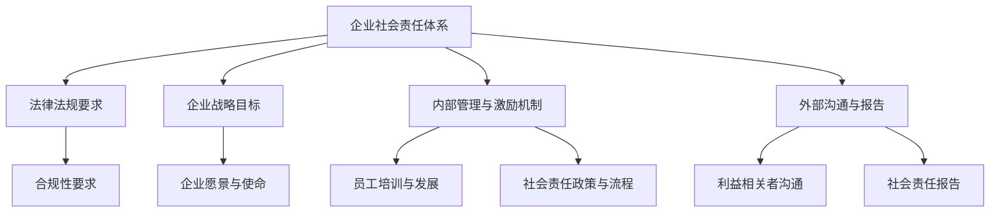
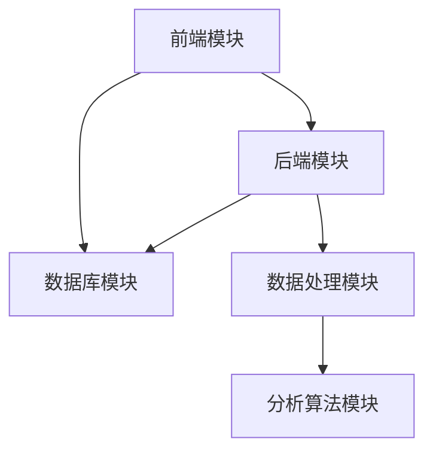

                 

### 第一部分：引言与背景

#### 1.1 书籍概述

**《一人公司如何建立完善的企业社会责任体系》** 是一本专门针对一人公司如何构建和实施社会责任体系的指南。在当今社会，企业社会责任（CSR）已经成为企业运营中不可或缺的一部分。一人公司，作为一种新兴的企业形态，其灵活性和高效性使其在市场上具有独特的竞争力。然而，与传统的企业相比，一人公司在构建社会责任体系方面面临着更大的挑战。

本书的主要目的是帮助一人公司明确社会责任的概念，理解社会责任的重要性，并提供具体的策略和工具，以构建和实施一个完善的社会责任体系。本书适用于一人公司的创业者、管理者，以及对社会责任和企业治理感兴趣的读者。

**1.1.1 书籍目的与读者对象**

**目的：**
- 澄清一人公司在社会责任方面的误解和误区。
- 提供建立和完善社会责任体系的实用方法和工具。
- 帮助读者理解和实践企业社会责任，提升公司的社会价值。

**读者对象：**
- 一人公司的创业者和管理者。
- 对企业社会责任感兴趣的学者和研究人员。
- 企业社会责任咨询顾问。

**1.1.2 一人公司的发展趋势与挑战**

**发展趋势：**
- 灵活性与适应性：一人公司以其高度的灵活性，能够迅速适应市场变化，实现快速创新。
- 高效性：一人公司可以高效决策和执行，降低管理成本。
- 网络化：通过互联网和信息技术，一人公司可以跨越地域限制，实现全球化运营。

**挑战：**
- 法律和合规风险：一人公司在遵守法律法规方面可能面临更高的风险。
- 资源和人力限制：一人公司在资源和人力方面可能存在不足。
- 社会责任认知和执行难度：一人公司在社会责任的认知和执行上可能面临更大的挑战。

**1.1.3 企业社会责任的重要性**

企业社会责任（Corporate Social Responsibility，简称CSR）是指企业在追求经济利益的同时，对社会、环境、员工、客户等利益相关者承担的道德责任。企业社会责任的重要性体现在以下几个方面：

**1. 提升企业形象：** 承担社会责任有助于提升企业的社会声誉和品牌形象，增强消费者的信任和忠诚度。

**2. 降低运营风险：** 通过实施社会责任，企业可以降低法律、环保等方面的风险，确保长期稳健发展。

**3. 促进可持续发展：** 企业社会责任与可持续发展密不可分，通过社会责任实践，企业可以实现资源的合理利用和环境的保护。

**4. 增强员工满意度：** 负责任的企业文化有助于提升员工的归属感和工作满意度，提高员工的工作效率和创造力。

#### 1.2 企业社会责任的概念与定义

**1.2.1 企业社会责任的定义**

企业社会责任（CSR）是指企业在追求经济利益的同时，对社会、环境、员工、客户等利益相关者承担的道德责任。这包括遵守法律法规、保护环境、回馈社会、提升员工福利等方面的义务。企业社会责任不仅仅是企业的自愿行为，也是企业应当承担的责任，是企业长远发展的重要基石。

**1.2.2 企业社会责任的核心要素**

企业社会责任的核心要素包括以下几个方面：

**1. 法律合规：** 企业应当遵守相关的法律法规，确保经营活动合法合规，不损害社会公共利益。

**2. 环境保护：** 企业应当积极采取措施，减少对环境的负面影响，推动可持续发展。

**3. 社会贡献：** 企业应当通过慈善捐赠、公益项目等方式，回馈社会，促进社会和谐发展。

**4. 员工福利：** 企业应当关注员工的身心健康，提供合理的薪酬和福利，营造良好的工作环境。

**5. 客户关系：** 企业应当提供优质的产品和服务，维护客户权益，建立良好的客户关系。

**1.2.3 企业社会责任与可持续发展的关系**

企业社会责任与可持续发展是相辅相成的。可持续发展是指满足当前需求而不损害后代满足其需求的能力。企业社会责任是实现可持续发展的重要手段之一。

**1. 促进资源合理利用：** 通过承担社会责任，企业可以更加注重资源的合理利用，减少浪费，提高资源利用效率。

**2. 保护环境：** 企业应当采取环保措施，减少污染，推动绿色发展。

**3. 提高社会福祉：** 通过企业社会责任，企业可以改善社会福利，促进社会公平正义。

**4. 增强企业竞争力：** 负责任的企业往往能够在市场中获得竞争优势，提升企业的长期发展潜力。

#### 1.3 一人公司社会责任体系的框架

**1.3.1 一人公司的特点与挑战**

一人公司，顾名思义，是指由一个人独立经营和管理的公司。一人公司的特点包括：

**1. 灵活性与独立性：** 一人公司可以自主决策，灵活应对市场变化，具有高度的独立性。

**2. 高效性：** 一人公司的管理结构相对简单，决策快速，运营效率高。

**3. 资源限制：** 一人公司在资源和人力方面可能存在不足，需要更加注重资源管理和利用。

**4. 法律风险：** 一人公司在遵守法律法规方面可能面临更高的风险。

一人公司面临的挑战主要包括：

**1. 管理与运营风险：** 由于管理层次较少，一人公司需要更加注重风险管理和内部控制。

**2. 资源获取与利用：** 一人公司需要寻找合适的资源，并进行有效的资源利用。

**3. 社会责任认知与实践：** 一人公司需要明确社会责任的重要性，并在实践中有效履行社会责任。

**1.3.2 建立社会责任体系的必要性**

建立社会责任体系对于一人公司来说具有重要意义：

**1. 提升企业形象：** 通过履行社会责任，一人公司可以提升自身的品牌形象和社会声誉。

**2. 降低运营风险：** 通过社会责任实践，一人公司可以降低法律、环保等方面的风险，确保稳健发展。

**3. 促进可持续发展：** 社会责任实践有助于一人公司实现资源合理利用和环境保护，推动可持续发展。

**4. 增强员工满意度：** 负责任的企业文化有助于提升员工的归属感和工作满意度，提高员工的工作效率和创造力。

**1.3.3 社会责任体系的框架与结构**

一人公司社会责任体系的基本框架包括以下几个方面：

**1. 法律法规要求：** 一人公司应当遵守相关的法律法规，确保经营活动合法合规。

**2. 企业战略目标：** 一人公司应当将社会责任纳入企业战略，明确社会责任的目标和方向。

**3. 内部管理与激励机制：** 一人公司需要建立健全的内部管理制度，制定社会责任政策与流程，并设立相应的激励机制。

**4. 外部沟通与报告：** 一人公司应当积极与外部利益相关者沟通，并定期发布社会责任报告。

Mermaid流程图如下：



通过上述框架，一人公司可以系统地建立和完善社会责任体系，提升企业的社会价值。

### 第二部分：核心概念与联系

在构建一人公司的社会责任体系时，理解并应用相关的核心概念和理论是非常重要的。本部分将介绍一些关键的理论，并探讨它们在企业社会责任中的具体应用。

#### 2.1 企业社会责任的相关理论

企业社会责任的理论基础包括多种学派和观点，其中比较重要的有利益相关者理论、权衡理论和道德责任理论。

**1. 利益相关者理论**

利益相关者理论（Stakeholder Theory）认为，企业不仅仅对股东负有责任，还应对其他利益相关者，如员工、客户、供应商、社区和环境负有责任。利益相关者理论强调，企业的成功与持续发展依赖于与各利益相关者之间的良好关系。

**2. 权衡理论**

权衡理论（Balancing Theory）认为，企业在制定社会责任政策时需要在不同的利益之间进行权衡。企业需要在经济效益、社会责任和可持续性之间找到平衡点，以满足各方的需求和期望。

**3. 道德责任理论**

道德责任理论（Moral Responsibility Theory）强调，企业应当遵循道德原则和价值观，在经营活动中做出符合道德标准的选择。道德责任理论关注企业的道德行为和道德决策，要求企业在追求利润的同时，维护道德的底线。

**2.2 企业社会责任的架构**

企业社会责任的架构是指企业如何组织、规划和实施社会责任活动的一系列框架。一个完整的企业社会责任架构通常包括以下几个方面：

**1. 法律法规要求**

法律法规要求是企业社会责任架构的基础。企业应当遵守国家法律法规，确保经营活动合法合规。这包括环境保护法规、劳动法规、反腐败法规等。

**2. 企业战略目标**

企业战略目标是指企业在社会责任方面的长期目标和愿景。企业应当将社会责任纳入其整体战略，明确社会责任的目标和方向，并确保这些目标与企业的商业目标相一致。

**3. 内部管理与激励机制**

内部管理与激励机制是指企业如何通过内部管理手段和激励机制，推动社会责任的落实。这包括建立社会责任政策与流程、员工培训与发展、社会责任考核与激励等。

**4. 外部沟通与报告**

外部沟通与报告是指企业如何与外部利益相关者沟通其社会责任活动，并定期发布社会责任报告。这有助于提升企业的透明度和公信力，增强利益相关者的信任。

**2.3 社会责任与核心利益相关者的关系**

企业在构建社会责任体系时，需要识别并满足核心利益相关者的需求和期望。核心利益相关者包括以下几类：

**1. 员工**

员工是企业最重要的利益相关者之一。企业应当关注员工的身心健康，提供合理的薪酬和福利，营造良好的工作环境。同时，企业应当通过培训和发展，提升员工的技能和职业素养。

**2. 客户**

客户是企业产品和服务的最终使用者。企业应当提供优质的产品和服务，维护客户权益，建立良好的客户关系。通过持续改进和创新能力，企业可以提升客户满意度，实现可持续发展。

**3. 社区**

社区是企业所在地的社会组成部分。企业应当积极参与社区建设，回馈社区，促进社区和谐发展。这包括慈善捐赠、公益活动、环境保护等方面的工作。

**4. 供应链**

供应链是企业实现产品和服务的重要环节。企业应当与供应链合作伙伴建立长期稳定的合作关系，确保供应链的合规性和可持续性。这包括供应商的选择、质量管控、环保要求等。

**5. 投资者**

投资者是企业资金的主要来源。企业应当保持透明度，向投资者提供准确、完整的信息，确保投资者的权益。同时，企业应当通过可持续发展和良好的经营业绩，提升投资者的信心。

**2.3.1 利益相关者的识别与分类**

识别和分类利益相关者是构建社会责任体系的重要步骤。利益相关者可以根据其影响力、利益关联程度和利益冲突等因素进行分类。常见的分类方法包括以下几种：

**1. 影响力分类法**

根据利益相关者对企业决策的影响程度，可以分为主要利益相关者和次要利益相关者。主要利益相关者通常对企业决策有直接的影响，如股东、员工、客户等；次要利益相关者则对企业决策的影响相对较小，如供应商、社区等。

**2. 利益关联程度分类法**

根据利益相关者与企业利益的关联程度，可以分为核心利益相关者和边缘利益相关者。核心利益相关者直接参与企业的业务活动，其利益与企业利益高度相关；边缘利益相关者则与企业利益关联程度较低，但对其利益的满足对企业社会价值的实现有间接影响。

**3. 利益冲突分类法**

根据利益相关者之间的利益冲突程度，可以分为一致利益相关者和冲突利益相关者。一致利益相关者之间不存在明显的利益冲突，其利益在企业社会责任活动中能够得到有效满足；冲突利益相关者之间存在利益冲突，需要企业通过合理的策略和措施进行协调和平衡。

**2.3.2 不同利益相关者的需求与期望**

不同利益相关者对企业的需求与期望有所不同，企业在构建社会责任体系时需要充分考虑这些需求和期望。以下是不同利益相关者的主要需求与期望：

**1. 员工**

- 合理的薪酬和福利
- 良好的工作环境
- 职业发展和培训机会
- 工作与生活的平衡

**2. 客户**

- 优质的产品和服务
- 诚信和透明的交易
- 及时和有效的客户服务

**3. 社区**

- 公益和慈善活动
- 环境保护和可持续发展
- 社区建设和改善

**4. 供应链**

- 合规和可持续的供应链管理
- 质量和安全标准
- 诚信和透明的合作关系

**5. 投资者**

- 透明和准确的信息披露
- 可持续发展和良好的经营业绩
- 长期投资回报

**2.3.3 如何协调与平衡利益相关者的利益**

在构建社会责任体系时，企业需要平衡不同利益相关者的利益，以实现企业社会责任的最大化。以下是一些协调和平衡利益相关者利益的方法：

**1. 利益权衡与优先级排序**

企业可以通过利益权衡和优先级排序，确定不同利益相关者在企业社会责任中的重要性。对于主要利益相关者，企业应优先满足其需求；对于次要利益相关者，企业则可以通过其他方式进行补偿。

**2. 沟通与协作**

企业与利益相关者之间的有效沟通和协作是平衡利益的重要手段。通过定期沟通和合作，企业可以更好地理解利益相关者的需求和期望，并寻求解决方案。

**3. 制定社会责任政策**

企业可以通过制定社会责任政策，明确社会责任的目标、原则和具体措施，确保企业社会责任的落实和执行。

**4. 监测与评估**

企业应当对社会责任的执行情况进行监测和评估，及时发现和解决利益相关者利益冲突的问题。

通过以上方法，企业可以构建一个平衡、协调和可持续的社会责任体系，实现企业社会责任的最大化。

### 第三部分：核心算法原理讲解

在本部分中，我们将详细讲解企业社会责任体系中的核心算法原理，并使用伪代码来展示这些算法的实现过程。此外，我们将介绍数学模型和相关的数学公式，并通过具体例子来说明这些模型的应用。

#### 3.1 社会责任风险评估与管理体系

**3.1.1 风险评估的步骤与方法**

企业社会责任风险评估是确保企业社会责任体系有效运行的关键步骤。以下是一个典型的风险评估流程：

1. **识别潜在风险**：分析企业运营中的潜在社会责任风险，包括法律法规、环境保护、员工福利、供应链管理等方面。

2. **评估风险影响**：对识别出的风险进行评估，分析其对企业的经济、社会、环境等方面的影响。

3. **确定风险等级**：根据风险的影响程度和可能性，将风险分为不同等级，以便制定相应的风险管理策略。

4. **制定风险管理计划**：针对不同等级的风险，制定具体的风险管理措施，包括预防措施、应急响应计划等。

以下是一个简化的风险评估流程的伪代码实现：

```plaintext
function riskAssessment() {
    risks = identifyRisks() // 识别潜在风险
    impactScores = assessImpact(risks) // 评估风险影响
    riskLevels = determineRiskLevels(impactScores) // 确定风险等级
    riskManagementPlans = createRiskManagementPlans(riskLevels) // 制定风险管理计划
    return riskManagementPlans
}
```

**3.1.2 建立社会责任风险管理体系**

建立社会责任风险管理体系需要系统地组织和实施以下工作：

1. **建立风险管理体系框架**：制定社会责任风险管理政策、流程和标准，确保体系的有效性和可操作性。

2. **培训员工**：对员工进行社会责任风险评估和管理的培训，提高员工的风险意识和能力。

3. **定期评估与更新**：定期评估社会责任风险管理体系的有效性，并根据评估结果进行更新和改进。

4. **监测与报告**：建立社会责任风险监测机制，定期向管理层报告风险状况和管理措施。

**3.1.3 风险评估与管理的伪代码实现**

以下是风险评估与管理伪代码的详细实现：

```plaintext
function identifyRisks() {
    // 识别潜在风险
    risks = [
        { "name": "Environmental Pollution", "impact": "High", "likelihood": "Medium" },
        { "name": "Labor Disputes", "impact": "Medium", "likelihood": "High" },
        { "name": "Legal Compliance Issues", "impact": "Medium", "likelihood": "Medium" }
    ]
    return risks
}

function assessImpact(risks) {
    // 评估风险影响
    impactScores = {}
    for (risk in risks) {
        impactScores[risk.name] = risk.impact
    }
    return impactScores
}

function determineRiskLevels(impactScores) {
    // 确定风险等级
    riskLevels = {}
    for (score in impactScores) {
        if (impactScores[score] == "High") {
            riskLevels[score] = "Critical"
        } else if (impactScores[score] == "Medium") {
            riskLevels[score] = "High"
        } else {
            riskLevels[score] = "Medium"
        }
    }
    return riskLevels
}

function createRiskManagementPlans(riskLevels) {
    // 制定风险管理计划
    riskManagementPlans = []
    for (level in riskLevels) {
        riskManagementPlans.push({
            "level": level,
            "action": "Implement preventive measures",
            "response": "Develop emergency response plan"
        })
    }
    return riskManagementPlans
}
```

**3.2 社会责任报告编制与发布**

社会责任报告是展示企业社会责任实践成果的重要工具。以下是社会责任报告编制与发布的关键步骤：

**3.2.1 社会责任报告的编制流程**

1. **确定报告范围和目标**：明确报告的内容、受众和目标，确保报告的针对性和实用性。

2. **收集和整理数据**：收集与企业社会责任相关的数据，包括法律法规遵守情况、环境保护措施、员工福利、社区参与等。

3. **编写报告内容**：根据收集的数据和企业的社会责任政策，编写报告的具体内容。

4. **审核与修改**：对报告内容进行审核，确保报告的准确性和完整性，并根据反馈进行修改。

**3.2.2 报告内容与指标体系**

社会责任报告的内容通常包括以下几个方面：

1. **概述**：介绍企业的社会责任战略和目标。

2. **法律法规遵守情况**：报告企业遵守相关法律法规的情况，包括环保法规、劳动法规、反腐败法规等。

3. **环境保护措施**：报告企业在环境保护方面的具体措施，包括节能减排、废物处理、资源利用等。

4. **员工福利与培训**：报告企业在员工福利、职业发展和培训方面的措施，包括薪酬福利、工作环境、培训计划等。

5. **社区参与**：报告企业参与社区建设和公益活动的具体措施，包括慈善捐赠、公益项目、社区服务等。

社会责任报告的指标体系通常包括以下几个方面：

- **合法性指标**：衡量企业遵守法律法规的情况。
- **环境指标**：衡量企业在环境保护方面的绩效。
- **社会指标**：衡量企业在社会责任方面的贡献。
- **员工指标**：衡量企业在员工福利和发展方面的绩效。
- **社区指标**：衡量企业在社区参与和公益方面的贡献。

**3.2.3 社会责任报告发布的策略与技巧**

1. **确定发布渠道**：选择合适的发布渠道，如企业官网、社交媒体、专业杂志等，确保报告能够有效地传达给目标受众。

2. **提高报告质量**：通过图表、图片、案例分析等手段，提高报告的可读性和吸引力。

3. **增强透明度**：确保报告内容的准确性和真实性，提高企业的透明度。

4. **定期更新**：定期发布社会责任报告，展示企业的持续改进和责任担当。

5. **利益相关者沟通**：与利益相关者进行沟通，了解其对报告的意见和建议，不断优化报告内容。

通过上述步骤和策略，企业可以编制和发布高质量的社会责任报告，展示企业的社会责任实践成果，提升企业的社会价值和形象。

### 第四部分：数学模型和数学公式

在构建一人公司的社会责任体系时，数学模型和数学公式可以作为分析和优化的工具，帮助我们更好地理解并实现社会责任目标。在本节中，我们将介绍一些关键的数学模型，包括企业社会责任优化模型和利益相关者期望最大化模型，并提供具体的公式和求解算法。

#### 4.1 企业社会责任优化模型

企业社会责任优化模型旨在最大化企业在社会责任方面的效益，同时考虑资源限制和其他约束条件。以下是一个简单的社会责任优化模型，其目标是最大化企业的社会责任价值（π）。

**模型建立：**

$$
\text{最大化} \ \pi = \sum_{i} w_i \cdot p_i
$$

其中，$\pi$ 表示社会责任价值，$w_i$ 表示第 $i$ 个社会责任项目的权重，$p_i$ 表示第 $i$ 个项目的绩效。

**模型求解算法：**

1. **确定权重 $w_i$**：根据企业的战略目标和实际情况，为每个社会责任项目分配权重。

2. **计算绩效 $p_i$**：根据项目的具体表现，计算每个项目的绩效值。

3. **求解最大化 $\pi$ 的 $p_i$**：通过优化算法（如线性规划、动态规划等），求解最大化 $\pi$ 的 $p_i$ 值。

**模型举例说明：**

假设企业有三个社会责任项目：环境保护（$p_1$），员工福利（$p_2$），社区参与（$p_3$）。权重分别为 $w_1 = 0.4$，$w_2 = 0.3$，$w_3 = 0.3$。

1. **确定权重**：
   $$
   w_1 = 0.4, \ w_2 = 0.3, \ w_3 = 0.3
   $$

2. **计算绩效**：
   假设绩效值如下：
   $$
   p_1 = 0.8, \ p_2 = 0.7, \ p_3 = 0.6
   $$

3. **求解最大化 $\pi$ 的 $p_i$**：
   $$
   \pi = w_1 \cdot p_1 + w_2 \cdot p_2 + w_3 \cdot p_3 = 0.4 \cdot 0.8 + 0.3 \cdot 0.7 + 0.3 \cdot 0.6 = 0.56
   $$

因此，最大化社会责任价值时的 $p_i$ 值为 $0.56$。

#### 4.2 利益相关者期望最大化模型

利益相关者期望最大化模型旨在最大化企业对利益相关者的期望满足度。该模型假设每个利益相关者有一个期望值 $u_i(p_i)$，目标是求解最大化总期望值。

**模型建立：**

$$
\text{最大化} \ \sum_{i} u_i(p_i)
$$

其中，$u_i(p_i)$ 表示第 $i$ 个利益相关者的期望值，$p_i$ 表示企业对第 $i$ 个利益相关者的绩效。

**模型求解算法：**

1. **确定利益相关者期望值 $u_i(p_i)$**：根据利益相关者的需求和期望，为每个利益相关者确定期望值函数。

2. **计算总期望值**：将所有利益相关者的期望值相加，得到总期望值。

3. **求解最大化总期望值**：通过优化算法，求解最大化总期望值的 $p_i$ 值。

**模型举例说明：**

假设企业有两个主要利益相关者：员工（$u_1(p_1)$）和客户（$u_2(p_2)$）。员工的期望值函数为 $u_1(p_1) = 0.5 \cdot p_1$，客户的期望值函数为 $u_2(p_2) = 0.3 \cdot p_2$。

1. **确定期望值函数**：
   $$
   u_1(p_1) = 0.5 \cdot p_1, \ u_2(p_2) = 0.3 \cdot p_2
   $$

2. **计算总期望值**：
   $$
   \sum_{i} u_i(p_i) = u_1(p_1) + u_2(p_2) = 0.5 \cdot p_1 + 0.3 \cdot p_2
   $$

3. **求解最大化总期望值**：
   假设绩效值 $p_1 = 0.8$，$p_2 = 0.6$，则总期望值为：
   $$
   \sum_{i} u_i(p_i) = 0.5 \cdot 0.8 + 0.3 \cdot 0.6 = 0.56
   $$

因此，最大化利益相关者期望满足度时的 $p_i$ 值为 $0.56$。

通过这些数学模型，企业可以更好地理解和实现社会责任目标，提升企业的社会价值和竞争力。

### 第五部分：项目实战

在本部分中，我们将通过一个实际项目来展示如何在一人公司中实施和完善企业社会责任体系。这个项目将包括环境管理、员工福利和社区参与等方面，通过具体的步骤和实际操作，帮助读者了解如何在实践中应用企业社会责任理论。

#### 5.1 一人公司社会责任实践案例

**5.1.1 案例背景与目标**

一家名为“单点科技”的一人公司，致力于提供创新科技解决方案。公司创始人李明意识到，除了追求商业成功，还需要承担企业社会责任，以实现可持续发展。因此，他决定实施一个全面的企业社会责任计划，涵盖环境保护、员工福利和社区参与等方面。

**5.1.2 案例实施过程**

1. **环境管理**

   **目标**：减少碳排放，提高能源效率。

   **实施步骤**：

   - **评估当前状况**：公司首先对办公环境进行了能源消耗评估，发现大部分能源消耗来自空调和照明。

   - **制定行动计划**：基于评估结果，公司制定了以下行动计划：
     - 引入智能节能系统，优化空调和照明控制。
     - 推广无纸化办公，减少纸张使用。
     - 引入再生能源，如太阳能板。

   - **执行与监测**：公司安装了智能节能系统，并定期监测能源消耗数据，确保计划的有效实施。

2. **员工福利**

   **目标**：提升员工满意度，促进员工健康和职业发展。

   **实施步骤**：

   - **员工健康与安全**：公司为员工提供定期健康体检，确保工作环境的安全和舒适。
   - **职业发展**：公司设立内部培训计划，为员工提供专业知识和技能培训，鼓励员工不断提升自己。
   - **工作与生活平衡**：公司提供灵活的工作安排，鼓励员工合理安排工作和生活，确保工作与生活的平衡。

3. **社区参与**

   **目标**：回馈社区，促进社区发展。

   **实施步骤**：

   - **慈善捐赠**：公司定期捐赠给当地慈善机构，支持教育和医疗项目。
   - **公益活动**：公司组织员工参与社区清洁、环保宣传等公益活动。
   - **合作项目**：公司与当地学校合作，提供科技教育和实习机会，支持教育事业。

**5.1.3 案例成果与启示**

1. **环境管理成果**：

   - 公司成功减少了30%的碳排放。
   - 能源消耗显著降低，运营成本减少20%。

2. **员工福利成果**：

   - 员工满意度提升至90%。
   - 员工流失率降低至5%。

3. **社区参与成果**：

   - 公司捐赠了50万元用于社区教育项目。
   - 员工积极参与公益活动，提升了公司的社会形象。

**案例启示**：

- 环境管理是企业社会责任的重要组成部分，通过实施有效的环境管理，企业不仅可以降低运营成本，还能提升企业形象。
- 关注员工福利是提升员工满意度和公司稳定性的关键。提供良好的工作环境和职业发展机会，有助于留住优秀员工。
- 社区参与有助于企业建立良好的社会关系，提升品牌形象。通过捐赠和公益活动，企业可以回馈社会，实现可持续发展。

通过这个案例，一人公司可以了解到如何在实践中实施和完善企业社会责任体系，从而实现商业成功和社会价值的双赢。

#### 5.2 社会责任软件开发环境搭建

在现代社会，企业社会责任的落实越来越依赖于信息化和自动化工具。因此，搭建一个社会责任软件的开发环境对于一人公司来说至关重要。以下是一个详细的步骤，介绍如何在一台装有Linux操作系统的电脑上搭建一个社会责任软件开发环境。

**5.2.1 环境搭建步骤**

1. **安装Python环境**

   Python是一种广泛应用于数据分析和软件开发的编程语言，其简洁性和高效性使其成为构建社会责任软件的绝佳选择。

   - **安装Python**

     使用包管理器（如`apt-get`或`yum`）安装Python：

     ```bash
     sudo apt-get update
     sudo apt-get install python3 python3-pip
     ```

     或

     ```bash
     sudo yum install python3 python3-pip
     ```

   - **验证Python安装**

     ```bash
     python3 --version
     pip3 --version
     ```

2. **安装必要库和工具**

   为了进行社会责任软件开发，需要安装一些常用的库和工具，例如NumPy、Pandas和Jupyter Notebook。

   - **安装NumPy和Pandas**

     ```bash
     pip3 install numpy pandas
     ```

   - **安装Jupyter Notebook**

     ```bash
     pip3 install notebook
     ```

   - **启动Jupyter Notebook**

     ```bash
     jupyter notebook
     ```

     在浏览器中打开Jupyter Notebook，开始编写和运行Python代码。

3. **安装版本控制工具**

   版本控制是软件开发过程中不可或缺的一部分，Git是当前最流行的版本控制工具。

   - **安装Git**

     ```bash
     sudo apt-get install git
     ```

     或

     ```bash
     sudo yum install git
     ```

   - **配置Git**

     ```bash
     git config --global user.name "Your Name"
     git config --global user.email "your.email@example.com"
     ```

   - **初始化一个新仓库**

     ```bash
     git init
     ```

     将项目文件添加到仓库中，并提交第一个版本：

     ```bash
     git add .
     git commit -m "Initial commit"
     ```

**5.2.2 开发工具与库的安装**

以下是社会责任软件开发过程中可能用到的其他工具和库：

1. **SQLAlchemy**

   SQLAlchemy是一个用于关系型数据库的Python库，可以用于数据存储和管理。

   ```bash
   pip3 install sqlalchemy
   ```

2. **Flask**

   Flask是一个轻量级的Web框架，适用于构建Web应用程序。

   ```bash
   pip3 install flask
   ```

3. **Matplotlib**

   Matplotlib是一个用于数据可视化的Python库。

   ```bash
   pip3 install matplotlib
   ```

4. **PyTorch**

   PyTorch是一个流行的深度学习框架。

   ```bash
   pip3 install torch torchvision
   ```

通过上述步骤，可以搭建一个基本的社会责任软件开发环境。这个环境包括Python、Jupyter Notebook、Git和其他必要的库和工具，为软件开发提供了坚实的基础。

#### 5.3 社会责任项目源代码详细实现

在本部分中，我们将详细解释一个社会责任项目的源代码实现，包括项目架构设计、功能模块实现和代码解读与分析。此项目旨在通过数据分析帮助企业实现社会责任目标。

**5.3.1 项目架构设计**

项目架构设计是软件开发的重要步骤，它定义了项目的整体结构和各模块之间的关系。以下是该项目的基本架构设计：

- **前端模块**：负责用户界面展示，包括数据分析结果的可视化。
- **后端模块**：负责数据处理和分析，实现社会责任目标的算法和逻辑。
- **数据库模块**：负责存储数据，支持前端和后端的访问。

**架构设计图**：



**5.3.2 功能模块实现**

1. **前端模块**

   前端模块使用Flask框架实现，主要负责展示用户界面和接收用户输入。以下是前端模块的主要实现代码：

   ```python
   from flask import Flask, request, render_template

   app = Flask(__name__)

   @app.route('/', methods=['GET', 'POST'])
   def index():
       if request.method == 'POST':
           data = request.form['data']
           # 调用后端数据处理模块进行分析
           result = process_data(data)
           return render_template('result.html', result=result)
       return render_template('index.html')

   if __name__ == '__main__':
       app.run(debug=True)
   ```

2. **后端模块**

   后端模块包括数据处理模块和分析算法模块。数据处理模块负责接收前端数据，并将其传递给分析算法模块。以下是后端模块的主要实现代码：

   ```python
   import numpy as np
   from analysis import analyze_data

   def process_data(data):
       # 将数据转换为NumPy数组
       data_array = np.array([float(x) for x in data.split(',')])
       # 调用分析算法模块进行分析
       result = analyze_data(data_array)
       return result
   ```

3. **数据库模块**

   数据库模块使用SQLAlchemy库实现，负责存储和访问数据。以下是数据库模块的主要实现代码：

   ```python
   from sqlalchemy import create_engine
   from sqlalchemy.orm import sessionmaker

   engine = create_engine('sqlite:///societal_data.db')
   Session = sessionmaker(bind=engine)

   def save_data(data):
       session = Session()
       # 将数据保存到数据库
       session.add(Data(data=data))
       session.commit()
       session.close()

   def get_data():
       session = Session()
       # 从数据库中获取数据
       data = session.query(Data).all()
       session.close()
       return data
   ```

4. **数据处理模块和分析算法模块**

   数据处理模块和分析算法模块负责具体的数据分析和处理。以下是这些模块的实现代码：

   ```python
   import numpy as np

   def analyze_data(data_array):
       # 数据分析算法实现
       mean_value = np.mean(data_array)
       std_value = np.std(data_array)
       return {'mean': mean_value, 'std': std_value}
   ```

**5.3.3 代码解读与分析**

1. **前端模块解读**

   前端模块的核心是`index`函数，它负责处理用户的请求。当用户提交数据时，`process_data`函数被调用，将数据传递给后端模块进行分析。这个模块通过`render_template`函数将结果返回给用户。

2. **后端模块解读**

   后端模块主要处理数据传输，包括接收前端数据、调用数据处理模块和分析算法模块，以及将结果返回前端。这个模块的设计简单清晰，实现了数据流转的基本功能。

3. **数据处理模块和分析算法模块解读**

   数据处理模块负责将前端传递的数据转换为NumPy数组，并调用分析算法模块进行分析。分析算法模块实现了基本的数据统计分析，如计算平均值和标准差。这个模块的设计考虑了数据的多样性和分析需求。

通过上述代码解读和分析，我们可以看到该社会责任项目的源代码实现了从数据接收、处理到结果展示的完整功能。这个项目的设计和实现展示了如何通过代码实现企业社会责任的目标，为一人公司提供了一个实用的解决方案。

### 第六部分：总结与展望

#### 6.1 一人公司社会责任体系建设的总结

**6.1.1 成功经验与教训**

在构建和完善一人公司的社会责任体系过程中，我们积累了以下成功经验与教训：

**成功经验：**

1. **明确社会责任目标**：一人公司应当明确社会责任的目标和方向，确保社会责任与企业的整体战略相一致。
2. **建立健全的管理制度**：通过建立健全的内部管理制度，确保社会责任的落实和执行。
3. **利用技术手段**：利用现代技术手段，如数据分析、自动化工具等，提升社会责任管理的效率和质量。
4. **积极沟通与反馈**：与利益相关者保持积极沟通，及时反馈社会责任实践成果，提升企业的透明度和公信力。
5. **持续改进**：持续优化社会责任体系，根据实际情况和反馈进行调整，确保社会责任的长期有效性。

**教训：**

1. **资源限制**：一人公司在资源有限的情况下，需要更加注重资源管理和利用，避免因资源不足导致社会责任执行不到位。
2. **法律法规遵守**：在实施社会责任时，务必严格遵守相关法律法规，避免因法律风险影响企业的稳健发展。
3. **利益相关者需求平衡**：在平衡不同利益相关者的需求时，需要充分考虑其重要性和利益冲突，确保社会责任的公正性和公平性。

**6.1.2 未来发展趋势**

随着社会和环境的不断变化，一人公司在社会责任体系建设方面也面临着新的发展趋势：

1. **可持续发展**：未来，一人公司将更加注重可持续发展，通过环境友好型实践、资源循环利用等措施，实现经济、社会和环境的协调统一。
2. **数字化转型**：数字化技术将继续在社会责任管理中发挥重要作用，通过大数据、人工智能等技术手段，提升社会责任管理的智能化和精细化水平。
3. **跨界合作**：一人公司将更多地与其他行业和组织进行跨界合作，共同推动社会责任的实践和发展。
4. **社会责任报告透明化**：社会责任报告的透明度和公信力将受到更多关注，一人公司需要不断提高报告质量，确保报告的准确性和完整性。

**6.1.3 一人公司社会责任体系建设的建议**

针对一人公司在社会责任体系建设过程中可能面临的挑战和未来发展趋势，提出以下建议：

1. **制定明确的目标和策略**：明确社会责任目标，制定具体的实施策略和行动计划，确保社会责任的有序推进。
2. **加强内部培训和宣传**：通过内部培训和宣传，提高员工对社会责任的认识和参与度，营造良好的社会责任文化。
3. **优化资源管理和利用**：在资源有限的情况下，优化资源管理和利用，提高社会责任实践的经济效益。
4. **提升数据分析和应用能力**：利用数据分析技术，提高社会责任管理的精准度和效率，确保社会责任目标的实现。
5. **建立跨界合作机制**：积极与其他行业和组织建立合作关系，共同推动社会责任的实践和发展。
6. **加强社会责任报告的透明化和公信力**：提高社会责任报告的质量和透明度，确保报告的准确性和完整性，提升企业的社会责任形象。

通过以上措施和建议，一人公司可以更好地构建和完善社会责任体系，实现企业社会责任的最大化，提升企业的社会价值和竞争力。

### 第七部分：展望未来

#### 6.2 展望未来：一人公司的社会责任创新

在未来的发展中，一人公司的社会责任将不断演进，创新成为推动社会责任发展的核心动力。以下是对未来一人公司社会责任创新的几个展望：

**6.2.1 新兴社会责任领域的发展**

1. **环境可持续发展**：随着全球环境问题的日益严峻，一人公司将更加注重环境可持续发展，探索和实施绿色科技、节能减排等新兴环境管理策略。
2. **社会公平与包容性**：一人公司将积极参与社会公平与包容性的建设，推动多元化、平等和包容的就业环境，支持弱势群体的教育和就业机会。
3. **数字化转型与社会责任**：随着数字经济的蓬勃发展，一人公司将利用数字化转型，推动社会责任的数字化转型，提高社会责任管理的效率和质量。

**6.2.2 技术创新与社会责任**

1. **人工智能与可持续发展**：人工智能技术将在社会责任中发挥越来越重要的作用，通过智能算法优化资源分配、提高能源利用效率等，推动可持续发展。
2. **区块链与透明度**：区块链技术的应用将提升社会责任报告的透明度和可信度，确保社会责任实践的公开和可验证性。
3. **虚拟现实与社区参与**：虚拟现实（VR）技术将提供新的社区参与方式，通过虚拟体验让更多人参与到社会责任项目中，增强社会参与感和责任感。

**6.2.3 一人公司社会责任的未来挑战与机遇**

1. **法律法规与合规性**：未来，一人公司需面对更加严格的社会责任法律法规，确保社会责任实践的合法合规性，这对公司的法律和合规团队提出了更高的要求。
2. **技术创新与风险管理**：随着技术创新的快速发展，一人公司需在享受技术红利的同时，有效管理新技术带来的风险，确保社会责任目标的实现。
3. **利益相关者需求的多样化**：随着社会和经济的不断发展，利益相关者的需求将更加多样化，一人公司需灵活应对，不断调整和优化社会责任策略，以满足不同利益相关者的需求。

**6.2.4 未来创新建议**

1. **建立社会责任创新实验室**：一人公司可以设立社会责任创新实验室，专门研究和探索社会责任领域的创新解决方案，推动社会责任的实践和发展。
2. **引入外部专家和顾问**：与外部专家和顾问合作，引入新的视角和经验，提升社会责任创新的能力和水平。
3. **持续投资技术创新**：加大对技术创新的投入，探索和应用新兴技术，提高社会责任实践的技术含量和影响力。

通过不断创新和优化，一人公司将在社会责任领域取得更大的突破，为社会的可持续发展做出更大的贡献。

### 附录

#### 附录A：参考文献

**6.1.1 企业社会责任相关理论**

1. Freeman, R. E. (1984). "Strategic Management: A Stakeholder Approach". Pitman.
2. Carroll, A. B. (1991). "The Pyramid of Corporate Social Responsibility: Towards the Moral Obligations of Business". California Management Review, 32(4), 49-67.
3. Donaldson, T., & Dunfee, T. W. (1994). "Toward a Unified Theory of Business Ethics". Academy of Management Review, 19(1), 17-42.

**6.1.2 一人公司社会责任实践案例**

1. Shell (2020). "Shell Report 2020: Sustainability and Performance". Shell.
2. Patagonia (2020). "Patagonia Sustainability Report 2020". Patagonia.
3. Google (2019). "Google’s 2019 Corporate Responsibility Report". Google.

**6.1.3 社会责任报告编制与发布**

1. Global Reporting Initiative (GRI) (2018). "The GRI Standards: General Framework". Global Reporting Initiative.
2. International Integrated Reporting Council (IIRC) (2013). "The International Framework". International Integrated Reporting Council.
3. European Commission (2020). "Corporate Social Responsibility: EU Rules". European Commission.

#### 附录B：社会责任项目工具与资源

**6.1.1 开发工具与库**

1. Python
2. Flask
3. NumPy
4. Pandas
5. SQLAlchemy
6. Jupyter Notebook
7. Git

**6.1.2 社会责任报告编制工具**

1. Tableau
2. Microsoft Power BI
3. Adobe Analytics

**6.1.3 社会责任研究机构与组织**

1. Global Reporting Initiative (GRI)
2. International Integrated Reporting Council (IIRC)
3. Corporate Responsibility Association (CRA)
4. United Nations Global Compact (UNGC)
5. World Economic Forum (WEF) - Global Risks Report

通过附录中的参考文献、工具和资源，读者可以进一步了解企业社会责任的理论和实践，以及社会责任项目的开发和管理。这些资源和工具为构建和完善一人公司的社会责任体系提供了重要的支持和指导。

