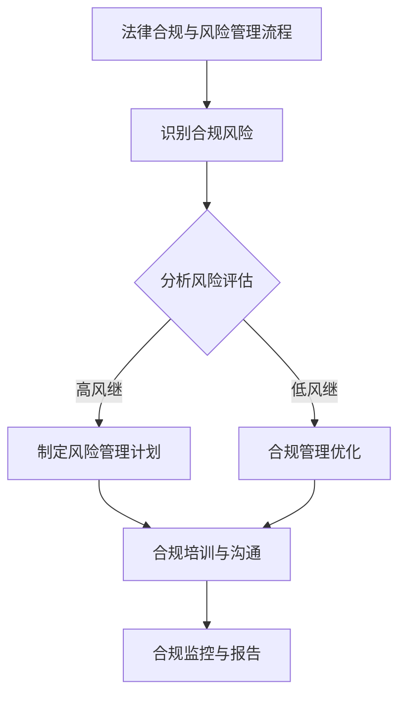
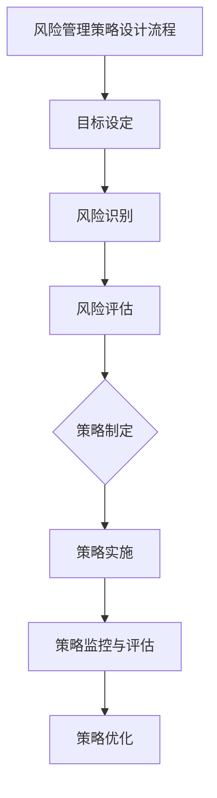
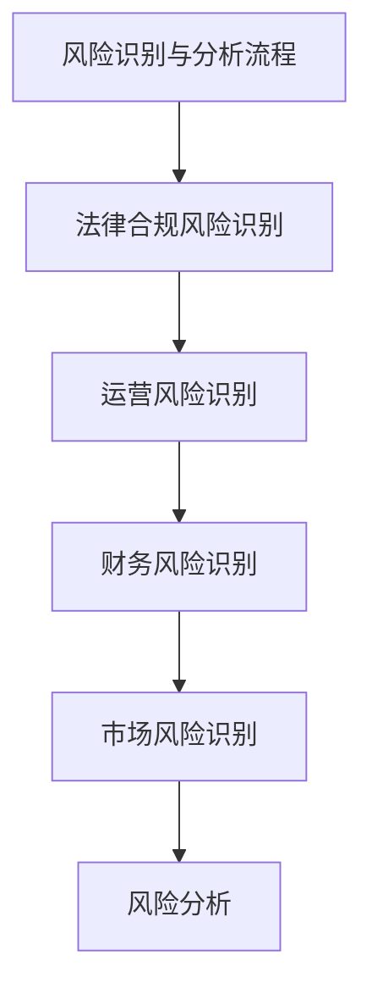
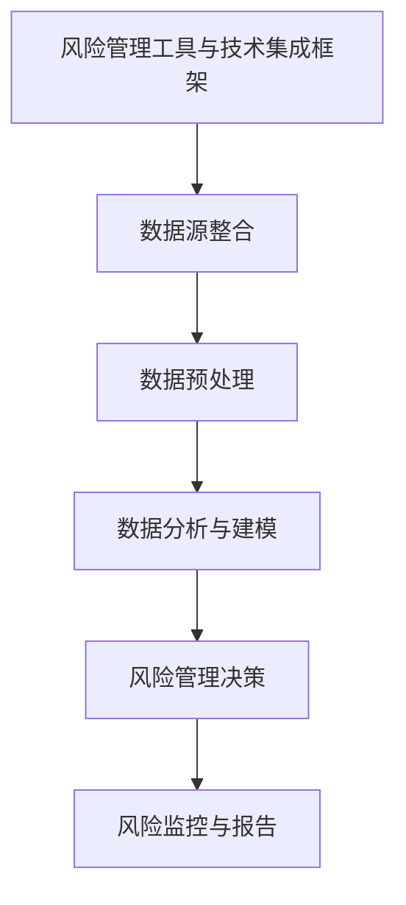
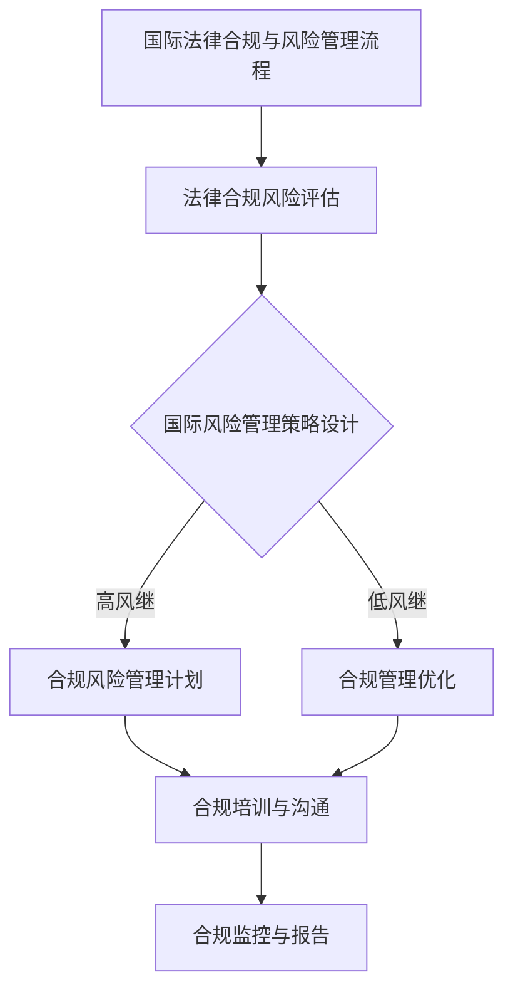
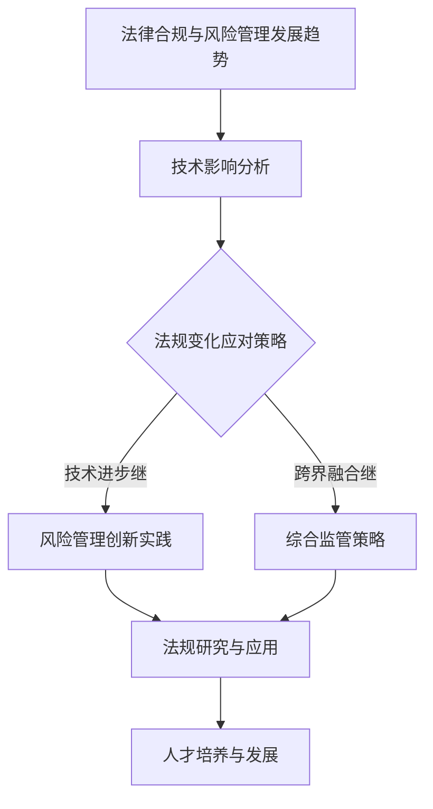

                 

### 《一人公司的法律合规与风险管理策略》

#### 关键词：法律合规、风险管理、一人公司、策略、实践、工具

#### 摘要：
本文深入探讨了一人公司的法律合规与风险管理策略。在全球化背景下，法律合规与风险管理对于任何企业，尤其是小型的一人公司，至关重要。本文首先概述了法律合规与风险管理的定义和联系，随后详细阐述了法律合规与风险管理的核心要素。接着，文章通过具体的章节，包括公司法律合规建设、风险管理策略设计、风险管理实践案例以及国际法律合规与风险管理，为读者提供了一套完整的合规与风险管理策略框架。最后，本文探讨了新兴技术对法律合规与风险管理的影响，并提出了未来发展策略。通过这些策略和实践，一人公司可以更好地应对潜在的法律和风险挑战，实现可持续发展。

### 第一部分：法律与风险管理基础

#### 第1章：法律合规与风险管理概述

在当前的商业环境中，法律合规与风险管理已经成为企业运营的基石。无论是大型企业还是小型的一人公司，都需要关注法律合规与风险管理，以确保业务的合法性和长期稳定发展。这一章将概述法律合规与风险管理的概念、核心要素及其重要性。

#### 1.1 法律合规与风险管理的定义

##### 1.1.1 法律合规的概念

法律合规是指企业遵循相关的法律、法规、规章制度和行业标准，确保其经营活动符合法律要求，避免违法行为所带来的风险和损失。

法律合规包括但不限于以下几个方面：

1. **法律法规遵循**：确保公司的经营活动符合国家法律、地方法规以及行业标准。
2. **合同合规**：确保合同的制定和执行符合法律要求，保护公司的利益。
3. **劳动法合规**：确保雇佣关系合法，遵守劳动法规定，保障员工的权益。
4. **数据保护与隐私**：确保数据的收集、存储和使用符合相关法律法规，保护个人隐私。

##### 1.1.2 风险管理的概念

风险管理是指企业识别、评估、应对和管理各种潜在风险的过程，以降低风险对业务的影响，确保企业运营的稳定性和可持续发展。

风险管理包括以下几个关键步骤：

1. **风险识别**：识别企业可能面临的各种风险，包括财务风险、运营风险、法律风险等。
2. **风险评估**：对识别出的风险进行评估，确定风险的可能性和影响。
3. **风险应对**：根据风险评估结果，制定和实施应对策略，以减轻或避免风险的影响。
4. **风险监控**：持续监控风险的演变情况，及时调整风险管理策略。

##### 1.1.3 法律合规与风险管理的联系

法律合规与风险管理密切相关。法律合规是风险管理的重要组成部分，良好的法律合规有助于降低企业的法律风险。同时，风险管理过程中的风险识别、评估和应对也需要遵循相关法律法规，确保企业行为的合法性和合规性。

法律合规有助于企业：

1. **规避法律风险**：避免因违法行为导致的法律责任和商业损失。
2. **提升企业声誉**：遵守法律法规，增强客户的信任和合作伙伴的认可。
3. **实现可持续发展**：通过合规经营，为企业创造长期稳定的发展环境。

风险管理则有助于企业：

1. **降低风险损失**：通过识别和评估风险，制定有效的应对策略，降低风险带来的损失。
2. **优化运营管理**：通过系统化的风险管理，提高企业的运营效率和风险管理能力。
3. **增强竞争力**：有效的风险管理能够帮助企业抓住市场机会，提高市场竞争力。

综上所述，法律合规与风险管理是企业发展不可或缺的组成部分，两者相辅相成，共同构建了企业稳健经营的基础。

#### 1.2 法律合规与风险管理的核心要素

##### 1.2.1 相关法律法规概述

在法律合规与风险管理中，相关法律法规是核心要素之一。以下是一些常见的法律法规：

1. **公司法**：规范公司的设立、运营、解散等各个环节，保护股东和债权人的合法权益。
2. **合同法**：规范合同的订立、履行、变更、解除等行为，保护交易双方的合法权益。
3. **劳动法**：规范雇佣关系，保障劳动者的权益，包括工资、工时、福利等方面。
4. **税法**：规范税收行为，确保企业的税收合法合规。
5. **数据保护法**：规范数据收集、存储、处理和使用，保护个人隐私和数据安全。
6. **环境保护法**：规范企业环境保护行为，保护生态环境。
7. **反洗钱法**：规范反洗钱行为，防止洗钱活动的发生。

了解和遵守这些法律法规，是企业进行法律合规与风险管理的基础。

##### 1.2.2 风险管理流程

风险管理流程是企业识别、评估、应对和管理风险的关键步骤。以下是一个典型的风险管理流程：

1. **风险识别**：通过内部审计、风险调查、业务分析等方法，识别企业可能面临的风险。
2. **风险评估**：对识别出的风险进行评估，确定风险的可能性和影响。
3. **风险应对**：根据风险评估结果，制定和实施应对策略，包括风险规避、风险减轻、风险转移等。
4. **风险监控**：持续监控风险的演变情况，及时调整风险管理策略。

##### 1.2.3 法律合规与风险管理的工具和方法

为了有效地进行法律合规与风险管理，企业可以采用以下工具和方法：

1. **合规管理系统**：通过建立合规管理系统，实现合规信息的集中管理，提高合规管理的效率。
2. **风险评估工具**：使用风险评估工具，对潜在风险进行量化分析，帮助制定更有效的应对策略。
3. **内部审计**：通过内部审计，发现和管理合规风险，提高企业的风险管理水平。
4. **培训与教育**：定期对员工进行合规培训，提高员工的合规意识和能力。

#### 1.3 法律合规与风险管理的重要性

##### 1.3.1 法律合规的必要性

法律合规是企业生存和发展的基础。以下是法律合规的必要性：

1. **法律风险规避**：遵守法律法规，可以避免因违法行为导致的法律责任和商业损失。
2. **企业信誉保护**：良好的法律合规记录，有助于提升企业的社会形象和品牌信誉。
3. **客户和合作伙伴信任**：遵守法律法规，能够增强客户和合作伙伴的信任，促进商业合作。
4. **长期发展保障**：通过合规经营，企业能够创造一个稳定、健康的发展环境，实现可持续发展。

##### 1.3.2 风险管理的意义

风险管理是企业实现稳健经营的关键。以下是风险管理的意义：

1. **风险损失降低**：通过识别和评估风险，企业可以制定有效的应对策略，降低风险带来的损失。
2. **运营效率提升**：系统化的风险管理，有助于提高企业的运营效率和决策能力。
3. **竞争力增强**：有效的风险管理，能够帮助企业抓住市场机会，提高市场竞争力。
4. **危机应对能力提升**：通过风险管理，企业可以更好地应对突发事件和危机，保障业务的连续性和稳定性。

##### 1.3.3 法律合规与风险管理对企业的影响

法律合规与风险管理对企业的各个方面都有深远的影响：

1. **财务管理**：合规经营有助于企业合理避税，降低财务风险。
2. **人力资源**：良好的法律合规与风险管理，有助于维护员工权益，降低员工流失率。
3. **供应链管理**：合规管理能够确保供应链的稳定和可靠，降低供应链风险。
4. **产品和服务质量**：法律合规与风险管理，有助于提升产品和服务质量，增强客户满意度。

总之，法律合规与风险管理是企业发展不可或缺的组成部分。通过建立有效的法律合规与风险管理机制，企业可以更好地应对外部环境的变化，实现长期稳健发展。

### Mermaid 流程图: 法律合规与风险管理流程

### 第二部分：法律合规实务

#### 第2章：公司法律合规建设

法律合规建设是企业确保其经营活动合法合规的重要环节，对于一人公司来说尤为重要。这一章将详细探讨公司法律合规建设的概述，包括法律合规部门的设立、法律合规岗位的职责、以及法律合规管理制度。

#### 2.1 公司法律合规建设概述

##### 2.1.1 法律合规部门的设立

法律合规部门的设立是企业法律合规建设的第一步，它负责制定和执行企业的法律合规政策，确保企业的所有活动都符合相关法律法规的要求。

1. **部门职能**：法律合规部门的主要职能包括：
    - 制定和执行企业的法律合规政策；
    - 识别和管理法律合规风险；
    - 提供法律咨询和培训；
    - 处理法律纠纷和诉讼。

2. **组织结构**：法律合规部门可以设立在公司的法务部或合规部，直接向公司管理层汇报。

##### 2.1.2 法律合规岗位的职责

法律合规岗位是企业法律合规建设的核心，其职责主要包括：

1. **合规专员**：
    - 负责制定和实施公司的法律合规政策；
    - 监督和评估公司各部门的合规情况；
    - 参与合同的审查和起草；
    - 提供法律咨询和培训。

2. **合规主管**：
    - 负责法律合规部门的日常运作；
    - 领导合规团队，制定合规计划；
    - 确保公司所有活动符合法律法规要求。

3. **法律顾问**：
    - 提供法律意见和咨询；
    - 参与合同审查和起草；
    - 应对公司面临的诉讼和纠纷。

##### 2.1.3 法律合规管理制度

法律合规管理制度是企业法律合规建设的重要组成部分，它包括以下内容：

1. **合规政策**：企业应制定详细的合规政策，明确合规目标和要求，确保所有员工都清楚合规的重要性。

2. **合规流程**：企业应建立合规流程，包括合规风险评估、合规审查、合规培训、合规监控等环节，确保合规工作有据可依。

3. **合规培训**：企业应定期对员工进行合规培训，提高员工的合规意识和能力，确保员工在日常工作中的行为符合法律法规要求。

4. **合规监控**：企业应建立合规监控机制，定期检查和评估合规情况，及时发现和纠正合规问题。

5. **合规报告**：企业应定期向管理层和相关部门报告合规情况，确保合规工作透明和高效。

#### 2.2 合规风险管理流程实施

##### 2.2.1 合规风险评估

合规风险评估是法律合规建设的重要环节，通过评估企业可能面临的法律合规风险，企业可以提前制定应对策略，降低风险对企业的负面影响。

1. **风险评估方法**：
    - **定性评估**：通过专家意见、情景分析等方法，对风险的可能性、影响程度进行定性分析。
    - **定量评估**：通过数据分析和统计方法，对风险的概率和损失进行定量分析。

2. **风险评估内容**：
    - **法律风险**：包括合同风险、知识产权风险、劳动法风险等。
    - **合规风险**：包括法律法规变化带来的风险、合规流程缺陷带来的风险等。

##### 2.2.2 合规风险监控

合规风险监控是确保企业合规性持续有效的关键。通过持续监控，企业可以及时发现合规问题，采取纠正措施。

1. **监控方法**：
    - **内部审计**：通过内部审计，检查企业各项活动的合规性。
    - **外部审查**：委托外部机构对企业进行合规审查，提高监控的客观性和专业性。

2. **监控内容**：
    - **合规流程监控**：监控合规流程的执行情况，确保各项合规措施得到落实。
    - **员工行为监控**：监控员工行为，确保员工遵守合规规定。

##### 2.2.3 合规风险应对

合规风险应对是企业应对法律合规风险的重要手段。通过制定和实施应对策略，企业可以最大限度地降低风险对企业的负面影响。

1. **应对策略**：
    - **规避策略**：通过调整业务模式或流程，避免风险的发生。
    - **减轻策略**：通过改进流程或引入技术手段，减轻风险的影响。
    - **转移策略**：通过购买保险或签订合同，将风险转移给第三方。

2. **应对措施**：
    - **法律咨询**：在面临法律合规风险时，及时咨询专业法律人士，获取专业建议。
    - **合规培训**：提高员工的合规意识和能力，减少合规风险的发生。

#### 2.3 合规管理工具与应用

##### 2.3.1 合规管理系统的建设

合规管理系统是企业进行合规管理的重要工具，通过建立合规管理系统，企业可以实现合规信息的集中管理，提高合规管理的效率。

1. **系统功能**：
    - **合规政策管理**：管理企业的合规政策，确保政策得到有效执行。
    - **合规流程管理**：监控合规流程的执行情况，确保各项合规措施得到落实。
    - **合规监控管理**：实时监控合规情况，及时发现和纠正合规问题。
    - **合规报告管理**：生成合规报告，确保合规工作透明和高效。

2. **系统实施**：
    - **需求分析**：分析企业合规管理的需求，确定系统功能。
    - **系统设计**：设计系统架构和功能模块。
    - **系统开发**：根据设计文档进行系统开发。
    - **系统测试**：进行系统测试，确保系统功能的正确性和稳定性。

##### 2.3.2 合规管理工具的选型与应用

合规管理工具的选型与应用是确保合规管理有效性的关键。企业应根据自身需求和实际情况，选择合适的合规管理工具。

1. **工具类型**：
    - **合规管理系统**：用于集中管理合规政策和流程。
    - **风险评估工具**：用于对合规风险进行评估和分析。
    - **法律咨询平台**：提供在线法律咨询，帮助企业应对合规问题。

2. **工具应用**：
    - **合规政策制定**：使用合规管理工具制定和发布合规政策。
    - **合规流程执行**：使用合规管理工具监控合规流程的执行情况。
    - **合规培训**：使用合规管理工具进行合规培训，提高员工的合规意识。
    - **合规监控**：使用合规管理工具实时监控合规情况，确保合规工作有效执行。

##### 2.3.3 合规管理工具的维护与升级

合规管理工具的维护与升级是确保其有效性和持续性的关键。企业应定期对合规管理工具进行维护和升级，以适应业务发展和法律法规变化。

1. **维护内容**：
    - **系统运行维护**：确保系统正常运行，及时处理故障和问题。
    - **数据备份与恢复**：定期备份系统数据，确保数据安全。
    - **软件升级**：及时升级系统软件，修复漏洞，提高系统性能。

2. **升级策略**：
    - **需求分析**：分析业务需求和法律法规变化，确定升级方向。
    - **方案设计**：设计升级方案，确保升级过程的顺利进行。
    - **实施升级**：按照升级方案进行系统升级，确保系统功能的稳定性和安全性。

#### 2.4 合规培训与文化建设

##### 2.4.1 合规培训计划

合规培训是企业提高员工合规意识和能力的重要手段。企业应根据业务特点和员工需求，制定合规培训计划。

1. **培训内容**：
    - **法律法规培训**：培训员工掌握相关法律法规，提高法律意识。
    - **合规流程培训**：培训员工熟悉合规流程，确保合规工作得到有效执行。
    - **案例分析培训**：通过案例分析，提高员工对合规风险的识别和应对能力。

2. **培训方式**：
    - **内部培训**：组织内部培训，由公司内部专业人员进行授课。
    - **外部培训**：委托外部培训机构进行培训，提高培训的专业性。

##### 2.4.2 合规文化建设

合规文化建设是企业长期合规管理的基础。通过营造良好的合规文化，企业可以培养员工的合规意识和行为。

1. **文化建设目标**：
    - **合规意识**：提高员工的合规意识，使其认识到合规的重要性。
    - **合规行为**：培养员工的合规行为，使其在日常工作中的行为符合法律法规要求。

2. **文化建设策略**：
    - **合规宣传**：通过宣传合规政策和文化，提高员工的合规意识。
    - **合规奖励**：设立合规奖励机制，鼓励员工积极参与合规工作和合规文化建设。
    - **合规考核**：将合规工作纳入员工考核体系，激励员工提高合规能力。

##### 2.4.3 员工合规意识提升策略

提升员工合规意识是确保合规工作有效执行的关键。企业应采取以下策略：

1. **合规教育**：定期开展合规教育，使员工了解合规政策和要求。
2. **案例警示**：通过案例警示，使员工认识到合规风险和后果。
3. **沟通渠道**：建立有效的沟通渠道，鼓励员工提出合规问题和建议。
4. **激励机制**：设立合规奖励机制，激励员工积极参与合规工作。

#### 2.5 法律合规案例研究

##### 2.5.1 案例背景与目标

案例公司是一家小型科技公司，专注于软件开发和互联网服务。随着业务的快速发展，公司面临越来越多的法律合规问题，特别是知识产权保护和数据安全方面。为了确保公司的合法合规运营，公司决定进行法律合规建设。

##### 2.5.2 风险识别与分析

公司通过内部审计和外部咨询，识别出以下法律合规风险：

1. **知识产权风险**：由于公司的创新产品较多，可能面临专利侵权和知识产权纠纷。
2. **数据安全风险**：客户数据的收集、存储和处理可能不符合相关数据保护法律法规。
3. **合同风险**：合同条款可能存在不完善或不符合法律法规的风险。

##### 2.5.3 风险评估与应对策略

公司对识别出的风险进行了评估，制定了以下应对策略：

1. **知识产权风险**：
    - **专利申请**：积极申请专利，保护公司的创新成果。
    - **知识产权保护培训**：对员工进行知识产权保护培训，提高员工的知识产权保护意识。

2. **数据安全风险**：
    - **数据保护政策**：制定和实施数据保护政策，确保客户数据的合法合规处理。
    - **数据安全培训**：对员工进行数据安全培训，提高员工的数据保护意识。

3. **合同风险**：
    - **合同审查**：建立合同审查机制，确保合同条款的合法合规。
    - **合同管理培训**：对员工进行合同管理培训，提高员工的合同管理能力。

##### 2.5.4 风险管理实施与监控

公司制定了详细的风险管理计划，并开始实施：

1. **风险管理计划**：
    - **风险评估**：定期对法律合规风险进行评估，更新风险评估报告。
    - **合规培训**：定期组织合规培训，提高员工的合规意识和能力。
    - **合规监控**：建立合规监控机制，定期检查和评估合规情况。

2. **风险监控与报告**：
    - **合规报告**：定期向公司管理层报告合规情况，确保合规工作透明和高效。
    - **风险预警**：建立风险预警机制，及时发现和应对合规风险。

##### 2.5.5 案例总结与启示

通过法律合规建设，案例公司有效降低了法律合规风险，保障了公司的合法合规运营。以下是案例总结与启示：

1. **合规风险识别与评估**：及时识别和评估合规风险，是风险管理的关键。
2. **合规培训与文化建设**：通过合规培训和文化建设，提高员工的合规意识和能力。
3. **合规监控与报告**：建立合规监控和报告机制，确保合规工作持续有效。

#### 第3章：风险管理策略设计

风险管理策略是企业应对各种潜在风险的关键。有效的风险管理策略可以帮助企业降低风险损失，提高运营效率，增强竞争力。这一章将探讨风险管理策略的设计，包括风险管理策略的概述、设计原则、实施步骤和优化方法。

#### 3.1 风险管理策略概述

##### 3.1.1 风险管理策略的定义

风险管理策略是指企业为了降低风险损失，确保业务运营的连续性和稳定性，而制定的一系列风险管理措施和行动计划。它包括以下几个方面：

1. **目标设定**：明确风险管理目标，如降低风险损失、提高运营效率、保障业务连续性等。
2. **风险识别**：识别企业可能面临的各种风险，包括财务风险、运营风险、法律风险等。
3. **风险评估**：评估识别出的风险的可能性和影响，确定风险的优先级。
4. **风险应对**：根据风险评估结果，制定和实施应对策略，包括风险规避、风险减轻、风险转移等。
5. **风险监控**：持续监控风险的演变情况，及时调整风险管理策略。

##### 3.1.2 风险管理策略的目标

风险管理策略的目标包括以下几个方面：

1. **降低风险损失**：通过识别、评估和应对风险，降低风险对企业的负面影响，减少损失。
2. **保障业务连续性**：确保企业能够在面对突发事件时，保持业务的正常运行，降低业务中断的风险。
3. **提高运营效率**：通过系统化的风险管理，提高企业的运营效率，优化资源配置。
4. **增强竞争力**：通过有效的风险管理，提高企业的竞争力，抓住市场机会。
5. **合规经营**：确保企业的经营活动符合相关法律法规要求，避免法律风险。

##### 3.1.3 风险管理策略的种类

风险管理策略可以分为以下几种类型：

1. **风险规避**：通过调整业务模式或流程，避免风险的发生。
2. **风险减轻**：通过改进流程或引入技术手段，减轻风险的影响。
3. **风险转移**：通过购买保险或签订合同，将风险转移给第三方。
4. **风险接受**：对于无法规避或转移的风险，企业可以选择接受，并制定应对措施，降低风险损失。

#### 3.2 风险管理策略设计原则

##### 3.2.1 全面性原则

全面性原则要求企业在设计风险管理策略时，要全面考虑各种可能的风险，确保风险管理策略的完整性。具体包括以下几个方面：

1. **覆盖所有风险**：不仅要考虑财务风险、运营风险等主要风险，还要考虑法律风险、市场风险等潜在风险。
2. **涵盖所有环节**：从企业运营的各个环节，如供应链管理、人力资源、财务管理等，全面考虑风险。
3. **涉及所有部门**：确保风险管理策略涉及企业所有部门和员工，形成全员参与的风险管理文化。

##### 3.2.2 实用性原则

实用性原则要求企业在设计风险管理策略时，要确保策略的可操作性和有效性，能够实际应用于企业的日常运营中。具体包括以下几个方面：

1. **简洁明了**：风险管理策略的语言和内容要简洁明了，便于理解和执行。
2. **可操作性强**：风险管理策略要具体明确，操作性强，能够指导企业的实际操作。
3. **与业务相结合**：风险管理策略要与企业的业务模式、运营流程紧密结合，确保策略的有效性。

##### 3.2.3 动态调整原则

动态调整原则要求企业在实施风险管理策略的过程中，要不断评估和调整策略，确保其持续有效。具体包括以下几个方面：

1. **定期评估**：定期对风险管理策略进行评估，分析其执行情况和效果。
2. **及时调整**：根据评估结果，及时调整风险管理策略，以适应企业内外部环境的变化。
3. **灵活应对**：在面临突发事件或重大变化时，能够灵活调整风险管理策略，确保企业的稳定运营。

#### 3.3 风险管理策略实施步骤

##### 3.3.1 风险识别

风险识别是风险管理策略设计的第一步，旨在识别企业可能面临的各种风险。具体包括以下几个方面：

1. **内部审计**：通过内部审计，发现企业内部存在的风险。
2. **外部咨询**：通过外部咨询，了解行业和市场中的风险。
3. **业务分析**：通过业务分析，识别业务流程中的风险。
4. **员工反馈**：收集员工的意见和建议，识别潜在的风险。

##### 3.3.2 风险评估

风险评估是对识别出的风险进行评估，确定风险的可能性和影响。具体包括以下几个方面：

1. **定性评估**：通过专家意见、情景分析等方法，对风险的可能性、影响程度进行定性分析。
2. **定量评估**：通过数据分析和统计方法，对风险的概率和损失进行定量分析。
3. **风险评估报告**：编写风险评估报告，明确识别出的风险及其优先级。

##### 3.3.3 风险应对策略制定

风险应对策略制定是根据风险评估结果，制定具体的应对策略。具体包括以下几个方面：

1. **风险规避**：通过调整业务模式或流程，避免风险的发生。
2. **风险减轻**：通过改进流程或引入技术手段，减轻风险的影响。
3. **风险转移**：通过购买保险或签订合同，将风险转移给第三方。
4. **风险接受**：对于无法规避或转移的风险，制定应对措施，降低风险损失。

##### 3.3.4 风险监控与评估

风险监控与评估是对实施后的风险管理策略进行监控和评估，确保其持续有效。具体包括以下几个方面：

1. **风险监控机制**：建立风险监控机制，实时监控风险的演变情况。
2. **定期评估**：定期对风险管理策略进行评估，分析其执行情况和效果。
3. **反馈与调整**：根据评估结果，及时调整风险管理策略，确保其持续有效。

#### 3.4 风险管理策略优化

##### 3.4.1 策略评估与反馈

策略评估与反馈是风险管理策略优化的重要环节，旨在评估风险管理策略的有效性，并根据反馈进行优化。具体包括以下几个方面：

1. **效果评估**：评估风险管理策略的实施效果，分析是否达到预期目标。
2. **问题识别**：识别风险管理策略实施过程中存在的问题，如执行不到位、效果不显著等。
3. **反馈机制**：建立反馈机制，收集员工的意见和建议，为策略优化提供依据。

##### 3.4.2 策略调整与优化

策略调整与优化是根据评估结果和反馈，对风险管理策略进行调整和优化，以提高其有效性和可操作性。具体包括以下几个方面：

1. **调整策略**：根据评估结果和反馈，调整风险管理策略，确保其更符合企业实际需求。
2. **优化流程**：优化风险管理流程，提高风险管理效率和效果。
3. **增强培训**：加强员工的合规培训，提高员工的合规意识和能力。

##### 3.4.3 风险管理成熟度提升

风险管理成熟度提升是长期目标，旨在建立完善的风险管理体系，提高企业的风险管理能力。具体包括以下几个方面：

1. **建立管理体系**：建立完善的风险管理体系，包括风险识别、评估、应对和监控等环节。
2. **持续改进**：通过持续改进，提高风险管理策略的有效性和可操作性。
3. **文化建设**：营造良好的风险管理文化，提高员工的合规意识和参与度。

#### 3.5 风险管理策略案例分析

##### 3.5.1 案例背景与目标

案例公司是一家大型零售企业，由于市场竞争激烈，企业面临各种风险，如供应链风险、财务风险、法律风险等。为了提高企业的风险管理能力，企业决定设计并实施一套全面的风险管理策略。

##### 3.5.2 风险识别与分析

案例公司通过内部审计和外部咨询，识别出以下风险：

1. **供应链风险**：由于供应商不稳定，可能导致供应链中断，影响企业运营。
2. **财务风险**：由于市场竞争激烈，可能导致利润下降，影响企业的财务稳定。
3. **法律风险**：由于法律法规不断变化，可能导致企业面临法律纠纷和处罚。

##### 3.5.3 风险评估与应对策略

案例公司对识别出的风险进行了评估，制定了以下应对策略：

1. **供应链风险**：
    - **多元化供应商**：寻找多个可靠的供应商，降低供应链中断的风险。
    - **库存管理**：优化库存管理，确保库存充足，降低供应链中断的风险。

2. **财务风险**：
    - **成本控制**：通过成本控制，降低运营成本，提高利润。
    - **风险管理工具**：使用风险管理工具，对市场风险进行监控和预测，提前采取应对措施。

3. **法律风险**：
    - **法律培训**：对员工进行法律培训，提高法律意识。
    - **法律顾问**：聘请专业法律顾问，提供法律咨询和指导。

##### 3.5.4 风险管理实施与监控

案例公司制定了详细的风险管理计划，并开始实施：

1. **风险管理计划**：
    - **风险识别**：定期进行风险识别，更新风险评估报告。
    - **风险评估**：定期对风险进行评估，确定风险优先级。
    - **风险应对**：根据风险评估结果，制定和实施应对策略。

2. **风险监控与报告**：
    - **风险监控机制**：建立风险监控机制，实时监控风险的演变情况。
    - **定期评估**：定期对风险管理策略进行评估，分析其执行情况和效果。
    - **风险预警**：建立风险预警机制，及时发现和应对风险。

##### 3.5.5 案例总结与启示

通过风险管理策略的实施，案例公司有效降低了各种风险，提高了风险管理能力。以下是案例总结与启示：

1. **全面识别风险**：定期进行风险识别，确保识别出所有可能的风险。
2. **科学评估风险**：通过定性和定量方法，科学评估风险，确定风险优先级。
3. **制定有效应对策略**：根据风险评估结果，制定和实施有效的应对策略。
4. **持续监控和改进**：建立风险监控机制，持续监控风险，及时调整风险管理策略。

### Mermaid 流程图: 风险管理策略设计流程

### 第四部分：风险管理实践案例

#### 第4章：风险管理实践案例分析

在风险管理实践中，通过实际案例的分析可以帮助我们更好地理解和应用风险管理策略。以下我们将通过几个具体案例，深入探讨风险管理在法律合规和运营中的实际应用。

#### 4.1 案例背景与目标

案例一：A公司是一家小型软件公司，专注于为中小企业提供定制化的软件解决方案。由于公司的客户群体广泛，业务范围涉及多个领域，A公司面临的法律合规和运营风险相对较高。公司管理层意识到，为了确保业务的稳定发展和长期成功，必须建立一套有效的风险管理策略。

目标：建立全面的风险管理框架，包括法律合规和运营风险管理，以确保公司运营的合法性和稳定性。

#### 4.2 风险识别与分析

在建立风险管理框架的过程中，A公司首先进行了全面的风险识别，识别出以下主要风险：

1. **法律合规风险**：
    - **合同风险**：由于业务涉及多个领域，合同条款可能存在不完善或不符合法律法规的风险。
    - **知识产权风险**：公司创新的产品可能面临专利侵权或知识产权纠纷。
    - **数据隐私风险**：客户数据的安全性和隐私性受到威胁，可能导致数据泄露或不当使用。

2. **运营风险**：
    - **供应链风险**：供应商不稳定，可能导致项目延期或质量不稳定。
    - **人力资源风险**：人才流失和招聘困难可能影响公司业务发展。
    - **技术风险**：技术更新换代和市场竞争可能影响公司的技术优势和市场份额。

#### 4.3 风险评估与应对策略

对识别出的风险进行了评估后，A公司制定了以下应对策略：

1. **法律合规风险**：
    - **合同审查**：引入专业律师团队，对合同条款进行审查，确保合法性。
    - **知识产权保护**：加强知识产权管理，包括专利申请和版权保护。
    - **数据隐私保护**：建立数据保护机制，定期进行数据安全检查和员工培训。

2. **运营风险**：
    - **供应链管理**：建立多元化供应商体系，减少对单一供应商的依赖。
    - **人力资源策略**：通过提高员工福利和培训，减少人才流失。
    - **技术创新**：投资研发，保持技术领先，提高市场竞争力。

#### 4.4 风险管理实施与监控

在实施风险管理策略的过程中，A公司采取了以下措施：

1. **风险管理计划**：
    - **定期风险评估**：每季度进行一次全面的风险评估，更新风险评估报告。
    - **风险管理培训**：定期对员工进行风险管理培训，提高合规意识和应对能力。

2. **风险监控与报告**：
    - **风险监控机制**：建立风险监控机制，实时监控风险的变化。
    - **定期报告**：每月向管理层报告风险管理情况，确保风险管理工作的透明和高效。

#### 4.5 案例总结与启示

通过风险管理实践，A公司成功降低了法律合规和运营风险，确保了业务的稳定发展。以下是案例总结与启示：

1. **全面识别风险**：定期进行风险识别，确保识别出所有可能的风险。
2. **科学评估风险**：通过定性和定量方法，科学评估风险，确定风险优先级。
3. **制定有效应对策略**：根据风险评估结果，制定和实施有效的应对策略。
4. **持续监控和改进**：建立风险监控机制，持续监控风险，及时调整风险管理策略。

#### 4.6 案例二：B公司

案例二：B公司是一家初创企业，专注于物联网设备的研发和销售。由于公司规模较小，资源有限，B公司在法律合规和运营风险管理方面面临较大挑战。

目标：建立有效的法律合规和运营风险管理体系，确保公司可持续发展。

#### 4.7 风险识别与分析

在建立风险管理框架的过程中，B公司识别出以下主要风险：

1. **法律合规风险**：
    - **合同风险**：由于业务涉及多个合同签订，可能存在合同条款不完善或不符合法律法规的风险。
    - **知识产权风险**：创新的产品可能面临专利侵权或知识产权纠纷。
    - **数据隐私风险**：客户数据的安全性和隐私性受到威胁。

2. **运营风险**：
    - **供应链风险**：供应商不稳定，可能导致产品供应不足或质量不稳定。
    - **人力资源风险**：人才流失和招聘困难可能影响公司发展。
    - **技术风险**：技术更新换代和市场竞争可能影响公司的技术优势和市场份额。

#### 4.8 风险评估与应对策略

对识别出的风险进行了评估后，B公司制定了以下应对策略：

1. **法律合规风险**：
    - **合同审查**：引入专业律师团队，对合同条款进行审查，确保合法性。
    - **知识产权保护**：加强知识产权管理，包括专利申请和版权保护。
    - **数据隐私保护**：建立数据保护机制，定期进行数据安全检查和员工培训。

2. **运营风险**：
    - **供应链管理**：建立多元化供应商体系，减少对单一供应商的依赖。
    - **人力资源策略**：通过提高员工福利和培训，减少人才流失。
    - **技术创新**：投资研发，保持技术领先，提高市场竞争力。

#### 4.9 风险管理实施与监控

在实施风险管理策略的过程中，B公司采取了以下措施：

1. **风险管理计划**：
    - **定期风险评估**：每季度进行一次全面的风险评估，更新风险评估报告。
    - **风险管理培训**：定期对员工进行风险管理培训，提高合规意识和应对能力。

2. **风险监控与报告**：
    - **风险监控机制**：建立风险监控机制，实时监控风险的变化。
    - **定期报告**：每月向管理层报告风险管理情况，确保风险管理工作的透明和高效。

#### 4.10 案例总结与启示

通过风险管理实践，B公司成功降低了法律合规和运营风险，确保了公司的可持续发展。以下是案例总结与启示：

1. **全面识别风险**：定期进行风险识别，确保识别出所有可能的风险。
2. **科学评估风险**：通过定性和定量方法，科学评估风险，确定风险优先级。
3. **制定有效应对策略**：根据风险评估结果，制定和实施有效的应对策略。
4. **持续监控和改进**：建立风险监控机制，持续监控风险，及时调整风险管理策略。

### Mermaid 流程图: 风险识别与分析流程

### 第五部分：风险管理工具与技术

#### 第5章：风险管理工具与技术概述

在风险管理过程中，合理运用工具和技术可以显著提高风险管理的效果。这一章将介绍风险管理工具的分类、应用技术以及工具与技术的集成。

#### 5.1 风险管理工具分类

风险管理工具分为以下几类：

1. **风险识别工具**：
    - **专家调查法**：通过专家意见和访谈，识别潜在风险。
    - **流程图法**：通过绘制业务流程图，识别流程中的风险点。

2. **风险评估工具**：
    - **定性评估工具**：如风险矩阵、专家评分法等，用于定性评估风险的可能性和影响。
    - **定量评估工具**：如蒙特卡罗模拟、回归分析等，用于定量评估风险的概率和损失。

3. **风险应对工具**：
    - **风险规避工具**：如业务模式调整、流程优化等，用于规避风险。
    - **风险减轻工具**：如备份方案、应急预案等，用于减轻风险的影响。
    - **风险转移工具**：如购买保险、签订风险转移合同等，用于将风险转移给第三方。

#### 5.2 风险管理技术的应用

风险管理技术主要包括以下几种：

1. **数据挖掘与统计分析技术**：
    - **数据挖掘**：通过数据挖掘技术，发现数据中的潜在风险模式。
    - **统计分析**：通过统计分析，对风险数据进行量化分析，评估风险。

2. **人工智能与机器学习技术**：
    - **机器学习模型**：如决策树、神经网络等，用于预测和评估风险。
    - **自然语言处理**：用于处理非结构化数据，如法律文本、合同条款等。

3. **大数据与区块链技术**：
    - **大数据分析**：通过对大量数据进行分析，发现风险趋势和模式。
    - **区块链技术**：用于记录和验证交易数据，确保数据的安全性和透明性。

#### 5.3 风险管理工具与技术的集成

风险管理工具与技术的集成是提高风险管理效率的关键。以下是一个典型的集成框架：

1. **数据源整合**：
    - **数据采集**：收集各种风险数据，如法律法规、市场数据、企业内部数据等。
    - **数据存储**：将收集到的数据存储在统一的数据仓库中，方便后续分析。

2. **数据预处理**：
    - **数据清洗**：去除数据中的噪声和异常值，保证数据质量。
    - **数据整合**：将不同来源的数据进行整合，形成统一的数据视图。

3. **数据分析与建模**：
    - **数据可视化**：通过图表、报表等可视化工具，展示数据分析结果。
    - **风险模型构建**：基于数据分析结果，构建风险预测和评估模型。

4. **风险管理决策**：
    - **风险预测**：使用风险模型进行风险预测，提前发现潜在风险。
    - **决策支持**：根据风险预测结果，为管理层提供决策支持。

5. **风险监控与报告**：
    - **实时监控**：建立实时监控机制，及时跟踪风险的变化。
    - **报告生成**：定期生成风险报告，为管理层提供风险分析和管理的数据支持。

### Mermaid 流程图: 风险管理工具与技术集成框架

#### 5.4 风险管理工具与技术实践

在风险管理实践中，工具和技术被广泛应用，以下是一些具体实践案例：

1. **案例一：使用数据挖掘技术进行风险预测**

    - **背景**：某金融机构为了降低信用风险，决定使用数据挖掘技术进行客户信用风险评估。
    - **方法**：通过收集客户的财务数据、信用记录、交易行为等数据，使用机器学习算法构建信用风险评估模型。
    - **结果**：模型能够准确预测客户的信用风险，帮助金融机构制定合理的信用政策。

2. **案例二：使用区块链技术确保数据安全**

    - **背景**：某跨国企业为了保障业务数据的安全性和透明性，决定采用区块链技术。
    - **方法**：将业务数据上链，确保数据的不可篡改性和可追溯性。
    - **结果**：区块链技术有效保障了数据的安全，提高了企业内部的数据透明度和信任度。

3. **案例三：使用人工智能进行合规监测**

    - **背景**：某大型企业为了确保公司运营的合法合规，决定采用人工智能技术进行合规监测。
    - **方法**：使用自然语言处理技术，自动监测公司内部的文件和沟通记录，识别潜在的合规风险。
    - **结果**：人工智能技术提高了合规监测的效率和准确性，有效降低了合规风险。

通过这些实践案例，我们可以看到风险管理工具和技术在实际应用中的重要作用。随着技术的不断发展，风险管理工具和技术将更加智能化、高效化，为企业提供更全面的风险管理解决方案。

### 第六部分：国际法律合规与风险管理

#### 第6章：国际法律合规与风险管理概述

随着全球化的加速，越来越多的企业涉足国际市场，面临国际法律合规与风险管理的挑战。本章节将探讨国际法律合规与风险管理的重要性、内容以及策略。

#### 6.1 国际法律合规的重要性

国际法律合规对于企业在全球范围内的业务运营至关重要。以下是一些关键点：

1. **合规要求**：企业在国际市场上需要遵守各国的法律法规，包括数据保护、反洗钱、反垄断等。
2. **数据保护**：随着《通用数据保护条例》（GDPR）等法律法规的出台，企业需要确保客户数据的合法收集、存储和使用。
3. **跨国交易**：企业在跨国交易中需要遵守各国的贸易法规和反垄断法规，确保交易合法合规。
4. **法律风险**：不遵守国际法律合规可能导致法律纠纷、罚款和声誉损失。

#### 6.2 国际法律合规的内容

国际法律合规涉及多个方面，以下是一些主要内容：

1. **数据保护法规**：
    - **GDPR**：欧盟的通用数据保护条例，对企业如何处理个人数据有严格规定。
    - **CCPA**：加利福尼亚州消费者隐私法，对企业收集和处理加州居民的数据有特定要求。

2. **反洗钱与反恐怖融资法规**：
    - **反洗钱法**：全球多个国家和地区都有反洗钱法规，要求企业识别和防止洗钱活动。
    - **反恐怖融资法规**：防止利用企业进行恐怖融资活动，确保企业合规。

3. **贸易法规与反垄断法规**：
    - **贸易协定**：企业需要遵守国际贸易协定，如世界贸易组织（WTO）规则。
    - **反垄断法规**：避免垄断行为，保护市场竞争。

#### 6.3 国际风险管理策略

为了有效应对国际法律合规风险，企业需要制定全面的国际风险管理策略。以下是一些关键步骤：

1. **风险管理框架**：
    - **风险评估**：识别和分析企业在国际市场上可能面临的法律风险。
    - **合规计划**：制定具体的合规措施，包括法律法规培训、合规监控等。

2. **跨国协作**：
    - **内部协作**：确保企业内部各部门协同工作，共同应对国际法律合规挑战。
    - **外部合作**：与法律顾问、合规专家等外部机构合作，获取专业的合规建议。

3. **合规培训**：
    - **员工培训**：定期对员工进行国际法律合规培训，提高员工的合规意识。
    - **领导层培训**：确保公司领导层了解国际法律合规的要求和挑战。

4. **合规监控与报告**：
    - **合规监控**：建立合规监控机制，实时跟踪合规情况。
    - **合规报告**：定期向管理层和相关部门报告合规情况，确保合规工作的透明性和有效性。

#### 6.4 国际法律合规与风险管理案例

以下是一个国际法律合规与风险管理的实际案例：

**案例：跨国公司的数据保护合规**

- **背景**：某跨国公司在全球多个国家和地区开展业务，其客户数据遍布全球。
- **挑战**：随着GDPR的实施，公司需要确保所有客户数据的合法收集、存储和使用。
- **应对措施**：
    1. **数据保护政策**：公司制定了详细的数据保护政策，明确数据保护的要求和流程。
    2. **合规审计**：聘请外部法律顾问进行合规审计，确保公司符合GDPR的要求。
    3. **员工培训**：对员工进行数据保护培训，提高员工的合规意识。
    4. **合规监控**：建立实时监控机制，确保公司遵守数据保护政策。

**结果**：通过一系列合规措施，公司成功降低了数据保护风险，保障了客户数据的安全和隐私，同时提高了企业的合规水平和市场竞争力。

#### 6.5 国际法律合规与风险管理的最佳实践

以下是一些国际法律合规与风险管理的最佳实践：

1. **建立合规管理体系**：制定详细的合规政策，确保所有员工都了解合规要求。
2. **定期风险评估**：定期评估国际市场的法律合规风险，及时调整合规措施。
3. **合规培训与文化建设**：定期对员工进行合规培训，营造良好的合规文化。
4. **合规监控与报告**：建立实时监控机制，确保合规工作透明和高效。
5. **合作与协作**：与法律顾问、合规专家等外部机构合作，共同应对国际法律合规挑战。

通过这些最佳实践，企业可以更好地应对国际法律合规与风险管理的挑战，确保业务的可持续发展。

### Mermaid 流程图: 国际法律合规与风险管理流程

### 第七部分：法律合规与风险管理的未来发展

#### 第7章：法律合规与风险管理发展趋势

随着技术的不断进步和全球化的深入发展，法律合规与风险管理也在不断演进。以下章节将探讨新兴技术对法律合规与风险管理的影响、未来发展趋势以及相应的策略。

#### 7.1 新兴技术对法律合规与风险管理的影响

新兴技术的发展正在深刻改变法律合规与风险管理的面貌，以下是几个关键方面：

1. **区块链技术**：
    - **数据透明性**：区块链技术确保数据的不可篡改性和透明性，有助于提高合规性和信任度。
    - **智能合约**：智能合约自动执行合同条款，减少合同纠纷，提高合规性。
    - **分布式账本**：分布式账本技术提供了一种去中心化的数据管理方式，有助于合规监管。

2. **人工智能与机器学习**：
    - **自动化合规监测**：通过人工智能和机器学习技术，可以自动化识别和监测合规风险，提高合规效率。
    - **风险评估**：利用人工智能进行风险评估，可以更准确地预测潜在风险。
    - **自然语言处理**：自然语言处理技术可以处理非结构化数据，如合同、法律文件等，提高合规分析的准确性。

3. **大数据与云计算**：
    - **数据分析和挖掘**：大数据技术可以挖掘大量数据中的合规模式和风险，为合规管理提供数据支持。
    - **云计算平台**：云计算平台提供了强大的计算能力和数据存储能力，有助于合规数据的集中管理和分析。

#### 7.2 法律合规与风险管理未来发展趋势

未来，法律合规与风险管理将呈现以下发展趋势：

1. **法规趋严**：随着全球监管环境的不断加强，企业面临的法律合规要求将更加严格，合规成本也将增加。

2. **技术驱动**：新兴技术的应用将推动法律合规与风险管理向智能化、自动化方向发展，提高合规效率。

3. **跨界融合**：随着企业业务范围的扩大，法律合规与风险管理需要跨越不同领域和行业，形成综合性的合规管理策略。

4. **全球化布局**：企业需要在全球范围内建立合规管理体系，应对不同国家和地区的合规要求。

#### 7.3 法律合规与风险管理的发展策略

为了适应未来发展的趋势，企业可以采取以下策略：

1. **法规研究与应对**：
    - **实时监测法规变化**：建立法规监测机制，实时了解全球各地的法律法规变化。
    - **法规研究团队**：组建专业的法规研究团队，专门负责法规研究和应对策略的制定。

2. **技术应用与创新**：
    - **引入新技术**：积极引入区块链、人工智能、大数据等新技术，提高合规监测和分析能力。
    - **试点项目**：在企业内部进行新技术应用的试点项目，评估其效果和可行性。

3. **跨界协作**：
    - **行业联盟**：加入行业联盟，与其他企业共同研究和分享合规经验。
    - **国际合作**：与全球范围内的合规专家、法律顾问合作，共同应对国际法律合规挑战。

4. **人才培养与发展**：
    - **专业培训**：定期对员工进行合规培训，提高其合规意识和能力。
    - **人才引进**：引进具有国际法律合规背景的专业人才，提升企业的合规水平。

#### 7.4 法律合规与风险管理人才发展

法律合规与风险管理人才是企业合规管理的关键，以下是几个方面：

1. **人才需求变化**：随着技术的发展和法规的复杂化，企业对具备跨领域知识、技术能力和国际化视野的合规人才需求不断增加。

2. **人才培养策略**：
    - **内部培训**：建立内部培训体系，定期开展合规培训课程。
    - **外部培训**：与外部培训机构合作，提供专业的合规培训。
    - **国际交流**：组织员工参加国际合规研讨会和交流活动，拓宽视野。

3. **行业合作与资源整合**：
    - **行业联盟**：加入行业联盟，与其他企业共享合规资源，提升合规水平。
    - **学术合作**：与高校和研究机构合作，共同开展合规研究和人才培养。

#### 7.5 法律合规与风险管理的未来发展案例

以下是一些法律合规与风险管理的未来发展案例：

1. **案例一：区块链技术在合规中的应用**

    - **背景**：某金融机构采用区块链技术，提高数据透明性和安全性。
    - **效果**：通过区块链技术，金融机构实现了交易数据的实时监控和不可篡改，提高了合规性和客户信任度。

2. **案例二：人工智能在合规监测中的应用**

    - **背景**：某大型零售企业采用人工智能技术，自动化监测和识别合规风险。
    - **效果**：通过人工智能技术，企业大幅提高了合规监测的效率和准确性，降低了合规风险。

这些案例展示了新兴技术在法律合规与风险管理中的潜力，为企业的未来发展提供了借鉴和启示。

### Mermaid 流�程图：法律合规与风险管理发展趋势

### 附录 A：法律合规与风险管理资源推荐

#### A.1 法律法规资源

**国内法律法规**：
- **国家法律法规数据库**：[http://www.chinalaw.gov.cn/](http://www.chinalaw.gov.cn/)
- **中国法院网**：[http://www.court.gov.cn/](http://www.court.gov.cn/)

**国际法律法规**：
- **联合国国际贸易法委员会**：[http://www UNCITRAL.org/](http://www.uncitral.org/)
- **世界贸易组织**：[http://www.wto.org/](http://www.wto.org/)

#### A.2 风险管理工具资源

**风险识别工具**：
- **RiskLens**：[https://www.risklens.com/](https://www.risklens.com/)
- **Kerisk**：[https://www.kerisk.com/](https://www.kerisk.com/)

**风险评估工具**：
- **Nexus Risk Management**：[https://www.nexusrm.com/](https://www.nexusrm.com/)
- **Oracle Risk Management**：[https://www.oracle.com/risk-management/](https://www.oracle.com/risk-management/)

**风险应对工具**：
- **IBM Resilient**：[https://www.ibm.com/resilient/](https://www.ibm.com/resilient/)
- **Tenable**：[https://www.tenable.com/](https://www.tenable.com/)

#### A.3 学术研究资源

**学术期刊与论文**：
- **Journal of Business Ethics**：[https://www.springer.com/journal/10551](https://www.springer.com/journal/10551)
- **Journal of Risk and Insurance**：[https://journals.cambridge.org/jrd](https://journals.cambridge.org/jrd)

**行业报告与白皮书**：
- **Gartner**：[https://www.gartner.com/research](https://www.gartner.com/research)
- **Forrester**：[https://www.forrester.com/](https://www.forrester.com/)

#### A.4 人才发展资源

**专业认证与培训**：
- **ISO 27001**：[https://www.iso.org/standard/72744.html](https://www.iso.org/standard/72744.html)
- **CISM**：[https://www.isc2.org/cism](https://www.isc2.org/cism)

**行业协会与组织**：
- **国际合规协会**：[https://www.icia.org/](https://www.icia.org/)
- **美国风险管理协会**：[https://www.rma.org/](https://www.rma.org/)

**在线课程与资源平台**：
- **Coursera**：[https://www.coursera.org/](https://www.coursera.org/)
- **LinkedIn Learning**：[https://www.linkedin.com/learning/](https://www.linkedin.com/learning/)

通过上述资源，企业可以获取最新的法律法规、风险管理工具和最佳实践，以及专业的人才培养资源，为法律合规与风险管理提供有力支持。

### 《一人公司的法律合规与风险管理策略》目录大纲

## 第1章 法律合规与风险管理概述

### 1.1 法律合规与风险管理的定义

- 法律合规的概念
- 风险管理的概念
- 法律合规与风险管理的联系

### 1.2 法律合规与风险管理的核心要素

- 相关法律法规概述
- 风险管理流程
- 法律合规与风险管理的工具和方法

### 1.3 法律合规与风险管理的重要性

- 法律合规的必要性
- 风险管理的意义
- 法律合规与风险管理对企业的影响

### 1.4 法律合规与风险管理流程

- Mermaid流程图: 法律合规与风险管理流程

## 第2章 公司法律合规建设

### 2.1 公司法律合规建设概述

- 法律合规部门的设立
- 法律合规岗位的职责
- 法律合规管理制度

### 2.2 合规风险管理流程实施

- 合规风险评估
- 合规风险监控
- 合规风险应对

### 2.3 合规管理工具与应用

- 合规管理系统的建设
- 合规管理工具的选型与应用
- 合规管理工具的维护与升级

### 2.4 合规培训与文化建设

- 合规培训计划
- 合规文化建设
- 员工合规意识提升策略

### 2.5 法律合规案例研究

- 案例背景与目标
- 风险识别与分析
- 风险评估与应对策略
- 风险管理实施与监控
- 案例总结与启示

## 第3章 风险管理策略设计

### 3.1 风险管理策略概述

- 风险管理策略的定义
- 风险管理策略的目标
- 风险管理策略的种类

### 3.2 风险管理策略设计原则

- 全面性原则
- 实用性原则
- 动态调整原则

### 3.3 风险管理策略实施步骤

- 风险识别
- 风险评估
- 风险应对策略制定
- 风险监控与评估

### 3.4 风险管理策略优化

- 策略评估与反馈
- 策略调整与优化
- 风险管理成熟度提升

### 3.5 风险管理策略案例分析

- 案例背景与目标
- 风险识别与分析
- 风险评估与应对策略
- 风险管理实施与监控
- 案例总结与启示

## 第4章 法律合规与风险管理实践

### 4.1 法律合规与风险管理实践概述

- 法律合规与风险管理在一家公司中的应用
- 实践的重要性

### 4.2 法律合规与风险管理实践案例

- 案例一：合规风险管理与公司治理
- 案例二：财务风险管理
- 案例三：法律合规与知识产权保护
- 案例四：风险管理在突发事件应对中的应用

### 4.3 法律合规与风险管理实践总结

- 实践经验
- 面临的挑战
- 未来发展方向

## 第5章 风险管理工具与技术

### 5.1 风险管理工具分类

- 风险识别工具
- 风险评估工具
- 风险应对工具

### 5.2 风险管理技术的应用

- 数据挖掘与统计分析技术
- 人工智能与机器学习技术
- 大数据与区块链技术

### 5.3 风险管理工具与技术的集成

- 集成框架概述
- 集成工具选型
- 集成案例分析

### 5.4 风险管理工具与技术实践

- 工具与技术在企业中的应用
- 实践案例分享

## 第6章 国际法律合规与风险管理

### 6.1 国际法律合规的重要性

- 全球化背景下的法律合规
- 国际法律合规的挑战
- 国际法律合规的必要性

### 6.2 国际法律合规的内容

- 跨境数据隐私法规
- 反洗钱与反恐怖融资法规
- 贸易法规与反垄断法规

### 6.3 国际风险管理策略

- 风险管理框架设计
- 风险识别与评估
- 风险应对策略制定

### 6.4 国际法律合规与风险管理案例

- 案例一：国际公司法律合规与风险管理实践
- 案例二：跨国并购中的法律合规与风险管理

## 第7章 法律合规与风险管理的未来发展

### 7.1 新兴技术对法律合规与风险管理的影响

- 区块链技术
- 人工智能与机器学习
- 大数据与云计算

### 7.2 法律合规与风险管理未来发展趋势

- 法规趋严与合规要求提高
- 技术进步推动风险管理创新
- 跨界融合与综合监管

### 7.3 法律合规与风险管理的发展策略

- 法规研究与应对策略
- 技术应用与创新实践
- 跨界协作与全球化布局

### 7.4 法律合规与风险管理人才发展

- 人才需求变化
- 人才培养策略
- 行业合作与资源整合

### 7.5 法律合规与风险管理的未来发展案例

- 案例一：技术创新与法律合规融合
- 案例二：跨国公司法律合规与风险管理新趋势

## 附录 A：法律合规与风险管理资源推荐

### A.1 法律法规资源

- 国内法律法规
- 国际法律法规

### A.2 风险管理工具资源

- 风险识别工具
- 风险评估工具
- 风险应对工具

### A.3 学术研究资源

- 学术期刊与论文
- 行业报告与白皮书

### A.4 人才发展资源

- 专业认证与培训
- 行业协会与组织
- 在线课程与资源平台

### 作者

- 作者：AI天才研究院/AI Genius Institute & 禅与计算机程序设计艺术 /Zen And The Art of Computer Programming

通过以上详细的目录大纲，读者可以全面了解一人公司的法律合规与风险管理策略，从而在实际运营中更好地应对各种法律和风险挑战。

