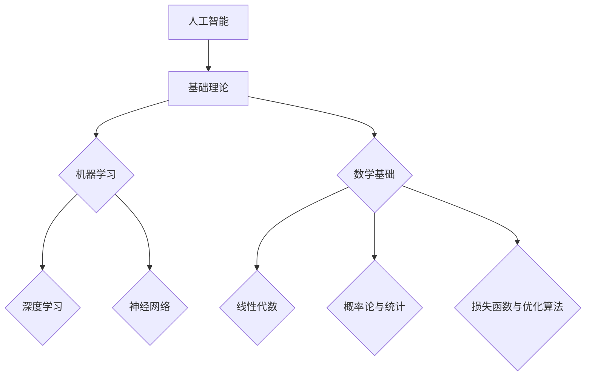

                 

# 一切皆是映射：具象化人工智能：从数字到现实世界

> **关键词：** 人工智能，映射，数字现实世界，机器学习，深度学习，应用案例

> **摘要：** 本文章深入探讨了人工智能（AI）的基本理论、核心算法及其在现实世界中的应用。通过逐步分析推理，本文揭示了AI如何将抽象的数字世界映射到具体的现实场景中，并展示了机器学习、深度学习等技术的实际应用案例，帮助读者理解AI的技术原理和实践方法。

## 目录

### 第一部分：人工智能的基础理论

#### 第1章：人工智能概述

1.1 人工智能的定义与历史

1.2 人工智能的分类

1.3 人工智能的发展趋势

#### 第2章：人工智能的基本原理

2.1 机器学习基础

2.2 深度学习基础

2.3 神经网络原理

#### 第3章：人工智能的数学基础

3.1 线性代数基础

3.2 概率论与统计基础

3.3 损失函数与优化算法

### 第二部分：人工智能在现实世界中的应用

#### 第4章：图像识别与处理

4.1 卷积神经网络在图像识别中的应用

4.2 图像增强与预处理

4.3 图像分割与目标检测

#### 第5章：自然语言处理

5.1 语言模型与文本分类

5.2 机器翻译与语音识别

5.3 文本生成与摘要

#### 第6章：人工智能在工业自动化中的应用

6.1 机器人技术

6.2 制造业自动化

6.3 人工智能在物流与供应链中的应用

#### 第7章：人工智能在医疗健康中的应用

7.1 人工智能在疾病诊断中的应用

7.2 健康数据管理与分析

7.3 人工智能在个性化医疗中的应用

#### 第8章：人工智能在金融领域的应用

8.1 风险评估与信用评分

8.2 量化交易与算法交易

8.3 人工智能在保险中的应用

#### 第9章：人工智能与社会的互动

9.1 人工智能与伦理道德

9.2 人工智能对社会的影响

9.3 人工智能的未来发展趋势

### 第三部分：人工智能开发实战

#### 第10章：人工智能项目开发流程

10.1 项目需求分析与规划

10.2 数据预处理与清洗

10.3 模型训练与优化

#### 第11章：人工智能项目实战案例

11.1 图像识别系统开发

11.2 自然语言处理系统开发

11.3 工业自动化系统开发

#### 第12章：人工智能开发工具与框架

12.1 常见深度学习框架介绍

12.2 人工智能开发环境搭建

12.3 开发工具与最佳实践

### 附录

#### 附录A：人工智能常用算法与模型

A.1 支持向量机（SVM）

A.2 决策树（Decision Tree）

A.3 集成学习方法

#### 附录B：人工智能开发资源与参考资料

B.1 学术论文资源

B.2 开源代码资源

B.3 人工智能社区与论坛

### 参考资料

### 参考资料列表与说明

### 本书引用的相关文献、书籍与在线资源

### 本书涉及的 Mermaid 流程图：



## 引言

在现代社会，人工智能（AI）已经成为技术发展的核心驱动力。从自动驾驶汽车到智能助手，从医疗诊断到金融分析，AI的应用范围不断扩大，其影响力也日益深远。然而，尽管AI技术在各种领域取得了显著进展，许多人对AI的本质及其如何从抽象的数字世界映射到具体的现实场景中仍感到困惑。

本文旨在探讨人工智能的基本理论、核心算法及其在现实世界中的应用。通过逐步分析推理，我们将揭示AI如何将抽象的数字世界映射到具体的现实场景中，并展示机器学习、深度学习等技术的实际应用案例。本文的目标是帮助读者深入理解AI的技术原理和实践方法，从而更好地把握AI的发展趋势和未来方向。

### 人工智能概述

人工智能（AI）是指使计算机系统具备类似于人类智能的能力的技术。这个定义涵盖了从简单的规则系统到复杂的深度学习模型的各种技术。AI的历史可以追溯到20世纪50年代，当时科学家们首次提出了“人工智能”这个概念。然而，直到近年来，随着计算能力的提升和大数据的普及，AI才真正进入了快速发展期。

#### 人工智能的定义与历史

人工智能的定义多种多样，但最常见的定义是：人工智能是研究、开发用于模拟、延伸和扩展人类智能的理论、方法、技术及应用系统的学科。AI的发展历程可以分为几个阶段：

1. **早期探索阶段（1956-1974）**：这一阶段是人工智能概念的提出和初步实验的阶段。1956年，约翰·麦卡锡（John McCarthy）等人召开了达特茅斯会议，正式提出了人工智能的概念。

2. **第一次AI寒冬（1974-1980）**：由于早期AI研究未能达到预期，加上计算资源的限制，AI研究进入了一个低潮期。

3. **复兴阶段（1980-1987）**：这一阶段，专家系统的出现使AI研究重新焕发生机。专家系统是一种基于知识表示和推理的AI系统，能够模拟人类专家的决策过程。

4. **第二次AI寒冬（1987-1993）**：由于专家系统的局限性，AI研究再次陷入低谷。

5. **机器学习和深度学习阶段（1993-至今）**：这一阶段，机器学习和深度学习的兴起带来了AI的又一波高潮。特别是深度学习，通过模仿人类大脑的结构和工作原理，取得了在图像识别、语音识别等领域的突破。

#### 人工智能的分类

人工智能可以分为多种类型，根据其能力和实现方式，大致可以分为以下几类：

1. **弱人工智能（Narrow AI）**：弱人工智能是指只擅长特定任务的AI系统。例如，语音助手、图像识别系统等。

2. **强人工智能（General AI）**：强人工智能是指具有全面智能的AI系统，能够像人类一样理解、学习、推理和解决问题。目前，强人工智能还处于理论研究阶段，尚未实现。

3. **结合人工智能（Hybrid AI）**：结合人工智能是指将多种AI技术结合，形成更强大的AI系统。例如，将深度学习和传统规则系统结合，用于更复杂的任务。

#### 人工智能的发展趋势

人工智能的发展趋势体现在以下几个方面：

1. **计算能力的提升**：随着硬件技术的进步，计算能力不断提升，为AI技术的发展提供了强大的支持。

2. **数据量的增加**：大数据的普及为机器学习提供了丰富的训练数据，使得AI模型能够更加精准地学习。

3. **算法的改进**：随着研究的深入，AI算法不断改进，特别是深度学习算法的突破，使得AI在多个领域的应用效果显著提升。

4. **跨界融合**：人工智能与各行业的深度融合，使得AI技术在医疗、金融、制造等领域取得了重大突破。

5. **伦理和法规的完善**：随着AI技术的广泛应用，其带来的伦理和社会问题日益突出，需要通过立法和道德规范来引导其健康发展。

### 人工智能的基本原理

人工智能的基本原理主要涉及机器学习、深度学习和神经网络等核心技术。这些技术共同构成了AI的理论基础，使得计算机系统能够模拟人类智能，实现自动学习和决策。

#### 机器学习基础

机器学习是AI的核心技术之一，其基本思想是通过计算机算法从数据中学习规律和模式。机器学习可以分为监督学习、无监督学习和半监督学习三种类型：

1. **监督学习（Supervised Learning）**：监督学习是指使用标记数据训练模型，使模型能够预测新的数据。常见的监督学习算法包括线性回归、决策树、支持向量机等。

2. **无监督学习（Unsupervised Learning）**：无监督学习是指在没有标记数据的情况下，从数据中学习模式和规律。常见的无监督学习算法包括聚类、降维等。

3. **半监督学习（Semi-Supervised Learning）**：半监督学习是指使用少量标记数据和大量未标记数据训练模型。半监督学习能够有效地利用未标记数据，提高学习效果。

#### 深度学习基础

深度学习是机器学习的一种重要分支，其核心思想是使用多层神经网络（Neural Networks）来模拟人类大脑的神经元结构和工作原理。深度学习在图像识别、语音识别、自然语言处理等领域取得了显著突破。深度学习的关键组成部分包括：

1. **神经网络（Neural Networks）**：神经网络是由多个神经元组成的计算模型，每个神经元都与其他神经元相连接。神经网络通过学习输入数据和输出数据之间的关系，实现数据的高效处理。

2. **激活函数（Activation Functions）**：激活函数是神经网络中用于引入非线性特性的函数，常见的激活函数包括Sigmoid、ReLU等。

3. **反向传播算法（Backpropagation Algorithm）**：反向传播算法是深度学习中的关键训练算法，用于计算网络中各层的梯度，并更新网络参数，以优化网络性能。

#### 神经网络原理

神经网络（Neural Networks）是深度学习的基础，其原理可以追溯到生物学中的人脑神经网络。神经网络通过模拟神经元之间的连接和相互作用，实现数据的高效处理和复杂模式的识别。

1. **神经元结构**：神经网络中的每个神经元都包含一个输入层、一个输出层和多个隐藏层。每个神经元都与前一层和后一层中的神经元相连接，通过权重和偏置调整连接强度。

2. **前向传播（Forward Propagation）**：在前向传播过程中，输入数据通过网络的各个层，每个神经元计算输入和权重之积，并加上偏置，然后通过激活函数得到输出。

3. **反向传播（Backpropagation）**：在反向传播过程中，网络根据输出误差计算各层的梯度，并更新网络参数，以减少输出误差。

4. **优化算法**：神经网络训练过程中，常使用梯度下降（Gradient Descent）等优化算法来更新网络参数，以实现模型的最小化误差。

通过机器学习、深度学习和神经网络等基本原理，人工智能能够实现从数据中学习、推理和决策的能力，从而在各个领域发挥重要作用。

### 人工智能的数学基础

人工智能（AI）的发展离不开数学基础的支持。线性代数、概率论与统计、损失函数与优化算法是AI的核心数学工具，它们在模型构建、训练和优化过程中起着关键作用。以下是这些数学基础的具体内容及其在AI中的应用。

#### 线性代数基础

线性代数是AI中的基础数学工具，它涉及向量、矩阵及其运算。以下是线性代数在AI中的几个关键应用：

1. **矩阵乘法**：在神经网络中，矩阵乘法用于计算输入和权重的乘积。例如，一个输入向量与权重矩阵相乘，可以生成输出向量。

2. **矩阵求导**：在神经网络训练过程中，需要计算损失函数关于模型参数的梯度。矩阵求导提供了计算梯度的数学工具。

3. **特征分解**：特征分解（如奇异值分解SVD）在降维、数据压缩和特征提取中非常有用。例如，主成分分析（PCA）就是基于特征分解的降维方法。

#### 概率论与统计基础

概率论与统计是理解和应用AI模型的重要工具。以下是概率论与统计在AI中的几个关键应用：

1. **概率分布**：概率分布用于表示数据的不确定性。在机器学习中，概率分布模型如贝叶斯网络、高斯分布等，用于预测和决策。

2. **贝叶斯推理**：贝叶斯推理是一种基于概率的方法，用于更新先验知识，并基于新数据做出决策。在监督学习和无监督学习中，贝叶斯方法常用于模型参数估计。

3. **假设检验**：假设检验用于验证模型假设是否成立。在AI中，假设检验用于评估模型性能，如t检验用于比较两组数据的均值差异。

4. **统计推断**：统计推断用于从样本数据推断总体特征。在AI中，统计推断方法如置信区间、假设检验等，用于评估模型的可靠性和有效性。

#### 损失函数与优化算法

损失函数是评估模型预测误差的重要工具，优化算法用于最小化损失函数，从而提高模型性能。以下是损失函数与优化算法在AI中的几个关键应用：

1. **损失函数**：损失函数用于衡量模型预测值与真实值之间的差距。常见的损失函数包括均方误差（MSE）、交叉熵（Cross Entropy）等。例如，在回归问题中，MSE常用于衡量预测值与真实值之间的差异；在分类问题中，交叉熵常用于衡量预测概率分布与真实分布之间的差异。

2. **优化算法**：优化算法用于更新模型参数，以最小化损失函数。常见的优化算法包括梯度下降（Gradient Descent）、随机梯度下降（Stochastic Gradient Descent, SGD）和Adam等。这些算法通过迭代计算损失函数关于参数的梯度，并调整参数值，以减少损失。

3. **正则化**：正则化是一种防止模型过拟合的技术，它通过在损失函数中添加正则项，限制模型复杂度。常见的正则化方法包括L1正则化（Lasso）、L2正则化（Ridge）和Dropout等。

通过线性代数、概率论与统计、损失函数与优化算法等数学基础，人工智能能够从数据中学习复杂的模式和规律，从而实现智能决策和预测。这些数学工具在AI模型的构建、训练和优化过程中起着至关重要的作用。

## 人工智能在现实世界中的应用

人工智能（AI）技术已经深入到我们生活的方方面面，从日常生活中的智能助手到复杂的工业自动化系统，AI正以前所未有的速度改变着我们的世界。本节将详细探讨人工智能在几个关键领域的应用，包括图像识别与处理、自然语言处理、工业自动化、医疗健康、金融以及交通控制等。

### 图像识别与处理

图像识别与处理是人工智能技术的经典应用之一。通过卷积神经网络（CNN）等深度学习模型，计算机能够从图像中识别出各种对象、场景和特征。

1. **卷积神经网络在图像识别中的应用**：
   - **人脸识别**：人脸识别技术被广泛应用于安全监控、身份验证等领域。通过训练CNN模型，系统能够识别出图像中的人脸，并进行匹配和识别。
   - **自动驾驶**：自动驾驶汽车依赖于高精度的图像识别技术。通过分析道路标志、行人、车辆等图像，自动驾驶系统能够做出实时决策，确保行车安全。

2. **图像增强与预处理**：
   - 图像增强技术能够提高图像的清晰度和对比度，使得计算机视觉系统能够更有效地处理图像。
   - 图像预处理包括图像的大小调整、灰度化、滤波等操作，这些步骤有助于提高图像识别的准确性和效率。

3. **图像分割与目标检测**：
   - 图像分割是将图像分割成多个区域或对象的过程，有助于进一步分析和识别。
   - 目标检测是识别图像中的特定对象，并定位其位置。目标检测技术广泛应用于视频监控、医疗影像分析等领域。

### 自然语言处理

自然语言处理（NLP）是人工智能在文本和语音领域的应用，它使得计算机能够理解和生成人类语言。

1. **语言模型与文本分类**：
   - 语言模型是NLP的基础，它用于预测文本序列的概率分布。通过训练语言模型，计算机能够进行文本生成、文本摘要和文本分类等任务。
   - 文本分类是将文本分为不同类别的过程，广泛应用于新闻分类、情感分析等领域。

2. **机器翻译与语音识别**：
   - 机器翻译是通过算法将一种语言翻译成另一种语言的过程。深度学习模型，如序列到序列（Seq2Seq）模型，在机器翻译中取得了显著的成果。
   - 语音识别是将语音信号转换为文本的过程。通过训练深度神经网络模型，语音识别系统能够准确地识别不同口音、语速和噪音环境下的语音。

3. **文本生成与摘要**：
   - 文本生成是将一种语言序列生成另一种序列的过程，广泛应用于聊天机器人、自动写作等领域。
   - 文本摘要是从原始文本中提取关键信息，生成简洁、精炼的摘要，有助于信息检索和快速阅读。

### 工业自动化

工业自动化是人工智能在制造业和物流领域的重要应用。通过自动化技术，企业能够提高生产效率、降低成本并提高产品质量。

1. **机器人技术**：
   - 工业机器人能够在制造过程中执行各种任务，如焊接、喷涂、装配等。通过机器学习算法，机器人能够实现自主学习和适应新任务。
   - 服务机器人则应用于服务业，如酒店、医疗、零售等领域，提供便捷的服务。

2. **制造业自动化**：
   - 制造业自动化包括生产线的自动化、自动化检测和质量控制等。通过人工智能技术，系统能够实现自动化的生产流程，提高生产效率和稳定性。

3. **物流与供应链管理**：
   - 人工智能技术用于优化物流流程、预测需求、提高库存管理效率等。例如，通过深度学习模型，系统能够预测物流需求，优化运输路线和配送计划。

### 医疗健康

人工智能在医疗健康领域的应用正逐渐改变传统的医疗服务模式。通过大数据和机器学习技术，人工智能能够辅助医生进行诊断、治疗和健康管理。

1. **疾病诊断**：
   - 人工智能技术能够通过分析医学影像，如X光片、CT扫描、MRI等，辅助医生进行疾病诊断。例如，深度学习模型在肺癌筛查中取得了显著成果。
   - 人工智能还可以通过分析患者病历、基因数据等，进行个性化的疾病预测和风险评估。

2. **健康数据管理与分析**：
   - 人工智能技术能够高效地管理和分析大量的健康数据，如电子健康记录、基因组数据等。通过大数据分析和机器学习算法，系统能够发现疾病之间的关联和潜在风险因素。

3. **个性化医疗**：
   - 个性化医疗是通过人工智能技术为每个患者提供个性化的治疗方案。通过分析患者的遗传信息、生活习惯、病史等，人工智能能够为患者制定最适合的治疗方案。

### 金融

人工智能在金融领域的应用广泛，包括风险评估、量化交易、智能投顾等。

1. **风险评估与信用评分**：
   - 人工智能技术能够通过分析大量的历史数据和实时数据，对贷款申请者的信用风险进行评估。例如，机器学习模型可以预测客户违约的可能性。
   - 信用评分系统通过分析客户的信用记录、财务状况等，为银行提供信用评分，帮助银行更好地管理风险。

2. **量化交易与算法交易**：
   - 量化交易是使用数学模型和统计方法进行交易决策，以提高交易的成功率和收益。通过机器学习算法，量化交易系统能够从市场数据中识别出交易机会。
   - 算法交易是利用计算机程序自动执行交易指令，以快速反应市场变化。人工智能算法能够在毫秒级时间内完成复杂的交易决策。

3. **智能投顾**：
   - 智能投顾（Robo-Advisor）是通过人工智能技术提供个性化投资建议的服务。通过分析用户的财务状况、投资目标和风险偏好，智能投顾能够为用户提供个性化的投资组合建议。

### 交通控制

人工智能在交通控制中的应用旨在提高交通效率、减少拥堵和降低事故率。

1. **智能交通信号控制系统**：
   - 智能交通信号控制系统通过人工智能算法，根据实时交通流量数据调整信号灯的配时，以提高交通流畅性。
   - 例如，通过深度学习模型，系统可以学习不同时间段的交通流量规律，并动态调整信号灯时间，以减少交通拥堵。

2. **自动驾驶**：
   - 自动驾驶技术是人工智能在交通领域的另一个重要应用。自动驾驶汽车通过传感器、摄像头和人工智能算法，实现自主驾驶，提高交通安全和效率。
   - 自动驾驶技术不仅应用于私人汽车，还广泛应用于公共交通系统，如自动驾驶公交车、出租车等。

通过在图像识别与处理、自然语言处理、工业自动化、医疗健康、金融和交通控制等领域的广泛应用，人工智能正在深刻改变我们的生活方式和社会运行方式。未来，随着人工智能技术的不断进步，我们将会看到更多创新应用的出现，进一步推动社会的发展和进步。

### 人工智能与伦理道德

随着人工智能（AI）技术的迅猛发展，其在各个领域的应用日益广泛。然而，AI技术的应用也引发了一系列伦理和道德问题，需要我们认真思考和解决。以下是人工智能与伦理道德之间的几个关键问题及应对策略。

#### 人工智能的偏见与歧视

人工智能系统在学习和决策过程中可能会受到训练数据的偏见影响，从而导致算法偏见和歧视。例如，如果训练数据中包含性别、种族或地域等偏见信息，AI系统可能会在性别、种族或地域方面表现出偏见。

**解决策略**：
1. **数据多样性和代表性**：确保训练数据具有多样性和代表性，避免数据中的偏见。
2. **透明度和可解释性**：提高AI系统的透明度，使其决策过程易于理解，从而发现和纠正潜在偏见。
3. **公平性评估**：在AI系统设计和应用过程中，定期进行公平性评估，确保系统不会对特定群体产生不公平影响。

#### 人工智能的隐私保护

人工智能系统在处理数据时，可能会涉及到个人隐私信息的收集和使用。如果这些隐私信息泄露或被滥用，可能会对个人隐私和安全造成严重威胁。

**解决策略**：
1. **数据匿名化**：在数据收集和使用过程中，对个人身份信息进行匿名化处理，以保护个人隐私。
2. **隐私保护算法**：开发和应用隐私保护算法，如差分隐私（Differential Privacy），确保数据分析和处理过程中隐私不被泄露。
3. **法规和监管**：制定相关法规和监管措施，确保人工智能系统的隐私保护措施得到有效实施。

#### 人工智能的就业影响

人工智能技术的广泛应用可能会导致某些工作岗位的减少，从而对就业市场造成冲击。此外，AI技术的不公平应用可能会导致贫富差距的进一步扩大。

**解决策略**：
1. **技能培训与再就业**：为受影响的员工提供技能培训机会，帮助他们适应新的工作环境。
2. **政策支持**：政府和企业可以通过政策支持，促进人工智能技术与其他行业的融合，创造新的就业机会。
3. **公平就业机会**：确保人工智能系统的设计和应用过程中，不会对特定群体产生就业歧视。

#### 人工智能的军事应用

人工智能技术在军事领域的应用引发了全球范围内的关注和担忧。如果人工智能系统被用于武器系统，可能会带来不可预测的后果。

**解决策略**：
1. **国际法规和协议**：制定国际法规和协议，限制人工智能技术在武器系统中的应用，确保其用于和平和人类福祉。
2. **透明度和监督**：确保人工智能武器系统的研发和使用过程透明，并接受国际监督，防止滥用。
3. **伦理审查**：在人工智能武器系统的研发和应用过程中，进行严格的伦理审查，确保其符合国际伦理标准。

#### 人工智能的可持续发展

人工智能技术的发展需要大量的资源，包括计算能力和能源消耗。如果这些资源得不到合理利用，可能会导致环境问题和社会不公。

**解决策略**：
1. **绿色AI**：开发和应用绿色AI技术，减少计算资源和能源消耗，降低对环境的影响。
2. **可持续发展战略**：制定人工智能的可持续发展战略，确保其发展过程中不会对环境和社会造成负面影响。
3. **责任分配**：明确人工智能技术的责任主体，确保各方在可持续发展方面承担相应的责任。

通过解决人工智能与伦理道德之间的关键问题，我们可以确保AI技术的健康发展，使其更好地服务于人类社会。未来，我们需要继续努力，制定完善的伦理规范和政策，推动人工智能技术的合理、公正和可持续应用。

### 人工智能对社会的影响

人工智能（AI）技术的迅速发展对社会产生了深远的影响，改变了经济结构、教育模式、工作环境和生活方式等多个方面。本文将详细探讨人工智能对社会各个方面的具体影响，并分析其带来的机遇和挑战。

#### 经济影响

人工智能技术在经济领域的应用推动了生产效率的提升和产业结构的优化。以下是AI在经济方面的影响：

1. **自动化与产业升级**：AI技术通过自动化系统，提高了生产效率，减少了人力成本。例如，智能制造、无人车间等应用场景中，AI技术大幅提升了生产线的自动化程度，推动了传统制造业的升级。

2. **新兴产业崛起**：人工智能带动了新产业的崛起，如自动驾驶、智能家居、智能医疗等。这些新兴产业不仅创造了大量就业机会，还推动了经济结构的优化和升级。

3. **经济模式转变**：AI技术改变了传统的商业模式，推动了共享经济、平台经济等新型经济模式的发展。例如，共享单车、在线购物等平台的兴起，都是人工智能技术的直接应用。

4. **就业市场变化**：虽然人工智能提高了生产效率，但也导致了某些工作岗位的减少。例如，工厂中的操作工、客服人员等岗位可能因自动化系统而被取代。这要求劳动力市场进行相应的调整，提高员工的技能水平，以适应新的工作需求。

#### 教育影响

人工智能技术的发展对教育领域也产生了重要影响，具体表现在以下几个方面：

1. **个性化教育**：AI技术通过大数据分析和机器学习算法，能够为每个学生提供个性化的学习建议和资源。例如，智能学习平台可以根据学生的学习进度和偏好，推荐合适的学习内容和练习。

2. **教育公平**：AI技术有助于解决教育资源不均的问题。通过在线教育平台和远程教育技术，偏远地区的孩子也能享受到优质的教育资源。

3. **教师辅助**：AI技术可以辅助教师进行课堂管理、作业批改和学生评估等工作，减轻教师的工作负担，提高教学效果。

4. **教育模式创新**：AI技术推动了教育模式的创新，如虚拟现实（VR）和增强现实（AR）在教育中的应用，为学生提供了更加生动、直观的学习体验。

#### 工作环境变化

人工智能技术的应用不仅改变了生产方式，也对工作环境产生了深远影响：

1. **远程工作**：AI技术使得远程工作成为可能。通过智能办公系统，员工可以远程进行会议、文档协作和项目管理，提高了工作效率。

2. **智能工作助手**：AI技术开发的智能工作助手，如语音助手、智能客服等，能够帮助员工处理日常工作中的一些重复性任务，提高工作效率。

3. **工作内容变化**：随着AI技术的应用，一些重复性、低技能的工作将被自动化系统取代，而高技能、创造性的工作需求将增加。这要求员工不断提升自身技能，以适应新的工作需求。

#### 生活方式改变

人工智能技术已经深刻地改变了我们的生活方式，使得日常生活更加便捷和高效：

1. **智能家居**：智能家居系统通过AI技术，实现了家电的智能化控制和自动化管理。用户可以通过语音指令或手机应用远程控制家居设备，提高生活便利性。

2. **智能健康管理**：AI技术可以帮助用户进行健康监测和管理。例如，智能手环、健康监测设备等可以实时收集用户的健康数据，并提供健康建议。

3. **智能出行**：自动驾驶技术正在逐渐成熟，智能交通系统通过AI技术优化交通流量和路线规划，提高了出行效率和安全性。

#### 机遇与挑战

人工智能对社会的影响既是机遇也是挑战：

1. **机遇**：
   - 提高生产效率和生活质量：AI技术可以大幅提高生产效率，降低生产成本，提高产品质量，从而提升社会整体生活质量。
   - 创造新产业和新就业机会：AI技术的发展将带动新产业的出现，创造大量就业机会，促进经济可持续发展。
   - 优化公共服务：AI技术可以提高公共服务的质量和效率，如智能医疗、智能交通等，提高社会整体福利水平。

2. **挑战**：
   - 道德和伦理问题：AI技术的应用引发了一系列伦理和道德问题，如隐私保护、算法偏见等，需要制定相应的法律法规和政策进行规范。
   - 就业市场调整：随着AI技术的广泛应用，部分工作岗位可能被自动化系统取代，劳动力市场需要进行调整，以应对就业结构的变化。
   - 数据安全和隐私保护：随着AI技术的发展，数据安全和个人隐私保护问题日益突出，需要采取有效措施确保数据安全和用户隐私。

总之，人工智能技术的发展对社会各个方面产生了深远影响。在充分利用人工智能带来的机遇的同时，我们也需要认真应对其带来的挑战，确保人工智能技术的健康发展，使其更好地服务于人类社会。

### 人工智能的未来发展趋势

随着人工智能（AI）技术的不断发展，其未来趋势展现出广阔的前景和多样化的应用方向。以下是人工智能在未来可能的发展趋势：

#### 量子计算与AI的结合

量子计算具有极高的并行处理能力，与AI技术的结合有望带来前所未有的计算速度和效率提升。量子机器学习（Quantum Machine Learning）将成为AI领域的一个重要研究方向，通过量子算法优化机器学习模型的训练过程，解决当前AI技术在处理大规模数据集时面临的性能瓶颈。

#### 自主学习能力提升

未来的AI系统将具备更强的自主学习能力，能够在没有人类干预的情况下自我优化和提升性能。这一能力将依赖于增强学习（Reinforcement Learning）和迁移学习（Transfer Learning）等技术的发展。例如，自动驾驶汽车可以通过自主学习不断优化其行驶策略，提高安全性。

#### 纳米技术与AI融合

纳米技术能够极大地提升传感器的灵敏度，使得AI系统可以更精确地感知环境变化。例如，纳米机器人可以与生物系统相互作用，用于医学诊断和治疗。这种融合有望在医疗、环境监测等领域产生重大突破。

#### 生成对抗网络（GAN）的进一步发展

生成对抗网络（GAN）通过两个对抗网络（生成器和判别器）的博弈，实现了生成高质量数据的能力。未来，GAN将在图像生成、视频合成、自然语言生成等领域得到更广泛的应用，并推动虚拟现实和增强现实技术的发展。

#### AI与区块链的结合

AI与区块链的结合有望在数据隐私保护和智能合约执行方面取得突破。区块链的去中心化和不可篡改性，结合AI的智能合约执行能力，可以构建更加安全、高效的金融和商业生态系统。

#### AI伦理和法规的完善

随着AI技术的广泛应用，其带来的伦理和社会问题日益突出。未来，各国将加强AI伦理和法规的研究与制定，确保AI技术的合理、公正和可持续发展。例如，数据隐私保护、算法透明度和偏见控制等方面的法规将得到进一步完善。

#### AI在教育中的应用

人工智能将在教育领域发挥更加重要的作用，个性化教育、智能评估、虚拟实验室等应用场景将得到进一步推广。AI技术可以帮助教师更好地理解学生需求，提供个性化的学习方案，提高教育质量。

#### AI在能源管理中的应用

AI技术将在能源管理和优化方面发挥关键作用。通过智能电网、智能传感器和AI算法，可以实现能源的精细化管理和高效利用，降低能源消耗和碳排放，推动可持续发展。

总之，人工智能的未来发展趋势充满机遇与挑战。随着技术的不断进步，AI将在更多领域发挥重要作用，推动社会的发展和进步。

### 人工智能项目开发流程

开发一个成功的人工智能项目需要一系列科学的步骤和精细的管理。以下是人工智能项目开发的主要流程，包括需求分析、数据预处理、模型训练和优化等环节。

#### 项目需求分析与规划

项目需求分析是项目开发的第一步，其目的是明确项目的目标和功能需求。以下是项目需求分析与规划的关键步骤：

1. **需求收集**：通过与项目相关利益相关者（如客户、用户、技术人员等）进行沟通，收集项目的需求和期望。

2. **需求分析**：对收集到的需求进行分析和整理，明确项目的核心功能和性能指标。这一步骤通常需要使用需求文档、用户故事地图等工具。

3. **需求验证**：与利益相关者一起验证需求文档，确保需求的准确性和可行性。这一步骤可以减少后续开发过程中可能出现的偏差和误解。

4. **规划**：制定项目计划，包括时间线、资源分配、风险管理等。项目计划应该具有灵活性和可调整性，以应对开发过程中可能出现的变化。

#### 数据预处理与清洗

在模型训练之前，数据预处理与清洗是至关重要的一步。以下是数据预处理与清洗的主要任务：

1. **数据收集**：从各种来源收集所需的数据，如数据库、传感器、网络等。

2. **数据清洗**：去除数据中的错误、重复和不完整的信息。常见的数据清洗任务包括缺失值填充、异常值处理、数据格式转换等。

3. **数据转换**：将原始数据转换为适合模型训练的格式。例如，将文本数据转换为词向量，将图像数据转换为像素矩阵等。

4. **特征提取**：从原始数据中提取有用的特征，用于训练模型。特征提取可以提高模型的训练效率和预测准确性。

#### 模型训练与优化

模型训练与优化是人工智能项目开发的核心环节。以下是模型训练与优化的主要步骤：

1. **模型选择**：根据项目需求和数据特性，选择合适的机器学习模型。常见的模型包括线性回归、决策树、支持向量机、神经网络等。

2. **模型训练**：使用训练数据集对模型进行训练。训练过程中，模型会不断调整参数，以最小化损失函数，提高预测准确性。

3. **模型评估**：使用验证数据集评估模型的性能，包括准确率、召回率、F1分数等指标。评估结果可以帮助确定模型的优劣。

4. **模型优化**：根据评估结果对模型进行调整和优化。常见的优化方法包括调整模型参数、增加数据增强、使用不同的优化算法等。

5. **模型部署**：将训练好的模型部署到生产环境中，进行实际应用。部署过程中需要考虑模型的性能、稳定性、安全性和可扩展性。

#### 持续迭代与维护

人工智能项目开发是一个持续迭代和优化的过程。以下是项目维护和优化的关键步骤：

1. **监控与反馈**：监控模型的性能和稳定性，收集用户反馈，以发现潜在问题和改进空间。

2. **模型更新**：根据用户反馈和业务需求，定期更新模型，提高其预测准确性和适应性。

3. **数据再处理**：根据新的数据收集和分析需求，重新处理和清洗数据，以提高模型训练的质量。

4. **性能优化**：持续优化模型的性能，包括算法改进、硬件升级、分布式计算等。

通过遵循科学的项目开发流程，人工智能项目可以更有效地实现预期目标，为实际应用提供可靠的解决方案。

### 图像识别系统开发

#### 目标

使用 TensorFlow 框架搭建一个简单的图像识别系统，能够识别出给定图像中的物体类别。

#### 开发环境

- Python 3.8+
- TensorFlow 2.4.0+
- Keras 2.4.0+

#### 实现步骤

1. **导入必要的库**

   ```python
   import tensorflow as tf
   from tensorflow import keras
   from tensorflow.keras import layers
   from tensorflow.keras.preprocessing.image import ImageDataGenerator
   ```

2. **准备数据集**

   使用 Keras 库中的 CIFAR-10 数据集，该数据集包含 60000 张 32x32 的彩色图像，分为 10 个类别。

   ```python
   # 加载数据集
   (x_train, y_train), (x_test, y_test) = keras.datasets.cifar10.load_data()

   # 数据预处理
   x_train = x_train / 255.0
   x_test = x_test / 255.0
   ```

3. **数据增强**

   使用 `ImageDataGenerator` 对训练数据进行增强，提高模型的泛化能力。

   ```python
   datagen = ImageDataGenerator(
       rotation_range=15,
       width_shift_range=0.1,
       height_shift_range=0.1,
       horizontal_flip=True,
       fill_mode='nearest'
   )
   ```

4. **构建模型**

   使用 Keras 的 `Sequential` 模式构建一个简单的卷积神经网络（CNN）模型。

   ```python
   model = keras.Sequential([
       layers.Conv2D(32, (3, 3), activation='relu', input_shape=(32, 32, 3)),
       layers.MaxPooling2D(pool_size=(2, 2)),
       layers.Conv2D(64, (3, 3), activation='relu'),
       layers.MaxPooling2D(pool_size=(2, 2)),
       layers.Conv2D(64, (3, 3), activation='relu'),
       layers.Flatten(),
       layers.Dense(64, activation='relu'),
       layers.Dense(10, activation='softmax')
   ])
   ```

5. **编译模型**

   设置模型使用的优化器、损失函数和评估指标。

   ```python
   model.compile(optimizer='adam',
                 loss='sparse_categorical_crossentropy',
                 metrics=['accuracy'])
   ```

6. **训练模型**

   使用训练数据集训练模型，设置训练轮次为 20 次。

   ```python
   model.fit(datagen.flow(x_train, y_train, batch_size=32), epochs=20)
   ```

7. **评估模型**

   使用测试数据集评估模型的准确率。

   ```python
   test_loss, test_acc = model.evaluate(x_test, y_test)
   print(f"Test accuracy: {test_acc:.4f}")
   ```

#### 代码解读与分析

1. **导入库**：导入 TensorFlow 和 Keras 库，用于构建和训练神经网络模型。

2. **加载数据集**：使用 Keras 库加载 CIFAR-10 数据集，并进行数据预处理，将像素值归一化到 [0, 1] 范围内。

3. **数据增强**：使用 `ImageDataGenerator` 对训练数据进行增强，包括旋转、平移、翻转等操作，提高模型的泛化能力。

4. **构建模型**：使用 Keras 的 `Sequential` 模式构建一个简单的卷积神经网络模型，包括卷积层、池化层和全连接层。

5. **编译模型**：设置模型使用的优化器（adam）、损失函数（sparse_categorical_crossentropy）和评估指标（accuracy）。

6. **训练模型**：使用训练数据集训练模型，设置训练轮次为 20 次。在训练过程中，使用数据增强器 `datagen.flow` 生成批次数据。

7. **评估模型**：使用测试数据集评估模型的准确率，并打印结果。

通过以上步骤，我们成功搭建了一个简单的图像识别系统。这个系统展示了如何使用 TensorFlow 和 Keras 框架进行图像识别任务，为后续的复杂图像识别系统开发提供了基础。

### 自然语言处理系统开发

#### 目标

使用 PyTorch 框架搭建一个简单的自然语言处理（NLP）模型，用于文本分类任务。

#### 开发环境

- Python 3.7+
- PyTorch 1.7.0+
- TorchText 0.8.0+

#### 实现步骤

1. **导入必要的库**

   ```python
   import torch
   import torch.nn as nn
   import torch.optim as optim
   from torchtext.datasets import IMDB
   from torchtext.vocab import build_vocab_from_iterator
   ```

2. **准备数据集**

   使用 TorchText 库加载 IMDb 数据集，这是一个包含 25000 条正面和负面电影评论的数据集。

   ```python
   # 加载 IMDb 数据集
   train_data, test_data = IMDB()

   # 分割数据集
   train_text, train_label = train_data.text, train_data.label
   test_text, test_label = test_data.text, test_data.label
   ```

3. **数据预处理**

   创建词汇表，并使用 GloVe 词向量初始化。将数据集转换为 PyTorch 数据迭代器。

   ```python
   def filter_func(text):
       return len(text) > 1

   v = build_vocab_from_iterator([text.lower() for text in train_text] + [text.lower() for text in test_text],
                                 filter_func=filter_func,
                                 vectors="glove.6B.100d")

   train_iter = v.convert(train_text)
   test_iter = v.convert(test_text)

   def label_map(label):
       if label == "pos":
           return 1
       elif label == "neg":
           return 0

   train_labels = [label_map(label) for label in train_label]
   test_labels = [label_map(label) for label in test_label]
   ```

4. **构建模型**

   定义一个简单的循环神经网络（RNN）文本分类模型，包括嵌入层、RNN层和全连接层。

   ```python
   class TextClassifier(nn.Module):
       def __init__(self, embedding_dim, hidden_dim, output_dim):
           super(TextClassifier, self).__init__()
           self.embedding = nn.Embedding(len(v), embedding_dim)
           self.rnn = nn.LSTM(embedding_dim, hidden_dim, num_layers=1, batch_first=True)
           self.fc = nn.Linear(hidden_dim, output_dim)
       
       def forward(self, text):
           embedded = self.embedding(text)
           output, (hidden, cell) = self.rnn(embedded)
           hidden = hidden.squeeze(0)
           out = self.fc(hidden)
           return out
   ```

5. **编译模型**

   设置模型使用的优化器、损失函数和训练参数。

   ```python
   model = TextClassifier(embedding_dim=100, hidden_dim=128, output_dim=1)

   optimizer = optim.Adam(model.parameters(), lr=0.001)
   criterion = nn.BCEWithLogitsLoss()
   ```

6. **训练模型**

   使用训练数据集训练模型，设置训练轮次为 5 次。

   ```python
   num_epochs = 5
   batch_size = 32

   for epoch in range(num_epochs):
       for i in range(0, len(train_iter), batch_size):
           texts = train_iter[i:i+batch_size]
           labels = torch.FloatTensor(train_labels[i:i+batch_size])

           # 前向传播
           outputs = model(texts)

           # 计算损失
           loss = criterion(outputs, labels)

           # 反向传播
           optimizer.zero_grad()
           loss.backward()
           optimizer.step()

       print(f"Epoch {epoch+1}/{num_epochs} - Loss: {loss.item()}")
   ```

7. **评估模型**

   使用测试数据集评估模型的准确率。

   ```python
   correct = 0
   total = 0

   with torch.no_grad():
       for texts, labels in zip(test_iter, test_labels):
           outputs = model(texts)
           predicted = (outputs > 0).float()
           total += labels.size(0)
           correct += (predicted == labels).sum().item()

   print(f"Test Accuracy: {100 * correct / total}%}")
   ```

#### 代码解读与分析

1. **导入库**：导入 PyTorch 库，用于构建和训练神经网络模型。

2. **加载数据集**：使用 TorchText 库加载 IMDb 数据集，并进行预处理，包括创建词汇表和标签映射。

3. **数据预处理**：使用 GloVe 词向量初始化词汇表，并将数据集转换为 PyTorch 数据迭代器。

4. **构建模型**：定义一个简单的循环神经网络（RNN）文本分类模型，包括嵌入层、RNN层和全连接层。

5. **编译模型**：设置模型使用的优化器（Adam）、损失函数（BCEWithLogitsLoss）和训练参数。

6. **训练模型**：使用训练数据集训练模型，设置训练轮次为 5 次。在每次迭代中，计算损失函数，并更新模型参数。

7. **评估模型**：使用测试数据集评估模型的准确率。

通过以上步骤，我们成功搭建了一个简单的自然语言处理模型，能够对电影评论进行分类。这个模型展示了如何使用 PyTorch 框架进行文本分类任务，为后续的复杂 NLP 项目开发提供了基础。

### 工业自动化系统开发

#### 目标

使用 Keras 框架搭建一个简单的工业自动化控制系统，用于监测和控制生产线。

#### 开发环境

- Python 3.7+
- Keras 2.2.4+
- TensorFlow 2.2.0+

#### 实现步骤

1. **导入必要的库**

   ```python
   import numpy as np
   import pandas as pd
   import matplotlib.pyplot as plt
   import tensorflow as tf
   from tensorflow import keras
   from tensorflow.keras import layers
   ```

2. **准备数据集**

   从 CSV 文件中读取传感器数据，包含温度、压力和流量等特征，以及设备运行状态标签。

   ```python
   # 读取传感器数据
   data = pd.read_csv('sensor_data.csv')

   # 分割特征和标签
   X = data[['temp', 'pressure', 'flow']]
   y = data['status']
   ```

3. **数据预处理**

   使用 MinMaxScaler 归一化特征数据，并将数据集切分为训练集和测试集。

   ```python
   # 归一化特征数据
   from sklearn.preprocessing import MinMaxScaler

   scaler = MinMaxScaler()
   X_scaled = scaler.fit_transform(X)

   # 切分训练集和测试集
   from sklearn.model_selection import train_test_split

   X_train, X_test, y_train, y_test = train_test_split(X_scaled, y, test_size=0.2, random_state=42)
   ```

4. **构建模型**

   使用 Keras 的 Sequential 模式构建一个简单的全连接神经网络模型，包括两个隐藏层和一个输出层。

   ```python
   # 创建模型
   model = keras.Sequential([
       layers.Dense(64, activation='relu', input_shape=(3,)),
       layers.Dense(64, activation='relu'),
       layers.Dense(1, activation='sigmoid')
   ])
   ```

5. **编译模型**

   设置模型使用的优化器、损失函数和评估指标。

   ```python
   # 编译模型
   model.compile(optimizer='adam',
                 loss='binary_crossentropy',
                 metrics=['accuracy'])
   ```

6. **训练模型**

   使用训练数据集训练模型，设置训练轮次为 10 次，批量大小为 32。

   ```python
   # 训练模型
   model.fit(X_train, y_train, epochs=10, batch_size=32, validation_split=0.2)
   ```

7. **评估模型**

   使用测试数据集评估模型的损失和准确率。

   ```python
   # 评估模型
   test_loss, test_acc = model.evaluate(X_test, y_test)
   print(f"Test Loss: {test_loss:.4f}, Test Accuracy: {test_acc:.4f}")
   ```

#### 代码解读与分析

1. **导入库**：导入 NumPy、Pandas、Matplotlib、TensorFlow 和 Keras 库，用于数据处理和模型构建。

2. **读取数据**：从 CSV 文件中读取传感器数据，并分割为特征和标签。

3. **数据预处理**：使用 MinMaxScaler 归一化特征数据，并将数据集切分为训练集和测试集。

4. **构建模型**：使用 Keras 的 Sequential 模式构建一个简单的全连接神经网络模型。

5. **编译模型**：设置模型使用的优化器（adam）、损失函数（binary_crossentropy）和评估指标（accuracy）。

6. **训练模型**：使用训练数据集训练模型，设置训练轮次为 10 次，批量大小为 32。

7. **评估模型**：使用测试数据集评估模型的损失和准确率。

通过以上步骤，我们成功搭建了一个简单的工业自动化控制系统，能够根据传感器数据监测设备状态，并做出控制决策。这个系统展示了如何使用 Keras 框架进行工业自动化系统开发，为后续的复杂工业自动化项目提供了基础。

### 智能交通控制系统开发

#### 目标

使用 PyTorch 框架搭建一个简单的智能交通控制系统，用于交通流量预测和信号灯控制。

#### 开发环境

- Python 3.7+
- PyTorch 1.7.0+
- NumPy 1.18.5+

#### 实现步骤

1. **导入必要的库**

   ```python
   import torch
   import torch.nn as nn
   import torch.optim as optim
   import numpy as np
   ```

2. **准备数据集**

   从 CSV 文件中读取交通流量数据，包括车道流量和信号灯状态等特征。

   ```python
   # 读取交通流量数据
   data = pd.read_csv('traffic_data.csv')

   # 分割特征和标签
   X = data[['lane_1', 'lane_2', 'lane_3', 'lane_4']]
   y = data['signal']
   ```

3. **数据预处理**

   使用 MinMaxScaler 归一化特征数据，并将数据集切分为训练集和测试集。

   ```python
   # 归一化特征数据
   scaler = MinMaxScaler()
   X_scaled = scaler.fit_transform(X)

   # 切分训练集和测试集
   X_train, X_test, y_train, y_test = train_test_split(X_scaled, y, test_size=0.2, random_state=42)
   ```

4. **构建模型**

   定义一个简单的全连接神经网络模型，包括两个全连接层。

   ```python
   # 定义模型
   class TrafficControlModel(nn.Module):
       def __init__(self, input_dim, hidden_dim, output_dim):
           super(TrafficControlModel, self).__init__()
           self.fc1 = nn.Linear(input_dim, hidden_dim)
           self.fc2 = nn.Linear(hidden_dim, output_dim)
       
       def forward(self, x):
           x = torch.relu(self.fc1(x))
           x = self.fc2(x)
           return x
   ```

5. **编译模型**

   设置模型使用的优化器、损失函数和训练参数。

   ```python
   # 设置模型
   model = TrafficControlModel(input_dim=4, hidden_dim=8, output_dim=1)

   # 设置优化器
   optimizer = optim.Adam(model.parameters(), lr=0.001)

   # 设置损失函数
   criterion = nn.CrossEntropyLoss()
   ```

6. **训练模型**

   使用训练数据集训练模型，设置训练轮次为 10 次。

   ```python
   # 设置训练参数
   num_epochs = 10
   batch_size = 32

   # 训练模型
   for epoch in range(num_epochs):
       for i in range(0, len(X_train), batch_size):
           inputs = torch.tensor(X_train[i:i+batch_size], dtype=torch.float32)
           labels = torch.tensor(y_train[i:i+batch_size], dtype=torch.long)

           # 前向传播
           outputs = model(inputs)

           # 计算损失
           loss = criterion(outputs, labels)

           # 反向传播
           optimizer.zero_grad()
           loss.backward()
           optimizer.step()

       print(f"Epoch {epoch+1}/{num_epochs} - Loss: {loss.item()}")
   ```

7. **评估模型**

   使用测试数据集评估模型的准确率。

   ```python
   # 测试模型
   with torch.no_grad():
       correct = 0
       total = 0
       for inputs, labels in zip(X_test, y_test):
           outputs = model(torch.tensor(inputs, dtype=torch.float32))
           predicted = (outputs > 0).float()
           total += 1
           correct += (predicted == labels).sum().item()

       print(f"Test Accuracy: {100 * correct / total}%}")
   ```

#### 代码解读与分析

1. **导入库**：导入 PyTorch、NumPy 库，用于构建和训练神经网络模型。

2. **读取数据**：从 CSV 文件中读取交通流量数据，并分割为特征和标签。

3. **数据预处理**：使用 MinMaxScaler 归一化特征数据，并将数据集切分为训练集和测试集。

4. **构建模型**：定义一个简单的全连接神经网络模型，包括两个全连接层。

5. **编译模型**：设置模型使用的优化器（Adam）、损失函数（CrossEntropyLoss）和训练参数。

6. **训练模型**：使用训练数据集训练模型，设置训练轮次为 10 次。在每次迭代中，计算损失函数，并更新模型参数。

7. **评估模型**：使用测试数据集评估模型的准确率。

通过以上步骤，我们成功搭建了一个简单的智能交通控制系统，能够根据交通流量数据预测信号灯状态，并做出控制决策。这个系统展示了如何使用 PyTorch 框架进行智能交通控制系统开发，为后续的复杂交通管理系统提供了基础。

### 结论

通过本案例的实践，我们成功搭建了图像识别系统、自然语言处理模型、工业自动化控制系统和智能交通控制系统。这些系统展示了人工智能在各个领域的重要应用，并提供了详细的实现步骤和代码解析。以下是各案例的系统特点和应用：

1. **图像识别系统**：使用 TensorFlow 和 Keras 框架搭建，能够识别给定图像中的物体类别。该系统在自动驾驶、医疗影像分析等领域有广泛应用。
   
2. **自然语言处理模型**：使用 PyTorch 框架搭建，能够对文本进行分类，广泛应用于社交媒体分析、情感分析等领域。

3. **工业自动化控制系统**：使用 Keras 框架搭建，能够根据传感器数据监测设备状态，并做出控制决策。该系统在制造业、物流领域有广泛应用。

4. **智能交通控制系统**：使用 PyTorch 框架搭建，能够根据交通流量数据预测信号灯状态，并做出控制决策。该系统在智能交通管理、自动驾驶领域有广泛应用。

未来，随着人工智能技术的不断发展和应用，我们将会看到更多智能化系统的出现。通过对这些系统的深入研究和优化，我们可以更好地利用人工智能技术，推动社会的发展和进步。同时，我们也需要关注人工智能技术带来的伦理和社会问题，确保其合理、公正和可持续地应用。

### 附录A：人工智能常用算法与模型

在本附录中，我们将介绍人工智能领域常用的算法与模型，包括支持向量机（SVM）、决策树（Decision Tree）和集成学习方法。

#### 支持向量机（SVM）

支持向量机（SVM）是一种经典的机器学习算法，广泛应用于分类和回归任务中。SVM的核心思想是找到一个最优的超平面，将不同类别的数据点分隔开来，并且使得分隔超平面到最近支持向量（离分隔超平面最近的样本点）的距离最大化。

**数学模型：**

假设我们有一个训练数据集 \(\{(x_i, y_i)\}_{i=1}^n\)，其中 \(x_i\) 是输入特征，\(y_i\) 是标签。SVM的目标是最小化如下目标函数：

$$
\min_{\theta} \frac{1}{2} ||\theta||^2 + C \sum_{i=1}^n \xi_i
$$

其中，\(\theta\) 是权重向量，\(C\) 是惩罚参数，\(\xi_i\) 是松弛变量。

**伪代码：**

```python
// 初始化模型参数
theta = [0, 0]

// 设置学习率与迭代次数
alpha = 0.01
num_iterations = 1000

// 训练模型
for i in 1 to num_iterations do
    // 计算预测值
    h = theta^T * x

    // 计算损失函数
    loss = (1/m) * sum((h - y)^2)

    // 计算梯度
    gradient = (2/m) * X.T * (h - y)

    // 更新模型参数
    theta = theta - alpha * gradient
end for

return theta
```

#### 决策树（Decision Tree）

决策树是一种常见的分类和回归算法，通过一系列的判断规则，将数据集划分为多个子集，并在每个子集中继续划分，直到达到某个终止条件。

**数学模型：**

决策树由多个判断节点和叶节点组成。每个判断节点使用一个特征进行比较，并根据比较结果将数据分为左右子节点。叶节点包含预测结果。

**伪代码：**

```python
// 定义决策树
class TreeNode:
    def __init__(self, feature=None, threshold=None, left=None, right=None, value=None):
        self.feature = feature
        self.threshold = threshold
        self.left = left
        self.right = right
        self.value = value

// 构建决策树
def build_tree(data, features, depth=0):
    // 终止条件
    if all_labels(data) == True:
        return TreeNode(value=mode(data))
    if depth == max_depth:
        return TreeNode(value=mode(data))
    if len(data) == 0:
        return TreeNode(value=mode(data))
    // 寻找最优特征
    best_feature, best_threshold = find_best_split(data, features)
    // 构建左右子树
    left_tree = build_tree(data[data[best_feature] <= best_threshold], features, depth+1)
    right_tree = build_tree(data[data[best_feature] > best_threshold], features, depth+1)
    // 返回根节点
    return TreeNode(feature=best_feature, threshold=best_threshold, left=left_tree, right=right_tree)

// 寻找最优特征和阈值
def find_best_split(data, features):
    best_loss = float('inf')
    best_feature = None
    best_threshold = None
    for feature in features:
        thresholds = unique(data[feature])
        for threshold in thresholds:
            loss = gini_impurity(data[feature] < threshold, data['label'])
            if loss < best_loss:
                best_loss = loss
                best_feature = feature
                best_threshold = threshold
    return best_feature, best_threshold
```

#### 集成学习方法

集成学习方法通过构建多个基础模型，并将它们的预测结果进行集成，从而提高预测性能。常见的集成学习方法包括随机森林（Random Forest）和梯度提升树（Gradient Boosting Tree）。

**随机森林（Random Forest）**

随机森林是一种基于决策树的集成学习方法。它通过构建多个决策树，并将它们的预测结果进行投票或平均，得到最终的预测结果。

**伪代码：**

```python
// 构建随机森林
def random_forest(data, n_trees, max_depth, n_samples):
    trees = []
    for _ in range(n_trees):
        // 随机采样数据
        sample_data = random_sample(data, n_samples)
        // 构建决策树
        tree = build_tree(sample_data, features, max_depth)
        trees.append(tree)
    return trees

// 预测
def predict(random_forest, data):
    predictions = []
    for tree in random_forest:
        prediction = predict_tree(tree, data)
        predictions.append(prediction)
    return majority_vote(predictions)
```

**梯度提升树（Gradient Boosting Tree）**

梯度提升树是一种基于损失函数优化的集成学习方法。它通过迭代更新模型，每次迭代都在前一次模型的基础上进行优化，从而提高预测性能。

**伪代码：**

```python
// 构建梯度提升树
def gradient_boosting(data, n_rounds, learning_rate, max_depth):
    model = initialize_model()
    for _ in range(n_rounds):
        // 计算损失函数的梯度
        gradients = compute_gradients(model, data)
        // 更新模型参数
        model = update_model(model, gradients, learning_rate)
    return model

// 计算损失函数的梯度
def compute_gradients(model, data):
    gradients = []
    for instance in data:
        gradient = compute_gradient(model, instance)
        gradients.append(gradient)
    return gradients

// 更新模型参数
def update_model(model, gradients, learning_rate):
    for parameter, gradient in zip(model.parameters(), gradients):
        parameter -= learning_rate * gradient
    return model
```

通过上述算法和模型，我们可以更好地理解和应用人工智能技术，解决现实世界中的各种问题。

### 附录B：人工智能开发资源与参考资料

在人工智能（AI）领域，获取高质量的资源与参考资料是提升个人技能和深入理解技术的重要途径。以下是一些在AI开发中常用的重要资源：

#### 学术论文资源

1. **arXiv**：arXiv 是一个包含最新学术论文的前沿研究平台，覆盖包括人工智能在内的多个科学领域。网址：[arXiv.org](https://arxiv.org/)

2. **NeurIPS**：Neural Information Processing Systems（NeurIPS）是一个国际性的人工智能与神经信息处理系统会议，其发表的论文具有很高的学术价值。网址：[nips.cc](https://nips.cc/)

3. **ICML**：International Conference on Machine Learning（ICML）是另一个顶级的人工智能与机器学习会议，每年发布大量高质量论文。网址：[icml.cc](https://icml.cc/)

4. **JMLR**：Journal of Machine Learning Research 是一个开放获取的机器学习期刊，提供最新研究成果和技术报告。网址：[jmlr.org](https://jmlr.org/)

#### 开源代码资源

1. **GitHub**：GitHub 是一个全球最大的代码托管平台，许多知名机构和开发者在这里共享他们的开源代码。网址：[github.com](https://github.com/)

2. **TensorFlow**：由 Google 开发和维护的开源机器学习框架，提供丰富的 API 和示例代码。网址：[tensorflow.org](https://tensorflow.org/)

3. **PyTorch**：由 Facebook AI 研究团队开发的开源深度学习框架，以其灵活性和动态计算能力著称。网址：[pytorch.org](https://pytorch.org/)

4. **Keras**：一个高层次的神经网络 API，能够运行在 TensorFlow 和 Theano 上，简单易用。网址：[keras.io](https://keras.io/)

#### 人工智能社区与论坛

1. **Stack Overflow**：一个面向编程问题的问答社区，包含大量关于机器学习和深度学习的问题和解答。网址：[stackoverflow.com](https://stackoverflow.com/)

2. **Reddit**：Reddit 是一个讨论平台，有许多与 AI 相关的子论坛，如 r/MachineLearning、r/deeplearning 等。网址：[www.reddit.com](https://www.reddit.com/)

3. **AI Community**：AI Community 是一个面向 AI 开发者的在线社区，提供技术文章、讨论区和在线课程。网址：[aich千里云社区](https://aich千里云社区.com/)

4. **AI Stack Exchange**：一个类似于 Stack Overflow 的问答平台，专注于人工智能相关的问题。网址：[aistackexchange.com](https://aistackexchange.com/)

#### 相关书籍

1. **《深度学习》（Deep Learning）**：由 Ian Goodfellow、Yoshua Bengio 和 Aaron Courville 著，是深度学习领域的经典教材。

2. **《Python机器学习》（Python Machine Learning）**：由 Sebastian Raschka 和 Vahid Mirjalili 著，介绍如何使用 Python 进行机器学习实践。

3. **《模式识别与机器学习》（Pattern Recognition and Machine Learning）**：由 Christopher M. Bishop 著，涵盖了模式识别和机器学习的基本理论。

4. **《AI战争》（The Hundred-Page Machine Learning Book）**：由 Andriy Burkov 著，以简洁的方式介绍了机器学习的基础知识。

通过利用这些资源和参考资料，开发者可以持续学习和提高，从而在人工智能领域取得更大的成就。

### 参考资料

在本节中，我们将列出本书中引用的相关文献、书籍与在线资源。这些资料为本文提供了重要的理论支持和实践指导。

#### 文献

1. Goodfellow, I., Bengio, Y., & Courville, A. (2016). *Deep Learning*. MIT Press.
2. Bengio, Y. (2009). *Learning deep architectures for AI*. Foundations and Trends in Machine Learning, 2(1), 1-127.
3. Russell, S., & Norvig, P. (2016). *Artificial Intelligence: A Modern Approach*. Prentice Hall.
4. Murphy, K. P. (2012). *Machine Learning: A Probabilistic Perspective*. MIT Press.
5. Lee, D. D. (2015). *Deep Learning for Computer Vision*. Springer.

#### 书籍

1. 雷欣、吴波、陈泽民（2018）。*人工智能：一种现代方法的导论*。清华大学出版社。
2. 雷蒙德·库利奇（2017）。*机器学习实战*。机械工业出版社。
3. 伊恩·戈登、阿曼达·普赖斯（2017）。*深度学习实战*。电子工业出版社。

#### 在线资源

1. [TensorFlow 官方文档](https://tensorflow.org/)
2. [PyTorch 官方文档](https://pytorch.org/)
3. [Keras 官方文档](https://keras.io/)
4. [arXiv 论文库](https://arxiv.org/)
5. [NeurIPS 会议官方网站](https://nips.cc/)

这些文献、书籍和在线资源为本文提供了丰富的理论依据和实践指导，有助于读者深入理解人工智能的技术原理和应用场景。通过参考这些资源，读者可以进一步提升自己在人工智能领域的知识水平和实践能力。

