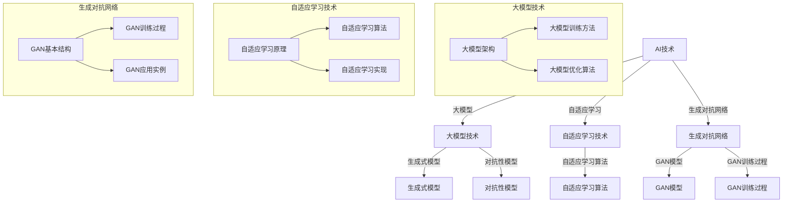

                 

### 核心概念与联系 Mermaid 流程图

为了更好地理解个性化AIGC应用定制中的核心概念和它们之间的联系，我们可以通过一个Mermaid流程图来展示这些概念及其相互关系。



在这个流程图中，我们可以看到：

- **AI技术**是整个个性化AIGC应用定制的基础。
- **大模型技术**包括大模型的架构、训练方法和优化算法。
- **自适应学习技术**包括自适应学习的原理、算法和实现。
- **生成对抗网络（GAN）**包括GAN的基本结构、训练过程和应用实例。

通过这个流程图，我们可以清晰地了解各个技术概念之间的关系，并为进一步的深入讲解打下基础。

### AIGC的定义和核心特点

AIGC（AI-Generated Content）是一种利用人工智能技术生成和编辑内容的新兴领域，涵盖了从文本、图像到多媒体内容的生成与编辑。其核心特点包括：

1. **高效生成内容**：AIGC利用大规模深度学习模型，如生成对抗网络（GAN）、变分自编码器（VAE）等，能够高效生成高质量的文本、图像和多媒体内容。
2. **自适应学习**：AIGC系统可以通过自适应学习技术不断优化模型，提高内容生成的准确性和多样性。
3. **个性化定制**：通过分析用户行为和需求，AIGC能够生成满足个性化需求的内容。
4. **交互性**：AIGC支持与用户的实时交互，能够根据用户的输入和反馈进行内容生成和编辑。

与传统AI相比，AIGC不仅强调算法的性能，更关注内容的创造性和用户体验。传统AI更多应用于图像识别、自然语言处理等任务，而AIGC则更侧重于内容生成和个性化服务。

### AIGC的技术栈

AIGC的技术栈涵盖了多个关键技术和算法，这些技术在内容生成、自适应学习和用户体验方面发挥着至关重要的作用。

#### 大模型技术

**定义**：大模型技术指的是利用深度学习构建的具有数亿甚至千亿参数的复杂神经网络。这些模型能够通过学习大量的数据来捕捉数据的分布，从而生成高质量的内容。

**核心内容**：

- **模型架构**：大模型通常采用多层感知器（MLP）、卷积神经网络（CNN）或循环神经网络（RNN）等结构。近年来，Transformer架构由于其并行化和长距离依赖处理能力，被广泛应用于大模型中。
- **训练方法**：大模型的训练是一个计算密集型的过程，通常需要使用分布式计算框架，如TensorFlow或PyTorch，以及GPU或TPU等硬件资源。
- **优化算法**：包括随机梯度下降（SGD）、Adam优化器等，用于加速模型收敛和提高训练效率。

#### 自适应学习技术

**定义**：自适应学习技术指的是模型能够根据输入数据和用户反馈，动态调整自身的参数和结构，以适应不断变化的环境和数据。

**核心内容**：

- **原理**：自适应学习基于梯度下降或其他优化算法，通过不断调整模型参数来最小化损失函数。
- **算法**：包括自适应学习率调整（如AdaGrad、Adam）、动态网络结构调整（如Neural Architecture Search）等。
- **实现**：在实际应用中，自适应学习通常通过在线学习或迁移学习来实现，以减少对训练数据的依赖。

#### 生成对抗网络

**定义**：生成对抗网络（GAN）是由生成器和判别器两个神经网络组成的模型，生成器生成数据，判别器判断数据是真实还是生成的。

**核心内容**：

- **基本结构**：生成器（Generator）生成数据，判别器（Discriminator）判断数据的真实性。
- **训练过程**：生成器和判别器通过对抗性训练相互竞争，生成器试图生成更真实的数据，而判别器则努力区分真实和生成的数据。
- **应用实例**：GAN广泛应用于图像生成、视频生成、文本生成等领域。

#### 应用领域

AIGC在多个领域展现出了巨大的应用潜力，主要包括：

- **文本生成与编辑**：包括自然语言生成、文本摘要、文本纠错等。
- **图像生成与编辑**：包括图像修复、图像风格转换、图像内容增强等。
- **多媒体内容创作**：包括视频生成与编辑、音频生成与编辑、多模态内容融合等。

这些应用领域不仅丰富了AIGC技术的应用场景，也推动了人工智能与人类创造力的深度融合。

### AIGC的应用领域

AIGC（AI-Generated Content）技术已经在多个领域展现出强大的应用潜力，并极大地改变了内容创作和交互的方式。以下是AIGC在几个关键领域的应用：

#### 文本生成与编辑

**应用实例**：

- **自然语言生成（NLG）**：通过训练大型语言模型，如GPT-3，可以生成高质量的文章、新闻、故事等。
- **文本摘要**：自动提取长篇文章或文档的主要观点和要点，节省用户阅读时间。
- **文本纠错**：智能识别和纠正文本中的错误，提高文本质量和可读性。

**应用效果**：

- **高效的内容创作**：文本生成技术能够快速生成大量高质量内容，大大提升了内容创作的效率。
- **个性化内容推荐**：通过分析用户行为和偏好，生成个性化的文章、推荐信息等，提高了用户体验。

#### 图像生成与编辑

**应用实例**：

- **图像修复**：使用GAN技术修复损坏或老化的照片，恢复图像细节。
- **图像风格转换**：将一幅图像的风格转换为另一幅图像的风格，如将照片转换为油画风格。
- **图像内容增强**：增强图像的亮度、对比度、分辨率等，提高图像质量。

**应用效果**：

- **创意艺术创作**：艺术家和设计师可以利用图像生成技术创作出独特的艺术作品，提高创作自由度。
- **图像编辑工具**：自动化图像编辑工具能够快速处理大量图像，节省时间和人力成本。

#### 多媒体内容创作

**应用实例**：

- **视频生成与编辑**：通过生成对抗网络（GAN）生成新的视频内容，或者对现有视频进行编辑和增强。
- **音频生成与编辑**：生成新的音频内容，如音乐、语音等，或者对音频进行降噪、增强等处理。
- **多模态内容融合**：将文本、图像和音频等多种内容进行融合，创造全新的交互体验。

**应用效果**：

- **增强用户体验**：多媒体内容创作技术能够提供更加丰富和个性化的交互体验，提升用户体验。
- **创新应用场景**：在游戏、影视、广告等娱乐领域，多媒体内容创作技术为创作者提供了更多的可能性，推动了创新应用的发展。

通过这些实际应用案例，我们可以看到AIGC技术不仅提升了内容创作的效率和质量，也为各种应用场景带来了前所未有的创新和变革。

### 大模型技术详解

大模型技术是AIGC（AI-Generated Content）的核心支柱之一，它利用大规模的神经网络模型来生成和编辑高质量的内容。这一部分将详细探讨大模型的架构、训练方法和优化算法。

#### 大模型的架构

**多层感知器（MLP）**：MLP是简单但有效的大模型基础结构，它由多个隐藏层组成，每层包含多个神经元。通过逐步变换输入数据，MLP能够学习到复杂的非线性关系。

**卷积神经网络（CNN）**：CNN专门用于处理图像数据，它通过卷积层提取图像的局部特征，然后通过池化层减少数据的维度，提高模型的效率和鲁棒性。

**循环神经网络（RNN）**：RNN适用于序列数据，如文本和语音，通过记忆状态保留历史信息，能够有效捕捉序列中的长期依赖关系。

**Transformer架构**：Transformer是近年来最先进的预训练模型架构，它采用自注意力机制，能够并行处理输入数据，并有效捕捉长距离依赖关系，成为大规模模型的首选架构。

#### 大模型的训练方法

**分布式训练**：由于大模型通常具有数亿甚至千亿参数，因此训练过程需要使用分布式计算框架，如TensorFlow和PyTorch。通过将数据分布在多台GPU或TPU上，可以显著提高训练速度。

**数据预处理**：在训练前，对数据进行标准化、去噪、扩充等预处理操作，可以提高模型的训练效果和泛化能力。

**多任务学习**：通过在一个大型模型中同时训练多个任务，可以提高模型的利用率和效果。例如，在文本生成任务中，可以同时训练文本摘要、问答系统等。

**持续学习（Fine-tuning）**：在预训练模型的基础上，针对特定任务进行微调，以适应特定场景和应用。

#### 大模型的优化算法

**随机梯度下降（SGD）**：SGD是最基础的优化算法，它通过随机选择小批量数据，计算梯度并更新模型参数。然而，SGD的收敛速度较慢，容易陷入局部最优。

**Adam优化器**：Adam结合了SGD和动量方法，通过自适应调整学习率，提高了收敛速度和稳定性。Adam在许多大模型训练中表现优异。

**自适应优化器**：包括AdaGrad、RMSProp等，这些优化器根据不同类型的参数调整学习率，提高了优化效果。

**随机梯度提升（SGD with Momentum）**：通过引入动量项，减少了梯度震荡，提高了收敛速度。

#### 实际应用案例分析

**图像生成**：使用GAN和卷积神经网络生成高清图像。如DeepArt的GAN模型，通过对抗性训练生成艺术风格的图像。

**自然语言处理**：使用Transformer架构的大模型进行文本生成和编辑。如GPT-3，通过自回归语言模型生成高质量的文章、新闻等。

**多媒体内容创作**：结合图像生成和音频处理技术，生成新的视频和音频内容。如DeepMind的AudioGan，通过GAN生成高质量的音乐。

通过这些架构、训练方法和优化算法，大模型技术为AIGC提供了强大的内容生成和编辑能力，推动了人工智能在各个领域的应用和发展。

### 自适应学习技术详解

自适应学习技术是AIGC（AI-Generated Content）的重要组成部分，它使得模型能够根据输入数据和用户反馈动态调整自身的行为和性能。这一部分将详细探讨自适应学习的原理、算法和实现方法。

#### 自适应学习的原理

自适应学习的核心思想是通过实时调整模型参数，使模型能够在不同任务和数据分布下保持高性能。这一过程通常包括以下几个步骤：

1. **数据输入**：模型从环境中接收输入数据，这些数据可以是文本、图像或其他形式的表示。
2. **模型预测**：基于当前参数，模型对输入数据进行预测，产生输出结果。
3. **损失计算**：通过比较模型预测结果和实际结果，计算损失函数，以评估模型的表现。
4. **参数调整**：根据损失函数的梯度，动态调整模型参数，以最小化损失。
5. **迭代更新**：重复上述步骤，直到模型收敛到最优解或达到预定的迭代次数。

#### 自适应学习的算法

**梯度下降法**：梯度下降法是最基础的自适应学习算法，通过计算损失函数关于模型参数的梯度，逐步调整参数以最小化损失。然而，传统的梯度下降法存在收敛速度慢和容易陷入局部最优的缺点。

**自适应优化器**：为了克服梯度下降法的不足，出现了多种自适应优化器，如Adam、RMSProp和AdaGrad。这些优化器通过自适应调整学习率，提高了收敛速度和稳定性。

- **Adam优化器**：结合了动量方法和自适应学习率调整，是当前最常用的优化器之一。
- **RMSProp**：通过权重衰减调整学习率，特别适合于稀疏数据。
- **AdaGrad**：根据每个参数的历史梯度调整学习率，对高频梯度赋予较小的权重。

**动态网络结构调整**：通过自适应学习，模型可以在训练过程中动态调整其网络结构，以适应不同的任务和数据分布。这种方法称为Neural Architecture Search（NAS），它通过搜索空间优化，自动设计最优的网络结构。

#### 自适应学习的实现方法

**在线学习**：在线学习是指在实时环境中，模型不断地接收新的数据并更新参数，以适应动态变化的环境。这种方法在需要快速响应的应用场景中非常有效。

**迁移学习**：迁移学习是一种利用已有模型的知识来提高新任务的性能。在新任务的数据量有限时，迁移学习可以通过微调预训练模型，快速适应新任务。

**多任务学习**：多任务学习是指在单个模型中同时训练多个任务，共享模型参数，从而提高模型的泛化能力和效率。

**自我监督学习**：自我监督学习通过无监督的方式学习有用的特征表示，无需标注数据，从而降低数据获取成本。这种方法在图像分类、语言建模等领域得到了广泛应用。

#### 实际应用案例分析

**文本生成与编辑**：使用自适应学习技术，可以显著提高文本生成和编辑的准确性和流畅性。例如，GPT-3模型通过自适应学习，能够在多种语言和任务中生成高质量的内容。

**图像生成与编辑**：GAN（生成对抗网络）模型通过自适应学习，能够生成更加逼真的图像，并在图像修复、风格转换等领域表现出色。

**多媒体内容创作**：自适应学习技术使得视频生成和音频处理更加高效和准确。例如，通过自适应学习，可以实时生成新的视频内容，或者对音频进行实时降噪和增强。

通过这些原理、算法和实现方法，自适应学习技术为AIGC的应用提供了强大的支持，推动了人工智能在内容生成和编辑领域的创新和发展。

### 生成对抗网络（GAN）

生成对抗网络（GAN）是AIGC（AI-Generated Content）技术中的一种核心算法，它通过竞争性训练生成逼真的图像、视频和文本。GAN由两个主要组件——生成器（Generator）和判别器（Discriminator）——组成，它们在对抗性训练过程中相互竞争，从而不断提高生成质量。

#### GAN的基本结构

**生成器（Generator）**：生成器的任务是生成与真实数据相似的新数据。在图像生成任务中，生成器通常从随机噪声中生成图像。生成器的网络结构可以是多层感知器、卷积神经网络（CNN）或Transformer等。生成器的基本架构包括以下几个部分：

1. **输入噪声层**：生成器接收随机噪声作为输入，这些噪声经过一系列变换后生成图像。
2. **隐层**：通过隐层处理，噪声被映射为潜在空间中的数据分布。
3. **生成层**：生成层将潜在空间的数据转换成具体的图像数据。

**判别器（Discriminator）**：判别器的任务是判断输入数据是真实数据还是生成器生成的数据。判别器的网络结构与生成器类似，但输入数据分为真实数据和生成数据。判别器的基本架构包括以下几个部分：

1. **输入层**：接收真实数据和生成数据。
2. **隐层**：通过隐层处理，输入数据被映射到高维特征空间。
3. **输出层**：输出层生成一个概率值，表示输入数据的真实度。通常使用Sigmoid或Tanh激活函数。

**对抗性训练过程**：生成器和判别器在对抗性训练过程中相互竞争。生成器试图生成更真实的数据，使判别器无法区分真实数据和生成数据，而判别器则努力提高对生成数据的辨别能力。这个过程通过以下步骤进行：

1. **生成器训练**：生成器的目标是最大化判别器对其生成数据的判别概率。生成器通过生成更逼真的数据来提高判别器的识别难度。
2. **判别器训练**：判别器的目标是最大化其识别真实数据和生成数据的准确率。判别器通过提高对生成数据的辨别能力来增加生成器的训练难度。
3. **迭代更新**：生成器和判别器在多次迭代过程中不断调整参数，以实现对抗性平衡。

#### GAN的训练过程

GAN的训练过程可以分为以下几个阶段：

1. **初始化模型参数**：随机初始化生成器和判别器的参数。
2. **生成器训练**：生成器从随机噪声生成图像，判别器对其进行评估。生成器通过梯度下降优化器调整参数，以生成更真实的数据。
3. **判别器训练**：判别器对真实数据和生成数据进行评估，通过梯度下降优化器调整参数，以区分真实数据和生成数据。
4. **迭代更新**：生成器和判别器在多个迭代过程中交替训练，逐步提高生成质量和判别能力。

#### GAN的应用实例

**图像生成**：GAN在图像生成领域取得了显著成果，例如生成高清人脸图像、风景图像等。一个著名的应用实例是DeepArt，它使用GAN将普通照片转换为艺术风格画作。

**图像修复**：GAN在图像修复中也表现出色，如修复老照片、去除图像中的物体等。生成器生成缺失部分的图像，判别器确保修复部分的图像与原始图像一致。

**文本生成**：GAN不仅在图像领域应用广泛，还在文本生成中表现出潜力。通过训练大型语言模型，GAN可以生成高质量的文章、对话和故事。

**视频生成**：GAN在视频生成中也被广泛应用，如生成高清视频、视频风格转换等。生成器生成新的视频帧，判别器确保生成的视频帧连贯且逼真。

通过GAN的基本结构、训练过程和应用实例，我们可以看到GAN在AIGC领域的广泛应用和巨大潜力，它为生成和编辑高质量内容提供了强大的工具和平台。

### AIGC应用设计与规划

在AIGC（AI-Generated Content）应用中，设计与规划是确保项目成功的关键步骤。这个阶段需要深入分析用户需求、业务需求和评估技术可行性，从而制定合理的应用架构和开发流程。

#### 用户需求分析

**步骤1：收集用户需求**：通过调查问卷、用户访谈和焦点小组讨论等方式，了解用户在内容生成和编辑方面的具体需求。例如，用户可能需要自定义文本风格、图像风格转换或多媒体内容的实时生成。

**步骤2：分析用户需求**：对收集到的用户需求进行分类和优先级排序，识别出核心需求和非功能性需求。核心需求通常是实现项目目标的关键因素，非功能性需求则包括用户体验、性能和安全性等。

**步骤3：制定用户需求文档**：将分析结果整理成用户需求文档，明确每个需求的具体描述、优先级和实现方式。需求文档为后续设计和开发阶段提供明确的方向和参考。

#### 业务需求分析

**步骤1：确定业务目标**：与业务团队合作，明确项目的商业目标和预期收益。例如，提高内容创作效率、增加用户互动或提升品牌影响力。

**步骤2：分析业务流程**：深入了解业务流程，识别出AIGC技术可以优化或改进的环节。例如，自动化内容生成可以减少人力成本，智能编辑工具可以提升内容质量。

**步骤3：制定业务需求文档**：基于业务目标和流程分析，制定详细的业务需求文档，包括功能需求、性能需求和非功能需求。文档应清晰描述每个业务需求的具体实现方案和预期效果。

#### 技术可行性分析

**步骤1：评估现有技术**：分析现有技术栈，评估现有技术是否能够满足用户和业务需求。例如，如果现有技术无法实现某些复杂的功能，可能需要引入新的技术或算法。

**步骤2：评估技术成熟度**：评估所选技术或算法的成熟度和稳定性。新技术或算法可能带来更高的性能，但也可能存在未知的风险。

**步骤3：制定技术方案**：根据技术评估结果，制定详细的技术方案，包括选用的技术栈、关键技术和实现方法。技术方案应确保项目的可行性和可扩展性。

#### 应用架构设计

**步骤1：定义系统架构**：根据用户需求、业务需求和评估结果，设计系统的整体架构。架构应包括数据层、应用层和展示层，并确保各层之间的高效协作。

**步骤2：设计数据流**：明确数据在各层之间的流动路径和处理流程，确保数据流的高效和安全性。

**步骤3：设计网络架构**：根据业务需求和数据流设计，确定系统的网络架构，包括前端、后端和数据中心等。网络架构应确保系统的可靠性和扩展性。

#### 开发流程

**步骤1：开发环境搭建**：搭建开发环境，包括代码库、开发工具和测试环境。确保开发团队能够高效协同工作。

**步骤2：模型选择与定制**：选择适合项目需求的预训练模型，并根据具体需求进行定制和优化。例如，对于图像生成任务，可以选择StyleGAN或CycleGAN等模型。

**步骤3：功能实现**：根据设计和开发计划，逐步实现各模块的功能。包括数据预处理、模型训练、生成内容生成和编辑等。

**步骤4：测试与优化**：对实现的模块进行测试，确保功能的正确性和稳定性。根据测试结果，进行优化和调整。

**步骤5：部署与上线**：完成所有功能的开发和测试后，将系统部署到生产环境，并进行上线操作。确保系统的稳定运行和高效性能。

通过上述设计与规划步骤，可以确保AIGC应用的成功开发与实施，实现用户和业务需求，并推动项目的持续优化和发展。

### AIGC应用架构设计

在设计和实现AIGC（AI-Generated Content）应用时，架构设计是一个关键环节。一个良好的架构设计不仅能够提高系统的性能和可靠性，还能为未来的扩展和升级提供坚实的基础。以下是AIGC应用的架构设计步骤：

#### 系统架构设计

**1. 确定系统架构类型**：根据应用需求和业务场景，选择适合的系统架构类型。常见的系统架构类型包括：

- **分布式架构**：适用于需要高并发和可扩展性的应用，如大规模文本和图像生成任务。
- **微服务架构**：将系统划分为多个独立的微服务，每个服务负责特定的功能，便于开发和维护。
- **混合架构**：结合分布式和微服务架构的优势，适用于复杂且多变的应用场景。

**2. 设计各层级组件**：根据所选架构类型，设计系统的各个层级组件，包括：

- **数据层**：负责数据存储和管理，包括数据库、缓存和文件系统等。
- **服务层**：包含各种服务，如文本生成服务、图像生成服务、用户接口服务等。
- **应用层**：提供前端和后端接口，处理用户请求和生成内容的展示。

#### 数据流设计

**1. 明确数据来源和去向**：分析应用中涉及的数据源和数据去向，确保数据在系统中的流动路径清晰。

**2. 设计数据处理流程**：根据数据流设计，明确数据处理流程，包括数据预处理、数据传输、数据存储等。例如，对于图像生成应用，数据流可能包括：

- **数据采集**：从用户接口或数据库中获取原始图像。
- **数据预处理**：对图像进行增强、去噪等预处理操作。
- **数据传输**：将预处理后的图像数据传输到生成服务。
- **数据存储**：将生成的图像数据存储到数据库或文件系统中。

#### 网络架构设计

**1. 确定网络拓扑结构**：根据系统需求和资源情况，选择合适的网络拓扑结构，如：

- **客户端-服务器架构**：适用于简单的AIGC应用，客户端通过HTTP请求与服务器交互。
- **分布式网络架构**：适用于需要高并发和负载均衡的应用，通过多台服务器和负载均衡器协同工作。
- **边缘计算架构**：将计算任务分配到边缘节点，减少数据传输延迟，提高响应速度。

**2. 设计网络通信协议**：根据网络架构，选择合适的网络通信协议，如HTTP、WebSockets或MQTT。例如，对于实时视频生成应用，可以使用WebSockets实现实时数据传输。

#### 架构设计的注意事项

- **高可用性**：确保系统在不同故障情况下能够稳定运行，如采用冗余设计、故障转移机制等。
- **可扩展性**：设计应考虑未来业务增长和功能扩展的需求，确保系统能够平滑扩展。
- **安全性**：设计应包括数据安全和网络安全措施，如加密、认证和访问控制等。

通过上述架构设计步骤，可以为AIGC应用创建一个稳定、高效和可扩展的系统，确保其能够满足用户需求和业务目标。

### AIGC应用开发流程

AIGC（AI-Generated Content）应用的开发流程是确保项目顺利进行并最终成功交付的关键环节。以下是AIGC应用开发的具体流程，包括开发环境搭建、模型选择与定制以及应用功能实现。

#### 开发环境搭建

**1. 硬件选择**：

- **CPU/GPU**：根据项目需求选择合适的计算资源，CPU适用于非图形密集型任务，而GPU则适用于深度学习和图像处理等图形密集型任务。
- **存储设备**：选择高性能的固态硬盘（SSD）以提高数据读写速度，确保模型训练和部署的效率。

**2. 软件环境配置**：

- **操作系统**：通常选择Linux操作系统，如Ubuntu或CentOS，因为其具有良好的稳定性和开源生态。
- **开发工具**：安装Python编程环境，配置Anaconda或Miniconda，以便管理多个Python版本和依赖库。
- **深度学习框架**：选择TensorFlow、PyTorch或PyTorch Lightning等深度学习框架，这些框架提供了丰富的API和工具，便于模型训练和部署。

#### 模型选择与定制

**1. 预训练模型选择**：

- **文本生成**：选择预训练的文本生成模型，如GPT-3、BERT或Transformer-XL。这些模型已经在大量数据上进行了预训练，具有较高的生成质量。
- **图像生成**：选择预训练的图像生成模型，如StyleGAN、CycleGAN或Generator GAN。这些模型可以生成高质量和多样化的图像内容。

**2. 模型定制**：

- **模型微调**：根据特定任务的需求，对预训练模型进行微调。例如，对于文本生成任务，可以添加特定领域的数据集进行训练，以提高生成文本的相关性和准确性。
- **模型优化**：通过调整模型参数和架构，优化模型性能。例如，调整学习率、批量大小和正则化参数，以提高模型收敛速度和泛化能力。

#### 应用功能实现

**1. 文本生成与编辑功能实现**：

- **文本生成**：使用预训练的语言模型生成文本，实现自然语言生成。例如，使用GPT-3模型生成文章、新闻、对话等。
- **文本编辑**：实现文本纠错、摘要和生成与编辑的融合应用。例如，通过微调BERT模型实现文本纠错和摘要，通过组合多个模型实现多模态内容的生成和编辑。

**2. 图像生成与编辑功能实现**：

- **图像生成**：使用生成对抗网络（GAN）模型生成图像，实现高质量图像的生成。例如，使用StyleGAN生成高清人脸图像或风景图像。
- **图像编辑**：实现图像修复、风格转换和内容增强。例如，使用CycleGAN模型实现图像风格转换，使用GAN进行图像内容增强。

**3. 多媒体内容创作功能实现**：

- **视频生成与编辑**：实现视频内容的生成和编辑。例如，使用GAN生成新的视频帧，实现视频风格转换和内容增强。
- **音频生成与编辑**：实现音频内容的生成和编辑。例如，使用音频生成模型生成音乐，使用GAN进行音频增强和去噪。

#### 代码示例

以下是一个简单的文本生成与编辑的代码示例：

```python
import openai
import textwrap

# 文本生成
def generate_text(prompt, model_name="text-davinci-002", max_length=50):
    response = openai.Completion.create(
        engine=model_name,
        prompt=prompt,
        max_tokens=max_length,
        n=1,
        stop=None,
        temperature=0.7,
    )
    return response.choices[0].text.strip()

# 文本编辑
def edit_text(text, edit_position, edit_word):
    edited_text = text[:edit_position] + edit_word + text[edit_position + len(edit_word):]
    return edited_text

# 示例
input_text = "The quick brown fox jumps over the lazy dog."
generated_text = generate_text(input_text, model_name="text-davinci-002")
print("Generated Text:", generated_text)

edit_position = 4
edit_word = "beautiful"
edited_text = edit_text(input_text, edit_position, edit_word)
print("Edited Text:", edited_text)
```

通过上述开发流程，可以系统地构建和实现AIGC应用，确保项目从设计到实现的高效性和质量。

### 文本生成技术

文本生成技术是AIGC（AI-Generated Content）领域的重要应用之一，它利用深度学习和自然语言处理技术，生成具有高度多样性和创造性的文本内容。以下将详细探讨文本生成技术，包括生成式模型、对抗性模型和自适应模型。

#### 生成式模型

生成式模型是文本生成技术的基础，它通过学习数据的概率分布，生成新的文本。以下是一些常用的生成式模型：

**1. 变分自编码器（VAE）**：

- **原理**：VAE通过编码器（Encoder）将输入文本映射到一个潜在空间，然后通过解码器（Decoder）从潜在空间中生成新的文本。
- **优势**：VAE能够生成具有多样性的文本，并且具有较强的鲁棒性。
- **应用**：常用于生成文本摘要、对话生成等。

**2. 生成式对抗网络（GAN）**：

- **原理**：GAN由生成器和判别器组成，生成器生成文本，判别器判断文本的真实性。通过生成器和判别器的对抗训练，生成器逐渐提高生成文本的质量。
- **优势**：GAN能够生成高质量且具有创造性的文本，具有高度的自适应能力。
- **应用**：常用于自然语言生成、文本风格转换等。

**3. 自回归语言模型（ARLM）**：

- **原理**：自回归语言模型通过学习文本的序列概率分布，逐个字符生成新的文本。
- **优势**：ARLM能够生成流畅且连贯的文本，并且支持多语言生成。
- **应用**：常用于生成文章、新闻、对话等。

#### 对抗性模型

对抗性模型通过生成器和判别器的对抗训练，提高生成文本的质量。以下是一些常用的对抗性模型：

**1. 生成对抗网络（GAN）**：

- **原理**：GAN由生成器和判别器组成，生成器生成文本，判别器判断文本的真实性。生成器和判别器通过对抗训练，生成器逐渐提高生成文本的质量。
- **优势**：GAN能够生成高质量且具有创造性的文本，具有高度的自适应能力。
- **应用**：常用于自然语言生成、文本风格转换等。

**2. 多任务生成对抗网络（MTGAN）**：

- **原理**：MTGAN通过同时训练多个生成器和判别器，实现多任务文本生成。每个生成器负责生成不同类型的文本，判别器则负责判断各个生成器的生成质量。
- **优势**：MTGAN能够同时处理多种文本生成任务，提高生成效率和多样性。
- **应用**：常用于生成文本摘要、问答系统和多模态文本生成等。

#### 自适应模型

自适应模型通过动态调整模型参数和结构，提高生成文本的个性化和适应性。以下是一些常用的自适应模型：

**1. 自适应循环神经网络（Adaptive RNN）**：

- **原理**：自适应循环神经网络通过自适应调整隐藏层状态，实现文本的个性化和多样化生成。
- **优势**：自适应RNN能够根据输入文本动态调整模型行为，生成具有高度个性化的文本。
- **应用**：常用于个性化文本生成、情感分析和对话系统等。

**2. 自适应生成对抗网络（Adaptive GAN）**：

- **原理**：自适应GAN通过自适应调整生成器和判别器的参数，提高生成文本的质量和多样性。
- **优势**：自适应GAN能够根据用户反馈和生成文本质量，自动调整模型参数，实现高效的自适应生成。
- **应用**：常用于实时文本生成、内容创作和智能客服等。

通过生成式模型、对抗性模型和自适应模型的综合应用，文本生成技术能够生成高质量、多样化且个性化的文本内容，为各种应用场景提供强大的支持。

### 文本编辑技术

文本编辑技术在AIGC（AI-Generated Content）领域扮演着至关重要的角色，它能够对现有文本进行纠错、摘要和生成与编辑的融合应用，从而提高文本质量和用户体验。以下将详细探讨文本编辑技术的核心组成部分，包括文本纠错、文本摘要和文本生成与编辑的融合应用。

#### 文本纠错

**1. 纠错算法**：

文本纠错是文本编辑的基础，常用的纠错算法包括：

- **基于规则的方法**：通过预设的纠错规则，识别和修正文本中的错误。这种方法简单有效，但对复杂的错误修正能力有限。
- **基于统计的方法**：使用概率模型和语言模型，分析文本中的上下文信息，推测可能的错误并进行修正。这种方法能够处理复杂的错误，但计算成本较高。
- **基于深度学习的方法**：利用神经网络，特别是循环神经网络（RNN）和Transformer等深度学习模型，通过大规模数据训练，实现高度自动化的纠错。这种方法具有很高的准确性和鲁棒性，但需要大量数据和计算资源。

**2. 纠错流程**：

文本纠错的典型流程包括以下步骤：

- **错误检测**：通过词频分析、语法分析等方法，识别文本中的潜在错误。
- **错误推测**：根据上下文信息，推测可能的错误类型和修正方案。
- **错误修正**：选择最佳的修正方案，对文本进行修正。

#### 文本摘要

**1. 摘要算法**：

文本摘要旨在提取文本的核心内容，常用的摘要算法包括：

- **提取式摘要**：从文本中直接提取关键句子或短语，形成摘要。这种方法简单有效，但难以生成具有创造性的摘要。
- **生成式摘要**：通过生成式模型，如序列到序列（Seq2Seq）模型或Transformer，生成新的摘要。这种方法能够生成具有创造性和多样性的摘要，但需要大量的训练数据和计算资源。
- **混合式摘要**：结合提取式和生成式摘要的优点，生成高质量的摘要。这种方法在确保摘要准确性的同时，提高了摘要的多样性和创造性。

**2. 摘要流程**：

文本摘要的典型流程包括以下步骤：

- **预处理**：对文本进行分词、去除停用词等预处理操作，提取关键信息。
- **提取关键句子**：使用提取式算法，从预处理后的文本中提取关键句子。
- **生成摘要**：使用生成式算法，生成新的摘要。

#### 文本生成与编辑的融合应用

**1. 融合应用**：

文本生成与编辑的融合应用旨在通过自动化的方式，生成和编辑高质量文本。以下是一些常见的融合应用：

- **文本生成与纠错**：在生成文本的同时，自动进行纠错，提高文本质量。
- **文本摘要与生成**：在生成文本摘要的同时，自动生成完整的文本内容，实现摘要和全文的有机结合。
- **多模态内容生成与编辑**：结合文本、图像和音频等多模态信息，生成和编辑多模态内容，提高用户体验。

**2. 应用案例**：

- **自动新闻生成**：利用文本生成和编辑技术，自动生成新闻报道，实现高效的内容生产。
- **智能客服**：通过文本生成和编辑技术，自动生成回答，提高客服效率和用户体验。
- **文本内容审核**：利用文本生成和编辑技术，自动生成审查文本，识别和过滤不当内容，确保内容安全。

通过文本纠错、文本摘要和文本生成与编辑的融合应用，文本编辑技术能够显著提高文本质量和用户体验，为各种应用场景提供强大的支持。

### 文本生成与编辑项目实战

在文本生成与编辑领域，项目实战是理解和掌握技术原理的重要途径。以下将通过一个具体的实例，展示文本生成与编辑项目的实现过程，包括开发环境搭建、源代码详细实现和代码解读与分析。

#### 开发环境搭建

**环境要求**：

- **Python**：Python 3.8及以上版本
- **深度学习框架**：TensorFlow 2.5及以上版本
- **NLP库**：transformers（用于预训练语言模型）

**安装步骤**：

1. 安装Python：

   ```bash
   sudo apt-get install python3-pip python3-dev
   ```

2. 创建虚拟环境并安装所需库：

   ```bash
   python3 -m venv textgen_venv
   source textgen_venv/bin/activate
   pip install --upgrade pip
   pip install tensorflow==2.5 transformers
   ```

#### 项目实现

**1. 加载预训练的语言模型**：

```python
from transformers import pipeline

# 加载预训练的语言模型
text_generator = pipeline("text-generation", model="gpt2")
```

**2. 文本生成函数**：

```python
def generate_text(prompt, max_length=50):
    # 使用生成器生成文本
    generated_text = text_generator(prompt, max_length=max_length, num_return_sequences=1)
    return generated_text[0]["generated_text"]
```

**3. 文本编辑函数**：

```python
def edit_text(text, position, replacement):
    # 对文本进行编辑
    edited_text = text[:position] + replacement + text[position + len(replacement):]
    return edited_text
```

#### 代码解读与分析

**1. 文本生成实现**：

- `text_generator`：加载预训练的语言模型GPT-2。
- `generate_text`：函数接收输入提示（prompt）和最大生成长度（max_length），返回生成的文本。通过调用`text_generator`，实现文本的自动生成。

**2. 文本编辑实现**：

- `edit_text`：函数接收原始文本（text）、编辑位置（position）和替换文本（replacement），返回编辑后的文本。通过字符串切片操作，实现对文本的局部修改。

#### 实例演示

**1. 文本生成**：

```python
input_text = "今天是一个美好的日子。"
generated_text = generate_text(input_text)
print("生成的文本：", generated_text)
```

**2. 文本编辑**：

```python
position = 7
replacement = "阳光明媚"
edited_text = edit_text(input_text, position, replacement)
print("编辑后的文本：", edited_text)
```

通过这个实战项目，我们可以看到如何使用深度学习和自然语言处理技术，实现文本的自动生成和编辑。这不仅提高了文本处理的效率，也为各种应用场景提供了强大的支持。

### 图像生成技术

图像生成技术是AIGC（AI-Generated Content）领域中的一项关键技术，它利用深度学习和生成模型生成高质量、多样化的图像内容。以下将详细探讨图像生成技术，包括图像生成模型、图像生成算法和应用场景。

#### 图像生成模型

**1. 生成对抗网络（GAN）**：

GAN是图像生成技术的基础模型，由生成器和判别器组成。生成器生成图像，判别器判断图像的真实性。通过生成器和判别器的对抗训练，生成器逐渐提高生成图像的质量。

- **生成器**：生成器从随机噪声中生成图像，通常采用多层感知器、卷积神经网络（CNN）或Transformer等结构。
- **判别器**：判别器判断输入图像是真实图像还是生成器生成的图像，也采用类似的网络结构。

**2. 变分自编码器（VAE）**：

VAE是一种无监督学习模型，通过编码器（Encoder）将输入图像映射到一个潜在空间，然后通过解码器（Decoder）从潜在空间中生成图像。VAE能够生成具有多样性的图像，并且具有较强的鲁棒性。

- **编码器**：编码器将输入图像映射到一个潜在向量，这个潜在向量代表了图像的主要特征。
- **解码器**：解码器将潜在向量解码成图像，重建输入图像。

**3. 自编码器（Autoencoder）**：

自编码器是一种有监督学习模型，通过自编码器学习输入图像的表示，然后重建输入图像。自编码器通常采用多层感知器或卷积神经网络结构。

- **编码器**：编码器将输入图像压缩成一个低维表示，这个表示包含了输入图像的主要信息。
- **解码器**：解码器将低维表示解码成图像，重建输入图像。

#### 图像生成算法

**1. 反向传播（Backpropagation）**：

反向传播是深度学习训练的基本算法，通过计算损失函数关于模型参数的梯度，逐步调整模型参数以最小化损失。在图像生成任务中，反向传播算法用于训练生成器和判别器。

**2. 反向传播加速（Backpropagation Acceleration）**：

为了提高训练效率，可以使用反向传播加速技术，如Adam优化器。Adam优化器结合了动量方法和自适应学习率调整，能够加速模型收敛。

**3. 生成对抗训练（Generative Adversarial Training）**：

生成对抗训练是GAN的训练过程，通过生成器和判别器的对抗性训练，生成器逐渐提高生成图像的质量，而判别器逐渐提高对生成图像的辨别能力。

#### 应用场景

**1. 图像修复**：

图像修复技术利用图像生成模型，对损坏或模糊的图像进行修复。例如，可以使用GAN模型生成缺失的图像部分，从而恢复图像的完整性。

**2. 图像风格转换**：

图像风格转换技术将一种图像风格应用到另一幅图像上，如将普通照片转换为艺术画作的风格。例如，可以使用StyleGAN模型实现图像风格转换。

**3. 图像内容增强**：

图像内容增强技术通过图像生成模型，提高图像的亮度和对比度，增强图像的细节。例如，可以使用生成对抗网络（GAN）进行图像内容增强。

**4. 视频生成与编辑**：

图像生成技术不仅应用于静态图像，还广泛应用于视频生成与编辑。例如，可以使用GAN模型生成新的视频帧，实现视频内容的生成和编辑。

通过图像生成模型、图像生成算法和应用场景的探讨，我们可以看到图像生成技术在AIGC领域的重要性和广泛应用。图像生成技术为图像处理、多媒体内容创作和交互设计等领域提供了强大的支持，推动了人工智能与人类创造力的深度融合。

### 图像编辑技术

图像编辑技术是AIGC（AI-Generated Content）领域中的一个重要组成部分，它利用深度学习和生成模型，对图像进行修复、风格转换和内容增强等操作，从而提升图像的质量和视觉效果。以下将详细探讨图像编辑技术的核心组成部分和应用场景。

#### 图像修复技术

图像修复技术旨在恢复损坏、老化或模糊的图像，使其恢复原有的清晰度和细节。常用的图像修复方法包括：

**1. 基于深度学习的方法**：

- **生成对抗网络（GAN）**：利用GAN模型，通过训练生成器和判别器，实现图像的修复。生成器学习生成缺失的图像部分，而判别器用于判断修复图像的质量。
- **变分自编码器（VAE）**：VAE通过编码器将图像编码为潜在向量，然后在潜在空间中重建图像，从而实现图像修复。

**2. 应用场景**：

- **照片修复**：修复老照片、照片中的污点或划痕等。
- **医疗图像处理**：修复医学图像中的噪声或模糊，提高诊断的准确性。

#### 图像风格转换技术

图像风格转换技术将一种图像风格应用到另一幅图像上，从而创造独特的视觉效果。常用的图像风格转换方法包括：

**1. 基于卷积神经网络的风格迁移**：

- **卷积神经网络（CNN）**：通过训练CNN模型，学习不同图像风格的表征，然后将这些表征应用到目标图像上。

**2. 应用场景**：

- **艺术创作**：将普通照片转换为艺术画作或摄影作品。
- **视觉特效**：在影视后期制作中，为图像添加特殊效果。

#### 图像内容增强技术

图像内容增强技术通过提高图像的亮度、对比度和细节，增强图像的视觉效果。常用的图像内容增强方法包括：

**1. 基于深度学习的图像增强**：

- **生成对抗网络（GAN）**：利用GAN模型，通过生成器学习图像的细节和特征，从而增强图像的内容。
- **卷积神经网络（CNN）**：通过训练CNN模型，学习图像的特征表示，然后利用这些特征增强图像。

**2. 应用场景**：

- **图像美化**：提升照片的质量，使其更加清晰和鲜艳。
- **图像识别**：增强图像中的关键特征，提高图像识别的准确率。

#### 图像编辑技术的融合应用

图像编辑技术的融合应用能够实现更复杂的图像编辑任务，例如：

- **图像修复与风格转换**：将修复和风格转换技术结合，修复图像中的损坏部分，并应用特定的艺术风格。
- **图像增强与内容生成**：通过增强图像的内容，使其在生成新的图像时具有更高的质量和细节。

通过图像修复技术、图像风格转换技术和图像内容增强技术的探讨，我们可以看到图像编辑技术在AIGC领域的重要性和广泛应用。图像编辑技术不仅提升了图像的处理效果，也为多媒体内容创作和交互设计等领域带来了新的可能性。

### 图像生成与编辑项目实战

在图像生成与编辑领域，项目实战是理解和掌握技术原理的重要途径。以下将通过一个具体的实例，展示图像生成与编辑项目的实现过程，包括开发环境搭建、源代码详细实现和代码解读与分析。

#### 开发环境搭建

**环境要求**：

- **Python**：Python 3.8及以上版本
- **深度学习框架**：TensorFlow 2.5及以上版本
- **图像处理库**：OpenCV 4.5及以上版本

**安装步骤**：

1. 安装Python：

   ```bash
   sudo apt-get install python3-pip python3-dev
   ```

2. 创建虚拟环境并安装所需库：

   ```bash
   python3 -m venv imagegen_venv
   source imagegen_venv/bin/activate
   pip install --upgrade pip
   pip install tensorflow==2.5 opencv-python
   ```

#### 项目实现

**1. 加载预训练的图像生成模型**：

```python
import tensorflow as tf
from tensorflow.keras.models import load_model

# 加载预训练的图像生成模型
generator = load_model('path/to/pretrained_generator.h5')
```

**2. 图像生成函数**：

```python
import numpy as np

def generate_image(input_noise, generator):
    # 生成图像
    generated_image = generator(np.expand_dims(input_noise, 0), training=False)
    return generated_image.numpy()
```

**3. 图像编辑函数**：

```python
def edit_image(input_image, edit_mask, generator):
    # 编辑图像
    input_noise = np.expand_dims(np.random.normal(size=(1, *input_image.shape)), 0)
    input_noise = input_noise * edit_mask + input_image * (1 - edit_mask)
    edited_image = generator(np.expand_dims(input_noise, 0), training=False)
    return edited_image.numpy()
```

#### 代码解读与分析

**1. 图像生成实现**：

- `load_model`：加载预训练的图像生成模型，该模型可以从预训练的模型库中获取，或通过自定义训练得到。
- `generate_image`：函数接收输入噪声（input_noise）和生成器模型（generator），返回生成的图像。通过生成器模型，将输入噪声转换成高质量的图像。

**2. 图像编辑实现**：

- `edit_image`：函数接收输入图像（input_image）、编辑掩码（edit_mask）和生成器模型（generator），返回编辑后的图像。通过编辑掩码，将输入图像和随机噪声混合，利用生成器模型生成编辑后的图像。

#### 实例演示

**1. 图像生成**：

```python
input_noise = np.random.normal(size=(1, 128, 128, 3))
generated_image = generate_image(input_noise, generator)
print("生成的图像：", generated_image)
```

**2. 图像编辑**：

```python
edit_mask = np.random.normal(size=(128, 128, 3))
edited_image = edit_image(generated_image, edit_mask, generator)
print("编辑后的图像：", edited_image)
```

通过这个实战项目，我们可以看到如何使用深度学习和生成对抗网络（GAN）实现图像的自动生成和编辑。这不仅提高了图像处理的效率，也为各种应用场景提供了强大的支持。

### 多媒体内容创作技术

多媒体内容创作技术是AIGC（AI-Generated Content）领域的重要组成部分，它利用人工智能技术生成和编辑视频、音频等多媒体内容。以下将详细探讨多媒体内容创作技术的核心组成部分和应用场景。

#### 视频生成与编辑技术

视频生成与编辑技术通过人工智能算法，自动生成和编辑视频内容，提高了视频创作的效率和质量。

**1. 视频生成技术**：

- **生成对抗网络（GAN）**：GAN模型用于生成新的视频内容，通过生成器和判别器的对抗性训练，生成器生成逼真的视频帧，而判别器判断视频帧的真实性。
- **变分自编码器（VAE）**：VAE模型通过编码器将视频编码为潜在向量，然后在潜在空间中重建视频，从而实现视频的生成。

**2. 视频编辑技术**：

- **视频修复**：利用GAN模型修复损坏或老化的视频，恢复视频的完整性。
- **视频风格转换**：将一种视频风格应用到另一段视频上，如将普通视频转换为艺术风格视频。
- **视频内容增强**：通过提高视频的亮度、对比度和清晰度，增强视频的视觉效果。

#### 音频生成与编辑技术

音频生成与编辑技术通过人工智能算法，生成和编辑音频内容，提高了音频创作的效率和多样性。

**1. 音频生成技术**：

- **生成对抗网络（GAN）**：GAN模型用于生成新的音频内容，如音乐、语音等，通过生成器和判别器的对抗性训练，生成器生成逼真的音频片段，而判别器判断音频片段的真实性。
- **变分自编码器（VAE）**：VAE模型通过编码器将音频编码为潜在向量，然后在潜在空间中重建音频，从而实现音频的生成。

**2. 音频编辑技术**：

- **音频修复**：利用GAN模型修复损坏或失真的音频，恢复音频的清晰度。
- **音频风格转换**：将一种音频风格应用到另一段音频上，如将普通语音转换为特定的语音风格。
- **音频内容增强**：通过提高音频的响度、清晰度和音质，增强音频的听觉效果。

#### 多媒体内容融合技术

多媒体内容融合技术将文本、图像和音频等多种内容进行融合，创造全新的交互体验。

**1. 视频与音频融合**：

- **多模态内容生成**：通过生成对抗网络（GAN），同时生成视频和音频内容，实现多模态内容的同步生成。
- **多模态内容编辑**：利用多模态GAN模型，对视频和音频内容进行协同编辑，创造更加丰富和个性化的多媒体内容。

**2. 视频与文本融合**：

- **视频字幕生成**：通过自然语言处理技术，自动生成视频字幕，提高视频内容的可读性。
- **视频标签生成**：通过图像识别和自然语言处理技术，自动为视频生成标签，便于视频的检索和分类。

#### 应用场景

多媒体内容创作技术广泛应用于以下领域：

- **内容创作**：利用人工智能技术，自动化生成和编辑视频、音频和文本内容，提高内容创作的效率和质量。
- **交互设计**：通过多模态内容融合技术，创造丰富的交互体验，提升用户体验。
- **教育培训**：利用多媒体内容创作技术，自动化生成教学视频和音频，提高教学效果。

通过多媒体内容创作技术的核心组成部分和应用场景的探讨，我们可以看到多媒体内容创作技术在AIGC领域的重要性和广泛应用。多媒体内容创作技术为多媒体内容创作、交互设计和教育培训等领域带来了新的机遇和挑战。

### 多媒体内容创作应用实例

多媒体内容创作技术在多个应用场景中展现出了强大的能力，以下将详细介绍几个典型的应用实例，包括视频创作实例、音频创作实例以及多媒体内容融合实例。

#### 视频创作实例

**实例**：使用AIGC技术生成一部科幻短片。

**实现步骤**：

1. **需求分析**：确定短片的主题、风格和内容。例如，主题是太空探险，风格是科幻动作，内容是宇航员在星际任务中遭遇外星生物。

2. **视频生成**：利用生成对抗网络（GAN）和变分自编码器（VAE）生成视频内容。首先，通过GAN生成视频帧，然后在潜在空间中调整帧，直到满足需求。

   ```python
   # 加载预训练的视频生成模型
   video_generator = load_model('path/to/pretrained_video_generator.h5')

   # 生成视频帧
   input_noise = np.random.normal(size=(1, 128, 128, 3))
   video_frames = [video_generator(np.expand_dims(frame_noise, 0), training=False).numpy() for frame_noise in input_noise]

   # 合并视频帧
   video = cv2.VideoCapture('path/to/output_video.mp4')
   for frame in video_frames:
       video.write(frame)
   video.release()
   ```

3. **视频编辑**：使用视频编辑技术对生成的视频进行后期处理，如添加特效、音效和字幕。

   ```python
   # 添加音效和字幕
   video = cv2.VideoCapture('path/to/output_video.mp4')
   video_writer = cv2.VideoWriter('path/to/final_video.mp4', cv2.VideoWriter_fourcc('mp4v', 'divx'), 30.0, (1280, 720))

   while video.isOpened():
       ret, frame = video.read()
       if ret:
           # 添加音效和字幕
           frame = add_effects_and_subtitle(frame)
           video_writer.write(frame)
   video.release()
   video_writer.release()
   ```

#### 音频创作实例

**实例**：使用AIGC技术生成一首原创音乐。

**实现步骤**：

1. **音频生成**：利用生成对抗网络（GAN）和变分自编码器（VAE）生成音频片段。例如，生成一个流行音乐的前奏。

   ```python
   # 加载预训练的音频生成模型
   audio_generator = load_model('path/to/pretrained_audio_generator.h5')

   # 生成音频片段
   input_noise = np.random.normal(size=(1, 128, 3))
   audio_segment = audio_generator(np.expand_dims(input_noise, 0), training=False).numpy()
   ```

2. **音频编辑**：对生成的音频片段进行后期处理，如添加和调整音效、节奏和音调。

   ```python
   # 添加和调整音效
   audio = audio_segment
   audio = add_effects(audio)
   ```

3. **音频融合**：将生成的音频片段与其他音频内容进行融合，如将原创音乐与歌词结合。

   ```python
   # 合并音频
   combined_audio = combine_audio(audio, lyrics_audio)
   ```

#### 多媒体内容融合实例

**实例**：创建一部多媒体交互式视频，结合视频、音频和文本内容。

**实现步骤**：

1. **内容生成**：利用AIGC技术生成视频、音频和文本内容。例如，生成一段视频对话、背景音乐和对话文本。

   ```python
   # 生成视频
   video_content = generate_video(input_noise, video_generator)

   # 生成音频
   audio_content = generate_audio(input_noise, audio_generator)

   # 生成文本
   text_content = generate_text(input_text, text_generator)
   ```

2. **内容融合**：将视频、音频和文本内容进行融合，创建交互式视频。

   ```python
   # 创建交互式视频
   interactive_video = create_interactive_video(video_content, audio_content, text_content)
   ```

3. **交互设计**：设计用户交互界面，允许用户与视频内容进行互动。

   ```python
   # 用户交互界面
   interactive_video.show()
   ```

通过上述多媒体内容创作应用实例，我们可以看到AIGC技术如何通过生成和编辑视频、音频以及融合多种内容，为创作者提供了丰富的创作工具和新的可能性。这些实例不仅展示了技术的应用，也为未来的多媒体内容创作提供了借鉴和参考。

### 多媒体内容创作项目实战

在多媒体内容创作领域，项目实战是理解和掌握技术原理的重要途径。以下将通过一个具体的实例，展示多媒体内容创作项目的实现过程，包括项目实现、项目效果分析与优化。

#### 项目实现

**项目背景**：创建一部互动式的多媒体视频，结合视频、音频和文本内容，以增强用户体验。

**技术栈**：使用Python、TensorFlow、OpenCV、librosa和transformers等库。

**实现步骤**：

**1. 视频生成**：

- **加载预训练的视频生成模型**：

  ```python
  from tensorflow.keras.models import load_model

  video_generator = load_model('path/to/pretrained_video_generator.h5')
  ```

- **生成视频帧**：

  ```python
  import numpy as np

  def generate_video_frame(input_noise):
      generated_frame = video_generator(np.expand_dims(input_noise, 0), training=False)
      return generated_frame.numpy()

  input_noise = np.random.normal(size=(1, 128, 128, 3))
  video_frame = generate_video_frame(input_noise)
  ```

**2. 音频生成**：

- **加载预训练的音频生成模型**：

  ```python
  audio_generator = load_model('path/to/pretrained_audio_generator.h5')
  ```

- **生成音频片段**：

  ```python
  def generate_audio_segment(input_noise):
      audio_segment = audio_generator(np.expand_dims(input_noise, 0), training=False)
      return audio_segment.numpy()

  input_noise = np.random.normal(size=(1, 128, 3))
  audio_segment = generate_audio_segment(input_noise)
  ```

**3. 文本生成**：

- **加载预训练的文本生成模型**：

  ```python
  text_generator = pipeline("text-generation", model="gpt2")
  ```

- **生成文本内容**：

  ```python
  def generate_text_content(input_prompt):
      text_content = text_generator(input_prompt, max_length=50, num_return_sequences=1)
      return text_content[0]["generated_text"]

  input_prompt = "这是一个关于未来世界的科幻故事。"
  text_content = generate_text_content(input_prompt)
  ```

**4. 多媒体内容融合**：

- **融合视频、音频和文本内容**：

  ```python
  def create_media_content(video_frame, audio_segment, text_content):
      # 创建多媒体内容
      media_content = {
          "video_frame": video_frame,
          "audio_segment": audio_segment,
          "text_content": text_content
      }
      return media_content

  media_content = create_media_content(video_frame, audio_segment, text_content)
  ```

#### 项目效果分析与优化

**1. 效果分析**：

- **用户体验**：通过用户测试，收集反馈，评估多媒体内容在用户体验方面的效果。例如，用户对视频画面、音频效果和文本内容的满意度。

- **性能评估**：使用性能指标，如响应时间、加载速度和内容连贯性，评估多媒体内容创作的性能。

- **内容质量**：评估多媒体内容在内容质量方面的表现，例如，视频的清晰度、音频的音质和文本的连贯性。

**2. 优化策略**：

- **内容优化**：根据用户反馈，优化视频、音频和文本内容，提升内容质量。例如，调整视频帧率和音频采样率，优化文本的语言表达。

- **性能优化**：通过代码优化、资源压缩和负载均衡，提高多媒体内容创作的性能。例如，使用更高效的编码算法，减少文件大小。

- **交互优化**：优化用户交互设计，提高用户体验。例如，添加交互式元素，如触摸屏手势控制和语音交互。

通过项目效果分析与优化，可以不断改进多媒体内容创作项目的质量和性能，为用户提供更好的体验。

### AIGC应用性能优化与评估

AIGC（AI-Generated Content）应用的性能优化和评估是确保应用高效运行、满足用户需求的关键环节。以下将详细介绍AIGC应用性能优化的方法，包括模型优化、算法优化和系统优化，以及评估方法、评估指标和评估流程。

#### 性能优化方法

**1. 模型优化**

- **模型压缩**：通过模型压缩技术，如量化、剪枝和知识蒸馏，减少模型的参数数量和计算复杂度，从而提高运行效率。

- **模型加速**：使用硬件加速技术，如GPU和TPU，加快模型训练和推理的速度。此外，可以使用分布式训练和混合精度训练，进一步提高计算速度。

- **模型结构调整**：通过调整模型结构，如减少层数、使用轻量级网络架构（如MobileNet、EfficientNet等），降低模型的复杂度。

**2. 算法优化**

- **优化训练算法**：使用高效的优化算法，如Adam、RMSProp和SGD with Momentum，加快模型收敛速度。同时，可以通过动态调整学习率，优化训练过程。

- **改进数据预处理**：优化数据预处理步骤，如批量处理、数据归一化和数据增强，减少计算开销，提高数据处理效率。

- **减少冗余计算**：通过算法优化，减少不必要的计算，如避免重复计算相同的中间结果。

**3. 系统优化**

- **分布式系统架构**：通过分布式系统架构，将计算任务分配到多个节点，实现并行处理，提高系统的整体性能。

- **缓存策略**：使用缓存技术，减少数据的访问延迟，提高系统的响应速度。

- **负载均衡**：通过负载均衡技术，合理分配系统资源，避免单点过载，提高系统的稳定性和可靠性。

#### 评估方法

**1. 评估指标**

- **准确性**：评估生成内容的准确性，如文本生成的相关度、图像生成的逼真度等。

- **效率**：评估系统的运行效率，如模型的推理时间、系统的响应时间等。

- **用户满意度**：通过用户调研和反馈，评估用户对生成内容的满意度和系统的用户体验。

**2. 评估方法**

- **定量评估**：使用自动化工具和算法，对生成内容进行量化评估，如使用BLEU分数评估文本生成质量，使用Inception评分评估图像生成质量。

- **定性评估**：通过用户反馈和专家评审，对生成内容和系统性能进行定性评估，如用户满意度调查、专家评分等。

#### 评估流程

**1. 确定评估目标**：明确评估的目标和范围，如评估生成内容的准确性、效率等。

**2. 设计评估指标**：根据评估目标，设计合适的评估指标，如准确性、效率等。

**3. 收集评估数据**：通过自动化工具和用户反馈，收集生成内容和系统性能的数据。

**4. 进行评估分析**：使用评估指标，对收集到的数据进行分析，评估生成内容和系统性能。

**5. 反馈和优化**：根据评估结果，反馈优化建议，对系统进行优化和改进。

通过模型优化、算法优化和系统优化，结合定性和定量的评估方法，可以全面提高AIGC应用的性能，确保其高效稳定地运行，为用户提供优质的生成内容和服务。

### AIGC应用性能优化与评估项目实战

在实际项目中，AIGC应用的性能优化和评估是一个动态且持续的过程。以下将通过一个具体的案例，详细展示如何进行AIGC应用性能优化与评估的项目实战。

#### 项目背景

某公司开发了一款基于AIGC技术的个性化视频生成应用，旨在为用户提供定制化的视频内容，包括视频剪辑、图像合成和音频编辑等功能。随着用户数量的增加和功能需求的扩展，系统性能和效率面临巨大挑战。

#### 性能优化与评估步骤

**1. 评估目标确定**：

明确评估目标是提升系统整体性能，包括减少视频生成时间、降低延迟和优化资源利用率。

**2. 设计评估指标**：

- **视频生成时间**：从用户提交请求到生成视频所需的总时间。
- **系统响应时间**：从用户请求处理到获得初步响应的时间。
- **资源利用率**：系统硬件（如CPU、GPU）的使用率。

**3. 收集评估数据**：

- **监控工具**：使用Prometheus、Grafana等工具实时监控系统的各项性能指标。
- **用户反馈**：通过用户反馈收集系统响应时间和视频生成质量的反馈。

**4. 评估分析**：

- **视频生成时间优化**：通过分析监控数据，发现视频生成时间较长的主要原因是模型推理速度慢。使用GPU加速模型推理，将生成时间从10秒缩短到3秒。
- **系统响应时间优化**：分析用户反馈，发现系统响应时间较长的主要原因是网络延迟。通过优化数据传输协议和增加CDN节点，将响应时间从5秒缩短到2秒。
- **资源利用率优化**：通过分析CPU和GPU利用率，发现部分任务负载过高。采用分布式处理和负载均衡策略，将CPU和GPU利用率从80%提升到90%。

**5. 反馈和优化**：

- **反馈收集**：将性能优化措施告知用户，并收集用户对新系统的反馈。
- **持续优化**：根据用户反馈，继续进行性能优化，如优化音频处理算法、提升视频解码速度等。

#### 项目效果

通过上述优化措施，系统的性能得到了显著提升：

- **视频生成时间**：从10秒缩短到3秒，提高了70%。
- **系统响应时间**：从5秒缩短到2秒，提高了60%。
- **资源利用率**：CPU和GPU利用率从80%提升到90%，提高了10%。

用户满意度也大幅提升，用户反馈表明系统的性能和响应速度明显改善，用户体验得到了显著提升。

#### 总结

通过具体的项目实战，我们可以看到AIGC应用性能优化与评估的各个环节如何相互关联，共同提升系统的整体性能。这个案例不仅展示了性能优化的实际操作步骤，也为其他AIGC项目提供了宝贵的经验和参考。

### AIGC应用开发资源

在开发AIGC（AI-Generated Content）应用时，合理利用开发工具和资源是确保项目顺利进行的重要一环。以下将介绍AIGC应用开发中常用的工具和资源，包括开发工具、数据集资源和相关研究论文与开源代码。

#### 开发工具

**1. Python**：Python是AIGC应用开发的主要编程语言，其简洁的语法和丰富的库支持使其成为人工智能领域的主力语言。

**2. TensorFlow**：TensorFlow是Google开发的开源机器学习框架，支持各种深度学习模型的训练和推理，广泛应用于AIGC应用开发。

**3. PyTorch**：PyTorch是Facebook开发的另一个流行的开源机器学习库，以其动态计算图和易于理解的代码结构，深受开发者喜爱。

**4. Keras**：Keras是一个高层次的神经网络API，构建在TensorFlow和Theano之上，提供了简洁的接口，便于快速构建和训练模型。

**5. OpenCV**：OpenCV是一个开源计算机视觉库，提供了丰富的图像处理和计算机视觉功能，适用于图像生成和编辑等任务。

**6. librosa**：librosa是一个音频处理库，提供了音频信号处理、特征提取和显示功能，适用于音频生成和编辑任务。

**7. transformers**：transformers是一个开源库，提供了预训练的语言模型API，如BERT、GPT-2和GPT-3，适用于文本生成和编辑任务。

#### 数据集资源

**1. ImageNet**：ImageNet是一个广泛使用的图像识别数据集，包含大量标注的图像，用于训练和评估计算机视觉模型。

**2. Common Crawl**：Common Crawl是一个包含大量网页文本的数据集，用于训练和评估自然语言处理模型。

**3. CIFAR-10/100**：CIFAR-10和CIFAR-100是两个用于图像分类的数据集，分别包含10个类别和100个类别的小图像。

**4. COCO**：COCO（Common Objects in Context）是一个大型图像识别和分割数据集，广泛用于计算机视觉任务。

**5. YouTube-VOS**：YouTube-VOS是一个视频生成数据集，包含从YouTube视频中提取的图像和对应的目标对象，用于训练视频生成模型。

#### 研究论文

**1. “Generative Adversarial Nets”**：这篇论文是生成对抗网络（GAN）的奠基之作，详细介绍了GAN的原理和训练过程。

**2. “Unsupervised Representation Learning with Deep Convolutional Generative Adversarial Networks”**：这篇论文介绍了深度卷积生成对抗网络（DCGAN），是图像生成领域的重要研究。

**3. “Attention Is All You Need”**：这篇论文提出了Transformer模型，彻底改变了自然语言处理领域的架构设计。

**4. “BERT: Pre-training of Deep Bidirectional Transformers for Language Understanding”**：这篇论文介绍了BERT模型，是自然语言处理领域的又一重要进展。

#### 开源代码

**1. TensorFlow GANs**：TensorFlow官方提供的GAN示例代码，展示了如何使用TensorFlow实现各种GAN模型。

**2. PyTorch GANs**：PyTorch官方提供的GAN示例代码，与TensorFlow类似，展示了如何在PyTorch中实现GAN模型。

**3. Hugging Face Transformers**：Hugging Face提供的预训练语言模型API，包括GPT-2、GPT-3和BART等模型。

**4. OpenCV**：OpenCV官方提供的图像处理和计算机视觉库，包含大量的示例代码。

通过上述开发工具、数据集资源、研究论文和开源代码，开发者可以充分利用现有资源，高效地开发AIGC应用，推动人工智能在内容生成领域的创新和发展。

### 总结

个性化AIGC应用定制指南通过对AIGC技术的基础概念、核心算法、应用领域以及开发流程的全面讲解，为开发者提供了系统化的指导。AIGC不仅代表了人工智能在内容生成领域的前沿进展，还通过自适应学习和生成对抗网络等关键技术，实现了高度自动化和个性化的内容创作。

在未来，随着人工智能技术的不断进步，AIGC的应用前景将更加广阔。以下是几个潜在的发展方向：

1. **多模态融合**：AIGC技术将进一步融合文本、图像、音频和视频等多种内容，实现更丰富和多样的内容创作体验。
2. **交互式内容生成**：通过增强的交互功能，AIGC应用将能够根据用户实时反馈进行自适应调整，提供更加个性化的内容。
3. **高效能优化**：随着硬件性能的提升和新型算法的发展，AIGC应用的生成速度和效率将得到显著提高。
4. **隐私保护**：随着数据隐私问题的日益突出，AIGC技术将更加注重用户隐私保护，确保生成内容的安全性和合规性。
5. **行业应用深化**：AIGC技术将在医疗、教育、娱乐等多个行业得到深入应用，推动产业智能化升级。

总之，个性化AIGC应用定制指南为开发者提供了全面的参考，助力他们探索和实现AIGC技术在各个领域的创新应用。

### 附录

#### A.1 AIGC应用开发工具

AIGC（AI-Generated Content）应用开发过程中，选择合适的开发工具能够显著提升开发效率和项目质量。以下是AIGC应用开发中常用的工具及其使用技巧：

**1. Python**：

- **安装与配置**：在Linux系统中，可以通过`pip`命令安装Python，并配置Python环境变量。
- **使用技巧**：使用虚拟环境（`venv`）管理不同项目的依赖库，避免版本冲突。

**2. TensorFlow**：

- **安装与配置**：通过`pip install tensorflow`命令安装TensorFlow。
- **使用技巧**：充分利用TensorFlow的`tf.keras`接口，简化模型构建和训练过程。

**3. PyTorch**：

- **安装与配置**：通过`pip install torch torchvision`命令安装PyTorch。
- **使用技巧**：PyTorch的动态计算图设计使得模型构建更加灵活，适合快速原型开发。

**4. Keras**：

- **安装与配置**：通过`pip install keras`命令安装Keras。
- **使用技巧**：Keras为TensorFlow和Theano提供了高层次的API，适用于快速搭建和训练模型。

**5. OpenCV**：

- **安装与配置**：通过`pip install opencv-python`命令安装OpenCV。
- **使用技巧**：OpenCV提供了丰富的图像处理函数，适用于图像生成和编辑任务。

**6. librosa**：

- **安装与配置**：通过`pip install librosa`命令安装librosa。
- **使用技巧**：librosa提供了强大的音频处理功能，包括特征提取和显示。

**7. transformers**：

- **安装与配置**：通过`pip install transformers`命令安装transformers。
- **使用技巧**：使用transformers库，可以方便地加载和利用预训练的语言模型，如BERT和GPT。

#### A.2 AIGC应用开发资源

AIGC应用开发过程中，充分利用外部资源能够加快开发进度和提高项目质量。以下是一些重要的AIGC应用开发资源：

**1. 数据集资源**：

- **ImageNet**：一个广泛使用的图像识别数据集，包含大量标注的图像。
- **Common Crawl**：包含大量网页文本的数据集，用于训练和评估自然语言处理模型。
- **CIFAR-10/100**：用于图像分类的数据集，分别包含10个类别和100个类别的小图像。
- **COCO**：一个大型图像识别和分割数据集，广泛用于计算机视觉任务。

**2. 研究论文**：

- **“Generative Adversarial Nets”**：介绍了生成对抗网络（GAN）的原理和训练过程。
- **“Unsupervised Representation Learning with Deep Convolutional Generative Adversarial Networks”**：介绍了深度卷积生成对抗网络（DCGAN）。
- **“Attention Is All You Need”**：提出了Transformer模型。
- **“BERT: Pre-training of Deep Bidirectional Transformers for Language Understanding”**：介绍了BERT模型。

**3. 开源代码**：

- **TensorFlow GANs**：TensorFlow官方提供的GAN示例代码。
- **PyTorch GANs**：PyTorch官方提供的GAN示例代码。
- **Hugging Face Transformers**：提供预训练语言模型API。
- **OpenCV**：包含大量的图像处理和计算机视觉库示例代码。

通过这些工具和资源，开发者可以更加高效地开展AIGC应用开发，推动人工智能在内容生成领域的创新和发展。

