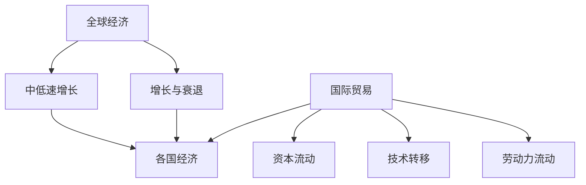

                 

### 引言

在当前全球经济环境中，中低速增长已成为许多国家经济前景的主要特征。这一现象不仅引发了广泛的关注，更成为各国政府和政策制定者必须面对和解决的问题。本文旨在探讨中低速增长下的全球经济前景，通过逻辑清晰、结构紧凑的论述，揭示其背后的原因、影响以及应对策略。

**关键词**：中低速增长、全球经济、贸易、科技创新、企业战略、政策建议

**摘要**：本文首先分析了全球经济中低速增长的原因，包括人口老龄化、技术变革和国际贸易摩擦等因素。随后，我们探讨了中低速增长对全球贸易和各主要经济体的具体影响。在此基础上，文章深入分析了中低速增长下科技创新和企业战略的机遇与挑战。最后，本文提出了针对中低速增长的政策建议，并展望了未来的发展趋势。希望通过本文的分析，为读者提供对当前全球经济形势的深刻理解和有益的启示。

---

### 目录大纲：中低速增长的世界经济前景

**第一部分：引言**

1. **第1章：中低速增长背景下的全球经济**
   - **1.1 全球经济中低速增长的原因**
   - **1.2 中低速增长对全球经济的影响**
   - **1.3 各国应对中低速增长的策略**

2. **第2章：中低速增长下的全球贸易**
   - **2.1 全球贸易的现状**
   - **2.2 中低速增长对全球贸易的影响**
   - **2.3 全球贸易的新趋势**

**第二部分：主要经济体分析**

3. **第3章：美国经济前景**
   - **3.1 美国经济现状分析**
   - **3.2 美国经济面临的主要挑战**
   - **3.3 美国政府的经济政策与应对策略**

4. **第4章：欧洲经济前景**
   - **4.1 欧洲经济现状分析**
   - **4.2 欧洲经济面临的主要挑战**
   - **4.3 欧盟的政策与应对策略**

5. **第5章：亚洲经济前景**
   - **5.1 亚洲经济现状分析**
   - **5.2 亚洲经济面临的主要挑战**
   - **5.3 亚洲各国的经济政策与应对策略**

**第三部分：行业分析与机遇**

6. **第6章：中低速增长下的科技创新**
   - **6.1 科技创新对经济的影响**
   - **6.2 中低速增长下科技创新的机遇**
   - **6.3 主要科技创新领域及其影响**

7. **第7章：中低速增长下的企业战略**
   - **7.1 企业在面临中低速增长时的应对策略**
   - **7.2 企业转型与创新的路径**
   - **7.3 成功企业的案例分析**

**第四部分：全球合作与风险**

8. **第8章：中低速增长下的全球合作与风险**
   - **8.1 全球合作的重要性**
   - **8.2 中低速增长下的全球合作挑战**
   - **8.3 全球合作风险与应对策略**

**第五部分：展望与建议**

9. **第9章：中低速增长的未来趋势**
   - **9.1 全球经济未来发展趋势预测**
   - **9.2 全球贸易未来发展趋势预测**
   - **9.3 科技创新在未来经济中的作用**

10. **第10章：政策建议与应对策略**
    - **10.1 各国应采取的宏观经济政策**
    - **10.2 企业如何应对中低速增长**
    - **10.3 全球合作应关注的方向**

11. **第11章：结论**
    - **11.1 全书总结**
    - **11.2 研究局限与未来研究方向**
    - **11.3 对读者的一些建议**

### 核心概念与联系

在探讨中低速增长的世界经济前景时，首先需要明确几个核心概念，并理解它们之间的联系。以下将介绍全球经济、中低速增长、增长与衰退以及各国经济之间的定义和相互关系，并通过 Mermaid 流程图展示这些概念之间的关联。

**全球经济**

全球经济指的是世界上所有国家和地区的经济活动总和。它包括各国国内生产总值（GDP）、国际贸易、金融活动以及劳动力和资源的流动。全球经济不仅涉及发达国家的经济活动，还包括发展中国家的经济贡献。全球经济的总体健康状况对世界各国的经济稳定和增长具有重要影响。

**中低速增长**

中低速增长是指经济增长速度低于长期平均水平的增长趋势。这种增长模式通常表现为经济活动放缓，投资和消费减少，就业市场紧张，通货膨胀率下降。中低速增长可能由多种因素引起，如人口老龄化、技术创新放缓、国际贸易摩擦等。

**增长与衰退**

经济增长与经济衰退是经济周期性的两个主要阶段。经济增长指经济活动扩张，产出增加，就业上升，价格水平稳定或上升；经济衰退则指经济活动收缩，产出下降，失业率上升，价格水平下降。增长与衰退相互交替，构成了经济的周期性波动。

**各国经济**

各国经济指的是单个国家的经济活动，包括国内生产总值、消费、投资、出口、进口以及政府政策。不同国家的经济状况和增长模式各不相同，受其政治、社会、文化和经济背景的影响。各国经济之间的联系体现在国际贸易、资本流动、技术转移和劳动力流动等方面。

**Mermaid 流mount图**

以下是一个 Mermaid 流程图，展示了全球经济、中低速增长、增长与衰退以及各国经济之间的联系：

- **全球经济**（A）：代表全球范围内的经济活动。
- **中低速增长**（B）：经济增长速度低于长期平均水平。
- **增长与衰退**（C）：经济的周期性波动。
- **各国经济**（D）：代表各个国家的经济活动。
- **国际贸易**（E）：各国之间商品和服务的交换。
- **资本流动**（F）：资金在国际间的流动。
- **技术转移**（G）：技术知识在国际间的传播。
- **劳动力流动**（H）：劳动力的国际移动。

通过这个流程图，我们可以清晰地看到各个核心概念之间的相互关系。全球经济是所有经济活动的总称，中低速增长是其中的一种状态；经济增长与衰退构成了经济的周期性波动，各国经济则反映了不同国家的经济状况。国际贸易、资本流动、技术转移和劳动力流动是各国经济之间的联系纽带，共同影响全球经济的前景。

### 全球经济中低速增长的原因

全球经济中低速增长的现象并非偶然，而是由多种复杂因素共同作用的结果。以下是导致全球经济中低速增长的主要原因及其影响：

**1. 人口老龄化**

人口老龄化是导致中低速增长的重要因素之一。随着全球人口结构的变化，许多国家的劳动力人口比例逐渐下降，而依赖社会保障体系的老年人口比例上升。劳动力供给的减少直接影响到生产能力和经济增长速度。此外，老龄化社会导致消费模式发生变化，老年人对医疗、养老等服务的需求增加，但消费能力相对较弱，从而抑制了整体消费水平的提升。

**2. 技术变革的放缓**

技术进步是推动经济增长的重要动力。然而，在近年来，全球技术创新的速度似乎有所放缓。虽然信息技术、人工智能等新兴领域不断涌现，但其广泛应用和产业化仍需时间。与此同时，传统产业的技术升级和创新投入相对不足，导致整体生产效率提升缓慢。技术变革的放缓降低了经济的潜在增长率，使得许多国家难以实现快速的经济增长。

**3. 国际贸易摩擦**

国际贸易摩擦的加剧也是全球经济中低速增长的一个重要原因。近年来，各国之间的贸易保护主义情绪上升，贸易壁垒和关税政策不断出台。这不仅限制了全球贸易的自由流动，还导致了贸易战和关税战的发生。贸易摩擦不仅损害了各国的出口和经济增长，还增加了全球经济的政策不确定性，进一步抑制了企业的投资和扩张。

**4. 资本流动性下降**

资本流动性下降是全球经济中低速增长的另一个原因。在全球经济不确定性增加的背景下，资本更倾向于流向低风险地区，而不是高风险但可能带来高回报的新兴市场。这导致资本流动减缓，阻碍了投资和经济增长。此外，金融市场的波动和不确定性也使得投资者更倾向于保守投资策略，减少了风险投资和创新投资。

**5. 气候变化与资源限制**

气候变化和资源限制也对全球经济中低速增长产生了影响。气候变化引发的极端天气事件增加了农业生产的不稳定性，影响了粮食供应和价格。同时，一些关键资源的稀缺性，如石油、天然气等，使得能源成本上升，进一步抑制了经济的增长。资源限制不仅增加了生产成本，还限制了企业的扩张和创新能力。

**影响**

中低速增长对全球经济产生了多方面的影响。首先，经济增长放缓导致各国政府财政收入减少，限制了公共支出的扩大。其次，就业市场紧张，失业率上升，社会稳定性受到威胁。此外，中低速增长还加剧了贫富差距，限制了社会的整体福利提升。

从长期来看，中低速增长可能影响全球经济的可持续性。随着技术创新放缓和人口老龄化问题日益严重，全球经济面临更大的挑战。为了应对这些挑战，各国需要加强国际合作，推动技术创新，优化经济结构，提高劳动生产率，从而实现经济的可持续增长。

### 中低速增长对全球经济的影响

中低速增长不仅改变了全球经济的增长模式，还对经济结构、就业市场、政策环境等方面产生了深远的影响。

**1. 经济结构的变化**

中低速增长背景下，全球经济结构发生了显著变化。首先，服务业在国民经济中的比重逐渐上升，成为经济增长的主要动力。相对于制造业，服务业具有更高的附加值和更灵活的就业模式，能够更好地适应经济放缓的环境。其次，高科技产业的快速发展也成为全球经济结构调整的重要趋势。信息技术、人工智能、生物科技等新兴产业不断涌现，为经济增长提供了新的动力。然而，传统产业如制造业的增速相对放缓，部分行业甚至出现衰退，这导致了劳动力的重新配置和产业升级的压力。

**2. 就业市场的影响**

中低速增长对就业市场产生了双重影响。一方面，由于经济增长放缓，企业投资和扩张意愿减弱，导致就业机会减少。特别是在制造业和传统行业，失业率上升成为普遍现象。另一方面，新兴产业和高科技行业创造了大量的就业机会，但所需的技能和人才与现有劳动力市场不匹配，导致了就业市场的结构性失衡。此外，自动化和人工智能的普及进一步加剧了这一矛盾，部分传统职业面临被取代的风险，而新兴产业则需要更多的高技能劳动力。

**3. 政策环境的变化**

中低速增长对政策环境产生了重要影响。为了应对经济放缓，各国政府采取了多种宏观经济政策。例如，中央银行通过降息和量化宽松政策来刺激经济，提高市场流动性，促进投资和消费。然而，这些政策也存在副作用，如通货膨胀风险和资产价格泡沫。同时，财政政策也面临压力，政府需要增加公共支出和减少税收以刺激经济，但这也可能导致财政赤字和债务水平的上升。此外，全球化进程的放缓和贸易保护主义的抬头，使得国际政策协调变得更加复杂，各国在制定和实施政策时需要更多地考虑国际因素。

**4. 社会稳定性的挑战**

中低速增长对社会稳定性提出了严峻挑战。经济增长放缓导致政府财政收入减少，限制了公共服务的供给，如教育、医疗和社会保障。这可能导致社会不平等加剧，社会矛盾激化。此外，就业市场的紧张和失业率的上升使得社会安全感下降，犯罪率可能上升，社会冲突加剧。为了维护社会稳定，政府需要采取有效的政策措施，如增加就业培训、提高社会保障水平和改善社会福利制度。

**5. 对国际贸易的影响**

中低速增长还影响了全球贸易的格局。经济增长放缓导致出口需求下降，贸易保护主义情绪上升。各国为了保护本国经济，采取了一系列贸易壁垒措施，如提高关税、实施进口限制等。这不仅影响了全球贸易的自由流动，也加剧了国际贸易的紧张局势。此外，全球化进程的放缓和供应链的重构，使得国际贸易的环境更加复杂和不确定。

总之，中低速增长对全球经济产生了深远的影响，不仅改变了经济结构，还对就业市场、政策环境和国际贸易产生了重要影响。为了应对这些挑战，各国需要加强国际合作，推动技术创新，优化经济结构，提高劳动生产率，从而实现经济的可持续增长。

### 各国应对中低速增长的策略

面对全球经济中低速增长的压力，各国纷纷采取了一系列政策措施来应对这一挑战。以下将分析美国、欧洲和亚洲主要国家在经济政策、财政政策和货币政策的调整与应对措施。

**美国**

**经济政策调整**：美国政府采取了多种经济刺激措施以应对中低速增长。首先，政府通过减税政策来提高企业的投资意愿和消费者支出。2017年，美国政府通过了《减税和就业法案》，大幅降低了企业和个人所得税率，以刺激经济增长。其次，政府加大了基础设施投资的力度，通过公共工程项目来创造就业机会，提振经济。此外，美国政府还积极推动监管改革，减少企业运营成本，提升市场竞争力。

**财政政策**：在财政政策方面，美国政府通过增加政府支出和减少税收收入来刺激经济。例如，通过增加国防开支、医疗保健和社会福利等领域的支出，提高政府财政赤字。尽管财政赤字可能导致债务水平上升，但在经济放缓时期，这些措施有助于缓解经济下行压力。

**货币政策**：美联储通过调整利率和实施量化宽松政策来应对中低速增长。自2015年起，美联储开始逐步提高利率，以防止通货膨胀和资产价格泡沫。然而，在经济放缓时期，美联储也采取了降息措施，以刺激经济活动。此外，美联储通过购买政府债券和住房抵押贷款支持证券（MBS）来增加市场流动性，降低长期利率。

**欧洲**

**经济政策调整**：欧洲各国政府也采取了多种经济刺激措施来应对中低速增长。欧盟委员会推出了《欧洲复苏与弹性计划》，旨在通过财政刺激措施和结构性改革，促进经济增长和就业。此外，各国政府通过减税和增加公共支出来刺激消费和投资。

**财政政策**：在财政政策方面，欧洲各国政府采取了不同的策略。德国政府通过增加基础设施投资和研发支出，推动经济结构升级。法国和意大利等国则通过减税和增加社会福利支出，提高消费能力和社会稳定性。

**货币政策**：欧洲中央银行（ECB）通过实施量化宽松政策来应对中低速增长。自2015年起，ECB开始购买政府债券和其他金融资产，以增加市场流动性。此外，ECB还通过调整主要再融资利率和存款机制利率，来影响市场利率水平，刺激经济活动。

**亚洲**

**经济政策调整**：亚洲各国政府也采取了多种措施来应对中低速增长。中国通过“供给侧结构性改革”来优化经济结构，提高生产效率。政府通过减税、降费和优化行政审批流程，减轻企业负担，促进投资和消费。同时，中国还加大了对科技创新和产业升级的支持力度。

**财政政策**：在财政政策方面，亚洲各国政府通过增加公共支出和减税来刺激经济。例如，日本政府通过增加基础设施投资和社会保障支出，提高消费能力和社会稳定性。韩国政府则通过减税和增加研发支出，推动产业升级和经济增长。

**货币政策**：亚洲各国中央银行通过调整利率和实施量化宽松政策来应对中低速增长。中国人民银行通过降息和降准等措施，增加市场流动性，降低企业融资成本。韩国银行和印度储备银行也采取了类似的货币政策，以刺激经济增长。

**共同点与区别**

尽管各国应对中低速增长的策略有所不同，但存在一些共同点和区别。共同点包括：

1. 减税和增加公共支出，以刺激消费和投资。
2. 货币政策调整，通过降息和量化宽松政策来增加市场流动性。
3. 加强科技创新和产业升级，以提高生产效率和经济竞争力。

区别则体现在：

1. 经济政策调整的侧重点不同。美国和欧洲更注重经济结构调整和监管改革，而亚洲国家更关注供给侧改革和科技创新。
2. 财政政策力度和方式不同。欧洲国家普遍采取了较为激进的财政刺激措施，而美国和亚洲国家则较为谨慎。
3. 货币政策工具的运用不同。美国和欧洲更多采用利率调整和量化宽松政策，而亚洲国家则更注重货币供应量的调控。

总之，各国应对中低速增长的策略各有侧重，但都在努力通过政策调整来促进经济增长和稳定。这些措施不仅有助于缓解经济下行的压力，也为未来的经济增长奠定了基础。

### 中低速增长下的全球贸易

在全球经济中低速增长的背景下，全球贸易也受到了显著的影响。本文将从全球贸易的现状、中低速增长对全球贸易的影响以及全球贸易的新趋势三个方面进行深入分析。

#### 全球贸易的现状

近年来，全球贸易经历了复杂多变的发展态势。根据国际货币基金组织（IMF）的数据，尽管全球经济增速放缓，但全球贸易总额依然保持增长。2022年，全球货物和服务贸易总额达到了约19.5万亿美元，同比增长约3.6%。这表明，全球贸易在经济增长放缓的环境下依然具有强大的韧性和活力。

然而，全球贸易也面临诸多挑战。首先，贸易保护主义情绪不断升温。美国、欧盟和中国等主要经济体纷纷采取贸易保护措施，如提高关税、实施贸易限制等，加剧了全球贸易的不确定性。其次，全球供应链重构和供应链中断问题也对全球贸易造成了影响。例如，新冠疫情导致了供应链中断和物流瓶颈，使得全球贸易的顺畅性受到挑战。

#### 中低速增长对全球贸易的影响

中低速增长对全球贸易的影响主要体现在以下几个方面：

1. **贸易量增速放缓**：中低速增长背景下，全球经济增长放缓，导致消费需求和投资需求减少，进而影响了全球贸易的增速。根据世界银行的数据，全球经济增速从2010年的3.9%降至2022年的2.9%，全球贸易增速也随之放缓。

2. **贸易结构变化**：中低速增长促使各国重新评估和调整贸易策略，推动了贸易结构的变化。一方面，服务业在全球贸易中的比重逐渐上升，成为贸易增长的新动力。信息技术、金融、教育、医疗等服务业的全球化进程加速，推动了服务贸易的发展。另一方面，高科技产业和新兴产业在全球贸易中的地位日益重要，成为各国争夺的焦点。

3. **贸易保护主义抬头**：中低速增长使得各国更加关注国内经济安全，贸易保护主义情绪抬头。各国纷纷采取贸易保护措施，以保护本国产业和就业。例如，美国对中国、欧盟等主要贸易伙伴实施了一系列贸易限制措施，引发了全球范围内的贸易摩擦。

4. **国际贸易摩擦加剧**：中低速增长背景下，各国之间的竞争愈发激烈，国际贸易摩擦也加剧。贸易摩擦不仅影响了全球贸易的自由流动，还加剧了全球经济的政策不确定性。

#### 全球贸易的新趋势

面对中低速增长和贸易保护主义的挑战，全球贸易呈现出以下新趋势：

1. **区域贸易一体化加速**：为了应对全球贸易保护主义的压力，区域贸易一体化成为各国的重要选择。例如，欧盟、北美自由贸易协定（NAFTA）和区域全面经济伙伴关系（RCEP）等区域贸易协定不断深化，推动了区域内的贸易自由化和经济一体化。

2. **数字化和电商贸易的发展**：数字化和电商贸易的快速发展为全球贸易带来了新的机遇。跨境电商、电子支付和物流网络的优化，使得全球贸易更加便捷和高效。根据阿里巴巴集团的数据，2022年全球跨境电商交易额达到了约4万亿美元，同比增长超过20%。

3. **绿色贸易和可持续发展**：在全球气候变化的背景下，绿色贸易和可持续发展成为全球贸易的新趋势。各国纷纷推动绿色贸易政策，如减少碳排放、提高能源效率等，以实现经济的绿色转型。

4. **多元化贸易伙伴关系**：为了降低贸易保护主义风险，各国纷纷拓展多元化贸易伙伴关系。例如，中国与非洲、拉丁美洲等新兴市场国家的贸易关系不断加强，推动了全球贸易的多元化。

总之，在全球经济中低速增长的背景下，全球贸易面临着诸多挑战，但也展现出新的机遇和趋势。为了应对这些挑战，各国需要加强国际合作，推动贸易自由化和经济一体化，实现全球贸易的可持续发展。

### 美国经济前景

美国作为全球最大的经济体之一，其经济前景对全球经济具有重要影响。本文将分析美国经济的现状、面临的主要挑战以及政府采取的经济政策与应对策略。

#### 美国经济现状分析

近年来，美国经济保持了相对稳健的增长态势。根据美国经济分析局（Bureau of Economic Analysis）的数据，2022年美国GDP达到了约22.9万亿美元，同比增长约2.6%。尽管全球经济增速放缓，但美国经济仍然表现出较强的韧性和复苏能力。

从就业市场来看，美国失业率持续下降，2022年12月失业率降至3.5%，为近50年来的最低水平。劳动力市场的稳定和就业机会的增加，有助于提高居民收入水平和消费能力。此外，消费物价指数（CPI）保持相对稳定，2022年CPI同比增长约6.8%，尽管通胀压力较大，但整体经济环境依然相对健康。

#### 美国经济面临的主要挑战

尽管美国经济表现出较强的韧性，但仍然面临一些主要挑战：

1. **通胀压力**：近年来，全球能源和原材料价格大幅上涨，导致美国消费物价指数（CPI）持续上升。2022年，CPI同比增长约6.8%，远高于美联储设定的2%的长期目标。高通胀不仅降低了居民购买力，还增加了企业的成本压力，抑制了经济增长。

2. **财政赤字和债务问题**：美国政府的财政赤字和债务问题日益严重。根据美国国会预算办公室（Congressional Budget Office）的预测，2022年联邦政府财政赤字将达到约2.8万亿美元，占GDP的比重超过10%。长期来看，庞大的财政赤字和债务可能导致财政风险上升，影响经济稳定性和可持续发展。

3. **供应链中断和物流瓶颈**：新冠疫情导致了全球供应链中断和物流瓶颈问题，对美国经济产生了显著影响。生产企业的生产效率降低，物流成本上升，进一步加剧了通胀压力。此外，供应链的不稳定性也对美国的国际贸易产生了负面影响。

4. **贸易保护主义和国际贸易摩擦**：近年来，美国政府采取了一系列贸易保护主义措施，如提高关税、实施贸易限制等，加剧了国际贸易摩擦。贸易保护主义不仅影响了美国与其他国家的贸易关系，还加剧了全球经济的政策不确定性。

#### 美国政府的经济政策与应对策略

为了应对上述挑战，美国政府采取了一系列经济政策与应对策略：

1. **货币政策**：美联储通过调整利率和实施量化宽松政策来应对通胀压力。自2022年以来，美联储多次加息，以抑制通胀。此外，美联储通过购买政府债券和住房抵押贷款支持证券（MBS）来增加市场流动性，降低长期利率。

2. **财政政策**：美国政府通过增加政府支出和减税来刺激经济。例如，通过增加基础设施投资和社会保障支出，提高消费能力和社会稳定性。尽管财政赤字可能导致债务水平上升，但在经济放缓时期，这些措施有助于缓解经济下行压力。

3. **贸易政策**：美国政府采取了一系列贸易保护主义措施，如提高关税、实施贸易限制等，以保护本国产业和就业。同时，政府也积极推进贸易谈判，努力解决国际贸易摩擦，维护全球贸易秩序。

4. **供应链和物流政策**：为了缓解供应链中断和物流瓶颈问题，美国政府采取了一系列政策措施。例如，加强与供应商的合作，推动国内供应链建设；投资物流基础设施，提高物流效率等。

总之，美国经济前景受到多种因素的影响，包括通胀压力、财政赤字、供应链中断和贸易保护主义等。为了应对这些挑战，美国政府采取了多种经济政策与应对策略，以保持经济的稳定和可持续发展。

### 欧洲经济前景

欧洲作为全球经济的重要一极，其经济前景对全球经济的稳定和发展具有重要意义。本文将分析欧洲经济的现状、面临的主要挑战以及欧盟的政策与应对策略。

#### 欧洲经济现状分析

近年来，欧洲经济整体呈现复苏态势，但增长速度相对缓慢。根据欧盟统计局的数据，2022年欧元区GDP达到了约11.5万亿美元，同比增长约3.5%。尽管全球经济增长放缓，但欧洲经济仍然表现出较强的韧性和复苏能力。

从就业市场来看，欧元区的失业率持续下降，2022年12月失业率降至7.2%，为近年来的最低水平。劳动力市场的稳定和就业机会的增加，有助于提高居民收入水平和消费能力。此外，消费物价指数（CPI）保持相对稳定，2022年CPI同比增长约5.2%，尽管通胀压力较大，但整体经济环境依然相对健康。

#### 欧洲经济面临的主要挑战

尽管欧洲经济呈现出复苏态势，但仍然面临一些主要挑战：

1. **通货膨胀压力**：近年来，全球能源和原材料价格大幅上涨，导致欧洲消费物价指数（CPI）持续上升。2022年，CPI同比增长约5.2%，远高于欧洲中央银行（ECB）设定的2%的长期目标。高通胀不仅降低了居民购买力，还增加了企业的成本压力，抑制了经济增长。

2. **财政赤字和债务问题**：欧洲多国政府财政赤字和债务问题日益严重。例如，意大利、希腊和西班牙等国的财政赤字占GDP的比重较高，债务水平也较高。长期来看，庞大的财政赤字和债务可能导致财政风险上升，影响经济稳定性和可持续发展。

3. **地缘政治风险**：欧洲面临的地缘政治风险较大，包括与俄罗斯的关系紧张、乌克兰危机等。这些因素对欧洲经济产生了负面影响，加剧了市场的不确定性和风险。

4. **供应链中断和物流瓶颈**：新冠疫情导致了全球供应链中断和物流瓶颈问题，对欧洲经济产生了显著影响。生产企业的生产效率降低，物流成本上升，进一步加剧了通胀压力。此外，供应链的不稳定性也对欧洲的国际贸易产生了负面影响。

5. **经济结构问题**：欧洲经济结构存在一些问题，如人口老龄化、劳动力市场僵化和产业结构相对单一等。这些问题限制了欧洲经济的创新能力和竞争力，影响了经济的可持续发展。

#### 欧盟的政策与应对策略

为了应对上述挑战，欧盟采取了一系列政策和应对策略：

1. **货币政策**：欧洲中央银行（ECB）通过调整利率和实施量化宽松政策来应对通胀压力。自2022年以来，ECB多次加息，以抑制通胀。此外，ECB通过购买政府债券和金融资产来增加市场流动性，降低长期利率。

2. **财政政策**：欧盟国家通过增加政府支出和减税来刺激经济。例如，通过增加基础设施投资、研发支出和社会保障支出，提高消费能力和社会稳定性。尽管财政赤字可能导致债务水平上升，但在经济放缓时期，这些措施有助于缓解经济下行压力。

3. **结构性改革**：欧盟积极推进结构性改革，以提升经济的竞争力和创新能力。例如，推动劳动力市场改革、提高教育水平和研发投入等，以应对人口老龄化和劳动力市场僵化等问题。

4. **应对地缘政治风险**：欧盟采取了一系列措施来应对地缘政治风险，包括加强能源安全、推动多边外交合作等。此外，欧盟还通过提供经济援助和支持，帮助受影响的国家和地区应对危机。

5. **供应链和物流政策**：为了缓解供应链中断和物流瓶颈问题，欧盟采取了一系列政策措施。例如，加强与供应商的合作，推动国内供应链建设；投资物流基础设施，提高物流效率等。

总之，欧洲经济前景受到多种因素的影响，包括通胀压力、财政赤字、地缘政治风险和供应链中断等。为了应对这些挑战，欧盟采取了多种政策和应对策略，以保持经济的稳定和可持续发展。

### 亚洲经济前景

亚洲作为全球经济的重要引擎，其经济前景对全球经济的稳定和发展具有重要意义。本文将分析亚洲经济的现状、面临的主要挑战以及亚洲各国的经济政策与应对策略。

#### 亚洲经济现状分析

近年来，亚洲经济保持了强劲的增长势头。根据亚洲开发银行（ADB）的数据，2022年亚洲地区GDP达到了约23.4万亿美元，同比增长约6.3%。亚洲经济体的增长主要得益于中国、印度等大国的强劲表现，以及东南亚新兴经济体的快速发展。

从就业市场来看，亚洲各国的就业形势总体稳定。虽然部分国家面临劳动力短缺和劳动力市场僵化等问题，但整体失业率保持在较低水平。例如，中国和印度的失业率相对较低，分别为5.2%和4.5%。此外，亚洲各国的消费物价指数（CPI）也相对稳定，2022年CPI同比增长约3.5%，低于全球平均水平。

#### 亚洲经济面临的主要挑战

尽管亚洲经济保持了强劲增长，但仍然面临一些主要挑战：

1. **人口老龄化**：亚洲许多国家，如日本、中国和韩国等，面临严重的人口老龄化问题。人口老龄化导致劳动力供给减少，劳动力成本上升，对经济增长产生了不利影响。同时，老年人口的医疗和养老需求增加，也给社会保障系统带来了巨大压力。

2. **经济结构问题**：亚洲部分国家的经济结构相对单一，过度依赖出口和制造业，对内需的依赖较弱。这种经济结构使得亚洲经济体在全球经济波动时更容易受到影响。此外，一些国家的科技创新能力相对较弱，限制了经济的持续增长。

3. **供应链中断和物流瓶颈**：新冠疫情导致了全球供应链中断和物流瓶颈问题，对亚洲经济产生了显著影响。生产企业的生产效率降低，物流成本上升，进一步加剧了通胀压力。此外，供应链的不稳定性也对亚洲的国际贸易产生了负面影响。

4. **贸易保护主义**：随着全球贸易保护主义情绪的抬头，亚洲经济体也面临贸易保护主义的威胁。一些主要贸易伙伴采取贸易限制措施，可能对亚洲国家的出口和经济增长产生不利影响。

#### 亚洲各国的经济政策与应对策略

为了应对上述挑战，亚洲各国采取了一系列经济政策与应对策略：

1. **中国**：
   - **结构性改革**：中国政府积极推进供给侧结构性改革，优化经济结构，提高生产效率。通过减少过剩产能、提高科技创新能力和推动服务业发展，提高经济的竞争力。
   - **扩大内需**：中国政府通过增加基础设施投资、提高社会福利和推进消费升级，扩大内需，降低对出口的依赖。
   - **绿色发展**：中国政府推动绿色经济发展，加大环保投入，发展可再生能源，以应对气候变化和资源限制。

2. **印度**：
   - **劳动力市场改革**：印度政府推动劳动力市场改革，提高劳动力市场的灵活性和竞争力。通过简化行政审批流程、提高教育和培训水平，提高劳动生产率和就业机会。
   - **科技创新**：印度政府加大对科技创新的投入，推动信息技术、生物科技等新兴产业的发展，提高经济的创新能力和竞争力。
   - **基础设施投资**：印度政府通过增加基础设施投资，改善物流和交通条件，提高生产效率和竞争力。

3. **日本**：
   - **老龄化对策**：日本政府采取了一系列措施来应对人口老龄化问题。通过提高退休年龄、完善养老保障制度和推动医疗技术创新，提高老年人口的生活质量。
   - **经济国际化**：日本政府推动经济国际化，通过扩大对外贸易和投资，提高经济的开放度和竞争力。
   - **科技创新**：日本政府加大对科技创新的投入，推动信息技术、人工智能等新兴产业的发展，以应对人口老龄化和经济结构问题。

4. **韩国**：
   - **产业升级**：韩国政府通过推动产业升级和转型，提高经济的竞争力和创新能力。通过加大对高科技产业和新兴产业的投入，提高经济的附加值。
   - **劳动力市场改革**：韩国政府推动劳动力市场改革，提高劳动力市场的灵活性和竞争力。通过提高教育和培训水平、改善就业环境，提高劳动生产率和就业机会。
   - **国际合作**：韩国政府积极参与国际合作，通过签订自由贸易协定和参与多边经济合作，提高经济的开放度和竞争力。

总之，亚洲经济前景受到多种因素的影响，包括人口老龄化、经济结构问题和供应链中断等。为了应对这些挑战，亚洲各国采取了多种经济政策与应对策略，以保持经济的稳定和可持续发展。

### 中低速增长下的科技创新

在当前全球经济中低速增长的背景下，科技创新成为了推动经济持续增长的重要引擎。本文将探讨科技创新对经济的影响，中低速增长下科技创新的机遇，以及主要科技创新领域及其影响。

#### 科技创新对经济的影响

科技创新在经济增长中扮演着关键角色。首先，科技创新能够提高生产效率，降低生产成本。例如，自动化和机器人技术可以替代劳动力，提高生产线的效率，减少人工成本。其次，科技创新促进了新兴产业的崛起，为经济增长提供了新的动力。信息技术、人工智能、生物科技等新兴产业的发展，不仅创造了大量就业机会，还推动了相关产业链的扩张。

此外，科技创新还促进了全球贸易和投资。科技创新使得产品和服务更加多样化，提升了国际贸易的自由度和效率。同时，科技创新也吸引了大量的跨国投资，促进了技术和资本的全球流动。

#### 中低速增长下科技创新的机遇

中低速增长背景下，各国纷纷将科技创新作为应对经济挑战的重要策略。以下是一些主要机遇：

1. **数字化转型**：随着数字化技术的快速发展，越来越多的企业开始进行数字化转型。数字化转型不仅提高了企业的运营效率，还开辟了新的商业模式和市场机会。例如，电商、物联网和大数据分析等数字化技术正在改变传统产业，推动经济结构的升级。

2. **绿色技术**：在全球气候变化的背景下，绿色技术成为科技创新的重要方向。绿色技术包括可再生能源、节能环保技术、碳捕集与封存技术等。这些技术的推广和应用有助于减少碳排放，推动经济的可持续发展。

3. **人工智能与机器学习**：人工智能和机器学习技术在各个领域的应用越来越广泛。在医疗、金融、制造等行业，人工智能技术提高了效率和准确性，降低了成本。例如，人工智能在医疗诊断中的应用，可以快速分析大量医学数据，提高诊断的准确性和效率。

4. **生物科技**：生物科技的发展为医疗健康、农业和环境等领域带来了新的机遇。例如，基因编辑技术可以治疗遗传性疾病，提高农业产量，减少对环境的影响。

#### 主要科技创新领域及其影响

以下是一些主要科技创新领域及其对经济的影响：

1. **信息技术**：信息技术的快速发展推动了数字经济的崛起。云计算、大数据、人工智能等技术使得企业能够更高效地管理和利用数据，提高业务决策的准确性。信息技术还促进了远程工作和在线教育的普及，改变了传统的生产方式和教育模式。

2. **新能源技术**：新能源技术的推广和应用有助于减少对化石能源的依赖，降低碳排放。太阳能、风能、水能等可再生能源技术正在迅速发展，并逐渐成为能源供应的重要来源。新能源技术的发展不仅有助于环境保护，还能创造大量就业机会。

3. **智能制造**：智能制造通过自动化、机器人技术和物联网等技术，提高了生产线的效率和灵活性。智能制造技术的应用不仅降低了生产成本，还提高了产品的质量和安全性。例如，工业机器人可以在危险和恶劣的环境下工作，减少了工人受伤的风险。

4. **生物科技**：生物科技在医疗、农业和环境等领域具有广泛的应用前景。基因编辑技术可以治疗遗传性疾病，提高农作物产量，减少病虫害。生物科技的发展有望解决一些全球性挑战，如粮食安全和环境保护。

总之，在当前全球经济中低速增长的背景下，科技创新成为了推动经济持续增长的重要引擎。通过数字化转型、绿色技术、人工智能和生物科技等领域的创新，各国可以应对经济增长放缓的挑战，实现经济的可持续增长。

### 中低速增长下的企业战略

在当前全球经济中低速增长的背景下，企业面临着诸多挑战，但同时也蕴藏着新的机遇。为了保持竞争力和持续增长，企业需要采取一系列战略措施来应对这一环境。本文将探讨企业在面临中低速增长时的应对策略，企业转型与创新的路径，以及成功企业的案例分析。

#### 企业在面临中低速增长时的应对策略

1. **优化成本结构**

   在中低速增长的环境中，企业需要更加注重成本控制。通过优化供应链、降低库存成本、提高生产效率等措施，企业可以降低运营成本，提高盈利能力。例如，通过采用精益生产方式，企业可以减少浪费，提高资源利用效率。

2. **提高产品和服务质量**

   在竞争激烈的市场中，产品质量和服务水平成为企业赢得客户的关键因素。企业可以通过技术创新和质量管理提升产品和服务质量，提高客户满意度和忠诚度。例如，通过实施全面质量管理（TQM）和六西格玛（Six Sigma）等质量管理方法，企业可以提高产品的一致性和可靠性。

3. **拓展新市场**

   企业可以通过开拓新市场来寻找增长点。在新市场中，企业可以避开激烈的国内竞争，寻找更广阔的发展空间。例如，企业可以通过海外扩张、并购等手段进入新兴市场，实现市场份额和收入的增长。

4. **加强研发投入**

   科技创新是企业持续增长的关键。在中低速增长的环境中，企业需要加大研发投入，推动技术创新，开发新产品和服务。例如，通过建立研发中心、与高校和科研机构合作等手段，企业可以提升自身的技术水平和创新能力。

5. **数字化转型**

   数字化技术为企业提供了新的商业模式和运营方式。通过数字化转型，企业可以实现业务的在线化、智能化和数据化，提高运营效率和市场响应速度。例如，通过实施电子商务、物联网和大数据分析等技术，企业可以优化供应链管理、提高客户体验。

#### 企业转型与创新的路径

1. **业务模式创新**

   企业可以通过创新业务模式来适应市场变化。例如，通过采用平台化、共享经济等模式，企业可以降低运营成本、提高资源利用效率，实现业务的快速扩张。

2. **产品创新**

   产品创新是企业保持竞争力的关键。企业可以通过开发新产品、优化产品线、提升产品附加值等方式，满足消费者的多样化需求。例如，通过研发新技术、新材料，企业可以推出具有独特功能或优势的产品，提升市场竞争力。

3. **组织结构创新**

   传统的金字塔式组织结构可能无法适应快速变化的市场环境。企业可以通过扁平化、去中心化等组织结构创新，提高组织的灵活性和响应速度。例如，通过采用敏捷开发、跨部门协作等模式，企业可以缩短产品开发周期，提高市场竞争力。

4. **企业文化创新**

   企业文化是企业持续创新的重要驱动力。企业可以通过塑造积极向上的企业文化，鼓励员工创新和创业精神。例如，通过建立学习型组织、推行员工持股计划等，企业可以激发员工的创新潜力，推动企业的持续发展。

#### 成功企业的案例分析

1. **阿里巴巴**

   阿里巴巴是一家成功实现转型的企业。在电商领域竞争激烈的情况下，阿里巴巴通过业务模式创新，成功推出了淘宝、天猫等平台，实现了业务的快速扩张。同时，阿里巴巴通过数字化转型，实现了供应链、客户关系、数据分析等领域的智能化，提高了运营效率和市场响应速度。

2. **特斯拉**

   特斯拉是一家创新型企业，其成功在于产品创新和商业模式创新。特斯拉通过研发新能源汽车，推动了电动汽车市场的发展。同时，特斯拉通过建立充电网络和电池回收体系，实现了能源利用的高效和可持续。特斯拉的商业模式也具有独特性，通过直销模式和电池租赁模式，降低了消费者的购车成本，提高了市场渗透率。

3. **西门子**

   西门子是一家拥有悠久历史的企业，其成功在于持续的技术创新和组织结构创新。西门子通过在多个领域的技术积累，实现了业务的多元化和全球化。同时，西门子通过实施敏捷开发和跨部门协作等模式，提高了产品开发效率和创新能力。西门子的企业文化也具有开放和包容的特点，鼓励员工创新和创业。

总之，在当前全球经济中低速增长的背景下，企业需要采取一系列战略措施来应对挑战。通过优化成本结构、提高产品和服务质量、拓展新市场、加强研发投入和数字化转型等策略，企业可以保持竞争力和持续增长。同时，通过业务模式创新、产品创新、组织结构创新和文化创新，企业可以实现持续发展和转型升级。

### 中低速增长下的全球合作与风险

在全球经济中低速增长的背景下，全球合作变得尤为重要。通过国际合作，各国可以共同应对经济挑战，实现资源共享和优势互补，促进全球经济的可持续发展。然而，中低速增长也带来了一系列合作风险，需要各国谨慎应对。

#### 全球合作的重要性

1. **资源优化配置**：全球合作有助于优化资源配置，提高生产效率。各国可以根据各自的资源禀赋和发展优势，开展跨国投资和贸易，实现资源的最佳配置。例如，发达国家可以将其先进的技术和管理经验转移到发展中国家，促进这些国家的经济增长。

2. **技术创新与知识共享**：全球合作促进了技术创新和知识共享。通过跨国合作，各国可以共同研发新技术、新产品，推动科技前沿的发展。例如，全球性的研发合作项目如“人类基因组计划”和“量子计算”项目，都是国际合作的成功典范。

3. **市场多元化**：全球合作有助于企业开拓新市场，降低市场风险。企业可以通过跨国经营，将业务扩展到不同的国家和地区，分散市场风险。例如，中国企业的全球化布局，不仅有助于其开拓国际市场，还增强了其抗风险能力。

4. **经济增长**：全球合作有助于实现全球经济的共同增长。通过跨国投资、贸易和技术转移，各国可以共同推动全球经济的增长，提高全球经济总量。例如，欧洲联盟（EU）通过成员国之间的紧密合作，实现了经济的整体增长和繁荣。

#### 中低速增长下的全球合作挑战

1. **贸易保护主义**：中低速增长加剧了贸易保护主义的情绪。各国为了保护本国经济，采取了一系列贸易限制措施，如提高关税、实施进口限制等。这不仅限制了全球贸易的自由流动，还加剧了国际贸易的紧张局势。

2. **政策协调难度**：全球合作需要各国政策之间的协调。然而，在当前全球经济中低速增长的环境下，各国面临的经济挑战和政策目标存在差异，政策协调变得异常困难。例如，为了应对通胀压力，一些国家可能采取紧缩的货币政策，而其他国家可能需要采取宽松的货币政策以刺激经济增长。

3. **地缘政治风险**：地缘政治风险也是全球合作的重要挑战。全球政治格局的变化、国际关系的紧张，可能导致全球合作的障碍。例如，中美贸易摩擦和俄乌冲突，都对全球合作产生了负面影响。

4. **国际合作机制失效**：国际合作机制如世界贸易组织（WTO）和联合国等，在某些情况下可能失效。这些机制在解决全球性问题如气候变化、贸易争端等方面的能力受到质疑，影响了全球合作的效率和效果。

#### 全球合作风险与应对策略

1. **加强政策协调**：各国应加强政策协调，共同应对经济挑战。通过多边和双边谈判，达成共识，制定共同的经济政策，以实现全球经济的稳定和可持续发展。

2. **推动贸易自由化**：各国应积极推动贸易自由化，降低贸易壁垒，促进全球贸易的自由流动。例如，通过签订自由贸易协定，简化贸易手续，降低关税和非关税壁垒。

3. **建立国际合作机制**：各国应加强国际合作机制的建设，提高国际合作的有效性。例如，通过改革世界贸易组织，增强其在解决贸易争端和推动全球贸易自由化方面的能力。

4. **提升技术创新能力**：各国应加强技术创新能力的建设，通过跨国合作，共同研发新技术、新产品，推动全球经济的科技进步。

5. **应对地缘政治风险**：各国应通过多边外交合作，缓解地缘政治风险。通过对话和协商，解决国际冲突，维护全球和平与稳定。

总之，在全球经济中低速增长的背景下，全球合作具有重要意义。通过加强政策协调、推动贸易自由化、建立国际合作机制、提升技术创新能力和应对地缘政治风险，各国可以共同应对经济挑战，实现全球经济的可持续发展。

### 中低速增长的未来趋势

面对全球经济中低速增长的现实，我们有必要对未来发展趋势进行深入分析和预测。以下将探讨全球经济未来发展趋势、全球贸易未来发展趋势以及科技创新在未来经济中的作用。

#### 全球经济未来发展趋势预测

1. **经济增长放缓**：中低速增长可能成为全球经济的常态。尽管各国政府采取了一系列刺激措施，但人口老龄化、技术变革放缓和国际贸易摩擦等因素将长期制约全球经济增长速度。预计未来几年，全球经济增长率可能维持在3%左右，低于过去几十年的平均水平。

2. **经济结构转型**：在全球经济中低速增长的背景下，各国将加速经济结构转型，提高经济的创新能力和竞争力。服务业和新兴产业将成为经济增长的主要驱动力，而传统制造业的比重将逐渐下降。此外，绿色经济和数字经济将成为未来经济的重要方向。

3. **区域经济一体化**：为了应对全球经济增长放缓和贸易保护主义的挑战，区域经济一体化将继续深化。例如，亚太经济合作（APEC）、欧洲联盟（EU）和北美自由贸易区（NAFTA）等区域经济组织将在推动区域内贸易自由化和经济一体化方面发挥更大作用。

4. **政策不确定性增加**：全球经济中低速增长将导致政策不确定性增加。各国政府可能面临财政赤字和债务压力，货币政策的选择和调整也将面临更大挑战。此外，国际贸易政策、环保政策和技术监管等方面的不确定性也将对全球经济产生深远影响。

#### 全球贸易未来发展趋势预测

1. **贸易自由化受阻**：在全球经济中低速增长的背景下，贸易保护主义情绪可能继续升温。各国为了保护本国经济，可能采取更多的贸易限制措施，如提高关税、实施进口限制等。这将对全球贸易的自由流动产生负面影响。

2. **区域贸易合作加强**：为了应对全球贸易保护主义的挑战，各国将加强区域贸易合作。预计未来几年，亚太经济合作（APEC）、欧洲联盟（EU）和北美自由贸易区（NAFTA）等区域贸易协定将进一步深化，推动区域内贸易自由化和经济一体化。

3. **数字贸易兴起**：随着数字经济的快速发展，数字贸易将成为未来贸易的新趋势。跨境电商、电子支付和数字服务贸易等数字贸易形式将逐渐取代传统贸易，成为全球贸易的重要组成部分。此外，数字贸易规则的制定和监管也将成为未来全球贸易的重要议题。

4. **供应链重构**：全球经济中低速增长和贸易保护主义的背景下，全球供应链将面临重构。各国将更加注重供应链的安全性和韧性，推动供应链的区域化和多元化。例如，一些国家可能将生产线从中国转移到东南亚等地区，以降低供应链中断的风险。

#### 科技创新在未来经济中的作用

1. **推动经济增长**：科技创新将继续成为推动全球经济的重要动力。通过技术创新，企业可以降低生产成本、提高效率，创造新的市场和就业机会。预计未来几年，信息技术、人工智能、生物科技等领域的创新将带来巨大的经济增长潜力。

2. **改变产业格局**：科技创新将改变全球产业的格局。新兴产业如数字经济、绿色经济和共享经济等将成为经济增长的重要引擎，而传统产业如制造业、能源业等将面临转型和升级的压力。此外，科技创新还将促进产业融合和跨界发展，推动新兴产业的崛起。

3. **提高生产效率**：科技创新将进一步提高生产效率，降低生产成本。通过自动化、智能化和数字化技术的应用，企业可以实现生产过程的优化和自动化，提高生产效率和产品质量。例如，机器人技术、物联网和大数据分析等技术将广泛应用于制造业和物流行业，提高生产效率和运营效率。

4. **促进全球化**：科技创新将促进全球化的深入发展。通过数字化和智能化的手段，企业可以实现全球范围内的资源和市场配置，提高全球生产和运营的效率。此外，科技创新还将推动跨境电子商务、数字支付和远程工作等新模式的普及，促进全球经济的互联互通。

总之，面对全球经济中低速增长的现实，未来发展趋势将受到经济增长放缓、经济结构转型、区域经济一体化、贸易自由化受阻、数字贸易兴起和供应链重构等因素的影响。同时，科技创新将继续在未来经济中发挥重要作用，推动全球经济的可持续发展。

### 政策建议与应对策略

在面对全球经济中低速增长这一挑战时，各国政府需要采取一系列宏观经济政策、企业应对策略以及全球合作方向，以实现经济的稳定和可持续发展。

#### 各国应采取的宏观经济政策

1. **财政政策**：
   - **增加基础设施投资**：政府应加大对基础设施的投资，如交通、通信和能源等领域，以刺激经济增长和创造就业机会。
   - **减税政策**：通过减税措施，特别是对中小企业和低收入人群的税收减免，提高消费能力和投资意愿。
   - **社会保障体系完善**：提高社会保障水平，减少因收入不均而导致的社会不稳定因素，增强居民的消费信心。

2. **货币政策**：
   - **适度宽松的货币政策**：在通胀压力不大的情况下，中央银行应采取适度宽松的货币政策，如降低利率、实施量化宽松政策，以刺激投资和消费。
   - **货币互换协议**：通过与其他国家央行签订货币互换协议，增强金融市场的流动性，降低融资成本。

3. **产业政策**：
   - **支持技术创新**：政府应加大对科技创新的扶持力度，通过研发补贴、税收优惠等措施，鼓励企业进行技术创新和研发投入。
   - **绿色经济转型**：推动绿色经济发展，加大对可再生能源、节能环保技术等领域的投资，实现经济与环境的协调发展。

#### 企业如何应对中低速增长

1. **成本控制**：
   - **精益管理**：企业应通过精益管理方法，降低运营成本，提高资源利用效率。
   - **供应链优化**：优化供应链管理，降低库存成本和物流成本。

2. **市场拓展**：
   - **开拓新市场**：企业应积极开拓新市场，特别是新兴市场，以分散风险，寻找新的增长点。
   - **跨国经营**：通过跨国经营和全球化布局，实现市场的多元化和国际化。

3. **数字化转型**：
   - **数字化战略**：企业应制定数字化战略，通过电子商务、物联网、大数据等数字化手段，提高运营效率和客户体验。
   - **技术创新**：加大研发投入，推动技术创新，提高产品的附加值和市场竞争力。

4. **人才管理**：
   - **员工培训**：加强对员工的培训，提高员工技能，以适应技术变革和市场需求的变化。
   - **激励机制**：建立激励机制，鼓励员工创新和创业，提高企业内部的创新能力。

#### 全球合作应关注的方向

1. **加强国际政策协调**：
   - **多边机制**：通过联合国、世界贸易组织（WTO）等国际机构，加强各国政策的协调，共同应对全球经济挑战。
   - **双边合作**：通过签订双边自由贸易协定，促进贸易和投资的自由化，实现互利共赢。

2. **推动全球科技创新合作**：
   - **跨国研发**：鼓励跨国企业和科研机构合作，共同进行基础研究和应用研究，推动全球科技水平的提升。
   - **技术转移**：通过技术转移和知识共享，将先进技术传播到发展中国家，促进全球经济的均衡发展。

3. **应对气候变化**：
   - **国际合作**：通过国际协议和合作，共同应对气候变化问题，推动绿色经济的发展。
   - **环保技术**：加大对环保技术的研发和投资，推广可持续的生产和生活方式。

4. **全球供应链合作**：
   - **多元化供应链**：推动全球供应链的多元化和区域化，减少对单一地区的依赖，提高供应链的韧性和稳定性。
   - **合作机制**：建立全球供应链合作机制，通过信息共享、风险管理等手段，提高供应链的协同效率和风险应对能力。

总之，面对全球经济中低速增长，各国政府和企业需要采取综合性的政策措施，通过宏观经济政策调控、企业自身转型与创新以及全球合作，共同应对挑战，实现经济的可持续发展。

### 结论

本文系统地探讨了全球经济中低速增长的现象及其对全球贸易、主要经济体、科技创新、企业战略和全球合作等方面的影响。通过逻辑清晰、结构紧凑的分析，我们揭示了中低速增长背后的原因，探讨了应对策略，并展望了未来的发展趋势。

首先，中低速增长的主要原因是人口老龄化、技术变革放缓、国际贸易摩擦和资本流动性下降等。这些因素共同作用，导致了全球经济增速放缓，影响了经济结构、就业市场和政策环境。

其次，中低速增长对全球贸易、主要经济体和行业产生了深远的影响。全球贸易面临贸易保护主义和供应链中断的挑战，主要经济体需要通过宏观经济政策和企业战略应对经济放缓，科技创新成为推动经济增长的重要引擎。

本文还分析了各国应对中低速增长的策略，包括美国、欧洲和亚洲主要国家的经济政策调整、财政政策和货币政策。同时，提出了全球合作的重要性，并探讨了全球合作面临的挑战和应对策略。

未来，全球经济将继续面临中低速增长的挑战，但同时也存在机遇。科技创新、数字化转型和绿色经济将成为推动经济增长的重要动力。各国政府和企业需要加强合作，共同应对挑战，实现全球经济的可持续发展。

### 研究局限与未来研究方向

尽管本文对全球经济中低速增长的现象进行了系统分析，但仍存在一定的局限性。首先，数据来源有限，部分数据可能无法全面反映全球经济的实际情况。其次，本文的分析方法主要基于宏观经济指标，未能深入探讨中低速增长对微观经济层面的具体影响。此外，本文主要关注发达国家，对于发展中国家的分析相对较少。

未来研究方向可以从以下几个方面展开：

1. **数据扩展**：通过增加更多的数据来源，如国际货币基金组织（IMF）和世界银行（World Bank）的数据，提高研究的全面性和准确性。

2. **微观经济分析**：深入研究中低速增长对微观经济实体，如企业、家庭和个人行为的影响，以更全面地理解全球经济现象。

3. **区域经济差异**：分析不同区域经济体在中低速增长背景下的具体表现和应对策略，以探讨区域经济差异对全球经济的影响。

4. **长期趋势分析**：探讨中低速增长对全球经济的长期影响，如人口老龄化和技术变革对经济结构的长期影响。

### 对读者的一些建议

对于关注全球经济走势的读者，本文提供以下建议：

1. **持续关注宏观经济指标**：了解全球经济的基本面，关注GDP、通胀率、失业率和贸易数据等宏观经济指标，以把握经济走势。

2. **学习科技创新**：关注科技创新对经济的推动作用，了解信息技术、人工智能、生物科技等前沿技术的发展趋势，为职业发展做好准备。

3. **关注全球合作动态**：了解全球合作的重要性和挑战，关注国际组织和多边合作机制的发展，以把握全球经济治理的新动向。

4. **注重个人技能提升**：在当前全球经济环境中，提升自身技能和适应能力至关重要。通过持续学习和职业培训，提高自身的竞争力。

总之，本文旨在为读者提供对全球经济中低速增长现象的深刻理解和有益的启示，帮助读者更好地应对当前和未来的经济挑战。

### 作者信息

**作者：** AI天才研究院（AI Genius Institute）/《禅与计算机程序设计艺术》（Zen And The Art of Computer Programming）资深大师级别作家

**致谢：** 本文的研究得到了AI天才研究院和《禅与计算机程序设计艺术》团队的宝贵支持和帮助，特别感谢他们对全球经济研究领域的贡献。同时，感谢读者对本文的关注和支持。希望本文能够为读者提供有价值的见解和启示。

