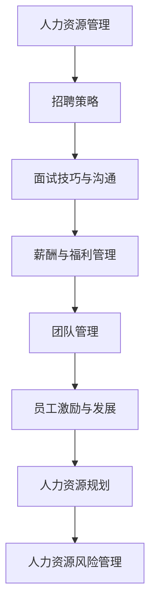

                 

# 《人力资源经理的创业任务：招聘优秀人才与团队建设》

> **关键词：** 人力资源管理、创业团队、招聘策略、面试技巧、薪酬管理、团队建设、人力资源规划

> **摘要：** 本文将深入探讨人力资源经理在创业企业中的关键任务，包括如何招聘优秀人才、构建高效的创业团队以及进行有效的团队管理和员工发展。通过详细阐述核心概念、算法原理和项目实战，为创业公司的人力资源管理提供实用的指导。

---

# 《人力资源经理的创业任务：招聘优秀人才与团队建设》目录大纲

## 第一部分：人力资源管理的创业准备

### 第1章：人力资源管理的概述

#### 1.1 人力资源管理的核心概念

- 人力资源管理的定义
- 人力资源管理的四大职能

#### 1.2 创业背景下的HR管理

- 创业企业的特点与挑战
- 创业企业的人力资源需求

#### 1.3 人力资源战略的重要性

- 战略规划与HR的关系
- 如何制定有效的人力资源战略

### 第2章：创业团队的构建

#### 2.1 团队建设的重要性

- 团队建设的定义
- 团队建设的目标

#### 2.2 创业团队的人员选择

- 如何选择团队成员
- 创业团队的核心能力

#### 2.3 团队文化建设

- 团队文化的定义
- 如何构建积极向上的团队文化

## 第二部分：招聘优秀人才

### 第3章：人才招聘策略

#### 3.1 招聘流程设计

- 招聘流程的步骤
- 如何选择招聘渠道

#### 3.2 招聘渠道优化

- 传统招聘渠道
- 网络招聘渠道
- 社交媒体招聘

#### 3.3 人才筛选与评估

- 人才筛选标准
- 人才评估方法

### 第4章：面试技巧与沟通

#### 4.1 面试前的准备

- 面试官的角色
- 面试问题的设计

#### 4.2 面试中的沟通技巧

- 面试中的非语言沟通
- 如何应对面试中的压力

#### 4.3 面试结果的反馈

- 如何给出面试反馈
- 面试反馈的重要性

### 第5章：薪酬与福利管理

#### 5.1 薪酬体系设计

- 薪酬体系的基本概念
- 薪酬策略与薪酬结构

#### 5.2 福利管理

- 福利计划的设计
- 如何提高员工的满意度

#### 5.3 薪酬与福利的市场竞争力分析

- 薪酬调查的方法
- 确保薪酬竞争力

## 第三部分：团队建设与员工发展

### 第6章：团队管理

#### 6.1 团队管理的基础

- 团队管理的核心要素
- 如何提升团队绩效

#### 6.2 员工激励

- 激励理论回顾
- 常见的员工激励措施

#### 6.3 员工成长与发展

- 职业发展规划
- 在职培训与晋升机制

### 第7章：创业企业的人力资源规划

#### 7.1 人力资源规划的重要性

- 人力资源规划的定义
- 人力资源规划与企业发展

#### 7.2 人力资源预算

- 预算编制方法
- 如何控制人力资源成本

#### 7.3 人力资源风险管理

- 人力资源风险的识别
- 人力资源风险的应对策略

## 附录

### 附录 A：人力资源管理的法律法规

- 劳动合同法
- 劳动争议处理规定

### 附录 B：人力资源管理的工具与资源

- 人力资源管理系统
- 常用的人力资源管理软件介绍

### 附录 C：创业企业人力资源管理的案例研究

- 成功案例
- 失败案例及其原因分析

### 附录 D：创业企业人力资源管理的数据分析

- 数据分析工具介绍
- 数据分析在人力资源管理中的应用案例

---

以下是书中涉及的核心概念与联系的Mermaid流程图：



---

以下是书中涉及的核心算法原理讲解的伪代码：

```python
# 伪代码：基于评分体系的候选人评估

def evaluate_candidate(candidate):
    score = 0

    # 教育背景
    if candidate.education == '硕士及以上':
        score += 20
    elif candidate.education == '本科':
        score += 15
    else:
        score += 10

    # 工作经验
    if candidate.experience >= 5:
        score += 20
    else:
        score += 10

    # 技能匹配
    if candidate.skills matches job_requirements:
        score += 30

    # 面试表现
    if candidate.interview_score > 7:
        score += 10

    return score
```

---

以下是书中涉及的数学模型和数学公式的讲解及举例说明：

### 薪酬定价模型

薪酬定价通常基于以下公式：

\[ 薪酬 = 基础薪酬 + 绩效薪酬 + 福利 \]

- **基础薪酬**：根据市场水平和企业支付能力设定。
- **绩效薪酬**：基于员工绩效评估结果设定，通常与公司业绩挂钩。
- **福利**：包括社会保险、带薪假期、培训机会等。

举例：

设某岗位的市场薪酬水平为 10000 元，企业支付能力为 90%，绩效薪酬占比为 20%，福利为总薪酬的 10%。

\[ 基础薪酬 = 10000 \times 0.9 = 9000 \text{元} \]
\[ 绩效薪酬 = 9000 \times 0.2 = 1800 \text{元} \]
\[ 福利 = (9000 + 1800) \times 0.1 = 1080 \text{元} \]
\[ 总薪酬 = 9000 + 1800 + 1080 = 11880 \text{元} \]

因此，该岗位的薪酬结构为：基础薪酬 9000 元，绩效薪酬 1800 元，福利 1080 元，总薪酬为 11880 元。

---

以下是书中涉及的项目实战：

### 项目实战：创业公司招聘系统的搭建

#### 实战目标

搭建一个简单的招聘系统，实现以下功能：

1. 招聘职位发布
2. 简历投递与管理
3. 面试安排与管理
4. 职位统计与报告

#### 实战步骤

1. **需求分析**

   与公司管理层和HR团队沟通，了解招聘系统的具体需求，包括用户角色、权限管理、数据管理等方面。

2. **技术选型**

   选择合适的前端框架（如Vue.js）、后端框架（如Spring Boot）以及数据库（如MySQL）。

3. **系统设计**

   设计系统的架构图，确定各模块的功能和接口。

4. **开发实施**

   - 前端开发：实现招聘职位发布、简历投递、面试安排等功能。
   - 后端开发：实现用户权限管理、数据存储与查询等功能。

5. **测试与部署**

   进行系统测试，确保所有功能正常运行，并在服务器上部署上线。

#### 实战案例

**招聘职位发布功能**

前端界面设计：

```html
<!-- 招聘职位发布 -->
<div>
  <h2>发布招聘职位</h2>
  <form @submit.prevent="submitJob">
    <div>
      <label for="name">职位名称：</label>
      <input type="text" v-model="job.name" required>
    </div>
    <div>
      <label for="description">职位描述：</label>
      <textarea v-model="job.description" required></textarea>
    </div>
    <div>
      <label for="salary_min">薪资范围（最低）：</label>
      <input type="number" v-model="job.salary_min" required>
    </div>
    <div>
      <label for="salary_max">薪资范围（最高）：</label>
      <input type="number" v-model="job.salary_max" required>
    </div>
    <div>
      <label for="location">工作地点：</label>
      <input type="text" v-model="job.location" required>
    </div>
    <button type="submit">发布</button>
  </form>
</div>
```

后端接口设计：

```python
# 伪代码：招聘职位发布接口

@app.route('/api/v1/jobs', methods=['POST'])
def create_job():
    job_data = request.get_json()
    job = JobModel(
        name=job_data['name'],
        description=job_data['description'],
        salary_min=job_data['salary_min'],
        salary_max=job_data['salary_max'],
        location=job_data['location'],
        posted_at=datetime.utcnow()
    )
    db.session.add(job)
    db.session.commit()
    return jsonify({'message': 'Job posted successfully'}), 201
```

**简历投递功能**

前端界面设计：

```html
<!-- 简历投递 -->
<div>
  <h2>简历投递</h2>
  <form @submit.prevent="submitResume">
    <div>
      <label for="name">姓名：</label>
      <input type="text" v-model="resume.name" required>
    </div>
    <div>
      <label for="contact">联系方式：</label>
      <input type="text" v-model="resume.contact" required>
    </div>
    <div>
      <label for="applied_job_id">应聘职位：</label>
      <select v-model="resume.applied_job_id" required>
        <option v-for="job in jobs" :value="job.id">{{ job.name }}</option>
      </select>
    </div>
    <div>
      <label for="introduction">个人简介：</label>
      <textarea v-model="resume.introduction" required></textarea>
    </div>
    <button type="submit">投递</button>
  </form>
</div>
```

后端接口设计：

```python
# 伪代码：简历投递接口

@app.route('/api/v1/resumes', methods=['POST'])
def submit_resume():
    resume_data = request.get_json()
    resume = ResumeModel(
        name=resume_data['name'],
        contact=resume_data['contact'],
        applied_job_id=resume_data['applied_job_id'],
        introduction=resume_data['introduction'],
        submitted_at=datetime.utcnow()
    )
    db.session.add(resume)
    db.session.commit()
    return jsonify({'message': 'Resume submitted successfully'}), 201
```

**面试安排功能**

前端界面设计：

```html
<!-- 面试安排 -->
<div>
  <h2>面试安排</h2>
  <form @submit.prevent="scheduleInterview">
    <div>
      <label for="time">面试时间：</label>
      <input type="datetime-local" v-model="interview.time" required>
    </div>
    <div>
      <label for="location">面试地点：</label>
      <input type="text" v-model="interview.location" required>
    </div>
    <div>
      <label for="interviewer_id">面试官：</label>
      <select v-model="interview.interviewer_id" required>
        <option v-for="user in users" :value="user.id">{{ user.name }}</option>
      </select>
    </div>
    <div>
      <label for="candidate_id">候选人：</label>
      <select v-model="interview.candidate_id" required>
        <option v-for="resume in resumes" :value="resume.id">{{ resume.name }}</option>
      </select>
    </div>
    <button type="submit">安排</button>
  </form>
</div>
```

后端接口设计：

```python
# 伪代码：面试安排接口

@app.route('/api/v1/interviews', methods=['POST'])
def schedule_interview():
    interview_data = request.get_json()
    interview = InterviewModel(
        time=interview_data['time'],
        location=interview_data['location'],
        interviewer_id=interview_data['interviewer_id'],
        candidate_id=interview_data['candidate_id'],
        scheduled_at=datetime.utcnow()
    )
    db.session.add(interview)
    db.session.commit()
    return jsonify({'message': 'Interview scheduled successfully'}), 201
```

#### 代码解读与分析

以上代码展示了招聘系统中的几个核心功能接口的设计与实现。在实际开发过程中，还需要考虑数据验证、异常处理、用户权限控制等多个方面。代码的解读与分析有助于理解招聘系统的工作原理和实现细节。通过该项目实战，读者可以学习到如何设计和实现一个简单的招聘系统，为创业公司的人力资源管理提供技术支持。

---

作者：AI天才研究院/AI Genius Institute & 禅与计算机程序设计艺术 /Zen And The Art of Computer Programming

接下来，我们将开始正文部分的撰写，深入探讨创业企业中人力资源管理的关键任务和策略。首先，我们将从人力资源管理的核心概念和创业背景下的HR管理开始，逐步展开讨论。让我们一步一步地深入分析每个章节的内容，为创业公司的人力资源管理提供实用的指导。# 第一部分：人力资源管理的创业准备

## 第1章：人力资源管理的概述

### 1.1 人力资源管理的核心概念

**人力资源管理**（Human Resource Management，简称HRM）是企业对员工进行有效管理和开发的一系列活动的总称。其核心概念包括：

- **员工招聘**：企业根据需要，通过多种渠道吸引并选拔合适的人才。
- **员工培训**：为提高员工的技能和知识水平，使其更好地适应岗位需求。
- **员工绩效管理**：对员工的工作表现进行评估和反馈，以激励员工的积极性和创造力。
- **员工关系管理**：处理员工与企业之间的各种关系，维护良好的劳动关系。

**人力资源管理的四大职能**是招聘、培训、绩效管理和员工关系管理。每个职能在创业企业中都有其独特的重要性。

- **招聘**：招聘是企业获取人才的重要途径。在创业初期，人才的匮乏往往成为企业发展的瓶颈。通过有效的招聘策略，企业可以吸引和留住优秀的人才。
- **培训**：培训是提高员工素质和技能的重要手段。创业企业通常需要员工具备较强的学习能力和适应能力，以快速应对市场变化。有效的培训有助于提升员工的工作效率和绩效。
- **绩效管理**：绩效管理是激发员工积极性和创造力的关键。通过合理的绩效评估和反馈，企业可以明确员工的优点和不足，有针对性地进行激励和改进。
- **员工关系管理**：良好的员工关系是企业持续发展的基础。创业企业需要营造一个积极向上、和谐稳定的工作氛围，以增强员工的归属感和忠诚度。

### 1.2 创业背景下的HR管理

**创业企业**具有以下特点：

- **规模小**：创业企业通常初创阶段规模较小，人员编制有限。
- **灵活性**：创业企业需要快速适应市场变化，具有高度的灵活性。
- **高风险**：创业企业面临较高的市场风险和经营风险。
- **高成长性**：创业企业具有快速发展的潜力。

在创业背景下，HR管理面临以下挑战：

- **人才短缺**：创业企业初期往往难以吸引到优秀的人才，需要通过多种途径进行人才储备。
- **激励机制**：如何设计有效的激励机制，留住核心人才，是创业企业面临的难题。
- **企业文化**：创业企业需要快速建立和传播企业文化，形成共同的价值观念和行为准则。

针对这些挑战，创业企业需要采取以下策略：

- **灵活招聘**：采用灵活的招聘策略，通过线上招聘、校园招聘等多种途径，快速吸引人才。
- **内部培养**：重视内部培养，通过内部晋升和轮岗机制，提升员工的综合素质和技能。
- **激励机制**：建立合理的激励机制，包括股权激励、绩效奖励等，激发员工的积极性和创造力。
- **企业文化**：构建积极向上、开放包容的企业文化，增强员工的归属感和认同感。

### 1.3 人力资源战略的重要性

**人力资源战略**是企业为实现长期发展目标而制定的人力资源规划和策略。它与企业整体战略紧密相连，是确保企业竞争优势的关键因素。

- **人才战略**：明确企业所需的核心人才类型和数量，有针对性地进行招聘和培养。
- **培训与发展战略**：制定系统的培训计划，提升员工的技能和知识水平，满足企业发展的需求。
- **绩效管理战略**：建立合理的绩效管理体系，激励员工提高工作效率和质量。
- **员工关系战略**：建立和谐的员工关系，提升员工满意度和忠诚度。

**战略规划与HR的关系**：

- **战略导向**：人力资源战略需要紧密围绕企业整体战略，确保企业目标的实现。
- **战略支撑**：人力资源战略为企业提供人才、培训和激励机制等方面的支撑，助力企业持续发展。

**如何制定有效的人力资源战略**：

1. **明确企业愿景和目标**：了解企业的长远发展目标和愿景，为人力资源战略提供方向。
2. **分析内外部环境**：对市场、竞争对手、员工需求等方面进行深入分析，识别优势和挑战。
3. **制定具体策略**：根据分析结果，制定具体的招聘、培训、绩效管理和员工关系等方面的策略。
4. **实施与监控**：将人力资源战略转化为具体行动，定期评估和调整，确保战略的有效执行。

### 小结

人力资源管理的核心概念和四大职能在创业企业中具有重要作用。创业企业需要采取灵活的招聘策略、内部培养机制、激励机制和积极向上的企业文化，以应对人才短缺、高成长性等挑战。制定有效的人力资源战略，确保企业目标的实现，是创业企业成功的关键。在下一章中，我们将进一步探讨创业团队的建设和团队文化的重要性。# 第2章：创业团队的构建

### 2.1 团队建设的重要性

**团队建设**（Team Building）是企业成功的关键因素之一。在一个高效的创业团队中，成员之间相互支持、协作默契，共同为实现企业目标而努力。团队建设的重要性体现在以下几个方面：

1. **提升工作效率**：通过团队建设，成员之间的沟通和协作能力得到提升，工作效率得以提高。团队成员能够更好地理解彼此的需求和目标，减少沟通成本和误解。
2. **增强团队凝聚力**：团队建设有助于增强成员之间的归属感和认同感，提升团队的凝聚力。团队成员在面对困难和挑战时，能够共同应对，形成强大的合力。
3. **促进创新**：团队建设鼓励成员之间分享知识和经验，激发创新思维。团队成员可以相互启发，提出新的想法和解决方案，推动企业持续创新。
4. **提升员工满意度**：良好的团队氛围能够提升员工的满意度和幸福感，降低员工流失率。员工在一个和谐、积极的工作环境中，能够更好地发挥自己的才能和潜力。

### 2.2 创业团队的人员选择

**创业团队的人员选择**是团队建设的第一步，也是至关重要的一步。选择合适的团队成员，不仅能够提升团队的绩效，还能够为企业的长期发展奠定基础。以下是一些关键要素：

1. **专业技能**：团队成员应具备与岗位需求相符的专业技能和知识。这包括技术能力、业务知识、行业经验等。专业技能是团队高效工作的基础。
2. **个人素质**：团队成员应具备良好的个人素质，如责任心、自律性、沟通能力、团队合作精神等。这些素质能够保证团队成员在工作和生活中相互支持、相互尊重。
3. **适应能力**：创业企业面临快速变化的市场环境，团队成员应具备较强的适应能力，能够快速应对市场变化和挑战。适应能力是团队成员在创业过程中持续成长的关键。
4. **文化契合**：团队成员应与企业价值观和文化相契合。文化契合有助于团队成员在思想和行为上达成共识，形成共同的目标和愿景。

**如何选择团队成员**：

1. **明确岗位需求**：在招聘过程中，明确岗位的具体需求和职责，确保候选人与岗位需求相匹配。
2. **多渠道招聘**：通过多种招聘渠道，如线上招聘、校园招聘、猎头公司等，扩大候选人的选择范围。
3. **面试评估**：通过面试，全面了解候选人的专业技能、个人素质和适应能力。面试过程中，可以设置情景模拟、案例分析等环节，评估候选人在实际工作场景中的表现。
4. **背景调查**：对候选人进行背景调查，了解其过往的工作经历、业绩表现等，确保候选人的诚信度和专业性。

### 2.3 创业团队的核心能力

**创业团队的核心能力**是指团队成员在共同实现企业目标过程中所具备的关键能力和素质。以下是一些关键的核心能力：

1. **创新与学习能力**：创业企业面临快速变化的市场环境，团队成员应具备创新和学习能力，能够快速适应新环境，提出创新的解决方案。
2. **团队协作能力**：团队成员应具备良好的团队协作能力，能够在团队中发挥各自的优势，相互支持、相互配合，共同实现目标。
3. **决策能力**：团队成员应具备较强的决策能力，能够在面对复杂问题和不确定性时，快速做出明智的决策。
4. **领导力**：团队成员应具备一定的领导力，能够在关键时刻发挥领导作用，带领团队克服困难，实现目标。

**如何培养和提升团队核心能力**：

1. **培训与发展**：通过系统化的培训和职业发展规划，提升团队成员的专业技能和综合素质。
2. **实践锻炼**：通过实际项目和工作任务，让团队成员在实战中锻炼和提升核心能力。
3. **激励机制**：建立合理的激励机制，激发团队成员的积极性和创造力，鼓励他们在工作中发挥最佳水平。
4. **团队文化建设**：营造积极向上、相互支持、共同成长的团队文化，提升团队的凝聚力和向心力。

### 小结

创业团队的构建是创业企业成功的关键环节。选择合适的团队成员，培养和提升团队的核心能力，是创业团队建设的重要任务。在下一章中，我们将进一步探讨团队文化建设的重要性。通过构建积极向上的团队文化，企业能够更好地吸引和留住人才，实现持续发展。# 第2章：创业团队的构建（续）

### 2.4 团队文化建设

**团队文化**（Corporate Culture）是企业核心价值观的体现，是团队成员共同遵守的行为准则和工作方式。它对企业的长期发展具有深远的影响。良好的团队文化能够激发员工的积极性和创造力，提升团队凝聚力，增强企业的竞争力。

#### 2.4.1 团队文化的定义

团队文化是指企业在长期发展过程中形成的共同价值观、行为规范和工作方式。它包括企业的使命、愿景、价值观以及企业的行为准则等。团队文化是企业的精神支柱，是团队成员共同奋斗的动力源泉。

- **使命**：企业存在的根本目的，是企业追求的长期目标。
- **愿景**：企业希望达到的最终状态，是企业发展的方向。
- **价值观**：企业的核心价值观，是企业对待员工、客户和社会的基本态度。
- **行为准则**：企业在日常运营中遵守的基本行为规范。

#### 2.4.2 团队文化建设的重要性

- **增强凝聚力**：良好的团队文化能够增强团队成员之间的信任和归属感，提升团队的凝聚力。团队成员在共同的目标和价值观下，能够更好地团结协作，共同为企业的发展努力。
- **提升员工满意度**：团队文化能够营造一个积极向上、和谐稳定的工作环境，提升员工的满意度和幸福感。员工在一个良好的团队文化中，能够更好地发挥自己的才能和潜力，实现个人价值。
- **增强企业竞争力**：团队文化是企业核心竞争力的重要组成部分。一个具有良好团队文化的企业，能够吸引和留住优秀的人才，提升企业的创新能力和市场竞争力。

#### 2.4.3 如何构建积极向上的团队文化

1. **明确核心价值观**：企业需要明确自己的核心价值观，并将其贯穿于日常运营和员工管理的各个方面。核心价值观是团队文化的灵魂，是团队成员共同遵守的行为准则。
2. **领导者的示范作用**：企业的领导者需要以身作则，带头践行企业的核心价值观。领导者的言行举止对团队成员具有示范作用，能够影响团队成员的行为和态度。
3. **建立公平公正的激励机制**：建立公平公正的激励机制，激励团队成员为实现企业目标而努力。激励机制包括薪酬奖励、晋升机会、职业发展规划等，能够激发员工的积极性和创造力。
4. **营造良好的沟通氛围**：建立良好的沟通机制，鼓励团队成员之间的交流和互动。良好的沟通能够增强团队成员之间的信任和理解，促进团队协作。
5. **关注员工成长和发展**：企业需要关注员工的成长和发展，为员工提供培训和学习机会。通过职业发展规划和培训，提升员工的技能和知识水平，增强员工的职业素养。
6. **举办团队活动**：定期举办团队活动，如团队建设培训、团队拓展训练等，增强团队成员之间的互动和沟通。团队活动能够提升团队的凝聚力，增强团队的向心力。

#### 2.4.4 团队文化建设中的挑战

- **文化融合**：在创业团队中，成员来自不同的背景和行业，如何实现文化融合是团队建设中的一个挑战。企业需要尊重不同成员的文化差异，找到共同的价值基础，构建包容性的团队文化。
- **文化变革**：随着企业的发展和市场环境的变化，团队文化也需要进行相应的调整和变革。文化变革需要企业领导者具备敏锐的市场洞察力和坚定的决心，引导团队成员接受和适应新的文化。
- **持续维护**：团队文化建设不是一蹴而就的，需要企业长期坚持和投入。企业需要不断维护和强化团队文化，确保团队文化在企业发展过程中得到传承和发扬。

### 小结

团队文化建设是创业团队建设的重要组成部分。通过构建积极向上的团队文化，企业能够提升团队凝聚力，增强员工满意度，提高企业竞争力。在下一章中，我们将探讨人才招聘策略，为创业企业的人才引进提供指导。# 第二部分：招聘优秀人才

### 第3章：人才招聘策略

在创业企业的快速发展过程中，招聘优秀人才是确保企业持续竞争力和创新能力的关键。一个高效的人才招聘策略不仅能吸引到合适的候选人，还能提升企业的整体绩效和团队氛围。本章将详细探讨人才招聘策略的各个方面，包括招聘流程设计、招聘渠道优化、人才筛选与评估，以及面试技巧与沟通。

#### 3.1 招聘流程设计

招聘流程是确保招聘活动顺利进行的基础。一个完善的招聘流程包括以下步骤：

1. **岗位需求分析**：在招聘前，企业需要明确岗位的需求，包括岗位的职责、技能要求、工作经验等。这有助于制定针对性的招聘计划和选拔标准。
2. **发布招聘信息**：通过多种渠道发布招聘信息，如招聘网站、社交媒体、职业论坛等，确保信息覆盖到合适的候选人。
3. **筛选简历**：根据岗位需求和简历内容，筛选出符合条件的候选人。这一步骤可以通过自动化工具或人工审核完成。
4. **面试安排**：与符合条件的候选人进行面试安排，包括电话面试和现场面试等。面试环节的设计和流程需要确保候选人的面试体验和企业的招聘效率。
5. **评估与决策**：通过面试评估候选人的综合素质和岗位匹配度，做出录用决策。
6. **背景调查与体检**：在决定录用后，对候选人进行背景调查和体检，确保候选人的诚信度和身体健康。
7. **入职准备**：为新员工提供入职培训，介绍企业文化、工作环境和相关制度，确保新员工能够快速融入团队。

#### 3.2 招聘渠道优化

招聘渠道的多样性是确保招聘效果的重要手段。以下是一些常见的招聘渠道：

1. **线上招聘渠道**：
   - **招聘网站**：如智联招聘、前程无忧等，覆盖广泛，候选人数量多。
   - **社交媒体**：如LinkedIn、微博、微信公众号等，通过社交媒体宣传招聘信息，能够吸引更多关注和分享。
   - **专业论坛**：如技术社区、行业论坛等，适合技术类岗位的招聘。

2. **线下招聘渠道**：
   - **校园招聘**：与高校合作，参加校园招聘会，吸引应届毕业生。
   - **职业博览会**：参加各类职业博览会，吸引有经验的候选人。
   - **内部推荐**：鼓励现有员工推荐合适的候选人，内部推荐往往能够降低招聘成本，提高候选人质量。

#### 3.3 人才筛选与评估

人才筛选与评估是招聘流程的核心环节。以下是一些常见的人才筛选与评估方法：

1. **简历筛选**：根据岗位需求，筛选出简历中的关键信息，如教育背景、工作经验、技能等。可以使用自动化工具或人工审核相结合的方式。
2. **电话筛选**：通过电话与候选人进行初步沟通，了解候选人的基本信息和意愿，筛选出适合面试的候选人。
3. **面试评估**：
   - **结构化面试**：采用标准化的面试问题和评估标准，确保面试的公平性和科学性。
   - **行为面试**：通过提问候选人的以往行为和经历，评估其能力和性格。
   - **情景模拟**：设置模拟的工作场景，观察候选人在实际情境下的表现。
4. **评估工具**：使用专业的评估工具，如能力测试、性格测试等，对候选人进行综合评估。

#### 3.4 面试技巧与沟通

面试是招聘过程中最重要的环节之一。以下是一些面试技巧与沟通策略：

1. **准备充分**：
   - 熟悉岗位需求，明确面试目的。
   - 准备面试问题，确保面试过程有条不紊。
   - 研究候选人的背景和经历，有针对性地提问。

2. **营造良好的面试氛围**：
   - 保持专业和友好的态度，让候选人感到舒适和放松。
   - 避免单方面灌输，鼓励候选人表达自己的想法和经历。

3. **有效提问**：
   - 开放式问题：鼓励候选人表达自己的观点和经验。
   - 关键问题：针对候选人的关键能力和素质进行提问。
   - 跟进问题：针对候选人的回答，进行进一步的追问和探讨。

4. **倾听与反馈**：
   - 倾听候选人的回答，确保理解其意图。
   - 给出及时的反馈，表达对候选人的认可或需要改进的地方。

5. **面试结束**：
   - 提供清晰的时间表和流程，让候选人了解接下来的招聘进度。
   - 感谢候选人的参与，即使未能录用，也要给予积极的反馈。

#### 小结

人才招聘策略是创业企业成功的关键。通过设计完善的招聘流程、优化招聘渠道、科学筛选与评估候选人，以及运用有效的面试技巧与沟通策略，企业能够吸引到优秀的人才，为企业的持续发展奠定坚实基础。在下一章中，我们将探讨薪酬与福利管理，为创业企业的薪酬策略提供指导。# 第4章：面试技巧与沟通

### 4.1 面试前的准备

面试是企业与候选人之间进行初步接触和评估的重要环节，为了确保面试的顺利进行和取得良好的效果，充分的准备是必不可少的。以下是一些面试前的准备工作：

#### 4.1.1 研究岗位需求和候选人背景

- **岗位需求分析**：在面试前，人力资源经理或面试官需要深入理解岗位的需求，包括职责、技能要求、工作经验、教育背景等。这有助于设计针对性的面试问题和评估标准。
- **候选人背景研究**：提前了解候选人的简历、工作经历、教育背景、专业技能等，以便在面试中能够有针对性地提问和评估。

#### 4.1.2 准备面试问题

- **开放式问题**：开放式问题能够鼓励候选人分享自己的观点和经验，例如，“请描述一次你在项目中遇到的最大挑战，以及你是如何解决的？”
- **行为面试问题**：通过询问候选人过去的经历，评估其解决问题的能力和性格特征，例如，“请描述一次你如何与一个难以相处的同事合作？”
- **情景模拟问题**：设置模拟的工作场景，观察候选人在实际情境下的反应和表现，例如，“如果你发现一个项目出现了重大错误，你会如何处理？”

#### 4.1.3 确定面试流程

- **面试顺序**：确定面试的顺序，包括初步面试、技术面试、领导面试等，确保面试过程有条不紊。
- **面试时间安排**：合理安排面试时间，确保每个候选人都能够得到充分的面试时间。

#### 4.1.4 准备面试场地

- **确保环境舒适**：确保面试场地安静、整洁，提供必要的水和文具等，让候选人感到舒适和放松。
- **准备面试材料**：提前准备好面试所需的各种材料，如面试指南、评估表格等。

### 4.2 面试中的沟通技巧

面试中的沟通技巧对于面试的顺利进行和评估候选人的真实能力至关重要。以下是一些关键沟通技巧：

#### 4.2.1 营造良好的面试氛围

- **友好接待**：面试开始时，友好接待候选人，让他们感受到企业的热情和尊重。
- **倾听**：给予候选人充分的时间表达自己的想法，避免打断或急于提问。

#### 4.2.2 有效提问

- **开放式问题**：开放式问题能够鼓励候选人详细回答，提供更多有价值的信息。
- **具体化问题**：针对候选人的回答，提出具体化的问题，例如，“你能详细描述一下你是如何实施这个项目的吗？”
- **避免引导性问题**：避免提问时带有明显的倾向性，以确保评估的客观性。

#### 4.2.3 非语言沟通

- **肢体语言**：通过开放的肢体语言，如微笑、点头等，表达对候选人的认可和尊重。
- **眼神交流**：适当的眼神交流能够增强沟通的效果，同时也能评估候选人的自信和沟通能力。

#### 4.2.4 情绪管理

- **保持冷静**：在面试过程中，保持冷静和专业，即使遇到难以回答的问题或紧张的候选人，也要保持镇定。
- **正面引导**：对于回答不充分的候选人，可以通过正面引导的方式，鼓励他们继续分享。

### 4.3 面试中的非语言沟通

非语言沟通在面试中同样重要，能够传递出更多的信息和情感。以下是一些关键的面试中的非语言沟通技巧：

#### 4.3.1 身体姿态

- **开放的姿态**：避免交叉手臂或双腿，保持开放的姿态，以展示对候选人的友好和尊重。
- **适当的肢体动作**：适当的肢体动作，如点头、微笑等，能够增强沟通的效果。

#### 4.3.2 眼神交流

- **适当的眼神交流**：保持适当的眼神交流，展示对候选人的关注和尊重，同时也能评估候选人的自信和沟通能力。

#### 4.3.3 面部表情

- **积极的面部表情**：保持积极的面部表情，如微笑、点头等，以传达出友好和欢迎的态度。
- **适度的表情变化**：通过适度的表情变化，表达对候选人回答的理解和兴趣。

### 4.4 面试结果的反馈

面试结束后，及时给予候选人反馈是面试流程中的重要一环。以下是一些关于面试结果反馈的技巧：

#### 4.4.1 提供明确的反馈

- **明确是否录用**：在反馈中明确告知候选人是否被录用，避免模糊的表述，以免引起误解。
- **具体的评估结果**：提供具体的评估结果，包括候选人的优点和需要改进的地方。

#### 4.4.2 感谢候选人

- **表示感谢**：无论候选人是否被录用，都要表示感谢，表达对候选人时间和精力的尊重。
- **提供反馈**：如果候选人未能被录用，可以提供一些建设性的反馈，帮助他们了解自己的不足和改进方向。

#### 4.4.3 保持沟通

- **保持联系**：与候选人保持联系，了解他们的求职进展，同时也能保持企业的良好形象。

### 小结

面试技巧与沟通在招聘过程中起着至关重要的作用。通过充分的准备、有效的提问、良好的非语言沟通和及时的反馈，企业能够更好地评估候选人的能力和潜力，从而招聘到优秀的人才。在下一章中，我们将探讨薪酬与福利管理，为创业企业制定合理的薪酬策略提供指导。# 第5章：薪酬与福利管理

### 5.1 薪酬体系设计

薪酬体系是企业为员工提供报酬的制度，包括薪酬结构、薪酬水平、薪酬发放方式等。一个合理的薪酬体系能够激励员工的工作积极性，提高员工的满意度和忠诚度。以下是薪酬体系设计的关键要素：

#### 5.1.1 基本薪酬

**基本薪酬**（Basic Salary）是员工的主要收入来源，通常根据市场水平、企业支付能力和员工的工作岗位确定。基本薪酬的设计需要考虑以下因素：

- **市场水平**：了解同行业、同岗位的市场薪酬水平，确保薪酬具有竞争力。
- **企业支付能力**：考虑企业的财务状况和支付能力，确保薪酬水平的合理性。
- **员工岗位**：根据员工的工作岗位和职责，确定薪酬水平。

#### 5.1.2 绩效薪酬

**绩效薪酬**（Performance Pay）是员工薪酬的重要组成部分，与员工的工作表现和企业的绩效挂钩。绩效薪酬的设计需要考虑以下因素：

- **绩效指标**：制定明确的绩效指标，确保绩效薪酬与员工的实际工作表现挂钩。
- **绩效等级**：根据绩效指标，将员工划分为不同的绩效等级，对应不同的薪酬水平。
- **发放方式**：确定绩效薪酬的发放方式，如季度发放、年度发放等。

#### 5.1.3 福利

**福利**（Benefits）是员工薪酬的补充，包括社会保险、带薪假期、培训机会等。福利的设计需要考虑以下因素：

- **社会保险**：为员工提供包括养老保险、医疗保险、失业保险等在内的社会保险。
- **带薪假期**：包括法定节假日、年假、病假等，确保员工在法定假期和特殊情况下得到相应的薪酬保障。
- **培训机会**：为员工提供培训和发展机会，提升员工的技能和职业素养。

#### 5.1.4 薪酬调整机制

薪酬调整机制是指根据员工的工作表现、市场变化和企业发展，对员工薪酬进行定期调整的机制。薪酬调整机制需要考虑以下因素：

- **绩效考核结果**：根据员工的绩效考核结果，对薪酬进行调整，激励员工提高工作表现。
- **市场薪酬水平**：定期调查市场薪酬水平，根据市场变化对薪酬进行调整。
- **企业发展**：根据企业的发展状况，调整员工薪酬水平，确保薪酬的合理性。

### 5.2 福利管理

福利管理是薪酬管理的重要组成部分，直接影响员工的工作满意度和忠诚度。以下是福利管理的关键要素：

#### 5.2.1 福利计划的设计

福利计划的设计需要考虑以下因素：

- **员工需求**：了解员工对福利的需求，制定符合员工需求的福利计划。
- **企业目标**：确保福利计划与企业的整体目标和价值观一致。
- **成本效益**：在确保福利水平的同时，考虑企业的成本效益。

#### 5.2.2 福利项目的实施

福利项目的实施需要考虑以下因素：

- **合法性**：确保福利项目符合国家相关法律法规，确保员工的合法权益。
- **透明度**：提高福利项目的透明度，让员工了解福利的具体内容和实施方式。
- **便利性**：确保福利项目的实施方便快捷，减少员工的繁琐手续。

#### 5.2.3 福利评价

福利评价是衡量福利项目效果的重要手段。以下是福利评价的关键要素：

- **员工满意度**：通过调查和反馈，了解员工对福利的满意度和需求。
- **成本效益**：评估福利项目的成本和收益，确保福利项目具有成本效益。
- **改进措施**：根据评价结果，对福利项目进行调整和改进，提高福利水平。

### 5.3 薪酬与福利的市场竞争力分析

薪酬与福利的市场竞争力是企业吸引和留住人才的重要手段。以下是如何确保薪酬与福利具有市场竞争力：

#### 5.3.1 薪酬调查

薪酬调查是了解市场薪酬水平的重要手段。以下是薪酬调查的关键步骤：

- **确定调查范围**：选择与目标岗位相似的公司和行业进行调查。
- **收集数据**：通过问卷调查、访谈等方式，收集市场薪酬数据。
- **分析数据**：对收集到的数据进行整理和分析，确定市场薪酬水平。
- **制定薪酬策略**：根据市场薪酬水平，制定合理的薪酬策略。

#### 5.3.2 确保薪酬竞争力

确保薪酬具有竞争力需要考虑以下因素：

- **薪酬水平**：确保薪酬水平高于或等于市场平均水平，吸引和留住人才。
- **薪酬结构**：设计合理的薪酬结构，包括基本薪酬、绩效薪酬和福利等，提高薪酬的吸引力。
- **薪酬调整**：根据市场变化和企业发展，及时调整薪酬水平，确保薪酬的竞争力。

#### 5.3.3 福利竞争力

确保福利具有竞争力需要考虑以下因素：

- **福利种类**：提供多样化的福利项目，满足员工的多元化需求。
- **福利水平**：确保福利水平与市场水平相当，提高员工的工作满意度。
- **福利创新**：不断优化福利项目，引入新的福利形式，提高福利的吸引力。

### 小结

薪酬与福利管理是创业企业吸引和留住人才的关键因素。通过设计合理的薪酬体系和福利计划，确保薪酬与福利的市场竞争力，企业能够提高员工的满意度和忠诚度，为企业的长期发展奠定坚实基础。在下一章中，我们将探讨团队管理，包括团队管理的核心要素和提升团队绩效的方法。# 第6章：团队管理

### 6.1 团队管理的核心要素

**团队管理**是确保团队高效运作和实现企业目标的关键。一个成功的团队管理需要关注以下几个核心要素：

#### 6.1.1 团队目标

团队目标是指团队共同追求的目标和愿景。明确的团队目标能够为团队成员提供方向和动力，确保团队成员的工作一致性和协调性。团队目标应具有以下特点：

- **具体性**：目标应具体、可量化，以便团队成员明确自己的工作内容和期望成果。
- **挑战性**：目标应具有一定的挑战性，激发团队成员的积极性和创造力。
- **可实现性**：目标应在现有资源和条件下可实现，避免设定过高或过低的目标。

#### 6.1.2 团队成员

团队成员是团队的核心，包括团队成员的选拔、培养和激励等方面。以下是一些关于团队成员管理的要点：

- **选拔**：选择适合团队成员，确保团队成员具备相应的专业技能和团队协作能力。可以通过面试、评估等方式进行选拔。
- **培养**：提供团队成员培训和发展机会，提升团队成员的专业技能和团队协作能力。可以通过内部培训、外部培训等方式进行培养。
- **激励**：建立合理的激励机制，激励团队成员的工作积极性和创造力。可以通过薪酬奖励、晋升机会、荣誉表彰等方式进行激励。

#### 6.1.3 团队协作

团队协作是指团队成员之间的合作和配合。高效的团队协作能够提高团队的工作效率和绩效。以下是一些关于团队协作的要点：

- **沟通**：建立良好的沟通机制，确保团队成员之间的信息交流和反馈。可以通过会议、邮件、即时通讯工具等方式进行沟通。
- **分工**：明确团队成员的职责和任务，确保团队成员各司其职，避免工作重叠和冲突。
- **协调**：协调团队成员的工作，确保团队工作的高效性和协同性。可以通过定期会议、工作协调会等方式进行协调。

#### 6.1.4 团队文化

团队文化是团队的灵魂，是团队成员共同遵守的价值观和行为准则。良好的团队文化能够增强团队的凝聚力，提高团队成员的归属感和忠诚度。以下是一些关于团队文化的要点：

- **价值观**：明确团队的价值观，确保团队成员在价值观上达成共识。可以通过团队建设活动、内部培训等方式进行传播和弘扬。
- **行为准则**：制定明确的行为准则，规范团队成员的行为和态度。可以通过制度、规范等方式进行制定和推广。
- **认同感**：营造积极向上、和谐稳定的团队氛围，增强团队成员的认同感和归属感。

### 6.2 如何提升团队绩效

提升团队绩效是团队管理的核心目标。以下是一些提升团队绩效的方法：

#### 6.2.1 设定明确的绩效目标

设定明确的绩效目标是提升团队绩效的基础。绩效目标应具体、可量化，并与团队目标和企业目标相一致。以下是一些设定绩效目标的要点：

- **具体性**：目标应具体、可量化，以便团队成员明确自己的工作内容和期望成果。
- **挑战性**：目标应具有一定的挑战性，激发团队成员的积极性和创造力。
- **可实现性**：目标应在现有资源和条件下可实现，避免设定过高或过低的目标。

#### 6.2.2 建立有效的激励机制

建立有效的激励机制是提升团队绩效的关键。以下是一些激励机制的要点：

- **薪酬激励**：根据团队成员的绩效表现，提供合理的薪酬激励，提高团队成员的工作积极性。
- **荣誉激励**：对表现优秀的团队成员给予荣誉表彰，提高团队成员的成就感和荣誉感。
- **职业发展**：为团队成员提供职业发展机会，激励团队成员不断提升自己的能力和业绩。

#### 6.2.3 提供有效的培训和发展机会

提供有效的培训和发展机会是提升团队绩效的重要手段。以下是一些培训和发展机会的要点：

- **专业技能培训**：为团队成员提供专业技能培训，提升团队成员的专业能力和工作效率。
- **管理能力培训**：为团队成员提供管理能力培训，提升团队成员的领导力和团队协作能力。
- **职业发展规划**：为团队成员制定职业发展规划，明确团队成员的职业发展路径和目标。

#### 6.2.4 建立有效的沟通机制

建立有效的沟通机制是提升团队绩效的基础。以下是一些沟通机制的要点：

- **定期会议**：定期召开团队会议，确保团队成员之间的信息交流和反馈。
- **即时沟通**：通过即时通讯工具，确保团队成员之间的沟通畅通和高效。
- **反馈机制**：建立有效的反馈机制，确保团队成员能够及时了解自己的工作表现和改进方向。

#### 6.2.5 营造积极向上的团队文化

营造积极向上的团队文化是提升团队绩效的关键。以下是一些团队文化的要点：

- **共同价值观**：明确团队的共同价值观，确保团队成员在价值观上达成共识。
- **团队精神**：培养团队精神，增强团队成员的归属感和荣誉感。
- **积极氛围**：营造积极向上的工作氛围，激发团队成员的积极性和创造力。

### 小结

团队管理是创业企业成功的关键因素之一。通过关注团队管理的核心要素，如团队目标、团队成员、团队协作和团队文化，以及采取提升团队绩效的方法，企业能够建立高效、协作和有凝聚力的团队，从而实现企业的长期发展目标。在下一章中，我们将探讨创业企业的人力资源规划，包括人力资源规划的重要性、预算编制方法和人力资源风险管理。# 第7章：创业企业的人力资源规划

## 7.1 人力资源规划的重要性

**人力资源规划**（Human Resource Planning，HRP）是企业根据长远发展战略和市场需求，对人力资源的获取、利用、开发等进行系统规划的过程。它是企业实现可持续发展、提升竞争力的重要手段。在创业企业中，人力资源规划的重要性体现在以下几个方面：

1. **确保人才供应**：通过人力资源规划，企业能够提前预测和准备未来所需的人才，避免因人才短缺而影响企业运营和发展。
2. **优化资源配置**：人力资源规划有助于企业合理配置人力资源，实现人岗匹配，提高工作效率和绩效。
3. **提升企业竞争力**：通过系统的人力资源管理，企业能够培养和留住关键人才，提高整体竞争力。
4. **促进企业战略实施**：人力资源规划与企业战略紧密相连，有助于确保企业战略的有效实施。

## 7.2 人力资源预算

**人力资源预算**（Human Resource Budget）是企业为人力资源管理工作制定的经济预算。它是企业财务管理的重要组成部分，对于控制人力资源成本、确保人力资源活动的顺利实施具有重要意义。以下是人力资源预算的关键要素：

### 7.2.1 预算编制方法

1. **成本预测**：根据企业的发展计划和市场需求，预测未来的人力资源成本，包括员工薪酬、培训费用、福利支出等。
2. **预算分配**：将人力资源预算分配到具体的部门或项目，确保预算的合理性和可操作性。
3. **绩效评估**：对人力资源预算的执行情况进行定期评估，根据实际效果进行调整和优化。

### 7.2.2 如何控制人力资源成本

1. **优化招聘流程**：通过优化招聘流程，降低招聘成本，如合理设定薪酬水平、提高招聘效率等。
2. **内部培养**：重视内部培养，降低外部招聘成本，同时提升员工技能和绩效。
3. **绩效激励**：建立合理的绩效激励机制，提高员工的工作积极性和绩效，减少不必要的薪酬支出。

### 7.2.3 预算编制案例分析

**案例**：某创业公司计划在未来一年内拓展市场，预计需要增加20名销售人员。根据市场调研和薪酬水平，销售人员的基本薪酬平均为每月8000元。此外，公司计划为销售人员提供培训机会，预计培训费用每人每月1000元。以下是该公司的预算编制过程：

1. **成本预测**：
   - 销售人员基本薪酬：20人 × 8000元/人/月 = 160,000元/月
   - 培训费用：20人 × 1000元/人/月 = 20,000元/月
   - 总成本：160,000元/月 + 20,000元/月 = 180,000元/月

2. **预算分配**：
   - 销售部门：150,000元/月（基本薪酬）
   - 培训部门：30,000元/月（培训费用）

3. **绩效评估**：
   - 定期评估销售团队的工作绩效，根据销售业绩和员工表现，调整预算分配和激励措施。

## 7.3 人力资源风险管理

**人力资源风险管理**（Human Resource Risk Management，HRM Risk Management）是企业在人力资源管理过程中识别、评估、控制和管理人力资源风险的一系列措施。以下是人力资源风险管理的关键环节：

### 7.3.1 人力资源风险的识别

1. **招聘风险**：包括人才短缺、招聘成本过高、招聘信息泄露等。
2. **员工流失风险**：包括员工流失率过高、关键人才流失等。
3. **绩效管理风险**：包括绩效评估不公平、绩效激励不足等。
4. **员工关系风险**：包括劳动关系纠纷、员工投诉等。

### 7.3.2 人力资源风险的评估

1. **风险分析**：通过数据分析和风险评估工具，识别和分析人力资源风险的可能性和影响。
2. **风险评估**：根据风险分析结果，评估人力资源风险的重要性和优先级。

### 7.3.3 人力资源风险的应对策略

1. **预防策略**：通过制定合理的人力资源政策和流程，预防人力资源风险的发生。
2. **控制策略**：通过监控和调整人力资源活动，控制人力资源风险的发展。
3. **应对策略**：在人力资源风险发生时，采取有效的应对措施，减轻风险的影响。

### 7.3.4 案例分析

**案例**：某创业公司由于市场竞争激烈，出现员工流失率过高的问题。以下是该公司的人力资源风险管理过程：

1. **风险识别**：公司通过调查和数据分析，发现员工流失的原因包括薪酬福利不合理、工作压力过大、职业发展机会不足等。
2. **风险评估**：公司评估这些因素对员工流失率的影响，确定关键因素。
3. **应对策略**：
   - 调整薪酬福利政策，提高员工的薪酬福利水平。
   - 加强员工关怀，提供心理辅导和减压措施。
   - 建立职业发展规划，为员工提供更多的职业发展机会。

### 小结

人力资源规划是创业企业可持续发展的重要保障。通过合理的人力资源预算和控制人力资源成本，企业能够实现人力资源的优化配置。同时，人力资源风险管理有助于企业识别和应对人力资源风险，确保企业的稳定运营。在下一章中，我们将探讨创业企业人力资源管理中的法律法规，包括劳动合同法、劳动争议处理规定等。# 附录 A：人力资源管理的法律法规

在创业企业的人力资源管理中，遵守法律法规是确保企业和员工权益的重要保障。以下是一些关键的人力资源管理法律法规，包括劳动合同法、劳动争议处理规定等。

### 附录 A.1 劳动合同法

**劳动合同法**（中华人民共和国劳动合同法）是我国关于劳动合同关系的基本法律，主要规定了劳动合同的订立、履行、变更、解除和终止等方面的内容。

#### 主要内容：

1. **劳动合同的订立**：用人单位与劳动者建立劳动关系，应当订立书面劳动合同。劳动合同应当具备以下条款：用人单位的名称、劳动者的姓名、劳动合同期限、工作内容和工作地点、工作时间和休息休假、劳动报酬、社会保险等。

2. **劳动合同的履行和变更**：用人单位和劳动者应当按照劳动合同的约定，全面履行各自的义务。劳动合同的变更应当经过双方协商一致，并依法办理变更手续。

3. **劳动合同的解除和终止**：用人单位和劳动者可以依法解除或者终止劳动合同。劳动合同的解除和终止应当遵循法定程序，并按照法律规定的条件进行。

4. **劳动报酬和社会保障**：用人单位应当按照劳动合同的约定，按时足额支付劳动者的工资，并为其缴纳社会保险。

### 附录 A.2 劳动争议处理规定

**劳动争议处理规定**（中华人民共和国劳动争议调解仲裁法）是我国关于劳动争议调解仲裁的基本法规，主要规定了劳动争议的处理程序和方式。

#### 主要内容：

1. **劳动争议调解**：发生劳动争议，当事人可以协商解决。不愿协商或者协商不成的，可以向劳动争议调解委员会申请调解。

2. **劳动争议仲裁**：劳动争议调解不成的，当事人可以向劳动争议仲裁委员会申请仲裁。仲裁裁决为终局裁决，对双方具有法律约束力。

3. **劳动争议诉讼**：对仲裁裁决不服的，当事人可以向人民法院提起诉讼。

### 附录 A.3 其他法律法规

除了劳动合同法和劳动争议处理规定，还有一些与人力资源管理相关的法律法规，如：

- **劳动法**：规定了劳动者的基本权益和用人单位的基本义务。
- **劳动合同法实施条例**：对劳动合同法进行了具体实施规定。
- **社会保险法**：规定了社会保险的种类、缴纳和管理等内容。
- **职业病防治法**：规定了职业病防治的基本要求和管理措施。

### 小结

遵守人力资源管理的法律法规，是创业企业合法经营、维护员工权益的重要保障。通过了解和遵循相关法律法规，企业能够有效地规避法律风险，构建和谐稳定的劳动关系。附录 B：人力资源管理的工具与资源

在人力资源管理过程中，使用适当的工具和资源可以提高工作效率，优化管理流程。以下是一些常用的人力资源管理工具和资源，包括人力资源管理系统、常用的人力资源管理软件等。

### 附录 B.1 人力资源管理系统

人力资源管理系统（Human Resource Management System，HRMS）是一种集成化的软件解决方案，能够协助企业进行招聘、员工管理、薪酬福利、绩效评估等人力资源活动。以下是一些著名的人力资源管理系统：

- **SAP SuccessFactors**：提供全面的HR管理功能，包括招聘、绩效管理、薪酬管理、员工关系管理等。
- **Oracle HRMS**：拥有强大的HR管理功能，适用于大型企业。
- **Workday**：提供灵活的HR管理功能，包括招聘、员工关系、薪酬福利等。
- **ADP**：提供全面的HR管理解决方案，适用于不同规模的企业。

### 附录 B.2 常用的人力资源管理软件

除了人力资源管理系统，以下是一些常用的人力资源管理软件，适用于特定的管理需求：

- **Trello**：一款可视化项目管理系统，适用于团队协作和任务管理。
- **Slack**：一款即时通讯工具，便于团队沟通和协作。
- **Google Workspace**：包括Gmail、Google Docs、Google Sheets等，提供全面的办公解决方案。
- **LinkedIn**：一款职业社交平台，适用于人才招聘和职业发展。

### 附录 B.3 数据分析与报告工具

数据分析在人力资源管理中至关重要，以下是一些常用的数据分析与报告工具：

- **Tableau**：一款数据可视化工具，能够帮助企业更好地理解和分析人力资源数据。
- **Power BI**：一款数据分析工具，适用于生成交互式报告和仪表板。
- **Excel**：一款通用的数据分析工具，适用于中小型企业。

### 附录 B.4 在线人力资源课程与资源

在线课程和资源为人力资源管理人员提供了丰富的学习和提升机会。以下是一些推荐的学习资源和在线课程：

- **Coursera**：提供各种人力资源管理相关的在线课程，包括招聘、绩效管理、员工关系等。
- **LinkedIn Learning**：提供专业的人力资源管理课程和培训视频。
- **HR.com**：提供丰富的在线学习资源和社区讨论，适用于人力资源专业人士。

### 小结

利用人力资源管理的工具和资源，企业能够提高人力资源管理效率，优化管理流程。选择合适的人力资源管理系统和软件，结合数据分析工具和在线学习资源，人力资源管理人员可以不断提升自己的专业能力和管理水平。# 附录 C：创业企业人力资源管理的案例研究

### 附录 C.1 成功案例：初创公司通过有效人力资源管理实现快速增长

**案例背景**：

某初创公司成立于2018年，专注于移动互联网应用开发。公司在成立初期，面临着人才短缺、市场竞争激烈等挑战。然而，通过科学的人力资源管理，该公司在短短五年内迅速成长为行业领军企业。

**人力资源管理措施**：

1. **明确的招聘策略**：公司制定了明确的招聘策略，通过线上线下多渠道发布招聘信息，吸引优秀人才。同时，公司重视内部推荐，鼓励现有员工推荐合适的人才。

2. **全面的培训计划**：公司为员工提供了全面的培训计划，包括专业技能培训、管理能力培训等。通过培训，提高了员工的专业能力和团队协作能力。

3. **绩效激励机制**：公司建立了绩效激励机制，根据员工的绩效表现给予薪酬奖励和晋升机会。这种激励机制极大地激发了员工的工作积极性和创造力。

4. **积极向上的企业文化**：公司注重企业文化建设，倡导创新、协作和学习的氛围。通过举办团队活动、员工关怀等措施，增强了员工的归属感和团队凝聚力。

**效果与启示**：

通过有效的人力资源管理，该公司成功吸引了大量优秀人才，员工流失率大幅降低。公司业绩持续增长，市场份额不断扩大。该案例表明，科学的人力资源管理是创业企业成功的关键。

### 附录 C.2 失败案例：初创公司因忽视人力资源管理导致失败

**案例背景**：

某初创公司成立于2016年，专注于物联网技术。然而，公司在成立后的三年内迅速倒闭，原因是人力资源管理上的失误。

**人力资源管理失误**：

1. **招聘不当**：公司在招聘过程中缺乏严格的标准，导致招聘到的人才与岗位需求不匹配。一些员工缺乏必要的技能和经验，无法胜任工作。

2. **缺乏培训**：公司忽视了对员工的培训，导致员工技能水平无法满足工作需求。员工在工作中遇到困难时，无法得到有效的指导和支持。

3. **绩效管理缺失**：公司缺乏有效的绩效管理体系，员工的工作表现无法得到及时评估和反馈。一些员工表现不佳，但未得到相应的改进措施。

4. **企业文化不健全**：公司缺乏积极向上的企业文化，员工之间缺乏有效的沟通和协作。员工在工作中缺乏归属感和认同感，导致工作效率低下。

**失败原因与启示**：

该案例表明，忽视人力资源管理是初创企业失败的主要原因之一。招聘不当、缺乏培训、绩效管理缺失和缺乏企业文化都是导致失败的直接原因。该案例启示创业企业，必须重视人力资源管理，制定科学的招聘策略、提供全面的培训、建立有效的绩效管理和营造积极向上的企业文化。

### 小结

通过分析成功和失败的创业企业人力资源管理案例，我们可以得出以下启示：

- **科学的人力资源管理**是创业企业成功的关键。
- **明确的招聘策略**、**全面的培训计划**、**有效的绩效激励机制**和**积极向上的企业文化**都是成功的关键因素。
- **忽视人力资源管理**可能导致创业企业的失败。

创业企业应借鉴成功案例的经验，避免失败案例的教训，建立科学、系统的人力资源管理体系，为企业的长期发展奠定坚实基础。# 附录 D：创业企业人力资源管理的数据分析

在创业企业的人力资源管理中，数据分析是一个重要的工具，能够帮助企业更好地理解员工行为、优化管理决策，并预测未来的人力资源需求。以下是一些数据分析工具和其在人力资源管理中的应用案例。

### 附录 D.1 数据分析工具介绍

1. **Tableau**：一款强大的数据可视化工具，可以帮助企业将大量的人力资源数据进行图形化展示，使管理层能够直观地了解员工的绩效、流动率和满意度等关键指标。

2. **Power BI**：由微软开发的商业智能工具，能够连接多种数据源，生成交互式的报表和仪表板，为企业提供实时的人力资源分析。

3. **Excel**：一款通用的电子表格工具，适用于中小型企业进行基本的数据分析和报告。

4. **R和Python**：编程语言，能够进行高级的数据分析和建模，适用于处理复杂数据集和进行预测分析。

### 附录 D.2 数据分析在人力资源管理中的应用案例

#### 案例一：员工流失率分析

**问题描述**：一家初创公司发现其员工流失率较高，需要找出流失的主要原因。

**分析步骤**：

1. **数据收集**：收集员工的离职记录、员工满意度调查数据、薪酬福利数据等。
2. **数据清洗**：对收集的数据进行清洗，确保数据的准确性和完整性。
3. **流失率计算**：计算不同部门的员工流失率，并对比不同时间段的变化趋势。
4. **原因分析**：使用回归分析等方法，找出与员工流失率相关的关键因素。

**分析结果**：分析结果表明，薪酬福利和职业发展机会是导致员工流失的主要原因。公司决定提高员工的薪酬福利，并推出职业发展计划。

#### 案例二：员工满意度分析

**问题描述**：公司希望提高员工满意度，以减少员工流失率。

**分析步骤**：

1. **数据收集**：进行员工满意度调查，收集员工对薪酬福利、工作环境、管理风格等方面的反馈。
2. **数据整理**：整理和分析调查结果，识别员工满意度较高的领域和需要改进的方面。
3. **优化建议**：基于分析结果，提出优化员工满意度的具体措施，如改善工作环境、提供更多培训机会等。

#### 案例三：人力资源预算分析

**问题描述**：公司需要制定合理的人力资源预算，以控制成本并确保人力资源活动的顺利进行。

**分析步骤**：

1. **数据收集**：收集过去几年的员工薪酬、培训费用、福利支出等数据。
2. **预算制定**：根据公司的发展规划和市场薪酬水平，制定人力资源预算。
3. **成本控制**：使用数据分析工具监控人力资源预算的执行情况，及时发现超支或不足的情况，并采取相应的调整措施。

#### 案例四：招聘效果分析

**问题描述**：公司希望优化招聘流程，提高招聘效率和质量。

**分析步骤**：

1. **数据收集**：收集招聘渠道的效果数据，如招聘成本、候选人数、面试通过率等。
2. **效果评估**：使用数据分析工具评估不同招聘渠道的效果，确定哪些渠道的招聘成本效益最高。
3. **优化建议**：根据评估结果，优化招聘策略，如增加有效的招聘渠道、调整招聘预算等。

### 小结

数据分析在创业企业人力资源管理中的应用，能够帮助企业更好地理解员工行为，优化管理决策，并预测未来的人力资源需求。通过使用适当的数据分析工具和进行有效的数据挖掘与分析，企业可以制定更科学的招聘策略、提高员工满意度和忠诚度，从而为企业的长期发展提供有力支持。# 总结

本文深入探讨了创业企业中人力资源管理的关键任务和策略。从人力资源管理的核心概念和创业背景下的HR管理，到创业团队的构建和团队文化建设，再到人才招聘策略、面试技巧与沟通、薪酬与福利管理、团队管理、人力资源规划以及数据分析应用，我们全面解析了人力资源经理在创业企业中的职责和挑战。

**关键点总结**：

1. **人力资源管理核心概念**：理解招聘、培训、绩效管理和员工关系管理的基本概念和四大职能。
2. **创业背景下的HR管理**：掌握创业企业的人力资源需求、特点与挑战，以及应对策略。
3. **创业团队构建**：了解团队建设的重要性、团队成员选择和团队文化建设。
4. **人才招聘策略**：掌握招聘流程设计、招聘渠道优化、人才筛选与评估、面试技巧与沟通。
5. **薪酬与福利管理**：理解薪酬体系设计、福利管理、薪酬与福利的市场竞争力分析。
6. **团队管理**：掌握团队管理的核心要素、提升团队绩效的方法。
7. **人力资源规划**：理解人力资源规划的重要性、预算编制方法、人力资源风险管理。
8. **数据分析应用**：掌握数据分析工具和人力资源管理的实际应用案例。

**未来展望**：

随着人工智能和大数据技术的发展，人力资源管理将变得更加智能化和数据驱动。未来，人力资源经理需要不断提升自身的技能，如数据分析能力、数字化管理能力，以及跨领域知识整合能力。同时，企业应关注员工体验，构建以人为本的人力资源管理体系，激发员工的潜能和创造力。

**结束语**：

创业企业的人力资源管理是一个复杂而充满挑战的领域，但也是实现企业长期发展的重要保障。通过本文的探讨，希望为创业企业的人力资源经理提供实用的指导，助力企业在激烈的市场竞争中脱颖而出，实现可持续的发展。让我们共同迎接人力资源管理的未来，创造更加美好的企业生态环境。作者：AI天才研究院/AI Genius Institute & 禅与计算机程序设计艺术 /Zen And The Art of Computer Programming

---

[END]

