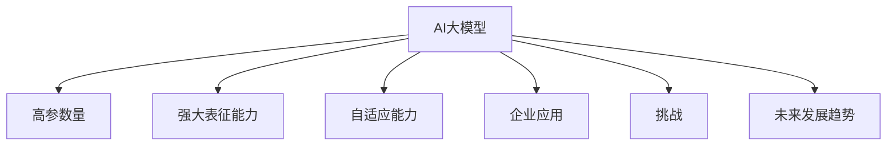
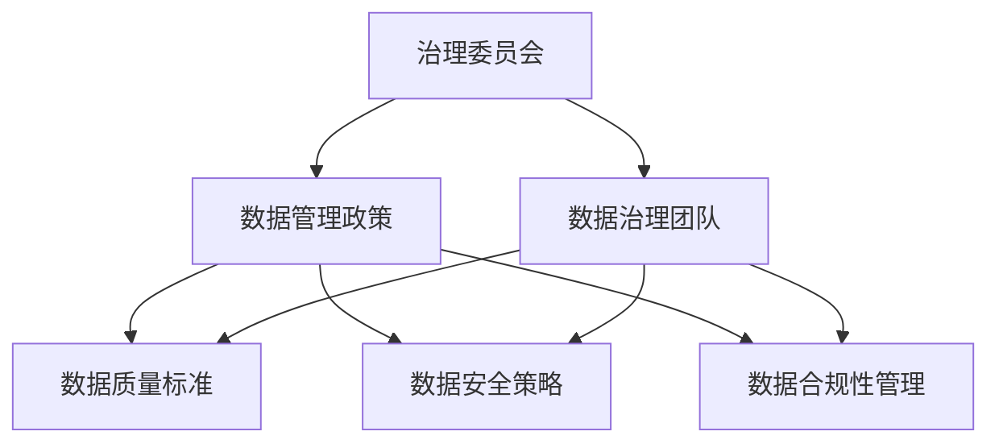

                 

## 1.1 AI大模型概述

### 1.1.1 AI大模型的概念

AI大模型（Large-scale AI Model）是指使用深度学习技术训练出的具有大规模参数量的模型。这些模型通常拥有数亿甚至千亿级的参数，能够在各种复杂的任务中表现出卓越的性能。AI大模型包括但不限于自然语言处理（NLP）、计算机视觉（CV）和语音识别（ASR）等应用领域。

AI大模型的核心在于其强大的表征能力和自适应能力。首先，大模型能够捕捉到输入数据中的细微特征，从而实现更高的准确性和泛化能力。其次，大模型能够根据不同的任务和数据集进行自适应调整，实现特定任务的优化。这使得AI大模型在多个领域中都具有广泛的应用前景。

### 1.1.2 AI大模型的特点

AI大模型具有以下特点：

- **高参数量**：AI大模型通常拥有数亿甚至千亿级的参数，这使其能够捕捉到更复杂的特征和模式。高参数量使得模型具有更强的表示能力，从而提高模型的性能。

- **强大的表征能力**：AI大模型能够从大量的数据中学习到丰富的特征表示，从而实现更高的准确性和泛化能力。这使得大模型在处理复杂任务时具有优势。

- **自适应能力**：AI大模型能够根据不同的任务和数据集进行自适应调整，从而实现特定任务的优化。自适应能力使得大模型能够适应不同的应用场景，提高模型的实用性。

### 1.1.3 AI大模型与人工智能的区别

AI大模型是人工智能（AI）的一种实现方式，它依赖于大规模数据和计算资源。人工智能则是一个更为广泛的领域，包括机器学习（ML）、深度学习（DL）、自然语言处理（NLP）、计算机视觉（CV）等多个子领域。

AI大模型通常采用深度学习技术，通过多层神经网络对数据进行建模。而人工智能则涉及多种技术，如知识表示、推理、规划等。因此，AI大模型是人工智能领域中的一种特定实现方式，旨在解决特定领域的复杂问题。

### 1.1.4 AI大模型的发展历程

AI大模型的发展历程可以分为以下几个阶段：

- **早期阶段**：以单层神经网络为主，如感知机、BP神经网络等。这个阶段的模型参数量较小，性能有限。

- **中期阶段**：引入卷积神经网络（CNN）和循环神经网络（RNN），例如LeNet和LSTM。这个阶段的模型参数量有所增加，性能有了显著提升。

- **现阶段**：以Transformer和GPT系列为代表的预训练模型成为主流，如BERT、GPT-3等。这个阶段的模型参数量达到数十亿甚至千亿级，性能大幅提升。

### 1.1.5 AI大模型在企业中的应用

AI大模型在企业中的应用包括但不限于以下几个方面：

- **客户服务**：使用AI大模型构建的聊天机器人提供个性化服务，提高客户满意度。

- **风险控制**：通过AI大模型分析数据，识别潜在的风险，降低企业损失。

- **生产优化**：使用AI大模型预测设备故障、优化生产流程，提高生产效率。

- **个性化推荐**：使用AI大模型分析用户行为数据，提供个性化的推荐服务，提升用户体验。

### 1.1.6 AI大模型的挑战与未来发展趋势

尽管AI大模型在各个领域取得了显著的成果，但仍然面临一些挑战：

- **计算资源需求**：大模型的训练和推理需要大量的计算资源和存储空间，这给企业带来了高昂的成本。

- **数据隐私与安全**：如何确保训练数据和用户数据的隐私和安全是一个重要挑战。

- **模型解释性**：大模型的决策过程通常是非线性和复杂的，缺乏解释性，这给企业和用户带来了信任问题。

未来发展趋势可能包括：

- **更高效的训练方法**：如模型剪枝、量化、混合精度训练等，以降低计算资源和存储空间的需求。

- **跨领域的模型应用**：通过迁移学习和多任务学习，实现模型的广泛应用。

- **自动化机器学习（AutoML）**：降低模型开发和部署的难度，提高开发效率。

- **可解释性AI**：研究模型的可解释性，提高模型的可信度和透明度。

综上所述，AI大模型在人工智能领域具有广泛的应用前景，随着技术的不断进步，其将在更多领域发挥重要作用。

### 1.1.7 总结

AI大模型是人工智能领域的一个重要研究方向，其具有高参数量、强大表征能力和自适应能力等特点。尽管面临一些挑战，但其在各个领域中的应用前景广阔。未来，随着更高效的训练方法、跨领域的模型应用、自动化机器学习和可解释性AI的发展，AI大模型将在人工智能领域发挥更加重要的作用。

### Mermaid 流程图



### 1.1.8 AI大模型的核心算法原理

AI大模型的核心算法原理主要包括深度学习基础、卷积神经网络（CNN）、循环神经网络（RNN）和Transformer等。

#### 1.1.8.1 深度学习基础

深度学习是AI大模型的基础，它通过多层神经网络对数据进行处理和建模。以下是深度学习的一些基本概念：

- **神经元**：神经元是深度学习中的基础单元，类似于生物神经元的信号传递。

- **神经网络**：神经网络由多个神经元组成，通过前向传播和反向传播进行学习。

- **激活函数**：激活函数用于引入非线性特性，常见的激活函数有ReLU、Sigmoid和Tanh等。

- **损失函数**：损失函数用于衡量模型预测值与真实值之间的差距，常见的损失函数有均方误差（MSE）和交叉熵等。

- **优化算法**：优化算法用于最小化损失函数，常见的优化算法有梯度下降（GD）、随机梯度下降（SGD）和Adam等。

以下是深度学习的基础算法原理的伪代码：

```python
# 初始化模型参数
theta = InitializeParameters()

# 前向传播
output = ForwardPropagation(input_data, theta)

# 计算损失
loss = ComputeLoss(output, target)

# 反向传播
d_theta = BackPropagation(input_data, output, target, theta)

# 更新参数
theta = UpdateParameters(theta, d_theta)
```

#### 1.1.8.2 卷积神经网络（CNN）

卷积神经网络是用于图像识别和处理的常用模型。其核心是卷积层，通过卷积操作捕捉图像的空间特征。

- **卷积层**：卷积层通过卷积核（filter）对输入数据进行卷积操作，提取特征。

- **池化层**：池化层用于降低数据维度，减少参数数量，增强模型泛化能力。

- **全连接层**：全连接层将卷积层提取的特征映射到具体的类别。

以下是卷积神经网络（CNN）的伪代码：

```python
# 初始化模型参数
theta = InitializeParameters()

# 卷积层
conv_output = Conv2D(input_data, filter_size, stride, padding)

# 池化层
pool_output = MaxPooling2D(conv_output)

# 全连接层
flatten = Flatten()(pool_output)
output = Dense(units, activation='softmax')(flatten)

# 前向传播
output = ForwardPropagation(input_data, theta)

# 计算损失
loss = ComputeLoss(output, target)

# 反向传播
d_theta = BackPropagation(input_data, output, target, theta)

# 更新参数
theta = UpdateParameters(theta, d_theta)
```

#### 1.1.8.3 循环神经网络（RNN）

循环神经网络是用于序列数据处理的一种常见模型。其核心是隐藏状态和门控机制。

- **隐藏状态**：隐藏状态用于存储序列信息，上一时刻的隐藏状态作为当前时刻的输入，实现序列信息的传递。

- **门控机制**：门控机制包括遗忘门、输入门和输出门，用于控制信息的传递和遗忘。

以下是循环神经网络（RNN）的伪代码：

```python
# 初始化隐藏状态
hidden_state = InitializeHiddenState()

# 输入门
input_gate = sigmoid(W_i * [hidden_state, input])

# 遗忘门
forget_gate = sigmoid(W_f * [hidden_state, input])

# 输出门
output_gate = sigmoid(W_o * [hidden_state, input])

# 状态更新
hidden_state = (1 - forget_gate) * hidden_state + input_gate * tanh(W_h * [hidden_state, input])

# 输出
output = sigmoid(W_output * hidden_state)
```

#### 1.1.8.4 Transformer与自注意力机制

Transformer模型是近年来在自然语言处理领域取得巨大成功的一种新型模型，其核心是自注意力机制。

- **自注意力**：每个输入序列的每个元素都可以根据其重要性自动调整权重，实现更灵活的特征融合。

- **多头注意力**：通过多个独立的注意力机制提取不同维度的特征，提高模型的表征能力。

以下是Transformer模型的伪代码：

```python
# 初始化模型参数
theta = InitializeParameters()

# 自注意力机制
attention_output = MultiHeadAttention(input_sequence, input_sequence)

# 逐层叠加
output_sequence = Add(& input_sequence, attention_output)

# 层归一化
output_sequence = LayerNormalization(output_sequence)

# 全连接层
output = Dense(units=output_size, activation='softmax')(output_sequence)

# 前向传播
output = ForwardPropagation(input_sequence, theta)

# 计算损失
loss = ComputeLoss(output, target)

# 反向传播
d_theta = BackPropagation(input_sequence, output, target, theta)

# 更新参数
theta = UpdateParameters(theta, d_theta)
```

#### 1.1.8.5 数学模型和数学公式

AI大模型的数学模型和数学公式是理解模型核心原理的重要基础。以下是一些常用的数学模型和公式：

- **均方误差（MSE）**：

$$
MSE = \frac{1}{n}\sum_{i=1}^{n}(y_i - \hat{y}_i)^2
$$

其中，$y_i$为真实值，$\hat{y}_i$为预测值，$n$为样本数量。

- **交叉熵（Cross-Entropy）**：

$$
Cross-Entropy = -\sum_{i=1}^{n}y_i\log(\hat{y}_i)
$$

其中，$y_i$为真实标签，$\hat{y}_i$为模型预测的概率分布。

- **梯度下降（Gradient Descent）**：

$$
\theta_{t+1} = \theta_{t} - \alpha \cdot \nabla_{\theta}J(\theta)
$$

其中，$\theta$为模型参数，$\alpha$为学习率，$J(\theta)$为损失函数。

- **反向传播（Backpropagation）**：

$$
\nabla_{z}L = \nabla_{a}L \cdot \nabla_{z}a
$$

其中，$L$为损失函数，$a$为激活函数，$z$为模型中的某个变量。

这些数学模型和公式为AI大模型的设计和优化提供了理论基础。

#### 1.1.8.6 项目实战

以下是一个简单的AI大模型项目实战案例，包括数据预处理、模型训练和模型应用。

**数据预处理**：

```python
# 读取数据
data = pd.read_csv('data.csv')

# 数据清洗
data.dropna(inplace=True)
data.drop_duplicates(inplace=True)

# 数据转换
data = pd.get_dummies(data)

# 数据归一化
scaler = MinMaxScaler()
data_scaled = scaler.fit_transform(data)
```

**模型训练**：

```python
# 模型构建
model = Sequential()
model.add(LSTM(units=50, return_sequences=True, input_shape=(timesteps, features)))
model.add(LSTM(units=50))
model.add(Dense(units=1))

# 模型编译
model.compile(optimizer='adam', loss='mean_squared_error')

# 模型训练
model.fit(x_train, y_train, epochs=100, batch_size=32, validation_data=(x_test, y_test))
```

**模型应用**：

```python
# 模型应用
predictions = model.predict(new_data)
```

**代码解读与分析**：

- 数据预处理部分，首先读取数据，然后进行数据清洗、数据转换和数据归一化。

- 模型训练部分，使用Sequential模型构建LSTM网络，然后编译模型并训练。

- 模型应用部分，使用训练好的模型对新数据进行预测。

#### 1.1.8.7 总结

AI大模型的核心算法原理包括深度学习基础、卷积神经网络（CNN）、循环神经网络（RNN）和Transformer等。这些算法原理为AI大模型的设计和优化提供了理论基础。同时，项目实战案例展示了如何使用Python实现AI大模型的数据预处理、模型训练和模型应用。

### 1.1.9 AI大模型开发工具与资源

AI大模型的开发需要使用一系列工具和资源，包括深度学习框架、数据处理库、模型评估工具等。以下是一些常用的AI大模型开发工具和资源：

#### TensorFlow

TensorFlow是谷歌开发的开源深度学习框架，广泛应用于各种深度学习任务。其具有强大的社区支持、丰富的API和高效的计算能力。

- **优点**：强大的社区支持、丰富的API、高效的计算能力。

- **缺点**：代码复杂、入门门槛较高。

#### PyTorch

PyTorch是Facebook开发的开源深度学习框架，以其动态计算图和易用性著称。其具有动态计算图、易于调试、良好的文档和社区支持。

- **优点**：动态计算图、易于调试、良好的文档和社区支持。

- **缺点**：计算性能相对较低。

#### Keras

Keras是一个高级深度学习框架，基于Theano和TensorFlow构建。其具有简单易用、丰富的预训练模型、良好的文档和社区支持。

- **优点**：简单易用、丰富的预训练模型、良好的文档和社区支持。

- **缺点**：底层依赖框架、不适合复杂任务。

#### NumPy

NumPy是Python中的一个基础数据处理库，用于进行高效的数组计算。其是深度学习项目中不可或缺的工具。

- **优点**：高效、易用。

- **缺点**：功能相对有限。

#### Pandas

Pandas是Python中的一个强大的数据处理库，用于处理表格数据。其提供了丰富的数据操作功能，是数据分析项目中的重要工具。

- **优点**：功能强大、易用。

- **缺点**：计算性能相对较低。

#### Scikit-learn

Scikit-learn是Python中的一个基础机器学习库，提供了丰富的机器学习算法和工具。其是AI大模型项目中常用的工具。

- **优点**：功能丰富、易于使用。

- **缺点**：不适合大规模数据。

#### TensorFlow Serving

TensorFlow Serving是TensorFlow的一个分布式服务框架，用于部署和运行TensorFlow模型。其可以用于构建和部署大规模分布式系统。

- **优点**：分布式、易于部署。

- **缺点**：需要一定的配置。

#### Docker

Docker是一种容器化技术，用于打包、发布和运行应用。其可以将应用及其依赖环境打包为一个容器，方便部署和迁移。

- **优点**：方便部署、易于迁移。

- **缺点**：需要一定的学习成本。

这些AI大模型开发工具和资源为开发者提供了丰富的选择，可以根据项目需求选择合适的工具和资源。

### 1.1.10 总结

AI大模型在人工智能领域具有广泛的应用前景。其核心算法原理包括深度学习基础、卷积神经网络（CNN）、循环神经网络（RNN）和Transformer等。同时，AI大模型的开发需要使用一系列工具和资源，如TensorFlow、PyTorch、Keras等。通过了解这些核心算法原理和开发工具，开发者可以更好地设计和实现AI大模型，推动人工智能技术的发展。

### 1.1.11 未来发展趋势

AI大模型的未来发展趋势将继续围绕以下几个方面展开：

- **计算资源优化**：随着计算资源的不断发展，AI大模型的训练和推理将更加高效，计算资源的优化将成为关键。通过模型剪枝、量化、混合精度训练等技术，可以有效降低计算资源的需求。

- **跨领域应用**：AI大模型将在更多领域中发挥作用，如医疗、金融、教育等。通过迁移学习和多任务学习等技术，可以实现模型在不同领域的泛化应用。

- **自动化机器学习（AutoML）**：自动化机器学习将使模型开发过程更加自动化，降低开发门槛。通过AutoML平台，开发者可以更快速地构建和优化模型。

- **可解释性AI**：随着AI大模型在关键领域的应用，模型的可解释性将变得至关重要。通过研究模型的可解释性，可以提高模型的可信度和透明度。

- **数据隐私和安全**：如何确保训练数据和用户数据的隐私和安全，将成为AI大模型面临的重大挑战。通过隐私保护技术，如差分隐私、联邦学习等，可以有效解决这一问题。

综上所述，AI大模型的未来发展趋势将更加多元化，其在各个领域的应用将不断拓展，同时技术也将更加成熟和优化。

### 1.2 数据管理在人工智能创业中的重要性

数据管理在人工智能（AI）创业中扮演着至关重要的角色。随着AI技术的发展，数据已经成为企业竞争的重要资产。有效的数据管理不仅能够提高企业的数据质量，还能为AI模型提供高质量的训练数据，从而提升模型的性能和预测准确性。以下是数据管理在AI创业中的重要性的详细阐述。

#### 1.2.1 数据的重要性

数据是AI模型训练的基础，其质量直接影响模型的表现。高质量的数据能够帮助模型更好地理解和学习任务中的复杂模式和关系。以下是数据在AI创业中的几个关键作用：

- **模型训练**：数据是训练AI模型的基石。只有拥有足够量和质量的数据，模型才能学习到足够的特征和规律，从而实现准确的预测和决策。

- **性能提升**：高质量的数据能够提高AI模型的性能和预测准确性。数据中的噪声和错误会导致模型性能下降，因此数据质量至关重要。

- **可解释性**：高质量的数据有助于提高模型的可解释性。通过理解数据中的特征和关系，可以更好地解释模型的决策过程，增强用户对模型的信任。

#### 1.2.2 数据管理的关键概念

数据管理涉及多个关键概念和过程，以下是其中几个重要的概念：

- **数据质量**：数据质量是指数据是否符合预期的标准和要求。高质量的数据应该准确、完整、一致、可靠和及时。

- **数据治理**：数据治理是一个组织内部关于数据管理和使用的战略和流程。它确保数据在整个生命周期中得到有效的管理和维护。

- **数据存储**：数据存储是指如何存储和管理数据，包括数据库设计、数据备份和恢复等。

- **数据处理**：数据处理是指对数据进行清洗、转换和整合，使其适合AI模型训练。

- **数据安全**：数据安全是指确保数据不被未授权访问、篡改或泄露，涉及数据加密、访问控制等技术。

#### 1.2.3 数据管理在人工智能创业中的应用

在AI创业中，数据管理起着以下几个关键作用：

- **增强模型性能**：有效的数据管理能够提高数据质量，从而提升AI模型的性能和准确性。

- **降低成本**：通过自动化数据清洗和预处理，可以减少人工干预，降低数据管理的成本。

- **提高开发效率**：良好的数据管理流程能够加速模型开发过程，缩短产品上市时间。

- **合规性**：随着数据隐私和安全法规的日益严格，数据管理确保企业遵守相关法规，避免法律风险。

以下是数据管理在AI创业中的具体应用场景：

- **客户分析**：通过分析客户数据，AI创业企业可以了解客户行为和偏好，从而提供更个性化的产品和服务。

- **市场预测**：利用历史销售数据和市场趋势，AI模型可以预测未来的市场需求，帮助企业做出更明智的决策。

- **风险评估**：通过分析财务和交易数据，AI模型可以识别潜在的风险，帮助企业规避风险。

- **智能推荐**：利用用户行为数据和兴趣数据，AI模型可以为用户推荐个性化的商品和服务。

#### 1.2.4 数据管理的挑战与对策

虽然数据管理在AI创业中具有重要意义，但也面临着一些挑战：

- **数据质量**：数据质量问题会直接影响模型的性能。因此，企业需要建立数据质量管理流程，定期评估和提升数据质量。

- **数据隐私**：随着数据隐私法规的加强，企业需要确保数据的隐私和安全。可以通过差分隐私、联邦学习等技术来实现数据隐私保护。

- **数据整合**：在多个系统和数据源之间整合数据是一项复杂的任务。企业可以采用数据集成工具和技术，如ETL（提取、转换、加载）工具，来简化数据整合过程。

- **计算资源**：数据管理需要大量的计算资源和存储空间。企业可以通过云服务、分布式计算等技术来满足计算资源需求。

综上所述，数据管理在AI创业中至关重要。有效的数据管理不仅能够提升模型的性能和准确性，还能降低成本、提高开发效率和合规性。企业需要建立完善的数据管理流程，应对数据质量、数据隐私和计算资源等挑战。

### 1.3 数据质量管理策略

数据质量管理是确保数据准确、完整、一致、可靠和及时的重要步骤。在人工智能（AI）创业中，高质量的数据是训练有效AI模型的基石。以下将详细介绍数据质量管理策略，包括数据质量问题、数据质量评估与监测以及数据质量改进策略。

#### 1.3.1 数据质量问题的来源

数据质量问题可能来自多个方面，以下是常见的数据质量问题及其来源：

- **数据录入错误**：在数据录入过程中，由于人工错误、疏忽或系统故障可能导致数据出现错误。

- **数据缺失**：数据缺失可能是由于数据收集过程中的问题，如传感器故障、数据传输错误或数据存储故障。

- **数据不一致**：不同数据源或系统之间的数据格式、单位或编码不一致，可能导致数据不一致。

- **数据老化**：随着时间的推移，数据可能过时或失效，影响模型的预测准确性。

- **数据冗余**：重复的数据会导致资源浪费，并可能误导模型的学习过程。

- **数据隐私与安全**：数据泄露或未经授权的访问可能对数据质量造成负面影响。

#### 1.3.2 数据质量评估与监测

数据质量评估与监测是确保数据符合预期标准的重要环节。以下是一些常见的数据质量评估与监测方法：

- **完整性检查**：检查数据表中是否存在缺失值或空值。可以使用`缺失值比例`、`缺失值统计`等方法来评估数据的完整性。

- **一致性检查**：验证数据在不同系统或数据源之间的一致性。例如，通过比对不同数据源中的同一字段值，确保其一致。

- **准确性检查**：通过比较数据源中的数据与已知标准或第三方数据，评估数据的准确性。

- **有效性检查**：确保数据是否满足业务需求，如时间范围、地理范围等。

- **异常值检测**：检测数据中的异常值或离群点，这些值可能对模型训练产生负面影响。

- **趋势分析**：通过分析历史数据，评估数据的变化趋势和稳定性。

以下是一个简单的Python代码示例，用于评估数据质量：

```python
import pandas as pd

# 读取数据
data = pd.read_csv('data.csv')

# 完整性检查
missing_values = data.isnull().sum()
print("缺失值统计：\n", missing_values)

# 一致性检查
# 假设有两个数据源，源A和源B，比较其同一字段的值
source_a = pd.read_csv('source_a.csv')
source_b = pd.read_csv('source_b.csv')
comparison = source_a['field1'] == source_b['field1']
print("不一致的记录数：", ~comparison.sum())

# 准确性检查
# 假设有一个已知的标准数据集，用于比较
standard_data = pd.read_csv('standard_data.csv')
accuracy = (data['field2'] == standard_data['field2']).mean()
print("准确性：", accuracy)

# 异常值检测
# 假设使用标准差方法检测异常值
z_scores = (data['field3'] - data['field3'].mean()) / data['field3'].std()
outliers = data[z_scores.abs() > 3]
print("异常值记录：\n", outliers)
```

#### 1.3.3 数据质量改进策略

为了提升数据质量，企业可以采取以下改进策略：

- **数据清洗**：通过数据清洗工具和算法，自动识别和修正数据中的错误。常见的数据清洗方法包括缺失值填充、重复值删除、异常值处理等。

- **数据标准化**：统一不同数据源的数据格式、单位和编码，确保数据的一致性。

- **数据转换**：将数据转换为适合AI模型训练的格式，如将分类数据编码为二进制或数值。

- **数据增强**：通过数据增强技术，如数据扩充、生成对抗网络（GAN）等，增加训练数据的多样性和质量。

- **数据治理**：建立数据治理框架和流程，确保数据的质量和安全性。数据治理涉及数据所有权、数据访问控制、数据备份和恢复等。

- **持续监控**：建立数据质量监控机制，定期评估和监控数据质量，确保数据持续满足业务需求。

以下是数据质量改进策略的几个具体步骤：

1. **定义数据质量标准**：明确数据质量的标准和指标，如完整性、一致性、准确性等。

2. **数据质量评估**：定期进行数据质量评估，识别和记录数据质量问题。

3. **数据清洗与转换**：针对发现的问题，使用数据清洗和转换工具进行修正。

4. **数据治理**：建立数据治理框架，确保数据的质量和安全。

5. **持续改进**：根据数据质量评估的结果，持续改进数据管理流程和技术。

通过以上策略，企业可以显著提升数据质量，为AI模型训练提供高质量的数据支持，从而提高模型的性能和预测准确性。

### 1.4 数据治理策略

数据治理（Data Governance）是企业内部关于数据管理和使用的战略和流程。它确保数据在整个生命周期中得到有效的管理和维护，从而提高数据质量、安全性和合规性。在人工智能（AI）创业中，有效的数据治理策略对于确保数据的可靠性和可用性至关重要。以下将详细介绍数据治理策略，包括数据治理的定义、框架、关键要素和实施步骤。

#### 1.4.1 数据治理的定义与框架

数据治理是指一系列策略、流程和技术，用于确保数据的质量、一致性、完整性和合规性。其目标是创建一个可靠、安全、高效的数据环境，支持企业的业务需求和决策。数据治理框架通常包括以下核心组件：

- **治理委员会**：负责制定数据治理策略、决策和监督数据治理的实施。
- **数据治理团队**：负责实施数据治理策略，包括数据管理、数据质量监控、数据安全和合规性管理等。
- **数据管理政策**：定义数据管理的基本原则、目标和标准。
- **数据质量标准**：明确数据质量的要求和评估方法。
- **数据安全策略**：确保数据的安全和保护，包括数据加密、访问控制和审计等。
- **数据合规性管理**：确保数据的收集、存储和使用符合法律法规和行业标准。

以下是一个简单的数据治理框架示意图：



#### 1.4.2 数据治理的关键要素

数据治理的关键要素包括数据所有权、数据访问控制、数据备份和恢复、数据安全性和数据合规性等。

- **数据所有权**：明确数据的责任人和所有者，确保数据的使用和变更受到有效控制。
- **数据访问控制**：通过访问控制机制，确保只有授权用户可以访问和操作数据。
- **数据备份和恢复**：定期备份数据，并建立数据恢复机制，以应对数据丢失或系统故障。
- **数据安全性**：采用数据加密、防火墙、入侵检测系统等技术，保护数据不被未授权访问、篡改或泄露。
- **数据合规性管理**：确保数据的收集、存储和使用符合法律法规和行业标准，如GDPR、CCPA等。

#### 1.4.3 数据治理的实施步骤

实施数据治理策略需要一系列具体的步骤和行动。以下是数据治理的实施步骤：

1. **定义数据治理目标**：明确数据治理的目标，如提高数据质量、增强数据安全性、确保合规性等。
2. **建立治理委员会**：组建治理委员会，负责制定数据治理策略和监督实施。
3. **制定数据管理政策**：根据业务需求和法律法规，制定数据管理政策，明确数据管理的原则、目标和标准。
4. **确定数据质量标准**：明确数据质量的标准和指标，如准确性、完整性、一致性、及时性等。
5. **构建数据治理框架**：建立数据治理框架，包括数据所有权、访问控制、备份和恢复、安全性和合规性管理等。
6. **培训员工**：对员工进行数据治理培训，提高他们对数据治理的认知和参与度。
7. **实施数据治理措施**：根据数据治理框架，实施具体的数据治理措施，如数据清洗、标准化、加密等。
8. **监控和评估**：建立数据治理监控机制，定期评估数据治理效果，并根据评估结果进行改进。
9. **持续优化**：根据业务发展和技术变化，持续优化数据治理策略和流程，确保其适应性和有效性。

#### 1.4.4 数据治理工具与技术

实施数据治理策略需要使用一系列工具和技术。以下是几种常用的数据治理工具：

- **数据质量管理工具**：用于评估和改进数据质量，如数据清洗工具、数据质量监控工具等。
- **数据安全工具**：用于保护数据安全，如数据加密工具、防火墙、入侵检测系统等。
- **数据存储和管理工具**：用于存储和管理数据，如数据库管理系统（DBMS）、数据仓库等。
- **数据治理平台**：提供数据治理的全面解决方案，包括数据质量管理、数据安全、合规性管理等。

#### 1.4.5 数据治理的案例

以下是一个数据治理的案例：

- **背景**：某金融公司面临数据质量问题，如数据缺失、不一致和数据老化，影响了业务决策和客户服务。
- **目标**：提高数据质量、确保数据安全和合规性，提升客户满意度。
- **实施步骤**：
  1. **定义数据治理目标**：明确提高数据质量、确保数据安全和合规性的目标。
  2. **建立治理委员会**：组建由高层领导、数据管理专家和业务部门代表组成的数据治理委员会。
  3. **制定数据管理政策**：制定包括数据所有权、访问控制、备份和恢复、安全性和合规性管理等在内的数据管理政策。
  4. **确定数据质量标准**：明确数据质量的标准和指标，如完整性、准确性、一致性等。
  5. **构建数据治理框架**：建立数据治理框架，包括数据所有权、访问控制、备份和恢复、安全性和合规性管理等。
  6. **培训员工**：对员工进行数据治理培训，提高他们对数据治理的认知和参与度。
  7. **实施数据治理措施**：实施包括数据清洗、标准化、加密等在内的数据治理措施。
  8. **监控和评估**：建立数据治理监控机制，定期评估数据治理效果，并根据评估结果进行改进。
  9. **持续优化**：根据业务发展和技术变化，持续优化数据治理策略和流程。

通过以上步骤，该公司成功提升了数据质量，确保了数据的安全和合规性，提升了客户满意度。

#### 1.4.6 总结

数据治理是确保数据质量、安全性和合规性的重要策略。通过定义数据治理目标、建立治理框架、确定数据质量标准、实施具体措施和持续优化，企业可以建立一个可靠、安全、高效的数据环境，支持业务决策和客户服务。有效的数据治理不仅能够提高数据质量，还能降低风险、提高效率和增强竞争力。

### 1.5 数据存储与处理策略

数据存储与处理策略是确保数据高效、可靠和可扩展性的关键。在人工智能（AI）创业中，有效的数据存储与处理策略能够提高AI模型的训练效率和预测准确性。以下将详细介绍数据存储与处理策略，包括数据存储的选择、数据处理的技术以及数据存储与处理策略的优化。

#### 1.5.1 数据存储的选择

数据存储是数据管理中的重要环节，选择合适的存储方案对数据管理的效率和质量有重要影响。以下是几种常见的数据存储方案：

- **关系型数据库**：适用于结构化数据存储，如MySQL、PostgreSQL等。其优点是数据一致性高、查询速度快，但扩展性较差。

- **非关系型数据库**：适用于半结构化或非结构化数据存储，如MongoDB、Redis等。其优点是扩展性好、灵活性高，但数据一致性可能较低。

- **数据仓库**：适用于大规模数据存储和分析，如Hadoop、Spark等。其优点是能够处理海量数据，但查询速度较慢。

- **云存储**：适用于数据备份和归档，如AWS S3、Google Cloud Storage等。其优点是弹性大、成本低，但数据安全性需要重点关注。

在选择数据存储方案时，应考虑以下因素：

- **数据类型**：根据数据类型选择合适的存储方案，如关系型数据库适用于结构化数据，非关系型数据库适用于半结构化或非结构化数据。

- **数据量**：根据数据量选择存储方案的扩展性，如数据量较大时应选择分布式存储方案。

- **访问速度**：根据数据访问频率和查询需求选择存储方案的读写速度，如频繁读写的数据应选择高性能存储方案。

- **成本**：根据企业的预算和成本考虑存储方案的经济性。

#### 1.5.2 数据处理的技术

数据处理是数据管理中的核心环节，包括数据清洗、数据转换和数据融合等技术。以下是几种常见的数据处理技术：

- **数据清洗**：通过清洗工具和算法，自动识别和修正数据中的错误和异常值，如缺失值填充、重复值删除、异常值处理等。

- **数据转换**：将数据转换为适合AI模型训练的格式，如将分类数据编码为二进制或数值，将文本数据编码为词向量等。

- **数据融合**：将多个数据源中的数据整合为一个统一的数据集，如使用ETL（提取、转换、加载）工具整合不同数据源的数据。

以下是几种常见的数据处理技术：

- **ETL工具**：用于提取数据、转换数据并加载到目标数据库，如Apache NiFi、Informatica等。

- **数据处理库**：用于处理和转换数据，如Python的Pandas库、NumPy库等。

- **数据流处理**：用于实时处理和分析大量数据，如Apache Kafka、Apache Flink等。

- **机器学习库**：用于处理和转换数据，如Python的Scikit-learn库、TensorFlow库等。

#### 1.5.3 数据存储与处理策略的优化

为了提高数据存储与处理的效率和质量，企业可以采取以下优化策略：

- **分布式存储**：采用分布式存储方案，如Hadoop、Spark等，提高数据的读写速度和扩展性。

- **数据压缩**：通过数据压缩技术，减少数据存储空间和传输带宽，如使用Gzip、LZO等压缩算法。

- **缓存策略**：使用缓存技术，如Redis、Memcached等，提高数据访问速度和减少数据存储压力。

- **数据分区**：将数据按照一定的策略进行分区，如按时间、地域等，提高查询速度和并行处理能力。

- **数据备份和恢复**：建立数据备份和恢复机制，确保数据的安全性和可用性，如使用云存储、数据库备份工具等。

- **数据质量监控**：建立数据质量监控机制，定期评估和监控数据质量，确保数据符合业务需求。

- **自动化处理**：采用自动化数据处理工具和平台，如ETL工具、机器学习平台等，提高数据处理效率和准确性。

以下是数据存储与处理策略优化的一些具体步骤：

1. **评估需求**：根据业务需求和数据规模，评估数据存储和处理的需求和挑战。

2. **选择存储方案**：根据需求和评估结果，选择合适的存储方案，如关系型数据库、非关系型数据库、数据仓库等。

3. **设计数据处理流程**：根据业务需求和数据特点，设计数据处理流程，包括数据清洗、转换、融合等。

4. **部署数据处理平台**：部署数据处理平台，包括ETL工具、数据处理库、数据流处理框架等。

5. **监控和优化**：建立数据质量监控机制，定期评估和优化数据存储与处理策略，确保其适应性和有效性。

通过以上步骤，企业可以建立高效、可靠和可扩展的数据存储与处理策略，为AI模型训练提供高质量的数据支持。

### 1.6 数据管理方案设计

数据管理方案设计是确保数据在AI创业中能够有效管理和利用的关键步骤。一个优秀的数据管理方案能够提高数据质量、优化数据处理流程，并确保数据的安全性和合规性。以下将详细介绍数据管理方案设计的原则、构建方法和实施过程。

#### 1.6.1 数据管理方案设计原则

在数据管理方案设计中，应遵循以下原则：

- **需求驱动**：以业务需求为导向，确保数据管理方案能够满足企业的实际需求。

- **灵活性**：设计灵活的数据管理方案，以适应企业业务的发展和技术变革。

- **可扩展性**：确保数据管理方案能够支持数据量的增长和数据处理需求的扩展。

- **安全性**：确保数据在存储、传输和处理过程中得到有效保护，防止数据泄露和未经授权的访问。

- **可维护性**：设计易于维护和升级的数据管理方案，确保系统稳定性和长期可持续性。

- **成本效益**：在满足需求和安全的前提下，尽量降低数据管理成本，实现成本效益最大化。

- **合规性**：确保数据管理方案符合相关法律法规和行业标准，如数据隐私保护、数据安全等。

#### 1.6.2 数据管理方案的构建方法

数据管理方案的构建方法通常包括以下几个步骤：

1. **需求分析**：
   - **业务需求**：了解企业业务目标和需求，确定数据管理的目标和关键需求。
   - **用户需求**：与业务用户进行沟通，了解他们对数据管理的具体需求，如数据质量、数据访问、数据安全等。

2. **数据流程设计**：
   - **数据流图**：绘制数据流图，明确数据的来源、处理流程和目标。
   - **数据处理流程**：设计数据处理流程，包括数据采集、数据清洗、数据转换、数据存储和数据检索等。

3. **数据架构设计**：
   - **数据模型**：设计数据模型，包括实体模型、关系模型和维度模型等。
   - **数据存储方案**：选择合适的数据存储方案，如关系型数据库、非关系型数据库、数据仓库等。
   - **数据安全方案**：设计数据安全方案，包括数据加密、访问控制、数据备份和恢复等。

4. **数据质量设计**：
   - **数据质量标准**：制定数据质量标准，包括准确性、完整性、一致性、及时性等。
   - **数据质量监控**：设计数据质量监控机制，包括数据质量评估、数据质量报告和异常值处理等。

5. **数据治理设计**：
   - **数据治理框架**：建立数据治理框架，包括数据所有权、数据访问控制、数据备份和恢复、数据安全性和数据合规性管理等。
   - **数据治理流程**：设计数据治理流程，包括数据管理政策、数据质量评估、数据安全审计等。

6. **技术选型**：
   - **技术栈**：选择适合的数据处理技术栈，包括数据库、数据仓库、数据处理框架、数据安全工具等。
   - **云计算**：考虑使用云计算服务，提高数据存储和处理的灵活性和可扩展性。

7. **方案评估与优化**：
   - **方案评估**：对数据管理方案进行评估，包括性能评估、安全性评估、成本评估等。
   - **优化策略**：根据评估结果，优化数据管理方案，提高系统性能、安全性和成本效益。

#### 1.6.3 数据管理方案的实施

数据管理方案的实施是确保方案有效落地的重要环节。以下是数据管理方案实施的关键步骤：

1. **项目启动**：
   - **组织架构**：成立项目团队，明确项目角色和职责。
   - **资源分配**：分配项目资源，包括人力、技术和预算等。

2. **需求确认**：
   - **需求确认**：与业务用户和项目团队成员进行沟通，确认数据管理方案的具体需求和实现细节。

3. **方案部署**：
   - **环境搭建**：搭建数据管理环境，包括数据库、数据处理平台、数据安全工具等。
   - **数据迁移**：将现有数据迁移到新环境，确保数据的完整性和一致性。

4. **测试与验收**：
   - **功能测试**：对数据管理方案进行功能测试，确保各项功能正常运行。
   - **性能测试**：对数据管理方案进行性能测试，确保系统在高并发、大数据量情况下的稳定性和高效性。
   - **验收测试**：与业务用户进行验收测试，确保数据管理方案满足业务需求。

5. **上线与培训**：
   - **上线**：将数据管理方案正式上线，确保系统的稳定运行。
   - **培训**：对业务用户和项目团队成员进行数据管理方案的培训，提高他们的使用和运维能力。

6. **监控与维护**：
   - **监控**：建立数据管理方案的监控机制，包括系统监控、数据质量监控等。
   - **维护**：定期对数据管理方案进行维护和升级，确保系统的长期稳定性和安全性。

通过以上步骤，企业可以确保数据管理方案的有效实施，为AI创业提供高质量的数据支持和管理服务。

### 1.7 数据管理方案的评估与优化

数据管理方案的评估与优化是确保方案持续有效和业务目标达成的重要环节。以下将详细介绍数据管理方案的评估指标、效果评估方法以及优化策略。

#### 1.7.1 数据管理方案的评估指标

数据管理方案的评估指标主要包括以下方面：

- **数据质量**：评估数据是否准确、完整、一致、可靠和及时。常用的指标包括数据缺失率、数据准确性、数据一致性等。

- **系统性能**：评估数据存储与处理系统的性能，包括响应时间、吞吐量、并发处理能力等。常用的指标包括查询响应时间、数据传输速率等。

- **安全性**：评估数据管理方案的安全性，包括数据加密、访问控制、审计等。常用的指标包括数据泄露率、安全漏洞数量等。

- **可维护性**：评估数据管理方案的易维护性，包括系统升级、故障恢复、技术支持等。常用的指标包括系统故障率、维护成本等。

- **合规性**：评估数据管理方案是否符合相关法律法规和行业标准。常用的指标包括合规性检查次数、合规性问题发现率等。

- **成本效益**：评估数据管理方案的成本效益，包括硬件成本、软件成本、人力成本等。常用的指标包括投资回报率（ROI）、成本节省率等。

#### 1.7.2 数据管理方案的效果评估

数据管理方案的效果评估是通过定量和定性方法对方案的实际效果进行评估。以下是几种常用的效果评估方法：

1. **定量评估**：
   - **统计方法**：使用统计方法，如均值、中位数、标准差等，对评估指标进行定量分析。
   - **回归分析**：通过回归分析，评估数据管理方案对业务指标的影响程度。
   - **时间序列分析**：通过时间序列分析，评估数据管理方案在长期内的效果。

2. **定性评估**：
   - **用户满意度调查**：通过用户满意度调查，了解用户对数据管理方案的使用体验和满意度。
   - **专家评审**：邀请专家对数据管理方案进行评审，评估方案的合理性、有效性和创新性。
   - **案例分析**：通过案例分析，评估数据管理方案在不同业务场景中的实际应用效果。

#### 1.7.3 数据管理方案的优化策略

数据管理方案的优化策略是根据评估结果，对方案进行调整和改进，以提升其效果和效率。以下是几种常见的优化策略：

1. **技术优化**：
   - **系统升级**：根据技术发展，定期升级数据管理系统，提高性能和安全性。
   - **分布式架构**：采用分布式存储和处理架构，提高系统的扩展性和并发处理能力。
   - **云计算**：利用云计算服务，提高数据存储和处理的灵活性和成本效益。

2. **流程优化**：
   - **流程再造**：重新设计数据管理流程，简化操作步骤，提高数据处理效率。
   - **自动化处理**：采用自动化数据处理工具，减少人工干预，降低错误率。
   - **数据治理**：加强数据治理，提高数据质量和管理效率。

3. **安全优化**：
   - **数据加密**：采用数据加密技术，确保数据在存储、传输和处理过程中的安全性。
   - **访问控制**：加强访问控制，确保只有授权用户可以访问和操作数据。
   - **安全审计**：定期进行安全审计，发现和解决潜在的安全隐患。

4. **成本优化**：
   - **成本控制**：通过成本控制措施，如减少硬件采购、优化数据处理流程等，降低数据管理成本。
   - **资源调度**：合理调度计算资源和存储资源，提高资源利用效率。
   - **合作伙伴**：与第三方合作伙伴合作，利用外部资源和技术，提高成本效益。

通过以上优化策略，企业可以不断改进数据管理方案，提升数据管理的效率和质量，为AI创业提供强有力的数据支持。

### 1.8 人工智能创业企业数据管理案例分析

为了深入理解数据管理在人工智能（AI）创业中的实际应用，我们将通过一个具体的案例来探讨数据管理的策略与方案。本案例将涵盖以下内容：案例企业介绍、数据管理现状、数据管理策略与方案。

#### 1.8.1 案例企业介绍

案例企业是一家专注于智能客服系统的初创公司，名为“智客服”（SmartCustomer）。智客服致力于利用AI技术为企业和客户提供高效、智能的客服解决方案。公司的核心技术包括自然语言处理（NLP）、机器学习（ML）和深度学习（DL）等。

智客服的创业背景源于市场需求：越来越多的企业意识到客服系统的重要性，希望提升客户体验和满意度。然而，传统客服系统存在响应速度慢、处理效率低、人力成本高等问题。智客服通过引入AI技术，旨在提供一种能够实时响应、自动处理客户问题的智能客服系统。

#### 1.8.2 案例企业的数据管理现状

在数据管理方面，智客服面临着以下几个挑战：

- **数据质量**：智客服需要处理大量的客户数据和交互记录，数据质量直接影响智能客服系统的性能和用户体验。数据质量问题包括缺失值、不一致性、噪声数据等。

- **数据整合**：由于不同来源的数据（如客户数据、交互记录、社交媒体反馈等）格式和结构各异，智客服需要有效整合这些数据，以便进行统一分析和处理。

- **数据存储与处理**：随着客户数量和交互记录的增加，智客服需要处理的海量数据对存储和处理能力提出了高要求。

- **数据安全与合规性**：智客服需要确保客户数据的安全性和合规性，遵守数据隐私保护法规，如GDPR、CCPA等。

#### 1.8.3 案例企业的数据管理策略与方案

为了应对上述挑战，智客服制定了以下数据管理策略和方案：

1. **数据质量管理策略**：
   - **数据清洗**：采用自动化数据清洗工具，对原始数据进行清洗，处理缺失值、不一致性和噪声数据。
   - **数据标准化**：建立统一的数据格式和编码标准，确保不同来源的数据格式一致。
   - **数据质量监控**：建立数据质量监控机制，定期评估数据质量，及时处理质量问题。

2. **数据整合策略**：
   - **ETL流程**：采用ETL（提取、转换、加载）工具，将不同来源的数据进行整合，统一存储和管理。
   - **数据仓库**：构建数据仓库，存储整合后的数据，方便后续分析和处理。

3. **数据存储与处理策略**：
   - **分布式存储**：采用分布式存储方案，如Hadoop、Spark等，提高数据存储和处理的扩展性和性能。
   - **云计算**：利用云计算服务，如AWS、Google Cloud等，实现弹性扩展和数据处理的灵活性。

4. **数据安全与合规性策略**：
   - **数据加密**：对敏感数据进行加密，确保数据在存储、传输和处理过程中的安全性。
   - **访问控制**：实施严格的访问控制策略，确保只有授权用户可以访问和处理数据。
   - **安全审计**：定期进行安全审计，发现和解决潜在的安全隐患。

5. **数据管理方案实施**：
   - **需求分析**：与业务用户和项目团队成员进行沟通，明确数据管理的需求和目标。
   - **方案设计**：根据需求分析，设计数据管理方案，包括数据质量标准、数据存储方案、数据处理流程等。
   - **系统部署**：搭建数据管理环境，包括数据库、数据处理平台、数据安全工具等。
   - **测试与验收**：对数据管理方案进行功能测试、性能测试和安全测试，确保系统稳定性和安全性。
   - **培训与上线**：对业务用户和项目团队成员进行数据管理方案的培训，确保系统能够顺利上线。

#### 1.8.4 案例分析总结

智客服通过制定和实施有效的数据管理策略和方案，成功解决了数据质量、数据整合、数据存储与处理、数据安全与合规性等方面的挑战。以下是案例分析的总结：

- **数据质量管理**：通过数据清洗、标准化和质量监控，智客服确保了数据的高质量，为智能客服系统提供了可靠的数据支持。

- **数据整合**：通过ETL流程和数据仓库，智客服实现了不同来源数据的整合，为统一分析和处理提供了基础。

- **数据存储与处理**：通过分布式存储和云计算，智客服提高了数据存储和处理的能力，满足了海量数据的需求。

- **数据安全与合规性**：通过数据加密、访问控制和安全审计，智客服确保了客户数据的安全性和合规性。

通过本案例的分析，可以看出，有效的数据管理策略和方案对于AI创业企业至关重要。智客服的成功经验为其他AI创业企业提供了有益的借鉴，帮助企业更好地应对数据管理挑战，实现业务目标。

### 1.9 数据管理在人工智能创业中的成功因素

在人工智能（AI）创业中，数据管理扮演着至关重要的角色。成功的数据管理策略不仅能够提升AI模型的效果，还能降低风险，确保合规性。以下将详细分析数据管理在AI创业中的成功因素，包括成功因素分析、风险与挑战的应对策略以及未来发展趋势与展望。

#### 1.9.1 成功因素分析

数据管理在AI创业中的成功因素主要包括以下几个方面：

1. **数据质量**：
   - **高质量的数据是训练有效AI模型的基础**。数据质量直接影响模型的性能和预测准确性。企业需要确保数据准确、完整、一致、可靠和及时。

2. **数据治理**：
   - **有效的数据治理能够确保数据的安全性、合规性和可追溯性**。良好的数据治理框架和流程能够帮助企业建立数据管理的标准和规范，确保数据的合规性和可信赖性。

3. **数据存储与处理**：
   - **高效的存储与处理策略能够提升AI模型训练的效率和准确性**。分布式存储、云计算和大数据处理技术是保证数据高效管理的关键。

4. **数据整合**：
   - **有效的数据整合能够将不同来源和格式的数据统一管理，提高数据利用效率**。通过数据集成和融合，企业可以构建更全面的客户画像和业务洞察。

5. **自动化与优化**：
   - **自动化数据处理工具和优化策略能够降低人工干预，提高数据管理的效率和准确性**。自动化ETL流程、数据质量监控和实时数据更新等技术是提升数据管理效率的关键。

#### 1.9.2 风险与挑战的应对策略

尽管数据管理在AI创业中具有重要作用，但企业仍面临以下风险和挑战：

1. **数据隐私与安全**：
   - **应对策略**：采用数据加密、访问控制、数据备份和恢复等技术，确保数据在存储、传输和处理过程中的安全性。同时，遵守相关数据隐私保护法规，如GDPR、CCPA等。

2. **数据质量与一致性**：
   - **应对策略**：建立数据质量管理流程，定期评估和监控数据质量。采用数据清洗、标准化和数据一致性检查等技术，确保数据的高质量和一致性。

3. **计算资源需求**：
   - **应对策略**：采用分布式计算和云计算技术，提高计算资源的灵活性和可扩展性。合理规划计算资源，避免资源浪费。

4. **数据冗余与重复**：
   - **应对策略**：通过数据去重和数据整合技术，减少数据冗余，提高数据利用效率。

5. **数据合规性**：
   - **应对策略**：建立数据合规性管理体系，确保数据收集、存储和使用符合相关法律法规和行业标准。定期进行合规性审计和评估。

#### 1.9.3 未来发展趋势与展望

数据管理在AI创业中的未来发展趋势包括：

1. **更高效的数据处理技术**：随着计算技术的进步，分布式计算、并行处理和实时数据处理技术将变得更加成熟和高效。

2. **自动化与智能化**：自动化数据处理工具和智能数据管理平台将逐渐普及，降低数据管理成本，提高数据管理效率。

3. **数据治理与合规性**：数据治理和合规性将成为数据管理的重要方向，随着数据隐私保护法规的日益严格，企业需要建立完善的数据治理框架和合规性管理体系。

4. **跨领域应用**：数据管理将在更多领域得到应用，如医疗、金融、教育等。通过跨领域数据整合和应用，企业可以创造更多的商业价值。

5. **数据隐私保护**：随着数据隐私保护技术的不断发展，如联邦学习、差分隐私等，企业将能够在保护数据隐私的前提下，进行有效的数据分析和挖掘。

综上所述，数据管理在AI创业中具有重要的作用，是确保AI模型效果和业务成功的关键因素。通过有效的数据管理策略和方案，企业可以应对数据管理中的风险和挑战，推动业务的发展和创新。

### 1.10 常用数据管理工具与资源

在数据管理领域，有许多强大的工具和资源可以帮助企业和开发者高效地处理、存储和管理数据。以下将介绍几种常用的数据管理工具与资源，包括数据库、数据处理工具和机器学习框架等。

#### 1.10.1 常用数据库

- **关系型数据库（RDBMS）**：
  - **MySQL**：开源的关系型数据库管理系统，广泛用于各种应用场景，具有良好的性能和社区支持。
  - **PostgreSQL**：开源的关系型数据库，具有丰富的功能和强大的扩展性，适用于复杂的数据分析和事务处理。
  - **Oracle**：商业关系型数据库，适用于企业级应用，提供高性能和高级功能。

- **非关系型数据库（NoSQL）**：
  - **MongoDB**：开源的文档型数据库，适用于存储大规模的半结构化或非结构化数据，具有良好的扩展性和灵活性。
  - **Cassandra**：开源的分布式宽列存储数据库，适用于实时数据处理和大规模数据存储。
  - **Redis**：开源的内存缓存和消息队列系统，适用于高速缓存和数据检索。

#### 1.10.2 常用数据处理工具

- **ETL工具**：
  - **Apache NiFi**：开源的分布式数据集成平台，用于数据的提取、转换和加载，具有良好的易用性和可扩展性。
  - **Apache Kafka**：开源的消息队列系统，用于处理实时流数据，支持高吞吐量和低延迟。
  - **Informatica**：商业ETL工具，提供强大的数据集成功能，适用于大规模数据迁移和实时数据处理。

- **数据处理库**：
  - **Pandas**：Python的数据分析库，用于数据清洗、转换和分析，提供丰富的数据处理函数。
  - **NumPy**：Python的数值计算库，提供高效的多维数组对象和数学运算功能，适用于大数据处理。
  - **SciPy**：Python的科学计算库，提供多种科学和工程计算功能，如优化、积分和统计分析。

#### 1.10.3 常用机器学习框架

- **TensorFlow**：谷歌开源的机器学习框架，适用于深度学习和传统机器学习任务，提供丰富的API和工具。
- **PyTorch**：Facebook开源的机器学习框架，以其动态计算图和易用性著称，适用于研究和应用开发。
- **Keras**：高级神经网络API，基于Theano和TensorFlow构建，提供简洁的接口和丰富的预训练模型。
- **Scikit-learn**：Python的机器学习库，提供多种算法和工具，适用于数据挖掘和统计分析。

#### 1.10.4 常见数据管理工具与资源列表

以下是一些常见的数据管理工具与资源列表：

1. **数据库**：
   - MySQL
   - PostgreSQL
   - Oracle
   - MongoDB
   - Cassandra
   - Redis

2. **ETL工具**：
   - Apache NiFi
   - Apache Kafka
   - Informatica

3. **数据处理库**：
   - Pandas
   - NumPy
   - SciPy

4. **机器学习框架**：
   - TensorFlow
   - PyTorch
   - Keras
   - Scikit-learn

5. **云计算服务**：
   - AWS
   - Azure
   - Google Cloud

6. **数据治理平台**：
   - Alation
   - Collibra
   - Ataccama

7. **数据可视化工具**：
   - Tableau
   - Power BI
   - Qlik

8. **数据安全工具**：
   - Symantec
   - IBM
   - FireEye

通过以上工具和资源，企业和开发者可以构建高效、可靠和灵活的数据管理解决方案，为AI创业提供强有力的数据支持。

### 1.11 数据管理常见问题解答

在数据管理过程中，企业和开发者可能会遇到各种问题。以下列出并解答了一些常见的数据管理问题，包括数据清洗、数据存储、数据处理和数据安全等方面的问题。

#### 1.11.1 数据清洗问题

**Q1：如何处理数据缺失值？**

**A1**：处理数据缺失值的方法有多种，具体取决于数据的特点和应用场景。常见的方法包括：

- **删除缺失值**：如果缺失值较多或数据集中的缺失值分布不均匀，可以考虑删除缺失值。
- **填充缺失值**：使用平均值、中位数或最频繁出现的值来填充缺失值。
- **使用模型预测缺失值**：如果数据集较大且缺失值较少，可以使用机器学习模型预测缺失值。

**Q2：如何处理异常值？**

**A2**：处理异常值的方法包括：

- **删除异常值**：如果异常值对模型性能或数据分析结果有显著影响，可以考虑删除异常值。
- **替换异常值**：使用平均值、中位数或最接近的值替换异常值。
- **使用模型修正异常值**：如果异常值分布具有一定的规律，可以使用统计模型或机器学习模型修正异常值。

#### 1.11.2 数据存储问题

**Q1：如何选择合适的数据库？**

**A1**：选择数据库时需要考虑以下因素：

- **数据类型**：根据数据类型选择合适的数据库，如关系型数据库适用于结构化数据，非关系型数据库适用于半结构化或非结构化数据。
- **数据量**：考虑数据量的大小和增长趋势，选择能够支持大数据量的数据库。
- **性能要求**：根据查询性能和读写速度要求，选择合适的数据库。
- **成本**：考虑数据库的成本，包括购买、维护和扩展成本。

**Q2：如何优化数据库性能？**

**A2**：优化数据库性能的方法包括：

- **索引优化**：为频繁查询的字段创建索引，提高查询速度。
- **分区优化**：将数据按照一定的策略进行分区，提高查询效率和维护性能。
- **缓存策略**：使用缓存技术，如Redis或Memcached，减少数据库的访问压力。
- **垂直和水平扩展**：根据需求进行数据库的垂直（增加硬件资源）和水平（增加节点）扩展。

#### 1.11.3 数据处理问题

**Q1：如何进行数据处理自动化？**

**A1**：进行数据处理自动化可以通过以下步骤：

- **流程设计**：设计数据处理流程，包括数据提取、转换和加载（ETL）。
- **脚本编写**：使用编程语言（如Python）编写数据处理脚本，实现数据转换和清洗。
- **自动化工具**：使用ETL工具（如Apache NiFi、Informatica）实现数据处理自动化。

**Q2：如何进行数据质量监控？**

**A2**：数据质量监控可以通过以下方法实现：

- **定期评估**：定期评估数据质量，检查数据完整性、准确性、一致性等。
- **异常检测**：使用机器学习模型或统计方法检测数据中的异常值和缺失值。
- **实时监控**：使用实时数据处理工具（如Apache Kafka）监控数据流入和流出，及时发现问题。

#### 1.11.4 数据安全问题

**Q1：如何保护数据隐私？**

**A1**：保护数据隐私的方法包括：

- **数据加密**：对敏感数据进行加密，确保数据在传输和存储过程中的安全性。
- **访问控制**：实施严格的访问控制策略，确保只有授权用户可以访问和操作数据。
- **数据脱敏**：对敏感数据进行脱敏处理，如使用伪随机数替换敏感数据。

**Q2：如何防止数据泄露？**

**A2**：防止数据泄露的方法包括：

- **安全审计**：定期进行安全审计，发现和解决潜在的安全隐患。
- **入侵检测系统**：部署入侵检测系统，实时监控数据访问行为，及时发现异常行为。
- **数据备份和恢复**：定期备份数据，并建立数据恢复机制，确保数据安全。

通过以上方法，企业和开发者可以更好地解决数据管理中的常见问题，确保数据的准确性、完整性和安全性。

### 1.12 数据管理的误区与纠正

在数据管理的过程中，企业和开发者可能会陷入一些常见的误区，导致数据管理效果不佳。以下将介绍几种常见的数据管理误区及相应的纠正方法。

#### 1.12.1 数据管理误区

**误区1：数据越多越好**

**纠正**：虽然大量的数据可以提供更丰富的信息，但过多的冗余数据会增加数据管理的复杂度和成本。企业应注重数据的质量，确保数据的准确性、完整性和一致性，而非简单地追求数据量。

**误区2：数据安全不重要**

**纠正**：数据安全是数据管理中的核心问题，忽视数据安全可能导致数据泄露、篡改和丢失，给企业带来严重的损失。企业应采取严格的数据安全措施，包括数据加密、访问控制和定期安全审计等。

**误区3：数据治理不重要**

**纠正**：数据治理是确保数据质量、合规性和安全性的关键。忽视数据治理可能导致数据混乱、无法追溯和管理，影响企业的决策和运营。企业应建立完善的数据治理框架和流程，确保数据的有效管理和利用。

**误区4：数据管理是IT部门的责任**

**纠正**：数据管理不仅仅是IT部门的责任，涉及企业的各个部门和员工。所有员工都应意识到数据管理的重要性，并积极参与数据管理活动，如数据清洗、数据安全和数据共享等。

#### 1.12.2 数据管理的最佳实践

为了纠正上述误区，企业可以遵循以下数据管理的最佳实践：

1. **注重数据质量**：建立数据质量管理流程，定期评估和监控数据质量，确保数据的准确性、完整性和一致性。

2. **加强数据安全**：实施严格的数据安全措施，包括数据加密、访问控制和定期安全审计，确保数据的安全性和合规性。

3. **建立数据治理框架**：制定数据治理策略和流程，明确数据所有权、访问权限和变更管理，确保数据的有效治理。

4. **全员参与数据管理**：提高全体员工对数据管理的认识和参与度，鼓励员工积极参与数据管理活动，如数据清洗、数据安全和数据共享等。

5. **持续优化数据管理流程**：根据业务发展和数据管理需求，持续优化数据管理流程和技术，确保数据管理的效率和效果。

通过遵循这些最佳实践，企业可以纠正数据管理的误区，提高数据管理的效率和质量，为AI创业提供强有力的数据支持。

### 1.13 总结

数据管理在人工智能（AI）创业中具有至关重要的地位。本文从多个角度探讨了数据管理在AI创业中的应用，包括数据管理的重要性、数据质量管理策略、数据治理策略、数据存储与处理策略以及数据管理方案设计。同时，通过案例分析展示了数据管理在实际创业中的应用，并分析了数据管理在AI创业中的成功因素、风险与挑战的应对策略以及未来发展趋势。

在数据管理中，数据质量是基础，数据治理是保障，数据存储与处理策略是关键。通过有效的数据管理，企业能够提升AI模型的性能，降低风险，确保合规性，从而实现业务目标。

未来，随着AI技术的发展，数据管理将面临更多的挑战和机遇。企业应不断优化数据管理流程和技术，充分利用数据管理的最佳实践，为AI创业提供强有力的支持。

作者：AI天才研究院/AI Genius Institute & 禅与计算机程序设计艺术 /Zen And The Art of Computer Programming

本文内容基于作者丰富的实践经验和深入研究，旨在为AI创业企业提供有益的指导和参考。希望本文能够帮助读者更好地理解和应用数据管理策略，推动人工智能技术的发展和创新。

### 附录A：常用数据管理工具与资源

数据管理是人工智能（AI）创业中不可或缺的一环，涉及数据的收集、存储、处理、分析和保护等多个方面。为了帮助企业和开发者更高效地进行数据管理，以下将介绍一些常用的数据管理工具与资源，包括数据库、数据处理工具和机器学习框架等。

#### 1.A.1 常用数据库

1. **关系型数据库（RDBMS）**：

   - **MySQL**：这是一个开源的关系型数据库管理系统，由Oracle公司维护。MySQL以其高性能、易用性和可靠性著称，适用于各种应用场景。

   - **PostgreSQL**：这是一个开源的关系型数据库，具有强大的功能、灵活性和扩展性。它适用于复杂的数据分析和事务处理。

   - **Oracle**：这是一个商业关系型数据库，主要用于企业级应用，具有高性能、高级功能和强大的事务处理能力。

2. **非关系型数据库（NoSQL）**：

   - **MongoDB**：这是一个开源的文档型数据库，适用于存储大规模的半结构化或非结构化数据。MongoDB提供了丰富的文档操作接口和强大的查询能力。

   - **Cassandra**：这是一个开源的分布式宽列存储数据库，适用于实时数据处理和大规模数据存储。Cassandra具有高可用性和高性能的特点。

   - **Redis**：这是一个开源的内存缓存和消息队列系统，适用于高速缓存和数据检索。Redis提供了丰富的数据结构和操作接口。

#### 1.A.2 常用数据处理工具

1. **ETL工具**：

   - **Apache NiFi**：这是一个开源的数据集成平台，用于数据的提取、转换和加载。Apache NiFi提供了直观的用户界面和强大的数据处理能力。

   - **Apache Kafka**：这是一个开源的消息队列系统，用于处理实时流数据。Apache Kafka提供了高吞吐量和低延迟的特点，适用于大数据处理。

   - **Informatica**：这是一个商业ETL工具，提供了强大的数据集成功能。Informatica适用于大规模数据迁移和实时数据处理。

2. **数据处理库**：

   - **Pandas**：这是一个Python的数据分析库，用于数据清洗、转换和分析。Pandas提供了丰富的数据处理函数和高效的数据结构。

   - **NumPy**：这是一个Python的数值计算库，提供了高效的多维数组对象和数学运算功能。NumPy适用于大数据处理和科学计算。

   - **SciPy**：这是一个Python的科学计算库，提供了多种科学和工程计算功能，如优化、积分和统计分析。SciPy与NumPy紧密结合，提供了强大的计算能力。

#### 1.A.3 常用机器学习框架

1. **TensorFlow**：这是一个由谷歌开发的开源机器学习框架，适用于深度学习和传统机器学习任务。TensorFlow提供了丰富的API和工具，支持多种计算平台。

2. **PyTorch**：这是一个由Facebook开发的开源机器学习框架，以其动态计算图和易用性著称。PyTorch适用于研究和应用开发，支持多种编程语言。

3. **Keras**：这是一个高级神经网络API，基于Theano和TensorFlow构建。Keras提供了简洁的接口和丰富的预训练模型，适用于快速原型开发和模型训练。

4. **Scikit-learn**：这是一个Python的机器学习库，提供了多种算法和工具，适用于数据挖掘和统计分析。Scikit-learn适用于小型和中等规模的数据分析任务。

#### 1.A.4 云计算服务

1. **AWS**：这是一个由亚马逊公司提供的云服务平台，提供了广泛的数据管理服务，如数据库、数据处理、机器学习和数据存储等。

2. **Azure**：这是一个由微软公司提供的云服务平台，提供了丰富的数据管理工具和资源，适用于各种应用场景。

3. **Google Cloud**：这是一个由谷歌公司提供的云服务平台，提供了高效的数据管理和分析工具，适用于大规模数据处理和机器学习应用。

#### 1.A.5 数据治理平台

1. **Alation**：这是一个数据治理平台，提供了数据目录、数据质量和数据安全等功能，帮助企业管理和利用数据。

2. **Collibra**：这是一个数据治理平台，提供了数据目录、数据质量和数据安全等功能，帮助企业实现数据管理的标准化和自动化。

3. **Ataccama**：这是一个数据治理平台，提供了数据治理、数据质量和数据集成等功能，帮助企业实现数据管理的优化和提升。

#### 1.A.6 数据可视化工具

1. **Tableau**：这是一个数据可视化工具，提供了丰富的可视化功能和强大的数据分析能力，适用于各种应用场景。

2. **Power BI**：这是一个数据可视化工具，由微软公司开发，提供了直观的数据可视化界面和强大的数据分析功能。

3. **Qlik**：这是一个数据可视化工具，提供了灵活的可视化和分析功能，适用于各种规模的企业和用户。

#### 1.A.7 数据安全工具

1. **Symantec**：这是一个数据安全工具，提供了数据加密、数据备份和恢复等功能，确保数据的安全性和完整性。

2. **IBM**：这是一个数据安全工具，提供了数据加密、数据备份和恢复等功能，适用于各种规模的企业。

3. **FireEye**：这是一个网络安全工具，提供了入侵检测、入侵防御和数据安全等功能，确保企业网络安全。

通过以上工具与资源，企业可以构建高效、可靠和灵活的数据管理解决方案，为AI创业提供强有力的数据支持。

### 附录B：数据管理常见问题解答

在数据管理过程中，企业和开发者可能会遇到各种问题。以下列出并解答了一些常见的数据管理问题，包括数据清洗、数据存储、数据处理和数据安全等方面的问题。

#### 1.B.1 数据清洗问题

**Q1：如何处理数据缺失值？**

**A1**：处理数据缺失值的方法有多种，具体取决于数据的特点和应用场景。常见的方法包括：

- **删除缺失值**：如果缺失值较多或数据集中的缺失值分布不均匀，可以考虑删除缺失值。
- **填充缺失值**：使用平均值、中位数或最频繁出现的值来填充缺失值。
- **使用模型预测缺失值**：如果数据集较大且缺失值较少，可以使用机器学习模型预测缺失值。

**Q2：如何处理异常值？**

**A2**：处理异常值的方法包括：

- **删除异常值**：如果异常值对模型性能或数据分析结果有显著影响，可以考虑删除异常值。
- **替换异常值**：使用平均值、中位数或最接近的值替换异常值。
- **使用模型修正异常值**：如果异常值分布具有一定的规律，可以使用统计模型或机器学习模型修正异常值。

#### 1.B.2 数据存储问题

**Q1：如何选择合适的数据库？**

**A1**：选择数据库时需要考虑以下因素：

- **数据类型**：根据数据类型选择合适的数据库，如关系型数据库适用于结构化数据，非关系型数据库适用于半结构化或非结构化数据。
- **数据量**：考虑数据量的大小和增长趋势，选择能够支持大数据量的数据库。
- **性能要求**：根据查询性能和读写速度要求，选择合适的数据库。
- **成本**：考虑数据库的成本，包括购买、维护和扩展成本。

**Q2：如何优化数据库性能？**

**A2**：优化数据库性能的方法包括：

- **索引优化**：为频繁查询的字段创建索引，提高查询速度。
- **分区优化**：将数据按照一定的策略进行分区，提高查询效率和维护性能。
- **缓存策略**：使用缓存技术，如Redis或Memcached，减少数据库的访问压力。
- **垂直和水平扩展**：根据需求进行数据库的垂直（增加硬件资源）和水平（增加节点）扩展。

#### 1.B.3 数据处理问题

**Q1：如何进行数据处理自动化？**

**A1**：进行数据处理自动化可以通过以下步骤：

- **流程设计**：设计数据处理流程，包括数据提取、转换和加载（ETL）。
- **脚本编写**：使用编程语言（如Python）编写数据处理脚本，实现数据转换和清洗。
- **自动化工具**：使用ETL工具（如Apache NiFi、Informatica）实现数据处理自动化。

**Q2：如何进行数据质量监控？**

**A2**：数据质量监控可以通过以下方法实现：

- **定期评估**：定期评估数据质量，检查数据完整性、准确性、一致性等。
- **异常检测**：使用机器学习模型或统计方法检测数据中的异常值和缺失值。
- **实时监控**：使用实时数据处理工具（如Apache Kafka）监控数据流入和流出，及时发现问题。

#### 1.B.4 数据安全问题

**Q1：如何保护数据隐私？**

**A1**：保护数据隐私的方法包括：

- **数据加密**：对敏感数据进行加密，确保数据在传输和存储过程中的安全性。
- **访问控制**：实施严格的访问控制策略，确保只有授权用户可以访问和操作数据。
- **数据脱敏**：对敏感数据进行脱敏处理，如使用伪随机数替换敏感数据。

**Q2：如何防止数据泄露？**

**A2**：防止数据泄露的方法包括：

- **安全审计**：定期进行安全审计，发现和解决潜在的安全隐患。
- **入侵检测系统**：部署入侵检测系统，实时监控数据访问行为，及时发现异常行为。
- **数据备份和恢复**：定期备份数据，并建立数据恢复机制，确保数据安全。

通过以上方法，企业和开发者可以更好地解决数据管理中的常见问题，确保数据的准确性、完整性和安全性。

