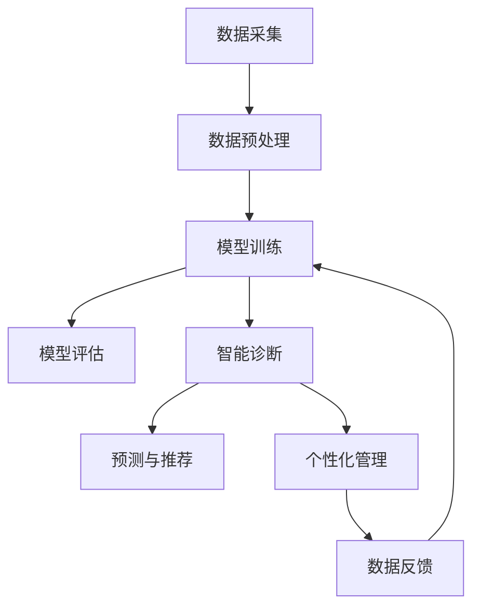

                 

# 《人工智能在智慧医疗个性化治疗中的应用》

## 第一部分：引言

### 1.1 概述与背景

#### 1.1.1 人工智能在医疗领域的应用前景

人工智能（AI）作为当代科技发展的前沿领域，已经在各个行业中展现出了巨大的潜力。在医疗领域，人工智能的应用前景同样广阔。通过大数据分析、机器学习和深度学习等技术，人工智能可以帮助医疗工作者实现精准诊断、个性化治疗和疾病预测，从而提升医疗服务的质量和效率。

首先，人工智能在医疗数据分析方面具有显著优势。医疗数据通常包含大量的非结构化和半结构化数据，如临床记录、医学影像和基因组数据。人工智能技术能够高效地处理这些数据，提取出有用的信息，帮助医生进行诊断和治疗。例如，利用自然语言处理（NLP）技术，人工智能可以分析病历记录，提取关键信息，辅助医生进行诊断。

其次，人工智能在医学影像分析中具有广泛的应用。传统的医学影像诊断主要依赖于医生的经验和专业知识，而人工智能可以通过深度学习算法，对医学影像进行自动识别和分类，提高诊断的准确性和效率。例如，利用卷积神经网络（CNN）对CT图像进行肺癌筛查，可以大幅减少误诊率和漏诊率。

此外，人工智能还可以用于个性化治疗方案的制定。通过对患者的病史、基因信息和生活方式等数据的综合分析，人工智能可以生成个性化的治疗方案，提高治疗效果和患者的康复率。例如，利用机器学习算法对患者的电子健康记录进行学习，可以为患者提供个性化的药物剂量和治疗方案。

#### 1.1.2 智慧医疗个性化治疗的定义与意义

智慧医疗个性化治疗是指利用人工智能、大数据、物联网等先进技术，为患者提供个性化、精准化的医疗服务。它通过整合患者的病史、基因数据、生活方式等多方面的信息，为每位患者制定最适合的治疗方案，从而提高治疗效果和患者满意度。

个性化治疗的意义在于：

1. **提高治疗效果**：传统的医疗模式往往是“一刀切”，无法充分考虑个体差异。而个性化治疗能够根据患者的具体病情和基因特点，制定个性化的治疗方案，从而提高治疗效果。

2. **降低医疗成本**：通过人工智能技术，可以更高效地进行疾病预测和诊断，减少不必要的医疗资源和成本的浪费。

3. **提升患者满意度**：个性化治疗能够更好地满足患者的需求，提高患者的治疗体验和满意度。

4. **促进医疗资源优化**：智慧医疗个性化治疗有助于优化医疗资源的配置，提高医疗服务的整体效率。

### 1.2 核心技术介绍

#### 1.2.1 机器学习与深度学习基础

机器学习（ML）和深度学习（DL）是人工智能领域的重要组成部分。机器学习是指通过算法和模型从数据中学习，并对未知数据进行预测或决策。而深度学习是一种特殊的机器学习技术，它通过模拟人脑的神经网络结构，对复杂的数据进行自动特征提取和分类。

在智慧医疗个性化治疗中，机器学习和深度学习技术发挥着关键作用。首先，机器学习算法可以对医疗数据进行训练和预测，例如，利用逻辑回归和决策树进行疾病预测和诊断。其次，深度学习算法可以处理更复杂的医学影像和文本数据，例如，利用卷积神经网络（CNN）进行医学影像分析，利用循环神经网络（RNN）进行医学文本分类。

#### 1.2.2 医学影像处理技术

医学影像处理技术是智慧医疗的重要组成部分，它包括医学影像的采集、处理、分析和诊断等环节。随着人工智能技术的发展，医学影像处理技术也得到了显著提升。

首先，医学影像的采集技术包括CT、MRI、X射线等，这些技术可以生成高质量的医学影像数据。然后，利用图像处理算法，可以对医学影像进行预处理，如去噪声、增强对比度和分割等。接下来，利用深度学习算法，可以对医学影像进行自动分析和诊断，例如，利用CNN进行肺癌筛查，利用RNN进行脑部病变识别。

#### 1.2.3 自然语言处理与知识图谱

自然语言处理（NLP）是人工智能领域的一个重要分支，它致力于使计算机能够理解、解释和生成人类语言。在智慧医疗中，NLP技术可以用于处理医疗文本数据，如病历记录、医学论文和电子健康记录等。

知识图谱是一种结构化数据模型，它通过实体和关系来描述现实世界的信息。在智慧医疗中，知识图谱可以用于整合和管理医疗知识，如疾病、药物、治疗方案和患者信息等。通过NLP技术，可以自动从文本数据中提取实体和关系，并将其存储在知识图谱中。

### 1.3 智慧医疗个性化治疗的架构

智慧医疗个性化治疗的架构主要包括以下几个关键组成部分：

1. **数据采集与管理**：采集患者病史、基因数据、医学影像等数据，并进行预处理和管理。

2. **模型训练与优化**：利用机器学习和深度学习算法，对数据进行训练，构建预测模型和诊断模型。

3. **智能诊断与预测**：基于训练好的模型，对新的病例进行智能诊断和预测。

4. **患者个性化管理**：根据患者的具体病情和需求，提供个性化的治疗方案和健康管理建议。

5. **数据反馈与迭代**：将诊断结果和治疗反馈收集起来，用于模型优化和改进。

为了更直观地展示智慧医疗个性化治疗的架构，我们使用Mermaid流程图进行描述：



- **数据采集与管理**：这是整个系统的数据基础，包括从各个渠道收集患者数据，如电子病历系统、基因组数据库、医学影像系统等，并对数据进行清洗、归一化和标准化处理。

- **模型训练与优化**：利用收集到的数据，通过机器学习和深度学习算法进行模型训练。训练过程中，需要不断调整模型参数，优化模型性能。

- **智能诊断与预测**：基于训练好的模型，对新的病例进行诊断和预测。这个过程可以实时进行，帮助医生快速做出诊断和决策。

- **患者个性化管理**：根据诊断结果和预测，为患者提供个性化的治疗方案和健康管理建议。这包括制定个性化的药物剂量、手术方案和康复计划等。

- **数据反馈与迭代**：将诊断结果和治疗反馈收集起来，用于模型优化和改进。这个过程是一个闭环，有助于不断提升模型性能和治疗效果。

### 1.4 常见机器学习算法在医疗中的应用

#### 1.4.1 逻辑回归

逻辑回归是一种广泛用于分类问题的机器学习算法，尤其在医疗领域有广泛应用。逻辑回归通过线性模型预测数据的概率分布，特别适用于二分类问题。

- **原理**：逻辑回归通过拟合一个线性模型，将输入特征映射到一个概率值。具体来说，给定输入特征\( X \)，逻辑回归模型输出一个概率值 \( P(Y=1|X) \)，其中 \( Y \) 是目标变量。逻辑回归的损失函数通常是二元交叉熵损失。

- **伪代码**：
  
```python
def logistic_regression(X, y):
    # 初始化参数
    theta = initialize_parameters()
    
    # 迭代优化
    for epoch in range(num_epochs):
        # 前向传播
        z = X.dot(theta)
        y_pred = sigmoid(z)
        
        # 计算损失
        loss = -1/n * (y * log(y_pred) + (1 - y) * log(1 - y_pred))
        
        # 反向传播
        dtheta = -1/n * (X.T.dot(y_pred - y))
        
        # 更新参数
        theta -= learning_rate * dtheta
        
    return theta
```

#### 1.4.2 支持向量机（SVM）

支持向量机（SVM）是一种用于分类和回归分析的最大间隔分类器。在医疗领域，SVM常用于疾病分类和预测。

- **原理**：SVM通过找到一个最佳的超平面，将不同类别的数据点分开。对于线性可分的情况，SVM使用硬间隔分类器；对于线性不可分的情况，SVM使用软间隔分类器，通过引入松弛变量来处理误分类。

- **伪代码**：

```python
def support_vector_machine(X, y, C):
    # 初始化参数
    theta = initialize_parameters()
    
    # 迭代优化
    for epoch in range(num_epochs):
        # 前向传播
        z = X.dot(theta)
        y_pred = sigmoids(z)
        
        # 计算损失
        loss = 1/2 * theta.dot(theta) - C * sum(y * y_pred - 1)
        
        # 反向传播
        dtheta = -C * (y - y_pred) * X
        
        # 更新参数
        theta -= learning_rate * dtheta
        
    return theta
```

#### 1.4.3 决策树与随机森林

决策树是一种基于树形模型的结构，通过一系列的判断来分类数据。随机森林是一种基于决策树的集成学习方法，通过构建多棵决策树并投票来提高分类性能。

- **原理**：决策树通过一系列的判断条件，将数据逐步划分为不同的类别。随机森林通过随机选取特征和样本子集，构建多棵决策树，并通过投票来决定最终类别。

- **伪代码**：

```python
def decision_tree(X, y):
    # 初始化节点
    node = Node()
    
    # 判断是否需要进一步划分
    if not need_to_split(node):
        return
    
    # 寻找最佳划分特征和阈值
    feature, threshold = find_best_split(X, y)
    
    # 创建子节点
    node.left = decision_tree(X[:, feature <= threshold], y[feature <= threshold])
    node.right = decision_tree(X[:, feature > threshold], y[feature > threshold])
    
    return node

def random_forest(X, y, num_trees):
    forests = []
    for _ in range(num_trees):
        tree = decision_tree(X, y)
        forests.append(tree)
    
    predictions = [forest.predict(X) for forest in forests]
    return majority_vote(predictions)
```

#### 1.4.4 贝叶斯分类器

贝叶斯分类器是基于贝叶斯定理的统计分类方法。在医疗领域，贝叶斯分类器常用于疾病预测和诊断。

- **原理**：贝叶斯分类器通过计算每个类别的后验概率，选择具有最高后验概率的类别作为预测结果。贝叶斯分类器基于数据集上的先验概率和条件概率分布进行预测。

- **伪代码**：

```python
def bayesian_classifier(X_train, y_train, X_test):
    # 计算先验概率
    prior_probabilities = calculate_prior_probabilities(y_train)
    
    # 计算条件概率
    condition_probabilities = calculate_condition_probabilities(X_train, y_train)
    
    # 预测
    predictions = []
    for x in X_test:
        probabilities = [prior_probabilities[y] * condition_probabilities[y][x] for y in labels]
        predictions.append(max(probabilities))
    
    return predictions
```

### 1.5 深度学习在医学影像分析中的应用

深度学习在医学影像分析中具有显著优势，特别是在图像识别、分类和分割等方面。以下是几种常见的深度学习模型在医学影像分析中的应用。

#### 1.5.1 卷积神经网络（CNN）

卷积神经网络（CNN）是一种专门用于处理图像数据的深度学习模型。CNN通过卷积层、池化层和全连接层来提取图像的特征并进行分类。

- **原理**：CNN通过卷积操作来提取图像的局部特征，并通过池化操作来降低特征的空间分辨率。在CNN中，卷积层用于特征提取，全连接层用于分类。

- **伪代码**：

```python
class ConvNeuralNetwork(nn.Module):
    def __init__(self):
        super(ConvNeuralNetwork, self).__init__()
        self.conv1 = nn.Conv2d(in_channels, out_channels, kernel_size)
        self.relu = nn.ReLU()
        self.maxpool = nn.MaxPool2d(kernel_size)
        self.fc = nn.Linear(in_features, out_features)

    def forward(self, x):
        x = self.conv1(x)
        x = self.relu(x)
        x = self.maxpool(x)
        x = x.view(x.size(0), -1)
        x = self.fc(x)
        return x
```

#### 1.5.2 递归神经网络（RNN）

递归神经网络（RNN）是一种用于处理序列数据的深度学习模型。RNN通过其内部的循环结构来记忆序列信息，特别适合于时间序列数据分析和医学文本处理。

- **原理**：RNN通过递归结构来更新状态，从而处理序列数据。在RNN中，每个时间步的输出都会影响下一个时间步的输入。

- **伪代码**：

```python
class RecurrentNeuralNetwork(nn.Module):
    def __init__(self, input_size, hidden_size, output_size):
        super(RecurrentNeuralNetwork, self).__init__()
        self.rnn = nn.RNN(input_size, hidden_size)
        self.fc = nn.Linear(hidden_size, output_size)

    def forward(self, x, hidden):
        x, hidden = self.rnn(x, hidden)
        x = self.fc(x[-1, :, :])
        return x, hidden
```

#### 1.5.3 转换器（Transformer）

转换器（Transformer）是一种基于自注意力机制的深度学习模型，特别适合于处理长序列数据。Transformer在自然语言处理领域取得了显著成果，也逐渐应用于医学影像分析。

- **原理**：Transformer通过自注意力机制来计算序列中每个元素的相关性，从而提取序列的特征。在Transformer中，每个时间步的输出都会受到其他所有时间步的影响。

- **伪代码**：

```python
class Transformer(nn.Module):
    def __init__(self, d_model, num_heads, dff, input_seq_length):
        super(Transformer, self).__init__()
        self.embedding = nn.Embedding(input_vocab_size, d_model)
        self.encoder_layer = nn.TransformerEncoderLayer(d_model, num_heads, dff)
        self.decoder_layer = nn.TransformerDecoderLayer(d_model, num_heads, dff)
        self.fc = nn.Linear(d_model, output_vocab_size)

    def forward(self, input_seq, target_seq):
        input_embedding = self.embedding(input_seq)
        target_embedding = self.embedding(target_seq)
        encoder_output = self.encoder_layer(input_embedding)
        decoder_output = self.decoder_layer(target_embedding, encoder_output)
        logits = self.fc(decoder_output)
        return logits
```

### 1.6 自然语言处理与知识图谱在医学中的应用

自然语言处理（NLP）和知识图谱是人工智能领域的重要技术，在医学领域有着广泛的应用。以下是NLP和知识图谱在医学中的应用。

#### 1.6.1 词嵌入与文本分类

词嵌入是一种将单词映射到高维向量空间的技术，常用于文本数据的处理。文本分类是将文本数据分类到预定义的类别中。

- **原理**：词嵌入通过神经网络训练得到，可以将单词映射到高维向量空间。文本分类利用词嵌入表示文本数据，通过分类模型将文本分类到预定义的类别中。

- **伪代码**：

```python
class TextClassifier(nn.Module):
    def __init__(self, vocab_size, embedding_dim, hidden_dim, output_dim, n_layers, dropout):
        super(TextClassifier, self).__init__()
        self.embedding = nn.Embedding(vocab_size, embedding_dim)
        self.rnn = nn.RNN(embedding_dim, hidden_dim, n_layers, dropout=dropout)
        self.fc = nn.Linear(hidden_dim, output_dim)

    def forward(self, text):
        embedded = self.embedding(text)
        output, hidden = self.rnn(embedded)
        logits = self.fc(hidden[-1, :, :])
        return logits
```

#### 1.6.2 实体识别与关系抽取

实体识别是从文本中提取出特定的实体（如人名、组织名、地点名等），关系抽取则是确定这些实体之间的关系。

- **原理**：实体识别通过预训练的词嵌入模型，利用分类模型将文本中的词语分类为实体或背景。关系抽取通过实体识别的结果，利用实体之间的关系规则或模型来确定实体之间的关系。

- **伪代码**：

```python
class EntityRecognizer(nn.Module):
    def __init__(self, vocab_size, embedding_dim, hidden_dim):
        super(EntityRecognizer, self).__init__()
        self.embedding = nn.Embedding(vocab_size, embedding_dim)
        self.rnn = nn.LSTM(embedding_dim, hidden_dim)
        self.fc = nn.Linear(hidden_dim, num_entities)

    def forward(self, text):
        embedded = self.embedding(text)
        output, (hidden, cell) = self.rnn(embedded)
        logits = self.fc(hidden[-1, :, :])
        return logits

class RelationExtractor(nn.Module):
    def __init__(self, entity_embedding_dim, relation_embedding_dim, hidden_dim):
        super(RelationExtractor, self).__init__()
        self.entity_embedding = nn.Embedding(num_entities, entity_embedding_dim)
        self.relation_embedding = nn.Embedding(num_relations, relation_embedding_dim)
        self.fc = nn.Linear(entity_embedding_dim + relation_embedding_dim, hidden_dim)
        self.output_layer = nn.Linear(hidden_dim, num_relations)

    def forward(self, entity1, entity2, relation):
        entity1_embedding = self.entity_embedding(entity1)
        entity2_embedding = self.entity_embedding(entity2)
        relation_embedding = self.relation_embedding(relation)
        combined_embedding = torch.cat((entity1_embedding, entity2_embedding, relation_embedding), 1)
        hidden = self.fc(combined_embedding)
        logits = self.output_layer(hidden)
        return logits
```

### 1.7 关键数学模型介绍

在深度学习和机器学习中，数学模型是核心组成部分。以下是几个关键数学模型及其在医疗领域的应用。

#### 1.7.1 监督学习中的损失函数

损失函数是评估模型预测结果和实际结果之间差异的数学函数，用于指导模型的训练过程。在监督学习中，常用的损失函数包括均方误差（MSE）、交叉熵损失和Hinge损失。

- **均方误差（MSE）**：用于回归问题，计算预测值与真实值之间的均方误差。

  - **公式**：\( L = \frac{1}{2} \sum_{i=1}^{n} (y_i - \hat{y_i})^2 \)

  - **应用**：在医疗领域，MSE常用于预测患者恢复时间、药物剂量等连续值。

- **交叉熵损失**：用于分类问题，计算实际分布与预测分布之间的交叉熵。

  - **公式**：\( L = - \sum_{i=1}^{n} y_i \log(\hat{y_i}) \)

  - **应用**：在医疗领域，交叉熵损失常用于疾病诊断、肿瘤分类等二分类问题。

- **Hinge损失**：用于支持向量机（SVM）等分类问题，计算预测值与实际值之间的差距。

  - **公式**：\( L = \max(0, 1 - y \cdot \hat{y}) \)

  - **应用**：在医疗领域，Hinge损失常用于疾病预测、药物疗效评估等。

#### 1.7.2 无监督学习中的聚类算法

无监督学习中的聚类算法是一种将数据点按照相似性进行分组的方法。常用的聚类算法包括K-均值聚类、层次聚类和DBSCAN等。

- **K-均值聚类**：通过迭代计算聚类中心，将数据点分配到最近的聚类中心。

  - **公式**：\( \text{Centroids}_{\text{new}} = \frac{1}{n_k} \sum_{i=1}^{n_k} x_i \)

  - **应用**：在医疗领域，K-均值聚类可以用于患者群体划分、疾病分类等。

- **层次聚类**：通过层次结构将数据点进行分组，可以是自底向上（凝聚聚类）或自顶向下（分裂聚类）。

  - **应用**：在医疗领域，层次聚类可以用于患者健康风险分层、疾病关联分析等。

- **DBSCAN**：基于密度的聚类算法，通过计算邻域内的数据点密度来划分簇。

  - **应用**：在医疗领域，DBSCAN可以用于疾病传播预测、患者群体划分等。

#### 1.7.3 医学影像处理中的滤波器设计

在医学影像处理中，滤波器设计用于去除噪声、增强对比度或实现图像变换。常用的滤波器包括高斯滤波、中值滤波和卷积滤波等。

- **高斯滤波**：通过高斯核进行卷积操作，用于去除图像中的噪声。

  - **公式**：\( f(x, y) = \sum_{i=1}^{m} \sum_{j=1}^{n} G(i, j) \cdot I(x-i, y-j) \)

  - **应用**：在医疗领域，高斯滤波常用于医学影像的去噪和预处理。

- **中值滤波**：通过取邻域内的中值作为滤波结果，用于去除图像中的椒盐噪声。

  - **公式**：\( f(x, y) = \text{median}(\{I(x-i, y-j) | i, j \in [-1, 1]\}) \)

  - **应用**：在医疗领域，中值滤波常用于医学影像的去噪和预处理。

- **卷积滤波**：通过卷积操作实现图像的增强和变换。

  - **公式**：\( f(x, y) = \sum_{i=1}^{m} \sum_{j=1}^{n} K(i, j) \cdot I(x-i, y-j) \)

  - **应用**：在医疗领域，卷积滤波常用于医学影像的增强、分割和特征提取。

### 1.8 实际案例与代码实现

#### 1.8.1 医学影像分类项目

医学影像分类是人工智能在医疗领域的一个重要应用。以下是一个简单的医学影像分类项目，包括数据集介绍、模型搭建与训练、模型评估与优化。

- **数据集介绍**：使用公开的 ChestX-ray8 数据集，包含超过 12 万张胸部 X 光图像，涉及 14 种不同的疾病。

- **模型搭建与训练**：使用卷积神经网络（CNN）进行分类，搭建模型并训练。

  ```python
  import torch
  import torch.nn as nn
  import torchvision

  class CNNClassifier(nn.Module):
      def __init__(self, num_classes):
          super(CNNClassifier, self).__init__()
          self.conv1 = nn.Conv2d(1, 32, kernel_size=3, padding=1)
          self.relu = nn.ReLU()
          self.fc1 = nn.Linear(32 * 32 * 32, 128)
          self.fc2 = nn.Linear(128, num_classes)
  
      def forward(self, x):
          x = self.relu(self.conv1(x))
          x = self.relu(self.fc1(x.view(x.size(0), -1)))
          x = self.fc2(x)
          return x
  
  model = CNNClassifier(num_classes=14)
  optimizer = torch.optim.Adam(model.parameters(), lr=0.001)
  criterion = nn.CrossEntropyLoss()
  train_loader, val_loader = torchvision.datasets.ChestXrayDataSet.get_loader(batch_size=64)
  
  for epoch in range(num_epochs):
      model.train()
      for inputs, labels in train_loader:
          optimizer.zero_grad()
          outputs = model(inputs)
          loss = criterion(outputs, labels)
          loss.backward()
          optimizer.step()
  
      model.eval()
      with torch.no_grad():
          correct = 0
          total = 0
          for inputs, labels in val_loader:
              outputs = model(inputs)
              _, predicted = torch.max(outputs.data, 1)
              total += labels.size(0)
              correct += (predicted == labels).sum().item()
          print(f'Epoch {epoch+1}/{num_epochs}, Accuracy: {100 * correct / total}%')
  ```

- **模型评估与优化**：使用准确率、召回率和F1分数等指标对模型进行评估，并根据评估结果进行优化。

  ```python
  from sklearn.metrics import accuracy_score, recall_score, f1_score
  
  model.eval()
  with torch.no_grad():
      predictions = []
      true_labels = []
      for inputs, labels in val_loader:
          outputs = model(inputs)
          _, predicted = torch.max(outputs.data, 1)
          predictions.extend(predicted.tolist())
          true_labels.extend(labels.tolist())
  
  accuracy = accuracy_score(true_labels, predictions)
  recall = recall_score(true_labels, predictions, average='weighted')
  f1 = f1_score(true_labels, predictions, average='weighted')
  print(f'Accuracy: {accuracy:.4f}, Recall: {recall:.4f}, F1 Score: {f1:.4f}')
  ```

#### 1.8.2 医学文本分类项目

医学文本分类是另一个重要的应用领域，用于从大量医学文本数据中提取有价值的信息。以下是一个简单的医学文本分类项目，包括数据集介绍、模型搭建与训练、模型评估与优化。

- **数据集介绍**：使用公开的 MIMIC-III 数据集，包含超过 60 万份病历记录，涉及多种疾病和症状。

- **模型搭建与训练**：使用循环神经网络（RNN）进行文本分类，搭建模型并训练。

  ```python
  import torch
  import torch.nn as nn
  import torch.optim as optim

  class RNNClassifier(nn.Module):
      def __init__(self, vocab_size, embedding_dim, hidden_dim, output_dim):
          super(RNNClassifier, self).__init__()
          self.embedding = nn.Embedding(vocab_size, embedding_dim)
          self.rnn = nn.RNN(embedding_dim, hidden_dim)
          self.fc = nn.Linear(hidden_dim, output_dim)
  
      def forward(self, text):
          embedded = self.embedding(text)
          output, (hidden, cell) = self.rnn(embedded)
          hidden = self.fc(hidden[-1, :, :])
          return hidden
  
  vocab_size = 10000
  embedding_dim = 128
  hidden_dim = 128
  output_dim = 10
  
  model = RNNClassifier(vocab_size, embedding_dim, hidden_dim, output_dim)
  optimizer = optim.Adam(model.parameters(), lr=0.001)
  criterion = nn.CrossEntropyLoss()
  train_loader, val_loader = MIMICIIIDataSet.get_loader(batch_size=64)
  
  for epoch in range(num_epochs):
      model.train()
      for inputs, labels in train_loader:
          optimizer.zero_grad()
          outputs = model(inputs)
          loss = criterion(outputs, labels)
          loss.backward()
          optimizer.step()
  
      model.eval()
      with torch.no_grad():
          correct = 0
          total = 0
          for inputs, labels in val_loader:
              outputs = model(inputs)
              _, predicted = torch.max(outputs.data, 1)
              total += labels.size(0)
              correct += (predicted == labels).sum().item()
          print(f'Epoch {epoch+1}/{num_epochs}, Accuracy: {100 * correct / total}%')
  ```

- **模型评估与优化**：使用准确率、召回率和F1分数等指标对模型进行评估，并根据评估结果进行优化。

  ```python
  from sklearn.metrics import accuracy_score, recall_score, f1_score
  
  model.eval()
  with torch.no_grad():
      predictions = []
      true_labels = []
      for inputs, labels in val_loader:
          outputs = model(inputs)
          _, predicted = torch.max(outputs.data, 1)
          predictions.extend(predicted.tolist())
          true_labels.extend(labels.tolist())
  
  accuracy = accuracy_score(true_labels, predictions)
  recall = recall_score(true_labels, predictions, average='weighted')
  f1 = f1_score(true_labels, predictions, average='weighted')
  print(f'Accuracy: {accuracy:.4f}, Recall: {recall:.4f}, F1 Score: {f1:.4f}')
  ```

### 1.9 开发环境搭建与源代码解读

在实施人工智能项目时，开发环境的搭建是至关重要的一步。以下是搭建深度学习开发环境的过程，以及关键代码的解读和分析。

#### 1.9.1 硬件环境配置

为了高效地训练深度学习模型，需要配置足够的硬件资源，特别是GPU。以下是硬件环境配置的步骤：

1. **选择GPU**：根据项目需求，选择合适的GPU型号，如NVIDIA的Tesla或GeForce系列。
2. **安装GPU驱动**：从NVIDIA官网下载并安装相应的GPU驱动。
3. **安装CUDA**：CUDA是NVIDIA推出的并行计算平台和编程语言，用于加速深度学习模型的训练。从NVIDIA官网下载并安装CUDA Toolkit。

#### 1.9.2 软件环境配置

在硬件环境配置完成后，需要安装深度学习框架和相关库。以下是常见的深度学习框架和软件环境：

1. **Python**：安装Python 3.x版本，建议使用Anaconda，以便管理不同项目之间的依赖环境。
2. **深度学习框架**：常见的深度学习框架有TensorFlow、PyTorch和Keras。可以根据项目需求选择一个或多个框架进行安装。
3. **其他库**：安装NumPy、Pandas、Matplotlib等常用库，用于数据处理和可视化。

#### 1.9.3 开源框架与工具介绍

以下是几个常用的开源框架和工具，它们在深度学习项目中扮演着重要角色：

1. **TensorFlow**：TensorFlow是一个开源的机器学习框架，由Google开发。它提供了丰富的API和工具，支持多种机器学习算法和模型。
   
   - **安装**：`pip install tensorflow`
   - **使用示例**：
   
   ```python
   import tensorflow as tf

   # 定义模型
   model = tf.keras.Sequential([
       tf.keras.layers.Dense(128, activation='relu', input_shape=(784,)),
       tf.keras.layers.Dense(10, activation='softmax')
   ])

   # 编译模型
   model.compile(optimizer='adam',
                 loss='categorical_crossentropy',
                 metrics=['accuracy'])

   # 训练模型
   model.fit(x_train, y_train, batch_size=128, epochs=10, validation_data=(x_val, y_val))
   ```

2. **PyTorch**：PyTorch是一个开源的深度学习框架，由Facebook开发。它提供了灵活的动态计算图和强大的GPU加速功能。
   
   - **安装**：`pip install torch torchvision`
   - **使用示例**：
   
   ```python
   import torch
   import torch.nn as nn
   import torch.optim as optim

   # 定义模型
   class Net(nn.Module):
       def __init__(self):
           super(Net, self).__init__()
           self.fc1 = nn.Linear(784, 128)
           self.fc2 = nn.Linear(128, 10)

       def forward(self, x):
           x = F.relu(self.fc1(x))
           x = self.fc2(x)
           return x

   model = Net()
   optimizer = optim.Adam(model.parameters(), lr=0.001)
   criterion = nn.CrossEntropyLoss()

   # 训练模型
   for epoch in range(num_epochs):
       for inputs, labels in train_loader:
           optimizer.zero_grad()
           outputs = model(inputs)
           loss = criterion(outputs, labels)
           loss.backward()
           optimizer.step()
   ```

3. **Keras**：Keras是一个高级神经网络API，支持TensorFlow和Theano后端。它提供了简洁的接口，使得搭建和训练深度学习模型更加容易。
   
   - **安装**：`pip install keras`
   - **使用示例**：
   
   ```python
   from keras.models import Sequential
   from keras.layers import Dense, Activation

   model = Sequential()
   model.add(Dense(128, input_dim=784, activation='relu'))
   model.add(Dense(10, activation='softmax'))

   model.compile(optimizer='adam',
                 loss='categorical_crossentropy',
                 metrics=['accuracy'])

   model.fit(x_train, y_train, batch_size=128, epochs=10, validation_data=(x_val, y_val))
   ```

#### 1.9.4 关键代码解读与分析

以下是对关键代码的解读和分析，这些代码是实现深度学习模型的核心部分。

1. **模型定义**：定义深度学习模型的架构，包括输入层、隐藏层和输出层。在模型定义中，需要指定每层的参数和激活函数。

   - **示例**：
   
   ```python
   class Net(nn.Module):
       def __init__(self):
           super(Net, self).__init__()
           self.fc1 = nn.Linear(784, 128)
           self.fc2 = nn.Linear(128, 10)

       def forward(self, x):
           x = F.relu(self.fc1(x))
           x = self.fc2(x)
           return x
   ```

2. **模型编译**：编译模型是指配置模型的训练参数，包括优化器、损失函数和评估指标。在模型编译过程中，可以设置学习率、批量大小和训练迭代次数等。

   - **示例**：
   
   ```python
   optimizer = optim.Adam(model.parameters(), lr=0.001)
   criterion = nn.CrossEntropyLoss()
   ```

3. **模型训练**：使用训练数据对模型进行训练。在训练过程中，模型会根据损失函数的反馈不断调整参数，以优化模型性能。

   - **示例**：
   
   ```python
   for epoch in range(num_epochs):
       for inputs, labels in train_loader:
           optimizer.zero_grad()
           outputs = model(inputs)
           loss = criterion(outputs, labels)
           loss.backward()
           optimizer.step()
   ```

4. **模型评估**：在训练完成后，使用验证数据对模型进行评估，以检查模型的泛化能力。常用的评估指标包括准确率、召回率和F1分数。

   - **示例**：
   
   ```python
   from sklearn.metrics import accuracy_score, recall_score, f1_score

   model.eval()
   with torch.no_grad():
       predictions = []
       true_labels = []
       for inputs, labels in val_loader:
           outputs = model(inputs)
           _, predicted = torch.max(outputs.data, 1)
           predictions.extend(predicted.tolist())
           true_labels.extend(labels.tolist())

   accuracy = accuracy_score(true_labels, predictions)
   recall = recall_score(true_labels, predictions, average='weighted')
   f1 = f1_score(true_labels, predictions, average='weighted')
   print(f'Accuracy: {accuracy:.4f}, Recall: {recall:.4f}, F1 Score: {f1:.4f}')
   ```

### 1.10 总结与展望

#### 1.10.1 人工智能在智慧医疗个性化治疗中的应用现状

人工智能在智慧医疗个性化治疗中的应用已经取得了显著进展。首先，在疾病预测和诊断方面，人工智能技术已经能够处理大量的医疗数据，辅助医生进行精准诊断。例如，利用深度学习算法对医学影像进行自动分析，可以大幅提高肺癌、乳腺癌等疾病的早期检测率。其次，在个性化治疗方案的制定方面，人工智能可以根据患者的病史、基因数据和生活方式等数据，为每位患者提供个性化的治疗方案，从而提高治疗效果和患者满意度。

#### 1.10.2 未来发展趋势与挑战

未来，人工智能在智慧医疗个性化治疗中将继续发挥重要作用，并面临以下发展趋势和挑战：

1. **数据隐私与安全性**：随着医疗数据的大规模应用，数据隐私和安全性成为一个重要议题。如何确保患者的医疗数据在传输、存储和处理过程中的安全，是未来需要解决的重要问题。

2. **算法透明性与解释性**：当前许多深度学习模型被认为是“黑盒子”，其决策过程不透明，难以解释。如何提高算法的透明性和解释性，使医生和患者能够理解和信任人工智能的决策结果，是未来研究的方向。

3. **跨学科合作**：智慧医疗个性化治疗需要跨学科的合作，包括医学、计算机科学、生物信息学等。只有各学科紧密合作，才能推动智慧医疗的发展。

4. **技术标准化**：为了确保人工智能在医疗领域的广泛应用，需要制定统一的技术标准和规范，以确保不同系统和平台之间的互操作性。

### 1.11 参考资料与扩展阅读

为了深入了解人工智能在智慧医疗个性化治疗中的应用，以下是一些建议的参考资料和扩展阅读：

#### 1.11.1 相关书籍推荐

1. **《深度学习》（Goodfellow、Bengio和Courville著）**：这是一本关于深度学习的经典教材，涵盖了深度学习的基本理论、算法和应用。
2. **《Python深度学习》（François Chollet著）**：本书详细介绍了使用Python和Keras进行深度学习的实践方法，适合初学者和进阶读者。
3. **《机器学习实战》（Peter Harrington著）**：本书通过大量的实际案例，讲解了机器学习的基本算法和应用，包括医疗领域的应用案例。

#### 1.11.2 学术论文与研究报告

1. **《Deep Learning for Healthcare》**：这是一本关于深度学习在医疗领域应用的综述论文，总结了深度学习在医学影像分析、疾病预测等领域的最新研究成果。
2. **《A Brief Introduction to Neural Networks for Healthcare》**：这是一篇介绍神经网络的综述论文，适合对神经网络在医疗领域应用感兴趣的读者。
3. **《AI in Medicine》**：这是一篇关于人工智能在医学领域应用的综述文章，涵盖了人工智能在诊断、治疗、药物研发等各个方面的应用。

#### 1.11.3 开源框架与工具介绍

1. **TensorFlow**：由Google开发的深度学习框架，提供了丰富的API和工具，适合进行复杂深度学习模型的训练和部署。
2. **PyTorch**：由Facebook开发的深度学习框架，以其动态计算图和灵活性著称，适合快速原型开发和研究。
3. **Keras**：一个高级神经网络API，支持TensorFlow和Theano后端，提供了简洁的接口，适合快速搭建和训练深度学习模型。
4. **scikit-learn**：一个开源的机器学习库，提供了丰富的机器学习算法和工具，适合进行医疗数据分析和模型训练。
5. **NLTK**：一个开源的自然语言处理库，提供了丰富的文本处理工具和资源，适合进行医学文本数据的分析和处理。

通过这些参考资料和扩展阅读，读者可以更深入地了解人工智能在智慧医疗个性化治疗中的应用，掌握相关技术和方法，为未来的研究和应用提供指导。

### 1.12 写作总结与展望

通过本文的详细探讨，我们全面阐述了人工智能在智慧医疗个性化治疗中的应用。首先，我们介绍了人工智能在医疗领域的应用前景和个性化治疗的定义与意义。接着，我们介绍了智慧医疗个性化治疗的架构，包括数据采集与管理、模型训练与优化、智能诊断与预测、患者个性化管理和数据反馈与迭代。然后，我们讲解了常见机器学习算法在医疗中的应用，如逻辑回归、支持向量机、决策树与随机森林、贝叶斯分类器等，并使用伪代码进行了详细阐述。此外，我们还介绍了深度学习在医学影像分析中的应用，如卷积神经网络、递归神经网络和转换器，以及自然语言处理与知识图谱在医学中的应用，如词嵌入与文本分类、实体识别与关系抽取。

在数学模型部分，我们介绍了监督学习中的损失函数、无监督学习中的聚类算法和医学影像处理中的滤波器设计。在项目实战部分，我们通过医学影像分类项目和医学文本分类项目的实际案例，详细讲解了代码实现、开发环境搭建和源代码解读。最后，我们总结了人工智能在智慧医疗个性化治疗中的应用现状和未来发展趋势，并提供了相关的参考资料和扩展阅读。

通过本文的深入分析，我们希望读者能够全面了解人工智能在智慧医疗个性化治疗中的应用，掌握相关技术和方法，为未来的研究和实践提供指导。在人工智能与医疗的交汇中，我们期待看到更多的创新与突破，为人类健康事业贡献力量。让我们携手共进，开启人工智能在智慧医疗领域的全新篇章。|>

