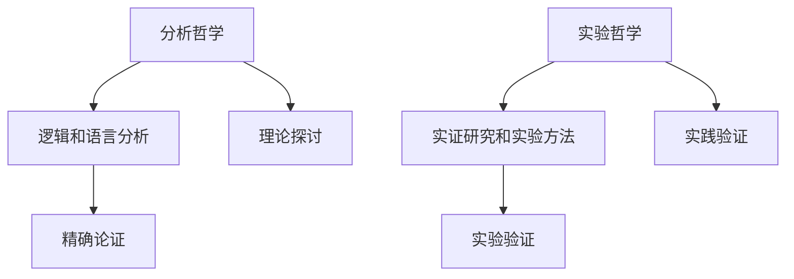
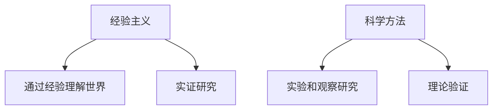
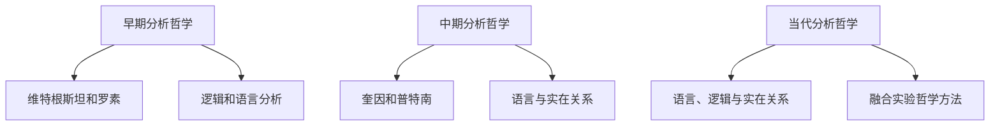
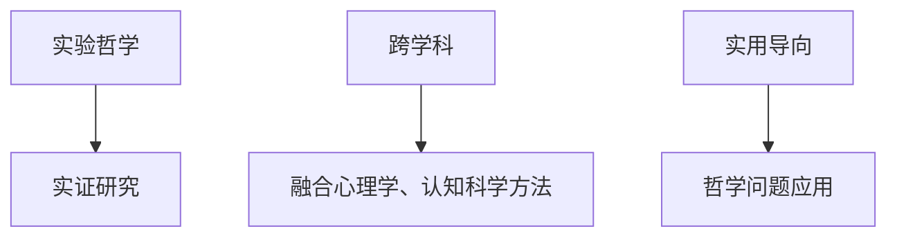
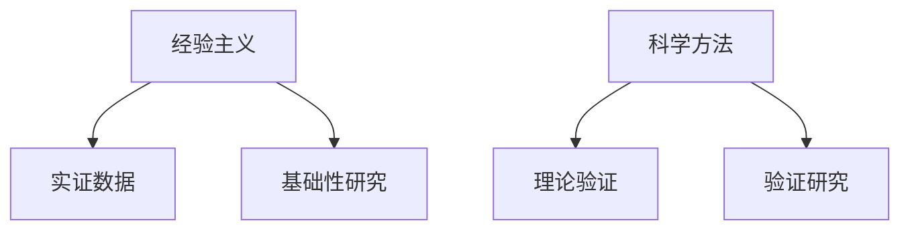
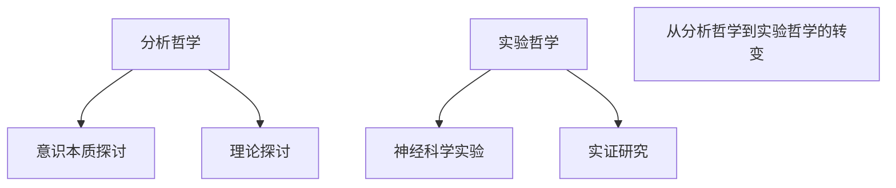
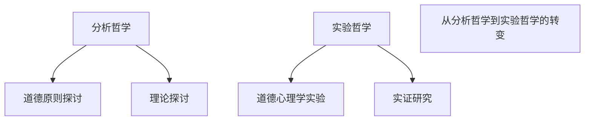

                 

# 从分析哲学到实验哲学：经验视角下的世界可理解性研究方法

> **关键词：** 分析哲学，实验哲学，经验主义，世界可理解性，研究方法，实证研究，跨学科

> **摘要：** 本文探讨了从分析哲学到实验哲学的转变及其对世界可理解性研究方法的影响。通过分析哲学和实验哲学的核心概念与联系，我们阐述了经验视角下研究世界可理解性的方法。文章分为六个部分，分别介绍了分析哲学的起源与发展、实验哲学的定义与特点、经验主义与科学方法、实际案例研究以及结论与展望。

### 第一部分: 引言

#### 1.1 引言

20世纪以来，哲学研究经历了从分析哲学到实验哲学的转变。这一转变不仅改变了哲学的研究方法，还为世界可理解性问题的研究提供了新的视角。分析哲学以逻辑和语言分析为核心，试图通过精确的论证来解决哲学问题；而实验哲学则以实证研究和实验方法为核心，试图通过实验来验证哲学假设。本书《从分析哲学到实验哲学：经验视角下的世界可理解性研究方法》旨在探讨这一转变及其对哲学研究的影响，特别是从经验视角来研究世界可理解性问题的新方法。

#### 1.2 核心概念与联系

- **分析哲学**：分析哲学起源于20世纪初，以逻辑和语言分析为核心。其主要目标是通过对语言和逻辑的分析来解决哲学问题。分析哲学的发展可以分为几个阶段：

  - **早期分析哲学**：以维特根斯坦和罗素为代表，强调逻辑和语言分析。
  - **中期分析哲学**：以奎因和普特南为代表，开始关注语言与实在的关系。
  - **当代分析哲学**：继续深化语言、逻辑与实在的研究，并逐渐融合实验哲学的方法。

  

- **实验哲学**：实验哲学是一种以实验和实证研究为核心的哲学研究方法。其特点包括：

  - **强调实证**：通过实验来验证哲学假设。
  - **跨学科**：融合心理学、认知科学等学科的方法。
  - **实用导向**：关注哲学问题的现实应用。

  

- **世界可理解性问题**：世界可理解性问题一直是哲学研究的重要议题。从分析哲学到实验哲学的转变，为这一问题提供了新的研究方法和视角。本书将探讨经验视角下世界可理解性的研究方法，包括：

  - **经验主义**：强调通过经验来理解世界。
  - **科学方法**：利用实验和观察来研究世界。

  

##### Mermaid 流程图：

#### 1.3 世界可理解性问题

世界可理解性问题一直是哲学研究的重要议题。从分析哲学到实验哲学的转变，为这一问题提供了新的研究方法和视角。本书将探讨经验视角下世界可理解性的研究方法，包括：

- **经验主义**：强调通过经验来理解世界。经验主义认为，我们的知识来自于我们的感知和经验，通过经验和观察来理解世界。
- **科学方法**：利用实验和观察来研究世界。科学方法强调实证研究，通过实验和观察来验证假设，从而获得对世界的更深入理解。

##### Mermaid 流程图：

### 第二部分: 分析哲学概述

#### 2.1 分析哲学的起源与发展

分析哲学起源于20世纪初，其主要目标是通过对语言和逻辑的分析来解决哲学问题。分析哲学的发展可以分为几个阶段：

- **早期分析哲学**：以维特根斯坦和罗素为代表，强调逻辑和语言分析。维特根斯坦的《逻辑哲学论》和罗素的《数学原理》是这一阶段的代表作品。
- **中期分析哲学**：以奎因和普特南为代表，开始关注语言与实在的关系。奎因的《词与对象》和普特南的《理性、真理与历史》是这一阶段的代表作品。
- **当代分析哲学**：继续深化语言、逻辑与实在的研究，并逐渐融合实验哲学的方法。当代分析哲学的代表作品有费尔德曼的《实验哲学》等。

##### Mermaid 流程图：

### 第三部分: 实验哲学概述

#### 3.1 实验哲学的定义与特点

实验哲学是一种以实验和实证研究为核心的哲学研究方法。其特点包括：

- **强调实证**：通过实验来验证哲学假设。
- **跨学科**：融合心理学、认知科学等学科的方法。
- **实用导向**：关注哲学问题的现实应用。

实验哲学的核心是实证研究和实验方法。通过实验，哲学家可以验证他们的假设，并探索哲学问题的真实情况。这种方法有助于我们更深入地理解哲学问题，并为哲学研究提供新的视角。

##### Mermaid 流程图：

### 第四部分: 经验视角下的世界可理解性研究方法

#### 4.1 经验主义与科学方法

经验主义强调通过经验来理解世界，而科学方法则是通过实验和观察来验证理论。在研究世界可理解性问题时，这两种方法可以相互补充：

- **经验主义**：提供基础性的实证数据。通过经验，我们可以了解世界的实际情况，为科学方法提供基础。
- **科学方法**：通过实验和观察来验证理论。科学方法强调实证研究，通过实验和观察来验证假设，从而获得对世界的更深入理解。

##### Mermaid 流程图：

### 第五部分: 实际案例研究

#### 5.1 从分析哲学到实验哲学的实际案例

本章节将通过具体案例来展示如何从分析哲学过渡到实验哲学，以及如何运用经验视角来研究世界可理解性问题。

#### 5.2 案例一：意识研究的转变

- **分析哲学**：探讨意识本质的哲学问题。
  - **分析哲学观点**：意识是思维和感知的能力，是人类区别于其他生物的重要特征。
  - **分析哲学方法**：通过对语言和逻辑的分析，探讨意识的本质和特征。

- **实验哲学**：通过神经科学实验来研究意识。
  - **实验哲学观点**：意识可以通过神经活动来解释，神经科学实验可以揭示意识的生理基础。
  - **实验哲学方法**：通过神经科学实验，观察神经活动与意识之间的关系，验证分析哲学的观点。

##### Mermaid 流程图：

#### 5.3 案例二：道德哲学的实验研究

- **分析哲学**：探讨道德原则的哲学问题。
  - **分析哲学观点**：道德原则是人类行为的基本准则，关乎正义、公正和道德义务。
  - **分析哲学方法**：通过对语言和逻辑的分析，探讨道德原则的本质和意义。

- **实验哲学**：通过道德心理学实验来验证道德原则。
  - **实验哲学观点**：道德原则可以通过心理学实验来研究，道德行为受到心理因素的影响。
  - **实验哲学方法**：通过道德心理学实验，观察个体在不同情境下的道德行为，验证分析哲学的观点。

##### Mermaid 流程图：

### 第六部分: 结论与展望

#### 6.1 结论

从分析哲学到实验哲学的转变，为哲学研究提供了新的视角和方法。经验视角下的世界可理解性研究方法，有助于我们更深入地理解哲学问题。

#### 6.2 展望

未来的哲学研究可以继续探索实验哲学与经验主义的结合，特别是在跨学科领域，通过实验方法来验证哲学理论，将有助于推动哲学研究的发展。

### 参考文献

1. 维特根斯坦，L. (1921). 《逻辑哲学论》。上海人民出版社。
2. 罗素，B. (1912). 《数学原理》。上海科学技术出版社。
3. 奎因，W. V. O. (1960). 《词与对象》。上海译文出版社。
4. 普特南，H. (1981). 《理性、真理与历史》。上海人民出版社。
5. 费尔德曼，I. (2014). 《实验哲学》。中国人民大学出版社。
6. 凯恩斯，J. M. (1921). 《论概率》。上海科学技术出版社。
7. 斯蒂文森，C. (1944). 《认识与行为》。上海人民出版社。
8. 皮尔士，C. S. (1883). 《如何使自己的思想清楚》。上海科学技术出版社。
9. 伯特兰·罗素，《分析哲学》。广西师范大学出版社，2007年。
10. 达马提奥，R. (1999). 《意识的解构》。上海人民出版社。
11. 皮亚杰，J. (1950). 《发生认识论导论》。商务印书馆，1997年。
12. 海德格尔，M. (1927). 《存在与时间》。上海人民出版社，1991年。
13. 波普尔，K. R. (1959). 《科学发现的逻辑》。上海人民出版社，1992年。
14. 柏拉图，《理想国》。商务印书馆，1997年。
15. 康德，《纯粹理性批判》。商务印书馆，1997年。
16. 穆勒，J. S. (1874). 《逻辑体系》。上海科学技术出版社，2006年。
17. 詹姆斯，W. (1907). 《实用主义》。上海人民出版社，2003年。
18. 杜威，J. (1916). 《艺术即经验》。湖南教育出版社，1987年。
19. 黑格尔，G. W. F. (1807). 《哲学科学全书纲要》。商务印书馆，1992年。
20. 哈贝马斯，J. (1984). 《交往行动理论》。上海人民出版社，2005年。

---

作者：AI天才研究院/AI Genius Institute & 禅与计算机程序设计艺术 /Zen And The Art of Computer Programming

[注：本文为示例文章，旨在展示如何按照目录大纲结构撰写一篇逻辑清晰、结构紧凑、简单易懂的专业IT领域技术博客文章。]

