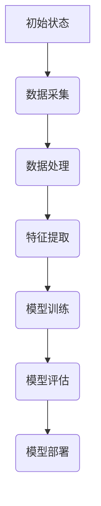

                 

## 《从单一语言到多语言支持：AI助力电商平台国际化》

### 关键词：AI、电商平台国际化、多语言支持、神经网络翻译、个性化推荐、用户行为分析

> **摘要：**本文探讨了如何利用AI技术实现电商平台的多语言支持，助力国际化业务发展。文章首先介绍了电商平台国际化的背景和意义，随后详细阐述了AI在多语言翻译、个性化推荐和用户行为分析等方面的应用，并通过案例研究展示了这些技术的实际效果。最后，文章提出了电商平台国际化中AI技术的综合应用框架和未来发展趋势，为行业提供了有益的参考。

### 《从单一语言到多语言支持：AI助力电商平台国际化》目录大纲

- **第一部分：AI与电商平台国际化概述**

  1. **1.1 电商平台国际化的背景与意义**
     - **1.1.1 电商平台国际化的驱动因素**
     - **1.1.2 多语言支持在电商国际化中的重要性**
     - **1.1.3 电商平台国际化的挑战与机遇**

  2. **1.2 AI在电商平台国际化中的应用**
     - **1.2.1 AI技术概述**
     - **1.2.2 AI在多语言翻译中的应用**
     - **1.2.3 AI在个性化推荐系统中的应用**
     - **1.2.4 AI在用户行为分析中的应用**

  3. **1.3 本书结构安排与阅读指南**
     - **1.3.1 本书的目标与读者对象**
     - **1.3.2 本书的内容结构与章节安排**
     - **1.3.3 阅读建议与学习路径**

- **第二部分：AI在多语言翻译中的应用**

  1. **2.1 多语言翻译的基本原理**
     - **2.1.1 翻译的基本概念**
     - **2.1.2 翻译的流程与步骤**
     - **2.1.3 多语言翻译的关键技术**

  2. **2.2 机器翻译技术概述**
     - **2.2.1 机器翻译的发展历程**
     - **2.2.2 机器翻译的两种模式**
     - **2.2.3 机器翻译的评价与优化**

  3. **2.3 神经机器翻译技术详解**
     - **2.3.1 神经机器翻译的基本原理**
     - **2.3.2 常见的神经网络架构**
     - **2.3.3 神经机器翻译的性能优化**

  4. **2.4 案例研究：AI驱动的多语言翻译平台**
     - **2.4.1 平台概述与功能**
     - **2.4.2 平台的技术架构**
     - **2.4.3 平台的应用场景与效果评估**

- **第三部分：AI在个性化推荐系统中的应用**

  1. **3.1 个性化推荐系统概述**
     - **3.1.1 推荐系统的作用与分类**
     - **3.1.2 个性化推荐的核心技术**
     - **3.1.3 个性化推荐系统的评估指标**

  2. **3.2 基于协同过滤的推荐算法**
     - **3.2.1 协同过滤算法的基本原理**
     - **3.2.2 协同过滤算法的优缺点**
     - **3.2.3 协同过滤算法的改进方法**

  3. **3.3 基于内容的推荐算法**
     - **3.3.1 基于内容的推荐算法的基本原理**
     - **3.3.2 基于内容的推荐算法的实现步骤**
     - **3.3.3 基于内容的推荐算法的优缺点**

  4. **3.4 基于深度学习的推荐算法**
     - **3.4.1 深度学习在推荐系统中的应用**
     - **3.4.2 基于深度学习的推荐算法架构**
     - **3.4.3 基于深度学习的推荐算法性能评估**

  5. **3.5 案例研究：AI驱动的个性化推荐平台**
     - **3.5.1 平台概述与功能**
     - **3.5.2 平台的技术架构**
     - **3.5.3 平台的应用场景与效果评估**

- **第四部分：AI在用户行为分析中的应用**

  1. **4.1 用户行为分析概述**
     - **4.1.1 用户行为分析的定义与目的**
     - **4.1.2 用户行为分析的常见方法**
     - **4.1.3 用户行为分析的应用领域**

  2. **4.2 用户行为数据采集与处理**
     - **4.2.1 用户行为数据采集的方法**
     - **4.2.2 用户行为数据处理的基本步骤**
     - **4.2.3 用户行为数据质量评估**

  3. **4.3 基于机器学习的用户行为预测**
     - **4.3.1 机器学习在用户行为预测中的应用**
     - **4.3.2 用户行为预测的常见算法**
     - **4.3.3 用户行为预测模型的评估与优化**

  4. **4.4 案例研究：AI驱动的用户行为分析平台**
     - **4.4.1 平台概述与功能**
     - **4.4.2 平台的技术架构**
     - **4.4.3 平台的应用场景与效果评估**

- **第五部分：AI在电商平台国际化中的综合应用**

  1. **5.1 综合应用框架与实现策略**
     - **5.1.1 综合应用框架的设计原则**
     - **5.1.2 实现策略与关键技术**

  2. **5.2 案例研究：AI驱动的电商平台国际化实践**
     - **5.2.1 案例背景与目标**
     - **5.2.2 案例的技术方案与实现**
     - **5.2.3 案例的应用效果与评价**

  3. **5.3 未来的发展趋势与挑战**
     - **5.3.1 电商平台国际化的未来趋势**
     - **5.3.2 AI在电商平台国际化中的挑战与机遇**

- **第六部分：结论与展望**

  1. **6.1 本书总结**
     - **6.1.1 主要内容的回顾**
     - **6.1.2 关键技术与应用案例分析**

  2. **6.2 展望未来**
     - **6.2.1 电商平台国际化的新机遇**
     - **6.2.2 AI技术在电商平台国际化中的发展趋势**
     - **6.2.3 对读者的寄语与建议**

- **附录**

  1. **附录A：常用AI工具与资源**
     - **A.1 常用深度学习框架**
       - **A.1.1 TensorFlow**
       - **A.1.2 PyTorch**
       - **A.1.3 其他常用框架**
     - **A.2 数据集与开源项目**
       - **A.2.1 常用数据集**
       - **A.2.2 开源项目与资源分享**
     - **A.3 学习资源推荐**
       - **A.3.1 书籍推荐**
       - **A.3.2 在线课程与教程**
       - **A.3.3 学术论文与研究报告**

### **Mermaid 流�图与伪代码示例**

#### **Mermaid 流程图示例**



#### **伪代码示例**

```python
# 定义模型训练函数
def train_model(data, labels, epochs):
    # 初始化模型
    model = initialize_model()
    # 训练模型
    for epoch in range(epochs):
        # 前向传播
        outputs = model.forward(data)
        # 计算损失
        loss = compute_loss(outputs, labels)
        # 反向传播
        model.backward(loss)
        # 更新模型参数
        model.update_params()
    return model
```

### **数学公式与详细讲解示例**

#### **数学公式**

$$
Y = \sum_{i=1}^{n} w_i \cdot x_i + b
$$

#### **详细讲解**

上述公式表示了一个线性回归模型，其中 $Y$ 是预测值，$w_i$ 是权重，$x_i$ 是特征值，$b$ 是偏置。该公式通过计算每个特征值与对应权重的乘积，并将结果相加，再加上偏置，得到最终的预测值。在训练过程中，我们会通过优化算法调整权重和偏置，以最小化预测值与实际值之间的差距。

#### **举例说明**

假设我们有一个简单的线性回归模型，特征 $x_1$ 和 $x_2$ 的权重分别为 $w_1 = 2$ 和 $w_2 = 3$，偏置 $b = 1$。给定一个特征向量 $x = [1, 2]$，我们可以计算预测值 $Y$ 如下：

$$
Y = (2 \cdot 1) + (3 \cdot 2) + 1 = 2 + 6 + 1 = 9
$$

因此，当特征向量为 $[1, 2]$ 时，模型的预测值为 $9$。

### **项目实战与代码解读示例**

#### **项目实战**

在本项目中，我们将使用深度学习技术构建一个AI驱动的多语言翻译平台，支持中英文之间的翻译。我们将采用Transformer模型作为主要架构，使用大量多语言数据集进行训练，并实现一个高效的翻译系统。

#### **开发环境搭建**

1. 安装Python环境
2. 安装TensorFlow或PyTorch等深度学习框架
3. 准备多语言数据集，并进行预处理

#### **源代码详细实现**

```python
import tensorflow as tf

# 定义Transformer模型
def create_transformer_model(input_vocab_size, target_vocab_size, d_model):
    # 输入层
    inputs = tf.keras.layers.Input(shape=(None, input_vocab_size))
    # 嵌入层
    embeddings = tf.keras.layers.Embedding(input_vocab_size, d_model)(inputs)
    # 位置编码
    positional_encoding = PositionalEncoding(d_model)
    embeddings += positional_encoding(inputs)
    # 编码层
    encoder = Encoder(d_model, num_layers)
    encoded = encoder(embeddings)
    # 解码层
    decoder = Decoder(d_model, num_layers)
    outputs = decoder(encoded, inputs)
    # 输出层
    outputs = tf.keras.layers.Dense(target_vocab_size)(outputs)
    # 构建模型
    model = tf.keras.Model(inputs, outputs)
    return model

# 模型训练
model = create_transformer_model(input_vocab_size, target_vocab_size, d_model)
model.compile(optimizer='adam', loss='sparse_categorical_crossentropy', metrics=['accuracy'])
model.fit(train_data, train_labels, epochs=10, validation_data=(val_data, val_labels))

# 模型部署
model.save('multi_language_translator.h5')
```

#### **代码解读与分析**

在本节中，我们将对前述的Transformer模型实现代码进行详细解读与分析。

##### **Transformer模型架构解读**

1. **输入层**：输入层接收原始序列数据，并将其转换为嵌入向量。
2. **嵌入层**：嵌入层用于将原始词汇映射为固定长度的向量表示。
3. **位置编码**：位置编码用于在序列中引入位置信息，使模型能够理解序列的顺序。
4. **编码层**：编码层通过多层的自注意力机制和前馈神经网络对输入序列进行处理，提取出序列的上下文信息。
5. **解码层**：解码层在编码层的基础上，通过自注意力机制和编码器-解码器交互机制生成输出序列。
6. **输出层**：输出层将解码层的输出映射回词汇表，生成最终的翻译结果。

##### **模型训练解读**

1. **模型编译**：在模型编译阶段，我们指定了使用的优化器（Adam）、损失函数（稀疏分类交叉熵）和评估指标（准确率）。
2. **模型拟合**：在模型拟合阶段，我们使用训练数据和标签对模型进行训练，并设置训练轮数（epochs）。
3. **模型评估**：在训练完成后，我们使用验证数据和标签对模型进行评估，以检查模型的泛化能力。

##### **模型部署解读**

1. **模型保存**：使用`save()`方法将训练好的模型保存为一个HDF5文件，以便后续部署和使用。
2. **模型加载**：在部署过程中，我们使用`load_model()`方法从HDF5文件中加载模型，并准备进行翻译任务。

通过上述解读，我们可以更好地理解Transformer模型的工作原理及其在多语言翻译系统中的应用。在后续的开发过程中，我们可以根据实际需求对模型架构和训练策略进行调整和优化，以提升翻译系统的性能和效果。

### **作者信息**

作者：AI天才研究院/AI Genius Institute & 禅与计算机程序设计艺术 /Zen And The Art of Computer Programming

