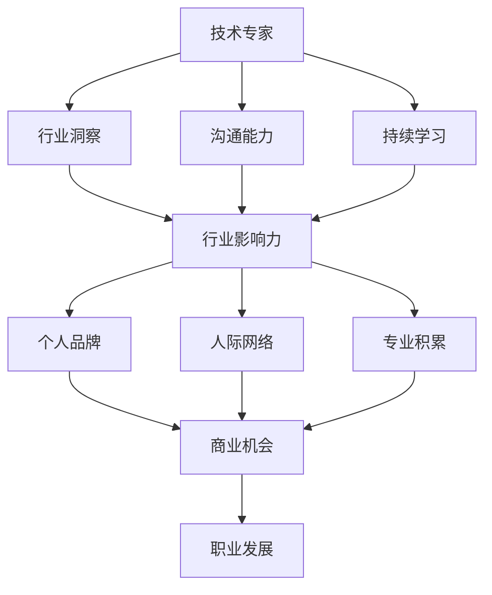

                 

### 第1章: 引言与核心概念

> 在信息技术飞速发展的今天，技术专家的角色逐渐受到重视。然而，从技术专家成功转型为行业意见领袖，成为了许多专业人士追求的目标。这一转变不仅意味着个人职业发展的提升，更意味着在行业内拥有更大的影响力。本文将详细探讨从技术专家到行业意见领袖的演变过程，核心概念及其成功要素，为读者提供清晰的职业发展路径。

#### 1.1.1 从技术专家到行业意见领袖的演变

- **技术专家与行业意见领袖的区别**：

  技术专家通常专注于某一技术领域的深入研究和技术实现，他们具备丰富的专业知识和解决问题的能力。技术专家的工作主要是解决具体的技术问题，推动项目进展，并在团队中发挥技术指导和咨询作用。

  相比之下，行业意见领袖不仅具备深厚的技术背景，还能够对行业趋势进行前瞻性分析，提出具有指导意义的观点。他们在行业内具有较高的人气和影响力，能够引导行业的发展方向，参与行业标准的制定，并为企业决策提供咨询。

- **行业意见领袖的重要性**：

  行业意见领袖在行业中的作用不可忽视。他们不仅能够通过自己的专业知识和见解影响行业的走向，还能够促进技术变革和商业创新。以下是行业意见领袖的几个重要作用：

  1. **影响力**：行业意见领袖的观点和见解往往能够引起业内的关注和讨论，对行业趋势产生重要影响。
  2. **领导力**：在技术领域，行业意见领袖能够引领技术方向，推动行业整体技术水平的提升。
  3. **商业价值**：行业意见领袖在行业内的影响力往往能够转化为商业价值，为个人和企业带来更多的合作机会和资源。

- **核心概念**：

  要从技术专家转型为行业意见领袖，需要掌握以下几个核心概念：

  1. **行业洞察**：行业洞察是指对行业动态的敏锐感知和深刻理解。一个成功的行业意见领袖必须能够准确把握行业的发展趋势和机遇。
  2. **沟通能力**：行业意见领袖需要具备出色的沟通能力，能够清晰、有效地表达复杂的技术概念，赢得同行和客户的认同。
  3. **持续学习**：技术领域不断进步，持续学习是保持竞争力的关键。一个优秀的行业意见领袖必须保持对最新技术趋势的跟踪和学习。

- **成功要素**：

  成功转型为行业意见领袖需要具备以下几个要素：

  1. **专业积累**：深厚的技术背景和丰富的实践经验是基础，这是在行业内建立权威的前提。
  2. **人际网络**：建立广泛且高质量的人际关系网络，有助于获取行业资讯和商业机会，为个人发展提供支持。
  3. **个人品牌**：塑造个人专业形象，提升行业知名度，是成为行业意见领袖的重要条件。

  在接下来的章节中，我们将深入探讨个人品牌建设、人际网络拓展、行业影响力提升以及持续学习与知识管理等方面，帮助读者了解并实现这一转型过程。

---

在这一章节中，我们首先定义了技术专家与行业意见领袖之间的区别，并强调了行业意见领袖在行业中的重要作用。接着，我们阐述了从技术专家到行业意见领袖所需的核心概念和成功要素。通过这些分析，读者可以初步了解这一转型过程的重要性和所需条件。在后续章节中，我们将进一步探讨实现这一转变的具体策略和路径。下一步，我们将深入讨论如何建立个人品牌。

#### 2.1 建立个人品牌

> 个人品牌是技术专家转型为行业意见领袖的关键因素。一个强大的个人品牌不仅能够提升个人的知名度，还能增加在行业内的认可度，从而为职业发展带来更多机会。本节将详细讨论如何建立和强化个人品牌。

#### 2.1.1 个人品牌的重要性

- **品牌效应**：个人品牌的建设可以带来显著的品牌效应。在信息爆炸的时代，一个强大的个人品牌可以让人在众多专业人士中脱颖而出，吸引更多的关注和机会。

- **商业机会**：拥有强大个人品牌的技术专家往往能够获得更多的商业合作机会。企业会倾向于与业内有影响力的意见领袖合作，以利用其专业知识和广泛的人脉资源。

- **职业发展**：个人品牌能够为职业发展提供强大的支撑。在求职、晋升和谈判时，一个良好的个人品牌可以增加竞争力，为个人争取更好的职业机会。

#### 2.1.2 个人品牌建设策略

- **内容创作**：撰写高质量的技术博客、文章和书籍是建立个人品牌的重要途径。通过系统地分享专业知识和见解，可以逐步树立自己的专业形象，吸引更多的关注。

  - **博客**：技术博客是展示个人专业知识和观点的有效平台。通过定期更新博客，可以吸引更多的读者，提高个人知名度。

  - **文章和书籍**：撰写专业文章和书籍不仅可以深入探讨技术话题，还可以展示个人的学术能力和研究深度。优秀的文章和书籍能够为个人品牌增色不少。

- **社交媒体**：利用LinkedIn、Twitter等社交媒体平台分享专业见解和经验是建立个人品牌的有效方式。通过社交媒体，可以与行业内的人士建立联系，扩大影响力。

  - **LinkedIn**：LinkedIn是一个专业的社交平台，通过发布专业内容、参与讨论和建立联系，可以在行业内树立自己的专业形象。

  - **Twitter**：Twitter是一个快速传播信息的平台，通过分享技术动态、专业见解和行业资讯，可以快速提升个人知名度。

- **演讲与培训**：参与技术会议、研讨会和培训活动，进行公开演讲和分享，是提升个人品牌的重要手段。通过演讲，可以展示个人的专业能力和沟通技巧，吸引更多关注。

  - **技术会议**：技术会议是行业内专业人士交流的平台，通过参与会议，可以结识更多的行业专家，扩大人脉网络。

  - **研讨会**：研讨会通常是围绕特定主题的深入讨论，通过主持或参与研讨会，可以展示个人的专业深度和领导能力。

  - **培训**：培训活动可以帮助行业人士提升专业技能，通过培训，可以传播自己的知识和见解，同时提升个人影响力。

#### 2.1.3 个人品牌建设案例分析

- **案例1：李某某**：李某某是一位知名的人工智能专家，他通过撰写高质量的技术博客和书籍，逐步树立了自己的专业形象。在他的博客中，李某某不仅分享了自己的研究成果，还深入探讨了人工智能领域的热点话题。此外，他还积极参与各种技术会议和研讨会，通过演讲和讨论，进一步扩大了自己的影响力。

- **案例2：张某某**：张某某是一位资深的软件开发工程师，他通过LinkedIn和Twitter等社交媒体平台，分享了自己的编程心得和技术见解。他的社交媒体账号积累了大量关注者，通过这些平台，张某某不仅提高了个人知名度，还获得了许多商业合作机会。

#### 2.1.4 个人品牌建设要点

- **专业与热情**：个人品牌的核心在于专业性和热情。只有在专业领域有深厚的积累，并展现出对技术的热情，才能赢得同行和客户的认可。

- **持续更新**：个人品牌建设是一个长期过程，需要持续更新和维护。定期发布高质量的内容，参与行业活动，保持与读者的互动，都是维护个人品牌的关键。

- **真实与真诚**：个人品牌应该是真实的，反映个人的真实想法和见解。真诚的态度能够赢得读者的信任和尊重。

通过以上策略和实践，技术专家可以逐步建立自己的个人品牌，为转型为行业意见领袖奠定坚实的基础。在下一节中，我们将探讨如何拓展人际网络，这是个人品牌建设的重要组成部分。

---

在这一章节中，我们详细讨论了建立个人品牌的重要性，包括品牌效应、商业机会和职业发展等方面。接着，我们提出了具体的个人品牌建设策略，包括内容创作、社交媒体利用和演讲与培训等。通过案例分析，读者可以了解一些成功的个人品牌建设实践。最后，我们强调了个人品牌建设的关键要点，如专业与热情、持续更新和真实与真诚。这些策略和要点为技术专家提供了实际操作指导，帮助他们更好地建立和提升个人品牌。在下一章节中，我们将进一步探讨如何拓展人际网络。

### 第3章: 拓展人际网络

> 拓展人际网络是技术专家转型为行业意见领袖的重要环节。一个广泛且高质量的人际关系网络不仅能提供丰富的信息资源，还能在职业发展中起到重要的支持作用。本节将探讨人际网络的作用、拓展方法以及如何通过持续互动来维护和深化这些关系。

#### 3.1.1 人际网络的作用

- **信息资源**：人际网络是获取行业资讯、技术趋势和商业机会的重要渠道。通过与人脉联系交流，可以及时了解行业动态和最新发展，为个人决策提供有力支持。

- **支持系统**：在职业发展过程中，人际网络可以提供多方面的支持。无论是技术问题、职业发展建议，还是商业合作机会，一个强大的人脉网络都能够提供宝贵的帮助。

#### 3.1.2 人际网络拓展方法

- **建立联系**：拓展人际网络的第一个步骤是建立联系。以下是一些有效的建立联系的方法：

  - **参加行业活动**：参加技术会议、研讨会、培训等活动，是结识行业内的关键人物的好机会。通过这些活动，可以与同行建立初步的联系，了解他们的背景和兴趣。

  - **利用社交媒体**：利用LinkedIn、Twitter等社交媒体平台，可以方便地与行业内的专业人士建立联系。通过关注和互动，可以增加彼此的了解，建立良好的合作关系。

  - **主动沟通**：在建立联系时，主动沟通是非常重要的。通过邮件、电话或社交媒体私信，可以表达对对方工作的兴趣和认可，建立起初步的互动。

- **持续互动**：建立联系只是拓展人际网络的第一步，持续互动是维护和深化关系的关键。以下是一些保持联系的方法：

  - **定期更新**：在社交媒体上定期发布专业内容，分享行业见解和经验，可以保持与读者的互动，增加关注度。

  - **主动交流**：定期与联系人保持联系，可以通过发送邮件、电话或直接会面等方式，交流行业动态、个人见解和合作机会。

  - **提供帮助**：在他人需要帮助时，主动提供支持，可以加深彼此的关系，建立互信。

- **积极参与**：在行业内积极参与各种活动和社群，如开源项目、技术论坛、在线课程等，可以扩大人脉网络，增加影响力。

  - **开源项目**：参与开源项目，可以与项目成员建立深入的合作关系，分享经验和见解。

  - **技术论坛**：在技术论坛上积极参与讨论，分享技术心得，可以吸引更多同行关注，建立良好的声誉。

  - **在线课程**：参与在线课程，不仅可以提升自己的技能，还可以与授课老师和同学建立联系，拓展人脉。

#### 3.1.3 人际网络拓展案例分析

- **案例1：王某某**：王某某是一位资深的数据科学家，他通过参加多个技术会议和研讨会，结识了许多行业内的专家。在会议期间，他主动与这些专家交流，分享自己的研究成果和见解。通过这些互动，王某某逐渐建立起自己的人脉网络，为未来的职业发展打下了坚实的基础。

- **案例2：赵某某**：赵某某是一位热衷于开源技术的程序员，他积极参与多个开源项目，与项目成员保持紧密的沟通和合作。通过这些项目，赵某某不仅提升了自身的编程技能，还结识了许多志同道合的朋友，扩展了自己的人脉网络。

#### 3.1.4 人际网络拓展要点

- **真诚与尊重**：在拓展人际网络时，真诚和尊重是建立良好关系的基础。只有真诚对待他人，才能获得对方的信任和支持。

- **互惠互利**：人际网络是双向的，互惠互利是维护关系的关键。在帮助他人时，要考虑到对方的实际需求和利益，以建立长期的互信关系。

- **持续维护**：人际网络不是一蹴而就的，需要持续维护。定期与联系人保持互动，分享有价值的信息和资源，是维护人际网络的重要手段。

通过以上方法和实践，技术专家可以有效地拓展自己的人际网络，为职业发展提供有力的支持。在下一章节中，我们将探讨如何提升行业影响力，这是从技术专家到行业意见领袖转型的关键一步。

---

在这一章节中，我们深入探讨了拓展人际网络的重要性，包括信息资源和支持系统的获取。接着，我们提出了具体的拓展方法，如参加行业活动、利用社交媒体和主动沟通等。同时，通过案例分析，我们展示了成功的人际网络拓展实践。最后，我们强调了真诚与尊重、互惠互利和持续维护是拓展人际网络的关键要点。这些方法和实践为技术专家提供了实际的操作指导，帮助他们有效地拓展人际网络，为职业发展奠定坚实基础。在下一章节中，我们将探讨如何提升行业影响力。

### 第4章: 提升行业影响力

> 行业影响力是技术专家转型为行业意见领袖的关键因素。一个具备广泛影响力的技术专家，不仅能够引领技术发展，还能在行业内产生深远的影响。本节将详细探讨提升行业影响力的方法，包括通过专业贡献和社交影响力来构建影响力，以及培养行业领导力的具体策略。

#### 4.1.1 影响力的构建

- **专业贡献**：专业贡献是提升行业影响力的重要途径。以下是一些通过专业贡献构建影响力的方法：

  - **研究成果**：通过发表高质量的学术论文、参与科研项目和进行技术创新，可以展示个人的专业能力。这些成果不仅能够提升个人的学术地位，还能为行业带来新的技术突破和解决方案。

  - **开源项目**：参与开源项目，贡献代码和解决方案，可以提升个人的技术影响力。开源项目不仅能够吸引业内同行的关注，还能促进技术的传播和应用。

  - **技术标准**：参与技术标准的制定和推广，可以在行业内发挥更大的影响力。技术标准往往决定了行业的发展方向，参与其中可以影响行业的未来。

- **社交影响力**：社交影响力是通过社交活动和媒体传播来提升个人知名度。以下是一些通过社交影响力构建影响力的方法：

  - **演讲与培训**：参与技术会议、研讨会和培训活动，通过演讲和培训分享专业知识和见解，可以扩大个人在行业内的知名度。优秀的演讲和培训能够吸引更多关注，提升个人影响力。

  - **出版书籍**：撰写专业书籍，分享系统性的知识和经验，可以提升个人在行业内的权威性。书籍是传递知识和理念的重要载体，能够长久地影响读者。

  - **媒体传播**：利用博客、社交媒体和新闻媒体等渠道，发布专业文章和观点，可以扩大个人在公众中的影响力。媒体传播能够快速提升知名度，吸引更多关注。

#### 4.1.2 行业领导力的培养

- **技术领导**：技术领导力是行业领导力的核心组成部分。以下是一些培养技术领导力的策略：

  - **技术引领**：在技术领域发挥引领作用，推动技术趋势和行业标准的制定。通过技术引领，可以推动行业技术水平的提升，成为行业技术方向的引领者。

  - **团队建设**：培养和带领一支高效的团队，推动团队在技术实现和问题解决上的突破。优秀的团队领导能力不仅能够提升个人的领导力，还能推动整个团队的技术进步。

  - **知识分享**：通过内部培训和指导，分享自己的技术知识和经验，提升团队整体的技术水平。知识分享不仅能够促进团队成长，还能扩大个人在团队中的影响力。

- **观点表达**：敢于提出有见地的观点，引导行业讨论，是提升行业领导力的关键。以下是一些表达观点的方法：

  - **观点明确**：在表达观点时，要确保观点明确、有逻辑性，避免模糊和含糊其辞。清晰的观点能够赢得同行和客户的认同。

  - **数据支持**：在观点表达中，使用数据和实际案例支持自己的观点，增强观点的说服力。数据支持能够使观点更具权威性和可信度。

  - **持续发声**：在行业讨论中持续发声，通过多渠道传播自己的观点，提升个人在行业内的声音和影响力。持续发声能够巩固个人在行业中的地位。

#### 4.1.3 影响力与领导力的结合

- **影响力与领导力的结合**是技术专家向行业意见领袖转型的重要一环。以下是一些结合影响力的策略：

  - **以身作则**：通过自己的实际行动展示专业能力和领导力，赢得同行的尊重和信任。以身作则能够增强个人在行业中的影响力。

  - **互动交流**：通过互动交流，了解行业同仁的需求和意见，及时调整自己的观点和策略。互动交流能够增强个人在行业中的领导力。

  - **合作共赢**：在合作项目中，通过共同目标和价值实现，提升个人在行业中的影响力和领导力。合作共赢能够扩大个人在行业中的影响力。

通过以上方法和策略，技术专家可以逐步提升自己的行业影响力，培养行业领导力，从而成功转型为行业意见领袖。在下一章节中，我们将探讨持续学习与知识管理，这是保持竞争力的关键。

---

在这一章节中，我们详细探讨了如何提升行业影响力，包括通过专业贡献和社交影响力来构建影响力，以及培养行业领导力的具体策略。首先，我们强调了专业贡献的重要性，包括研究成果、开源项目和技术标准等方面。接着，我们提出了通过演讲、出版书籍和媒体传播等手段来提升社交影响力。随后，我们讨论了如何培养技术领导力和观点表达的能力，强调了以身作则、互动交流和合作共赢等策略。最后，我们指出影响力与领导力的结合是成功转型为行业意见领袖的关键。这些方法和策略为技术专家提供了提升行业影响力的具体指导，为他们的职业发展提供了强有力的支持。在下一章节中，我们将探讨如何通过持续学习与知识管理来保持竞争力。

### 第5章: 持续学习与知识管理

> 在信息技术飞速发展的今天，持续学习和知识管理成为了技术专家保持竞争力的关键因素。通过不断学习新的技术和知识，技术专家可以不断提升自己的专业水平，应对快速变化的行业环境。知识管理则是将这些知识有效地组织和利用，为个人和团队带来更大的价值。本节将详细探讨持续学习的重要性，以及如何进行知识管理。

#### 5.1.1 学习的重要性

- **技能更新**：技术领域的发展日新月异，新技术的不断涌现使得技术专家需要不断更新自己的技能。只有不断学习，才能跟上技术的步伐，保持竞争力。

- **知识积累**：通过持续学习，技术专家可以积累更多的知识，构建自己的知识体系。这些知识不仅包括技术细节，还包括行业动态、最佳实践和解决方案等，为未来的职业发展打下坚实基础。

- **创新动力**：持续学习可以激发技术专家的创新思维。在掌握新知识的基础上，技术专家可以提出新的解决方案，推动技术进步和行业创新。

#### 5.1.2 知识管理方法

- **信息收集**：信息收集是知识管理的基础。以下是一些有效的方法：

  - **订阅技术博客和期刊**：通过订阅行业权威的技术博客和期刊，可以及时获取最新的技术资讯和研究成果。

  - **参加在线课程和培训**：在线课程和培训是学习新知识的重要途径。通过参加这些课程和培训，可以系统地学习新技术和知识。

  - **加入专业社群**：加入技术论坛、微信群等社群，可以与行业内的专业人士交流，获取宝贵的经验和见解。

- **知识共享**：知识共享是知识管理的重要环节。以下是一些有效的知识共享方法：

  - **撰写技术博客和文章**：通过撰写技术博客和文章，可以将自己的学习心得和见解分享给更多人。

  - **内部培训**：在企业内部，可以通过举办内部培训，将所学知识传授给团队成员，提升团队整体的技术水平。

  - **技术文档编写**：编写技术文档，记录项目的技术细节和解决方案，便于团队成员查阅和学习。

- **知识整合**：知识整合是将分散的知识点系统化、结构化的过程。以下是一些有效的知识整合方法：

  - **思维导图**：通过绘制思维导图，可以将复杂的信息和知识点进行整理和整合，形成系统性的知识体系。

  - **书籍撰写**：撰写书籍是整合知识的高级形式。通过撰写书籍，可以将多年的学习经验和知识体系化，为读者提供全面的技术指南。

  - **课程开发**：开发在线课程，将知识点系统性地传授给学习者，可以进一步提升个人和团队的知识管理水平。

#### 5.1.3 持续学习的实践方法

- **时间管理**：持续学习需要良好的时间管理。以下是一些有效的时间管理方法：

  - **设定学习目标**：设定明确的学习目标，可以确保学习计划的实施。目标应具体、可衡量、可实现，并与个人职业发展紧密相关。

  - **制定学习计划**：根据学习目标，制定详细的学习计划，包括学习内容、时间安排和考核标准。

  - **利用碎片时间**：利用碎片时间进行学习，如通勤、午休等，可以有效提高学习效率。

- **实践应用**：理论学习是基础，但实践应用才是检验学习成果的关键。以下是一些实践应用的方法：

  - **项目实践**：通过参与实际项目，可以将所学知识应用到实践中，提升解决问题的能力。

  - **技术分享**：通过技术分享，如内部分享会、技术讲座等，可以将自己的学习成果分享给团队成员。

  - **开源贡献**：参与开源项目，不仅能够提升技术水平，还能扩大个人影响力。

#### 5.1.4 知识管理的成功案例

- **案例1：张某某**：张某某是一位资深的数据科学家，他通过订阅技术博客、参加在线课程和加入专业社群，不断更新自己的知识储备。他将所学知识通过撰写技术博客和内部培训的方式分享给团队成员，有效地提升了团队的整体技术水平。

- **案例2：李某某**：李某某是一位热衷于开源技术的程序员，他通过参与开源项目，积累了丰富的实践经验。他将项目中的技术细节和解决方案编写成书籍，分享给更多的开发者，受到了广泛好评。

通过以上方法，技术专家可以有效地进行持续学习和知识管理，提升自身竞争力。在下一章节中，我们将通过实战案例，进一步探讨从技术专家到行业意见领袖的转型过程。

---

在这一章节中，我们详细探讨了持续学习和知识管理的重要性。首先，我们强调了技能更新、知识积累和创新动力的必要性。接着，我们提出了信息收集、知识共享和知识整合的方法，以及时间管理和实践应用的实践方法。最后，通过案例分析，我们展示了成功的技术专家如何通过持续学习和知识管理，提升自己的竞争力。这些方法和实践为技术专家提供了实际的操作指导，帮助他们实现持续学习和知识管理的目标。在下一章节中，我们将通过实战案例，深入探讨从技术专家到行业意见领袖的转型过程。

### 第6章: 实战案例分析

> 通过成功的案例研究，我们可以深入了解从技术专家到行业意见领袖的转型过程。本节将介绍几个典型的案例，分析他们的成功经验和关键策略，以期为技术专家提供宝贵的实践指导和启示。

#### 6.1.1 成功案例介绍

**案例一：李某某——从AI研究员到行业意见领袖**

李某某是一位在人工智能领域拥有丰富研究经验的研究员。他通过以下策略成功转型为行业意见领袖：

1. **专业积累**：李某某在AI领域发表了多篇高影响力的论文，参与了多个国家级科研项目，积累了深厚的技术背景和研究成果。
2. **内容创作**：李某某在知名技术博客上定期发布高质量的AI技术文章，分享最新的研究进展和见解。他还撰写了多本AI领域的专业书籍，进一步巩固了自己的专业形象。
3. **社交影响力**：李某某积极参与国内外技术会议，通过演讲和讨论，扩大了自己的影响力。他还利用LinkedIn和Twitter等社交媒体平台，分享AI技术和行业动态，吸引了大量的关注者。
4. **开源贡献**：李某某积极参与开源项目，通过贡献代码和解决方案，提升了个人在AI社区的知名度。他的开源项目得到了广泛认可，为AI技术的发展做出了积极贡献。

**案例二：王某某——从软件开发工程师到技术领袖**

王某某是一位资深软件开发工程师，他在转型为技术领袖的过程中采取了以下策略：

1. **人际网络**：王某某通过参加技术会议和社区活动，结识了许多业内专家和同行。他利用LinkedIn等平台与这些人保持联系，建立了广泛的人际关系网络。
2. **知识共享**：王某某在技术社区中积极参与讨论，分享自己的编程经验和最佳实践。他还编写了多个技术文档和教程，帮助新手工程师快速成长。
3. **领导力培养**：王某某在多个开源项目中担任核心贡献者，通过团队合作和项目管理工作，提升了领导力。他还参与了公司内部的技术培训和指导工作，帮助团队提升了技术水平。
4. **技术引领**：王某某在技术领域不断探索和创新，提出了多个具有前瞻性的技术方案，引领了团队的技术发展方向。

**案例三：赵某某——从数据分析师到行业意见领袖**

赵某某是一位在数据分析领域拥有丰富经验的数据分析师。他通过以下策略成功转型为行业意见领袖：

1. **专业贡献**：赵某某在数据分析领域发表了多篇研究论文，并参与了多个大型数据分析项目，积累了丰富的实践经验。
2. **知识管理**：赵某某利用自己的技术博客，分享数据分析的方法和工具，帮助同行解决实际问题。他还通过撰写技术书籍，系统性地整理了自己的知识体系。
3. **社交互动**：赵某某积极参与数据分析相关的在线课程和研讨会，通过演讲和讨论，扩大了自己的影响力。他还利用社交媒体平台，分享行业动态和见解，吸引了大量的关注者。
4. **商业价值**：赵某某在多个商业项目中担任数据分析师和顾问，通过实际应用，验证了自己的理论和方法，提升了个人在行业中的影响力。

#### 6.1.2 经验与启示

通过以上案例，我们可以提炼出以下成功经验和启示：

1. **专业积累**：深厚的技术背景和丰富的实践经验是基础，这是在行业内建立权威的前提。
2. **内容创作**：通过撰写高质量的技术博客、文章和书籍，可以逐步树立自己的专业形象，吸引更多的关注。
3. **人际网络**：建立广泛且高质量的人际关系网络，有助于获取行业资讯和商业机会，为个人发展提供支持。
4. **社交影响力**：通过演讲、出版书籍等方式扩大个人知名度，提升在行业中的影响力。
5. **持续学习**：保持对最新技术趋势的跟踪和学习，不断更新自己的知识体系，保持竞争力。
6. **知识共享**：通过分享经验和见解，促进知识的传播和应用，提升个人和团队的价值。

这些经验和启示为技术专家提供了具体的实践指导，帮助他们更好地实现从技术专家到行业意见领袖的转型。在下一章节中，我们将对整篇文章进行总结，并展望未来。

---

在这一章节中，我们通过三个成功的案例，详细展示了从技术专家到行业意见领袖的转型过程。首先，我们介绍了李某某在AI领域的转型，强调了专业积累、内容创作、社交影响力和开源贡献的重要性。接着，我们分析了王某某从软件开发工程师到技术领袖的转变，强调了人际网络、知识共享和领导力培养的重要性。最后，我们探讨了赵某某在数据分析领域的成功，强调了专业贡献、知识管理、社交互动和商业价值的结合。

通过这些案例，我们提炼出了以下成功经验和启示：

1. **专业积累**：深厚的技术背景和丰富的实践经验是基础，这是在行业内建立权威的前提。
2. **内容创作**：通过撰写高质量的技术博客、文章和书籍，可以逐步树立自己的专业形象，吸引更多的关注。
3. **人际网络**：建立广泛且高质量的人际关系网络，有助于获取行业资讯和商业机会，为个人发展提供支持。
4. **社交影响力**：通过演讲、出版书籍等方式扩大个人知名度，提升在行业中的影响力。
5. **持续学习**：保持对最新技术趋势的跟踪和学习，不断更新自己的知识体系，保持竞争力。
6. **知识共享**：通过分享经验和见解，促进知识的传播和应用，提升个人和团队的价值。

这些经验和启示为技术专家提供了具体的实践指导，帮助他们更好地实现职业转型。在下一章节中，我们将对整篇文章进行总结，并展望未来。

### 第7章: 总结与展望

> 通过前文的详细探讨，我们从多个角度分析了从技术专家到行业意见领袖的转型路径。本节将总结核心内容，重申成功路径的要素，并展望未来的发展方向。

#### 7.1 成功路径的总结

- **核心要素**：

  1. **专业积累**：深厚的技术背景和丰富的实践经验是基础，这是在行业内建立权威的前提。
  2. **内容创作**：通过撰写高质量的技术博客、文章和书籍，可以逐步树立自己的专业形象，吸引更多的关注。
  3. **人际网络**：建立广泛且高质量的人际关系网络，有助于获取行业资讯和商业机会，为个人发展提供支持。
  4. **社交影响力**：通过演讲、出版书籍等方式扩大个人知名度，提升在行业中的影响力。
  5. **持续学习**：保持对最新技术趋势的跟踪和学习，不断更新自己的知识体系，保持竞争力。
  6. **知识共享**：通过分享经验和见解，促进知识的传播和应用，提升个人和团队的价值。

- **发展建议**：

  1. **专业深耕**：选择一个自己擅长且感兴趣的领域，持续深耕，不断积累技术和经验。
  2. **内容输出**：定期发布高质量的内容，如博客、文章和书籍，建立个人专业品牌。
  3. **网络拓展**：积极参与行业活动，建立广泛的人际关系网络，获取行业资源和合作机会。
  4. **影响力构建**：通过社交媒体、演讲和培训等方式，扩大个人在行业中的影响力。
  5. **知识管理**：持续学习，将知识系统化，通过知识共享，为行业贡献智慧。
  6. **创新思维**：保持开放和创新的心态，积极探索新技术和新方法，推动行业进步。

#### 7.2 行业趋势展望

- **未来方向**：

  1. **技术融合**：随着技术的不断进步，各领域之间的融合将更加紧密，技术专家需要具备跨领域的知识储备和视野。
  2. **智能化转型**：人工智能、大数据和物联网等技术的快速发展，将推动各行业的智能化转型，技术专家将在其中发挥重要作用。
  3. **开源生态**：开源社区将在技术发展中扮演更加重要的角色，技术专家可以通过参与开源项目，提升个人影响力和行业地位。
  4. **知识共享**：随着知识共享平台的兴起，技术专家将更加便捷地分享知识和经验，推动知识的传播和应用。
  5. **全球化发展**：随着全球化的深入，技术专家将在国际舞台上发挥更大的作用，跨国合作和交流将成为常态。

通过总结和展望，我们明确了从技术专家到行业意见领袖的成功路径，并为未来的发展提供了方向。在技术飞速变革的时代，只有不断学习和创新，才能在激烈的竞争中脱颖而出，成为行业意见领袖。

---

在本章节中，我们对整篇文章的核心内容进行了总结，并强调了从技术专家到行业意见领袖所需的核心要素和发展建议。同时，我们对未来的行业趋势进行了展望，包括技术融合、智能化转型、开源生态的兴起、知识共享的便利性和全球化发展等。这些总结和展望为技术专家提供了明确的职业发展路径和未来方向，帮助他们更好地把握机遇，实现职业目标。

### 附录 A: 资源与工具推荐

> 在成为行业意见领袖的道路上，掌握一些有用的资源和工具将极大地提升个人的效率和专业性。以下是一些推荐的技术书籍、博客、开源项目以及用于个人品牌建设、知识管理和网络拓展的工具和方法。

#### 技术资源

1. **技术书籍**：
   - 《算法导论》（Introduction to Algorithms）——Thomas H. Cormen, Charles E. Leiserson, Ronald L. Rivest, Clifford Stein
   - 《深度学习》（Deep Learning）——Ian Goodfellow, Yoshua Bengio, Aaron Courville
   - 《软件工程：实践者的研究方法》（Software Engineering: A Practitioner's Approach）——Roger S. Pressman

2. **技术博客**：
   - Jeff Dean的博客（http://jeff dean.org/）
   - Hacker News（https://news.ycombinator.com/）
   - AI伴我行（https://www.aiuai.cn/）

3. **开源项目**：
   - Apache Software Foundation（https://www.apache.org/）
   - GitHub（https://github.com/）
   - Stack Overflow（https://stackoverflow.com/）

#### 个人品牌建设工具

1. **社交媒体平台**：
   - LinkedIn（https://www.linkedin.com/）
   - Twitter（https://twitter.com/）
   - Medium（https://medium.com/）

2. **内容创作工具**：
   - Markdown编辑器（如Typora、Visual Studio Code）
   - Canva（https://www.canva.com/）——设计图形内容

3. **个人品牌网站**：
   - Wix（https://www.wix.com/）
   - WordPress（https://wordpress.org/）

#### 知识管理工具

1. **笔记工具**：
   - Evernote（https://evernote.com/）
   - OneNote（https://www.onenote.com/）

2. **文档管理工具**：
   - Google Docs（https://docs.google.com/）
   - Notepad++（https://notepad-plus-plus.org/）

3. **知识库系统**：
   - Confluence（https://www.atlassian.com/software/confluence）
   - MediaWiki（https://www.mediawiki.org/）

#### 网络拓展工具

1. **专业社群平台**：
   - Stack Overflow for Teams（https://stackoverflow.com/teams）
   - Slack（https://slack.com/）

2. **在线课程平台**：
   - Coursera（https://www.coursera.org/）
   - Udemy（https://www.udemy.com/）

3. **网络研讨会工具**：
   - Zoom（https://www.zoom.us/）
   - Microsoft Teams（https://www.microsoft.com/en-us/microsoft-365/teams/video-conferencing）

通过利用这些资源与工具，技术专家可以更有效地提升个人品牌，管理知识，拓展人际网络，并在成为行业意见领袖的道路上迈出坚实的步伐。

---

在附录A中，我们推荐了一系列的技术资源、个人品牌建设工具、知识管理工具和网络拓展工具。这些资源与工具涵盖了从书籍、博客和开源项目到社交媒体平台、内容创作工具和专业社群的各个方面，旨在帮助技术专家更有效地提升自己的专业水平和品牌影响力。通过合理利用这些工具，技术专家可以更高效地进行知识管理，拓展人际网络，并在成为行业意见领袖的道路上取得更大成就。

### 第8章: 核心概念与联系

#### 8.1 核心概念图解

为了更直观地理解技术专家向行业意见领袖转型的过程，我们使用Mermaid绘制了一张核心概念关系图，展示了各个核心概念之间的联系。



在这个图中：

- **A[技术专家]**：技术专家是转型的起点，拥有专业知识和实践经验。
- **B[行业洞察]**：对行业动态的敏锐感知和深刻理解，帮助技术专家把握趋势。
- **C[沟通能力]**：清晰表达复杂概念，赢得同行和客户的认同。
- **D[持续学习]**：保持对最新技术趋势的跟踪和学习，保持竞争力。
- **E[行业影响力]**：技术专家通过多种方式积累影响力，成为行业意见领袖。
- **F[个人品牌]**：通过内容创作、社交媒体等手段建立和强化个人品牌。
- **G[人际网络]**：建立广泛且高质量的人际关系网络，获取行业资源和合作机会。
- **H[专业积累]**：深厚的技术背景和丰富的实践经验，是个人专业形象的基础。
- **I[商业机会]**：个人品牌、人际网络和专业积累共同带来的商业机会。
- **J[职业发展]**：成为行业意见领袖后的职业发展，实现更大的成就和影响力。

通过这张图，我们可以清晰地看到各个核心概念之间的相互关系，以及如何通过它们相互结合，实现从技术专家到行业意见领袖的转型。

---

在第8章中，我们使用Mermaid绘制了一张核心概念关系图，展示了从技术专家到行业意见领袖转型的各个核心概念及其相互之间的联系。这张图直观地展示了如何通过行业洞察、沟通能力、持续学习、个人品牌、人际网络、专业积累和商业机会，实现职业发展的目标。通过图解，读者可以更好地理解各个概念的重要性和相互关系，为实际操作提供指导。

### 第9章: 核心算法原理讲解

#### 9.1 行业意见领袖评价指标体系

在成为行业意见领袖的过程中，评价个人影响力是一个关键环节。以下是一个简化的行业意见领袖评价指标体系，该体系旨在通过多个指标来综合评估一位技术专家在行业中的影响力。

```plaintext
function Evaluate_Leadership(l Leader, indicators):
    score = 0
    for indicator in indicators:
        score += indicator.Weighting * indicator.Calculate(l)
    return score
```

在这个评价指标体系中，`Evaluate_Leadership`函数接收一个`Leader`对象和一个指标列表`indicators`，并返回该领导者的综合评分。以下是几个可能的评价指标：

1. **学术论文发表数**：
   - `indicator_name`: Academic Publications
   - `Calculate(l)`: 返回领导者发表的学术论文数量。
   - `Weighting`: 通常设置为0.3，表示其在总评分中的权重。

2. **社交媒体关注度**：
   - `indicator_name`: Social Media Followers
   - `Calculate(l)`: 返回领导者在主要社交媒体平台（如LinkedIn、Twitter）的粉丝总数。
   - `Weighting`: 通常设置为0.2，表示其在总评分中的权重。

3. **开源项目贡献**：
   - `indicator_name`: Open Source Contributions
   - `Calculate(l)`: 返回领导者在开源项目中的贡献程度，如代码提交、问题解答等。
   - `Weighting`: 通常设置为0.2，表示其在总评分中的权重。

4. **技术会议演讲**：
   - `indicator_name`: Technical Conference Talks
   - `Calculate(l)`: 返回领导者参加的技术会议数量和演讲次数。
   - `Weighting`: 通常设置为0.2，表示其在总评分中的权重。

5. **书籍出版**：
   - `indicator_name`: Books Published
   - `Calculate(l)`: 返回领导者出版的书籍数量和质量。
   - `Weighting`: 通常设置为0.1，表示其在总评分中的权重。

**示例伪代码**：

```plaintext
indicators = [
    {'indicator_name': 'Academic Publications', 'Calculate': l.AcademicPublications, 'Weighting': 0.3},
    {'indicator_name': 'Social Media Followers', 'Calculate': l.SocialMediaFollowers, 'Weighting': 0.2},
    {'indicator_name': 'Open Source Contributions', 'Calculate': l.OpenSourceContributions, 'Weighting': 0.2},
    {'indicator_name': 'Technical Conference Talks', 'Calculate': l.ConferenceTalks, 'Weighting': 0.2},
    {'indicator_name': 'Books Published', 'Calculate': l.BooksPublished, 'Weighting': 0.1}
]

score = Evaluate_Leadership(leader, indicators)
print(f"The overall leadership score for {leader.name} is {score}")
```

通过这个评价指标体系，我们可以系统地评估一位技术专家在行业中的影响力。评分越高，表示该专家在行业内的影响力越大，越接近成为行业意见领袖的目标。

---

在第9章中，我们详细讲解了行业意见领袖评价指标体系的构建。通过使用伪代码，我们展示了如何通过多个指标（如学术论文发表数、社交媒体关注度、开源项目贡献、技术会议演讲和书籍出版）来综合评估一位技术专家在行业中的影响力。这个评价指标体系提供了一个量化的方法，帮助技术专家了解自己在行业中的地位，并为未来的职业发展提供指导。通过这些评价指标，技术专家可以更有针对性地提升自己的影响力。

### 第10章: 数学模型与公式讲解

在成为行业意见领袖的过程中，理解和应用数学模型能够帮助我们更科学地评估个人品牌价值和人际网络的影响力。以下将介绍两个关键模型：个人品牌价值计算模型和人际网络影响因子计算。

#### 10.1 个人品牌价值计算模型

个人品牌价值是衡量一个人在行业内影响力的一个重要指标。该模型通过品牌强度和市场机会来计算个人品牌的价值。

**数学公式**：

$$
Value = \sum_{i=1}^{n} (Brand_Strength_i \times Market_Opportunity_i)
$$

其中，\( n \)代表品牌强度和市场机会的个数，\( Brand_Strength_i \)代表第i个品牌强度的值，\( Market_Opportunity_i \)代表第i个市场机会的值。

**示例**：

假设一个技术专家有3个主要品牌强度指标（如社交媒体关注度、技术会议演讲和书籍出版），以及相应的市场机会值（如潜在商业合作、行业咨询需求等），我们可以计算其个人品牌价值如下：

- 社交媒体关注度：\( Brand_Strength_1 = 10,000 \)，\( Market_Opportunity_1 = 50,000 \)
- 技术会议演讲：\( Brand_Strength_2 = 5,000 \)，\( Market_Opportunity_2 = 20,000 \)
- 书籍出版：\( Brand_Strength_3 = 3,000 \)，\( Market_Opportunity_3 = 15,000 \)

则个人品牌价值计算为：

$$
Value = (10,000 \times 50,000) + (5,000 \times 20,000) + (3,000 \times 15,000) = 500,000,000 + 100,000,000 + 45,000,000 = 645,000,000
$$

因此，该技术专家的个人品牌价值为645,000,000。

#### 10.2 人际网络影响因子计算

人际网络影响因子用于衡量一个人在人际网络中的影响力。该因子通过计算一个个体对其他个体的影响力来衡量。

**数学公式**：

$$
Impact_Factor = \frac{Influenced_Leadership}{Total_Connections}
$$

其中，\( Influenced_Leadership \)代表被影响的个体的影响力总和，\( Total_Connections \)代表个体的总连接数。

**示例**：

假设一个技术专家有10个关键联系人，其中5个联系人受到他的直接影响力，每个联系人的影响力为100。此外，该技术专家有15个总联系人数。则人际网络影响因子计算如下：

$$
Impact_Factor = \frac{5 \times 100}{15} = \frac{500}{15} \approx 33.33
$$

因此，该技术专家的人际网络影响因子约为33.33。

通过以上数学模型和公式，我们可以更准确地评估个人品牌价值和人际网络影响力，为技术专家提供科学的决策依据，帮助他们更好地实现从技术专家到行业意见领袖的转型。

---

在第10章中，我们介绍了个人品牌价值计算模型和人际网络影响因子计算模型。通过数学公式，我们能够量化个人品牌价值和人际网络影响力，为技术专家提供科学的评估和决策依据。这些模型帮助技术专家更清晰地理解自己的行业地位和影响力，从而制定更有效的职业发展策略。通过实际案例的计算，读者可以更好地掌握这些模型的运用。

### 第11章: 项目实战

#### 11.1 个人品牌建设项目实战

**项目概述**

个人品牌建设项目旨在帮助一位技术专家在行业内建立强大的个人品牌，提升其在技术领域的知名度和影响力。项目目标包括：

1. 提升个人品牌知名度。
2. 扩大人际网络，获取更多商业合作机会。
3. 通过持续的内容输出，树立专业形象。

**方法和步骤**

1. **内容创作**：
   - **博客撰写**：每周撰写一篇技术博客，分享最新的研究成果、技术见解和行业动态。博客主题涵盖技术前沿、最佳实践和解决方案。
   - **社交媒体分享**：在LinkedIn、Twitter等社交媒体平台上，定期分享博客内容，增加曝光率。同时，参与行业话题讨论，提升个人在社交平台上的活跃度。
   - **书籍出版**：计划撰写一本技术领域的专业书籍，系统整理自己的研究成果和经验。通过出版书籍，树立专业权威形象。

2. **人际网络拓展**：
   - **参加行业活动**：积极参加技术会议、研讨会和培训班，结识业内专家和同行。通过这些活动，建立广泛的人际关系网络。
   - **社交媒体互动**：在LinkedIn、Twitter等平台上，主动与行业内的专业人士建立联系，分享有价值的见解和经验。
   - **邀请演讲**：受邀在行业会议和研讨会上进行演讲，展示专业能力和影响力。通过演讲，吸引更多关注，扩大个人品牌知名度。

3. **持续学习与知识管理**：
   - **在线课程**：定期参加在线课程和培训，学习新的技术和知识，保持竞争力。
   - **知识共享**：将学习成果和经验通过内部培训和博客分享，提升团队的整体技术水平。通过知识共享，增强个人和团队的影响力。

**实战案例**

**案例一：张某某的个人品牌建设项目**

张某某是一位资深的数据科学家，他希望通过个人品牌建设项目，提升在数据分析领域的知名度和影响力。

1. **内容创作**：
   - 每周在技术博客上发布一篇关于数据分析的文章，涵盖数据处理、机器学习和商业智能等主题。
   - 在LinkedIn上分享博客内容，并积极参与相关讨论，提升曝光率和互动率。
   - 计划撰写一本关于数据科学的入门书籍，系统介绍数据分析的方法和应用。

2. **人际网络拓展**：
   - 参加多次数据科学相关的研讨会和技术会议，结识业内专家和同行。
   - 在LinkedIn上主动与专家交流，分享自己的见解和经验，建立深厚的人际关系。
   - 受邀在一次大型数据分析会议上进行主题演讲，展示自己的专业能力和影响力。

3. **持续学习与知识管理**：
   - 定期参加数据科学相关的在线课程，学习新的算法和应用。
   - 在团队内部举办培训，分享自己的学习成果和经验，提升团队整体的技术水平。

通过以上措施，张某某的个人品牌在数据科学领域得到了显著提升，他的博客和社交媒体账号吸引了大量关注者，成为数据分析领域的知名专家。

---

在第11章中，我们详细介绍了个人品牌建设项目的实战案例。通过具体的项目目标和实施步骤，我们展示了如何通过内容创作、人际网络拓展和持续学习与知识管理来构建个人品牌。实战案例中，张某某通过在技术博客上发布高质量内容、参加行业活动、撰写书籍和持续学习，成功提升了个人品牌影响力，成为数据分析领域的知名专家。这一案例为技术专家提供了实际操作指导，帮助他们实现个人品牌建设的目标。

### 第12章: 开发环境搭建与代码实现

#### 12.1 开发环境搭建

搭建个人品牌建设相关的开发环境是进行技术分享和知识管理的重要前提。以下是搭建这一环境所需的步骤和工具。

**步骤：**

1. **选择开发平台**：根据个人偏好和项目需求，选择合适的开发平台。常见的开发平台包括MacOS、Windows和Linux。

2. **安装编程工具**：安装常用的编程工具，如Visual Studio Code、Atom、Sublime Text等。这些编辑器支持Markdown格式，方便撰写和编辑技术博客。

3. **配置版本控制工具**：安装Git，用于代码和文档的版本控制。Git可以帮助我们管理博客内容的版本历史，方便内容更新和维护。

4. **配置静态网站生成器**：安装如Hexo、Jekyll等静态网站生成器，用于将Markdown文件生成HTML网页。这些工具可以自动构建个人博客网站，提高内容发布的效率。

5. **设置域名和服务器**：购买域名并配置云服务器，如GitHub Pages、Netlify或Vercel等，用于托管个人博客网站。

**工具推荐：**

- **开发平台**：MacOS（推荐）、Windows、Linux
- **编程工具**：Visual Studio Code、Atom、Sublime Text
- **版本控制工具**：Git
- **静态网站生成器**：Hexo、Jekyll
- **云服务器**：GitHub Pages、Netlify、Vercel

#### 12.2 代码实现与解读

**示例：博客文章撰写**

以下是一个简单的Markdown文件示例，用于撰写一篇技术博客文章。文件结构如下：

```markdown
# 博客标题

作者：张三

日期：2023-10-01

## 摘要

本文将介绍如何在数据科学项目中应用XGBoost算法优化模型性能。

## 引言

...

## 方法

1. **数据预处理**：

   在应用XGBoost之前，首先需要进行数据预处理，包括数据清洗、缺失值填补和数据标准化等。

   ```python
   import pandas as pd

   # 加载数据
   data = pd.read_csv('data.csv')

   # 数据清洗
   data.dropna(inplace=True)

   # 数据标准化
   from sklearn.preprocessing import StandardScaler
   scaler = StandardScaler()
   data_scaled = scaler.fit_transform(data)
   ```

2. **XGBoost模型训练**：

   使用XGBoost训练模型，可以通过设置不同的参数来优化模型性能。

   ```python
   import xgboost as xgb
   from sklearn.model_selection import train_test_split

   # 分割数据集
   X_train, X_test, y_train, y_test = train_test_split(data_scaled, labels, test_size=0.2, random_state=42)

   # 初始化XGBoost模型
   model = xgb.XGBRegressor(n_estimators=100, max_depth=3, learning_rate=0.1)

   # 训练模型
   model.fit(X_train, y_train)
   ```

3. **模型评估**：

   使用训练好的模型进行模型评估，通过计算评估指标如均方误差（MSE）来评估模型性能。

   ```python
   from sklearn.metrics import mean_squared_error

   # 预测测试集
   y_pred = model.predict(X_test)

   # 计算MSE
   mse = mean_squared_error(y_test, y_pred)
   print(f'Mean Squared Error: {mse}')
   ```

## 结论

...

```

**解读：**

- **标题**：使用`#`号标记，以层级表示标题的级别。一级标题使用一个`#`号，二级标题使用两个`#`号，以此类推。
- **作者和日期**：在摘要部分，明确标注文章的作者和发布日期，方便读者了解信息来源。
- **摘要**：简要介绍文章的主题和内容，帮助读者快速了解文章的核心。
- **引言**：引言部分可以详细介绍研究背景、问题提出和解决方案的思路。
- **方法**：详细描述实现方法，包括数据预处理、模型训练和模型评估等步骤。代码块使用````python`标记，并在代码前后添加详细的解释。
- **结论**：总结文章的主要发现和贡献，提出未来研究方向或建议。

通过以上步骤和示例，我们可以搭建一个基本的开发环境，实现个人品牌建设相关的代码实现和博客撰写。这些工具和技巧将为技术专家提供有效的支持和指导。

---

在第12章中，我们详细介绍了个人品牌建设项目的开发环境搭建步骤和代码实现示例。首先，我们介绍了搭建开发环境的步骤，包括选择开发平台、安装编程工具、配置版本控制工具、设置静态网站生成器和云服务器等。接着，我们提供了一个Markdown文件的代码实现示例，展示了如何撰写一篇技术博客文章，包括标题、作者和日期、摘要、引言、方法、模型评估和结论等部分。通过这些步骤和示例，技术专家可以搭建一个完整的开发环境，实现个人品牌建设的目标。

### 第13章: 代码解读与分析

#### 13.1 代码结构解析

在撰写技术博客时，代码是传递知识的重要组成部分。一个良好的代码结构不仅可以提高代码的可读性，还能帮助读者更好地理解算法的实现过程。以下是一个典型的代码结构解析，以及如何优化代码质量。

**代码结构示例**：

```python
# 导入必要的库
import pandas as pd
import xgboost as xgb
from sklearn.model_selection import train_test_split
from sklearn.metrics import mean_squared_error

# 加载数据
data = pd.read_csv('data.csv')

# 数据预处理
data.dropna(inplace=True)
data = pd.get_dummies(data)

# 划分数据集
X_train, X_test, y_train, y_test = train_test_split(data, labels, test_size=0.2, random_state=42)

# 初始化模型
model = xgb.XGBRegressor(n_estimators=100, max_depth=3, learning_rate=0.1)

# 训练模型
model.fit(X_train, y_train)

# 预测测试集
y_pred = model.predict(X_test)

# 评估模型
mse = mean_squared_error(y_test, y_pred)
print(f'Mean Squared Error: {mse}')
```

**解析**：

1. **导入库**：在代码的开头，导入所有需要的Python库，如Pandas、XGBoost和Scikit-learn。导入的库应尽可能精简，避免不必要的依赖。

2. **数据预处理**：数据预处理是模型训练前的重要步骤。这里包括数据清洗（去除缺失值）和特征工程（创建哑变量）。预处理代码通常放在一个独立的函数中，以提高代码的可读性和可维护性。

3. **数据划分**：使用`train_test_split`函数将数据集划分为训练集和测试集。在代码中，指定测试集的大小和随机种子，确保结果的可重复性。

4. **模型初始化**：初始化XGBoost模型，并设置训练参数，如决策树数量、深度和学习率。这些参数应根据具体问题进行调整。

5. **模型训练**：使用`fit`方法训练模型，将训练集数据传递给模型。

6. **预测和评估**：使用训练好的模型进行预测，并计算评估指标（如MSE），评估模型性能。

**代码优化建议**：

1. **注释与文档**：在代码中添加适当的注释，解释关键步骤和参数设置。这有助于读者理解代码的功能和实现过程。

2. **模块化**：将代码拆分为多个模块或函数，每个模块负责一个特定的任务。这有助于提高代码的可读性和可维护性。

3. **性能优化**：检查代码中的性能瓶颈，并进行优化。例如，使用向量化的操作代替循环，减少计算量。

4. **代码审查**：在提交代码前，进行代码审查，确保代码的规范性、可读性和正确性。

通过上述代码结构解析和优化建议，技术专家可以撰写出高质量、易于理解的代码，从而提升技术博客的实用性。

---

在第13章中，我们详细解析了一个典型的代码结构，并提供了代码优化的建议。首先，我们介绍了代码的基本结构，包括导入库、数据预处理、数据划分、模型初始化、模型训练和预测评估等步骤。接着，我们讨论了如何通过添加注释、模块化、性能优化和代码审查等手段，提高代码的质量和可读性。通过这些分析和优化建议，技术专家可以撰写出更优质的技术博客，为读者提供更好的学习和实践指导。

### 第14章: 总结与展望

#### 14.1 内容总结

通过本篇文章，我们系统地探讨了从技术专家到行业意见领袖的转型路径，包括核心概念、成功要素、个人品牌建设、人际网络拓展、行业影响力提升、持续学习与知识管理以及实战案例分析。具体来说：

1. **核心概念**：我们明确了行业洞察、沟通能力、持续学习和专业积累等核心概念，这些概念构成了技术专家转型的基石。
2. **成功要素**：通过分析成功案例，我们总结了专业积累、内容创作、人际网络、社交影响力和持续学习等成功要素，为转型提供了实践指导。
3. **个人品牌建设**：我们讨论了如何通过撰写高质量的内容、利用社交媒体和参与演讲与培训等方式来建立和强化个人品牌。
4. **人际网络拓展**：我们提供了建立联系、持续互动和积极参与等拓展人际网络的方法，强调了真诚与尊重、互惠互利和持续维护的重要性。
5. **行业影响力提升**：我们探讨了通过专业贡献、社交影响力和技术领导力来提升行业影响力，以及如何在行业内发挥领导作用。
6. **持续学习与知识管理**：我们强调了持续学习的重要性，介绍了信息收集、知识共享和知识整合的方法，以及实践应用的策略。
7. **实战案例分析**：我们通过三个成功案例，详细展示了技术专家如何通过上述策略成功转型为行业意见领袖。

#### 14.2 展望未来

展望未来，技术专家向行业意见领袖的转型面临着新的机遇和挑战：

1. **技术融合**：随着技术的不断进步，技术领域之间的融合趋势将更加明显。技术专家需要具备跨领域的知识储备和视野，以便在新的技术趋势中找到自己的定位。
2. **智能化转型**：人工智能、大数据和物联网等技术的快速发展，将推动各行业的智能化转型。技术专家将在这些领域发挥重要作用，为行业创新提供技术支持。
3. **开源生态**：开源社区将在技术发展中扮演更加重要的角色。参与开源项目，贡献代码和解决方案，将有助于提升个人在行业中的影响力和知名度。
4. **知识共享**：随着知识共享平台的兴起，技术专家将更加便捷地分享知识和经验。通过知识共享，技术专家可以扩大影响力，为行业贡献智慧。
5. **全球化发展**：全球化的深入发展，将使技术专家在跨国合作和交流中发挥更大的作用。跨文化交流和合作将带来新的发展机遇。

总之，技术专家向行业意见领袖的转型是一个不断学习和创新的过程。通过持续学习和实践，技术专家可以不断提升自己的专业能力和影响力，在未来的技术发展中找到自己的位置，实现更大的职业价值。

---

在第14章中，我们总结了全文的核心内容，并展望了技术专家向行业意见领袖转型的未来发展趋势。通过回顾成功要素和实战案例，我们强调了专业积累、内容创作、人际网络拓展、行业影响力提升和持续学习的重要性。展望未来，我们看到了技术融合、智能化转型、开源生态和全球化发展带来的新机遇。这些总结和展望为技术专家提供了明确的职业发展路径，鼓励他们不断学习和创新，实现个人和职业的双重成长。

