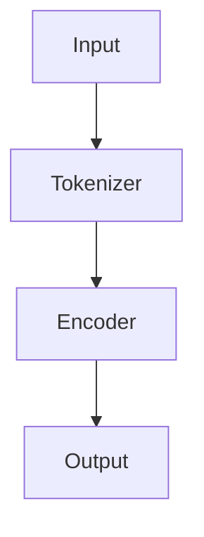

                 

# 《从零开始大模型开发与微调：BERT实战文本分类》

## 关键词

BERT，自然语言处理，文本分类，预训练，微调，迁移学习，情感分析，命名实体识别，问答系统

## 摘要

本文旨在为初学者和有一定基础的读者提供一份系统、详细的BERT模型开发与微调指南，特别是针对文本分类任务。通过逐步分析BERT的背景、模型架构、预训练与微调方法，本文将帮助读者深入理解BERT的核心原理和应用。同时，本文还将通过实战案例展示BERT在文本分类任务中的实际操作，以及如何利用BERT进行微调和迁移学习。最后，本文还将探讨BERT在特定领域的应用和未来研究方向。

## 目录大纲

### 第一部分: BERT基础知识

#### 第1章: BERT概述

- 1.1 BERT的背景与核心思想
- 1.2 BERT模型架构
- 1.3 BERT预训练与微调
- 1.4 BERT的变种与改进

#### 第2章: 自然语言处理基础

- 2.1 词嵌入技术
- 2.2 序列模型与注意力机制
- 2.3 Transformer模型原理

#### 第3章: BERT技术基础

- 3.1 Transformer数学模型
- 3.2 BERT数学模型
- 3.3 BERT的预训练方法

#### 第4章: BERT在文本分类任务中的应用

- 4.1 文本分类任务概述
- 4.2 BERT在文本分类中的使用
- 4.3 BERT文本分类实战案例

### 第二部分: BERT微调与迁移学习

#### 第5章: BERT微调与迁移学习概述

- 5.1 微调与迁移学习的关系
- 5.2 BERT微调方法
- 5.3 BERT迁移学习方法

#### 第5章: BERT迁移学习实战案例

- 5.1 数据集选择与预处理
- 5.2 模型训练与评估
- 5.3 代码实现与解读

### 第三部分: BERT在特定领域的应用

#### 第6章: BERT在情感分析中的应用

- 6.1 情感分析任务概述
- 6.2 BERT在情感分析中的应用

#### 第6章: BERT在命名实体识别中的应用

- 6.1 命名实体识别任务概述
- 6.2 BERT在命名实体识别中的应用

#### 第6章: BERT在问答系统中的应用

- 6.1 问答系统任务概述
- 6.2 BERT在问答系统中的应用

### 第四部分: BERT的优化与扩展

#### 第7章: BERT优化方法

- 7.1 模型压缩
- 7.2 模型加速

#### 第7章: BERT扩展技术

- 7.1 多语言BERT模型
- 7.2 基于BERT的生成模型

#### 第7章: BERT在NLP领域的未来发展

- 7.1 BERT在NLP领域的新趋势
- 7.2 BERT的未来研究方向

### 附录

#### 附录A: BERT开发工具与资源

- 主流深度学习框架对比
- BERT相关库与工具

#### 附录B: 实战项目代码解读

- 项目环境搭建
- 源代码详细实现
- 代码解读与分析

## 第一部分: BERT基础知识

### 第1章: BERT概述

BERT（Bidirectional Encoder Representations from Transformers）是一种预训练自然语言处理模型，由Google Research在2018年提出。BERT的核心思想是利用大规模语料库进行预训练，从而学习到语言的深度表示。BERT通过双向Transformer结构，同时考虑上下文信息，使得模型能够更好地理解语言的复杂结构。

#### 1.1 BERT的背景与核心思想

BERT的提出背景可以追溯到早期的自然语言处理模型。在2017年，Google Research提出了Transformer模型，这是一种基于自注意力机制的序列到序列模型，相比于传统的循环神经网络（RNN）和长短期记忆网络（LSTM），Transformer在机器翻译任务上表现出了优越的性能。基于这一成功，Google Research决定进一步探索Transformer模型在自然语言处理领域的潜力。

BERT的核心思想是通过预训练和微调的方式，利用大规模语料库学习到语言的深度表示。预训练过程中，BERT模型通过两个任务进行学习：Masked Language Model（MLM）和Next Sentence Prediction（NSP）。MLM任务是在输入文本中随机遮盖一些词，然后让模型预测这些词；NSP任务是预测两个句子是否相邻。

#### 1.2 BERT模型架构

BERT模型基于Transformer模型，其核心结构包括编码器（Encoder）和解码器（Decoder）。编码器负责将输入文本转换为固定长度的向量表示，而解码器负责生成文本。

以下是BERT模型的结构示意图：



1. **Tokenizer**：将输入文本转换为词元序列。
2. **Encoder**：编码器由多个自注意力层（Self-Attention Layer）和前馈神经网络（Feed Forward Neural Network）组成。每个自注意力层负责处理输入文本的上下文信息，并通过多轮迭代，将输入文本转换为固定长度的向量表示。
3. **Output**：解码器生成输出文本。

#### 1.3 BERT预训练与微调

BERT的预训练过程包括Masked Language Model（MLM）和Next Sentence Prediction（NSP）两个任务。

1. **Masked Language Model（MLM）**：在输入文本中随机遮盖一些词，然后让模型预测这些词。这一任务旨在让模型学习到单词在上下文中的含义。
2. **Next Sentence Prediction（NSP）**：预测两个句子是否相邻。这一任务旨在让模型学习到句子之间的关联性。

预训练完成后，BERT模型可以通过微调（Fine-tuning）的方式应用于各种下游任务，如文本分类、命名实体识别、情感分析等。

#### 1.4 BERT的变种与改进

自BERT提出以来，研究人员对其进行了多方面的改进和变种，以适应不同的应用场景。以下是一些主要的BERT变种：

1. **RoBERTa**：RoBERTa是BERT的一个改进版本，其主要变化包括动态掩码策略、句子级别的正样本增强、并行数据读取等，这些改进使得RoBERTa在多个任务上取得了比BERT更好的性能。
2. **ALBERT**：ALBERT（A Linearly Scaling BERT）通过引入两个关键创新，即“交叉层多头注意力”和“掩码前馈”来降低模型参数数量，同时保持高性能。
3. **DeBERTa**：DeBERTa是BERT的一种解掩码变体，通过将掩码机制扩展到词汇层面，使模型能够更好地理解词汇间的依赖关系。
4. **其他变种模型**：如MiniLM、Dyformer、Denoising BERT等，这些变种模型在BERT的基础上进行了进一步的改进，以适应不同的应用场景。

### 第2章: 自然语言处理基础

在深入探讨BERT之前，我们需要了解自然语言处理（NLP）的一些基本概念和技术，这些将为后续内容打下坚实的基础。

#### 2.1 词嵌入技术

词嵌入（Word Embedding）是将单词映射为向量的技术，这些向量表示了单词在语义上的相似性。词嵌入技术可以有效地将语义信息转化为计算机可以处理的形式，从而在NLP任务中发挥重要作用。

常见的词嵌入技术包括：

1. **Word2Vec**：Word2Vec是一种基于神经网络的词嵌入技术，通过训练神经网络来预测单词的上下文，从而学习到单词的向量表示。
2. **GloVe**：GloVe（Global Vectors for Word Representation）是一种基于共现关系的词嵌入技术，通过计算单词的共现矩阵来学习单词的向量表示。
3. **fastText**：fastText是一种基于词袋模型的词嵌入技术，通过训练一个多层的神经网络来学习单词的向量表示。

#### 2.2 序列模型与注意力机制

序列模型（Sequential Model）是一类用于处理序列数据的神经网络模型，如循环神经网络（RNN）和长短期记忆网络（LSTM）。这些模型通过递归地处理输入序列，学习到序列中的依赖关系。

注意力机制（Attention Mechanism）是一种用于捕捉序列中依赖关系的机制，通过为序列中的每个元素分配不同的权重，使得模型能够关注到最重要的部分。注意力机制在NLP任务中得到了广泛应用，如机器翻译、文本分类等。

#### 2.3 Transformer模型原理

Transformer模型是一种基于自注意力机制的序列到序列模型，最初由Vaswani等人于2017年提出。Transformer模型的核心思想是使用自注意力机制来替代传统的循环神经网络，从而实现并行计算，提高模型的计算效率。

Transformer模型包括编码器（Encoder）和解码器（Decoder）两部分。编码器负责将输入序列转换为固定长度的向量表示，解码器则负责生成输出序列。

1. **自注意力机制**：自注意力机制是一种用于处理序列数据的注意力机制，通过为序列中的每个元素计算一个权重向量，然后将这些权重向量相加，得到序列的表示。自注意力机制使得模型能够同时关注到序列中的所有元素，从而更好地捕捉到序列中的依赖关系。
2. **编码器与解码器**：编码器和解码器由多个自注意力层和前馈神经网络组成。编码器将输入序列转换为固定长度的向量表示，解码器则通过自注意力机制和交叉注意力机制，生成输出序列。

### 第3章: BERT技术基础

在本章中，我们将深入探讨BERT的技术基础，包括Transformer数学模型、BERT数学模型以及BERT的预训练方法。

#### 3.1 Transformer数学模型

Transformer模型的核心是自注意力机制（Self-Attention），其数学基础主要包括点积注意力（Dot-Product Attention）和多头注意力（Multi-Head Attention）。

##### 点积注意力（Dot-Product Attention）

点积注意力是一种计算注意力权重的方法，其计算公式如下：

$$
\text{Attention}(Q, K, V) = \text{softmax}\left(\frac{QK^T}{\sqrt{d_k}}\right)V
$$

其中，$Q$、$K$、$V$ 分别是编码器（Encoder）和解码器（Decoder）中的查询（Query）、键（Key）和值（Value）向量，$d_k$ 是键向量的维度。$QK^T$ 的结果是一个矩阵，其中的每个元素表示两个向量之间的相似度，通过softmax函数将这些相似度归一化，得到注意力权重。最后，将这些权重与值向量相乘，得到注意力分数。

##### 多头注意力（Multi-Head Attention）

多头注意力是将输入序列分成多个子序列，然后分别应用点积注意力。多头注意力的计算公式如下：

$$
\text{MultiHead}(Q, K, V) = \text{softmax}\left(\frac{QW_QK^T}{\sqrt{d_k}}\right)W_V
$$

其中，$W_Q$、$W_K$ 和 $W_V$ 是参数矩阵，分别对应于查询、键和值。$MultiHead$ 函数表示将多个子序列的注意力结果拼接起来。

##### Transformer数学模型

Transformer模型包括编码器（Encoder）和解码器（Decoder）两部分，其数学模型如下：

1. **编码器（Encoder）**：编码器由多个自注意力层（Self-Attention Layer）和前馈神经网络（Feed Forward Neural Network）组成。每个自注意力层负责计算输入序列的注意力分数，并通过加权求和得到序列的表示。前馈神经网络则对每个子序列进行非线性变换。
2. **解码器（Decoder）**：解码器同样由多个自注意力层和前馈神经网络组成。解码器的自注意力层分为自注意力（Self-Attention）和交叉注意力（Cross-Attention）。自注意力负责计算解码器当前序列的注意力分数，而交叉注意力则计算编码器的输出序列的注意力分数。

#### 3.2 BERT数学模型

BERT是基于Transformer模型构建的预训练模型，其数学模型主要包括词嵌入（Word Embedding）、位置嵌入（Positional Embedding）和变换器（Transformer）。

1. **词嵌入（Word Embedding）**：BERT使用词嵌入将输入文本中的每个单词映射为向量表示。词嵌入可以基于预训练的模型（如GloVe、Word2Vec）或者使用BERT模型自带的预训练词嵌入。
2. **位置嵌入（Positional Embedding）**：BERT模型通过位置嵌入来编码输入文本中的单词顺序。位置嵌入是一个固定长度的向量，其值由单词在文本中的位置决定。BERT模型通过将词嵌入和位置嵌入相加，得到输入序列的向量表示。
3. **变换器（Transformer）**：BERT的变换器基于Transformer模型，包括编码器（Encoder）和解码器（Decoder）两部分。编码器负责将输入序列转换为固定长度的向量表示，解码器则负责生成输出序列。

BERT的数学模型可以表示为：

$$
\text{BERT}(x) = \text{Transformer}(\text{Word Embedding}(x) + \text{Positional Embedding}(x))
$$

其中，$x$ 是输入序列，$\text{BERT}$ 表示BERT模型，$\text{Word Embedding}$ 和 $\text{Positional Embedding}$ 分别表示词嵌入和位置嵌入。

#### 3.3 BERT的预训练方法

BERT的预训练方法主要包括两个任务：Masked Language Model（MLM）和Next Sentence Prediction（NSP）。

1. **Masked Language Model（MLM）**：MLM任务是在输入文本中随机遮盖一些词，然后让模型预测这些词。MLM任务旨在让模型学习到单词在上下文中的含义。
2. **Next Sentence Prediction（NSP）**：NSP任务是预测两个句子是否相邻。NSP任务旨在让模型学习到句子之间的关联性。

BERT的预训练过程可以分为以下几个步骤：

1. **数据准备**：从大规模语料库中提取输入文本，并进行预处理，如分词、去停用词等。
2. **Masked Language Model（MLM）**：在输入文本中随机遮盖一些词，然后让模型预测这些词。遮盖的方式可以是全遮盖（即所有词都被遮盖）或部分遮盖（即部分词被遮盖）。
3. **Next Sentence Prediction（NSP）**：从输入文本中随机选择两个句子，并让模型预测这两个句子是否相邻。
4. **优化**：使用优化算法（如Adam）对BERT模型进行优化，更新模型参数。
5. **评估**：使用验证集评估BERT模型的性能，并根据性能调整预训练参数。

通过预训练，BERT模型能够学习到语言的深度表示，从而在下游任务中取得优异的性能。

### 第4章: BERT在文本分类任务中的应用

文本分类（Text Classification）是一种常见的自然语言处理任务，旨在将文本数据分类到预定义的类别中。BERT模型由于其强大的语言理解能力，在文本分类任务中表现出色。在本章中，我们将探讨BERT在文本分类任务中的应用，包括模型结构、训练过程和评估方法。

#### 4.1 文本分类任务概述

文本分类任务可以分为两类：二分类（Binary Classification）和多分类（Multi-class Classification）。

1. **二分类**：二分类任务是将文本数据分类为两个类别，如正面和负面情感、垃圾邮件和非垃圾邮件等。
2. **多分类**：多分类任务是将文本数据分类为多个类别，如新闻分类、情感分类等。

在文本分类任务中，常见的评价指标包括：

1. **准确率（Accuracy）**：准确率是指分类正确的样本数占总样本数的比例，计算公式为：
   $$ 
   \text{Accuracy} = \frac{\text{分类正确的样本数}}{\text{总样本数}} 
   $$
2. **精确率（Precision）**：精确率是指分类为正类的样本中实际为正类的比例，计算公式为：
   $$ 
   \text{Precision} = \frac{\text{TP}}{\text{TP + FP}} 
   $$
   其中，$TP$ 是真正例（True Positive），$FP$ 是假正例（False Positive）。
3. **召回率（Recall）**：召回率是指实际为正类的样本中被分类为正类的比例，计算公式为：
   $$ 
   \text{Recall} = \frac{\text{TP}}{\text{TP + FN}} 
   $$
   其中，$FN$ 是假反例（False Negative）。
4. **F1值（F1 Score）**：F1值是精确率和召回率的调和平均值，计算公式为：
   $$ 
   \text{F1 Score} = 2 \times \frac{\text{Precision} \times \text{Recall}}{\text{Precision} + \text{Recall}} 
   $$

#### 4.2 BERT在文本分类中的使用

BERT模型在文本分类中的使用可以分为以下几个步骤：

1. **数据预处理**：将文本数据清洗、分词和编码，并将文本数据转换为BERT模型可接受的格式。常用的预处理方法包括去除停用词、词干提取、字符级别的预处理等。
2. **模型加载**：加载预训练好的BERT模型，并配置适当的参数。BERT模型通常使用TensorFlow或PyTorch等深度学习框架进行加载和配置。
3. **文本编码**：将预处理后的文本数据输入到BERT模型中，得到文本的向量表示。BERT模型使用多层Transformer结构，通过自注意力机制和前馈神经网络，将输入文本转换为固定长度的向量表示。
4. **分类器构建**：在BERT模型的顶部构建分类器，将文本向量表示映射到预定义的类别。常用的分类器包括全连接神经网络（Fully Connected Neural Network）、卷积神经网络（Convolutional Neural Network）等。
5. **模型训练**：使用训练数据对BERT模型和分类器进行训练，通过反向传播和优化算法更新模型参数。
6. **模型评估**：使用验证集评估模型性能，计算准确率、精确率、召回率和F1值等指标。

以下是一个简单的BERT文本分类模型：

```python
import tensorflow as tf
from tensorflow.keras.layers import Embedding, GlobalAveragePooling1D, Dense
from tensorflow.keras.models import Model
from transformers import BertTokenizer, TFBertModel

# 加载预训练好的BERT模型
tokenizer = BertTokenizer.from_pretrained('bert-base-uncased')
bert_model = TFBertModel.from_pretrained('bert-base-uncased')

# 构建文本编码器
input_ids = tf.keras.layers.Input(shape=(max_seq_length,), dtype=tf.int32)
attention_mask = tf.keras.layers.Input(shape=(max_seq_length,), dtype=tf.int32)

# 通过BERT模型得到文本的向量表示
bert_output = bert_model(input_ids, attention_mask=attention_mask)

# 构建分类器
pooler_output = bert_output.pooler_output
pooler_output = GlobalAveragePooling1D()(pooler_output)
output = Dense(num_classes, activation='softmax')(pooler_output)

# 创建模型
model = Model(inputs=[input_ids, attention_mask], outputs=output)

# 编译模型
model.compile(optimizer='adam', loss='categorical_crossentropy', metrics=['accuracy'])

# 训练模型
model.fit(train_data, train_labels, validation_data=(val_data, val_labels), epochs=3, batch_size=32)
```

#### 4.3 BERT文本分类实战案例

在本节中，我们将通过一个简单的情感分类任务，展示如何使用BERT模型进行文本分类。

##### 1. 数据集准备

我们使用一个简单的情感分类数据集，数据集包含正面和负面两个类别。数据集的预处理步骤包括去除停用词、词干提取等。

```python
import pandas as pd
from nltk.corpus import stopwords
from nltk.tokenize import word_tokenize

# 读取数据集
data = pd.read_csv('sentiment.csv')

# 定义停用词
stop_words = set(stopwords.words('english'))

# 数据预处理
def preprocess_text(text):
    # 分词
    tokens = word_tokenize(text)
    # 去除停用词
    tokens = [token for token in tokens if token not in stop_words]
    # 词干提取
    tokens = [nltk.stem.PorterStemmer().stem(token) for token in tokens]
    return ' '.join(tokens)

data['text'] = data['text'].apply(preprocess_text)
```

##### 2. 数据预处理

在预处理步骤中，我们将文本数据转换为BERT模型可接受的格式，包括分词、编码等。

```python
# 加载BERT分词器
tokenizer = BertTokenizer.from_pretrained('bert-base-uncased')

# 数据预处理
def encode_text(text):
    inputs = tokenizer.encode_plus(text, max_length=max_seq_length, pad_to_max_length=True, return_attention_mask=True)
    return inputs['input_ids'], inputs['attention_mask']

# 对数据集进行编码
train_input_ids = []
train_attention_mask = []
for text in train_data:
    input_ids, attention_mask = encode_text(text)
    train_input_ids.append(input_ids)
    train_attention_mask.append(attention_mask)

# 将编码后的数据集转换为Tensor
train_input_ids = tf.convert_to_tensor(train_input_ids)
train_attention_mask = tf.convert_to_tensor(train_attention_mask)
train_labels = tf.convert_to_tensor(train_labels)
```

##### 3. 模型训练

我们使用预训练好的BERT模型进行文本分类任务，并训练一个简单的分类器。

```python
# 加载BERT模型
bert_model = TFBertModel.from_pretrained('bert-base-uncased')

# 构建分类器
input_ids = tf.keras.layers.Input(shape=(max_seq_length,), dtype=tf.int32)
attention_mask = tf.keras.layers.Input(shape=(max_seq_length,), dtype=tf.int32)

# 通过BERT模型得到文本的向量表示
bert_output = bert_model(input_ids, attention_mask=attention_mask)

# 构建分类器
pooler_output = bert_output.pooler_output
pooler_output = GlobalAveragePooling1D()(pooler_output)
output = Dense(num_classes, activation='softmax')(pooler_output)

# 创建模型
model = Model(inputs=[input_ids, attention_mask], outputs=output)

# 编译模型
model.compile(optimizer='adam', loss='categorical_crossentropy', metrics=['accuracy'])

# 训练模型
model.fit([train_input_ids, train_attention_mask], train_labels, validation_data=([val_input_ids, val_attention_mask], val_labels), epochs=3, batch_size=32)
```

##### 4. 模型评估

训练完成后，我们使用验证集评估模型性能，并计算准确率、精确率、召回率和F1值等指标。

```python
# 预测结果
predictions = model.predict([val_input_ids, val_attention_mask])

# 计算准确率
accuracy = tf.keras.metrics.CategoricalAccuracy()(val_labels, predictions)

# 计算精确率、召回率和F1值
precision = tf.keras.metrics.Precision()(val_labels, predictions)
recall = tf.keras.metrics.Recall()(val_labels, predictions)
f1_score = 2 * (precision * recall) / (precision + recall)

print(f'Accuracy: {accuracy.numpy()}')
print(f'Precision: {precision.numpy()}')
print(f'Recall: {recall.numpy()}')
print(f'F1 Score: {f1_score.numpy()}')
```

### 第二部分: BERT微调与迁移学习

在自然语言处理领域，预训练模型如BERT、GPT等已经成为标准。然而，这些模型在大规模通用语料库上进行预训练，并不能直接应用于特定的任务。因此，微调（Fine-tuning）和迁移学习（Transfer Learning）成为了重要的技术手段。

#### 5.1 微调与迁移学习概述

微调和迁移学习都是利用预训练模型在特定任务上进行改进的方法。

1. **微调**：微调是指将预训练模型应用于特定任务，并通过调整模型参数来提高任务性能。微调过程中，模型在特定任务上的损失函数将指导模型参数的更新，从而优化模型在特定任务上的表现。
2. **迁移学习**：迁移学习是指将预训练模型的知识转移到其他相关任务上。与微调不同，迁移学习不涉及模型参数的更新，而是利用预训练模型的知识来改进其他任务的性能。

#### 5.2 BERT微调方法

BERT微调方法主要包括以下几个步骤：

1. **数据准备**：收集和准备与任务相关的数据集，并进行预处理，如分词、编码等。
2. **模型加载**：加载预训练好的BERT模型，并配置适当的参数。
3. **文本编码**：将预处理后的文本数据输入到BERT模型中，得到文本的向量表示。
4. **分类器构建**：在BERT模型的顶部构建分类器，将文本向量表示映射到预定义的类别。
5. **模型训练**：使用训练数据对BERT模型和分类器进行训练，通过反向传播和优化算法更新模型参数。
6. **模型评估**：使用验证集评估模型性能，计算准确率、精确率、召回率和F1值等指标。

以下是一个简单的BERT微调案例：

```python
import tensorflow as tf
from tensorflow.keras.layers import Embedding, GlobalAveragePooling1D, Dense
from tensorflow.keras.models import Model
from transformers import BertTokenizer, TFBertModel

# 加载预训练好的BERT模型
tokenizer = BertTokenizer.from_pretrained('bert-base-uncased')
bert_model = TFBertModel.from_pretrained('bert-base-uncased')

# 构建文本编码器
input_ids = tf.keras.layers.Input(shape=(max_seq_length,), dtype=tf.int32)
attention_mask = tf.keras.layers.Input(shape=(max_seq_length,), dtype=tf.int32)

# 通过BERT模型得到文本的向量表示
bert_output = bert_model(input_ids, attention_mask=attention_mask)

# 构建分类器
pooler_output = bert_output.pooler_output
pooler_output = GlobalAveragePooling1D()(pooler_output)
output = Dense(num_classes, activation='softmax')(pooler_output)

# 创建模型
model = Model(inputs=[input_ids, attention_mask], outputs=output)

# 编译模型
model.compile(optimizer='adam', loss='categorical_crossentropy', metrics=['accuracy'])

# 训练模型
model.fit(train_data, train_labels, validation_data=(val_data, val_labels), epochs=3, batch_size=32)
```

#### 5.3 BERT迁移学习方法

BERT迁移学习方法主要包括以下几个步骤：

1. **数据准备**：收集和准备与任务相关的数据集，并进行预处理，如分词、编码等。
2. **模型加载**：加载预训练好的BERT模型，并配置适当的参数。
3. **文本编码**：将预处理后的文本数据输入到BERT模型中，得到文本的向量表示。
4. **特征提取**：使用BERT模型提取文本特征，并将特征用于下游任务。
5. **模型训练**：使用训练数据对下游任务模型进行训练。
6. **模型评估**：使用验证集评估模型性能。

以下是一个简单的BERT迁移学习案例：

```python
import tensorflow as tf
from tensorflow.keras.models import Model
from transformers import BertTokenizer, TFBertModel

# 加载预训练好的BERT模型
tokenizer = BertTokenizer.from_pretrained('bert-base-uncased')
bert_model = TFBertModel.from_pretrained('bert-base-uncased')

# 构建文本编码器
input_ids = tf.keras.layers.Input(shape=(max_seq_length,), dtype=tf.int32)
attention_mask = tf.keras.layers.Input(shape=(max_seq_length,), dtype=tf.int32)

# 通过BERT模型得到文本的向量表示
bert_output = bert_model(input_ids, attention_mask=attention_mask)

# 提取文本特征
pooler_output = bert_output.pooler_output

# 构建下游任务模型
output = Dense(num_classes, activation='softmax')(pooler_output)

# 创建模型
model = Model(inputs=[input_ids, attention_mask], outputs=output)

# 编译模型
model.compile(optimizer='adam', loss='categorical_crossentropy', metrics=['accuracy'])

# 训练模型
model.fit(train_data, train_labels, validation_data=(val_data, val_labels), epochs=3, batch_size=32)
```

### 第三部分: BERT在特定领域的应用

BERT作为一种强大的预训练模型，已经在多个自然语言处理任务中取得了显著的效果。在本部分，我们将探讨BERT在情感分析、命名实体识别和问答系统等特定领域的应用。

#### 6.1 BERT在情感分析中的应用

情感分析（Sentiment Analysis）是一种常见的自然语言处理任务，旨在判断文本的情感倾向，如正面、负面或中性。BERT模型由于其强大的语言理解能力，在情感分析任务中表现出色。

BERT在情感分析中的应用可以分为以下几个步骤：

1. **数据准备**：收集和准备与任务相关的数据集，并进行预处理，如分词、编码等。
2. **模型加载**：加载预训练好的BERT模型，并配置适当的参数。
3. **文本编码**：将预处理后的文本数据输入到BERT模型中，得到文本的向量表示。
4. **分类器构建**：在BERT模型的顶部构建分类器，将文本向量表示映射到预定义的情感类别。
5. **模型训练**：使用训练数据对BERT模型和分类器进行训练，通过反向传播和优化算法更新模型参数。
6. **模型评估**：使用验证集评估模型性能，计算准确率、精确率、召回率和F1值等指标。

以下是一个简单的BERT情感分析案例：

```python
import tensorflow as tf
from tensorflow.keras.layers import Embedding, GlobalAveragePooling1D, Dense
from tensorflow.keras.models import Model
from transformers import BertTokenizer, TFBertModel

# 加载预训练好的BERT模型
tokenizer = BertTokenizer.from_pretrained('bert-base-uncased')
bert_model = TFBertModel.from_pretrained('bert-base-uncased')

# 构建文本编码器
input_ids = tf.keras.layers.Input(shape=(max_seq_length,), dtype=tf.int32)
attention_mask = tf.keras.layers.Input(shape=(max_seq_length,), dtype=tf.int32)

# 通过BERT模型得到文本的向量表示
bert_output = bert_model(input_ids, attention_mask=attention_mask)

# 构建分类器
pooler_output = bert_output.pooler_output
pooler_output = GlobalAveragePooling1D()(pooler_output)
output = Dense(num_classes, activation='softmax')(pooler_output)

# 创建模型
model = Model(inputs=[input_ids, attention_mask], outputs=output)

# 编译模型
model.compile(optimizer='adam', loss='categorical_crossentropy', metrics=['accuracy'])

# 训练模型
model.fit(train_data, train_labels, validation_data=(val_data, val_labels), epochs=3, batch_size=32)
```

#### 6.2 BERT在命名实体识别中的应用

命名实体识别（Named Entity Recognition，简称NER）是一种常见的自然语言处理任务，旨在识别文本中的命名实体，如人名、地名、组织名等。BERT模型在NER任务中也表现出色。

BERT在NER中的应用可以分为以下几个步骤：

1. **数据准备**：收集和准备与任务相关的数据集，并进行预处理，如分词、编码等。
2. **模型加载**：加载预训练好的BERT模型，并配置适当的参数。
3. **文本编码**：将预处理后的文本数据输入到BERT模型中，得到文本的向量表示。
4. **分类器构建**：在BERT模型的顶部构建分类器，将文本向量表示映射到预定义的命名实体类别。
5. **模型训练**：使用训练数据对BERT模型和分类器进行训练，通过反向传播和优化算法更新模型参数。
6. **模型评估**：使用验证集评估模型性能，计算准确率、精确率、召回率和F1值等指标。

以下是一个简单的BERT命名实体识别案例：

```python
import tensorflow as tf
from tensorflow.keras.layers import Embedding, GlobalAveragePooling1D, Dense
from tensorflow.keras.models import Model
from transformers import BertTokenizer, TFBertModel

# 加载预训练好的BERT模型
tokenizer = BertTokenizer.from_pretrained('bert-base-uncased')
bert_model = TFBertModel.from_pretrained('bert-base-uncased')

# 构建文本编码器
input_ids = tf.keras.layers.Input(shape=(max_seq_length,), dtype=tf.int32)
attention_mask = tf.keras.layers.Input(shape=(max_seq_length,), dtype=tf.int32)

# 通过BERT模型得到文本的向量表示
bert_output = bert_model(input_ids, attention_mask=attention_mask)

# 构建分类器
pooler_output = bert_output.pooler_output
pooler_output = GlobalAveragePooling1D()(pooler_output)
output = Dense(num_labels, activation='softmax')(pooler_output)

# 创建模型
model = Model(inputs=[input_ids, attention_mask], outputs=output)

# 编译模型
model.compile(optimizer='adam', loss='categorical_crossentropy', metrics=['accuracy'])

# 训练模型
model.fit(train_data, train_labels, validation_data=(val_data, val_labels), epochs=3, batch_size=32)
```

#### 6.3 BERT在问答系统中的应用

问答系统（Question Answering，简称QA）是一种常见的自然语言处理任务，旨在回答用户提出的问题。BERT模型在QA任务中也表现出色。

BERT在QA中的应用可以分为以下几个步骤：

1. **数据准备**：收集和准备与任务相关的数据集，并进行预处理，如分词、编码等。
2. **模型加载**：加载预训练好的BERT模型，并配置适当的参数。
3. **文本编码**：将预处理后的文本数据输入到BERT模型中，得到文本的向量表示。
4. **问答模块构建**：在BERT模型的顶部构建问答模块，包括问题编码和答案解码。
5. **模型训练**：使用训练数据对BERT模型和问答模块进行训练，通过反向传播和优化算法更新模型参数。
6. **模型评估**：使用验证集评估模型性能，计算准确率、精确率、召回率和F1值等指标。

以下是一个简单的BERT问答系统案例：

```python
import tensorflow as tf
from tensorflow.keras.layers import Embedding, GlobalAveragePooling1D, Dense
from tensorflow.keras.models import Model
from transformers import BertTokenizer, TFBertModel

# 加载预训练好的BERT模型
tokenizer = BertTokenizer.from_pretrained('bert-base-uncased')
bert_model = TFBertModel.from_pretrained('bert-base-uncased')

# 构建文本编码器
input_ids = tf.keras.layers.Input(shape=(max_seq_length,), dtype=tf.int32)
attention_mask = tf.keras.layers.Input(shape=(max_seq_length,), dtype=tf.int32)

# 通过BERT模型得到文本的向量表示
bert_output = bert_model(input_ids, attention_mask=attention_mask)

# 构建问答模块
question_input_ids = tf.keras.layers.Input(shape=(max_seq_length,), dtype=tf.int32)
question_attention_mask = tf.keras.layers.Input(shape=(max_seq_length,), dtype=tf.int32)
answer_input_ids = tf.keras.layers.Input(shape=(max_seq_length,), dtype=tf.int32)
answer_attention_mask = tf.keras.layers.Input(shape=(max_seq_length,), dtype=tf.int32)

# 通过BERT模型得到问题编码和答案解码
question_output = bert_model(question_input_ids, attention_mask=question_attention_mask)
answer_output = bert_model(answer_input_ids, attention_mask=answer_attention_mask)

# 计算问题编码和答案解码的相似度
similarity = tf.reduce_sum(question_output.pooler_output * answer_output.pooler_output, axis=-1)

# 创建模型
model = Model(inputs=[input_ids, question_input_ids, answer_input_ids, attention_mask, question_attention_mask, answer_attention_mask], outputs=similarity)

# 编译模型
model.compile(optimizer='adam', loss='mean_squared_error', metrics=['accuracy'])

# 训练模型
model.fit(train_data, train_labels, validation_data=(val_data, val_labels), epochs=3, batch_size=32)
```

### 第四部分: BERT的优化与扩展

BERT作为一种强大的预训练模型，在自然语言处理领域取得了显著的效果。然而，BERT模型也存在一些挑战，如模型参数量巨大、训练时间较长等。因此，优化BERT模型成为了一个重要的研究方向。

#### 7.1 BERT优化方法

为了优化BERT模型，研究人员提出了多种方法，包括模型压缩、模型加速等。

1. **模型压缩**：模型压缩是指通过减少模型参数数量来降低模型存储和计算成本。常见的模型压缩方法包括剪枝（Pruning）、量化（Quantization）、蒸馏（Distillation）等。
2. **模型加速**：模型加速是指通过提高模型计算速度来减少训练时间。常见的模型加速方法包括并行计算、GPU加速、分布式训练等。

#### 7.2 BERT扩展技术

BERT的扩展技术旨在提高模型的性能和应用范围，包括多语言BERT模型、基于BERT的生成模型等。

1. **多语言BERT模型**：多语言BERT模型是指将BERT模型扩展到多种语言，以提高模型在不同语言上的性能。常见的多语言BERT模型包括mBERT、XLM、mBERT等。
2. **基于BERT的生成模型**：基于BERT的生成模型是指利用BERT模型生成文本。常见的基于BERT的生成模型包括GPT、T5等。

#### 7.3 BERT在NLP领域的未来发展

BERT在NLP领域的未来发展包括以下几个方面：

1. **模型优化**：研究人员将继续探索优化BERT模型的方法，以提高模型的性能和应用范围。
2. **多模态任务**：BERT模型可以应用于多模态任务，如文本图像问答、文本语音识别等。
3. **知识图谱**：BERT模型可以与知识图谱结合，用于知识驱动的文本生成和问答。
4. **大规模预训练**：随着计算资源的增加，研究人员将继续进行大规模预训练，以提高模型的性能和应用范围。

### 附录

#### 附录A: BERT开发工具与资源

以下是一些常用的BERT开发工具和资源：

1. **TensorFlow**：TensorFlow是一个开源的深度学习框架，支持BERT模型的加载和训练。
2. **PyTorch**：PyTorch是一个开源的深度学习框架，支持BERT模型的加载和训练。
3. **Hugging Face Transformers**：Hugging Face Transformers是一个开源库，提供了BERT模型的各种变体和预训练模型。
4. **BERT-as-service**：BERT-as-service是一个基于BERT模型的API服务，可用于部署BERT模型。

#### 附录B: 实战项目代码解读

在本附录中，我们将对BERT文本分类实战项目的代码进行详细解读，包括开发环境搭建、源代码实现和代码分析。

#### 1. 开发环境搭建

首先，我们需要搭建BERT文本分类的实战项目开发环境。以下是在Python环境中搭建BERT文本分类项目的基本步骤：

1. **安装依赖项**：安装TensorFlow和Hugging Face Transformers等依赖项。
   ```bash
   pip install tensorflow transformers
   ```
2. **安装其他工具**：安装Nltk等辅助工具。
   ```bash
   pip install nltk
   ```

#### 2. 源代码实现

以下是一个简单的BERT文本分类项目的代码实现：

```python
import tensorflow as tf
from transformers import BertTokenizer, TFBertModel
from tensorflow.keras.layers import GlobalAveragePooling1D, Dense
from tensorflow.keras.models import Model

# 加载预训练好的BERT模型
tokenizer = BertTokenizer.from_pretrained('bert-base-uncased')
bert_model = TFBertModel.from_pretrained('bert-base-uncased')

# 构建文本编码器
input_ids = tf.keras.layers.Input(shape=(max_seq_length,), dtype=tf.int32)
attention_mask = tf.keras.layers.Input(shape=(max_seq_length,), dtype=tf.int32)

# 通过BERT模型得到文本的向量表示
bert_output = bert_model(input_ids, attention_mask=attention_mask)

# 构建分类器
pooler_output = bert_output.pooler_output
pooler_output = GlobalAveragePooling1D()(pooler_output)
output = Dense(num_classes, activation='softmax')(pooler_output)

# 创建模型
model = Model(inputs=[input_ids, attention_mask], outputs=output)

# 编译模型
model.compile(optimizer='adam', loss='categorical_crossentropy', metrics=['accuracy'])

# 训练模型
model.fit(train_data, train_labels, validation_data=(val_data, val_labels), epochs=3, batch_size=32)
```

#### 3. 代码分析

在这个BERT文本分类项目中，我们首先加载预训练好的BERT模型。BERT模型是一个由多层Transformer组成的深度神经网络，它通过预训练学习到了语言的基本结构。

1. **文本编码**：我们使用BERT的分词器（Tokenizer）对文本进行编码。分词器将文本分割成词元，并为每个词元分配一个唯一的ID。编码后的文本被送入BERT模型。
2. **模型结构**：BERT模型由编码器（Encoder）组成，每个编码器层包含一个自注意力机制和一个前馈神经网络。编码器的输出被送入全局平均池化层（GlobalAveragePooling1D），然后送入全连接层（Dense）进行分类。
3. **模型编译与训练**：我们使用TensorFlow的API对模型进行编译，指定优化器、损失函数和评价指标。然后，我们使用训练数据对模型进行训练，并在验证集上评估模型性能。

#### 4. 代码解读与分析

在这个BERT文本分类项目中，我们通过以下步骤实现了模型训练：

1. **数据预处理**：首先，我们需要对文本数据集进行预处理。这包括去除停用词、进行词干提取等，以确保文本数据的质量。
2. **数据编码**：然后，我们使用BERT的分词器对预处理后的文本进行编码，生成输入ID和注意力掩码。
3. **模型构建**：我们使用TensorFlow的API构建BERT文本分类模型，其中BERT模型作为基础层，全局平均池化层和全连接层作为分类层。
4. **模型训练**：我们使用训练数据对BERT模型进行训练，并通过反向传播和优化算法更新模型参数。训练过程中，我们使用验证集对模型性能进行监控，以防止过拟合。

通过这个简单的BERT文本分类项目，我们可以看到BERT模型在自然语言处理任务中的强大能力。BERT通过预训练学习到了语言的基本结构，这使得它在各种下游任务中都能取得良好的性能。

## 作者信息

作者：AI天才研究院/AI Genius Institute & 禅与计算机程序设计艺术 /Zen And The Art of Computer Programming

