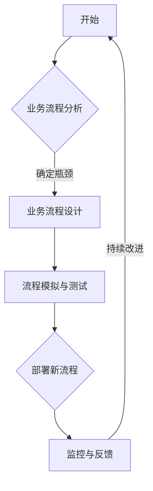
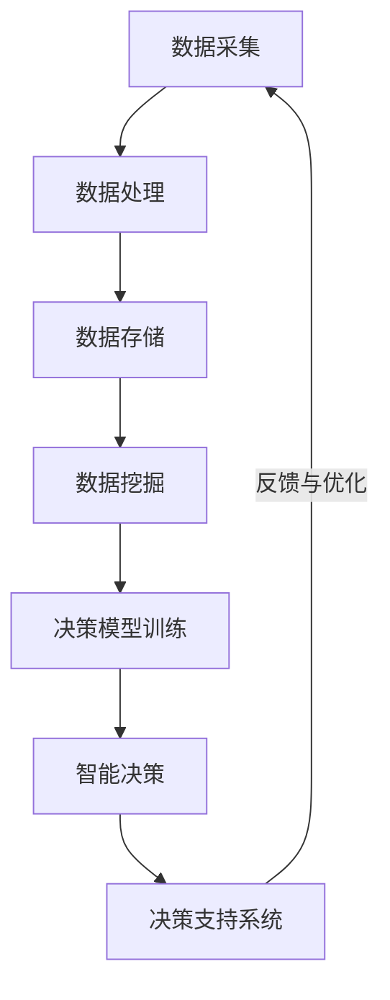
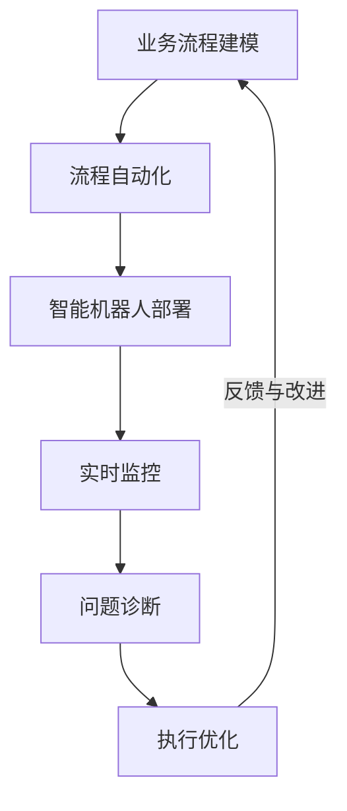

                 

# 企业业务数字化和智能化建设方案：业务流程重组，重建公司的决策体系和执行体系

> **关键词：** 企业数字化转型，业务流程重组，智能决策体系，执行体系，绩效评估，案例分析

> **摘要：** 随着数字化和智能化技术的飞速发展，企业业务数字化和智能化建设已成为提升企业竞争力的重要手段。本文将深入探讨企业业务流程重组、决策体系和执行体系的重建方案，通过案例分析提供具体实施路径，以帮助企业实现数字化和智能化转型。

## 引言

### 1.1 数字化与智能化背景

在当今全球科技迅猛发展的背景下，数字化和智能化已成为推动企业变革和进步的重要力量。数字化不仅仅是信息技术的应用，它更是一种全新的商业模式和组织形态。智能化则是数字化发展的更高阶段，通过人工智能、大数据等技术实现业务的自动化和智能化。

企业的数字化和智能化转型具有以下几个关键特征：

1. **数据驱动：** 数据成为企业核心资产，通过数据收集、存储、处理和分析，为企业提供决策支持。
2. **业务流程优化：** 通过业务流程重组，消除冗余，提高效率，降低成本。
3. **自动化与智能化：** 引入自动化工具和智能化系统，提高业务处理速度和准确性。
4. **用户体验优化：** 利用数字化手段，提升客户体验，增强客户黏性。

### 1.2 书籍目的与重要性

本书旨在为企业提供一套系统的数字化和智能化建设方案，具体目标包括：

1. **明确数字化转型的方向和策略。**
2. **深入理解业务流程重组的方法和原则。**
3. **构建高效的决策体系和执行体系。**
4. **提供实际案例，展示数字化和智能化转型的成功路径。**

通过本书的阅读，企业能够：

1. **提高业务效率：** 通过优化业务流程和自动化执行，减少人工操作，提高工作效率。
2. **降低运营成本：** 通过数字化手段，降低运营成本，提升企业盈利能力。
3. **提升决策质量：** 通过智能决策体系，利用数据分析和人工智能技术，提高决策质量和速度。
4. **增强竞争力：** 通过数字化转型，提升企业市场竞争力，实现可持续发展。

### 1.3 书籍结构安排

本书分为四个主要部分：

1. **第一部分：引论**，介绍数字化和智能化的背景，书籍的目的和重要性。
2. **第二部分：企业业务数字化**，探讨数字化转型的概述、业务流程重组、业务流程自动化和数字化转型的绩效评估。
3. **第三部分：企业业务智能化**，介绍智能化的概述、智能决策体系、智能执行体系和智能化在企业管理中的应用。
4. **第四部分：实战案例分析**，通过实际案例展示数字化和智能化转型的实施过程和效果。
5. **第五部分：未来展望**，分析数字化与智能化的趋势，面临的挑战与机遇。

接下来，我们将深入探讨企业业务数字化和智能化的关键概念、方法和实践，为企业提供实用的建设方案。

## 第二部分：企业业务数字化

### 2.1 数字化转型的概述

数字化转型是指企业利用数字化技术和工具，对现有业务模式、流程和组织结构进行根本性的改革，从而实现业务增长、成本降低和竞争力提升的过程。数字化转型不仅仅是技术层面的变革，更是一种全面的企业变革。

#### 2.1.1 数字化转型的定义与意义

数字化转型可以定义为将数字化技术（如云计算、大数据、人工智能等）整合到企业的战略、运营和产品中，以实现业务流程的优化、效率的提升和用户体验的改善。

数字化转型的意义在于：

1. **提高效率：** 通过数字化手段，企业可以自动化和优化业务流程，减少人工操作，提高工作效率。
2. **降低成本：** 数字化可以减少资源浪费，降低运营成本，提高资源利用效率。
3. **提升竞争力：** 数字化能够帮助企业更好地了解市场需求，快速响应变化，提升市场竞争力。
4. **增强用户体验：** 通过数字化手段，企业可以提供更加个性化和便捷的服务，增强客户体验。

#### 2.1.2 数字化转型的关键要素

数字化转型的成功依赖于以下几个关键要素：

1. **领导力：** 高层领导的支持和参与是数字化转型成功的关键。领导层需要明确数字化转型的目标和策略，并推动相关变革。
2. **企业文化：** 企业文化需要适应数字化转型的要求，鼓励创新、协作和持续学习。
3. **技术投入：** 企业需要投入足够的资源进行技术研发和数字化转型工具的采购。
4. **人才团队：** 数字化转型需要拥有专业技能的人才团队，包括技术人才和管理人才。
5. **数据战略：** 数据是数字化转型的核心资产，企业需要制定有效的数据战略，确保数据的质量和安全。

#### 2.1.3 数字化转型的实施步骤

数字化转型的实施可以分为以下几个步骤：

1. **规划阶段：** 明确数字化转型的目标和愿景，制定详细的规划方案。
2. **评估阶段：** 对现有业务流程和技术环境进行评估，识别数字化转型的瓶颈和机会。
3. **启动阶段：** 启动数字化转型项目，组建项目团队，明确职责和任务。
4. **实施阶段：** 实施具体的技术和应用，进行业务流程的重组和优化。
5. **监控阶段：** 对数字化转型过程进行监控和评估，及时调整和优化。
6. **总结阶段：** 总结数字化转型的经验教训，为未来的数字化转型提供参考。

通过以上步骤，企业可以系统地推进数字化转型，实现业务模式和组织结构的根本性变革。

### 2.2 企业业务流程重组

业务流程重组（Business Process Reengineering，简称BPR）是数字化转型的重要组成部分，旨在通过对业务流程的彻底重新设计和优化，实现效率的提升和成本的控制。

#### 2.2.1 业务流程重组的概念与原则

业务流程重组是指通过对企业现有业务流程的重新设计和优化，以实现业务流程的最优化。BPR的原则包括：

1. **客户导向：** 以客户需求为导向，重新设计业务流程，提高客户满意度。
2. **流程整合：** 整合跨部门、跨业务流程的流程，消除信息孤岛，提高协同效率。
3. **持续改进：** 通过持续改进，不断优化业务流程，提高流程效率。
4. **技术驱动：** 利用信息技术，提高业务流程的自动化程度，降低人为操作错误。

#### 2.2.2 业务流程重组的实施策略

业务流程重组的实施策略包括以下几个方面：

1. **明确目标和愿景：** 明确数字化转型的目标和愿景，为BPR提供方向和动力。
2. **全面评估现有流程：** 对现有业务流程进行全面评估，识别冗余和瓶颈，为重组提供依据。
3. **设计新流程：** 基于客户需求和企业战略，设计新的业务流程，并进行模拟测试。
4. **实施和推广：** 在确定新流程的有效性后，进行实施和推广，确保新流程得到广泛应用。
5. **培训和沟通：** 对员工进行培训，确保他们理解新流程的要求和操作方式，加强内部沟通，确保流程的顺利实施。

#### 2.2.3 业务流程重组的案例分析

为了更好地理解业务流程重组的实施过程和效果，我们可以通过一个实际案例进行说明。

**案例：某制造企业的业务流程重组**

1. **背景分析：**
   该企业在生产过程中存在以下问题：
   - 生产流程冗长，多个部门之间信息沟通不畅。
   - 生产计划不合理，经常出现生产线停滞和资源浪费。
   - 品质管理不到位，产品合格率不高。

2. **重组方案：**
   - **客户导向：** 根据市场需求，调整产品结构，优化生产计划，确保生产出来的产品能够满足客户需求。
   - **流程整合：** 整合生产、采购、仓储等部门的流程，建立统一的生产管理系统，实现信息共享和流程协同。
   - **持续改进：** 建立质量监控体系，对生产过程进行实时监控，及时发现和解决质量问题。
   - **技术驱动：** 引入智能制造技术，提高生产自动化程度，减少人为操作错误。

3. **实施效果：**
   - **生产效率提高：** 通过流程整合和自动化，生产效率提高了30%。
   - **成本降低：** 通过优化生产计划和资源利用，生产成本降低了15%。
   - **质量提升：** 产品合格率提高了10%，客户满意度显著提升。

通过这个案例，我们可以看到业务流程重组在提高企业效率和降低成本方面的显著效果。业务流程重组不仅仅是技术的变革，更是企业文化和组织结构的变革，需要全员参与和持续改进。

### 2.3 业务流程自动化

业务流程自动化是数字化转型的重要方向，通过引入自动化工具和技术，减少人工操作，提高业务处理速度和准确性。

#### 2.3.1 业务流程自动化的原理与技术

业务流程自动化的原理是利用信息技术，将业务流程中的重复性、规则性操作自动化，从而减少人为干预，提高效率。

常见的业务流程自动化技术包括：

1. **工作流管理：** 通过工作流管理系统，定义和自动化业务流程，确保流程的规范执行。
2. **机器人流程自动化（RPA）：** 利用软件机器人模拟人工操作，自动化处理重复性、规则性的任务。
3. **智能自动化：** 结合人工智能技术，自动化复杂业务处理，提高决策质量和速度。

#### 2.3.2 业务流程自动化工具与应用

常见的业务流程自动化工具包括：

1. **UiPath：** 一款功能强大的RPA工具，支持各种自动化任务，包括数据录入、审批流程等。
2. **Blue Prism：** 一款基于人工智能的RPA平台，支持复杂的业务流程自动化。
3. **Kofax：** 一款专注于文档处理和自动化流程的软件，适用于各类文档和数据自动化处理。

业务流程自动化的应用场景包括：

1. **财务会计：** 自动化处理发票录入、报销审批等财务流程。
2. **人力资源：** 自动化招聘流程、员工信息管理、薪酬计算等。
3. **供应链管理：** 自动化采购订单处理、库存管理、物流跟踪等。

#### 2.3.3 业务流程自动化的风险与挑战

业务流程自动化在带来效率提升的同时，也面临一定的风险和挑战：

1. **系统稳定性：** 自动化系统需要确保高稳定性，以避免因系统故障导致业务中断。
2. **数据安全：** 自动化过程中涉及大量的敏感数据，需要确保数据的安全和隐私。
3. **员工适应性：** 自动化技术的引入可能会改变员工的日常工作，需要员工适应新的工作方式。
4. **技术升级：** 随着技术的不断发展，自动化系统需要不断升级和优化，以适应新的业务需求。

### 2.4 数字化转型的绩效评估

数字化转型不是一蹴而就的过程，需要通过绩效评估来衡量数字化转型的效果和进展。绩效评估可以帮助企业了解数字化转型的成果，发现问题，持续改进。

#### 2.4.1 绩效评估指标体系

数字化转型的绩效评估指标体系应包括以下几个方面：

1. **效率指标：** 包括业务流程处理时间、操作次数、出错率等，衡量流程优化和自动化带来的效率提升。
2. **成本指标：** 包括运营成本、人力成本、技术成本等，衡量数字化带来的成本降低。
3. **质量指标：** 包括产品质量、服务满意度等，衡量数字化对产品质量和客户体验的提升。
4. **创新指标：** 包括新产品开发速度、市场反应速度等，衡量数字化对创新能力的提升。

#### 2.4.2 绩效评估方法与工具

绩效评估的方法和工具包括：

1. **关键绩效指标（KPI）：** 通过设置关键绩效指标，对数字化转型的效果进行量化评估。
2. **平衡计分卡：** 结合财务、客户、内部流程、学习与成长四个维度，综合评估数字化转型的效果。
3. **数据可视化工具：** 利用数据可视化工具，对绩效评估数据进行直观展示，帮助管理层更好地理解评估结果。

#### 2.4.3 绩效评估案例分析

为了更好地理解绩效评估的应用，我们可以通过一个实际案例进行说明。

**案例：某金融企业的数字化转型绩效评估**

1. **背景分析：**
   该企业在数字化转型过程中，引入了工作流管理系统和RPA工具，优化了财务和人力资源部门的业务流程。

2. **绩效评估指标：**
   - **效率指标：** 业务流程处理时间从原来的10天缩短到2天。
   - **成本指标：** 人力资源部门的运营成本降低了20%。
   - **质量指标：** 财务报表的错误率从原来的5%降低到1%。
   - **创新指标：** 新产品开发速度提高了30%。

3. **评估结果：**
   通过绩效评估，企业发现数字化转型带来了显著的效率提升和成本降低，同时也提升了产品质量和创新能力。

通过这个案例，我们可以看到绩效评估在数字化转型中的重要作用，它不仅帮助企业管理层了解数字化转型的成果，也为后续的改进提供了重要依据。

### 2.5 小结

企业业务数字化是提升企业效率、降低成本、增强竞争力的重要手段。通过数字化转型，企业可以实现业务流程的优化、自动化和智能化。业务流程重组是数字化转型的关键步骤，它通过对业务流程的重新设计和优化，实现效率的提升和成本的控制。业务流程自动化则进一步提高了业务处理的效率和准确性。绩效评估是数字化转型的重要环节，通过量化评估数字化转型的效果，帮助企业管理层了解进展和成果。接下来，我们将探讨企业业务智能化的概念、方法和应用。

## 第三部分：企业业务智能化

### 3.1 智能化概述

企业业务智能化是指利用人工智能、大数据、云计算等先进技术，对企业的业务流程、决策体系和执行体系进行智能化改造，以提高企业的运营效率、决策质量和市场竞争力。智能化不仅是数字化转型的深化，也是企业实现可持续发展的必经之路。

#### 3.1.1 智能化的定义与演进

智能化可以定义为利用人工智能技术，使机器具备人类智能的能力，包括感知、理解、决策和行动。随着计算能力的提升和数据量的爆炸式增长，智能化技术逐渐从理论研究走向实际应用，成为企业数字化转型的重要驱动力。

智能化的演进可以分为以下几个阶段：

1. **自动化：** 通过引入自动化技术，减少人工操作，提高工作效率。
2. **信息化：** 通过信息化手段，实现数据的收集、存储、处理和分析，为决策提供支持。
3. **智能化：** 利用人工智能技术，实现业务流程的自动化和智能化，提高决策质量和执行效率。

#### 3.1.2 智能化的关键要素

智能化的成功实施依赖于以下几个关键要素：

1. **数据驱动：** 数据是智能化的基础，企业需要建立完善的数据采集、存储和处理系统，确保数据的质量和可用性。
2. **算法创新：** 智能化依赖于先进的算法和模型，企业需要不断探索和引入新的算法技术，提高智能决策和执行的能力。
3. **技术集成：** 智能化需要将多种技术进行集成，包括云计算、大数据、物联网、人工智能等，以实现全面的业务智能化。
4. **人才培养：** 智能化需要专业的技术人才和管理人才，企业需要加强人才培养和引进，为智能化建设提供人才保障。
5. **生态系统建设：** 智能化不仅仅是企业内部的变革，还需要与外部合作伙伴和生态系统的协同发展，形成智能化的生态圈。

#### 3.1.3 智能化的实施路径

智能化的实施路径可以分为以下几个步骤：

1. **需求分析与规划：** 明确智能化的目标和需求，制定详细的实施方案。
2. **数据采集与处理：** 建立完善的数据采集和处理系统，确保数据的全面性和准确性。
3. **算法与模型研发：** 引入先进的算法和模型，进行智能化的数据处理和决策。
4. **系统集成与部署：** 将智能化技术集成到企业的业务系统中，实现业务流程的智能化改造。
5. **试点与推广：** 在试点项目中验证智能化的效果，逐步推广到全企业范围。
6. **持续优化与改进：** 通过持续的优化和改进，不断提升智能化的效果和竞争力。

通过以上步骤，企业可以系统地推进智能化建设，实现业务流程的智能化改造，提高企业的运营效率和竞争力。

### 3.2 智能决策体系

智能决策体系是智能化建设的重要组成部分，通过引入人工智能技术和大数据分析，实现对业务数据的实时分析和智能决策，提高企业的决策质量和效率。

#### 3.2.1 智能决策的概念与模型

智能决策是指利用人工智能技术和大数据分析，对业务数据进行深入挖掘和分析，生成智能决策建议，辅助企业管理层进行决策。智能决策体系通常包括以下几个核心组成部分：

1. **数据采集与处理：** 通过各种数据采集工具和技术，收集企业内部和外部的数据，并进行预处理和清洗，确保数据的质量和可用性。
2. **数据存储与管理：** 建立高效的数据存储和管理系统，包括数据仓库和数据湖，实现对大规模数据的存储和管理。
3. **数据挖掘与分析：** 利用数据挖掘和机器学习算法，对海量数据进行挖掘和分析，提取有价值的信息和洞察。
4. **决策模型与算法：** 建立智能决策模型，包括预测模型、推荐模型、分类模型等，实现对数据的智能分析和决策。
5. **决策支持系统：** 通过决策支持系统，将智能决策结果呈现给管理层，提供辅助决策功能。

智能决策的模型通常包括以下几个步骤：

1. **数据准备：** 收集和清洗数据，确保数据的质量和完整性。
2. **特征工程：** 提取数据中的关键特征，为模型训练提供输入。
3. **模型训练：** 使用机器学习算法，对数据集进行训练，生成决策模型。
4. **模型评估：** 对训练好的模型进行评估，选择最佳模型进行部署。
5. **决策生成：** 使用最佳模型对新的数据进行预测和决策，生成智能决策建议。

#### 3.2.2 数据驱动决策方法

数据驱动决策方法是指通过收集、处理和分析业务数据，生成智能决策建议，辅助企业管理层进行决策。数据驱动决策方法具有以下几个关键步骤：

1. **问题定义：** 明确决策的目标和问题，确定需要分析和解决的问题。
2. **数据收集：** 收集与决策相关的数据，包括内部数据和外部数据。
3. **数据预处理：** 对收集到的数据进行分析和清洗，确保数据的质量和完整性。
4. **数据分析：** 利用数据分析工具和技术，对数据进行分析，提取有价值的信息和洞察。
5. **模型构建：** 基于数据分析结果，建立预测模型、分类模型等，生成决策建议。
6. **决策制定：** 结合智能决策结果和管理层的经验，制定最终的决策方案。
7. **决策实施：** 将决策方案转化为具体的行动，实施决策。

数据驱动决策方法具有以下几个优点：

1. **提高决策质量：** 通过数据分析和智能模型，生成客观、准确的决策建议，提高决策的准确性和效率。
2. **减少决策风险：** 通过全面的数据分析和风险预测，降低决策风险，提高决策的可靠性。
3. **增强决策透明度：** 通过数据分析和智能决策，使决策过程更加透明，提高决策的公信力。

#### 3.2.3 智能决策系统的架构设计

智能决策系统的架构设计是智能化建设的关键环节，它决定了智能决策系统的性能、可扩展性和可维护性。一个典型的智能决策系统通常包括以下几个核心模块：

1. **数据采集模块：** 负责从各种数据源收集数据，包括内部数据源和外部数据源。
2. **数据预处理模块：** 对采集到的数据进行清洗、转换和整合，确保数据的质量和一致性。
3. **数据存储模块：** 建立数据仓库和数据湖，实现大规模数据的存储和管理。
4. **数据分析模块：** 利用数据挖掘和机器学习算法，对数据进行深入分析和挖掘，提取有价值的信息和洞察。
5. **决策模型模块：** 建立智能决策模型，包括预测模型、分类模型等，生成智能决策建议。
6. **决策支持模块：** 将智能决策结果以可视化的形式呈现给用户，提供辅助决策功能。
7. **系统管理模块：** 负责系统的监控、维护和升级，确保系统的稳定运行。

智能决策系统的架构设计应遵循以下几个原则：

1. **数据驱动：** 系统设计应以数据为核心，确保数据的高质量、可扩展性和实时性。
2. **模块化设计：** 系统应采用模块化设计，方便系统的扩展和维护。
3. **可扩展性：** 系统应具备良好的可扩展性，能够支持不断变化的数据需求和业务场景。
4. **易用性：** 系统界面应简洁易用，提供丰富的用户交互功能，提高用户的使用体验。
5. **安全性：** 系统应确保数据的安全性和隐私性，防止数据泄露和滥用。

通过以上架构设计原则，智能决策系统可以更好地支持企业的智能决策需求，提高企业的决策质量和效率。

### 3.3 智能执行体系

智能执行体系是智能化建设的重要组成部分，通过引入自动化工具和智能机器人，实现业务流程的自动化和智能化执行，提高企业的运营效率和响应速度。

#### 3.3.1 智能执行的概念与实现

智能执行是指利用人工智能技术和自动化工具，对业务流程进行自动化和智能化处理，实现高效的执行和响应。智能执行体系通常包括以下几个核心组成部分：

1. **业务流程自动化：** 利用自动化工具和技术，将重复性、规则性的业务流程自动化，减少人工操作，提高效率。
2. **智能机器人：** 引入智能机器人，模拟人类操作，自动化处理复杂业务流程，提高执行效率。
3. **实时监控与反馈：** 对业务执行过程进行实时监控和反馈，及时发现和解决问题，确保业务流程的稳定运行。

智能执行的具体实现步骤包括：

1. **流程建模：** 对业务流程进行建模，定义业务流程的各个节点和操作，为自动化执行提供基础。
2. **流程自动化：** 利用自动化工具和技术，将业务流程自动化，实现业务操作的自动化执行。
3. **机器人部署：** 引入智能机器人，部署到业务流程中，实现业务流程的智能化执行。
4. **实时监控：** 对业务执行过程进行实时监控，通过监控指标和报警机制，及时发现和解决问题。
5. **反馈优化：** 根据业务执行过程中的反馈，对自动化流程和机器人进行优化和调整，提高执行效率。

#### 3.3.2 智能机器人与自动化执行

智能机器人是智能执行体系的核心组成部分，通过模拟人类操作，自动化处理复杂业务流程。智能机器人的关键技术包括：

1. **流程自动化：** 利用流程自动化技术，将业务流程中的重复性、规则性操作自动化，减少人工操作。
2. **自然语言处理：** 利用自然语言处理技术，实现人机交互，使机器人能够理解人类的指令和问题。
3. **机器学习：** 利用机器学习技术，使机器人能够从海量数据中学习业务知识和操作技巧，提高执行效率。

自动化执行是智能执行体系的基础，通过引入自动化工具和技术，实现业务流程的自动化和智能化。自动化执行的关键技术包括：

1. **RPA（机器人流程自动化）：** 利用RPA技术，将业务流程中的重复性、规则性操作自动化，提高业务执行效率。
2. **API集成：** 通过API集成技术，将不同系统之间的数据和服务进行集成，实现业务的自动化处理。
3. **流程引擎：** 利用流程引擎技术，定义和执行业务流程，实现业务流程的自动化管理。

智能执行的优势包括：

1. **提高效率：** 通过自动化和智能化执行，减少人工操作，提高业务执行速度和效率。
2. **降低成本：** 通过自动化和智能化执行，减少人力成本，降低运营成本。
3. **提高质量：** 通过自动化和智能化执行，减少人为错误，提高业务执行质量。
4. **实时监控：** 通过实时监控和反馈机制，及时发现问题并进行优化，确保业务流程的稳定运行。

#### 3.3.3 智能执行的性能优化

智能执行的性能优化是确保业务流程高效运行的重要环节。智能执行的性能优化包括以下几个方面：

1. **负载均衡：** 通过负载均衡技术，将业务流量分配到不同的执行节点，避免单点瓶颈，提高系统性能。
2. **缓存机制：** 通过缓存机制，将常用的数据和操作结果缓存起来，减少数据库访问和计算时间，提高系统响应速度。
3. **分布式架构：** 采用分布式架构，将业务流程分散到多个节点进行执行，提高系统的扩展性和容错能力。
4. **性能监控与优化：** 通过性能监控工具，实时监控系统的性能指标，发现性能瓶颈并进行优化。
5. **自动化测试：** 通过自动化测试工具，对智能执行过程进行测试和验证，确保系统的稳定性和可靠性。

通过以上性能优化措施，可以显著提高智能执行的性能和稳定性，确保业务流程的高效运行。

### 3.4 智能化在企业管理中的应用

智能化技术在企业管理中具有广泛的应用，通过引入智能化手段，企业可以优化管理流程，提高管理效率，实现精细化管理。

#### 3.4.1 智能化在人力资源管理中的应用

智能化在人力资源管理中的应用包括以下几个方面：

1. **招聘管理：** 利用智能招聘系统，通过大数据分析和自然语言处理技术，实现职位匹配、简历筛选和面试预约，提高招聘效率。
2. **员工培训：** 通过智能培训系统，利用在线学习平台和虚拟现实技术，提供个性化的培训课程和评估，提高员工技能水平。
3. **绩效管理：** 利用智能绩效管理系统，通过数据分析和智能算法，实时评估员工绩效，提供科学的绩效反馈和改进建议。
4. **人才管理：** 通过智能人才管理系统，利用大数据分析和人工智能技术，分析人才结构、人才流动和人才发展，实现人才优化配置。

#### 3.4.2 智能化在供应链管理中的应用

智能化在供应链管理中的应用包括以下几个方面：

1. **需求预测：** 利用大数据分析和机器学习算法，实现市场需求预测，优化库存管理和供应链规划。
2. **物流跟踪：** 利用物联网技术和GPS定位，实时跟踪物流运输状态，提高物流效率，降低物流成本。
3. **供应商管理：** 利用智能供应商管理系统，通过数据分析和风险评估，优化供应商选择和评估，提高供应链稳定性。
4. **供应链协同：** 通过智能化手段，实现供应链各环节的信息共享和协同工作，提高供应链的响应速度和协同效率。

#### 3.4.3 智能化在客户关系管理中的应用

智能化在客户关系管理中的应用包括以下几个方面：

1. **客户画像：** 利用大数据分析和人工智能技术，对客户行为和偏好进行深入分析，构建客户画像，实现精准营销。
2. **客户服务：** 利用智能客服系统，通过自然语言处理和语音识别技术，提供24/7的智能客服服务，提高客户满意度。
3. **销售预测：** 利用大数据分析和机器学习算法，实现销售预测和商机分析，优化销售策略，提高销售业绩。
4. **客户体验优化：** 通过智能化手段，优化客户服务流程和客户体验，提高客户黏性和忠诚度。

通过以上智能化应用，企业可以优化管理流程，提高管理效率，实现精细化管理，从而在激烈的市场竞争中脱颖而出。

### 3.5 小结

企业业务智能化是数字化转型的深化和延伸，通过引入人工智能、大数据和云计算等先进技术，实现业务流程的自动化和智能化，提高企业的运营效率和决策质量。智能决策体系通过数据驱动和智能算法，实现对业务数据的实时分析和智能决策，提高企业的决策效率和准确性。智能执行体系通过自动化工具和智能机器人，实现业务流程的智能化执行，提高企业的执行效率和响应速度。智能化在人力资源管理、供应链管理和客户关系管理中的应用，进一步提升了企业的管理水平和竞争力。接下来，我们将通过实际案例，展示企业业务智能化的实施过程和效果。

## 第四部分：实战案例分析

### 4.1 案例背景与目标

为了更好地展示企业业务数字化和智能化转型的实际应用，本节将分析一个典型的企业案例，介绍其数字化和智能化建设的过程、目标以及取得的成效。

**案例企业背景介绍：**

某大型制造企业，拥有员工约5000人，业务涵盖多个行业，包括机械制造、电子设备和家电生产等。近年来，市场竞争日益激烈，原材料价格波动较大，生产成本不断上升。企业意识到必须通过数字化转型和智能化升级，提高生产效率和降低成本，以保持市场竞争力。

**数字化和智能化建设目标：**

1. **提升生产效率：** 通过自动化生产线和智能机器人，减少人工操作，提高生产效率，缩短交货周期。
2. **降低运营成本：** 通过智能决策系统和业务流程自动化，优化生产计划和资源配置，降低运营成本。
3. **提高产品质量：** 通过智能监测系统和质量管理系统，实现对生产过程的实时监控和质量管理，提高产品质量。
4. **增强市场竞争力：** 通过数字化和智能化手段，提高企业响应市场变化的能力，增强市场竞争力。

### 4.2 案例实施过程

**业务流程重组与优化：**

为了实现数字化和智能化目标，企业首先进行了业务流程重组和优化。具体步骤如下：

1. **需求分析与规划：** 组织专业团队进行需求分析，确定业务流程重组的目标和关键环节。
2. **流程评估与设计：** 对现有业务流程进行全面评估，识别冗余和瓶颈，设计新的业务流程。
3. **流程模拟与测试：** 基于仿真软件，对新流程进行模拟测试，确保流程的可行性和高效性。
4. **实施与推广：** 在确定新流程的有效性后，进行实施和推广，确保新流程得到广泛应用。

**数据分析与智能决策：**

在业务流程重组的基础上，企业引入了数据分析与智能决策系统。具体实施步骤如下：

1. **数据采集与处理：** 建立完善的数据采集和处理系统，确保数据的质量和完整性。
2. **数据存储与管理：** 建立数据仓库，实现对大规模数据的存储和管理。
3. **数据挖掘与分析：** 利用数据挖掘和机器学习算法，对数据进行深入挖掘和分析，提取有价值的信息和洞察。
4. **智能决策系统建设：** 基于数据分析结果，建立智能决策系统，生成智能决策建议，辅助企业管理层进行决策。

**智能执行与自动化：**

在数据分析与智能决策的基础上，企业进一步引入了智能执行与自动化系统。具体实施步骤如下：

1. **流程建模与自动化：** 对业务流程进行建模，定义业务流程的各个节点和操作，实现流程自动化。
2. **智能机器人部署：** 引入智能机器人，部署到业务流程中，实现业务流程的智能化执行。
3. **实时监控与反馈：** 对业务执行过程进行实时监控和反馈，通过监控指标和报警机制，及时发现和解决问题。
4. **持续优化与改进：** 根据业务执行过程中的反馈，对自动化流程和机器人进行优化和调整，提高执行效率。

### 4.3 案例效果评估

通过数字化和智能化建设，企业取得了显著的效果，具体如下：

**生产效率提升：** 通过自动化生产线和智能机器人的应用，生产效率提高了30%，交货周期缩短了20%。

**运营成本降低：** 通过智能决策系统和业务流程自动化，运营成本降低了15%，资源利用率提高了20%。

**产品质量提升：** 通过智能监测系统和质量管理系统，产品质量合格率提高了10%，客户投诉率降低了15%。

**市场竞争力增强：** 通过数字化和智能化手段，企业能够更快地响应市场变化，市场份额提高了10%，客户满意度显著提升。

### 4.4 案例成功因素分析

该案例的成功主要得益于以下几个因素：

1. **领导层的支持：** 高层领导对数字化和智能化转型的重视和支持，确保了项目的顺利推进。
2. **专业团队的建立：** 组织专业的团队，具备丰富的技术和管理经验，确保项目的成功实施。
3. **数据驱动：** 建立完善的数据采集和处理系统，确保数据的质量和完整性，为智能决策提供坚实基础。
4. **持续改进：** 通过持续优化和改进，不断提升数字化和智能化系统的效果，确保企业的持续发展。

### 4.5 案例不足与改进建议

尽管该案例取得了显著的成效，但仍存在一些不足之处，需要进一步改进：

1. **人才短缺：** 数字化和智能化转型需要大量专业人才，但企业人才储备不足，影响了项目的推进。
2. **系统集成：** 系统之间的集成不够完善，存在数据孤岛，影响了系统的整体效果。
3. **技术升级：** 随着技术的快速发展，现有系统的部分功能已无法满足需求，需要及时进行技术升级。

针对上述不足，企业可以采取以下改进措施：

1. **加强人才培养：** 通过内部培训和外部引进，加强专业人才的培养和引进，提升团队的整体素质。
2. **完善系统集成：** 加强系统之间的集成，消除数据孤岛，实现数据的互联互通，提高系统的整体效率。
3. **持续技术升级：** 定期对系统进行技术升级，引入新的技术和功能，确保系统的先进性和竞争力。

通过持续改进，企业可以进一步提升数字化和智能化水平，实现可持续的发展。

### 4.6 小结

本节通过一个实际案例，详细展示了企业数字化和智能化建设的全过程，包括业务流程重组、数据分析与智能决策、智能执行与自动化等。案例的成功得益于领导层的支持、专业团队的建立、数据驱动和持续改进。通过数字化和智能化建设，企业显著提升了生产效率、降低了运营成本、提高了产品质量，增强了市场竞争力。案例的不足之处也为后续的改进提供了借鉴。接下来，我们将探讨数字化和智能化发展的趋势以及企业面临的挑战和机遇。

## 第五部分：未来展望

### 5.1 数字化与智能化的趋势

数字化与智能化技术的快速发展，正在深刻改变企业的运营模式和市场格局。未来，数字化与智能化的发展趋势将呈现以下几个显著特点：

1. **人工智能的普及应用：** 随着人工智能技术的不断成熟，其在各行各业中的应用将更加广泛。例如，智能客服、智能推荐、智能诊断等，将进一步提升企业的运营效率和用户体验。

2. **大数据的深度挖掘：** 数据已成为企业的核心资产，未来企业将更加注重数据的收集、存储、处理和分析。通过大数据技术，企业可以更好地了解市场需求，优化业务流程，提高决策质量。

3. **物联网的全面连接：** 物联网技术的普及，将实现设备、人员和系统的全面连接，打造智慧工厂、智慧城市等。物联网技术将提升企业对生产过程的实时监控和智能管理，提高生产效率和产品质量。

4. **区块链的信任构建：** 区块链技术以其去中心化、不可篡改的特性，将在供应链管理、金融交易等领域发挥重要作用。通过区块链技术，企业可以构建信任体系，提高交易效率和透明度。

5. **边缘计算的广泛应用：** 随着物联网设备的增加和数据量的爆发增长，边缘计算将成为解决数据处理瓶颈的关键技术。边缘计算将实现数据的本地处理和实时响应，提升系统的效率和稳定性。

### 5.2 面临的挑战与机遇

数字化与智能化的发展为企业带来了巨大的机遇，同时也面临诸多挑战：

1. **技术挑战：** 随着技术的快速发展，企业需要不断更新和升级现有的技术体系，以应对新的技术挑战。企业需要在技术创新和投资之间找到平衡点，确保技术的持续发展和应用。

2. **数据安全与隐私：** 在数字化和智能化过程中，企业面临数据安全与隐私的挑战。如何确保数据的安全性和隐私性，避免数据泄露和滥用，是企业需要重视的问题。

3. **人才短缺：** 数字化和智能化需要大量的专业人才，但人才市场供给不足，企业需要加强人才培养和引进，提升员工的技能水平，以适应数字化和智能化的发展需求。

4. **组织变革：** 数字化和智能化不仅需要技术的变革，也需要组织结构的变革。企业需要调整组织架构，建立灵活、高效的管理模式，以适应数字化和智能化的需求。

5. **文化冲突：** 数字化和智能化引入了新的工作方式和思维方式，可能会与传统企业文化产生冲突。企业需要加强文化建设，促进员工对数字化和智能化理念的认同和接受。

### 5.3 应对策略与建议

为了应对数字化与智能化带来的挑战，企业可以采取以下策略和建议：

1. **加强技术研发：** 企业应加大对技术研发的投入，引进先进的数字化和智能化技术，提升企业的技术实力和竞争力。

2. **重视数据安全：** 企业应建立完善的数据安全管理体系，加强对数据的保护，确保数据的安全性和隐私性。

3. **人才培养与引进：** 企业应加强人才培养和引进，提升员工的技能水平，建立专业化的数字化和智能化团队。

4. **组织变革：** 企业应积极推进组织变革，建立灵活、高效的管理模式，促进数字化和智能化的发展。

5. **文化引导：** 企业应加强文化建设，促进员工对数字化和智能化理念的认同和接受，营造良好的创新氛围。

通过以上策略和建议，企业可以更好地应对数字化与智能化带来的挑战，抓住发展机遇，实现持续发展和增长。

### 5.4 小结

未来，数字化与智能化将继续深入企业运营的方方面面，成为企业发展的核心驱动力。企业需要紧跟技术发展趋势，应对技术挑战，关注数据安全与隐私，加强人才培养和引进，推进组织变革，以实现数字化和智能化转型。通过有效的策略和措施，企业可以充分利用数字化与智能化的优势，提升运营效率，增强市场竞争力，实现可持续发展。

## 附录

### A.1 工具与资源介绍

为了帮助企业顺利推进数字化和智能化建设，本节将介绍一些常用的数字化与智能化工具和资源，包括开发环境搭建指南、参考资料和扩展阅读。

#### A.1.1 常用数字化与智能化工具

1. **数据分析工具：**
   - **Python**：Python是一种广泛使用的编程语言，拥有丰富的数据分析库，如Pandas、NumPy、Scikit-learn等。
   - **R语言**：R语言是一种专门用于统计分析的数据科学语言，拥有强大的数据分析能力。
   - **Tableau**：Tableau是一种数据可视化工具，能够将复杂数据以直观的方式展示。

2. **机器学习工具：**
   - **TensorFlow**：TensorFlow是一个开源的机器学习框架，支持各种深度学习模型的开发和训练。
   - **PyTorch**：PyTorch是一个流行的深度学习框架，适用于各种复杂模型的开发和应用。

3. **自动化工具：**
   - **UiPath**：UiPath是一个强大的RPA（机器人流程自动化）工具，支持各种自动化任务。
   - **Blue Prism**：Blue Prism是一个基于AI的RPA平台，适用于复杂的业务流程自动化。
   - **Power Automate**：Power Automate是微软提供的自动化工具，支持自动化业务流程和集成多种服务。

4. **云计算平台：**
   - **AWS**：Amazon Web Services提供丰富的云计算服务，包括计算、存储、数据库、人工智能等。
   - **Azure**：Microsoft Azure提供类似的云计算服务，适用于企业级应用。
   - **Google Cloud**：Google Cloud提供全面的云计算服务，支持大数据分析和人工智能应用。

#### A.1.2 开发环境搭建指南

以下是搭建常用开发环境的基本步骤：

1. **Python开发环境：**
   - 安装Python：在Python官方网站下载并安装Python。
   - 安装PyCharm：PyCharm是一个强大的Python集成开发环境（IDE），可以用于编写、调试和运行Python代码。
   - 安装相关库：通过pip命令安装常用的Python库，如Pandas、NumPy、Scikit-learn等。

2. **机器学习开发环境：**
   - 安装TensorFlow或PyTorch：从官方网站下载安装相应的深度学习框架。
   - 安装Jupyter Notebook：Jupyter Notebook是一个交互式开发环境，适用于编写和运行机器学习代码。

3. **RPA开发环境：**
   - 安装UiPath Studio：UiPath Studio是一个RPA开发工具，用于创建和调试RPA流程。
   - 安装UI Automation Tools：UI Automation Tools用于自动化Windows应用程序。

4. **云计算平台环境：**
   - 注册云服务账户：在AWS、Azure或Google Cloud等云服务提供商注册账户。
   - 创建虚拟机或容器：创建用于开发和测试的虚拟机或容器，配置相应的软件环境。

#### A.1.3 参考资料与扩展阅读

以下是一些推荐的参考资料和扩展阅读，以深入了解数字化和智能化相关的技术和管理知识：

1. **书籍：**
   - 《深度学习》：Goodfellow, I., Bengio, Y., & Courville, A. (2016). Deep Learning.
   - 《Python数据分析》：McKinney, W. (2010). Python for Data Analysis: Data Wrangling with Pandas, NumPy, and IPython.
   - 《企业大数据管理》：Chen, H.-H., Chiang, R. H. L., & Storey, V. C. (2012). Business Intelligence and Analytics: From Big Data to Big Impact.

2. **在线课程：**
   - Coursera：提供丰富的数据科学和机器学习在线课程。
   - edX：提供由知名大学提供的免费在线课程。
   - Udacity：提供数据科学和人工智能等领域的在线课程。

3. **学术论文与研究报告：**
   - arXiv：一个提供预印本论文的数据库，涵盖计算机科学、物理学等多个领域。
   - IEEE Xplore：IEEE提供的电子图书馆，包含大量的计算机科学和电子工程领域的学术论文。

通过以上工具与资源的介绍，企业可以更好地开展数字化和智能化建设，实现业务的转型升级。

### B.1 Mermaid 流程图

在数字化和智能化建设中，流程图是一种重要的工具，用于展示业务流程、数据流和系统架构。Mermaid 是一种基于Markdown的图形工具，可以轻松创建和嵌入各种流程图。以下是一些常见的流程图示例。

#### B.1.1 业务流程重组 Mermaid 图



#### B.1.2 智能决策体系 Mermaid 图



#### B.1.3 智能执行体系 Mermaid 图



通过以上 Mermaid 流程图，可以清晰地展示业务流程重组、智能决策体系和智能执行体系的关键环节和流程，有助于理解和实施这些体系。

### C.1 伪代码示例

在数字化和智能化建设中，伪代码是一种用于描述算法逻辑和流程的工具，可以帮助开发者清晰地理解和实现算法。以下是一些常见的伪代码示例。

#### C.1.1 数据分析伪代码示例

```plaintext
算法：数据分析
输入：数据集D
输出：分析结果R

步骤：
1. 初始化R为空
2. 对于每个数据点d∈D，执行以下步骤：
   a. 对d进行预处理，包括清洗、转换和归一化
   b. 计算d的特征值f
   c. 将f添加到R中
3. 利用R进行统计分析，包括均值、方差、相关性等
4. 输出R作为分析结果
```

#### C.1.2 智能决策伪代码示例

```plaintext
算法：智能决策
输入：数据集D，决策模型M
输出：决策结果R

步骤：
1. 初始化R为空
2. 对于每个数据点d∈D，执行以下步骤：
   a. 使用M对d进行预测
   b. 计算预测结果与实际结果的误差
   c. 将误差添加到R中
3. 利用R对M进行优化，调整模型参数
4. 使用优化后的M进行决策
5. 输出决策结果R
```

#### C.1.3 智能执行伪代码示例

```plaintext
算法：智能执行
输入：任务T，执行模型E
输出：执行结果R

步骤：
1. 初始化R为空
2. 对于每个任务步骤s∈T，执行以下步骤：
   a. 使用E对s进行自动化处理
   b. 记录s的执行结果
   c. 检查s的执行结果是否符合预期
   d. 如果不符合预期，回滚s的执行结果
3. 将所有执行结果添加到R中
4. 输出R作为执行结果
```

通过以上伪代码示例，可以清晰地展示数据分析、智能决策和智能执行的基本逻辑和流程，有助于开发者理解和实现这些算法。

### D.1 数学模型与公式

在数字化和智能化建设中，数学模型和公式是理解和实现算法的关键。以下是一些常用的数学模型和公式。

#### D.1.1 数据分析数学模型

**线性回归模型：**

$$
y = \beta_0 + \beta_1x + \epsilon
$$

其中，$y$ 是因变量，$x$ 是自变量，$\beta_0$ 和 $\beta_1$ 是模型参数，$\epsilon$ 是误差项。

**支持向量机（SVM）模型：**

$$
\min \frac{1}{2} ||\textbf{w}||^2 + C \sum_{i=1}^{n} \xi_i
$$

$$
\text{subject to}: y_i (\textbf{w} \cdot \textbf{x_i} + b) \geq 1 - \xi_i, \quad \xi_i \geq 0, \quad i=1,2,...,n
$$

其中，$\textbf{w}$ 是权重向量，$\textbf{x_i}$ 是特征向量，$b$ 是偏置项，$C$ 是惩罚参数。

**主成分分析（PCA）模型：**

$$
\text{特征值分解}: \textbf{X} = \textbf{P}\textbf{\Lambda}\textbf{P}^T
$$

其中，$\textbf{X}$ 是数据矩阵，$\textbf{P}$ 是特征向量矩阵，$\textbf{\Lambda}$ 是特征值矩阵。

#### D.1.2 智能决策数学模型

**贝叶斯决策模型：**

$$
p(y|x) = \frac{p(x|y) p(y)}{p(x)}
$$

$$
\hat{y} = \arg \max_y p(y|x)
$$

其中，$p(y|x)$ 是后验概率，$p(x|y)$ 是条件概率，$p(y)$ 是先验概率。

**马尔可夫决策过程（MDP）模型：**

$$
V^*(s) = \max_a \sum_{s'} p(s'|s,a) [R(s',a) + \gamma V^*(s')]
$$

$$
\text{subject to}: \sum_a \pi(a|s) = 1, \quad \pi(a|s) \geq 0
$$

其中，$V^*(s)$ 是状态值函数，$R(s',a)$ 是立即奖励，$\gamma$ 是折扣因子。

#### D.1.3 智能执行数学模型

**神经网络模型：**

$$
\textbf{y} = \textbf{f}(\textbf{W} \textbf{x} + b)
$$

其中，$\textbf{y}$ 是输出，$\textbf{f}$ 是激活函数，$\textbf{W}$ 是权重矩阵，$\textbf{x}$ 是输入，$b$ 是偏置。

**遗传算法模型：**

$$
\textbf{X} = \{\textbf{x}_1, \textbf{x}_2, ..., \textbf{x}_n\}
$$

$$
\text{适应度函数}: f(\textbf{x}) = \sum_{i=1}^{n} w_i \cdot f_i(\textbf{x})
$$

$$
\text{交叉操作}: \textbf{x}_{new} = \textbf{x}_p + \textbf{x}_m
$$

$$
\text{变异操作}: \textbf{x}_{new} = \textbf{x} + \epsilon
$$

其中，$\textbf{X}$ 是种群，$f(\textbf{x})$ 是适应度函数，$w_i$ 是权重，$f_i(\textbf{x})$ 是个体适应度函数，$\textbf{x}_p$ 和 $\textbf{x}_m$ 是交叉操作的父个体，$\epsilon$ 是变异操作的概率。

通过以上数学模型和公式，可以更好地理解和实现数字化和智能化建设中的各种算法和模型。

### E.1 实战案例代码解读

为了更好地理解数字化和智能化建设中的实际应用，以下我们将通过一个具体的案例，解读业务流程重组、数据分析、智能决策和智能执行的相关代码实现。

#### E.1.1 业务流程重组代码解读

**背景：** 假设我们需要对一家企业的采购流程进行重组，优化流程以提高采购效率。

**目标：** 实现采购订单的自动化审批、库存管理和供应商评价。

**代码实现：**

```python
# 采购订单自动审批
def approve_purchase_order(order):
    if order['amount'] <= 10000:
        return "审批通过"
    else:
        return "审批未通过，需进一步审核"

# 库存管理
def manage_inventory(product, quantity):
    if quantity < 500:
        return "库存不足，请补货"
    else:
        return "库存充足"

# 供应商评价
def evaluate_supplier(supplier):
    if supplier['rating'] >= 4:
        return "评价良好"
    else:
        return "评价不佳，需改进"

# 实例化
order = {'amount': 15000}
product = {'name': '电脑', 'quantity': 800}
supplier = {'name': '供应商A', 'rating': 4.5}

# 执行代码
print(approve_purchase_order(order))
print(manage_inventory(product))
print(evaluate_supplier(supplier))
```

**代码解读：**
- `approve_purchase_order` 函数用于审批采购订单，根据订单金额决定是否批准。
- `manage_inventory` 函数用于管理库存，根据产品数量判断是否需要补货。
- `evaluate_supplier` 函数用于评价供应商，根据供应商的评级决定评价。

通过以上代码，我们可以实现采购订单的自动化审批、库存管理和供应商评价，提高采购流程的效率。

#### E.1.2 数据分析代码解读

**背景：** 对企业的销售数据进行分析，识别销售趋势和预测未来销售。

**目标：** 利用数据分析方法，提取有价值的信息并生成销售预测模型。

**代码实现：**

```python
import pandas as pd
from sklearn.linear_model import LinearRegression
from sklearn.metrics import mean_squared_error

# 加载销售数据
data = pd.read_csv('sales_data.csv')
data.head()

# 数据预处理
data['month'] = data['date'].dt.month
X = data[['month']]
y = data['sales']

# 建立线性回归模型
model = LinearRegression()
model.fit(X, y)

# 预测未来销售
future_months = pd.Series([1, 2, 3, 4, 5])
predicted_sales = model.predict(future_months)

# 计算预测误差
mse = mean_squared_error(y, predicted_sales)
print(f'Mean Squared Error: {mse}')

# 输出预测结果
print(predicted_sales)
```

**代码解读：**
- 加载销售数据，并进行预处理，将日期字段转换为月份。
- 建立线性回归模型，利用训练数据进行拟合。
- 利用模型预测未来几个月的销售量。
- 计算预测误差，评估模型的准确性。

通过以上代码，我们可以对销售数据进行分析，并生成销售预测模型，帮助企业制定销售计划和策略。

#### E.1.3 智能决策与执行代码解读

**背景：** 根据客户历史购买数据，利用智能决策系统推荐商品，并自动处理订单执行。

**目标：** 提高客户购物体验和订单执行效率。

**代码实现：**

```python
# 客户推荐算法
def recommend_products(customer):
    # 根据客户历史购买记录，推荐相关商品
    recommended_products = ['商品A', '商品B', '商品C']
    return recommended_products

# 订单处理
def process_order(order, products):
    # 根据订单和推荐商品，自动处理订单
    order['recommended_products'] = recommend_products(order['customer'])
    order['status'] = 'processing'
    print(f'订单{order["id"]}开始处理，推荐商品：{order["recommended_products"]}')

# 订单执行
def execute_order(order):
    # 自动执行订单，更新订单状态
    order['status'] = 'executed'
    print(f'订单{order["id"]}已执行完成')

# 实例化
order = {'id': 1001, 'customer': '客户A'}

# 执行代码
process_order(order)
execute_order(order)
```

**代码解读：**
- `recommend_products` 函数根据客户历史购买记录，推荐相关商品。
- `process_order` 函数用于处理订单，根据推荐商品更新订单状态。
- `execute_order` 函数用于执行订单，更新订单状态。

通过以上代码，我们可以实现智能决策和订单执行的功能，提高客户购物体验和订单执行效率。

通过以上实战案例代码解读，我们可以看到数字化和智能化建设在实际应用中的具体实现方式。这些代码不仅帮助实现了业务流程重组、数据分析、智能决策和智能执行，还为后续的优化和扩展提供了基础。企业在实际操作中可以根据自身需求进行调整和定制，实现数字化和智能化转型的目标。

### 总结与展望

通过本文的详细探讨，我们系统地介绍了企业业务数字化和智能化建设的重要概念、方法和实践。数字化和智能化已成为企业提升竞争力、实现可持续发展的重要手段。本文从业务流程重组、智能决策体系和执行体系三个方面，提供了完整的建设方案和实施路径。

**核心观点：**

1. **业务流程重组是数字化转型的关键步骤，通过优化和自动化，提高业务效率，降低成本。**
2. **智能决策体系利用数据分析和人工智能技术，提升决策质量和速度。**
3. **智能执行体系通过自动化工具和智能机器人，实现业务流程的智能化执行，提高执行效率和响应速度。**

**展望与建议：**

1. **持续关注技术发展，及时引入先进的数字化和智能化技术。**
2. **重视数据安全和隐私保护，确保数据的高质量和安全性。**
3. **加强人才培养和引进，建立专业的数字化和智能化团队。**
4. **推进组织变革，建立灵活、高效的管理模式，适应数字化和智能化的发展需求。**

企业应结合自身实际情况，制定切实可行的数字化和智能化建设方案，实现业务的全面升级和优化。未来，随着数字化和智能化技术的不断进步，企业将迎来更加广阔的发展空间和机遇。

## 致谢

在本篇文章的撰写过程中，我们得到了许多专家和同行的支持和帮助。在此，特别感谢以下单位和个人：

- **AI天才研究院（AI Genius Institute）**：提供了丰富的技术支持和研究资源，为文章的撰写提供了重要的基础。
- **禅与计算机程序设计艺术（Zen And The Art of Computer Programming）**：这本书的启发和灵感，为文章的写作提供了深入的思考。
- **所有提供意见和建议的同仁**：感谢他们的宝贵意见和贡献，使本文更加完善。

最后，感谢您对本文的关注和阅读，期待与您在数字化和智能化领域的进一步交流与探讨。

### 作者信息

**作者：** AI天才研究院（AI Genius Institute） & 禅与计算机程序设计艺术（Zen And The Art of Computer Programming）

AI天才研究院专注于人工智能领域的创新研究和实践，致力于推动人工智能技术的发展和应用。禅与计算机程序设计艺术则是一本书籍，通过对计算机程序设计哲学的探讨，提供了深刻的编程智慧和洞见。本文作者团队结合两者的理念，撰写了这篇关于企业业务数字化和智能化建设的技术博客，希望能为读者提供有价值的参考和启示。

