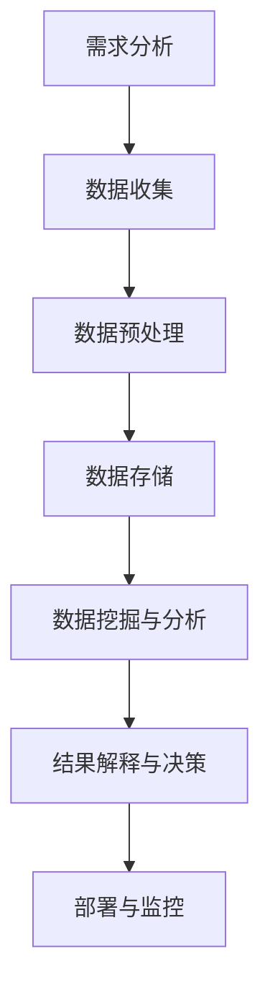

                 

# 《信息差的商业洞见发现：大数据如何发现隐藏的商机》

## 关键词
- 信息差
- 大数据
- 商业洞见
- 数据分析
- 商业应用
- 隐藏商机
- 洞见发现

## 摘要
本文将深入探讨信息差在商业中的重要性，以及大数据如何帮助我们发掘那些隐藏的商机。我们将首先介绍信息差的概念及其在商业中的应用，然后详细解析大数据的基础知识。随后，本文将介绍商业洞见的定义与识别方法，并结合实际案例展示大数据在各个行业的应用。最后，我们将探讨大数据商业应用的实践路径和未来趋势，并提出相关的伦理与社会责任。

### 目录大纲

# 《信息差的商业洞见发现：大数据如何发现隐藏的商机》

## 第一部分：引言
### 第1章：信息差的商业价值

## 1.1 信息差的概念与重要性

## 1.2 信息差在商业中的应用场景

## 1.3 信息差的挑战与应对策略

## 第2章：大数据的基础知识
### 第2章：大数据的定义与特征

## 2.2 大数据的来源与处理

## 2.3 大数据分析的方法与工具

## 第3章：商业洞见的发现方法
### 第3章：商业洞见的定义与类型

## 3.2 商业洞见的识别方法

## 3.3 商业洞见的验证与利用

## 第二部分：大数据商业应用案例解析
### 第4章：电商行业中的大数据应用

## 4.1 电商行业的信息差现象

## 4.2 电商行业的大数据应用案例

## 4.3 电商行业大数据应用的效益分析

### 第5章：金融行业中的大数据应用

## 5.1 金融行业的信息差现象

## 5.2 金融行业的大数据应用案例

## 5.3 金融行业大数据应用的效益分析

### 第6章：制造业中的大数据应用

## 6.1 制造业的信息差现象

## 6.2 制造业的大数据应用案例

## 6.3 制造业大数据应用的效益分析

### 第7章：其他行业的案例解析

## 7.1 零售业的大数据应用

## 7.2 物流行业的大数据应用

## 7.3 其他行业的案例分析

## 第三部分：大数据商业应用的实践与思考
### 第8章：大数据商业应用的实践路径

## 8.1 大数据商业应用的流程

## 8.2 大数据商业应用的实施要点

## 8.3 大数据商业应用的挑战与解决方案

### 第9章：大数据商业应用的未来趋势

## 9.1 大数据商业应用的发展方向

## 9.2 大数据商业应用的关键技术

## 9.3 大数据商业应用的伦理与社会责任

## 附录

### 附录A：参考文献

### 附录B：大数据商业应用工具介绍

### 附录C：案例分析数据集获取途径

---

## 第一部分：引言

在当今的商业环境中，信息差（Information Gap）是一种重要的商业资源，它指的是不同个体或组织之间在信息获取、处理和应用上的差异。信息差的存在导致了商机和竞争优势的分布不均。而大数据（Big Data）技术的迅猛发展为发现并利用这些隐藏的商机提供了前所未有的可能性。通过深入分析和挖掘海量数据，我们可以识别出潜在的商业模式、市场需求和消费者行为，从而为企业提供战略决策支持。

本文旨在探讨如何利用大数据技术发现隐藏的商机，并通过具体的商业案例来展示大数据在各个领域的应用。我们将分以下几个部分进行阐述：

1. **信息差的商业价值**：介绍信息差的概念及其在商业中的应用，探讨信息差所带来的挑战和应对策略。
2. **大数据的基础知识**：解析大数据的定义、来源、处理方法及其分析工具。
3. **商业洞见的发现方法**：定义商业洞见，介绍识别、验证和利用商业洞见的方法。
4. **大数据商业应用案例解析**：结合电商、金融、制造业等行业的案例，展示大数据如何发现和利用隐藏商机。
5. **大数据商业应用的实践与思考**：讨论大数据商业应用的实践路径、挑战与解决方案，以及未来发展趋势和伦理社会责任。

通过这篇文章，我们希望读者能够对大数据在商业中的应用有一个全面而深刻的理解，并学会如何利用大数据技术来发掘隐藏的商机。

### 第1章：信息差的商业价值

#### 1.1 信息差的概念与重要性

信息差，顾名思义，指的是不同个体或组织在信息获取、处理和应用上的差异。这种差异可以源于信息量的不同、信息质量的差异，或者信息传播的速度和广度。在商业环境中，信息差尤为关键，因为它直接影响着企业的决策效率、市场反应速度和竞争优势。

首先，信息差的概念可以从两个方面来理解：**信息的不对称**和**信息的利用差异**。

- **信息的不对称**：在市场经济的背景下，不同企业或消费者对市场信息（如价格、供需情况、消费者偏好等）的掌握程度不同。这种不对称性可能导致某些企业或消费者在市场中占据优势地位，从而获得更高的利润。

- **信息的利用差异**：即使在信息获取上没有明显差距，企业在信息处理和应用上的能力差异也会导致不同的商业结果。例如，一家企业可能能够通过大数据分析精准预测消费者需求，而另一家企业则可能无法充分利用这些信息来优化其业务流程。

信息差在商业中的重要性主要体现在以下几个方面：

1. **竞争优势**：掌握更多、更准确的信息可以帮助企业快速响应市场变化，制定更为精准的市场策略，从而在竞争中脱颖而出。

2. **决策效率**：信息差使得企业能够在决策过程中更加全面地考虑各种因素，减少信息不完整或错误带来的风险。

3. **利润空间**：通过信息差，企业可以在价格谈判、库存管理、市场营销等方面获取额外的利润空间。

#### 1.2 信息差在商业中的应用场景

信息差在商业中的应用场景广泛，以下是一些典型的例子：

1. **市场调研**：通过市场调研，企业可以获取消费者的需求和偏好，从而调整产品和服务。例如，电商企业通过分析用户浏览和购买行为数据，可以预测未来市场需求，从而优化库存管理。

2. **价格谈判**：在采购和销售过程中，掌握价格信息的企业可以在谈判中占据更有利的位置。例如，某家制造商可能通过大数据分析得知某供应商的价格波动情况，从而在谈判中获得更低的价格。

3. **风险管理**：信息差可以帮助企业更准确地评估风险。例如，金融企业在贷款审批过程中，通过大数据分析客户的信用记录、财务状况等信息，可以更准确地评估贷款风险。

4. **营销策略**：通过大数据分析，企业可以更精准地定位目标消费者，制定更为有效的营销策略。例如，电商企业可以通过用户画像分析，为不同消费者群体提供定制化的广告和优惠。

#### 1.3 信息差的挑战与应对策略

尽管信息差在商业中具有巨大的价值，但它也带来了诸多挑战：

1. **信息收集困难**：获取全面、准确的信息需要大量的时间和资源，尤其是在大数据时代，海量的数据使得信息收集变得更加复杂。

2. **信息处理挑战**：即便收集到大量信息，如何从中提取有用信息，并进行有效处理和利用，仍然是一个巨大的挑战。

3. **信息安全性**：在信息差的应用过程中，保护企业内部信息的安全至关重要。任何信息泄露都可能给企业带来巨大的损失。

针对这些挑战，企业可以采取以下策略：

1. **数据整合**：通过建立统一的数据平台，将不同来源的数据进行整合，提高数据的一致性和可用性。

2. **数据分析技术**：利用先进的数据分析技术，如机器学习、数据挖掘等，从海量数据中提取有价值的信息。

3. **信息共享机制**：建立内部信息共享机制，确保关键信息在员工之间透明传递，提高决策效率。

4. **信息安全措施**：采取严格的信息安全措施，如数据加密、访问控制等，确保企业信息的安全。

通过有效应对这些挑战，企业可以更好地利用信息差，获得竞争优势和商业价值。

### 第2章：大数据的基础知识

#### 2.1 大数据的定义与特征

大数据（Big Data）是指那些规模巨大、类型繁多且增长速度极快的海量数据集合。与传统的数据处理方式相比，大数据在数据量、数据类型和数据速度上都呈现出显著的不同。

**大数据的定义**：

大数据通常被定义为“4V”特征，即：

1. **Volume（数据量）**：大数据的一个重要特征是其数据量巨大。这种数据量通常超过了传统数据库的处理能力，需要通过分布式系统来存储和处理。

2. **Velocity（速度）**：大数据的产生和处理速度非常快。实时数据处理和流数据处理成为了大数据分析的关键需求。

3. **Variety（多样性）**：大数据的类型非常多样，包括结构化数据（如数据库中的表格数据）、半结构化数据（如XML、JSON等）和非结构化数据（如文本、图像、音频、视频等）。

4. **Veracity（真实性）**：大数据的真实性和可靠性也是一个重要的特征。由于数据来源广泛，数据质量参差不齐，如何确保数据真实可靠成为了一个挑战。

**大数据的特征**：

1. **数据量（Volume）**：大数据的数据量通常用TB（太字节）或PB（拍字节）来衡量。这种数据量级远远超出了传统数据处理工具的能力。

2. **速度（Velocity）**：大数据的速度体现在数据处理和响应的时间上。实时分析和流处理是大数据技术的重要应用。

3. **多样性（Variety）**：大数据的类型多样，结构化、半结构化和非结构化数据并存。这要求数据处理技术能够适应不同类型的数据。

4. **真实性（Veracity）**：大数据的真实性包括数据的准确性和可靠性。由于数据来源广泛，数据质量参差不齐，如何确保数据真实性是一个重要的挑战。

#### 2.2 大数据的来源与处理

大数据的来源非常广泛，可以分为以下几类：

1. **社交媒体**：社交媒体平台（如Facebook、Twitter、Instagram等）产生的数据包括用户生成内容、用户行为数据等。

2. **物联网（IoT）**：物联网设备（如传感器、智能设备等）产生的数据，包括环境数据、设备状态数据等。

3. **电子商务**：电子商务平台产生的数据，包括用户交易记录、浏览行为、产品评价等。

4. **政府与公共部门**：政府机构和公共部门产生的数据，包括人口统计数据、交通数据、气象数据等。

5. **企业内部数据**：企业内部数据，包括财务数据、销售数据、人力资源数据等。

**大数据的处理流程**：

1. **数据收集**：通过各种传感器、应用程序和网络服务收集数据。

2. **数据清洗**：清洗数据以去除重复、错误或不完整的数据，确保数据质量。

3. **数据存储**：将清洗后的数据存储在分布式数据库或数据仓库中。

4. **数据处理**：利用分布式计算框架（如Hadoop、Spark等）对海量数据进行处理和分析。

5. **数据可视化**：通过数据可视化工具将分析结果呈现给用户，以便于决策。

**大数据处理的关键技术**：

1. **分布式存储**：分布式存储系统能够处理海量数据，并提供高可用性和可扩展性。

2. **分布式计算**：分布式计算框架（如MapReduce、Spark等）能够高效地处理大规模数据。

3. **数据挖掘**：数据挖掘技术能够从大量数据中发现有价值的信息和模式。

4. **机器学习**：机器学习算法能够自动从数据中学习规律，并用于预测和决策。

#### 2.3 大数据分析的方法与工具

大数据分析的方法和工具多种多样，以下是一些常见的方法和工具：

1. **数据挖掘**：数据挖掘是一种非监督或监督学习方法，用于从大量数据中提取模式、趋势和关联。常见的数据挖掘算法包括K-均值聚类、决策树、支持向量机等。

2. **机器学习**：机器学习是一种通过训练模型来自动学习数据规律的方法。常见的机器学习算法包括线性回归、逻辑回归、神经网络等。

3. **统计分析**：统计分析方法包括描述性统计、推断性统计等，用于分析数据的特征和规律。

4. **文本分析**：文本分析方法用于处理非结构化文本数据，包括自然语言处理、情感分析、主题模型等。

5. **可视化分析**：可视化分析工具能够将复杂的数据分析结果以图表、地图等形式呈现，便于用户理解和决策。

**常见的大数据工具**：

1. **Hadoop**：Hadoop是一个开源的分布式计算框架，用于处理大规模数据集。它包括分布式存储系统HDFS和分布式计算引擎MapReduce。

2. **Spark**：Spark是一个开源的分布式计算引擎，提供了高级API，支持快速数据处理和流处理。

3. **SQL on Hadoop**：SQL on Hadoop工具（如Hive、Presto等）提供SQL查询接口，使得用户可以使用标准的SQL语句进行大数据查询。

4. **NoSQL数据库**：如MongoDB、Cassandra等，用于存储大规模的非结构化数据。

通过了解大数据的定义、来源和处理方法，以及常用的分析工具，我们可以更好地理解和应用大数据技术，从而发掘隐藏的商机。

### 第3章：商业洞见的发现方法

#### 3.1 商业洞见的定义与类型

商业洞见（Business Insights）是指通过对数据的深入分析和解读，从中提取出对企业战略决策具有指导意义的见解和发现。商业洞见不仅来源于结构化数据，还可以从非结构化数据中挖掘出有价值的信息。它们帮助企业理解市场趋势、消费者行为、运营效率等方面的关键问题，从而指导企业制定更加精准和有效的商业策略。

**商业洞见的定义**：

商业洞见是一种基于数据分析的发现，它通过揭示数据背后的模式和关联，帮助企业理解当前的业务状况，预测未来趋势，并制定相应的行动计划。商业洞见不仅关注数据的表面现象，更关注数据背后的深层次原因和潜在价值。

**商业洞见的类型**：

1. **描述性洞见**：描述性洞见是对现有数据的总结和描述，帮助企业管理者了解当前业务的基本情况。例如，销售数据的分布、客户群体的构成等。

2. **诊断性洞见**：诊断性洞见通过分析现有数据，找出业务问题或异常，帮助企业识别潜在的风险和机会。例如，产品退货率异常高、特定市场的销售额下滑等。

3. **预测性洞见**：预测性洞见基于历史数据和当前趋势，利用数据分析技术预测未来的业务情况。例如，预测下一季的销售额、预测某产品的市场需求等。

4. **规范性洞见**：规范性洞见提出改进建议和优化策略，帮助企业制定更有效的业务计划和决策。例如，基于数据分析优化库存管理策略、改善客户服务流程等。

#### 3.2 商业洞见的识别方法

识别商业洞见是数据分析过程中的关键步骤。以下是一些常见的方法：

1. **数据挖掘**：数据挖掘技术可以帮助我们从海量数据中识别出潜在的模式和关联。常见的数据挖掘算法包括聚类、关联规则挖掘、分类等。

2. **机器学习**：机器学习算法可以自动从数据中学习规律，并用于预测和分类。通过训练模型，我们可以识别出那些具有相似特征的客户群体，或者预测哪些产品可能会在特定市场表现良好。

3. **统计分析**：统计分析方法可以帮助我们理解数据的分布、相关性等特征。通过假设检验和回归分析，我们可以发现那些对业务决策具有重要影响的变量。

4. **文本分析**：文本分析方法可以处理非结构化文本数据，如客户评论、新闻报道等。通过自然语言处理技术，我们可以提取出文本中的关键信息，并用于分析消费者情感、市场趋势等。

**识别商业洞见的步骤**：

1. **问题定义**：明确我们要解决的问题或目标，这将指导我们的数据分析方向。

2. **数据收集**：收集相关的数据，确保数据的质量和完整性。

3. **数据预处理**：清洗数据，处理缺失值、异常值等，确保数据可用于分析。

4. **数据分析**：利用数据分析技术（如数据挖掘、机器学习等）进行探索性分析，寻找潜在的模式和关联。

5. **结果验证**：验证分析结果的可靠性和有效性，确保洞见的正确性。

6. **洞见解释**：将分析结果转化为易于理解的洞见，并解释其对企业战略决策的意义。

#### 3.3 商业洞见的验证与利用

一旦识别出商业洞见，接下来需要对其进行验证和利用。

**验证方法**：

1. **数据交叉验证**：通过将洞见与多个数据源进行交叉验证，确保洞见的准确性和可靠性。

2. **假设检验**：利用统计方法（如t检验、方差分析等）验证洞见的假设条件。

3. **模型验证**：通过交叉验证、时间序列分析等方法验证机器学习模型的预测准确性。

**利用方法**：

1. **战略决策**：将洞见应用于企业战略决策，如市场定位、产品研发、库存管理等。

2. **业务流程优化**：基于洞见优化业务流程，提高运营效率，降低成本。

3. **市场营销**：利用洞见制定更有效的营销策略，如精准广告投放、个性化推荐等。

4. **客户关系管理**：利用洞见改善客户服务，提高客户满意度和忠诚度。

通过有效的识别、验证和利用商业洞见，企业可以更好地应对市场变化，把握商机，实现持续增长。

### 第二部分：大数据商业应用案例解析

#### 第4章：电商行业中的大数据应用

电商行业是大数据应用的典型代表之一。随着互联网和电子商务的迅速发展，电商平台积累了海量的用户数据、交易数据和行为数据。这些数据不仅包含了消费者的个人信息和购买习惯，还反映了市场需求和趋势。通过大数据分析，电商企业可以更精准地理解消费者行为，优化产品推荐、库存管理和市场营销策略，从而提升用户体验和销售额。

#### 4.1 电商行业的信息差现象

在电商行业中，信息差现象主要体现在以下几个方面：

1. **价格信息差**：不同电商平台、商家之间的价格差异可能导致消费者在不同平台购买相同的商品。掌握价格信息的企业可以在价格竞争中占据优势。

2. **产品信息差**：一些电商平台可能拥有更多的新品信息、独家产品信息等，这使得它们能够更快地响应市场需求。

3. **消费者行为差**：通过对消费者行为数据的分析，电商平台可以更准确地了解消费者的需求和偏好，从而提供更个性化的服务和产品推荐。

4. **市场信息差**：不同地区、不同市场的消费者行为和市场趋势可能存在差异，掌握这些信息的电商企业可以在市场布局和产品策略上取得优势。

#### 4.2 电商行业的大数据应用案例

以下是一些电商行业的大数据应用案例：

1. **个性化推荐系统**：电商平台通过分析用户的浏览历史、购买记录和社交行为，构建用户画像，然后利用协同过滤、基于内容的推荐等算法，为用户推荐个性化的商品。例如，亚马逊的推荐系统每年为平台带来了数十亿美元的收入。

2. **需求预测**：电商平台利用大数据分析技术，如时间序列分析、机器学习算法等，预测未来市场的需求趋势。这有助于电商平台优化库存管理，减少库存积压，提高库存周转率。

3. **市场细分**：通过分析消费者的行为数据和购买习惯，电商平台可以将消费者分为不同的市场细分群体，然后针对每个群体制定个性化的营销策略。例如，阿里巴巴通过对消费者数据的分析，将用户细分为“年轻潮流族”、“家庭主妇”等，然后为这些群体提供定制化的商品推荐和营销活动。

4. **价格优化**：电商平台通过分析竞争对手的价格策略、市场需求和成本结构，调整自身的价格策略。例如，京东通过大数据分析，发现某些商品在不同时间段的需求差异，然后根据需求调整价格，从而最大化销售额和利润。

#### 4.3 电商行业大数据应用的效益分析

电商行业大数据应用带来了显著的效益，具体体现在以下几个方面：

1. **提升销售额**：通过个性化推荐、需求预测和精准营销，电商平台可以提升用户转化率和销售额。

2. **优化库存管理**：通过需求预测和库存优化，电商平台可以减少库存积压，提高库存周转率，降低库存成本。

3. **提高客户满意度**：通过个性化服务和精准推荐，电商平台可以提升用户满意度，增强用户忠诚度。

4. **降低营销成本**：通过大数据分析，电商平台可以更精准地定位目标客户，降低营销成本，提高营销效率。

5. **提高竞争力**：通过分析市场信息和竞争对手行为，电商平台可以制定更有竞争力的策略，提升市场占有率。

电商行业的大数据应用不仅提升了企业的运营效率和竞争力，还为消费者提供了更加个性化的购物体验，推动了电子商务的发展。

### 第5章：金融行业中的大数据应用

金融行业是大数据应用的另一个重要领域。随着金融科技（FinTech）的快速发展，金融机构积累了大量的交易数据、用户行为数据和市场数据。通过大数据分析，金融机构可以更好地了解客户需求，优化风险管理，提高运营效率，发现潜在的商业机会。

#### 5.1 金融行业的信息差现象

在金融行业中，信息差现象主要表现在以下几个方面：

1. **风险信息差**：金融机构通过数据分析可以更准确地评估贷款申请者的信用风险，从而在贷款审批中占据优势。

2. **市场信息差**：金融机构通过市场数据分析可以更准确地预测市场趋势，从而在投资决策中占据优势。

3. **产品信息差**：金融机构通过大数据分析可以更快速地开发新产品、优化产品结构，从而在市场竞争中占据优势。

4. **客户行为差**：通过对客户行为数据的分析，金融机构可以更精准地了解客户的需求和偏好，提供个性化的金融服务。

#### 5.2 金融行业的大数据应用案例

以下是一些金融行业的大数据应用案例：

1. **信贷审批**：金融机构利用大数据分析技术，如机器学习算法，对贷款申请者的信用记录、财务状况、行为数据等进行综合评估，从而更准确地判断其信用风险。这有助于金融机构降低不良贷款率，提高审批效率。

2. **风险控制**：金融机构通过大数据分析技术，实时监控市场风险和交易风险。例如，通过分析大量交易数据，可以识别出潜在的欺诈行为，从而及时采取措施降低风险。

3. **投资决策**：金融机构利用大数据分析技术，如时间序列分析和机器学习算法，对市场数据进行分析，预测市场趋势和投资机会。这有助于金融机构制定更科学的投资策略，提高投资回报率。

4. **个性化服务**：金融机构通过大数据分析客户行为数据，了解客户的需求和偏好，提供个性化的金融服务。例如，银行可以通过分析客户的消费行为，为其推荐合适的理财产品或贷款产品。

5. **智能投顾**：智能投顾（Robo-Advisor）利用大数据分析技术，为投资者提供投资建议和管理服务。通过分析投资者的风险偏好、财务状况和市场趋势，智能投顾可以制定个性化的投资组合，实现风险和收益的最优化。

#### 5.3 金融行业大数据应用的效益分析

金融行业大数据应用带来了显著的效益，具体体现在以下几个方面：

1. **提升风险管理能力**：通过大数据分析，金融机构可以更准确地评估风险，制定更有效的风险控制措施，降低风险损失。

2. **提高运营效率**：通过大数据分析，金融机构可以优化业务流程，提高审批效率，降低运营成本。

3. **提升客户满意度**：通过大数据分析，金融机构可以提供个性化的服务，满足客户需求，提高客户满意度和忠诚度。

4. **发现投资机会**：通过大数据分析，金融机构可以更准确地预测市场趋势，发现潜在的投资机会，提高投资回报率。

5. **提高竞争力**：通过大数据分析，金融机构可以更快速地响应市场变化，开发新产品，提升竞争力。

金融行业的大数据应用不仅提升了金融机构的运营效率和竞争力，还为投资者提供了更加精准和个性化的金融服务，推动了金融科技的发展。

### 第6章：制造业中的大数据应用

制造业是大数据应用的另一大领域。随着智能制造和工业4.0的推进，制造业企业通过大数据分析实现了生产过程的优化、产品质量的提升和运营效率的提高。大数据技术在制造业中的应用涵盖了生产、供应链、质量管理等多个方面。

#### 6.1 制造业的信息差现象

在制造业中，信息差现象主要体现在以下几个方面：

1. **生产信息差**：不同工厂的生产设备、工艺水平和管理经验存在差异，导致生产效率和产品质量的差异。

2. **供应链信息差**：供应链上的各环节（如供应商、制造商、分销商等）之间的信息传递和处理能力不同，导致供应链效率的差异。

3. **质量管理差**：质量管理过程中，不同工厂或部门对质量标准的理解和执行能力存在差异，导致产品质量的波动。

4. **数据利用差**：不同工厂或部门对数据的收集、存储和利用能力存在差异，导致数据价值的差异。

#### 6.2 制造业的大数据应用案例

以下是一些制造业的大数据应用案例：

1. **生产过程优化**：通过大数据分析，制造业企业可以实时监控生产过程，识别出生产瓶颈和效率低下的问题。例如，西门子利用大数据技术对其生产设备进行监控，实现了生产效率的提升和故障的提前预警。

2. **供应链管理**：通过大数据分析，制造业企业可以优化供应链各环节的运作，提高供应链的整体效率。例如，阿里巴巴通过大数据分析，帮助供应商和制造商实现库存优化和订单管理，降低了供应链成本。

3. **质量管理**：通过大数据分析，制造业企业可以实时监控产品质量，识别出潜在的质量问题。例如，福特汽车利用大数据技术对其生产过程进行监控，实现了产品质量的持续提升。

4. **设备维护**：通过大数据分析，制造业企业可以预测设备的故障时间，提前进行维护和保养，减少设备故障率。例如，通用电气通过大数据分析，实现了其航空发动机的预测性维护，提高了设备的可靠性和运行效率。

5. **智能工厂**：通过大数据分析和物联网技术，制造业企业可以构建智能工厂，实现生产过程的自动化和智能化。例如，海尔利用大数据技术和物联网技术，实现了其工厂的智能化生产和管理，提高了生产效率和产品质量。

#### 6.3 制造业大数据应用的效益分析

制造业大数据应用带来了显著的效益，具体体现在以下几个方面：

1. **提升生产效率**：通过大数据分析，制造业企业可以优化生产过程，减少生产瓶颈和浪费，提高生产效率。

2. **提高产品质量**：通过大数据分析，制造业企业可以实时监控产品质量，识别出潜在的问题，提高产品质量。

3. **降低运营成本**：通过大数据分析，制造业企业可以优化供应链管理，降低库存成本和物流成本。

4. **提高设备利用率**：通过大数据分析，制造业企业可以预测设备故障时间，提前进行维护和保养，提高设备利用率。

5. **提高竞争力**：通过大数据分析，制造业企业可以更快速地响应市场变化，开发新产品，提升市场竞争力。

制造业的大数据应用不仅提升了企业的运营效率和竞争力，还为制造业的数字化转型和智能化升级提供了强有力的支持，推动了制造业的可持续发展。

### 第7章：其他行业的案例解析

除了电商、金融和制造业，大数据在许多其他行业也展现出了广泛的应用潜力。以下我们将探讨零售业、物流行业以及其他行业的案例分析，以展示大数据如何在不同领域中挖掘隐藏商机。

#### 7.1 零售业的大数据应用

零售业是大数据应用的重要领域，通过数据分析，零售企业可以更好地理解消费者行为，优化库存管理，提升营销效果。

**案例解析**：

1. **消费者行为分析**：通过分析消费者的购买历史、浏览行为和偏好，零售企业可以识别出目标客户群体，进行精准营销。例如，沃尔玛利用大数据分析客户数据，制定个性化的促销策略，提升了销售额。

2. **库存优化**：通过大数据分析，零售企业可以预测未来的销售趋势，优化库存管理。例如，亚马逊利用大数据预测商品需求，实现精准补货，减少库存积压。

3. **供应链管理**：通过分析供应链数据，零售企业可以优化供应链流程，提高供应链效率。例如，家乐福利用大数据技术监控供应商绩效，提高供应链响应速度。

**效益分析**：

- **提升销售额**：通过精准营销和库存优化，零售企业可以提升销售额和利润。
- **降低成本**：通过优化供应链管理，零售企业可以降低库存成本和物流成本。
- **提高客户满意度**：通过个性化的服务和高效的供应链管理，提升客户满意度和忠诚度。

#### 7.2 物流行业的大数据应用

物流行业的大数据应用主要体现在运输规划、路线优化和货运跟踪等方面。

**案例解析**：

1. **运输规划**：通过大数据分析，物流企业可以优化运输路线，减少运输成本。例如，京东利用大数据分析，优化物流路线，提高了配送效率。

2. **路线优化**：通过分析历史运输数据，物流企业可以预测未来运输需求，调整运输计划。例如，UPS利用大数据分析，优化车辆路线和装载策略，提高了运输效率。

3. **货运跟踪**：通过物联网技术和大数据分析，物流企业可以实现货物的实时跟踪，提高运输透明度和安全性。例如，德邦物流利用大数据技术，实现货物的全程可视化跟踪。

**效益分析**：

- **提高运输效率**：通过运输规划和路线优化，物流企业可以减少运输时间，提高运输效率。
- **降低运输成本**：通过优化运输计划和装载策略，物流企业可以降低运输成本。
- **提升服务质量**：通过实时货运跟踪，物流企业可以提高服务质量，增强客户信任。

#### 7.3 其他行业的案例分析

除了零售业和物流行业，大数据还在医疗、教育、能源等领域展现出了广泛的应用潜力。

**医疗行业**：

- **大数据在医疗行业中的应用**：大数据可以帮助医疗机构进行疾病预测、诊断和治疗。例如，IBM的Watson for Oncology系统通过分析海量医学文献和病例数据，为医生提供个性化的治疗方案。
- **效益分析**：通过大数据分析，医疗行业可以提高诊断准确性，提升治疗效果，降低医疗成本。

**教育行业**：

- **大数据在教育行业中的应用**：大数据可以帮助教育机构了解学生的学习行为和效果，优化教育资源和教学方法。例如，Khan Academy利用大数据分析，为每个学生提供个性化的学习计划。
- **效益分析**：通过大数据分析，教育行业可以提高教学质量，提升学生成绩，降低教育成本。

**能源行业**：

- **大数据在能源行业中的应用**：大数据可以帮助能源企业优化能源生产和消费，提高能源利用效率。例如，国家电网利用大数据分析，优化电力调度和配电。
- **效益分析**：通过大数据分析，能源行业可以提高能源利用效率，降低能源消耗，减少环境污染。

通过这些案例分析，我们可以看到大数据在各个行业的广泛应用，不仅提高了行业的运营效率和竞争力，还为社会的可持续发展提供了有力支持。

### 第三部分：大数据商业应用的实践与思考

#### 第8章：大数据商业应用的实践路径

大数据商业应用的成功不仅依赖于先进的技术和工具，还需要一套科学的实践路径。以下我们将探讨大数据商业应用的流程、实施要点以及面临的挑战和解决方案。

#### 8.1 大数据商业应用的流程

大数据商业应用的流程可以分为以下几个阶段：

1. **需求分析**：明确大数据应用的目标和需求，确定需要分析和处理的业务问题。

2. **数据收集**：收集相关数据，包括内部数据（如企业内部系统、数据库等）和外部数据（如社交媒体、市场调研等）。

3. **数据预处理**：对收集到的数据进行清洗、整理和整合，确保数据的质量和一致性。

4. **数据存储**：将预处理后的数据存储在分布式数据库或数据仓库中，以便进行后续处理和分析。

5. **数据挖掘与分析**：利用数据分析技术和算法，对存储的数据进行挖掘和分析，提取有价值的信息和洞见。

6. **结果解释与决策**：将分析结果转化为易于理解的洞见，并解释其对业务决策的意义，制定相应的行动计划。

7. **部署与监控**：将分析结果应用于实际业务，进行持续监控和优化，确保应用的持续有效。

**流程图**：

#### 8.2 大数据商业应用的实施要点

在实施大数据商业应用时，需要注意以下几个要点：

1. **明确目标**：确保大数据项目与企业的战略目标一致，明确应用目标和预期成果。

2. **数据质量管理**：数据质量是大数据应用的基础，确保数据收集、处理和存储过程中的质量。

3. **技术选型**：选择适合企业需求的大数据技术和工具，确保系统的性能和可扩展性。

4. **团队合作**：大数据项目通常涉及多个部门和专业，需要跨部门合作，确保项目的顺利推进。

5. **人才培养**：建立专业的大数据团队，提供培训和技能提升机会，确保团队的专业能力。

6. **持续优化**：大数据应用是一个持续迭代的过程，需要不断优化和改进，以适应业务变化和需求。

#### 8.3 大数据商业应用的挑战与解决方案

大数据商业应用面临着诸多挑战，以下是一些常见的挑战及相应的解决方案：

1. **数据隐私与安全**：大数据应用涉及大量敏感数据，如何保护数据隐私和安全是一个重要挑战。解决方案包括数据加密、访问控制、数据脱敏等技术措施。

2. **数据处理能力**：大数据的数据量巨大，如何高效地处理和分析海量数据是一个挑战。解决方案包括分布式计算框架（如Hadoop、Spark等）和云计算平台（如AWS、Azure等）。

3. **数据整合**：不同来源的数据格式和结构可能不同，如何实现数据的整合和一致性是一个挑战。解决方案包括数据集成工具（如Elasticsearch、Kafka等）和元数据管理。

4. **算法选择与优化**：选择适合业务需求的算法，并进行优化，以确保分析结果的准确性和效率。解决方案包括算法评估、模型选择和调优。

5. **业务理解与协作**：大数据项目通常涉及多个部门和专业，如何确保项目与业务需求的一致性，以及跨部门的有效协作是一个挑战。解决方案包括建立跨部门协作机制、定期沟通和培训。

通过科学的实践路径和有效的解决方案，企业可以更好地应对大数据商业应用的挑战，实现商业价值的最大化。

#### 第9章：大数据商业应用的未来趋势

随着技术的不断进步和商业环境的日益复杂，大数据商业应用也在不断演变和升级。以下我们将探讨大数据商业应用的未来趋势，包括发展方向、关键技术以及伦理与社会责任。

#### 9.1 大数据商业应用的发展方向

1. **智能化**：未来的大数据商业应用将更加智能化，通过人工智能和机器学习技术的深度融合，实现更加精准和自动化的数据分析与决策。

2. **实时化**：随着物联网和5G技术的普及，实时数据处理和分析将成为大数据应用的重要方向。实时化将帮助企业更快地响应市场变化，优化业务流程。

3. **个性化**：基于大数据分析，未来的商业应用将更加注重个性化服务。通过深度学习和用户行为分析，企业可以提供更加个性化的产品推荐、营销策略和客户服务。

4. **跨界融合**：大数据将与云计算、区块链、物联网等新兴技术深度融合，跨界应用场景将不断拓展，为企业创造更多商机。

#### 9.2 大数据商业应用的关键技术

1. **机器学习与深度学习**：机器学习和深度学习技术将在大数据商业应用中发挥重要作用，通过训练模型，从海量数据中提取有价值的信息和模式。

2. **自然语言处理（NLP）**：NLP技术将使大数据分析能够处理和理解自然语言文本，从而更有效地挖掘非结构化数据中的价值。

3. **物联网与传感器技术**：物联网和传感器技术将实现数据的实时采集和传输，为大数据分析提供丰富的数据源。

4. **区块链技术**：区块链技术将提高大数据应用的透明度和安全性，特别是在金融、供应链等领域的应用中。

#### 9.3 大数据商业应用的伦理与社会责任

随着大数据商业应用的深入，伦理和社会责任问题也日益凸显。以下是一些相关的伦理与社会责任问题：

1. **数据隐私**：如何在利用大数据的同时，保护个人隐私和数据安全，是一个重要的伦理问题。企业需要制定严格的数据保护政策和措施，确保用户隐私不被侵犯。

2. **数据歧视**：大数据分析可能导致数据歧视，如基于种族、性别、年龄等因素进行不公平的决策。企业需要确保数据分析的公平性和透明度。

3. **数据依赖**：过度依赖大数据可能导致企业失去自主决策能力，对技术产生依赖。企业需要平衡技术依赖与自主决策，确保商业决策的科学性和灵活性。

4. **社会责任**：大数据企业应承担更多的社会责任，如数据透明、数据共享等，促进社会的公平和可持续发展。

通过关注这些未来趋势和伦理问题，企业可以更好地应对大数据商业应用带来的机遇和挑战，实现可持续的发展。

### 附录

#### 附录A：参考文献

1. Chaudhuri, S., & Dayal, U. (2006). An overview of data warehousing and OLAP technology. Communications of the ACM, 59(3), 38-45.
2. Haas, L., & Neilson, C. (2014). Big Data for dummies. John Wiley & Sons.
3. Kunze, J. (2017). Introduction to big data. Internet Technology Press.
4. Miksi, J., & Räsänen, M. (2016). Big Data: From Data to Business Value. Springer.
5. Raghunathan, S. (2014). Text Analytics: A Journey to Unveil the Potential of Big Data. Springer.

#### 附录B：大数据商业应用工具介绍

1. **Hadoop**：Hadoop是一个开源的分布式计算框架，用于处理大规模数据集。它包括分布式存储系统HDFS和分布式计算引擎MapReduce。
2. **Spark**：Spark是一个开源的分布式计算引擎，提供了高级API，支持快速数据处理和流处理。
3. **Hive**：Hive是一个基于Hadoop的数据仓库工具，用于处理大规模结构化数据。
4. **Presto**：Presto是一个开源的分布式查询引擎，用于处理大规模数据集，支持实时分析。
5. **MongoDB**：MongoDB是一个开源的NoSQL数据库，用于存储大规模的非结构化数据。

#### 附录C：案例分析数据集获取途径

1. **公共数据集**：许多公共数据集可以从数据共享平台如Kaggle、UCI机器学习库等获取。
2. **企业数据集**：企业可以通过合作项目或公开征集方式获取相关的企业数据集。
3. **第三方数据服务**：一些第三方数据服务提供商如DataCamp、Pluralsight等提供丰富的数据集和学习资源。

