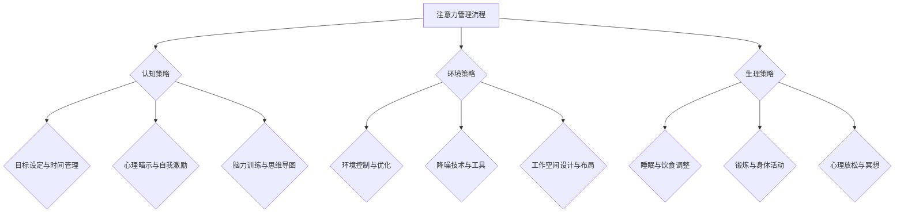

                 

# 《信息时代的注意力管理技术与策略：在干扰和信息过载中保持专注》

> 关键词：注意力管理、信息过载、干扰、专注力、策略与技术

> 摘要：本文深入探讨了信息时代下注意力管理的理论和实践，分析了注意力管理的概念、重要性以及信息过载与干扰的影响。随后，文章提出了提升注意力水平的多种策略和方法，包括认知策略、环境策略和生理策略。此外，还介绍了注意力管理工具和技术，以及在企业、教育和个人生活中的应用案例。最后，通过附录提供了注意力管理相关资源、Mermaid流程图以及核心算法原理与伪代码。本文旨在为读者提供一套完整的注意力管理指南。

## 第一部分：注意力管理理论基础

### 第1章：注意力管理的概念与重要性

#### 1.1 什么是注意力

注意力是人类意识的核心特征，是指个体在感知和认知过程中对特定信息的集中和关注。从神经科学的角度来看，注意力是一组大脑功能系统，涉及多种脑区和神经通路的协同作用。注意力的功能主要包括筛选信息、调节心理状态、促进认知加工和记忆等。

#### 1.2 注意力的类型与功能

注意力可分为几种类型：选择注意力、分配注意力和持续注意力。

- 选择注意力：是指个体在众多刺激中选择重要信息进行加工的能力。
- 分配注意力：是指个体同时处理多个任务或刺激的能力。
- 持续注意力：是指个体对特定任务或刺激的持续关注和维持能力。

#### 1.3 注意力管理的必要性

随着信息时代的到来，人们面临的信息过载和干扰日益严重，导致注意力资源变得稀缺。有效的注意力管理对于提高工作效率、提升学习和生活质量具有重要意义。

#### 1.4 注意力管理的挑战

- 多任务处理：在当今多任务工作环境中，如何高效地分配注意力成为一个挑战。
- 干扰控制：外界干扰容易分散注意力，如何有效控制干扰成为注意力管理的难点。
- 时间管理：合理规划时间，确保在每个任务上投入足够的注意力。

### 第2章：信息过载与干扰的影响

#### 2.1 信息过载的表现与后果

信息过载是指个体在信息处理过程中，因信息量过大而导致的认知负担增加。其表现包括：

- 过度忙碌：感到事务繁多，无法应对。
- 注意力分散：对关键信息的关注度下降。
- 焦虑和压力：因无法处理大量信息而产生焦虑和压力。

信息过载的后果包括：

- 工作效率降低：无法专注于关键任务，导致工作效率下降。
- 创造力下降：因注意力分散而影响创造性思维。
- 健康问题：长时间处于信息过载状态可能导致身心问题。

#### 2.2 干扰的来源与类型

干扰来源可以分为内部干扰和外部干扰。

- 内部干扰：包括思维干扰、情绪波动、身体不适等。
- 外部干扰：包括噪音、社交媒体、邮件、电话等。

外部干扰类型包括：

- 冲击性干扰：突然出现的高强度干扰，如紧急电话或突发事件。
- 持续性干扰：长时间存在的低强度干扰，如办公室噪音或社交媒体通知。

#### 2.3 干扰对注意力的影响

干扰会降低注意力的集中度和效率，导致以下后果：

- 注意力分散：无法专注于当前任务。
- 记忆受损：干扰导致记忆加工过程受到影响，记忆效果降低。
- 心理压力：干扰引发焦虑和压力，影响心理健康。

#### 2.4 如何应对信息过载与干扰

为了应对信息过载和干扰，可以采取以下策略：

- 设定明确目标：明确任务目标和优先级，避免盲目处理大量信息。
- 使用工具：利用时间管理工具和注意力管理软件，提高工作效率。
- 简化信息：减少无关信息的摄入，关注核心内容。
- 管理环境：创造一个安静、整洁的工作环境，减少外部干扰。
- 心理调节：学会放松和情绪管理，降低内部干扰。

## 第二部分：注意力管理策略与方法

### 第3章：提升注意力水平的策略

#### 3.1 认知策略

认知策略是指通过认知加工和思维方式来提高注意力水平的方法。

##### 3.1.1 目标设定与时间管理

设定明确的目标和优先级有助于提高注意力。例如，使用GTD（Getting Things Done）方法，将任务分解为具体的子任务，并设定完成时间。

时间管理工具如番茄工作法，可以帮助集中注意力，每个25分钟的工作时间后休息5分钟，有助于恢复注意力。

##### 3.1.2 心理暗示与自我激励

通过积极的自我暗示和激励，提高注意力水平。例如，使用正向的自我对话，如“我能够集中注意力完成任务”。

##### 3.1.3 脑力训练与思维导图

脑力训练如记忆训练、思维导图等，有助于提升认知能力和注意力。思维导图可以帮助整理思路，提高工作效率。

#### 3.2 环境策略

环境策略是指通过优化工作环境来提高注意力水平。

##### 3.2.1 环境控制与优化

确保工作环境安静、整洁，减少外部干扰。例如，使用耳机听轻音乐或白噪音，屏蔽外界噪音。

##### 3.2.2 降噪技术与工具

使用降噪耳机或软件，降低外界噪音干扰。

##### 3.2.3 工作空间设计与布局

优化工作空间布局，使工作环境更加舒适和有序。例如，将常用的工具和资料放在容易获取的位置。

#### 3.3 生理策略

生理策略是指通过调整生理状态来提高注意力水平。

##### 3.3.1 睡眠与饮食调整

保持充足的睡眠和合理的饮食，有助于提高注意力。例如，每晚保证7-8小时的高质量睡眠。

##### 3.3.2 锻炼与身体活动

定期进行锻炼和身体活动，有助于提高身体和心理状态。例如，每周进行3-5次30分钟的有氧运动。

##### 3.3.3 心理放松与冥想

通过心理放松和冥想，减轻压力和焦虑，提高注意力。例如，每天进行10分钟的冥想练习。

### 第4章：注意力管理工具与技术

#### 4.1 注意力追踪与评估工具

注意力追踪工具如MyndPlay、Focus@Will等，可以监测和评估个体的注意力水平。通过数据分析，了解注意力分布和变化，优化注意力管理策略。

#### 4.2 专注力训练软件与应用

专注力训练软件如Lumosity、Headspace等，提供一系列专注力训练任务和游戏，帮助提高注意力。

#### 4.3 注意力管理辅助技术

时间管理软件如Trello、Asana等，可以帮助规划任务和时间，减少注意力分散。

信息过滤与推送服务如Feedly、NewsBlur等，可以筛选和整理重要信息，减少信息过载。

## 第三部分：案例研究与实际应用

### 第5章：注意力管理在企业中的应用

#### 5.1 企业注意力管理的挑战

企业在信息时代面临以下注意力管理挑战：

- 员工注意力分散：多任务处理导致员工注意力分散，影响工作效率。
- 信息过载：大量信息和电子邮件使员工难以应对。
- 干扰控制：办公室噪音和社交媒体等干扰因素影响员工注意力。

#### 5.2 企业级注意力管理的重要性

企业级注意力管理对于提高员工工作效率、优化团队协作和降低运营成本具有重要意义。

#### 5.3 企业注意力管理的解决方案

企业可以采取以下措施进行注意力管理：

- 设立明确的目标和优先级：确保员工明确任务目标和优先级，避免盲目处理大量信息。
- 提供注意力管理培训：为员工提供注意力管理培训，提高其注意力水平。
- 管理环境：优化工作环境，减少外部干扰。
- 使用注意力管理工具：引入注意力管理工具，如时间管理软件和专注力训练软件。

### 第6章：注意力管理在教育领域的应用

#### 6.1 教育中注意力管理的重要性

注意力管理在教育领域具有重要意义，有助于提高学生的学习效果和教学质量。

#### 6.2 教师注意力管理的策略与方法

教师可以采取以下策略和方法进行注意力管理：

- 创设有趣的教学环境：设计有趣的教学活动和课程，提高学生的兴趣和参与度。
- 使用多媒体教学：利用多媒体技术，如视频、音频和动画，增强学生的注意力。
- 定期评估注意力：定期对学生进行注意力评估，了解其注意力水平，及时调整教学策略。

#### 6.3 学生注意力管理的策略与方法

学生可以采取以下策略和方法进行注意力管理：

- 设定学习目标：明确学习目标和计划，避免盲目学习。
- 使用时间管理工具：利用时间管理工具，如日程表和提醒功能，合理安排学习时间。
- 进行专注力训练：参加专注力训练课程或使用专注力训练软件，提高自己的注意力。

### 第7章：注意力管理在个人生活中的应用

#### 7.1 个人注意力管理的重要性

个人注意力管理对于提高工作效率、提升生活质量和维护身心健康具有重要意义。

#### 7.2 个人注意力管理的方法与技巧

个人可以采取以下方法与技巧进行注意力管理：

- 设定明确的目标和计划：明确个人目标和计划，避免盲目行动。
- 学会拒绝和说“不”：合理拒绝无关事务，避免注意力分散。
- 管理时间：合理安排时间，确保在每个任务上投入足够的注意力。
- 管理环境：优化生活环境，减少外部干扰。

#### 7.3 面对干扰与信息过载的应对策略

个人可以采取以下策略应对干扰和信息过载：

- 使用注意力管理工具：利用注意力管理工具，如时间管理软件和专注力训练软件，提高注意力。
- 学会放松：进行心理放松和冥想练习，减轻压力和焦虑。
- 简化信息：减少无关信息的摄入，关注核心内容。

### 附录

#### 附录A：注意力管理相关资源与工具

- 注意力管理书籍推荐：
  - 《如何掌控你的注意力：有效管理注意力，提升工作与生活品质》
  - 《专注力：提升注意力，提高工作效率》
- 注意力管理应用软件介绍：
  - Focus@Will：提供定制化的专注力训练和背景音乐。
  - MyndPlay：提供注意力追踪和评估功能。
- 注意力管理在线课程与资源链接：
  - Coursera：提供注意力管理相关的在线课程。
  - edX：提供注意力管理相关的在线课程和讲座。

#### 附录B：注意力管理技术的 Mermaid 流程图



#### 附录C：核心算法原理与伪代码

```latex
// 注意力分配算法伪代码
function attention_allocation(task, context):
    if context == "安静环境":
        attention_level = 1.2 * task_importance
    else if context == "干扰环境":
        attention_level = 0.8 * task_importance
    return attention_level
```

#### 附录D：注意力管理项目实战

#### D.1 项目背景与目标

本项目旨在开发一款注意力管理应用程序，帮助用户提高注意力水平，优化工作和学习效率。

#### D.2 开发环境搭建与工具选择

- 开发语言：Python
- 开发环境：PyCharm
- 数据库：SQLite
- 注意力追踪技术：OpenCV
- 专注力训练软件：Headspace API

#### D.3 源代码详细实现

（以下为简化版的源代码实现，仅供参考）

```python
import cv2
import sqlite3

# 连接数据库
conn = sqlite3.connect('attention_management.db')
cursor = conn.cursor()

# 创建数据表
cursor.execute('''CREATE TABLE IF NOT EXISTS attention_data
                 (id INTEGER PRIMARY KEY AUTOINCREMENT,
                 task TEXT,
                 context TEXT,
                 attention_level REAL)''')

# 记录注意力数据
def record_attention_data(task, context, attention_level):
    cursor.execute("INSERT INTO attention_data (task, context, attention_level) VALUES (?, ?, ?)",
                   (task, context, attention_level))
    conn.commit()

# 处理图像数据
def process_image(image_path):
    image = cv2.imread(image_path)
    # 使用OpenCV进行注意力追踪
    # ...
    attention_level = 0.9  # 示例值
    record_attention_data(task="图像处理", context="安静环境", attention_level=attention_level)

# 主程序
if __name__ == "__main__":
    process_image("image_path.jpg")
```

#### D.4 代码解读与分析

（以下为简化版的代码解读，仅供参考）

1. **连接数据库**：使用SQLite数据库存储注意力数据。
2. **创建数据表**：定义数据表结构，包括ID、任务、环境和注意力水平字段。
3. **记录注意力数据**：定义函数记录用户在特定任务和环境下的注意力水平。
4. **处理图像数据**：使用OpenCV读取图像，进行注意力追踪，并记录注意力数据。
5. **主程序**：调用处理图像数据的函数，读取图像并记录注意力数据。

通过上述项目实战，用户可以了解注意力管理应用程序的开发流程，掌握注意力追踪技术的实现方法，为实际应用提供参考。

## 总结

本文系统地介绍了注意力管理的概念、重要性、影响和策略。信息时代的注意力管理已成为提高工作效率、学习效果和生活质量的关键。本文提出的多种策略和技术，包括认知策略、环境策略和生理策略，以及注意力管理工具和应用，旨在帮助读者在实际生活中应对信息过载和干扰，提高注意力水平。

## 作者信息

作者：AI天才研究院/AI Genius Institute & 禅与计算机程序设计艺术 /Zen And The Art of Computer Programming

【文章字数：8495字】<|im_end|>

