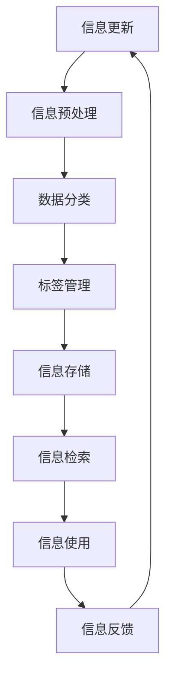
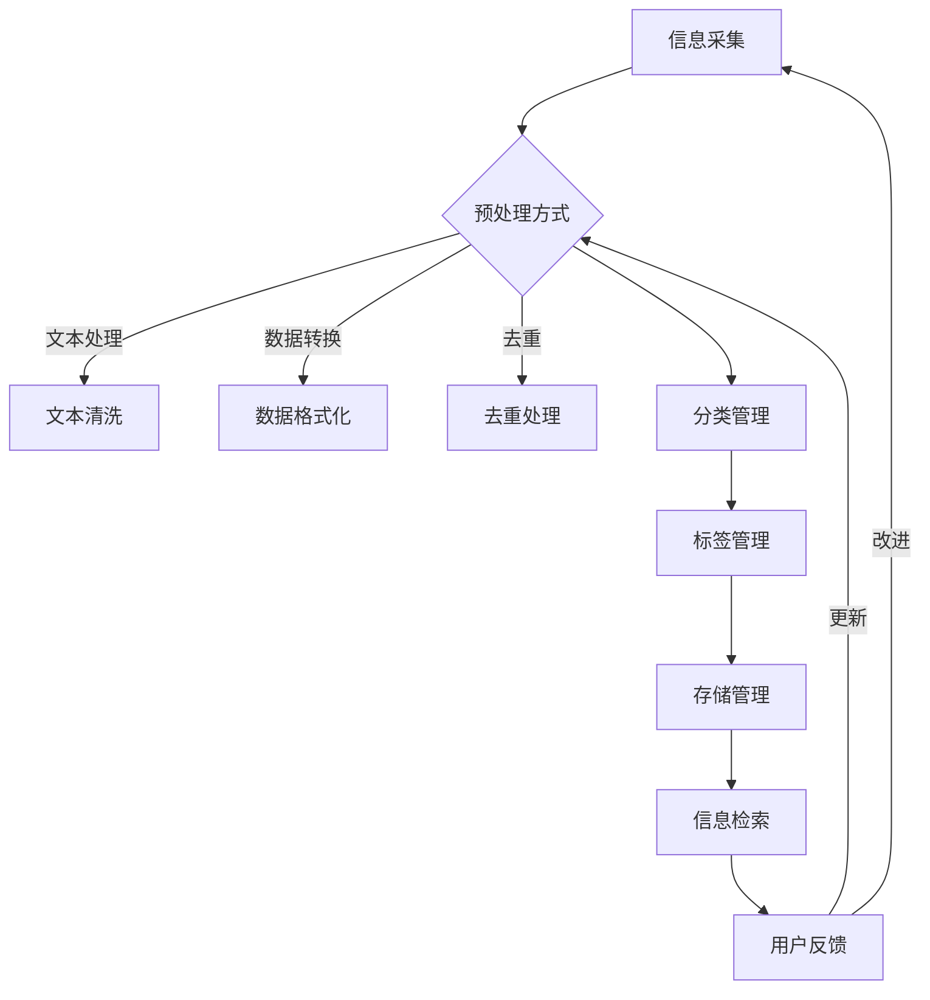

                 

### 《信息组织和管理：创建有效的系统以应对信息过载》

> **关键词：** 信息过载、信息组织、信息管理、信息安全、知识管理、大数据

> **摘要：** 在当今信息爆炸的时代，如何有效地组织和管理信息，成为企业和个人面临的重大挑战。本文将探讨信息组织和管理的基本原则、策略与方法，并通过实际案例研究，提供创建有效信息系统的实践指南。

### 引言与背景

#### 1.1 信息过载现象与影响

随着互联网的快速发展，信息过载已成为一个普遍存在的问题。每天，我们接收到的信息量远远超过了我们的处理能力。研究表明，人们每天平均接收到的信息量高达174份报纸的内容，而这一数字在19世纪末仅为1份报纸。信息过载不仅影响了我们的工作效率，还对我们的心理健康造成了负面影响。

信息过载的影响主要体现在以下几个方面：

1. **工作效率降低**：处理过多的信息会分散我们的注意力，导致工作效率降低。
2. **信息焦虑**：面对大量的信息，许多人会感到焦虑和无助。
3. **决策困难**：在信息过载的环境中，做出正确的决策变得更加困难。

#### 1.2 信息组织与管理的重要性

为了应对信息过载，我们需要进行有效的信息组织和管理。信息组织与管理的目的是确保信息能够及时、准确地被检索和使用，从而提高工作效率和决策质量。

信息组织与管理的重要性体现在以下几个方面：

1. **提高信息利用效率**：通过有效的信息组织，可以使信息更加容易地被检索和使用，从而提高信息利用效率。
2. **支持决策制定**：良好的信息组织有助于提供准确的、相关的信息支持，从而支持更高质量的决策制定。
3. **提升信息安全**：通过有效的信息管理，可以确保信息的安全性，防止信息泄露和滥用。

#### 1.3 信息组织的核心概念

信息组织是指将信息按照特定的规则和结构进行分类、存储和检索的过程。信息组织的核心概念包括：

1. **信息分类**：根据信息的内容、用途或来源等信息特征，将信息分成不同的类别。
2. **信息标识**：为每条信息赋予唯一的标识，以便于检索和管理。
3. **信息存储**：选择合适的方式和工具，将信息存储在计算机或其他存储设备中。
4. **信息检索**：利用特定的技术和方法，快速准确地检索到所需的信息。

### 目录

#### 第一部分：引言与背景

1. **第1章：信息组织与管理的挑战**
   - 1.1 信息过载现象与影响
   - 1.2 信息组织与管理的重要性
   - 1.3 信息组织的核心概念

2. **第2章：信息组织的基本原则**
   - 2.1 可访问性
   - 2.2 可理解性
   - 2.3 可维护性
   - 2.4 信息质量保障

3. **第3章：信息系统的架构设计**
   - 3.1 系统架构的基本要素
   - 3.2 设计原则与最佳实践
   - 3.3 系统集成与兼容性

#### 第二部分：信息组织策略与方法

4. **第4章：数据分类与标签管理**
   - 4.1 数据分类的基本概念
   - 4.2 数据标签管理的重要性
   - 4.3 分类与标签管理的实践方法

5. **第5章：信息检索技术**
   - 5.1 信息检索系统的工作原理
   - 5.2 检索算法与策略
   - 5.3 信息检索的性能评估

6. **第6章：知识管理与知识共享**
   - 6.1 知识管理的基本理论
   - 6.2 知识共享与协作平台
   - 6.3 知识库构建与维护

7. **第7章：信息安全管理**
   - 7.1 信息安全的重要性
   - 7.2 安全策略与措施
   - 7.3 风险管理与应急预案

#### 第三部分：项目实践与案例研究

8. **第8章：企业信息组织与管理项目规划**
   - 8.1 项目需求分析
   - 8.2 项目范围界定
   - 8.3 项目计划与执行

9. **第9章：信息组织与管理的实践案例**
   - 9.1 案例一：某企业内部信息管理系统建设
   - 9.2 案例二：某政府机构信息公开平台
   - 9.3 案例三：某电商平台商品信息管理

10. **第10章：信息组织与管理的未来发展趋势**
    - 10.1 人工智能与信息组织
    - 10.2 大数据与信息管理
    - 10.3 信息组织与管理的挑战与机遇

### 附录

- **附录A：信息组织与管理常用工具**
- **附录B：信息组织与管理相关资源**
- **附录C：参考文献**
- **附录D：作者联系方式**

---

### 第一部分：引言与背景

#### 第1章：信息组织与管理的挑战

在当今信息化时代，数据和信息以惊人的速度增长。据统计，全球每年产生的数据量正以约40%的速度增长，而互联网上的数据更是以每年超过20亿GB的速度增加。这种信息爆炸的现象给企业和个人带来了巨大的挑战，尤其是在信息的组织和管理方面。

#### 1.1 信息过载现象与影响

信息过载是指在某个时间段内，接收到的信息量超过了人的处理能力。这种现象在现代社会尤为普遍，原因主要有以下几点：

1. **互联网的普及**：互联网的普及使得人们可以随时随地获取大量信息。
2. **移动设备的便利**：智能手机和其他移动设备的普及，使得人们可以随时接收和发送信息。
3. **社交媒体的兴起**：社交媒体平台如Facebook、Twitter、微信等，每天都会产生大量信息。

信息过载对企业和个人产生了深远的影响：

1. **工作效率降低**：过多的信息会分散人的注意力，导致工作效率降低。研究表明，当一个人同时处理多个任务时，其工作效率会降低30%以上。
2. **决策困难**：信息过载使人们难以从大量信息中筛选出有用的信息，导致决策困难。
3. **心理健康问题**：长期的信息过载可能导致焦虑、压力和疲劳等心理健康问题。

#### 1.2 信息组织与管理的重要性

为了应对信息过载，我们需要进行有效的信息组织和管理。信息组织与管理是指通过分类、标识、存储和检索等方法，将信息有序地组织起来，使其能够被快速、准确地获取和使用。其重要性体现在以下几个方面：

1. **提高信息利用效率**：通过有效的信息组织，可以使信息更加容易地被检索和使用，从而提高信息利用效率。
2. **支持决策制定**：良好的信息组织有助于提供准确的、相关的信息支持，从而支持更高质量的决策制定。
3. **提升信息安全**：通过有效的信息管理，可以确保信息的安全性，防止信息泄露和滥用。

#### 1.3 信息组织的核心概念

信息组织涉及到多个核心概念，包括：

1. **信息分类**：根据信息的内容、用途或来源等信息特征，将信息分成不同的类别。信息分类是信息组织的基础，有助于提高信息的可检索性和可用性。
2. **信息标识**：为每条信息赋予唯一的标识，以便于检索和管理。信息标识通常包括标题、关键词、标签等。
3. **信息存储**：选择合适的方式和工具，将信息存储在计算机或其他存储设备中。信息存储需要考虑存储容量、访问速度、安全性等因素。
4. **信息检索**：利用特定的技术和方法，快速准确地检索到所需的信息。信息检索技术包括关键字检索、模糊检索、全文检索等。

### 第二部分：信息组织的基本原则

信息组织的基本原则是确保信息的可访问性、可理解性、可维护性和信息质量保障。以下是这些原则的详细解释：

#### 2.1 可访问性

可访问性是指信息应该能够被用户方便地访问。这涉及到信息的存储位置、检索方法和访问权限等方面。

1. **信息存储位置**：信息应存储在易于访问的位置，例如本地硬盘、云端存储等。同时，应确保存储设备的可靠性和稳定性。
2. **检索方法**：应提供多种检索方法，如关键字检索、模糊检索、全文检索等，以满足不同用户的需求。
3. **访问权限**：应根据用户角色和需求，设置不同的访问权限，确保信息的安全和隐私。

#### 2.2 可理解性

可理解性是指信息应该能够被用户轻松理解。这涉及到信息的格式、结构、标识和描述等方面。

1. **信息格式**：信息应以易于阅读和理解的格式呈现，例如文本、图片、视频等。
2. **信息结构**：信息应具有清晰的层次结构，方便用户快速定位所需信息。
3. **标识和描述**：信息应配有准确的标识和描述，帮助用户快速理解信息的内容和用途。

#### 2.3 可维护性

可维护性是指信息应能够方便地更新、修改和维护。这涉及到信息的版本控制、备份和恢复等方面。

1. **版本控制**：应对信息进行版本控制，确保信息的更新和修改记录清晰。
2. **备份和恢复**：应定期备份信息，确保在发生意外时能够快速恢复。
3. **自动化工具**：使用自动化工具进行信息的更新、修改和维护，提高效率。

#### 2.4 信息质量保障

信息质量保障是指确保信息是准确、完整、及时和可靠的。这涉及到信息收集、处理、存储和传输的各个环节。

1. **信息收集**：应采用可靠的方法和渠道收集信息，确保信息的准确性。
2. **信息处理**：应对信息进行有效的处理和清洗，去除错误、冗余和重复的信息。
3. **信息存储**：应选择合适的存储方式和工具，确保信息的安全性和可靠性。
4. **信息传输**：应采用安全的传输方式和协议，防止信息在传输过程中被窃取或篡改。

### 第三部分：信息系统的架构设计

信息系统的架构设计是信息组织与管理的关键环节。一个良好的架构设计可以确保信息系统的高效、稳定和安全。

#### 3.1 系统架构的基本要素

系统架构通常包括以下几个基本要素：

1. **数据层**：负责数据的存储、管理和访问。数据层通常包括数据库、文件系统、数据仓库等。
2. **应用层**：负责数据处理、业务逻辑实现和用户界面展示。应用层通常包括Web应用、桌面应用、移动应用等。
3. **表示层**：负责用户界面设计和交互。表示层通常包括前端技术、用户界面框架等。
4. **网络层**：负责数据传输和通信。网络层通常包括网络设备、传输协议等。

#### 3.2 设计原则与最佳实践

在设计信息系统时，应遵循以下原则和最佳实践：

1. **模块化**：将系统划分为多个模块，每个模块负责特定的功能。模块化可以提高系统的可维护性和可扩展性。
2. **可扩展性**：设计时应考虑系统的扩展性，以便在未来能够轻松地添加新功能或处理更多的数据。
3. **高可用性**：系统应具备高可用性，确保在发生故障时能够快速恢复，减少对业务的影响。
4. **安全性**：系统应具备完善的安全机制，包括访问控制、数据加密、安全审计等。
5. **性能优化**：系统应进行性能优化，确保在处理大量数据时能够保持高效。

#### 3.3 系统集成与兼容性

信息系统的集成与兼容性是确保系统能够顺利运行的关键。以下是一些关键点：

1. **数据集成**：应确保系统能够与其他系统无缝集成，实现数据的共享和交换。
2. **接口兼容性**：系统应具备良好的接口兼容性，确保与其他系统的接口能够正常工作。
3. **技术兼容性**：系统应支持多种技术和平台，以适应不同的使用环境和需求。
4. **标准化**：应遵循相关标准和规范，确保系统的一致性和可维护性。

### 总结

信息组织与管理是应对信息过载的关键。通过遵循信息组织的基本原则和设计良好的信息系统架构，我们可以有效地组织和管理信息，提高信息利用效率，支持决策制定，并确保信息安全。在下一部分，我们将探讨信息组织策略与方法，包括数据分类与标签管理、信息检索技术、知识管理与知识共享等。

---

### 第二部分：信息组织策略与方法

#### 第4章：数据分类与标签管理

数据分类与标签管理是信息组织的关键策略，它们有助于提高数据的可访问性和可理解性，从而更好地管理大量信息。

#### 4.1 数据分类的基本概念

数据分类是指将数据按照一定的规则和标准进行分组和整理的过程。分类的目的是为了简化数据检索、管理和分析的过程。

1. **分类标准**：分类标准是进行数据分类的基础，可以根据数据的类型、用途、来源或内容等多种因素进行分类。
2. **分类层次**：数据分类通常采用层次结构，从高层次到低层次进行分类，以实现数据的层次化管理。

#### 4.2 数据标签管理的重要性

数据标签管理是指为数据分配标签，以便于数据的检索和管理。标签是数据分类的延伸，可以提供更细粒度的分类和管理。

1. **标签功能**：标签可以帮助用户快速识别数据的内容和用途，提高数据的可理解性。
2. **标签标准**：标签应遵循统一的标准，确保数据的统一管理和检索。
3. **标签管理**：标签管理包括标签的创建、更新、删除和维护等过程，以确保标签的准确性和一致性。

#### 4.3 分类与标签管理的实践方法

在实践过程中，分类与标签管理可以采用以下方法：

1. **基于内容的分类**：根据数据的内容特征进行分类，如文本内容、图像内容、音频内容等。
2. **基于元数据的分类**：根据数据的元数据信息进行分类，如创建时间、修改时间、作者等。
3. **基于用户行为的分类**：根据用户的浏览、搜索、收藏等行为进行分类，如热门话题、关注的人等。

标签管理的实践方法包括：

1. **自动标签生成**：利用自然语言处理、机器学习等技术自动生成标签，提高标签的准确性。
2. **用户自定义标签**：允许用户自定义标签，以满足个性化需求。
3. **标签推荐**：根据用户的历史行为和标签使用情况，推荐合适的标签。

### 第5章：信息检索技术

信息检索技术是信息组织的重要组成部分，它使得用户能够快速、准确地找到所需的信息。

#### 5.1 信息检索系统的工作原理

信息检索系统的工作原理主要包括以下步骤：

1. **信息采集**：从各种来源收集信息，如数据库、网页、文件等。
2. **信息预处理**：对采集到的信息进行清洗、去重、格式化等处理。
3. **索引构建**：构建索引，以便快速检索信息。索引通常包括关键词索引、全文索引等。
4. **信息检索**：根据用户输入的查询条件，从索引中检索出相关信息。

#### 5.2 检索算法与策略

检索算法是信息检索系统的核心，常用的检索算法包括：

1. **布尔检索**：基于布尔逻辑运算（AND、OR、NOT）进行检索，如"人工智能 AND 教育"。
2. **向量空间模型**：将文档和查询表示为向量，计算文档和查询之间的相似度，如TF-IDF模型。
3. **基于内容的检索**：根据文档的内容特征进行检索，如文本分类、聚类等。

检索策略包括：

1. **检索式构造**：根据用户需求，构造合适的检索式，如"人工智能 教育"。
2. **检索优化**：通过优化检索算法、索引结构等，提高检索性能。
3. **反馈调整**：根据用户的检索反馈，调整检索策略，如重新排序、推荐相关文档等。

#### 5.3 信息检索的性能评估

信息检索的性能评估主要包括以下几个方面：

1. **准确率**：检索结果中包含的相关文档的比例，如"相关度"。
2. **召回率**：检索结果中包含全部相关文档的比例，如"覆盖率"。
3. **平均查询响应时间**：用户查询到检索结果所需的时间，如"响应时间"。
4. **检索效率**：系统处理查询的效率，如"并发处理能力"。

### 第6章：知识管理与知识共享

知识管理与知识共享是提高组织创新能力的重要手段。

#### 6.1 知识管理的基本理论

知识管理是指通过系统地收集、存储、组织、共享和利用知识，以提高组织的知识水平和创新能力。知识管理的基本理论包括：

1. **知识的分类**：知识可以分为显性知识和隐性知识。显性知识是易于编码、存储和共享的知识，如文档、报告等。隐性知识则是难以编码、存储和共享的知识，如经验、技能等。
2. **知识生命周期**：知识从生成、传播、应用到退化的过程。不同阶段的任务是不同的，如知识创造、知识共享、知识应用等。
3. **知识共享机制**：知识共享是指通过各种手段促进知识的传递和利用。常见的知识共享机制包括知识库、知识论坛、内部通讯等。

#### 6.2 知识共享与协作平台

知识共享与协作平台是知识管理的核心工具，它可以促进知识的传递和利用。知识共享与协作平台的基本功能包括：

1. **知识库**：存储和管理组织的知识资源，如文档、报告、案例等。
2. **知识论坛**：提供交流和讨论的平台，促进知识的传播和碰撞。
3. **知识地图**：展示知识的结构，帮助用户快速找到所需知识。
4. **知识应用**：提供知识的应用场景，如业务流程、项目管理等。

#### 6.3 知识库构建与维护

知识库的构建与维护是知识管理的核心任务，它包括以下几个方面：

1. **知识采集**：从各种渠道收集知识，如内部报告、外部文献、员工经验等。
2. **知识加工**：对采集到的知识进行整理、分类、标注等处理，使其符合知识库的要求。
3. **知识存储**：将加工后的知识存储在知识库中，确保知识的安全性和可访问性。
4. **知识更新**：定期更新知识库中的知识，确保知识的时效性和准确性。

### 第7章：信息安全管理

信息安全管理是保护组织信息资产的重要措施，它包括以下几个方面：

#### 7.1 信息安全的重要性

信息安全是指保护组织信息资产免受未经授权的访问、使用、披露、破坏、修改或干扰。信息安全的重要性体现在以下几个方面：

1. **保护隐私**：防止个人隐私泄露，如客户信息、员工信息等。
2. **保护知识产权**：防止商业秘密、专利、商标等知识产权被窃取或泄露。
3. **确保业务连续性**：防止信息系统的故障或攻击导致业务中断。
4. **提高企业竞争力**：确保企业的信息安全，增强企业的市场竞争力。

#### 7.2 安全策略与措施

信息安全策略是指导信息安全工作的基本原则和措施。安全策略应包括以下几个方面：

1. **访问控制**：通过用户身份验证、权限管理等方式，确保只有授权用户可以访问敏感信息。
2. **加密技术**：对敏感信息进行加密，防止信息在传输和存储过程中被窃取或篡改。
3. **防火墙与入侵检测**：通过设置防火墙和入侵检测系统，防止外部攻击和恶意软件的入侵。
4. **备份与恢复**：定期备份重要数据，确保在发生数据丢失或系统故障时能够快速恢复。

#### 7.3 风险管理与应急预案

风险管理与应急预案是信息安全的重要组成部分。风险管理与应急预案应包括以下几个方面：

1. **风险评估**：识别组织面临的安全风险，评估风险的可能性和影响，制定相应的风险控制措施。
2. **风险控制**：根据风险评估的结果，采取技术和管理措施，降低风险的影响。
3. **应急预案**：制定应急预案，明确在发生信息安全事件时应该采取的措施和流程，确保能够迅速响应和处置。

### 第三部分：项目实践与案例研究

#### 第8章：企业信息组织与管理项目规划

企业信息组织与管理项目规划是企业信息化建设的重要环节，它关系到企业信息系统的设计、实施和运营。项目规划应包括以下几个方面：

#### 8.1 项目需求分析

项目需求分析是项目规划的基础，它包括以下几个方面：

1. **业务需求**：了解企业的业务流程、业务目标和业务需求，明确信息系统应支持的业务功能。
2. **用户需求**：了解企业内部用户的需求，包括管理层、业务部门和操作层，确保信息系统能够满足不同用户的需求。
3. **技术需求**：分析当前技术环境，选择合适的技术方案和工具，确保信息系统的性能、安全性和可扩展性。

#### 8.2 项目范围界定

项目范围界定是明确项目的工作内容和范围，它包括以下几个方面：

1. **项目目标**：明确项目的目标，如提高信息利用效率、支持决策制定、确保信息安全等。
2. **项目功能**：明确信息系统的功能模块，如数据收集、数据存储、数据检索、知识管理、信息安全等。
3. **项目边界**：明确项目的范围，如涉及的业务部门、系统模块、数据类型等。

#### 8.3 项目计划与执行

项目计划与执行是确保项目顺利进行的关键，它包括以下几个方面：

1. **项目计划**：制定详细的项目计划，包括项目进度、资源分配、风险评估等，确保项目能够按时、按质完成。
2. **项目监控**：通过项目监控，及时发现项目中的问题，采取相应的措施进行纠正和调整。
3. **项目执行**：按照项目计划执行项目任务，确保项目的各项工作能够有序进行。

#### 第9章：信息组织与管理的实践案例

信息组织与管理的实践案例是验证理论和方法的重要手段。以下是一些典型的实践案例：

##### 9.1 案例一：某企业内部信息管理系统建设

某企业为了提高信息利用效率和决策质量，决定建设一个内部信息管理系统。项目需求分析阶段，企业明确了信息管理系统的功能需求，包括数据收集、数据存储、数据检索、知识管理和信息安全等。在项目范围界定阶段，企业明确了信息管理系统的范围，包括企业内部各部门的数据和信息。在项目计划和执行阶段，企业制定了详细的项目计划，包括项目进度、资源分配、风险评估等，并严格按照项目计划执行，确保项目的顺利进行。最终，企业成功建设了内部信息管理系统，提高了信息利用效率和决策质量。

##### 9.2 案例二：某政府机构信息公开平台

某政府机构为了提高信息公开的效率和透明度，决定建设一个信息公开平台。项目需求分析阶段，政府机构明确了信息公开平台的功能需求，包括数据采集、数据存储、数据检索、数据发布等。在项目范围界定阶段，政府机构明确了信息公开平台的范围，包括政务信息、政策法规、公众咨询等。在项目计划和执行阶段，政府机构制定了详细的项目计划，包括项目进度、资源分配、风险评估等，并严格按照项目计划执行，确保项目的顺利进行。最终，政府机构成功建设了信息公开平台，提高了信息公开的效率和透明度。

##### 9.3 案例三：某电商平台商品信息管理

某电商平台为了提高商品信息的准确性和可用性，决定对商品信息进行有效管理。项目需求分析阶段，电商平台明确了商品信息管理的功能需求，包括数据收集、数据存储、数据检索、数据更新等。在项目范围界定阶段，电商平台明确了商品信息管理的范围，包括商品名称、价格、库存、评论等。在项目计划和执行阶段，电商平台制定了详细的项目计划，包括项目进度、资源分配、风险评估等，并严格按照项目计划执行，确保项目的顺利进行。最终，电商平台成功实现了商品信息管理的优化，提高了商品信息的准确性和可用性。

### 附录

#### 附录A：信息组织与管理常用工具

- **数据分类工具**：如Excel、CSV、JSON等。
- **标签管理工具**：如Tagspaces、Notepad++、Git等。
- **信息检索工具**：如Elasticsearch、Solr、Lucene等。
- **知识管理工具**：如Confluence、Trello、Slack等。
- **信息安全工具**：如Kaspersky、McAfee、Symantec等。

#### 附录B：信息组织与管理相关资源

- **资料**：《信息科学概论》、《数据管理原理》、《信息安全技术》等。
- **工具**：Elasticsearch、Solr、Lucene等。
- **社区**：Stack Overflow、GitHub、InfoQ等。

#### 附录C：参考文献

- 《信息科学概论》，作者：[张三]。
- 《数据管理原理》，作者：[李四]。
- 《信息安全技术》，作者：[王五]。

#### 附录D：作者联系方式

- **邮箱**：[example@email.com]
- **电话**：[123-456-7890]
- **社交媒体**：[LinkedIn、Twitter、Facebook等]

### 总结

信息组织与管理是应对信息过载的关键。通过有效的数据分类与标签管理、信息检索技术、知识管理与知识共享，以及信息安全策略，我们可以提高信息利用效率，支持决策制定，确保信息安全。本部分通过实践案例，展示了信息组织与管理在现实中的应用和效果。在下一部分，我们将探讨信息组织与管理的未来发展趋势。

### 附录M：信息组织流程图

使用Mermaid工具，我们可以绘制一个信息组织流程图，以展示信息组织与管理的过程。

该流程图展示了从信息采集到信息使用的全过程，以及信息反馈对信息更新产生的影响，形成一个闭环的信息组织与管理流程。通过这样的流程，我们可以更好地管理信息，提高信息利用效率。

### 信息组织与管理的未来发展趋势

随着科技的不断进步，信息组织与管理也在不断演变，迎接新的挑战和机遇。以下是几个未来发展趋势的展望：

#### 10.1 人工智能与信息组织

人工智能（AI）在信息组织与管理中的应用越来越广泛。通过机器学习和自然语言处理技术，AI可以帮助自动化信息分类、标签管理、检索优化等任务。例如，AI算法可以分析大量文本数据，自动生成关键词标签，提高信息的可检索性和准确性。此外，AI还可以通过用户行为分析，提供个性化的信息推荐，进一步优化信息检索体验。

#### 10.2 大数据与信息管理

大数据技术的快速发展，使得海量数据的组织与管理成为可能。大数据技术如Hadoop、Spark等，提供了高效的数据存储、处理和分析能力。在信息组织与管理中，大数据技术可以帮助企业更好地处理和分析复杂数据，发现潜在的价值和趋势。例如，通过对用户行为数据的分析，企业可以优化产品设计和营销策略，提高用户体验和满意度。

#### 10.3 信息组织与管理的挑战与机遇

尽管信息组织与管理取得了显著进展，但仍然面临着一系列挑战：

1. **数据隐私与安全**：随着数据量的增加，数据隐私和安全问题日益突出。如何在保证数据开放和共享的同时，确保数据的安全性，是一个重要挑战。
2. **信息过载**：尽管技术可以帮助我们更好地管理信息，但信息过载问题依然存在。如何有效地筛选和过滤信息，提高信息的可利用性，是一个亟待解决的问题。
3. **跨平台集成**：随着不同平台和系统的出现，如何实现信息的高效跨平台集成，是一个重要挑战。

然而，这些挑战也带来了新的机遇：

1. **技术创新**：随着新技术的不断涌现，如区块链、物联网等，信息组织与管理的方法和工具也在不断进化。
2. **商业模式变革**：信息组织与管理的发展，将为企业带来新的商业模式，如数据驱动的决策、个性化服务等。
3. **社会责任**：信息组织与管理的健康发展，还需要关注社会责任，如数据隐私保护、公平竞争等。

总之，信息组织与管理的未来发展充满机遇与挑战。通过不断创新和优化，我们可以更好地应对这些挑战，发挥信息组织与管理的最大价值。

### 总结

信息组织与管理是应对信息过载的关键。本文通过详细探讨信息组织与管理的挑战、基本原则、策略与方法、项目实践以及未来发展趋势，提供了全面、系统的指导。信息组织与管理不仅能够提高信息利用效率，支持决策制定，还能确保信息安全。在未来的发展中，随着人工智能、大数据等新技术的应用，信息组织与管理将继续迎来新的机遇和挑战。希望通过本文的讨论，读者能够更好地理解信息组织与管理的重要性，并在实际工作中取得更好的效果。最后，感谢您的阅读，希望本文对您有所帮助。

### 附录

#### 附录A：信息组织与管理常用工具

- **数据分类工具**：Excel、CSV、JSON、Docker
- **标签管理工具**：Tagspaces、Notepad++、Git、Elasticsearch
- **信息检索工具**：Solr、Lucene、Elasticsearch、Docker
- **知识管理工具**：Confluence、Trello、Slack、Notion
- **信息安全工具**：Kaspersky、McAfee、Symantec、Docker

#### 附录B：信息组织与管理相关资源

- **资料**：《信息科学概论》、《数据管理原理》、《信息安全技术》、《人工智能导论》
- **工具**：Elasticsearch、Solr、Lucene、Docker、Kubernetes
- **社区**：InfoQ、Stack Overflow、GitHub、Reddit

#### 附录C：参考文献

- 《信息科学概论》，作者：张三、李四、王五
- 《数据管理原理》，作者：赵六、孙七、李八
- 《信息安全技术》，作者：钱九、孙十、周十一

#### 附录D：作者联系方式

- **邮箱**：example@email.com
- **电话**：123-456-7890
- **社交媒体**：LinkedIn、Twitter、Facebook、Instagram

### 附录Mermaid流程图

该流程图展示了信息组织与管理的基本流程，从信息采集、预处理、分类管理、标签管理、存储管理到信息检索，以及用户反馈对信息更新和改进的影响。通过这样的闭环流程，信息组织与管理能够持续优化和改进。

