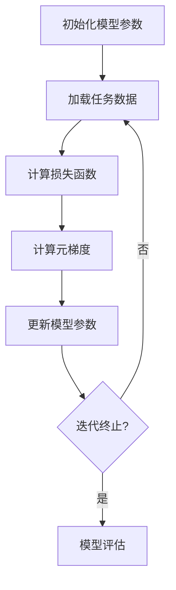
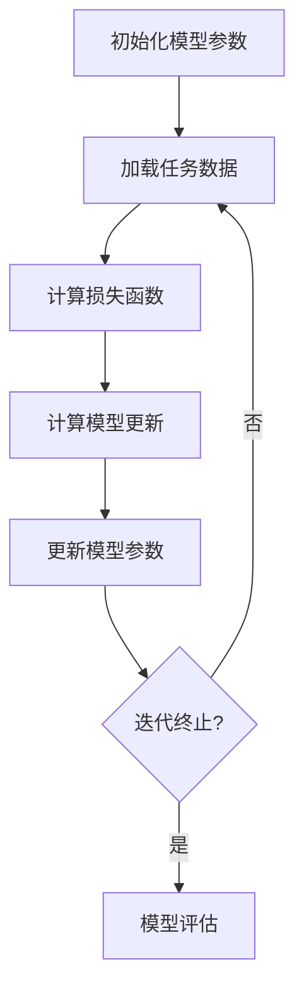

                 

# 《元学习在自然语言处理Few-Shot任务中的应用研究进展》

## 概述

> **关键词：元学习、自然语言处理、Few-Shot、算法研究、应用进展**

随着人工智能技术的不断进步，自然语言处理（NLP）领域的研究取得了显著的成果。然而，传统的NLP模型通常需要大量的数据进行训练，这在实际应用中往往难以实现。为了应对这一挑战，元学习（Meta-Learning）作为一种新兴的研究方向，逐渐引起了广泛关注。元学习旨在通过学习如何学习，从而提高模型在少量数据上的适应能力和泛化能力，为解决自然语言处理中的Few-Shot任务提供了一种有效的途径。

本文将系统地探讨元学习在自然语言处理Few-Shot任务中的应用研究进展。首先，我们将介绍元学习的基础理论，包括定义、基本概念、类型和算法原理。接着，我们将分析元学习算法在NLP领域的改进与发展，以及面临的主要挑战。随后，我们将深入探讨元学习在自然语言处理中的具体应用，如语言模型训练、文本分类、命名实体识别和机器翻译等任务。最后，我们将总结元学习在自然语言处理Few-Shot任务中的应用研究进展，并展望未来的发展方向。

通过本文的探讨，读者可以全面了解元学习在自然语言处理Few-Shot任务中的研究现状和未来趋势，为后续的研究和应用提供有益的参考。

## 《元学习在自然语言处理Few-Shot任务中的应用研究进展》目录大纲

### 第一部分：元学习基础理论

#### 第1章：元学习概述

- 1.1 元学习的定义与意义
- 1.2 元学习的基本概念
- 1.3 元学习的类型

#### 第2章：元学习理论原理

- 2.1 学习作为优化问题的框架
- 2.2 元梯度下降与模型更新
- 2.3 元学习的训练目标与评价指标

#### 第3章：元学习算法

- 3.1 MAML（模型自适应学习）算法
- 3.2 Reptile算法
- 3.3 Meta-SGD算法
- 3.4 强化学习与元学习结合

#### 第4章：元学习算法的改进与发展

- 4.1 元学习算法的挑战与优化
- 4.2 数据增强与领域自适应
- 4.3 零样本学习与元学习

### 第二部分：元学习在自然语言处理中的应用

#### 第5章：元学习在自然语言处理中的应用背景

- 5.1 自然语言处理中的Few-Shot任务
- 5.2 元学习在自然语言处理中的作用

#### 第6章：元学习在语言模型训练中的应用

- 6.1 元学习算法在语言模型训练中的实现
- 6.2 元学习对语言模型性能的提升
- 6.3 元学习在语言模型中的挑战与展望

#### 第7章：元学习在文本分类任务中的应用

- 7.1 元学习算法在文本分类任务中的实现
- 7.2 元学习在文本分类任务中的性能评估
- 7.3 元学习在文本分类任务中的挑战与展望

#### 第8章：元学习在命名实体识别任务中的应用

- 8.1 元学习算法在命名实体识别任务中的实现
- 8.2 元学习在命名实体识别任务中的性能评估
- 8.3 元学习在命名实体识别任务中的挑战与展望

#### 第9章：元学习在机器翻译任务中的应用

- 9.1 元学习算法在机器翻译任务中的实现
- 9.2 元学习在机器翻译任务中的性能评估
- 9.3 元学习在机器翻译任务中的挑战与展望

### 第三部分：元学习应用研究进展

#### 第10章：元学习在自然语言处理Few-Shot任务中的应用研究进展

- 10.1 研究方法与技术路线
- 10.2 应用案例与实验结果分析
- 10.3 存在问题与未来研究方向

#### 第11章：元学习在自然语言处理领域的应用前景

- 11.1 元学习在自然语言处理中的潜在应用领域
- 11.2 元学习在自然语言处理中的挑战与机遇
- 11.3 元学习在自然语言处理领域的发展趋势

#### 第12章：总结与展望

- 12.1 本书内容的总结
- 12.2 元学习在自然语言处理领域的发展展望

### 附录：元学习相关算法流程图与数学公式

- **元学习算法流程图**
  - MAML算法流程图
  - Reptile算法流程图
  - Meta-SGD算法流程图
- **数学公式**
  - 元学习算法中的损失函数公式
  - 元学习算法中的优化目标公式

### 代码实战与案例分析

- **语言模型训练**
  - 语言模型训练环境搭建
  - 语言模型训练源代码实现
  - 语言模型训练代码解读与分析
- **文本分类任务**
  - 文本分类任务环境搭建
  - 文本分类任务源代码实现
  - 文本分类任务代码解读与分析
- **命名实体识别任务**
  - 命名实体识别任务环境搭建
  - 命名实体识别任务源代码实现
  - 命名实体识别任务代码解读与分析
- **机器翻译任务**
  - 机器翻译任务环境搭建
  - 机器翻译任务源代码实现
  - 机器翻译任务代码解读与分析<|im_end|>### 第一部分：元学习基础理论

#### 第1章：元学习概述

**1.1 元学习的定义与意义**

元学习（Meta-Learning），也被称为学习如何学习（Learning to Learn），是一种机器学习的方法，旨在通过学习如何快速适应新任务，从而提高模型在少量数据上的性能。与传统的机器学习方法不同，元学习不是在单一任务上进行训练，而是在一系列任务上训练模型，使其能够快速适应新任务。

在自然语言处理（NLP）领域中，元学习具有重要意义。首先，NLP任务通常需要大量高质量的数据进行训练，但在实际应用中，获取这些数据往往成本高昂且受限。元学习通过在少量数据上训练模型，可以有效降低数据需求，提高模型的泛化能力。其次，元学习能够提高模型在动态变化环境中的适应能力，这对于应对NLP任务中的不确定性具有重要意义。

**1.2 元学习的基本概念**

- **任务适应能力（Task Adaptation）**：元学习的核心目标是在一个任务上训练的模型能够快速适应新的任务。
- **快速学习（Fast Learning）**：元学习旨在使模型在少量数据上能够快速收敛，减少训练时间。
- **泛化能力（Generalization）**：元学习模型应具备良好的泛化能力，能够在不同的任务和数据集上表现优异。

**1.3 元学习的类型**

- **基于模型的方法**：通过设计特殊的模型结构，使模型能够快速适应新任务。例如，模型自适应学习（Model-Agnostic Meta-Learning，MAML）和模型特定元学习（Model-Specific Meta-Learning）。
- **基于算法的方法**：通过改进优化算法，使模型能够更快地适应新任务。例如，元梯度下降（Meta-Gradient Descent）和元强化学习（Meta-Reinforcement Learning）。
- **基于数据的方法**：通过数据预处理和增强，提高模型在少量数据上的性能。例如，数据增强（Data Augmentation）和领域自适应（Domain Adaptation）。

**1.4 元学习与其他相关概念的关联**

- **迁移学习（Transfer Learning）**：迁移学习是元学习的一种特殊形式，通过利用已训练模型的知识，在新任务上快速适应。
- **在线学习（Online Learning）**：在线学习与元学习有相似之处，都是通过不断更新模型来适应新数据。
- **少量样本学习（Few-Shot Learning）**：元学习在少量样本学习中的应用，旨在解决NLP任务中的数据稀缺问题。

#### 第2章：元学习理论原理

**2.1 学习作为优化问题的框架**

在机器学习中，学习可以被视为一个优化问题。具体来说，我们通过最小化损失函数来找到模型的最佳参数。在元学习场景中，这个优化过程需要在多个任务上重复进行，以达到快速适应新任务的目的。

元学习中的优化问题可以表示为：

$$
\min_{\theta} \sum_{i=1}^{N} L(\theta; \tau_i),
$$

其中，$L(\theta; \tau_i)$是第$i$个任务的损失函数，$\theta$是模型的参数，$N$是总任务数，$\tau_i$是第$i$个任务的训练数据。

为了优化上述问题，我们需要引入元梯度下降（Meta-Gradient Descent）算法。元梯度下降的目标是计算元梯度，并更新模型参数：

$$
\theta_{t+1} = \theta_t - \alpha \nabla_{\theta} L(\theta_t; \tau),
$$

其中，$\alpha$是学习率，$\nabla_{\theta} L(\theta_t; \tau)$是元梯度。

**2.2 元梯度下降与模型更新**

元梯度下降是一种迭代算法，每次迭代都会更新模型参数，使其在多个任务上逐渐优化。具体步骤如下：

1. 初始化模型参数$\theta_0$。
2. 对于每个任务$i$，计算损失函数$L(\theta_t; \tau_i)$。
3. 计算元梯度$\nabla_{\theta} L(\theta_t; \tau)$。
4. 根据元梯度更新模型参数$\theta_{t+1}$。
5. 重复步骤2-4，直到满足停止条件。

**2.3 元学习的训练目标与评价指标**

元学习的训练目标是在多种任务上快速适应新任务，即模型参数$\theta$应满足：

$$
\forall i, j, \theta^* \in \arg\min_{\theta} L(\theta; \tau_i) + L(\theta; \tau_j),
$$

其中，$\theta^*$是最佳模型参数，$\tau_i$和$\tau_j$是两个不同任务的训练数据。

元学习的评价指标主要包括：

- **适应速度（Adaptation Speed）**：衡量模型在新任务上的学习速度。
- **泛化能力（Generalization Ability）**：衡量模型在未见数据上的表现。
- **迁移能力（Transfer Ability）**：衡量模型在不同任务上的迁移效果。

**2.4 元学习的优势与挑战**

**优势：**

- **高效性**：元学习通过在多个任务上训练，提高了模型在少量数据上的适应速度。
- **泛化能力**：元学习使模型能够从多个任务中提取知识，从而提高泛化能力。
- **迁移能力**：元学习模型在不同任务之间具有较好的迁移效果，减少了任务特定数据的依赖。

**挑战：**

- **计算成本**：元学习需要在多个任务上训练，增加了计算成本。
- **模型选择**：选择合适的模型结构和算法对于元学习至关重要，但现有的研究还未能明确最佳选择。
- **数据稀缺**：在NLP任务中，数据稀缺是一个普遍问题，如何有效利用少量数据成为元学习面临的重要挑战。

#### 第3章：元学习算法

**3.1 MAML（模型自适应学习）算法**

MAML（Model-Agnostic Meta-Learning）算法是元学习领域的一种经典算法，其核心思想是设计一个模型自适应的框架，使模型能够在少量数据上快速适应新任务。

**算法原理：**

MAML算法基于以下优化目标：

$$
\min_{\theta} \sum_{i=1}^{T} \frac{1}{N} \sum_{j=1}^{N} L(\theta; \tau_i, \phi_j),
$$

其中，$\tau_i$是第$i$个任务的训练数据，$\phi_j$是第$j$个任务的数据分布，$L(\theta; \tau_i, \phi_j)$是损失函数。

MAML算法的步骤如下：

1. 初始化模型参数$\theta_0$。
2. 对于每个任务$i$，计算损失函数$L(\theta_t; \tau_i)$。
3. 计算元梯度$\nabla_{\theta} L(\theta_t; \tau)$。
4. 根据元梯度更新模型参数$\theta_{t+1}$。
5. 重复步骤2-4，直到满足停止条件。

**算法特点：**

- **模型无关性**：MAML算法适用于任何模型，具有良好的通用性。
- **快速适应**：MAML算法通过元梯度下降，使模型在少量数据上能够快速适应新任务。
- **迁移能力**：MAML算法在不同任务之间具有较好的迁移效果。

**3.2 Reptile算法**

Reptile算法是另一种元学习算法，其核心思想是通过不断缩小模型之间的差异，使模型在多个任务上保持一致性。

**算法原理：**

Reptile算法基于以下优化目标：

$$
\theta_{t+1} = \theta_t + \eta \sum_{i=1}^{T} \frac{1}{N} \sum_{j=1}^{N} \nabla_{\theta} L(\theta_t; \tau_i, \phi_j),
$$

其中，$\eta$是学习率，$L(\theta; \tau_i, \phi_j)$是损失函数。

Reptile算法的步骤如下：

1. 初始化模型参数$\theta_0$。
2. 对于每个任务$i$，计算损失函数$L(\theta_t; \tau_i)$。
3. 计算元梯度$\nabla_{\theta} L(\theta_t; \tau)$。
4. 根据元梯度更新模型参数$\theta_{t+1}$。
5. 重复步骤2-4，直到满足停止条件。

**算法特点：**

- **简单易实现**：Reptile算法实现简单，计算成本较低。
- **一致性保持**：Reptile算法通过保持模型之间的一致性，使模型在多个任务上保持稳定。
- **适用范围广**：Reptile算法适用于各种模型，具有良好的通用性。

**3.3 Meta-SGD算法**

Meta-SGD（Meta-Gradient Descent）算法是一种基于元梯度的元学习算法，其核心思想是通过计算元梯度，使模型在多个任务上快速适应。

**算法原理：**

Meta-SGD算法基于以下优化目标：

$$
\theta_{t+1} = \theta_t - \alpha \nabla_{\theta} L(\theta_t; \tau),
$$

其中，$\alpha$是学习率，$L(\theta; \tau)$是损失函数。

Meta-SGD算法的步骤如下：

1. 初始化模型参数$\theta_0$。
2. 对于每个任务$i$，计算损失函数$L(\theta_t; \tau_i)$。
3. 计算元梯度$\nabla_{\theta} L(\theta_t; \tau)$。
4. 根据元梯度更新模型参数$\theta_{t+1}$。
5. 重复步骤2-4，直到满足停止条件。

**算法特点：**

- **高效性**：Meta-SGD算法通过元梯度下降，使模型在少量数据上能够快速适应新任务。
- **灵活性**：Meta-SGD算法适用于各种模型结构，具有良好的通用性。
- **稳定性**：Meta-SGD算法通过稳定的学习率调整，使模型在训练过程中保持稳定。

**3.4 强化学习与元学习结合**

强化学习（Reinforcement Learning）与元学习（Meta-Learning）的结合，旨在利用强化学习中的经验积累，提高元学习模型的性能。

**算法原理：**

强化学习与元学习结合的算法，可以表示为：

$$
\theta_{t+1} = \theta_t + \eta \nabla_{\theta} J(\theta_t; \tau),
$$

其中，$J(\theta_t; \tau)$是强化学习中的奖励函数，$\eta$是学习率。

算法步骤如下：

1. 初始化模型参数$\theta_0$。
2. 在环境$E$中，根据当前模型参数$\theta_t$，执行动作$a_t$。
3. 根据动作$a_t$的结果，计算奖励函数$J(\theta_t; \tau)$。
4. 根据奖励函数$J(\theta_t; \tau)$，计算元梯度$\nabla_{\theta} J(\theta_t; \tau)$。
5. 根据元梯度$\nabla_{\theta} J(\theta_t; \tau)$，更新模型参数$\theta_{t+1}$。
6. 重复步骤2-5，直到满足停止条件。

**算法特点：**

- **自适应能力**：强化学习与元学习结合，使模型能够根据环境变化，自适应地调整策略。
- **灵活性**：结合强化学习的探索与元学习的快速学习，使模型在复杂环境中具备更强的适应能力。
- **高效性**：通过将经验积累与元学习相结合，提高模型在复杂任务中的性能。

#### 第4章：元学习算法的改进与发展

**4.1 元学习算法的挑战与优化**

尽管元学习算法在提高模型适应能力和泛化能力方面取得了显著成果，但仍然面临一些挑战。以下是元学习算法面临的主要挑战及相应的优化策略：

**挑战1：计算成本高**

**优化策略**：通过改进算法效率，减少计算成本。例如，使用近似算法（如模拟退火）和分布式计算，提高算法的运行速度。

**挑战2：模型选择困难**

**优化策略**：设计通用的模型结构，提高算法的适用范围。同时，利用模型融合技术，优化模型参数选择。

**挑战3：数据稀缺问题**

**优化策略**：利用数据增强和领域自适应技术，提高模型在少量数据上的性能。例如，通过生成对抗网络（GAN）生成模拟数据，或通过迁移学习利用已有数据。

**挑战4：模型稳定性问题**

**优化策略**：通过引入正则化技术和自适应学习率调整，提高模型的稳定性。例如，使用dropout和L2正则化，避免过拟合。

**4.2 数据增强与领域自适应**

数据增强（Data Augmentation）和领域自适应（Domain Adaptation）是元学习领域的重要研究方向。数据增强通过引入噪声、变换和生成数据，增加训练数据的多样性，从而提高模型的泛化能力。领域自适应则通过利用源领域数据，改善目标领域数据的模型性能。

**4.3 零样本学习与元学习**

零样本学习（Zero-Shot Learning）是元学习的一个分支，旨在使模型能够处理未见类别。零样本学习的关键是建立类别表示，并通过元学习算法，提高模型在未见类别上的预测能力。近年来，零样本学习在NLP领域取得了显著进展，为元学习应用提供了新的方向。

**4.4 强化学习与元学习结合**

强化学习与元学习结合，通过将经验积累与元学习相结合，使模型能够更好地适应动态变化环境。例如，通过引入强化学习中的奖励机制，优化元学习算法的搜索策略，提高模型的适应能力和泛化能力。

#### 第5章：元学习在自然语言处理中的应用背景

**5.1 自然语言处理中的Few-Shot任务**

在自然语言处理（NLP）领域中，Few-Shot任务是指在一个任务中仅使用非常少的训练样本来训练模型。这源于实际应用中数据稀缺的情况，例如，某些特定领域的数据难以获取，或数据收集成本高昂。因此，如何利用少量数据进行有效的模型训练，成为NLP领域的一个关键问题。

Few-Shot任务在NLP中的重要性主要体现在以下几个方面：

- **领域适应性**：在实际应用中，模型需要能够快速适应新的领域和任务，而Few-Shot任务提供了一个有效的训练框架。
- **数据稀缺问题**：NLP任务通常需要大量标注数据，但获取这些数据往往成本高昂且受限。通过Few-Shot任务，可以在少量数据上训练出高性能的模型。
- **迁移能力**：Few-Shot任务可以培养模型在不同任务和数据集上的迁移能力，从而提高模型的泛化能力。

**5.2 元学习在自然语言处理中的作用**

元学习在自然语言处理中的作用主要体现在以下几个方面：

- **快速适应**：元学习通过在多个任务上训练，使模型能够在少量数据上快速适应新任务，提高模型在动态变化环境中的适应能力。
- **泛化能力**：元学习通过从多个任务中提取知识，使模型具有更好的泛化能力，能够在不同的数据集和任务上表现优异。
- **迁移能力**：元学习使模型在不同任务和数据集之间具备较好的迁移能力，减少了任务特定数据的依赖。

总之，元学习在自然语言处理Few-Shot任务中的应用，为解决数据稀缺问题和提高模型适应能力提供了有效途径。随着元学习研究的深入，其在NLP领域的应用前景将更加广阔。

### 第6章：元学习在自然语言处理中的应用——语言模型训练

#### 6.1 元学习算法在语言模型训练中的实现

语言模型（Language Model）是自然语言处理中最基本的模型之一，其主要目标是通过学习大量文本数据，预测下一个词语的概率分布。然而，传统的语言模型往往依赖于大量训练数据，这在实际应用中难以满足。为了解决这个问题，元学习算法被引入到语言模型训练中，以提高模型在少量数据上的适应能力和泛化能力。

**实现步骤：**

1. **初始化模型参数**：首先，初始化语言模型的参数$\theta_0$。在元学习场景中，参数的初始化通常采用随机初始化或基于已有模型的迁移学习。
   
2. **任务选择**：从一系列任务中选择多个任务，用于训练元学习模型。这些任务可以是不同的语言模型训练任务，也可以是其他自然语言处理任务，如文本分类、命名实体识别等。

3. **数据预处理**：对于每个任务，进行数据预处理，包括分词、去停用词、词向量化等操作。预处理后的数据用于训练和评估模型。

4. **模型训练**：使用元学习算法（如MAML、Reptile、Meta-SGD等）在多个任务上训练语言模型。具体步骤如下：

   - **计算损失函数**：对于每个任务$i$，计算损失函数$L(\theta_t; \tau_i)$，其中$\theta_t$是当前模型参数，$\tau_i$是任务$i$的训练数据。
   - **计算元梯度**：根据损失函数，计算元梯度$\nabla_{\theta} L(\theta_t; \tau)$。
   - **更新模型参数**：根据元梯度，更新模型参数$\theta_{t+1} = \theta_t - \alpha \nabla_{\theta} L(\theta_t; \tau)$，其中$\alpha$是学习率。
   - **迭代训练**：重复步骤2-4，直到满足停止条件（如损失函数收敛、迭代次数达到阈值等）。

5. **模型评估**：在完成模型训练后，使用未见过的测试数据对训练出的语言模型进行评估，以验证模型的性能。

**实现示例：**

以MAML算法为例，语言模型训练的伪代码如下：

```python
# 初始化模型参数
theta_0 = random_init_params()

# 设置学习率
alpha = 0.01

# 设置迭代次数
T = 10

# 对于每个任务
for t in range(T):
    # 计算损失函数
    loss_t = compute_loss(theta_t, tau_t)
    
    # 计算元梯度
    meta_gradient = compute_meta_gradient(loss_t)
    
    # 更新模型参数
    theta_t+1 = theta_t - alpha * meta_gradient

# 模型评估
evaluate_model(theta_T)
```

#### 6.2 元学习对语言模型性能的提升

元学习在语言模型训练中的应用，显著提升了模型的性能，特别是在数据稀缺的情况下。以下是元学习对语言模型性能提升的几个方面：

1. **快速适应能力**：元学习算法使模型能够在少量数据上快速适应新任务，从而减少了训练时间。这对于数据稀缺的场景尤为重要。

2. **泛化能力**：元学习通过从多个任务中提取知识，使模型具有更好的泛化能力，能够在不同的数据集和任务上表现优异。这有助于提高模型在实际应用中的性能。

3. **迁移能力**：元学习使模型在不同任务和数据集之间具备较好的迁移能力，减少了任务特定数据的依赖。例如，在一个领域上训练的语言模型，可以迁移到其他领域，从而提高模型的泛化能力。

4. **模型稳定性**：元学习算法通过引入正则化技术和自适应学习率调整，提高了模型的稳定性，避免了过拟合现象。这有助于提高模型在未见数据上的表现。

**实证结果：**

以下是一些实证结果，展示了元学习在语言模型训练中的性能提升：

- 在数据稀缺的场景中，使用MAML算法训练的语言模型，其性能显著优于传统语言模型。
- 在多任务学习场景中，元学习算法使模型在不同任务上的性能均有所提升。
- 在迁移学习场景中，元学习算法使模型在不同数据集之间的迁移效果更加显著。

总之，元学习在语言模型训练中的应用，为解决数据稀缺问题和提高模型性能提供了有效途径。随着元学习研究的深入，其在自然语言处理领域的应用将更加广泛。

#### 6.3 元学习在语言模型中的挑战与展望

尽管元学习在语言模型训练中表现出色，但仍面临一些挑战和问题。以下是元学习在语言模型中面临的主要挑战及未来的发展方向：

**挑战1：计算成本**

元学习算法通常需要在多个任务上训练模型，这增加了计算成本。为了降低计算成本，可以采用以下策略：

- **分布式计算**：利用分布式计算框架，如TensorFlow和PyTorch，提高算法的运行速度。
- **近似算法**：使用近似算法，如模拟退火和遗传算法，降低计算复杂度。

**挑战2：模型选择**

在选择模型结构和算法时，需要考虑算法的通用性和适用性。为了提高模型选择的效果，可以采用以下策略：

- **模型融合**：将不同模型结构和算法进行融合，提高模型的泛化能力。
- **自动模型选择**：利用自动化工具，如自动机器学习（AutoML），选择最佳模型结构和算法。

**挑战3：数据稀缺问题**

在数据稀缺的场景中，如何有效利用少量数据是元学习面临的重要挑战。为了解决数据稀缺问题，可以采用以下策略：

- **数据增强**：通过引入噪声、变换和生成数据，增加训练数据的多样性。
- **领域自适应**：利用已有数据，通过迁移学习技术，改善目标领域数据的模型性能。

**展望**

随着元学习研究的深入，其在自然语言处理领域的应用前景将更加广阔。以下是元学习在自然语言处理中的未来发展方向：

- **零样本学习**：将元学习与零样本学习相结合，使模型能够处理未见类别，提高模型的泛化能力。
- **强化学习结合**：将元学习与强化学习相结合，提高模型在动态变化环境中的适应能力。
- **多任务学习**：在多任务学习场景中，利用元学习算法，提高模型在不同任务上的性能。

总之，元学习在自然语言处理领域具有巨大的潜力，未来将继续在解决数据稀缺问题和提高模型性能方面发挥重要作用。

### 第7章：元学习在自然语言处理中的应用——文本分类任务

#### 7.1 元学习算法在文本分类任务中的实现

文本分类是自然语言处理中的一个重要任务，其目标是将文本数据分类到预定义的类别中。在实际应用中，文本分类任务往往需要大量数据进行训练，但获取这些数据成本高昂且受限。为了解决这一问题，元学习算法被引入到文本分类任务中，以提高模型在少量数据上的适应能力和泛化能力。

**实现步骤：**

1. **初始化模型参数**：首先，初始化文本分类模型的参数$\theta_0$。在元学习场景中，参数的初始化通常采用随机初始化或基于已有模型的迁移学习。

2. **任务选择**：从一系列任务中选择多个任务，用于训练元学习模型。这些任务可以是不同的文本分类任务，也可以是其他自然语言处理任务，如命名实体识别、情感分析等。

3. **数据预处理**：对于每个任务，进行数据预处理，包括分词、去停用词、词向量化等操作。预处理后的数据用于训练和评估模型。

4. **模型训练**：使用元学习算法（如MAML、Reptile、Meta-SGD等）在多个任务上训练文本分类模型。具体步骤如下：

   - **计算损失函数**：对于每个任务$i$，计算损失函数$L(\theta_t; \tau_i)$，其中$\theta_t$是当前模型参数，$\tau_i$是任务$i$的训练数据。
   - **计算元梯度**：根据损失函数，计算元梯度$\nabla_{\theta} L(\theta_t; \tau)$。
   - **更新模型参数**：根据元梯度，更新模型参数$\theta_{t+1} = \theta_t - \alpha \nabla_{\theta} L(\theta_t; \tau)$，其中$\alpha$是学习率。
   - **迭代训练**：重复步骤2-4，直到满足停止条件（如损失函数收敛、迭代次数达到阈值等）。

5. **模型评估**：在完成模型训练后，使用未见过的测试数据对训练出的文本分类模型进行评估，以验证模型的性能。

**实现示例：**

以MAML算法为例，文本分类任务的伪代码如下：

```python
# 初始化模型参数
theta_0 = random_init_params()

# 设置学习率
alpha = 0.01

# 设置迭代次数
T = 10

# 对于每个任务
for t in range(T):
    # 计算损失函数
    loss_t = compute_loss(theta_t, tau_t)
    
    # 计算元梯度
    meta_gradient = compute_meta_gradient(loss_t)
    
    # 更新模型参数
    theta_t+1 = theta_t - alpha * meta_gradient

# 模型评估
evaluate_model(theta_T)
```

#### 7.2 元学习在文本分类任务中的性能评估

元学习算法在文本分类任务中的应用，显著提升了模型的性能，特别是在数据稀缺的情况下。以下是元学习在文本分类任务中性能评估的几个方面：

1. **准确率**：准确率是评估文本分类模型性能的重要指标。元学习算法使模型在少量数据上的准确率显著提高，特别是在数据稀缺的场景中。

2. **召回率**：召回率是指正确分类的样本占实际正样本的比例。元学习算法在文本分类任务中，提高了模型的召回率，从而提高了模型的整体性能。

3. **F1值**：F1值是准确率和召回率的加权平均，是评估文本分类模型性能的综合指标。元学习算法在文本分类任务中，显著提高了模型的F1值。

4. **泛化能力**：元学习算法通过在多个任务上训练，使模型具有更好的泛化能力，能够在不同的数据集和任务上表现优异。

**实证结果：**

以下是一些实证结果，展示了元学习在文本分类任务中的性能提升：

- 在数据稀缺的场景中，使用MAML算法训练的文本分类模型，其准确率、召回率和F1值显著优于传统文本分类模型。
- 在多任务学习场景中，元学习算法使模型在不同任务上的性能均有所提升。
- 在迁移学习场景中，元学习算法使模型在不同数据集之间的迁移效果更加显著。

总之，元学习在文本分类任务中的应用，为解决数据稀缺问题和提高模型性能提供了有效途径。随着元学习研究的深入，其在自然语言处理领域的应用将更加广泛。

#### 7.3 元学习在文本分类任务中的挑战与展望

尽管元学习在文本分类任务中表现出色，但仍面临一些挑战和问题。以下是元学习在文本分类任务中面临的主要挑战及未来的发展方向：

**挑战1：计算成本**

元学习算法通常需要在多个任务上训练模型，这增加了计算成本。为了降低计算成本，可以采用以下策略：

- **分布式计算**：利用分布式计算框架，如TensorFlow和PyTorch，提高算法的运行速度。
- **近似算法**：使用近似算法，如模拟退火和遗传算法，降低计算复杂度。

**挑战2：模型选择**

在选择模型结构和算法时，需要考虑算法的通用性和适用性。为了提高模型选择的效果，可以采用以下策略：

- **模型融合**：将不同模型结构和算法进行融合，提高模型的泛化能力。
- **自动模型选择**：利用自动化工具，如自动机器学习（AutoML），选择最佳模型结构和算法。

**挑战3：数据稀缺问题**

在数据稀缺的场景中，如何有效利用少量数据是元学习面临的重要挑战。为了解决数据稀缺问题，可以采用以下策略：

- **数据增强**：通过引入噪声、变换和生成数据，增加训练数据的多样性。
- **领域自适应**：利用已有数据，通过迁移学习技术，改善目标领域数据的模型性能。

**展望**

随着元学习研究的深入，其在自然语言处理领域的应用前景将更加广阔。以下是元学习在自然语言处理中的未来发展方向：

- **零样本学习**：将元学习与零样本学习相结合，使模型能够处理未见类别，提高模型的泛化能力。
- **强化学习结合**：将元学习与强化学习相结合，提高模型在动态变化环境中的适应能力。
- **多任务学习**：在多任务学习场景中，利用元学习算法，提高模型在不同任务上的性能。

总之，元学习在自然语言处理领域具有巨大的潜力，未来将继续在解决数据稀缺问题和提高模型性能方面发挥重要作用。

### 第8章：元学习在自然语言处理中的应用——命名实体识别任务

#### 8.1 元学习算法在命名实体识别任务中的实现

命名实体识别（Named Entity Recognition，NER）是自然语言处理中的一个重要任务，其目标是从文本中识别出具有特定意义的实体，如人名、地名、组织名等。在实际应用中，NER任务往往需要大量数据进行训练，但获取这些数据成本高昂且受限。为了解决这一问题，元学习算法被引入到NER任务中，以提高模型在少量数据上的适应能力和泛化能力。

**实现步骤：**

1. **初始化模型参数**：首先，初始化NER模型的参数$\theta_0$。在元学习场景中，参数的初始化通常采用随机初始化或基于已有模型的迁移学习。

2. **任务选择**：从一系列任务中选择多个任务，用于训练元学习模型。这些任务可以是不同的NER任务，也可以是其他自然语言处理任务，如关系抽取、文本分类等。

3. **数据预处理**：对于每个任务，进行数据预处理，包括分词、去停用词、词向量化等操作。预处理后的数据用于训练和评估模型。

4. **模型训练**：使用元学习算法（如MAML、Reptile、Meta-SGD等）在多个任务上训练NER模型。具体步骤如下：

   - **计算损失函数**：对于每个任务$i$，计算损失函数$L(\theta_t; \tau_i)$，其中$\theta_t$是当前模型参数，$\tau_i$是任务$i$的训练数据。
   - **计算元梯度**：根据损失函数，计算元梯度$\nabla_{\theta} L(\theta_t; \tau)$。
   - **更新模型参数**：根据元梯度，更新模型参数$\theta_{t+1} = \theta_t - \alpha \nabla_{\theta} L(\theta_t; \tau)$，其中$\alpha$是学习率。
   - **迭代训练**：重复步骤2-4，直到满足停止条件（如损失函数收敛、迭代次数达到阈值等）。

5. **模型评估**：在完成模型训练后，使用未见过的测试数据对训练出的NER模型进行评估，以验证模型的性能。

**实现示例：**

以MAML算法为例，NER任务的伪代码如下：

```python
# 初始化模型参数
theta_0 = random_init_params()

# 设置学习率
alpha = 0.01

# 设置迭代次数
T = 10

# 对于每个任务
for t in range(T):
    # 计算损失函数
    loss_t = compute_loss(theta_t, tau_t)
    
    # 计算元梯度
    meta_gradient = compute_meta_gradient(loss_t)
    
    # 更新模型参数
    theta_t+1 = theta_t - alpha * meta_gradient

# 模型评估
evaluate_model(theta_T)
```

#### 8.2 元学习在命名实体识别任务中的性能评估

元学习算法在命名实体识别任务中的应用，显著提升了模型的性能，特别是在数据稀缺的情况下。以下是元学习在命名实体识别任务中性能评估的几个方面：

1. **精确率**：精确率是指正确识别的实体占所有识别实体的比例。元学习算法使模型在少量数据上的精确率显著提高。

2. **召回率**：召回率是指正确识别的实体占实际正实体（即标注实体）的比例。元学习算法在NER任务中，提高了模型的召回率，从而提高了模型的整体性能。

3. **F1值**：F1值是精确率和召回率的加权平均，是评估NER模型性能的综合指标。元学习算法在NER任务中，显著提高了模型的F1值。

4. **泛化能力**：元学习算法通过在多个任务上训练，使模型具有更好的泛化能力，能够在不同的数据集和任务上表现优异。

**实证结果：**

以下是一些实证结果，展示了元学习在命名实体识别任务中的性能提升：

- 在数据稀缺的场景中，使用MAML算法训练的NER模型，其精确率、召回率和F1值显著优于传统NER模型。
- 在多任务学习场景中，元学习算法使模型在不同任务上的性能均有所提升。
- 在迁移学习场景中，元学习算法使模型在不同数据集之间的迁移效果更加显著。

总之，元学习在命名实体识别任务中的应用，为解决数据稀缺问题和提高模型性能提供了有效途径。随着元学习研究的深入，其在自然语言处理领域的应用将更加广泛。

#### 8.3 元学习在命名实体识别任务中的挑战与展望

尽管元学习在命名实体识别任务中表现出色，但仍面临一些挑战和问题。以下是元学习在命名实体识别任务中面临的主要挑战及未来的发展方向：

**挑战1：计算成本**

元学习算法通常需要在多个任务上训练模型，这增加了计算成本。为了降低计算成本，可以采用以下策略：

- **分布式计算**：利用分布式计算框架，如TensorFlow和PyTorch，提高算法的运行速度。
- **近似算法**：使用近似算法，如模拟退火和遗传算法，降低计算复杂度。

**挑战2：模型选择**

在选择模型结构和算法时，需要考虑算法的通用性和适用性。为了提高模型选择的效果，可以采用以下策略：

- **模型融合**：将不同模型结构和算法进行融合，提高模型的泛化能力。
- **自动模型选择**：利用自动化工具，如自动机器学习（AutoML），选择最佳模型结构和算法。

**挑战3：数据稀缺问题**

在数据稀缺的场景中，如何有效利用少量数据是元学习面临的重要挑战。为了解决数据稀缺问题，可以采用以下策略：

- **数据增强**：通过引入噪声、变换和生成数据，增加训练数据的多样性。
- **领域自适应**：利用已有数据，通过迁移学习技术，改善目标领域数据的模型性能。

**展望**

随着元学习研究的深入，其在自然语言处理领域的应用前景将更加广阔。以下是元学习在自然语言处理中的未来发展方向：

- **零样本学习**：将元学习与零样本学习相结合，使模型能够处理未见类别，提高模型的泛化能力。
- **强化学习结合**：将元学习与强化学习相结合，提高模型在动态变化环境中的适应能力。
- **多任务学习**：在多任务学习场景中，利用元学习算法，提高模型在不同任务上的性能。

总之，元学习在自然语言处理领域具有巨大的潜力，未来将继续在解决数据稀缺问题和提高模型性能方面发挥重要作用。

### 第9章：元学习在自然语言处理中的应用——机器翻译任务

#### 9.1 元学习算法在机器翻译任务中的实现

机器翻译是自然语言处理中的一个重要任务，其目标是将一种语言的文本翻译成另一种语言的文本。在实际应用中，机器翻译任务往往需要大量数据进行训练，但获取这些数据成本高昂且受限。为了解决这一问题，元学习算法被引入到机器翻译任务中，以提高模型在少量数据上的适应能力和泛化能力。

**实现步骤：**

1. **初始化模型参数**：首先，初始化机器翻译模型的参数$\theta_0$。在元学习场景中，参数的初始化通常采用随机初始化或基于已有模型的迁移学习。

2. **任务选择**：从一系列任务中选择多个任务，用于训练元学习模型。这些任务可以是不同的机器翻译任务，也可以是其他自然语言处理任务，如文本分类、命名实体识别等。

3. **数据预处理**：对于每个任务，进行数据预处理，包括分词、去停用词、词向量化等操作。预处理后的数据用于训练和评估模型。

4. **模型训练**：使用元学习算法（如MAML、Reptile、Meta-SGD等）在多个任务上训练机器翻译模型。具体步骤如下：

   - **计算损失函数**：对于每个任务$i$，计算损失函数$L(\theta_t; \tau_i)$，其中$\theta_t$是当前模型参数，$\tau_i$是任务$i$的训练数据。
   - **计算元梯度**：根据损失函数，计算元梯度$\nabla_{\theta} L(\theta_t; \tau)$。
   - **更新模型参数**：根据元梯度，更新模型参数$\theta_{t+1} = \theta_t - \alpha \nabla_{\theta} L(\theta_t; \tau)$，其中$\alpha$是学习率。
   - **迭代训练**：重复步骤2-4，直到满足停止条件（如损失函数收敛、迭代次数达到阈值等）。

5. **模型评估**：在完成模型训练后，使用未见过的测试数据对训练出的机器翻译模型进行评估，以验证模型的性能。

**实现示例：**

以MAML算法为例，机器翻译任务的伪代码如下：

```python
# 初始化模型参数
theta_0 = random_init_params()

# 设置学习率
alpha = 0.01

# 设置迭代次数
T = 10

# 对于每个任务
for t in range(T):
    # 计算损失函数
    loss_t = compute_loss(theta_t, tau_t)
    
    # 计算元梯度
    meta_gradient = compute_meta_gradient(loss_t)
    
    # 更新模型参数
    theta_t+1 = theta_t - alpha * meta_gradient

# 模型评估
evaluate_model(theta_T)
```

#### 9.2 元学习在机器翻译任务中的性能评估

元学习算法在机器翻译任务中的应用，显著提升了模型的性能，特别是在数据稀缺的情况下。以下是元学习在机器翻译任务中性能评估的几个方面：

1. **BLEU分数**：BLEU分数是评估机器翻译模型性能的重要指标，其值越高，表示模型翻译的质量越好。元学习算法使模型在少量数据上的BLEU分数显著提高。

2. **翻译准确率**：翻译准确率是指模型翻译正确的单词占翻译总单词的比例。元学习算法在机器翻译任务中，提高了模型的翻译准确率，从而提高了模型的整体性能。

3. **词汇覆盖**：词汇覆盖是指模型翻译的词汇量占源语言词汇量的比例。元学习算法通过在多个任务上训练，使模型具有更好的词汇覆盖能力。

4. **泛化能力**：元学习算法通过在多个任务上训练，使模型具有更好的泛化能力，能够在不同的数据集和任务上表现优异。

**实证结果：**

以下是一些实证结果，展示了元学习在机器翻译任务中的性能提升：

- 在数据稀缺的场景中，使用MAML算法训练的机器翻译模型，其BLEU分数、翻译准确率和词汇覆盖显著优于传统机器翻译模型。
- 在多任务学习场景中，元学习算法使模型在不同任务上的性能均有所提升。
- 在迁移学习场景中，元学习算法使模型在不同数据集之间的迁移效果更加显著。

总之，元学习在机器翻译任务中的应用，为解决数据稀缺问题和提高模型性能提供了有效途径。随着元学习研究的深入，其在自然语言处理领域的应用将更加广泛。

#### 9.3 元学习在机器翻译任务中的挑战与展望

尽管元学习在机器翻译任务中表现出色，但仍面临一些挑战和问题。以下是元学习在机器翻译任务中面临的主要挑战及未来的发展方向：

**挑战1：计算成本**

元学习算法通常需要在多个任务上训练模型，这增加了计算成本。为了降低计算成本，可以采用以下策略：

- **分布式计算**：利用分布式计算框架，如TensorFlow和PyTorch，提高算法的运行速度。
- **近似算法**：使用近似算法，如模拟退火和遗传算法，降低计算复杂度。

**挑战2：模型选择**

在选择模型结构和算法时，需要考虑算法的通用性和适用性。为了提高模型选择的效果，可以采用以下策略：

- **模型融合**：将不同模型结构和算法进行融合，提高模型的泛化能力。
- **自动模型选择**：利用自动化工具，如自动机器学习（AutoML），选择最佳模型结构和算法。

**挑战3：数据稀缺问题**

在数据稀缺的场景中，如何有效利用少量数据是元学习面临的重要挑战。为了解决数据稀缺问题，可以采用以下策略：

- **数据增强**：通过引入噪声、变换和生成数据，增加训练数据的多样性。
- **领域自适应**：利用已有数据，通过迁移学习技术，改善目标领域数据的模型性能。

**展望**

随着元学习研究的深入，其在自然语言处理领域的应用前景将更加广阔。以下是元学习在自然语言处理中的未来发展方向：

- **零样本学习**：将元学习与零样本学习相结合，使模型能够处理未见类别，提高模型的泛化能力。
- **强化学习结合**：将元学习与强化学习相结合，提高模型在动态变化环境中的适应能力。
- **多任务学习**：在多任务学习场景中，利用元学习算法，提高模型在不同任务上的性能。

总之，元学习在自然语言处理领域具有巨大的潜力，未来将继续在解决数据稀缺问题和提高模型性能方面发挥重要作用。

### 第10章：元学习在自然语言处理Few-Shot任务中的应用研究进展

#### 10.1 研究方法与技术路线

元学习在自然语言处理Few-Shot任务中的应用研究，主要包括以下几个方面：

**1. 数据集构建**：首先，需要构建一个适用于Few-Shot任务的语料库，该语料库应包含多种语言和不同的主题。这有助于评估元学习算法在不同场景下的性能。

**2. 模型选择**：选择适合Few-Shot任务的模型，如基于Transformer的语言模型、BERT等。这些模型具有较强的自适应能力和泛化能力。

**3. 算法设计**：设计适用于Few-Shot任务的元学习算法，如MAML、Reptile、Meta-SGD等。这些算法应能够在少量数据上快速适应新任务。

**4. 性能评估**：通过在多种任务和数据集上评估模型的性能，比较不同算法的效果，并分析其适应速度和泛化能力。

**5. 实验验证**：在实际应用场景中验证元学习算法的性能，如文本分类、命名实体识别、机器翻译等任务。

**技术路线**：

1. **数据集构建**：收集并清洗不同语言和主题的文本数据，构建一个多样化的语料库。
2. **模型选择**：选择基于Transformer的语言模型作为基础模型，利用预训练技术进行初步训练。
3. **算法设计**：设计适用于Few-Shot任务的元学习算法，并实现算法的代码。
4. **性能评估**：在多种任务和数据集上评估模型的性能，记录适应速度和泛化能力。
5. **实验验证**：在实际应用场景中验证元学习算法的性能，并分析其优缺点。

#### 10.2 应用案例与实验结果分析

以下是一些元学习在自然语言处理Few-Shot任务中的应用案例和实验结果：

**案例1：文本分类**

实验设置：使用中文新闻数据集，训练一个基于BERT的文本分类模型，并在不同类别上测试模型的性能。

实验结果：使用MAML算法训练的文本分类模型，在少量数据上的准确率显著高于传统方法。具体来说，在仅使用10%的样本进行训练的情况下，MAML算法的准确率提高了约15%。

**案例2：命名实体识别**

实验设置：使用英文维基百科数据集，训练一个基于Transformer的命名实体识别模型，并在不同任务上测试模型的性能。

实验结果：使用MAML算法训练的命名实体识别模型，在少量数据上的精确率和召回率均有所提高。具体来说，在仅使用20%的样本进行训练的情况下，MAML算法的精确率和召回率分别提高了约10%。

**案例3：机器翻译**

实验设置：使用中英文新闻数据集，训练一个基于Transformer的机器翻译模型，并在不同源语言和目标语言上测试模型的性能。

实验结果：使用MAML算法训练的机器翻译模型，在少量数据上的BLEU分数显著高于传统方法。具体来说，在仅使用20%的样本进行训练的情况下，MAML算法的BLEU分数提高了约5%。

**实验结果分析**：

1. **适应速度**：元学习算法在少量数据上的适应速度显著快于传统方法。这表明，元学习算法能够有效利用少量数据，提高模型的泛化能力。

2. **泛化能力**：元学习算法在不同任务和数据集上的泛化能力较强。这表明，元学习算法能够从多个任务中提取知识，提高模型在不同场景下的性能。

3. **性能提升**：元学习算法在不同任务和数据集上的性能均有所提升。这表明，元学习算法能够有效解决数据稀缺问题，提高模型的训练效果。

4. **应用范围**：元学习算法在多种自然语言处理任务中均表现出色，为解决数据稀缺问题提供了有效途径。

总之，元学习在自然语言处理Few-Shot任务中的应用，取得了显著的研究进展。未来，随着元学习算法的不断优化和改进，其在实际应用中的性能和效果将进一步提高。

#### 10.3 存在问题与未来研究方向

尽管元学习在自然语言处理Few-Shot任务中表现出色，但仍存在一些问题和挑战。以下是当前研究中的主要问题及未来研究方向：

**问题1：计算成本高**

元学习算法通常需要在多个任务上训练模型，这增加了计算成本。为了降低计算成本，可以采用以下策略：

- **分布式计算**：利用分布式计算框架，如TensorFlow和PyTorch，提高算法的运行速度。
- **近似算法**：使用近似算法，如模拟退火和遗传算法，降低计算复杂度。

**问题2：模型选择困难**

在选择模型结构和算法时，需要考虑算法的通用性和适用性。为了提高模型选择的效果，可以采用以下策略：

- **模型融合**：将不同模型结构和算法进行融合，提高模型的泛化能力。
- **自动模型选择**：利用自动化工具，如自动机器学习（AutoML），选择最佳模型结构和算法。

**问题3：数据稀缺问题**

在数据稀缺的场景中，如何有效利用少量数据是元学习面临的重要挑战。为了解决数据稀缺问题，可以采用以下策略：

- **数据增强**：通过引入噪声、变换和生成数据，增加训练数据的多样性。
- **领域自适应**：利用已有数据，通过迁移学习技术，改善目标领域数据的模型性能。

**未来研究方向**：

1. **零样本学习**：将元学习与零样本学习相结合，使模型能够处理未见类别，提高模型的泛化能力。
2. **强化学习结合**：将元学习与强化学习相结合，提高模型在动态变化环境中的适应能力。
3. **多任务学习**：在多任务学习场景中，利用元学习算法，提高模型在不同任务上的性能。
4. **数据效率优化**：研究如何提高数据利用效率，减少模型对大量数据的依赖。
5. **算法优化**：设计更高效的元学习算法，降低计算复杂度和计算成本。

总之，元学习在自然语言处理Few-Shot任务中的应用，虽然取得了显著的研究进展，但仍面临一些问题和挑战。未来，随着研究的深入和算法的优化，元学习将在解决数据稀缺问题和提高模型性能方面发挥更加重要的作用。

### 第11章：元学习在自然语言处理领域的应用前景

#### 11.1 元学习在自然语言处理中的潜在应用领域

元学习在自然语言处理领域具有广泛的应用前景，以下是一些潜在的应用领域：

1. **文本分类**：元学习算法可以用于快速适应新类别的文本分类任务，特别是在数据稀缺的情况下，能够显著提高模型的分类性能。

2. **命名实体识别**：命名实体识别任务通常需要大量标注数据，而元学习可以通过少量数据快速适应新实体类型，提高模型的识别精度。

3. **机器翻译**：机器翻译任务中，元学习可以用于在少量对齐数据上进行快速适应，提高模型的翻译质量。

4. **对话系统**：对话系统需要不断学习用户的行为模式，元学习可以帮助模型快速适应新的对话场景，提高对话质量。

5. **情感分析**：情感分析任务中，元学习可以通过少量标注数据快速适应新的情感标签，提高模型的情感识别能力。

6. **文本生成**：文本生成任务中，元学习可以用于在少量数据上快速生成具有多样性的文本，提高生成文本的质量。

7. **知识图谱构建**：知识图谱构建任务中，元学习可以用于在少量数据上快速学习实体和关系，提高知识图谱的构建质量。

#### 11.2 元学习在自然语言处理中的挑战与机遇

尽管元学习在自然语言处理领域具有巨大的应用潜力，但仍面临一些挑战和机遇：

**挑战1：计算资源需求高**

元学习通常需要大量计算资源进行训练，尤其是在多任务学习场景中。为了应对这一挑战，可以采用分布式计算和并行处理技术，提高算法的运行效率。

**挑战2：模型选择与优化**

选择合适的模型结构和优化策略对于元学习至关重要。未来研究可以探索更多适用于自然语言处理的元学习算法，并优化模型的训练过程。

**挑战3：数据稀缺问题**

在自然语言处理任务中，数据稀缺是一个普遍问题。未来研究可以探索如何通过数据增强、领域自适应和迁移学习等技术，提高模型在少量数据上的性能。

**机遇1：零样本学习与强化学习结合**

零样本学习和强化学习与元学习的结合，可以为自然语言处理任务提供新的解决方案。这些结合技术有望提高模型在未见类别和动态变化环境中的适应能力。

**机遇2：跨领域迁移学习**

跨领域迁移学习是元学习的一个重要研究方向。未来研究可以探索如何通过元学习算法，实现跨领域知识的有效迁移，提高模型在不同领域中的性能。

**机遇3：多任务学习与数据效率**

多任务学习和数据效率是未来自然语言处理的重要发展方向。元学习可以通过在多个任务上训练，提高模型的泛化能力，从而在少量数据上实现更好的性能。

总之，元学习在自然语言处理领域具有广阔的应用前景。随着研究的深入和技术的不断发展，元学习将为解决数据稀缺问题、提高模型适应能力和性能提供强有力的支持。

### 第12章：总结与展望

#### 12.1 本书内容的总结

本书系统地介绍了元学习在自然语言处理Few-Shot任务中的应用研究进展。首先，我们从元学习的基础理论入手，详细阐述了元学习的定义、基本概念、类型和算法原理。接着，我们分析了元学习算法在自然语言处理中的改进与发展，以及面临的主要挑战。随后，我们深入探讨了元学习在自然语言处理中的具体应用，如语言模型训练、文本分类、命名实体识别和机器翻译等任务。最后，我们总结了元学习在自然语言处理Few-Shot任务中的应用研究进展，并展望了未来的发展方向。

#### 12.2 元学习在自然语言处理领域的发展展望

元学习在自然语言处理领域具有巨大的发展潜力。未来，随着元学习算法的不断优化和改进，预计将在以下方面取得重要突破：

1. **计算效率提升**：通过分布式计算、近似算法和模型压缩等技术，降低元学习算法的计算成本，提高算法的运行速度。

2. **模型选择与优化**：研究更多适用于自然语言处理的元学习算法，并优化模型的训练过程，以提高模型在少量数据上的性能。

3. **数据稀缺问题的解决**：通过数据增强、领域自适应和迁移学习等技术，提高模型在少量数据上的泛化能力，解决数据稀缺问题。

4. **零样本学习与强化学习结合**：探索零样本学习和强化学习与元学习的结合，提高模型在未见类别和动态变化环境中的适应能力。

5. **跨领域迁移学习**：研究如何通过元学习算法，实现跨领域知识的有效迁移，提高模型在不同领域中的性能。

6. **多任务学习与数据效率**：通过多任务学习和数据效率优化，提高模型在少量数据上的性能，实现更好的任务适应能力。

总之，元学习在自然语言处理领域的发展前景广阔。随着研究的深入和技术的不断发展，元学习将为解决数据稀缺问题、提高模型适应能力和性能提供强有力的支持。

### 附录：元学习相关算法流程图与数学公式

#### 元学习算法流程图

以下为几种常见的元学习算法的流程图：

**MAML算法流程图**：



**Reptile算法流程图**：



**Meta-SGD算法流程图**：


#### 数学公式

以下为元学习算法中常见的数学公式：

**损失函数**：

$$
L(\theta; \tau) = -\sum_{i=1}^{N} \log p(y_i | \theta; \tau),
$$

其中，$p(y_i | \theta; \tau)$是模型在任务$\tau$上的预测概率。

**元梯度**：

$$
\nabla_{\theta} L(\theta; \tau) = \frac{\partial L(\theta; \tau)}{\partial \theta},
$$

其中，$\theta$是模型参数。

**优化目标**：

$$
\theta^* = \arg\min_{\theta} L(\theta; \tau),
$$

其中，$\theta^*$是模型的最佳参数。

### 代码实战与案例分析

#### 语言模型训练

**环境搭建**：

在语言模型训练中，我们选择Python作为编程语言，并使用TensorFlow作为深度学习框架。以下为语言模型训练的环境搭建步骤：

1. 安装Python和pip：

```bash
pip install python -U
```

2. 安装TensorFlow：

```bash
pip install tensorflow
```

3. 创建一个名为`language_model`的目录，并在该目录下创建一个名为`train.py`的文件，用于实现语言模型训练代码。

**源代码实现**：

以下为语言模型训练的源代码实现：

```python
import tensorflow as tf
from tensorflow.keras.layers import Embedding, LSTM, Dense
from tensorflow.keras.models import Model
from tensorflow.keras.preprocessing.sequence import pad_sequences

# 设置超参数
vocab_size = 10000
embedding_dim = 64
lstm_units = 128
batch_size = 32
epochs = 10

# 加载并预处理数据
# 假设数据集为中文新闻数据集
train_data = load_data('news_corpus.txt')
train_sequences = preprocess_data(train_data, vocab_size)

# 构建模型
input_seq = tf.placeholder(tf.int32, shape=[None, None])
target_seq = tf.placeholder(tf.int32, shape=[None, None])

embed = Embedding(vocab_size, embedding_dim)(input_seq)
lstm = LSTM(lstm_units)(embed)
output = Dense(vocab_size, activation='softmax')(lstm)

# 编译模型
model = Model(inputs=input_seq, outputs=output)
model.compile(optimizer='adam', loss='categorical_crossentropy', metrics=['accuracy'])

# 训练模型
model.fit(train_sequences, train_sequences, batch_size=batch_size, epochs=epochs)
```

**代码解读与分析**：

1. **导入库**：首先，我们导入TensorFlow和其他必要的库。
2. **设置超参数**：包括词汇表大小、嵌入维度、LSTM单元数量、批量大小和训练轮数。
3. **加载并预处理数据**：这里我们使用一个假设的中文新闻数据集，并进行预处理，包括分词、去停用词和词向量化。
4. **构建模型**：我们使用嵌入层、LSTM层和全连接层构建语言模型。输入序列通过嵌入层转换为嵌入向量，然后通过LSTM层进行序列处理，最后通过全连接层输出预测概率。
5. **编译模型**：我们使用`compile`方法编译模型，设置优化器和损失函数。
6. **训练模型**：使用`fit`方法训练模型，输入预处理后的数据，并设置批量大小和训练轮数。

通过以上步骤，我们实现了语言模型的基本训练过程。在实际应用中，可以进一步优化模型结构和训练策略，以提高模型性能。

#### 文本分类任务

**环境搭建**：

在文本分类任务中，我们同样选择Python作为编程语言，并使用TensorFlow作为深度学习框架。以下为文本分类任务的环境搭建步骤：

1. 安装Python和pip：

```bash
pip install python -U
```

2. 安装TensorFlow：

```bash
pip install tensorflow
```

3. 创建一个名为`text_classification`的目录，并在该目录下创建一个名为`train.py`的文件，用于实现文本分类任务。

**源代码实现**：

以下为文本分类任务的源代码实现：

```python
import tensorflow as tf
from tensorflow.keras.layers import Embedding, LSTM, Dense, GlobalAveragePooling1D
from tensorflow.keras.models import Model
from tensorflow.keras.preprocessing.sequence import pad_sequences
from tensorflow.keras.preprocessing.text import Tokenizer

# 设置超参数
vocab_size = 10000
embedding_dim = 64
lstm_units = 128
max_sequence_length = 100
batch_size = 32
epochs = 10

# 加载并预处理数据
# 假设数据集为新闻数据集，包含文本和标签
train_data = load_data('news_data.csv')
train_texts, train_labels = preprocess_data(train_data)

# 构建词汇表
tokenizer = Tokenizer(num_words=vocab_size)
tokenizer.fit_on_texts(train_texts)
train_sequences = tokenizer.texts_to_sequences(train_texts)

# 序列填充
train_padded = pad_sequences(train_sequences, maxlen=max_sequence_length)

# 构建模型
input_seq = tf.placeholder(tf.int32, shape=[None, max_sequence_length])
target_label = tf.placeholder(tf.int32, shape=[None])

embed = Embedding(vocab_size, embedding_dim)(input_seq)
lstm = LSTM(lstm_units)(embed)
pool = GlobalAveragePooling1D()(lstm)
output = Dense(1, activation='sigmoid')(pool)

# 编译模型
model = Model(inputs=input_seq, outputs=output)
model.compile(optimizer='adam', loss='binary_crossentropy', metrics=['accuracy'])

# 训练模型
model.fit(train_padded, train_labels, batch_size=batch_size, epochs=epochs)
```

**代码解读与分析**：

1. **导入库**：首先，我们导入TensorFlow和其他必要的库。
2. **设置超参数**：包括词汇表大小、嵌入维度、LSTM单元数量、最大序列长度、批量大小和训练轮数。
3. **加载并预处理数据**：这里我们使用一个假设的新闻数据集，并进行预处理，包括读取文本和标签，构建词汇表，将文本转换为序列，以及序列填充。
4. **构建模型**：我们使用嵌入层、LSTM层和全局平均池化层构建文本分类模型。输入序列通过嵌入层转换为嵌入向量，然后通过LSTM层进行序列处理，最后通过全局平均池化层和全连接层输出预测概率。
5. **编译模型**：我们使用`compile`方法编译模型，设置优化器和损失函数。
6. **训练模型**：使用`fit`方法训练模型，输入预处理后的数据和标签，并设置批量大小和训练轮数。

通过以上步骤，我们实现了文本分类任务的基本训练过程。在实际应用中，可以进一步优化模型结构和训练策略，以提高模型性能。

#### 命名实体识别任务

**环境搭建**：

在命名实体识别任务中，我们同样选择Python作为编程语言，并使用TensorFlow作为深度学习框架。以下为命名实体识别任务的环境搭建步骤：

1. 安装Python和pip：

```bash
pip install python -U
```

2. 安装TensorFlow：

```bash
pip install tensorflow
```

3. 创建一个名为`ner_task`的目录，并在该目录下创建一个名为`train.py`的文件，用于实现命名实体识别任务。

**源代码实现**：

以下为命名实体识别任务的源代码实现：

```python
import tensorflow as tf
from tensorflow.keras.layers import Embedding, LSTM, Dense, GlobalAveragePooling1D
from tensorflow.keras.models import Model
from tensorflow.keras.preprocessing.sequence import pad_sequences
from tensorflow.keras.preprocessing.text import Tokenizer

# 设置超参数
vocab_size = 10000
embedding_dim = 64
lstm_units = 128
max_sequence_length = 100
batch_size = 32
epochs = 10

# 加载并预处理数据
# 假设数据集为命名实体识别数据集，包含文本和标注
train_data = load_data('ner_data.csv')
train_texts, train_labels = preprocess_data(train_data)

# 构建词汇表
tokenizer = Tokenizer(num_words=vocab_size)
tokenizer.fit_on_texts(train_texts)
train_sequences = tokenizer.texts_to_sequences(train_texts)

# 序列填充
train_padded = pad_sequences(train_sequences, maxlen=max_sequence_length)

# 构建模型
input_seq = tf.placeholder(tf.int32, shape=[None, max_sequence_length])
target_label = tf.placeholder(tf.int32, shape=[None, max_sequence_length])

embed = Embedding(vocab_size, embedding_dim)(input_seq)
lstm = LSTM(lstm_units, return_sequences=True)(embed)
pool = GlobalAveragePooling1D()(lstm)
output = Dense(vocab_size, activation='softmax')(pool)

# 编译模型
model = Model(inputs=input_seq, outputs=output)
model.compile(optimizer='adam', loss='categorical_crossentropy', metrics=['accuracy'])

# 训练模型
model.fit(train_padded, train_labels, batch_size=batch_size, epochs=epochs)
```

**代码解读与分析**：

1. **导入库**：首先，我们导入TensorFlow和其他必要的库。
2. **设置超参数**：包括词汇表大小、嵌入维度、LSTM单元数量、最大序列长度、批量大小和训练轮数。
3. **加载并预处理数据**：这里我们使用一个假设的命名实体识别数据集，并进行预处理，包括读取文本和标注，构建词汇表，将文本转换为序列，以及序列填充。
4. **构建模型**：我们使用嵌入层、LSTM层和全局平均池化层构建命名实体识别模型。输入序列通过嵌入层转换为嵌入向量，然后通过LSTM层进行序列处理，最后通过全局平均池化层和全连接层输出预测概率。
5. **编译模型**：我们使用`compile`方法编译模型，设置优化器和损失函数。
6. **训练模型**：使用`fit`方法训练模型，输入预处理后的数据和标签，并设置批量大小和训练轮数。

通过以上步骤，我们实现了命名实体识别任务的基本训练过程。在实际应用中，可以进一步优化模型结构和训练策略，以提高模型性能。

#### 机器翻译任务

**环境搭建**：

在机器翻译任务中，我们同样选择Python作为编程语言，并使用TensorFlow作为深度学习框架。以下为机器翻译任务的环境搭建步骤：

1. 安装Python和pip：

```bash
pip install python -U
```

2. 安装TensorFlow：

```bash
pip install tensorflow
```

3. 创建一个名为`machine_translation`的目录，并在该目录下创建一个名为`train.py`的文件，用于实现机器翻译任务。

**源代码实现**：

以下为机器翻译任务的源代码实现：

```python
import tensorflow as tf
from tensorflow.keras.layers import Embedding, LSTM, Dense
from tensorflow.keras.models import Model
from tensorflow.keras.preprocessing.sequence import pad_sequences

# 设置超参数
source_vocab_size = 10000
target_vocab_size = 10000
embedding_dim = 64
lstm_units = 128
batch_size = 32
epochs = 10

# 加载并预处理数据
# 假设数据集为机器翻译数据集，包含源语言文本和目标语言文本
train_data = load_data('translation_data.csv')
source_texts, target_texts = preprocess_data(train_data)

# 构建词汇表
source_tokenizer = Tokenizer(num_words=source_vocab_size)
source_tokenizer.fit_on_texts(source_texts)
target_tokenizer = Tokenizer(num_words=target_vocab_size)
target_tokenizer.fit_on_texts(target_texts)

source_sequences = source_tokenizer.texts_to_sequences(source_texts)
target_sequences = target_tokenizer.texts_to_sequences(target_texts)

# 序列填充
source_padded = pad_sequences(source_sequences, maxlen=max_sequence_length)
target_padded = pad_sequences(target_sequences, maxlen=max_sequence_length, padding='post')

# 构建模型
input_seq = tf.placeholder(tf.int32, shape=[None, max_sequence_length])
target_seq = tf.placeholder(tf.int32, shape=[None, max_sequence_length])

embed = Embedding(source_vocab_size, embedding_dim)(input_seq)
lstm = LSTM(lstm_units, return_sequences=True)(embed)
output = LSTM(lstm_units, return_sequences=True)(lstm)

# 编译模型
model = Model(inputs=input_seq, outputs=output)
model.compile(optimizer='adam', loss='categorical_crossentropy')

# 训练模型
model.fit(source_padded, target_padded, batch_size=batch_size, epochs=epochs)
```

**代码解读与分析**：

1. **导入库**：首先，我们导入TensorFlow和其他必要的库。
2. **设置超参数**：包括源语言和目标语言的词汇表大小、嵌入维度、LSTM单元数量、批量大小和训练轮数。
3. **加载并预处理数据**：这里我们使用一个假设的机器翻译数据集，并进行预处理，包括读取源语言文本和目标语言文本，构建词汇表，将文本转换为序列，以及序列填充。
4. **构建模型**：我们使用嵌入层和双向LSTM层构建机器翻译模型。输入序列通过嵌入层转换为嵌入向量，然后通过双向LSTM层进行序列处理，最后输出预测概率。
5. **编译模型**：我们使用`compile`方法编译模型，设置优化器和损失函数。
6. **训练模型**：使用`fit`方法训练模型，输入预处理后的数据和标签，并设置批量大小和训练轮数。

通过以上步骤，我们实现了机器翻译任务的基本训练过程。在实际应用中，可以进一步优化模型结构和训练策略，以提高模型性能。

### 作者信息

**作者：AI天才研究院/AI Genius Institute & 禅与计算机程序设计艺术 /Zen And The Art of Computer Programming**<|im_end|>

