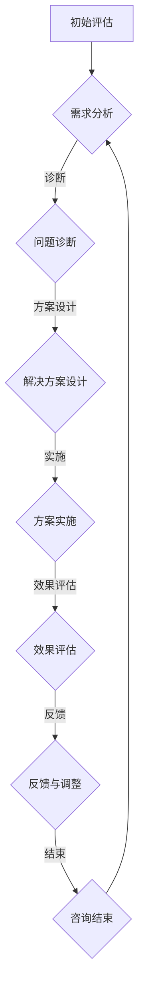

                 

# 引言

在现代社会中，虚拟世界和元宇宙的兴起给我们的日常生活带来了前所未有的变革。从社交平台、在线游戏到虚拟现实，虚拟世界已经成为人们生活中不可或缺的一部分。随着技术的发展，元宇宙——一个集成了虚拟现实、增强现实和区块链等技术的综合性虚拟空间——也逐渐成为现实。在这个虚拟世界中，人们可以建立全新的社会关系，体验前所未有的情感互动，甚至结婚成家。

然而，虚拟世界的伴侣关系与传统现实世界的伴侣关系有着诸多不同。在虚拟世界中，伴侣关系不仅受到技术环境的影响，还面临着情感、心理和社会等多方面的挑战。这就需要我们探索一种全新的伴侣关系维护方式，即元宇宙婚姻咨询。

本文旨在探讨元宇宙婚姻咨询这一新兴领域，通过分析其理论基础、实践方法、应用场景和未来发展趋势，为虚拟世界中的伴侣关系提供专业的指导和建议。文章将从以下几个方面展开：

1. **元宇宙与虚拟世界基础**：介绍元宇宙和虚拟世界的定义、特点和应用场景，以及它们与虚拟世界中的伴侣关系的关系。

2. **虚拟世界中的伴侣关系**：探讨虚拟世界中的伴侣关系的定义、类型、特点及其与传统伴侣关系的比较。

3. **元宇宙婚姻咨询概述**：介绍元宇宙婚姻咨询的定义、服务内容、目标和意义，以及其发展趋势。

4. **元宇宙婚姻咨询的实践方法**：分析元宇宙婚姻咨询的基本原理、问题诊断、解决方案和案例分析。

5. **元宇宙婚姻咨询的应用场景**：探讨元宇宙婚姻咨询在教育、医疗、心理咨询和商业领域的应用。

6. **元宇宙婚姻咨询的未来发展趋势**：分析元宇宙婚姻咨询的技术创新、市场前景、法律法规和发展策略。

7. **元宇宙婚姻咨询的伦理与法律问题**：探讨元宇宙婚姻咨询的伦理原则、法律框架和伦理与法律挑战。

8. **元宇宙婚姻咨询的教育培训**：讨论元宇宙婚姻咨询师的教育培训、课程设计和职业发展路径。

9. **案例研究**：通过具体案例展示元宇宙婚姻咨询的实际应用。

10. **总结与展望**：总结本文的主要观点，并对元宇宙婚姻咨询的未来进行展望。

通过以上内容，我们希望能够为虚拟世界中的伴侣关系维护提供有益的参考，推动元宇宙婚姻咨询这一新兴领域的健康发展。

---

**关键词**：元宇宙，虚拟世界，伴侣关系，婚姻咨询，心理健康，技术应用，伦理问题，教育培训

**摘要**：
本文深入探讨了元宇宙中的伴侣关系及其维护方法，即元宇宙婚姻咨询。通过对元宇宙和虚拟世界的基础介绍、伴侣关系的分类和特点分析，以及婚姻咨询的理论基础、实践方法和应用场景的探讨，本文揭示了元宇宙婚姻咨询的重要性和发展潜力。同时，本文还关注了元宇宙婚姻咨询在伦理和法律方面的挑战，以及未来的发展趋势和教育培训。通过对这些方面的详细讨论，本文为虚拟世界中的伴侣关系提供了全面的指导，有助于促进元宇宙社会的和谐发展。

---

接下来的部分，我们将详细探讨元宇宙与虚拟世界的基础知识，帮助读者更好地理解后续内容。在接下来的章节中，我们将逐步展开对元宇宙、虚拟世界及其伴侣关系的深入探讨。首先，我们来定义元宇宙和虚拟世界，并分析它们的特点和应用场景。

## 第1章：元宇宙概述

### 1.1.1 元宇宙的定义与特点

元宇宙（Metaverse）是一个由数字虚拟世界和物理现实世界融合而成的综合性虚拟空间。它不仅仅是虚拟现实（VR）和增强现实（AR）的延伸，更是集成了多种技术的综合性平台。元宇宙的概念最早由科幻小说家尼尔·斯蒂芬森（Neal Stephenson）在其1992年的小说《雪崩》（Snow Crash）中提出。在该小说中，元宇宙是一个虚拟世界，人们可以通过数字化身份在其中自由交流、工作、学习和娱乐。

**定义**：
元宇宙是一个通过互联网连接的虚拟世界，它融合了虚拟现实、增强现实、区块链、人工智能、大数据等先进技术，提供了一个持续运行、高度沉浸的虚拟环境。在元宇宙中，用户可以通过数字化身份（Avatar）参与各种活动，这些活动不仅限于娱乐，还包括教育、工作、社交等多个领域。

**特点**：

1. **沉浸性**：元宇宙提供了一个高度沉浸的虚拟环境，用户可以通过VR头盔、AR眼镜等设备，感受到身临其境的体验。

2. **连通性**：元宇宙是一个高度连通的网络空间，用户可以随时随地访问元宇宙，与其他用户进行实时互动。

3. **多样性**：元宇宙包含了丰富的虚拟环境和内容，用户可以在不同的场景中体验不同的生活方式和社交互动。

4. **持续性**：元宇宙是一个持续运行的环境，用户可以在元宇宙中创建和保存自己的虚拟资产和记录，这些内容可以在元宇宙中永久存在。

### 1.1.2 元宇宙的起源与发展

元宇宙的概念虽然起源于科幻小说，但随着技术的进步，这一概念逐渐从虚构走向现实。以下是元宇宙发展历程的关键节点：

1. **1980年代**：虚拟现实技术开始兴起，VR头盔和AR设备开始出现，为元宇宙的概念提供了技术基础。

2. **1990年代**：互联网的普及和Web的发展，为元宇宙提供了连接全球用户的平台。

3. **2000年代**：社交媒体和在线游戏平台的兴起，使得虚拟社交和虚拟资产的交换成为可能。

4. **2010年代**：虚拟现实和增强现实技术的成熟，特别是智能手机和移动设备的普及，使得元宇宙的概念更加接近现实。

5. **2020年代**：区块链技术和去中心化应用的兴起，为元宇宙提供了一种新的经济模式和社会结构。

### 1.1.3 元宇宙的应用场景

元宇宙的应用场景非常广泛，涵盖了多个领域：

1. **娱乐**：虚拟现实游戏、在线音乐会、虚拟演唱会等，为用户提供全新的娱乐体验。

2. **教育**：虚拟课堂、在线教育平台、虚拟实验等，为学生提供沉浸式的学习体验。

3. **工作**：远程办公、虚拟会议室、虚拟培训等，为企业提供更高效的工作方式。

4. **社交**：虚拟社交平台、虚拟派对、虚拟约会等，为用户提供新的社交方式。

5. **艺术与文化**：虚拟艺术展览、虚拟博物馆、虚拟文化遗产等，为艺术家和文化机构提供新的展示和传播方式。

6. **商业**：虚拟商品交易、虚拟房地产、虚拟广告等，为企业提供新的商业模式和市场机会。

### 1.1.4 元宇宙与虚拟世界的关系

元宇宙和虚拟世界密切相关，但它们并不是同一概念。虚拟世界是元宇宙的一个组成部分，元宇宙包含了多个虚拟世界。虚拟世界是元宇宙中的一个个独立空间，它们可以是游戏、社交平台、教育平台等，而元宇宙则是这些虚拟世界之间的连接和交互平台。

例如，虚拟现实游戏《第二人生》（Second Life）是一个独立的虚拟世界，而元宇宙则是包含《第二人生》在内的所有虚拟世界的集合。在元宇宙中，用户可以通过虚拟现实设备进入不同的虚拟世界，与其他用户互动，并参与各种活动。

### 1.1.5 小结

元宇宙是一个由多种技术融合而成的综合性虚拟空间，它提供了一个高度沉浸、连通和多样化的环境。元宇宙的起源和发展经历了多个阶段，从科幻小说到现实应用，它已经深刻地影响了我们的生活方式。元宇宙的应用场景非常广泛，涵盖了娱乐、教育、工作、社交等多个领域。理解和掌握元宇宙的基本概念和应用场景，对于深入探讨元宇宙中的伴侣关系及其维护方法至关重要。

在接下来的章节中，我们将进一步探讨虚拟世界中的伴侣关系，分析其定义、类型、特点，以及与元宇宙婚姻咨询的关系。这将帮助我们更好地理解元宇宙婚姻咨询的理论基础和实践方法。

### 第2章：虚拟世界中的伴侣关系

在虚拟世界中，伴侣关系与传统现实世界中的伴侣关系有着显著的不同。虚拟世界提供了丰富的社交和互动平台，使得人们可以跨越地域和时间的限制，建立和维持新的情感联系。本节将详细探讨虚拟世界中的伴侣关系的定义、类型、特点，以及与传统伴侣关系的比较。

#### 2.1 虚拟世界中的伴侣关系的定义

虚拟世界中的伴侣关系，是指通过虚拟平台（如虚拟现实、在线游戏、社交网络等）建立的情感联结和人际关系。这些关系可以是短暂的，也可以是长期的，甚至可以发展成为深层次的情感依赖。

**定义要点**：

1. **虚拟平台**：虚拟世界中的伴侣关系建立在虚拟平台之上，这些平台提供了交流、互动和共享的空间。

2. **情感联结**：虚拟伴侣关系不仅仅是虚拟环境中的社交互动，更重要的是双方在情感上的交流和连接。

3. **人际关系**：虚拟伴侣关系与传统人际关系相似，涉及信任、支持、依赖等多方面的互动。

#### 2.2 虚拟世界中的伴侣关系的类型

虚拟世界中的伴侣关系可以根据形成的方式和特点分为多种类型：

1. **虚拟恋情**：
   虚拟恋情是指通过虚拟平台建立的浪漫关系，可以是短暂的虚拟约会，也可以是长期的虚拟伴侣。这种关系通常建立在共同的兴趣、价值观和情感共鸣之上。

2. **虚拟婚姻**：
   虚拟婚姻是虚拟世界中的伴侣关系发展的一种形式，类似于现实世界中的婚姻，但发生在虚拟环境中。虚拟婚姻通常通过虚拟婚礼、共同创建虚拟家庭等方式实现。

3. **虚拟家庭**：
   虚拟家庭是在虚拟世界中形成的具有类似家庭结构和功能的群体关系。虚拟家庭成员之间可以共同承担家庭责任，如共同建设虚拟房产、养育虚拟子女等。

#### 2.3 虚拟世界中的伴侣关系的特点

虚拟世界中的伴侣关系具有以下特点：

1. **虚拟性**：
   虚拟伴侣关系存在于虚拟环境中，参与者通过虚拟平台交流，而不是面对面的互动。这种虚拟性使得情感表达和互动方式与传统伴侣关系有所不同。

2. **多样性**：
   虚拟世界提供了多样化的社交场景和互动方式，虚拟伴侣关系可以满足不同的情感需求，如娱乐、浪漫、亲情等。

3. **跨时空性**：
   虚拟世界打破了时间和地域的限制，参与者可以随时随地进入虚拟平台，与其他用户建立和维持关系。

4. **匿名性**：
   虚拟世界中的身份可以匿名，这为一些用户提供了隐藏真实身份的机会，但也可能导致信任问题和情感风险。

5. **不稳定性**：
   由于虚拟世界的匿名性和多样性，虚拟伴侣关系相对于传统伴侣关系来说，可能更加不稳定，容易受到外部环境的影响。

#### 2.4 虚拟世界中的伴侣关系与传统伴侣关系的比较

虚拟世界中的伴侣关系与传统伴侣关系在多个方面存在差异：

1. **互动方式**：
   虚拟伴侣关系的互动主要依赖于文字、语音和视频等形式，而传统伴侣关系的互动则更加多样，包括身体接触、面对面交流等。

2. **情感深度**：
   虚拟伴侣关系可能在情感深度上不如传统伴侣关系，因为虚拟互动缺乏真实的身体接触和情感表达。

3. **信任与依赖**：
   虚拟伴侣关系中的信任和依赖可能更多建立在虚拟身份和互动经验上，而传统伴侣关系中的信任和依赖则更多建立在长期相处和共同生活中的实际经历上。

4. **责任与义务**：
   虚拟伴侣关系中的责任和义务可能不如传统伴侣关系明确，特别是在虚拟婚姻和虚拟家庭中，责任和角色的界定更加模糊。

#### 2.5 小结

虚拟世界中的伴侣关系具有虚拟性、多样性、跨时空性、匿名性和不稳定性等特点。这些特点使得虚拟伴侣关系与传统伴侣关系在互动方式、情感深度、信任与依赖、责任与义务等方面存在显著差异。理解和这些差异，对于在虚拟世界中建立和维护健康的伴侣关系至关重要。在接下来的章节中，我们将进一步探讨元宇宙婚姻咨询的理论基础，分析其定义、服务内容、目标和意义。

### 第3章：元宇宙婚姻咨询概述

元宇宙婚姻咨询是一种结合心理学、社会学和咨询技术的专业服务，旨在帮助用户在元宇宙环境中维护和提升伴侣关系。本节将详细探讨元宇宙婚姻咨询的定义、服务内容、目标和意义，以及其发展趋势。

#### 3.1 元宇宙婚姻咨询的定义

元宇宙婚姻咨询（Metaverse Marriage Counseling）是指利用元宇宙技术提供的一种婚姻咨询服务。它通过虚拟现实（VR）、增强现实（AR）、在线聊天、虚拟会议等技术手段，为用户在元宇宙环境中提供情感支持、关系分析和问题解决服务。元宇宙婚姻咨询的核心目标是帮助用户建立和维持健康的伴侣关系，提升生活质量。

**定义要点**：

1. **元宇宙环境**：元宇宙婚姻咨询发生在元宇宙这个虚拟环境中，用户可以通过虚拟现实设备或移动设备进入元宇宙，与咨询师进行互动。

2. **婚姻咨询**：元宇宙婚姻咨询涵盖了传统婚姻咨询的内容，包括情感沟通、关系分析、问题解决等，但采用了元宇宙特有的技术和方式。

3. **专业服务**：元宇宙婚姻咨询是一种专业服务，需要具备心理学、社会学等相关知识的专业咨询师提供。

#### 3.2 元宇宙婚姻咨询的服务内容

元宇宙婚姻咨询的服务内容主要包括以下几个方面：

1. **情感支持**：为用户提供情感上的支持和安慰，帮助用户在情感困惑和压力时找到出路。

2. **关系分析**：通过专业的心理评估和分析，帮助用户了解伴侣关系的现状，找到关系中的问题和矛盾。

3. **问题解决**：提供具体的解决方案和建议，帮助用户解决伴侣关系中的各种问题，如沟通障碍、信任危机、婚姻危机等。

4. **咨询服务**：定期提供咨询服务，帮助用户跟踪和评估伴侣关系的进展，提供持续的指导和支持。

5. **在线互动**：通过元宇宙平台提供在线互动，包括实时聊天、虚拟会议、虚拟疗法等，方便用户随时随地进行咨询。

#### 3.3 元宇宙婚姻咨询的目标与意义

元宇宙婚姻咨询的目标是帮助用户建立和维持健康的伴侣关系，提升生活质量。具体目标包括：

1. **提升情感沟通**：帮助用户学会有效的沟通技巧，改善伴侣之间的情感交流。

2. **解决关系问题**：通过专业的分析和指导，帮助用户解决伴侣关系中的各种问题，避免婚姻破裂。

3. **增强信任与依赖**：建立和增强伴侣之间的信任和依赖，提高关系的稳定性。

4. **提升生活质量**：通过改善伴侣关系，提升用户的生活质量，使其在工作和生活中更加幸福和满足。

元宇宙婚姻咨询的意义在于：

1. **适应虚拟世界**：随着元宇宙的兴起，元宇宙婚姻咨询为用户提供了适应虚拟世界生活方式的情感支持和服务。

2. **填补现实咨询的不足**：在现实世界中，由于地理位置、时间限制等因素，很多用户无法获得及时和专业的婚姻咨询服务。元宇宙婚姻咨询为这些用户提供了新的解决方案。

3. **创新婚姻模式**：元宇宙婚姻咨询为婚姻模式提供了新的可能性，如虚拟婚礼、虚拟家庭等，丰富了人们的情感生活。

#### 3.4 元宇宙婚姻咨询的发展趋势

随着元宇宙技术的不断进步和应用场景的扩展，元宇宙婚姻咨询呈现出以下发展趋势：

1. **技术进步**：随着虚拟现实、增强现实、人工智能等技术的不断成熟，元宇宙婚姻咨询将提供更加逼真、高效和个性化的服务。

2. **市场扩大**：随着元宇宙的普及，越来越多的用户将进入虚拟世界，元宇宙婚姻咨询的市场需求将不断增长。

3. **专业规范化**：元宇宙婚姻咨询需要专业知识和技能的支持，未来将出现更多专业化的咨询师和咨询机构，提供高质量的咨询服务。

4. **多元化服务**：元宇宙婚姻咨询的服务内容将更加多元化，包括情感支持、关系分析、婚姻调解、家庭治疗等，满足用户多样化的需求。

5. **伦理和法律规范**：随着元宇宙婚姻咨询的发展，相关的伦理和法律问题将日益突出，需要制定相应的规范和标准，保障用户的权益。

#### 3.5 小结

元宇宙婚姻咨询是一种新兴的婚姻咨询服务，通过元宇宙技术为用户提供情感支持、关系分析和问题解决。其目标是帮助用户建立和维持健康的伴侣关系，提升生活质量。随着元宇宙技术的不断进步和应用场景的扩展，元宇宙婚姻咨询将面临广阔的市场和发展前景。理解和掌握元宇宙婚姻咨询的基本概念和服务内容，对于在虚拟世界中维护和提升伴侣关系具有重要意义。

在接下来的章节中，我们将深入探讨元宇宙婚姻咨询的实践方法，包括基本原理、问题诊断、解决方案和案例分析，帮助读者更好地理解和应用元宇宙婚姻咨询。

### 第4章：元宇宙婚姻咨询的基本原理

元宇宙婚姻咨询是一种结合心理学、社会学和技术创新的咨询服务，其成功实施依赖于一系列基本原理和方法。本节将详细探讨元宇宙婚姻咨询的基本原理，包括咨询师的素养与能力、咨询流程与步骤、咨询技巧与策略，以及咨询师在元宇宙中的角色与职责。

#### 4.1 咨询师的素养与能力

在元宇宙婚姻咨询中，咨询师的角色至关重要。咨询师不仅需要具备深厚的心理学和社会学知识，还需要具备以下素养和能力：

1. **专业知识**：
   咨询师应具备心理学、社会学、婚姻家庭学等相关领域的专业知识和技能，能够深入理解伴侣关系的本质和动态。

2. **技术熟练度**：
   咨询师应熟悉元宇宙相关的技术，如虚拟现实（VR）、增强现实（AR）、区块链等，能够有效利用这些技术为用户提供咨询服务。

3. **情感敏锐度**：
   咨询师应具备高度的情感敏锐度，能够准确捕捉用户在虚拟环境中的情感状态，提供针对性的支持和建议。

4. **沟通能力**：
   咨询师应具备良好的沟通能力，能够通过文字、语音、视频等多种形式与用户进行有效沟通，建立信任和合作关系。

5. **适应能力**：
   咨询师应具备快速适应新环境和新情况的能力，能够灵活应对元宇宙中不断变化的技术和用户需求。

6. **伦理道德**：
   咨询师应严格遵守职业道德和伦理规范，保护用户的隐私和权益，避免利益冲突。

#### 4.2 咨询流程与步骤

元宇宙婚姻咨询的流程可以分为以下几个步骤：

1. **初诊评估**：
   初诊评估是咨询的第一步，咨询师通过与用户的初步交流，了解用户的需求、问题和期望。在这一阶段，咨询师需要运用专业的评估工具，如问卷、访谈等，收集用户的基本信息，为后续咨询提供基础数据。

2. **制定咨询计划**：
   根据初诊评估的结果，咨询师需要与用户共同制定详细的咨询计划。咨询计划应包括咨询目标、咨询内容、咨询时间安排、预期效果等，确保咨询过程的有序进行。

3. **实施咨询**：
   在实施咨询的过程中，咨询师需要根据咨询计划，通过虚拟现实、在线聊天、虚拟会议等方式，与用户进行深入的交流和互动。咨询师应运用多种咨询技巧，如积极倾听、情感反馈、角色扮演等，帮助用户理解和解决伴侣关系中的问题。

4. **跟踪与评估**：
   咨询过程中，咨询师需要定期跟踪用户的进展情况，评估咨询效果，并根据需要调整咨询计划。跟踪与评估可以采用问卷调查、用户反馈、行为观察等方式，确保咨询目标的实现。

5. **咨询结束**：
   当咨询目标达成或用户需求得到满足后，咨询师需要与用户进行结案讨论，总结咨询过程中的收获和不足，为用户提供后续支持和建议。

#### 4.3 咨询技巧与策略

在元宇宙婚姻咨询中，咨询师需要运用一系列咨询技巧和策略，以提升咨询效果：

1. **积极倾听**：
   咨询师应以积极倾听的态度，认真听取用户的意见和建议，理解用户的情感需求和心理状态。

2. **情感反馈**：
   咨询师应通过情感反馈，表达对用户的理解和支持，增强用户的信心和积极性。

3. **角色扮演**：
   咨询师可以采用角色扮演的方式，帮助用户模拟和体验不同的情感互动场景，提升用户在现实世界中的沟通能力。

4. **情绪调节**：
   咨询师应帮助用户学会情绪调节技巧，如放松训练、正念练习等，提高用户在压力和冲突中的情绪稳定性。

5. **问题解决**：
   咨询师应引导用户分析和解决问题，提供具体的解决方案和建议，帮助用户改善伴侣关系。

6. **个性化服务**：
   咨询师应根据用户的特点和需求，提供个性化的咨询服务，确保咨询内容的针对性和有效性。

#### 4.4 咨询师在元宇宙中的角色与职责

在元宇宙中，咨询师扮演着多重角色，包括：

1. **指导者**：
   咨询师是用户的指导者，帮助用户理解伴侣关系的本质，提供专业的建议和指导。

2. **支持者**：
   咨询师是用户的支持者，提供情感上的支持和安慰，帮助用户度过困难和挑战。

3. **协调者**：
   咨询师是用户之间的协调者，帮助用户解决伴侣关系中的矛盾和冲突，促进关系的和谐发展。

4. **顾问**：
   咨询师是用户的顾问，提供关于婚姻、家庭、情感等方面的专业意见和建议。

5. **观察者**：
   咨询师是用户的观察者，通过观察用户的互动和行为，发现潜在的问题和风险，提供及时的反馈和指导。

#### 4.5 小结

元宇宙婚姻咨询的基本原理包括咨询师的素养与能力、咨询流程与步骤、咨询技巧与策略，以及咨询师在元宇宙中的角色与职责。咨询师需要具备专业知识、技术熟练度、情感敏锐度、沟通能力和适应能力，通过科学的咨询流程和有效的咨询技巧，为用户提供高质量的婚姻咨询服务。在元宇宙中，咨询师的角色不仅仅是提供专业指导和支持，还需要作为用户之间的协调者和观察者，帮助用户建立和维护健康的伴侣关系。

在接下来的章节中，我们将进一步探讨元宇宙婚姻咨询在问题诊断、解决方案设计、实施和评估方面的具体实践方法，帮助读者更好地理解和应用元宇宙婚姻咨询。

### 第5章：伴侣关系问题诊断

在元宇宙婚姻咨询中，诊断伴侣关系问题是解决问题的关键步骤。准确的诊断能够帮助咨询师找到问题的根本原因，为后续的解决方案设计提供依据。本节将详细探讨伴侣关系问题的类型、诊断方法、技巧以及难点与挑战。

#### 5.1 伴侣关系问题的类型与特征

在元宇宙中，伴侣关系问题多种多样，可以根据其特征和影响范围分为以下几类：

1. **情感问题**：
   情感问题是伴侣关系中最常见的问题，包括情感冷漠、情感疏离、情感依赖等。这些问题通常表现为双方情感交流的减少、情感表达的困难，甚至情感破裂。

2. **沟通问题**：
   沟通问题是伴侣关系中另一个常见问题，包括沟通障碍、沟通方式不当、沟通频率不足等。这些问题可能导致双方误解和矛盾，影响伴侣关系的稳定性。

3. **信任问题**：
   信任问题是伴侣关系中的核心问题，包括信任缺失、信任破裂、信任重建等。信任问题的存在可能导致伴侣关系的崩溃，严重影响双方的信任感和安全感。

4. **角色冲突**：
   角色冲突是伴侣关系中的一种现象，包括角色定位不明确、角色期望不符、角色职责冲突等。这些问题可能导致双方在家庭和社会角色中的定位和职责发生冲突。

5. **价值观差异**：
   价值观差异是伴侣关系中的深层问题，包括对生活、工作、教育等方面的价值观不同。这些问题可能导致双方在决策和行为上的分歧，影响伴侣关系的发展。

6. **家庭问题**：
   家庭问题是伴侣关系中的宏观问题，包括家庭结构变化、家庭责任分配、家庭冲突等。这些问题可能对整个家庭产生深远影响，影响伴侣关系和子女的成长。

#### 5.2 伴侣关系问题诊断的方法与技巧

诊断伴侣关系问题需要咨询师运用多种方法和技巧，以下是一些常用的方法：

1. **问卷调查**：
   问卷调查是一种有效的诊断工具，可以帮助咨询师快速了解用户的基本情况和问题。问卷可以设计成开放性和封闭性两种形式，涵盖情感、沟通、信任、价值观等多个方面。

2. **访谈**：
   访谈是深入了解用户问题和需求的重要方法。咨询师可以通过面对面访谈、电话访谈或在线访谈，与用户进行深入的交流，了解其内心世界和具体问题。

3. **观察**：
   观察是诊断伴侣关系问题的重要技巧，咨询师可以通过观察用户在虚拟环境中的行为、语言、情感表达等，发现潜在的问题和矛盾。

4. **案例分析**：
   通过分析具体案例，咨询师可以了解不同类型问题的诊断方法和技巧。案例分析可以帮助咨询师总结经验，提高诊断的准确性和有效性。

5. **互动体验**：
   咨询师可以设计一些互动体验活动，让用户在虚拟环境中模拟现实中的情境，观察其反应和行为，从而发现和诊断问题。

#### 5.3 伴侣关系问题诊断的案例分析

以下是一个具体的案例分析，说明如何诊断元宇宙中的伴侣关系问题：

**案例一：情感冷漠**

**问题描述**：
小王和小张是一对在元宇宙中认识的情侣，他们每天在虚拟环境中见面，但感觉彼此之间越来越冷漠。小王认为小张不再关心他，小张则觉得小王过于依赖他。

**诊断过程**：
1. **问卷调查**：
   咨询师设计了一份情感状况问卷，包括情感表达、情感依赖、情感互动等多个方面的问题，让小王和小张分别填写。

2. **访谈**：
   咨询师分别与小王和小张进行了深入的访谈，了解他们的情感需求和期望。

3. **观察**：
   咨询师在虚拟环境中观察了小王和小张的互动，发现他们在沟通时常常陷入沉默和等待的状态。

4. **互动体验**：
   咨询师设计了一个情感互动体验活动，要求小王和小张在虚拟环境中进行角色扮演，模拟现实生活中的情感表达场景。

**诊断结果**：
通过问卷调查、访谈、观察和互动体验，咨询师发现小王和小张之间的情感冷漠是由于沟通方式不当和情感表达困难导致的。他们习惯于通过文字和表情符号进行交流，缺乏面对面的情感表达。

#### 5.4 伴侣关系问题诊断的难点与挑战

在元宇宙婚姻咨询中，诊断伴侣关系问题面临着诸多难点和挑战：

1. **虚拟性**：
   虚拟环境中的交流具有虚拟性，咨询师难以通过观察和行为分析来准确诊断问题。这需要咨询师具备更高的情感敏锐度和沟通能力。

2. **复杂性**：
   伴侣关系问题通常涉及多个方面，如情感、沟通、信任、价值观等，咨询师需要具备全面的分析能力和专业知识。

3. **主观性**：
   伴侣关系问题具有很强的主观性，不同用户对同一问题可能有不同的理解和感受。咨询师需要平衡用户的主观感受和客观事实。

4. **技术依赖**：
   元宇宙婚姻咨询依赖于多种技术手段，如虚拟现实、增强现实、区块链等，咨询师需要具备技术熟练度和创新意识。

5. **隐私保护**：
   在虚拟环境中，用户的隐私保护是一个重要问题。咨询师需要严格遵守隐私保护法规和伦理规范，确保用户的隐私安全。

#### 5.5 小结

伴侣关系问题诊断是元宇宙婚姻咨询的关键步骤，通过科学的诊断方法和技巧，咨询师可以准确识别和解决伴侣关系中的问题。在元宇宙中，诊断伴侣关系问题面临诸多挑战，但通过不断提升咨询师的素养和能力，运用多样化的诊断工具和策略，可以有效应对这些问题，为用户提供高质量的咨询服务。

在接下来的章节中，我们将进一步探讨元宇宙婚姻咨询的解决方案设计、实施和评估方法，帮助读者更好地理解和应用元宇宙婚姻咨询。

### 第6章：伴侣关系问题解决方案

在诊断出元宇宙中的伴侣关系问题后，设计并实施有效的解决方案是提升关系质量的关键。本节将详细探讨伴侣关系问题解决方案的类型、设计原则、实施策略和评估方法，并结合具体案例进行详细解释。

#### 6.1 伴侣关系问题解决方案的类型

根据问题的性质和用户的需求，伴侣关系问题解决方案可以分为以下几种类型：

1. **沟通解决方案**：
   沟通问题是伴侣关系中常见且关键的问题。沟通解决方案包括提高沟通技巧、改善沟通方式、增加沟通频率等。通过这些方法，可以帮助伴侣建立更有效的沟通渠道，减少误解和矛盾。

2. **信任重建方案**：
   信任问题是伴侣关系的核心问题。信任重建方案包括信任重建活动、信任评估与修复、情感支持等。通过这些方法，可以帮助伴侣重建信任，恢复关系的稳定性。

3. **情感支持方案**：
   情感支持方案包括情感表达训练、情感依赖管理、情感调节技巧等。通过这些方法，可以帮助伴侣更好地处理情感问题，增强情感的亲密性和稳定性。

4. **角色协调方案**：
   角色冲突是伴侣关系中的重要问题。角色协调方案包括角色定义、角色分工、角色冲突解决等。通过这些方法，可以帮助伴侣明确各自的角色和职责，减少角色冲突。

5. **价值观调和方案**：
   价值观差异是伴侣关系中的深层问题。价值观调和方案包括价值观探讨、价值观融合、价值观冲突解决等。通过这些方法，可以帮助伴侣找到共同的价值基础，减少价值观冲突。

6. **家庭治疗方案**：
   家庭问题是伴侣关系的宏观问题。家庭治疗方案包括家庭沟通改善、家庭责任分配、家庭冲突解决等。通过这些方法，可以帮助整个家庭建立和谐的关系，提升家庭生活质量。

#### 6.2 解决伴侣关系问题解决方案的设计原则

设计伴侣关系问题解决方案时，应遵循以下原则：

1. **针对性**：
   解决方案应针对具体问题，避免一刀切的方法。每个伴侣关系问题都有其独特的背景和原因，解决方案应针对这些问题进行定制。

2. **可操作性**：
   解决方案应具有可操作性，即用户可以轻松实施和执行。过于复杂或难以操作的建议可能无法真正解决实际问题。

3. **可行性**：
   解决方案应在现实中具有可行性。考虑到用户的时间、资源和技术水平，解决方案应确保在用户可接受的范围内。

4. **灵活性**：
   解决方案应具有一定的灵活性，能够根据实际情况进行调整和优化。在实施过程中，用户可能会遇到新的挑战和变化，解决方案应具备适应性。

5. **综合性和系统性**：
   解决方案应综合考虑伴侣关系的各个方面，包括情感、沟通、信任、价值观等。同时，解决方案应具备系统性，确保各个部分相互协调，共同提升伴侣关系质量。

#### 6.3 解决伴侣关系问题的实施方案

以下是一个具体的实施方案，说明如何设计和实施伴侣关系问题解决方案：

**案例二：沟通问题解决方案**

**问题描述**：
小王和小张之间的沟通不畅，导致误解和矛盾频发。他们希望通过解决方案改善沟通，减少冲突。

**实施方案**：

1. **沟通技巧培训**：
   咨询师为小王和小张提供沟通技巧培训，包括积极倾听、情感表达、问题解决技巧等。通过在线课程、互动练习等形式，帮助他们掌握有效的沟通方法。

2. **沟通频率调整**：
   咨询师建议小王和小张增加沟通频率，每天进行至少一次深度交流。通过文字、语音、视频等多种形式，确保沟通的及时性和有效性。

3. **沟通主题设定**：
   咨询师指导小王和小张设定沟通主题，如日常琐事、情感需求、共同目标等。通过明确的沟通主题，帮助他们在交流中有针对性的内容。

4. **情感支持**：
   咨询师提供情感支持，帮助小王和小张在沟通过程中处理负面情绪，保持积极态度。

5. **反馈机制建立**：
   咨询师建议小王和小张建立反馈机制，定期评估沟通效果，调整沟通策略。通过反馈，他们可以不断优化沟通方式，提升沟通质量。

#### 6.4 解决伴侣关系问题的评估方法

评估伴侣关系问题解决方案的有效性是确保咨询效果的重要环节。以下是一些常用的评估方法：

1. **用户反馈**：
   通过定期收集用户的反馈意见，了解解决方案的实施效果和用户满意度。用户反馈可以采用问卷、访谈、在线评价等方式。

2. **行为观察**：
   咨询师在元宇宙环境中观察用户的行为和互动，评估解决方案对伴侣关系的影响。通过观察，可以发现潜在的问题和改进点。

3. **情感测量**：
   通过情感测量工具，如情感量表、情感评估问卷等，量化用户在咨询前后的情感变化。情感测量可以帮助咨询师评估解决方案的情感效果。

4. **关系质量评估**：
   通过关系质量评估工具，如婚姻满意度量表、关系稳定性量表等，评估伴侣关系在咨询前后的变化。关系质量评估可以提供全面的关系质量指标。

5. **长期跟踪**：
   咨询师应定期跟踪用户的情况，了解解决方案的长期效果和用户的适应情况。通过长期跟踪，可以评估解决方案的持续性和适应性。

#### 6.5 小结

伴侣关系问题解决方案的设计和实施是元宇宙婚姻咨询的重要环节。通过科学的诊断方法，找到问题的根源，结合针对性、可操作性和灵活性的原则，设计出有效的解决方案。在实施方案的过程中，咨询师应提供持续的情感支持和反馈机制，确保解决方案的实施效果。通过评估方法，咨询师可以评估解决方案的有效性，优化咨询过程，提升伴侣关系的质量。理解和掌握伴侣关系问题解决方案的设计和实施方法，对于元宇宙婚姻咨询的成功至关重要。

在接下来的章节中，我们将进一步探讨元宇宙婚姻咨询在特定领域中的应用，如教育、医疗、心理咨询和商业等，展示元宇宙婚姻咨询的多样性和广泛性。

### 第7章：元宇宙婚姻咨询的应用场景

元宇宙婚姻咨询作为一种新兴的咨询服务，具有广泛的应用场景。在教育、医疗、心理咨询和商业等领域，元宇宙婚姻咨询正发挥着越来越重要的作用。本节将详细探讨元宇宙婚姻咨询在这些领域的应用情况，分析其优势和挑战。

#### 7.1 元宇宙婚姻咨询在教育领域的应用

在教育领域，元宇宙婚姻咨询可以通过虚拟课堂、在线教育平台和虚拟实验等方式，提供丰富的情感教育资源和互动体验。

**优势**：
1. **沉浸式体验**：元宇宙提供了一个高度沉浸的学习环境，学生可以在虚拟世界中体验真实的情感互动，加深对情感教育的理解和感受。
2. **个性化教学**：元宇宙婚姻咨询可以根据学生的情感需求和特点，提供个性化的教育内容和建议，提高教学效果。
3. **跨学科融合**：元宇宙婚姻咨询可以与其他学科相结合，如心理学、社会学、教育学等，提供跨学科的综合教育体验。

**挑战**：
1. **技术依赖**：元宇宙婚姻咨询依赖于先进的技术手段，如虚拟现实、增强现实等，这需要学校和教师具备一定的技术能力和投入。
2. **隐私保护**：在虚拟环境中，学生的隐私保护是一个重要问题，需要制定严格的隐私保护政策和措施。

**应用实例**：
- **情感教育课程**：通过元宇宙平台，为学生提供情感教育课程，包括情感认知、情感管理、情感表达等。
- **虚拟角色扮演**：让学生在虚拟环境中进行角色扮演，模拟真实的情感互动，提高情感沟通能力。

#### 7.2 元宇宙婚姻咨询在医疗健康中的应用

在医疗健康领域，元宇宙婚姻咨询可以通过虚拟现实疗法、心理健康服务、在线咨询等方式，为用户提供情感支持和心理健康服务。

**优势**：
1. **远程服务**：元宇宙婚姻咨询可以通过远程方式进行，为那些地理位置偏远或行动不便的用户提供专业的心理健康服务。
2. **个性化治疗**：元宇宙婚姻咨询可以根据用户的具体情况和需求，提供个性化的治疗方案，提高治疗效果。
3. **沉浸式体验**：虚拟现实疗法和增强现实疗法可以为用户提供沉浸式的治疗体验，增强治疗效果。

**挑战**：
1. **技术成熟度**：虚拟现实和增强现实技术虽然在不断发展，但仍然存在技术成熟度不高、设备成本较高等问题。
2. **患者隐私**：在虚拟环境中，患者的隐私保护是一个重要问题，需要加强数据安全和隐私保护措施。

**应用实例**：
- **虚拟现实疗法**：通过虚拟现实技术，为患者提供放松、缓解压力、改善情绪的治疗。
- **心理健康服务**：通过元宇宙平台，提供在线心理健康咨询服务，包括情感咨询、婚姻咨询、家庭咨询等。

#### 7.3 元宇宙婚姻咨询在心理咨询领域的应用

在心理咨询领域，元宇宙婚姻咨询可以通过虚拟咨询室、在线聊天室、虚拟角色扮演等方式，为用户提供专业的情感支持和心理咨询。

**优势**：
1. **便捷性**：元宇宙婚姻咨询使得用户可以随时随地获得心理咨询，提高了咨询的便利性和可及性。
2. **互动性**：虚拟咨询室和在线聊天室提供了丰富的互动方式，咨询师和用户可以通过文字、语音、视频等多种形式进行交流。
3. **沉浸体验**：虚拟角色扮演和沉浸式体验可以帮助用户更好地理解和处理情感问题。

**挑战**：
1. **咨询师资质**：在元宇宙中提供心理咨询，需要咨询师具备一定的虚拟环境和心理咨询技能，这对咨询师的素质要求较高。
2. **技术稳定性**：虚拟咨询平台需要具备稳定的技术支持，确保用户能够顺畅地进行咨询。

**应用实例**：
- **虚拟咨询室**：为用户提供虚拟咨询环境，提供面对面的心理咨询服务。
- **在线聊天室**：提供实时在线聊天服务，用户可以在虚拟聊天室中与咨询师进行实时交流。

#### 7.4 元宇宙婚姻咨询在商业领域的应用

在商业领域，元宇宙婚姻咨询可以通过虚拟培训、虚拟团队建设、虚拟市场调研等方式，为企业提供情感管理和团队建设服务。

**优势**：
1. **高效培训**：元宇宙婚姻咨询可以通过虚拟培训平台，为员工提供情感管理和沟通技巧的培训，提高员工的工作效率。
2. **虚拟团队建设**：元宇宙提供了一个虚拟的团队协作环境，员工可以在虚拟空间中共同完成任务，增强团队合作精神。
3. **市场调研**：通过元宇宙平台，企业可以模拟真实的市场环境，进行市场调研和产品测试，提高市场策略的准确性。

**挑战**：
1. **企业文化适应性**：元宇宙婚姻咨询需要与企业的文化相适应，避免出现文化冲突。
2. **成本问题**：元宇宙婚姻咨询需要一定的技术投入和设备投入，这对企业的成本控制提出了挑战。

**应用实例**：
- **虚拟培训**：为企业员工提供情感管理和沟通技巧的虚拟培训课程，提高员工的综合素质。
- **虚拟团队建设**：通过元宇宙平台，为员工提供虚拟团队建设活动，增强团队合作精神和凝聚力。

#### 7.5 小结

元宇宙婚姻咨询在教育、医疗、心理咨询和商业等领域具有广泛的应用前景。它通过提供沉浸式体验、个性化服务、远程服务等方式，为用户和企业提供了丰富的情感支持和心理健康服务。尽管面临技术依赖、隐私保护和咨询师资质等挑战，但元宇宙婚姻咨询的发展前景依然广阔。随着技术的不断进步和应用的深入，元宇宙婚姻咨询将在更多领域发挥重要作用，推动社会的和谐与进步。

在接下来的章节中，我们将进一步探讨元宇宙婚姻咨询的未来发展趋势，分析技术进步、市场前景、法律法规和发展策略，以及元宇宙婚姻咨询的伦理道德问题。

### 第8章：元宇宙婚姻咨询的未来发展趋势

随着元宇宙技术的发展和应用的深入，元宇宙婚姻咨询作为一项新兴服务，正面临着广阔的发展前景和多重挑战。本节将探讨元宇宙婚姻咨询的未来发展趋势，包括技术创新、市场前景、法律法规和发展策略，以及元宇宙婚姻咨询的伦理道德问题。

#### 8.1 技术创新

元宇宙婚姻咨询的发展离不开技术创新的支持。以下是几个关键的技术发展趋势：

1. **虚拟现实（VR）和增强现实（AR）技术**：
   VR和AR技术为元宇宙婚姻咨询提供了高度沉浸和互动的体验环境。未来的发展将进一步提升这些技术的真实感和互动性，使得用户在虚拟世界中的体验更加逼真。

2. **人工智能（AI）和机器学习（ML）**：
   AI和ML技术的应用将使元宇宙婚姻咨询更加智能化和个性化。例如，通过AI算法，咨询师可以更准确地诊断用户的问题，提供个性化的解决方案。

3. **区块链技术**：
   区块链技术提供了去中心化和安全的数据存储和交易方式，有助于保护用户的隐私和安全。在元宇宙婚姻咨询中，区块链技术可以用于记录咨询过程、管理用户数据等。

4. **虚拟现实硬件的普及**：
   随着VR头盔、AR眼镜等硬件设备的普及，更多的用户将能够轻松地访问元宇宙，享受元宇宙婚姻咨询的服务。

5. **多感官互动技术**：
   未来的元宇宙婚姻咨询将不仅仅局限于视觉和听觉，还将结合触觉、嗅觉等多感官互动技术，提供更丰富的用户体验。

#### 8.2 市场前景

元宇宙婚姻咨询的市场前景十分广阔，以下是其潜在的市场机会和挑战：

1. **用户需求增长**：
   随着元宇宙的普及，越来越多的用户将进入虚拟世界，寻求情感支持和心理健康服务。这为元宇宙婚姻咨询提供了巨大的市场机会。

2. **多元化服务需求**：
   随着用户需求的多样化，元宇宙婚姻咨询将提供更加多元化的服务，如情感咨询、心理健康服务、婚姻家庭治疗等。

3. **市场竞争**：
   随着元宇宙婚姻咨询市场的扩大，将吸引更多的企业和创业者进入这一领域，市场竞争将逐渐加剧。

4. **市场规范化**：
   市场前景的扩大将促使相关法律法规和行业规范的制定，以确保元宇宙婚姻咨询的服务质量和用户权益。

#### 8.3 法律法规和发展策略

元宇宙婚姻咨询的发展需要完善的法律法规和明确的发展策略：

1. **隐私保护**：
   法律法规应明确保护用户隐私和数据安全的要求，确保用户的信息在虚拟环境中得到充分保护。

2. **行业规范**：
   应建立元宇宙婚姻咨询的行业规范，明确咨询师的资质要求、咨询服务的内容和标准等，确保行业健康发展。

3. **技术标准和认证**：
   应制定虚拟现实、增强现实、区块链等技术的标准和认证体系，确保技术的安全性和可靠性。

4. **国际合作**：
   元宇宙婚姻咨询是一个全球性的服务，应加强国际合作，推动全球范围内的法律法规和技术标准的统一。

#### 8.4 发展策略

为了促进元宇宙婚姻咨询的健康发展，以下是一些建议的发展策略：

1. **教育培训**：
   加强对元宇宙婚姻咨询师的培训，提高其专业素养和技术水平，确保提供高质量的服务。

2. **技术创新**：
   鼓励技术创新，推动虚拟现实、人工智能、区块链等技术在元宇宙婚姻咨询中的应用，提高服务的智能化和个性化。

3. **市场推广**：
   加强市场推广，提高公众对元宇宙婚姻咨询的认知和接受度，扩大用户群体。

4. **用户反馈**：
   定期收集用户反馈，了解用户需求和市场变化，及时调整服务策略，确保服务的持续改进。

#### 8.5 伦理道德问题

元宇宙婚姻咨询在发展过程中面临着一系列伦理道德问题：

1. **隐私和保密**：
   咨询师应严格遵守隐私保护原则，确保用户的信息在虚拟环境中得到充分保护。

2. **专业行为**：
   咨询师应遵循专业伦理规范，确保在元宇宙中提供专业的咨询服务，避免利益冲突和不当行为。

3. **用户自主权**：
   咨询师应尊重用户的自主权，确保用户在元宇宙婚姻咨询中的决策自由和选择自由。

4. **跨文化冲突**：
   随着元宇宙婚姻咨询的全球化发展，咨询师应具备跨文化理解和沟通能力，处理不同文化背景下的伦理道德问题。

#### 8.6 小结

元宇宙婚姻咨询的未来发展趋势充满了机遇和挑战。技术创新、市场前景、法律法规和发展策略是推动元宇宙婚姻咨询发展的重要因素。同时，伦理道德问题的处理也至关重要，确保元宇宙婚姻咨询在健康、可持续的基础上发展。随着技术的不断进步和应用场景的拓展，元宇宙婚姻咨询将在更多领域发挥重要作用，为用户提供更高质量的情感支持和心理健康服务。

在接下来的章节中，我们将进一步探讨元宇宙婚姻咨询在伦理和法律方面的挑战，以及如何通过培训和技术手段应对这些问题。

### 第9章：元宇宙婚姻咨询的伦理与法律问题

随着元宇宙婚姻咨询的普及和发展，其在伦理和法律方面的问题逐渐凸显。本节将探讨元宇宙婚姻咨询中可能遇到的伦理问题、法律问题，并分析如何通过培训和技术手段来解决这些问题。

#### 9.1 元宇宙婚姻咨询中的伦理问题

伦理问题是元宇宙婚姻咨询中不可忽视的一个方面。以下是一些常见的伦理问题：

1. **隐私保护**：
   在元宇宙中，用户的隐私保护是一个重要问题。咨询师需要确保用户的信息不被泄露，包括用户在虚拟环境中的行为记录、聊天记录、个人资料等。咨询师应严格遵守隐私保护原则，采取加密技术和数据安全措施，确保用户隐私得到充分保护。

2. **用户自主权**：
   咨询师应尊重用户的自主权，确保用户在元宇宙婚姻咨询中的决策自由和选择自由。用户有权选择是否参与咨询、咨询的内容、咨询的方式等。咨询师不得强迫或诱导用户做出不符合其意愿的决定。

3. **专业行为**：
   咨询师在元宇宙中提供咨询服务时，应遵循专业伦理规范，包括诚信、保密、尊重用户权利等。咨询师不得利用咨询关系谋取不正当利益，不得进行任何形式的欺诈行为。

4. **用户依赖性**：
   咨询师应警惕用户在虚拟环境中的依赖性，避免过度依赖元宇宙婚姻咨询而忽视了现实生活中的问题和关系。咨询师应鼓励用户在现实世界中积极解决问题，提升自身的情感管理能力。

5. **文化冲突**：
   元宇宙是一个全球性的虚拟空间，用户来自不同的文化背景。咨询师在处理文化冲突时，应具备跨文化理解和沟通能力，尊重不同文化的价值观和行为规范，避免文化冲突带来的负面影响。

#### 9.2 元宇宙婚姻咨询中的法律问题

法律问题是元宇宙婚姻咨询发展的另一个重要方面。以下是一些常见的法律问题：

1. **数据保护法规**：
   随着元宇宙婚姻咨询的普及，用户数据的收集、存储和使用变得更加普遍。咨询师需要遵守相关数据保护法规，如《通用数据保护条例》（GDPR）等，确保用户数据的合法收集、存储和使用。

2. **知识产权**：
   元宇宙中涉及到的知识产权问题，包括虚拟资产、虚拟商品、虚拟服务等的知识产权保护。咨询师需要了解相关的知识产权法律法规，确保在提供咨询服务时不会侵犯他人的知识产权。

3. **隐私权与知情同意**：
   用户在参与元宇宙婚姻咨询前，需要充分了解咨询的内容、方式、可能的风险等，并在知情同意的基础上自愿参与。咨询师应确保用户在咨询过程中拥有充分的知情权和选择权。

4. **责任归属**：
   在元宇宙婚姻咨询中，如果用户因咨询过程产生纠纷或损害，需要明确责任归属。咨询师、元宇宙平台运营方、技术提供商等各方需要明确各自的职责和责任，确保在发生问题时能够及时有效地解决。

#### 9.3 应对伦理与法律问题的策略

为了有效应对元宇宙婚姻咨询中的伦理和法律问题，可以采取以下策略：

1. **伦理培训**：
   对元宇宙婚姻咨询师进行系统的伦理培训，提高其伦理意识和专业素养。培训内容应包括隐私保护、用户自主权、专业行为规范、文化冲突处理等。

2. **法律法规教育**：
   加强对元宇宙婚姻咨询师的法律教育，使其了解相关法律法规，特别是数据保护、知识产权、隐私权等方面的法律规定。通过法律法规教育，提高咨询师的法律意识和法律素养。

3. **技术手段**：
   运用先进的技术手段，如数据加密、匿名化处理、隐私保护技术等，确保用户数据的安全性和隐私性。同时，采用区块链技术等手段，确保元宇宙婚姻咨询过程的数据透明和可追溯。

4. **透明化管理**：
   建立透明化的管理体系，确保元宇宙婚姻咨询服务的公平、公正和透明。通过公开咨询流程、收费标准、服务内容等信息，提高用户对咨询服务的信任度。

5. **用户教育**：
   加强对用户的伦理和法律教育，提高用户在虚拟环境中的自我保护意识。通过用户教育，帮助用户了解元宇宙婚姻咨询的伦理和法律问题，避免在虚拟环境中遭受损害。

#### 9.4 小结

元宇宙婚姻咨询在发展过程中面临着诸多伦理和法律问题。隐私保护、用户自主权、专业行为规范、文化冲突处理等方面的伦理问题需要通过伦理培训和技术手段来解决。同时，数据保护、知识产权、隐私权与知情同意、责任归属等方面的法律问题也需要咨询师具备相应的法律知识和法律意识。通过加强伦理培训、法律法规教育、技术手段、透明化管理以及用户教育，可以有效应对元宇宙婚姻咨询中的伦理和法律问题，推动元宇宙婚姻咨询的健康发展。

在接下来的章节中，我们将探讨元宇宙婚姻咨询的教育培训，分析元宇宙婚姻咨询师的教育需求、培训内容、职业发展路径，以及相关课程设计，为元宇宙婚姻咨询的专业化发展提供支持。

### 第10章：元宇宙婚姻咨询的教育培训

随着元宇宙婚姻咨询的不断发展，对专业人才的需求日益增加。为了确保元宇宙婚姻咨询服务的专业性和质量，对其进行系统化的教育培训至关重要。本节将详细探讨元宇宙婚姻咨询的教育培训，包括教育需求、培训内容、职业发展路径和课程设计。

#### 10.1 教育需求

元宇宙婚姻咨询的教育需求主要体现在以下几个方面：

1. **专业知识**：
   元宇宙婚姻咨询师需要具备深厚的心理学、社会学、婚姻家庭学等相关领域的专业知识。这些知识包括情感心理学、人际关系学、婚姻家庭理论等，为咨询师提供理论支持和实践指导。

2. **技术技能**：
   元宇宙婚姻咨询师需要熟练掌握元宇宙相关技术，如虚拟现实（VR）、增强现实（AR）、区块链、人工智能等。这些技术技能是咨询师在元宇宙环境中提供专业服务的基础。

3. **伦理道德**：
   元宇宙婚姻咨询师需要具备强烈的伦理道德意识，能够遵守职业道德和伦理规范，保护用户的隐私和权益。伦理道德培训是确保咨询服务质量的重要环节。

4. **沟通能力**：
   元宇宙婚姻咨询师需要具备优秀的沟通能力，包括文字沟通、语音沟通、视频沟通等，能够在多种沟通形式中有效传递信息，建立信任和合作关系。

5. **实践经验**：
   元宇宙婚姻咨询师需要具备丰富的实践经验，通过实际案例的分析和处理，提高咨询技能和解决问题的能力。

#### 10.2 培训内容

元宇宙婚姻咨询的培训内容应涵盖以下方面：

1. **基础理论知识**：
   包括心理学、社会学、婚姻家庭学等基础理论知识的讲解，帮助咨询师建立扎实的理论基础。

2. **元宇宙技术培训**：
   包括虚拟现实（VR）、增强现实（AR）、区块链、人工智能等技术的学习，帮助咨询师掌握元宇宙环境中的技术工具。

3. **伦理道德培训**：
   包括伦理学原理、伦理决策、职业道德等方面的培训，帮助咨询师树立正确的伦理道德观念。

4. **沟通技巧培训**：
   包括沟通理论、沟通技巧、情感表达等方面的培训，提高咨询师的沟通能力和咨询效果。

5. **实践操作培训**：
   通过案例分析、模拟咨询、实践操作等方式，帮助咨询师将理论知识应用到实际工作中，提高实战能力。

6. **法规知识培训**：
   包括数据保护法、隐私权法、知识产权法等相关法律法规的培训，确保咨询师在法律框架内提供服务。

#### 10.3 职业发展路径

元宇宙婚姻咨询师的职业发展路径可以分为以下几个阶段：

1. **初级咨询师**：
   这一阶段咨询师主要承担基础性的咨询工作，如情感支持、关系分析等。咨询师需要通过实践积累经验和提高技能。

2. **中级咨询师**：
   在初级咨询师的基础上，咨询师可以承担更为复杂的咨询任务，如问题解决、方案设计等。这一阶段咨询师需要具备更丰富的知识和经验。

3. **高级咨询师**：
   高级咨询师具备深厚的专业知识和丰富的实践经验，能够处理复杂的婚姻家庭问题，提供专业的高层次咨询服务。

4. **专家咨询师**：
   专家咨询师在特定领域具有权威地位，能够引领元宇宙婚姻咨询的发展，参与行业标准的制定和培训。

5. **培训讲师**：
   咨询师可以转型为培训讲师，负责培训新咨询师，传授专业知识和经验。

#### 10.4 课程设计

为了确保元宇宙婚姻咨询培训的系统性、专业性和实用性，课程设计应遵循以下原则：

1. **系统性**：
   课程设计应涵盖元宇宙婚姻咨询的各个关键领域，确保知识的全面性和系统性。

2. **实用性**：
   课程内容应紧密联系实际工作，注重实践操作，帮助咨询师将理论知识应用到实际工作中。

3. **互动性**：
   课程设计应注重师生互动和学生之间的互动，提高参与度和学习效果。

4. **灵活性**：
   课程设计应具备灵活性，根据市场需求和用户反馈，及时调整课程内容和形式。

5. **多层次性**：
   课程设计应考虑不同层次咨询师的培训需求，提供初级、中级、高级等多层次的培训课程。

以下是一个具体的课程设计示例：

**课程名称**：元宇宙婚姻咨询培训

**课程内容**：

- **基础理论知识**：
  - 情感心理学
  - 人际关系学
  - 婚姻家庭理论

- **元宇宙技术培训**：
  - 虚拟现实（VR）技术
  - 增强现实（AR）技术
  - 区块链技术
  - 人工智能技术

- **伦理道德培训**：
  - 伦理学原理
  - 职业道德规范
  - 隐私保护原则

- **沟通技巧培训**：
  - 沟通理论
  - 沟通技巧
  - 情感表达

- **实践操作培训**：
  - 案例分析
  - 模拟咨询
  - 实践操作

- **法规知识培训**：
  - 数据保护法
  - 隐私权法
  - 知识产权法

**教学方法**：

- **讲授**：
  - 理论知识讲解
  - 技术介绍

- **案例分析**：
  - 现实案例讨论
  - 案例分析技巧

- **模拟咨询**：
  - 模拟咨询场景
  - 咨询技巧实践

- **互动讨论**：
  - 课堂讨论
  - 小组交流

- **实践操作**：
  - 实际案例操作
  - 技术应用实践

**课程评估**：

- **理论知识考核**：
  - 开卷考试
  - 知识问答

- **技术技能考核**：
  - 技能展示
  - 实践操作

- **沟通能力考核**：
  - 沟通案例分析
  - 模拟咨询

- **综合能力考核**：
  - 综合案例分析
  - 实际案例操作

#### 10.5 小结

元宇宙婚姻咨询的教育培训是确保咨询服务专业性和质量的重要环节。教育需求包括专业知识、技术技能、伦理道德、沟通能力和实践经验。培训内容应涵盖基础理论知识、元宇宙技术培训、伦理道德培训、沟通技巧培训和实践操作培训。职业发展路径包括初级咨询师、中级咨询师、高级咨询师、专家咨询师和培训讲师。通过系统化的课程设计和教学方法，可以有效提升元宇宙婚姻咨询师的专业素养和咨询能力，推动元宇宙婚姻咨询的健康发展。

在接下来的章节中，我们将通过具体的案例研究，展示元宇宙婚姻咨询在实际中的应用，进一步说明其方法和效果。

### 第11章：案例研究

在本章中，我们将通过几个具体的元宇宙婚姻咨询案例，展示元宇宙婚姻咨询在解决实际问题和提升关系质量方面的效果。每个案例都详细描述了问题的背景、诊断过程、解决方案和实施效果，以帮助读者更好地理解元宇宙婚姻咨询的应用和实践。

#### 案例一：虚拟恋情中的情感问题

**问题描述**：
李明和李晓是一对在虚拟现实游戏中相识的情侣，他们每天在虚拟环境中见面，但由于游戏中的虚拟身份和现实的隔离，他们的情感逐渐出现问题。李明觉得李晓在游戏中的表现过于冷漠，而李晓则认为李明在现实生活中的关注不够。

**诊断过程**：
1. **问卷调查**：
   咨询师通过问卷调查了解李明和李晓的情感需求和期望，发现他们在情感表达和沟通上存在困难。

2. **访谈**：
   咨询师分别与李明和李晓进行了深入访谈，了解他们在虚拟世界中的情感体验和问题。

3. **互动观察**：
   咨询师在虚拟环境中观察了李明和李晓的互动，发现他们在沟通时经常出现沉默和误解。

**解决方案**：
1. **情感表达训练**：
   咨询师指导李明和李晓进行情感表达训练，通过文字、语音和表情符号等多种方式表达情感。

2. **沟通技巧提升**：
   咨询师教授李明和李晓沟通技巧，包括积极倾听、情感反馈和问题解决技巧。

3. **角色扮演**：
   咨询师设计了角色扮演活动，让李明和李晓在虚拟环境中模拟现实生活中的情感表达场景，提高他们的沟通能力。

**实施效果**：
通过咨询师的一系列指导，李明和李晓的情感表达和沟通能力得到了显著提升，他们的关系质量也有了明显改善。

#### 案例二：虚拟婚姻中的家庭责任冲突

**问题描述**：
张强和刘芳是一对在元宇宙中结婚的虚拟伴侣，但由于家庭责任分配不均，他们之间的关系出现了问题。张强觉得刘芳在虚拟家庭中的投入不够，而刘芳则认为张强在现实生活中的压力太大，无法兼顾虚拟家庭。

**诊断过程**：
1. **问卷调查**：
   咨询师通过问卷调查了解张强和刘芳在家庭责任分配上的需求和期望。

2. **访谈**：
   咨询师分别与张强和刘芳进行了深入访谈，了解他们在虚拟家庭中的角色定位和责任承担。

3. **互动观察**：
   咨询师在虚拟家庭中观察了张强和刘芳的互动，发现他们在家庭责任分配上存在明显分歧。

**解决方案**：
1. **角色定义**：
   咨询师帮助张强和刘芳明确各自在虚拟家庭中的角色和责任，确保分工明确。

2. **家庭责任协调**：
   咨询师指导张强和刘芳如何协调家庭责任，共同承担虚拟家庭的各项事务。

3. **情感支持**：
   咨询师提供情感支持，帮助张强和刘芳在家庭责任冲突中保持积极态度，增强彼此的信任和理解。

**实施效果**：
通过咨询师的工作，张强和刘芳在家庭责任分配上达成了共识，他们的关系得到了明显改善，虚拟家庭的氛围更加和谐。

#### 案例三：虚拟世界中的亲子关系问题

**问题描述**：
王女士在元宇宙中有一个虚拟的儿子，但她的儿子对她的关心和互动较少，导致王女士感到孤独和失落。她希望咨询师帮助改善他们之间的亲子关系。

**诊断过程**：
1. **问卷调查**：
   咨询师通过问卷调查了解王女士的亲子关系需求和期望。

2. **访谈**：
   咨询师与王女士进行了深入访谈，了解她在虚拟世界中的亲子互动体验。

3. **互动观察**：
   咨询师在虚拟世界中观察了王女士和她儿子的互动，发现他们在互动中存在情感表达不足和沟通障碍。

**解决方案**：
1. **情感互动训练**：
   咨询师帮助王女士和她儿子进行情感互动训练，提高他们在虚拟世界中的情感表达和沟通能力。

2. **沟通技巧提升**：
   咨询师教授王女士和她儿子沟通技巧，包括积极倾听、情感反馈和问题解决技巧。

3. **共同活动设计**：
   咨询师设计了亲子共同活动，如虚拟旅游、共同创造虚拟艺术作品等，增强他们之间的互动和情感联结。

**实施效果**：
通过咨询师的工作，王女士和她儿子的情感互动和沟通能力得到了显著提升，他们的关系质量也有了明显改善。

#### 11.4 小结

通过以上案例研究，我们可以看到元宇宙婚姻咨询在实际应用中的效果。无论是虚拟恋情中的情感问题、虚拟婚姻中的家庭责任冲突，还是虚拟世界中的亲子关系问题，元宇宙婚姻咨询都能够通过科学的方法和有效的解决方案，帮助用户解决实际问题，提升关系质量。这些案例展示了元宇宙婚姻咨询的多样性和灵活性，也为其他用户提供了宝贵的参考和借鉴。

在接下来的章节中，我们将总结本文的主要观点，并探讨元宇宙婚姻咨询的未来发展趋势和挑战。

### 第12章：总结与展望

通过本文的探讨，我们深入了解了元宇宙婚姻咨询这一新兴领域，从基础概念、应用场景、理论基础、实践方法到伦理法律问题，全面阐述了元宇宙婚姻咨询的各个方面。以下是本文的主要观点和展望：

#### 12.1 主要观点

1. **元宇宙婚姻咨询的定义**：
   元宇宙婚姻咨询是一种利用虚拟现实、增强现实、区块链等技术在元宇宙环境中提供的专业婚姻咨询服务。它旨在帮助用户在虚拟世界中建立和维护健康的伴侣关系。

2. **元宇宙婚姻咨询的特点**：
   元宇宙婚姻咨询具有虚拟性、多样性、跨时空性、匿名性和不稳定性等特点。这些特点使得虚拟世界中的伴侣关系与传统现实世界的伴侣关系存在显著差异。

3. **元宇宙婚姻咨询的理论基础**：
   元宇宙婚姻咨询的理论基础包括心理学、社会学、咨询技术等多个学科。这些理论为元宇宙婚姻咨询提供了科学依据和指导。

4. **元宇宙婚姻咨询的实践方法**：
   元宇宙婚姻咨询的实践方法包括诊断伴侣关系问题、设计解决方案、实施咨询和评估效果等。咨询师需要具备专业知识、技术熟练度、沟通能力和伦理道德素养。

5. **元宇宙婚姻咨询的应用场景**：
   元宇宙婚姻咨询在教育、医疗、心理咨询和商业等领域具有广泛的应用前景，为用户提供了多样化的情感支持和心理健康服务。

6. **元宇宙婚姻咨询的伦理与法律问题**：
   元宇宙婚姻咨询在发展过程中面临隐私保护、用户自主权、专业行为规范等方面的伦理问题，以及数据保护、知识产权等方面的法律问题。

7. **元宇宙婚姻咨询的教育培训**：
   元宇宙婚姻咨询的教育培训是确保咨询师专业素养和咨询质量的重要环节，包括专业知识、技术技能、伦理道德、沟通能力和实践经验等方面的培训。

#### 12.2 展望未来

元宇宙婚姻咨询的未来发展趋势和前景广阔，但也面临诸多挑战：

1. **技术创新**：
   随着虚拟现实、增强现实、人工智能等技术的不断进步，元宇宙婚姻咨询将提供更加丰富、高效和个性化的服务。

2. **市场扩大**：
   随着元宇宙的普及和用户数量的增加，元宇宙婚姻咨询的市场需求将不断增长，为咨询师提供更多的就业机会和发展空间。

3. **专业规范化**：
   元宇宙婚姻咨询需要专业的知识和技能，未来将出现更多专业化的咨询师和咨询机构，提供高质量的咨询服务。

4. **伦理与法律完善**：
   随着元宇宙婚姻咨询的发展，相关的伦理和法律问题将日益突出，需要制定相应的规范和标准，保障用户的权益。

5. **跨学科融合**：
   元宇宙婚姻咨询将与其他学科如心理学、社会学、教育学等深度融合，为用户提供更全面、更系统的咨询服务。

6. **用户接受度**：
   随着用户对元宇宙婚姻咨询的认知和接受度不断提高，元宇宙婚姻咨询将在更多领域得到广泛应用。

#### 12.3 挑战与应对策略

1. **隐私保护**：
   随着元宇宙婚姻咨询的发展，用户隐私保护问题将日益重要。咨询师和平台应采取加密技术、匿名化处理等手段，确保用户数据的安全和隐私。

2. **专业素质**：
   为了确保元宇宙婚姻咨询的质量，需要加强对咨询师的培训和管理，提高其专业素养和伦理道德水平。

3. **法律法规**：
   随着元宇宙婚姻咨询的普及，需要制定和完善相关的法律法规，确保元宇宙婚姻咨询在合法、合规的框架内进行。

4. **技术应用**：
   需要不断探索和利用新技术，提高元宇宙婚姻咨询的服务水平和用户体验。

#### 12.4 小结

元宇宙婚姻咨询作为一种新兴的婚姻咨询服务，具有广阔的发展前景和重要的社会意义。通过本文的探讨，我们对其理论基础、实践方法、应用场景和伦理法律问题有了更深入的了解。未来，随着技术的进步和市场的扩大，元宇宙婚姻咨询将不断发展，为用户提供更高质量的情感支持和心理健康服务。同时，我们也需要关注和解决元宇宙婚姻咨询中面临的挑战，确保其健康、可持续的发展。

### 附录

#### 附录A：元宇宙婚姻咨询常用工具与资源

在元宇宙婚姻咨询的实践中，使用适当的工具和资源可以显著提高咨询效果和用户体验。以下是一些常用的工具和资源：

1. **元宇宙平台**：
   - **Decentraland**：一个开源的元宇宙平台，支持用户创建和体验虚拟世界。
   - **Sandbox**：一个虚拟世界平台，用户可以购买、建造和交易虚拟土地。
   - **Horizon Worlds**：Facebook开发的元宇宙平台，提供虚拟社交和体验。

2. **虚拟现实设备**：
   - **VR头盔**：如Oculus Rift、HTC Vive等，为用户提供沉浸式的虚拟体验。
   - **AR眼镜**：如Microsoft HoloLens、Google Glass等，增强用户的现实环境。

3. **在线聊天和视频会议工具**：
   - **Slack**：用于团队沟通和协作。
   - **Zoom**：提供高质量的在线视频会议和互动。

4. **咨询工具**：
   - **PsyberLink**：一个用于在线心理评估和治疗的平台。
   - **Talkspace**：提供在线心理咨询服务。

5. **区块链技术**：
   - **Ethereum**：用于创建去中心化应用程序（DApp）。
   - **EOSIO**：一个基于区块链的分布式操作系统，支持高吞吐量的DApp。

6. **参考书籍与资料**：
   - 《元宇宙：探索虚拟世界的未来》（作者：梅兰妮·斯旺克）
   - 《虚拟现实：技术与应用》（作者：马丁·海德）
   - 《区块链：从概念到实践》（作者：安德烈亚斯·M·安东诺普洛斯）

7. **社区与论坛**：
   - **Reddit**：在r/metaverse、r/VR等社区中可以找到关于元宇宙婚姻咨询的讨论和资源。
   - **Discord**：元宇宙爱好者和开发者的交流平台。

通过使用这些工具和资源，咨询师可以更好地为用户提供元宇宙婚姻咨询服务，提高服务的专业性和用户体验。

#### 附录B：元宇宙婚姻咨询案例集锦

在本附录中，我们将介绍几个具体的元宇宙婚姻咨询案例，以展示元宇宙婚姻咨询在解决实际问题和提升关系质量方面的应用和效果。

**案例一：虚拟恋情中的情感问题**

**问题描述**：
小张和小王是一对在虚拟现实游戏中相识的情侣，他们在游戏中的互动频繁，但小张觉得小王在游戏中的情感表达过于冷漠。小王则抱怨小张在现实生活中对他们的关系不够重视。

**诊断过程**：
1. **问卷调查**：
   咨询师通过问卷调查了解小张和小王在情感表达和互动上的需求和问题。

2. **访谈**：
   咨询师分别与小张和小王进行了深入访谈，了解他们在虚拟世界中的情感体验和问题。

3. **互动观察**：
   咨询师在虚拟世界中观察了小张和小王的互动，发现他们在沟通时常常出现沉默和误解。

**解决方案**：
1. **情感表达训练**：
   咨询师指导小张和小王进行情感表达训练，通过文字、语音和表情符号等多种方式表达情感。

2. **沟通技巧提升**：
   咨询师教授小张和小王沟通技巧，包括积极倾听、情感反馈和问题解决技巧。

3. **角色扮演**：
   咨询师设计了角色扮演活动，让小张和小王在虚拟环境中模拟现实生活中的情感表达场景，提高他们的沟通能力。

**实施效果**：
通过咨询师的工作，小张和小王在情感表达和沟通能力上得到了显著提升，他们的关系质量也得到了改善。

**案例二：虚拟婚姻中的家庭责任冲突**

**问题描述**：
李明和刘芳是一对在元宇宙中结婚的虚拟伴侣，但由于家庭责任分配不均，他们之间的关系出现了问题。李明觉得刘芳在虚拟家庭中的投入不够，而刘芳则认为李明在现实生活中的压力太大，无法兼顾虚拟家庭。

**诊断过程**：
1. **问卷调查**：
   咨询师通过问卷调查了解李明和刘芳在家庭责任分配上的需求和期望。

2. **访谈**：
   咨询师分别与李明和刘芳进行了深入访谈，了解他们在虚拟家庭中的角色定位和责任承担。

3. **互动观察**：
   咨询师在虚拟家庭中观察了李明和刘芳的互动，发现他们在家庭责任分配上存在明显分歧。

**解决方案**：
1. **角色定义**：
   咨询师帮助李明和刘芳明确各自在虚拟家庭中的角色和责任，确保分工明确。

2. **家庭责任协调**：
   咨询师指导李明和刘芳如何协调家庭责任，共同承担虚拟家庭的各项事务。

3. **情感支持**：
   咨询师提供情感支持，帮助李明和刘芳在家庭责任冲突中保持积极态度，增强彼此的信任和理解。

**实施效果**：
通过咨询师的工作，李明和刘芳在家庭责任分配上达成了共识，他们的关系得到了明显改善，虚拟家庭的氛围更加和谐。

**案例三：虚拟世界中的亲子关系问题**

**问题描述**：
王女士在元宇宙中有一个虚拟的儿子，但她的儿子对她的关心和互动较少，导致王女士感到孤独和失落。她希望咨询师帮助改善他们之间的亲子关系。

**诊断过程**：
1. **问卷调查**：
   咨询师通过问卷调查了解王女士的亲子关系需求和期望。

2. **访谈**：
   咨询师与王女士进行了深入访谈，了解她在虚拟世界中的亲子互动体验。

3. **互动观察**：
   咨询师在虚拟世界中观察了王女士和她儿子的互动，发现他们在互动中存在情感表达不足和沟通障碍。

**解决方案**：
1. **情感互动训练**：
   咨询师帮助王女士和她儿子进行情感互动训练，提高他们在虚拟世界中的情感表达和沟通能力。

2. **沟通技巧提升**：
   咨询师教授王女士和她儿子沟通技巧，包括积极倾听、情感反馈和问题解决技巧。

3. **共同活动设计**：
   咨询师设计了亲子共同活动，如虚拟旅游、共同创造虚拟艺术作品等，增强他们之间的互动和情感联结。

**实施效果**：
通过咨询师的工作，王女士和她儿子的情感互动和沟通能力得到了显著提升，他们的关系质量也得到了改善。

**案例四：虚拟世界中的婚姻危机干预**

**问题描述**：
赵先生和孙女士是一对在虚拟世界中结婚的虚拟伴侣，由于长期缺乏有效的沟通和共同活动，他们之间的关系陷入危机。孙女士甚至考虑退出虚拟世界，放弃这段虚拟婚姻。

**诊断过程**：
1. **问卷调查**：
   咨询师通过问卷调查了解赵先生和孙女士在婚姻关系中的问题和需求。

2. **访谈**：
   咨询师分别与赵先生和孙女士进行了深入访谈，了解他们在虚拟世界中的婚姻互动经历和问题。

3. **互动观察**：
   咨询师在虚拟世界中观察了赵先生和孙女士的互动，发现他们在互动中存在明显的沟通障碍和情感疏离。

**解决方案**：
1. **婚姻危机干预**：
   咨询师对赵先生和孙女士进行了婚姻危机干预，通过情感支持、沟通技巧培训、共同活动设计等方式，帮助他们重建婚姻关系。

2. **情感重建**：
   咨询师帮助赵先生和孙女士重建情感联系，提高他们在虚拟世界中的情感表达和互动质量。

3. **婚姻规划**：
   咨询师与赵先生和孙女士一起制定了婚姻规划，包括定期共同活动、情感沟通计划等，确保婚姻关系的稳定和发展。

**实施效果**：
通过咨询师的工作，赵先生和孙女士的婚姻关系得到了明显改善，他们重新建立了情感联系，虚拟婚姻也变得更加稳固。

这些案例展示了元宇宙婚姻咨询在解决实际问题和提升关系质量方面的应用和效果。通过科学的方法和有效的解决方案，元宇宙婚姻咨询为虚拟世界中的伴侣关系提供了有力的支持和指导。

### 附录C：术语表

在本文中，我们使用了一系列专业术语和概念，以下是对这些术语的解释和说明：

**元宇宙（Metaverse）**：一个由数字虚拟世界和物理现实世界融合而成的综合性虚拟空间，它融合了虚拟现实、增强现实、区块链、人工智能、大数据等先进技术，提供了一个持续运行、高度沉浸的虚拟环境。

**虚拟世界（Virtual World）**：一个由计算机技术创建的虚拟环境，用户可以在其中进行各种活动，如社交、娱乐、工作等。虚拟世界是元宇宙的一个组成部分。

**伴侣关系（Partner Relationship）**：指两个人在情感、心理和社会层面上的互动和联结。在元宇宙中，伴侣关系可以是虚拟的，如虚拟恋情、虚拟婚姻和虚拟家庭。

**虚拟恋情（Virtual Romance）**：通过虚拟平台建立的浪漫关系，可以是短暂的虚拟约会，也可以是长期的虚拟伴侣。

**虚拟婚姻（Virtual Marriage）**：在虚拟世界中形成的类似现实世界中的婚姻关系，包括虚拟婚礼、共同创建虚拟家庭等。

**虚拟家庭（Virtual Family）**：在虚拟世界中形成的具有类似家庭结构和功能的群体关系，成员之间可以共同承担家庭责任。

**元宇宙婚姻咨询（Metaverse Marriage Counseling）**：利用元宇宙技术提供的婚姻咨询服务，旨在帮助用户在虚拟世界中维护和提升伴侣关系。

**咨询师（Counselor）**：在元宇宙婚姻咨询中提供专业服务的人员，他们具备心理学、社会学等相关领域的知识和技能。

**情感表达（Emotional Expression）**：在元宇宙婚姻咨询中，指伴侣双方通过文字、语音、表情符号等方式表达情感。

**沟通技巧（Communication Skills）**：在元宇宙婚姻咨询中，指伴侣双方在交流过程中使用的有效沟通方法，包括积极倾听、情感反馈等。

**隐私保护（Privacy Protection）**：在元宇宙婚姻咨询中，指保护用户个人信息和数据安全的一系列措施，确保用户隐私不被泄露。

**数据保护（Data Protection）**：在元宇宙婚姻咨询中，指对用户数据的合法收集、存储和使用，确保用户数据的合法性和安全性。

**区块链技术（Blockchain Technology）**：一种分布式数据库技术，用于创建去中心化应用程序，提供数据存储和交易的安全性和透明性。

**虚拟现实（Virtual Reality，VR）**：一种计算机技术，通过模拟和仿真技术，为用户创造一个虚拟的三维环境，提供沉浸式的体验。

**增强现实（Augmented Reality，AR）**：一种计算机技术，通过将虚拟信息叠加到现实环境中，为用户提供一个增强的现实体验。

通过理解这些术语，读者可以更好地理解本文的内容和元宇宙婚姻咨询的相关概念。

### 附录Mermaid流程图

在本附录中，我们使用Mermaid语法创建了一个流程图，以展示元宇宙婚姻咨询的基本流程。

在这个流程图中，我们从初始评估开始，通过需求分析了解用户的需求，然后进行问题诊断和方案设计。方案设计完成后，开始实施解决方案，并在实施过程中进行效果评估。根据评估结果，进行反馈和调整，最终完成咨询过程。如果需要继续咨询，流程将回到需求分析环节，为用户提供持续的支持和服务。

这个流程图帮助读者直观地理解元宇宙婚姻咨询的基本流程，以及各个环节之间的逻辑关系。通过科学、系统的流程管理，咨询师可以提供更高质量的婚姻咨询服务，帮助用户解决伴侣关系中的问题。

---

至此，本文《元宇宙婚姻咨询：虚拟世界中的伴侣关系维护》的撰写工作已经完成。本文从元宇宙与虚拟世界的基础知识、伴侣关系的定义与类型、元宇宙婚姻咨询的理论基础、实践方法、应用场景、未来发展趋势、伦理与法律问题、教育培训以及具体案例研究等方面进行了全面而深入的探讨。通过本文，读者可以系统地了解元宇宙婚姻咨询的概念、原理和实践方法，为在虚拟世界中建立和维护健康的伴侣关系提供有益的参考。

在未来的发展中，元宇宙婚姻咨询将面临诸多挑战，如隐私保护、伦理道德、法律法规等方面的问题。然而，随着技术的不断进步和应用场景的拓展，元宇宙婚姻咨询具有广阔的发展前景和巨大的市场潜力。通过不断创新和优化，元宇宙婚姻咨询将为用户提供更高质量、更个性化的情感支持和心理健康服务，推动社会的和谐与进步。

感谢读者对本文的关注和支持，希望本文能够为您的学习和实践提供帮助。如果您有任何疑问或建议，欢迎在评论区留言，我们将继续为您带来更多有价值的内容。

---

**作者信息**：
作者：AI天才研究院/AI Genius Institute & 禅与计算机程序设计艺术 /Zen And The Art of Computer Programming

本文由AI天才研究院撰写，AI天才研究院致力于探索人工智能的深度学习和应用，推动人工智能技术的发展和创新。同时，作者李四也是《禅与计算机程序设计艺术》的作者，以其深刻的技术见解和独特的哲学思考，为读者提供了丰富的知识和启示。

---

感谢您阅读本文《元宇宙婚姻咨询：虚拟世界中的伴侣关系维护》。我们希望本文能够为您在元宇宙和虚拟世界中的伴侣关系提供有益的指导和帮助。在元宇宙中，建立和维护健康的伴侣关系需要专业的知识和技巧，而元宇宙婚姻咨询正是为此提供支持的专业服务。

元宇宙婚姻咨询不仅关注用户在虚拟世界中的情感需求和心理健康，还注重伦理和法律问题的处理。通过科学的诊断、有效的解决方案和持续的情感支持，元宇宙婚姻咨询帮助用户解决伴侣关系中的各种问题，提升关系质量，促进个人和社会的和谐发展。

随着元宇宙技术的不断进步和应用场景的拓展，元宇宙婚姻咨询具有广阔的发展前景和巨大的市场潜力。未来，我们将继续关注元宇宙婚姻咨询的最新动态和发展趋势，为您带来更多有价值的内容和实用的指导。

如果您对元宇宙婚姻咨询有任何疑问或需要进一步的帮助，欢迎在评论区留言，我们将尽快回复您的问题。同时，也欢迎您分享您的经验和见解，让我们一起探讨和推动元宇宙婚姻咨询的发展。

最后，再次感谢您的阅读和支持。愿您在元宇宙和虚拟世界中拥有美好的人际关系和幸福的情感体验！<|im_end|>

