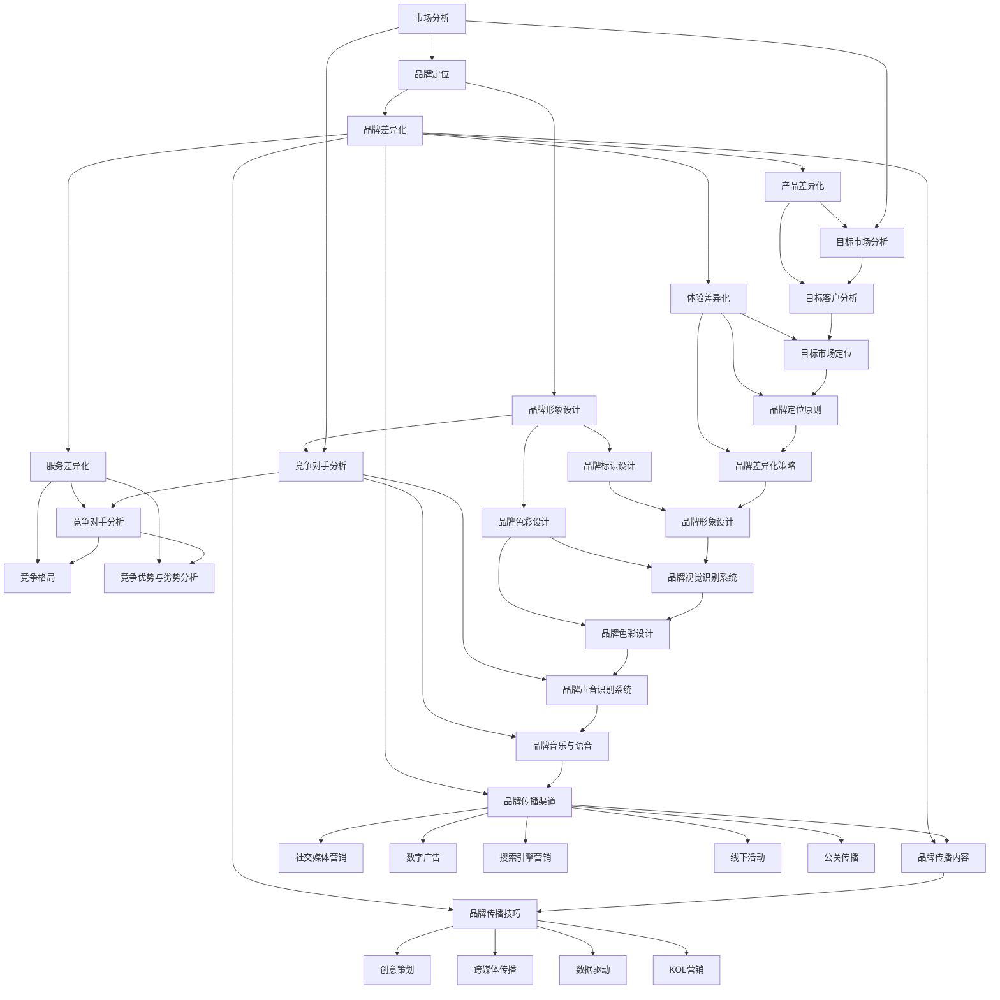

                 

### 文章标题

《创业公司的品牌建设与推广》

#### 核心关键词

- 创业公司
- 品牌建设
- 品牌推广
- 社交媒体营销
- 数字广告
- 搜索引擎营销
- 线下活动
- 效果评估

#### 摘要

本文旨在探讨创业公司的品牌建设与推广策略。通过深入分析品牌建设的重要性、核心概念、定位与差异化，以及品牌传播的策略与方法，本文为创业公司提供了系统的品牌建设与推广指南。文章还通过案例分析，展示了成功品牌建设与推广的实践案例，为创业公司提供了可操作的参考。

----------------------------------------------------------------

## 第一部分：品牌建设概述

在竞争激烈的市场环境中，创业公司的品牌建设显得尤为重要。一个成功的品牌不仅能够提升企业的市场竞争力，还能够增加消费者的信任和忠诚度。本部分将概述品牌建设的基本概念、重要性、目标和方法论。

### 1.1 品牌的定义与价值

品牌是指消费者对某一产品或服务的整体认知和评价，它包括产品的质量、性能、服务、价格等多个方面。品牌不仅仅是企业的标识，更是企业文化的象征。

**品牌的价值**可以从以下几个方面进行衡量：

1. **认知价值**：品牌能够帮助消费者快速识别和选择产品，节省其决策时间，从而提高购买意愿。
2. **情感价值**：品牌能够与消费者建立情感连接，增加消费者的满意度和忠诚度。
3. **功能价值**：品牌能够提供独特的产品或服务，满足消费者的需求，提高产品的附加值。
4. **财务价值**：品牌可以增加企业的市值，提升品牌资产的价值。

### 1.2 品牌建设的目标

品牌建设的目标主要包括以下几个方面：

1. **品牌定位**：确定品牌在市场中的定位，包括目标客户、产品特点、品牌形象等。
2. **品牌差异化**：通过独特的品牌特性，使品牌在市场中具有竞争力。
3. **品牌形象塑造**：通过视觉、听觉、触觉等多方面的设计，塑造品牌的独特形象。
4. **品牌文化传播**：通过品牌故事、品牌价值观等传递品牌文化，增强品牌的影响力。

### 1.3 品牌建设的方法论

品牌建设的方法论主要包括以下几个步骤：

1. **市场分析**：了解目标市场的需求、竞争对手的情况，为品牌定位提供依据。
2. **品牌策略制定**：明确品牌的核心价值和品牌定位，制定具体的品牌策略。
3. **品牌形象设计**：包括品牌标识、品牌色彩、品牌语言等方面的设计。
4. **品牌传播**：通过多种渠道进行品牌宣传，提高品牌知名度和美誉度。
5. **品牌管理**：通过品牌监测和评估，及时调整品牌策略，保持品牌的活力。

### 1.4 品牌建设的重要性

品牌建设对于创业公司的重要性主要体现在以下几个方面：

1. **建立市场认知**：通过品牌建设，创业公司能够在市场中建立清晰的定位和独特的品牌形象，使消费者更容易记住和选择。
2. **提升企业价值**：品牌是企业的无形资产，良好的品牌建设能够提升企业的市值和市场竞争力。
3. **增强消费者忠诚度**：品牌建设能够增强消费者对企业的信任和忠诚度，降低消费者流失率。
4. **吸引投资和合作伙伴**：品牌建设能够吸引投资者的关注，提高企业的融资能力，同时也更容易吸引合作伙伴。

在本节中，我们概述了品牌建设的基本概念、目标和重要性，为后续章节的深入探讨奠定了基础。接下来，我们将进一步探讨品牌核心概念的深度理解，包括品牌识别系统（BI）的设计原则、品牌传播策略以及品牌关系管理。

----------------------------------------------------------------

## 第二部分：品牌定位与差异化

品牌定位与差异化是品牌建设中的核心环节，它们决定了品牌在市场中的竞争力和消费者的选择。在这一部分，我们将详细探讨品牌定位与差异化的策略，包括市场分析、竞争对手分析、品牌定位原则、品牌差异化策略以及品牌形象设计。

### 2.1 市场分析

市场分析是品牌定位与差异化策略制定的基础。通过市场分析，创业公司可以了解目标市场的需求、趋势和潜在机会，从而为品牌定位提供有力支持。

#### 2.1.1 目标市场的选择

选择目标市场是品牌定位的第一步。创业公司需要根据市场需求和自身资源，进行市场细分，确定最具有潜力的目标市场。

1. **市场细分**：市场细分是将整个市场划分为若干个具有相似需求和行为的子市场。创业公司可以通过地理、人口、行为和心理等因素进行市场细分。
   
2. **目标客户分析**：在市场细分的基础上，创业公司需要对目标客户进行深入分析，了解其需求、偏好和行为特点。

   - **需求分析**：通过调研和用户访谈，了解目标客户对产品或服务的需求，包括功能需求、情感需求等。
   - **行为分析**：分析目标客户的行为习惯，包括购买行为、消费习惯等。
   - **偏好分析**：了解目标客户的偏好，包括品牌偏好、产品偏好等。

#### 2.1.2 竞争对手分析

竞争对手分析是品牌定位与差异化策略的重要环节。通过分析竞争对手的市场地位、品牌定位和营销策略，创业公司可以找到自身的竞争优势和差异化点。

1. **竞争格局**：了解市场中的竞争格局，包括主要竞争对手的市场份额、品牌定位、营销策略等。

2. **竞争优势与劣势分析**：分析竞争对手的优势和劣势，包括产品特点、服务质量、价格策略等。

3. **定位修正**：根据竞争对手分析结果，对品牌定位进行修正，确保品牌的差异化竞争策略。

### 2.2 品牌定位原则

品牌定位原则是品牌成功的关键。以下是一些常见的品牌定位原则：

#### 2.2.1 独特性

品牌定位应具有独特性，能够与竞争对手区分开来，形成差异化。独特性可以是产品的独特功能、服务的独特体验或者品牌的独特形象。

#### 2.2.2 可感知性

品牌定位应具有可感知性，能够让消费者通过感官体验和品牌互动感知品牌价值。例如，品牌可以通过独特的视觉设计、品牌故事或者品牌活动来实现品牌定位的可感知性。

#### 2.2.3 持续性

品牌定位应具有持续性，能够在品牌发展的不同阶段保持一致，避免频繁变动。持续性的品牌定位有助于建立消费者的信任和忠诚度。

#### 2.2.4 可传播性

品牌定位应具有可传播性，能够通过品牌传播渠道有效传达给目标客户。品牌定位的可传播性有助于提高品牌知名度和影响力。

### 2.3 品牌差异化策略

品牌差异化策略是品牌定位的具体实施，它包括以下几个方面：

#### 2.3.1 产品差异化

通过产品差异化，品牌可以在市场中脱颖而出。产品差异化可以包括独特的设计、创新的科技、高品质的材料或者独特的功能等。

1. **设计差异化**：通过独特的设计风格，吸引消费者的注意力，如苹果公司以简约设计著称。
2. **科技差异化**：通过创新的科技，提升产品的附加值，如特斯拉以电动汽车的领先技术为卖点。
3. **品质差异化**：通过高品质的材料和精湛的工艺，提高产品的竞争力，如瑞士手表以其高精度和卓越品质闻名。

#### 2.3.2 服务差异化

服务差异化是提升品牌竞争力的另一种方式，通过提供独特的服务体验，增强消费者的满意度和忠诚度。

1. **个性化服务**：根据消费者的个性化需求，提供定制化的服务，如奢侈品牌提供私人定制服务。
2. **快速响应**：提供快速响应和解决问题的服务，提升消费者的满意度，如亚马逊的24/7客户服务。
3. **增值服务**：提供额外的服务，增加消费者的购买价值，如酒店提供免费早餐或免费Wi-Fi。

#### 2.3.3 体验差异化

通过提供独特的品牌体验，品牌可以与消费者建立深层次的连接。体验差异化可以包括品牌文化、品牌故事或者品牌活动等。

1. **品牌文化**：通过品牌文化的传播，让消费者感受到品牌的独特价值和魅力，如耐克以“Just Do It”的品牌文化激励消费者。
2. **品牌故事**：通过讲述品牌故事，传递品牌的核心价值观和使命，增强品牌与消费者之间的情感连接。
3. **品牌活动**：通过举办品牌活动，提高品牌的知名度和影响力，如万宝路的户外探险活动。

### 2.4 品牌形象设计

品牌形象设计是品牌定位与差异化策略的重要组成部分，它包括品牌视觉识别系统（VIS）的设计、品牌色彩与视觉元素的设计以及品牌声音识别系统的设计。

#### 2.4.1 品牌视觉识别系统（VIS）的设计

品牌视觉识别系统（VIS）是品牌形象设计的基础，它包括品牌标识、品牌色彩、品牌字体等。

1. **品牌标识设计**：品牌标识是品牌的视觉符号，它能够传达品牌的核心价值和独特性。品牌标识设计应遵循简洁、易记、独特性的原则。
   
2. **品牌色彩设计**：品牌色彩是品牌视觉识别的重要组成部分，它能够传递品牌的文化和价值观。品牌色彩应与品牌标识和品牌文化相协调。

3. **品牌字体设计**：品牌字体是品牌视觉识别的一部分，它能够增强品牌的可识别性和专业性。品牌字体应与品牌标识和品牌色彩相匹配。

#### 2.4.2 品牌色彩与视觉元素的设计

品牌色彩与视觉元素的设计是品牌形象设计的关键，它包括品牌主色、辅助色以及视觉元素的设计。

1. **品牌主色**：品牌主色是品牌视觉识别的核心，它能够代表品牌的形象和价值观。品牌主色应具有独特性和视觉冲击力。

2. **辅助色**：辅助色用于品牌的点缀和强调，它能够增强品牌的视觉吸引力。辅助色应与品牌主色相协调。

3. **视觉元素**：视觉元素包括图标、图形、符号等，它们是品牌视觉识别的重要组成部分。视觉元素的设计应与品牌主色和品牌文化相一致。

#### 2.4.3 品牌声音识别系统的设计

品牌声音识别系统是品牌形象设计的一部分，它包括品牌音乐、品牌语音等。

1. **品牌音乐**：品牌音乐是品牌的听觉符号，它能够传递品牌的文化和价值观。品牌音乐应具有独特性和情感连接力。

2. **品牌语音**：品牌语音是品牌的语言表达，它能够增强品牌的可识别性和专业性。品牌语音应与品牌标识和品牌文化相一致。

### 2.5 品牌定位策略的案例分析

通过以下案例分析，我们可以更好地理解品牌定位策略的实际应用：

#### 2.5.1 案例一：苹果公司

苹果公司通过独特的产品设计和卓越的用户体验，成功建立了其品牌定位。苹果的品牌定位原则包括独特性、可感知性、持续性和可传播性。苹果的产品差异化主要体现在其创新的科技、独特的设计和高品质的材料。苹果的品牌形象设计包括简洁独特的品牌标识、协调的品牌色彩和与品牌文化相匹配的品牌字体。苹果的音乐和语音表达也具有独特的品牌特征，如苹果的MacOS启动声音和Siri的语音。

#### 2.5.2 案例二：特斯拉

特斯拉通过其创新的电动汽车技术，成功建立了其品牌定位。特斯拉的品牌定位原则同样包括独特性、可感知性、持续性和可传播性。特斯拉的产品差异化主要体现在其领先的电动汽车技术、独特的驾驶体验和高品质的材料。特斯拉的品牌形象设计包括简洁独特的品牌标识、协调的品牌色彩和与品牌文化相匹配的品牌字体。特斯拉的音乐和语音表达也具有独特的品牌特征，如特斯拉的电动汽车启动声音和AI助手的声音。

通过以上分析，我们可以看到品牌定位与差异化策略在成功品牌建设中的关键作用。品牌定位帮助品牌在市场中脱颖而出，而品牌差异化则使品牌在消费者心中具有独特的地位。接下来，我们将探讨品牌传播策略，包括社交媒体营销、数字广告和线下活动等，以帮助创业公司有效推广其品牌。

----------------------------------------------------------------

### 第三部分：品牌传播策略

品牌传播策略是品牌建设中的重要环节，它决定了品牌如何通过不同的渠道和方式传达品牌信息，提升品牌知名度和美誉度。在这一部分，我们将详细探讨品牌传播的策略，包括社交媒体营销、数字广告、搜索引擎营销（SEM）、线下活动与公关传播以及品牌传播的技巧。

#### 3.1 社交媒体营销

社交媒体营销是当前最流行的品牌传播方式之一，它通过社交媒体平台与目标受众进行互动，提高品牌知名度和用户参与度。以下是一些社交媒体营销的策略：

**1. 内容营销**

内容营销是社交媒体营销的核心，通过发布有价值、有趣、有吸引力的内容，吸引消费者的关注和互动。内容可以包括文章、视频、图片、直播等，形式多样，能够满足不同受众的需求。

**2. KOL营销**

与意见领袖（KOL）合作是社交媒体营销的有效策略。KOL具有较高的粉丝基础和影响力，能够帮助品牌快速传播信息，提升品牌曝光度和信任度。

**3. 用户生成内容（UGC）**

鼓励用户生成内容，如用户评论、用户创作等，能够提高品牌的互动性和用户忠诚度。UGC不仅能够增加品牌的可信度，还能够通过用户的真实体验来传播品牌价值。

**4. 互动营销**

通过互动性的活动，如抽奖、问答、投票等，提高消费者的参与度和品牌认知度。互动营销能够增强消费者对品牌的情感连接，提高品牌的用户忠诚度。

#### 3.2 数字广告

数字广告是通过互联网平台进行的广告投放，它具有定位精准、效果可追踪等特点。以下是一些数字广告的策略：

**1. 关键词广告**

关键词广告是根据用户搜索的关键词进行投放的广告，能够精准地触达目标受众。通过优化关键词策略，可以提高广告的点击率和转化率。

**2. 横幅广告**

横幅广告是在网页上展示的广告形式，它具有视觉冲击力，能够吸引消费者的注意力。通过设计吸引人的广告内容，可以提高广告的点击率和转化率。

**3. 视频广告**

视频广告是通过视频形式展示的广告，它具有强烈的视听冲击力，能够吸引消费者的关注。视频广告可以通过创意内容、有趣的故事情节来提高品牌的影响力和用户参与度。

**4. 精准定位广告**

通过大数据分析和用户行为分析，精准定位目标受众，提高广告的投放效果。精准定位广告可以根据用户的兴趣、行为、地理位置等信息进行个性化投放，提高广告的转化率。

#### 3.3 搜索引擎营销（SEM）

搜索引擎营销（SEM）是通过搜索引擎平台进行的广告投放，它包括搜索引擎优化（SEO）和搜索引擎营销（SEM）两部分。以下是一些SEM的策略：

**1. 关键词优化**

通过优化网站内容和结构，提高网站在搜索引擎中的排名，从而提高自然搜索流量。关键词优化包括关键词研究、关键词布局和关键词优化策略等。

**2. 搜索引擎广告**

通过购买搜索引擎广告，提高品牌在搜索引擎结果页（SERP）的曝光度和点击率。搜索引擎广告包括搜索广告、显示广告等。

**3. 数据分析**

通过数据分析，评估广告效果，优化广告投放策略。数据分析包括点击率（CTR）、转化率（CVR）等指标的分析，以及用户行为分析等。

#### 3.4 线下活动与公关传播

线下活动和公关传播是品牌传播的重要方式，它能够直接与消费者互动，提升品牌影响力和用户忠诚度。以下是一些线下活动与公关传播的策略：

**1. 线下活动**

线下活动包括产品发布会、品牌体验日、线下沙龙等，通过这些活动，品牌可以与消费者面对面互动，提高品牌知名度和用户参与度。

**2. 公关传播**

公关传播是通过媒体宣传、公众互动等方式，提高品牌知名度和美誉度。公关传播包括媒体发布、新闻稿、公关活动等。

**3. 公关危机管理**

在品牌传播过程中，可能会遇到公关危机，如负面新闻、产品问题等。公关危机管理包括危机预警、危机应对和危机恢复等，通过有效的公关危机管理，可以维护品牌声誉。

#### 3.5 品牌传播的技巧

品牌传播的技巧包括创意策划、跨媒体传播、数据驱动和KOL营销等。

**1. 创意策划**

通过创意策划，设计出吸引消费者的品牌传播内容，如独特的广告语、有趣的宣传海报等。

**2. 跨媒体传播**

通过跨媒体传播，将品牌信息传递给更广泛的受众，如将线上活动与线下活动相结合，通过多种渠道进行品牌宣传。

**3. 数据驱动**

通过数据驱动，不断优化品牌传播策略，提高品牌传播效果。数据驱动包括数据分析、用户行为分析等。

**4. KOL营销**

通过与意见领袖合作，利用他们的粉丝基础和影响力，传播品牌信息，提高品牌曝光度和用户参与度。

### 3.6 品牌传播的案例分析

**1. 案例一：Nike**

Nike通过社交媒体营销，成功提升了品牌知名度和用户忠诚度。Nike的内容营销策略包括发布有影响力的体育明星故事、运动技巧分享等，吸引消费者的关注。Nike还通过与KOL合作，如与著名运动员和健身达人合作，提高了品牌的用户参与度和信任度。

**2. 案例二：亚马逊**

亚马逊通过数字广告和搜索引擎营销，成功提升了品牌知名度和市场份额。亚马逊的关键词广告策略精准触达目标受众，提高了广告的点击率和转化率。亚马逊还通过数据分析，不断优化广告投放策略，提高了广告的投放效果。

**3. 案例三：苹果**

苹果通过线下活动和公关传播，成功提升了品牌知名度和用户忠诚度。苹果的产品发布会成为品牌传播的重要事件，吸引了全球媒体的广泛关注。苹果还通过公关传播，如与媒体合作发布新闻稿、举办品牌活动等，提高了品牌的美誉度和用户信任度。

通过以上分析，我们可以看到品牌传播策略在提升品牌知名度和用户忠诚度方面的重要作用。品牌传播策略的选择和实施，需要根据品牌的定位、目标受众和市场环境进行调整和优化。接下来，我们将探讨品牌建设与推广的效果评估，以及如何通过数据分析优化品牌传播策略。

----------------------------------------------------------------

### 第四部分：品牌建设与推广效果评估

品牌建设与推广的效果评估是确保品牌策略有效性的关键环节。通过科学、系统的评估方法，创业公司可以了解品牌建设与推广活动的实际效果，并根据评估结果进行优化调整。

#### 4.1 效果评估指标

效果评估指标是衡量品牌建设与推广活动效果的具体标准。以下是一些常用的效果评估指标：

1. **品牌知名度**：通过市场调研、问卷调查等方式，了解品牌在目标市场的知名度。
2. **品牌美誉度**：通过消费者反馈、媒体报道等方式，评估品牌在消费者和公众中的口碑。
3. **销售额**：通过销售数据，评估品牌建设与推广活动对销售业绩的影响。
4. **用户参与度**：通过社交媒体互动、线上活动参与度等，衡量消费者对品牌的参与程度。
5. **市场份额**：通过市场调查，评估品牌在市场中的份额变化。
6. **用户忠诚度**：通过用户忠诚度调查、回头客比例等，了解品牌在消费者心中的地位。

#### 4.2 数据收集与分析

数据收集与分析是品牌建设与推广效果评估的基础。以下是一些常用的数据收集与分析方法：

1. **问卷调查**：通过设计问卷调查，收集消费者的反馈和意见，了解品牌知名度和美誉度。
2. **社交媒体分析**：通过分析社交媒体平台的数据，如点赞数、评论数、分享数等，评估品牌传播的效果。
3. **销售数据分析**：通过分析销售数据，如销售额、销售渠道等，评估品牌建设与推广活动对销售业绩的贡献。
4. **用户行为分析**：通过用户行为数据，如访问量、点击率、转化率等，了解品牌在互联网上的表现。
5. **竞争分析**：通过分析竞争对手的市场表现，了解品牌在市场中的竞争地位。

#### 4.3 数据驱动的决策

数据驱动的决策是指基于数据分析结果，制定和调整品牌建设与推广策略。以下是一些数据驱动的决策方法：

1. **目标设定**：根据数据分析结果，设定具体、可量化的品牌建设与推广目标。
2. **策略调整**：根据数据分析结果，调整品牌传播渠道、内容和策略，提高品牌传播效果。
3. **资源分配**：根据数据分析结果，合理分配品牌建设与推广的资源，如广告预算、人力等。
4. **效果评估**：定期进行数据分析，评估品牌建设与推广活动的效果，并根据评估结果进行调整。

#### 4.4 品牌建设与推广的优化策略

基于效果评估和数据分析，创业公司可以制定以下优化策略：

1. **内容优化**：根据用户反馈和数据分析，调整品牌传播内容，使其更符合用户需求。
2. **渠道优化**：根据用户行为和数据分析，选择更有效的品牌传播渠道，提高品牌曝光度。
3. **互动优化**：通过增加互动活动，提高用户的参与度和忠诚度。
4. **技术优化**：利用大数据分析和人工智能技术，提高品牌传播的精准度和效果。

#### 4.5 成功案例与启示

通过以下成功案例，我们可以得到一些品牌建设与推广的启示：

**1. 案例一：可口可乐**

可口可乐通过持续的品牌建设与推广活动，成功提升了品牌知名度和用户忠诚度。可口可乐采用了多样化的品牌传播策略，如社交媒体营销、线下活动、广告宣传等。通过数据分析，可口可乐不断优化品牌传播策略，使其更加精准和有效。

**2. 案例二：苹果**

苹果通过独特的品牌定位和创新的品牌传播策略，成功塑造了其高端品牌形象。苹果的品牌传播策略包括内容营销、KOL营销、跨媒体传播等。苹果通过数据分析，不断优化品牌传播策略，使其在竞争激烈的市场中脱颖而出。

**3. 案例三：小米**

小米通过社交媒体营销和用户互动，成功提升了品牌知名度和用户忠诚度。小米采用了用户生成内容（UGC）营销策略，鼓励用户创作和分享品牌内容。通过数据分析，小米不断优化用户互动策略，提高了用户的参与度和忠诚度。

通过以上案例分析，我们可以看到，成功的品牌建设与推广需要科学的数据分析和策略调整。创业公司应充分利用数据分析工具，不断优化品牌传播策略，提高品牌建设与推广的效果。接下来，我们将探讨一些具体的品牌建设与推广工具，以帮助创业公司更有效地进行品牌管理。

----------------------------------------------------------------

### 第四部分：品牌建设与推广效果评估

品牌建设与推广效果评估是确保品牌策略有效性的关键环节。通过科学、系统的评估方法，创业公司可以了解品牌建设与推广活动的实际效果，并根据评估结果进行优化调整。

#### 4.1 效果评估指标

效果评估指标是衡量品牌建设与推广活动效果的具体标准。以下是一些常用的效果评估指标：

1. **品牌知名度**：通过市场调研、问卷调查等方式，了解品牌在目标市场的知名度。
2. **品牌美誉度**：通过消费者反馈、媒体报道等方式，评估品牌在消费者和公众中的口碑。
3. **销售额**：通过销售数据，评估品牌建设与推广活动对销售业绩的影响。
4. **用户参与度**：通过社交媒体互动、线上活动参与度等，衡量消费者对品牌的参与程度。
5. **市场份额**：通过市场调查，评估品牌在市场中的份额变化。
6. **用户忠诚度**：通过用户忠诚度调查、回头客比例等，了解品牌在消费者心中的地位。

#### 4.2 数据收集与分析

数据收集与分析是品牌建设与推广效果评估的基础。以下是一些常用的数据收集与分析方法：

1. **问卷调查**：通过设计问卷调查，收集消费者的反馈和意见，了解品牌知名度和美誉度。
2. **社交媒体分析**：通过分析社交媒体平台的数据，如点赞数、评论数、分享数等，评估品牌传播的效果。
3. **销售数据分析**：通过分析销售数据，如销售额、销售渠道等，评估品牌建设与推广活动对销售业绩的贡献。
4. **用户行为分析**：通过用户行为数据，如访问量、点击率、转化率等，了解品牌在互联网上的表现。
5. **竞争分析**：通过分析竞争对手的市场表现，了解品牌在市场中的竞争地位。

#### 4.3 数据驱动的决策

数据驱动的决策是指基于数据分析结果，制定和调整品牌建设与推广策略。以下是一些数据驱动的决策方法：

1. **目标设定**：根据数据分析结果，设定具体、可量化的品牌建设与推广目标。
2. **策略调整**：根据数据分析结果，调整品牌传播渠道、内容和策略，提高品牌传播效果。
3. **资源分配**：根据数据分析结果，合理分配品牌建设与推广的资源，如广告预算、人力等。
4. **效果评估**：定期进行数据分析，评估品牌建设与推广活动的效果，并根据评估结果进行调整。

#### 4.4 品牌建设与推广的优化策略

基于效果评估和数据分析，创业公司可以制定以下优化策略：

1. **内容优化**：根据用户反馈和数据分析，调整品牌传播内容，使其更符合用户需求。
2. **渠道优化**：根据用户行为和数据分析，选择更有效的品牌传播渠道，提高品牌曝光度。
3. **互动优化**：通过增加互动活动，提高用户的参与度和忠诚度。
4. **技术优化**：利用大数据分析和人工智能技术，提高品牌传播的精准度和效果。

#### 4.5 成功案例与启示

通过以下成功案例，我们可以得到一些品牌建设与推广的启示：

**1. 案例一：可口可乐**

可口可乐通过持续的品牌建设与推广活动，成功提升了品牌知名度和用户忠诚度。可口可乐采用了多样化的品牌传播策略，如社交媒体营销、线下活动、广告宣传等。通过数据分析，可口可乐不断优化品牌传播策略，使其更加精准和有效。

**2. 案例二：苹果**

苹果通过独特的品牌定位和创新的品牌传播策略，成功塑造了其高端品牌形象。苹果的品牌传播策略包括内容营销、KOL营销、跨媒体传播等。苹果通过数据分析，不断优化品牌传播策略，使其在竞争激烈的市场中脱颖而出。

**3. 案例三：小米**

小米通过社交媒体营销和用户互动，成功提升了品牌知名度和用户忠诚度。小米采用了用户生成内容（UGC）营销策略，鼓励用户创作和分享品牌内容。通过数据分析，小米不断优化用户互动策略，提高了用户的参与度和忠诚度。

通过以上案例分析，我们可以看到，成功的品牌建设与推广需要科学的数据分析和策略调整。创业公司应充分利用数据分析工具，不断优化品牌传播策略，提高品牌建设与推广的效果。接下来，我们将探讨一些具体的品牌建设与推广工具，以帮助创业公司更有效地进行品牌管理。

----------------------------------------------------------------

### 第五部分：成功案例分析

在探讨品牌建设与推广的过程中，成功案例的分析无疑是宝贵的财富。以下我们将通过详细分析几个知名创业公司的品牌建设与推广案例，来总结创业公司品牌建设的成功经验和教训。

#### 5.1 案例一：小米

**品牌定位与差异化**：

小米的品牌定位是“智能生活的引领者”，专注于提供高性价比的智能硬件产品。小米的品牌差异化策略主要体现在以下几个方面：

1. **技术创新**：小米在硬件技术上不断突破，推出了一系列具有创新性和前瞻性的产品，如小米手机、智能电视等。
2. **用户体验**：小米注重用户反馈，通过用户调研和社区互动，不断优化产品设计和用户体验。
3. **品牌传播**：小米采用社交媒体和线上营销，通过微博、微信等平台，与用户建立紧密的互动关系。

**品牌推广策略分析**：

小米的品牌推广策略包括以下几个方面：

1. **内容营销**：小米通过发布高质量的博客文章、视频内容，展示产品的技术亮点和用户体验。
2. **社交媒体营销**：小米在社交媒体上积极互动，通过官方账号与用户交流，增强品牌黏性。
3. **用户生成内容（UGC）**：小米鼓励用户分享使用体验，通过用户的口碑传播，提高品牌的可信度和影响力。

**经验与教训**：

小米的成功经验在于其精准的品牌定位、技术创新和用户体验。教训则在于初期品牌形象不够鲜明，需要进一步强化品牌的核心价值和差异化。

#### 5.2 案例二：锤子科技

**品牌形象设计**：

锤子科技的品牌形象设计独特，以“工匠精神”为核心价值。其品牌形象设计策略包括以下几个方面：

1. **简洁优雅**：锤子的品牌标识和产品设计风格简洁、优雅，符合现代审美。
2. **人文情怀**：锤子的品牌传播中融入了浓厚的人文情怀，体现了品牌的文化内涵。
3. **用户体验**：锤子的产品设计和用户体验注重细节，体现了品牌对用户需求的关注。

**品牌传播策略**：

锤子科技的品牌传播策略主要包括以下几个方面：

1. **产品发布会**：锤子科技通过举办产品发布会，通过独特的形式和内容，吸引媒体和消费者的关注。
2. **社交媒体营销**：锤子科技在社交媒体上积极互动，通过官方账号发布品牌信息，与用户建立情感连接。
3. **跨界合作**：锤子科技与艺术、文学等领域进行跨界合作，扩大品牌影响力。

**经验与教训**：

锤子科技的成功在于其独特的品牌形象和创新的品牌传播方式。教训在于品牌定位和差异化不够明显，导致市场竞争力不足。

#### 5.3 案例三：Dyson

**创新与品牌建设**：

Dyson以其革命性的真空吸尘器技术而闻名，其品牌建设策略包括以下几个方面：

1. **技术创新**：Dyson不断推出创新产品，如无叶风扇、空气净化器等，树立了技术领先的品牌形象。
2. **品牌国际化**：Dyson在全球范围内进行品牌推广，建立了强大的国际品牌影响力。
3. **用户体验**：Dyson注重用户反馈，通过用户调研和社区互动，不断优化产品设计和用户体验。

**品牌国际化策略**：

Dyson的品牌国际化策略包括：

1. **本地化营销**：Dyson根据不同市场的需求和文化，制定本地化的品牌传播策略。
2. **渠道拓展**：Dyson通过线上和线下渠道，将产品推广到全球市场。
3. **品牌合作**：Dyson与国际知名品牌和设计师合作，提升品牌形象和产品价值。

**经验与教训**：

Dyson的成功经验在于其持续的技术创新、国际化和用户体验策略。教训在于品牌建设过程中需要更加关注本地化营销和品牌管理的细节。

#### 5.4 案例四：Airbnb

**品牌定位与差异化**：

Airbnb的品牌定位是“共享住宿平台”，其品牌差异化策略体现在以下几个方面：

1. **用户体验**：Airbnb通过提供多样化的住宿选择和个性化的服务，满足用户的多样化需求。
2. **社区建设**：Airbnb建立了强大的社区文化，通过用户间的互动和分享，增强品牌的用户黏性。
3. **社会责任**：Airbnb通过参与社会公益活动，提升品牌的社会责任感和形象。

**品牌推广策略**：

Airbnb的品牌推广策略包括：

1. **内容营销**：Airbnb通过发布真实用户的故事和体验，展示品牌的魅力和价值。
2. **社交媒体营销**：Airbnb在社交媒体上积极互动，通过官方账号和用户生成内容，提升品牌知名度。
3. **跨界合作**：Airbnb与旅游、文化等领域进行跨界合作，扩大品牌影响力。

**经验与教训**：

Airbnb的成功经验在于其独特的品牌定位、用户体验和社区建设。教训在于品牌国际化过程中需要更加关注不同市场的文化和需求。

通过以上案例的分析，我们可以总结出创业公司品牌建设与推广的一些关键成功因素：

1. **明确的品牌定位和差异化**：品牌定位和差异化是品牌成功的基础，能够帮助品牌在市场中脱颖而出。
2. **创新的品牌形象设计**：独特的品牌形象设计能够增强品牌的认知度和吸引力。
3. **有效的品牌传播策略**：通过多种渠道和方式进行品牌传播，能够提高品牌知名度和用户忠诚度。
4. **用户参与和体验**：注重用户参与和用户体验，能够增强品牌的用户黏性和口碑。
5. **持续的品牌创新**：持续进行品牌创新，能够保持品牌的活力和竞争力。

接下来，我们将探讨品牌建设与推广中的一些工具和方法，以帮助创业公司更有效地实施品牌策略。

----------------------------------------------------------------

### 附录 A：品牌建设与推广工具推荐

在品牌建设与推广过程中，选择合适的工具和方法能够显著提升效果。以下是一些常用的品牌建设与推广工具的推荐：

#### 1. 社交媒体平台

**1.1 Facebook**：全球最大的社交媒体平台，适合进行品牌推广、用户互动和广告投放。

**1.2 Instagram**：以图片和视频为主的社交媒体，适合品牌形象展示和内容营销。

**1.3 Twitter**：实时信息传播平台，适合品牌发布新闻、推广活动和与用户互动。

**1.4 LinkedIn**：专业社交网络，适合建立品牌形象、拓展商业网络和进行人才招聘。

#### 2. 数字广告平台

**2.1 Google Ads**：谷歌广告平台，适合进行关键词广告、展示广告和视频广告的投放。

**2.2 Facebook Ads**：Facebook广告平台，提供多种广告形式和定位选项，适合进行品牌推广和用户精准定位。

**2.3 LinkedIn Ads**：LinkedIn广告平台，适合针对商业人群进行品牌宣传和营销活动。

#### 3. 数据分析工具

**3.1 Google Analytics**：谷歌分析工具，提供全面的网站流量分析和用户行为跟踪。

**3.2 Hotjar**：热图分析工具，帮助了解用户在网站上的行为和互动，优化用户体验。

**3.3 Tableau**：数据可视化工具，将复杂的数据转化为易于理解的图表和报告。

#### 4. 内容管理工具

**4.1 HubSpot**：营销自动化平台，提供内容管理、营销自动化和客户关系管理等功能。

**4.2 ContentCal**：内容日历工具，帮助品牌规划和管理内容发布。

**4.3 Hootsuite**：社交媒体管理工具，帮助品牌自动化和优化社交媒体内容发布。

#### 5. 线下活动策划工具

**5.1 Eventbrite**：活动管理平台，用于创建、宣传和跟踪线上和线下活动。

**5.2 Meetup**：社区活动平台，适合品牌组织线下活动和用户聚会。

**5.3 Trello**：项目管理工具，帮助品牌团队协作和跟踪活动进度。

通过以上工具的合理使用，创业公司可以更高效地实施品牌建设与推广策略，提高品牌知名度、用户参与度和市场竞争力。

----------------------------------------------------------------

### 附录 B：品牌建设与推广参考资料

为了更好地理解和实践品牌建设与推广的相关知识，以下是一些建议的参考资料，包括书籍、网络资源和其他相关材料。

#### 1. 书籍推荐

**1.1《定位：竞争中的战略》（Positioning: The Battle for Your Mind）** - 作者：艾尔·里斯和杰克·特劳特。这本书是品牌定位的经典之作，详细介绍了品牌定位的原则和方法。

**1.2《品牌洗脑》（Brandwashed）** - 作者：唐·舒尔茨。本书探讨了品牌传播的心理学原理，以及消费者如何被品牌影响和操纵。

**1.3《数字营销全书》（Digital Marketing: Strategy, Implementation and Practice）** - 作者：大卫·梅格。这本书全面介绍了数字营销的策略、实施方法和最佳实践。

**1.4《创业品牌建设》（Building a Successful Brand）** - 作者：凯西·刘易斯。本书提供了创业公司品牌建设的实用指南，包括品牌策略、品牌传播和品牌管理。

#### 2. 网络资源链接

**2.1 谷歌营销博客（Google Marketing Blog）** - [https://www.google.com/intl/en_us/marketing/](https://www.google.com/intl/en_us/marketing/)。谷歌营销博客提供了关于数字营销、搜索引擎营销和数据分析的最新资讯和最佳实践。

**2.2 营销杂志（MarketingProfs）** - [https://www.marketingprofs.com/](https://www.marketingprofs.com/)。营销杂志是一个专业的营销资源网站，提供了大量的营销策略、案例研究和在线课程。

**2.3 腾讯社交广告学堂** - [https://smp.tencent.com/](https://smp.tencent.com/)。腾讯社交广告学堂提供了丰富的社交媒体广告知识和案例分析，适用于品牌建设和推广。

#### 3. 其他相关材料

**3.1 品牌咨询公司报告** - 如麦肯锡（McKinsey & Company）、贝恩公司（Bain & Company）等知名咨询公司发布的关于品牌建设与推广的年度报告，提供了行业趋势和市场分析。

**3.2 教育视频平台课程** - 如Coursera、Udemy等教育平台提供了关于市场营销和品牌建设的在线课程，有助于系统地学习和掌握相关知识。

通过阅读这些参考资料，创业公司可以深入了解品牌建设与推广的理论和实践，从而制定出更有效的品牌策略，提升品牌竞争力。

----------------------------------------------------------------

### 附录 C：品牌建设流程

品牌建设是一个系统性的过程，它涉及到从品牌定位、品牌传播到品牌管理的多个环节。以下是一个品牌建设流程的Mermaid流程图，帮助读者理解品牌建设的主要步骤和逻辑关系。

该流程图从市场分析开始，逐步深入到品牌定位、差异化策略、品牌形象设计，再到品牌传播渠道和内容策略，形成一个闭环。每个环节都是品牌建设的重要组成部分，相互关联，共同构成了一个完整的品牌建设流程。

通过这个流程图，创业公司可以清晰地了解品牌建设的过程和步骤，从而有针对性地制定和实施品牌策略，提升品牌的市场竞争力和影响力。接下来，我们将进一步探讨品牌建设中的核心算法原理和公式，以提供更深层次的技术支持。

----------------------------------------------------------------

### 附录 D：品牌建设中的核心算法原理与公式

在品牌建设中，一些核心算法原理和数学模型有助于理解和量化品牌价值、评估品牌影响力以及优化品牌传播策略。以下是一些常用的算法原理和公式：

#### 1. 品牌价值评估模型

品牌价值评估模型可以帮助企业量化品牌的市场价值。以下是一个简单的品牌价值评估模型：

$$
BV = \frac{1}{2} \left[ (\text{销售额} \times \text{品牌溢价率}) - \text{品牌维护成本} \right]
$$

其中：
- \(BV\) 是品牌价值。
- 销售额是根据市场调查得到的品牌销售额。
- 品牌溢价率是指品牌对产品价格的额外提升比例。
- 品牌维护成本包括品牌营销、维护和管理等费用。

#### 2. 品牌影响力评估模型

品牌影响力评估模型可以帮助企业了解品牌在市场中的影响力。以下是一个品牌影响力评估模型：

$$
CI = \frac{1}{N} \sum_{i=1}^{N} \frac{SI_i}{BI_i}
$$

其中：
- \(CI\) 是品牌影响力指数。
- \(N\) 是参与评估的消费者人数。
- \(SI_i\) 是第 \(i\) 位消费者对品牌的满意度评分。
- \(BI_i\) 是第 \(i\) 位消费者对品牌的信任度评分。

#### 3. 营销效果评估模型

营销效果评估模型可以帮助企业评估营销活动的效果。以下是一个简单的营销效果评估模型：

$$
ME = \frac{\text{转化率} \times \text{销售转化率}}{\text{营销成本}}
$$

其中：
- \(ME\) 是营销效果指数。
- 转化率是指参与营销活动的用户中完成购买的比例。
- 销售转化率是指完成购买的用户中，通过营销活动引导购买的比例。
- 营销成本是指营销活动的总投入。

#### 4. 社交媒体影响力评估模型

社交媒体影响力评估模型可以帮助企业了解品牌在社交媒体上的影响力。以下是一个简单的社交媒体影响力评估模型：

$$
SI = \frac{\text{粉丝数} \times \text{互动率}}{\text{发布频率}}
$$

其中：
- \(SI\) 是社交媒体影响力指数。
- 粉丝数是品牌在社交媒体平台上的关注者数量。
- 互动率是指品牌发布内容获得的点赞、评论、分享等互动次数。
- 发布频率是品牌在社交媒体上的平均发布频率。

#### 5. 品牌忠诚度评估模型

品牌忠诚度评估模型可以帮助企业了解消费者的品牌忠诚度。以下是一个简单的品牌忠诚度评估模型：

$$
LT = \frac{\text{重复购买率} \times \text{平均购买间隔}}{\text{品牌选择比例}}
$$

其中：
- \(LT\) 是品牌忠诚度指数。
- 重复购买率是指消费者在一定时间内重复购买同一品牌产品的比例。
- 平均购买间隔是消费者两次购买之间的平均时间。
- 品牌选择比例是指消费者选择该品牌的产品占总购买次数的比例。

通过这些核心算法原理和公式，创业公司可以更科学、系统地评估品牌价值、影响力以及营销效果，从而优化品牌建设和推广策略，提高品牌的竞争力和市场地位。

----------------------------------------------------------------

### 附录 E：社交媒体营销案例分析

社交媒体营销在品牌建设中扮演着至关重要的角色，以下我们将通过详细分析几个典型的社交媒体营销案例，探讨其成功的原因和可借鉴的经验。

#### 5.1 案例一：麦当劳的“#我要麦辣”活动

**案例概述**：

麦当劳在2019年发起了一场名为“#我要麦辣”的社交媒体营销活动，旨在推广其新品——麦辣鸡腿汉堡。该活动通过社交媒体平台（如微博、微信等）发起，鼓励消费者参与互动，分享他们的麦辣体验。

**成功原因**：

1. **话题性**：活动围绕新品麦辣鸡腿汉堡展开，具有话题性，能够吸引消费者的关注。
2. **互动性**：活动鼓励消费者分享他们的麦辣体验，提高了用户的参与度。
3. **创意性**：通过创新性的互动方式（如视频、图片等），使活动更具吸引力。
4. **KOL营销**：邀请网红和KOL参与活动，利用他们的粉丝基础扩大活动的影响力。

**可借鉴经验**：

- **话题性**：选择具有话题性和吸引力的产品或主题，以提高活动的吸引力。
- **互动性**：设计互动性强的活动，鼓励用户参与，提高用户黏性。
- **创意性**：创新活动形式和内容，使活动更具吸引力。
- **KOL营销**：与意见领袖合作，利用他们的影响力扩大活动的影响力。

#### 5.2 案例二：星巴克的红杯活动

**案例概述**：

星巴克在每年的12月发起了一场名为“红杯季”的社交媒体营销活动。活动期间，顾客购买指定饮品即可获得一个红色的星巴克杯，并在社交媒体上分享使用红杯的照片，参与抽奖。

**成功原因**：

1. **品牌文化**：活动紧扣星巴克的品牌文化，传递了品牌的温暖和关爱。
2. **用户互动**：活动鼓励用户分享使用红杯的照片，增强了用户与品牌的互动。
3. **视觉营销**：通过红杯这一视觉元素，提高了品牌的视觉辨识度。
4. **口碑传播**：用户在社交媒体上的分享，形成了口碑效应，提高了品牌的美誉度。

**可借鉴经验**：

- **品牌文化**：围绕品牌文化进行营销活动，传递品牌的核心价值观。
- **用户互动**：设计互动性强的活动，提高用户的参与度。
- **视觉营销**：通过视觉元素提高品牌的辨识度。
- **口碑传播**：利用用户口碑进行品牌传播，提高品牌的美誉度。

#### 5.3 案例三：可口可乐的“#分享快乐”活动

**案例概述**：

可口可乐在2018年发起了一场名为“#分享快乐”的社交媒体营销活动，鼓励消费者在社交媒体上分享快乐时刻，并用可口可乐庆祝。

**成功原因**：

1. **情感连接**：活动通过情感连接，让消费者感受到品牌的温暖和关怀。
2. **用户参与**：活动鼓励用户分享自己的快乐故事，提高了用户的参与度。
3. **创意性**：活动形式多样，包括短视频、图片、文字等，增加了活动的趣味性。
4. **KOL营销**：与知名KOL合作，利用他们的影响力扩大活动的影响力。

**可借鉴经验**：

- **情感连接**：通过情感化的内容，与消费者建立情感连接。
- **用户参与**：设计互动性强的活动，鼓励用户参与。
- **创意性**：创新活动形式和内容，提高活动的吸引力。
- **KOL营销**：与意见领袖合作，扩大活动的影响力。

通过以上案例分析，我们可以看到，成功的社交媒体营销活动需要具备话题性、互动性、创意性和情感连接等特点。创业公司在进行社交媒体营销时，可以借鉴这些成功经验，制定符合自身品牌特点和市场需求的营销策略。

### 附录 F：数字广告与搜索引擎营销（SEM）案例分析

数字广告与搜索引擎营销（SEM）在品牌建设与推广中发挥着重要作用，以下我们将通过详细分析几个典型的数字广告与SEM案例，探讨其成功的原因和可借鉴的经验。

#### 5.1 案例一：亚马逊的“黑色星期五”广告活动

**案例概述**：

亚马逊在每年的黑色星期五期间推出一系列数字广告活动，吸引消费者购买产品。这些广告活动包括搜索引擎广告、展示广告和视频广告等，通过精准定位和创意内容，提高了广告的转化率和品牌知名度。

**成功原因**：

1. **精准定位**：亚马逊通过大数据分析，精准定位目标受众，提高广告的点击率和转化率。
2. **创意内容**：广告内容设计独特，吸引了消费者的注意力，提高了广告的吸引力。
3. **跨渠道整合**：亚马逊将搜索引擎广告、展示广告和视频广告等多种广告形式相结合，实现跨渠道整合，提高广告的整体效果。
4. **用户互动**：广告活动鼓励用户参与互动，如点击、分享等，提高了用户的参与度和品牌忠诚度。

**可借鉴经验**：

- **精准定位**：通过大数据分析，精准定位目标受众，提高广告的投放效果。
- **创意内容**：设计独特、吸引人的广告内容，提高广告的吸引力。
- **跨渠道整合**：结合多种广告形式，实现跨渠道整合，提高广告的整体效果。
- **用户互动**：鼓励用户参与互动，提高用户的参与度和忠诚度。

#### 5.2 案例二：宜家的“寻找最酷的家”活动

**案例概述**：

宜家在2018年发起了一场名为“寻找最酷的家”的数字广告活动，通过搜索引擎广告和社交媒体广告，鼓励消费者分享自己在家中使用的宜家产品，评选出最酷的家。

**成功原因**：

1. **用户参与**：活动鼓励用户参与，提高用户的参与度和品牌忠诚度。
2. **社交媒体传播**：活动在社交媒体上广泛传播，提高了品牌知名度和用户互动。
3. **创意内容**：广告内容设计独特，吸引了消费者的注意力，提高了广告的吸引力。
4. **KOL营销**：与知名KOL合作，利用他们的影响力扩大活动的影响力。

**可借鉴经验**：

- **用户参与**：设计互动性强的活动，鼓励用户参与，提高品牌忠诚度。
- **社交媒体传播**：利用社交媒体平台，提高品牌知名度和用户互动。
- **创意内容**：设计独特、吸引人的广告内容，提高广告的吸引力。
- **KOL营销**：与意见领袖合作，扩大活动的影响力。

#### 5.3 案例三：微软的“Surface”产品推广活动

**案例概述**：

微软在2019年通过数字广告和搜索引擎营销，推广其Surface系列产品。广告活动包括搜索引擎广告、展示广告和视频广告等，通过精准定位和创意内容，提高了产品的销售量和品牌知名度。

**成功原因**：

1. **精准定位**：微软通过大数据分析，精准定位目标受众，提高广告的点击率和转化率。
2. **创意内容**：广告内容设计独特，吸引了消费者的注意力，提高了广告的吸引力。
3. **品牌传播**：广告活动结合了搜索引擎广告、展示广告和视频广告等多种形式，实现品牌传播的全面覆盖。
4. **数据分析**：通过数据分析，不断优化广告投放策略，提高广告的投放效果。

**可借鉴经验**：

- **精准定位**：通过大数据分析，精准定位目标受众，提高广告的投放效果。
- **创意内容**：设计独特、吸引人的广告内容，提高广告的吸引力。
- **品牌传播**：结合多种广告形式，实现品牌传播的全面覆盖。
- **数据分析**：通过数据分析，不断优化广告投放策略，提高广告的投放效果。

通过以上案例分析，我们可以看到，成功的数字广告与SEM活动需要具备精准定位、创意内容、用户参与和数据分析等特点。创业公司在进行数字广告与SEM时，可以借鉴这些成功经验，制定符合自身品牌特点和市场需求的营销策略。

