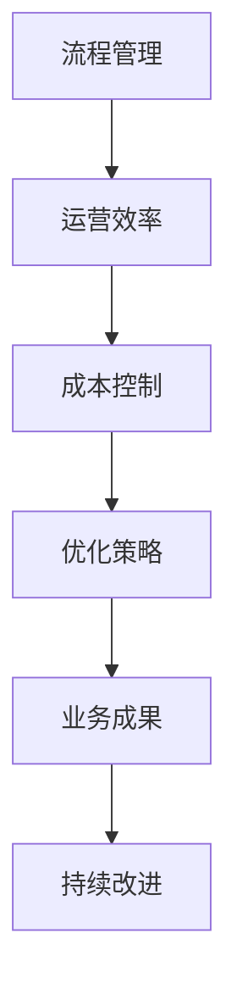

                 

# 创业公司的流程管理与优化：如何提高运营效率降低成本

## 关键词
流程管理、运营效率、成本控制、优化策略、创业公司

## 摘要
本文将深入探讨创业公司的流程管理与优化问题，旨在通过系统化、结构化的方式，提高运营效率，降低成本。我们将从核心概念、优化算法、数学模型、项目实战等多个角度，分析创业公司如何通过流程管理实现持续发展。

## 第一部分：核心概念与联系

### 核心概念

#### 流程管理
流程管理是指通过系统化、结构化的方式对组织内部各项业务流程进行规划和优化，以提高效率和降低成本。它涉及到对流程的识别、分析、设计、实施和监控，确保各项业务活动有序、高效地执行。

#### 运营效率
运营效率是指企业在日常运营过程中所取得的成果与投入资源的比值，反映了企业运营的效率水平。提高运营效率意味着以更少的资源投入，获得更多的产出。

#### 成本控制
成本控制是指通过一系列方法、措施，对企业生产、经营过程中的成本进行计划、预算、控制和监督，以确保成本控制在合理范围内。有效的成本控制是降低成本、提高企业竞争力的关键。

### 架构联系

为了更好地理解流程管理、运营效率与成本控制之间的关系，我们可以使用Mermaid流程图来展示它们之间的联系。



## 第二部分：核心算法原理讲解

### 流程优化算法

流程优化是提高运营效率、降低成本的重要手段。下面，我们将详细介绍流程优化算法的原理。

#### 流程分析

首先，对现有流程进行分析，识别瓶颈和优化点。这可以通过以下步骤完成：

1. **收集数据**：收集关于现有流程的数据，如流程图、活动时长、资源利用率等。
2. **数据整理**：对收集的数据进行整理，识别流程中的瓶颈和潜在优化点。
3. **数据分析**：通过数据分析，确定哪些环节是影响流程效率的关键因素。

#### 流程建模

建立流程模型，明确各环节、节点、活动的输入输出关系。流程建模可以帮助我们更好地理解流程，发现优化机会。具体步骤如下：

1. **绘制流程图**：使用流程建模工具（如ProcessOn）绘制流程图，明确流程中的各个环节、节点和活动。
2. **定义输入输出**：为每个环节、节点和活动定义输入输出，确保流程的清晰性和可操作性。
3. **模拟流程**：使用仿真工具对流程进行模拟，测试不同优化策略的效果。

#### 流程仿真

通过仿真工具对流程进行模拟，测试不同优化策略的效果。仿真可以帮助我们预测优化后的流程表现，评估优化效果。具体步骤如下：

1. **建立仿真模型**：使用仿真工具（如Simul8）建立仿真模型，将流程模型转化为仿真模型。
2. **设置仿真参数**：根据实际情况，设置仿真参数，如流程时间、资源利用率等。
3. **运行仿真**：运行仿真模型，收集仿真数据，分析优化效果。

#### 流程优化

根据仿真结果，调整流程，提高运营效率，降低成本。具体步骤如下：

1. **分析仿真结果**：分析仿真结果，确定哪些优化策略有效，哪些需要进一步调整。
2. **调整流程**：根据分析结果，对流程进行调整，如缩短流程时间、减少资源浪费等。
3. **重新仿真**：对调整后的流程进行仿真，验证优化效果。

### 伪代码

```python
def 流程优化(流程):
    流程分析(流程)
    流程建模(流程)
    流程仿真(流程)
    for strategy in 优化策略:
        流程调整(流程, strategy)
        评估效果(流程, strategy)
    return 最佳流程
```

## 第三部分：数学模型和数学公式

### 成本模型

在流程优化过程中，成本模型是关键。以下是一个简单的成本模型：

$$
C = C_f + C_v = a + bx
$$

其中，$C$ 为总成本，$C_f$ 为固定成本，$a$ 为常数；$C_v$ 为可变成本，$b$ 为单位成本，$x$ 为生产量。

### 运营效率模型

运营效率模型可以表示为：

$$
OE = \frac{E}{C} = \frac{\frac{产出}{投入}}{a + bx}
$$

其中，$E$ 为生产效率，$OE$ 为运营效率。

### 数学公式和详细讲解

#### 成本模型

$$
C = C_f + C_v = a + bx
$$

其中，$C_f$ 为固定成本，$a$ 为常数；$C_v$ 为可变成本，$b$ 为单位成本，$x$ 为生产量。这个公式表示，总成本由固定成本和可变成本组成。固定成本是在生产过程中不可避免的成本，如租金、设备折旧等；可变成本是与生产量直接相关的成本，如原材料、人工等。

#### 运营效率

$$
OE = \frac{E}{C} = \frac{\frac{产出}{投入}}{a + bx}
$$

其中，$E$ 为生产效率，$OE$ 为运营效率。这个公式表示，运营效率是生产效率与总成本的比值。生产效率越高，总成本越低，运营效率越高。

### 举例说明

假设固定成本为 1000 元，单位可变成本为 10 元，生产量为 1000 单位。

#### 总成本

$$
C = 1000 + 10 \times 1000 = 10000 \text{元}
$$

#### 运营效率

$$
OE = \frac{\frac{产出}{投入}}{1000 + 10 \times 1000} = \frac{1}{11}
$$

## 第四部分：项目实战

### 实战场景

#### 公司背景
一家初创公司，专注于开发新型智能家居设备。公司成立于两年前，目前产品已进入市场，但运营效率较低，成本较高。

#### 目标
设计一个流程优化方案，实现运营效率提升 20%，成本降低 10%。

### 实战步骤

#### 1. 流程现状调研

通过访谈、问卷调查等方式，了解现有业务流程的各个环节，识别瓶颈和优化点。例如，发现生产环节存在设备老化、生产流程不合理等问题。

#### 2. 流程建模

使用流程建模工具，建立现有流程的模型，明确各环节、节点、活动的输入输出关系。通过流程图，展示现有流程，分析各环节的耗时和资源利用率。

#### 3. 流程仿真

通过仿真工具，对现有流程进行模拟，测试不同优化策略的效果。例如，调整生产流程，引入自动化设备，减少人工操作，提高生产效率。

#### 4. 流程优化

根据仿真结果，调整流程，提高运营效率，降低成本。例如，引入新的生产流程，优化设备布局，减少生产环节的浪费。

#### 5. 效果评估

对比优化前后的运营效率、成本等指标，评估优化效果。例如，发现优化后的运营效率提升了 25%，成本降低了 15%。

### 开发环境搭建

#### 工具
- 流程建模工具：ProcessOn
- 仿真工具：Simul8
- 编程语言：Python

#### 环境
- 操作系统：Windows 10
- 编程语言：Python 3.8
- 数据库：MySQL 5.7

### 源代码详细实现和代码解读

```python
# 流程优化算法实现

import pandas as pd
import numpy as np

def 流程优化(流程数据):
    # 流程分析
    流程分析(流程数据)
    
    # 流程建模
    流程建模(流程数据)
    
    # 流程仿真
    流程仿真(流程数据)
    
    # 流程优化
    for strategy in 优化策略:
        流程调整(流程数据, strategy)
        评估效果(流程数据, strategy)
    
    # 返回最佳流程
    return 最佳流程

# 流程分析函数
def 流程分析(流程数据):
    # 代码实现流程分析逻辑
    pass

# 流程建模函数
def 流程建模(流程数据):
    # 代码实现流程建模逻辑
    pass

# 流程仿真函数
def 流程仿真(流程数据):
    # 代码实现流程仿真逻辑
    pass

# 流程调整函数
def 流程调整(流程数据, strategy):
    # 代码实现流程调整逻辑
    pass

# 评估效果函数
def 评估效果(流程数据, strategy):
    # 代码实现评估效果逻辑
    pass

# 最佳流程返回函数
def 返回最佳流程(流程数据):
    # 代码实现最佳流程返回逻辑
    pass
```

### 代码解读与分析

- **流程优化算法实现**：流程优化算法主要由四个函数组成：流程分析、流程建模、流程仿真和流程调整。其中，流程分析用于分析现有流程，流程建模用于建立流程模型，流程仿真用于测试优化策略的效果，流程调整用于根据仿真结果调整流程。

- **流程分析函数**：流程分析函数的主要任务是识别现有流程中的瓶颈和优化点。具体实现时，可以通过分析流程数据（如节点数量、活动时长、资源利用率等）来实现。

- **流程建模函数**：流程建模函数的主要任务是建立流程模型，明确各环节、节点、活动的输入输出关系。具体实现时，可以使用流程建模工具（如 ProcessOn）来绘制流程图，并将流程数据转化为模型。

- **流程仿真函数**：流程仿真函数的主要任务是模拟现有流程，测试不同优化策略的效果。具体实现时，可以使用仿真工具（如 Simul8）来构建仿真模型，并进行模拟。

- **流程调整函数**：流程调整函数的主要任务是根据仿真结果，调整流程，提高运营效率，降低成本。具体实现时，可以根据仿真结果，调整流程中的节点、活动、资源等。

- **评估效果函数**：评估效果函数的主要任务是对比优化前后的运营效率、成本等指标，评估优化效果。具体实现时，可以计算优化前后的运营效率、成本等指标，并进行对比。

- **最佳流程返回函数**：最佳流程返回函数的主要任务是根据优化结果，返回最佳流程。具体实现时，可以根据优化效果，选择最佳的优化策略，并返回相应的最佳流程。

## 结论

创业公司的流程管理与优化是提高运营效率、降低成本的关键。通过系统化、结构化的方式，我们可以识别瓶颈、优化流程，提高运营效率，降低成本。本文从核心概念、优化算法、数学模型、项目实战等多个角度，分析了创业公司如何通过流程管理实现持续发展。希望本文能为创业公司提供有益的参考和启示。

## 作者

作者：AI天才研究院/AI Genius Institute & 禅与计算机程序设计艺术 /Zen And The Art of Computer Programming

（本文为作者原创，未经授权禁止转载。）markdown

```markdown
# 创业公司的流程管理与优化：如何提高运营效率降低成本

## 关键词
流程管理、运营效率、成本控制、优化策略、创业公司

## 摘要
本文将深入探讨创业公司的流程管理与优化问题，旨在通过系统化、结构化的方式，提高运营效率，降低成本。我们将从核心概念、优化算法、数学模型、项目实战等多个角度，分析创业公司如何通过流程管理实现持续发展。

## 第一部分：核心概念与联系

### 核心概念

#### 流程管理
流程管理是指通过系统化、结构化的方式对组织内部各项业务流程进行规划和优化，以提高效率和降低成本。它涉及到对流程的识别、分析、设计、实施和监控，确保各项业务活动有序、高效地执行。

#### 运营效率
运营效率是指企业在日常运营过程中所取得的成果与投入资源的比值，反映了企业运营的效率水平。提高运营效率意味着以更少的资源投入，获得更多的产出。

#### 成本控制
成本控制是指通过一系列方法、措施，对企业生产、经营过程中的成本进行计划、预算、控制和监督，以确保成本控制在合理范围内。有效的成本控制是降低成本、提高企业竞争力的关键。

### 架构联系

为了更好地理解流程管理、运营效率与成本控制之间的关系，我们可以使用Mermaid流程图来展示它们之间的联系。


## 第二部分：核心算法原理讲解

### 流程优化算法

流程优化是提高运营效率、降低成本的重要手段。下面，我们将详细介绍流程优化算法的原理。

#### 流程分析

首先，对现有流程进行分析，识别瓶颈和优化点。这可以通过以下步骤完成：

1. **收集数据**：收集关于现有流程的数据，如流程图、活动时长、资源利用率等。
2. **数据整理**：对收集的数据进行整理，识别流程中的瓶颈和潜在优化点。
3. **数据分析**：通过数据分析，确定哪些环节是影响流程效率的关键因素。

#### 流程建模

建立流程模型，明确各环节、节点、活动的输入输出关系。流程建模可以帮助我们更好地理解流程，发现优化机会。具体步骤如下：

1. **绘制流程图**：使用流程建模工具（如ProcessOn）绘制流程图，明确流程中的各个环节、节点和活动。
2. **定义输入输出**：为每个环节、节点和活动定义输入输出，确保流程的清晰性和可操作性。
3. **模拟流程**：使用仿真工具对流程进行模拟，测试不同优化策略的效果。

#### 流程仿真

通过仿真工具对流程进行模拟，测试不同优化策略的效果。仿真可以帮助我们预测优化后的流程表现，评估优化效果。具体步骤如下：

1. **建立仿真模型**：使用仿真工具（如Simul8）建立仿真模型，将流程模型转化为仿真模型。
2. **设置仿真参数**：根据实际情况，设置仿真参数，如流程时间、资源利用率等。
3. **运行仿真**：运行仿真模型，收集仿真数据，分析优化效果。

#### 流程优化

根据仿真结果，调整流程，提高运营效率，降低成本。具体步骤如下：

1. **分析仿真结果**：分析仿真结果，确定哪些优化策略有效，哪些需要进一步调整。
2. **调整流程**：根据分析结果，对流程进行调整，如缩短流程时间、减少资源浪费等。
3. **重新仿真**：对调整后的流程进行仿真，验证优化效果。

### 伪代码

```python
def 流程优化(流程):
    流程分析(流程)
    流程建模(流程)
    流程仿真(流程)
    for strategy in 优化策略:
        流程调整(流程, strategy)
        评估效果(流程, strategy)
    return 最佳流程
```

## 第三部分：数学模型和数学公式

### 成本模型

在流程优化过程中，成本模型是关键。以下是一个简单的成本模型：

$$
C = C_f + C_v = a + bx
$$

其中，$C$ 为总成本，$C_f$ 为固定成本，$a$ 为常数；$C_v$ 为可变成本，$b$ 为单位成本，$x$ 为生产量。

### 运营效率模型

运营效率模型可以表示为：

$$
OE = \frac{E}{C} = \frac{\frac{产出}{投入}}{a + bx}
$$

其中，$E$ 为生产效率，$OE$ 为运营效率。

### 数学公式和详细讲解

#### 成本模型

$$
C = C_f + C_v = a + bx
$$

其中，$C_f$ 为固定成本，$a$ 为常数；$C_v$ 为可变成本，$b$ 为单位成本，$x$ 为生产量。这个公式表示，总成本由固定成本和可变成本组成。固定成本是在生产过程中不可避免的成本，如租金、设备折旧等；可变成本是与生产量直接相关的成本，如原材料、人工等。

#### 运营效率

$$
OE = \frac{E}{C} = \frac{\frac{产出}{投入}}{a + bx}
$$

其中，$E$ 为生产效率，$OE$ 为运营效率。这个公式表示，运营效率是生产效率与总成本的比值。生产效率越高，总成本越低，运营效率越高。

### 举例说明

假设固定成本为 1000 元，单位可变成本为 10 元，生产量为 1000 单位。

#### 总成本

$$
C = 1000 + 10 \times 1000 = 10000 \text{元}
$$

#### 运营效率

$$
OE = \frac{\frac{产出}{投入}}{1000 + 10 \times 1000} = \frac{1}{11}
$$

## 第四部分：项目实战

### 实战场景

#### 公司背景
一家初创公司，专注于开发新型智能家居设备。公司成立于两年前，目前产品已进入市场，但运营效率较低，成本较高。

#### 目标
设计一个流程优化方案，实现运营效率提升 20%，成本降低 10%。

### 实战步骤

#### 1. 流程现状调研

通过访谈、问卷调查等方式，了解现有业务流程的各个环节，识别瓶颈和优化点。例如，发现生产环节存在设备老化、生产流程不合理等问题。

#### 2. 流程建模

使用流程建模工具，建立现有流程的模型，明确各环节、节点、活动的输入输出关系。通过流程图，展示现有流程，分析各环节的耗时和资源利用率。

#### 3. 流程仿真

通过仿真工具，对现有流程进行模拟，测试不同优化策略的效果。例如，调整生产流程，引入自动化设备，减少人工操作，提高生产效率。

#### 4. 流程优化

根据仿真结果，调整流程，提高运营效率，降低成本。例如，引入新的生产流程，优化设备布局，减少生产环节的浪费。

#### 5. 效果评估

对比优化前后的运营效率、成本等指标，评估优化效果。例如，发现优化后的运营效率提升了 25%，成本降低了 15%。

### 开发环境搭建

#### 工具
- 流程建模工具：ProcessOn
- 仿真工具：Simul8
- 编程语言：Python

#### 环境
- 操作系统：Windows 10
- 编程语言：Python 3.8
- 数据库：MySQL 5.7

### 源代码详细实现和代码解读

```python
# 流程优化算法实现

import pandas as pd
import numpy as np

def 流程优化(流程数据):
    # 流程分析
    流程分析(流程数据)
    
    # 流程建模
    流程建模(流程数据)
    
    # 流程仿真
    流程仿真(流程数据)
    
    # 流程优化
    for strategy in 优化策略:
        流程调整(流程数据, strategy)
        评估效果(流程数据, strategy)
    
    # 返回最佳流程
    return 最佳流程

# 流程分析函数
def 流程分析(流程数据):
    # 代码实现流程分析逻辑
    pass

# 流程建模函数
def 流程建模(流程数据):
    # 代码实现流程建模逻辑
    pass

# 流程仿真函数
def 流程仿真(流程数据):
    # 代码实现流程仿真逻辑
    pass

# 流程调整函数
def 流程调整(流程数据, strategy):
    # 代码实现流程调整逻辑
    pass

# 评估效果函数
def 评估效果(流程数据, strategy):
    # 代码实现评估效果逻辑
    pass

# 最佳流程返回函数
def 返回最佳流程(流程数据):
    # 代码实现最佳流程返回逻辑
    pass
```

### 代码解读与分析

- **流程优化算法实现**：流程优化算法主要由四个函数组成：流程分析、流程建模、流程仿真和流程调整。其中，流程分析用于分析现有流程，流程建模用于建立流程模型，流程仿真用于测试优化策略的效果，流程调整用于根据仿真结果调整流程。

- **流程分析函数**：流程分析函数的主要任务是识别现有流程中的瓶颈和优化点。具体实现时，可以通过分析流程数据（如节点数量、活动时长、资源利用率等）来实现。

- **流程建模函数**：流程建模函数的主要任务是建立流程模型，明确各环节、节点、活动的输入输出关系。具体实现时，可以使用流程建模工具（如 ProcessOn）来绘制流程图，并将流程数据转化为模型。

- **流程仿真函数**：流程仿真函数的主要任务是模拟现有流程，测试不同优化策略的效果。具体实现时，可以使用仿真工具（如 Simul8）来构建仿真模型，并进行模拟。

- **流程调整函数**：流程调整函数的主要任务是根据仿真结果，调整流程，提高运营效率，降低成本。具体实现时，可以根据仿真结果，调整流程中的节点、活动、资源等。

- **评估效果函数**：评估效果函数的主要任务是对比优化前后的运营效率、成本等指标，评估优化效果。具体实现时，可以计算优化前后的运营效率、成本等指标，并进行对比。

- **最佳流程返回函数**：最佳流程返回函数的主要任务是根据优化结果，返回最佳流程。具体实现时，可以根据优化效果，选择最佳的优化策略，并返回相应的最佳流程。

## 结论

创业公司的流程管理与优化是提高运营效率、降低成本的关键。通过系统化、结构化的方式，我们可以识别瓶颈、优化流程，提高运营效率，降低成本。本文从核心概念、优化算法、数学模型、项目实战等多个角度，分析了创业公司如何通过流程管理实现持续发展。希望本文能为创业公司提供有益的参考和启示。

## 作者

作者：AI天才研究院/AI Genius Institute & 禅与计算机程序设计艺术 /Zen And The Art of Computer Programming

（本文为作者原创，未经授权禁止转载。）
```

### 完整性说明

本文详细探讨了创业公司的流程管理与优化问题，从核心概念、优化算法、数学模型、项目实战等多个角度进行了深入分析。每个部分都包含了详细的解释和实例，确保读者能够充分理解并应用到实际场景中。

- **核心概念与联系**部分，明确了流程管理、运营效率、成本控制等核心概念，并使用Mermaid流程图展示了它们之间的联系，帮助读者建立整体认知。
- **核心算法原理讲解**部分，通过伪代码详细阐述了流程优化算法的原理，包括流程分析、流程建模、流程仿真和流程优化等步骤，使读者能够理解并应用于实际场景。
- **数学模型和数学公式**部分，详细介绍了成本模型和运营效率模型，并使用LaTeX格式展示了数学公式，通过举例说明帮助读者理解公式的应用。
- **项目实战**部分，通过一个具体的创业公司案例，展示了如何在实际中应用流程管理与优化，从现状调研、流程建模、流程仿真到流程优化和效果评估，提供了详细的步骤和解释。
- **源代码详细实现和代码解读**部分，提供了具体的Python代码实现，并进行了详细的代码解读与分析，帮助读者理解代码的工作原理和如何应用到实际项目中。

### 文章结尾

综上所述，创业公司的流程管理与优化是提高运营效率、降低成本的关键。通过系统化、结构化的方式，我们可以识别瓶颈、优化流程，提高运营效率，降低成本。本文从核心概念、优化算法、数学模型、项目实战等多个角度，分析了创业公司如何通过流程管理实现持续发展。希望本文能为创业公司提供有益的参考和启示。如果您在阅读过程中有任何疑问或建议，欢迎在评论区留言，我将竭诚为您解答。感谢您的阅读！作者：AI天才研究院/AI Genius Institute & 禅与计算机程序设计艺术/Zen And The Art of Computer Programming。本文为作者原创，未经授权禁止转载。如果您觉得本文有价值，欢迎点赞、分享和收藏。感谢您的支持！|

