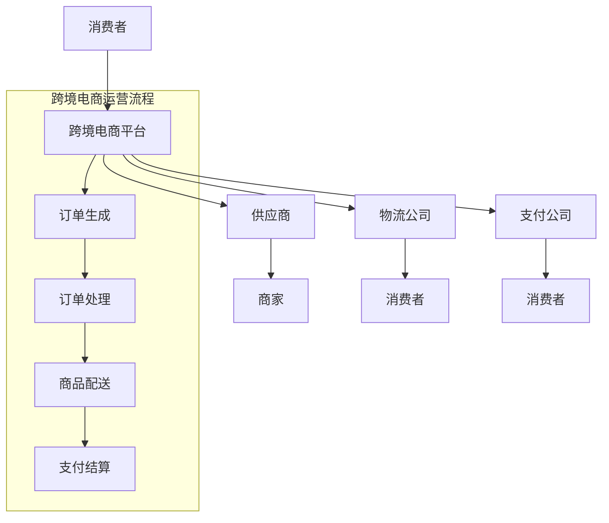

                 

### 跨境电商概述

> 跨境电商是指通过互联网进行跨境交易的电子商务活动，涵盖了商品采购、物流配送、支付结算等多个环节。随着全球互联网的普及和电子商务的快速发展，跨境电商已成为推动国际贸易增长的重要力量。

## 1.1 跨境电商的定义与发展历程

### 1.1.1 跨境电商的概念

跨境电商是指不同国家或地区之间的电子商务活动，包括商品销售、支付、物流等环节。它突破了传统的地理边界，使得全球消费者可以方便地购买到来自世界各地的商品。

### 1.1.2 跨境电商的发展历程

跨境电商的发展历程可以分为以下几个阶段：

1. **萌芽阶段（2000年初期）**：互联网的兴起为跨境电商的发展奠定了基础。此时，跨境电商主要以B2B模式为主，主要通过电子商务平台进行商品采购和销售。

2. **发展阶段（2005-2010年）**：随着物流和支付技术的不断成熟，跨境电商开始向B2C模式转型。代表性的平台如eBay、亚马逊等在全球范围内迅速发展。

3. **爆发阶段（2010-2015年）**：移动互联网的普及和社交媒体的兴起，推动了跨境电商的快速发展。这一阶段，跨境电商市场迎来了爆发式增长，许多创业公司纷纷涌入市场。

4. **成熟阶段（2015年至今）**：跨境电商市场逐渐成熟，产业链不断完善。各国政府纷纷出台政策支持跨境电商发展，跨境电商已成为国际贸易的重要组成部分。

## 1.2 全球跨境电商市场概况

### 1.2.1 主要跨境电商平台介绍

目前，全球范围内具有影响力的跨境电商平台主要有以下几个：

1. **亚马逊**：作为全球最大的电子商务平台之一，亚马逊在全球范围内拥有广泛的用户群体和卖家资源。

2. **eBay**：eBay是全球领先的在线拍卖和购物网站，提供广泛的商品类别和灵活的购物体验。

3. **阿里巴巴**：阿里巴巴旗下的淘宝、天猫等平台在中国市场占据主导地位，同时也在全球范围内拓展业务。

4. **Wish**：Wish是一个面向全球市场的购物平台，以其低廉的价格和灵活的购物体验受到消费者的喜爱。

### 1.2.2 各国跨境电商政策与环境

各国对跨境电商的政策和环境有所不同，但总体趋势是支持和鼓励跨境电商发展。以下是部分国家跨境电商政策与环境概况：

1. **美国**：美国对跨境电商持开放态度，但部分商品如食品、化妆品等需要符合特定的法规和标准。

2. **欧洲**：欧洲各国对跨境电商的监管较为严格，需要遵守欧盟统一的市场准入标准和法规。

3. **中国**：中国政府积极推动跨境电商发展，出台了一系列支持政策，如降低关税、简化通关手续等。

4. **日本**：日本政府对跨境电商实行较为宽松的政策，鼓励企业拓展海外市场。

## 1.3 跨境电商市场趋势与机遇

### 1.3.1 跨境电商市场趋势分析

跨境电商市场呈现出以下趋势：

1. **市场规模不断扩大**：随着全球互联网普及率的提高，跨境电商市场规模持续扩大。

2. **消费者需求多样化**：消费者对品质和个性化的需求不断提升，跨境电商平台需要提供更多样化的商品和服务。

3. **技术创新推动发展**：人工智能、大数据、区块链等技术的应用，为跨境电商提供了更高效的运营和更好的用户体验。

4. **产业链整合加速**：跨境电商产业链的整合趋势明显，从商品采购、物流配送到支付结算，各个环节的协同效率不断提升。

### 1.3.2 跨境电商市场机遇探讨

跨境电商市场机遇主要体现在以下几个方面：

1. **贸易壁垒降低**：全球范围内贸易壁垒的降低，为跨境电商提供了更多发展机会。

2. **全球化进程加快**：全球化进程的加快，使得更多国家和地区参与到跨境电商中来。

3. **消费升级**：消费者对品质和个性化需求提升，为跨境电商提供了广阔的市场空间。

4. **政策支持**：各国政府纷纷出台支持政策，为跨境电商发展提供了良好的环境。

---

**接下来我们将深入探讨创业公司跨境电商战略规划，帮助读者更好地了解如何制定和实施有效的跨境电商策略。**

---

### 第二部分：跨境电商策略规划

#### 2.1 创业公司跨境电商目标设定

制定明确的跨境电商目标对于创业公司至关重要，它不仅为公司的未来发展指明了方向，也为各项战略决策提供了依据。以下将详细分析创业公司跨境电商目标的设定方法。

### 2.1.1 企业跨境电商目标分析

创业公司在设定跨境电商目标时，应综合考虑以下几个方面：

1. **市场目标**：明确目标市场的范围和特点，如地域、消费者群体、市场规模等。市场目标有助于公司集中资源，针对特定市场进行精准营销。

2. **销售目标**：设定具体的销售目标，如年度销售量、销售额、订单量等。销售目标是公司业绩的直接反映，也是衡量战略实施效果的重要指标。

3. **品牌目标**：跨境电商不仅是为了销售商品，更是为了建立和提升品牌形象。品牌目标可以是提升品牌知名度、打造品牌特色、增强品牌忠诚度等。

4. **利润目标**：明确跨境电商业务的利润目标，如净利润率、毛利率等。利润目标是公司生存和发展的基础，也是决策的重要依据。

5. **运营目标**：包括物流效率、订单处理速度、客户满意度等。运营目标是保证业务高效运转的重要保障。

### 2.1.2 跨境电商目标设定方法

创业公司跨境电商目标的设定方法可以遵循以下步骤：

1. **市场调研**：通过对目标市场的深入调研，了解市场需求、竞争态势、消费者行为等，为设定目标提供数据支持。

2. **SWOT分析**：对公司的优势（Strengths）、劣势（Weaknesses）、机会（Opportunities）和威胁（Threats）进行综合分析，确定公司在跨境电商领域的定位和战略方向。

3. **设定短期和长期目标**：短期目标通常设定为一年以内，如年度销售目标、品牌知名度提升等；长期目标则设定为三年或五年，如市场份额扩大、品牌国际化等。短期目标是实现长期目标的基础。

4. **制定具体可行的行动计划**：根据设定的目标，制定具体的行动计划，包括营销策略、产品策略、物流策略等，确保目标能够有效实现。

5. **定期评估和调整**：目标设定后，应定期对目标实现情况进行评估，根据市场变化和公司实际情况进行调整，以确保目标的持续性和适应性。

通过以上步骤，创业公司可以科学、合理地设定跨境电商目标，为公司的未来发展奠定坚实基础。

---

**接下来，我们将进一步探讨创业公司在跨境电商市场定位与细分策略，帮助读者了解如何有效定位市场并实现市场细分。**

---

#### 2.2 跨境电商市场定位与细分

市场定位和细分是创业公司在跨境电商战略规划中至关重要的环节。正确的市场定位有助于公司集中资源，实现精准营销；而有效的市场细分则能够帮助公司更好地满足不同消费者的需求，提升市场竞争力。以下将详细分析市场定位策略和市场细分策略。

### 2.2.1 市场定位策略

市场定位策略的核心在于找到公司的独特价值主张（Unique Value Proposition, UVP），即公司能够提供给消费者的独特价值。以下是一些关键步骤：

1. **目标市场选择**：根据公司的资源、能力和市场需求，选择具有潜力的目标市场。目标市场可以是地理区域、特定消费者群体或行业等。

2. **目标市场特点分析**：对目标市场进行深入分析，了解其消费习惯、需求特点、购买动机等。这有助于公司制定针对性的营销策略。

3. **差异化定位**：通过独特的产品、服务或品牌形象，在目标市场中脱颖而出。差异化定位可以是产品质量、价格、售后服务、品牌文化等方面。

4. **市场定位传播**：通过品牌宣传、营销活动等手段，将公司的市场定位传达给目标消费者。有效的传播策略能够提升品牌知名度和美誉度。

### 2.2.2 市场细分策略

市场细分策略是将整个市场划分为若干个子市场，以便公司能够更精准地满足不同消费者的需求。以下是一些常用的市场细分方法：

1. **地理细分**：根据消费者所在地理位置进行市场细分，如国家、地区、城市等级别。地理细分有助于公司针对不同地区的消费习惯和需求，提供定制化的产品和服务。

2. **人口细分**：根据消费者的年龄、性别、收入、教育程度等人口统计特征进行市场细分。人口细分能够帮助公司更好地了解目标消费者的特征，制定针对性的营销策略。

3. **心理细分**：根据消费者的生活方式、价值观、兴趣爱好等心理特征进行市场细分。心理细分有助于公司捕捉消费者的深层次需求，提供更加个性化的产品和服务。

4. **行为细分**：根据消费者的购买行为、使用习惯等行为特征进行市场细分。行为细分能够帮助公司识别潜在客户，提高营销活动的效果。

5. **需求细分**：根据消费者的需求类型、使用场景等需求特征进行市场细分。需求细分有助于公司开发多样化的产品，满足不同消费者的需求。

在实施市场细分策略时，创业公司应遵循以下原则：

1. **可操作性**：市场细分要具有可操作性，即能够通过有效的营销手段和资源投入实现。

2. **可持续性**：市场细分应具备长期可持续性，即能够随着市场需求的变化进行调整和优化。

3. **精准性**：市场细分要能够精准地捕捉目标消费者的需求，提高营销的精准度和效果。

通过科学的市场定位和市场细分策略，创业公司可以更好地把握市场机会，提升市场竞争力，实现可持续发展。

---

**接下来，我们将探讨创业公司跨境电商运营模式的选择，帮助读者了解不同运营模式的特点和适用场景。**

---

#### 2.3 跨境电商运营模式选择

跨境电商运营模式的选择直接影响公司的运营效率和盈利能力。常见的跨境电商运营模式包括直邮模式、存货模式以及联合库存模式。以下将详细分析这三种模式的特点、优缺点及适用场景。

### 2.3.1 直邮模式

**特点：** 直邮模式是指公司通过海外仓库或第三方物流公司将商品直接寄送给海外消费者。这种模式不需要公司在海外建立仓库，物流成本相对较低，但物流时效相对较长。

**优点：**
1. **物流成本低**：直邮模式避免了在海外建立仓库的固定成本，降低了物流成本。
2. **灵活性高**：公司可以根据市场需求灵活调整商品库存，减少库存积压。

**缺点：**
1. **物流时效长**：由于商品直接从海外寄送，物流时效较长，可能影响消费者的购物体验。
2. **关税问题**：跨境电商的关税问题较为复杂，可能面临较高的关税和进口税。

**适用场景：** 直邮模式适用于轻资产创业公司，尤其是不具备海外仓储条件的小型企业。同时，对于高利润、低价值商品的跨境电商业务，直邮模式具有一定的优势。

### 2.3.2 存货模式

**特点：** 存货模式是指公司先将商品存储在海外仓库，然后根据订单需求进行配送。这种模式能够提供更快的物流时效，但需要较大的初始投资。

**优点：**
1. **物流时效短**：存货模式可以实现快速配送，提升消费者购物体验。
2. **品牌建设**：通过在海外建立仓库，公司可以更好地控制供应链，提高品牌形象。

**缺点：**
1. **物流成本高**：存货模式需要承担仓储费用和物流成本，对资金要求较高。
2. **库存管理复杂**：存货模式需要对库存进行精细管理，避免库存积压和过时。

**适用场景：** 存货模式适用于有一定资金实力和供应链管理能力的创业公司，尤其适合销售高价值、高利润商品的企业。同时，对于追求快速响应市场需求的跨境电商业务，存货模式具有明显的优势。

### 2.3.3 联合库存模式

**特点：** 联合库存模式是指公司与多个供应商合作，共同管理库存。这种模式能够实现库存共享，降低库存成本，提高供应链效率。

**优点：**
1. **库存成本降低**：通过共享库存，公司可以减少仓储成本，提高资金利用率。
2. **供应链效率提高**：联合库存模式能够优化供应链流程，提高订单处理和配送效率。

**缺点：**
1. **库存管理难度大**：由于涉及多个供应商，库存管理变得更加复杂，需要较高的协调和管理能力。
2. **供应商依赖性强**：公司对供应商的依赖程度较高，可能面临供应链风险。

**适用场景：** 联合库存模式适用于具备较强供应链管理能力和资源整合能力的创业公司，尤其适合多个供应商合作的企业。这种模式有助于实现库存优化和供应链效率提升，是中小型跨境电商企业发展的有效选择。

通过以上分析，创业公司可以根据自身情况选择合适的跨境电商运营模式，实现业务高效运转和持续增长。

---

**接下来，我们将深入探讨跨境电商平台运营策略，包括平台选择、商品策略、营销策略和物流策略，帮助创业公司制定全面的运营计划。**

---

#### 3.1 跨境电商平台运营策略

跨境电商平台运营策略是创业公司实现跨境业务成功的关键。以下将详细探讨平台选择、商品策略、营销策略和物流策略，以帮助创业公司制定全面的运营计划。

### 3.1.1 各大跨境平台对比

在选择跨境电商平台时，创业公司需要综合考虑平台的市场份额、用户群体、功能特点、费用结构等因素。以下是几个主要跨境平台的对比分析：

**亚马逊（Amazon）**

- **市场份额**：亚马逊是全球最大的电子商务平台，拥有广泛的用户群体和卖家资源。
- **用户群体**：主要面向全球消费者，尤其是欧美地区。
- **功能特点**：提供完善的支付、物流、客户服务等功能，支持多种语言和货币。
- **费用结构**：包括销售佣金、物流费用等，费用相对较高。

**eBay**

- **市场份额**：eBay是全球领先的在线拍卖和购物平台，具有独特的拍卖模式和广泛的商品类别。
- **用户群体**：主要面向全球消费者，尤其是亚洲和欧洲地区。
- **功能特点**：提供在线拍卖、固定价格销售、购物车、收藏夹等功能。
- **费用结构**：包括销售佣金、成交费等，费用相对较低。

**阿里巴巴（AliExpress）**

- **市场份额**：阿里巴巴旗下的AliExpress是全球最大的跨境B2C平台，尤其在俄罗斯、巴西等新兴市场具有强大的影响力。
- **用户群体**：主要面向全球消费者，尤其是俄罗斯、巴西等地区。
- **功能特点**：提供多种支付方式、物流跟踪、客户服务等功能。
- **费用结构**：包括技术服务费、交易费等，费用相对较低。

**Wish**

- **市场份额**：Wish是一个面向全球市场的购物平台，以其低廉的价格和灵活的购物体验受到消费者的喜爱。
- **用户群体**：主要面向全球消费者，尤其是北美和欧洲地区。
- **功能特点**：提供优惠券、限时折扣、购物积分等功能。
- **费用结构**：包括销售佣金、广告费等，费用相对较低。

在选择跨境电商平台时，创业公司应根据自己的市场定位、商品特点和运营需求，选择适合的平台。以下是一些选择标准：

- **市场覆盖范围**：选择具有广泛市场覆盖的平台，能够更好地接触到目标消费者。
- **用户群体特点**：选择与目标市场匹配的平台，能够提供更精准的用户定位和营销策略。
- **功能特点**：选择具有完善功能和强大技术支持的平台，能够提高运营效率和用户体验。
- **费用结构**：选择费用合理、性价比高的平台，能够降低运营成本，提高盈利能力。

### 3.1.2 选择跨境电商平台的标准

1. **平台知名度**：选择知名度较高的平台，能够提高品牌曝光度和消费者信任度。
2. **用户活跃度**：选择用户活跃度较高的平台，能够增加销售机会和订单量。
3. **功能和服务**：选择功能齐全、服务优质的平台，能够提高运营效率和用户体验。
4. **费用结构**：选择费用合理、性价比高的平台，能够降低运营成本，提高盈利能力。
5. **支持政策**：选择提供优惠政策和支持政策较强的平台，能够降低创业门槛，提升市场竞争力。

通过以上分析，创业公司可以科学合理地选择适合的跨境电商平台，为实现跨境业务成功奠定坚实基础。

---

**接下来，我们将深入探讨跨境电商商品策略，包括商品选择和定价策略，帮助创业公司优化商品结构，提高销售额和盈利能力。**

---

### 3.2 跨境电商商品策略

跨境电商商品策略是创业公司实现跨境业务成功的关键环节。正确的商品策略能够帮助公司吸引目标消费者，提高销售额和盈利能力。以下将详细探讨跨境电商商品选择和定价策略。

#### 3.2.1 商品选择策略

商品选择策略是跨境电商业务的基础，直接影响公司的市场竞争力和盈利能力。以下是一些关键步骤：

1. **市场调研**：通过市场调研了解目标市场的消费习惯、需求趋势和竞争态势。市场调研可以采用问卷调查、访谈、竞品分析等方式，获取有价值的信息。

2. **消费者需求分析**：分析目标消费者的需求特点，包括年龄、性别、收入水平、兴趣爱好等。了解消费者的需求有助于公司制定针对性的商品策略。

3. **商品定位**：根据市场调研和消费者需求分析，确定公司的商品定位。商品定位可以是高端、中端或低端，以满足不同消费者的需求。

4. **商品多样性**：提供多样化的商品，满足不同消费者的需求。商品多样性可以是不同品类、不同品牌、不同款式等。

5. **热销商品选择**：分析市场热销商品，选择具有市场潜力的商品进行推广。热销商品能够提高销售量，增加品牌曝光度。

6. **新品研发**：关注市场趋势，不断推出新品，保持商品的新鲜感和竞争力。新品研发可以是自主研发或与供应商合作开发。

#### 3.2.2 商品定价策略

商品定价策略是跨境电商业务的关键环节，直接影响公司的利润水平和市场竞争力。以下是一些常见的商品定价策略：

1. **成本定价法**：以商品成本为基础，加上一定的利润进行定价。成本定价法简单易行，但可能导致商品价格较高，影响市场竞争力。

2. **市场定价法**：根据市场供需关系和竞争态势，确定商品价格。市场定价法能够更好地反映市场需求，提高市场竞争力。

3. **价值定价法**：以商品的价值为基础，确定商品价格。价值定价法能够更好地体现商品的价值，提升消费者满意度。

4. **促销定价法**：通过促销活动，如折扣、赠品、限时优惠等，吸引消费者购买。促销定价法能够提高商品销量，增加品牌曝光度。

5. **竞争定价法**：以竞争对手的商品价格为参考，确定自己的商品价格。竞争定价法能够保持与竞争对手的竞争力，但可能导致价格战。

在制定商品定价策略时，创业公司应综合考虑以下因素：

1. **成本**：包括生产成本、物流成本、仓储成本等。成本是定价的基础，直接影响商品价格。

2. **市场需求**：市场需求直接影响商品的销售量和价格。市场需求高，价格可以适当提高；市场需求低，价格可以适当降低。

3. **竞争态势**：竞争对手的商品价格和促销策略对公司的定价策略有重要影响。公司应密切关注竞争对手的动态，及时调整定价策略。

4. **品牌定位**：品牌定位直接影响商品的价格区间。高端品牌可以采用较高的价格策略，中端品牌可以采用中等价格策略，低端品牌可以采用较低的价格策略。

通过科学合理的商品选择和定价策略，创业公司可以优化商品结构，提高销售额和盈利能力，实现跨境业务的可持续发展。

---

**接下来，我们将深入探讨跨境电商营销策略，包括营销渠道策略和营销活动策划，帮助创业公司提升品牌知名度和市场占有率。**

---

### 3.3 跨境电商营销策略

跨境电商营销策略是创业公司提升品牌知名度和市场占有率的关键手段。有效的营销策略能够帮助公司吸引潜在客户，提高订单量和销售额。以下将详细探讨营销渠道策略和营销活动策划。

#### 3.3.1 营销渠道策略

营销渠道策略是指公司将商品信息传递给目标消费者所采用的各种渠道。以下是一些常见的营销渠道策略：

1. **跨境电商平台**：利用亚马逊、eBay、阿里巴巴等知名跨境电商平台进行商品推广。这些平台具有广泛的用户基础和完善的营销工具，有助于提高商品曝光度和销售量。

2. **社交媒体**：利用Facebook、Instagram、Twitter等社交媒体平台进行品牌宣传和商品推广。通过发布有趣的内容、互动活动、广告投放等方式，吸引潜在客户关注和购买。

3. **电子邮件营销**：通过电子邮件向订阅用户发送商品促销信息、新品发布、订单确认等通知。电子邮件营销具有成本低、效果持久的特点，是提高客户忠诚度和复购率的有效手段。

4. **搜索引擎优化（SEO）**：通过优化网站内容和结构，提高在搜索引擎中的排名，吸引更多目标客户访问。SEO主要包括关键词研究、内容优化、外部链接建设等。

5. **内容营销**：通过发布有价值的内容，如博客文章、视频教程、用户评价等，提升品牌形象和用户参与度。内容营销能够建立品牌权威性，提高用户对商品的信任度。

#### 3.3.2 营销活动策划

营销活动策划是指公司在特定时间和场合，通过一系列活动提高品牌知名度和市场占有率。以下是一些常见的营销活动策划方法：

1. **促销活动**：定期举办促销活动，如折扣优惠、满减活动、限时秒杀等，吸引消费者购买。促销活动能够提高商品销量，增加现金流。

2. **互动活动**：通过举办线上互动活动，如抽奖、点赞、评论互动等，提高用户参与度和品牌曝光度。互动活动能够增强用户对品牌的情感认同，提高客户忠诚度。

3. **广告投放**：在搜索引擎、社交媒体、电商平台等渠道进行广告投放，吸引潜在客户关注和购买。广告投放应根据目标市场和预算进行精细投放，提高广告效果。

4. **品牌合作**：与其他品牌或网红进行合作，通过联名产品、互动活动等方式，扩大品牌影响力。品牌合作能够借助合作伙伴的资源和影响力，提高品牌知名度。

5. **内容营销活动**：举办内容营销活动，如线上研讨会、线下沙龙、行业报告发布等，提升品牌形象和专业性。内容营销活动能够建立品牌权威性，吸引目标客户关注。

在策划营销活动时，创业公司应遵循以下原则：

1. **目标明确**：明确营销活动的目标和预期效果，确保活动策划具有针对性。

2. **创新性**：创新营销活动形式和内容，提高用户参与度和品牌传播效果。

3. **预算合理**：合理分配营销活动预算，确保活动效果最大化。

4. **数据分析**：通过数据监测和分析，评估营销活动的效果，及时调整和优化活动策略。

通过科学合理的营销渠道策略和营销活动策划，创业公司可以提升品牌知名度和市场占有率，实现跨境业务的快速发展。

---

**接下来，我们将深入探讨跨境电商物流策略，包括物流渠道选择、物流成本控制和物流时效优化，帮助创业公司提高物流运营效率，降低物流成本，提升消费者满意度。**

---

### 3.4 跨境电商物流策略

跨境电商物流策略是创业公司实现跨境业务成功的关键环节。合理的物流策略能够提高物流运营效率，降低物流成本，提升消费者满意度。以下将详细探讨物流渠道选择、物流成本控制和物流时效优化。

#### 3.4.1 物流渠道选择

物流渠道选择是跨境电商物流策略的核心，直接关系到物流效率、成本和消费者体验。以下是一些常见的物流渠道选择策略：

1. **直邮模式**：直邮模式是指商品从国内仓库直接邮寄到海外消费者手中。这种模式适用于轻资产创业公司，能够降低物流成本，但物流时效较长。

2. **海外仓模式**：海外仓模式是指公司在目标市场国家建立仓库，商品从仓库直接配送给消费者。这种模式能够提高物流时效，降低物流成本，但需要较大的初始投资。

3. **联合库存模式**：联合库存模式是指公司与多个供应商合作，共同管理库存。商品从供应商仓库直接配送给消费者，能够实现库存共享，降低物流成本。

4. **物流公司合作**：与专业的物流公司合作，如DHL、FedEx、UPS等，提供国际快递服务。这种模式适用于中小型创业公司，能够提供高效的物流服务，但物流成本较高。

在物流渠道选择时，创业公司应综合考虑以下因素：

1. **物流成本**：不同物流渠道的成本差异较大，选择成本较低的物流渠道有助于降低运营成本。

2. **物流时效**：物流时效直接影响消费者的购物体验，选择时效较短的物流渠道能够提高消费者满意度。

3. **物流服务质量**：物流服务质量包括配送准时率、包裹完好率等，选择服务质量较高的物流渠道能够提升消费者满意度。

4. **物流网络覆盖范围**：物流网络覆盖范围影响物流服务的可及性，选择覆盖范围较广的物流渠道能够提高物流服务覆盖率。

#### 3.4.2 物流成本控制

物流成本控制是跨境电商运营的重要环节，直接关系到公司的盈利能力。以下是一些物流成本控制策略：

1. **优化物流渠道**：通过优化物流渠道，选择成本较低的物流方式，降低物流成本。

2. **整合物流资源**：通过整合物流资源，实现物流资源共享，降低物流成本。

3. **仓储管理优化**：通过优化仓储管理，提高仓库利用率，降低仓储成本。

4. **物流配送优化**：通过优化物流配送路线和配送计划，提高配送效率，降低物流成本。

5. **物流信息技术应用**：通过物流信息技术应用，如物流管理系统、供应链管理系统等，提高物流运营效率，降低物流成本。

6. **物流外包**：对于不具备物流管理能力的创业公司，可以考虑物流外包，降低物流成本。

#### 3.4.3 物流时效优化

物流时效优化是提高消费者满意度的重要手段。以下是一些物流时效优化策略：

1. **多渠道配送**：通过多渠道配送，如海外仓模式、物流公司合作等，提高物流时效。

2. **物流节点优化**：通过优化物流节点，如增加中转站、提高运输效率等，提高物流时效。

3. **智能物流管理**：通过智能物流管理，如物流管理系统、智能仓储系统等，提高物流运营效率，降低物流时效。

4. **物流信息化建设**：通过物流信息化建设，如物流信息管理系统、电子标签系统等，提高物流信息透明度，降低物流时效。

5. **物流配送时效承诺**：通过物流配送时效承诺，如按时配送、超时退款等，提高消费者满意度。

通过以上物流策略，创业公司可以提高物流运营效率，降低物流成本，提升消费者满意度，实现跨境业务的可持续发展。

---

**接下来，我们将深入探讨跨境电商风险管理，包括法律风险、市场风险和运营风险，帮助创业公司识别和管理风险，确保业务稳健发展。**

---

### 4.1 跨境电商法律风险

跨境电商的法律风险主要包括贸易法规、消费者权益保护、知识产权保护等方面。正确识别和管理这些法律风险是创业公司成功开展跨境电商业务的关键。以下将详细分析跨境电商的法律风险及其防范策略。

#### 4.1.1 法律法规概述

跨境电商涉及多个国家和地区的法律法规，以下是一些主要法律法规概述：

1. **进口法规**：不同国家和地区的进口法规有所不同。例如，美国有《海关法》、《进口关税法》等，欧盟有《单一市场法案》、《进口条例》等。进口法规主要涉及关税、进口税、配额、禁令等方面。

2. **消费者权益保护**：不同国家和地区对消费者权益保护的规定也有所不同。例如，美国有《消费者保护法》、《隐私法》等，欧盟有《消费者权益指令》、《通用数据保护条例》（GDPR）等。消费者权益保护法规主要涉及商品质量、售后服务、隐私保护等方面。

3. **知识产权保护**：跨境电商涉及知识产权保护问题，如商标、专利、版权等。不同国家和地区的知识产权保护法律也有所不同。例如，美国有《商标法》、《专利法》、《版权法》等，欧盟有《欧盟知识产权条例》等。

4. **电子商务法规**：跨境电商的电子商务法规主要包括电子商务平台责任、电子合同、电子支付等方面。例如，美国有《电子商务安全法》、《电子签名法》等，欧盟有《电子商务指令》等。

#### 4.1.2 法律风险识别

跨境电商的法律风险主要包括以下几个方面：

1. **贸易法规风险**：违反进口法规，可能导致商品无法进口、关税增加、罚款等。例如，未经批准进口禁运商品、超配额进口等。

2. **消费者权益保护风险**：违反消费者权益保护法规，可能导致商品退货、售后服务纠纷、隐私泄露等。例如，商品质量不符合要求、售后服务不到位、消费者个人信息泄露等。

3. **知识产权保护风险**：侵犯他人知识产权，可能导致侵权诉讼、赔偿损失等。例如，未经授权销售他人商标商品、侵犯他人专利或版权等。

4. **电子商务法规风险**：违反电子商务法规，可能导致平台责任、电子合同无效、电子支付风险等。例如，电子商务平台未履行消费者权益保护责任、电子合同未符合法律规定、电子支付风险等。

#### 4.1.3 法律风险防范策略

为有效防范跨境电商的法律风险，创业公司可以采取以下策略：

1. **了解相关法律法规**：创业公司应深入了解目标市场的相关法律法规，确保合规经营。

2. **建立合规体系**：建立完善的合规管理体系，包括合规培训、合规审查、合规监控等。

3. **合规审查**：在商品销售前，进行合规审查，确保商品符合相关法律法规要求。

4. **知识产权保护**：加强知识产权保护，包括商标注册、专利申请、版权保护等，避免侵犯他人知识产权。

5. **消费者权益保护**：建立健全的售后服务体系，确保商品质量和服务水平，提高消费者满意度。

6. **电子商务合规**：确保电子商务平台符合相关电子商务法规要求，包括电子合同、电子支付等。

7. **合作与咨询**：与专业律师团队合作，及时咨询法律问题，确保公司合法合规运营。

通过以上策略，创业公司可以有效识别和管理跨境电商法律风险，确保业务稳健发展。

---

**接下来，我们将进一步探讨跨境电商的市场风险，包括市场风险识别和管理策略，帮助创业公司应对市场不确定性，降低风险影响。**

---

### 4.2 跨境电商市场风险

跨境电商市场风险是指企业在跨境运营过程中，由于市场环境变化、消费者行为变化等因素，可能导致业务受阻、市场占有率下降、盈利能力减弱等一系列负面影响。以下将详细分析跨境电商市场风险的识别和管理策略。

#### 4.2.1 市场风险识别

跨境电商市场风险主要包括以下几个方面：

1. **政策风险**：政策风险主要指各国政府贸易政策、税收政策、法律法规等的变化，可能对跨境电商业务产生重大影响。例如，贸易保护主义政策的加强、税收政策的调整等。

2. **市场竞争风险**：市场竞争风险指跨境电商平台、供应商、消费者等竞争激烈，可能导致市场占有率下降、利润率降低。特别是在热门品类和市场中，竞争风险更为突出。

3. **消费者行为风险**：消费者行为风险指消费者需求、购买习惯、消费偏好等变化，可能导致产品销量下降、品牌形象受损。例如，消费者对产品质量、价格、售后服务等方面的要求提高。

4. **物流风险**：物流风险指跨境物流过程中的不确定性，如运输延误、货物损坏、关税问题等。物流风险直接影响消费者的购物体验和企业的声誉。

5. **汇率风险**：汇率风险指汇率波动对企业财务状况和利润的影响。特别是在跨境电商业务中，汇率波动可能导致收入和成本的不确定性。

#### 4.2.2 市场风险管理策略

为有效管理跨境电商市场风险，创业公司可以采取以下策略：

1. **政策风险应对策略**：
   - **密切关注政策动态**：定期关注目标市场的政策变化，及时调整经营策略。
   - **政策合规性评估**：在业务开展前，进行政策合规性评估，确保符合当地法律法规要求。
   - **政策应对预案**：制定政策应对预案，针对可能出现的问题，提前制定解决方案。

2. **市场竞争风险应对策略**：
   - **市场定位差异化**：明确市场定位，避免与竞争对手在热门品类和市场上的直接竞争。
   - **产品创新**：持续推出创新产品，满足消费者多样化需求，提高市场竞争力。
   - **品牌建设**：加强品牌建设，提高品牌知名度和美誉度，增强消费者忠诚度。

3. **消费者行为风险应对策略**：
   - **消费者需求分析**：定期进行消费者需求分析，了解消费者购买习惯和消费偏好，调整产品策略。
   - **售后服务优化**：提升售后服务质量，提高消费者满意度，降低消费者流失率。
   - **消费者互动**：通过社交媒体、电子邮件等渠道与消费者保持互动，了解消费者反馈，及时调整产品和服务。

4. **物流风险应对策略**：
   - **物流渠道多样化**：选择多种物流渠道，降低单一物流渠道的风险。
   - **物流服务供应商评估**：对物流服务供应商进行严格评估，确保物流服务质量。
   - **物流应急预案**：制定物流应急预案，应对可能出现的问题，确保物流顺畅。

5. **汇率风险应对策略**：
   - **汇率风险管理工具**：利用期货、期权等金融工具进行汇率风险管理。
   - **多币种结算**：通过多币种结算，降低汇率波动对财务状况的影响。
   - **财务预算调整**：根据汇率波动情况，及时调整财务预算，降低汇率风险。

通过以上策略，创业公司可以有效识别和管理跨境电商市场风险，确保业务稳健发展。

---

**接下来，我们将深入探讨跨境电商运营风险，包括运营风险分析和风险管理策略，帮助创业公司优化运营流程，提升运营效率。**

---

### 4.3 跨境电商运营风险

跨境电商运营风险是指在跨境电商业务运营过程中，由于内部管理和外部环境等因素，可能导致业务受阻、运营效率低下、成本增加等一系列不利影响。以下将详细分析跨境电商运营风险及其管理策略。

#### 4.3.1 运营风险分析

跨境电商运营风险主要包括以下几个方面：

1. **供应链风险**：供应链风险指供应链管理过程中可能出现的风险，如供应商选择不当、供应链中断、物流延迟等。供应链风险直接影响商品供应和物流效率。

2. **库存风险**：库存风险指库存管理过程中可能出现的风险，如库存积压、库存不足、商品过期等。库存风险可能导致库存成本增加、销售损失等。

3. **订单处理风险**：订单处理风险指订单处理过程中可能出现的风险，如订单错误、订单延误、订单丢失等。订单处理风险直接影响消费者满意度和服务质量。

4. **支付风险**：支付风险指支付过程中可能出现的风险，如支付失败、资金冻结、诈骗等。支付风险可能导致资金损失、客户信任度下降。

5. **客户服务风险**：客户服务风险指客户服务过程中可能出现的风险，如客服响应不及时、客户投诉处理不当等。客户服务风险可能导致客户满意度下降、客户流失等。

6. **信息安全风险**：信息安全风险指信息安全保护过程中可能出现的风险，如数据泄露、黑客攻击、系统故障等。信息安全风险可能导致数据损失、品牌形象受损等。

#### 4.3.2 运营风险管理策略

为有效管理跨境电商运营风险，创业公司可以采取以下策略：

1. **供应链风险管理**：
   - **供应商评估**：对供应商进行严格评估，确保供应商具备良好的信誉、生产能力和服务水平。
   - **供应链多元化**：建立多元化供应链，降低供应链中断风险。
   - **库存管理优化**：采用先进的库存管理技术，如供应链管理系统（SCM）、库存管理系统（WMS）等，提高库存管理效率和准确性。

2. **订单处理风险管理**：
   - **订单处理流程优化**：优化订单处理流程，提高订单处理速度和准确性。
   - **自动化订单处理**：采用自动化订单处理系统，减少人为错误，提高订单处理效率。
   - **订单跟踪与反馈**：建立订单跟踪机制，及时向客户反馈订单状态，提高客户满意度。

3. **支付风险管理**：
   - **支付渠道多样化**：提供多种支付渠道，降低支付失败风险。
   - **支付安全措施**：采用加密技术、支付安全协议等，确保支付过程安全。
   - **风险监控与防范**：建立支付风险监控体系，及时发现和防范支付风险。

4. **客户服务风险管理**：
   - **客户服务培训**：对客服人员进行专业培训，提高客服质量和服务水平。
   - **客户投诉处理**：建立高效的客户投诉处理机制，及时解决客户问题，提高客户满意度。
   - **客户关系管理**：通过客户关系管理（CRM）系统，维护客户关系，提高客户忠诚度。

5. **信息安全风险管理**：
   - **信息安全体系建设**：建立完善的信息安全体系，包括网络安全、数据安全、系统安全等。
   - **数据备份与恢复**：定期进行数据备份，确保数据安全性和可恢复性。
   - **安全培训与意识提升**：对员工进行信息安全培训，提高员工安全意识和防范能力。

通过以上策略，创业公司可以有效识别和管理跨境电商运营风险，优化运营流程，提升运营效率，确保业务稳健发展。

---

**接下来，我们将通过两个实际案例，分析创业公司在跨境电商领域的成功实践，并总结其关键策略和经验，以期为其他创业公司提供有益的借鉴。**

---

### 5.1 案例一：某创业公司的跨境电商实践

#### 5.1.1 企业背景

某创业公司（以下简称“公司”）成立于2018年，专注于跨境电商业务，销售时尚配饰，包括首饰、手表、眼镜等多个品类。公司采用直邮模式进行跨境电商运营，主要销售市场为欧美地区。公司凭借高品质的产品、高效的运营策略和良好的客户服务，在短时间内取得了显著的市场成绩。

#### 5.1.2 跨境电商策略制定

1. **市场定位策略**：公司定位于中高端市场，针对20-40岁的年轻女性消费群体。通过市场调研和消费者需求分析，公司确定了以时尚、品质、个性化为核心价值主张。

2. **平台选择策略**：公司主要选择亚马逊、eBay等知名跨境电商平台进行销售。通过对比各大平台的市场份额、用户群体和功能特点，公司选择了最适合自身业务的平台。

3. **商品策略**：公司采用“爆款+长尾”商品策略，通过打造爆款商品提高品牌知名度，同时销售长尾商品满足不同客户需求。公司注重产品研发，不断推出新颖、时尚的配饰产品。

4. **营销策略**：公司利用社交媒体（如Instagram、Facebook）进行品牌推广，提高产品曝光率。同时，公司通过优惠券、限时折扣等活动吸引消费者购买。此外，公司还积极参与各大平台的促销活动，提升销量。

5. **物流策略**：公司选择具有国际快递经验的物流公司进行物流配送，确保商品能及时送达消费者手中。公司与物流公司建立长期合作关系，优化物流流程，提高配送效率。

#### 5.1.3 运营效果分析

自2018年成立以来，公司跨境电商业务持续增长。以下为部分运营数据：

- **订单量**：年均订单量从2018年的1000单增长到2022年的5000单。
- **销售额**：年均销售额从2018年的100万元增长到2022年的500万元。
- **用户满意度**：用户满意度评分从2018年的4.2分（满分5分）提高到2022年的4.8分。

公司成功的关键策略包括：

1. **精准市场定位**：公司通过市场调研和消费者需求分析，明确了市场定位，使产品策略更加精准，提高了市场竞争力。

2. **平台选择与运营**：公司选择了适合自身业务的跨境电商平台，并通过平台运营策略提高了商品曝光率和销售量。

3. **商品创新与质量保证**：公司注重产品研发，推出新颖、时尚的配饰产品，提高了消费者满意度和品牌知名度。

4. **营销与客户服务**：公司通过社交媒体营销和优惠券活动等，提高了产品曝光率和销量。同时，公司注重客户服务，提高了用户满意度和复购率。

#### 5.1.4 经验总结

公司成功经验为其他创业公司提供了以下启示：

1. **精准市场定位**：明确市场定位，了解消费者需求，制定针对性的产品策略。

2. **平台选择与运营**：选择适合自身业务的跨境电商平台，制定有效的运营策略，提高商品曝光率和销售量。

3. **商品创新与质量保证**：注重产品研发，推出新颖、时尚的产品，提高消费者满意度和品牌知名度。

4. **营销与客户服务**：通过有效的营销策略和优质的客户服务，提高用户满意度和复购率。

---

### 5.2 案例二：某跨境电商平台的创新模式

#### 5.2.1 平台背景

某跨境电商平台（以下简称“平台”）成立于2015年，主要销售电子产品、家居用品、服装鞋帽等品类。平台采用联合库存模式，与多家供应商合作，共同管理库存。平台通过优化库存管理和订单处理流程，降低了物流成本和仓储成本，提高了运营效率。

#### 5.2.2 创新模式分析

1. **库存管理**：平台与供应商共同管理库存，根据市场需求动态调整库存，减少库存积压。平台通过大数据分析和智能预测，优化库存结构，提高库存周转率。

2. **订单处理**：平台订单处理流程与供应商紧密合作，订单生成后，系统自动分配给供应商进行发货。平台通过信息化手段，实现订单流转的透明化和高效化。

3. **成本控制**：平台通过优化库存管理和订单处理流程，降低物流成本和仓储成本。平台与物流公司建立长期合作关系，享受优惠的物流服务价格。

4. **服务质量**：平台注重客户服务质量，提供多种售后服务，如退换货、售后服务等。平台通过完善的服务体系，提高用户满意度和品牌忠诚度。

#### 5.2.3 创新模式的影响与启示

1. **影响**：创新模式提高了平台库存周转率和订单处理效率，降低了运营成本。平台通过优化库存管理和订单处理流程，实现了业务的高效运转。

2. **启示**：创业公司可以借鉴平台的创新模式，优化库存管理和订单处理流程，提高运营效率。创业公司应注重数据分析和智能化应用，实现业务流程的优化和升级。

#### 5.2.4 案例总结

平台通过创新模式，实现了库存和订单处理的高效管理，降低了运营成本，提高了服务质量。平台成功的关键在于：

1. **库存管理优化**：通过大数据分析和智能预测，优化库存结构，提高库存周转率。

2. **订单处理高效化**：通过信息化手段，实现订单流转的透明化和高效化。

3. **成本控制**：通过优化库存管理和订单处理流程，降低物流成本和仓储成本。

4. **客户服务提升**：提供多种售后服务，提高用户满意度和品牌忠诚度。

平台的成功经验为其他创业公司提供了有益的启示，创业公司应注重业务流程的优化和智能化，提高运营效率，降低成本。

---

### 5.3 案例总结

通过以上两个案例，我们可以总结出创业公司在跨境电商领域的成功经验：

1. **精准市场定位**：明确市场定位，了解消费者需求，制定针对性的产品策略。

2. **平台选择与运营**：选择适合自身业务的跨境电商平台，制定有效的运营策略，提高商品曝光率和销售量。

3. **商品创新与质量保证**：注重产品研发，推出新颖、时尚的产品，提高消费者满意度和品牌知名度。

4. **营销与客户服务**：通过有效的营销策略和优质的客户服务，提高用户满意度和复购率。

5. **库存与订单管理优化**：通过优化库存管理和订单处理流程，提高运营效率，降低成本。

6. **技术创新**：运用大数据、人工智能等新技术，实现业务流程的优化和升级。

创业公司可以借鉴这些成功经验，结合自身实际情况，制定有效的跨境电商策略，实现业务的持续增长。

---

**接下来，我们将对全文进行总结，并给出对创业公司跨境电商策略的建议，帮助创业公司在激烈的市场竞争中脱颖而出。**

---

### 总结

本文详细探讨了创业公司的跨境电商策略，从市场分析、战略规划、平台运营、营销策略、物流策略到风险管理，全面剖析了跨境电商业务的各个环节。通过市场分析，我们了解了跨境电商的发展历程、市场概况和趋势。战略规划部分，我们探讨了创业公司如何设定目标、定位市场、选择运营模式。平台运营、营销策略和物流策略部分，我们分析了如何选择平台、制定商品策略、营销策略和物流策略。最后，在风险管理部分，我们讨论了法律风险、市场风险和运营风险的识别和管理。

通过案例分析，我们看到了创业公司在跨境电商领域的成功实践。成功的关键在于精准的市场定位、有效的平台运营、创新的产品策略和优质的客户服务。同时，优化库存和订单管理，提高运营效率，降低成本也是创业公司成功的重要因素。

### 对创业公司跨境电商策略的建议

1. **精准市场定位**：深入了解目标市场的需求和消费习惯，制定针对性的市场定位策略。避免与竞争对手在热门品类和市场上的直接竞争，寻找差异化优势。

2. **平台选择与运营**：选择适合自身业务的跨境电商平台，制定有效的运营策略。充分利用平台的营销工具和资源，提高商品曝光率和销售量。

3. **商品策略**：注重产品研发，推出新颖、时尚、高质量的产品。同时，采用“爆款+长尾”商品策略，满足不同消费者的需求。

4. **营销策略**：利用社交媒体、电子邮件、内容营销等多种渠道进行品牌推广。通过优惠券、限时折扣等促销活动，提高用户参与度和转化率。

5. **物流策略**：选择高效、可靠的物流渠道，优化物流流程，提高配送效率。与物流公司建立长期合作关系，享受优惠的物流服务价格。

6. **风险管理**：建立完善的法律风险、市场风险和运营风险管理体系，识别和管理潜在风险。制定应急预案，确保业务稳健发展。

7. **技术创新**：运用大数据、人工智能等新技术，实现业务流程的优化和升级。通过智能化手段，提高运营效率和客户满意度。

通过以上策略，创业公司可以在激烈的市场竞争中脱颖而出，实现跨境电商业务的持续增长。

---

### 附录 A：跨境电商相关资源与工具

在跨境电商运营过程中，掌握一系列相关的资源与工具能够显著提升企业的运营效率和市场竞争力。以下是一些常用的跨境电商平台、物流工具、营销工具和数据分析工具的介绍。

#### A.1 跨境电商平台介绍

1. **亚马逊（Amazon）**：全球最大的电子商务平台之一，提供广泛的商品类别和强大的搜索功能，有助于提升品牌曝光度和销售量。

2. **eBay**：全球领先的在线拍卖和购物平台，以其独特的拍卖模式和多样化的商品种类受到全球消费者的青睐。

3. **阿里巴巴（AliExpress）**：全球最大的跨境B2C平台，尤其在俄罗斯、巴西等新兴市场具有强大的影响力。

4. **Wish**：面向全球市场的购物平台，以其低廉的价格和灵活的购物体验受到消费者的喜爱。

5. **Shopify**：提供一站式的电商平台解决方案，支持多种销售渠道，适用于中小型创业公司。

#### A.2 跨境电商物流工具

1. **DHL**：全球领先的物流服务提供商，提供国际快递、海运、空运等多种物流服务。

2. **FedEx**：提供全球快速运输服务，适用于急需快速送达的跨境电商订单。

3. **UPS**：全球最大的快递公司之一，提供多种物流解决方案，包括快递、货运和供应链管理。

4. **ePacket**：亚马逊推出的快递服务，适用于小包裹的跨境运输，具有低廉的费用和快速的配送时效。

5. **Cross-Border Express**：提供一站式跨境电商物流解决方案，包括仓储、配送、退货等服务。

#### A.3 跨境电商营销工具

1. **Google Ads**：谷歌广告平台，通过关键词广告、展示广告等推广方式，提升品牌曝光度和销售量。

2. **Facebook Ads**：Facebook广告平台，通过定位广告、再营销等策略，吸引潜在客户并提升转化率。

3. **Instagram Ads**：Instagram广告平台，通过图片和视频广告，增强品牌影响力和用户互动。

4. **SEO（搜索引擎优化）**：通过优化网站内容和结构，提高在搜索引擎中的排名，吸引更多目标客户访问。

5. **KOL（关键意见领袖）**：与具有影响力的KOL合作，通过他们的推荐和宣传，提升品牌知名度和用户信任度。

#### A.4 跨境电商数据分析工具

1. **Google Analytics**：谷歌分析工具，提供详细的网站流量分析、用户行为分析等数据，帮助企业制定更有效的营销策略。

2. **Shopify Analytics**：Shopify内置的分析工具，提供销售额、订单量、客户行为等数据，帮助创业者实时了解业务表现。

3. **Tableau**：数据可视化工具，通过直观的图表和报表，帮助企业更好地理解和利用数据分析结果。

4. **Selenium**：自动化测试工具，用于自动化电商平台的测试，确保网站功能正常运行。

5. **KPI追踪工具**：如Google Sheets、Excel等，用于跟踪关键绩效指标（KPI），帮助创业者评估业务表现和制定优化策略。

通过以上资源与工具，创业公司可以更好地管理跨境电商业务，提升运营效率和市场竞争力。

### Mermaid 图1: 跨境电商市场参与者与运营流程



### Mermaid 图2: 跨境电商平台核心算法伪代码示例

```python
# 伪代码：基于关键词搜索的跨境电商商品推荐算法

function RecommendProducts(keywords):
    # 步骤1：获取用户历史搜索记录
    history_searches = GetSearchHistory(keywords)

    # 步骤2：处理关键词，提取特征
    processed_keywords = ProcessKeywords(history_searches)

    # 步骤3：根据关键词特征，检索推荐商品
    recommended_products = SearchProducts(processed_keywords)

    # 步骤4：对推荐商品进行排序
    ranked_products = RankProducts(recommended_products)

    # 步骤5：返回推荐结果
    return ranked_products
```

### 数学公式1: 跨境电商平台的转化率公式

$$
\text{转化率} = \frac{\text{完成交易的用户数}}{\text{访客数}}
$$

### 数学公式2: 跨境电商平台的订单利润率公式

$$
\text{订单利润率} = \frac{\text{订单总收入} - \text{商品成本}}{\text{订单总收入}} \times 100\%
$$

### 作者信息

**作者：AI天才研究院/AI Genius Institute & 禅与计算机程序设计艺术 /Zen And The Art of Computer Programming**

