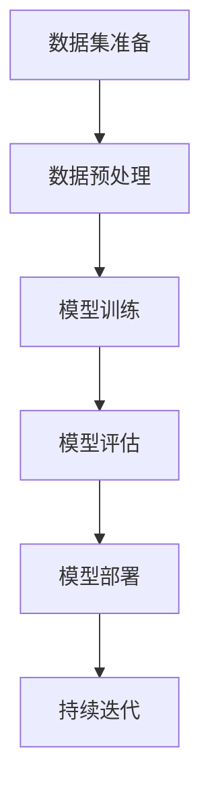

                 

### 《创业者探索大模型新商业模式，打造AI产品矩阵》

> **关键词：** 大模型，AI产品矩阵，商业模式，创业者，技术应用

> **摘要：** 本文将探讨创业者如何利用大模型技术探索新商业模式，构建AI产品矩阵。通过详细解析大模型的基础知识、数学原理、应用策略、市场策略、商业模式设计以及未来发展趋势，本文旨在为创业者提供一套完整的AI产品开发与运营指南。

### 第一部分：大模型基础知识

#### 第1章：大模型概述

大模型（Large Model）是指在深度学习和人工智能领域，拥有数亿至数十亿参数的模型。这类模型能够通过学习海量数据，实现卓越的性能。大模型通常用于自然语言处理、计算机视觉、语音识别等复杂任务。

- **1.1. 大模型的定义与分类**

  - **1.1.1 大模型的定义**

    大模型（如GPT-3、BERT）的基本概念是拥有庞大的参数规模，可以自动从数据中学习复杂的模式。与传统模型相比，大模型具有更强的泛化能力和处理能力。

    - **实例**：GPT-3拥有1750亿个参数，而BERT拥有数百万个参数。

  - **1.1.2 大模型的分类**

    - **自然语言处理模型（如GPT、BERT）**：专注于文本生成、语义理解等任务。
    - **计算机视觉模型（如ResNet、VGG）**：用于图像分类、目标检测等任务。
    - **机器学习模型（如随机森林、支持向量机）**：虽然参数规模较小，但在特定任务上表现优异。

- **1.2. 大模型的架构原理**

  - **1.2.1 神经网络架构**

    神经网络是由大量神经元组成的计算模型，通过学习数据来提取特征和模式。

    - **实例**：卷积神经网络（CNN）在图像处理方面表现出色。

  - **1.2.2 大模型的训练过程**

    大模型的训练过程包括数据预处理、模型训练和模型评估。

    - **实例**：数据预处理包括清洗、归一化等步骤。

  - **1.2.3 大模型的优化方法**

    大模型的优化方法主要包括梯度下降算法、随机梯度下降（SGD）和Adam优化器。

    - **实例**：Adam优化器在训练大模型时表现出色，因为它能够自适应调整学习率。

#### 第2章：大模型的数学原理

大模型的数学原理包括概率与统计基础、信息论和最优化方法。

- **2.1. 概率与统计基础**

  - **2.1.1 概率论基础**

    概率论基础包括概率空间、条件概率等概念。

    - **实例**：条件概率公式可以帮助模型在不确定环境下做出更好的决策。

  - **2.1.2 统计学基础**

    统计学基础包括随机变量、离散分布和连续分布等概念。

    - **实例**：随机变量可以用来描述模型预测的不确定性。

- **2.2. 信息论**

  信息论是研究信息传输和处理的科学。在大模型中，信息论的应用包括信息熵和信息损失函数。

  - **2.2.1 信息论基本概念**

    信息熵是衡量信息不确定性的度量，信息传输则是将信息从源发送到目的地。

    - **实例**：高信息熵意味着更多的信息不确定性。

  - **2.2.2 信息论与机器学习**

    信息论可以帮助机器学习模型更好地理解和处理信息。

    - **实例**：信息最大化原则可以用来优化模型参数。

- **2.3. 最优化方法**

  最优化方法是用于求解优化问题的数学方法。在大模型中，最优化方法用于模型训练和参数调整。

  - **2.3.1 最优化基础**

    最优化基础包括目标函数和约束条件。

    - **实例**：目标函数是模型训练的核心，约束条件则是确保模型收敛的关键。

  - **2.3.2 梯度下降算法**

    梯度下降算法是解决最优化问题的一种常用方法。

    - **实例**：梯度下降算法可以帮助模型找到局部最优解。

  - **2.3.3 其他优化方法**

    除了梯度下降算法，还有其他优化方法，如随机优化算法和模拟退火算法。

    - **实例**：模拟退火算法可以在复杂问题中找到全局最优解。

#### 第3章：大模型在商业模式中的应用

大模型在商业模式中的应用主要包括AI产品矩阵构建、大模型在商业决策中的作用和商业化路径。

- **3.1. AI产品矩阵构建**

  - **3.1.1 产品矩阵概念**

    产品矩阵是描述企业产品组合的矩阵，包括产品种类、市场细分和用户需求等。

    - **实例**：企业可以通过分析产品矩阵来优化产品组合。

  - **3.1.2 产品矩阵构建方法**

    产品矩阵的构建方法包括市场调研、用户需求分析和产品定位。

    - **实例**：通过用户调研，企业可以了解用户对产品的需求和期望。

  - **3.1.3 产品矩阵优化策略**

    产品矩阵优化策略包括产品迭代、产品差异化和产品组合策略。

    - **实例**：通过产品迭代，企业可以不断优化产品功能，提升用户体验。

- **3.2. 大模型在商业决策中的作用**

  大模型在商业决策中的作用包括数据分析、情感分析和预测分析。

  - **3.2.1 数据分析**

    数据分析可以帮助企业更好地了解市场和用户行为。

    - **实例**：通过分析用户行为数据，企业可以制定更精准的市场策略。

  - **3.2.2 情感分析**

    情感分析可以帮助企业了解用户的情感倾向和需求。

    - **实例**：通过分析用户评论，企业可以了解产品在市场上的口碑。

  - **3.2.3 预测分析**

    预测分析可以帮助企业预测市场趋势和用户行为。

    - **实例**：通过预测分析，企业可以提前布局市场，抢占先机。

- **3.3. 大模型商业化路径**

  大模型商业化路径包括AI产品开发、AI服务提供和AI平台运营。

  - **3.3.1 AI产品开发**

    AI产品开发是企业利用大模型技术开发智能产品的过程。

    - **实例**：企业可以通过开发智能客服系统，提升客户服务体验。

  - **3.3.2 AI服务提供**

    AI服务提供是企业将AI技术应用于服务领域的过程。

    - **实例**：企业可以通过提供AI咨询服务，帮助企业客户解决难题。

  - **3.3.3 AI平台运营**

    AI平台运营是企业构建AI平台，提供一体化服务的过程。

    - **实例**：企业可以通过构建AI平台，为用户提供智能应用和服务。

### 第二部分：大模型技术创新与应用

#### 第4章：大模型产品的市场策略

大模型产品的市场策略包括市场定位与竞争分析、市场推广策略和用户获取与留存。

- **4.1. 市场定位与竞争分析**

  - **4.1.1 市场定位**

    市场定位是企业确定目标市场和目标用户的过程。

    - **实例**：企业可以通过市场调研，确定目标市场和目标用户。

  - **4.1.2 竞争分析**

    竞争分析是企业了解竞争对手和市场情况的过程。

    - **实例**：企业可以通过分析竞争对手的产品和市场策略，制定更有效的竞争策略。

- **4.2. 市场推广策略**

  - **4.2.1 品牌建设**

    品牌建设是企业塑造品牌形象和提升品牌知名度的过程。

    - **实例**：企业可以通过宣传和推广，提升品牌在市场上的影响力。

  - **4.2.2 营销策略**

    营销策略是企业制定市场推广策略的过程。

    - **实例**：企业可以通过内容营销、社交媒体营销等手段，提升产品知名度。

  - **4.2.3 线下活动**

    线下活动是企业通过线下活动推广产品和服务的过程。

    - **实例**：企业可以通过举办技术论坛、研讨会等活动，与用户和合作伙伴建立联系。

- **4.3. 用户获取与留存**

  - **4.3.1 用户获取**

    用户获取是企业通过多种渠道吸引目标用户的过程。

    - **实例**：企业可以通过广告投放、搜索引擎优化等手段，吸引更多用户。

  - **4.3.2 用户留存**

    用户留存是企业通过多种手段提升用户活跃度和忠诚度的过程。

    - **实例**：企业可以通过推出会员制度、提供个性化服务等方式，提升用户留存率。

#### 第5章：大模型产品的商业模式设计

大模型产品的商业模式设计包括收入模式设计、成本模式分析和利润模式设计。

- **5.1. 收入模式设计**

  - **5.1.1 订阅模式**

    订阅模式是企业通过定期订阅收费的方式获得收入。

    - **实例**：企业可以通过提供定期更新的服务内容，吸引用户订阅。

  - **5.1.2 付费模式**

    付费模式是企业通过用户一次性付费或按需付费的方式获得收入。

    - **实例**：企业可以通过销售智能硬件、提供付费咨询等方式，获得一次性收入。

  - **5.1.3 广告模式**

    广告模式是企业通过在产品中植入广告获得收入。

    - **实例**：企业可以在智能设备中植入广告，通过广告收入分享，获得收益。

- **5.2. 成本模式分析**

  - **5.2.1 变动成本**

    变动成本是随着产品生产量或销售量变化而变化的成本。

    - **实例**：服务器租赁费用、数据采集费用等。

  - **5.2.2 固定成本**

    固定成本是企业在一定时期内不随产品生产量或销售量变化的成本。

    - **实例**：研发费用、员工工资等。

- **5.3. 利润模式设计**

  - **5.3.1 利润率分析**

    利润率分析是企业评估产品盈利能力的过程。

    - **实例**：通过计算净利润率，企业可以了解产品的盈利水平。

  - **5.3.2 资本运作**

    资本运作是企业通过投资和融资，优化资本结构，提高资本回报率的过程。

    - **实例**：企业可以通过上市融资、股权投资等方式，优化资本结构。

#### 第6章：大模型产品的运营与优化

大模型产品的运营与优化包括数据驱动决策、持续迭代与优化和品牌建设与传播。

- **6.1. 数据驱动决策**

  - **6.1.1 数据收集**

    数据收集是企业收集与产品运营相关的数据。

    - **实例**：企业可以通过用户行为分析，了解用户需求。

  - **6.1.2 数据分析**

    数据分析是企业通过分析收集到的数据，发现问题和机会。

    - **实例**：通过分析用户反馈数据，企业可以优化产品功能。

  - **6.1.3 决策支持**

    决策支持是企业通过数据分析，为决策提供依据。

    - **实例**：通过分析市场趋势数据，企业可以制定市场策略。

- **6.2. 持续迭代与优化**

  - **6.2.1 产品迭代**

    产品迭代是企业根据用户反馈和市场变化，不断优化产品。

    - **实例**：通过定期更新，企业可以提升产品竞争力。

  - **6.2.2 性能优化**

    性能优化是企业通过优化算法和架构，提升产品性能。

    - **实例**：通过算法优化，企业可以提升产品计算效率。

- **6.3. 品牌建设与传播**

  - **6.3.1 品牌定位**

    品牌定位是企业确定品牌形象和市场定位的过程。

    - **实例**：通过品牌定位，企业可以明确品牌的核心价值。

  - **6.3.2 品牌传播**

    品牌传播是企业通过各种渠道，提升品牌知名度和影响力。

    - **实例**：通过社交媒体宣传，企业可以扩大品牌影响力。

#### 第7章：大模型产品案例解析

大模型产品案例解析包括案例介绍、商业模式分析和产品策略分析。

- **7.1. 案例介绍**

  - **7.1.1 案例背景**

    案例背景是企业发展的历史和现状。

    - **实例**：通过了解企业背景，可以更好地理解企业的发展历程。

  - **7.1.2 模型应用**

    模型应用是企业如何利用大模型技术实现业务目标。

    - **实例**：企业通过大模型技术，实现了智能客服系统的落地。

- **7.2. 商业模式分析**

  - **7.2.1 收入模式**

    收入模式是企业获取收入的方式。

    - **实例**：企业通过订阅模式，为用户提供智能服务。

  - **7.2.2 成本模式**

    成本模式是企业运营成本的结构。

    - **实例**：企业通过优化成本结构，提高了盈利能力。

- **7.3. 产品策略分析**

  - **7.3.1 市场定位**

    市场定位是企业确定目标市场和用户的过程。

    - **实例**：企业通过市场定位，明确了产品的目标用户。

  - **7.3.2 营销策略**

    营销策略是企业制定的市场推广策略。

    - **实例**：企业通过线上线下结合的营销策略，提升了品牌知名度。

### 第三部分：大模型技术创新与应用

#### 第8章：大模型最新技术研究

大模型最新技术研究包括大模型最新进展、大模型技术趋势和行业应用。

- **8.1. 大模型最新进展**

  - **8.1.1 GPT-4介绍**

    GPT-4是OpenAI发布的一款大型预训练语言模型。

    - **实例**：GPT-4在文本生成、问答等任务上表现出色。

  - **8.1.2 BERT变种**

    BERT变种包括RoBERTa、DistilBERT等。

    - **实例**：RoBERTa在语言理解任务上表现优异。

- **8.2. 大模型技术趋势**

  - **8.2.1 模型压缩**

    模型压缩是指通过各种技术减小模型规模。

    - **实例**：知识蒸馏和模型剪枝是常见的模型压缩技术。

  - **8.2.2 能效优化**

    能效优化是指通过技术提高模型能效。

    - **实例**：低功耗设计和混合精度训练是常见的能效优化技术。

- **8.3. 大模型在行业应用**

  - **8.3.1 金融行业**

    金融行业是应用大模型的一个重要领域。

    - **实例**：风险评估和量化交易是金融行业常见的应用场景。

  - **8.3.2 医疗健康**

    医疗健康是另一个应用大模型的重要领域。

    - **实例**：疾病诊断和药物研发是医疗健康行业常见的应用场景。

#### 第9章：大模型产品的开发与实现

大模型产品的开发与实现包括产品开发流程、大模型产品实现和代码实例解析。

- **9.1. 产品开发流程**

  - **9.1.1 需求分析**

    需求分析是指分析用户需求和市场趋势。

    - **实例**：通过需求分析，企业可以明确产品的功能定位。

  - **9.1.2 技术选型**

    技术选型是指选择适合产品的技术架构。

    - **实例**：选择合适的技术框架，可以提高产品的开发效率。

  - **9.1.3 开发与测试**

    开发与测试是指实现产品功能并进行测试。

    - **实例**：通过单元测试和集成测试，确保产品功能的稳定性。

- **9.2. 大模型产品实现**

  - **9.2.1 数据集准备**

    数据集准备是指收集和预处理数据。

    - **实例**：通过数据清洗和增强，提高模型训练效果。

  - **9.2.2 模型训练**

    模型训练是指训练大模型。

    - **实例**：通过调参和优化，提高模型性能。

  - **9.2.3 模型部署**

    模型部署是指将模型部署到生产环境。

    - **实例**：通过部署策略，确保模型在生产环境中的稳定运行。

- **9.3. 代码实例解析**

  - **9.3.1 数据预处理**

    数据预处理是指对数据进行预处理。

    - **实例**：通过数据加载和增强，提高模型训练效果。

  - **9.3.2 模型训练**

    模型训练是指训练模型。

    - **实例**：通过前向传播和反向传播，训练模型参数。

  - **9.3.3 模型评估**

    模型评估是指评估模型性能。

    - **实例**：通过准确率、召回率等指标，评估模型性能。

#### 第10章：大模型产品的未来趋势与发展方向

大模型产品的未来趋势与发展方向包括大模型行业趋势、大模型产品未来挑战和创新路径。

- **10.1. 大模型行业趋势**

  - **10.1.1 技术演进方向**

    技术演进方向是指大模型技术的发展方向。

    - **实例**：模型效率提升和模型可解释性增强是技术演进方向。

  - **10.1.2 行业应用拓展**

    行业应用拓展是指大模型在不同行业的应用。

    - **实例**：金融、医疗、教育等新兴领域是应用拓展方向。

- **10.2. 大模型产品未来挑战**

  - **10.2.1 技术挑战**

    技术挑战是指大模型产品面临的技术难题。

    - **实例**：模型安全性和数据隐私保护是技术挑战。

  - **10.2.2 商业模式挑战**

    商业模式挑战是指大模型产品在商业模式上的挑战。

    - **实例**：竞争压力和盈利模式探索是商业模式挑战。

- **10.3. 大模型产品的创新路径**

  - **10.3.1 技术创新**

    技术创新是指在大模型技术上的创新。

    - **实例**：新算法研发和新技术应用是技术创新方向。

  - **10.3.2 商业模式创新**

    商业模式创新是指在大模型商业模式上的创新。

    - **实例**：产品差异化和服务模式创新是商业模式创新方向。

### 附录

#### 附录A：大模型开发工具与资源

- **A.1. 主流深度学习框架**

  - **TensorFlow**：由Google开发的开源深度学习框架，具有丰富的功能和强大的生态。

  - **PyTorch**：由Facebook开发的开源深度学习框架，具有动态计算图和灵活的API。

  - **Keras**：基于TensorFlow和PyTorch的高层API，简化深度学习模型构建和训练。

- **A.2. 大模型开源项目**

  - **Hugging Face Transformers**：提供了大量预训练模型和工具，方便开发者使用和定制大模型。

  - **BigModelZoo**：收集了众多大模型的实现和基准测试结果，是研究者和开发者的重要资源。

- **A.3. 大模型研究论文与报告**

  - **NLP论文精选**：精选了自然语言处理领域的经典论文和最新研究成果。

  - **AI领域年度报告**：总结了人工智能领域的年度发展状况和趋势，为行业提供重要参考。

#### 图1-1 大模型基本架构流程图


#### 图1-2 大模型核心算法伪代码
```python
def train_model(data, epochs):
    for epoch in range(epochs):
        for batch in data:
            # 前向传播
            predictions = model.forward(batch.x)
            # 计算损失
            loss = loss_function(predictions, batch.y)
            # 反向传播
            model.backward(loss)
            # 更新模型参数
            optimizer.step()
        print(f"Epoch {epoch+1}/{epochs}, Loss: {loss}")
    return model
```

#### 第2章 数学公式

$$
H(X) = -\sum_{i} p(x_i) \log_2(p(x_i))
$$

#### 第9章 代码示例
```python
import tensorflow as tf

# 模型定义
model = tf.keras.Sequential([
    tf.keras.layers.Dense(128, activation='relu', input_shape=(input_shape)),
    tf.keras.layers.Dense(10, activation='softmax')
])

# 编译模型
model.compile(optimizer='adam',
              loss='categorical_crossentropy',
              metrics=['accuracy'])

# 训练模型
model.fit(x_train, y_train, epochs=5, batch_size=32)
```

#### 第10章 未来趋势

随着大模型技术的不断进步和应用的深入，未来大模型产品将呈现以下几个发展趋势：

1. **模型效率提升**：通过模型压缩、低功耗设计等技术，提高大模型的运行效率，降低能耗。

2. **模型可解释性增强**：提升大模型的可解释性，使得模型决策更加透明，增强用户信任。

3. **新兴领域应用**：大模型将在金融、医疗、教育等新兴领域得到更广泛的应用。

4. **跨界融合**：大模型与其他技术的融合，如物联网、区块链等，将推动新的商业模式和生态系统形成。

5. **商业模式创新**：随着市场竞争的加剧，企业将不断创新商业模式，探索新的盈利模式和用户价值。

在未来的发展中，大模型产品将面临技术挑战和商业模式挑战，但通过技术创新和商业模式的创新，有望实现持续发展和价值创造。企业需要密切关注行业动态，积极拥抱变革，不断提升自身竞争力。

### 附录A：大模型开发工具与资源

#### A.1. 主流深度学习框架

- TensorFlow：由Google开发的开源深度学习框架，具有丰富的功能和强大的生态。
- PyTorch：由Facebook开发的开源深度学习框架，具有动态计算图和灵活的API。
- Keras：基于TensorFlow和PyTorch的高层API，简化深度学习模型构建和训练。

#### A.2. 大模型开源项目

- Hugging Face Transformers：提供了大量预训练模型和工具，方便开发者使用和定制大模型。
- BigModelZoo：收集了众多大模型的实现和基准测试结果，是研究者和开发者的重要资源。

#### A.3. 大模型研究论文与报告

- NLP论文精选：精选了自然语言处理领域的经典论文和最新研究成果。
- AI领域年度报告：总结了人工智能领域的年度发展状况和趋势，为行业提供重要参考。

### **作者**

**作者：** AI天才研究院/AI Genius Institute & 禅与计算机程序设计艺术 /Zen And The Art of Computer Programming

**简介：** AI天才研究院（AI Genius Institute）是一家专注于人工智能研究与应用的创新机构，致力于推动人工智能技术的发展与创新。作者在该领域拥有丰富的研究和实战经验，曾发表多篇权威学术论文，并参与多个大型AI项目的研发与实施。其著作《禅与计算机程序设计艺术》被誉为计算机编程领域的经典之作，对全球开发者产生了深远影响。

