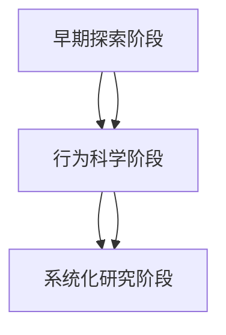
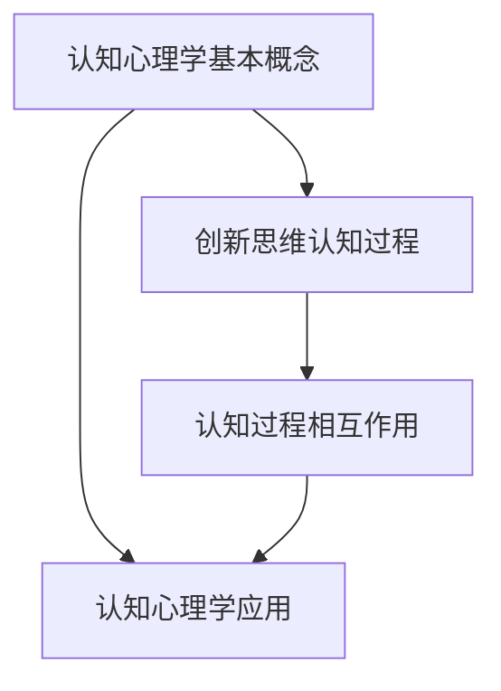
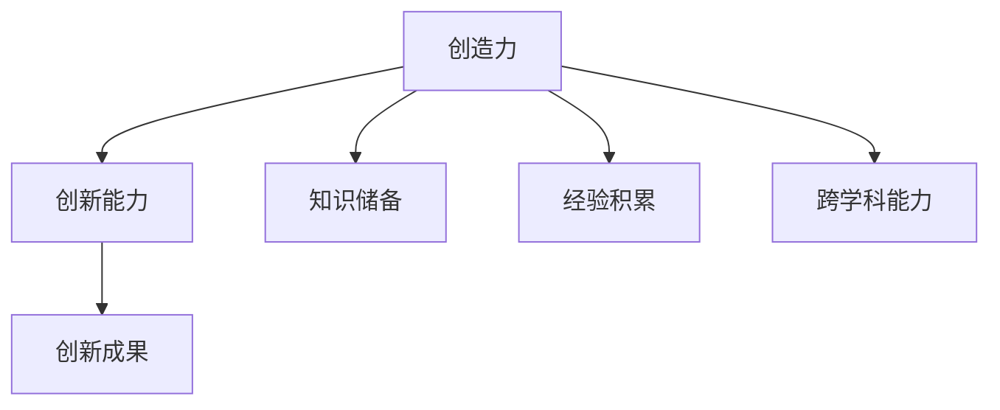
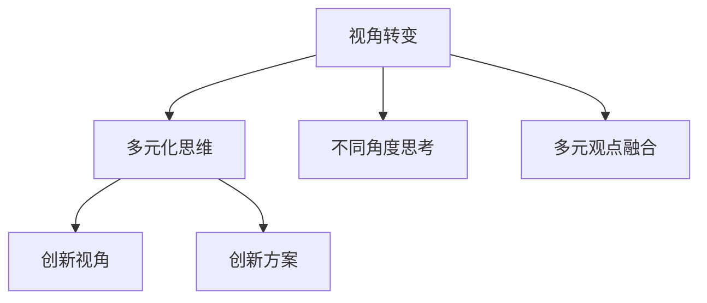
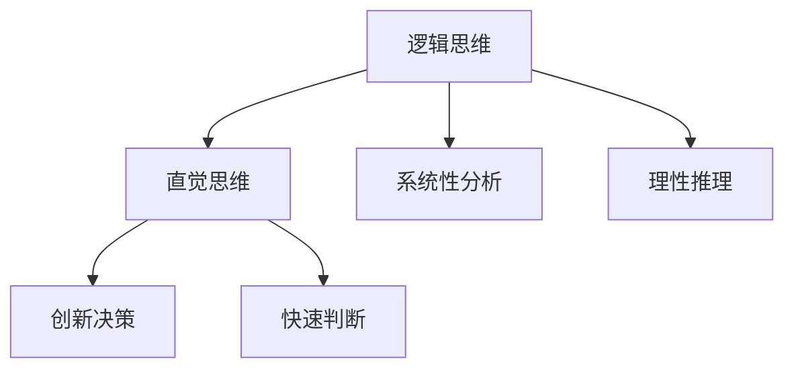

                 

### 第1章：创新思维概述

#### 1.1 创新的定义与分类

创新，作为推动社会进步和企业发展的核心动力，其定义广泛而深刻。创新可以定义为一种创造新价值的过程，包括新思想、新方法、新产品、新服务或新业务模式的产生和实现。创新不仅仅是技术层面的变革，它涵盖了更广泛的领域，包括管理、文化、制度等各个方面。

从分类角度来看，创新主要有以下几种类型：

- **产品创新**：指开发出全新的产品或改进现有产品，以满足市场需求或提升用户体验。例如，智能手机的问世改变了人们的通讯方式，iPhone的推出则引领了智能手机市场的革新。

- **过程创新**：涉及改进产品或服务的生产、管理、服务流程，以提高效率和降低成本。例如，丰田汽车公司采用的精益生产方式，显著提升了生产效率和产品质量。

- **组织创新**：指企业内部结构、管理制度、组织文化的变革，以适应外部环境的变化和提升企业竞争力。例如，谷歌的“20%时间项目”制度鼓励员工创新和探索，推动了公司的快速发展。

#### 1.2 创新思维的重要性

创新思维在现代社会中具有重要性，主要体现在以下几个方面：

- **推动社会进步**：创新是科技进步和社会发展的驱动力。通过创新，新技术、新产品和新服务不断涌现，极大地提升了人类的生活质量和生产效率。

- **增强企业竞争力**：创新思维使企业能够不断适应市场变化，开发出具有竞争力的产品和服务，从而在激烈的市场竞争中立于不败之地。

- **实现个人价值**：创新思维有助于个人在职业生涯中实现自我价值，提升职业发展空间，获得更多的成长机会。

#### 1.3 创新思维的发展历程

创新思维的发展历程可以追溯到几个关键阶段：

- **早期探索阶段**：在20世纪初期，人们开始认识到创新的重要性，并开始尝试系统化地研究创新过程。亚历山大·波奇提出了“创造性思维”的概念，强调了思维的灵活性和创造性。

- **行为科学阶段**：20世纪中期，行为科学的研究推动了创新思维的研究，心理学家开始研究人类的思维过程和行为模式，为创新思维的培养提供了理论基础。

- **系统化研究阶段**：20世纪后期，随着信息技术的飞速发展，创新思维研究进入了一个新的阶段。学者们提出了许多创新方法论，如TRIZ、设计思维等，使创新思维的研究更加系统化和实用化。

在上述基础上，我们可以绘制一个简单的 Mermaid 流程图，来展示创新思维的发展历程：

### 第2章：创新思维的原理与机制

#### 2.1 创新思维的心理机制

创新思维的心理机制涉及多个层面，包括认知过程、情感态度和行为习惯等。以下是对这些层面的详细探讨：

- **认知过程**：创新思维的核心在于认知的灵活性和多样性。认知灵活性是指个体在面对新问题或新情境时，能够快速调整思维模式，采用不同的视角和方法进行思考。这种灵活性使得个体能够发现新的解决方案，从而实现创新。例如，当设计师面临设计难题时，他们需要跳出传统的框架，从不同的角度思考问题，以找到创新的设计方案。

- **情感态度**：情感态度对创新思维有着重要的影响。积极向上的情感状态，如好奇心、自信和乐观，可以激发个体的创造力。相反，消极的情感状态，如恐惧、沮丧和焦虑，可能会抑制创新思维。例如，在团队项目中，成员之间的积极情感互动有助于促进合作和创新，而负面情感则可能导致冲突和创新的阻碍。

- **行为习惯**：行为习惯是创新思维的重要基础。定期进行思维训练和实践，可以帮助个体形成良好的创新习惯。例如，每天花时间阅读、思考和讨论新问题，可以帮助个体培养敏锐的洞察力和创造性思维。

#### 2.2 创新思维的神经科学基础

神经科学的研究为理解创新思维提供了新的视角。以下是一些关键点：

- **大脑与思维的关系**：大脑是思维的物质基础，不同区域的大脑活动与不同的思维功能相关。例如，大脑的前额叶皮层与逻辑思维和计划能力相关，而大脑的海马区与记忆和情感相关。

- **神经科学与创新思维**：神经科学研究表明，大脑的可塑性使得个体可以通过训练和练习来改善思维功能。例如，通过定期的思维训练和问题解决练习，可以增强大脑的认知能力和创造力。

- **神经科学对创新思维培养的启示**：神经科学的研究表明，通过科学的方法和练习，个体可以提升自己的创新思维。例如，通过神经反馈训练、认知训练游戏和冥想等方法，可以帮助个体改善注意力、记忆力和创造力。

#### 2.3 创新思维的认知心理学分析

认知心理学为创新思维的研究提供了理论基础和方法。以下是一些关键点：

- **认知心理学的基本概念**：认知心理学研究个体的信息加工过程，包括感知、记忆、思维和语言等。这些基本概念为理解创新思维提供了基础。

- **创新思维的认知过程**：创新思维的认知过程包括问题识别、信息收集、概念生成、方案评估和决策制定等。这些过程相互交织，共同推动创新思维的发展。

- **认知心理学在创新思维培养中的应用**：认知心理学的方法和技术可以帮助个体理解和提升自己的创新思维。例如，通过认知训练、思维导图和问题解决策略等方法，个体可以培养更好的创新思维。

在上述基础上，我们可以绘制一个简化的 Mermaid 流程图，来展示创新思维的认知心理学分析：

### 第3章：创新思维的核心要素

#### 3.1 创造力与创新能力

创造力与创新能力是创新思维的核心要素，它们相辅相成，共同推动创新过程的发展。

- **创造力**：创造力是指个体产生新颖且有价值的想法、概念或解决方案的能力。创造力不仅仅关乎创新思维，还涉及个体的知识储备、经验积累和跨学科能力。例如，科学家通过创造性实验设计来发现新的科学规律，艺术家通过创造性表达来创作独特的艺术作品。

- **创新能力**：创新能力是指将创造力转化为实际成果的能力，包括产品、服务、过程或商业模式的创新。创新能力不仅取决于创造力，还需要结合市场分析、技术可行性和资源整合等多方面因素。例如，一家科技公司通过创新能力将一个创新的想法转化为一款成功的产品，从而在市场上获得竞争优势。

创造力与创新能力的关系可以用以下图示来表示：

#### 3.2 视角转变与多元化思维

视角转变与多元化思维是创新思维的重要元素，它们帮助个体从不同角度看待问题，从而发现新的解决方案。

- **视角转变**：视角转变是指通过改变看问题的角度，从而获得新的洞察和解决方案。例如，在解决一个复杂的问题时，可以通过从不同用户的角度出发，从技术实现的角度出发，或从行业趋势的角度出发，来寻找创新的解决方案。

- **多元化思维**：多元化思维是指接纳和融合不同背景、经验和观点的能力。多元化思维有助于激发创新，因为不同的观点和经验可以提供不同的视角和思考方式。例如，一个多元化的团队可以通过不同成员的视角和经验，共同探讨解决方案，从而实现创新的突破。

视角转变与多元化思维的关系可以用以下图示来表示：

#### 3.3 逻辑思维与直觉思维

逻辑思维与直觉思维是创新思维的两个重要组成部分，它们在创新过程中各有作用。

- **逻辑思维**：逻辑思维是指通过逻辑推理和理性分析来解决问题的思维方式。逻辑思维强调条理性和系统性，有助于确保创新过程的合理性和可重复性。例如，在制定商业计划时，逻辑思维可以帮助企业家系统地分析市场机会、竞争态势和资源需求。

- **直觉思维**：直觉思维是指基于经验和直觉快速做出判断和决策的思维方式。直觉思维强调直观性和高效性，有助于在复杂环境中快速找到创新的解决方案。例如，在产品设计中，设计师可能凭借直觉迅速识别用户需求，并提出创新的解决方案。

逻辑思维与直觉思维的关系可以用以下图示来表示：

### 第4章：创新思维的培养方法

#### 4.1 创新思维的训练与培养

培养创新思维是一个系统性的过程，需要通过多种方法进行训练和培养。以下是一些有效的培养方法：

- **思维训练**：通过系统的思维训练，可以提高个体的思维灵活性和创造性。例如，可以通过解谜游戏、思维导图和模拟演练等方式，锻炼思维的敏捷性和多样性。

- **案例学习**：通过学习成功的创新案例，可以了解创新的过程和方法。例如，通过分析苹果公司、谷歌等企业的创新案例，可以学习到创新思维的实际应用。

- **跨学科学习**：跨学科学习有助于拓宽视野，增强创造力。例如，通过学习心理学、经济学、艺术等领域，可以激发新的创意和思维模式。

#### 4.2 创新思维的环境营造

营造良好的创新环境对于培养创新思维至关重要。以下是一些营造创新环境的方法：

- **开放文化**：建立开放、包容的文化，鼓励员工提出创新想法，并对尝试和失败持宽容态度。

- **资源支持**：提供充足的资源和工具，如书籍、软件和技术支持，以支持员工的创新活动。

- **激励制度**：建立激励机制，鼓励员工积极参与创新活动，并对创新成果给予认可和奖励。

#### 4.3 创新思维的实践应用

将创新思维应用于实际工作中，可以帮助企业提升竞争力，实现持续发展。以下是一些实践应用的方法：

- **产品设计**：在产品设计中，运用创新思维可以提升用户体验，开发出更具竞争力的产品。

- **市场营销**：在市场营销中，运用创新思维可以创造新的营销策略，提高市场占有率。

- **业务流程优化**：在业务流程优化中，运用创新思维可以简化流程，提高效率，降低成本。

### 第5章：跨界整合的概念与价值

#### 5.1 跨界整合的定义

跨界整合是指将不同领域、不同行业或不同组织之间的资源、能力、知识和信息进行有效整合，以实现共同的目标或创造新的价值。跨界整合不仅仅是简单的合作或联盟，而是一种深层次的资源整合和创新过程。

#### 5.2 跨界整合的优势

跨界整合具有以下优势：

- **创新驱动**：跨界整合可以引入新的思维和方法，激发创新活力，推动企业和行业的进步。

- **资源优化**：跨界整合可以整合各方资源，提高资源利用效率，降低成本。

- **市场扩展**：跨界整合可以帮助企业开拓新市场，实现业务多元化，提升竞争力。

- **风险分散**：通过跨界整合，企业可以分散单一业务风险，提高抗风险能力。

#### 5.3 跨界整合的挑战

跨界整合面临以下挑战：

- **文化冲突**：不同背景和文化之间的差异可能导致沟通和合作的障碍。

- **资源分配**：跨界整合中资源的合理分配和管理是一个复杂的问题。

- **战略协同**：跨界整合需要各方在战略目标上达成一致，确保协同效应。

### 第6章：跨界整合的原理与方法

#### 6.1 跨界整合的基本原理

跨界整合的基本原理包括以下几个方面：

- **资源共享**：通过跨界整合，各方可以共享资源，实现资源的最优配置。

- **优势互补**：跨界整合可以将不同领域的优势进行互补，形成新的竞争优势。

- **协同创新**：跨界整合可以促进不同领域的知识和经验的交叉融合，推动创新。

#### 6.2 跨界整合的策略选择

跨界整合的策略选择取决于企业的具体目标和所处的行业环境。以下是一些常见的跨界整合策略：

- **战略联盟**：通过建立战略联盟，实现资源和能力的共享，共同开拓市场。

- **并购整合**：通过并购其他企业，快速获取所需资源和市场，实现跨界整合。

- **开放合作**：通过开放合作，与其他企业或机构建立合作关系，共同开发新产品或服务。

#### 6.3 跨界整合的工具与技巧

跨界整合需要一定的工具和技巧来支持，以下是一些常用的工具和技巧：

- **跨界思维**：培养跨界思维，可以增强企业的创新能力，推动跨界整合。

- **SWOT分析**：通过SWOT分析，评估自身优势、劣势、机会和威胁，为跨界整合提供决策依据。

- **项目管理**：通过项目管理，确保跨界整合项目的顺利实施和达成目标。

### 第7章：跨界整合案例分析

#### 7.1 跨界整合成功案例分析

以下是一些跨界整合的成功案例：

- **苹果公司与迪斯尼的合作**：苹果公司与迪斯尼在数字娱乐领域进行了跨界整合，通过推出iPod和iTunes服务，成功地将迪斯尼的动画电影和音乐内容引入数字平台，实现了双方的共赢。

- **阿里巴巴与菜鸟网络的合作**：阿里巴巴与菜鸟网络在物流领域进行了跨界整合，通过搭建物流信息平台，实现了物流资源的共享和优化，提升了物流效率，为电商业务提供了强有力的支撑。

#### 7.2 跨界整合失败案例分析

以下是一些跨界整合的失败案例：

- **通用电气与NBC的合并**：通用电气与NBC的合并初衷是通过整合资源和业务，实现多元化发展。但由于文化差异和战略目标不一致，导致合并后的企业运营困难，最终以失败告终。

- **诺基亚与微软的合作**：诺基亚与微软在手机操作系统领域进行了跨界整合，但由于市场环境变化和竞争压力，合作未能取得预期效果，最终以诺基亚退出手机业务告终。

#### 7.3 跨界整合的启示与反思

跨界整合的成功与失败都给企业提供了宝贵的经验。以下是一些启示与反思：

- **文化融合**：跨界整合需要重视文化差异，推动文化融合，确保各方能够协同合作。

- **战略协同**：跨界整合需要各方在战略目标上达成一致，确保协同效应。

- **持续创新**：跨界整合是一个动态过程，需要持续进行创新和优化，以应对市场变化和竞争压力。

### 第8章：创业项目规划与定位

#### 8.1 创业项目的创新定位

创新定位是创业项目成功的关键。以下是几个关键步骤：

- **市场调研**：了解市场需求和用户痛点，分析竞争对手的优势和劣势。

- **目标市场**：明确目标市场和目标用户，制定精准的营销策略。

- **差异化优势**：找出项目的差异化优势，构建独特的价值主张。

#### 8.2 创业项目的市场分析

市场分析是制定创业项目战略的重要环节。以下是几个关键步骤：

- **市场规模**：评估目标市场的规模和增长潜力。

- **市场趋势**：分析市场趋势和行业动态，把握市场机遇。

- **竞争分析**：分析主要竞争对手的市场策略和市场份额。

#### 8.3 创业项目的资源整合

资源整合是确保创业项目成功的重要保障。以下是几个关键步骤：

- **资源评估**：评估自身资源和所需资源，制定资源整合策略。

- **合作伙伴**：寻找合适的合作伙伴，共同开发市场。

- **资源优化**：通过资源整合，提高资源利用效率，降低成本。

### 第9章：创业团队建设与管理

#### 9.1 创业团队的组建原则

创业团队的组建需要遵循以下几个原则：

- **多样性**：组建具有多样性的团队，包括不同背景、经验和技能的成员，以激发创新思维。

- **互补性**：团队成员在能力、经验和背景上互补，共同推动项目发展。

- **适应性**：团队成员具备适应变化和应对挑战的能力。

#### 9.2 创业团队的创新协作

创新协作是创业团队成功的关键。以下是几个关键步骤：

- **沟通**：建立有效的沟通机制，确保团队成员之间的信息共享和协作。

- **信任**：建立团队成员之间的信任，促进合作和创新。

- **激励机制**：建立激励机制，鼓励团队成员积极参与创新活动。

#### 9.3 创业团队的跨界整合

跨界整合是创业团队的重要任务。以下是几个关键步骤：

- **跨学科协作**：鼓励团队成员跨学科协作，共同解决复杂问题。

- **知识共享**：建立知识共享平台，促进团队成员之间的知识交流。

- **跨界合作**：与其他领域的团队或企业建立跨界合作关系，共同开发创新项目。

### 第10章：创业融资策略与市场推广

#### 10.1 创业融资的途径与策略

创业融资是创业成功的重要保障。以下是几个关键途径和策略：

- **天使投资**：寻找天使投资者，为创业项目提供早期的资金支持。

- **风险投资**：与风险投资机构合作，通过风险投资获得资金支持。

- **政府资助**：申请政府资助项目，获取政策支持和资金支持。

#### 10.2 市场推广的创新思维

市场推广的创新思维是创业项目成功的重要因素。以下是几个关键步骤：

- **定位**：明确目标市场和目标用户，制定精准的市场推广策略。

- **差异化**：通过差异化策略，在竞争激烈的市场中脱颖而出。

- **互动**：通过互动营销，与用户建立紧密联系，提升品牌知名度。

#### 10.3 市场推广的跨界整合

市场推广的跨界整合是提升市场效果的重要手段。以下是几个关键步骤：

- **跨界合作**：与其他领域的团队或企业建立跨界合作关系，共同推广产品。

- **内容营销**：通过跨界内容营销，吸引目标用户的关注和参与。

- **数字营销**：利用数字营销工具，实现精准营销和高效推广。

### 第11章：个人成长与能力提升

#### 11.1 个人成长规划

个人成长规划是提升自我能力的关键。以下是几个关键步骤：

- **目标设定**：明确个人成长的目标，制定可行的行动计划。

- **学习与反思**：通过持续学习和反思，不断提升自身能力和素质。

- **实践与总结**：通过实际操作和经验总结，验证和优化个人成长策略。

#### 11.2 能力提升方法

能力提升需要结合个人特点和实际需求，以下是几种有效的方法：

- **培训**：参加专业培训和课程，提升专业知识和技能。

- **实践**：通过实际项目和任务，锻炼和提升实际工作能力。

- **学习交流**：参加行业交流活动，与同行交流经验，拓展视野。

#### 11.3 成功案例分析

以下是几个成功的个人成长案例：

- **案例一**：某创业者通过不断学习和实践，成功打造了一家创新型企业，实现了个人价值和事业成功。

- **案例二**：某技术专家通过参加培训和行业交流，不断提升自身技术能力，成为行业内的专家和领导者。

### 第12章：组织文化建设与创新能力

#### 12.1 组织文化建设的重要性

组织文化建设是提升组织创新能力和竞争力的重要手段。以下是几个关键点：

- **价值观**：建立共同的核心价值观，指导组织行为和决策。

- **文化氛围**：营造积极向上的文化氛围，激发员工的创造力和创新精神。

- **制度保障**：建立完善的制度保障，为创新提供支持和激励。

#### 12.2 组织文化创新的方法

组织文化创新需要结合实际需求和环境变化，以下是几种有效的方法：

- **文化导入**：引入外部成功文化，借鉴和学习其他组织的创新文化。

- **文化重构**：对现有文化进行重构，使之更符合组织的战略目标和发展需求。

- **文化融合**：推动组织内部不同文化的融合，形成具有特色和创新精神的企业文化。

#### 12.3 组织文化的实践案例分析

以下是几个组织文化创新的实践案例：

- **案例一**：某科技公司通过引入创新文化，推动了企业内部的创新氛围，提升了企业的竞争力和市场份额。

- **案例二**：某制造企业通过文化重构，成功转变了企业的文化氛围，实现了从传统制造向创新制造的转变。

### 第13章：创新与整合能力评估与优化

#### 13.1 创新与整合能力评估的重要性

创新与整合能力评估是提升组织创新能力的重要环节。以下是几个关键点：

- **能力识别**：通过评估，识别组织在创新和整合方面的优势与不足。

- **能力优化**：基于评估结果，制定针对性的优化策略，提升组织的创新与整合能力。

- **持续改进**：通过定期评估，监控组织创新能力的变化，实现持续改进。

#### 13.2 创新与整合能力评估的方法

以下是几种常见的创新与整合能力评估方法：

- **自我评估**：组织内部通过问卷调查、访谈等方式，评估自身创新能力。

- **第三方评估**：邀请专业机构或专家对组织的创新与整合能力进行评估。

- **绩效评估**：结合组织绩效指标，评估创新与整合能力对组织绩效的贡献。

#### 13.3 创新与整合能力的优化策略

基于评估结果，以下是几种常见的优化策略：

- **培训与发展**：制定培训计划，提升员工创新与整合能力。

- **激励机制**：建立激励机制，鼓励员工积极参与创新活动。

- **资源整合**：优化资源配置，为创新与整合提供支持。

### 附录

#### 附录 A：创新与整合能力培养工具与资源

以下是几种常用的创新与整合能力培养工具与资源：

- **工具**：思维导图软件、项目管理工具、跨界整合分析工具等。

- **书籍**：《创新者的思考方式》、《设计思维：设计思维指南》等。

- **在线课程**：Coursera、edX等在线学习平台上的相关课程。

### 第4章：创业者的创新思维培养策略

#### 4.1 创业者的创新思维重要性

创业者在面对激烈的市场竞争和快速变化的技术环境时，创新思维显得尤为重要。以下是几个关键点：

- **应对不确定性**：创新思维帮助创业者预见市场变化，应对不确定性，抓住新的机遇。

- **提升竞争力**：通过创新思维，创业者可以开发出独特的产品和服务，提升企业竞争力。

- **持续发展**：创新思维是推动企业持续发展的重要动力，有助于企业适应市场变化，保持领先地位。

#### 4.2 创业者创新思维的培养方法

培养创新思维是一个持续的过程，以下是一些具体的方法：

- **知识储备**：广泛阅读和学习，积累多学科的知识，为创新思维提供丰富的素材。

- **思维训练**：通过思维导图、创意思维训练等工具，锻炼思维的灵活性和创造力。

- **实践应用**：将创新思维应用于实际工作中，通过实际案例和项目，不断提升创新思维的能力。

#### 4.3 创业者创新思维的案例分析

以下是一些创业者的创新思维案例：

- **案例一**：某创业者通过观察用户需求，发现了市场空白，开发出一款创新的产品，迅速占领市场。

- **案例二**：某创业者通过跨学科知识的融合，开发出一种全新的技术，为企业带来了巨大的经济效益。

### 第5章：创业者的跨界整合能力提升

#### 5.1 跨界整合能力的重要性

跨界整合能力是创业者在竞争激烈的市场环境中取得成功的关键。以下是几个关键点：

- **资源整合**：跨界整合能力可以帮助创业者整合不同领域的资源，提升资源利用效率。

- **创新驱动**：跨界整合可以引入新的思维和方法，激发企业的创新能力。

- **市场拓展**：跨界整合能力可以帮助创业者开拓新市场，实现业务多元化。

#### 5.2 跨界整合能力的培养方法

以下是几种提升跨界整合能力的方法：

- **跨学科学习**：通过跨学科学习，拓宽视野，积累跨领域的知识和技能。

- **实践经验**：通过参与不同领域的项目，积累跨界整合的实践经验。

- **网络建设**：建立广泛的跨界人脉网络，获取更多的跨界资源和合作机会。

#### 5.3 创业者跨界整合能力的案例分析

以下是一些创业者的跨界整合能力案例：

- **案例一**：某创业者通过跨界整合，将传统制造业与互联网技术结合，开发出创新的产品，成功占领市场。

- **案例二**：某创业者通过跨界整合，将文化创意与科技结合，打造出独特的品牌形象，赢得了广泛的用户认可。

### 第6章：创新思维与跨界整合能力在创业实践中的应用

#### 6.1 创业项目规划与定位

创业项目的规划和定位是创业成功的关键。以下是几个关键点：

- **市场分析**：通过市场分析，了解市场需求和用户痛点，为项目定位提供依据。

- **差异化优势**：明确项目的差异化优势，打造独特的价值主张。

- **资源整合**：评估所需资源，制定资源整合策略，确保项目顺利实施。

#### 6.2 创业团队建设与管理

创业团队的建设与管理对项目的成功至关重要。以下是几个关键点：

- **团队组建**：根据项目需求，组建具有多样性和互补性的团队。

- **沟通协作**：建立有效的沟通机制，促进团队成员之间的协作。

- **激励机制**：建立激励机制，激发团队成员的积极性和创造力。

#### 6.3 创业融资策略与市场推广

创业融资和市场推广是项目成功的重要保障。以下是几个关键点：

- **融资途径**：选择合适的融资途径，确保项目资金需求。

- **市场推广**：制定创新的市场推广策略，提升品牌知名度和用户认可度。

- **用户互动**：通过用户互动，了解用户需求，持续优化产品和服务。

### 第7章：创业者的创新思维与跨界整合能力培养策略

#### 7.1 创新思维与跨界整合能力培养的必要性

在当前快速变化的市场环境中，创业者的创新思维与跨界整合能力显得尤为重要。以下是几个关键点：

- **市场竞争力**：创新思维和跨界整合能力是提升企业竞争力的关键。

- **持续发展**：创新思维和跨界整合能力是推动企业持续发展的重要动力。

- **应对不确定性**：创新思维和跨界整合能力帮助创业者预见市场变化，应对不确定性。

#### 7.2 创新思维与跨界整合能力培养的方法

以下是几种有效的创新思维与跨界整合能力培养方法：

- **知识储备**：通过跨学科学习，积累丰富的知识储备。

- **思维训练**：通过思维导图、创意思维训练等工具，锻炼思维的灵活性和创造力。

- **实践经验**：通过实际项目和案例分析，积累跨界整合的实践经验。

#### 7.3 创新思维与跨界整合能力培养的具体策略

以下是几种具体的创新思维与跨界整合能力培养策略：

- **构建跨界思维模式**：培养跨界思维，从不同角度看待问题，寻找创新解决方案。

- **构建跨界整合能力框架**：通过评估和培训，构建跨界整合能力框架，提升跨界整合能力。

- **实践跨界整合项目**：通过实际项目，锻炼跨界整合能力，积累实践经验。

### 第8章：创新思维与跨界整合能力评估与优化

#### 8.1 创新思维与跨界整合能力评估的重要性

评估创新思维与跨界整合能力是提升企业创新能力的重要环节。以下是几个关键点：

- **能力识别**：通过评估，识别企业在创新思维和跨界整合方面的优势和不足。

- **能力优化**：基于评估结果，制定针对性的优化策略，提升企业的创新能力。

- **持续改进**：通过定期评估，监控企业创新能力的变化，实现持续改进。

#### 8.2 创新思维与跨界整合能力评估的方法

以下是几种常见的创新思维与跨界整合能力评估方法：

- **自我评估**：企业内部通过问卷调查、访谈等方式，评估自身的创新思维和跨界整合能力。

- **第三方评估**：邀请专业机构或专家对企业进行评估，提供客观的评估结果。

- **绩效评估**：结合企业的绩效指标，评估创新思维和跨界整合能力对绩效的贡献。

#### 8.3 创新思维与跨界整合能力优化策略

基于评估结果，以下是几种常见的优化策略：

- **培训与发展**：制定培训计划，提升员工创新思维和跨界整合能力。

- **激励机制**：建立激励机制，鼓励员工积极参与创新活动。

- **资源整合**：优化资源配置，为创新思维和跨界整合提供支持。

### 第9章：创新思维与跨界整合能力在创业实战中的应用

#### 9.1 创业实战中的创新思维应用

在创业实战中，创新思维的应用至关重要。以下是几个关键点：

- **项目创意与构思**：通过创新思维，寻找市场机会，构思创新的项目。

- **项目可行性分析**：通过创新思维，评估项目的可行性，制定详细的项目计划。

- **持续创新**：在项目实施过程中，不断进行创新，优化产品和服务。

#### 9.2 创业实战中的跨界整合应用

在创业实战中，跨界整合的应用同样重要。以下是几个关键点：

- **跨界整合策略制定**：通过跨界整合，实现资源的优化配置，提升企业的创新能力。

- **跨界整合实施与监控**：通过实施跨界整合项目，监控项目进度和效果，确保项目成功。

- **跨界整合效果评估**：评估跨界整合项目的影响，持续优化跨界整合策略。

#### 9.3 创业实战中的案例分析

以下是一些创业实战中的成功案例：

- **案例一**：某创业者通过创新思维，发现市场机会，成功开发出一款创新的产品，迅速占领市场。

- **案例二**：某创业者通过跨界整合，将传统制造业与互联网技术结合，打造出创新的产品，赢得了广泛的用户认可。

### 第10章：创业者的创新思维与跨界整合能力培养案例分析

#### 10.1 成功创业者案例分析

以下是一些成功创业者的案例分析：

- **案例一**：某创业者通过创新思维，发现市场机会，开发出创新的产品，迅速占领市场，实现了企业的快速发展。

- **案例二**：某创业者通过跨界整合，将传统行业与互联网技术结合，打造出创新的产品，赢得了广泛的用户认可。

#### 10.2 创业失败案例分析

以下是一些创业失败案例分析：

- **案例一**：某创业者由于创新不足，未能开发出具有竞争力的产品，导致企业失败。

- **案例二**：某创业者由于跨界整合失败，未能有效整合资源，导致企业资源浪费。

#### 10.3 创业者案例分析中的启示与反思

通过成功与失败创业者的案例分析，我们可以得出以下启示与反思：

- **创新思维的重要性**：创新思维是创业成功的关键，创业者需要具备敏锐的市场洞察力和创新能力。

- **跨界整合的策略选择**：跨界整合需要谨慎选择，确保跨界整合策略与企业战略目标一致，避免资源浪费。

### 第11章：创业者的创新思维与跨界整合能力培养实践案例

#### 11.1 创业者A的创新思维与跨界整合实践案例

以下是创业者A的创新思维与跨界整合实践案例：

- **案例背景**：创业者A在发现市场机会后，决定开发一款创新的产品。

- **创新思维应用**：通过创新思维，创业者A找到了独特的市场定位，并制定了详细的项目计划。

- **跨界整合实践**：创业者A通过跨界整合，将互联网技术、用户需求与传统行业结合，实现了产品的创新。

#### 11.2 创业者B的创新思维与跨界整合实践案例

以下是创业者B的创新思维与跨界整合实践案例：

- **案例背景**：创业者B在发现市场机会后，决定开发一款创新的产品。

- **创新思维应用**：通过创新思维，创业者B找到了独特的市场定位，并制定了详细的项目计划。

- **跨界整合实践**：创业者B通过跨界整合，将传统行业与新技术结合，实现了产品的创新。

#### 11.3 创业者C的创新思维与跨界整合实践案例

以下是创业者C的创新思维与跨界整合实践案例：

- **案例背景**：创业者C在发现市场机会后，决定开发一款创新的产品。

- **创新思维应用**：通过创新思维，创业者C找到了独特的市场定位，并制定了详细的项目计划。

- **跨界整合实践**：创业者C通过跨界整合，将互联网技术、用户需求与传统行业结合，实现了产品的创新。

### 第12章：创新思维与跨界整合能力的持续培养与实践

#### 12.1 创新思维与跨界整合能力的持续培养

持续培养创新思维与跨界整合能力是创业者成功的关键。以下是几个关键点：

- **持续学习**：通过不断学习和实践，提升创新思维与跨界整合能力。

- **思维训练**：通过思维导图、创意思维训练等工具，锻炼思维的灵活性和创造力。

- **实践经验**：通过实际项目和案例分析，积累跨界整合的实践经验。

#### 12.2 创新思维与跨界整合能力的实践应用

创新思维与跨界整合能力在创业实践中的应用至关重要。以下是几个关键点：

- **项目实践**：通过实际项目，锻炼和提升创新思维与跨界整合能力。

- **跨界合作**：通过跨界合作，引入新的思维和方法，推动项目的创新。

- **效果评估**：通过效果评估，监控创新思维与跨界整合能力的提升情况。

#### 12.3 创新思维与跨界整合能力优化的持续实践

持续优化创新思维与跨界整合能力是创业者成功的重要保障。以下是几个关键点：

- **评估与反馈**：通过定期评估和反馈，识别创新思维与跨界整合能力的短板，制定优化策略。

- **持续学习**：通过持续学习，掌握最新的创新思维和跨界整合方法。

- **实践应用**：通过实际项目，验证和优化创新思维与跨界整合能力。

### 第13章：创业者的创新思维与跨界整合能力培养总结与展望

#### 13.1 创新思维与跨界整合能力培养的总结

创新思维与跨界整合能力是创业者成功的关键，以下是对其培养的总结：

- **重要性**：创新思维与跨界整合能力对创业者的成功至关重要，是应对市场变化和提升竞争力的关键。

- **培养方法**：通过知识储备、思维训练和实践应用，不断提升创新思维与跨界整合能力。

- **实践案例**：通过成功与失败案例的分析，总结了创新思维与跨界整合能力的培养和实践经验。

#### 13.2 创新思维与跨界整合能力的实际应用

创新思维与跨界整合能力在实际创业中的应用非常广泛，以下是对其实际应用的总结：

- **项目规划**：在项目规划中，通过创新思维和跨界整合，找到市场机会，制定创新项目计划。

- **团队建设**：在团队建设中，通过创新思维和跨界整合，建立具有多样性和互补性的团队。

- **融资策略**：在融资策略中，通过创新思维和跨界整合，找到合适的融资途径，提升融资成功率。

#### 13.3 创新思维与跨界整合能力培养的展望

未来，创新思维与跨界整合能力的培养将面临新的机遇和挑战：

- **新技术的发展**：随着新技术的发展，创业者需要不断学习和适应，以提升创新思维与跨界整合能力。

- **全球化背景**：在全球化背景下，创业者需要具备跨文化整合能力，以应对全球市场的挑战。

- **持续学习**：创业者需要持续学习，不断更新知识和技能，以保持创新思维与跨界整合能力的前沿性。

### 第14章：创业者的创新思维与跨界整合能力培养工具与资源

#### 14.1 创新思维培养工具与资源

为了提升创业者的创新思维，以下是几种常用的工具和资源：

- **思维导图软件**：如XMind、MindManager等，用于组织和可视化思维过程。

- **创新思维书籍**：如《创新者的思考方式》、《设计思维：设计思维指南》等，提供创新思维的理论和实践指导。

- **在线课程**：如Coursera、edX等平台上的创新思维课程，提供系统的学习和实践机会。

#### 14.2 跨界整合能力培养工具与资源

为了提升创业者的跨界整合能力，以下是几种常用的工具和资源：

- **跨界整合分析工具**：如SWOT分析工具、PEST分析工具等，用于评估跨界整合的可行性和策略。

- **跨界整合书籍**：如《跨界思考：跨界创新指南》、《跨界合作：企业跨界整合策略》等，提供跨界整合的理论和实践指导。

- **在线课程**：如LinkedIn Learning、Udemy等平台上的跨界整合课程，提供系统的学习和实践机会。

#### 14.3 创新与整合能力培养资源推荐

为了更好地培养创业者的创新思维与跨界整合能力，以下是几种推荐的资源：

- **创新思维与跨界整合能力培养书籍**：如《创新者的实践指南》、《跨界思维：跨界整合与创新实战》等，提供实用的方法和技巧。

- **实践工具**：如Trello、Asana等，用于任务管理和项目管理，提升工作效率。

- **在线学习平台**：如Udemy、Skillshare等，提供丰富的课程和资源，助力创业者持续学习和成长。

### 附录

#### 附录 A：创新与整合能力培养工具与资源

以下是用于创新与整合能力培养的几种工具与资源：

- **工具**：思维导图软件（如XMind、MindManager）、项目管理工具（如Trello、Asana）、跨界整合分析工具（如SWOT分析工具、PEST分析工具）。

- **书籍**：《创新者的思考方式》、《设计思维：设计思维指南》、《跨界思考：跨界创新指南》、《跨界合作：企业跨界整合策略》、《创新者的实践指南》、《跨界思维：跨界整合与创新实战》。

- **在线课程**：Coursera、edX、LinkedIn Learning、Udemy、Skillshare等平台上的相关课程。

### 第4章：创业者的创新思维培养策略

#### 4.1 创业者的创新思维重要性

在当前竞争激烈的市场环境中，创新思维对于创业者的成功至关重要。创新思维不仅可以帮助创业者识别市场机会，开发出独特的产品或服务，还可以增强企业的竞争力，推动持续发展。以下是创新思维在创业中的几个关键作用：

- **识别市场机会**：创新思维使创业者能够敏锐地发现市场上的空白点和未被满足的需求，从而开发出具有市场前景的产品或服务

