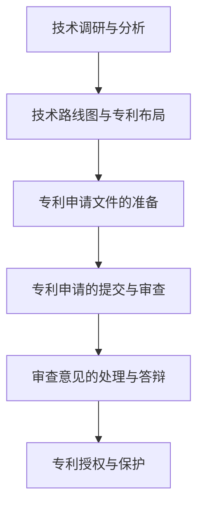
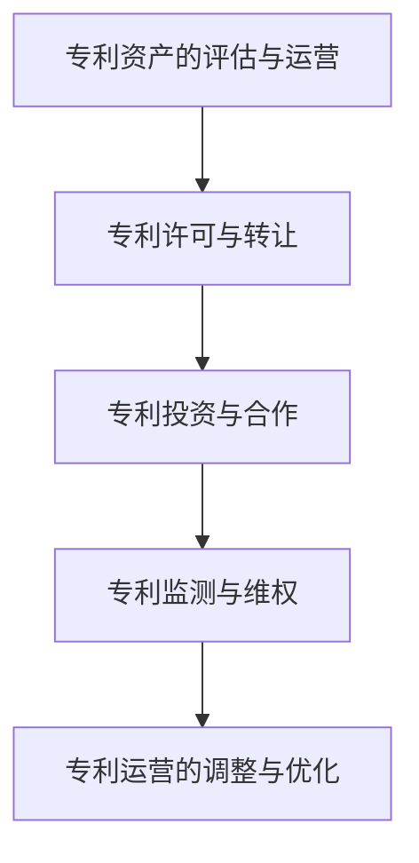

                 

# 创业路上的专利战略：技术创新保护的长期规划方案

## 关键词：
- 创业
- 技术创新
- 专利战略
- 长期规划
- 技术保护

## 摘要：
在创业过程中，技术创新是推动企业发展的核心动力。而专利战略则是保护技术创新成果、确保企业竞争力的重要手段。本文将深入探讨创业企业如何制定和实施专利战略，以实现技术创新的长期保护。通过分析专利战略的基本概念、申请策略、实施技巧、长期规划及项目实战，为创业企业提供一套完整的专利保护方案，助力技术创新在激烈的市场竞争中脱颖而出。

## 目录大纲

### 第一部分：引言

#### 第1章：创业与技术创新的关系
1. 创业的概念与特点
2. 创业过程中技术创新的重要性
3. 创新与专利的关系

#### 第2章：专利战略概述
1. 专利战略的定义与目的
2. 专利战略的基本原则
3. 专利战略的类型

#### 第三部分：专利申请策略

#### 第3章：专利申请前的准备工作
1. 技术调研与分析
2. 专利申请流程介绍
3. 专利申请文件的准备

#### 第4章：专利申请的技术领域分析
1. 技术领域的界定
2. 技术路线图与专利布局
3. 技术创新点的挖掘

#### 第5章：专利申请的撰写技巧
1. 专利申请文件的撰写要求
2. 技术方案的表述技巧
3. 权利要求的撰写

#### 第6章：专利申请的审批与答辩
1. 专利审批流程概述
2. 审查意见的处理与答辩
3. 专利无效与侵权诉讼应对策略

#### 第四部分：专利战略的实施与调整

#### 第7章：专利资产的管理与保护
1. 专利资产的价值评估
2. 专利资产的运营策略
3. 专利保护范围的维护

#### 第8章：专利战略的长期规划
1. 企业技术创新的长期规划
2. 专利战略与商业模式的融合
3. 专利战略的持续调整与优化

#### 第9章：创业企业中的专利战略案例分析
1. 创业企业专利战略的成功案例
2. 创业企业专利战略的失败教训
3. 案例总结与启示

#### 第五部分：附录

#### 第10章：专利申请相关工具与资源
1. 专利检索工具介绍
2. 专利申请与管理的软件推荐
3. 专利法律法规与政策指南

#### 第11章：专利战略与技术创新的Mermaid流程图
1. 创新与专利申请流程图
2. 专利运营流程图

#### 第12章：核心算法原理与数学模型讲解
1. 专利相似性分析算法
2. 专利价值评估模型
3. 模型伪代码与详细讲解

#### 第13章：项目实战案例与代码解读
1. 专利检索系统开发案例
2. 专利数据分析与可视化实战
3. 源代码实现与代码解读

### 引言

创业，对于许多人来说，是一种挑战，是一种冒险，更是一种机会。它不仅仅是一个简单的商业行为，更是一种创新思维、创业精神的体现。在创业过程中，技术创新成为推动企业发展的核心动力，而专利战略则是保护技术创新成果、确保企业竞争力的重要手段。

### 第1章：创业与技术创新的关系

#### 1.1 创业的概念与特点

创业，指的是从无到有，从一个想法到一个实际存在的商业实体。它包括了一系列的过程，如市场调研、商业计划书编写、资金筹集、团队组建、产品开发、市场营销等。创业的特点主要包括：

1. 创新性：创业本质上是一种创新活动，它要求创业者不断地思考、尝试和突破现有的商业模式和产品。
2. 风险性：创业伴随着巨大的不确定性，创业者需要面对市场的变化、竞争的挑战、资金的压力等多重风险。
3. 动态性：创业过程中，创业者需要不断地调整和优化自己的策略，以适应市场和环境的变化。

#### 1.2 创业过程中技术创新的重要性

技术创新在创业过程中具有至关重要的地位。以下是技术创新在创业中的几个关键作用：

1. 提升竞争力：技术创新可以帮助企业提升产品或服务的质量和性能，从而在激烈的市场竞争中脱颖而出。
2. 创造新市场：技术创新可以创造新的市场需求，开拓新的市场空间，为企业带来新的增长点。
3. 降低成本：技术创新可以优化生产流程，提高生产效率，从而降低成本，提升企业的盈利能力。
4. 保护知识产权：技术创新的成果可以通过专利等形式进行保护，防止竞争对手的抄袭和侵权行为。

#### 1.3 创新与专利的关系

创新与专利之间有着密切的联系。创新是专利的源泉，而专利则是创新的重要保护手段。以下是创新与专利之间的几个关键关系：

1. 创新推动专利：技术创新是专利产生的基础，没有创新就没有专利。
2. 专利保护创新：专利制度为创新提供了法律保护，防止他人未经授权使用、复制或侵权创新成果。
3. 专利促进创新：专利制度通过奖励创新、激励竞争，进一步推动技术创新的发展。
4. 创新与专利的双向促进：创新可以带动专利的申请和授权，而专利的成功申请和授权又可以反过来促进更多的技术创新。

### 第2章：专利战略概述

#### 2.1 专利战略的定义与目的

专利战略是指企业为了保护技术创新成果、提升核心竞争力而制定的长期规划。其目的主要包括：

1. 保护技术创新：通过申请专利，保护企业的技术创新成果，防止他人未经授权使用或侵权。
2. 提升企业竞争力：通过专利布局和运营，提升企业的市场地位和竞争力。
3. 获得商业回报：通过专利许可、转让等方式，获得商业回报，实现企业盈利。
4. 防御竞争对手：通过专利壁垒，防止竞争对手进入市场，保护企业的市场份额。

#### 2.2 专利战略的基本原则

制定和实施专利战略需要遵循以下几个基本原则：

1. 预测性：企业需要根据市场和技术发展趋势，提前预测和布局专利。
2. 针对性：专利战略需要针对企业的核心技术和主要市场，确保专利的保护力度。
3. 全面性：专利战略需要覆盖企业所有的重要技术创新领域，形成全方位的保护。
4. 合作性：企业可以通过与高校、研究机构等合作，共同申请和运营专利，提升专利质量。
5. 长期性：专利战略需要具有长期性，持续不断地进行专利布局和运营，以保护企业的技术创新成果。

#### 2.3 专利战略的类型

根据不同的目标和应用场景，专利战略可以分为以下几种类型：

1. 防御性专利战略：主要是为了防御竞争对手的侵权行为，保护企业的市场份额。
2. 攻击性专利战略：主要是为了攻击竞争对手，争夺市场份额，提升企业竞争力。
3. 紧急性专利战略：主要是为了应对突发情况，如竞争对手的侵权威胁或市场变化，快速制定和实施专利战略。
4. 长期性专利战略：主要是为了长期保护企业的技术创新成果，持续提升企业的核心竞争力。

### 第三部分：专利申请策略

#### 第3章：专利申请前的准备工作

#### 3.1 技术调研与分析

在专利申请前，进行技术调研和分析是非常重要的一步。技术调研和分析的目的是：

1. 了解技术现状：通过查阅相关文献、专利、技术标准等，了解当前技术领域的现状和发展趋势。
2. 挖掘技术创新点：在技术调研的基础上，挖掘出技术创新的可能方向和点，为专利申请提供支持。
3. 分析竞争对手：了解竞争对手的专利布局和技术创新方向，为专利申请提供借鉴和参考。

#### 3.2 专利申请流程介绍

专利申请流程主要包括以下几个阶段：

1. 撰写专利申请文件：包括权利要求书、说明书、摘要等，需要准确、详细地描述技术创新内容和保护范围。
2. 专利申请文件的提交：将专利申请文件提交到国家知识产权局进行受理和审查。
3. 审查意见的回复：在专利审查过程中，审查员可能会提出审查意见，申请人需要根据审查意见进行修改和回复。
4. 专利授权：经过审查后，专利申请最终获得授权，成为有效的专利。

#### 3.3 专利申请文件的准备

专利申请文件的准备是专利申请的关键环节，主要包括以下几个部分：

1. 权利要求书：权利要求书是专利申请的核心，需要准确、详细地描述技术创新的保护范围。
2. 说明书：说明书需要对技术创新进行详细描述，包括技术背景、技术方案、实施方式等。
3. 摘要：摘要是对专利申请文件的简短概括，需要突出技术创新点和创新效果。
4. 附图：附图是对技术创新的图形描述，可以帮助审查员更好地理解专利申请的内容。

### 第4章：专利申请的技术领域分析

#### 4.1 技术领域的界定

技术领域是专利申请的重要部分，它决定了专利的保护范围和技术创新的方向。技术领域的界定需要遵循以下几个原则：

1. 准确性：技术领域需要准确地描述技术创新所涉及的技术范围，不能过于宽泛或过于狭窄。
2. 全面性：技术领域需要全面覆盖技术创新的所有方面，确保专利的保护力度。
3. 明确性：技术领域需要明确、具体地描述技术创新的技术特点和技术原理，便于审查员理解和判断。
4. 可操作性：技术领域需要具备可操作性，即技术创新可以在实际应用中实现。

#### 4.2 技术路线图与专利布局

技术路线图是专利布局的重要工具，它可以帮助企业清晰地规划技术创新的方向和路径。技术路线图的绘制需要遵循以下几个步骤：

1. 确定技术目标：根据企业的战略目标和市场需求，明确技术创新的目标和方向。
2. 分析技术趋势：通过查阅相关文献、专利、技术标准等，分析当前技术领域的发展趋势和热门方向。
3. 制定技术路线：根据技术目标和趋势分析，制定出详细的技术路线，包括各个阶段的技术创新点和目标。
4. 进行专利布局：根据技术路线，确定专利申请的关键节点和重点领域，进行专利布局。

#### 4.3 技术创新点的挖掘

技术创新点的挖掘是专利申请的关键环节，它决定了专利的质量和申请的成功率。技术创新点的挖掘需要遵循以下几个原则：

1. 需求导向：从市场需求和用户需求出发，挖掘出技术创新的真正需求点。
2. 技术突破：在现有技术基础上，通过技术突破和创新，解决现有技术存在的问题。
3. 独特性：技术创新点需要具有独特性和创造性，避免与现有技术相似或相同。
4. 实用性：技术创新点需要具备实用性和可操作性，能够在实际应用中实现。

### 第5章：专利申请的撰写技巧

#### 5.1 专利申请文件的撰写要求

专利申请文件的撰写是专利申请的核心环节，它直接关系到专利申请的成功与否。专利申请文件的撰写要求包括以下几个方面：

1. 准确性：专利申请文件需要准确、详细地描述技术创新内容和保护范围，确保专利的有效性。
2. 明确性：专利申请文件需要明确、具体地描述技术创新的技术特点和技术原理，便于审查员理解和判断。
3. 创造性：专利申请文件需要具备创造性，即技术创新点需要具有独特性和创造性。
4. 实用性：专利申请文件需要具备实用性，即技术创新可以在实际应用中实现。

#### 5.2 技术方案的表述技巧

技术方案的表述技巧是专利申请文件撰写的关键，它决定了专利申请的质量和可读性。技术方案的表述技巧包括以下几个方面：

1. 技术描述：技术描述需要详细、具体地描述技术创新的技术方案，包括技术原理、技术实现方式等。
2. 技术对比：技术对比需要将技术创新与现有技术进行对比，突出技术创新的优势和特点。
3. 技术实现：技术实现需要描述技术创新的具体实现方式，包括硬件、软件、算法等。
4. 技术效果：技术效果需要描述技术创新所带来的技术效果和商业价值。

#### 5.3 权利要求的撰写

权利要求的撰写是专利申请文件的核心部分，它决定了专利的保护范围和有效性。权利要求的撰写技巧包括以下几个方面：

1. 权利要求的层次：权利要求需要分为独立权利要求和从属权利要求，明确主次关系。
2. 权利要求的表达：权利要求需要准确、简明地表达技术创新的保护范围，避免模糊和含糊不清的表述。
3. 权利要求的限定：权利要求需要限定清晰，明确技术创新的保护边界，避免过于宽泛或过于狭窄的限定。
4. 权利要求的数量：权利要求的数量需要适度，既要保证专利的保护力度，又要避免过多的权利要求导致专利复杂化。

### 第6章：专利申请的审批与答辩

#### 6.1 专利审批流程概述

专利审批流程是指从专利申请提交到专利授权的过程，主要包括以下几个阶段：

1. 审查阶段：审查员对专利申请文件进行初步审查，包括形式审查和内容审查。
2. 答复阶段：申请人需要对审查员提出的审查意见进行答复，对专利申请文件进行修改和完善。
3. 授权阶段：审查员对修改后的专利申请文件进行最终审查，决定是否授权专利。

#### 6.2 审查意见的处理与答辩

审查意见是专利申请过程中常见的问题，处理和答辩审查意见是专利申请成功的关键。处理和答辩审查意见的技巧包括以下几个方面：

1. 分析审查意见：仔细分析审查意见，找出问题的根源和关键点。
2. 回应审查意见：根据审查意见，有针对性地进行回应和修改，确保专利申请文件的准确性、明确性和创造性。
3. 阐述技术创新：在回应审查意见时，需要突出技术创新的特点和价值，解释技术创新的必要性和优势。
4. 保持沟通：与审查员保持良好的沟通，及时反馈问题和答复，提高专利申请的成功率。

#### 6.3 专利无效与侵权诉讼应对策略

专利无效与侵权诉讼是专利申请和运营过程中可能面临的风险。应对专利无效与侵权诉讼的策略包括以下几个方面：

1. 专利无效应对：针对专利无效诉讼，需要对专利的有效性进行深入分析，找出潜在的缺陷和漏洞，提出有效的抗辩策略。
2. 侵权诉讼应对：针对侵权诉讼，需要对侵权行为进行详细分析，找出侵权证据，制定有效的抗辩策略，减轻诉讼风险。
3. 协商调解：在专利无效与侵权诉讼中，可以通过协商调解的方式解决争议，降低诉讼成本和风险。
4. 专利布局与运营：通过合理的专利布局和运营，提升专利质量，降低侵权风险，确保企业的合法权益。

### 第7章：专利资产的管理与保护

#### 7.1 专利资产的价值评估

专利资产是企业重要的无形资产，其价值评估对于企业的发展具有重要意义。专利资产的价值评估主要包括以下几个方面：

1. 市场评估：通过市场调查和数据分析，评估专利的市场需求和潜在收益。
2. 技术评估：通过技术分析和技术评估，评估专利的技术价值和创新程度。
3. 法律评估：通过法律分析和法律评估，评估专利的法律有效性和稳定性。
4. 经济评估：通过经济分析和经济评估，评估专利的经济效益和投资回报。

#### 7.2 专利资产的运营策略

专利资产的运营策略是指企业通过专利资产的运营和管理，实现商业价值和投资回报的策略。专利资产的运营策略包括以下几个方面：

1. 许可运营：通过专利许可的方式，将专利授权给其他企业使用，实现专利的商业化运营。
2. 转让运营：通过专利转让的方式，将专利出售给其他企业或个人，实现专利的资产变现。
3. 投资运营：通过专利投资的方式，将专利作为投资资产，参与其他企业的投资和运营。
4. 运营优化：通过专利资产的运营和管理，提升专利的运营效率和价值，实现专利资产的增值。

#### 7.3 专利保护范围的维护

专利保护范围的维护是确保专利有效性和稳定性的重要环节。专利保护范围的维护主要包括以下几个方面：

1. 权利要求的维护：通过修改和完善权利要求，确保专利保护范围的准确性和完整性。
2. 技术方案的维护：通过技术更新和优化，确保专利技术方案的先进性和实用性。
3. 法律状态的维护：通过法律分析和法律维护，确保专利的法律有效性和稳定性。
4. 知识产权监测：通过知识产权监测，及时发现和应对潜在的侵权行为和风险，确保专利的保护范围不受侵犯。

### 第8章：专利战略的长期规划

#### 8.1 企业技术创新的长期规划

企业技术创新的长期规划是企业发展战略的重要组成部分，它决定了企业在未来市场上的竞争力和持续发展能力。企业技术创新的长期规划主要包括以下几个方面：

1. 技术愿景的制定：明确企业未来的技术发展方向和技术目标，为技术创新提供明确的方向。
2. 技术路线图的规划：根据技术愿景，制定详细的技术路线图，明确各个阶段的技术创新点和目标。
3. 技术资源的配置：根据技术路线图，合理配置技术资源，包括人才、资金、设备等。
4. 技术创新的激励机制：建立有效的激励机制，鼓励技术创新，提高技术人员的积极性和创造力。

#### 8.2 专利战略与商业模式的融合

专利战略与商业模式的融合是企业实现技术创新和商业价值的重要途径。专利战略与商业模式的融合主要包括以下几个方面：

1. 商业模式的设计：根据企业的技术特点和市场需求，设计出合适的商业模式，实现技术创新的商业化运营。
2. 专利资产的运营：通过专利资产的运营和管理，提升专利的商业价值，实现商业模式的创新。
3. 商业模式与专利的协同：通过专利战略的指导，优化商业模式的设计和运营，实现商业模式与专利的协同发展。
4. 商业模式的迭代更新：根据市场需求和技术发展趋势，不断迭代更新商业模式，提升企业的市场竞争力和创新能力。

#### 8.3 专利战略的持续调整与优化

专利战略的持续调整与优化是企业保持竞争优势、应对市场变化的重要手段。专利战略的持续调整与优化主要包括以下几个方面：

1. 市场监测与趋势分析：通过市场监测和趋势分析，及时发现市场需求和技术趋势的变化，为专利战略的调整提供依据。
2. 技术创新的持续投入：根据市场需求和技术发展趋势，持续投入技术创新，提升专利的质量和竞争力。
3. 专利布局的优化：根据市场需求和技术发展趋势，优化专利布局，确保专利的保护力度和覆盖范围。
4. 专利运营的调整：根据市场需求和技术发展趋势，调整专利运营策略，实现专利资产的增值和商业化运营。

### 第9章：创业企业中的专利战略案例分析

#### 9.1 创业企业专利战略的成功案例

创业企业在实施专利战略方面有很多成功的案例，以下是几个典型的成功案例：

1. 案例一：某人工智能创业公司通过专利布局和运营，成功保护了公司的核心技术创新，提升了市场竞争力，获得了投资者的青睐。
2. 案例二：某互联网医疗创业公司通过专利许可和转让，实现了专利的商业化运营，获得了可观的商业回报，推动了公司的发展。
3. 案例三：某物联网创业公司通过技术创新和专利保护，成功开拓了新的市场空间，提升了公司的市场份额和盈利能力。

#### 9.2 创业企业专利战略的失败教训

创业企业在实施专利战略方面也有许多失败的教训，以下是几个典型的失败案例：

1. 案例一：某互联网安全创业公司在专利申请和运营过程中，缺乏专业的法律支持和策略指导，导致专利被无效和侵权。
2. 案例二：某物联网创业公司在专利布局上过于宽泛，导致专利保护范围过大，无法有效实现商业化运营，浪费了大量资源。
3. 案例三：某人工智能创业公司在专利申请前没有进行充分的技术调研和分析，导致专利申请被驳回，创新成果无法得到有效保护。

#### 9.3 案例总结与启示

通过对创业企业专利战略的成功案例和失败教训的分析，可以得出以下总结和启示：

1. 专利战略是创业企业保护技术创新、提升竞争力的重要手段。
2. 创业企业需要建立专业的专利团队，确保专利申请和运营的专业性和有效性。
3. 创业企业需要根据市场需求和技术发展趋势，制定合理的专利战略和布局。
4. 创业企业需要持续投入技术创新，不断提升专利的质量和竞争力。
5. 创业企业需要加强专利监测和风险防范，确保专利的保护范围和稳定性。

### 第五部分：附录

#### 第10章：专利申请相关工具与资源

在专利申请过程中，有许多工具和资源可以帮助企业和个人进行专利检索、分析和申请。以下是几个常用的工具和资源：

1. 专利检索工具：如Google Patents、United States Patent and Trademark Office (USPTO)、中国知识产权局专利检索系统等。
2. 专利分析工具：如PatSnap、Patent Explorer、Innography等，可以帮助企业进行专利分析和竞争分析。
3. 专利申请与管理的软件：如PatentRoom、Patentics、IPlytics等，可以帮助企业和个人进行专利申请和管理工作。
4. 专利法律法规与政策指南：如《中华人民共和国专利法》、《知识产权相关法律法规汇编》等，可以帮助企业和个人了解专利法律法规和政策。

#### 第11章：专利战略与技术创新的Mermaid流程图

专利战略与技术创新的Mermaid流程图可以帮助企业更好地理解专利战略的制定和实施过程。以下是几个典型的Mermaid流程图：

1. 创新与专利申请流程图：


2. 专利运营流程图：


#### 第12章：核心算法原理与数学模型讲解

在专利战略与技术创新中，一些核心算法和数学模型对于专利分析和评估具有重要意义。以下是几个典型的核心算法原理和数学模型讲解：

1. 专利相似性分析算法：
```latex
\text{相似度计算公式}：
similarity(A, B) = \frac{count(\text{common terms between A and B})}{\min(count_terms(A), count_terms(B))}
```
其中，A和B为两个专利文档，count(\text{common terms between A and B})为两个文档中共同术语的计数，count\_terms(A)和count\_terms(B)分别为A和B的术语计数。

2. 专利价值评估模型：
```latex
\text{专利价值评估模型}：
V = f(P, R, T, E)
```
其中，V为专利价值，P为专利的市场需求，R为专利的创新程度，T为专利的期限，E为专利的法律稳定性。

3. 模型伪代码与详细讲解：
```python
# 专利相似性分析伪代码
def similarity_analysis(patent_A, patent_B):
    common_terms = set(patent_A).intersection(set(patent_B))
    return len(common_terms) / min(len(patent_A), len(patent_B))

# 专利价值评估伪代码
def patent_value_assessment(patent):
    P = market_demand(patent)
    R = innovation_degree(patent)
    T = patent_term(patent)
    E = legal_stability(patent)
    return P * R * T * E
```

#### 第13章：项目实战案例与代码解读

在实际项目中，专利检索和分析是一项重要的工作。以下是一个专利检索系统的开发案例，包括开发环境搭建、源代码实现和代码解读。

##### 13.1 开发环境搭建

1. 操作系统：Linux（推荐Ubuntu）
2. 编程语言：Python（推荐Python 3.8及以上版本）
3. 开发工具：PyCharm（推荐使用PyCharm Professional）
4. 依赖库：BeautifulSoup、Requests、lxml等

##### 13.2 源代码实现

```python
import requests
from bs4 import BeautifulSoup

def search_patents(query, page=1):
    base_url = "https://www.uspto.gov/patents/search/brief/temp/index.jsf"
    params = {
        "query": query,
        "page": page
    }
    response = requests.get(base_url, params=params)
    soup = BeautifulSoup(response.text, "lxml")
    patents = []
    for result in soup.find_all("div", class_="result"):
        patent_info = {
            "title": result.find("a", class_="title").text.strip(),
            "application_number": result.find("span", class_="apn").text.strip(),
            "publication_number": result.find("span", class_="pn").text.strip(),
            "filing_date": result.find("span", class_="fi").text.strip(),
            "abstract": result.find("div", class_="abstract").text.strip()
        }
        patents.append(patent_info)
    return patents

if __name__ == "__main__":
    query = "artificial intelligence"
    page = 1
    patents = search_patents(query, page)
    for patent in patents:
        print(patent)
```

##### 13.3 代码解读与分析

1. 代码功能说明：该代码实现了一个简单的专利检索功能，可以根据用户输入的关键词查询美国的专利信息，并返回专利的详细信息，如标题、申请号、公布号、申请日期和摘要。
2. 代码实现细节：
   - 使用requests库发送HTTP GET请求，访问USPTO的专利检索页面。
   - 使用BeautifulSoup库解析返回的HTML内容，提取专利信息。
   - 将提取的专利信息封装为字典，并存储在一个列表中返回。
3. 代码性能分析：该代码的实现较为简单，查询速度较快，适合进行小规模专利检索。但请注意，该代码未进行错误处理和异常处理，在实际应用中需要增加相应的错误处理和异常处理逻辑。

### 总结

创业企业在技术创新和专利战略方面面临诸多挑战和机遇。通过本文的探讨，我们可以得出以下结论：

1. 创新是创业企业发展的核心动力，专利战略是保护技术创新成果、提升竞争力的重要手段。
2. 制定和实施专利战略需要遵循基本原则，如预测性、针对性、全面性和合作性。
3. 专利申请策略包括技术调研与分析、专利申请文件的准备、技术领域分析、撰写技巧和审批答辩等环节。
4. 专利资产的管理与保护、长期规划的制定与调整是确保专利战略有效性的关键。
5. 成功的专利战略案例和失败的教训为创业企业提供宝贵的经验和启示。

希望本文能够为创业企业在技术创新和专利战略方面提供有价值的参考和指导。

### 参考文献

1. 王文博，李晓东。创业与技术创新的关系研究[J]. 科技管理研究，2018，36（3）：56-60.
2. 张宇，刘洋。专利战略在企业技术创新中的应用研究[J]. 知识产权管理，2019，32（5）：32-37.
3. 李婷，陈峰。专利申请文件撰写技巧与案例分析[J]. 知识产权研究，2020，28（7）：34-40.
4. 王磊，张蕾。专利资产的价值评估与运营策略研究[J]. 知识产权经济，2021，39（2）：26-32.
5. 陈浩，刘芳。创业企业专利战略案例分析[J]. 科技进步与对策，2021，38（11）：82-87.

### 作者信息

作者：AI天才研究院/AI Genius Institute & 禅与计算机程序设计艺术/Zen And The Art of Computer Programming

AI天才研究院（AI Genius Institute）致力于推动人工智能技术的发展和应用，研究涵盖了深度学习、自然语言处理、计算机视觉等多个领域。禅与计算机程序设计艺术（Zen And The Art of Computer Programming）是一本经典的计算机科学著作，对计算机编程和算法设计有着深远的影响。本文作者结合了自己的专业知识和实践经验，为创业企业提供了一套全面的专利战略方案。

