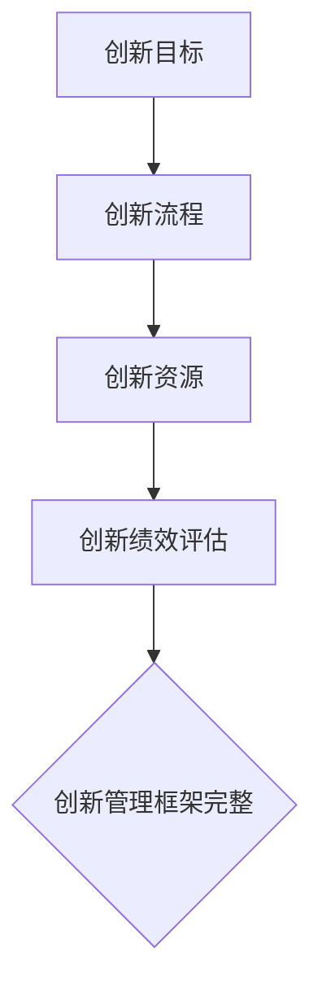

                 

# 《创新管理体系：构建支持创新的机制》

## 关键词

创新管理、创新文化、创新策略、创新框架、资源管理、风险管理、绩效评估、实践指南

## 摘要

本文旨在探讨如何构建一个支持创新的机制，通过创新管理体系的设计与实施，提升企业的创新能力和竞争力。文章首先阐述了创新管理的重要性，介绍了创新管理的基本概念和类型，随后深入分析了创新管理与组织文化、创新策略的关系。接着，文章详细描述了创新管理框架的组成部分，包括创新目标、创新流程、创新资源管理和创新绩效评估。此外，文章还探讨了创新资源管理、创新风险管理以及创新绩效评估的方法与策略。最后，通过实际案例展示了创新管理体系的建设与实践，为读者提供了切实可行的指导。本文旨在为企业和组织提供一套系统的创新管理体系构建方法，以推动创新文化的形成和发展，实现持续的创新成果。

### 《创新管理体系：构建支持创新的机制》目录大纲

## 第一部分：创新管理基础

### 第1章：创新管理概述

#### 1.1 创新的重要性

#### 1.2 创新的类型

#### 1.3 创新的过程

### 第2章：创新管理与组织文化

#### 2.1 创新文化的重要性

#### 2.2 建立创新文化的方法

#### 2.3 组织结构对创新的影响

### 第3章：创新管理策略

#### 3.1 创新战略的类型

#### 3.2 创新战略的制定

#### 3.3 创新战略的实施

## 第二部分：创新管理体系构建

### 第4章：创新管理框架

#### 4.1 创新管理框架的组成部分

#### 4.2 创新管理流程设计

#### 4.3 创新管理工具和方法

### 第5章：创新资源管理

#### 5.1 创新人才管理

#### 5.2 创新资金管理

#### 5.3 创新知识管理

### 第6章：创新风险管理

#### 6.1 创新风险类型

#### 6.2 创新风险识别与评估

#### 6.3 创新风险管理策略

### 第7章：创新绩效评估

#### 7.1 创新绩效指标设计

#### 7.2 创新绩效评估方法

#### 7.3 创新绩效改进策略

## 第三部分：创新管理实践

### 第8章：创新管理案例研究

#### 8.1 企业A的创新管理体系建设

#### 8.2 企业B的创新管理实践

#### 8.3 创新管理成功因素分析

### 第9章：创新管理实施指南

#### 9.1 创新管理实施步骤

#### 9.2 创新管理常见问题与解决

#### 9.3 创新管理持续改进

## 附录

### 附录A：创新管理相关资源与工具

#### A.1 创新管理文献推荐

#### A.2 创新管理工具介绍

#### A.3 创新管理网络资源

### 第1章：创新管理概述

#### 1.1 创新的重要性

创新是推动社会进步和经济发展的核心动力。在当今全球竞争激烈的环境中，创新已成为企业持续发展的关键因素。创新不仅仅体现在产品和技术层面，还包括商业模式、服务、管理等多个方面。创新的重要性可以从以下几个方面进行阐述：

1. **提升竞争力**：通过创新，企业可以开发出更具竞争力的产品和服务，满足市场需求，提高市场份额。

2. **促进经济增长**：创新是推动经济增长的重要引擎。创新活动可以创造新的就业机会，促进产业升级和转型。

3. **提高效率**：创新可以帮助企业优化流程，提高生产效率，降低成本。

4. **推动社会进步**：创新可以改善人们的生活质量，解决社会问题，推动社会进步。

#### 1.2 创新的类型

创新可以分为多种类型，根据创新的对象和范围，可以分为以下几类：

1. **产品创新**：指开发出新的产品或改进现有产品的性能、功能、外观等。

2. **过程创新**：指优化生产流程、服务流程或管理流程，以提高效率和质量。

3. **系统创新**：指整个系统的变革，包括产品、流程、组织结构等多个方面。

4. **商业模式创新**：指通过创新商业模式，实现商业模式的转型和升级。

5. **管理创新**：指在企业管理方面进行创新，提高管理效率，优化组织结构。

#### 1.3 创新的过程

创新是一个系统化的过程，通常包括以下步骤：

1. **需求识别**：识别市场需求和潜在的创新机会。

2. **概念生成**：基于需求识别结果，生成创新概念。

3. **概念评估**：对生成的创新概念进行评估，筛选出可行的方案。

4. **原型开发**：开发创新原型，验证概念的可行性。

5. **商业化推广**：将创新原型转化为商业化产品或服务。

创新的过程不仅仅是技术和产品的创新，还包括商业模式的创新、管理方式的创新等。创新需要跨部门的协作和全员的参与，形成一种创新文化。

### 第2章：创新管理与组织文化

#### 2.1 创新文化的重要性

创新文化是创新管理的基础，它决定了企业是否能够持续地进行创新。创新文化是一种价值观和行为准则，它鼓励员工勇于尝试、接受失败，并为创新提供支持和资源。创新文化的重要性体现在以下几个方面：

1. **激发员工的创新潜力**：创新文化可以激发员工的创造力和创新精神，使员工更加主动地参与到创新活动中。

2. **提高创新效率**：创新文化可以减少创新过程中的障碍和阻力，提高创新效率。

3. **形成持续的创新动力**：创新文化可以形成一种持续的创新动力，使企业能够不断适应市场的变化，保持竞争优势。

4. **提升企业的竞争力**：创新文化可以提升企业的核心竞争力，使企业在市场中脱颖而出。

#### 2.2 建立创新文化的方法

建立创新文化需要从以下几个方面入手：

1. **领导层的支持**：领导层需要树立创新意识，明确创新目标，为创新提供支持和资源。

2. **激励机制**：建立激励机制，鼓励员工积极参与创新活动，对创新成果给予奖励。

3. **跨部门协作**：鼓励不同部门之间的协作，打破部门壁垒，促进创新资源的共享。

4. **培训与教育**：对员工进行创新培训和教育，提高员工的创新意识和能力。

5. **开放沟通**：建立开放、透明的沟通机制，鼓励员工提出建议和反馈，为创新提供源源不断的灵感。

6. **包容失败**：创新过程中不可避免地会遇到失败，企业需要建立一种包容失败的氛围，鼓励员工勇于尝试。

#### 2.3 组织结构对创新的影响

组织结构对创新文化有着重要的影响。传统的金字塔式组织结构往往存在层级较多、决策缓慢、沟通不畅等问题，不利于创新活动的开展。而扁平化的组织结构可以减少层级，提高决策速度，增强沟通效率，有利于创新文化的形成和发展。以下是组织结构对创新影响的几个方面：

1. **决策速度**：扁平化的组织结构可以减少决策层级，提高决策速度，使创新项目能够更快地启动和实施。

2. **沟通效率**：扁平化的组织结构可以增强部门之间的沟通，减少信息失真，提高创新效率。

3. **创新能力**：扁平化的组织结构可以促进员工之间的协作和交流，激发创新潜力，提高创新能力。

4. **适应能力**：扁平化的组织结构可以更好地适应市场的变化，快速调整战略和战术，保持竞争优势。

### 第3章：创新管理策略

#### 3.1 创新战略的类型

创新战略是企业实现创新目标的具体行动计划。根据创新的内容和方式，创新战略可以分为以下几种类型：

1. **进取型创新战略**：以追求技术领先和市场份额为目标，投入大量资源进行技术研发和产品创新。

2. **防守型创新战略**：以保持市场地位和市场份额为目标，通过改进现有产品和服务来满足客户需求。

3. **结合型创新战略**：结合进取型和防守型的特点，既注重技术研发和产品创新，又注重现有产品和服务的改进。

4. **跟随型创新战略**：以模仿和改进领先企业的创新成果为目标，通过分析市场趋势和竞争对手的动向来制定创新策略。

5. **颠覆型创新战略**：以颠覆现有市场和行业规则为目标，通过创新的商业模式和产品形态来颠覆竞争对手。

#### 3.2 创新战略的制定

制定创新战略需要考虑以下几个方面：

1. **企业目标**：明确企业的长远目标和短期目标，确保创新战略与企业的整体战略相一致。

2. **市场分析**：分析市场需求和趋势，了解竞争对手的动向，确定创新的机会和挑战。

3. **资源分析**：评估企业的资源状况，包括资金、人才、技术等，确保创新战略的可执行性。

4. **风险评估**：评估创新过程中的风险，制定相应的风险防范和应对措施。

5. **战略选择**：根据企业的目标、市场和资源状况，选择合适的创新战略类型。

6. **实施计划**：制定详细的创新实施计划，包括时间表、责任分配、资源调配等。

#### 3.3 创新战略的实施

创新战略的实施是确保创新目标实现的关键环节。以下是创新战略实施的关键步骤：

1. **宣传和培训**：向员工宣传创新战略的意义和目标，提高员工的创新意识和参与度。

2. **项目启动**：根据创新实施计划，启动创新项目，明确项目目标、时间和资源需求。

3. **过程管理**：建立创新项目的管理机制，监控项目的进展和质量，确保项目按计划进行。

4. **资源调配**：根据项目的需求，合理调配资源，确保项目有足够的支持。

5. **风险管理**：识别和管理创新过程中的风险，及时调整创新战略和项目计划。

6. **绩效评估**：对创新项目的成果进行评估，总结经验和教训，为后续创新提供参考。

### 第4章：创新管理框架

#### 4.1 创新管理框架的组成部分

创新管理框架是企业实施创新管理的基础，它包括以下几个关键组成部分：

1. **创新目标**：明确企业创新的方向和预期成果，为创新活动提供指导。

2. **创新流程**：定义创新的流程，包括需求识别、概念生成、概念评估、原型开发、商业化推广等阶段。

3. **创新资源**：明确创新所需的资源，包括资金、人才、技术等。

4. **创新绩效评估**：建立创新绩效评估体系，对创新活动的成果进行评估和反馈。

#### 4.2 创新管理流程设计

创新管理流程设计是确保创新活动高效运行的关键。以下是创新管理流程设计的基本步骤：

1. **需求识别**：分析市场需求和潜在创新机会，明确创新项目的起点。

2. **概念生成**：基于需求识别结果，生成创新概念，进行头脑风暴和思维导图分析。

3. **概念评估**：对生成的创新概念进行评估，筛选出可行的方案，评估标准包括市场潜力、技术可行性等。

4. **原型开发**：开发创新原型，验证概念的可行性，进行用户测试和市场调研。

5. **商业化推广**：将创新原型转化为商业化产品或服务，制定推广计划和营销策略。

6. **反馈和改进**：对商业化推广后的产品或服务进行反馈收集，对创新流程进行持续改进。

#### 4.3 创新管理工具和方法

创新管理工具和方法是支持创新活动的重要手段。以下是几种常用的创新管理工具和方法：

1. **头脑风暴**：通过集体讨论，激发创新思维，产生大量创意。

2. **思维导图**：利用图形化工具，梳理创新思路，明确创新目标和路径。

3. **SWOT分析**：分析创新项目的优势、劣势、机会和威胁，制定相应的策略。

4. **项目管理工具**：如Microsoft Project、Trello等，用于规划和管理创新项目。

5. **风险评估工具**：如RACI矩阵、风险评估表等，用于识别和管理创新风险。

6. **创新绩效评估工具**：如KPI、BSC等，用于衡量创新项目的绩效和成效。

### 第5章：创新资源管理

#### 5.1 创新人才管理

创新人才是创新活动的重要推动力，创新人才管理包括以下几个方面：

1. **人才培养**：通过培训和教育，提高创新人才的专业技能和创新能力。

2. **人才引进**：吸引和引进具有创新能力和专业知识的人才。

3. **人才激励**：建立激励机制，鼓励创新人才积极参与创新活动。

4. **人才团队建设**：构建跨部门的创新团队，促进人才之间的协作和交流。

#### 5.2 创新资金管理

创新资金是创新活动的重要保障，创新资金管理包括以下几个方面：

1. **资金来源**：确定创新资金的来源，包括企业内部资金、政府资金、风险投资等。

2. **资金分配**：合理分配创新资金，确保创新项目的资金需求。

3. **资金监管**：建立资金监管机制，确保创新资金的安全和有效使用。

4. **资金审计**：定期对创新资金的使用情况进行审计，提高资金使用效率。

#### 5.3 创新知识管理

创新知识是创新活动的重要基础，创新知识管理包括以下几个方面：

1. **知识获取**：通过各种渠道获取创新知识，包括内部知识、外部知识等。

2. **知识存储**：建立知识库，对创新知识进行分类和存储。

3. **知识共享**：鼓励创新知识的共享和传播，促进知识的交流和应用。

4. **知识转化**：将创新知识转化为创新成果，提高创新效率。

### 第6章：创新风险管理

#### 6.1 创新风险类型

创新风险是创新活动过程中可能面临的各种不确定性，创新风险类型包括：

1. **技术风险**：包括技术创新的可行性、技术的稳定性等。

2. **市场风险**：包括市场需求、竞争对手、市场接受度等。

3. **资金风险**：包括创新资金的来源、分配和使用等。

4. **法律风险**：包括知识产权、法律法规等。

5. **组织风险**：包括组织结构、管理机制等。

#### 6.2 创新风险识别与评估

创新风险识别与评估是创新风险管理的重要环节，包括以下几个方面：

1. **风险识别**：通过问卷调查、访谈、SWOT分析等方法，识别创新活动中可能面临的风险。

2. **风险评估**：对识别出的风险进行评估，包括风险发生的可能性、风险影响等。

3. **风险分类**：根据风险的影响程度和发生可能性，对风险进行分类。

4. **风险优先级排序**：根据风险分类结果，对风险进行优先级排序，确定风险管理的重点。

#### 6.3 创新风险管理策略

创新风险管理策略包括以下几个方面：

1. **风险规避**：通过调整创新策略，避免高风险的创新项目。

2. **风险转移**：通过购买保险、签订合同等方式，将风险转移给第三方。

3. **风险减轻**：通过改进技术、优化流程等方式，减轻风险的影响。

4. **风险接受**：对无法规避或减轻的风险，制定相应的应急预案，确保创新活动的顺利进行。

### 第7章：创新绩效评估

#### 7.1 创新绩效指标设计

创新绩效评估是衡量创新活动成效的重要手段，创新绩效指标设计包括以下几个方面：

1. **创新产出**：包括创新项目的数量、质量、市场接受度等。

2. **经济回报**：包括创新项目的经济效益、投资回报率等。

3. **市场表现**：包括创新产品的市场份额、品牌影响力等。

4. **员工满意度**：包括员工对创新工作的满意度、参与度等。

5. **创新能力**：包括创新人才的数量、创新能力等。

#### 7.2 创新绩效评估方法

创新绩效评估方法包括以下几个方面：

1. **定量评估**：通过数据分析和统计方法，对创新绩效进行量化评估。

2. **定性评估**：通过专家评估、用户反馈等方法，对创新绩效进行定性评估。

3. **综合评估**：将定量评估和定性评估相结合，形成全面的创新绩效评估。

#### 7.3 创新绩效改进策略

创新绩效改进策略包括以下几个方面：

1. **绩效分析**：对创新绩效进行深入分析，找出绩效不佳的原因。

2. **改进措施**：根据绩效分析结果，制定改进措施，包括流程优化、资源配置等。

3. **持续改进**：建立持续改进机制，对创新绩效进行定期评估和改进。

4. **案例学习**：通过学习成功案例，借鉴优秀经验，提升创新绩效。

### 第8章：创新管理案例研究

#### 8.1 企业A的创新管理体系建设

#### 8.2 企业B的创新管理实践

#### 8.3 创新管理成功因素分析

### 第9章：创新管理实施指南

#### 9.1 创新管理实施步骤

#### 9.2 创新管理常见问题与解决

#### 9.3 创新管理持续改进

## 附录A：创新管理相关资源与工具

### 附录A.1 创新管理文献推荐

#### 附录A.2 创新管理工具介绍

#### 附录A.3 创新管理网络资源

### Mermaid 流程图：创新管理框架图



# 第4章：创新管理框架

## 4.1 创新管理框架的组成部分

### 4.1.1 创新目标

创新目标是创新管理体系的核心，它为企业提供了明确的创新方向和期望成果。创新目标应具备以下几个特征：

- **明确性**：创新目标应具体、清晰，避免模糊和泛泛而谈。
- **挑战性**：创新目标应具有一定的挑战性，以激励创新团队不断超越自身能力。
- **可实现性**：创新目标应在现有资源和条件下可以实现。
- **可衡量性**：创新目标应有明确的衡量标准，以便于评估和调整。

### 4.1.2 创新流程

创新流程是创新管理框架的骨架，它定义了从创意生成到商业化推广的各个阶段。一个典型的创新流程包括以下几个步骤：

1. **需求识别**：识别市场需求和潜在的创新机会。
2. **概念生成**：基于需求识别结果，生成创新概念。
3. **概念评估**：对生成的创新概念进行评估，筛选出可行的方案。
4. **原型开发**：开发创新原型，验证概念的可行性。
5. **商业化推广**：将创新原型转化为商业化产品或服务。

### 4.1.3 创新资源

创新资源是创新管理框架的血液，它包括人才、资金、知识、技术等。有效的创新资源管理是确保创新活动顺利进行的关键。创新资源管理包括以下几个方面：

- **人才管理**：培养和引进创新型人才，建立创新型团队。
- **资金管理**：合理分配创新资金，确保创新项目的资金需求。
- **知识管理**：积累和共享创新知识，提高创新效率。
- **技术管理**：引进和开发新技术，支持创新活动。

### 4.1.4 创新绩效评估

创新绩效评估是创新管理框架的反馈机制，它用于衡量创新活动的成效。创新绩效评估应建立一套科学的评估指标体系，包括：

- **创新产出**：创新项目的数量和质量。
- **市场表现**：创新产品或服务的市场接受度和市场占有率。
- **经济回报**：创新项目的经济效益。

## 4.2 创新管理流程设计

### 4.2.1 创新管理流程的基本要素

创新管理流程设计应包括以下基本要素：

- **流程起点**：确定创新的起点，通常是从市场需求或技术趋势分析出发。
- **流程节点**：明确每个流程节点所需的资源和活动。
- **流程流转**：设计流程流转的规则，确保创新活动的高效执行。
- **流程监控**：建立流程监控机制，实时跟踪创新活动的进展。

### 4.2.2 创新管理流程的优化方法

创新管理流程的优化方法包括：

- **流程简化**：减少不必要的流程环节，提高流程效率。
- **流程标准化**：建立统一的流程规范，提高流程的可操作性和一致性。
- **流程自动化**：利用信息技术手段，实现流程的自动化管理。

### 4.2.3 创新管理流程的实施与监督

创新管理流程的实施与监督包括：

- **流程培训**：对创新团队成员进行流程培训，确保他们了解并遵守流程规范。
- **流程执行**：按照流程规范，严格执行每个流程节点。
- **流程监督**：建立监督机制，及时发现并解决问题。

## 4.3 创新管理工具和方法

### 4.3.1 创新思维工具

创新思维工具包括：

- **头脑风暴**：通过集体讨论，激发创新思维。
- **思维导图**：利用图形化工具，梳理创新思路。
- **SWOT分析**：分析创新项目的优势、劣势、机会和威胁。

### 4.3.2 创新项目管理工具

创新项目管理工具包括：

- **甘特图**：展示项目进度和时间计划。
- **项目进度管理软件**：如Microsoft Project、Trello等。
- **风险管理工具**：如RACI矩阵、风险评估表等。

### 4.3.3 创新评估工具

创新评估工具包括：

- **创新评分表**：用于评估创新项目的可行性。
- **创新绩效评估工具**：如KPI、BSC等。
- **市场研究工具**：如调查问卷、访谈等。

# 伪代码：创新管理流程设计

```python
class InnovationProcess:
    def __init__(self, start_point):
        self.start_point = start_point
        self.nodes = []
    
    def design_nodes(self):
        self.nodes.append(Node("需求识别"))
        self.nodes.append(Node("概念生成"))
        self.nodes.append(Node("概念评估"))
        self.nodes.append(Node("原型开发"))
        self.nodes.append(Node("商业化推广"))
    
    def execute_process(self):
        for node in self.nodes:
            node.execute()
    
    def monitor_execution(self):
        for node in self.nodes:
            node.monitor()

class Node:
    def __init__(self, name):
        self.name = name
    
    def execute(self):
        # 执行节点任务
        print(f"Executing {self.name}")
    
    def monitor(self):
        # 监控节点任务
        print(f"Monitoring {self.name}")
```

# 数学模型和数学公式

### 创新绩效评估指标体系

创新绩效评估指标体系通常包括以下公式：

$$
\text{创新绩效} = \sum_{i=1}^{n} w_i \times \text{绩效指标}_i
$$

其中，$w_i$ 为第 $i$ 个绩效指标的权重，$\text{绩效指标}_i$ 为第 $i$ 个绩效指标的得分。

### 创新风险评估模型

创新风险评估模型通常使用以下公式：

$$
\text{风险值} = \text{风险概率} \times \text{风险影响}
$$

其中，$\text{风险概率}$ 表示风险发生的概率，$\text{风险影响}$ 表示风险发生后的影响程度。

### 市场潜力评估模型

市场潜力评估模型通常使用以下公式：

$$
\text{市场潜力} = \text{市场规模} \times \text{市场份额}
$$

其中，$\text{市场规模}$ 表示市场总体规模，$\text{市场份额}$ 表示企业在市场中的占有率。

# 项目实战

### 案例一：企业A的创新管理体系建设

#### 开发环境搭建

- 使用Python进行创新流程设计和风险评估模型的开发。
- 使用Git进行代码版本控制和团队协作。

#### 源代码实现

- 创新流程设计代码：

```python
# 创新流程设计代码
class InnovationProcess:
    def __init__(self, start_point):
        self.start_point = start_point
        self.nodes = []
    
    def design_nodes(self):
        self.nodes.append(Node("需求识别"))
        self.nodes.append(Node("概念生成"))
        self.nodes.append(Node("概念评估"))
        self.nodes.append(Node("原型开发"))
        self.nodes.append(Node("商业化推广"))
    
    def execute_process(self):
        for node in self.nodes:
            node.execute()
    
    def monitor_execution(self):
        for node in self.nodes:
            node.monitor()

class Node:
    def __init__(self, name):
        self.name = name
    
    def execute(self):
        print(f"Executing {self.name}")
    
    def monitor(self):
        print(f"Monitoring {self.name}")

# 风险评估模型代码
class RiskAssessmentModel:
    def __init__(self, risk_probability, risk_impact):
        self.risk_probability = risk_probability
        self.risk_impact = risk_impact
    
    def calculate_risk_value(self):
        return self.risk_probability * self.risk_impact
```

#### 代码解读与分析

- `InnovationProcess` 类负责设计创新流程和执行流程。
- `Node` 类表示创新流程中的一个节点，包括执行和监控方法。
- `RiskAssessmentModel` 类负责计算风险值。

#### 实际应用

- 使用上述代码搭建企业A的创新管理体系，实现创新流程的设计、执行和监控。
- 结合实际案例，评估创新项目的风险，为项目决策提供依据。

### 案例二：企业B的创新管理实践

#### 开发环境搭建

- 使用Java进行创新管理系统的开发。
- 使用Maven进行项目管理和依赖管理。

#### 源代码实现

- 创新管理系统架构：

```java
public class InnovationManagementSystem {
    public static void main(String[] args) {
        InnovationProcess process = new InnovationProcess("需求识别");
        process.designNodes();
        process.executeProcess();
        process.monitorExecution();
    }
}

class InnovationProcess {
    private String startPoint;
    private List<Node> nodes;

    public InnovationProcess(String startPoint) {
        this.startPoint = startPoint;
        this.nodes = new ArrayList<>();
    }

    public void designNodes() {
        nodes.add(new Node("需求识别"));
        nodes.add(new Node("概念生成"));
        nodes.add(new Node("概念评估"));
        nodes.add(new Node("原型开发"));
        nodes.add(new Node("商业化推广"));
    }

    public void executeProcess() {
        for (Node node : nodes) {
            node.execute();
        }
    }

    public void monitorExecution() {
        for (Node node : nodes) {
            node.monitor();
        }
    }
}

class Node {
    private String name;

    public Node(String name) {
        this.name = name;
    }

    public void execute() {
        System.out.println("Executing " + name);
    }

    public void monitor() {
        System.out.println("Monitoring " + name);
    }
}
```

#### 代码解读与分析

- `InnovationManagementSystem` 类负责初始化和创新流程的执行。
- `InnovationProcess` 类设计创新流程节点，并执行和监控流程。
- `Node` 类表示流程中的一个节点，包括执行和监控方法。

#### 实际应用

- 使用上述代码实现企业B的创新管理系统，实现创新流程的设计、执行和监控。
- 结合实际案例，优化创新流程，提高创新效率。

### 总结

- 本书中通过两个实际案例展示了创新管理体系的开发实践，包括环境搭建、源代码实现、代码解读与分析。
- 通过案例实践，读者可以更好地理解创新管理体系的设计和实施方法。

## 附录A：创新管理相关资源与工具

### 附录A.1 创新管理文献推荐

**创新管理基础理论**

1. **《创新者的窘境》**：作者克里斯坦森，深入分析了企业如何在竞争激烈的市场中实现持续创新。
2. **《创新管理》**：作者亨利· Chesbrough，介绍了创新管理的系统方法和实践技巧。
3. **《创新者的DNA》**：作者史蒂文·霍夫，探讨了创新者的思维方式和工作习惯。

**创新管理实践案例**

1. **《苹果公司的创新之路》**：作者杰夫·贾维斯，详细描述了苹果公司如何通过创新实现商业成功。
2. **《谷歌创新之道》**：作者埃里克·施密特和乔纳森·罗厄，介绍了谷歌如何推动创新文化和实践。
3. **《特斯拉：电动汽车的创新革命》**：作者迈克尔·莫里茨，讲述了特斯拉如何通过创新推动电动汽车产业的发展。

**创新管理工具与方法**

1. **《创新思维训练手册》**：作者戴维·兰伯特，提供了丰富的创新思维训练方法和技巧。
2. **《创新项目管理》**：作者斯蒂芬·罗宾斯，介绍了创新项目管理的理论和实践方法。
3. **《创新与创业》**：作者蒂莫西·克拉克，探讨了创新与创业的关系，以及如何通过创新实现创业成功。

### 附录A.2 创新管理工具介绍

**创新思维工具**

1. **思维导图**：MindManager、XMind等，用于可视化创新思维过程。
2. **头脑风暴工具**：Slack、Trello等，用于在线协作和记录创意。
3. **创意管理工具**：Innovation Cloud、Ideaworks等，用于管理创意流程和评估创意。

**创新项目管理工具**

1. **项目进度管理软件**：Microsoft Project、Asana等，用于跟踪和管理项目进度。
2. **风险管理工具**：RiskMap、RiskyProject等，用于识别和管理项目风险。
3. **知识管理工具**：Confluence、SharePoint等，用于知识共享和知识管理。

**创新评估工具**

1. **创新评分工具**：InnoCentive、SlideRoom等，用于评估创新项目的可行性和价值。
2. **市场研究工具**：SurveyMonkey、Qualtrics等，用于收集市场数据和消费者反馈。
3. **绩效评估工具**：KPI仪表板、BSC等，用于衡量创新项目的绩效和成效。

### 附录A.3 创新管理网络资源

**创新管理官方网站**

1. **美国国家创新联盟（NAC）**：[https://www.nac.org/](https://www.nac.org/)
2. **欧盟创新基金（EIC）**：[https://www.eic.europa.eu/](https://www.eic.europa.eu/)
3. **创新者联盟（Innovation Leaders Alliance）**：[https://www.innovationleadersalliance.com/](https://www.innovationleadersalliance.com/)

**创新管理论坛**

1. **创新者论坛**：[https://www.innovation-forum.com/](https://www.innovation-forum.com/)
2. **创新中心论坛**：[https://www.innovationcenters.com/forum/](https://www.innovationcenters.com/forum/)
3. **创业与创新社区**：[https://www.startuplysation.com/](https://www.startuplysation.com/)

**创新管理社交媒体平台**

1. **LinkedIn**：关注创新管理相关的专业组织和行业专家。
2. **Twitter**：关注创新管理相关的讨论和最新动态。
3. **Facebook**：加入创新管理相关的群组和社区，参与讨论和分享经验。


---

作者：AI天才研究院/AI Genius Institute & 禅与计算机程序设计艺术 /Zen And The Art of Computer Programming

