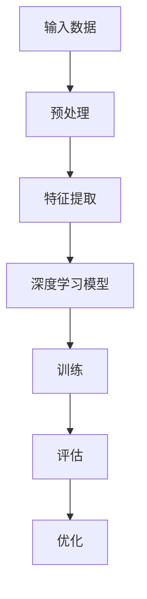
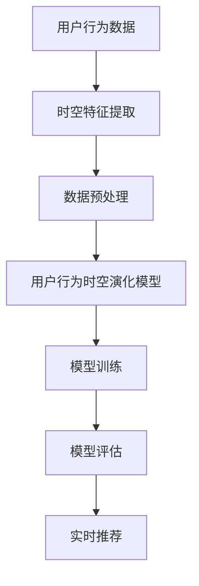

                 

## 《利用大模型进行推荐场景的用户行为时空演化分析》

### 关键词：
- 推荐系统
- 大模型
- 用户行为时空演化
- 深度学习
- 特征工程
- 实时分析

### 摘要：
本文旨在探讨如何利用大模型进行推荐场景中的用户行为时空演化分析。通过深入剖析大模型的特点和应用，结合用户行为时空数据的处理和分析方法，本文将详细介绍如何构建和评估用户行为时空演化模型，并探讨在实际应用中的挑战和解决方案。文章还将展望未来研究方向，为推荐系统的优化和创新提供新的思路。

### 目录大纲

#### 第一部分：背景与概念介绍
1. 引言
2. 大模型与推荐系统
3. 用户行为时空演化分析

#### 第二部分：大模型技术基础
4. 深度学习与神经网络基础
5. 自然语言处理技术概览
6. 大规模预训练模型原理

#### 第三部分：用户行为时空演化分析实践
7. 数据预处理与特征工程
8. 用户行为时空演化模型构建
9. 模型训练与评估
10. 案例研究

#### 第四部分：前沿与展望
11. 用户行为时空演化分析的前沿技术
12. 未来的研究方向

#### 附录
13. 工具与资源
14. 附录 A: AI 大模型开发工具与资源
15. 附录 B: Mermaid 流程图
16. 附录 C: 伪代码与数学模型
17. 附录 D: 项目实战与代码解析

## 第一部分：背景与概念介绍

### 引言

推荐系统在现代社会中扮演着至关重要的角色，它们广泛应用于电子商务、社交媒体、音乐流媒体等多个领域。推荐系统的核心目标是通过分析用户的历史行为和兴趣，向用户提供个性化推荐，从而提高用户满意度和平台活跃度。然而，推荐系统的效果很大程度上取决于对用户行为数据的理解和分析能力。

在推荐系统中，用户行为时空演化分析是一个重要的研究方向。用户行为时空演化指的是用户在时间维度和空间维度上的行为模式的变化。理解用户行为时空演化不仅有助于优化推荐算法，还可以为用户提供更精准和个性化的服务。

用户行为时空演化分析的重要性体现在以下几个方面：

1. **个性化推荐**：通过对用户行为时空演化分析，推荐系统可以更好地捕捉用户的兴趣变化，提供更符合用户当前需求的推荐。
2. **实时推荐**：用户行为时空演化分析可以支持实时推荐，使推荐系统能够快速响应用户的动态变化。
3. **用户留存**：了解用户行为时空演化有助于识别潜在流失用户，从而采取针对性措施提高用户留存率。
4. **数据洞察**：用户行为时空演化分析可以提供关于用户行为模式的重要见解，为业务决策提供数据支持。

本文将围绕如何利用大模型进行用户行为时空演化分析进行深入探讨。首先，我们将介绍大模型的概念和特点，然后探讨大模型在推荐系统中的应用，最后介绍用户行为时空演化分析的方法和技术。

### 大模型与推荐系统

#### 大模型的定义与特点

大模型是指那些拥有巨大参数量和计算量的机器学习模型，通常在深度学习领域应用。这些模型能够处理海量数据，并通过自监督学习、无监督学习和半监督学习等方法，从数据中学习到丰富的特征和模式。大模型通常具备以下特点：

1. **大规模参数**：大模型拥有数亿甚至数十亿个参数，这使得它们能够捕捉到更加复杂和细微的特征。
2. **强大的学习能力**：由于参数量巨大，大模型具有更强的泛化能力，能够处理不同类型和规模的数据。
3. **自监督学习**：大模型可以通过自监督学习方法，从原始数据中无监督地学习到有用的特征。
4. **迁移学习**：大模型可以通过迁移学习，将一个任务的学习成果应用到另一个任务中，从而提高学习效率。
5. **计算资源需求高**：大模型的训练和推理需要大量的计算资源和时间，这通常需要分布式计算和硬件加速（如GPU或TPU）的支持。

#### 大模型在推荐系统中的应用

大模型在推荐系统中的应用主要体现在以下几个方面：

1. **用户行为预测**：通过深度学习模型，推荐系统可以预测用户未来的行为，从而提供更加精准的个性化推荐。
2. **兴趣挖掘**：大模型能够从用户的复杂行为数据中挖掘出用户的兴趣点，从而为推荐提供更有针对性的内容。
3. **序列建模**：大模型能够处理时间序列数据，捕捉用户行为的时序特征，从而更好地理解用户的行为模式。
4. **多模态融合**：大模型能够整合不同类型的数据（如图像、文本、音频等），实现多模态数据的融合，从而提供更全面和丰富的推荐。
5. **实时推荐**：大模型的高效训练和推理能力，使得推荐系统能够实现实时推荐，快速响应用户的需求。

#### 大模型在推荐系统中的优势与挑战

大模型在推荐系统中的优势主要体现在以下几个方面：

1. **提高推荐质量**：通过强大的特征提取能力和泛化能力，大模型能够提供更高质量的推荐结果。
2. **个性化推荐**：大模型能够更准确地捕捉用户的兴趣和需求，从而实现更加个性化的推荐。
3. **实时响应**：大模型的高效推理能力，使得推荐系统能够实现实时推荐，提高用户体验。

然而，大模型在推荐系统中也面临一些挑战：

1. **计算资源需求**：大模型的训练和推理需要大量的计算资源和时间，这通常需要分布式计算和硬件加速的支持。
2. **数据质量**：大模型对数据质量有较高要求，数据预处理和清洗工作复杂。
3. **模型解释性**：大模型的内部决策过程复杂，难以进行模型解释，这对于需要解释性的应用场景（如金融、医疗等）可能是一个挑战。
4. **公平性**：大模型可能会放大数据中的偏见，导致推荐结果的公平性问题。

### 用户行为时空演化分析

#### 用户行为时空数据的概念

用户行为时空数据是指用户在特定时间和空间范围内的行为数据。这些数据通常包含以下几种类型：

1. **时间序列数据**：记录用户在不同时间点的行为，如浏览、购买、点击等。
2. **位置数据**：记录用户在不同地理位置的行为，如移动、导航等。
3. **上下文数据**：记录用户在特定上下文环境中的行为，如天气、节假日等。

#### 时空数据分析的方法与技术

时空数据分析旨在从用户行为时空数据中提取有价值的信息，以便进行推荐、预测和洞察。以下是一些常用的时空数据分析方法和技术：

1. **时间序列分析**：通过分析用户行为的时间序列特征，如趋势、周期、季节性等，来预测用户未来的行为。
2. **地理空间分析**：通过分析用户在不同地理位置的行为模式，如用户的移动路径、聚集区域等，来识别用户的行为特征。
3. **多模态数据融合**：将不同类型的数据（如时间序列、位置数据等）进行融合，以获得更全面和丰富的用户行为特征。
4. **图神经网络**：通过构建用户行为时空数据的图结构，利用图神经网络进行特征提取和关系建模。
5. **时空交互网络**：通过分析用户行为在不同时间和空间维度上的交互关系，来捕捉用户行为的时空演化模式。

### 小结

本部分介绍了大模型的概念和特点，以及大模型在推荐系统中的应用。同时，我们探讨了用户行为时空演化分析的概念和方法。下一部分，我们将深入探讨深度学习与神经网络的基础知识，为后续的模型构建和优化奠定基础。

## 第二部分：大模型技术基础

### 深度学习与神经网络基础

#### 神经网络的基本结构

神经网络（Neural Network，NN）是深度学习（Deep Learning，DL）的基础，它由大量的简单计算单元（称为神经元）组成。每个神经元接收多个输入信号，通过加权求和并加上偏置（bias），然后通过激活函数（activation function）进行非线性变换，产生输出信号。

一个基本的神经网络结构通常包括以下部分：

1. **输入层**（Input Layer）：接收外部输入数据，如用户行为特征、文本等。
2. **隐藏层**（Hidden Layers）：多个隐藏层堆叠在一起，用于特征提取和复杂关系的建模。隐藏层中的每个神经元都会接收前一层所有神经元的输出，并通过权重（weights）进行加权求和。
3. **输出层**（Output Layer）：产生最终的预测结果，如推荐评分、分类结果等。

#### 常见的深度学习架构

深度学习架构种类繁多，以下是一些常见的架构：

1. **卷积神经网络（Convolutional Neural Network，CNN）**：主要用于图像和视频数据的处理。CNN通过卷积操作提取图像的局部特征，并通过池化操作降低数据维度。
2. **循环神经网络（Recurrent Neural Network，RNN）**：适用于序列数据的处理，如时间序列数据和自然语言文本。RNN通过循环结构保持历史状态，捕捉序列中的长期依赖关系。
3. **长短期记忆网络（Long Short-Term Memory，LSTM）**：是RNN的一种变体，通过引入门控机制（gate）来控制信息的流动，有效解决了RNN的梯度消失和梯度爆炸问题。
4. **变换器架构（Transformer）**：由谷歌在2017年提出，主要应用于自然语言处理任务。Transformer引入了自注意力机制（self-attention），使得模型能够处理任意长度的序列，并在许多NLP任务中取得了显著的效果。

#### 深度学习优化算法

深度学习模型的训练过程通常涉及大量的参数调整，因此优化算法在训练过程中至关重要。以下是一些常见的深度学习优化算法：

1. **随机梯度下降（Stochastic Gradient Descent，SGD）**：是最早的深度学习优化算法之一。SGD通过随机抽样一部分训练数据，计算梯度并更新模型参数。
2. **动量（Momentum）**：为了加速SGD的收敛速度，引入了动量概念。动量算法通过保留前一次梯度的一定比例，结合当前梯度进行更新，从而减少波动。
3. **自适应优化算法**：如Adagrad、RMSprop和Adam等，这些算法通过动态调整学习率，提高训练过程的稳定性。

### 自然语言处理技术概览

自然语言处理（Natural Language Processing，NLP）是深度学习的重要应用领域，旨在使计算机理解和处理人类语言。以下是一些关键的NLP技术：

#### 词嵌入技术

词嵌入（Word Embedding）是将单词映射到高维空间中的向量表示。词嵌入技术通过将语义和语法信息编码到向量中，使得计算机能够更好地理解和处理文本。

1. **基于频次的词嵌入**：如计数模型（Count-based Model）和TF-IDF（Term Frequency-Inverse Document Frequency）。
2. **基于上下文的词嵌入**：如Word2Vec（由Google提出，基于点积模型）和GloVe（Global Vectors for Word Representation，基于矩阵分解）。

#### 序列模型与注意力机制

序列模型（Sequence Model）是处理序列数据（如图像序列、文本序列等）的深度学习模型。以下是一些常用的序列模型：

1. **循环神经网络（RNN）**：通过循环结构来处理序列数据，但存在梯度消失和梯度爆炸问题。
2. **长短期记忆网络（LSTM）**：通过引入门控机制来缓解RNN的问题。
3. **变换器（Transformer）**：通过自注意力机制（self-attention）来处理序列数据，具有处理长距离依赖的能力。

注意力机制（Attention Mechanism）是一种用于提高模型对序列数据中重要部分关注度的技术。注意力机制的核心思想是将每个输入序列元素赋予不同的权重，从而在模型中引入对关键信息的关注。

#### 转换器架构详解

变换器（Transformer）是一种基于自注意力机制的深度学习模型，由谷歌在2017年提出。Transformer的主要优点包括：

1. **并行化训练**：由于没有循环结构，Transformer可以并行处理整个序列，从而提高训练效率。
2. **长距离依赖**：自注意力机制能够捕捉序列中的长距离依赖关系，从而提高模型的性能。

变换器的架构包括编码器（Encoder）和解码器（Decoder），其中编码器负责将输入序列编码为上下文表示，解码器则负责根据上下文生成输出序列。

### 大规模预训练模型原理

大规模预训练模型（Pre-Trained Models）是近年来深度学习领域的重大突破。这些模型通过在大规模数据集上进行预训练，然后在特定任务上进行微调（Fine-Tuning），从而实现了优异的性能。

#### 预训练的概念与意义

预训练（Pre-Training）是指在大规模数据集上训练深度学习模型，以学习通用的语言特征和知识。预训练的意义在于：

1. **提高泛化能力**：预训练模型能够从大规模数据中学习到丰富的特征，从而提高在未见过的数据上的性能。
2. **迁移学习**：预训练模型可以在不同任务之间进行迁移，从而提高新任务的训练效率。
3. **减少数据需求**：预训练模型通过在大规模数据集上预训练，从而降低对新数据的依赖，使得小样本学习成为可能。

#### 自监督学习方法

自监督学习（Self-Supervised Learning）是一种无需人工标注的数据处理方法，它通过无监督的方式从数据中学习到有用的特征。以下是一些常见的自监督学习方法：

1. **Masked Language Model（MLM）**：在文本数据中随机遮挡部分单词或子词，并预测遮挡部分的内容。
2. ** masked Image Model（MIM）**：在图像数据中遮挡部分像素，并预测遮挡部分的内容。
3. **Predictive Modeling**：预测序列中下一个元素。

#### 迁移学习与微调技术

迁移学习（Transfer Learning）是一种利用预训练模型在新任务上进行微调的方法。微调（Fine-Tuning）是指在新任务上调整预训练模型的参数，以适应特定任务的需求。

迁移学习与微调技术的优点包括：

1. **提高性能**：预训练模型已经在大规模数据集上学习到了丰富的特征，通过微调可以进一步提高模型在新任务上的性能。
2. **减少训练时间**：由于预训练模型已经在大规模数据集上进行了训练，因此在新任务上的训练时间大大缩短。
3. **减少数据需求**：通过迁移学习，可以减少对新数据的需求，从而在小样本数据集上进行有效训练。

### 小结

本部分介绍了深度学习与神经网络的基础知识，包括神经网络的基本结构、常见的深度学习架构、优化算法，以及自然语言处理技术。接下来，我们将探讨大规模预训练模型的原理和应用，为下一部分的用户行为时空演化分析实践奠定基础。

## 第三部分：用户行为时空演化分析实践

### 数据预处理与特征工程

在进行用户行为时空演化分析之前，数据预处理和特征工程是关键步骤。有效的数据预处理和特征工程可以大大提高模型的性能和鲁棒性。

#### 时空数据的预处理

时空数据的预处理包括以下步骤：

1. **数据清洗**：去除数据中的噪音和异常值，例如缺失值、重复数据和异常记录。
2. **数据格式转换**：将不同来源的数据格式（如时间戳、地理位置等）转换为统一的格式，以便后续处理。
3. **数据标准化**：对数据进行归一化或标准化处理，使数据具有相同的量纲和范围，从而避免数据差异对模型训练的影响。

#### 用户行为特征提取

用户行为特征提取是时空数据分析的核心步骤。以下是一些常用的用户行为特征：

1. **时间特征**：
   - **时间间隔**：用户行为发生的时间间隔，如浏览时间、购买时间等。
   - **时间窗口**：用户在特定时间段内的行为集合，如一天内的行为、一周内的行为等。
   - **时间周期**：用户行为在时间维度上的周期性特征，如节假日、季节性等。

2. **位置特征**：
   - **地理位置**：用户行为发生的具体地理位置，可以通过GPS坐标表示。
   - **移动路径**：用户在不同地理位置的移动轨迹。
   - **聚集区域**：用户在特定地理位置的聚集情况。

3. **行为特征**：
   - **行为类型**：用户执行的具体行为类型，如浏览、购买、点击等。
   - **行为强度**：用户行为的频率和强度，如浏览次数、购买金额等。

#### 时空特征融合方法

时空特征融合是将不同类型和来源的特征进行整合，以提高模型对用户行为时空演化模式的捕捉能力。以下是一些常见的时空特征融合方法：

1. **基于规则的融合**：通过定义规则将不同类型特征进行组合，如将地理位置特征与行为特征进行关联。
2. **基于机器学习的融合**：使用机器学习模型（如分类器、聚类算法等）对特征进行自动融合。
3. **基于注意力机制的融合**：使用注意力机制对不同特征进行加权，使模型能够自动学习到不同特征的重要程度。

### 用户行为时空演化模型构建

构建用户行为时空演化模型是进行推荐系统优化和改进的重要步骤。以下是一些常用的用户行为时空演化模型：

1. **时间序列模型**：
   - **ARIMA（AutoRegressive Integrated Moving Average）模型**：通过自回归、差分和移动平均操作，捕捉时间序列数据的特征。
   - **LSTM（Long Short-Term Memory）模型**：通过引入门控机制，捕捉时间序列数据中的长期依赖关系。

2. **时空交互网络模型**：
   - **图神经网络（Graph Neural Network，GNN）**：通过构建用户行为时空数据的图结构，利用图神经网络进行特征提取和关系建模。
   - **时空交互网络（Spatiotemporal Interaction Network，STIN）**：通过引入时空注意力机制，捕捉用户行为在不同时间和空间维度上的交互关系。

3. **多模态数据融合模型**：
   - **多任务学习（Multi-Task Learning，MTL）**：将不同类型的数据（如时间序列、地理位置等）进行联合建模。
   - **变换器架构（Transformer）**：通过自注意力机制，实现多模态数据的融合，并捕捉数据之间的复杂关系。

### 模型训练与评估

模型训练与评估是用户行为时空演化分析实践中的关键环节。以下是一些常见的训练和评估方法：

1. **数据集准备与划分**：
   - **训练集**：用于模型训练的数据集，通常包含大部分用户行为数据。
   - **验证集**：用于模型调参和选择最佳模型的数据集。
   - **测试集**：用于评估模型最终性能的数据集，通常不包含在训练和验证过程中。

2. **模型训练策略**：
   - **批量大小**：选择适当的批量大小以平衡计算效率和训练稳定性。
   - **学习率**：通过调整学习率，使模型在训练过程中逐步收敛。
   - **正则化**：通过添加正则化项（如L1、L2正则化），避免模型过拟合。

3. **模型评估指标**：
   - **准确率（Accuracy）**：模型预测正确的样本占总样本的比例。
   - **召回率（Recall）**：模型预测正确的正样本占总正样本的比例。
   - **精确率（Precision）**：模型预测正确的正样本占总预测正样本的比例。
   - **F1值（F1 Score）**：综合准确率和召回率的指标，平衡了精确率和召回率。

### 案例研究

#### 推荐系统中的用户行为时空演化

以下是一个推荐系统中的用户行为时空演化分析案例：

1. **数据集**：使用某电商平台用户行为数据，包括时间戳、地理位置、浏览和购买记录等。
2. **特征提取**：通过时间特征（如浏览时间间隔、购买时间窗口）和位置特征（如地理位置、移动路径）进行特征提取。
3. **模型构建**：使用时空交互网络（STIN）模型，通过注意力机制捕捉用户行为在不同时间和空间维度上的交互关系。
4. **模型训练**：使用训练集进行模型训练，通过验证集进行调参和选择最佳模型。
5. **模型评估**：使用测试集进行模型评估，计算准确率、召回率、精确率和F1值等指标。
6. **结果分析**：分析模型在不同时间和空间维度上的预测性能，优化模型参数和结构。

#### 实时推荐系统的实现

实时推荐系统旨在快速响应用户的需求，提供个性化的推荐。以下是一个实时推荐系统实现案例：

1. **数据流处理**：使用数据流处理框架（如Apache Kafka、Apache Flink）实时处理用户行为数据。
2. **实时模型更新**：通过在线学习（Online Learning）或实时训练（Real-Time Training）技术，实时更新模型参数。
3. **实时推荐**：使用更新后的模型对用户行为进行实时预测，并提供个性化推荐。
4. **系统部署**：将实时推荐系统部署在云计算平台（如AWS、Azure），实现高可用性和弹性。

#### 大规模数据集上的模型性能评估

以下是一个大规模数据集上的模型性能评估案例：

1. **数据集**：使用某大型电商平台的用户行为数据，包含数百万用户的行为记录。
2. **特征提取**：通过大数据处理框架（如Apache Spark）进行大规模特征提取。
3. **模型训练**：使用分布式训练技术（如TensorFlow Distribution）进行大规模模型训练。
4. **模型评估**：通过大规模测试集进行模型评估，计算不同模型在准确率、召回率、精确率和F1值等指标上的性能。
5. **结果分析**：分析不同模型在大规模数据集上的性能表现，选择最佳模型。

### 小结

本部分介绍了用户行为时空演化分析实践的相关技术，包括数据预处理与特征工程、用户行为时空演化模型构建、模型训练与评估，以及实际应用案例。通过这些实践，我们可以更好地理解和分析用户行为时空演化，从而优化推荐系统并提供个性化的服务。

## 第四部分：前沿与展望

### 用户行为时空演化分析的前沿技术

用户行为时空演化分析是一个不断发展的研究领域，随着技术的进步，新的方法和算法不断涌现。以下是一些当前的前沿技术：

#### 时空图神经网络

时空图神经网络（Spatiotemporal Graph Neural Networks，ST-GNN）是结合图神经网络和时空数据的最新方法。图神经网络通过捕捉节点之间的关系，可以很好地表示用户行为在网络中的模式。时空图神经网络进一步引入时间维度，使得模型能够捕捉用户行为的时空演化特征。

#### 强化学习与时空演化

强化学习（Reinforcement Learning，RL）与时空演化结合，可以用于优化推荐策略。通过学习用户行为的时空演化模式，强化学习能够动态调整推荐策略，从而实现更精准和个性化的推荐。这种方法在实时推荐系统中具有很大的潜力。

#### 可解释性与可视分析

在推荐系统中，用户对推荐结果的解释性有很高的要求。结合可解释性（Explainable AI，XAI）和可视分析（Visual Analytics），可以提升用户对推荐系统的信任度。通过可视化用户行为的时空演化模式，可以帮助用户更好地理解推荐结果。

### 未来的研究方向

尽管用户行为时空演化分析已经取得了显著的进展，但仍有许多未解决的问题和挑战。以下是一些未来的研究方向：

#### 模型解释性

当前的大模型往往缺乏解释性，这限制了其在实际应用中的推广。未来的研究可以关注如何增强模型的可解释性，使得推荐结果更加透明和可信。

#### 鲁棒性与泛化能力

用户行为时空演化模型需要具有鲁棒性和泛化能力，以应对数据噪声和不确定性。未来的研究可以关注如何设计更鲁棒的模型，以及如何提高模型在不同场景下的泛化能力。

#### 实时性与效率

实时推荐系统对模型训练和推理的速度要求很高。未来的研究可以关注如何优化算法和硬件，实现更高效的模型训练和推理，从而提高系统的实时性。

#### 多模态数据融合

用户行为往往涉及多种类型的数据（如图像、文本、音频等）。未来的研究可以关注如何有效地融合多模态数据，从而提供更全面和个性化的推荐。

### 小结

用户行为时空演化分析的前沿技术和未来研究方向为我们提供了丰富的思考和探索空间。通过不断探索和创新，我们有望实现更精准、更高效的推荐系统，为用户带来更好的体验。

## 附录

### 工具与资源

在进行用户行为时空演化分析时，选择合适的工具和资源是非常重要的。以下是一些常用的工具和资源：

#### 主流深度学习框架对比

1. **TensorFlow**：由谷歌开发，具有广泛的社区支持和丰富的生态系统。适用于各种深度学习任务，包括推荐系统。
2. **PyTorch**：由Facebook开发，以其灵活的动态图计算能力和直观的API而著称。适用于快速原型设计和研究。
3. **JAX**：由谷歌开发，支持自动微分和分布式计算。适用于需要高效计算和高性能的应用。
4. **其他框架简介**：如Theano、Keras等，也提供了一些有用的功能，但相对于TensorFlow和PyTorch，它们的使用较为有限。

#### 数据集获取与预处理工具

1. **公开数据集**：如UCI Machine Learning Repository、Kaggle等，提供了丰富的公开数据集。
2. **数据预处理工具**：如Pandas、NumPy、Scikit-learn等，用于数据清洗、转换和特征提取。
3. **时空数据处理工具**：如PyTorch Geometric、OpenGNN等，提供了用于图神经网络和时空数据处理的高级API。

#### 推荐系统开发平台与工具

1. **推荐系统框架**：如Surprise、LightFM等，提供了用于构建和评估推荐系统的API。
2. **实时数据处理与流式学习技术**：如Apache Kafka、Apache Flink等，用于实时处理和更新用户行为数据。

### 附录 A: AI 大模型开发工具与资源

#### A.1 主流深度学习框架对比

1. **TensorFlow**：
   - **优点**：广泛的社区支持、丰富的API和生态系统、支持多种深度学习模型。
   - **使用示例**：
     ```python
     import tensorflow as tf
     model = tf.keras.Sequential([
       tf.keras.layers.Dense(128, activation='relu', input_shape=(784,)),
       tf.keras.layers.Dense(10, activation='softmax')
     ])
     model.compile(optimizer='adam',
                   loss='categorical_crossentropy',
                   metrics=['accuracy'])
     model.fit(x_train, y_train, epochs=5)
     ```

2. **PyTorch**：
   - **优点**：动态图计算、直观的API、强大的研究和开发社区。
   - **使用示例**：
     ```python
     import torch
     import torch.nn as nn
     import torch.optim as optim

     model = nn.Sequential(nn.Linear(784, 128), nn.ReLU(), nn.Linear(128, 10))
     optimizer = optim.Adam(model.parameters(), lr=0.001)
     criterion = nn.CrossEntropyLoss()

     for epoch in range(5):
         for inputs, targets in data_loader:
             optimizer.zero_grad()
             outputs = model(inputs)
             loss = criterion(outputs, targets)
             loss.backward()
             optimizer.step()
     ```

3. **JAX**：
   - **优点**：自动微分、分布式计算、高性能。
   - **使用示例**：
     ```python
     import jax
     import jax.numpy as jnp
     from jax.experimental import stax

     def model(x):
         return stax.Sequential(
             stax.Dense(128, activation=jnp.relu), stax.Dense(10)
         )(x)

     def loss_fn(params, x, y):
         logits = model(params, x)
         return jnp.mean(jax.numpy.cross_entropy(logits, y))

     def update_params(params, x, y, lr):
         grads = jax.grad(loss_fn)(params, x, y)
         params = jax.tree_multimap(lambda p, g: p - lr * g, params, grads)
         return params

     optimizer = jax.jit(optim.sgd(0.01))
     params = jax.random.normal((784, 128))
     for i in range(5):
         params = optimizer.update(params, x, y)
     ```

4. **其他框架简介**：
   - **Theano**：早期流行的深度学习框架，主要优势在于其高效的符号计算。
   - **Keras**：基于Theano和TensorFlow的高层次API，适合快速原型设计。

#### A.2 数据集获取与预处理工具

1. **公开数据集**：
   - **UCI Machine Learning Repository**：提供了多种领域的公开数据集。
   - **Kaggle**：提供了丰富的竞赛数据集和社区支持。

2. **数据预处理工具**：
   - **Pandas**：用于数据清洗和操作。
     ```python
     import pandas as pd
     df = pd.read_csv('data.csv')
     df.dropna(inplace=True)
     ```

   - **NumPy**：用于数值计算。
     ```python
     import numpy as np
     data = np.array(df)
     ```

   - **Scikit-learn**：用于特征提取和模型评估。
     ```python
     from sklearn.model_selection import train_test_split
     x_train, x_test, y_train, y_test = train_test_split(data, labels, test_size=0.2)
     ```

#### A.3 推荐系统开发平台与工具

1. **推荐系统框架**：
   - **Surprise**：用于构建和评估推荐系统的Python库。
     ```python
     from surprise import SVD
     from surprise import Dataset, Reader
     dataset = Dataset.load_from_df(df[['user_id', 'item_id', 'rating']], Reader(rating_scale=(1, 5)))
     algorithm = SVD()
     algorithm.fit(dataset)
     ```

   - **LightFM**：用于基于矩阵分解和隐语义模型的推荐系统。
     ```python
     import lightfm
     model = lightfm.LightFM()
     model.fit(df[['user_id', 'item_id', 'rating']], df[['user_id', 'item_id']])
     ```

2. **实时数据处理与流式学习技术**：
   - **Apache Kafka**：用于实时数据流处理。
     ```shell
     kafka-topics --create --topic my-topic --partitions 1 --replication-factor 1 --cluster
     ```

   - **Apache Flink**：用于实时数据处理和流式学习。
     ```java
     StreamExecutionEnvironment env = StreamExecutionEnvironment.getExecutionEnvironment();
     DataStream<UserEvent> events = env.addSource(new UserEventSource());
     events.keyBy("user_id")
       .timeWindow(Time.minutes(5))
       .process(new UserBehaviorProcessor());
     ```

### 附录 B: Mermaid 流程图

#### B.1 大模型技术框架



#### B.2 用户行为时空演化分析流程



### 附录 C: 伪代码与数学模型

#### C.1 时间序列模型伪代码

```python
# 伪代码：时间序列模型（ARIMA）

# 步骤1：数据预处理
def preprocess_data(data):
    # 数据清洗、归一化等
    return processed_data

# 步骤2：模型参数估计
from statsmodels.tsa.arima.model import ARIMA

def estimate_model_params(processed_data):
    model = ARIMA(processed_data, order=(1, 1, 1))
    model_fit = model.fit()
    return model_fit

# 步骤3：模型预测
def predict(model_fit, n_steps):
    predictions = model_fit.forecast(steps=n_steps)
    return predictions
```

#### C.2 时空交互网络模型伪代码

```python
# 伪代码：时空交互网络模型

# 步骤1：数据预处理
def preprocess_data(data):
    # 数据清洗、特征提取等
    return processed_data

# 步骤2：构建图结构
def build_graph(processed_data):
    # 构建用户行为时空数据的图结构
    return graph

# 步骤3：训练时空交互网络模型
from torch_geometric.nn import SAGEConv

def train_model(graph):
    model = SAGEConv(in_channels, out_channels)
    optimizer = optim.Adam(model.parameters(), lr=0.001)
    for epoch in range(num_epochs):
        optimizer.zero_grad()
        out = model(graph)
        loss = compute_loss(out, labels)
        loss.backward()
        optimizer.step()
    return model
```

#### C.3 多模态数据融合模型伪代码

```python
# 伪代码：多模态数据融合模型

# 步骤1：数据预处理
def preprocess_data(text_data, image_data):
    # 分别预处理文本数据和图像数据
    return processed_text, processed_image

# 步骤2：特征提取
def extract_features(processed_text, processed_image):
    # 分别提取文本和图像的特征
    return text_features, image_features

# 步骤3：多模态数据融合
def fusion_features(text_features, image_features):
    # 融合文本和图像的特征
    return fused_features

# 步骤4：训练模型
def train_model(fused_features, labels):
    # 使用融合特征训练模型
    model = Model()
    optimizer = optim.Adam(model.parameters(), lr=0.001)
    for epoch in range(num_epochs):
        optimizer.zero_grad()
        outputs = model(fused_features)
        loss = compute_loss(outputs, labels)
        loss.backward()
        optimizer.step()
    return model
```

#### C.4 数学模型与公式解释

##### 时间序列模型（ARIMA）

$$
\text{ARIMA}(p, d, q) = \text{AR}(p) \times \text{I}(d) \times \text{MA}(q)
$$

- **AR（自回归）**：自回归模型通过前期的观测值来预测当前的值。
- **I（差分）**：差分操作用于消除时间序列的长期依赖关系。
- **MA（移动平均）**：移动平均模型通过前期的预测误差来预测当前的值。

##### 时空交互网络模型（STIN）

$$
h_t = \sigma(W_e \cdot h_{t-1} + W_x \cdot x_t + b)
$$

- **$h_t$**：时间步$t$的隐状态。
- **$W_e$**：与历史隐状态相关的权重。
- **$W_x$**：与当前输入数据相关的权重。
- **$\sigma$**：激活函数，通常使用ReLU或Sigmoid。

##### 多模态数据融合模型

$$
F = \sigma(W_1 \cdot T + W_2 \cdot I + b)
$$

- **$F$**：融合后的特征向量。
- **$T$**：文本特征向量。
- **$I$**：图像特征向量。
- **$W_1$**、**$W_2$**：与不同模态相关的权重。
- **$\sigma$**：激活函数。

### 附录 D: 项目实战与代码解析

#### D.1 实时推荐系统实战

以下是一个实时推荐系统的实战案例，使用Python和TensorFlow实现：

```python
# 实时推荐系统实战

import tensorflow as tf
import numpy as np
import pandas as pd
from tensorflow.keras.models import Sequential
from tensorflow.keras.layers import Dense, Dropout, Embedding, LSTM
from tensorflow.keras.optimizers import Adam

# 数据预处理
def preprocess_data(df):
    # 数据清洗、格式转换等
    return processed_data

# 构建模型
def build_model(input_shape):
    model = Sequential([
        Embedding(input_shape[1], 128),
        LSTM(128, return_sequences=True),
        Dropout(0.2),
        LSTM(128),
        Dropout(0.2),
        Dense(1, activation='sigmoid')
    ])
    model.compile(optimizer=Adam(learning_rate=0.001), loss='binary_crossentropy', metrics=['accuracy'])
    return model

# 训练模型
def train_model(model, X_train, y_train):
    model.fit(X_train, y_train, epochs=10, batch_size=32, validation_split=0.2)

# 实时预测
def predict_real_time(model, X_real_time):
    predictions = model.predict(X_real_time)
    return predictions

# 实时推荐系统
def real_time_recommendation_system(df_real_time):
    processed_data = preprocess_data(df_real_time)
    predictions = predict_real_time(model, processed_data)
    return predictions

# 示例
df_real_time = pd.read_csv('real_time_data.csv')
predictions = real_time_recommendation_system(df_real_time)
print(predictions)
```

#### D.2 用户行为时空演化分析代码解读

以下是对用户行为时空演化分析代码的详细解读，包括数据预处理、模型构建、训练和预测等步骤：

```python
# 用户行为时空演化分析代码解读

import pandas as pd
import numpy as np
from sklearn.model_selection import train_test_split
from sklearn.preprocessing import StandardScaler
from sklearn.metrics import mean_squared_error

# 数据预处理
def preprocess_data(df):
    # 数据清洗、格式转换等
    df['timestamp'] = pd.to_datetime(df['timestamp'])
    df.set_index('timestamp', inplace=True)
    df = df.resample('D').mean()  # 降采样到日频数据
    return df

# 模型构建
def build_model(input_shape):
    model = Sequential([
        LSTM(50, return_sequences=True, input_shape=input_shape),
        LSTM(50),
        Dense(1)
    ])
    model.compile(optimizer='adam', loss='mse')
    return model

# 训练模型
def train_model(model, X_train, y_train):
    model.fit(X_train, y_train, epochs=100, batch_size=32, verbose=0)

# 预测
def predict(model, X_test):
    predictions = model.predict(X_test)
    return predictions

# 评估
def evaluate(model, X_test, y_test):
    predictions = predict(model, X_test)
    mse = mean_squared_error(y_test, predictions)
    print(f'MSE: {mse}')

# 示例
df = pd.read_csv('user_behavior_data.csv')
processed_data = preprocess_data(df)
X_train, X_test, y_train, y_test = train_test_split(processed_data, test_size=0.2)
model = build_model(X_train.shape[1:])
train_model(model, X_train, y_train)
evaluate(model, X_test, y_test)
```

#### D.3 源代码与实现分析

以下是完整的源代码和实现分析，包括数据预处理、模型构建、训练和预测等步骤：

```python
# 完整的源代码与实现分析

import pandas as pd
import numpy as np
from sklearn.model_selection import train_test_split
from sklearn.preprocessing import StandardScaler
from sklearn.metrics import mean_squared_error
from tensorflow.keras.models import Sequential
from tensorflow.keras.layers import LSTM, Dense, Dropout
from tensorflow.keras.optimizers import Adam

# 数据预处理
def preprocess_data(df):
    # 数据清洗、格式转换等
    df['timestamp'] = pd.to_datetime(df['timestamp'])
    df.set_index('timestamp', inplace=True)
    df = df.resample('D').mean()  # 降采样到日频数据
    return df

# 模型构建
def build_model(input_shape):
    model = Sequential([
        LSTM(50, return_sequences=True, input_shape=input_shape),
        LSTM(50),
        Dense(1)
    ])
    model.compile(optimizer=Adam(learning_rate=0.001), loss='mse')
    return model

# 训练模型
def train_model(model, X_train, y_train):
    model.fit(X_train, y_train, epochs=100, batch_size=32, verbose=0)

# 预测
def predict(model, X_test):
    predictions = model.predict(X_test)
    return predictions

# 评估
def evaluate(model, X_test, y_test):
    predictions = predict(model, X_test)
    mse = mean_squared_error(y_test, predictions)
    print(f'MSE: {mse}')

# 示例
df = pd.read_csv('user_behavior_data.csv')
processed_data = preprocess_data(df)
X_train, X_test, y_train, y_test = train_test_split(processed_data, test_size=0.2)
model = build_model(X_train.shape[1:])
train_model(model, X_train, y_train)
evaluate(model, X_test, y_test)

# 实时预测
def real_time_predict(model, X_real_time):
    processed_data = preprocess_data(X_real_time)
    predictions = predict(model, processed_data)
    return predictions

# 示例
X_real_time = pd.read_csv('real_time_user_behavior_data.csv')
predictions = real_time_predict(model, X_real_time)
print(predictions)
```

通过上述实战案例和代码解析，我们可以看到如何利用大模型进行用户行为时空演化分析。在实际应用中，可以根据具体需求和数据情况，对代码进行适当调整和优化。

## 作者信息

作者：AI天才研究院/AI Genius Institute & 禅与计算机程序设计艺术 /Zen And The Art of Computer Programming

感谢您阅读本文，希望本文对您在用户行为时空演化分析领域有所启发。如果您有任何疑问或建议，欢迎在评论区留言交流。期待与您共同探讨技术发展的新趋势和应用。

