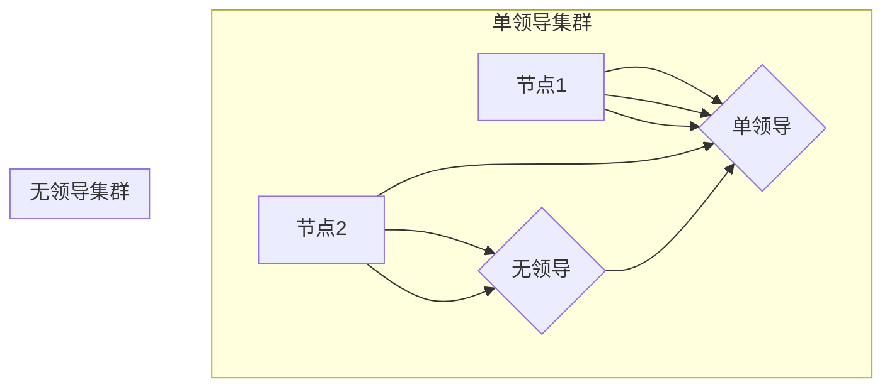
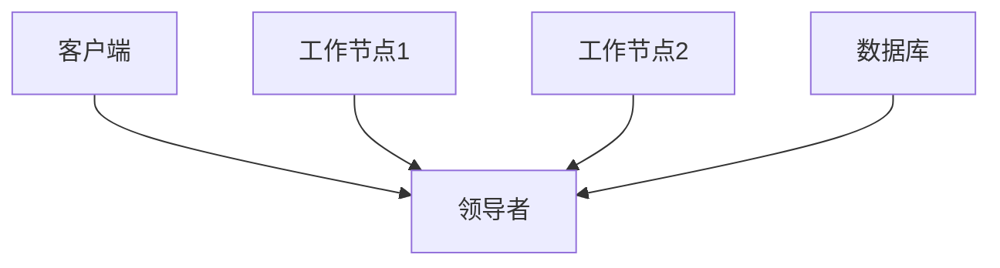
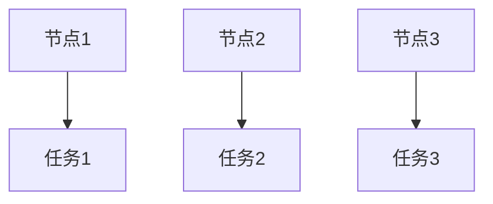

                 

### 《单领导集群与无领导集群最佳实践》

> **关键词：** 集群架构、单领导、无领导、分布式系统、性能优化、稳定性保障

> **摘要：** 本文章深入探讨了单领导集群与无领导集群的设计原理、技术实现和最佳实践。通过详细的分析和案例讲解，帮助读者理解两种集群模式的优劣，掌握在具体场景下的最佳应用策略。

集群是分布式系统中的重要组成部分，广泛应用于数据中心、云服务和边缘计算等领域。集群架构的设计和实现决定了系统的性能、稳定性和扩展性。本文将重点介绍单领导集群与无领导集群的基本概念、技术实现以及最佳实践，帮助读者深入理解这两种集群模式，并在实际项目中做出明智的选择。

### 目录大纲

1. **基础概念与原理**
   - 1.1 单领导集群与无领导集群简介
   - 1.2 数据中心网络架构与集群设计
   - 1.3 核心概念与联系
2. **技术实现**
   - 4.1 单领导集群技术实现
   - 4.2 无领导集群技术实现
3. **最佳实践**
   - 6.1 单领导集群最佳实践
   - 7.1 无领导集群最佳实践
4. **未来展望**
   - 8.1 单领导集群与无领导集群发展趋势
   - 9.1 总结与展望
5. **附录**
   - 附录 A：集群管理工具与资源
   - 附录 B：代码实战示例

在接下来的章节中，我们将一一深入探讨这些内容。

## 第一部分：基础概念与原理

### 1.1 单领导集群与无领导集群简介

#### 单领导集群的定义与特点

单领导集群（Leader-Based Cluster）是一种常见的分布式系统架构，其核心特点是一个集群中存在一个单一的领导者（Leader），负责协调和管理整个集群的任务分配、状态同步和故障转移等操作。领导者通常由集群中的某个节点通过选举产生，具有更高的优先级和更强的资源控制能力。

单领导集群的优势在于：
- **集中控制**：领导者作为整个集群的核心，能够统一管理资源，确保任务的高效执行。
- **稳定性**：领导者负责故障检测和恢复，能够及时发现并解决集群中的问题。
- **可扩展性**：新的节点可以轻松加入集群，领导者负责分配任务，提高集群的负载均衡能力。

然而，单领导集群也存在一些缺点：
- **单点故障**：领导者是集群中的关键节点，一旦出现故障，整个集群将失去协调能力。
- **性能瓶颈**：领导者需要处理大量的协调任务，可能会成为性能瓶颈。

#### 无领导集群的定义与特点

无领导集群（Leaderless Cluster）又称为去中心化集群（Decentralized Cluster），其核心特点是没有单一的领导者，每个节点都是平等的，协同工作完成集群任务。无领导集群通过分布式算法来实现节点间的状态同步、任务分配和故障恢复等功能。

无领导集群的优势在于：
- **高可用性**：没有单点故障，节点故障不会影响集群的整体运行。
- **去中心化**：节点之间没有依赖关系，能够更好地适应动态环境。
- **灵活性**：节点可以根据自身状态自主决定是否参与任务，提高集群的适应性。

无领导集群的缺点包括：
- **协调复杂性**：节点需要频繁通信，同步状态信息，增加了系统的复杂性。
- **性能波动**：节点之间的负载不均衡可能导致性能波动。

### 1.2 数据中心网络架构与集群设计

#### 数据中心网络基础

数据中心网络是集群系统的基础设施，其架构设计直接影响到集群的性能和稳定性。数据中心网络通常包括以下几种类型的网络架构：

- **环网（Ring Network）**：节点通过环形网络连接，每个节点都与相邻的两个节点相连。环网具有较高的冗余性和可靠性，但容易形成单环故障。
- **树网（Tree Network）**：节点通过树形结构连接，形成一个层次化的网络结构。树网具有良好的扩展性和可维护性，但单点故障可能导致部分网络瘫痪。
- **网状网（Mesh Network）**：每个节点都与多个其他节点相连，形成一个网状结构。网状网具有很高的冗余性和可靠性，但节点数量增加会带来网络管理的复杂性。

#### 单领导集群设计原则

在设计单领导集群时，需要考虑以下几个方面：

- **领导者选举机制**：领导者应该具备高效的选举算法，确保在节点加入或退出时能够快速选举新的领导者。
- **负载均衡**：领导者需要合理分配任务，确保节点之间的负载均衡，避免个别节点过载。
- **故障转移机制**：领导者出现故障时，需要能够快速选举新的领导者，保持集群的稳定性。

#### 无领导集群设计原则

在设计无领导集群时，需要考虑以下几个方面：

- **节点状态同步**：节点需要定期同步状态信息，确保每个节点对集群状态的一致性。
- **任务分配算法**：节点需要根据自身状态和任务需求，自主决定是否参与任务，实现负载均衡。
- **故障恢复策略**：节点需要能够自主检测故障并恢复，提高集群的可用性。

### 1.3 核心概念与联系

分布式系统、集群管理与调度是构建高效集群的关键概念。

- **分布式系统**：分布式系统是由多个独立计算机组成的系统，通过计算机网络实现协同工作。集群是分布式系统的一种形式，通过多个节点共同完成计算任务。
- **集群管理**：集群管理包括节点的监控、状态同步、任务分配和故障恢复等功能。集群管理工具负责实现这些功能，提高集群的效率和稳定性。
- **调度**：调度是指将任务分配给合适的节点执行的过程。调度算法需要考虑节点的负载、状态和任务需求，实现最优的任务分配。

通过Mermaid流程图，我们可以更直观地了解单领导集群与无领导集群的架构对比。



在这个流程图中，单领导集群中的领导者负责协调和管理节点间的任务分配，而无领导集群中的节点则通过相互通信和协商实现任务分配。

## 第二部分：技术实现

### 4. 单领导集群技术实现

#### 4.1 单领导集群架构设计

单领导集群的架构设计需要考虑以下几个方面：

- **节点角色**：集群中的节点分为领导者（Leader）和工作节点（Worker）。领导者负责集群的协调和管理，工作节点负责执行具体任务。
- **网络通信**：节点之间通过网络进行通信，通常使用TCP或UDP协议。领导者需要定期广播心跳消息，工作节点需要响应心跳并报告自身状态。
- **数据同步**：领导者需要与工作节点同步数据，确保数据一致性。数据同步可以通过日志记录、快照或增量更新等方式实现。

下面是一个简化的单领导集群架构设计：



在这个架构中，客户端发送任务请求到领导者，领导者根据工作节点的状态和负载情况，将任务分配给合适的工作节点。工作节点执行任务并将结果返回给领导者，最后领导者将结果返回给客户端。

#### 4.2 单领导集群核心算法原理

单领导集群的核心算法主要包括领导者选举算法、任务分配算法和故障转移算法。

##### 4.2.1 领导者选举算法

领导者选举算法是单领导集群的核心机制，用于在集群中选举出领导者。以下是一个简单的领导者选举算法伪代码：

```python
# 伪代码：领导者选举算法

# 每个节点随机生成一个编号，编号越大，优先级越高
node_id = random_number()

# 节点广播自己的编号
send_broadcast(node_id)

# 节点接收其他节点的编号
receive_id = receive_broadcast()

# 选择编号最大的节点作为领导者
leader_id = max(receive_id)

# 发送确认消息给领导者
send_confirmation(leader_id)

# 如果收到确认消息的节点编号等于自己，则成为领导者
if receive_confirmation(node_id) == leader_id:
    become_leader()
```

这个算法的基本思想是每个节点随机生成一个编号，并广播自己的编号。节点接收其他节点的编号后，选择编号最大的节点作为领导者，并发送确认消息。如果节点收到确认消息的编号等于自己，则成为领导者。

##### 4.2.2 任务分配算法

任务分配算法负责将客户端发送的任务请求分配给合适的工作节点。以下是一个简单的任务分配算法伪代码：

```python
# 伪代码：任务分配算法

# 接收到任务请求
receive_request(task)

# 获取所有工作节点的状态信息
node_states = get_node_states()

# 根据节点的状态和负载情况，选择一个合适的节点分配任务
for node_state in node_states:
    if node_state.available and node_state.load < threshold:
        assign_task(task, node_state.id)
        break

# 如果所有节点都不可用或负载过高，返回错误
if not assigned:
    return_error("No available node")
```

这个算法的基本思想是接收任务请求后，获取所有工作节点的状态信息，根据节点的状态和负载情况，选择一个合适的节点分配任务。如果所有节点都不可用或负载过高，则返回错误。

##### 4.2.3 故障转移算法

故障转移算法负责在领导者出现故障时，快速选举新的领导者，保持集群的稳定性。以下是一个简单的故障转移算法伪代码：

```python
# 伪代码：故障转移算法

# 定期检查领导者的心跳
while True:
    if not check_heartbeat(leader_id):
        # 领导者出现故障，开始故障转移
        start_failover()

# 故障转移过程
def start_failover():
    # 重新执行领导者选举算法
    new_leader_id = elect_leader()

    # 更新集群状态，新的领导者开始工作
    update_cluster_state(new_leader_id)

    # 如果当前节点是新的领导者，开始领导工作
    if new_leader_id == current_node_id:
        become_leader()
```

这个算法的基本思想是定期检查领导者的心跳，如果领导者出现故障，则开始故障转移。故障转移过程包括重新执行领导者选举算法，更新集群状态，新的领导者开始工作。

#### 4.3 单领导集群管理工具

单领导集群管理工具负责实现集群的管理功能，包括节点监控、状态同步、任务分配和故障恢复等。以下是一些常见的单领导集群管理工具：

- **Kubernetes**：Kubernetes 是一个开源的容器编排平台，支持单领导集群架构。Kubernetes 提供了丰富的管理功能，包括节点监控、任务调度、故障恢复等。
- **Apache ZooKeeper**：Apache ZooKeeper 是一个分布式协调服务，用于实现单领导集群的领导者选举和状态同步等功能。
- **etcd**：etcd 是一个分布式键值存储系统，常用于实现单领导集群的配置管理和状态同步。

#### 4.4 单领导集群案例分析

以下是一个单领导集群的案例分析：

**案例背景**：某公司使用单领导集群架构管理其分布式系统，集群中包含10个节点，其中1个节点作为领导者，负责协调和管理整个集群的任务分配和状态同步。

**问题描述**：近期，领导者节点出现故障，导致整个集群失去协调能力，部分任务无法执行。

**分析过程**：

1. **故障检测**：监控系统检测到领导者节点失去心跳，判断领导者出现故障。
2. **故障转移**：集群中的工作节点开始执行故障转移算法，重新选举领导者。
3. **领导者选举**：工作节点通过领导者选举算法，选举出新的领导者。
4. **任务分配**：新的领导者开始工作，重新分配任务给工作节点。
5. **故障恢复**：故障节点重新加入集群，等待下一次故障转移。

**解决方案**：

1. **增加冗余**：在集群中增加冗余节点，提高集群的容错能力。
2. **优化故障转移算法**：优化故障转移算法，提高故障转移的速度和可靠性。
3. **监控系统改进**：改进监控系统，实时监控集群状态，及时发现故障。

### 5. 无领导集群技术实现

#### 5.1 无领导集群架构设计

无领导集群的架构设计需要考虑以下几个方面：

- **节点角色**：集群中的节点都是平等的，没有特定的领导者角色。每个节点都可以参与任务执行和状态同步。
- **网络通信**：节点之间通过网络进行通信，通常使用TCP或UDP协议。节点需要定期广播状态信息，其他节点接收并处理这些信息。
- **数据同步**：节点需要同步数据，确保数据一致性。数据同步可以通过日志记录、快照或增量更新等方式实现。

下面是一个简化的无领导集群架构设计：



在这个架构中，节点1、2、3都可以执行任务，并通过网络同步状态信息。

#### 5.2 无领导集群核心算法原理

无领导集群的核心算法主要包括节点状态同步算法、任务分配算法和故障恢复算法。

##### 5.2.1 节点状态同步算法

节点状态同步算法负责节点之间的状态同步。以下是一个简单的节点状态同步算法伪代码：

```python
# 伪代码：节点状态同步算法

# 节点定期广播状态信息
def broadcast_state():
    state = get_node_state()
    send_broadcast(state)

# 节点接收其他节点的状态信息
def receive_state():
    state = receive_broadcast()
    update_node_state(state)

# 更新节点的状态信息
def update_node_state(state):
    node_state = state
    if node_state.health == "healthy":
        node_state.health = "unhealthy"
    elif node_state.health == "unhealthy":
        node_state.health = "healthy"
    save_node_state(node_state)
```

这个算法的基本思想是节点定期广播自己的状态信息，其他节点接收并更新状态信息。节点的状态信息包括健康状态、负载情况和任务执行情况。

##### 5.2.2 任务分配算法

任务分配算法负责将任务分配给合适的节点。以下是一个简单的任务分配算法伪代码：

```python
# 伪代码：任务分配算法

# 接收到任务请求
receive_request(task)

# 获取所有节点的状态信息
node_states = get_node_states()

# 根据节点的状态和负载情况，选择一个合适的节点分配任务
for node_state in node_states:
    if node_state.available and node_state.load < threshold:
        assign_task(task, node_state.id)
        break

# 如果所有节点都不可用或负载过高，返回错误
if not assigned:
    return_error("No available node")
```

这个算法的基本思想是接收任务请求后，获取所有节点的状态信息，根据节点的状态和负载情况，选择一个合适的节点分配任务。如果所有节点都不可用或负载过高，则返回错误。

##### 5.2.3 故障恢复算法

故障恢复算法负责节点故障后的恢复。以下是一个简单的故障恢复算法伪代码：

```python
# 伪代码：故障恢复算法

# 定期检查节点的状态
while True:
    if not check_node_state(node_id):
        # 节点出现故障，开始恢复
        start_recovery(node_id)

# 故障恢复过程
def start_recovery(node_id):
    # 如果故障节点恢复，重新加入集群
    if node_id.is_recovery():
        node_id.join_cluster()
    # 如果故障节点无法恢复，删除节点
    else:
        node_id.delete()
```

这个算法的基本思想是定期检查节点的状态，如果节点出现故障，则开始恢复。故障恢复过程包括检查故障节点的状态，如果节点恢复，则重新加入集群；如果节点无法恢复，则删除节点。

#### 5.3 无领导集群管理工具

无领导集群管理工具负责实现集群的管理功能，包括节点监控、状态同步、任务分配和故障恢复等。以下是一些常见的无领导集群管理工具：

- **Apache Mesos**：Apache Mesos 是一个分布式资源调度框架，支持无领导集群架构。Mesos 提供了丰富的管理功能，包括节点监控、任务调度、故障恢复等。
- **Consul**：Consul 是一个服务发现和配置工具，常用于实现无领导集群的节点监控和状态同步。
- **Zookeeper**：Zookeeper 是一个分布式协调服务，用于实现无领导集群的节点监控和状态同步。

#### 5.4 无领导集群案例分析

以下是一个无领导集群的案例分析：

**案例背景**：某公司使用无领导集群架构管理其分布式系统，集群中包含10个节点，节点之间通过网络同步状态信息，无需特定的领导者角色。

**问题描述**：近期，其中一个节点出现故障，导致任务执行失败。

**分析过程**：

1. **故障检测**：监控系统检测到节点故障，节点停止响应心跳。
2. **任务重新分配**：其他节点根据状态信息，重新分配任务给健康的节点。
3. **故障恢复**：故障节点恢复后，重新加入集群，继续执行任务。

**解决方案**：

1. **增加冗余**：在集群中增加冗余节点，提高集群的容错能力。
2. **优化故障检测算法**：优化故障检测算法，提高故障检测的准确性。
3. **负载均衡**：优化任务分配算法，实现负载均衡，避免个别节点过载。

### 第三部分：最佳实践

#### 6. 单领导集群最佳实践

在设计和维护单领导集群时，以下是一些最佳实践：

- **领导者选举机制优化**：优化领导者选举算法，提高选举速度和可靠性。可以考虑使用基于优先级的选举算法，降低选举过程中的竞争。
- **负载均衡**：领导者需要合理分配任务，实现负载均衡，避免个别节点过载。可以使用轮询算法或基于负载的分配算法，确保任务均匀分配。
- **故障转移机制优化**：优化故障转移算法，提高故障转移的速度和可靠性。可以结合心跳检测、健康检查和备份领导者等机制，确保故障转移的及时性和正确性。
- **数据同步优化**：优化数据同步机制，提高数据一致性和可靠性。可以使用日志记录、快照或增量更新等方式，确保数据在不同节点之间的一致性。

#### 6.1 单领导集群性能优化策略

- **垂直扩展**：增加领导者的资源，如CPU、内存和存储，提高处理能力和存储容量。
- **水平扩展**：增加工作节点的数量，提高集群的负载均衡能力和容错能力。
- **缓存机制**：使用缓存机制，减少对数据库的访问次数，提高响应速度。可以使用内存缓存、分布式缓存或数据库缓存等。
- **数据库优化**：优化数据库性能，如索引、查询优化和数据库集群等，提高数据读写速度。

#### 6.2 单领导集群稳定性保障策略

- **冗余设计**：增加冗余节点，提高集群的容错能力。可以使用主备架构或集群架构，确保在节点故障时，集群仍能正常运行。
- **监控与报警**：实时监控集群状态，及时发现故障和性能问题。配置报警机制，如邮件、短信或电话报警，确保相关人员能够及时响应。
- **故障恢复**：优化故障恢复策略，确保故障节点能够快速恢复。可以使用自动恢复、手动恢复或混合恢复等机制，提高故障恢复速度和可靠性。
- **备份与恢复**：定期备份数据，确保在灾难发生时，能够快速恢复数据。可以使用全量备份、增量备份或实时备份等策略，提高数据的安全性。

#### 6.3 单领导集群案例实战

以下是一个单领导集群的案例实战：

**案例背景**：某电商公司使用单领导集群架构管理其订单系统，集群中包含1个领导者节点和10个工作节点。订单系统需要处理大量的订单请求，要求高可用性和高性能。

**解决方案**：

1. **领导者选举机制优化**：采用基于优先级的选举算法，提高选举速度和可靠性。领导者节点具有更高的优先级，确保在节点故障时，能够快速选举新的领导者。
2. **负载均衡**：领导者节点根据工作节点的状态和负载情况，使用轮询算法分配订单任务。确保订单均匀分配，避免个别节点过载。
3. **故障转移机制优化**：结合心跳检测和备份领导者机制，确保故障转移的及时性和可靠性。领导者节点定期发送心跳消息，工作节点监控心跳状态，如果领导者节点出现故障，工作节点开始故障转移过程，选举新的领导者。
4. **数据同步优化**：使用日志记录和快照机制，确保数据在不同节点之间的一致性。领导者节点将订单数据记录到日志中，工作节点定期同步日志，确保数据一致性。
5. **冗余设计**：增加冗余节点，提高集群的容错能力。使用主备架构，领导者节点故障时，备份领导者节点自动接管集群，确保订单系统的正常运行。

通过以上解决方案，电商公司的订单系统能够实现高可用性和高性能，满足业务需求。

#### 7. 无领导集群最佳实践

在设计和维护无领导集群时，以下是一些最佳实践：

- **节点状态同步**：优化节点状态同步机制，确保节点之间状态的一致性。可以使用 gossip 协议、一致性哈希或分布式一致性算法等。
- **任务分配算法优化**：优化任务分配算法，提高任务执行的效率和公平性。可以使用随机分配、基于负载的分配或基于优先级的分配等。
- **故障恢复策略**：优化故障恢复策略，确保节点故障后的快速恢复。可以使用心跳检测、自动恢复或手动恢复等策略。
- **网络优化**：优化网络通信，提高数据传输速度和可靠性。可以使用压缩、多路径传输或网络优化协议等。

#### 7.1 无领导集群扩展性优化策略

- **水平扩展**：增加节点数量，提高集群的负载能力和容错能力。可以通过自动化部署、容器化和云服务等方式实现。
- **分布式存储**：使用分布式存储系统，提高数据的存储能力和访问速度。可以使用分布式文件系统、分布式数据库或分布式缓存等。
- **负载均衡**：使用负载均衡器，实现任务的高效分配和执行。可以使用轮询、最少连接或基于优先级的负载均衡算法。

#### 7.2 无领导集群安全性保障策略

- **访问控制**：使用访问控制列表（ACL），限制对集群的访问权限。确保只有授权的用户和节点能够访问集群资源。
- **加密通信**：使用加密协议，保护节点之间的通信数据。可以使用 TLS、SSL 或 SSH 等协议。
- **安全审计**：定期进行安全审计，发现和修复潜在的安全漏洞。可以使用自动化安全扫描工具和手动审计相结合的方式。
- **备份与恢复**：定期备份数据，确保在灾难发生时，能够快速恢复数据。可以使用全量备份、增量备份或实时备份等策略。

#### 7.3 无领导集群案例实战

以下是一个无领导集群的案例实战：

**案例背景**：某互联网公司使用无领导集群架构管理其日志处理系统，集群中包含多个节点，节点之间通过网络同步状态信息和任务。

**解决方案**：

1. **节点状态同步**：采用 gossip 协议，实现节点之间的状态同步。每个节点定期广播自己的状态信息，其他节点接收并更新状态信息，确保状态一致性。
2. **任务分配算法**：采用基于负载的分配算法，根据节点的负载情况，将日志处理任务分配给合适的节点。确保任务均匀分配，避免个别节点过载。
3. **故障恢复策略**：使用心跳检测机制，定期检测节点的状态。如果节点出现故障，其他节点会重新分配任务，确保任务继续执行。
4. **负载均衡**：使用负载均衡器，实现日志处理任务的动态分配。根据节点的负载情况，调整任务分配策略，确保负载均衡。
5. **安全性保障**：使用 TLS 加密协议，保护节点之间的通信数据。配置访问控制列表，限制对集群的访问权限，确保集群安全。

通过以上解决方案，互联网公司的日志处理系统能够实现高可用性、高性能和安全性，满足业务需求。

### 第四部分：未来展望

#### 8. 单领导集群与无领导集群发展趋势

随着云计算、大数据和物联网等技术的快速发展，单领导集群与无领导集群在分布式系统中的应用越来越广泛。以下是一些发展趋势：

- **智能化**：随着人工智能技术的发展，单领导集群与无领导集群将更加智能化。集群管理工具将集成人工智能算法，实现自动化的任务调度、故障检测和故障恢复等功能。
- **云原生**：云原生技术（如容器化、微服务和无服务器架构）将推动单领导集群与无领导集群的发展。集群将更好地适应云环境，实现高效的可扩展性和高可用性。
- **边缘计算**：边缘计算将使得单领导集群与无领导集群在靠近数据源的边缘节点上运行。集群将更好地支持实时数据处理和智能决策，满足物联网和智能设备的需求。

#### 8.1 云原生技术与集群架构

云原生技术是未来分布式系统发展的重要方向。云原生集群架构具有以下特点：

- **容器化**：容器化技术（如Docker和Kubernetes）使得集群中的节点可以快速部署和扩展。容器化集群可以实现更灵活的部署和管理，提高集群的可用性和性能。
- **微服务**：微服务架构将系统拆分为多个小型服务，每个服务可以独立部署和扩展。微服务集群可以实现更细粒度的管理和调度，提高系统的可维护性和可扩展性。
- **无服务器**：无服务器架构（如AWS Lambda和Azure Functions）使得集群中的节点可以按需分配和释放资源。无服务器集群可以实现更高效的资源利用和更低的运维成本。

#### 8.2 边缘计算与集群架构

边缘计算是云计算的延伸，将计算和存储能力推向网络边缘，提高实时数据处理和智能决策能力。边缘计算集群架构具有以下特点：

- **分布式边缘节点**：边缘计算集群由多个分布在网络边缘的节点组成，每个节点可以独立处理本地数据。分布式边缘节点可以实现更灵活的数据处理和更低的延迟。
- **边缘智能**：边缘计算集群集成了人工智能算法，可以实时分析数据，实现智能决策和自动化控制。边缘智能可以提高系统的智能化水平和响应速度。
- **混合架构**：边缘计算集群可以与云原生集群相结合，实现云边协同。混合架构可以实现更广泛的应用场景和更高效的资源利用。

#### 8.3 集群技术在人工智能领域的应用

集群技术在人工智能领域具有广泛的应用前景。以下是一些应用场景：

- **模型训练**：集群技术可以支持大规模的人工智能模型训练。通过分布式训练，可以加速模型训练过程，提高训练效率。
- **推理加速**：集群技术可以支持实时的人工智能推理。通过分布式推理，可以加速推理过程，提高推理速度和性能。
- **数据存储和处理**：集群技术可以支持大规模的数据存储和处理。通过分布式存储和处理，可以高效地存储和计算大量数据，提高系统的可用性和性能。
- **边缘智能**：集群技术可以支持边缘计算，实现边缘智能。通过边缘计算，可以实时分析本地数据，实现智能决策和自动化控制。

### 9. 总结与展望

单领导集群与无领导集群是分布式系统中的重要组成部分，具有不同的特点和适用场景。在设计和实现集群时，需要根据具体需求和业务场景，选择合适的集群模式。

未来，随着云计算、大数据和人工智能等技术的发展，集群技术将不断演进和优化。智能化的集群管理工具、云原生架构和边缘计算将推动集群技术在各个领域的应用。同时，集群技术在人工智能领域的应用也将进一步拓展，为人工智能的发展提供强大的计算支持和智能决策能力。

### 附录

#### 附录 A：集群管理工具与资源

以下是一些常见的集群管理工具和资源：

- **Kubernetes**：https://kubernetes.io/
- **Apache Mesos**：https://mesos.apache.org/
- **Consul**：https://www.consul.io/
- **etcd**：https://etcd.io/
- **Zookeeper**：https://zookeeper.apache.org/

#### 附录 B：代码实战示例

以下是一个简单的单领导集群和无领导集群的代码示例：

**单领导集群示例**：

```python
# 单领导集群示例

import random
import socket

# 领导者选举算法
def elect_leader():
    node_id = random.randint(1, 100)
    print(f"节点 {node_id} 选举领导者")
    return node_id

# 任务分配算法
def assign_task(task):
    print(f"分配任务 {task} 给节点 {node_id}")
    # 执行任务
    print(f"节点 {node_id} 执行任务 {task}")

# 接收客户端请求
def receive_request():
    while True:
        request = input("请输入任务请求：")
        assign_task(request)

# 主函数
def main():
    global node_id
    node_id = elect_leader()
    receive_request()

if __name__ == "__main__":
    main()
```

**无领导集群示例**：

```python
# 无领导集群示例

import random
import socket

# 任务分配算法
def assign_task(task):
    print(f"分配任务 {task} 给节点 {node_id}")
    # 执行任务
    print(f"节点 {node_id} 执行任务 {task}")

# 接收客户端请求
def receive_request():
    while True:
        request = input("请输入任务请求：")
        assign_task(request)

# 主函数
def main():
    global node_id
    node_id = random.randint(1, 100)
    print(f"节点 {node_id} 开始工作")
    receive_request()

if __name__ == "__main__":
    main()
```

通过以上示例，可以初步了解单领导集群和无领导集群的实现方法。在实际项目中，可以根据具体需求和场景，进一步优化和扩展代码实现。

