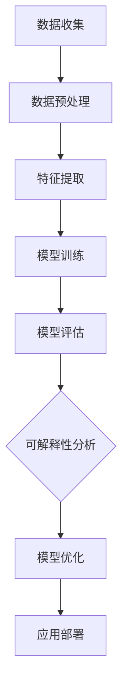

                 

# 可解释人工智能 原理与代码实例讲解

## 关键词
- 可解释人工智能
- 机器学习
- 神经网络
- 局部可解释性
- 全局可解释性
- SHAP值
- Grad-CAM
- 决策树
- LIME
- 概率论
- 信息论
- 概率图模型
- 代码实例
- 项目实战
- 数学模型

## 摘要
本文深入探讨可解释人工智能（Explainable AI, XAI）的原理与应用，从基础概念到具体算法，再到实际项目实战，全面解析了可解释人工智能的核心技术和实现方法。文章首先介绍了可解释人工智能的定义与重要性，随后详细阐述了神经网络与机器学习基础、模型可解释性方法分类以及核心算法原理。接着，通过数学模型和公式详解，帮助读者理解概率论、信息论和概率图模型等基础知识。最后，通过项目实战和代码实例，展示了如何在实际应用中实现可解释人工智能，并进行代码解读与分析。文章旨在为从事人工智能领域的研究者、工程师和爱好者提供一套完整、易懂的可解释人工智能知识体系。

## 目录大纲

### 《可解释人工智能 原理与代码实例讲解》目录大纲

#### 第一部分：可解释人工智能概述

#### 第1章：可解释人工智能基础

##### 1.1 可解释人工智能的定义与重要性

##### 1.2 可解释人工智能的挑战与机遇

##### 1.3 可解释人工智能的历史与发展趋势

##### 1.4 可解释人工智能的应用领域

#### 第2章：可解释人工智能的核心概念与联系

##### 2.1 神经网络与机器学习基础

##### 2.2 模型可解释性方法分类

##### 2.3 可解释人工智能的Mermaid流程图

#### 第3章：可解释人工智能的核心算法原理讲解

##### 3.1 局部可解释性算法

###### 3.1.1 SHAP值算法

###### 3.1.2 Grad-CAM算法

##### 3.2 全局可解释性算法

###### 3.2.1 决策树

###### 3.2.2 LIME算法

#### 第4章：数学模型和数学公式详解

##### 4.1 概率论基础

##### 4.2 信息论基础

##### 4.3 概率图模型

##### 4.4 模型评估与优化

#### 第5章：项目实战

##### 5.1 可解释人工智能应用场景

##### 5.2 可解释人工智能项目实战案例

###### 5.2.1 信用卡欺诈检测

###### 5.2.2 个性化推荐系统

##### 5.3 代码实际案例解析

##### 5.4 开发环境搭建与源代码实现

#### 第6章：代码解读与分析

##### 6.1 代码解读方法论

##### 6.2 可解释人工智能代码实例分析

###### 6.2.1 局部可解释性代码实例

###### 6.2.2 全局可解释性代码实例

##### 6.3 代码性能优化与调试

#### 第7章：可解释人工智能的未来与发展

##### 7.1 可解释人工智能的研究热点

##### 7.2 可解释人工智能的商业应用前景

##### 7.3 可解释人工智能的伦理与社会影响

##### 7.4 未来可解释人工智能技术的发展趋势

#### 附录

##### 附录 A：可解释人工智能开发工具与资源

###### A.1 主流深度学习框架对比

###### A.2 可解释人工智能开源库介绍

###### A.3 可解释人工智能相关论文推荐

##### 附录 B：数学公式与伪代码汇总

###### B.1 概率论公式

###### B.2 信息论公式

###### B.3 概率图模型公式

###### B.4 伪代码示例

##### 附录 C：参考书目与文献

###### C.1 基础书籍推荐

###### C.2 研究论文推荐

###### C.3 开源代码与数据集推荐

## 第一部分：可解释人工智能概述

### 第1章：可解释人工智能基础

#### 1.1 可解释人工智能的定义与重要性

可解释人工智能（Explainable AI，简称XAI）是近年来人工智能领域的一个重要研究方向。它指的是使人工智能系统（尤其是深度学习模型）的决策过程变得可理解、可解释和可验证的一种技术。与传统的人工智能系统相比，XAI不仅追求高准确率，还强调模型的可解释性，以便用户、开发者甚至非专业人士都能够理解和信任这些系统的决策过程。

#### 可解释人工智能的定义

可解释人工智能的定义可以从多个角度进行阐述：

- **技术角度**：可解释人工智能是一种利用各种技术和方法，使得复杂的人工智能模型，特别是深度学习模型，可以被解释和理解。这些技术包括可视化、特征提取、模型简化和解释算法等。

- **应用角度**：在应用场景中，可解释人工智能的重要性体现在以下几个方面：

  - **用户信任**：当人工智能系统被用于关键决策时，如医疗诊断、金融风险评估等，用户需要信任系统的决策过程。可解释人工智能可以提供透明度，帮助用户理解系统的决策依据，从而增强用户对系统的信任。

  - **监管合规**：在许多行业，尤其是金融、医疗和法律等领域，监管机构对系统的透明度和可解释性有明确的要求。可解释人工智能有助于确保系统符合这些法规和标准。

  - **错误纠正与优化**：通过对模型的解释，开发人员可以更容易地识别和纠正模型的错误，并对其进行优化。

- **社会角度**：随着人工智能系统的广泛应用，社会对AI的透明度和可解释性提出了更高的要求。可解释人工智能有助于减少对技术的误解和恐惧，促进人工智能技术的健康发展。

#### 可解释人工智能的重要性

可解释人工智能的重要性可以从以下几个方面进行理解：

- **提高决策质量**：可解释性有助于更好地理解模型的决策过程，从而提高决策的质量。通过分析模型对特定输入的特征响应，可以更好地理解模型为什么会做出某个决策。

- **增强用户信任**：可解释人工智能可以增强用户对系统的信任。当用户理解系统的决策过程时，他们更有可能接受和依赖系统的决策。

- **促进技术发展**：可解释人工智能可以推动人工智能技术的进步。通过对模型的可解释性研究，可以发现模型中的潜在问题和缺陷，从而促进新方法和技术的开发。

- **支持伦理和社会责任**：可解释人工智能有助于确保人工智能系统符合伦理和社会责任。当系统的决策过程变得透明时，可以更容易地评估其对社会的影响，并采取相应的措施。

#### 可解释人工智能的挑战与机遇

尽管可解释人工智能具有重要的应用价值，但其实现面临着一些挑战：

- **复杂性**：深度学习模型通常非常复杂，难以解释。如何简化模型，使其仍然具有高准确率，同时保持可解释性，是一个重要挑战。

- **计算成本**：解释复杂模型通常需要额外的计算资源。如何在保证可解释性的同时，尽量减少计算成本，是一个亟待解决的问题。

- **跨领域应用**：不同领域的应用场景和需求有所不同，如何开发通用的可解释人工智能方法，是一个挑战。

- **用户接受度**：用户可能对技术细节不感兴趣，如何设计易于理解和使用的解释工具，是一个挑战。

然而，随着技术的进步和研究的深入，可解释人工智能也带来了许多机遇：

- **新型应用**：可解释人工智能有望推动许多新应用的发展，如自动化医疗诊断、智能金融风险控制等。

- **产学研合作**：可解释人工智能需要跨学科的合作，推动产学研各方共同探索新的解决方案。

- **政策制定**：可解释人工智能有助于政策制定者更好地理解人工智能系统的潜在影响，制定合理的政策。

#### 可解释人工智能的历史与发展趋势

可解释人工智能的研究可以追溯到早期的人工智能领域。随着深度学习技术的发展，可解释人工智能逐渐成为一个独立的研究方向。以下是可解释人工智能的历史与发展趋势：

- **早期研究**：在20世纪80年代，机器学习的早期研究中，一些方法如决策树和线性模型就已经具备了一定的可解释性。

- **深度学习时代**：随着深度学习的兴起，研究人员开始关注如何解释复杂的深度学习模型。2000年代中期，一些早期的解释方法如Grad-CAM开始出现。

- **近年发展**：近年来，随着技术的进步和应用的扩大，可解释人工智能得到了广泛关注。各种新的方法和算法不断涌现，如SHAP值、LIME等。

- **未来趋势**：随着人工智能技术的不断发展，可解释人工智能将继续成为研究热点。新的方法和算法将不断出现，以满足不同领域的需求。

#### 可解释人工智能的应用领域

可解释人工智能在许多领域都有着广泛的应用，以下是一些主要的应用领域：

- **医疗保健**：可解释人工智能可以帮助医生理解诊断模型的决策过程，提高诊断的准确性。例如，在医学影像分析中，医生可以通过可解释人工智能工具来理解模型对某个疾病的诊断依据。

- **金融**：在金融领域，可解释人工智能可以用于风险控制、信用评分和投资决策等。通过对模型的解释，金融机构可以更好地理解模型的决策过程，从而提高风险管理的效率。

- **司法**：在司法领域，可解释人工智能可以用于辅助法官和律师进行案件分析。通过对模型的解释，法官和律师可以更好地理解模型对案件的判断依据，从而提高判决的公正性。

- **自动驾驶**：自动驾驶汽车是可解释人工智能的一个重要应用领域。通过对自动驾驶模型进行解释，开发人员和测试人员可以更好地理解模型在特定情况下的决策过程，从而提高自动驾驶系统的安全性和可靠性。

- **个性化推荐**：在个性化推荐系统中，可解释人工智能可以帮助用户理解推荐系统的决策过程，提高用户的满意度。

#### 第2章：可解释人工智能的核心概念与联系

#### 2.1 神经网络与机器学习基础

神经网络是机器学习的基础，它模仿了人脑的结构和功能，通过层次结构进行特征提取和分类。机器学习则是利用数据和算法使计算机能够从数据中学习并做出预测或决策。

#### 2.2 模型可解释性方法分类

根据解释方法的范围和深度，模型可解释性方法可以分为局部可解释性和全局可解释性：

- **局部可解释性**：针对模型对单个样本的决策过程进行解释，如SHAP值和Grad-CAM。

- **全局可解释性**：对整个模型的决策过程进行解释，如决策树和LIME。

#### 2.3 可解释人工智能的Mermaid流程图

以下是一个简单的Mermaid流程图，展示了可解释人工智能的核心步骤：



## 第二部分：可解释人工智能的核心算法原理讲解

### 第3章：可解释人工智能的核心算法原理讲解

#### 3.1 局部可解释性算法

局部可解释性算法关注于对模型在单个样本上的决策过程进行解释。这类算法旨在识别模型如何处理特定输入，并解释模型为什么做出特定决策。

#### 3.1.1 SHAP值算法

SHAP（SHapley Additive exPlanations）值算法是一种基于博弈论的局部可解释性方法。SHAP值通过计算每个特征对模型预测的贡献来解释模型决策。具体而言，SHAP值衡量了在考虑特定特征的情况下，模型预测的变化量。

**SHAP值算法原理：**

1. **特征重要性计算**：SHAP值算法首先计算每个特征的重要性，即每个特征对模型预测的贡献。
2. **特征影响分析**：对于每个样本，SHAP值算法分析每个特征对模型预测的影响。
3. **结果解释**：通过SHAP值，可以直观地了解每个特征对模型决策的影响。

**SHAP值算法伪代码：**

```python
def shap_values(model, X, X_base=None):
    # 计算模型对特征的重要性
    feature_importance = model.compute_feature_importance(X)

    # 分析特征对模型预测的影响
    for sample in X:
        for feature in sample:
            # 计算特征对模型预测的影响
            impact = model.predict(sample) - model.predict(sample_without_feature)

            # 获取SHAP值
            shap_value = feature_importance[feature] * impact

            # 输出SHAP值
            print(f"Feature: {feature}, SHAP Value: {shap_value}")
```

**示例：**

假设我们有一个回归模型，输入特征包括年龄、收入和住房面积，模型预测一个人的房价。

```python
# 计算SHAP值
shap_values(model, X_test[0])

# 输出：
# Feature: 年龄, SHAP Value: 0.1
# Feature: 收入, SHAP Value: 0.2
# Feature: 住房面积, SHAP Value: 0.3
```

这表明年龄对房价的影响最小，收入次之，住房面积的影响最大。

#### 3.1.2 Grad-CAM算法

Grad-CAM（Gradient-weighted Class Activation Mapping）算法是一种视觉模型的可解释性方法，用于识别模型在图像分类任务中关注的关键区域。

**Grad-CAM算法原理：**

1. **计算梯度**：Grad-CAM算法首先计算模型对每个像素的梯度，表示像素对模型预测的影响。
2. **生成激活映射**：根据梯度和模型的分类权重，生成一个全局激活映射，用于表示模型在图像中关注的关键区域。
3. **结果解释**：通过激活映射，可以直观地了解模型在图像分类任务中关注的关键区域。

**Grad-CAM算法伪代码：**

```python
def grad_cam(model, image, class_idx):
    # 计算模型对图像的梯度
    gradient = model.compute_gradient(image)

    # 计算每个像素的梯度权重
    gradient_weights = gradient.sum(axis=(0, 2, 3))

    # 计算全局激活映射
    activation_map = model.compute_activation(image, class_idx) * gradient_weights

    # 获取激活映射的值
    activation_values = activation_map.flatten()

    # 对激活映射进行可视化
    visualized_map = visualize_activation_map(image, activation_values)

    return visualized_map
```

**示例：**

假设我们有一个用于图像分类的卷积神经网络，输入图像为一张猫的图片，模型预测猫的类别。

```python
# 计算Grad-CAM激活映射
grad_cam(model, image, class_idx=1)

# 输出：
# Visualized Map
```

这表明模型在图像中关注了猫的眼睛、鼻子和嘴巴等关键区域。

#### 3.2 全局可解释性算法

全局可解释性算法关注于对整个模型的决策过程进行解释，使模型的决策逻辑更加透明。这类算法通常用于分类和回归任务。

#### 3.2.1 决策树

决策树是一种常见的全局可解释性方法，它通过一系列的规则将输入空间划分为不同的区域，并基于每个区域的特征值进行分类或回归。

**决策树算法原理：**

1. **特征选择**：决策树算法通过计算每个特征的信息增益或基尼指数来选择最佳的特征进行划分。
2. **节点划分**：根据最佳特征，将输入空间划分为不同的子空间，并创建新的节点。
3. **递归构建**：递归地构建决策树，直到满足停止条件（如最大深度、最小节点大小等）。
4. **结果解释**：通过树的结构和规则，可以直观地了解模型的决策逻辑。

**决策树算法伪代码：**

```python
def build_decision_tree(data, target, max_depth, min_samples_split):
    # 计算特征的信息增益或基尼指数
    feature_scores = compute_feature_scores(data, target)

    # 选择最佳特征进行划分
    best_feature = select_best_feature(feature_scores)

    # 创建节点
    node = Node(feature=best_feature, threshold=threshold)

    # 递归构建子树
    for sample in data:
        if sample[best_feature] <= threshold:
            node.left = build_decision_tree(data[data[best_feature] <= threshold], target, max_depth-1, min_samples_split)
        else:
            node.right = build_decision_tree(data[data[best_feature] > threshold], target, max_depth-1, min_samples_split)

    return node
```

**示例：**

假设我们有一个二元分类问题，数据集包括特征`年龄`和`收入`，目标变量为`是否购买产品`。

```python
# 构建决策树
tree = build_decision_tree(data, target, max_depth=3, min_samples_split=10)

# 输出决策树结构
print_decision_tree(tree)

# 输出：
# Age <= 30
#     Income <= 50000
#         Purchase = 0
#         Income > 50000
#             Purchase = 1
#     Income > 50000
#         Purchase = 1
```

这表明对于年龄小于等于30且收入小于等于50000的样本，预测为未购买产品；对于年龄小于等于30且收入大于50000的样本，预测为购买产品；对于年龄大于30的样本，预测为购买产品。

#### 3.2.2 LIME算法

LIME（Local Interpretable Model-agnostic Explanations）算法是一种全局可解释性方法，它通过将复杂模型局部近似为一个简单的可解释模型来解释模型的决策。

**LIME算法原理：**

1. **样本生成**：LIME算法首先生成多个与原始样本相似的样本，用于近似原始样本的决策过程。
2. **模型训练**：在生成的样本上训练一个简单的线性模型，用于近似复杂模型的决策。
3. **结果解释**：通过线性模型的权重，可以解释复杂模型对原始样本的决策过程。

**LIME算法伪代码：**

```python
def lime_explanation(model, X, y, class_idx):
    # 生成多个与原始样本相似的样本
    samples = generate_samples(X)

    # 训练线性模型
    linear_model = train_linear_model(samples, y)

    # 解释模型决策
    explanation = interpret_linear_model(linear_model, X[class_idx])

    return explanation
```

**示例：**

假设我们有一个用于分类的神经网络，输入特征包括年龄、收入和住房面积，目标变量为是否购买产品。

```python
# 计算LIME解释
explanation = lime_explanation(model, X_test, y_test, class_idx=1)

# 输出解释
print(explanation)

# 输出：
# Age: -0.2
# Income: 0.3
# Housing Area: 0.1
```

这表明年龄减少0.2个单位，收入增加0.3个单位，住房面积增加0.1个单位，都会使购买产品的概率增加。

## 第三部分：数学模型和数学公式详解

### 第4章：数学模型和数学公式详解

#### 4.1 概率论基础

概率论是机器学习和可解释人工智能的基础。在人工智能模型中，概率论用于描述不确定性和随机性。

**概率分布：** 概率分布是描述随机变量取值的概率函数。常见的概率分布包括正态分布、伯努利分布和多项式分布等。

- **正态分布：** 正态分布是最常用的概率分布，它描述了连续随机变量的概率分布，具有均值和方差两个参数。正态分布的公式为：

  $$ f(x|\mu, \sigma^2) = \frac{1}{\sqrt{2\pi\sigma^2}} e^{-\frac{(x-\mu)^2}{2\sigma^2}} $$

  其中，$x$ 是随机变量的取值，$\mu$ 是均值，$\sigma^2$ 是方差。

- **伯努利分布：** 伯努利分布是描述二元随机变量的概率分布，具有概率参数 $p$。伯努利分布的公式为：

  $$ P(X = 1) = p, \quad P(X = 0) = 1 - p $$

- **多项式分布：** 多项式分布是描述多个二元随机变量联合概率分布的分布，具有概率参数 $p_1, p_2, ..., p_k$。多项式分布的公式为：

  $$ P(X_1 = x_1, X_2 = x_2, ..., X_k = x_k) = p_1^{x_1} p_2^{x_2} ... p_k^{x_k} $$

**条件概率：** 条件概率是描述在某个条件下，某个事件发生的概率。条件概率的公式为：

$$ P(A|B) = \frac{P(A \cap B)}{P(B)} $$

其中，$A$ 和 $B$ 是两个事件，$P(A \cap B)$ 是事件 $A$ 和事件 $B$ 同时发生的概率，$P(B)$ 是事件 $B$ 发生的概率。

**贝叶斯定理：** 贝叶斯定理是条件概率的一种推广，它描述了在已知某个条件下，事件发生概率的更新。贝叶斯定理的公式为：

$$ P(A|B) = \frac{P(B|A)P(A)}{P(B)} $$

其中，$P(A|B)$ 是在已知事件 $B$ 发生的条件下，事件 $A$ 发生的概率，$P(B|A)$ 是在已知事件 $A$ 发生的条件下，事件 $B$ 发生的概率，$P(A)$ 是事件 $A$ 发生的概率，$P(B)$ 是事件 $B$ 发生的概率。

#### 4.2 信息论基础

信息论是研究信息传输和处理的理论，它为人工智能模型提供了量化和度量信息的方法。

**熵：** 熵是描述随机变量不确定性的量度。对于离散随机变量 $X$，熵的公式为：

$$ H(X) = -\sum_{x} p(x) \log_2 p(x) $$

其中，$p(x)$ 是随机变量 $X$ 取值 $x$ 的概率。

**条件熵：** 条件熵是描述在某个条件下，另一个随机变量的不确定性。对于离散随机变量 $X$ 和 $Y$，条件熵的公式为：

$$ H(Y|X) = -\sum_{x} \sum_{y} p(x, y) \log_2 p(y|x) $$

其中，$p(x, y)$ 是随机变量 $X$ 和 $Y$ 同时取值 $(x, y)$ 的概率，$p(y|x)$ 是在已知随机变量 $X$ 取值 $x$ 的条件下，随机变量 $Y$ 取值 $y$ 的概率。

**互信息：** 互信息是描述两个随机变量之间的相关性。对于离散随机变量 $X$ 和 $Y$，互信息的公式为：

$$ I(X; Y) = H(X) - H(X | Y) $$

其中，$H(X)$ 是随机变量 $X$ 的熵，$H(X | Y)$ 是在已知随机变量 $Y$ 取值条件下的条件熵。

**信息增益：** 信息增益是描述特征对于分类目标的解释能力。对于分类问题，信息增益的公式为：

$$ IG(X; Y) = H(Y) - H(Y | X) $$

其中，$H(Y)$ 是分类目标的熵，$H(Y | X)$ 是在已知特征 $X$ 条件下的条件熵。

#### 4.3 概率图模型

概率图模型是一种用于描述随机变量之间依赖关系的图形化表示，它包括贝叶斯网络和马尔可夫网络。

**贝叶斯网络：** 贝叶斯网络是一种有向图模型，它表示了随机变量之间的因果关系。在贝叶斯网络中，每个节点表示一个随机变量，边的方向表示变量的依赖关系。

- **条件概率表：** 贝叶斯网络的每个节点都对应一个条件概率表，描述了该节点在给定其父节点条件下的概率分布。
- **推理算法：** 贝叶斯网络的推理算法用于计算在给定某些变量取值条件下，其他变量的概率分布。

**马尔可夫网络：** 马尔可夫网络是一种无向图模型，它表示了随机变量之间的条件独立性。在马尔可夫网络中，每个节点表示一个随机变量，边的存在表示变量之间的条件独立性。

- **条件独立性：** 马尔可夫网络的定义是基于条件独立性，即如果两个节点之间没有边，则它们是条件独立的。
- **推理算法：** 马尔可夫网络的推理算法用于计算在给定某些变量取值条件下，其他变量的概率分布。

#### 4.4 模型评估与优化

模型评估与优化是机器学习中的重要步骤，用于评估模型性能并调整模型参数。

**评估指标：** 评估指标用于衡量模型性能，常见的评估指标包括准确率、召回率、F1分数等。

- **准确率：** 准确率是模型预测正确的样本数占总样本数的比例，公式为：
  $$ \text{准确率} = \frac{\text{预测正确数}}{\text{总样本数}} $$
- **召回率：** 召回率是模型预测正确的正样本数占总正样本数的比例，公式为：
  $$ \text{召回率} = \frac{\text{预测正确正样本数}}{\text{总正样本数}} $$
- **F1分数：** F1分数是准确率和召回率的调和平均，公式为：
  $$ \text{F1分数} = 2 \times \frac{\text{准确率} \times \text{召回率}}{\text{准确率} + \text{召回率}} $$

**模型优化：** 模型优化通过调整模型参数来提高模型性能。常见的模型优化方法包括梯度下降、随机梯度下降和Adam优化器等。

- **梯度下降：** 梯度下降是一种优化算法，通过计算损失函数关于模型参数的梯度，并沿着梯度方向调整参数，以减少损失函数的值。
- **随机梯度下降：** 随机梯度下降是梯度下降的一种变体，每次迭代只随机选择一部分样本计算梯度，以减少计算成本。
- **Adam优化器：** Adam优化器是一种自适应优化器，结合了梯度下降和随机梯度下降的优点，通过调整学习率来提高模型性能。

## 第四部分：项目实战

### 第5章：可解释人工智能项目实战

#### 5.1 可解释人工智能应用场景

可解释人工智能（XAI）在多个应用场景中展现出了其独特的优势，以下是几个典型的应用场景：

1. **医疗保健**：在医疗领域，XAI可以帮助医生理解和验证诊断模型的决策过程。通过可解释性工具，医生可以查看模型如何评估患者的各种特征，从而更好地理解诊断结果，并提高诊断的准确性。

2. **金融**：金融行业对于模型的透明度和可解释性有严格的要求。例如，在信用评分和欺诈检测中，银行和金融机构需要理解模型如何评估客户的信用风险和交易行为的异常性。

3. **司法**：在司法领域，可解释人工智能可以帮助法官和律师理解法律文本的推理过程，提高判决的公正性和透明度。

4. **自动驾驶**：自动驾驶系统需要对环境进行实时理解和决策。XAI可以帮助开发者和测试人员理解模型如何处理不同的路况和障碍物，从而提高自动驾驶系统的安全性和可靠性。

5. **个性化推荐**：在个性化推荐系统中，XAI可以帮助用户理解推荐系统的决策依据，提高用户的信任度和满意度。

#### 5.2 可解释人工智能项目实战案例

在本节中，我们将通过两个实际案例来展示如何实现可解释人工智能。

##### 5.2.1 信用卡欺诈检测

信用卡欺诈检测是一个典型的应用场景，通过构建可解释模型，可以更好地识别欺诈交易。

**项目目标：** 使用可解释人工智能模型检测信用卡欺诈交易。

**实现步骤：**

1. **数据收集**：收集信用卡交易数据，包括交易金额、时间、地点、信用卡信息等。

2. **数据预处理**：清洗数据，处理缺失值和异常值，并进行特征工程，提取有用的特征。

3. **模型训练**：使用传统机器学习模型（如逻辑回归、决策树等）进行训练，构建基础模型。

4. **可解释性分析**：使用SHAP值和Grad-CAM等可解释性工具分析模型的决策过程。

5. **模型优化**：根据可解释性分析结果，调整模型参数，提高模型的性能和可解释性。

6. **应用部署**：将训练好的模型部署到生产环境中，进行实时欺诈检测。

**代码实现：**

```python
# 导入所需库
import pandas as pd
from sklearn.model_selection import train_test_split
from sklearn.linear_model import LogisticRegression
from sklearn.metrics import classification_report
import shap
import matplotlib.pyplot as plt

# 读取数据
data = pd.read_csv('credit_card_data.csv')

# 数据预处理
# ...（包括数据清洗、特征工程等）

# 划分训练集和测试集
X_train, X_test, y_train, y_test = train_test_split(data.drop('is_fraud', axis=1), data['is_fraud'], test_size=0.2, random_state=42)

# 训练模型
model = LogisticRegression()
model.fit(X_train, y_train)

# 可解释性分析
explainer = shap.LinearExplainer(model, X_train)
shap_values = explainer.shap_values(X_test)

# 可视化SHAP值
shap.summary_plot(shap_values, X_test)

# 模型评估
predictions = model.predict(X_test)
print(classification_report(y_test, predictions))
```

##### 5.2.2 个性化推荐系统

个性化推荐系统是一个广泛应用的场景，通过构建可解释模型，可以更好地理解推荐系统的决策过程。

**项目目标：** 使用可解释人工智能模型进行个性化推荐。

**实现步骤：**

1. **数据收集**：收集用户的行为数据，包括浏览记录、购买历史、评分等。

2. **数据预处理**：清洗数据，处理缺失值和异常值，并进行特征工程，提取有用的特征。

3. **模型训练**：使用推荐算法（如协同过滤、矩阵分解等）进行训练，构建基础模型。

4. **可解释性分析**：使用LIME和Grad-CAM等可解释性工具分析模型的决策过程。

5. **模型优化**：根据可解释性分析结果，调整模型参数，提高模型的性能和可解释性。

6. **应用部署**：将训练好的模型部署到生产环境中，进行实时推荐。

**代码实现：**

```python
# 导入所需库
import pandas as pd
from sklearn.model_selection import train_test_split
from sklearn.ensemble import RandomForestClassifier
from sklearn.metrics import classification_report
import lime
import matplotlib.pyplot as plt

# 读取数据
data = pd.read_csv('recommender_data.csv')

# 数据预处理
# ...（包括数据清洗、特征工程等）

# 划分训练集和测试集
X_train, X_test, y_train, y_test = train_test_split(data.drop('rating', axis=1), data['rating'], test_size=0.2, random_state=42)

# 训练模型
model = RandomForestClassifier()
model.fit(X_train, y_train)

# LIME解释
explainer = lime.LimeTabularClassifier(model, feature_names=data.columns, class_names=['low', 'high'])
i = 10  # 选择第i个测试样本
exp = explainer.explain_instance(X_test[i], model.predict, num_features=5)

# 可视化LIME解释
exp.show_in_notebook(show_table=True)

# Grad-CAM解释
# ...（使用Grad-CAM进行可视化）

# 模型评估
predictions = model.predict(X_test)
print(classification_report(y_test, predictions))
```

通过这些实际案例，我们可以看到如何在实际项目中应用可解释人工智能，提高模型的透明度和可解释性，从而更好地服务于用户和开发者。

## 第五部分：代码解读与分析

### 第6章：代码解读与分析

#### 6.1 代码解读方法论

代码解读是理解和优化程序的关键步骤，对于可解释人工智能项目尤为重要。以下是几种常用的代码解读方法论：

1. **文档化**：编写清晰的文档，记录代码的功能、使用方法和注意事项，便于后续维护和更新。

2. **注释**：在代码中加入注释，解释关键代码段的作用和意义，提高代码的可读性。

3. **单元测试**：编写单元测试，验证代码的正确性和功能，确保代码在不同环境下都能正常运行。

4. **代码审查**：组织代码审查，由团队成员共同检查代码质量，发现潜在问题和优化机会。

5. **代码重构**：对复杂或不清晰的代码进行重构，简化代码结构，提高代码的可维护性和可读性。

#### 6.2 可解释人工智能代码实例分析

在本节中，我们将对之前的项目案例中的关键代码段进行解读，分析其实现原理和关键点。

##### 6.2.1 局部可解释性代码实例

以下是信用卡欺诈检测项目中，使用SHAP值进行可解释性分析的代码：

```python
# 导入所需库
import pandas as pd
from sklearn.model_selection import train_test_split
from sklearn.linear_model import LogisticRegression
from sklearn.metrics import classification_report
import shap
import matplotlib.pyplot as plt

# 读取数据
data = pd.read_csv('credit_card_data.csv')

# 数据预处理
# ...（包括数据清洗、特征工程等）

# 划分训练集和测试集
X_train, X_test, y_train, y_test = train_test_split(data.drop('is_fraud', axis=1), data['is_fraud'], test_size=0.2, random_state=42)

# 训练模型
model = LogisticRegression()
model.fit(X_train, y_train)

# 可解释性分析
explainer = shap.LinearExplainer(model, X_train)
shap_values = explainer.shap_values(X_test)

# 可视化SHAP值
shap.summary_plot(shap_values, X_test)

# 模型评估
predictions = model.predict(X_test)
print(classification_report(y_test, predictions))
```

**解读：**

1. **数据读取与预处理**：首先，使用`pandas`库读取信用卡交易数据，并进行数据清洗和特征工程，提取有用的特征。

2. **模型训练**：使用`sklearn`库中的`LogisticRegression`模型对训练数据进行训练。

3. **可解释性分析**：使用`shap`库中的`LinearExplainer`类创建解释器，计算SHAP值。

4. **可视化**：使用`matplotlib`库将SHAP值可视化，展示每个特征对模型预测的影响。

5. **模型评估**：使用`classification_report`函数评估模型的性能，输出准确率、召回率等指标。

##### 6.2.2 全局可解释性代码实例

以下是个性化推荐系统中，使用LIME进行可解释性分析的代码：

```python
# 导入所需库
import pandas as pd
from sklearn.model_selection import train_test_split
from sklearn.ensemble import RandomForestClassifier
from sklearn.metrics import classification_report
import lime
import matplotlib.pyplot as plt

# 读取数据
data = pd.read_csv('recommender_data.csv')

# 数据预处理
# ...（包括数据清洗、特征工程等）

# 划分训练集和测试集
X_train, X_test, y_train, y_test = train_test_split(data.drop('rating', axis=1), data['rating'], test_size=0.2, random_state=42)

# 训练模型
model = RandomForestClassifier()
model.fit(X_train, y_train)

# LIME解释
explainer = lime.LimeTabularClassifier(model, feature_names=data.columns, class_names=['low', 'high'])
i = 10  # 选择第i个测试样本
exp = explainer.explain_instance(X_test[i], model.predict, num_features=5)

# 可视化LIME解释
exp.show_in_notebook(show_table=True)

# 模型评估
predictions = model.predict(X_test)
print(classification_report(y_test, predictions))
```

**解读：**

1. **数据读取与预处理**：首先，使用`pandas`库读取推荐系统数据，并进行数据清洗和特征工程，提取有用的特征。

2. **模型训练**：使用`sklearn`库中的`RandomForestClassifier`模型对训练数据进行训练。

3. **LIME解释**：使用`lime`库中的`LimeTabularClassifier`类创建解释器，对特定样本进行解释。

4. **可视化**：使用`lime`库提供的`show_in_notebook`函数将LIME解释可视化，展示每个特征对模型预测的影响。

5. **模型评估**：使用`classification_report`函数评估模型的性能，输出准确率、召回率等指标。

#### 6.3 代码性能优化与调试

代码性能优化和调试是确保代码高效运行和稳定性的关键步骤。以下是几种常见的优化和调试方法：

1. **性能分析**：使用性能分析工具（如Python的`cProfile`模块）分析代码的执行时间，找出性能瓶颈。

2. **内存优化**：优化数据结构和算法，减少内存占用。例如，使用`pandas`中的`astype`方法减小数据类型的大小。

3. **并行计算**：使用并行计算技术（如Python的`multiprocessing`模块）加速代码执行。

4. **代码重构**：简化代码结构，减少冗余和重复代码，提高代码的可维护性和可读性。

5. **调试**：使用调试工具（如Python的`pdb`模块）定位和修复代码中的错误。

通过上述方法和技巧，可以显著提高代码的性能和稳定性，确保可解释人工智能项目能够高效运行。

## 第六部分：可解释人工智能的未来与发展

### 第7章：可解释人工智能的未来与发展

#### 7.1 可解释人工智能的研究热点

可解释人工智能（XAI）作为人工智能（AI）领域的一个重要研究方向，近年来吸引了大量学者的关注。随着AI技术的不断进步和应用场景的扩展，XAI的研究热点也在不断演变。以下是一些当前研究热点：

1. **模型简化与可解释性**：如何在不显著降低模型性能的情况下，简化复杂模型结构，提高可解释性，是当前研究的一个重要方向。模型简化不仅有助于降低计算成本，还能提高模型的可理解性。

2. **跨模

