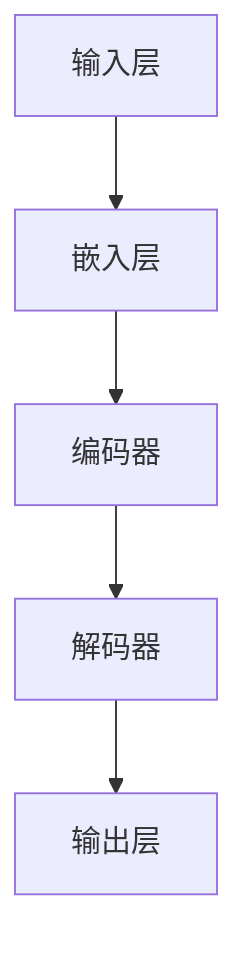
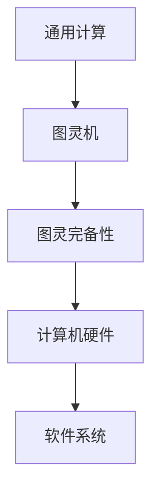

                 


# 《图灵完备的LLM：通向通用人工智能之路》

> **关键词：图灵完备性、语言模型、深度学习、自然语言处理、人工智能**

> **摘要：本文从图灵完备性的基本原理出发，详细阐述了语言模型（LLM）在深度学习和自然语言处理中的应用，探讨了LLM如何成为实现通用人工智能的关键技术。通过分析LLM的构建与训练过程，本文进一步探讨了其在各种实际场景中的应用前景，并对通用人工智能的未来进行了展望。**

<|user|>

## 第一部分：基础知识

### 第1章：图灵完备性原理

**1. 图灵机与通用计算**

图灵机是英国数学家艾伦·图灵（Alan Turing）在20世纪30年代提出的一种抽象计算模型。它由一个无限长的纸带、读写头以及一组规则组成。图灵机能够按照预设的规则，在纸带上读取、写入和移动，从而实现任何可计算函数的运算。

图灵机的核心思想是模拟人类的计算过程。通过纸带上的符号序列表示数据和计算步骤，读写头实现对符号的操作，而规则则指导读写头的移动和符号的读写。图灵机被认为是现代计算机的理论基础，也是通用计算模型。

**2. 图灵完备性与计算理论**

图灵完备性是指一个计算模型能够模拟任何其他图灵机，即具有计算任何可计算函数的能力。如果一个计算模型能够实现图灵机的所有功能，那么它就是图灵完备的。

图灵完备性是计算理论中的一个重要概念。它揭示了计算能力的基本界限，即只有图灵完备的计算模型才能实现所有可计算的任务。图灵完备性不仅对计算机科学有深远影响，还对人工智能、自然语言处理等领域产生了重要影响。

**3. 图灵完备性的应用领域**

图灵完备性在多个领域有广泛的应用：

- **计算机科学**：图灵机是现代计算机的理论基础，其原理被广泛应用于计算机体系结构、算法设计等领域。

- **人工智能**：人工智能中的许多算法，如深度学习、自然语言处理，都是基于图灵完备的计算模型。

- **自然语言处理**：图灵完备的语言模型（LLM）在自然语言生成、文本分类、机器翻译等领域有重要应用。

- **计算机图形学**：图灵完备的计算模型被用于图像处理、计算机动画等领域。

- **量子计算**：量子计算中的量子图灵机是图灵完备的，它被认为是未来计算的重要方向。

**4. 图灵完备性的挑战与未来**

尽管图灵完备性提供了强大的计算能力，但也带来了一些挑战：

- **计算效率**：图灵机需要大量的时间和空间来计算复杂问题，这对实际应用提出了挑战。

- **复杂性理论**：图灵完备性揭示了计算能力的基本界限，但同时也引发了对复杂性问题求解的研究。

- **量子计算**：量子计算的兴起为图灵完备性带来了新的挑战和机遇。量子图灵机具有超越经典图灵机的计算能力，这为解决某些复杂问题提供了可能。

未来，随着技术的不断发展，图灵完备性将在更多领域得到应用，同时也将面临新的挑战和突破。

### 第2章：自然语言处理

**1. NLP基本概念与历史**

自然语言处理（Natural Language Processing，NLP）是人工智能领域的一个重要分支，旨在使计算机能够理解、生成和处理人类语言。NLP的研究可以追溯到20世纪50年代，当时人们开始探索如何让计算机解析和生成自然语言。

NLP的基本概念包括：

- **词法分析**：将文本分解为词、短语和句子等基本语言单位。

- **句法分析**：研究句子的结构，包括词序、短语结构、语法规则等。

- **语义分析**：理解句子中的词语含义和句子间的关系。

- **语用分析**：研究语言在社会交流中的作用和含义。

NLP的发展经历了多个阶段：

- **规则方法**：早期NLP依赖于人工编写的规则和语法分析器。

- **统计方法**：随着计算能力和数据集的增加，统计方法成为NLP的主流。

- **深度学习方法**：近年来，深度学习在NLP中取得了显著进展，如基于神经网络的词嵌入和序列模型。

**2. 词嵌入技术**

词嵌入（Word Embedding）是将词汇映射到高维空间中的向量表示。词嵌入有助于计算机理解词汇的语义和语法关系，从而提高NLP任务的性能。

词嵌入技术包括：

- **基于频率的方法**：如TF-IDF，通过计算词的频率和逆文档频率来生成词向量。

- **基于相似性的方法**：如Word2Vec，通过训练词与词之间的相似性模型来生成词向量。

- **基于神经网络的词嵌入**：如GloVe和FastText，通过神经网络训练生成词向量，具有更高的语义表示能力。

**3. 序列模型与注意力机制**

序列模型（Sequence Model）是处理序列数据（如文本、时间序列）的一种方法。常见的序列模型包括循环神经网络（RNN）和长短期记忆网络（LSTM）。

注意力机制（Attention Mechanism）是一种用于处理序列数据的机制，能够自动关注序列中的重要部分，从而提高模型的性能。

注意力机制的核心思想是给序列中的每个元素分配一个权重，并将这些权重与序列中的元素相乘，从而得到一个加权和。注意力机制在机器翻译、文本摘要等任务中取得了显著的效果。

**4. 语言模型与解码器**

语言模型（Language Model，LM）是NLP中的一个重要模型，用于预测文本的下一个单词或词组。语言模型在机器翻译、语音识别、文本生成等任务中有广泛应用。

解码器（Decoder）是语言模型中的一个关键组件，用于将编码器生成的中间表示转换为最终的输出。解码器可以通过基于规则的解码器或基于序列模型的解码器来实现。

**5. 语言模型在NLP中的应用**

语言模型在NLP中有广泛的应用：

- **文本分类**：用于对文本进行分类，如情感分析、主题分类等。

- **机器翻译**：将一种语言的文本翻译成另一种语言。

- **语音识别**：将语音信号转换为文本。

- **文本生成**：生成文章、摘要、对话等文本内容。

- **问答系统**：用于回答用户提出的问题。

### 第3章：深度学习基础

**1. 深度学习基本概念**

深度学习（Deep Learning，DL）是机器学习（Machine Learning，ML）的一个分支，通过模拟人脑神经网络的结构和功能来实现对数据的自动学习和理解。深度学习在图像识别、自然语言处理、语音识别等领域取得了显著的成果。

深度学习的基本概念包括：

- **神经网络**：由多个神经元组成的计算模型，用于对数据进行处理和预测。

- **多层网络**：由多个隐藏层组成的神经网络，能够学习更复杂的特征。

- **反向传播**：一种用于训练神经网络的算法，通过不断调整网络的权重，使网络输出更接近真实值。

**2. 神经网络结构与优化算法**

神经网络的典型结构包括输入层、隐藏层和输出层。每个神经元都与前一层的所有神经元相连，通过加权求和并应用激活函数来生成输出。

优化算法是训练神经网络的关键，常见的优化算法包括：

- **梯度下降**：通过不断调整网络的权重，使损失函数最小化。

- **动量法**：在梯度下降的基础上引入动量，加速收敛。

- **随机梯度下降（SGD）**：在每个样本上计算梯度，更新网络的权重。

- **自适应优化器**：如Adam、RMSprop，通过自适应调整学习率，提高训练效果。

**3. 卷积神经网络与循环神经网络**

卷积神经网络（Convolutional Neural Network，CNN）是一种用于处理图像数据的神经网络。CNN通过卷积操作提取图像中的局部特征，并在多个卷积层中逐渐抽象和整合这些特征，从而实现对图像的分类和识别。

循环神经网络（Recurrent Neural Network，RNN）是一种用于处理序列数据的神经网络。RNN通过在时间步上保持状态，能够对序列数据进行建模。常见的RNN结构包括LSTM和GRU，它们通过引入门控机制，解决了传统RNN的梯度消失和梯度爆炸问题。

**4. 特征工程与数据预处理**

特征工程是深度学习中的一个重要环节，通过对数据进行预处理和特征提取，提高模型的性能。特征工程包括：

- **数据清洗**：去除无效数据、填补缺失值、消除噪声等。

- **特征提取**：通过统计方法、降维技术、特征选择方法等提取有用的特征。

- **特征缩放**：通过归一化、标准化等方法对特征进行缩放，提高模型训练效果。

**5. 深度学习在NLP中的应用**

深度学习在NLP中有广泛的应用：

- **词嵌入**：通过神经网络将词汇映射到高维空间中的向量表示。

- **文本分类**：用于对文本进行分类，如情感分析、主题分类等。

- **机器翻译**：将一种语言的文本翻译成另一种语言。

- **语音识别**：将语音信号转换为文本。

- **文本生成**：生成文章、摘要、对话等文本内容。

- **问答系统**：用于回答用户提出的问题。

### 第4章：机器学习原理

**1. 监督学习、无监督学习与半监督学习**

机器学习（Machine Learning，ML）是人工智能的一个分支，旨在让计算机通过数据学习，实现自动预测和决策。机器学习可分为监督学习（Supervised Learning）、无监督学习（Unsupervised Learning）和半监督学习（Semi-Supervised Learning）。

- **监督学习**：有标签的数据集用于训练模型，模型对新的数据做出预测。常见的监督学习算法包括线性回归、逻辑回归、决策树、支持向量机等。

- **无监督学习**：没有标签的数据集用于训练模型，模型通过发现数据中的结构和模式来进行分类或聚类。常见的无监督学习算法包括K-均值聚类、主成分分析（PCA）、自编码器等。

- **半监督学习**：既有标签的数据，又有无标签的数据，模型在训练过程中同时利用这两种数据。半监督学习可以提高模型的泛化能力，尤其在标签数据稀缺的情况下。

**2. 决策树、随机森林与支持向量机**

- **决策树**：一种基于树结构的分类算法，通过多次划分特征来生成决策树。决策树易于理解，但可能产生过拟合。

- **随机森林**：一种基于决策树的集成学习方法，通过训练多棵决策树，并对它们的预测结果进行投票或取平均值。随机森林具有良好的泛化能力，可以处理高维数据和噪声。

- **支持向量机**：一种基于间隔最大化原理的分类算法，通过找到一个最佳的超平面，将不同类别的数据点分隔开来。支持向量机在处理高维数据和线性不可分问题方面表现出色。

**3. 神经网络与深度学习算法**

神经网络（Neural Network，NN）是机器学习中的一个核心算法，通过模拟生物神经网络的结构和功能来实现对数据的自动学习和理解。深度学习（Deep Learning，DL）是神经网络的一种扩展，通过多层神经网络（Deep Neural Network，DNN）来学习更复杂的特征。

常见的深度学习算法包括：

- **卷积神经网络（CNN）**：用于处理图像数据，通过卷积操作提取图像中的局部特征。

- **循环神经网络（RNN）**：用于处理序列数据，通过在时间步上保持状态来建模序列。

- **长短期记忆网络（LSTM）**：一种改进的RNN，通过引入门控机制解决了梯度消失和梯度爆炸问题。

- **生成对抗网络（GAN）**：通过生成器和判别器的对抗训练来生成逼真的数据。

**4. 梯度下降与优化算法**

梯度下降（Gradient Descent）是一种优化算法，用于训练神经网络。梯度下降通过不断调整网络的权重，使损失函数最小化。

常见的梯度下降优化算法包括：

- **批量梯度下降（Batch Gradient Descent）**：在每个训练样本上计算梯度，更新网络的权重。

- **随机梯度下降（Stochastic Gradient Descent，SGD）**：在每个样本上计算梯度，更新网络的权重。

- **小批量梯度下降（Mini-batch Gradient Descent）**：在每个小批量样本上计算梯度，更新网络的权重。

- **自适应优化器**：如Adam、RMSprop，通过自适应调整学习率，提高训练效果。

### 第5章：人工智能伦理与社会影响

**1. AI伦理原则与规范**

随着人工智能（AI）技术的发展，人们越来越关注AI伦理问题。AI伦理原则旨在确保AI技术的发展和应用符合人类价值和道德准则。

常见的AI伦理原则包括：

- **公正性**：确保AI系统的决策不会导致歧视和偏见。

- **透明性**：确保AI系统的决策过程可解释和可追溯。

- **安全性**：确保AI系统的稳定性和鲁棒性，防止意外行为和故障。

- **隐私保护**：确保个人隐私不受AI系统的侵害。

- **责任归属**：明确AI系统的责任归属，确保在发生问题时能够追溯责任。

**2. AI对就业和社会的影响**

AI技术的发展对就业和社会产生了深远的影响。一方面，AI技术能够提高生产效率，创造新的就业机会；另一方面，AI技术也可能导致某些传统职业的消失。

- **就业机会**：AI技术为新兴领域创造了大量就业机会，如数据科学家、机器学习工程师等。

- **职业转型**：AI技术的发展要求人们不断更新知识和技能，以适应新的就业市场。

- **劳动力市场变化**：AI技术可能对劳动力市场产生结构性变化，导致某些行业就业机会减少，而其他行业就业机会增加。

- **社会不平等**：AI技术的不公平应用可能导致社会不平等加剧，需要制定相关政策和规范来应对。

**3. AI与隐私保护**

AI技术的发展对隐私保护提出了新的挑战。AI系统通常需要大量数据来训练和优化，这可能导致个人隐私泄露。

- **数据收集与使用**：确保数据收集和使用符合法律法规，保护个人隐私。

- **数据匿名化**：通过数据匿名化技术，降低个人隐私泄露的风险。

- **隐私保护算法**：开发隐私保护算法，确保AI系统在处理数据时保护个人隐私。

- **隐私监管**：加强对AI系统的隐私监管，确保个人隐私不受侵害。

**4. AI与法律法规**

随着AI技术的发展，各国纷纷制定相关法律法规来规范AI的应用。常见的AI法律法规包括：

- **数据保护法**：如欧盟的《通用数据保护条例》（GDPR），旨在保护个人数据隐私。

- **人工智能法**：如中国的人工智能发展规划，旨在促进AI技术的健康发展。

- **伦理审查制度**：建立伦理审查制度，确保AI系统在开发和应用过程中符合伦理原则。

- **责任追究制度**：明确AI系统的责任归属，确保在发生问题时能够追溯责任。

## 第二部分：LLM应用与实践

### 第6章：大型语言模型的构建与训练

**1. 语言模型构建流程**

语言模型（Language Model，LM）是NLP中的一个核心组件，用于预测文本的下一个单词或词组。构建大型语言模型通常包括以下步骤：

- **数据收集**：收集大规模的文本数据，如语料库、维基百科、新闻文章等。

- **数据预处理**：对文本数据进行分析、清洗和预处理，包括去除停用词、标点符号、进行词性标注等。

- **词嵌入**：将词汇映射到高维空间中的向量表示，常用的词嵌入方法包括Word2Vec、GloVe等。

- **模型设计**：设计适合的语言模型结构，如Transformer、BERT等。

- **模型训练**：使用大量文本数据进行模型训练，通过优化算法调整模型参数。

- **模型评估**：使用验证集和测试集评估模型性能，调整模型结构和超参数。

- **模型部署**：将训练好的模型部署到实际应用场景，如文本生成、机器翻译、问答系统等。

**2. 训练数据来源与处理**

训练数据来源通常包括以下几种：

- **公开数据集**：如维基百科、新闻文章、社交媒体等。

- **私人数据集**：由企业或研究机构收集和整理的数据集，如内部文档、用户评论等。

- **生成数据**：通过数据增强、数据扩充等方法生成的数据，提高模型泛化能力。

数据预处理主要包括以下步骤：

- **文本清洗**：去除无效字符、标点符号、停用词等。

- **分词**：将文本拆分为单词或字符序列。

- **词性标注**：为每个单词标注词性，如名词、动词、形容词等。

- **数据归一化**：对文本数据进行归一化处理，如将大写转换为小写、去除特殊字符等。

**3. 模型优化与超参数调整**

模型优化是提高语言模型性能的关键步骤。常见的优化方法包括：

- **权重初始化**：合理初始化模型权重，如高斯分布初始化、Xavier初始化等。

- **激活函数**：选择合适的激活函数，如ReLU、Sigmoid、Tanh等。

- **正则化**：防止过拟合，常用的正则化方法包括L1正则化、L2正则化、Dropout等。

- **优化算法**：选择合适的优化算法，如随机梯度下降（SGD）、Adam等。

超参数调整是优化模型性能的重要环节。常见的超参数包括：

- **学习率**：控制模型更新的步长，选择合适的学习率有助于提高模型收敛速度。

- **批量大小**：控制每次更新的样本数量，选择合适的批量大小可以提高模型性能。

- **隐藏层大小**：控制隐藏层节点数量，较大的隐藏层有助于学习复杂的特征。

- **迭代次数**：控制训练的迭代次数，选择合适的迭代次数可以避免过拟合和欠拟合。

**4. 大规模数据处理与分布式训练**

大规模数据处理是构建大型语言模型的一个挑战。为了提高数据处理和训练效率，可以采用以下方法：

- **数据并行**：将数据分成多个批次，同时在不同的计算设备上并行处理。

- **模型并行**：将模型分成多个部分，同时在不同的计算设备上并行处理。

- **流水线并行**：将数据处理和模型训练过程分成多个阶段，在不同计算设备上并行执行。

分布式训练可以充分利用多台计算设备的计算能力，提高模型训练速度。常见的分布式训练方法包括：

- **参数服务器架构**：将模型参数存储在服务器上，计算设备从服务器上获取参数，进行本地计算和更新。

- **模型并行训练**：将模型分成多个部分，每个部分在不同的计算设备上训练，最终合并模型参数。

- **数据并行训练**：将数据分成多个批次，每个计算设备负责处理一部分数据，并行更新模型参数。

### 第7章：LLM在自然语言生成中的应用

**1. 文本生成与摘要**

文本生成（Text Generation）是自然语言生成（Natural Language Generation，NLG）的一个重要分支，旨在自动生成高质量的自然语言文本。LLM在文本生成中具有广泛的应用：

- **自动写作**：自动生成新闻文章、博客、故事等文本内容。

- **对话生成**：生成自然语言对话，用于聊天机器人、客服系统等。

- **摘要生成**：自动生成文本摘要，提取关键信息，简化长文本。

文本生成的主要方法包括：

- **基于规则的方法**：通过预定义的规则和模板生成文本。

- **基于模板的方法**：根据输入数据，填充预定义的模板。

- **基于神经网络的文本生成模型**：如序列到序列（Seq2Seq）模型、生成对抗网络（GAN）等。

**2. 问答系统与对话生成**

问答系统（Question Answering System）是自然语言处理的一个重要应用，旨在自动回答用户提出的问题。LLM在问答系统中的主要作用包括：

- **问题理解**：将自然语言问题转换为机器可理解的格式。

- **答案生成**：从大量文本数据中提取相关答案。

- **对话生成**：与用户进行自然语言对话，提供相关信息和回答。

LLM在问答系统中通常采用以下方法：

- **基于检索的方法**：从预定义的知识库中检索答案。

- **基于生成的方法**：使用LLM生成答案，如序列到序列模型。

- **混合方法**：结合检索和生成方法，提高答案的准确性和多样性。

**3. 文本分类与情感分析**

文本分类（Text Classification）是将文本数据分类到预定义的类别中，如情感分析、主题分类等。LLM在文本分类中的应用包括：

- **情感分析**：判断文本的情感倾向，如正面、负面、中性等。

- **主题分类**：将文本分类到预定义的主题类别中，如科技、娱乐、体育等。

LLM在文本分类中的主要方法包括：

- **基于统计的方法**：使用词袋模型、TF-IDF等方法进行特征提取和分类。

- **基于神经网络的方法**：使用卷积神经网络（CNN）、循环神经网络（RNN）等进行文本特征提取和分类。

**4. 自动翻译与多语言处理**

自动翻译（Automatic Translation）是将一种语言的文本自动翻译成另一种语言。LLM在自动翻译中的应用包括：

- **机器翻译**：将一种语言的文本翻译成另一种语言。

- **多语言处理**：处理多种语言的文本，如多语言文本分类、多语言对话生成等。

LLM在自动翻译和多语言处理中的主要方法包括：

- **基于统计的方法**：使用基于规则和统计的方法进行翻译，如基于短语的翻译、基于神经网络的翻译等。

- **基于神经网络的方法**：使用序列到序列（Seq2Seq）模型、注意力机制等进行翻译。

### 第8章：LLM在任务导向场景的应用

**1. 聊天机器人与客户服务**

聊天机器人（Chatbot）是一种基于自然语言处理的自动化系统，旨在与用户进行交互，提供信息和服务。LLM在聊天机器人中的应用包括：

- **对话生成**：自动生成自然语言对话，模拟人类对话。

- **意图识别**：识别用户的意图，如提问、请求信息等。

- **实体抽取**：从对话中提取关键信息，如用户名、地址等。

LLM在聊天机器人中的应用方法包括：

- **基于规则的方法**：使用预定义的规则和模板进行对话生成。

- **基于生成的方法**：使用LLM生成自然语言对话。

- **混合方法**：结合规则和生成方法，提高对话生成质量。

在客户服务领域，LLM可以用于智能客服系统，自动回答用户的问题，提高服务效率和质量。

**2. 自动内容创作与推荐系统**

自动内容创作（Automatic Content Creation）是利用AI技术生成高质量的内容，如文章、视频、音乐等。LLM在自动内容创作中的应用包括：

- **文本生成**：自动生成文章、博客、新闻报道等。

- **图像生成**：生成艺术作品、插画等。

- **音乐生成**：自动生成音乐、旋律等。

自动内容创作可以提高内容创作效率，降低创作成本。

推荐系统（Recommendation System）是一种根据用户的历史行为和偏好，为用户推荐相关内容的系统。LLM在推荐系统中的应用包括：

- **基于内容的推荐**：根据用户的历史行为和偏好，推荐相似的内容。

- **基于协同过滤的推荐**：通过分析用户之间的相似性，推荐用户可能感兴趣的内容。

LLM在推荐系统中的应用可以提高推荐质量，增强用户体验。

**3. 智能客服与虚拟助手**

智能客服（Intelligent Customer Service）是一种利用人工智能技术提供高效、个性化的客户服务。LLM在智能客服中的应用包括：

- **对话管理**：自动管理客户对话，提供实时回答。

- **情感分析**：分析客户情绪，提供针对性的建议。

- **知识库管理**：自动更新和维护知识库，提高服务质量。

虚拟助手（Virtual Assistant）是一种基于人工智能技术的虚拟助手，旨在帮助用户完成各种任务。LLM在虚拟助手中的应用包括：

- **任务分配**：自动分配任务，提高工作效率。

- **信息检索**：自动查找和处理用户查询。

- **智能推荐**：根据用户偏好，推荐相关任务和内容。

智能客服和虚拟助手可以提高用户体验，降低人力成本。

**4. 金融风控与网络安全**

金融风控（Financial Risk Control）是金融机构对风险进行管理和控制的过程。LLM在金融风控中的应用包括：

- **欺诈检测**：自动检测和防范金融欺诈行为。

- **信用评估**：根据用户的历史行为和信用记录，评估信用风险。

- **风险预警**：自动识别潜在风险，提前预警。

网络安全（Cybersecurity）是指保护计算机系统和网络免受恶意攻击和侵害的措施。LLM在网络安全中的应用包括：

- **入侵检测**：自动检测和防范网络入侵。

- **恶意软件分析**：自动识别和阻止恶意软件。

- **安全事件响应**：自动响应和处理安全事件。

金融风控和网络安全领域的应用可以提高安全性和可靠性，降低风险。

### 第9章：通用人工智能展望

**1. 通用人工智能的定义与目标**

通用人工智能（General Artificial Intelligence，GAI）是一种具有人类智能水平的机器智能，能够在各种任务中表现出类似人类的智能行为。通用人工智能的目标是实现一种具有广泛适应性和自主性的智能系统，能够在不同领域和任务中灵活应用。

通用人工智能与传统的人工智能（如专家系统、机器学习等）有本质的区别。传统人工智能通常针对特定任务进行设计和优化，而通用人工智能旨在实现一种通用的智能系统，能够在不同任务中表现出类似的智能行为。

**2. 人工智能的发展趋势与挑战**

人工智能（AI）的发展呈现出以下几个趋势：

- **深度学习与神经网络**：深度学习在图像识别、语音识别、自然语言处理等领域取得了显著成果，神经网络的结构和算法不断优化。

- **强化学习**：强化学习在游戏、自动驾驶等领域表现出色，通过不断试错和优化策略，实现智能决策。

- **多模态学习**：多模态学习旨在将不同类型的数据（如图像、文本、音频等）进行整合，实现更全面的智能感知和决策。

- **迁移学习与联邦学习**：迁移学习通过在不同任务之间共享知识，提高模型泛化能力；联邦学习通过分布式训练，保护用户隐私。

尽管人工智能取得了显著进展，但仍面临以下挑战：

- **数据质量和隐私**：数据质量和隐私是人工智能应用的关键问题，如何保证数据质量和隐私保护是当前研究的重点。

- **可解释性与透明性**：人工智能系统的决策过程通常是不透明的，如何提高系统的可解释性和透明性，使其更容易被人理解和信任。

- **伦理与法律**：人工智能技术的应用涉及伦理和法律问题，如何制定相关规范和标准，确保人工智能的发展符合人类价值和道德准则。

**3. 通用人工智能的实现路径**

实现通用人工智能是一个复杂和长期的过程，目前主要有以下几种实现路径：

- **基于硬件的路径**：通过开发更先进的计算硬件（如量子计算机、神经形态硬件等），提高计算能力和效率。

- **基于软件的路径**：通过改进人工智能算法和模型，提高智能系统的适应性和灵活性。

- **基于生物学的路径**：通过研究人脑的工作原理，借鉴生物学的灵感，设计更高效的智能系统。

- **多学科交叉的路径**：通过跨学科的合作，整合不同领域的知识和技术，推动通用人工智能的发展。

**4. 通用人工智能的社会影响与伦理问题**

通用人工智能的发展将对社会产生深远影响，包括：

- **就业与经济**：通用人工智能可能对就业和经济产生结构性影响，需要制定相关政策来应对。

- **隐私与安全**：通用人工智能在处理大量数据时，可能涉及隐私和安全问题，需要加强隐私保护和安全监管。

- **道德与伦理**：通用人工智能的应用涉及道德和伦理问题，如何确保人工智能的发展符合人类价值和道德准则，是当前研究的重点。

**5. 通用人工智能的未来展望**

通用人工智能的未来充满希望，但也充满挑战。通过不断探索和创新，我们有理由相信，通用人工智能将在未来实现重大突破，为人类社会带来更多福祉。

## 附录

### 附录A：图灵完备的LLM架构图



### 附录B：主要算法与数学公式详解

#### 反向传播算法

```python
# 伪代码：反向传播算法
for each layer l in reverse order:
    delta[l] = (激活函数导数) * (误差 * 输入权重矩阵)
    权重更新 = 权重 - 学习率 * delta[l]
```

#### 语言模型中的概率计算

$$
P(w_{1}, w_{2}, \ldots, w_{n} | s) = \frac{P(s | w_{1}, w_{2}, \ldots, w_{n}) P(w_{1}, w_{2}, \ldots, w_{n})}{P(s)}
$$

### 附录C：实践项目代码解读

#### 基于LLM的智能客服系统开发

**开发环境搭建：**

- Python环境配置：安装Python 3.8及以上版本，配置pip和conda环境。
- TensorFlow或PyTorch框架安装：使用pip安装TensorFlow或PyTorch。
- 数据集准备与预处理：收集并处理客服对话数据，进行分词、词嵌入等预处理。

**源代码实现与解读：**

```python
# 代码片段示例：基于LLM的智能客服系统
import tensorflow as tf
from tensorflow.keras.layers import Embedding, LSTM, Dense
from tensorflow.keras.models import Sequential

# 模型结构定义
model = Sequential()
model.add(Embedding(vocab_size, embedding_dim))
model.add(LSTM(units=128, activation='tanh'))
model.add(Dense(units=num_classes, activation='softmax'))

# 编译模型
model.compile(optimizer='adam', loss='categorical_crossentropy', metrics=['accuracy'])

# 训练模型
model.fit(train_data, train_labels, epochs=10, batch_size=32, validation_split=0.2)
```

**代码解读与分析：**

- **模型结构分析**：使用嵌入层将词汇映射到高维空间，通过LSTM层学习序列特征，最后通过全连接层进行分类。
- **训练与评估方法**：使用损失函数和优化器编译模型，通过训练集进行模型训练，并使用验证集进行性能评估。
- **性能优化策略**：通过调整学习率、批量大小、迭代次数等超参数，优化模型性能。

## 附加说明

### 1. 核心概念与联系

#### 1.1 图灵完备性原理与通用计算

**Mermaid流程图：**



### 2. 核心算法原理讲解

#### 2.1 反向传播算法

**伪代码：**

```python
for each layer l in reverse order:
    delta[l] = (激活函数导数) * (误差 * 输入权重矩阵)
    权重更新 = 权重 - 学习率 * delta[l]
```

### 3. 数学模型和数学公式

#### 3.1 语言模型中的概率计算

**LaTeX公式：**

$$
P(w_{1}, w_{2}, \ldots, w_{n} | s) = \frac{P(s | w_{1}, w_{2}, \ldots, w_{n}) P(w_{1}, w_{2}, \ldots, w_{n})}{P(s)}
$$

### 4. 项目实战

#### 4.1 基于LLM的智能客服系统开发

**开发环境搭建：**

- Python环境配置
- TensorFlow或PyTorch框架安装
- 数据集准备与预处理

**源代码实现与解读：**

```python
# 代码片段示例
import tensorflow as tf
model = Sequential()
model.add(Embedding(vocab_size, embedding_dim))
model.add(LSTM(units=128, activation='tanh'))
model.add(Dense(units=num_classes, activation='softmax'))
model.compile(optimizer='adam', loss='categorical_crossentropy', metrics=['accuracy'])
model.fit(train_data, train_labels, epochs=10, batch_size=32, validation_split=0.2)
```

**代码解读与分析：**

- **模型结构分析**：嵌入层将词汇映射到高维空间，LSTM层学习序列特征，全连接层进行分类。
- **训练与评估方法**：使用交叉熵损失函数和Adam优化器训练模型，并在验证集上进行性能评估。
- **性能优化策略**：调整学习率、批量大小和迭代次数等超参数，以提高模型性能。

