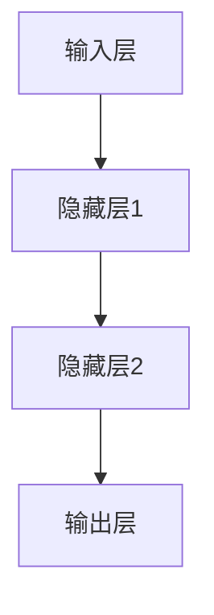

                 

# 《基础模型的潜在下游应用》

## 关键词
- 基础模型
- 下游应用
- 自然语言处理
- 计算机视觉
- 推荐系统
- 语音识别
- 强化学习

## 摘要
本文将从基础模型的定义、架构、原理、数学基础和评估优化入手，逐步深入探讨其在自然语言处理、计算机视觉、推荐系统、语音识别和强化学习等下游领域的潜在应用。通过详细的项目实战和分析，我们将揭示基础模型在这些领域的实际价值和发展趋势，为未来技术研究和应用提供有价值的参考。

## 第一部分：基础理论

### 第1章：基础模型概述

#### 1.1 模型的概念与分类

模型是指一种抽象的表示方式，用于理解和解决问题。在计算机科学和人工智能领域，模型通常是指用于表示数据、知识和信息的数学结构或算法。根据应用领域的不同，模型可以大致分为以下几类：

1. **统计模型**：基于概率统计理论构建的模型，如线性回归、决策树、支持向量机等。
2. **神经网络模型**：基于人工神经网络理论构建的模型，如多层感知器、循环神经网络、卷积神经网络等。
3. **强化学习模型**：基于强化学习理论构建的模型，如Q学习、SARSA、深度Q网络等。
4. **生成模型**：用于生成数据的模型，如生成对抗网络（GAN）、变分自编码器（VAE）等。

在本章中，我们将主要关注神经网络模型，特别是那些作为基础模型的代表性结构。

#### 1.2 常见基础模型介绍

在人工智能领域，以下几种模型由于其重要的基础地位而被广泛研究与应用：

1. **多层感知器（MLP）**：
   MLP是最简单的前馈神经网络，由输入层、隐藏层和输出层组成。每个神经元都与前一层的所有神经元相连，通过加权求和并应用激活函数进行非线性变换。MLP常用于回归和分类问题。

   ```mermaid
   graph TD
   A[输入层] --> B[隐藏层1]
   B --> C[隐藏层2]
   C --> D[输出层]
   ```

2. **循环神经网络（RNN）**：
   RNN具有递归结构，能够处理序列数据。其通过隐藏状态记忆历史信息，实现对序列数据的建模。RNN广泛应用于自然语言处理、语音识别等领域。

   ```mermaid
   graph TD
   A[输入序列] --> B[隐藏状态]
   B --> C[隐藏状态]
   B --> D[输出序列]
   ```

3. **卷积神经网络（CNN）**：
   CNN主要用于处理图像数据。其通过卷积操作提取图像的特征，具有局部感知和参数共享的特点。CNN在计算机视觉领域取得了显著的成果。

   ```mermaid
   graph TD
   A[输入图像] --> B[卷积层]
   B --> C[池化层]
   C --> D[卷积层]
   D --> E[全连接层]
   ```

#### 1.3 常见基础模型的工作原理

1. **多层感知器（MLP）**：
   - **输入层**：接收输入数据，每个输入值对应一个神经元。
   - **隐藏层**：通过加权求和并应用激活函数进行非线性变换，传递到下一层。
   - **输出层**：将隐藏层的结果进行进一步处理，得到最终的预测结果。

2. **循环神经网络（RNN）**：
   - **输入层**：接收输入序列，每个时间步的输入值对应一个神经元。
   - **隐藏层**：通过递归结构，将前一时间的隐藏状态传递到当前时间步，结合当前输入进行计算。
   - **输出层**：将隐藏层的结果进行进一步处理，得到最终的预测结果。

3. **卷积神经网络（CNN）**：
   - **输入层**：接收输入图像，每个像素值对应一个神经元。
   - **卷积层**：通过卷积操作提取图像的特征，形成特征图。
   - **池化层**：对特征图进行下采样，降低数据维度。
   - **全连接层**：将特征图进行全连接处理，得到最终的预测结果。

#### 1.4 基础模型的学习算法

基础模型的学习算法主要包括前向传播和反向传播。以下为伪代码描述：

```python
# 前向传播
def forward(x):
    z = W * x + b
    a = activation(z)
    return a

# 反向传播
def backward(a, y):
    dZ = a - y
    dW = (dZ * x).T
    db = dZ.sum(axis=0)
    dx = (dZ * W).T
    return dW, db, dx
```

其中，`x`表示输入数据，`y`表示真实标签，`W`和`b`分别为权重和偏置，`a`表示激活值，`activation`为激活函数，`dZ`表示误差值。

### 第2章：基础模型架构与原理

#### 2.1 模型架构详解

基础模型的架构可以分为三个主要部分：输入层、隐藏层和输出层。以下是一个典型的多层感知器（MLP）模型架构的Mermaid流程图：



在这个模型中，输入层接收输入数据，隐藏层通过加权求和和激活函数进行非线性变换，输出层得到最终预测结果。

#### 2.2 基础模型原理讲解

基础模型的原理主要涉及前向传播和反向传播两个过程。

1. **前向传播**：

   在前向传播过程中，模型从输入层开始，逐层向前传播数据。每个神经元都会计算其输入的加权和，并通过激活函数进行非线性变换，得到输出值。

   ```python
   # 前向传播
   def forward(x):
       z = W * x + b
       a = activation(z)
       return a
   ```

   其中，`x`为输入数据，`W`和`b`分别为权重和偏置，`activation`为激活函数。

2. **反向传播**：

   在反向传播过程中，模型从输出层开始，逐层向后传播误差。每个神经元都会计算其误差值，并通过链式法则更新权重和偏置。

   ```python
   # 反向传播
   def backward(a, y):
       dZ = a - y
       dW = (dZ * x).T
       db = dZ.sum(axis=0)
       dx = (dZ * W).T
       return dW, db, dx
   ```

   其中，`a`为激活值，`y`为真实标签，`x`为输入数据。

#### 2.3 数学基础

基础模型的数学基础主要包括线性代数、微积分和概率论。

1. **线性代数**：

   - 矩阵和向量的运算，如加法、乘法、转置等；
   - 矩阵的求导，如矩阵的导数、逆矩阵等。

2. **微积分**：

   - 偏导数和全导数的计算；
   - 梯度下降法。

3. **概率论**：

   - 概率分布，如正态分布、伯努利分布等；
   - 最大似然估计和最小二乘法。

#### 2.4 常见基础模型分析

1. **多层感知器（MLP）**：

   - **优点**：结构简单，易于实现，适用于各种回归和分类问题；
   - **缺点**：容易过拟合，难以处理序列数据。

2. **循环神经网络（RNN）**：

   - **优点**：能够处理序列数据，具有记忆功能；
   - **缺点**：训练过程容易梯度消失或爆炸，难以处理长序列。

3. **卷积神经网络（CNN）**：

   - **优点**：能够自动提取图像特征，适用于各种计算机视觉任务；
   - **缺点**：对图像大小的限制，难以处理非结构化数据。

#### 2.5 基础模型的实际应用

1. **自然语言处理**：

   - **应用**：语言模型、机器翻译、文本分类、情感分析等；
   - **模型**：RNN、LSTM、GRU等。

2. **计算机视觉**：

   - **应用**：图像分类、目标检测、图像分割等；
   - **模型**：CNN、ResNet、YOLO等。

3. **推荐系统**：

   - **应用**：商品推荐、新闻推荐、音乐推荐等；
   - **模型**：协同过滤、基于内容的推荐、深度学习等。

### 第3章：数学基础

#### 3.1 概率论与统计学基础

概率论与统计学是基础模型的重要数学工具，主要用于描述随机现象和数据处理。

1. **概率分布**：

   - **正态分布**：用于描述连续随机变量；
   - **伯努利分布**：用于描述二项分布。

2. **最大似然估计与最小二乘法**：

   - **最大似然估计**：用于估计模型参数，使模型在给定数据上的概率最大；
   - **最小二乘法**：用于最小化预测值与真实值之间的误差平方和。

#### 3.2 梯度下降法与优化算法

梯度下降法是一种常见的优化算法，用于寻找函数的最小值。以下为梯度下降法的伪代码：

```python
# 梯度下降法
def gradient_descent(x, y, learning_rate, epochs):
    for epoch in range(epochs):
        z = W * x + b
        a = activation(z)
        dZ = a - y
        dW = (dZ * x).T
        db = dZ.sum(axis=0)
        W -= learning_rate * dW
        b -= learning_rate * db
    return W, b
```

其中，`x`为输入数据，`y`为真实标签，`W`和`b`分别为权重和偏置，`activation`为激活函数，`learning_rate`为学习率。

#### 3.3 拉格朗日乘数法

拉格朗日乘数法是一种求解优化问题的方法，通过引入拉格朗日乘子，将约束优化问题转化为无约束优化问题。以下为拉格朗日乘数法的伪代码：

```python
# 拉格朗日乘数法
def lagrangian(x, y, lambda_):
    L = W * x + b - y - lambda_ * (W * x + b - y)
    return L
```

其中，`x`为输入数据，`y`为真实标签，`W`和`b`分别为权重和偏置，`lambda_`为拉格朗日乘子。

### 第4章：模型评估与优化

#### 4.1 模型评估指标

模型评估是基础模型研究中至关重要的一环，通过评估指标可以衡量模型的性能和效果。以下是一些常见的模型评估指标：

1. **准确率（Accuracy）**：准确率是指模型正确预测的样本数占总样本数的比例。对于分类问题，准确率是一个简单而直观的评估指标。

   $$ \text{Accuracy} = \frac{\text{正确预测的样本数}}{\text{总样本数}} $$

2. **召回率（Recall）**：召回率是指模型正确识别为正类别的样本数与实际正类别的样本数的比例。召回率侧重于识别所有正类别样本的能力。

   $$ \text{Recall} = \frac{\text{正确识别的正类别样本数}}{\text{实际正类别样本数}} $$

3. **精确率（Precision）**：精确率是指模型正确识别为正类别的样本数与预测为正类别的样本数的比例。精确率侧重于识别正类别样本的准确性。

   $$ \text{Precision} = \frac{\text{正确识别的正类别样本数}}{\text{预测为正类别的样本数}} $$

4. **F1值（F1 Score）**：F1值是精确率和召回率的调和平均值，用于综合评估模型的性能。

   $$ \text{F1 Score} = 2 \times \frac{\text{Precision} \times \text{Recall}}{\text{Precision} + \text{Recall}} $$

5. **ROC曲线与AUC值**：ROC曲线是接收者操作特征曲线的简称，通过比较模型的真阳性率与假阳性率，评估模型的分类性能。AUC值是ROC曲线下面积，用于衡量模型的分类能力。

   $$ \text{AUC} = \int_{0}^{1} \text{ROC}(f_p) df_p $$

#### 4.2 模型调优策略

模型调优是提高模型性能的重要手段，主要包括以下策略：

1. **参数调整**：通过调整模型参数，如学习率、隐藏层神经元数、正则化项等，优化模型性能。

2. **正则化**：正则化方法，如L1正则化、L2正则化，用于防止模型过拟合，提高泛化能力。

3. **交叉验证**：交叉验证是一种评估模型性能的方法，通过将数据集划分为多个子集，循环训练和验证模型，避免过拟合和欠拟合。

4. **集成方法**：集成方法，如Bagging、Boosting，通过组合多个模型，提高整体模型的性能。

### 第5章：自然语言处理

#### 5.1 语言模型与机器翻译

语言模型是一种用于预测自然语言序列的概率模型，在自然语言处理领域具有重要应用。机器翻译是将一种自然语言文本自动翻译成另一种自然语言文本的过程。

1. **语言模型**：

   - **N元语法模型**：基于N元语法，通过统计相邻N个单词的概率来预测下一个单词。

     $$ P(w_{t}) = \frac{C(w_{t-1}, w_{t-2}, ..., w_{t-N+1})}{C(w_{t-1}, w_{t-2}, ..., w_{t-N+2})} $$

   - **神经网络语言模型**：基于神经网络，通过训练大量语料数据，学习单词和句子之间的概率关系。

2. **机器翻译**：

   - **基于规则的方法**：通过编写翻译规则，将源语言句子翻译成目标语言句子。
   - **基于统计的方法**：通过统计源语言和目标语言之间的翻译概率，进行机器翻译。
   - **基于神经网络的方法**：通过训练神经网络模型，将源语言句子映射到目标语言句子。

#### 5.2 文本分类与情感分析

文本分类是将文本数据划分为预定义的类别，情感分析是判断文本的情感倾向。

1. **文本分类**：

   - **基于特征的方法**：通过提取文本特征，如词频、词袋模型、TF-IDF等，进行分类。
   - **基于模型的方法**：通过训练分类模型，如SVM、朴素贝叶斯、决策树等，进行分类。

2. **情感分析**：

   - **基于规则的方法**：通过编写情感分析规则，判断文本的情感倾向。
   - **基于模型的方法**：通过训练情感分析模型，如SVM、朴素贝叶斯、深度学习等，进行情感分析。

#### 5.3 文本生成与摘要

文本生成与摘要是自然语言处理领域的两个重要研究方向。

1. **文本生成**：

   - **基于规则的方法**：通过编写生成规则，生成符合语法和语义的文本。
   - **基于模型的方法**：通过训练生成模型，如生成对抗网络（GAN）、变分自编码器（VAE）等，生成文本。

2. **文本摘要**：

   - **提取式摘要**：通过提取文本中的重要信息，生成摘要。
   - **生成式摘要**：通过生成模型，生成摘要。

### 第6章：计算机视觉

#### 6.1 图像分类与识别

图像分类与识别是计算机视觉领域的重要任务。

1. **图像分类**：

   - **基于传统算法的方法**：如SVM、KNN等，通过训练分类器，对图像进行分类。
   - **基于深度学习的方法**：如CNN、ResNet等，通过训练深度神经网络，对图像进行分类。

2. **图像识别**：

   - **基于特征的方法**：通过提取图像特征，如SIFT、HOG等，进行图像识别。
   - **基于深度学习的方法**：通过训练深度神经网络，对图像进行识别。

#### 6.2 目标检测与分割

目标检测与分割是计算机视觉领域的两个重要任务。

1. **目标检测**：

   - **基于传统算法的方法**：如R-CNN、SSD等，通过训练分类器，检测图像中的目标。
   - **基于深度学习的方法**：如YOLO、Faster R-CNN等，通过训练深度神经网络，检测图像中的目标。

2. **图像分割**：

   - **基于传统算法的方法**：如GrabCut、SLIC等，通过划分图像区域，实现图像分割。
   - **基于深度学习的方法**：如U-Net、SegNet等，通过训练深度神经网络，实现图像分割。

#### 6.3 生成对抗网络

生成对抗网络（GAN）是一种用于生成图像、音频、文本等数据的强大工具。

1. **GAN的基本原理**：

   - **生成器（Generator）**：通过训练生成数据，模拟真实数据分布。
   - **判别器（Discriminator）**：通过训练区分真实数据和生成数据。

2. **GAN的应用**：

   - **图像生成**：通过训练生成器，生成逼真的图像。
   - **图像编辑**：通过训练生成器，对图像进行编辑和修复。
   - **数据增强**：通过训练生成器，生成新的数据，用于训练模型的增强。

### 第7章：推荐系统

#### 7.1 协同过滤与基于内容的推荐

推荐系统是一种基于用户兴趣和行为，为用户推荐相关物品的技术。协同过滤和基于内容的推荐是两种常见的推荐方法。

1. **协同过滤**：

   - **基于用户的方法**：通过计算用户之间的相似性，推荐与目标用户相似的其他用户的喜欢的物品。
   - **基于物品的方法**：通过计算物品之间的相似性，推荐与目标物品相似的其他物品。

2. **基于内容的推荐**：

   - **基于特征的方法**：通过提取物品的特征，如文本、标签等，为用户推荐具有相似特征的物品。
   - **基于模型的方
```markdown
### 7.2 深度学习在推荐系统中的应用

深度学习在推荐系统中的应用日益广泛，主要因为其强大的特征提取和表示能力。以下是一些深度学习在推荐系统中的典型应用：

#### 7.2.1 DNN与RNN在推荐系统中的应用

1. **深度神经网络（DNN）**：

   - **用户表示与物品表示**：DNN可以用于学习用户和物品的嵌入表示，这些表示能够捕捉用户和物品的潜在特征。
   - **交叉网络（Cross Network）**：交叉网络通过结合用户和物品的嵌入表示，预测用户对物品的偏好。

2. **循环神经网络（RNN）**：

   - **序列预测**：RNN擅长处理时间序列数据，可以用于预测用户的历史行为序列。
   - **长短期记忆网络（LSTM）**：LSTM是RNN的一个变体，能够解决梯度消失问题，用于学习用户的历史行为模式。

#### 7.2.2 GPT与BERT在推荐系统中的应用

1. **生成预训练变换器（GPT）**：

   - **用户生成**：GPT可以生成用户的个性化描述，帮助推荐系统更好地理解用户意图。
   - **物品描述生成**：GPT可以生成物品的描述，提高物品推荐的解释性。

2. **BERT**：

   - **双向编码表示（BERT）**：BERT可以用于学习用户和物品的双向表示，捕捉用户和物品之间的复杂交互。
   - **上下文感知推荐**：BERT能够理解用户的上下文信息，提高推荐的相关性和准确性。

#### 7.2.3 深度学习在推荐系统中的挑战与优化

1. **挑战**：

   - **稀疏性**：推荐系统中用户和物品的交互数据往往非常稀疏，深度学习模型需要能够处理这种稀疏数据。
   - **冷启动问题**：新用户或新物品如何进行推荐是一个难题，需要设计适当的机制来解决。

2. **优化方法**：

   - **数据增强**：通过生成假用户行为，增加训练数据的多样性，提高模型性能。
   - **模型压缩**：使用模型压缩技术，如剪枝、量化、蒸馏等，减少模型的复杂度，提高推荐速度。
   - **多任务学习**：将推荐任务与其他相关任务（如分类、点击率预测）结合，共享特征表示，提高模型泛化能力。

### 第8章：语音识别与合成

#### 8.1 语音信号处理

语音信号处理是语音识别和合成的基础，涉及语音信号的特征提取、预处理和变换。

1. **语音信号的基本特征**：

   - **幅度特征**：如短时幅度、短时能量等，用于描述语音信号的能量分布。
   - **频域特征**：如频谱、倒谱等，用于描述语音信号的频域特性。

2. **语音信号的处理方法**：

   - **预处理**：包括去除噪声、减除静音等，提高语音信号的质量。
   - **特征提取**：从语音信号中提取有效的特征，用于后续的模型训练。

#### 8.2 自动语音识别

自动语音识别（Automatic Speech Recognition，ASR）是将语音信号转换为文本的过程。

1. **HMM与DNN在语音识别中的应用**：

   - **隐马尔可夫模型（HMM）**：HMM是一种统计模型，用于建模语音信号的时间和状态转换。
   - **深度神经网络（DNN）**：DNN可以用于语音信号的建模和特征提取，提高识别准确率。

2. **语音识别的挑战与优化**：

   - **多语言语音识别**：如何同时识别多种语言是一个挑战。
   - **实时语音识别**：如何在有限的时间内完成语音识别，需要优化算法和硬件。

#### 8.3 语音合成

语音合成（Text-to-Speech，TTS）是将文本转换为自然语音的过程。

1. **规则基方法与统计基方法**：

   - **规则基方法**：通过编写规则，将文本转换为语音。
   - **统计基方法**：通过训练模型，将文本转换为语音。

2. **基于深度学习的方法**：

   - **循环神经网络（RNN）**：RNN可以用于生成语音的波形。
   - **生成对抗网络（GAN）**：GAN可以用于生成高质量的语音。

### 第9章：强化学习

#### 9.1 强化学习基本概念

强化学习是一种通过试错学习策略，从环境中获取奖励，逐步改善决策过程的机器学习方法。

1. **强化学习定义与目标**：

   - **定义**：强化学习是一种通过与环境的交互，学习实现某一目标的过程。
   - **目标**：通过最大化累计奖励，找到最优策略。

2. **基本算法**：

   - **Q学习**：Q学习是一种基于值函数的强化学习算法，通过更新Q值来学习最优策略。
   - **SARSA**：SARSA是一种基于策略的强化学习算法，通过更新策略来学习最优策略。

#### 9.2 应用场景与案例分析

强化学习在游戏智能、机器人控制等领域具有广泛的应用。

1. **游戏智能**：

   - **Atari游戏**：深度强化学习在Atari游戏中取得了显著的成果，如Deep Q Network（DQN）、Policy Gradient等。
   - **棋类游戏**：强化学习在围棋、国际象棋等棋类游戏中取得了突破性进展，如AlphaGo。

2. **机器人控制**：

   - **自主导航**：强化学习可以用于机器人自主导航，实现路径规划和避障。
   - **运动控制**：强化学习可以用于机器人的运动控制，如行走机器人和飞行机器人。

### 第10章：项目实战

#### 10.1 基础模型应用实战

在本节中，我们将通过实际项目来展示如何应用基础模型解决具体问题。

1. **文本分类项目**：

   - **项目背景**：使用基础模型进行新闻分类，将新闻文本分类到不同的主题。
   - **开发环境**：Python、TensorFlow、Keras等。
   - **数据集**：使用大型新闻语料库，如20 Newsgroups。
   - **实现步骤**：
     - 数据预处理：包括分词、去除停用词、词向量化等；
     - 模型构建：使用卷积神经网络（CNN）进行文本分类；
     - 训练与评估：使用交叉熵损失函数和反向传播算法进行模型训练，评估模型性能。

2. **图像识别项目**：

   - **项目背景**：使用基础模型对图像进行分类，识别图像中的物体。
   - **开发环境**：Python、TensorFlow、Keras等。
   - **数据集**：使用ImageNet数据集。
   - **实现步骤**：
     - 数据预处理：包括图像归一化、随机裁剪、数据增强等；
     - 模型构建：使用卷积神经网络（CNN）进行图像分类；
     - 训练与评估：使用交叉熵损失函数和反向传播算法进行模型训练，评估模型性能。

#### 10.2 下游应用项目实战

在本节中，我们将通过实际项目来展示如何将基础模型应用于下游任务。

1. **推荐系统项目实战**：

   - **项目背景**：使用基础模型构建一个商品推荐系统，为用户推荐感兴趣的商品。
   - **开发环境**：Python、TensorFlow、Keras等。
   - **数据集**：使用商品交易数据集。
   - **实现步骤**：
     - 数据预处理：包括用户行为数据清洗、商品特征提取等；
     - 用户和商品嵌入表示：使用深度学习模型学习用户和商品的嵌入表示；
     - 推荐算法实现：使用协同过滤、基于内容的推荐、深度学习等算法进行商品推荐；
     - 推荐结果评估：使用点击率、转化率等指标评估推荐效果。

2. **语音识别与合成项目实战**：

   - **项目背景**：使用基础模型实现语音识别和语音合成，将语音信号转换为文本，再将文本转换为语音。
   - **开发环境**：Python、TensorFlow、Keras等。
   - **数据集**：使用语音数据集，如LibriSpeech。
   - **实现步骤**：
     - 语音信号处理：包括音频预处理、特征提取等；
     - 语音识别：使用深度学习模型进行语音识别；
     - 语音合成：使用深度学习模型进行语音合成；
     - 实时语音识别与合成：实现实时语音识别与合成的功能。

### 第11章：前沿趋势

#### 11.1 基础模型的发展趋势

基础模型在人工智能领域的发展趋势主要体现在以下几个方面：

1. **模型压缩与加速**：

   - **模型压缩**：通过剪枝、量化、蒸馏等方法，减小模型的参数量和计算量，提高模型在移动设备和嵌入式系统上的部署能力。
   - **模型加速**：通过硬件加速、分布式训练等方法，提高模型训练和推断的效率。

2. **自适应模型**：

   - **自适应学习能力**：通过在线学习、迁移学习等方法，使模型能够适应动态变化的环境和数据。
   - **自适应架构**：通过自适应神经网络、可塑性神经网络等方法，使模型能够自动调整结构和参数。

#### 11.2 下游应用的最新进展

基础模型在下游应用领域的最新进展主要体现在以下几个方面：

1. **跨领域应用**：

   - **跨模态学习**：通过整合不同模态（如文本、图像、语音）的信息，提高模型在多模态数据上的表现。
   - **跨领域迁移**：通过在不同领域之间迁移模型，提高模型在不同应用场景上的泛化能力。

2. **模型可解释性**：

   - **模型解释方法**：通过可视化、特征解释等方法，提高模型的可解释性，增强用户对模型的信任。
   - **模型验证与评估**：通过模型验证和评估方法，提高模型的可靠性和鲁棒性。

### 第12章：未来展望

#### 12.1 基础模型在新兴领域中的应用

未来，基础模型将在新兴领域展现出更广泛的应用前景：

1. **医疗健康**：

   - **疾病预测与诊断**：通过分析医疗数据，预测疾病的发生和诊断。
   - **个性化治疗**：根据患者数据，设计个性化的治疗方案。

2. **金融科技**：

   - **风险评估**：通过分析金融数据，预测风险并制定风险管理策略。
   - **智能投顾**：为投资者提供个性化的投资建议。

3. **智能制造**：

   - **生产优化**：通过分析生产数据，优化生产流程和资源配置。
   - **智能质检**：利用图像识别和语音识别技术，实现自动化质检。

#### 12.2 未来的挑战与机遇

在未来的发展中，基础模型将面临以下挑战与机遇：

1. **挑战**：

   - **数据隐私**：如何在保障数据隐私的同时，充分利用数据的价值。
   - **计算资源**：如何在有限的计算资源下，训练和部署大规模模型。
   - **模型可解释性**：如何提高模型的可解释性，增强用户对模型的信任。

2. **机遇**：

   - **跨界融合**：通过与其他领域的融合，拓展基础模型的应用范围。
   - **开源生态**：通过开源社区的建设，推动基础模型的共同发展和创新。

## 附录

### 附录A：基础模型开发工具与资源

1. **深度学习框架**：

   - **TensorFlow**：由谷歌开发，支持Python和C++接口，具有丰富的API和生态系统。
   - **PyTorch**：由Facebook开发，支持Python接口，具有动态计算图和自动微分功能。
   - **Keras**：是一个高层神经网络API，能够以简洁的方式快速构建和训练深度学习模型。

2. **数据集与库资源**：

   - **ImageNet**：一个大规模的图像数据集，用于图像分类和识别。
   - **Common Crawl**：一个大规模的网页数据集，用于自然语言处理和文本分类。
   - **TensorFlow Datasets**：TensorFlow提供的数据集加载和预处理库，方便用户使用各种公开数据集。

3. **开发环境搭建与配置**：

   - **环境配置**：根据所选深度学习框架，配置Python环境、安装依赖库等。
   - **分布式训练**：配置分布式训练环境，提高模型训练的效率。

### 附录B：常见问题解答与参考资料

1. **常见问题解答**：

   - **如何处理过拟合问题？**：可以通过增加数据集、使用正则化、增加隐藏层神经元等方式来缓解过拟合。
   - **如何提高模型的鲁棒性？**：可以通过数据增强、引入噪声、使用迁移学习等方法来提高模型的鲁棒性。

2. **参考资料**：

   - **《深度学习》**：由Ian Goodfellow、Yoshua Bengio和Aaron Courville合著，是深度学习的经典教材。
   - **《神经网络与深度学习》**：由邱锡鹏著，介绍了神经网络和深度学习的基本原理和应用。
   - **相关论文和会议**：包括NeurIPS、ICML、ACL、CVPR等，介绍最新的研究进展和成果。

**作者：AI天才研究院/AI Genius Institute & 禅与计算机程序设计艺术 /Zen And The Art of Computer Programming**

