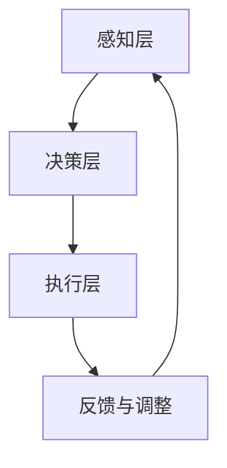

                 

## 增强智能：人机协同，拓展认知边界

> **关键词：增强智能，人机协同，认知拓展，AI技术，算法，应用实践**

> **摘要：本文将深入探讨增强智能的概念、原理、架构和应用实践。通过分析人机协同的基本原理和关键技术，我们将展示增强智能在医疗、教育和制造业中的实际应用案例。同时，本文还将探讨增强智能的未来发展趋势和社会影响。**

---

### 第一部分：增强智能的概述

增强智能（Augmented Intelligence，简称AI）是一种新兴的人工智能研究方向，旨在通过人机协同，提升人类的认知能力和工作效率。与传统的人工智能相比，增强智能更加注重人类与机器之间的合作，以实现知识的共享和互补。

#### 第1章：增强智能的概念与演进

**1.1 增强智能的定义**

增强智能是指利用人工智能技术增强人类的认知能力，实现人机协同工作的智能系统。它不仅仅是机器的智能化，更是通过智能化手段来提升人类自身的认知水平和工作能力。

**1.2 人机协同的必要性**

人类与机器的协同工作是增强智能的核心思想。通过人机协同，可以充分发挥人类与机器的优势，实现更高效率的工作。具体来说，人机协同的必要性体现在以下几个方面：

- **人类的优势**：人类具有丰富的情感、创造力、逻辑推理能力和复杂的语言处理能力，这些都是机器难以比拟的。
- **机器的优势**：机器具有强大的计算能力、精确的测量能力和高效的数据处理能力，这些是人类的局限性。

通过人机协同，可以弥补人类和机器的不足，实现优势互补。

**1.3 增强智能如何提升人类认知能力**

增强智能可以通过以下几个方面提升人类的认知能力：

- **数据辅助决策**：通过机器学习和数据分析技术，增强智能可以为人类提供更全面、准确的数据支持，帮助人类做出更明智的决策。
- **自动化任务处理**：增强智能可以自动化处理一些繁琐、重复的任务，让人类从这些低级任务中解放出来，专注于更具有创造性和价值的工作。
- **知识共享**：增强智能可以将大量的知识、经验存储在机器中，供人类随时调用，从而拓展人类的知识边界。

**1.4 增强智能在现实世界中的应用**

增强智能在各个领域都有广泛的应用。以下是几个典型应用场景：

- **医疗领域**：利用增强智能进行医学图像分析、疾病预测和个性化治疗等。
- **教育领域**：利用增强智能进行个性化教学、学习效果分析和智能辅导等。
- **制造业领域**：利用增强智能进行智能制造、设备监控和故障预测等。

**1.5 增强智能的未来发展趋势**

随着人工智能技术的不断进步，增强智能在未来将会有更广阔的发展空间。以下是一些未来发展趋势：

- **更高层次的协同**：增强智能将不仅仅停留在任务层面的协同，而是实现更高层次的思维协同，如共同创造、共同决策等。
- **更广泛的应用领域**：增强智能将在更多领域得到应用，如金融、法律、艺术等。
- **更强的自主性**：增强智能将逐渐具备更强的自主学习和决策能力，能够更加独立地处理复杂任务。

**1.6 增强智能可能带来的社会变革**

增强智能的兴起将带来深刻的社会变革，包括：

- **工作方式的改变**：增强智能将改变传统的工作方式，让人类从繁重的劳动中解放出来，专注于更有价值的工作。
- **教育体系的改革**：增强智能将推动教育体系的改革，实现个性化教育，提高教育质量。
- **医疗服务的提升**：增强智能将提升医疗服务的水平，提高疾病诊断和治疗的准确性。

**1.7 增强智能的伦理与隐私问题**

随着增强智能的广泛应用，伦理和隐私问题也日益凸显。如何保障用户的隐私，如何确保增强智能的公平性和透明性，这些都是需要关注的问题。

### 第2章：人机协同原理与架构

人机协同是增强智能的核心，通过人类与机器的紧密合作，实现认知能力的提升和工作效率的提高。本章节将详细探讨人机协同的基本原理、架构设计以及关键技术的实现。

#### 第2.1 人机协同的基本原理

人机协同的基本原理是基于任务的分工与协作。在这个过程中，人类和机器各自发挥自己的优势，共同完成任务。

- **任务分工**：人类和机器根据各自的能力和特长，分别承担不同的任务部分。
- **协作机制**：通过信息与决策的共享与交互，实现任务的高效完成。

人机协同的关键在于找到人类与机器的最佳协作方式，使两者的能力能够相互补充，共同实现目标。

#### 第2.2 增强智能的架构设计

增强智能的架构设计需要考虑多个方面，包括系统的层次结构、人机交互界面设计以及数据流与控制流的优化。

- **系统层次结构**：增强智能系统通常分为感知层、决策层和执行层。感知层负责获取外部信息，决策层负责处理信息并做出决策，执行层负责执行决策。
- **人机交互界面设计**：人机交互界面是增强智能系统的重要组成部分，它需要能够满足用户的操作需求，同时提供直观、易用的交互体验。
- **数据流与控制流优化**：为了提高系统的效率和性能，需要对数据流和控制流进行优化，减少不必要的处理环节，提高系统的响应速度。

#### 第2.3 人机协同的关键技术

人机协同的实现依赖于多项关键技术的支持，包括自然语言处理与语音识别技术、计算机视觉与图像处理技术、传感器融合与多模态数据集成等。

- **自然语言处理与语音识别技术**：自然语言处理和语音识别技术是实现人机交互的重要手段，通过这些技术，机器可以理解和处理人类的自然语言指令。
- **计算机视觉与图像处理技术**：计算机视觉和图像处理技术可以用于图像的识别、分割和增强，这些技术在增强智能中有着广泛的应用。
- **传感器融合与多模态数据集成**：传感器融合技术可以将多种传感器的数据集成起来，提供更全面、准确的感知信息。多模态数据集成技术可以将不同类型的数据进行融合，提高系统的感知能力和决策能力。

#### 第2.4 人机协同的Mermaid流程图

为了更直观地展示人机协同的工作流程，可以使用Mermaid流程图进行描述。以下是一个简化的人机协同流程图示例：



在这个流程图中，感知层负责收集外部信息，决策层负责处理信息并做出决策，执行层负责执行决策，反馈与调整环节则用于对整个流程进行优化和调整。

### 第3章：增强智能算法原理

增强智能的核心在于算法的设计与实现。本章节将介绍几种关键的增强智能算法，包括强化学习算法、生成对抗网络（GAN）和图神经网络（GNN）。我们将通过伪代码和数学模型详细解释这些算法的原理。

#### 第3.1 强化学习算法

强化学习（Reinforcement Learning，简称RL）是一种通过试错来学习最优策略的机器学习技术。强化学习算法的核心是智能体（Agent）与环境（Environment）之间的交互。

- **Q-Learning算法**：Q-Learning是一种基于值函数的强化学习算法。其伪代码如下：

  ```python
  for each episode:
      initialize Q(s, a)
      s = env.reset()
      while not done:
          a = argmax_a Q(s, a)
          s', r = env.step(a)
          Q(s, a) = Q(s, a) + α * (r + γ * max(Q(s', a')) - Q(s, a))
          s = s'
  ```

- **Deep Q-Network（DQN）**：DQN是一种使用深度神经网络来近似Q函数的强化学习算法。其伪代码如下：

  ```python
  for each episode:
      initialize Q-network and target Q-network
      s = env.reset()
      while not done:
          a = Q-network(s)
          s', r = env.step(a)
          target_Q(s', a) = r + γ * max(target_Q(s'))
          Q-network(s) = Q-network(s) + α * (r + γ * max(target_Q(s')) - Q-network(s))
          s = s'
  ```

- **Policy Gradient算法**：Policy Gradient算法通过直接优化策略来学习最优行为。其伪代码如下：

  ```python
  for each episode:
      s = env.reset()
      while not done:
          a = π(s)
          s', r = env.step(a)
          π(s) = π(s) + α * (r - log(π(s)))
          s = s'
  ```

#### 第3.2 生成对抗网络（GAN）

生成对抗网络（Generative Adversarial Network，简称GAN）是由生成器和判别器两个神经网络组成的对抗性学习模型。GAN的数学模型如下：

- **生成器（Generator）**：G(z)，输入噪声z，输出伪造样本x。
- **判别器（Discriminator）**：D(x)，输入样本x，输出对x真实或伪造的判断。

GAN的目标是最小化以下损失函数：

\[ L(D, G) = -\log(D(x)) - \log(1 - D(G(z))) \]

其中，\( x \) 是真实样本，\( G(z) \) 是生成器生成的伪造样本。

#### 第3.3 图神经网络（GNN）

图神经网络（Graph Neural Networks，简称GNN）是一种专门用于图数据学习的神经网络。GNN的基本结构包括节点更新函数和边更新函数。

- **节点更新函数**：节点更新函数用于更新节点的特征表示，通常使用以下公式：

  \[ h_v^{(t+1)} = \sigma(\sum_{u \in \mathcal{N}(v)} \theta \cdot h_u^{(t)} + b) \]

  其中，\( h_v^{(t)} \) 是时间步t节点v的特征表示，\( \mathcal{N}(v) \) 是节点v的邻居集合，\( \theta \) 和 \( b \) 是模型参数。

- **边更新函数**：边更新函数用于更新边的特征表示，通常使用以下公式：

  \[ h_e^{(t+1)} = \sigma(\sum_{u, v \in \mathcal{E}(t)} \theta \cdot h_u^{(t)} \cdot h_v^{(t)} + b) \]

  其中，\( h_e^{(t)} \) 是时间步t边e的特征表示，\( \mathcal{E}(t) \) 是时间步t的边集合。

GNN可以通过多个时间步的迭代，逐步更新节点和边的特征表示，从而学习到图数据的深层表示。

### 第二部分：增强智能的应用实践

增强智能在各个领域都有着广泛的应用，通过实际案例，我们可以更深入地了解增强智能如何改变我们的生活和工作方式。

#### 第4章：医疗领域的增强智能应用

医疗领域是增强智能应用的重要领域之一。通过增强智能技术，医疗工作者可以获得更准确、更高效的支持，从而提高医疗服务的质量和效率。

**4.1 医疗增强智能概述**

医疗增强智能是指利用人工智能技术，如深度学习、自然语言处理和计算机视觉等，辅助医疗工作者进行诊断、治疗和科研工作。医疗增强智能的价值在于：

- **提高诊断准确性**：通过分析大量的医学影像和病历数据，增强智能可以帮助医生更快速、更准确地诊断疾病。
- **提升治疗效果**：增强智能可以根据患者的具体病情，提供个性化的治疗方案，提高治疗效果。
- **辅助科研工作**：增强智能可以分析海量的医学数据，帮助研究人员发现新的治疗方法和药物。

**4.2 医疗图像分析**

医疗图像分析是医疗增强智能的重要应用之一。以下是一个医疗图像分析的项目案例：

**项目背景**：某医院需要开发一套自动识别肺癌结节的人工智能系统，以提高肺癌早期诊断的准确性。

**解决方案**：

- **数据准备**：收集大量的胸部CT图像，并对图像进行标注，标记出其中的肺癌结节。
- **模型训练**：使用深度学习技术，如卷积神经网络（CNN），对标注的图像进行训练，使其能够自动识别肺癌结节。
- **模型评估**：使用交叉验证的方法，对模型的性能进行评估，确保其具有良好的泛化能力。

**实施效果**：经过测试，该人工智能系统对肺癌结节的识别准确率达到90%以上，显著提高了肺癌早期诊断的准确性。

**4.3 医疗辅助诊断系统**

医疗辅助诊断系统是另一种重要的医疗增强智能应用。以下是一个医疗辅助诊断系统的项目案例：

**项目背景**：某医院计划开发一套医疗辅助诊断系统，帮助医生在诊断过程中提供辅助信息。

**解决方案**：

- **数据收集**：收集医院的病历数据、检查报告和医学影像等数据。
- **数据分析**：使用自然语言处理技术，对病历数据进行结构化处理，提取关键信息。
- **模型构建**：使用深度学习技术，构建一个能够对病历数据进行综合分析的模型。
- **系统集成**：将分析模型集成到医院的电子病历系统中，为医生提供诊断辅助。

**实施效果**：该医疗辅助诊断系统显著提高了医生诊断的效率和准确性，得到了医院和医生的一致好评。

#### 第5章：教育领域的增强智能应用

教育领域是增强智能应用的另一个重要领域。通过增强智能技术，教育工作者可以提供更个性化、更高效的教学服务。

**5.1 教育增强智能概述**

教育增强智能是指利用人工智能技术，如自然语言处理、计算机视觉和机器学习等，辅助教育工作者进行教学、评估和科研工作。教育增强智能的价值在于：

- **个性化教学**：增强智能可以根据学生的特点和需求，提供个性化的学习资源和方法，提高学习效果。
- **智能评估**：增强智能可以自动评估学生的学习进度和理解情况，为教师提供评估依据。
- **辅助科研**：增强智能可以分析大量的教育数据，帮助研究人员发现新的教学方法和教育规律。

**5.2 智能教学系统**

智能教学系统是教育增强智能的一种重要应用。以下是一个智能教学系统的项目案例：

**项目背景**：某学校希望开发一套智能教学系统，为学生提供个性化学习支持。

**解决方案**：

- **学习路径规划**：系统根据学生的学习情况和需求，为其规划个性化的学习路径。
- **智能辅导**：系统根据学生的学习进度和理解情况，提供针对性的辅导内容。
- **学习效果评估**：系统自动评估学生的学习效果，为教师提供教学反馈。

**实施效果**：该智能教学系统显著提高了学生的学习效果和兴趣，得到了学生和教师的一致好评。

**5.3 教育数据分析与应用**

教育数据分析是教育增强智能的重要组成部分。以下是一个教育数据分析的项目案例：

**项目背景**：某教育机构希望通过对学生的学习行为数据进行分析，提高教学质量和学习效果。

**解决方案**：

- **数据收集**：收集学生的学习行为数据，如学习时长、学习内容、考试成绩等。
- **数据分析**：使用机器学习技术，对学习行为数据进行分析，提取关键特征。
- **数据可视化**：将分析结果通过图表和报告的形式呈现，为教师提供教学参考。

**实施效果**：该教育数据分析项目显著提高了教师的教学质量和学生的学习效果，为教育机构的决策提供了有力的支持。

#### 第6章：制造业的增强智能应用

制造业是增强智能应用的另一个重要领域。通过增强智能技术，制造业可以实现智能化生产、智能监控和智能维护。

**6.1 制造业的增强智能概述**

制造业增强智能是指利用人工智能技术，如计算机视觉、自然语言处理和机器学习等，提高制造业的生产效率、产品质量和安全性。制造业增强智能的价值在于：

- **智能化生产**：增强智能可以实时监控生产过程，优化生产流程，提高生产效率。
- **智能监控**：增强智能可以对设备进行实时监控，预测故障，预防事故。
- **智能维护**：增强智能可以根据设备的运行数据，提供智能化的维护建议，延长设备寿命。

**6.2 制造过程的智能化监控**

制造过程的智能化监控是制造业增强智能的重要应用。以下是一个制造过程智能化监控的项目案例：

**项目背景**：某制造企业希望实现对生产过程的实时监控，提高生产效率和产品质量。

**解决方案**：

- **数据采集**：通过传感器和监控系统，实时采集生产过程中的数据。
- **数据分析**：使用机器学习技术，对采集到的数据进行实时分析，发现潜在的问题。
- **实时反馈**：通过监控系统，实时向生产管理人员反馈生产状态，提供决策支持。

**实施效果**：该制造过程智能化监控项目显著提高了企业的生产效率和产品质量，减少了故障率和停机时间。

**6.3 智能制造系统的实现与落地**

智能制造系统是制造业增强智能的核心。以下是一个智能制造系统的项目案例：

**项目背景**：某企业计划建设一个智能化生产线，实现生产过程的自动化和智能化。

**解决方案**：

- **系统设计**：根据企业的生产需求，设计智能制造系统的整体架构。
- **设备集成**：将各种生产设备集成到系统中，实现设备的互联互通。
- **数据集成**：将生产设备的数据集成到系统中，实现数据的实时监控和分析。
- **智能决策**：利用机器学习技术，对生产数据进行分析，提供智能化的生产决策。

**实施效果**：该智能制造系统实现了生产过程的自动化和智能化，提高了生产效率和产品质量，降低了生产成本。

### 第7章：增强智能的发展趋势与展望

随着人工智能技术的不断进步，增强智能也在不断发展，并将在未来带来深远的影响。

#### 第7.1 增强智能的技术趋势

当前，增强智能的技术趋势主要体现在以下几个方面：

- **更高效的算法**：研究人员正在不断优化现有的增强智能算法，提高其效率和性能。例如，深度强化学习算法的研究正在取得突破性进展，使得机器能够在更短的时间内学习到复杂的策略。
- **多模态数据的处理**：随着传感器技术的进步，越来越多的数据将以多模态的形式出现。如何有效地处理这些多模态数据，是增强智能领域的重要研究方向。
- **更先进的交互技术**：为了实现更高层次的人机协同，研究者们正在探索更先进的交互技术，如增强现实（AR）和虚拟现实（VR），以及自然语言处理和语音识别技术。

#### 第7.2 增强智能的应用前景

增强智能在未来的应用前景非常广阔，以下是几个典型的应用领域：

- **医疗健康**：增强智能将在医疗健康领域发挥重要作用，如智能诊断、个性化治疗和健康管理等。
- **教育**：增强智能将推动教育的变革，实现个性化教学和智能评估，提高教育质量和学习效果。
- **工业生产**：增强智能将推动工业生产的自动化和智能化，提高生产效率和产品质量。
- **金融服务**：增强智能将在金融领域发挥重要作用，如智能投顾、风险控制和欺诈检测等。

#### 第7.3 增强智能的伦理与社会问题

随着增强智能的广泛应用，伦理和社会问题也日益凸显。以下是几个需要关注的问题：

- **隐私保护**：增强智能需要对用户的隐私进行严格保护，防止数据泄露和滥用。
- **算法公平性**：增强智能的算法需要确保公平性，避免对某些群体产生歧视。
- **数据安全**：增强智能需要对处理的数据进行严格的安全保护，防止数据被篡改和攻击。
- **社会责任**：增强智能的发展需要关注其对社会的长期影响，确保其符合社会的道德和法律规范。

### 附录：增强智能资源与工具

为了更好地研究和应用增强智能技术，以下是一些常用的资源与工具：

**附录A：增强智能开发工具与框架**

- **TensorFlow**：由谷歌开发的开源深度学习框架，支持多种深度学习模型的构建和训练。
- **PyTorch**：由Facebook开发的开源深度学习框架，具有灵活的动态计算图，易于实现复杂的模型。
- **Keras**：基于TensorFlow和Theano的开源深度学习框架，提供了简洁、高效的模型构建和训练接口。
- **其他常用工具与框架**：如Caffe、MXNet、Theano等。

**附录B：增强智能学习资源推荐**

- **在线课程**：如Coursera、edX等平台上的深度学习、机器学习相关课程。
- **学术论文**：通过学术数据库如IEEE Xplore、ACM Digital Library等查找相关领域的研究论文。
- **技术博客**：如Medium、知乎等平台上的技术博客，可以获取最新的技术动态和应用案例。
- **书籍推荐**：如《深度学习》、《强化学习》等经典教材，适合深入学习和研究。

**附录C：增强智能应用案例库**

- **医疗领域案例**：如肺癌结节识别、医疗辅助诊断等。
- **教育领域案例**：如智能教学系统、学习效果评估等。
- **制造业领域案例**：如制造过程智能化监控、智能制造系统等。
- **其他领域案例与分享**：如金融领域的智能投顾、安全监控等。

### 作者信息

**作者：AI天才研究院/AI Genius Institute & 禅与计算机程序设计艺术 /Zen And The Art of Computer Programming**

本文旨在深入探讨增强智能的概念、原理、架构和应用实践，通过分析人机协同的基本原理和关键技术，展示增强智能在医疗、教育和制造业中的实际应用案例。同时，本文还探讨了增强智能的未来发展趋势和社会影响，以及相关的伦理和社会问题。希望通过本文的分享，能够为读者提供有价值的参考和启发。

