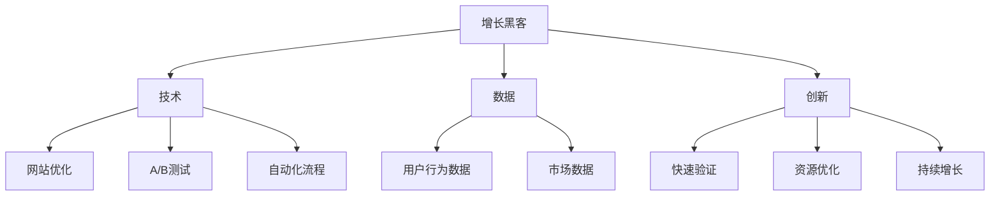
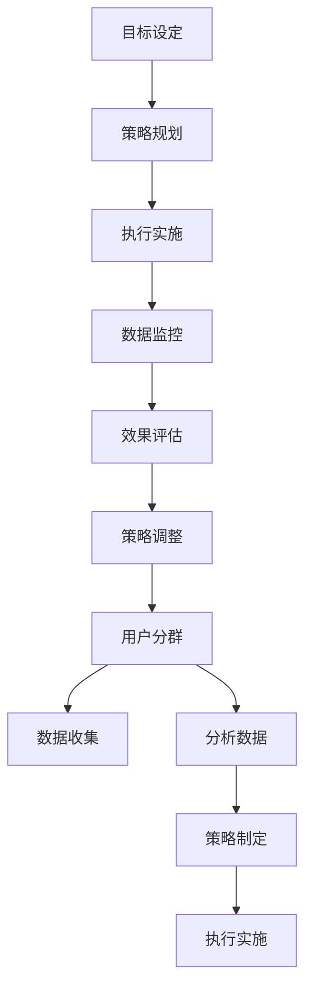

                 

### 第1章：增长黑客概念与价值

> **关键词**：增长黑客、营销策略、技术型创业、用户增长

**摘要**：本章将介绍增长黑客的基本概念、价值以及其在技术型创业中的应用。我们将对比增长黑客与传统营销，探讨其核心要素，并分析增长黑客在当前创业环境中的重要性。

---

#### 1.1 定义与背景

**增长黑客**（Growth Hacker）一词起源于硅谷，是由营销与技术相结合产生的一个新兴概念。其定义是将创新的营销策略和数据分析能力结合起来，通过技术手段实现用户快速增长的目标。

增长黑客的背景可以追溯到互联网时代的崛起。随着互联网技术的普及，传统的营销手段如广告、公关等逐渐失效，而用户获取成本不断提高。在这种情况下，创业者们开始寻求新的增长模式，将技术手段与营销策略相结合，从而诞生了增长黑客这一概念。

#### 1.2 增长黑客与传统营销的比较

**增长黑客**与传统营销有以下几点主要区别：

1. **目标**：传统营销主要关注品牌曝光和销售转化，而增长黑客更注重用户增长和市场份额的快速扩张。
2. **方法**：传统营销依赖于广告、公关等传统手段，而增长黑客则更依赖于数据驱动、实验验证和用户参与等新兴手段。
3. **效果**：传统营销的效果难以量化，而增长黑客则通过数据分析来衡量每个营销活动的效果，从而进行优化。

#### 1.3 增长黑客的三大核心要素

增长黑客的三大核心要素包括技术、数据和创新。

1. **技术**：增长黑客需要具备一定的技术能力，能够利用各种技术手段来实现用户增长。这包括网站优化、A/B测试、自动化流程等。
2. **数据**：数据是增长黑客的基础。通过对用户行为数据、市场数据等进行分析，增长黑客能够找到用户增长的最佳路径。
3. **创新**：增长黑客需要具备创新能力，不断尝试新的增长策略，并将其应用到实际运营中。

#### 1.4 增长黑客在技术型创业中的重要性

对于技术型创业者来说，增长黑客具有以下重要性：

1. **快速验证**：通过增长黑客的方法，技术型创业者可以快速验证产品市场匹配（Product Market Fit），从而降低创业风险。
2. **资源优化**：增长黑客利用技术手段降低用户获取成本，优化资源分配，使有限的资源发挥最大的效用。
3. **持续增长**：增长黑客通过数据驱动的方式，不断优化和调整策略，实现用户增长的持续性和稳定性。

#### 1.5 小结

本章介绍了增长黑客的基本概念、价值以及与传统营销的比较。增长黑客通过技术、数据和创新的结合，为技术型创业者提供了一种全新的增长模式。在下一章中，我们将进一步探讨增长黑客的具体框架和流程。

---

在撰写本章时，我们首先介绍了增长黑客的定义和背景，然后对比了增长黑客与传统营销的差别，接着阐述了增长黑客的三大核心要素。最后，我们分析了增长黑客在技术型创业中的重要性。这一章为后续章节的讨论打下了基础。

**核心概念与联系：** 

以下是增长黑客概念与相关要素的Mermaid流程图：



---

接下来，我们将进入下一章，讨论增长黑客的框架和流程。

**参考文献：**
1. McElroy, T. (2014). The Growth Hacker's Guide to Scaling Your Business. Penguin.
2. Liu, Y. (2016). Growth Hacking: The Ultimate Guide to Growing Your Business. Kindle Edition.
3. Trefis Team. (2020). What is Growth Hacking? Trefis. https://www.trefis.com/blog/3826/what-is-growth-hacking
<|user|>
### 第2章：增长黑客框架与流程

> **关键词**：增长黑客方法论、工作流程、用户分群、数据驱动决策

**摘要**：本章将详细探讨增长黑客的方法论、工作流程、用户分群策略以及数据驱动的决策过程。我们将介绍如何制定增长策略、如何优化和调整，以及如何利用数据来指导增长实践。

---

#### 2.1 增长黑客方法论

增长黑客方法论是一种系统化的、数据驱动的增长策略。它包括以下几个核心步骤：

1. **目标设定**：明确增长目标，包括用户增长、市场份额、收入增长等。
2. **用户分群**：根据用户行为和特征将用户进行分群，以便制定个性化的增长策略。
3. **数据收集**：通过各种手段收集用户行为数据，如网站日志、社交媒体互动、用户反馈等。
4. **分析数据**：利用数据分析工具对收集到的数据进行处理和分析，找出用户增长的关键驱动因素。
5. **策略制定**：根据数据分析结果，制定具体的增长策略和行动计划。
6. **执行与优化**：实施增长策略，并通过持续监控和调整来优化效果。

#### 2.2 增长黑客工作流程

增长黑客的工作流程可以分解为以下几个关键环节：

1. **目标设定**：明确增长目标，这是整个增长黑客流程的起点。目标应该具体、可衡量，并具有挑战性。
2. **策略规划**：根据目标设定，制定详细的增长策略和行动计划。这一阶段需要综合考虑用户需求、市场趋势和资源情况。
3. **执行实施**：按照制定的计划，执行具体的增长活动，如用户获取、内容营销、A/B测试等。
4. **数据监控**：实时监控增长活动的效果，通过数据分析工具追踪关键指标，如用户转化率、留存率、ROI等。
5. **效果评估**：定期评估增长活动的效果，分析数据，找出成功和失败的案例，为后续优化提供依据。
6. **策略调整**：根据效果评估结果，对增长策略进行优化和调整，以提高整体增长效果。

#### 2.3 增长指标与数据驱动决策

增长黑客的关键在于数据驱动决策。以下是几个关键增长指标及其重要性：

1. **日活跃用户（DAU）**：衡量每天使用产品的活跃用户数量，是衡量产品用户活跃度的关键指标。
2. **月活跃用户（MAU）**：衡量每月使用产品的活跃用户数量，反映产品的长期用户基础。
3. **用户留存率**：衡量用户在一定时间后继续使用产品的比例，是衡量产品黏性的重要指标。
4. **转化率**：衡量用户从访问到完成某一目标（如注册、购买等）的比例，是衡量产品吸引力和易用性的关键指标。
5. **ROI（投资回报率）**：衡量投入与回报的比例，是衡量增长活动经济效益的重要指标。

#### 2.4 用户分群与细分市场策略

用户分群是增长黑客的重要策略之一。通过将用户按照不同的行为特征、兴趣、需求等进行分类，可以更精准地制定增长策略。

1. **行为分群**：根据用户在产品中的行为模式进行分类，如活跃用户、沉睡用户、流失用户等。
2. **兴趣分群**：根据用户的兴趣和行为特征进行分类，如游戏爱好者、健身达人、读书爱好者等。
3. **需求分群**：根据用户的需求和痛点进行分类，如学生用户、企业用户、个人用户等。

细分市场策略的核心在于找到潜在的高价值用户群体，并为他们提供个性化的产品和服务。以下是一些细分市场策略：

1. **垂直细分**：针对特定的行业或领域进行细分，如电商、金融、教育等。
2. **地理细分**：根据用户的地理位置进行细分，如城市、国家、区域等。
3. **人口细分**：根据用户的人口特征进行细分，如年龄、性别、收入等。
4. **心理细分**：根据用户的心理特征和行为习惯进行细分，如追求新鲜感、注重性价比、追求品质等。

#### 2.5 小结

本章介绍了增长黑客的方法论、工作流程、用户分群策略以及数据驱动决策。增长黑客通过系统化的方法，利用数据和用户分群，实现用户快速增长。在下一章中，我们将深入探讨数据分析与用户行为追踪的实践方法。

---

在撰写本章时，我们首先介绍了增长黑客的方法论，包括目标设定、用户分群、数据收集、分析数据、策略制定和执行与优化等步骤。接着，我们详细阐述了增长黑客的工作流程，从目标设定到策略调整的各个环节。然后，我们介绍了增长指标的重要性，包括日活跃用户（DAU）、月活跃用户（MAU）、用户留存率、转化率和ROI等。最后，我们探讨了用户分群与细分市场策略，通过行为分群、兴趣分群、需求分群、垂直细分、地理细分、人口细分和心理细分等方法，实现更精准的用户定位和增长。

**核心概念与联系：**

以下是增长黑客方法论和工作流程的Mermaid流程图：



---

接下来，我们将进入下一章，探讨数据分析与用户行为追踪的具体实践。

**参考文献：**
1. Lean Startup Co. (2011). The Lean Startup. Crown Business.
2. Hwang, J. (2014). Growth Hacker Marketing: A Beginner's Guide to the Ultimate Growth Strategy That Fuels the Fortunes of Today's Most Successul Brands. John Wiley & Sons.
3. Trefis Team. (2020). What is Growth Hacking? Trefis. https://www.trefis.com/blog/3826/what-is-growth-hacking
<|user|>
### 第3章：数据分析与用户行为追踪

> **关键词**：数据分析、用户行为追踪、数据收集、数据可视化

**摘要**：本章将深入探讨数据分析与用户行为追踪的实践方法。我们将介绍如何收集用户行为数据，如何进行数据处理和分析，以及如何通过数据可视化来呈现分析结果。通过这些实践方法，技术型创业者可以更好地理解用户行为，制定有效的增长策略。

---

#### 3.1 数据分析基础

数据分析是增长黑客的核心环节之一。它包括以下几个关键步骤：

1. **数据收集**：通过各种手段收集用户行为数据，如网站日志、社交媒体互动、用户反馈等。
2. **数据清洗**：清洗和预处理数据，去除重复、错误或无效的数据。
3. **数据存储**：将清洗后的数据存储到数据库或其他数据存储系统中。
4. **数据处理**：对数据进行统计分析和数据挖掘，提取有价值的信息。
5. **数据可视化**：通过图表和报表等可视化手段，呈现分析结果。

#### 3.2 用户行为数据采集

用户行为数据采集是数据分析的基础。以下是一些常见的数据采集方法和工具：

1. **客户端日志**：通过在客户端（如网页、应用程序）中嵌入日志记录器，记录用户操作行为、页面访问时间等信息。
2. **服务器日志**：通过服务器日志记录用户请求、响应、错误等信息。
3. **第三方数据分析工具**：如Google Analytics、Mixpanel等，可以自动收集和分析用户行为数据。
4. **用户反馈**：通过问卷调查、用户访谈、用户测试等方式收集用户反馈。

#### 3.3 用户分群与行为分析

用户分群是数据分析的重要手段之一。通过将用户按照不同的特征进行分类，可以更精准地分析用户行为。

1. **行为分群**：根据用户在产品中的行为模式进行分类，如活跃用户、沉睡用户、流失用户等。
2. **兴趣分群**：根据用户的兴趣和行为特征进行分类，如游戏爱好者、健身达人、读书爱好者等。
3. **需求分群**：根据用户的需求和痛点进行分类，如学生用户、企业用户、个人用户等。

行为分析是通过分析用户行为数据，了解用户的行为模式和偏好。以下是一些常见的行为分析方法和指标：

1. **用户路径分析**：分析用户在网站或应用中的浏览路径，了解用户的操作流程和关键页面。
2. **留存率分析**：分析用户在一定时间后继续使用产品的比例，了解产品的黏性。
3. **转化率分析**：分析用户从访问到完成某一目标（如注册、购买等）的比例，了解产品的吸引力和易用性。
4. **事件分析**：分析用户在特定事件（如促销活动、用户反馈等）中的行为，了解用户对特定事件的反应。

#### 3.4 数据可视化与报告

数据可视化是将数据分析结果以图表、报表等形式呈现，使数据更加直观易懂。以下是一些常见的数据可视化工具和技巧：

1. **图表类型**：包括柱状图、折线图、饼图、散点图等，可以根据数据类型和分析目的选择合适的图表类型。
2. **图表设计**：通过颜色、字体、布局等设计元素，使图表更加美观、易懂。
3. **交互式可视化**：通过交互式图表，如动态图表、仪表盘等，提供更丰富的数据分析体验。
4. **报告生成**：通过自动化工具，如Tableau、Power BI等，生成数据分析报告，支持决策制定。

#### 3.5 小结

本章介绍了数据分析与用户行为追踪的实践方法，包括数据收集、数据清洗、数据处理、数据可视化等环节。通过这些方法，技术型创业者可以更好地理解用户行为，制定有效的增长策略。在下一章中，我们将探讨A/B测试与实验设计的原理和实践。

---

在撰写本章时，我们首先介绍了数据分析的基础概念，包括数据收集、数据清洗、数据处理、数据可视化等步骤。接着，我们详细阐述了用户行为数据采集的方法和工具，以及用户分群和行为分析的方法和指标。最后，我们介绍了数据可视化的工具和技巧，以及如何通过数据可视化来生成分析报告。

**核心算法原理讲解：**

以下是用户分群与行为分析的伪代码示例：

```python
# 用户分群与行为分析伪代码

# 数据收集
data = collect_user_data()

# 数据清洗
cleaned_data = clean_data(data)

# 用户分群
user_groups = classify_users(cleaned_data)

# 行为分析
behaviors = analyze_user_behaviors(user_groups)

# 数据可视化
visualize_behaviors(behaviors)
```

---

接下来，我们将进入下一章，探讨A/B测试与实验设计的原理和实践。

**参考文献：**
1. Sherry, T. (2018). Data Science from Scratch: First Principles with Python. O'Reilly Media.
2. Haverkamp, A., & Smith, B. (2018). Lean Analytics: Use Data to Build a Better Startup Faster. O'Reilly Media.
3. Trefis Team. (2020). What is Growth Hacking? Trefis. https://www.trefis.com/blog/3826/what-is-growth-hacking
<|user|>
### 第4章：A/B测试与实验设计

> **关键词**：A/B测试、实验设计、数据驱动决策、优化策略

**摘要**：本章将深入探讨A/B测试与实验设计的基本原理和实际应用。我们将介绍A/B测试的原理、实验设计的原则、测试流程和工具，以及如何通过A/B测试实现产品和营销策略的优化。

---

#### 4.1 A/B测试原理

A/B测试是一种比较两种或多种不同版本（A和B）的方法，以确定哪种版本能够带来更好的效果。以下是A/B测试的基本原理：

1. **假设设定**：在A/B测试开始之前，需要设定一个明确的实验假设。例如，假设改变页面上的按钮颜色可以提高点击率。
2. **随机分组**：将用户随机分配到不同的测试组，通常分为控制组和实验组。控制组保持原有状态，实验组应用新版本。
3. **数据收集**：在测试期间，收集两组用户的行为数据，如点击率、转化率、留存率等。
4. **结果分析**：比较两组数据，分析新版本是否优于原版本。
5. **决策制定**：根据测试结果，决定是否采用新版本或继续优化。

#### 4.2 实验设计原则

进行有效的A/B测试需要遵循以下原则：

1. **随机化**：确保用户随机分配到不同测试组，以避免人为偏差。
2. **控制变量**：除了要测试的变量（如按钮颜色）外，其他所有变量应保持一致，以确保测试结果的可靠性。
3. **样本量足够**：确保有足够的样本量来获得具有统计显著性的结果。
4. **时间控制**：测试应在较短时间内完成，以避免外部因素影响测试结果。
5. **结果可重复**：测试结果应在不同时间和条件下可重复。

#### 4.3 A/B测试流程与工具

A/B测试的流程通常包括以下几个步骤：

1. **假设设定**：明确实验目标，设定实验假设。
2. **测试设计**：设计测试方案，包括控制组和实验组，确定测试变量。
3. **数据收集**：在测试期间，通过跟踪用户行为来收集数据。
4. **数据分析**：分析收集到的数据，确定新版本的效果。
5. **决策制定**：根据分析结果，决定是否采用新版本。

常用的A/B测试工具包括：

1. **Google Optimize**：Google提供的一款A/B测试工具，可以轻松创建和跟踪测试。
2. **Optimizely**：一款功能强大的A/B测试工具，支持多种测试类型和复杂的实验设计。
3. **VWO**：一款易于使用的A/B测试工具，提供丰富的测试功能和报告。

#### 4.4 复杂实验设计与优化策略

在实际应用中，有时需要设计复杂的A/B测试，如多变量测试（MVT）、多阶段测试等。以下是一些复杂的实验设计方法和优化策略：

1. **多变量测试（MVT）**：同时测试多个变量，以确定它们对结果的共同影响。MVT可以更全面地评估产品和营销策略的效果。
2. **多阶段测试**：将A/B测试分为多个阶段，逐步优化产品或营销策略。这种方法可以降低风险，并逐步实现优化目标。
3. **目标优化**：根据用户行为数据，设定不同阶段的优化目标，如提高点击率、增加转化率、提高用户留存率等。
4. **持续迭代**：通过不断进行A/B测试和优化，实现产品和营销策略的持续改进。

#### 4.5 小结

本章介绍了A/B测试与实验设计的基本原理和实际应用。通过遵循实验设计原则和运用有效的测试工具，技术型创业者可以实现产品和营销策略的优化。在下一章中，我们将探讨内容营销与社交媒体策略的重要性和实践方法。

---

在撰写本章时，我们首先介绍了A/B测试的基本原理，包括假设设定、随机分组、数据收集、结果分析和决策制定等步骤。接着，我们详细阐述了实验设计的原则，如随机化、控制变量、样本量足够、时间控制和结果可重复。然后，我们介绍了A/B测试的流程和常用工具，包括Google Optimize、Optimizely和VWO等。最后，我们探讨了复杂实验设计的多变量测试和多阶段测试，以及优化策略。

**核心算法原理讲解：**

以下是A/B测试的伪代码示例：

```python
# A/B测试伪代码

# 假设设定
hypothesis = "改变按钮颜色可以提高点击率"

# 随机分组
control_group = random_sample_of_users()
experiment_group = random_sample_of_users()

# 数据收集
collect_data(control_group, hypothesis)
collect_data(experiment_group, hypothesis)

# 数据分析
analysis_results = analyze_data(control_group, experiment_group)

# 决策制定
if analysis_results.show_significance():
    implement_changes()
else:
    continue_optimization()
```

---

接下来，我们将进入下一章，探讨内容营销与社交媒体策略的重要性和实践方法。

**参考文献：**
1. Davenport, T. H., & Tybout, J. M. (2014). Analytics at Work: Smarter Decisions, Better Results. Harvard Business Review Press.
2. Kelleher, J. (2015). A/B Testing: The Most Powerful Way to Turn Clicks Into Customers. Wiley.
3. Trefis Team. (2020). What is Growth Hacking? Trefis. https://www.trefis.com/blog/3826/what-is-growth-hacking
<|user|>
### 第5章：内容营销与社交媒体策略

> **关键词**：内容营销、社交媒体策略、用户参与、数据驱动

**摘要**：本章将深入探讨内容营销与社交媒体策略的重要性和实践方法。我们将介绍内容营销的核心原则，社交媒体平台的选择，内容创作与传播策略，以及如何利用数据分析和社交媒体分析来指导内容营销和社交媒体策略的优化。

---

#### 5.1 内容营销核心原则

内容营销是一种通过创造和分发有价值的内容来吸引和留住目标受众，从而实现营销目标的方法。以下是内容营销的核心原则：

1. **目标明确**：明确内容营销的目标，如提高品牌知名度、增加网站流量、提高转化率等。
2. **有价值**：内容应具有价值，能够解决用户的问题、满足用户的需求或提供娱乐。
3. **相关性**：内容应与目标受众的兴趣和需求相关，以提高参与度和转化率。
4. **一致性**：内容应保持一致的品牌形象和风格，以增强品牌认知度。
5. **可传播性**：内容应易于分享和传播，以提高曝光率和影响力。

#### 5.2 社交媒体平台选择

选择合适的社交媒体平台是内容营销成功的关键。以下是几种主要的社交媒体平台及其特点：

1. **Facebook**：全球最大的社交网络平台，适合建立品牌社区、推广产品和服务。
2. **Twitter**：实时信息分享平台，适合发布新闻、实时互动和品牌推广。
3. **Instagram**：图片和视频分享平台，适合品牌展示、产品推广和用户互动。
4. **LinkedIn**：职业社交平台，适合建立职业网络、发布行业内容和招聘。
5. **YouTube**：视频分享平台，适合发布教程、产品演示和娱乐视频。

选择社交媒体平台时，应考虑以下因素：

- **目标受众**：了解目标受众的社交媒体使用习惯和偏好。
- **内容形式**：根据内容形式选择合适的平台，如视频内容适合在YouTube上发布。
- **竞争环境**：分析竞争对手在哪些平台上表现最好，选择与竞争对手不同的平台。

#### 5.3 内容创作与传播策略

内容创作和传播策略是实现内容营销目标的关键。以下是几个关键步骤：

1. **内容创作**：根据目标受众和平台特点，创作有价值、相关性和有吸引力的内容。内容形式包括文章、图片、视频、图表等。
2. **内容发布**：制定内容发布计划，定期发布内容，保持活跃度。发布时间应考虑目标受众的使用习惯和高峰时段。
3. **互动与反馈**：与受众互动，回复评论和私信，鼓励用户分享和反馈。互动可以增加用户参与度和忠诚度。
4. **优化传播**：利用社交媒体工具和算法，优化内容传播，提高曝光率。例如，使用话题标签、参与热门话题、合作推广等。

#### 5.4 社交媒体数据分析与应用

社交媒体数据分析是指导内容营销和社交媒体策略优化的重要手段。以下是几个关键步骤：

1. **数据分析**：利用社交媒体分析工具，收集和分析关键指标，如粉丝增长、互动率、点击率、转化率等。
2. **用户画像**：通过数据分析，了解目标受众的特征和行为模式，如年龄、性别、地理位置、兴趣等。
3. **内容优化**：根据数据分析结果，优化内容创作和发布策略，提高内容质量和传播效果。
4. **效果评估**：定期评估内容营销的效果，分析数据，找出成功和失败的案例，为后续优化提供依据。

#### 5.5 小结

本章介绍了内容营销与社交媒体策略的核心原则、平台选择、内容创作与传播策略，以及数据分析和应用。通过遵循这些策略，技术型创业者可以实现有效的内容营销和社交媒体推广。在下一章中，我们将探讨增长黑客工具的应用和选择。

---

在撰写本章时，我们首先介绍了内容营销的核心原则，包括目标明确、有价值、相关性、一致性和可传播性。接着，我们详细阐述了社交媒体平台的选择因素，如目标受众、内容形式和竞争环境。然后，我们介绍了内容创作与传播策略的几个关键步骤，包括内容创作、内容发布、互动与反馈和优化传播。最后，我们探讨了社交媒体数据分析的重要性，包括数据分析、用户画像、内容优化和效果评估。

**核心算法原理讲解：**

以下是社交媒体数据分析的伪代码示例：

```python
# 社交媒体数据分析伪代码

# 数据分析
data = collect_social_media_data()

# 用户画像
user_profile = analyze_user_data(data)

# 内容优化
optimized_content = optimize_content(user_profile)

# 效果评估
evaluation_results = evaluate_content(optimized_content)
```

---

接下来，我们将进入下一章，探讨增长黑客工具的应用和选择。

**参考文献：**
1. Kumar, V., & Anderson, J. (2017). Marketing in the Digital Era: The 3 Pillars of Marketing in the 21st Century. John Wiley & Sons.
2. Khamosh, R. (2019). Content Marketing Success Stories: 73 Top Brands and How They Do Content. Brandpoint.
3. Trefis Team. (2020). What is Growth Hacking? Trefis. https://www.trefis.com/blog/3826/what-is-growth-hacking
<|user|>
### 第6章：增长黑客工具与应用

> **关键词**：增长黑客工具、自动化、数据集成、工具选择与优化、技术趋势

**摘要**：本章将深入探讨增长黑客工具的应用和选择，包括数据分析工具、A/B测试工具、社交媒体管理工具等。我们将讨论如何集成和自动化这些工具，介绍工具选择与优化的策略，并探讨当前和未来的技术趋势。

---

#### 6.1 常用增长黑客工具介绍

增长黑客工具是实施增长策略的重要手段。以下是一些常用的增长黑客工具：

1. **数据分析工具**：如Google Analytics、Tableau、Looker等，用于收集、处理和分析用户行为数据。
2. **A/B测试工具**：如Optimizely、VWO、Google Optimize等，用于进行网站和产品功能的测试和优化。
3. **社交媒体管理工具**：如Hootsuite、Buffer、Sprout Social等，用于管理社交媒体账户、发布内容和监控互动。
4. **电子邮件营销工具**：如Mailchimp、SendinBlue、ConvertKit等，用于发送营销邮件、自动化邮件序列和追踪效果。
5. **客户关系管理（CRM）工具**：如Salesforce、Hubspot、Pipedrive等，用于管理客户信息和销售流程。

#### 6.2 工具集成与自动化

集成和自动化是提高增长黑客效率的关键。以下是几种常用的集成和自动化策略：

1. **API集成**：通过API（应用程序接口）将不同工具集成到一起，实现数据流和流程的自动化。例如，将Google Analytics与Salesforce集成，实时同步用户数据和客户信息。
2. ** Zapier和Integromat**：这些自动化平台允许用户创建自定义的自动化工作流，连接各种在线服务和工具。例如，可以使用Zapier将新的用户数据从网站表单自动同步到CRM系统中。
3. **脚本和宏**：使用脚本语言（如Python、JavaScript）编写自动化脚本，执行重复性任务，如数据导入、数据导出、自动测试等。

#### 6.3 工具选择与优化

选择和优化合适的增长黑客工具是实现有效增长的关键。以下是几个关键步骤：

1. **需求分析**：了解具体需求，如数据收集、分析、测试、邮件营销等，选择满足需求的工具。
2. **功能评估**：评估工具的功能和性能，如数据准确性、报告生成能力、用户界面等。
3. **成本效益分析**：评估工具的成本效益，包括订阅费用、培训成本、实施成本等。
4. **用户反馈**：收集用户反馈，评估工具的易用性和效果。
5. **持续优化**：根据实际使用情况和用户反馈，不断优化工具的使用，提高效率。

#### 6.4 技术趋势与未来应用

当前和未来的技术趋势将对增长黑客产生深远影响。以下是几个重要的技术趋势：

1. **人工智能与机器学习**：人工智能和机器学习技术将用于自动化数据分析、预测用户行为、个性化推荐等。
2. **大数据分析**：大数据分析技术将用于挖掘大规模数据中的隐藏模式，提供更深入的洞察和更精准的决策支持。
3. **区块链**：区块链技术将用于确保数据隐私和安全，提高数据透明度。
4. **物联网（IoT）**：物联网设备将产生大量数据，用于实时监控和优化用户体验。
5. **5G技术**：5G技术将提供更快的网络速度和更低的延迟，支持实时数据分析和应用。

未来增长黑客工具的应用将更加智能化、自动化和个性

