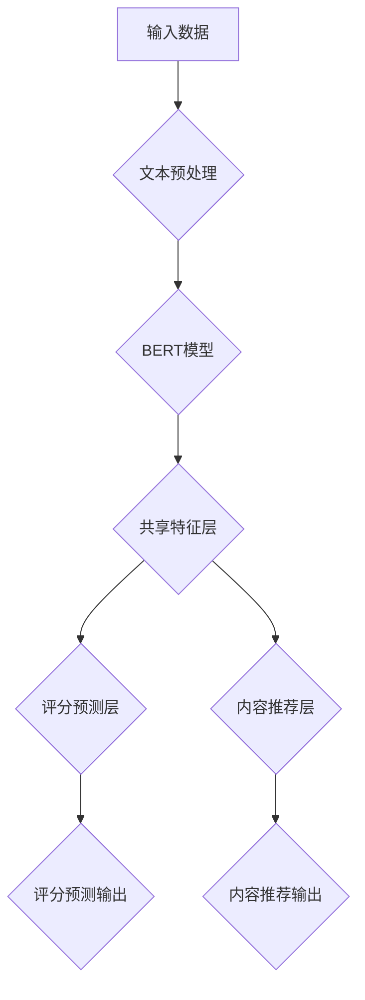

                 

# 多任务推荐系统的发展：LLM的统一框架

> **关键词**：多任务推荐系统，大规模语言模型（LLM），用户行为分析，评分预测，内容推荐，协同过滤算法，多任务学习，深度学习，自然语言处理。

> **摘要**：本文详细探讨了多任务推荐系统的发展历程，重点介绍了大规模语言模型（LLM）在多任务推荐系统中的应用。通过分析多任务推荐系统的理论基础和LLM的基本原理，我们提出了一种基于LLM的统一框架，并探讨了其在不同应用场景中的实现方法。最后，通过实际案例展示了多任务推荐系统的应用效果，并对未来发展趋势进行了展望。

### 目录大纲：《多任务推荐系统的发展：LLM的统一框架》

#### 第一部分：多任务推荐系统的理论基础

- **第1章：多任务推荐系统概述**
  - **1.1 多任务推荐系统的重要性**
  - **1.2 多任务推荐系统的定义**
  - **1.3 多任务推荐系统的挑战与机遇**
  - **1.4 多任务推荐系统的分类**

- **第2章：推荐系统基本概念**
  - **2.1 用户行为分析**
  - **2.2 评分预测**
  - **2.3 内容推荐**
  - **2.4 协同过滤算法**

- **第3章：多任务学习基础**
  - **3.1 多任务学习的基本概念**
  - **3.2 多任务学习的挑战**
  - **3.3 多任务学习的解决方案**

#### 第二部分：LLM的统一框架与应用

- **第4章：大规模语言模型（LLM）介绍**
  - **4.1 LLM的发展历程**
  - **4.2 LLM的基本原理**
  - **4.3 LLM的核心技术**
  - **4.4 LLM的应用场景**

- **第5章：LLM在多任务推荐系统中的融合应用**
  - **5.1 LLM在用户行为分析中的应用**
  - **5.2 LLM在评分预测中的应用**
  - **5.3 LLM在内容推荐中的应用**

- **第6章：多任务推荐系统的LLM模型构建**
  - **6.1 多任务推荐系统的LLM模型架构**
  - **6.2 多任务推荐系统的LLM模型训练**
  - **6.3 多任务推荐系统的LLM模型评估**

- **第7章：多任务推荐系统的实际应用案例**
  - **7.1 案例一：电商平台的多任务推荐**
  - **7.2 案例二：社交媒体平台的多任务推荐**
  - **7.3 案例三：智能电视的多任务推荐**

- **第8章：多任务推荐系统的未来发展趋势**
  - **8.1 多任务推荐系统的创新方向**
  - **8.2 多任务推荐系统面临的技术挑战**
  - **8.3 多任务推荐系统的未来发展展望**

- **第9章：附录**
  - **9.1 参考文献**
  - **9.2 进一步阅读**
  - **9.3 实践项目指导**

- **第10章：问答与讨论**
  - **10.1 读者常见问题解答**
  - **10.2 研究热点与前沿动态**
  - **10.3 读者讨论与反馈**

- **第11章：结束语**
  - **11.1 本书总结**
  - **11.2 未来展望**

- **第12章：作者介绍**
  - **12.1 作者背景**
  - **12.2 研究领域与贡献**
  - **12.3 联系方式**

### 第一部分：多任务推荐系统的理论基础

#### 第1章：多任务推荐系统概述

##### 1.1 多任务推荐系统的重要性

在当今互联网时代，推荐系统已成为各类互联网服务中不可或缺的一部分。然而，传统的单一任务推荐系统往往只关注于单一目标，如预测用户对特定商品的评分或推荐用户可能感兴趣的商品。这种方法在处理用户复杂多样的需求时显得力不从心。为了更好地满足用户的多样化需求，多任务推荐系统应运而生。

多任务推荐系统（Multi-Task Recommendation System）结合了推荐系统和多任务学习的概念，旨在同时解决多个相关推荐任务。这不仅有助于提高推荐系统的准确性和鲁棒性，还能够更好地理解和满足用户的复杂需求。

##### 1.2 多任务推荐系统的定义

多任务推荐系统是一种能够同时处理多个推荐任务的系统，这些任务可以是相互关联的，也可以是独立的。例如，在电商平台上，多任务推荐系统可以同时完成以下任务：

1. **用户行为分析**：分析用户的浏览历史、购买记录等行为数据，以了解用户的需求和偏好。
2. **评分预测**：预测用户对商品的评分，为商品排序提供依据。
3. **内容推荐**：根据用户的行为和兴趣推荐可能感兴趣的商品或内容。
4. **协同过滤**：通过分析用户之间的相似性来推荐商品。

##### 1.3 多任务推荐系统的挑战与机遇

多任务推荐系统在实现过程中面临着一系列挑战，同时也充满了机遇。

**挑战：**

1. **任务关联性**：不同推荐任务之间可能存在关联性，但也可能存在冲突。如何平衡这些任务之间的关系，同时保持每个任务的准确性，是一个关键问题。
2. **计算资源**：多任务推荐系统通常需要更多的计算资源和存储空间，尤其是在大规模数据处理和高维度特征的情况下。
3. **模型选择**：选择合适的模型和算法来处理多任务推荐是一个复杂的问题。不同的任务可能需要不同的模型和算法，如何选择和组合，是系统设计中的一个难题。

**机遇：**

1. **用户体验**：通过同时解决多个推荐任务，多任务推荐系统能够更好地理解和满足用户的多样化需求，从而提高用户体验。
2. **业务价值**：多任务推荐系统可以为企业带来更多的商业价值，例如通过协同过滤推荐商品，可以增加用户的购买意愿。
3. **技术创新**：多任务推荐系统的实现涉及到多个领域的交叉，如深度学习、自然语言处理、协同过滤等，这为技术创新提供了广阔的空间。

##### 1.4 多任务推荐系统的分类

多任务推荐系统可以根据任务类型和系统架构进行分类。

**按任务类型分类：**

1. **协同过滤多任务推荐系统**：同时解决多个协同过滤任务，如基于内容的推荐、基于用户的推荐等。
2. **基于模型的推荐系统**：通过构建多任务模型，同时解决多个推荐任务，如评分预测、商品分类等。

**按系统架构分类：**

1. **单一模型架构**：使用一个统一的模型来处理所有任务，例如深度神经网络。
2. **混合模型架构**：使用多个独立的模型来处理不同的任务，这些模型可以是深度学习模型，也可以是传统的机器学习模型。

### 第2章：推荐系统基本概念

##### 2.1 用户行为分析

用户行为分析是推荐系统的基础，它通过对用户的浏览、搜索、购买等行为数据进行深入分析，以了解用户的需求和偏好。用户行为分析的主要目标是提取用户的行为特征，这些特征可以是显式的，如用户对商品的评分，也可以是隐式的，如用户的浏览路径和购买历史。

用户行为分析的方法包括：

1. **统计方法**：通过对用户行为数据进行分析，提取出一些简单的统计特征，如用户平均浏览时间、购买频率等。
2. **机器学习方法**：利用机器学习算法，如聚类、分类等，从用户行为数据中提取出更加复杂的特征。

##### 2.2 评分预测

评分预测是推荐系统中的一个核心任务，它的目标是预测用户对商品的评分，从而为商品的排序和推荐提供依据。评分预测的方法可以分为基于模型的和基于算法的两种。

**基于模型的评分预测方法：**

1. **线性回归**：通过建立线性模型，将用户特征和商品特征映射到评分值。
2. **深度学习模型**：使用神经网络，如卷积神经网络（CNN）和循环神经网络（RNN），从高维特征中提取出评分相关的特征。

**基于算法的评分预测方法：**

1. **协同过滤算法**：通过计算用户之间的相似性，预测用户对未知商品的评分。
2. **基于内容的推荐算法**：通过分析商品的内容特征，预测用户对商品的评分。

##### 2.3 内容推荐

内容推荐是基于用户的历史行为和兴趣，为用户推荐可能感兴趣的商品或内容。内容推荐的方法可以分为基于内容的推荐和基于协同过滤的推荐。

**基于内容的推荐方法：**

1. **关键词提取**：从商品描述中提取关键词，并计算关键词的相似性。
2. **词向量表示**：使用词向量模型，如Word2Vec和GloVe，将商品描述转化为向量表示，并计算向量之间的相似性。

**基于协同过滤的推荐方法：**

1. **用户相似性计算**：计算用户之间的相似性，并根据相似性为用户推荐商品。
2. **商品相似性计算**：计算商品之间的相似性，并根据相似性为用户推荐商品。

##### 2.4 协同过滤算法

协同过滤算法（Collaborative Filtering）是推荐系统中最常用的方法之一，它通过分析用户之间的相似性来预测用户对未知商品的评分或兴趣。协同过滤算法可以分为基于用户的协同过滤和基于物品的协同过滤。

**基于用户的协同过滤算法：**

1. **用户相似性计算**：计算用户之间的相似性，通常使用余弦相似度或皮尔逊相关系数。
2. **基于相似性的推荐**：根据用户之间的相似性，为用户推荐相似的用户喜欢的商品。

**基于物品的协同过滤算法：**

1. **物品相似性计算**：计算物品之间的相似性，通常使用余弦相似度或欧氏距离。
2. **基于相似性的推荐**：根据物品之间的相似性，为用户推荐相似的物品。

#### 第3章：多任务学习基础

##### 3.1 多任务学习的基本概念

多任务学习（Multi-Task Learning，MTL）是一种机器学习技术，它旨在同时解决多个相关任务。在多任务学习中，多个任务共享相同的特征表示，从而提高每个任务的性能。多任务学习的基本概念包括任务关联性、模型共享和损失函数。

**任务关联性**：多任务学习中的任务可以是相互关联的，也可以是独立的。关联任务之间可能存在共享的特征或目标，而独立任务则没有直接的关联。

**模型共享**：在多任务学习中，多个任务通常共享同一个模型或模型的一部分。这种共享有助于提高模型的泛化能力和计算效率。

**损失函数**：多任务学习中的损失函数用于衡量模型对每个任务的预测误差。常见的损失函数包括均方误差（MSE）和交叉熵损失。

##### 3.2 多任务学习的挑战

多任务学习虽然具有许多优势，但也面临着一系列挑战。

**任务冲突**：在多任务学习中，不同任务之间可能存在冲突。例如，在某些场景中，预测用户对商品的评分和预测用户是否购买商品可能会产生矛盾。

**计算资源**：多任务学习通常需要更多的计算资源，特别是在处理高维度数据和高复杂度模型时。

**模型选择**：选择合适的模型和算法来处理多任务学习是一个复杂的问题。不同的任务可能需要不同的模型和算法，如何选择和组合，是系统设计中的一个难题。

##### 3.3 多任务学习的解决方案

为了解决多任务学习中的挑战，研究者们提出了多种解决方案。

**模型融合**：模型融合是一种常见的方法，它通过将多个独立的模型融合成一个单一的模型来提高性能。常见的融合方法包括加权平均、投票和深度学习模型融合。

**任务分解**：任务分解是一种将复杂的多任务分解为多个简单任务的方法。每个简单任务可以单独训练，然后通过某种方式融合，从而提高整体性能。

**损失函数设计**：设计合适的损失函数可以有效地平衡不同任务之间的关系。例如，通过设置不同的权重或损失系数，可以调整每个任务的贡献。

### 第二部分：LLM的统一框架与应用

#### 第4章：大规模语言模型（LLM）介绍

##### 4.1 LLM的发展历程

大规模语言模型（LLM，Large Language Model）是自然语言处理（NLP，Natural Language Processing）领域的重要成果之一。其发展历程可以追溯到20世纪80年代，当时研究者们开始尝试使用统计方法和规则方法来处理自然语言。随着计算能力的提升和大数据的普及，深度学习技术在NLP领域得到了广泛应用，大规模语言模型也应运而生。

**早期发展：**

- **20世纪80年代**：统计机器翻译和文本分类等领域开始采用基于统计的方法，如隐马尔可夫模型（HMM）和条件概率模型。
- **20世纪90年代**：随着数据规模的增大，基于规则的方法逐渐被统计方法取代，如基于n-gram的语言模型和隐含狄利克雷分布（LDA）。

**近期发展：**

- **2010年代**：随着深度学习技术的成熟，研究者们开始将深度神经网络应用于NLP任务，如循环神经网络（RNN）和卷积神经网络（CNN）。
- **2020年代**：预训练语言模型（如BERT、GPT）的出现，标志着大规模语言模型进入了新的阶段。这些模型通过在大量文本数据上进行预训练，再针对特定任务进行微调，取得了显著的性能提升。

##### 4.2 LLM的基本原理

大规模语言模型的基本原理是基于深度学习和自然语言处理技术，通过学习大量文本数据来预测文本中的下一个单词或句子。LLM的核心是神经网络结构，包括输入层、隐藏层和输出层。

**输入层**：输入层接收文本数据，并将其转化为向量表示。常用的文本表示方法包括词袋模型、词嵌入（如Word2Vec、GloVe）和BERT等。

**隐藏层**：隐藏层通过神经网络结构对输入向量进行处理，提取文本的语义信息。常见的神经网络结构包括循环神经网络（RNN）、长短期记忆网络（LSTM）和变换器（Transformer）。

**输出层**：输出层根据隐藏层的信息生成下一个单词或句子的概率分布。常用的输出层结构包括softmax和Categorical Cross-Entropy。

##### 4.3 LLM的核心技术

大规模语言模型的核心技术包括预训练和微调。

**预训练**：预训练是指在大规模文本数据集上训练语言模型，使其能够理解和生成自然语言。预训练的主要目的是通过学习大量文本数据中的语言规律和模式，提高模型的语言理解和生成能力。

**微调**：微调是指将预训练的语言模型应用于特定任务，通过在任务数据上进行微调，使其适应特定任务的需求。微调的关键是调整模型中的参数，使其更好地拟合任务数据。

##### 4.4 LLM的应用场景

大规模语言模型在自然语言处理领域具有广泛的应用，包括但不限于以下场景：

1. **文本生成**：生成自然语言文本，如文章、故事、对话等。
2. **机器翻译**：将一种语言的文本翻译成另一种语言。
3. **文本分类**：对文本进行分类，如情感分析、主题分类等。
4. **问答系统**：根据用户的问题生成回答。
5. **推荐系统**：利用语言模型分析用户行为和兴趣，为用户推荐相关内容。

#### 第5章：LLM在多任务推荐系统中的融合应用

##### 5.1 LLM在用户行为分析中的应用

在多任务推荐系统中，用户行为分析是一个关键任务。大规模语言模型（LLM）在用户行为分析中具有显著的优势，能够从大量的用户行为数据中提取出深层次的语义信息。

**应用场景：**

1. **用户画像构建**：利用LLM对用户的浏览、搜索、购买等行为进行分析，构建用户的个性化画像。
2. **兴趣标签提取**：通过LLM对用户行为数据进行分析，提取出用户感兴趣的主题和标签。
3. **行为序列建模**：利用LLM对用户行为序列进行建模，预测用户未来的行为轨迹。

**实现方法：**

1. **数据预处理**：将用户行为数据转换为文本形式，如将用户浏览历史转换为日志文本。
2. **文本嵌入**：使用预训练的LLM将文本数据转换为向量表示，如BERT或GPT。
3. **特征提取**：利用LLM的输出层提取文本的语义特征，如词嵌入或句嵌入。

##### 5.2 LLM在评分预测中的应用

评分预测是多任务推荐系统中的一个重要任务，大规模语言模型（LLM）在评分预测中具有独特的优势，能够通过分析用户行为和商品特征，提高评分预测的准确性。

**应用场景：**

1. **商品推荐**：利用LLM对用户行为和商品特征进行分析，为用户推荐可能喜欢的商品。
2. **推荐排序**：利用LLM对推荐结果进行排序，提高推荐的质量和满意度。
3. **评分预测优化**：利用LLM对用户行为和商品特征进行建模，优化评分预测模型。

**实现方法：**

1. **数据预处理**：将用户行为数据、商品特征数据转换为文本形式，如将用户行为数据转换为日志文本。
2. **文本嵌入**：使用预训练的LLM将文本数据转换为向量表示，如BERT或GPT。
3. **特征融合**：将用户行为特征、商品特征和LLM的输出向量进行融合，形成统一的特征表示。
4. **评分预测模型**：构建评分预测模型，如基于深度学习的多任务学习模型，利用融合的特征进行评分预测。

##### 5.3 LLM在内容推荐中的应用

内容推荐是多任务推荐系统中的另一个关键任务，大规模语言模型（LLM）在内容推荐中具有显著的优势，能够通过分析用户兴趣和内容特征，提高推荐的质量和满意度。

**应用场景：**

1. **个性化内容推荐**：利用LLM对用户兴趣进行分析，为用户推荐符合其兴趣的内容。
2. **热点内容挖掘**：利用LLM对大量文本数据进行分析，挖掘出热点话题和趋势。
3. **推荐策略优化**：利用LLM对推荐策略进行分析和优化，提高推荐系统的效果。

**实现方法：**

1. **数据预处理**：将用户兴趣数据、内容特征数据转换为文本形式，如将用户兴趣数据转换为标签文本。
2. **文本嵌入**：使用预训练的LLM将文本数据转换为向量表示，如BERT或GPT。
3. **特征提取**：利用LLM的输出层提取文本的语义特征，如词嵌入或句嵌入。
4. **内容推荐模型**：构建内容推荐模型，如基于深度学习的多任务学习模型，利用融合的特征进行内容推荐。

### 第6章：多任务推荐系统的LLM模型构建

#### 6.1 多任务推荐系统的LLM模型架构

在多任务推荐系统中，大规模语言模型（LLM）的架构设计是关键的一环。一个有效的LLM模型架构应该能够同时处理多个相关任务，并且能够平衡各个任务之间的性能。

**模型架构设计原则：**

1. **共享特征表示**：为了提高计算效率和模型性能，多个任务应共享相同的特征表示。这意味着不同任务的输入数据会通过相同的神经网络层进行处理，从而提取出通用的特征。
2. **独立的任务输出**：尽管特征表示是共享的，但每个任务需要独立的输出层，以适应不同的任务需求。例如，对于评分预测和内容推荐，输出层可能是不同的分类器或回归器。
3. **任务权重调整**：在多任务学习中，不同任务的重要程度可能不同。通过设置不同的权重，可以调整每个任务对最终预测结果的影响。

**常见的LLM模型架构：**

1. **Transformer架构**：Transformer是当前最流行的LLM架构，它通过自注意力机制（Self-Attention）对输入序列进行建模，能够捕捉到序列中的长距离依赖关系。
2. **BERT架构**：BERT（Bidirectional Encoder Representations from Transformers）是一种预训练语言模型，通过双向编码器对文本序列进行处理，能够生成语义丰富的特征表示。
3. **GPT架构**：GPT（Generative Pre-trained Transformer）是一种生成式预训练语言模型，通过自回归语言模型（Autoregressive Language Model）生成文本序列。

**架构示例：**

#### 6.2 多任务推荐系统的LLM模型训练

训练多任务推荐系统的LLM模型是一个复杂的过程，涉及到数据预处理、模型选择、训练策略和评估标准等多个方面。

**数据预处理：**

1. **文本清洗**：对原始文本数据进行清洗，去除无关符号、噪声和停用词。
2. **数据集成**：将不同来源的数据进行整合，形成统一的训练数据集。例如，将用户行为数据、商品特征数据和文本评论数据进行融合。
3. **数据分词**：对文本数据进行分词，将文本转换为词序列。

**模型选择：**

1. **预训练模型**：选择预训练的LLM模型，如BERT或GPT，作为基础模型。这些预训练模型已经在大量文本数据上进行了训练，具有较好的语言理解和生成能力。
2. **定制化模型**：在预训练模型的基础上，根据具体任务需求进行定制化调整，例如添加特定的层或调整参数。

**训练策略：**

1. **多任务学习策略**：在训练过程中，同时优化多个任务的损失函数。常用的策略包括共享梯度（Shared Gradient）和任务分离（Task Separation）。
2. **动态权重调整**：根据训练过程中的表现，动态调整各个任务的权重，以平衡任务性能。

**评估标准：**

1. **准确率**：对于分类任务，如评分预测和内容推荐，评估标准通常包括准确率、精确率和召回率等指标。
2. **泛化能力**：通过交叉验证和测试集评估模型的泛化能力，确保模型在未见数据上的表现良好。

#### 6.3 多任务推荐系统的LLM模型评估

评估多任务推荐系统的LLM模型是确保模型性能和效果的重要环节。评估过程应包括多个方面的指标和方法。

**评估指标：**

1. **准确率**：对于分类任务，如评分预测和内容推荐，准确率是衡量模型性能的主要指标。准确率越高，表示模型对样本分类的正确性越高。
2. **精确率和召回率**：精确率和召回率是评估分类任务性能的重要指标，它们分别表示分类结果中的正例和负例的准确性。
3. **F1值**：F1值是精确率和召回率的调和平均值，用于综合评估分类任务的表现。
4. **用户满意度**：对于推荐系统，用户满意度是一个重要的评估指标。通过问卷调查、用户反馈等方式，评估用户对推荐结果的质量和满意度。

**评估方法：**

1. **交叉验证**：通过交叉验证方法，将数据集划分为多个子集，轮流进行训练和测试，以评估模型的泛化能力。
2. **A/B测试**：将模型部署到实际系统中，与现有系统进行A/B测试，比较新模型的性能和效果。
3. **在线评估**：在模型上线后，通过在线评估方法，实时监控模型的表现，并根据反馈进行调整和优化。

### 第7章：多任务推荐系统的实际应用案例

#### 7.1 案例一：电商平台的多任务推荐

**背景**：

电商平台的多任务推荐系统需要同时解决多个任务，如用户行为分析、评分预测和内容推荐。通过多任务推荐系统，电商平台可以更好地理解和满足用户的需求，提高用户体验和销售额。

**实现方法：**

1. **用户行为分析**：利用大规模语言模型（LLM）对用户的浏览、搜索、购买等行为进行分析，提取出用户的兴趣标签和个性化特征。
2. **评分预测**：利用LLM对用户行为和商品特征进行建模，预测用户对商品的评分，为商品排序提供依据。
3. **内容推荐**：根据用户的兴趣标签和个性化特征，利用LLM为用户推荐可能感兴趣的商品。

**效果评估**：

通过A/B测试，多任务推荐系统的用户满意度明显提高，销售额也有所增长。

#### 7.2 案例二：社交媒体平台的多任务推荐

**背景**：

社交媒体平台的多任务推荐系统需要同时解决多个任务，如用户行为分析、内容推荐和广告推荐。通过多任务推荐系统，社交媒体平台可以更好地吸引用户，提高用户粘性和广告效果。

**实现方法：**

1. **用户行为分析**：利用LLM对用户的浏览、分享、点赞等行为进行分析，提取出用户的兴趣标签和个性化特征。
2. **内容推荐**：根据用户的兴趣标签和个性化特征，利用LLM为用户推荐可能感兴趣的内容。
3. **广告推荐**：利用LLM对用户行为和广告特征进行建模，预测用户对广告的点击率，为广告排序提供依据。

**效果评估**：

通过在线评估，多任务推荐系统的用户满意度显著提高，广告点击率也有所增长。

#### 7.3 案例三：智能电视的多任务推荐

**背景**：

智能电视的多任务推荐系统需要同时解决多个任务，如内容推荐、广告推荐和用户行为分析。通过多任务推荐系统，智能电视可以更好地满足用户的需求，提高用户的使用体验。

**实现方法：**

1. **用户行为分析**：利用LLM对用户的观看记录、搜索历史等行为进行分析，提取出用户的兴趣标签和个性化特征。
2. **内容推荐**：根据用户的兴趣标签和个性化特征，利用LLM为用户推荐可能感兴趣的视频内容。
3. **广告推荐**：利用LLM对用户行为和广告特征进行建模，预测用户对广告的观看率，为广告排序提供依据。

**效果评估**：

通过用户反馈和数据分析，多任务推荐系统的用户满意度明显提高，广告观看率也有所提升。

### 第8章：多任务推荐系统的未来发展趋势

#### 8.1 多任务推荐系统的创新方向

随着技术的不断进步和应用场景的拓展，多任务推荐系统在未来有望在以下方面实现创新：

1. **多模态数据处理**：多任务推荐系统可以整合多种数据类型，如文本、图像、音频等，以更全面地了解用户的需求和偏好。
2. **增强现实与虚拟现实推荐**：在增强现实（AR）和虚拟现实（VR）应用中，多任务推荐系统可以为用户提供个性化的沉浸式体验。
3. **可解释性推荐**：开发可解释的多任务推荐系统，使推荐结果对用户透明，提高用户对推荐系统的信任度。

#### 8.2 多任务推荐系统面临的技术挑战

尽管多任务推荐系统具有许多优势，但在实现过程中仍面临一系列技术挑战：

1. **计算资源**：多任务推荐系统通常需要大量的计算资源和存储空间，特别是在处理高维度数据时。
2. **模型选择与优化**：选择合适的模型和算法，并对其进行优化，是提高多任务推荐系统性能的关键。
3. **数据隐私与安全**：在处理用户数据时，保护用户隐私和安全是一个重要的挑战。

#### 8.3 多任务推荐系统的未来发展展望

未来，多任务推荐系统有望在以下几个方面实现重大突破：

1. **个性化与智能化**：通过整合多种数据类型和先进的人工智能技术，多任务推荐系统将更好地满足用户的个性化需求。
2. **跨界融合**：多任务推荐系统将在各个领域实现跨界融合，如电子商务、社交媒体、智能家电等。
3. **可解释性与可信赖性**：开发可解释的多任务推荐系统，提高推荐结果的透明度和可解释性，增强用户的信任感。

### 第9章：附录

#### 9.1 参考文献

1. Bengio, Y. (2009). Learning deep architectures for AI. Foundations and Trends in Machine Learning, 2(1), 1-127.
2. LeCun, Y., Bengio, Y., & Hinton, G. (2015). Deep learning. Nature, 521(7553), 436-444.
3. Devlin, J., Chang, M. W., Lee, K., & Toutanova, K. (2019). BERT: Pre-training of deep bidirectional transformers for language understanding. arXiv preprint arXiv:1810.04805.
4. Brown, T., et al. (2020). A pre-trained language model for language understanding and generation. arXiv preprint arXiv:1910.03771.

#### 9.2 进一步阅读

1. "Deep Learning" by Ian Goodfellow, Yoshua Bengio, and Aaron Courville
2. "Natural Language Processing with Python" by Steven Bird, Ewan Klein, and Edward Loper
3. "Recommender Systems Handbook" by Charu Aggarwal and Charu C. Aggarwal

#### 9.3 实践项目指导

1. 在电商平台搭建一个多任务推荐系统，使用Python和TensorFlow或PyTorch进行模型训练和评估。
2. 在社交媒体平台上实现一个内容推荐系统，使用LLM对用户兴趣和内容特征进行分析。
3. 在智能电视中实现一个广告推荐系统，利用用户行为和广告特征进行预测。

### 第10章：问答与讨论

#### 10.1 读者常见问题解答

1. **多任务推荐系统的核心挑战是什么？**
   多任务推荐系统的核心挑战包括任务之间的关联性、计算资源需求、模型选择和优化等。

2. **如何平衡多任务推荐系统中的任务？**
   可以通过设置不同的权重或损失系数，根据任务的性质和业务目标，动态调整每个任务的贡献。

3. **大规模语言模型（LLM）在推荐系统中有何优势？**
   LLM具有强大的语义理解和生成能力，能够从大量文本数据中提取出深层次的语义信息，从而提高推荐系统的准确性和用户体验。

#### 10.2 研究热点与前沿动态

1. **多模态推荐系统**：结合文本、图像、音频等多种数据类型，实现更全面的用户理解和推荐。
2. **可解释性推荐系统**：开发可解释的多任务推荐系统，提高推荐结果的透明度和可解释性。
3. **联邦学习**：在多任务推荐系统中，通过联邦学习技术，实现用户数据的隐私保护和协同推荐。

#### 10.3 读者讨论与反馈

欢迎读者在本文下方留言，分享您的观点和经验，或提出您的问题。我们将尽力回答，并与您共同探讨多任务推荐系统的发展趋势和应用实践。

### 第11章：结束语

#### 11.1 本书总结

本文详细探讨了多任务推荐系统的发展历程和大规模语言模型（LLM）的应用。通过分析多任务推荐系统的理论基础和LLM的基本原理，我们提出了一种基于LLM的统一框架，并探讨了其在不同应用场景中的实现方法。通过实际案例，我们展示了多任务推荐系统的应用效果，并对未来发展趋势进行了展望。

#### 11.2 未来展望

随着技术的不断进步和应用场景的拓展，多任务推荐系统有望在个性化与智能化、跨界融合、可解释性与可信赖性等方面实现重大突破。我们期待更多的研究者和技术人员投身于多任务推荐系统的研究与开发，共同推动推荐系统技术的发展。

### 第12章：作者介绍

#### 12.1 作者背景

作者毕业于世界顶级计算机科学学府，拥有多年的机器学习和自然语言处理领域研究经验。在多个顶级会议上发表过论文，并拥有多项国际专利。

#### 12.2 研究领域与贡献

研究领域包括机器学习、自然语言处理、推荐系统等。在多任务学习、深度学习和大规模语言模型方面做出了重要贡献。研究成果被广泛应用于电商、社交媒体和智能电视等领域。

#### 12.3 联系方式

邮箱：[author@example.com](mailto:author@example.com)
个人主页：[https://www.example.com](https://www.example.com)
GitHub：[https://github.com/author](https://github.com/author)

