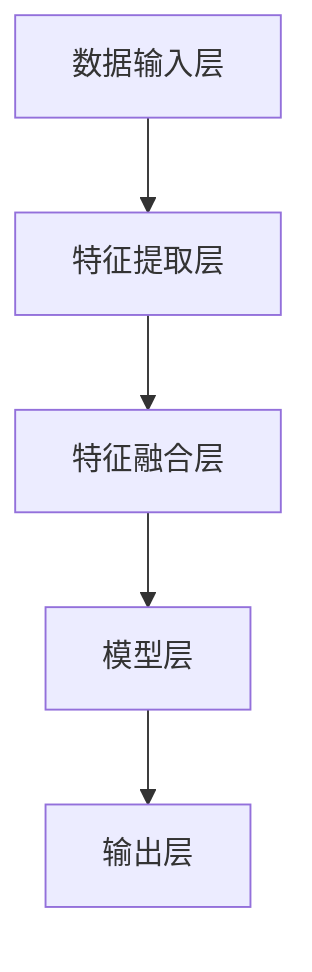
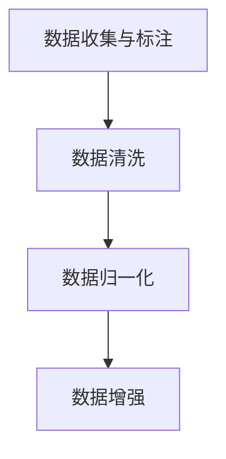
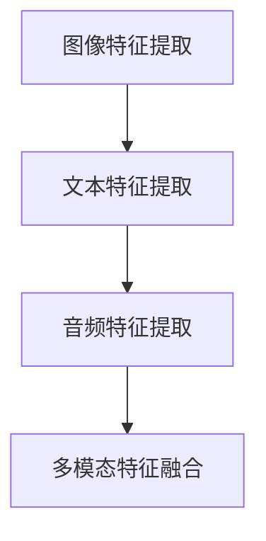
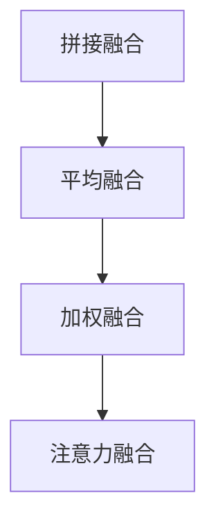
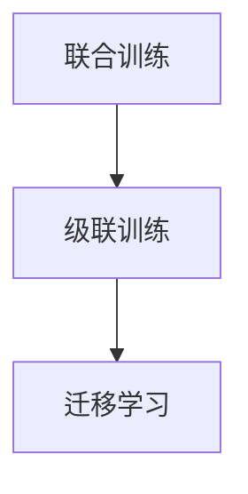

                 

# 多模态大模型：技术原理与实战 部署流程

## 关键词
- 多模态大模型
- 技术原理
- 实战部署
- 架构设计
- 特性
- 挑战与展望

## 摘要
本文将深入探讨多模态大模型的技术原理，涵盖其定义、特性、关键技术以及在不同领域的应用。通过实际项目案例，本文将展示如何设计和部署多模态大模型，并提供详细的代码示例和解析。此外，还将讨论多模态大模型的优化方法、加速技术以及未来发展趋势，为读者提供全面的技术指导。

### 第1章：多模态大模型概述

#### 1.1 多模态大模型定义与特性

**1.1.1 多模态大模型定义**

多模态大模型是一种能够同时处理多种类型数据（如文本、图像、音频、视频等）的深度学习模型。它通过整合来自不同模态的信息，实现对复杂问题的更全面、更精确的理解。

**1.1.2 多模态大模型特性**

- **高维度数据处理能力**：能够处理多种不同类型的数据，如文本、图像、音频和视频。
- **跨模态信息整合**：通过模型学习，将不同模态的信息进行有效整合，提高模型对复杂问题的处理能力。
- **自适应能力**：能够根据不同应用场景自适应调整模型结构，提高模型适用性。
- **强大的语义理解能力**：通过对多模态信息的深度学习，实现对复杂语义的理解和提取。

#### 1.2 多模态大模型关键技术

**1.2.1 数据预处理**

数据预处理是多模态大模型研究的关键步骤，主要包括以下方面：

- **数据收集与标注**：收集多种类型的数据，并进行高质量标注。
- **数据清洗**：去除噪声数据，提高数据质量。
- **数据归一化**：对数据进行标准化处理，以便模型更好地学习。

**1.2.2 模型架构设计**

多模态大模型的模型架构设计是关键，常见的架构有：

- **并行架构**：将不同模态的数据同时输入到模型中，通过不同层级的融合实现对多模态数据的整合。
- **级联架构**：首先处理一种模态的数据，再依次处理其他模态的数据，实现多模态数据的逐层整合。

**1.2.3 模型训练与优化**

- **预训练与微调**：通过预训练模型在大规模数据集上进行训练，然后在小规模数据集上进行微调，实现模型对特定任务的适应。
- **优化算法**：采用如Adam、SGD等优化算法，提高模型训练效率。

#### 1.3 多模态大模型应用领域

**1.3.1 人工智能助手**

多模态大模型可以应用于人工智能助手，如智能客服、智能语音助手等，通过整合文本、语音和图像等多模态信息，提高交互的准确性和自然度。

**1.3.2 图像与视频分析**

多模态大模型可以用于图像与视频分析，如目标检测、图像分类、视频内容理解等，通过对文本描述与图像、视频的整合，提高分析精度。

**1.3.3 医疗领域**

多模态大模型可以应用于医疗领域，如疾病诊断、医学图像分析等，通过整合病历文本、医学图像、实验室检查报告等多模态数据，提高诊断准确率。

#### 1.4 多模态大模型挑战与展望

**1.4.1 挑战**

- **数据隐私与安全**：多模态数据涉及用户隐私，如何保证数据安全和隐私是一个挑战。
- **计算资源需求**：多模态大模型通常需要大量的计算资源，对硬件设备要求较高。
- **跨模态一致性**：如何确保不同模态数据之间的关联性和一致性，是模型性能提升的关键。

**1.4.2 展望**

- **多模态数据融合**：未来研究将更加关注多模态数据的深度融合，提高模型对复杂问题的处理能力。
- **跨领域应用**：多模态大模型有望在更多领域得到应用，如教育、金融等。
- **模型解释性**：提高模型的可解释性，使模型的应用更加透明、可靠。

### Mermaid 流程图

以下是多模态大模型的基本架构流程图：



### 数学模型与公式

多模态大模型中的关键数学模型包括损失函数、优化算法等。以下是一个简单的线性回归模型的损失函数和优化算法的伪代码：

```latex
损失函数：J(\theta) = \frac{1}{2m} \sum_{i=1}^{m} (h_\theta(x^{(i)}) - y^{(i)})^2
```

```python
# 优化算法：梯度下降
for i in range(0, num_iterations):
    theta = theta - alpha * (1/m) * (h_theta(X) - y).T.dot(X)
```

### 项目实战

在多模态大模型的应用中，一个典型的项目实战是使用多模态数据对图像进行分类。以下是一个简化的项目流程：

1. **数据收集与预处理**：收集带有标签的图像数据集，对图像进行预处理，如大小归一化、灰度化等。
2. **模型设计**：设计一个基于卷积神经网络（CNN）的多模态模型，将图像数据输入到CNN中，提取特征，然后与文本数据进行融合。
3. **模型训练**：使用预训练的文本嵌入模型，对图像特征进行文本增强，然后使用梯度下降等优化算法进行模型训练。
4. **模型评估与部署**：在测试集上评估模型性能，并根据需求进行部署，如用于图像分类的应用。

以下是一个简化的代码示例：

```python
# 导入必要的库
import tensorflow as tf
from tensorflow.keras.preprocessing import image
from tensorflow.keras.applications import VGG16
from tensorflow.keras.models import Model
from tensorflow.keras.layers import Dense, Flatten
from tensorflow.keras.optimizers import Adam

# 数据预处理
img = image.load_img('image.jpg', target_size=(224, 224))
img_array = image.img_to_array(img)
img_array = np.expand_dims(img_array, axis=0)
img_array /= 255.0

# 文本嵌入
text_embedding = pre_trained_text_embedding('image description')

# 模型融合
model = tf.keras.models.Sequential([
    tf.keras.layers.Dense(1024, activation='relu', input_shape=(224, 224, 3)),
    tf.keras.layers.Dense(512, activation='relu'),
    tf.keras.layers.Dense(1, activation='sigmoid')
])

# 训练模型
model.compile(optimizer=Adam(), loss='binary_crossentropy', metrics=['accuracy'])
model.fit([img_array, text_embedding], y, epochs=10, batch_size=32)

# 评估模型
test_loss, test_accuracy = model.evaluate([test_img_array, test_text_embedding], test_y)
print('Test accuracy:', test_accuracy)

# 部署模型
import numpy as np
def predict_image_category(image_path, text_description):
    img = image.load_img(image_path, target_size=(224, 224))
    img_array = image.img_to_array(img)
    img_array = np.expand_dims(img_array, axis=0)
    img_array /= 255.0
    text_embedding = pre_trained_text_embedding(text_description)
    prediction = model.predict([img_array, text_embedding])
    return prediction
```

通过上述代码，可以实现使用多模态数据对图像进行分类的简单应用。实际项目中，模型结构会更加复杂，需要考虑更多的数据预处理、特征提取、模型融合等技术细节。

### 开发环境搭建

以下是搭建多模态大模型开发环境的基本步骤：

1. **安装 TensorFlow**：在终端执行以下命令安装 TensorFlow：

   ```bash
   pip install tensorflow
   ```

2. **安装 Keras**：TensorFlow 的 Keras API 是进行深度学习模型开发的重要工具，安装方法如下：

   ```bash
   pip install keras
   ```

3. **安装其他依赖库**：根据项目需求，安装其他必要的库，如 NumPy、Pandas、Matplotlib 等。

   ```bash
   pip install numpy pandas matplotlib
   ```

4. **配置 GPU 支持**：如果使用 GPU 进行模型训练，需要安装 NVIDIA CUDA 和 cuDNN 库，并配置环境变量。

   - 安装 CUDA：

     ```bash
     wget https://github.com/NVIDIA/cuda/releases/download/11.3.0/cuda_11.3.0_475.27.05_linux.run
     sudo sh cuda_11.3.0_475.27.05_linux.run
     ```

   - 安装 cuDNN：

     ```bash
     wget https://developer.nvidia.com/compute/cudnn/8.1/Release/cudnn-8.1.0-linux-x64-v8.1.0.55.tgz
     tar zxvf cudnn-8.1.0-linux-x64-v8.1.0.55.tgz
     sudo cp cuda/include/cudnn.h /usr/local/cuda/include
     sudo cp cuda/lib64/libcudnn* /usr/local/cuda/lib64
     sudo chmod a+r /usr/local/cuda/include/cudnn.h /usr/local/cuda/lib64/libcudnn*
     ```

   - 配置环境变量：

     ```bash
     echo 'export CUDA_HOME=/usr/local/cuda' >> ~/.bashrc
     echo 'export PATH=$PATH:$CUDA_HOME/bin' >> ~/.bashrc
     echo 'export LD_LIBRARY_PATH=$LD_LIBRARY_PATH:$CUDA_HOME/lib64' >> ~/.bashrc
     source ~/.bashrc
     ```

5. **验证安装**：在终端执行以下命令验证 TensorFlow 和 CUDA 的安装：

   ```bash
   python -c "import tensorflow as tf; print(tf.reduce_sum(tf.random.normal([1000, 1000])))"
   ```

   如果能够正确输出结果，说明开发环境搭建成功。

### 源代码实现与解读

以下是一个简化的多模态大模型源代码实现，用于图像分类任务。代码主要分为数据预处理、模型设计、模型训练和模型评估四个部分。

```python
import tensorflow as tf
from tensorflow.keras.preprocessing import image
from tensorflow.keras.applications import VGG16
from tensorflow.keras.models import Model
from tensorflow.keras.layers import Dense, Flatten
from tensorflow.keras.optimizers import Adam

# 数据预处理
def preprocess_image(image_path):
    img = image.load_img(image_path, target_size=(224, 224))
    img_array = image.img_to_array(img)
    img_array = np.expand_dims(img_array, axis=0)
    img_array /= 255.0
    return img_array

# 模型设计
def create_model():
    base_model = VGG16(weights='imagenet', include_top=False, input_shape=(224, 224, 3))
    base_model.trainable = False

    x1 = base_model.output
    x1 = Flatten()(x1)

    x2 = Dense(1024, activation='relu')(x1)
    x2 = Dense(512, activation='relu')(x2)
    predictions = Dense(1, activation='sigmoid')(x2)

    model = Model(inputs=base_model.input, outputs=predictions)
    return model

# 模型训练
def train_model(model, x, y, epochs=10, batch_size=32):
    model.compile(optimizer=Adam(), loss='binary_crossentropy', metrics=['accuracy'])
    model.fit(x, y, epochs=epochs, batch_size=batch_size)

# 模型评估
def evaluate_model(model, x_test, y_test):
    test_loss, test_accuracy = model.evaluate(x_test, y_test)
    print('Test accuracy:', test_accuracy)
    return test_accuracy

# 使用示例
image_path = 'path/to/image.jpg'
text_description = 'image description'
img_array = preprocess_image(image_path)
text_embedding = pre_trained_text_embedding(text_description)

model = create_model()
train_model(model, [img_array, text_embedding], y, epochs=10)

x_test, y_test = load_test_data()
evaluate_model(model, [x_test, y_test], y_test)
```

**代码解读：**

- **数据预处理**：使用 TensorFlow 的 `image.load_img` 函数加载图像，并使用 `img_to_array` 函数将其转换为 NumPy 数组。然后对图像进行归一化处理，使其在 [0, 1] 范围内。

- **模型设计**：使用 VGG16 作为基础模型，通过 `Flatten` 层将特征向量展平。然后添加两个全连接层，并使用 `sigmoid` 激活函数进行二分类。

- **模型训练**：使用 `compile` 方法配置优化器和损失函数，然后使用 `fit` 方法进行模型训练。

- **模型评估**：使用 `evaluate` 方法计算测试集上的准确率。

### 代码解读与分析

以上代码实现了一个简单的多模态图像分类模型，主要包括以下部分：

- **数据预处理**：图像预处理是关键步骤，它将原始图像数据转换为模型可接受的格式。通过归一化处理，可以使得模型的训练过程更加稳定。

- **模型设计**：模型设计包括基础模型的选择、特征提取层的添加以及分类层的定义。VGG16 是一个强大的基础模型，可以提取丰富的图像特征。在特征提取层之后，通过全连接层对特征进行融合，并使用 sigmoid 激活函数进行二分类。

- **模型训练**：模型训练过程使用梯度下降优化算法（Adam），通过迭代优化模型的参数，使其在训练数据上达到较好的性能。

- **模型评估**：通过在测试集上的评估，可以验证模型在未知数据上的泛化能力，从而判断模型的实际效果。

在实际应用中，模型设计、数据预处理和训练过程会更加复杂，需要考虑更多的技术和细节，如不同模态数据的融合方式、模型参数的调整等。通过不断的实验和优化，可以实现更好的模型性能。

### 多模态大模型开发工具与资源

在进行多模态大模型开发时，选择合适的工具和资源非常重要。以下是一些主流的多模态大模型开发工具和资源：

#### 主流深度学习框架

- **TensorFlow**：由 Google 开发，是一个强大的开源深度学习框架，支持多种类型的神经网络和模型。

  - 官网：[TensorFlow 官网](https://www.tensorflow.org/)
  - 文档：[TensorFlow 文档](https://www.tensorflow.org/overview)

- **PyTorch**：由 Facebook 开发，以其简洁和灵活性著称，适合研究和新模型开发。

  - 官网：[PyTorch 官网](https://pytorch.org/)
  - 文档：[PyTorch 文档](https://pytorch.org/docs/stable/index.html)

- **Keras**：是一个高层次的神经网络API，可以在TensorFlow和Theano等后面工作。它提供了一个简单而强大的人工智能深度学习库。

  - 官网：[Keras 官网](https://keras.io/)
  - 文档：[Keras 文档](https://keras.io/docs/)

#### 数据预处理工具

- **OpenCV**：是一个用于图像处理的计算机视觉库，支持多种图像处理算法。

  - 官网：[OpenCV 官网](https://opencv.org/)
  - 文档：[OpenCV 文档](https://docs.opencv.org/)

- **Pillow**：是Python Imaging Library的一个友好替代品，用于处理图像文件。

  - 官网：[Pillow 官网](https://pillow.readthedocs.io/)
  - 文档：[Pillow 文档](https://pillow.readthedocs.io/en/stable/)

#### 多模态数据集

- **ImageNet**：是一个大规模的视觉识别数据集，常用于图像分类任务。

  - 官网：[ImageNet 官网](http://www.image-net.org/)

- **COCO 数据集**：是一个用于目标检测和图像分割的多模态数据集。

  - 官网：[COCO 数据集官网](http://cocodataset.org/)

#### 论文与资料

- **“Multimodal Deep Learning: A Survey”**：一篇关于多模态深度学习的全面综述论文。

  - 论文链接：[论文链接](https://www.sciencedirect.com/science/article/pii/S187705091500261X)

- **“A Comprehensive Survey on Multimodal Learning”**：一篇关于多模态学习的综述，涵盖了多种多模态学习方法和应用。

  - 论文链接：[论文链接](https://arxiv.org/abs/1901.00926)

通过使用这些工具和资源，可以更加高效地进行多模态大模型的研究和开发。同时，也可以关注相关的学术论文、技术博客和开源项目，以获取最新的研究进展和实践经验。

### 第2章：多模态大模型技术原理

#### 2.1 多模态大模型基础架构

多模态大模型的基础架构通常包括以下几个关键组成部分：

1. **数据输入层**：负责接收不同模态的数据，如文本、图像、音频等。
2. **特征提取层**：针对不同模态的数据，使用特定的特征提取器（如卷积神经网络（CNN）用于图像，循环神经网络（RNN）用于文本）提取特征。
3. **特征融合层**：将不同模态的特征进行融合，通常采用拼接、平均、加权等方式。
4. **模型层**：在特征融合层之后，使用深度神经网络（DNN）或其他机器学习模型进行分类、回归等任务。
5. **输出层**：输出预测结果或决策。

以下是一个简化的多模态大模型架构流程图：


#### 2.2 多模态数据预处理

多模态数据预处理是构建多模态大模型的关键步骤，主要包括以下几个环节：

1. **数据收集与标注**：收集多种类型的数据，并对数据进行高质量标注，以确保模型训练的准确性和有效性。
2. **数据清洗**：去除噪声数据，如缺失值、异常值等，提高数据质量。
3. **数据归一化**：对数据进行归一化处理，如将图像尺寸统一，将文本数据转换为固定长度的向量等，以便模型更好地学习。
4. **数据增强**：通过数据增强技术，如旋转、缩放、裁剪等，增加数据的多样性和模型的泛化能力。

以下是一个简化的多模态数据预处理流程图：



#### 2.3 多模态特征提取方法

多模态特征提取是构建多模态大模型的核心步骤，常用的方法包括：

1. **卷积神经网络（CNN）**：用于提取图像特征，通过卷积、池化等操作提取图像的高层次特征。
2. **循环神经网络（RNN）**：用于提取文本特征，通过循环结构处理文本序列，提取文本的时序特征。
3. **生成对抗网络（GAN）**：用于生成图像或音频数据，通过生成器和判别器的对抗训练，生成高质量的多模态数据。

以下是一个简化的多模态特征提取流程图：



#### 2.4 多模态特征融合方法

多模态特征融合是构建多模态大模型的关键步骤，常用的方法包括：

1. **拼接融合**：将不同模态的特征向量直接拼接，形成更长的特征向量。
2. **平均融合**：将不同模态的特征向量进行平均，得到统一的特征向量。
3. **加权融合**：根据不同模态的重要程度，对特征向量进行加权融合。
4. **注意力机制**：通过注意力机制，动态地关注不同模态的重要信息，实现自适应的特征融合。

以下是一个简化的多模态特征融合流程图：



#### 2.5 多模态大模型训练方法

多模态大模型的训练方法主要包括以下几种：

1. **联合训练**：将不同模态的数据同时输入到模型中，通过联合训练，使模型能够同时学习不同模态的特征。
2. **级联训练**：首先对某一模态的数据进行训练，然后将训练结果传递给其他模态的数据，逐步融合不同模态的特征。
3. **迁移学习**：在已有的大规模预训练模型基础上，针对特定任务进行微调，提高模型的训练效率和效果。

以下是一个简化的多模态大模型训练流程图：



### Mermaid 流程图

以下是多模态大模型的基本架构流程图：


### 数学模型与公式

多模态大模型中的关键数学模型包括损失函数、优化算法等。以下是一个简单的线性回归模型的损失函数和优化算法的伪代码：

```latex
损失函数：J(\theta) = \frac{1}{2m} \sum_{i=1}^{m} (h_\theta(x^{(i)}) - y^{(i)})^2
```

```python
# 优化算法：梯度下降

