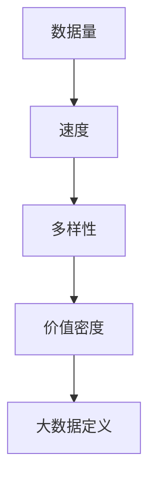
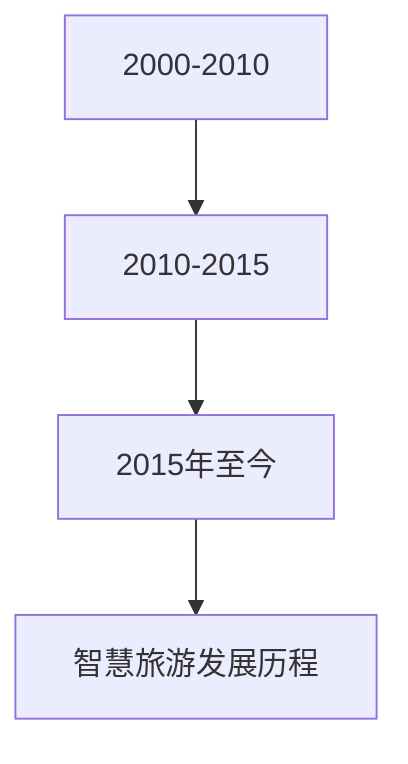
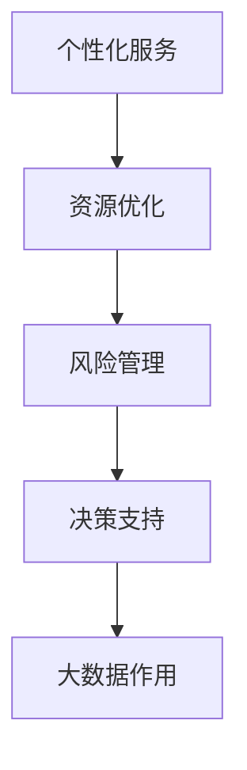

                 

### 文章标题

《大数据分析在智慧旅游个性化推荐中的创新》

### 关键词

(此处列出文章的5-7个核心关键词)

- 大数据分析
- 智慧旅游
- 个性化推荐
- 数据挖掘
- 深度学习
- 可视化技术

### 摘要

本文深入探讨了大数据分析在智慧旅游个性化推荐中的创新应用。首先，介绍了大数据和智慧旅游的基本概念及其在旅游业中的重要作用。接着，详细阐述了大数据采集与处理的流程，包括数据来源、采集技术、预处理和数据存储与管理。随后，重点分析了大数据分析与挖掘的方法和技术，如旅游行为分析、需求预测、体验优化和风险预警。在此基础上，深入探讨了大数据在个性化推荐系统中的具体应用，包括个性化推荐算法、用户画像构建与优化、旅游资源和服务的个性化推荐等。此外，还介绍了大数据可视化技术及其在旅游大数据展示中的应用。为了确保数据的安全与隐私保护，文章分析了大数据安全威胁及其应对策略。通过多个实际案例，展示了大数据技术在智慧旅游项目中的应用，并对其未来发展趋势进行了展望。本文旨在为智慧旅游领域提供大数据分析的理论基础和实践指导，促进智慧旅游的可持续发展。

### 引言

随着信息技术的飞速发展，大数据技术逐渐成为各行各业的重要支撑力量。旅游业作为世界上最大的服务行业之一，面临着巨大的数据挑战和机遇。智慧旅游（Smart Tourism）概念的提出，将大数据分析技术引入旅游行业，为个性化推荐、资源优化和风险预警提供了强有力的支持。个性化推荐是智慧旅游中最为突出的应用之一，它通过分析用户行为和偏好，为游客提供量身定制的旅游建议和服务，极大地提升了游客的满意度和旅游体验。

大数据分析在智慧旅游个性化推荐中的创新应用，不仅能够提高旅游服务的质量和效率，还能为旅游企业提供深度的数据洞察和决策支持。本文旨在深入探讨大数据分析在智慧旅游个性化推荐中的具体应用，从理论到实践进行全面阐述，帮助读者理解和掌握这一前沿技术。

文章结构如下：

1. **大数据与智慧旅游概述**：介绍大数据和智慧旅游的基本概念，以及它们在旅游业中的重要作用。
2. **大数据采集与处理**：详细阐述大数据采集与处理的流程，包括数据来源、采集技术、预处理和数据存储与管理。
3. **大数据分析与挖掘**：分析大数据分析与挖掘的方法和技术，如旅游行为分析、需求预测、体验优化和风险预警。
4. **大数据在智慧旅游个性化推荐中的应用**：探讨大数据在个性化推荐系统中的具体应用，包括个性化推荐算法、用户画像构建与优化、旅游资源和服务的个性化推荐。
5. **大数据可视化**：介绍大数据可视化技术及其在旅游大数据展示中的应用。
6. **大数据安全与隐私保护**：分析大数据安全威胁及其应对策略，以及法律法规与政策分析。
7. **大数据技术在智慧旅游项目中的应用案例**：通过实际案例展示大数据技术在智慧旅游项目中的应用。
8. **大数据技术在智慧旅游中面临的挑战与未来展望**：探讨大数据技术在智慧旅游中面临的挑战和未来发展趋势。
9. **大数据分析在智慧旅游个性化推荐中的创新**：深入分析个性化推荐系统创新方法，如深度学习在个性化推荐中的应用、多模态数据融合和智能推荐系统设计。
10. **大数据技术在智慧旅游个性化服务中的应用**：探讨个性化服务系统架构设计、个性化旅游路线推荐、住宿推荐、餐饮推荐和旅游活动推荐。
11. **大数据技术在智慧旅游中其他创新应用**：介绍智能导游系统、智能景区管理、智能旅游装备和智慧旅游平台建设方案。
12. **大数据技术在智慧旅游中的可持续发展**：讨论可持续发展理念、大数据在智慧旅游可持续发展中的应用、面临的挑战和可持续发展策略与建议。
13. **大数据技术在智慧旅游中的未来发展**：展望新技术趋势、产业链发展、产业融合、未来展望与政策建议。
14. **附录**：提供大数据技术相关工具与资源、智慧旅游大数据分析实践指南和参考文献。

通过上述结构的深入探讨，本文希望为智慧旅游领域提供全面的理论基础和实践指导，助力大数据分析在智慧旅游中的创新应用。

### 第一部分：大数据技术与智慧旅游

#### 第1章 大数据与智慧旅游概述

随着信息技术的不断进步，大数据和智慧旅游已成为旅游业发展的重要驱动力。本章将介绍大数据与智慧旅游的基本概念、发展历程及其在旅游业中的重要作用，为后续章节的内容奠定基础。

##### 1.1 大数据的定义与特征

**核心概念与联系：**

大数据（Big Data）是指无法使用传统数据处理工具在合理时间内完成处理的海量数据。根据Gartner的定义，大数据具有“4V”特征，即：

- **Volume（数据量）：** 大数据的量级通常在PB（皮字节）或EB（艾字节）级别，远远超出了传统数据库的存储和处理能力。
- **Velocity（速度）：** 大数据生成的速度非常快，需要实时或近实时处理，以提取有价值的信息。
- **Variety（多样性）：** 大数据的来源广泛，形式多样，包括结构化数据、半结构化数据和非结构化数据。
- **Value（价值密度）：** 大数据中的信息价值密度相对较低，需要通过复杂的数据处理和分析技术来提取有价值的信息。

**Mermaid 流程图：**

**数学模型和数学公式 & 详细讲解 & 举例说明：**

- **数据量计算公式：** 大数据量的计算公式可以表示为：

  $$N = 10^6 \times 10^3 = 10^{9}$$

  其中，`N` 代表大数据量，通常至少达到亿级别。

- **示例：** 假设一个旅游平台每天产生10GB的用户行为数据，每月产生的数据量计算如下：

  $$10GB/day \times 30days = 300GB/month$$

  如果考虑一年的数据量：

  $$300GB/month \times 12months = 3600GB/year$$

  转换为TB：

  $$3600GB/year \div 1000GB/TB = 3.6TB/year$$

- **速度计算公式：** 数据处理速度可以表示为：

  $$T = \frac{D}{V}$$

  其中，`T` 代表处理时间（秒），`D` 代表数据量（字节），`V` 代表处理速度（字节/秒）。

  假设一个处理速度为10MB/s的处理器，处理1GB数据所需时间为：

  $$T = \frac{1GB \times 8}{10MB/s} = 0.8s$$

- **多样性公式：** 数据多样性可以通过数据类型的比例来衡量，例如：

  $$Diversity = \frac{N_{structured} + N_{semi-structured} + N_{unstructured}}{N_{total}}$$

  其中，`N_{structured}`、`N_{semi-structured}` 和 `N_{unstructured}` 分别表示结构化数据、半结构化数据和非结构化数据的数量。

##### 1.2 智慧旅游的概念与发展

**核心概念与联系：**

智慧旅游（Smart Tourism）是指利用物联网、大数据、云计算、人工智能等现代信息技术，对旅游资源进行智能化管理和服务的旅游形式。智慧旅游的核心目标是提升旅游服务质量，优化旅游体验，实现旅游资源的合理配置和可持续发展。

智慧旅游的发展历程可以分为以下几个阶段：

1. **初期阶段（2000-2010年）：** 信息技术在旅游行业初步应用，如旅游电子商务、电子门票等。
2. **发展阶段（2010-2015年）：** 大数据、物联网和云计算技术的普及，为智慧旅游提供了技术支撑。
3. **成熟阶段（2015年至今）：** 智慧旅游逐渐普及，个性化服务和智能化管理成为主流。

**Mermaid 流程图：**

**数学模型和数学公式 & 详细讲解 & 举例说明：**

- **智慧旅游发展模型：** 智慧旅游的发展可以表示为一个综合性的函数，其影响因素包括技术进步、政策支持和市场需求。

  $$\text{智慧旅游发展} = f(\text{技术进步}, \text{政策支持}, \text{市场需求})$$

  其中，`技术进步`、`政策支持` 和 `市场需求` 分别表示智慧旅游发展的三个关键因素。

  假设技术进步的速率表示为每年增加5%，政策支持的强度表示为每两年增加10%，市场需求的变化率为每年增加3%，则智慧旅游发展的动态模型可以表示为：

  $$\text{智慧旅游发展} = 1.05^t \times 1.1^{2n} \times 1.03^t$$

  其中，`t` 表示年份，`n` 表示政策支持的周期。

  例如，在第三年（t=3，n=1），智慧旅游发展水平可以计算为：

  $$\text{智慧旅游发展} = 1.05^3 \times 1.1^2 \times 1.03^3 \approx 1.160$$

  这意味着智慧旅游发展水平在第三年相较于初始值增长了16%。

##### 1.3 大数据在智慧旅游中的作用

大数据在智慧旅游中扮演着关键角色，其应用贯穿于旅游业的各个方面。以下是大数据在智慧旅游中的主要作用：

1. **个性化服务：** 通过分析用户行为数据，大数据可以帮助旅游企业为游客提供个性化的旅游建议和服务。
2. **资源优化：** 通过大数据分析，旅游企业可以更好地了解旅游资源的需求和利用情况，从而进行资源的优化配置。
3. **风险管理：** 大数据可以用于分析旅游活动中的潜在风险，为旅游企业提供风险预警和应对策略。
4. **决策支持：** 大数据为旅游企业提供丰富的数据支持，有助于企业做出更科学的决策。

**Mermaid 流程图：**

**数学模型和数学公式 & 详细讲解 & 举例说明：**

- **个性化服务模型：** 假设个性化服务的满意度可以通过用户行为数据的分析得到，其模型可以表示为：

  $$\text{满意度} = f(\text{用户行为数据}, \text{个性化推荐算法})$$

  其中，`用户行为数据` 包括浏览历史、搜索记录、购买行为等，`个性化推荐算法` 用于分析用户行为，生成个性化的旅游建议。

  假设某个用户的行为数据经过分析后，个性化推荐算法生成了一份旅游建议，用户满意度可以通过用户对这些建议的反馈进行评估，例如：

  $$\text{满意度} = 0.9$$

  这意味着用户对个性化服务非常满意。

- **资源优化模型：** 假设旅游资源的利用率可以通过大数据分析进行优化，其模型可以表示为：

  $$\text{资源利用率} = f(\text{游客需求预测}, \text{资源分配策略})$$

  其中，`游客需求预测` 帮助旅游企业预测未来的游客流量，`资源分配策略` 用于优化资源的分配，以提高资源利用效率。

  假设某个景区通过大数据分析预测到下周的游客流量将增加20%，旅游企业可以调整资源分配策略，增加相应的服务人员、设备等，以提高景区的接待能力。

  $$\text{资源利用率} = 0.85 \times (1 + 0.2) = 0.91$$

  这意味着

