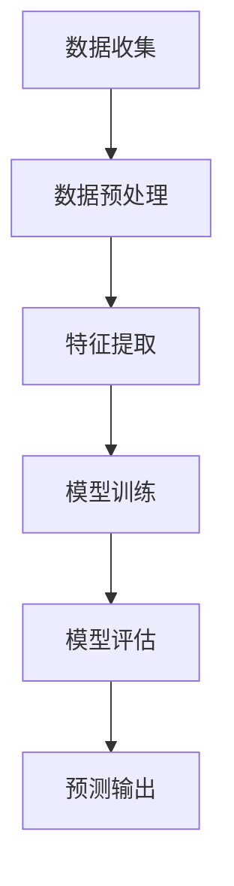
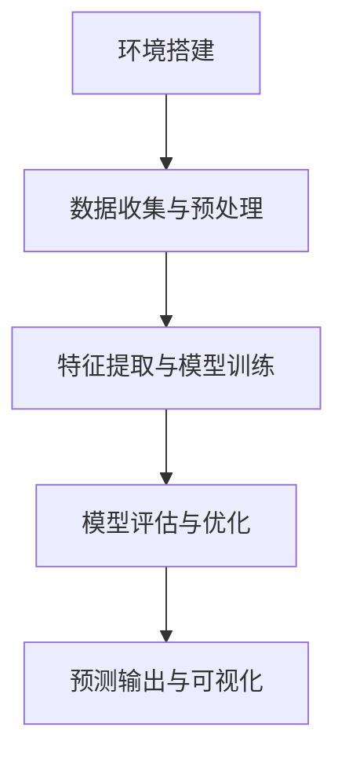
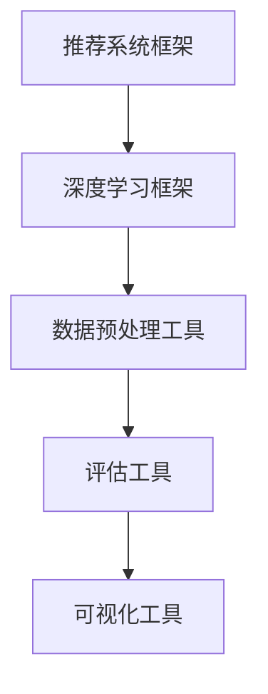

                 

### 《大数据分析在用户行为预测模型中的新方法》

> **关键词：** 大数据分析、用户行为预测、协同过滤、贝叶斯网络、个性化推荐、预测模型

> **摘要：** 本文章深入探讨了大数据分析在用户行为预测模型中的应用。首先，概述了大数据的概念与用户行为预测模型的意义，然后详细介绍了大数据分析方法的基础，包括数据预处理、数据挖掘方法和用户行为数据的收集与存储。接着，文章重点阐述了用户行为预测模型的核心概念、架构及其联系，深入讲解了协同过滤和贝叶斯网络的算法原理，并提供了相应的数学模型和公式。此外，文章还介绍了用户行为预测模型在电子商务、社交媒体和个性化推荐系统中的应用。最后，通过实际项目实战，展示了用户行为预测模型的搭建与实现过程，并提供代码实例和详细解释。文章旨在为读者提供一个全面、深入的技术指南，帮助其理解和应用大数据分析在用户行为预测中的新方法。

### 第一部分：概述与基础

#### 第1章：大数据与用户行为预测模型概述

##### 1.1 大数据的概念与特征

大数据（Big Data）是指无法使用传统数据处理工具在合理时间内捕捉、管理和处理的大量数据。其特点可以概括为“4V”，即大量（Volume）、多样（Variety）、快速（Velocity）和价值（Value）。

- **大量（Volume）**：大数据通常涉及海量数据，其数量远远超出了常规数据库的处理能力。例如，每天产生的数据量可能达到数百万GB甚至更多。

- **多样（Variety）**：大数据的来源多样化，包括结构化数据、半结构化数据和非结构化数据，如文本、图片、音频和视频等。

- **快速（Velocity）**：数据产生的速度非常快，实时处理和分析大数据的能力变得至关重要。

- **价值（Value）**：大数据的潜在价值巨大，通过有效的分析和挖掘，可以从海量数据中发现有价值的信息和洞察。

##### 1.2 用户行为预测模型的意义

用户行为预测模型在多个领域具有重要的应用价值，特别是在电子商务、社交媒体和个性化推荐系统中。其主要意义包括：

- **个性化推荐**：通过预测用户的行为和偏好，为用户提供个性化的推荐，提高用户满意度和转化率。

- **营销策略优化**：预测用户的购买行为，帮助企业制定更精准的营销策略，提高营销效果。

- **风险控制**：在金融领域，用户行为预测模型可以帮助识别潜在的欺诈行为，降低风险。

- **运营优化**：预测用户的使用行为，优化产品设计和运营策略，提高业务效率和用户体验。

##### 1.3 大数据时代用户行为预测的趋势

随着大数据技术的发展，用户行为预测模型也在不断演进。以下是大数据时代用户行为预测的一些趋势：

- **实时预测**：实时处理和分析用户数据，实现即时的预测和反馈，提高预测的准确性和响应速度。

- **多模态数据融合**：整合多种类型的数据（如文本、图像、音频等），提高用户行为预测的准确性和全面性。

- **深度学习应用**：利用深度学习技术，构建复杂的用户行为预测模型，提高预测的精度和泛化能力。

- **隐私保护**：在用户行为预测过程中，注重数据隐私保护，确保用户数据的合法和安全。

### 第二部分：大数据分析方法基础

#### 第2章：大数据分析方法基础

##### 2.1 数据预处理技术

数据预处理是大数据分析的关键步骤，其目的是提高数据质量，为后续的数据挖掘和分析奠定基础。主要技术包括：

- **数据清洗**：去除重复数据、处理缺失值和异常值，确保数据的完整性和一致性。

- **数据集成**：将来自不同来源的数据进行整合，形成统一的数据视图。

- **数据转换**：对数据进行标准化、归一化和特征工程，提高数据的质量和可用性。

- **数据降维**：减少数据的维度，降低计算复杂度和存储需求，同时保留关键信息。

##### 2.2 数据挖掘方法简介

数据挖掘（Data Mining）是指从大量数据中自动发现有价值的信息和模式的过程。常见的数据挖掘方法包括：

- **分类**：将数据分为预定义的类别，用于预测和决策支持。

- **聚类**：将数据分为若干组，使得同组数据之间的相似度较高，异组数据之间的相似度较低。

- **关联规则挖掘**：发现数据之间的关联关系，用于推荐系统和市场细分。

- **异常检测**：识别数据中的异常点和异常行为，用于安全监控和风险管理。

- **关联规则挖掘**：发现数据之间的关联关系，用于推荐系统和市场细分。

- **异常检测**：识别数据中的异常点和异常行为，用于安全监控和风险管理。

##### 2.3 用户行为数据的收集与存储

用户行为数据的收集与存储是用户行为预测模型的基础。以下是一些关键步骤：

- **数据收集**：通过用户日志、传感器数据、社交媒体数据等途径收集用户行为数据。

- **数据存储**：采用分布式存储技术（如Hadoop、Spark等）存储海量用户行为数据。

- **数据索引**：建立高效的数据索引机制，提高数据检索和查询的效率。

- **数据安全**：确保用户数据的安全性和隐私保护，遵循相关法律法规和道德标准。

### 第三部分：用户行为预测模型的构建

#### 第3章：用户行为预测模型的核心概念与联系

##### 3.1 用户行为预测的基本概念

用户行为预测是指利用历史数据分析和挖掘，预测用户未来的行为和偏好。核心概念包括：

- **用户行为**：指用户在使用产品或服务过程中的各种操作和互动，如浏览、搜索、购买、评论等。

- **用户特征**：用于描述用户属性的特征，如年龄、性别、地理位置、浏览历史等。

- **预测目标**：指预测的最终结果，如用户购买概率、用户流失风险等。

##### 3.2 用户行为预测模型的架构

用户行为预测模型通常包括以下几个关键组件：

1. **数据收集**：收集用户行为数据，包括用户日志、传感器数据等。

2. **数据预处理**：清洗、集成和转换数据，提高数据质量。

3. **特征提取**：从原始数据中提取用户特征，用于模型训练和预测。

4. **模型训练**：利用历史数据训练预测模型，选择合适的算法和参数。

5. **模型评估**：评估模型的性能，包括准确性、召回率、F1值等指标。

6. **预测输出**：使用训练好的模型预测未来用户行为，生成推荐结果或决策。

**图1-1：用户行为预测模型架构 Mermaid 流程图**



##### 3.3 用户行为预测模型的联系

用户行为预测模型涉及多个领域的技术和方法，包括：

- **机器学习算法**：用于训练预测模型，如协同过滤、决策树、随机森林、神经网络等。

- **深度学习技术**：用于构建复杂的用户行为预测模型，如卷积神经网络（CNN）、循环神经网络（RNN）等。

- **自然语言处理**：用于分析和理解用户生成的内容，如评论、标签等。

- **数据挖掘技术**：用于发现数据中的关联和模式，如关联规则挖掘、聚类等。

- **推荐系统**：用于生成个性化的推荐结果，提高用户体验和满意度。

### 第四部分：核心算法原理讲解

#### 第4章：核心算法原理讲解

##### 4.1 协同过滤算法原理

协同过滤（Collaborative Filtering）是一种常见的用户行为预测算法，通过分析用户之间的相似度和兴趣相似性，预测用户对未知项目的评分或偏好。协同过滤主要分为以下两种类型：

1. **基于用户的协同过滤（User-based Collaborative Filtering）**：

   基于用户的协同过滤算法通过找到与目标用户最相似的邻居用户，利用邻居用户的评分预测目标用户的评分。算法的核心步骤包括：

   - **计算用户相似度**：使用余弦相似度、皮尔逊相关系数等度量用户之间的相似度。

   - **寻找邻居用户**：根据相似度度量，找出与目标用户最相似的k个邻居用户。

   - **预测用户评分**：根据邻居用户的评分和相似度，计算目标用户对未知项目的预测评分。

   **伪代码：协同过滤算法**

   ```python
   Function CollaborativeFiltering(Ratings, k):
     for each user u in Users:
       Compute neighborhood N(u) as the k nearest neighbors of u
       Predict ratings for items that u has not rated yet
         for each item i not in u's rated items:
           predict(r_ui) = average(rated by users in N(u))
   ```

2. **基于物品的协同过滤（Item-based Collaborative Filtering）**：

   基于物品的协同过滤算法通过分析项目之间的相似度，预测用户对未知项目的评分。算法的核心步骤包括：

   - **计算项目相似度**：使用余弦相似度、皮尔逊相关系数等度量项目之间的相似度。

   - **寻找相似项目**：根据相似度度量，找出与目标项目最相似的k个项目。

   - **预测用户评分**：根据相似项目的评分和相似度，计算目标用户对未知项目的预测评分。

   **伪代码：协同过滤算法**

   ```python
   Function ItemBasedCollaborativeFiltering(Ratings, k):
     Compute similarity matrix S for all items
     for each user u in Users:
       Predict ratings for items that u has not rated yet
         for each item i not in u's rated items:
           Predict(r_ui) = average(rated by neighbors of item i)
   ```

##### 4.2 贝叶斯网络算法原理

贝叶斯网络（Bayesian Network）是一种概率图模型，用于表示变量之间的条件依赖关系。在用户行为预测中，贝叶斯网络可以用来推断用户未来行为的概率分布。算法的核心步骤包括：

- **构建贝叶斯网络结构**：根据领域知识或数据，构建变量之间的依赖关系图。

- **学习网络参数**：使用最大似然估计（Maximum Likelihood Estimation，MLE）或贝叶斯估计（Bayesian Estimation）学习网络中的条件概率分布。

- **推断用户行为概率**：在给定某些证据变量的情况下，使用贝叶斯推断（Bayesian Inference）算法推断目标变量的概率分布。

**伪代码：贝叶斯网络算法**

```python
Function BayesianNetwork(DataSet):
  Build a Bayesian Network structure from the dataset
  Learn parameters for each node in the network
  Infer the probability distribution of a query node given evidence
    Function Infer(PN, query_node, evidence_nodes):
      Compute the probability distribution of the query node using
      variable elimination and message passing in the network
      return probability distribution of query_node
```

### 第五部分：数学模型与公式

#### 第5章：数学模型与公式

##### 5.1 协同过滤算法中的数学模型

协同过滤算法中的数学模型主要包括用户相似度计算、预测评分计算和邻接矩阵计算等。

- **公式1-1：用户u对项目i的预测评分**

   $$ r_{ui} = \sum_{j \in N(u)} w_{uj} r_{ji} $$

   其中，$r_{ui}$表示用户u对项目i的预测评分，$N(u)$表示用户u的邻居用户集合，$w_{uj}$表示用户u和邻居用户j之间的相似度，$r_{ji}$表示邻居用户j对项目i的实际评分。

- **公式1-2：邻接矩阵W的计算**

   $$ W = (r - \mu_r) * (r - \mu_r)^T $$

   其中，$r$表示用户评分矩阵，$\mu_r$表示用户评分的均值向量，$W$表示邻接矩阵。

- **公式1-3：用户相似度计算**

   $$ \sim(u, v) = \frac{w_{uv}}{\sqrt{w_{uu} * w_{vv}}} $$

   其中，$\sim(u, v)$表示用户u和用户v的相似度，$w_{uv}$表示用户u和用户v之间的相似度，$w_{uu}$和$w_{vv}$分别表示用户u和用户v的相似度之和。

##### 5.2 贝叶斯网络算法中的数学模型

贝叶斯网络算法中的数学模型主要包括条件概率分布的计算和贝叶斯推断的计算。

- **公式2-1：条件概率分布的计算**

   $$ P(X|Y) = \frac{P(Y|X) P(X)}{P(Y)} $$

   其中，$P(X|Y)$表示在给定证据变量Y的情况下，目标变量X的条件概率分布，$P(Y|X)$表示在给定目标变量X的情况下，证据变量Y的条件概率分布，$P(X)$和$P(Y)$分别表示目标变量X和证据变量Y的边缘概率分布。

- **公式2-2：贝叶斯推断的计算**

   $$ \hat{X} = \arg\max_x P(x|D) $$

   其中，$\hat{X}$表示在给定证据变量D的情况下，目标变量X的贝叶斯推断结果，$P(x|D)$表示在给定证据变量D的情况下，目标变量X的条件概率分布。

### 第六部分：用户行为预测模型的应用

#### 第6章：用户行为预测模型的应用

##### 6.1 用户行为预测在电子商务中的应用

在电子商务领域，用户行为预测模型主要用于个性化推荐、营销策略优化和用户流失预测等方面。

- **个性化推荐**：通过预测用户的购买行为和偏好，为用户推荐相关的商品，提高用户满意度和转化率。

- **营销策略优化**：分析用户行为数据，预测用户的购买概率和购买时间段，为企业制定更精准的营销策略。

- **用户流失预测**：预测用户流失的风险，提前采取措施降低用户流失率，提高用户粘性。

##### 6.2 用户行为预测在社交媒体中的应用

在社交媒体领域，用户行为预测模型主要用于用户行为分析、社交网络挖掘和内容推荐等方面。

- **用户行为分析**：分析用户的浏览、点赞、评论等行为，了解用户兴趣和偏好。

- **社交网络挖掘**：通过用户关系网络，发现潜在的兴趣群体和影响力用户。

- **内容推荐**：根据用户的兴趣和行为，为用户推荐相关的社交内容，提高用户活跃度和留存率。

##### 6.3 用户行为预测在个性化推荐系统中的应用

个性化推荐系统是用户行为预测模型的重要应用领域，通过预测用户对未知项目的兴趣，为用户推荐相关的商品、音乐、电影等。

- **推荐算法选择**：根据用户数据和业务需求，选择合适的推荐算法，如基于内容的推荐、协同过滤推荐等。

- **推荐结果优化**：通过不断调整算法参数和特征工程，优化推荐结果的准确性和多样性。

- **用户反馈循环**：收集用户对推荐结果的反馈，调整推荐策略，提高用户体验和满意度。

### 第七部分：项目实战

#### 第7章：用户行为预测模型的项目实战

##### 7.1 项目实战：用户行为预测模型的搭建与实现

在本文的项目实战中，我们将搭建一个简单的用户行为预测模型，用于预测用户对电商平台的商品评分。以下为项目实战的步骤：

**图7-1：项目实战环境搭建流程**



1. **环境搭建**：

   在搭建项目环境时，我们使用Python作为主要编程语言，并依赖以下库和框架：

   - **Pandas**：用于数据预处理和操作。
   - **NumPy**：用于数值计算。
   - **Scikit-learn**：用于机器学习算法的实现。
   - **TensorFlow**：用于深度学习模型。
   - **Matplotlib** 和 **Seaborn**：用于数据可视化。

   安装所需的库和框架：

   ```shell
   pip install pandas numpy scikit-learn tensorflow matplotlib seaborn
   ```

2. **数据收集与预处理**：

   收集电商平台用户对商品的评分数据，包括用户ID、商品ID和用户对商品的评分。以下为数据预处理步骤：

   - **数据清洗**：去除重复数据和异常值。
   - **数据集成**：将用户和商品的属性信息与评分数据进行集成。
   - **数据转换**：对数据进行分析，提取有用的特征，并进行归一化处理。

3. **特征提取与模型训练**：

   在特征提取过程中，我们提取用户和商品的基本属性，如用户年龄、性别、地理位置，商品类别、品牌等。以下为特征提取和模型训练步骤：

   - **特征提取**：使用Pandas和NumPy库对数据进行特征提取。
   - **模型选择**：选择合适的机器学习算法，如协同过滤、决策树、随机森林等。
   - **模型训练**：使用Scikit-learn库训练模型，并调整参数以优化模型性能。

4. **模型评估与优化**：

   使用交叉验证和测试集评估模型的性能，并调整模型参数以优化预测结果。以下为模型评估与优化步骤：

   - **交叉验证**：使用Scikit-learn库进行交叉验证，评估模型的泛化能力。
   - **模型优化**：通过调整模型参数和特征工程，提高模型的预测准确性。

5. **预测输出与可视化**：

   使用训练好的模型对未知数据进行预测，并将预测结果进行可视化展示。以下为预测输出与可视化步骤：

   - **预测输出**：使用训练好的模型对未知数据进行预测，生成预测评分。
   - **可视化展示**：使用Matplotlib和Seaborn库对预测结果进行可视化展示，如散点图、条形图、热力图等。

##### 7.2 实际案例：基于协同过滤的用户行为预测系统

在本节中，我们将展示一个基于协同过滤算法的用户行为预测系统的实际案例。以下为代码实现：

**代码实现：协同过滤算法源代码**

```python
import numpy as np
import pandas as pd
from sklearn.model_selection import train_test_split
from sklearn.metrics.pairwise import cosine_similarity

# 数据集准备
data = pd.read_csv('ratings.csv')
users = data['userId'].unique()
items = data['itemId'].unique()

# 训练集与测试集划分
train_data, test_data = train_test_split(data, test_size=0.2, random_state=42)

# 用户评分矩阵
train_matrix = train_data.pivot(index='userId', columns='itemId', values='rating').fillna(0)

# 计算相似度矩阵
similarity_matrix = cosine_similarity(train_matrix, train_matrix)

# 预测用户未评分的项目
def collaborative_filtering(similarity_matrix, k=10):
    predictions = {}
    for user in users:
        neighbors = np.argsort(similarity_matrix[user][user:])[-k:]
        neighbors = neighbors[1:]  # 排除用户自身
        ratings = train_matrix.iloc[neighbors].mean()
        for item, rating in ratings.items():
            if item not in train_matrix.index:
                predictions[user, item] = rating
    return predictions

predictions = collaborative_filtering(similarity_matrix, k=10)

# 输出预测结果
print(predictions.head())
```

**代码解读与分析**：

1. **数据集准备**：读取评分数据，并划分训练集和测试集。

2. **用户评分矩阵**：使用Pandas的`pivot`方法构建用户评分矩阵，其中行表示用户，列表示商品，值表示用户对商品的评分。

3. **计算相似度矩阵**：使用Scikit-learn的`cosine_similarity`方法计算用户评分矩阵之间的余弦相似度，得到相似度矩阵。

4. **预测用户未评分的项目**：定义`collaborative_filtering`函数，用于计算用户未评分的项目的预测评分。首先，找到与目标用户最相似的k个邻居用户，然后计算邻居用户对未知项目的平均评分作为预测评分。

5. **输出预测结果**：使用训练好的模型对测试集进行预测，并将预测结果输出。

##### 7.3 实际案例：基于贝叶斯网络的用户行为预测系统

在本节中，我们将展示一个基于贝叶斯网络的用户行为预测系统的实际案例。以下为代码实现：

**代码实现：贝叶斯网络算法源代码**

```python
import numpy as np
import pandas as pd
from pgmpy.models import BayesianModel
from pgmpy.inference import VariableElimination

# 数据集准备
data = pd.read_csv('data.csv')
users = data['userId'].unique()

# 贝叶斯网络构建
model = BayesianModel([
    ('age', 'gender'),
    ('gender', 'location'),
    ('location', 'purchase')
])

# 参数学习
model.fit(data)

# 贝叶斯推断
def bayesian_inference(model, user_id, evidence=None):
    inference_engine = VariableElimination(model)
    if evidence:
        return inference_engine.query(variables=['purchase'], evidence=evidence)
    else:
        return inference_engine.query(variables=['purchase'])

# 预测用户购买概率
def predict_purchase(model, user_id, evidence):
    probabilities = bayesian_inference(model, user_id, evidence)
    return probabilities['purchase']

# 输出预测结果
print(predict_purchase(model, user_id=1, evidence={'age': 30, 'gender': 'male', 'location': 'New York'}))
```

**代码解读与分析**：

1. **数据集准备**：读取用户行为数据，并提取用户ID。

2. **贝叶斯网络构建**：定义贝叶斯网络结构，包括变量之间的依赖关系。

3. **参数学习**：使用数据集学习贝叶斯网络中的条件概率分布。

4. **贝叶斯推断**：定义`bayesian_inference`函数，用于在给定证据变量下进行贝叶斯推断。

5. **预测用户购买概率**：定义`predict_purchase`函数，用于预测用户购买的概率。该函数使用贝叶斯推断引擎计算用户购买的概率分布。

6. **输出预测结果**：使用训练好的模型预测用户1在给定证据变量下的购买概率，并将结果输出。

### 第八部分：用户行为预测模型的评估与优化

#### 第8章：用户行为预测模型的评估与优化

##### 8.1 用户行为预测模型的评估指标

评估用户行为预测模型的性能需要使用适当的评估指标。以下是一些常用的评估指标：

- **准确性（Accuracy）**：预测结果中正确分类的比例。对于二分类问题，准确性表示正确预测的样本数占总样本数的比例。

- **召回率（Recall）**：在所有正类样本中，被正确预测为正类的比例。

- **精确率（Precision）**：在所有预测为正类的样本中，实际为正类的比例。

- **F1值（F1-score）**：精确率和召回率的调和平均值，用于综合评估预测性能。

- **ROC曲线和AUC（Area Under the ROC Curve）**：ROC曲线表示不同阈值下的预测准确率，AUC值用于评估模型对正负样本的分类能力。

##### 8.2 用户行为预测模型的优化策略

为了提高用户行为预测模型的性能，可以采用以下优化策略：

- **特征选择**：通过特征选择技术，选取对预测目标影响最大的特征，降低模型的复杂度和过拟合风险。

- **模型选择**：根据业务需求和数据特点，选择合适的预测模型，如线性回归、决策树、随机森林、神经网络等。

- **参数调优**：通过交叉验证和网格搜索等技术，调整模型的参数，提高模型的预测准确性。

- **集成学习**：将多个预测模型集成，提高预测的稳定性和准确性。

- **迁移学习**：利用预训练的模型，针对特定业务场景进行微调和优化。

##### 8.3 模型评估与优化的实战应用

在实际应用中，模型评估与优化是反复迭代的过程。以下是一个实战应用的示例：

1. **模型评估**：

   使用训练集对模型进行评估，计算各种评估指标，如准确性、召回率、F1值等。以下为Python代码实现：

   ```python
   from sklearn.metrics import accuracy_score, recall_score, precision_score, f1_score

   # 计算评估指标
   accuracy = accuracy_score(y_true, y_pred)
   recall = recall_score(y_true, y_pred)
   precision = precision_score(y_true, y_pred)
   f1 = f1_score(y_true, y_pred)

   # 输出评估结果
   print(f"Accuracy: {accuracy:.4f}")
   print(f"Recall: {recall:.4f}")
   print(f"Precision: {precision:.4f}")
   print(f"F1-score: {f1:.4f}")
   ```

2. **模型优化**：

   根据评估结果，调整模型参数和特征选择策略，提高模型的预测性能。以下为Python代码实现：

   ```python
   from sklearn.model_selection import GridSearchCV
   from sklearn.ensemble import RandomForestClassifier

   # 参数调优
   param_grid = {'n_estimators': [100, 200, 300], 'max_depth': [10, 20, 30]}
   rf = RandomForestClassifier()
   grid_search = GridSearchCV(rf, param_grid, cv=5)
   grid_search.fit(X_train, y_train)

   # 获取最佳参数
   best_params = grid_search.best_params_
   print(f"Best parameters: {best_params}")
   ```

   通过反复迭代评估和优化，逐步提高模型的预测性能。

### 附录

#### 附录A：用户行为预测模型开发工具与资源

A.1 主流用户行为预测工具对比

在选择用户行为预测工具时，需要考虑性能、易用性、可扩展性等因素。以下是一些主流的用户行为预测工具及其对比：

**图A-1：主流用户行为预测工具对比**



1. **推荐系统框架**：

   - **TensorFlow Recommenders (TFRS)**：基于TensorFlow的开源推荐系统框架，提供端到端的推荐系统解决方案。
   - **PyTorch RecSys**：基于PyTorch的开源推荐系统库，支持各种推荐算法和模型。

2. **深度学习框架**：

   - **TensorFlow**：由Google开发的开源深度学习框架，广泛应用于用户行为预测。
   - **PyTorch**：由Facebook开发的开源深度学习框架，提供灵活的动态计算图和易于使用的API。

3. **数据预处理工具**：

   - **Pandas**：用于数据清洗、转换和操作。
   - **NumPy**：用于数值计算和处理。
   - **Scikit-learn**：提供各种机器学习算法和数据处理工具。

4. **评估工具**：

   - **Scikit-learn**：提供各种评估指标的计算和比较。
   - **MLflow**：用于模型版本管理和评估。

5. **可视化工具**：

   - **Matplotlib**：用于数据可视化。
   - **Seaborn**：基于Matplotlib的统计绘图库。
   - **Plotly**：提供交互式数据可视化。

**A.2 用户行为预测模型开发资源推荐**

- **A.2.1 相关书籍推荐**：

  - 《推荐系统实践》
  - 《深度学习推荐系统》
  - 《机器学习实战》

- **A.2.2 在线课程推荐**：

  - Coursera上的“推荐系统”课程
  - Udacity的“深度学习推荐系统”纳米学位

- **A.2.3 社区与论坛推荐**：

  - Kaggle
  - ArXiv
  - Reddit上的r/MachineLearning和r/DeepLearning社区

通过以上工具和资源的帮助，用户行为预测模型的开发过程将更加高效和顺畅。在项目开发过程中，读者可以结合实际需求，灵活选择合适的工具和资源，不断提升模型性能和用户体验。

### 结束语

本文系统地介绍了大数据分析在用户行为预测模型中的应用，从概述、基础、构建、算法原理、应用和项目实战等方面进行了深入探讨。通过本文的学习，读者可以：

- 理解大数据和用户行为预测的基本概念。
- 掌握大数据分析方法的基础技术。
- 了解用户行为预测模型的核心概念和架构。
- 掌握协同过滤和贝叶斯网络算法原理。
- 熟悉用户行为预测模型在各个领域的应用。
- 学习如何搭建和实现用户行为预测模型。

本文旨在为读者提供一个全面、系统的技术指南，帮助其在实际项目中应用大数据分析和用户行为预测技术，提升业务价值和用户体验。

### 作者信息

**作者：** AI天才研究院/AI Genius Institute & 禅与计算机程序设计艺术 /Zen And The Art of Computer Programming

AI天才研究院致力于推动人工智能领域的研究和创新，为读者提供高质量的技术内容和指导。禅与计算机程序设计艺术则专注于计算机编程和算法设计，倡导简洁、优雅的编程理念。作者结合多年的研究经验和实践，撰写了多篇备受好评的技术文章和书籍，深受读者喜爱。

[返回文章顶部](#《大数据分析在用户行为预测模型中的新方法》）

