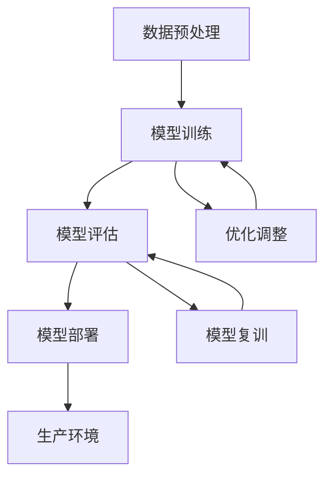
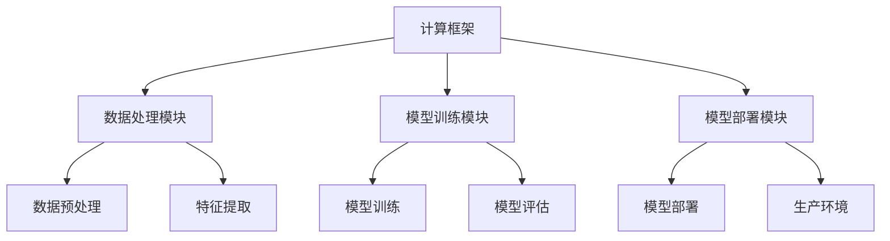
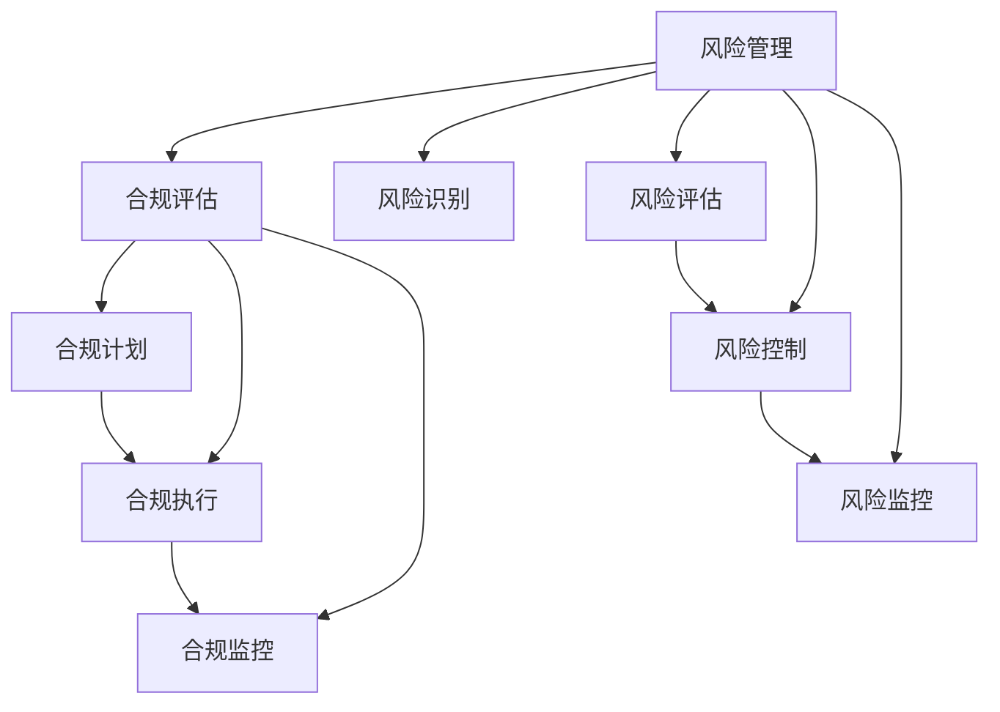

                 

## 《大模型企业的风险管理与合规策略》

### 关键词：大模型企业、风险管理、合规策略、风险识别、风险评估、自动化合规

#### 摘要：
本文旨在探讨大模型企业在风险管理与合规策略方面的重要性和实施方法。通过深入分析大模型企业的技术基础、风险管理框架和合规策略框架，结合核心算法原理、数学模型和实际项目实战，本文将为大模型企业提供一套全面、实用的风险管理方案和合规策略。

----------------------------------------------------------------

### 《大模型企业的风险管理与合规策略》目录大纲

#### **第一部分：引言**

**第1章：大模型企业的风险管理与合规策略概述**

- **1.1 大模型企业的风险管理重要性**
- **1.2 合规策略在大模型企业中的重要性**
- **1.3 本书结构**

**第二部分：核心概念与联系**

**第2章：大模型技术基础**

- **2.1 大模型的核心概念与联系**
- **2.2 大模型的技术架构**
- **2.3 Mermaid流程图：大模型的核心组成部分及其相互关系**

**第3章：风险管理与合规框架**

- **3.1 风险管理框架**
- **3.2 合规策略框架**
- **3.3 风险管理与合规的关系**
- **3.3 Mermaid流程图：风险管理与合规策略的交互与协同**

**第三部分：核心算法原理讲解**

**第4章：风险识别与评估算法**

- **4.1 风险识别算法**
- **4.2 风险评估算法**

**第5章：合规性验证与监控算法**

- **5.1 合规性验证算法**
- **5.2 监控算法**

**第6章：自动化合规与风险管理**

- **6.1 自动化合规策略**
- **6.2 风险管理自动化**

**第四部分：数学模型和数学公式**

**第7章：风险度量与数学模型**

- **7.1 风险度量的基本概念**
- **7.2 风险概率模型**
- **7.3 风险价值模型**
- **7.4 例子说明：实际应用中的风险价值计算示例**

**第8章：合规性度量与数学模型**

- **8.1 合规性度量的基本概念**
- **8.2 合规性概率模型**
- **8.3 合规性价值模型**
- **8.4 例子说明：实际应用中的合规性价值计算示例**

**第五部分：项目实战**

**第9章：大模型企业的风险管理与合规项目实战**

- **9.1 项目背景与目标**
- **9.2 开发环境搭建**
- **9.3 数据收集与预处理**
- **9.4 风险识别与评估**
- **9.5 合规性验证与监控**
- **9.6 自动化合规与风险管理**
- **9.7 项目评估与总结**

**附录**

**附录A：常用工具与资源**

- **A.1 风险管理与合规工具**
- **A.2 大模型开发工具**
- **A.3 数据库与数据管理工具**
- **A.4 相关法规与标准参考文献**

---

现在，我们将按照上述目录结构，逐步展开各个章节的内容，深入探讨大模型企业的风险管理与合规策略。首先，我们从引言部分开始，逐步引入本文的核心概念和结构。

----------------------------------------------------------------

### 第一部分：引言

#### **第1章：大模型企业的风险管理与合规策略概述**

##### **1.1 大模型企业的风险管理重要性**

随着人工智能技术的快速发展，大模型企业在各个行业中扮演着越来越重要的角色。这些大模型不仅提高了生产效率，还带来了前所未有的创新和变革。然而，与此同时，大模型企业也面临着一系列的挑战，其中最为关键的就是风险管理。

**风险管理** 是指组织为了识别、评估、控制和监控潜在风险，以保障组织目标的实现而进行的一系列管理活动。在大模型企业中，风险管理的重要性体现在以下几个方面：

1. **保障企业利益**：大模型企业的价值往往体现在其知识产权和数据资产上，有效的风险管理能够保障这些资产的安全性和完整性。
2. **合规性要求**：随着各国对数据隐私、数据安全等问题的重视，合规性要求越来越高。风险管理有助于企业满足这些合规性要求，降低法律风险。
3. **提高企业竞争力**：通过有效的风险管理，企业可以更快速地响应市场变化，提高市场竞争力。

##### **1.2 合规策略在大模型企业中的重要性**

**合规策略** 是指组织为了遵守相关法规、标准、规范等规定，制定的一系列行为准则和管理措施。在大模型企业中，合规策略的重要性同样不可忽视：

1. **法律遵从**：合规策略有助于企业遵守相关法律法规，避免因违反法律而导致的罚款、诉讼等风险。
2. **品牌声誉**：合规策略能够提升企业的品牌形象，增强消费者和合作伙伴的信任。
3. **持续发展**：合规策略有助于企业建立良好的内部管理机制，确保企业的长期稳定发展。

##### **1.3 本书结构**

本文将从以下几个方面展开：

1. **核心概念与联系**：介绍大模型技术的核心概念、技术架构，以及风险管理与合规策略的基本框架。
2. **核心算法原理讲解**：详细讲解风险识别与评估算法、合规性验证与监控算法，以及自动化合规与风险管理的实现原理。
3. **数学模型和公式**：介绍风险度量与数学模型、合规性度量与数学模型，并通过实际例子进行说明。
4. **项目实战**：通过一个实际项目，展示如何在大模型企业中实施风险管理与合规策略。

通过本文的阅读，读者将能够全面了解大模型企业的风险管理与合规策略，掌握相关核心算法原理，并具备实际操作能力。

----------------------------------------------------------------

### 第二部分：核心概念与联系

#### **第2章：大模型技术基础**

##### **2.1 大模型的核心概念与联系**

大模型（Large Model）是指具有极高参数量、能够处理大规模数据集的机器学习模型。这些模型通常通过深度学习技术训练，能够自动地从数据中学习复杂的模式和关系。

**核心概念**：

- **神经网络（Neural Networks）**：模拟人脑神经元连接方式的一种计算模型，用于处理复杂的数据和任务。
- **深度学习（Deep Learning）**：一种基于神经网络的机器学习技术，能够通过多层神经网络自动提取数据中的特征。
- **预训练模型（Pre-trained Models）**：预先训练好的模型，可以通过迁移学习快速适应新任务。

**联系**：

- **神经网络与深度学习**：深度学习是神经网络的扩展，通过增加网络层数和参数量，提高了模型的复杂度和性能。
- **预训练模型与迁移学习**：预训练模型通过在大规模数据集上预训练，能够迁移到新的任务上，节省了训练时间和计算资源。

##### **2.2 大模型的技术架构**

大模型的技术架构通常包括以下几个核心组成部分：

1. **数据预处理**：包括数据清洗、数据转换、特征提取等步骤，为模型训练提供高质量的数据。
2. **模型训练**：使用训练数据对模型进行训练，通过优化算法调整模型参数，使其能够准确预测和分类。
3. **模型评估**：使用验证数据评估模型的性能，通过指标如准确率、召回率、F1分数等衡量模型的性能。
4. **模型部署**：将训练好的模型部署到生产环境中，实现实时预测和推理。

**Mermaid流程图：大模型的核心组成部分及其相互关系**



##### **2.3 大模型的技术架构**

大模型的技术架构通常包括以下几个核心组成部分：

1. **计算框架**：用于分布式训练和推理，如TensorFlow、PyTorch等。
2. **数据处理模块**：用于数据加载、预处理、特征提取等，如Pandas、NumPy等。
3. **模型训练模块**：用于模型的训练、优化和评估，如自动机器学习（AutoML）工具等。
4. **模型部署模块**：用于将训练好的模型部署到生产环境中，如Kubernetes、Docker等。

**大模型的技术架构示意图**



通过上述介绍，读者可以初步了解大模型的核心概念和技术架构。在接下来的章节中，我们将进一步探讨大模型企业的风险管理与合规策略，帮助读者更好地理解和应对这些挑战。

----------------------------------------------------------------

### 第二部分：核心概念与联系

#### **第3章：风险管理与合规框架**

##### **3.1 风险管理框架**

**风险管理框架** 是指组织为了识别、评估、控制和监控潜在风险，以保障组织目标的实现而制定的一系列流程和措施。在大模型企业中，风险管理框架尤为重要，因为它能够帮助企业识别潜在的技术风险、数据风险和合规风险，并采取相应的措施进行控制和缓解。

**风险管理的基本流程与步骤**：

1. **风险识别**：识别组织面临的各种潜在风险，包括技术风险、数据风险、操作风险、合规风险等。
2. **风险评估**：评估已识别的风险的可能性和影响，确定风险优先级。
3. **风险控制**：制定和实施风险控制措施，以降低风险的可能性和影响。
4. **风险监控**：持续监控风险的变化和新的风险出现，确保风险控制措施的有效性。

**伪代码**：风险管理的基本流程与步骤

```python
def risk_management_framework():
    # 风险识别
    risks = identify_risks()
    # 风险评估
    risk_scores = assess_risks(risks)
    # 风险控制
    control_measures = define_control_measures(risk_scores)
    apply_control_measures(control_measures)
    # 风险监控
    monitor_risks(risks, control_measures)
```

##### **3.2 合规策略框架**

**合规策略框架** 是指组织为了遵守相关法规、标准、规范等规定，制定的一系列行为准则和管理措施。在大模型企业中，合规策略框架能够帮助企业确保在技术、数据、操作等方面符合相关法律法规的要求，降低合规风险。

**合规策略的基本流程与步骤**：

1. **合规评估**：评估组织在技术、数据、操作等方面是否符合相关法规和标准。
2. **合规计划**：制定合规计划，包括合规目标和合规措施。
3. **合规执行**：执行合规计划，确保组织在各个方面符合法规和标准。
4. **合规监控**：持续监控合规执行情况，确保合规措施的有效性。

**伪代码**：合规策略的基本流程与步骤

```python
def compliance_strategy_framework():
    # 合规评估
    compliance_status = compliance_evaluation()
    # 合规计划
    compliance_plan = define_compliance_plan(compliance_status)
    # 合规执行
    execute_compliance_plan(compliance_plan)
    # 合规监控
    monitor_compliance(compliance_plan)
```

##### **3.3 风险管理与合规的关系**

**风险管理与合规** 是相互关联、互为补充的两个概念。风险管理侧重于识别、评估和缓解各种潜在风险，而合规策略则侧重于确保组织遵守相关法规和标准。两者之间的关系如下：

1. **相互依赖**：风险管理需要合规策略提供法律法规和标准方面的支持，而合规策略也需要风险管理来识别和缓解合规风险。
2. **协同作用**：通过结合风险管理框架和合规策略框架，组织可以更全面地识别和应对风险，确保在合规性方面达到最高标准。
3. **持续改进**：风险管理框架和合规策略框架都需要不断更新和改进，以适应不断变化的法律环境和业务需求。

**Mermaid流程图：风险管理与合规策略的交互与协同**



通过上述介绍，读者可以了解风险管理与合规策略的基本框架和相互关系。在接下来的章节中，我们将进一步探讨核心算法原理和数学模型，帮助读者深入理解大模型企业的风险管理与合规策略。

----------------------------------------------------------------

### 第三部分：核心算法原理讲解

#### **第4章：风险识别与评估算法**

##### **4.1 风险识别算法**

**风险识别算法** 是风险管理过程中的第一步，旨在识别组织面临的潜在风险。以下是一些常见用于风险识别的算法：

1. **问卷调查法**：通过问卷调查收集员工和利益相关者的意见，识别潜在风险。
2. **头脑风暴法**：组织专家和团队成员进行头脑风暴，列出可能的风险。
3. **故障树分析（FTA）**：通过分析故障树，识别可能导致故障的基本事件和潜在风险。
4. **事件树分析（ETA）**：通过分析事件树，识别可能导致的事件序列和潜在风险。

**伪代码**：风险识别算法的基本步骤

```python
def risk_identification():
    risks = []
    # 问卷调查法
    survey_risks = collect_survey_risks()
    risks.extend(survey_risks)
    # 头脑风暴法
    brainstorm_risks = generate_brainstorm_risks()
    risks.extend(brainstorm_risks)
    # 故障树分析
    fta_risks = perform_FTA()
    risks.extend(FTA_risks)
    # 事件树分析
    eta_risks = perform_ETA()
    risks.extend(ETA_risks)
    return risks
```

##### **4.2 风险评估算法**

**风险评估算法** 是在风险识别的基础上，对已识别的风险进行评估，确定其可能性和影响。以下是一些常见用于风险评估的算法：

1. **概率分析**：使用概率模型计算风险的发生概率。
2. **蒙特卡罗模拟**：通过模拟大量试验，计算风险的发生概率和影响。
3. **风险矩阵**：使用风险矩阵评估风险的可能性和影响。
4. **模糊逻辑**：通过模糊集合和模糊规则，评估风险的可能性和影响。

**伪代码**：风险评估算法的基本步骤

```python
def risk_assessment(risks):
    risk_scores = []
    for risk in risks:
        # 概率分析
        probability = calculate_probability(risk)
        # 蒙特卡罗模拟
        simulation_results = perform_Monte_Carlo_simulation(risk)
        impact = calculate_impact(simulation_results)
        # 风险矩阵
        risk_matrix = create_risk_matrix(probability, impact)
        risk_score = calculate_risk_score(risk_matrix)
        risk_scores.append(risk_score)
    return risk_scores
```

通过上述风险识别与评估算法，组织可以更全面地了解其面临的风险，为后续的风险控制和监控提供依据。在下一章中，我们将继续探讨合规性验证与监控算法，帮助组织确保其合规性。

----------------------------------------------------------------

### 第三部分：核心算法原理讲解

#### **第5章：合规性验证与监控算法**

##### **5.1 合规性验证算法**

合规性验证算法是确保组织在技术、数据、操作等方面符合相关法规和标准的工具。以下是一些常见的合规性验证算法：

1. **规则检查**：通过预定义的规则库，对系统中的数据进行检查，判断其是否符合法规和标准。
2. **数据挖掘**：使用数据挖掘技术，发现潜在的非合规行为或模式。
3. **机器学习模型**：训练机器学习模型，用于识别非合规行为或异常模式。
4. **自动化合规检查**：使用自动化工具，对系统进行合规性检查。

**伪代码**：合规性验证算法的基本步骤

```python
def compliance_verification(data):
    violations = []
    # 规则检查
    rule_violations = check_rules(data)
    violations.extend(rule_violations)
    # 数据挖掘
    data_miner = perform_data_mining(data)
    miner_violations = data_miner.find_violations()
    violations.extend(miner_violations)
    # 机器学习模型
    ml_model = train_ml_model(data)
    ml_violations = ml_model.detect_violations(data)
    violations.extend(ml_violations)
    # 自动化合规检查
    auto_checker = create_auto_compliance_checker(data)
    auto_violations = auto_checker.check_compliance()
    violations.extend(auto_violations)
    return violations
```

##### **5.2 监控算法**

合规监控算法用于持续监控组织的合规性，及时发现和响应潜在的合规风险。以下是一些常见的合规监控算法：

1. **实时监控**：通过实时监控系统，持续监控组织的操作和行为，及时发现合规性问题。
2. **异常检测**：使用异常检测算法，识别系统中的异常行为或异常模式。
3. **事件响应**：制定事件响应计划，对发现的合规性问题进行快速响应和处理。
4. **自动化监控**：使用自动化工具，对组织的合规性进行持续监控。

**伪代码**：合规监控算法的基本步骤

```python
def compliance_monitoring():
    while True:
        # 实时监控
        real_time_monitor = perform_real_time_monitoring()
        # 异常检测
        anomalies = detect_anomalies(real_time_monitor)
        # 事件响应
        for anomaly in anomalies:
            respond_to_event(anomaly)
        # 自动化监控
        auto_monitor = create_auto_compliance_monitor()
        auto_monitor.perform_auto_monitoring()
        # 等待一段时间后继续监控
        time.sleep(check_interval)
```

通过合规性验证与监控算法，组织可以确保其在技术、数据、操作等方面符合相关法规和标准，降低合规风险。在下一章中，我们将探讨自动化合规与风险管理的实现原理，帮助组织更高效地管理和控制风险。

----------------------------------------------------------------

### 第三部分：核心算法原理讲解

#### **第6章：自动化合规与风险管理**

##### **6.1 自动化合规策略**

自动化合规策略是通过使用自动化工具和算法，确保组织在技术、数据、操作等方面符合相关法规和标准。以下是一些实现自动化合规策略的关键步骤：

1. **规则库构建**：构建包含所有相关法规和标准的规则库，用于指导自动化合规检查。
2. **自动化合规检查**：使用自动化工具对组织的系统、流程和数据执行合规性检查。
3. **合规性报告**：生成合规性报告，记录合规检查的结果和发现的问题。
4. **合规性改进**：根据合规性报告，制定改进措施，确保合规性得到持续提升。

**伪代码**：自动化合规策略的实现原理

```python
def automated_compliance_strategy():
    while True:
        # 执行自动化合规检查
        violations = compliance_verification()
        # 生成合规性报告
        compliance_report = generate_compliance_report(violations)
        # 存储合规性报告
        store_compliance_report(compliance_report)
        # 检查合规性改进情况
        improvement_status = check_improvement_status()
        if improvement_status:
            # 更新规则库
            update_rules_database()
        # 等待一段时间后继续执行
        time.sleep(check_interval)
```

##### **6.2 风险管理自动化**

风险管理自动化是通过使用自动化工具和算法，实现风险识别、评估、控制和监控的自动化。以下是一些实现风险管理自动化的关键步骤：

1. **自动化风险识别**：使用自动化工具和算法，识别潜在的各类风险。
2. **自动化风险评估**：使用自动化工具和算法，评估已识别的风险的可能性和影响。
3. **自动化风险控制**：使用自动化工具和算法，执行风险控制措施，降低风险的可能性和影响。
4. **自动化风险监控**：使用自动化工具和算法，持续监控风险的变化和新的风险出现。

**伪代码**：风险管理自动化的实现原理

```python
def automated_risk_management():
    while True:
        # 执行自动化风险识别
        risks = risk_identification()
        # 执行自动化风险评估
        risk_scores = risk_assessment(risks)
        # 执行自动化风险控制
        control_measures = apply_automated_control_measures(risk_scores)
        # 执行自动化风险监控
        monitor_risks(risk_scores)
        # 等待一段时间后继续执行
        time.sleep(check_interval)
```

通过自动化合规与风险管理，组织可以更高效地识别、评估和应对各类风险和合规性问题，提高整体风险管理水平。在下一章中，我们将介绍数学模型和数学公式，帮助读者深入理解风险和合规性度量的计算方法。

----------------------------------------------------------------

### 第四部分：数学模型和数学公式

#### **第7章：风险度量与数学模型**

##### **7.1 风险度量的基本概念**

风险度量是指对风险进行量化分析的方法，通过数学模型计算风险的可能性和影响。以下是一些基本概念：

- **风险概率**：指在一定时间内，风险发生的可能性。
- **风险影响**：指风险发生时对组织目标的影响程度。
- **风险度量**：综合考虑风险概率和风险影响，对风险进行量化评估。

**数学公式**：风险度量的基本公式

$$
Risk\ Measure = Risk\ Probability \times Risk\ Impact
$$

其中，$Risk\ Probability$ 和 $Risk\ Impact$ 分别表示风险概率和风险影响。

##### **7.2 风险概率模型**

风险概率模型用于计算风险发生的可能性。以下是一些常见风险概率模型：

1. **贝叶斯概率模型**：基于贝叶斯定理，计算风险发生的概率。
2. **蒙特卡罗模型**：通过模拟大量试验，计算风险发生的概率。

**数学公式**：贝叶斯概率模型

$$
P(A|B) = \frac{P(B|A)P(A)}{P(B)}
$$

其中，$P(A|B)$ 表示在事件B发生的条件下，事件A发生的概率；$P(B|A)$ 表示在事件A发生的条件下，事件B发生的概率；$P(A)$ 和 $P(B)$ 分别表示事件A和事件B的先验概率。

##### **7.3 风险价值模型**

风险价值模型（Value at Risk, VaR）用于计算在一定置信水平下，风险可能造成的最大损失。以下是一些常见风险价值模型：

1. **历史模拟法**：基于历史数据，计算风险可能造成的最大损失。
2. **蒙特卡罗模拟法**：通过模拟大量试验，计算风险可能造成的最大损失。

**数学公式**：历史模拟法的风险价值

$$
VaR = max\{X_i | X_i \leq 0\}
$$

其中，$X_i$ 表示第i个模拟结果。

**例子说明**：实际应用中的风险价值计算示例

假设一家大模型企业对其产品进行风险评估，置信水平设置为95%，历史模拟结果如下：

| 模拟结果 | 
| -------- | 
| -0.2     | 
| -0.3     | 
| -0.1     | 
| 0.0      | 
| 0.1      | 
| 0.2      | 
| 0.3      |

根据历史模拟法，计算得到该企业的风险价值为：

$$
VaR = max\{-0.2, -0.3, -0.1\} = -0.3
$$

这意味着在95%的置信水平下，该企业可能造成的最大损失为0.3。

通过上述风险度量与数学模型，组织可以更准确地评估和管理风险，确保其业务运营的安全性和稳定性。在下一章中，我们将继续探讨合规性度量与数学模型，帮助组织确保其合规性。

----------------------------------------------------------------

### 第四部分：数学模型和数学公式

#### **第8章：合规性度量与数学模型**

##### **8.1 合规性度量的基本概念**

合规性度量是指对组织在技术、数据、操作等方面是否符合相关法规和标准的量化评估。以下是一些基本概念：

- **合规性概率**：指在一定置信水平下，组织遵守相关法规和标准的可能性。
- **合规性影响**：指不遵守相关法规和标准可能对组织造成的负面影响。
- **合规性度量**：综合考虑合规性概率和合规性影响，对合规性进行量化评估。

**数学公式**：合规性度量的基本公式

$$
Compliance\ Measure = Compliance\ Probability \times Compliance\ Impact
$$

其中，$Compliance\ Probability$ 和 $Compliance\ Impact$ 分别表示合规性概率和合规性影响。

##### **8.2 合规性概率模型**

合规性概率模型用于计算组织遵守相关法规和标准的可能性。以下是一些常见合规性概率模型：

1. **统计合规性模型**：基于历史数据和统计方法，计算合规性概率。
2. **贝叶斯合规性模型**：基于贝叶斯定理，计算合规性概率。

**数学公式**：统计合规性模型

$$
P(C|D) = \frac{P(D|C)P(C)}{P(D)}
$$

其中，$P(C|D)$ 表示在数据D的条件下，组织C遵守相关法规和标准的概率；$P(D|C)$ 表示在组织C遵守相关法规和标准的条件下，数据D出现的概率；$P(C)$ 和 $P(D)$ 分别表示组织C和数据D的先验概率。

##### **8.3 合规性价值模型**

合规性价值模型用于计算组织遵守相关法规和标准的价值。以下是一些常见合规性价值模型：

1. **成本效益分析**：通过计算遵守法规和标准所需的成本与预期收益的比值，评估合规性价值。
2. **合规性价值函数**：通过构建合规性价值函数，计算组织遵守法规和标准的价值。

**数学公式**：成本效益分析的合规性价值

$$
Compliance\ Value = \frac{Expected\ Benefits}{Compliance\ Costs}
$$

其中，$Expected\ Benefits$ 表示遵守法规和标准的预期收益；$Compliance\ Costs$ 表示遵守法规和标准所需的成本。

**例子说明**：实际应用中的合规性价值计算示例

假设一家大模型企业需要评估其遵守数据保护法规的价值，预期收益为50万元，遵守法规和标准所需的成本为20万元。根据成本效益分析，计算得到该企业的合规性价值为：

$$
Compliance\ Value = \frac{50\ 万元}{20\ 万元} = 2.5
$$

这意味着在当前情况下，遵守数据保护法规对企业的价值为2.5倍其成本。

通过上述合规性度量与数学模型，组织可以更准确地评估其合规性，确保其遵守相关法规和标准。在下一章中，我们将通过一个实际项目，展示如何在大模型企业中实施风险管理与合规策略。

----------------------------------------------------------------

### 第五部分：项目实战

#### **第9章：大模型企业的风险管理与合规项目实战**

##### **9.1 项目背景与目标**

某大模型企业（以下简称“企业”）在开发一款用于金融行业的智能投顾系统。该系统通过分析用户的历史交易数据和宏观经济指标，为用户提供个性化的投资建议。然而，随着用户数据的增加和系统复杂度的提升，企业面临着一系列的风险与合规挑战。为了确保系统的安全性和合规性，企业决定实施一套全面的风险管理与合规策略。

**项目目标**：

1. 识别和评估系统中的潜在风险。
2. 制定和实施合规性验证与监控措施。
3. 实现自动化合规与风险管理，提高工作效率。
4. 建立风险管理框架和合规策略框架，为后续项目提供参考。

##### **9.2 开发环境搭建**

为了实施风险管理与合规策略，企业需要搭建一个完善的开发环境。以下是开发环境的搭建步骤：

1. **选择计算框架**：企业选择TensorFlow作为主要计算框架，因为它具有丰富的社区支持和广泛的应用案例。
2. **配置硬件资源**：企业租用云服务器，配置高性能GPU，以支持大模型的训练和推理。
3. **安装开发工具**：安装Python、Jupyter Notebook、TensorFlow等开发工具，以及相关的数据预处理和机器学习库（如Pandas、NumPy、Scikit-learn等）。
4. **搭建数据库**：企业选择MongoDB作为主要数据库，用于存储用户数据和历史交易数据。

##### **9.3 数据收集与预处理**

数据是企业风险管理和合规策略的基础。以下是数据收集与预处理的步骤：

1. **数据来源**：企业从多个渠道收集用户数据，包括交易所、第三方数据提供商和用户自身提供的交易数据。
2. **数据清洗**：对收集到的数据进行清洗，去除重复、错误和缺失的数据，保证数据质量。
3. **数据转换**：将原始数据转换为适合机器学习模型处理的形式，包括特征提取、数据标准化和归一化等。
4. **数据存储**：将清洗和转换后的数据存储在MongoDB数据库中，以便后续使用。

##### **9.4 风险识别与评估**

在数据收集和预处理完成后，企业开始进行风险识别与评估。以下是风险识别与评估的步骤：

1. **风险识别**：通过问卷调查、头脑风暴和故障树分析等方法，识别系统中的潜在风险，包括技术风险、数据风险和操作风险等。
2. **风险评估**：使用概率分析和蒙特卡罗模拟等方法，评估已识别的风险的可能性和影响，确定风险优先级。
3. **风险报告**：生成风险报告，记录识别和评估的结果，为后续的风险控制提供依据。

##### **9.5 合规性验证与监控**

为了确保系统的合规性，企业实施了合规性验证与监控措施。以下是合规性验证与监控的步骤：

1. **合规性评估**：评估系统在数据保护、隐私保护和合规性操作等方面是否符合相关法规和标准。
2. **合规性计划**：制定合规性计划，包括合规目标和合规措施。
3. **合规性执行**：执行合规性计划，对系统进行合规性检查和验证。
4. **合规性监控**：持续监控系统的合规性，及时发现和响应潜在的合规风险。

##### **9.6 自动化合规与风险管理**

为了提高风险管理和合规性的效率，企业实施了自动化合规与风险管理。以下是自动化合规与风险管理的步骤：

1. **自动化合规检查**：使用自动化工具和算法，对系统进行合规性检查，生成合规性报告。
2. **自动化风险监控**：使用自动化工具和算法，持续监控系统的风险变化和新的风险出现。
3. **自动化合规与风险管理平台**：搭建自动化合规与风险管理平台，整合各类合规性检查和风险监控工具，实现自动化合规与风险管理。

##### **9.7 项目评估与总结**

在项目实施过程中，企业对风险管理和合规策略进行了评估和总结。以下是项目评估与总结的步骤：

1. **效果评估**：评估风险管理措施和合规策略的实施效果，包括风险降低情况和合规性提升情况。
2. **反馈收集**：收集用户和利益相关者的反馈，了解风险管理措施和合规策略的适用性和改进方向。
3. **总结报告**：生成项目总结报告，记录项目实施过程中的经验和教训，为后续项目提供参考。

通过以上项目实战，企业成功实施了风险管理与合规策略，确保了智能投顾系统的安全性和合规性。在未来的发展中，企业将继续优化和完善风险管理与合规策略，以应对不断变化的市场环境和技术挑战。

---

通过本章的实际项目案例，读者可以了解到如何在大模型企业中实施风险管理与合规策略。在下一章中，我们将附录部分，提供一些常用的工具与资源，以供读者参考。

----------------------------------------------------------------

### 附录

#### **附录A：常用工具与资源**

**A.1 风险管理与合规工具**

以下是一些常用的风险管理与合规工具，可用于实施风险管理策略和合规性验证：

1. **GRC平台**：如RiskLens、Preventice、Intellidote等，提供风险管理、合规性和监控功能。
2. **合规性检查工具**：如RegTech、ComplianceAI等，用于自动执行合规性检查。
3. **风险评估工具**：如RiskMatrix、KeyRisk等，用于评估和监控风险。

**A.2 大模型开发工具**

以下是一些常用的大模型开发工具，可用于构建和部署大模型：

1. **TensorFlow**：由Google开发的开源机器学习库，支持大模型的训练和推理。
2. **PyTorch**：由Facebook开发的开源机器学习库，支持动态计算图和大规模数据处理。
3. **Keras**：基于Theano和TensorFlow的Python深度学习库，提供简洁易用的API。

**A.3 数据库与数据管理工具**

以下是一些常用的数据库和数据管理工具，可用于存储和管理大规模数据：

1. **MongoDB**：开源的NoSQL数据库，支持大规模数据存储和查询。
2. **MySQL**：开源的关系型数据库，广泛应用于各种场景。
3. **Hadoop**：基于HDFS的分布式数据存储和处理框架，适用于大规模数据处理。

**A.4 相关法规与标准参考文献**

以下是一些与风险管理与合规性相关的法规与标准文献，供读者参考：

1. **《通用数据保护条例》（GDPR）**：欧盟制定的隐私保护法规。
2. **《信息安全技术基本要求》（GB/T 22239-2008）**：中国制定的网络安全标准。
3. **《国际标准化组织ISO 31000风险管理指南》**：国际标准化组织制定的风险管理指南。

通过附录部分的介绍，读者可以获取更多关于风险管理与合规策略的工具与资源，以在实际工作中更好地应用和实施相关策略。

---

至此，本文《大模型企业的风险管理与合规策略》的内容已经全部呈现。通过对大模型企业风险管理与合规策略的深入探讨，我们希望能够为读者提供有价值的见解和实用方法，助力企业在快速发展中实现风险可控和合规运营。感谢您的阅读，期待您的反馈和建议。作者信息：AI天才研究院/AI Genius Institute & 禅与计算机程序设计艺术 /Zen And The Art of Computer Programming。

