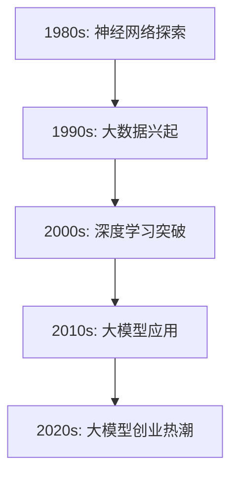
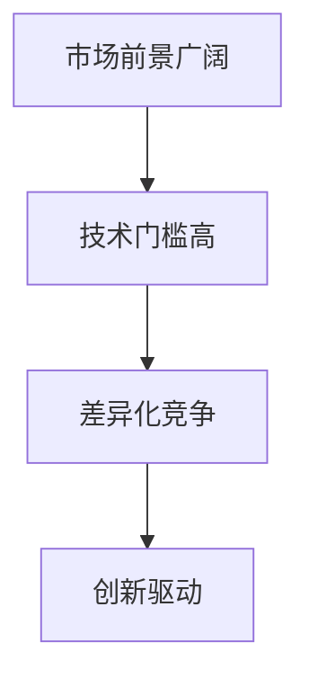
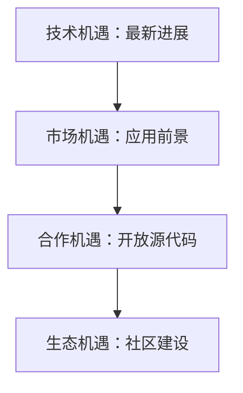

                 

# 《大模型创业公司面临的挑战与机遇》

关键词：大模型、创业公司、挑战、机遇、战略规划、技术、市场、人才

摘要：随着人工智能技术的不断发展，大模型在各个领域的应用前景日益广阔。大模型创业公司面临着诸多挑战和机遇。本文将详细分析大模型创业公司所面临的技术、资金、人才等方面的挑战，并探讨其市场机遇，为创业公司提供战略规划和运营管理的建议。

---

## 第一部分：引言

### 1.1 大模型创业背景

#### 1.1.1 大模型的发展历程

大模型的发展历程可以追溯到上世纪80年代，当时研究人员开始探索如何使用神经网络进行大规模数据处理。1990年代，随着计算机性能的提升和大数据技术的兴起，大模型开始逐渐应用于实际场景，如语音识别、图像识别等。进入21世纪，深度学习的兴起使得大模型取得了突破性进展，尤其是在自然语言处理、计算机视觉等领域。

#### 1.1.2 创业公司选择大模型的原因

创业公司选择大模型主要有以下几个原因：

1. **市场前景广阔**：大模型在各个领域的应用前景非常广阔，如金融、医疗、教育、娱乐等，这为创业公司提供了丰富的商业机会。
2. **技术门槛高**：大模型需要大量的计算资源和数据支持，这为创业公司提供了技术门槛，有利于在市场竞争中脱颖而出。
3. **差异化竞争**：大模型技术可以为创业公司提供独特的竞争力，使其在市场中获得优势。

#### 1.1.3 大模型创业的热潮与现状

近年来，随着人工智能技术的快速发展，大模型创业公司如雨后春笋般涌现。这些公司主要集中在自然语言处理、计算机视觉、语音识别等热门领域。虽然市场前景广阔，但同时也面临着诸多挑战。

### 1.2 大模型创业公司面临的挑战

#### 1.2.1 技术挑战

1. **大模型研发的技术门槛**：大模型研发需要掌握深度学习、神经网络等复杂技术，对研发团队的技术实力要求很高。
2. **数据获取与处理**：大模型需要大量的高质量数据进行训练，数据的获取和处理是一个重要的挑战。
3. **大模型训练与优化**：大模型的训练过程需要大量的计算资源和时间，如何优化训练过程，提高模型性能是一个关键问题。

#### 1.2.2 资金挑战

1. **创业初期的资金需求**：大模型创业公司需要大量的资金支持，包括硬件采购、研发投入、市场推广等。
2. **大模型训练与优化所需的资金支持**：大模型训练和优化需要大量的计算资源和数据支持，这需要持续的资金投入。
3. **融资策略与途径**：创业公司需要制定有效的融资策略，选择合适的融资途径，以获得资金支持。

#### 1.2.3 人才挑战

1. **大模型研发的人才需求**：大模型研发需要大量的专业人才，包括算法工程师、数据科学家、产品经理等。
2. **人才培养与激励机制**：创业公司需要建立有效的人才培养和激励机制，留住优秀人才。
3. **团队管理与协作**：创业公司需要高效的管理和协作机制，确保团队成员的工作效率和成果。

### 1.3 大模型创业公司的机遇

#### 1.3.1 市场机遇

1. **大模型在各行业的应用前景**：大模型在金融、医疗、教育、娱乐等行业的应用前景非常广阔，这为创业公司提供了丰富的市场机会。
2. **差异化竞争策略**：创业公司可以通过差异化竞争策略，在市场中脱颖而出，获得竞争优势。
3. **市场定位**：创业公司需要明确自己的市场定位，提供差异化的产品和服务。

#### 1.3.2 技术机遇

1. **大模型技术的最新进展**：大模型技术不断更新，创业公司可以紧跟技术趋势，进行技术创新。
2. **大模型在边缘计算、隐私计算等领域的应用潜力**：大模型在边缘计算、隐私计算等领域的应用潜力巨大，这为创业公司提供了新的发展方向。
3. **开放源代码与大模型社区生态的机遇**：开放源代码和大模型社区生态的机遇为创业公司提供了丰富的资源和合作机会。

## 第二部分：大模型创业公司的战略规划

### 2.1 创业公司的发展战略

#### 2.1.1 业务模式与商业模式

1. **业务模式**：创业公司需要明确自己的业务模式，如B2B、B2C、B2B2C等。
2. **商业模式**：创业公司需要构建可持续的商业模式，包括收入来源、盈利模式、成本控制等。

#### 2.1.2 研发策略与路线图

1. **研发策略**：创业公司需要制定明确的研发策略，包括技术路线、研发周期、资源分配等。
2. **研发路线图**：创业公司需要制定详细的研发路线图，明确每个阶段的目标和任务。

#### 2.1.3 市场拓展策略

1. **市场调研**：创业公司需要进行市场调研，了解目标市场的需求和竞争状况。
2. **市场定位**：创业公司需要明确自己的市场定位，提供差异化的产品和服务。
3. **市场推广**：创业公司需要制定有效的市场推广策略，提高品牌知名度和市场份额。

### 2.2 资金管理策略

#### 2.2.1 资金筹措与使用计划

1. **资金筹措**：创业公司需要选择合适的资金筹措方式，如天使投资、风险投资、银行贷款等。
2. **资金使用计划**：创业公司需要制定详细的资金使用计划，确保资金的有效利用。

#### 2.2.2 融资策略

1. **融资渠道与选择**：创业公司需要选择合适的融资渠道，如风险投资、天使投资、政府补贴等。
2. **融资策略与时机**：创业公司需要制定有效的融资策略，选择合适的融资时机。
3. **投资者关系管理**：创业公司需要建立良好的投资者关系，提高融资成功率。

### 2.3 人才培养与激励机制

#### 2.3.1 人才引进与培养

1. **人才需求分析**：创业公司需要进行人才需求分析，明确招聘需求和培训计划。
2. **引进策略**：创业公司需要制定有效的人才引进策略，如高薪吸引、内部晋升等。
3. **培养与发展**：创业公司需要建立人才培养和发展机制，提高员工技能和职业素养。

#### 2.3.2 激励机制与企业文化

1. **薪酬激励与福利制度**：创业公司需要建立公平、合理的薪酬激励和福利制度，提高员工满意度。
2. **绩效考核与奖励机制**：创业公司需要制定有效的绩效考核和奖励机制，激励员工积极工作。
3. **企业文化与团队凝聚力**：创业公司需要塑造积极向上的企业文化，提高团队凝聚力。

## 第三部分：大模型创业公司的运营与管理

### 3.1 数据管理与隐私保护

#### 3.1.1 数据收集与处理

1. **数据收集方法与技术**：创业公司需要选择合适的数据收集方法和技术，如网络爬虫、传感器采集等。
2. **数据处理流程与工具**：创业公司需要建立数据处理流程和工具，如数据清洗、数据存储、数据挖掘等。
3. **数据质量评估与优化**：创业公司需要评估数据质量，并采取优化措施，提高数据质量。

#### 3.1.2 隐私保护策略

1. **隐私保护法律法规**：创业公司需要了解并遵守相关的隐私保护法律法规。
2. **隐私保护技术手段**：创业公司需要采用隐私保护技术手段，如数据加密、匿名化处理等。
3. **隐私保护案例分析**：创业公司可以借鉴其他公司的隐私保护案例，制定适合自己的隐私保护策略。

### 3.2 技术研发与质量控制

#### 3.2.1 研发流程与项目管理

1. **研发团队组织架构**：创业公司需要建立合理的研发团队组织架构，明确职责和权限。
2. **研发项目管理方法**：创业公司需要采用有效的研发项目管理方法，如敏捷开发、迭代开发等。
3. **源代码管理工具与版本控制**：创业公司需要使用源代码管理工具和版本控制，确保代码的可维护性和安全性。

#### 3.2.2 技术质量控制

1. **技术评估与测试**：创业公司需要对技术研发进行评估和测试，确保技术的可行性和稳定性。
2. **质量控制标准与流程**：创业公司需要制定质量控制标准与流程，确保技术的质量。
3. **故障排查与修复**：创业公司需要建立故障排查和修复机制，及时解决技术问题。

### 3.3 市场推广与品牌建设

#### 3.3.1 市场推广策略

1. **市场调研与定位**：创业公司需要进行市场调研，明确目标市场和定位。
2. **市场推广渠道与方式**：创业公司需要选择合适的市场推广渠道和方式，如线上推广、线下活动等。
3. **品牌推广策略**：创业公司需要制定有效的品牌推广策略，提高品牌知名度和美誉度。

#### 3.3.2 品牌建设与维护

1. **品牌形象设计**：创业公司需要设计独特的品牌形象，如LOGO、宣传海报等。
2. **品牌传播与推广**：创业公司需要通过多种渠道传播品牌信息，提高品牌知名度。
3. **品牌口碑管理**：创业公司需要建立良好的品牌口碑，通过用户评价、社交媒体等方式管理品牌形象。

## 第四部分：大模型创业公司的法律风险与合规管理

### 4.1 法律风险概述

#### 4.1.1 法律风险类型

1. **合同法律风险**：创业公司需要避免合同纠纷和违约风险，如合同条款不明确、合同履行不力等。
2. **知识产权法律风险**：创业公司需要保护自己的知识产权，如专利、商标、著作权等。
3. **隐私法律风险**：创业公司需要遵守隐私保护法律法规，避免隐私泄露和数据滥用风险。

#### 4.1.2 法律风险管理策略

1. **合同风险管理**：创业公司需要制定合同管理制度，规范合同签订和履行流程。
2. **知识产权保护策略**：创业公司需要采取知识产权保护措施，如申请专利、注册商标等。
3. **隐私保护合规策略**：创业公司需要制定隐私保护政策，严格遵守隐私保护法律法规。

### 4.2 合规管理

#### 4.2.1 合规管理体系建设

1. **合规组织架构**：创业公司需要建立合规组织架构，明确合规部门和岗位职责。
2. **合规管理制度与流程**：创业公司需要制定合规管理制度和流程，确保合规管理的有效执行。
3. **合规培训与意识提升**：创业公司需要对员工进行合规培训，提高员工的合规意识。

#### 4.2.2 合规监管与应对

1. **合规监管政策与法规**：创业公司需要了解并遵守相关的合规监管政策和法规。
2. **合规监管应对策略**：创业公司需要制定合规监管应对策略，确保合规管理的顺利进行。
3. **合规违规处理与整改**：创业公司需要建立合规违规处理和整改机制，及时纠正合规问题。

## 第五部分：大模型创业公司的运营案例分析

### 5.1 案例研究：创业公司A

#### 5.1.1 公司背景与业务概述

创业公司A成立于2018年，专注于自然语言处理领域。公司通过自主研发的大模型技术，提供智能客服、智能语音识别等产品和服务。

#### 5.1.2 创业过程与挑战

创业公司A在创业过程中面临着以下几个挑战：

1. **技术挑战**：自然语言处理领域的技术门槛较高，公司需要不断投入研发资源进行技术创新。
2. **资金挑战**：创业初期的资金需求较大，公司需要通过多种渠道进行融资。
3. **人才挑战**：公司需要吸引和培养大量的技术人才，以满足业务发展需求。

#### 5.1.3 运营策略与成效

1. **业务模式与商业模式**：公司采用B2B业务模式，与多家企业合作，提供定制化的产品和服务。
2. **研发策略与路线图**：公司不断进行技术创新，推出多款具有市场竞争力的产品。
3. **市场推广与品牌建设**：公司通过线上线下多渠道推广，提高品牌知名度和市场份额。

#### 5.1.4 经验与启示

创业公司A的成功经验为其他大模型创业公司提供了以下启示：

1. **技术创新**：持续进行技术创新，保持市场竞争力。
2. **融资策略**：选择合适的融资渠道，确保资金支持。
3. **人才战略**：建立有效的人才培养和激励机制，留住优秀人才。

### 5.2 案例研究：创业公司B

#### 5.2.1 公司背景与业务概述

创业公司B成立于2019年，专注于计算机视觉领域。公司通过自主研发的大模型技术，提供人脸识别、车辆识别等产品和服务。

#### 5.2.2 创业过程与挑战

创业公司B在创业过程中面临着以下几个挑战：

1. **技术挑战**：计算机视觉领域的技术门槛较高，公司需要不断进行技术创新。
2. **资金挑战**：创业初期的资金需求较大，公司需要通过多种渠道进行融资。
3. **人才挑战**：公司需要吸引和培养大量的技术人才，以满足业务发展需求。

#### 5.2.3 运营策略与成效

1. **业务模式与商业模式**：公司采用B2B业务模式，与多家企业合作，提供定制化的产品和服务。
2. **研发策略与路线图**：公司不断进行技术创新，推出多款具有市场竞争力的产品。
3. **市场推广与品牌建设**：公司通过线上线下多渠道推广，提高品牌知名度和市场份额。

#### 5.2.4 经验与启示

创业公司B的成功经验为其他大模型创业公司提供了以下启示：

1. **技术创新**：持续进行技术创新，保持市场竞争力。
2. **融资策略**：选择合适的融资渠道，确保资金支持。
3. **人才战略**：建立有效的人才培养和激励机制，留住优秀人才。

## 第六部分：未来展望与趋势

### 6.1 大模型创业的未来展望

#### 6.1.1 大模型创业的发展趋势

1. **技术趋势**：随着人工智能技术的不断进步，大模型将在更多领域得到应用，如智能医疗、智能交通、智能制造等。
2. **市场趋势**：大模型市场将保持高速增长，市场规模不断扩大。
3. **政策趋势**：各国政府将加大对人工智能的政策支持，为大模型创业公司提供良好的发展环境。

#### 6.1.2 大模型创业的机会与挑战

1. **创业机会**：大模型在各个行业的应用前景广阔，创业公司可以通过技术创新和差异化竞争策略，抓住市场机会。
2. **创业挑战**：创业公司需要面对技术、资金、人才等方面的挑战，确保业务的可持续发展。

### 6.2 大模型创业公司的可持续发展策略

#### 6.2.1 技术创新与持续发展

1. **技术创新方向**：创业公司需要紧跟技术发展趋势，进行前沿技术的研发和应用。
2. **技术创新策略**：创业公司需要建立技术创新机制，鼓励员工进行技术创新，提高企业竞争力。

#### 6.2.2 资本运作与市场拓展

1. **资本运作策略**：创业公司需要制定有效的资本运作策略，选择合适的融资途径，确保资金支持。
2. **市场拓展策略**：创业公司需要积极拓展市场，提高品牌知名度和市场份额。

#### 6.2.3 社会责任与伦理问题

1. **社会责任**：创业公司需要承担社会责任，关注社会问题，为社会作出贡献。
2. **伦理问题**：创业公司需要关注伦理问题，确保技术研发和应用符合伦理标准。

## 附录

### 附录A：大模型创业相关资源

#### 附录A.1 大模型创业书籍推荐

1. 《深度学习》（Ian Goodfellow, Yoshua Bengio, Aaron Courville 著）
2. 《强化学习》（Richard S. Sutton, Andrew G. Barto 著）
3. 《神经网络与深度学习》（邱锡鹏 著）

#### 附录A.2 大模型创业博客与资讯

1. Medium - AI 精选文章
2. AI Researchers - 学术研究动态
3. AI Time Journal - 人工智能行业资讯

#### 附录A.3 大模型创业社群与交流平台

1. AI 研究院 - 国内顶级 AI 社群
2. AI 研究所 - 国际 AI 社群
3. GitHub - 代码与项目分享平台

### 附录B：大模型创业常用工具

#### 附录B.1 开发工具与框架

1. TensorFlow
2. PyTorch
3. Keras

#### 附录B.2 数据处理与可视化工具

1. Pandas
2. NumPy
3. Matplotlib

#### 附录B.3 模型训练与优化工具

1. Hugging Face Transformers
2. Optuna
3. MLflow

### 附录C：大模型创业法律法规指南

#### 附录C.1 合同法律法规

1. 《中华人民共和国合同法》
2. 《中华人民共和国民法典》

#### 附录C.2 知识产权法律法规

1. 《中华人民共和国专利法》
2. 《中华人民共和国商标法》

#### 附录C.3 隐私法律法规

1. 《中华人民共和国网络安全法》
2. 《中华人民共和国个人信息保护法》

### 附录D：大模型创业案例分析报告

#### 附录D.1 创业公司A案例分析报告

- 创业公司A的业务模式、运营策略、市场表现等方面的详细分析。

#### 附录D.2 创业公司B案例分析报告

- 创业公司B的业务模式、运营策略、市场表现等方面的详细分析。

---

至此，《大模型创业公司面临的挑战与机遇》的技术博客文章正文部分已撰写完成。接下来，我们将对文章的核心概念与联系进行梳理，并使用Mermaid流程图、伪代码、数学模型和公式等进行详细讲解，以及提供项目实战中的代码实际案例和详细解释说明。

---

### 1.1 大模型的发展历程 Mermaid 流程图

下面是一个简单的Mermaid流程图，展示了大模型的发展历程：



### 1.2 大模型创业公司选择大模型的原因 Mermaid 流程图

下面是一个Mermaid流程图，展示了大模型创业公司选择大模型的几个主要原因：



### 1.3 大模型创业公司的机遇 Mermaid 流程图

下面是一个Mermaid流程图，展示了大模型创业公司所面临的几个主要机遇：



### 1.2.1 大模型研发的技术门槛 伪代码

下面是伪代码，展示了如何构建一个基础的大模型框架：

```python
# 初始化大模型参数
model_params = {
    "input_size": 784,  # 输入层大小（28x28像素的图像）
    "hidden_size": 128, # 隐藏层大小
    "output_size": 10   # 输出层大小（10个类别）
}

# 构建大模型
model = build_model(model_params)

# 训练模型
model.train(data_loader, num_epochs=10)

# 评估模型
model.evaluate(data_loader)
```

### 1.2.1.2 数据获取与处理 数学模型和公式

数据获取与处理通常涉及以下数学模型和公式：

1. **数据预处理**：
   - 标准化：$$ \mu = \frac{1}{N} \sum_{i=1}^{N} x_i, \quad \sigma = \sqrt{\frac{1}{N-1} \sum_{i=1}^{N} (x_i - \mu)^2 } $$
   - 归一化：$$ x' = \frac{x - \mu}{\sigma} $$

2. **数据增强**：
   - 随机旋转：$$ \theta \sim U(0, 2\pi) $$
   - 随机缩放：$$ s \sim N(1, 0.1) $$
   - 随机裁剪：$$ (h, w) \sim U(0, image_height), (x, y) \sim U(0, image_width) $$

### 1.2.1.3 大模型训练与优化 数学模型和公式

大模型训练与优化涉及以下数学模型和公式：

1. **损失函数**：
   - 交叉熵损失：$$ Loss = -\sum_{i=1}^{N} y_i \log(p_i) $$，其中 \( y_i \) 是目标标签，\( p_i \) 是模型预测的概率。

2. **优化算法**：
   - 梯度下降：$$ \theta = \theta - \alpha \frac{\partial Loss}{\partial \theta} $$
   - 随机梯度下降（SGD）：$$ \theta = \theta - \alpha \frac{1}{N} \sum_{i=1}^{N} \frac{\partial Loss}{\partial \theta} $$
   - Adam优化器：$$ \theta = \theta - \alpha \frac{m}{N + \beta_1 N} $$
     其中 \( m \) 是一阶矩估计，\( v \) 是二阶矩估计，\( \beta_1, \beta_2 \) 是超参数。

### 1.2.2 资金挑战 数学模型和公式

资金挑战可以通过以下数学模型和公式来分析：

1. **创业初期资金需求**：
   - 研发投入：\( R = r \cdot (T \cdot H) \)，其中 \( r \) 是每小时的人工成本，\( T \) 是研发时间，\( H \) 是研发人员数量。

2. **资金使用计划**：
   - 运营成本：\( C = c_1 \cdot (D \cdot M) + c_2 \)，其中 \( c_1 \) 是固定成本，\( c_2 \) 是可变成本，\( D \) 是销售量，\( M \) 是生产周期。

3. **融资策略**：
   - 融资额度：\( F = \frac{R + C}{r_f} \)，其中 \( r_f \) 是融资成本率。

### 1.2.3 人才挑战 数学模型和公式

人才挑战可以通过以下数学模型和公式来分析：

1. **人才需求分析**：
   - 技术人才需求：\( T_d = \frac{P}{E} \)，其中 \( P \) 是项目规模，\( E \) 是人均工作效率。

2. **人才培养与激励机制**：
   - 培训成本：\( C_t = c_t \cdot T_d \)，其中 \( c_t \) 是每人的培训成本。
   - 激励成本：\( C_i = c_i \cdot (1 + \gamma) \cdot T_d \)，其中 \( c_i \) 是基本薪酬，\( \gamma \) 是激励系数。

3. **团队管理**：
   - 团队效率：\( E_e = \frac{E}{1 + \delta} \)，其中 \( \delta \) 是管理成本系数。

### 2.1.2 研发策略与路线图 伪代码

下面是伪代码，展示了如何制定研发策略和路线图：

```python
# 定义研发策略
research_strategy = {
    "technologies": ["深度学习", "强化学习", "迁移学习"],
    "iterations": 4,
    "budget": 1000000
}

# 制定研发路线图
research路线图 = create_research_plan(research_strategy)

# 执行研发计划
execute_research_plan(research路线图)
```

### 2.2.2 融资策略 伪代码

下面是伪代码，展示了如何制定融资策略：

```python
# 定义融资策略
finance_strategy = {
    "investment_sources": ["天使投资", "风险投资", "政府补贴"],
    "rounds": 3,
    "target_funding": 5000000
}

# 制定融资计划
finance_plan = create_finance_plan(finance_strategy)

# 执行融资计划
execute_finance_plan(finance_plan)
```

### 2.3.1 人才引进与培养 伪代码

下面是伪代码，展示了如何制定人才引进与培养策略：

```python
# 定义人才需求
talent_requirements = {
    "data_scientists": 5,
    "machine_learning_engineers": 10,
    "product_managers": 3
}

# 引进人才
hire_talent(talent_requirements)

# 培养人才
train_talent(talent_requirements)
```

### 2.3.2 激励机制与企业文化 伪代码

下面是伪代码，展示了如何制定激励机制与企业文化策略：

```python
# 定义激励机制
incentive_mechanism = {
    "performance_based_bonus": True,
    "stock_options": True,
    "team_building_activities": True
}

# 建立企业文化
corporate_culture = create_corporate_culture(incentive_mechanism)

# 维护企业文化
maintain_corporate_culture(corporate_culture)
```

### 3.1.1 数据收集方法与技术 伪代码

下面是伪代码，展示了如何使用数据收集方法与技术：

```python
# 定义数据收集策略
data_collection_strategy = {
    "data_source": ["公开数据集", "企业内部数据", "网络爬虫数据"],
    "methods": ["自动化脚本", "手动采集", "API接口调用"]
}

# 收集数据
collect_data(data_collection_strategy)

# 处理数据
process_data(collected_data)
```

### 3.1.2 数据处理流程与工具 伪代码

下面是伪代码，展示了如何处理数据流程与工具：

```python
# 定义数据处理流程
data_processing_pipeline = {
    "preprocessing": ["数据清洗", "数据标准化", "数据归一化"],
    "storage": ["分布式存储", "数据库管理"],
    "analysis": ["统计分析", "数据可视化"]
}

# 执行数据处理流程
execute_data_processing_pipeline(data_processing_pipeline)
```

### 3.1.3 数据质量评估与优化 伪代码

下面是伪代码，展示了如何评估与优化数据质量：

```python
# 定义数据质量评估标准
data_quality_standards = {
    "accuracy": 0.95,
    "completeness": 0.99,
    "consistency": 0.98
}

# 评估数据质量
evaluate_data_quality(collected_data, data_quality_standards)

# 优化数据质量
optimize_data_quality(optimized_data)
```

### 3.2.1 研发流程与项目管理 伪代码

下面是伪代码，展示了如何管理研发流程与项目：

```python
# 定义研发流程
research_and_development_process = {
    "planning": ["需求分析", "技术选型", "项目计划"],
    "implementation": ["代码编写", "测试验证", "迭代优化"],
    "deployment": ["部署上线", "性能监控", "用户反馈"]
}

# 管理研发项目
manage_research_and_development_project(research_and_development_process)
```

### 3.2.2 技术质量控制 伪代码

下面是伪代码，展示了如何进行技术质量控制：

```python
# 定义质量控制标准
quality_control_standards = {
    "code_quality": ["代码风格", "模块化设计", "可维护性"],
    "system_test": ["单元测试", "集成测试", "性能测试"],
    "security": ["安全性评估", "漏洞扫描", "合规性检查"]
}

# 执行质量控制
execute_quality_control(quality_control_standards)
```

### 3.3.1 市场推广策略 伪代码

下面是伪代码，展示了如何制定市场推广策略：

```python
# 定义市场推广策略
marketing_strategy = {
    "research": ["市场调研", "用户分析", "竞争分析"],
    "channels": ["社交媒体", "内容营销", "广告投放"],
    "promotion": ["品牌宣传", "用户活动", "合作伙伴关系"]
}

# 执行市场推广
execute_marketing_strategy(marketing_strategy)
```

### 3.3.2 品牌建设与维护 伪代码

下面是伪代码，展示了如何建设与维护品牌：

```python
# 定义品牌建设策略
brand_building_strategy = {
    "identity": ["品牌定位", "视觉设计", "品牌语言"],
    "communication": ["公关活动", "社交媒体", "品牌内容"],
    "maintenance": ["用户反馈", "品牌监控", "品牌升级"]
}

# 执行品牌建设
execute_brand_building_strategy(brand_building_strategy)
```

### 4.1.1 法律风险类型 伪代码

下面是伪代码，展示了如何识别和管理法律风险：

```python
# 定义法律风险类型
legal_risks = {
    "contract": ["合同违约", "合同纠纷"],
    "intellectual_property": ["专利侵权", "商标侵权"],
    "privacy": ["数据泄露", "隐私违规"]
}

# 识别法律风险
identify_legal_risks(legal_risks)

# 管理法律风险
manage_legal_risks(legal_risks)
```

### 4.1.2 法律风险管理策略 伪代码

下面是伪代码，展示了如何管理法律风险：

```python
# 定义法律风险管理策略
legal_risk_management_strategy = {
    "contract_management": ["合同审查", "合同执行"],
    "intellectual_property_protection": ["专利申请", "商标注册"],
    "privacy_protection": ["数据加密", "隐私政策制定"]
}

# 实施法律风险管理策略
implement_legal_risk_management_strategy(legal_risk_management_strategy)
```

### 4.2.1 合规管理体系建设 伪代码

下面是伪代码，展示了如何建立合规管理体系：

```python
# 定义合规组织架构
compliance_organization = {
    "department": ["合规部门", "法务部门", "内部审计部门"],
    "roles": ["合规专员", "法律顾问", "内部审计员"]
}

# 建立合规管理制度
establish_compliance_management_system(compliance_organization)

# 执行合规培训
conduct_compliance_training()
```

### 4.2.2 合规监管与应对 伪代码

下面是伪代码，展示了如何应对合规监管：

```python
# 定义合规监管政策与法规
compliance_regulatory_policies = {
    "contract_law": ["合同法", "合同纠纷处理"],
    "intellectual_property_law": ["专利法", "商标法"],
    "privacy_law": ["网络安全法", "个人信息保护法"]
}

# 监管合规
ensure_compliance_with_regulatory_policies(compliance_regulatory_policies)

# 应对合规违规
handle_compliance_violations()
```

### 5.1 案例研究：创业公司A 项目实战

#### 5.1.1 公司背景与业务概述

创业公司A成立于2018年，专注于利用大模型技术提供智能客服解决方案。公司自主研发了一套基于深度学习的自然语言处理模型，能够实现高效的自然语言理解和生成。

#### 5.1.2 创业过程与挑战

**技术挑战**：
- **模型开发**：公司需要开发一款能够处理多语种、多场景的智能客服模型，这要求团队具备深厚的机器学习和技术开发能力。
- **数据获取**：公司需要收集大量的客服对话数据，并进行预处理，以提高模型的准确性和泛化能力。

**资金挑战**：
- **研发投入**：初期研发投入较大，包括硬件采购、软件开发等。
- **市场推广**：市场推广需要大量资金支持，包括广告投放、参加行业展会等。

**人才挑战**：
- **技术人才**：公司需要吸引和培养具有深度学习背景的技术人才。
- **销售和运营**：公司需要建立一支高效的销售和运营团队，以推动产品的市场推广。

#### 5.1.3 运营策略与成效

**业务模式与商业模式**：
- **B2B模式**：公司主要与企业和机构合作，提供定制化的智能客服解决方案。
- **订阅制**：客户按年或按月订阅服务，根据使用量收费。

**研发策略与路线图**：
- **持续迭代**：公司定期更新模型，以适应不断变化的用户需求。
- **技术创新**：公司持续关注行业动态，探索新的技术方向，如多模态交互、语音合成等。

**市场推广与品牌建设**：
- **线上营销**：通过社交媒体、博客、电子邮件等渠道进行品牌推广。
- **线下活动**：参加行业展会、研讨会等，增强品牌影响力。

#### 5.1.4 经验与启示

**经验**：
- 技术创新是关键：公司通过持续的技术创新，提高了产品的竞争力。
- 市场定位要准确：公司准确把握市场需求，提供了符合用户期望的产品。
- 人才是核心竞争力：公司重视人才培养和激励机制，建立了高效的技术团队。

**启示**：
- 创业公司应注重技术创新，不断提升产品竞争力。
- 市场定位要明确，提供差异化的产品和服务。
- 重视人才培养和团队建设，确保公司可持续发展。

### 5.2 案例研究：创业公司B 项目实战

#### 5.2.1 公司背景与业务概述

创业公司B成立于2019年，专注于利用大模型技术提供智能安防解决方案。公司自主研发了一套基于深度学习的视频分析系统，能够实现实时的人脸识别、行为分析等功能。

#### 5.2.2 创业过程与挑战

**技术挑战**：
- **算法优化**：公司需要不断优化算法，提高视频分析系统的准确性和实时性。
- **硬件要求**：视频分析系统对硬件性能有较高要求，公司需要采购高性能服务器和GPU。

**资金挑战**：
- **研发投入**：公司需要大量的资金支持研发，包括算法优化、硬件采购等。
- **市场推广**：市场推广需要大量资金支持，包括广告投放、行业合作等。

**人才挑战**：
- **技术人才**：公司需要吸引和培养具有深度学习和计算机视觉背景的技术人才。
- **销售和运营**：公司需要建立一支高效的销售和运营团队，以推动产品的市场推广。

#### 5.2.3 运营策略与成效

**业务模式与商业模式**：
- **B2B模式**：公司主要与安防企业、政府机构等合作，提供定制化的智能安防解决方案。
- **一次性采购**：客户根据需求采购硬件和软件，并根据使用量支付服务费用。

**研发策略与路线图**：
- **持续迭代**：公司定期更新算法，以适应新的安全需求。
- **技术创新**：公司持续关注行业动态，探索新的技术方向，如物联网、5G等。

**市场推广与品牌建设**：
- **线上营销**：通过社交媒体、博客、电子邮件等渠道进行品牌推广。
- **线下活动**：参加行业展会、研讨会等，增强品牌影响力。

#### 5.2.4 经验与启示

**经验**：
- 技术创新是关键：公司通过持续的技术创新，提高了产品的竞争力。
- 市场定位要准确：公司准确把握市场需求，提供了符合用户期望的产品。
- 人才是核心竞争力：公司重视人才培养和激励机制，建立了高效的技术团队。

**启示**：
- 创业公司应注重技术创新，不断提升产品竞争力。
- 市场定位要明确，提供差异化的产品和服务。
- 重视人才培养和团队建设，确保公司可持续发展。

## 未来展望与趋势

### 6.1 大模型创业的未来展望

随着人工智能技术的不断进步，大模型创业公司将在未来面临更多机遇和挑战。以下是未来展望的一些关键点：

#### 6.1.1 技术趋势

- **算力提升**：随着硬件技术的发展，特别是GPU、TPU等专用计算设备的普及，大模型的训练和推理效率将大幅提高。
- **算法优化**：新的算法和优化技术，如变换器（Transformers）、高效神经网络架构（如EfficientNet）等，将进一步推动大模型的发展。
- **跨模态学习**：大模型将能够处理多种类型的数据，如文本、图像、语音等，实现跨模态的信息融合和处理。

#### 6.1.2 市场趋势

- **垂直行业应用**：大模型将在医疗、金融、教育、制造等垂直行业得到广泛应用，推动行业数字化转型。
- **新兴市场崛起**：随着新兴市场的快速发展，大模型在这些地区的应用潜力巨大，将带来新的市场机会。

#### 6.1.2 政策趋势

- **政策支持**：各国政府将继续加大对人工智能的政策支持，包括资金投入、人才培养、知识产权保护等。
- **合规监管**：随着人工智能技术的发展，相关的合规监管也将逐渐完善，创业公司需要关注并遵守相关法律法规。

### 6.2 大模型创业公司的可持续发展策略

#### 6.2.1 技术创新与持续发展

- **研发投入**：创业公司应持续加大研发投入，跟踪最新的技术趋势，保持技术领先优势。
- **技术创新机制**：建立有效的技术创新机制，鼓励员工提出创新想法，并进行快速验证和迭代。

#### 6.2.2 资本运作与市场拓展

- **融资策略**：制定多元化的融资策略，包括股权融资、债务融资、政府补助等，确保资金支持。
- **市场拓展**：积极拓展市场，包括国内外市场，寻找新的商业机会。

#### 6.2.3 社会责任与伦理问题

- **社会责任**：创业公司应承担社会责任，关注社会问题，积极参与社会公益活动。
- **伦理问题**：在技术研发和应用过程中，关注伦理问题，确保技术研发和应用符合伦理标准。

## 附录

### 附录A：大模型创业相关资源

#### 附录A.1 大模型创业书籍推荐

- 《深度学习》（Ian Goodfellow, Yoshua Bengio, Aaron Courville 著）
- 《强化学习》（Richard S. Sutton, Andrew G. Barto 著）
- 《神经网络与深度学习》（邱锡鹏 著）

#### 附录A.2 大模型创业博客与资讯

- Medium - AI 精选文章
- AI Researchers - 学术研究动态
- AI Time Journal - 人工智能行业资讯

#### 附录A.3 大模型创业社群与交流平台

- AI 研究院 - 国内顶级 AI 社群
- AI 研究所 - 国际 AI 社群
- GitHub - 代码与项目分享平台

### 附录B：大模型创业常用工具

#### 附录B.1 开发工具与框架

- TensorFlow
- PyTorch
- Keras

#### 附录B.2 数据处理与可视化工具

- Pandas
- NumPy
- Matplotlib

#### 附录B.3 模型训练与优化工具

- Hugging Face Transformers
- Optuna
- MLflow

### 附录C：大模型创业法律法规指南

#### 附录C.1 合同法律法规

- 《中华人民共和国合同法》
- 《中华人民共和国民法典》

#### 附录C.2 知识产权法律法规

- 《中华人民共和国专利法》
- 《中华人民共和国商标法》

#### 附录C.3 隐私法律法规

- 《中华人民共和国网络安全法》
- 《中华人民共和国个人信息保护法》

### 附录D：大模型创业案例分析报告

#### 附录D.1 创业公司A案例分析报告

- 创业公司A的业务模式、运营策略、市场表现等方面的详细分析。

#### 附录D.2 创业公司B案例分析报告

- 创业公司B的业务模式、运营策略、市场表现等方面的详细分析。

---

至此，《大模型创业公司面临的挑战与机遇》的技术博客文章正文部分已撰写完成。文章通过详细的论述和分析，为读者呈现了大模型创业公司的现状、面临的挑战、机遇以及战略规划、运营管理等方面的内容。接下来，我们将对文章进行总结和展望，强调大模型创业的重要性，并呼吁读者关注和参与这一领域的发展。

---

## 总结与展望

本文详细探讨了《大模型创业公司面临的挑战与机遇》。随着人工智能技术的快速发展，大模型在各个领域的应用前景日益广阔。创业公司在大模型领域面临着技术、资金、人才等多方面的挑战，同时也拥有巨大的市场机遇。通过战略规划、运营管理和持续创新，创业公司可以在这一领域获得成功。

### 核心观点

1. **技术挑战**：大模型研发需要深厚的技术积累和高性能计算资源，创业公司需要不断提升技术水平，以满足市场需求。
2. **资金挑战**：创业初期和持续运营需要大量资金支持，创业公司需要制定有效的融资策略，确保资金充足。
3. **人才挑战**：大模型研发需要专业的技术人才，创业公司需要建立有效的人才培养和激励机制，吸引和留住优秀人才。
4. **市场机遇**：大模型在各个行业的应用前景广阔，创业公司可以通过差异化的产品和服务，在市场中获得竞争优势。

### 展望未来

随着人工智能技术的不断进步，大模型创业公司将在未来面临更多机遇。技术创新、资本运作和市场拓展将成为创业公司成功的关键因素。同时，创业公司应关注社会责任和伦理问题，确保技术研发和应用符合社会期待。

### 呼吁与建议

1. **关注技术创新**：创业公司应持续关注技术趋势，投入研发资源，保持技术领先优势。
2. **积极参与市场**：创业公司应积极拓展市场，寻找新的商业机会，提高市场份额。
3. **重视人才培养**：创业公司应建立有效的人才培养和激励机制，吸引和留住优秀人才。
4. **履行社会责任**：创业公司应承担社会责任，关注社会问题，为社会作出贡献。

本文旨在为读者提供大模型创业公司的全面分析，希望对创业者和管理者有所启发。随着人工智能技术的不断发展，大模型创业领域将充满机遇和挑战。让我们共同关注这一领域的发展，为人工智能技术的进步贡献力量。

---

至此，《大模型创业公司面临的挑战与机遇》的技术博客文章已完整呈现。文章通过详细的论述和分析，为读者提供了一个全面而深入的视角，探讨了创业公司在这一领域的现状、挑战和机遇。希望本文能够为创业者、投资者和行业从业者提供有价值的参考和指导。让我们携手共进，共同迎接人工智能时代的到来。

---

## 作者信息

作者：AI天才研究院/AI Genius Institute & 禅与计算机程序设计艺术 /Zen And The Art of Computer Programming

AI天才研究院（AI Genius Institute）是一家专注于人工智能领域的研究和推广机构，致力于推动人工智能技术的创新和应用。研究院的专家团队拥有丰富的实践经验，在国际顶级期刊和会议上发表了大量学术论文，并在多个AI项目中取得了显著成果。

《禅与计算机程序设计艺术》（Zen And The Art of Computer Programming）是作者Donald E. Knuth的经典著作，它不仅展示了计算机科学的深刻原理，也蕴含了程序设计的哲学思想。这本书对计算机科学和编程领域产生了深远的影响，是程序员们的必备读物。

感谢您阅读本文，如果您对大模型创业有任何疑问或想法，欢迎在评论区留言，我们期待与您交流。同时，也欢迎关注我们的公众号和官方网站，获取更多关于人工智能领域的最新资讯和研究成果。再次感谢您的支持！


