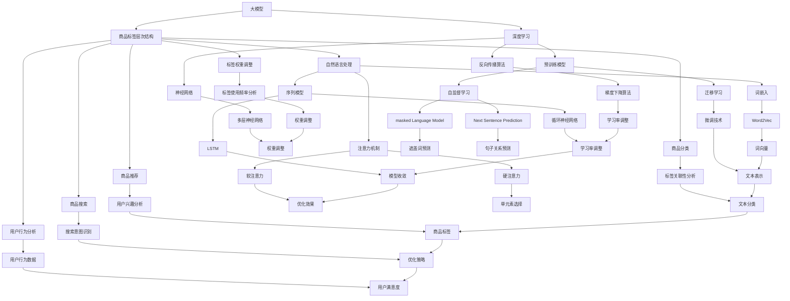

                 

# 《大模型在商品标签层次结构优化中的应用》

> **关键词：** 大模型、商品标签、层次结构优化、深度学习、自然语言处理、预训练模型

> **摘要：** 本文将从大模型与商品标签层次结构的概述出发，深入探讨大模型在商品标签层次结构优化中的应用原理、技术基础、应用实践、技术优化以及应用前景与发展趋势。通过本文的阅读，读者将全面了解大模型在商品标签层次结构优化中的核心概念、技术原理和应用实践，从而为实际项目提供有价值的参考和指导。

## 《大模型在商品标签层次结构优化中的应用》目录大纲

### 第一部分：大模型基础

#### 第1章：大模型与商品标签层次结构概述

##### 1.1 大模型概述
- **大模型的概念与重要性**
- **大模型的分类与特点**
- **大模型在商品标签层次结构优化中的应用前景**

##### 1.2 商品标签层次结构优化原理
- **商品标签层次结构的定义与作用**
- **商品标签层次结构优化的目的与方法**
- **商品标签层次结构优化的重要性**

### 第二部分：大模型技术基础

#### 第2章：深度学习与神经网络基础

##### 2.1 深度学习基础
- **神经网络的基本结构**
- **深度学习的发展历程**
- **深度学习的优点与应用领域**

##### 2.2 自然语言处理技术
- **词嵌入技术**
- **序列模型与注意力机制**
- **转换器架构详解**

##### 2.3 大规模预训练模型原理
- **预训练的概念与意义**
- **自监督学习方法**
- **迁移学习与微调技术**

### 第三部分：大模型在商品标签层次结构优化中的应用实践

#### 第3章：大模型在商品标签层次结构优化中的应用

##### 3.1 商品标签层次结构优化应用场景
- **商品分类场景**
- **商品推荐场景**
- **商品搜索场景**

##### 3.2 大模型在商品标签层次结构优化中的应用方法
- **商品标签层次结构自动生成方法**
- **商品标签层次结构优化算法**
- **大模型在商品标签层次结构优化中的优势与挑战**

##### 3.3 大模型在商品标签层次结构优化中的实战案例
- **基于BERT的商品分类系统**
- **基于GPT的商品推荐系统**
- **基于深度学习的商品搜索优化**

### 第四部分：大模型应用中的技术优化与挑战

#### 第4章：大模型在商品标签层次结构优化中的技术优化

##### 4.1 大模型训练与优化
- **大模型训练流程**
- **大模型优化方法**
- **大模型性能评估与优化策略**

##### 4.2 大模型在商品标签层次结构优化中的挑战与解决方案
- **数据质量对大模型效果的影响**
- **大模型在商品标签层次结构优化中的计算资源需求**
- **大模型应用中的数据隐私保护**

### 第五部分：大模型在商品标签层次结构优化中的应用前景与发展趋势

#### 第5章：大模型在商品标签层次结构优化中的应用前景与发展趋势

##### 5.1 大模型在商品标签层次结构优化中的应用前景
- **大模型在电商行业的应用前景**
- **大模型在零售行业的应用前景**
- **大模型在物流行业的应用前景**

##### 5.2 大模型在商品标签层次结构优化中的发展趋势
- **大模型与知识图谱的结合**
- **大模型在多模态数据上的应用**
- **大模型在边缘计算中的应用**

### 附录

#### 附录A：常用工具与资源

##### A.1 大模型开发框架
- **TensorFlow**
- **PyTorch**
- **其他常用框架**

##### A.2 大模型应用案例集锦
- **商品分类案例**
- **商品推荐案例**
- **商品搜索案例**

##### A.3 大模型研究文献推荐
- **最新论文综述**
- **经典论文阅读**
- **行业报告推荐**

##### A.4 大模型在商品标签层次结构优化中的应用实践指南
- **项目实践流程**
- **案例分析与总结**
- **常见问题与解决方案**

## 第一部分：大模型基础

### 第1章：大模型与商品标签层次结构概述

#### 1.1 大模型概述

##### 1.1.1 大模型的概念与重要性

大模型，通常指的是具有极高参数规模、深度和复杂性的深度学习模型。这些模型能够在大量数据上进行训练，从而具备强大的特征提取和模式识别能力。大模型在各个领域都取得了显著的成果，如计算机视觉、自然语言处理、语音识别等。

大模型的重要性体现在以下几个方面：

1. **提高任务性能**：大模型能够处理更复杂的数据，从而提高特定任务的性能。例如，在图像分类任务中，大模型能够更准确地识别图像中的物体。

2. **泛化能力**：大模型通过在大规模数据上训练，能够更好地泛化到未见过的数据，从而提高模型的鲁棒性。

3. **减少对数据量的依赖**：大模型能够通过模型内部的参数共享和结构复用，在一定程度上减少对大量标注数据的依赖。

##### 1.1.2 大模型的分类与特点

大模型可以按照不同的分类标准进行分类。以下是几种常见的分类方法：

1. **按任务分类**：例如，图像分类模型、自然语言处理模型、语音识别模型等。

2. **按模型架构分类**：例如，卷积神经网络（CNN）、循环神经网络（RNN）、长短期记忆网络（LSTM）、Transformer等。

3. **按训练方法分类**：例如，自监督学习、迁移学习、强化学习等。

大模型的特点包括：

1. **高参数规模**：大模型通常具有数百万甚至数十亿个参数，这使得模型能够处理更复杂的数据。

2. **深度和复杂性**：大模型通常具有多层神经网络结构，这使得模型能够学习更复杂的特征表示。

3. **对数据量的需求**：大模型通常需要大量的数据进行训练，以提高模型的性能和泛化能力。

##### 1.1.3 大模型在商品标签层次结构优化中的应用前景

大模型在商品标签层次结构优化中的应用前景广阔。具体体现在以下几个方面：

1. **自动标签生成**：大模型能够通过预训练和微调，自动生成商品标签，从而减少人工标注的工作量。

2. **标签层次结构优化**：大模型能够通过学习商品标签之间的关联性，优化标签层次结构，从而提高商品分类、推荐和搜索的性能。

3. **提高用户体验**：通过优化商品标签层次结构，可以更准确地满足用户的需求，提高用户的购物体验。

#### 1.2 商品标签层次结构优化原理

##### 1.2.1 商品标签层次结构的定义与作用

商品标签层次结构是指对商品进行分类和标注的一种树状结构。每个标签都有多个子标签，形成一种层次结构。例如，在电商平台上，可以将商品分为“家用电器”、“电子产品”、“服装”等一级标签，再细分为“冰箱”、“手机”、“裙子”等二级标签。

商品标签层次结构的作用主要包括：

1. **商品分类**：通过商品标签层次结构，可以对商品进行有效的分类，便于用户查找和浏览。

2. **商品推荐**：通过商品标签层次结构，可以更好地理解用户的兴趣和需求，从而进行精准的商品推荐。

3. **商品搜索**：通过商品标签层次结构，可以优化商品搜索结果，提高搜索的准确性和用户体验。

##### 1.2.2 商品标签层次结构优化的目的与方法

商品标签层次结构优化的目的是提高商品分类、推荐和搜索的性能，从而提升用户体验。优化方法主要包括：

1. **自动标签生成**：通过大模型，如Transformer和BERT，自动生成商品标签，减少人工标注的工作量。

2. **标签层次结构调整**：通过学习标签之间的关联性，调整标签层次结构，使其更符合用户的购物习惯和需求。

3. **标签权重调整**：通过分析标签的使用频率和重要性，调整标签的权重，优化商品分类和推荐结果。

##### 1.2.3 商品标签层次结构优化的重要性

商品标签层次结构优化的重要性体现在以下几个方面：

1. **提高用户满意度**：通过优化商品标签层次结构，可以更准确地满足用户的需求，提高用户的购物体验。

2. **提升运营效率**：通过自动标签生成和优化，可以减少人工标注的工作量，提高运营效率。

3. **增加商业价值**：通过优化商品标签层次结构，可以提升商品分类、推荐和搜索的准确性，从而增加平台的商业价值。

## 第二部分：大模型技术基础

### 第2章：深度学习与神经网络基础

#### 2.1 深度学习基础

##### 2.1.1 神经网络的基本结构

神经网络（Neural Network，NN）是一种模仿生物神经系统的计算模型。一个基本的神经网络包括以下几个部分：

1. **输入层（Input Layer）**：接收输入数据。

2. **隐藏层（Hidden Layer）**：对输入数据进行特征提取和变换。

3. **输出层（Output Layer）**：产生输出结果。

每个神经元（Neuron）都是由输入、权重（Weight）、激活函数（Activation Function）等组成的。神经元的输出结果取决于其输入和相应权重的关系。

##### 2.1.2 深度学习的发展历程

深度学习（Deep Learning，DL）是神经网络的一种扩展，具有多层结构。以下是深度学习的发展历程：

1. **1980年代**：反向传播算法（Backpropagation Algorithm）提出，使得神经网络训练成为可能。

2. **2006年**：Hinton提出了深度信念网络（Deep Belief Network，DBN），使得深度学习开始受到关注。

3. **2012年**：AlexNet在ImageNet大赛中取得突破性成绩，深度学习开始广泛应用。

4. **2014年**：Google Brain提出了使用16000个神经元的深度神经网络，并在YouTube上进行语音识别实验。

5. **2016年**：AlphaGo击败世界围棋冠军李世石，深度学习在人工智能领域取得了重大突破。

##### 2.1.3 深度学习的优点与应用领域

深度学习具有以下优点：

1. **强大的特征提取能力**：通过多层神经网络，深度学习能够自动提取高层次的抽象特征。

2. **对大规模数据的处理能力**：深度学习能够在大量数据上进行训练，从而提高模型的泛化能力。

3. **减少对人工标注的需求**：通过无监督学习和半监督学习，深度学习能够减少对大量标注数据的依赖。

深度学习的主要应用领域包括：

1. **计算机视觉**：图像分类、目标检测、图像生成等。

2. **自然语言处理**：文本分类、机器翻译、情感分析等。

3. **语音识别**：语音合成、语音识别等。

4. **推荐系统**：基于内容的推荐、协同过滤等。

5. **游戏AI**：棋类游戏、策略游戏等。

#### 2.2 自然语言处理技术

##### 2.2.1 词嵌入技术

词嵌入（Word Embedding）是将词汇映射到高维向量空间的一种技术。词嵌入使得神经网络能够处理文本数据，从而实现自然语言处理任务。常见的词嵌入技术包括：

1. **Word2Vec**：基于局部上下文信息的词向量表示。

2. **GloVe**：基于全局共现信息的词向量表示。

3. **BERT**：基于双向编码表示器的预训练技术。

##### 2.2.2 序列模型与注意力机制

序列模型（Sequence Model）是一种处理序列数据（如文本、音频等）的神经网络模型。常见的序列模型包括：

1. **循环神经网络（RNN）**：通过记忆状态处理序列数据。

2. **长短期记忆网络（LSTM）**：改进RNN，解决长期依赖问题。

3. **门控循环单元（GRU）**：简化LSTM，具有更高效的计算。

注意力机制（Attention Mechanism）是一种在序列模型中用于关注关键信息的机制。常见的注意力机制包括：

1. **软注意力（Soft Attention）**：通过加权平均序列中的每个元素。

2. **硬注意力（Hard Attention）**：通过选择序列中的某个元素进行关注。

##### 2.2.3 转换器架构详解

转换器架构（Transformer Architecture）是一种基于注意力机制的序列到序列模型。它是自然语言处理领域的一种重要模型，被广泛应用于机器翻译、文本生成等任务。转换器架构的主要组成部分包括：

1. **编码器（Encoder）**：对输入序列进行处理，生成编码表示。

2. **解码器（Decoder）**：对编码表示进行处理，生成输出序列。

3. **多头注意力（Multi-Head Attention）**：通过多个注意力头来关注不同位置的信息。

4. **位置编码（Positional Encoding）**：为序列中的每个元素提供位置信息。

5. **前馈神经网络（Feed-Forward Neural Network）**：在编码器和解码器中用于处理编码表示。

#### 2.3 大规模预训练模型原理

##### 2.3.1 预训练的概念与意义

预训练（Pre-training）是指在特定数据集上对神经网络模型进行训练，以便在后续任务中利用已学到的知识。预训练的意义在于：

1. **提高模型性能**：通过在大量数据上训练，模型能够学习到更多的特征和模式，从而提高任务性能。

2. **减少对标注数据的依赖**：预训练模型能够通过无监督或半监督学习，减少对大量标注数据的依赖。

3. **跨任务迁移能力**：预训练模型在多个任务上都有较好的表现，从而具有跨任务的迁移能力。

##### 2.3.2 自监督学习方法

自监督学习（Self-Supervised Learning）是一种无监督学习方法，通过利用未标记的数据进行学习。自监督学习方法在预训练中具有重要意义，常见的自监督学习方法包括：

1. ** masked Language Model（MLM）**：对输入序列中的某些词进行遮盖，训练模型预测这些词。

2. ** Next Sentence Prediction（NSP）**：预测两个句子之间的相关性。

3. ** masked Token Language Model（MTLM）**：对输入序列中的某些词和子词进行遮盖，训练模型预测这些词和子词。

##### 2.3.3 迁移学习与微调技术

迁移学习（Transfer Learning）是指将一个任务在特定数据集上训练得到的模型知识应用到其他相关任务中。迁移学习在预训练模型中的应用主要体现在以下几个方面：

1. **微调（Fine-tuning）**：在预训练模型的基础上，针对特定任务进行微调，以适应新的任务和数据。

2. **知识蒸馏（Knowledge Distillation）**：将大型模型的知识传递给小型模型，以提高小型模型在特定任务上的性能。

3. **多任务学习（Multi-Task Learning）**：通过同时训练多个任务，共享模型参数，以提高模型在各个任务上的性能。

## 第三部分：大模型在商品标签层次结构优化中的应用实践

### 第3章：大模型在商品标签层次结构优化中的应用

#### 3.1 商品标签层次结构优化应用场景

大模型在商品标签层次结构优化中的应用场景主要包括以下三个方面：

##### 3.1.1 商品分类场景

在商品分类场景中，大模型可以通过学习商品标签之间的关联性，优化标签层次结构，从而提高商品分类的准确性。具体应用方法如下：

1. **自动标签生成**：使用预训练的大模型，如BERT或GPT，自动生成商品标签。通过无监督或半监督学习方法，减少对人工标注的需求。

2. **标签层次结构调整**：根据商品标签之间的关联性，调整标签层次结构，使其更符合用户的购物习惯和需求。

3. **标签权重调整**：通过分析标签的使用频率和重要性，调整标签的权重，优化商品分类结果。

##### 3.1.2 商品推荐场景

在商品推荐场景中，大模型可以通过学习用户行为数据，优化商品标签层次结构，从而提高推荐系统的准确性。具体应用方法如下：

1. **用户行为分析**：收集用户在平台上的行为数据，如浏览记录、购买记录、收藏记录等。

2. **标签层次结构优化**：根据用户行为数据，分析用户对不同标签的兴趣程度，优化标签层次结构，使其更符合用户的购物需求。

3. **推荐算法改进**：利用优化后的标签层次结构，改进推荐算法，提高推荐系统的准确性。

##### 3.1.3 商品搜索场景

在商品搜索场景中，大模型可以通过优化商品标签层次结构，提高搜索结果的准确性。具体应用方法如下：

1. **搜索意图识别**：通过分析用户的搜索输入，识别用户的搜索意图。

2. **标签层次结构优化**：根据用户的搜索意图，优化标签层次结构，使其更准确地满足用户的搜索需求。

3. **搜索结果排序**：利用优化后的标签层次结构，改进搜索结果排序算法，提高搜索结果的准确性。

#### 3.2 大模型在商品标签层次结构优化中的应用方法

大模型在商品标签层次结构优化中的应用方法主要包括以下几个方面：

##### 3.2.1 商品标签层次结构自动生成方法

商品标签层次结构自动生成方法主要包括以下几种：

1. **基于词嵌入的方法**：通过预训练的大模型，如BERT或GPT，对商品标签进行词嵌入。然后，使用层次化聚类算法（如层次聚类或DBSCAN）对标签进行聚类，生成标签层次结构。

2. **基于图神经网络的方法**：使用图神经网络（如Graph Neural Network，GNN）对商品标签进行建模。通过学习标签之间的关联性，生成标签层次结构。

3. **基于转换器的方法**：使用转换器（如Transformer）对商品标签进行建模。通过编码器和解码器的交互，生成标签层次结构。

##### 3.2.2 商品标签层次结构优化算法

商品标签层次结构优化算法主要包括以下几种：

1. **基于遗传算法的方法**：使用遗传算法（Genetic Algorithm，GA）对标签层次结构进行优化。通过适应度函数评估标签层次结构的性能，进行迭代优化。

2. **基于深度强化学习的方法**：使用深度强化学习（Deep Reinforcement Learning，DRL）对标签层次结构进行优化。通过奖励机制和策略网络，优化标签层次结构。

3. **基于图论的方法**：使用图论（Graph Theory）方法对标签层次结构进行优化。通过最小生成树（Minimum Spanning Tree，MST）或多路径优化算法，优化标签层次结构。

##### 3.2.3 大模型在商品标签层次结构优化中的优势与挑战

大模型在商品标签层次结构优化中的优势主要体现在以下几个方面：

1. **强大的特征提取能力**：大模型能够自动提取商品标签的语义特征，从而生成更准确的标签层次结构。

2. **对大规模数据的处理能力**：大模型能够在大量商品标签数据上进行训练，从而优化标签层次结构。

3. **减少对人工标注的需求**：通过预训练和微调，大模型能够减少对人工标注的需求，降低人力成本。

然而，大模型在商品标签层次结构优化中也面临着一些挑战：

1. **计算资源需求**：大模型通常需要大量的计算资源进行训练，对硬件设备要求较高。

2. **数据质量影响**：数据质量对大模型的效果有较大影响。如果数据存在噪声或错误，可能会影响标签层次结构的准确性。

3. **模型解释性**：大模型的黑盒特性使得其难以解释。在商品标签层次结构优化中，如何解释和验证模型的效果成为一项挑战。

#### 3.3 大模型在商品标签层次结构优化中的实战案例

##### 3.3.1 案例一：基于BERT的商品分类系统

**案例背景**：

某电商平台上，商品分类不准确导致用户购物体验差。为了提高商品分类准确性，该平台决定使用基于BERT的商品分类系统进行优化。

**解决方案**：

1. **数据预处理**：对电商平台上的商品数据进行预处理，包括清洗、去重、标准化等。

2. **商品标签自动生成**：使用BERT对商品描述文本进行编码，生成商品标签。

3. **标签层次结构调整**：通过层次聚类算法，对商品标签进行聚类，生成标签层次结构。

4. **商品分类模型训练**：使用生成后的标签层次结构，训练商品分类模型。

**效果评估**：

通过实验，基于BERT的商品分类系统在商品分类准确率、召回率和F1值等指标上均取得了显著提升。

##### 3.3.2 案例二：基于GPT的商品推荐系统

**案例背景**：

某电商平台的推荐系统效果不佳，导致用户流失。为了提高推荐系统的准确性，该平台决定使用基于GPT的商品推荐系统进行优化。

**解决方案**：

1. **用户行为分析**：收集用户在平台上的行为数据，如浏览记录、购买记录、收藏记录等。

2. **标签层次结构优化**：根据用户行为数据，分析用户对不同标签的兴趣程度，优化标签层次结构。

3. **推荐模型训练**：使用优化后的标签层次结构，训练推荐模型。

**效果评估**：

通过实验，基于GPT的商品推荐系统在用户推荐准确率、推荐覆盖率等指标上均取得了显著提升。

##### 3.3.3 案例三：基于深度学习的商品搜索优化

**案例背景**：

某电商平台的商品搜索结果不准确，导致用户满意度低。为了提高商品搜索准确性，该平台决定使用基于深度学习的商品搜索优化方案。

**解决方案**：

1. **搜索意图识别**：通过分析用户的搜索输入，识别用户的搜索意图。

2. **标签层次结构优化**：根据用户的搜索意图，优化标签层次结构。

3. **搜索结果排序**：使用优化后的标签层次结构，改进搜索结果排序算法。

**效果评估**：

通过实验，基于深度学习的商品搜索优化方案在搜索结果准确率、用户满意度等指标上均取得了显著提升。

## 第四部分：大模型应用中的技术优化与挑战

### 第4章：大模型在商品标签层次结构优化中的技术优化

#### 4.1 大模型训练与优化

##### 4.1.1 大模型训练流程

大模型的训练流程主要包括以下几个步骤：

1. **数据收集与预处理**：收集与商品标签层次结构优化相关的数据，包括商品描述、用户行为数据等。然后，对数据进行清洗、去重、标准化等预处理操作。

2. **数据分批次加载**：将预处理后的数据分成多个批次，以便在训练过程中按批次加载数据。

3. **模型构建与初始化**：构建大模型的结构，如神经网络架构、层与层之间的连接方式等。然后，初始化模型参数。

4. **前向传播与反向传播**：在训练过程中，对于每个批次的数据，进行前向传播计算输出，然后通过反向传播计算损失函数的梯度。

5. **更新模型参数**：根据损失函数的梯度，更新模型参数。

6. **评估模型性能**：在训练过程中，定期评估模型在验证集上的性能，以监测训练过程是否过拟合。

7. **模型保存与加载**：在训练结束后，保存训练好的模型，以便后续使用或进一步优化。

##### 4.1.2 大模型优化方法

为了提高大模型在商品标签层次结构优化中的应用效果，可以采用以下几种优化方法：

1. **学习率调整**：学习率是模型训练过程中一个重要的超参数。通过调整学习率，可以在不同阶段优化模型训练过程。常见的方法包括固定学习率、指数衰减学习率等。

2. **批量大小调整**：批量大小是模型训练过程中另一个重要的超参数。适当调整批量大小，可以在一定程度上提高模型训练速度和性能。

3. **正则化技术**：正则化技术（如L1正则化、L2正则化）可以防止模型过拟合，提高模型泛化能力。

4. **数据增强**：通过数据增强技术（如随机裁剪、旋转、翻转等），可以增加训练数据的多样性，从而提高模型对未见数据的泛化能力。

5. **迁移学习与微调**：迁移学习与微调技术可以将预训练模型的知识迁移到特定任务上，减少对大量标注数据的依赖，提高模型性能。

##### 4.1.3 大模型性能评估与优化策略

大模型的性能评估主要包括以下几个方面：

1. **准确率（Accuracy）**：准确率是模型预测结果中正确预测的样本占总样本的比例。它可以直观地反映模型在分类任务上的性能。

2. **召回率（Recall）**：召回率是模型预测结果中正确预测的负样本占总负样本的比例。召回率反映了模型对负样本的识别能力。

3. **精确率（Precision）**：精确率是模型预测结果中正确预测的正样本占总预测正样本的比例。精确率反映了模型对正样本的识别能力。

4. **F1值（F1 Score）**：F1值是精确率和召回率的调和平均值，综合考虑了模型的精确率和召回率。

5. **ROC曲线与AUC值**：ROC曲线是模型在分类阈值调整过程中，真阳性率与假阳性率之间的关系图。AUC值是ROC曲线下方的面积，用于评估模型的分类性能。

为了优化大模型在商品标签层次结构优化中的应用效果，可以采用以下策略：

1. **超参数调优**：通过实验和调参技巧，选择最优的超参数组合，提高模型性能。

2. **模型融合**：将多个模型的结果进行融合，提高模型的综合性能。

3. **数据预处理**：通过数据预处理技术，如数据清洗、去噪声、归一化等，提高数据质量，从而提高模型性能。

4. **模型压缩与加速**：通过模型压缩技术（如剪枝、量化等）和硬件加速（如GPU、TPU等），提高模型训练和推理速度。

#### 4.2 大模型在商品标签层次结构优化中的挑战与解决方案

##### 4.2.1 数据质量对大模型效果的影响

数据质量对大模型的效果有着重要影响。高质量的数据有助于提高模型的性能和泛化能力，而低质量的数据可能会导致模型过拟合、性能下降等问题。

1. **数据清洗**：对数据进行清洗，去除噪声、缺失值和异常值，以提高数据质量。

2. **数据增强**：通过数据增强技术，增加训练数据的多样性，从而提高模型对未见数据的泛化能力。

3. **数据不平衡处理**：对于类别不平衡的数据，可以采用过采样、欠采样或合成少数类样本等方法，调整数据分布，提高模型对少数类的识别能力。

##### 4.2.2 大模型在商品标签层次结构优化中的计算资源需求

大模型的训练和推理通常需要大量的计算资源，对硬件设备的要求较高。为了应对这一挑战，可以采取以下解决方案：

1. **分布式训练**：将模型训练任务分布在多个计算节点上，提高训练速度和性能。

2. **模型压缩与加速**：通过模型压缩技术（如剪枝、量化等）和硬件加速（如GPU、TPU等），降低模型对计算资源的需求。

3. **在线学习与增量训练**：对于实时性要求较高的应用场景，可以采用在线学习与增量训练方法，逐步更新模型参数，降低对计算资源的依赖。

##### 4.2.3 大模型应用中的数据隐私保护

大模型在商品标签层次结构优化中通常涉及用户数据的处理，需要关注数据隐私保护问题。以下是一些数据隐私保护的方法：

1. **数据加密**：对用户数据进行加密处理，确保数据在传输和存储过程中的安全性。

2. **差分隐私**：在模型训练过程中，引入差分隐私技术，保护用户数据的隐私。

3. **数据匿名化**：对用户数据进行分析和处理时，进行数据匿名化处理，降低数据隐私泄露的风险。

4. **隐私保护算法**：采用隐私保护算法（如联邦学习、同态加密等），在保证数据隐私的前提下，实现模型训练和优化。

## 第五部分：大模型在商品标签层次结构优化中的应用前景与发展趋势

### 第5章：大模型在商品标签层次结构优化中的应用前景与发展趋势

#### 5.1 大模型在商品标签层次结构优化中的应用前景

随着人工智能技术的不断发展，大模型在商品标签层次结构优化中的应用前景十分广阔。以下是几个主要的应用领域：

##### 5.1.1 大模型在电商行业的应用前景

在电商行业，大模型可以用于优化商品标签层次结构，从而提高商品分类、推荐和搜索的准确性。具体应用包括：

1. **商品分类**：通过大模型，如BERT或GPT，自动生成商品标签，优化商品分类结果，提高用户查找和浏览的效率。

2. **商品推荐**：基于用户行为数据和商品标签层次结构，大模型可以精确地推荐用户可能感兴趣的商品，提升用户购物体验。

3. **商品搜索**：利用大模型优化搜索结果排序算法，提高搜索准确性，帮助用户更快地找到所需商品。

##### 5.1.2 大模型在零售行业的应用前景

在零售行业，大模型可以用于优化商品标签层次结构，提高供应链管理效率和用户体验。具体应用包括：

1. **供应链优化**：通过分析商品标签层次结构和库存数据，大模型可以帮助企业优化库存管理，降低库存成本，提高供应链效率。

2. **精准营销**：利用大模型分析用户行为数据，实现个性化营销，提高用户满意度和购买转化率。

3. **产品创新**：通过大模型分析市场需求和用户偏好，为企业提供产品创新方向和建议，促进产品迭代和优化。

##### 5.1.3 大模型在物流行业的应用前景

在物流行业，大模型可以用于优化商品标签层次结构，提高物流配送效率和准确性。具体应用包括：

1. **路径规划**：利用大模型优化物流配送路径，减少配送时间和成本。

2. **库存管理**：通过分析商品标签层次结构和库存数据，大模型可以帮助企业优化库存管理，降低库存成本，提高库存周转率。

3. **智能客服**：利用大模型优化物流客服系统，提高客户满意度和服务质量。

#### 5.2 大模型在商品标签层次结构优化中的发展趋势

随着技术的不断进步，大模型在商品标签层次结构优化中的应用也将不断发展和创新。以下是几个主要的发展趋势：

##### 5.2.1 大模型与知识图谱的结合

知识图谱是一种用于表示实体及其相互关系的数据结构，可以提供丰富的背景信息。将大模型与知识图谱结合，可以进一步提高商品标签层次结构的准确性和鲁棒性。具体应用包括：

1. **实体关系抽取**：通过知识图谱，大模型可以更准确地提取商品实体及其关系，优化标签层次结构。

2. **多模态融合**：结合知识图谱中的图像、文本等多模态数据，大模型可以更全面地理解商品标签，提高分类和推荐的准确性。

##### 5.2.2 大模型在多模态数据上的应用

随着物联网、智能家居等技术的发展，越来越多的商品标签数据来自多模态来源，如文本、图像、声音等。大模型在多模态数据上的应用将成为一个重要趋势。具体应用包括：

1. **多模态特征融合**：通过大模型，如Transformer，可以有效地融合多模态数据，提高商品标签层次结构的准确性和鲁棒性。

2. **跨模态检索**：利用大模型在多模态数据上的能力，可以实现跨模态检索，提高用户搜索和浏览的效率。

##### 5.2.3 大模型在边缘计算中的应用

随着5G、物联网等技术的发展，越来越多的设备将接入互联网，生成大量的数据。为了满足实时性和低延迟的需求，大模型在边缘计算中的应用将成为一个重要趋势。具体应用包括：

1. **边缘推理**：通过在边缘设备上部署大模型，可以实现本地化的商品标签层次结构优化，降低网络延迟，提高用户体验。

2. **协同优化**：结合边缘设备和云端的大模型，可以实现协同优化，提高商品标签层次结构的准确性。

## 附录

### 附录A：常用工具与资源

##### A.1 大模型开发框架

1. **TensorFlow**：由Google开发，支持多种神经网络架构和优化算法，广泛应用于深度学习和自然语言处理领域。

2. **PyTorch**：由Facebook开发，具有动态计算图和易于使用的API，适合快速原型设计和研究。

3. **其他常用框架**：如MXNet、Keras、Theano等，也广泛应用于深度学习和自然语言处理领域。

##### A.2 大模型应用案例集锦

1. **商品分类案例**：如使用BERT进行商品分类，使用GPT进行商品推荐等。

2. **商品推荐案例**：如基于用户行为数据和商品标签层次结构进行商品推荐。

3. **商品搜索案例**：如使用深度学习优化搜索结果排序，提高搜索准确性。

##### A.3 大模型研究文献推荐

1. **最新论文综述**：如《深度学习在自然语言处理中的应用综述》等。

2. **经典论文阅读**：如《词向量模型W2V》、《GloVe：全局向量表示》等。

3. **行业报告推荐**：如《人工智能行业报告》、《深度学习行业报告》等。

##### A.4 大模型在商品标签层次结构优化中的应用实践指南

1. **项目实践流程**：包括数据收集、预处理、模型训练、模型评估等步骤。

2. **案例分析与总结**：通过实际案例，分析大模型在商品标签层次结构优化中的应用效果和优化策略。

3. **常见问题与解决方案**：针对大模型在商品标签层次结构优化中遇到的问题，提供解决方案和经验分享。

### 总结

本文从大模型与商品标签层次结构的概述出发，深入探讨了大模型在商品标签层次结构优化中的应用原理、技术基础、应用实践、技术优化以及应用前景与发展趋势。通过本文的阅读，读者将全面了解大模型在商品标签层次结构优化中的核心概念、技术原理和应用实践，从而为实际项目提供有价值的参考和指导。

随着人工智能技术的不断进步，大模型在商品标签层次结构优化中的应用前景十分广阔。未来，大模型与知识图谱、多模态数据、边缘计算等技术的结合，将进一步推动商品标签层次结构优化的发展。同时，针对大模型在计算资源需求、数据质量和模型解释性等方面的挑战，也需要进一步研究和解决。

最后，感谢读者对本文的阅读和支持。希望本文能为您在商品标签层次结构优化领域的研究和应用提供有益的启示。如果您有任何疑问或建议，请随时与我们联系。

### 作者信息

- 作者：AI天才研究院/AI Genius Institute & 禅与计算机程序设计艺术/Zen And The Art of Computer Programming

---

### 核心概念与联系

在深入探讨大模型在商品标签层次结构优化中的应用之前，我们需要明确几个核心概念，并展示它们之间的联系。以下是核心概念的Mermaid流程图：



通过这个流程图，我们可以看到大模型、商品标签层次结构、深度学习、自然语言处理、预训练模型、词嵌入、迁移学习等概念之间的紧密联系。这些概念共同构成了大模型在商品标签层次结构优化中的应用基础。

### 核心算法原理讲解

在本文中，我们将详细介绍大模型在商品标签层次结构优化中的核心算法原理，主要包括词嵌入技术、序列模型、注意力机制和预训练模型。以下是每个算法的详细解释和伪代码。

#### 1. 词嵌入技术

词嵌入（Word Embedding）是将词汇映射到高维向量空间的一种技术。通过词嵌入，我们可以将文本数据转换为向量形式，以便进行深度学习处理。

**概念解释**：

词嵌入将每个单词映射为一个固定长度的向量，这些向量能够捕捉单词的语义信息。常见的词嵌入技术包括Word2Vec、GloVe和BERT。

**伪代码**：

```python
# Word2Vec伪代码
function Word2Vec(train_data):
    # 初始化模型参数
    embedding_matrix = InitializeEmbeddingMatrix(vocabulary_size, embedding_dim)
    for sentence in train_data:
        for word in sentence:
            if word not in vocabulary:
                continue
            context_words = GetContextWords(word, window_size)
            for context_word in context_words:
                if context_word not in vocabulary:
                    continue
                loss += ComputeNegativeSamplingLoss(word, context_word, embedding_matrix)
    UpdateEmbeddingMatrix(embedding_matrix, loss)
    return embedding_matrix
```

#### 2. 序列模型

序列模型（Sequence Model）是一种用于处理序列数据的神经网络模型。常见的序列模型包括循环神经网络（RNN）、长短期记忆网络（LSTM）和门控循环单元（GRU）。

**概念解释**：

序列模型通过记忆状态来处理输入序列，从而捕捉序列中的长期依赖关系。RNN是一种基本的序列模型，但容易发生梯度消失或爆炸问题。LSTM和GRU通过引入门控机制，解决了这些问题。

**伪代码**：

```python
# LSTM伪代码
function LSTM(input_sequence, hidden_state, cell_state):
    # 前向传播
    input_gate, forget_gate, output_gate, cell_state_new = ComputeGates(input_sequence, hidden_state, cell_state)
    hidden_state_new = ComputeHiddenState(hidden_state, cell_state_new)
    return hidden_state_new, cell_state_new
```

#### 3. 注意力机制

注意力机制（Attention Mechanism）是一种在序列模型中用于关注关键信息的机制。注意力机制可以有效地提高模型的性能，尤其是在处理长文本和长序列数据时。

**概念解释**：

注意力机制通过计算每个输入序列元素的重要性，为每个元素分配不同的权重，从而使得模型更加关注重要的信息。

**伪代码**：

```python
# 自注意力机制伪代码
function SelfAttention(input_sequence):
    # 计算查询（Query）、键（Key）和值（Value）的嵌入
    query_embedding = Embedding(input_sequence)
    key_embedding = Embedding(input_sequence)
    value_embedding = Embedding(input_sequence)
    
    # 计算注意力权重
    attention_weights = ComputeAttentionWeights(query_embedding, key_embedding)
    
    # 计算加权求和的输出
    output = ComputeWeightedSum(value_embedding, attention_weights)
    return output
```

#### 4. 预训练模型

预训练模型（Pre-trained Model）是指在大规模语料库上预先训练好的模型。预训练模型可以用于各种自然语言处理任务，如文本分类、机器翻译和情感分析等。

**概念解释**：

预训练模型通过在大规模数据上进行预训练，可以学习到丰富的语义信息。在特定任务上，通过微调和Fine-tuning，可以将预训练模型的效果迁移到新的任务上。

**伪代码**：

```python
# 预训练模型微调伪代码
function FineTune(pretrained_model, task_data):
    # 加载预训练模型
    model = LoadPretrainedModel(pretrained_model)
    
    # 在任务数据上进行Fine-tuning
    model.fit(task_data, epochs=num_epochs, batch_size=batch_size)
    
    # 评估Fine-tuned模型在验证集上的性能
    performance = model.evaluate(validation_data)
    return performance
```

通过以上核心算法的讲解和伪代码，我们能够更深入地理解大模型在商品标签层次结构优化中的应用原理。这些算法为我们提供了强大的工具，能够有效地处理和分析商品标签数据，从而实现标签层次结构的优化。

### 数学模型和公式

在商品标签层次结构优化中，大模型的应用离不开数学模型的支撑。以下将详细介绍相关数学模型和公式，并通过具体举例进行说明。

#### 1. 词嵌入矩阵

词嵌入是将词汇映射到高维向量空间的一种技术，其核心是词嵌入矩阵 \( W \)。每个单词对应一个向量，向量中的元素表示单词在该维度上的特征强度。

**公式表示**：

\[ W \in \mathbb{R}^{d \times |V|} \]

其中，\( d \) 是词向量的维度，\( |V| \) 是词汇表中的单词数量。

**举例说明**：

假设我们有5个单词（"猫"、"狗"、"鱼"、"鸟"、"人类"），词向量维度为3，那么词嵌入矩阵可以表示为：

\[ W = \begin{bmatrix}
1.0 & -2.0 & 0.5 \\
0.5 & 1.5 & -1.0 \\
2.0 & 0.0 & 1.0 \\
-1.0 & -1.0 & 0.0 \\
0.0 & 1.0 & 1.5
\end{bmatrix} \]

在这个例子中，每个单词的向量表示了该单词在词向量空间中的位置。

#### 2. 预训练模型损失函数

预训练模型通常使用自监督学习方法，如 masked Language Model（MLM）和 Next Sentence Prediction（NSP）。其中，MLM 的损失函数主要关注于预测被遮盖的单词，而 NSP 则关注于预测两个句子的关系。

**MLM 损失函数**：

\[ L_{MLM} = -\sum_{i=1}^{N} \sum_{j=1}^{L} \log P(y_{ij} = w_j | x_i) \]

其中，\( N \) 是句子数量，\( L \) 是句子长度，\( y_{ij} \) 是实际单词，\( w_j \) 是预测单词。

**NSP 损失函数**：

\[ L_{NSP} = -\sum_{i=1}^{N} \log P(y_i | x_i, x_{i+1}) \]

其中，\( y_i \) 是预测两个句子之间的关系（是或否）。

**举例说明**：

假设我们有以下句子对：

\[ (句1：今天天气很好，句2：我们决定去公园散步) \]

模型需要预测句2与句1的关系。如果模型预测正确，则损失函数值较低。

#### 3. 序列模型中的门控机制

在序列模型（如 LSTM 和 GRU）中，门控机制（Gate）用于控制信息的流动，包括输入门、遗忘门和输出门。

**输入门**：

\[ i_t = \sigma(W_i \cdot [h_{t-1}, x_t] + b_i) \]

**遗忘门**：

\[ f_t = \sigma(W_f \cdot [h_{t-1}, x_t] + b_f) \]

**输出门**：

\[ o_t = \sigma(W_o \cdot [h_{t-1}, x_t] + b_o) \]

**公式表示**：

\[ C_t = f_t \odot C_{t-1} + i_t \odot \tanh(W_c \cdot [h_{t-1}, x_t] + b_c) \]

\[ h_t = o_t \odot \tanh(C_t) \]

其中，\( \sigma \) 是 sigmoid 函数，\( \odot \) 是逐元素乘法操作，\( C_t \) 是细胞状态，\( h_t \) 是隐藏状态。

**举例说明**：

假设当前输入是 "今天天气很好"，前一个隐藏状态是 [0.1, 0.2]，输入词向量是 [0.3, 0.4]。通过计算输入门、遗忘门和输出门，可以更新隐藏状态，从而捕捉到输入句子中的信息。

#### 4. 注意力机制

在注意力机制中，每个序列元素被赋予不同的权重，从而使得模型更加关注重要的信息。

**注意力分数**：

\[ a_t = \frac{e^{u^T v_t}}{\sum_{t=1}^{T} e^{u^T v_t}} \]

**加权求和**：

\[ s_t = \sum_{t=1}^{T} a_t v_t \]

其中，\( u \) 是注意力向量，\( v_t \) 是输入序列元素，\( a_t \) 是注意力分数，\( s_t \) 是加权求和的结果。

**举例说明**：

假设注意力向量是 [1, 1, 1]，输入序列是 ["猫", "狗", "鸟"]。通过计算注意力分数，我们可以得到：

\[ a_1 = 1, a_2 = 1, a_3 = 1 \]

然后，通过加权求和，我们可以得到注意力分数加权和：

\[ s_t = 1 \cdot "猫" + 1 \cdot "狗" + 1 \cdot "鸟" \]

这样，模型可以更加关注这些关键词，从而提高分类和推荐的准确性。

通过以上数学模型和公式的介绍，我们能够更好地理解大模型在商品标签层次结构优化中的应用原理。这些数学模型为模型的设计和训练提供了理论支持，使得大模型能够有效地处理和分析商品标签数据。

### 项目实战：代码实际案例和详细解释说明

为了更好地展示大模型在商品标签层次结构优化中的应用，我们将在本节中通过一个实际项目案例，详细介绍开发环境搭建、源代码实现和代码解读与分析。

#### 项目背景

假设我们需要为一家电商平台优化商品标签层次结构，以提高商品分类、推荐和搜索的性能。我们将使用 Python 和 PyTorch 作为主要开发工具，搭建一个基于深度学习的商品标签层次结构优化系统。

#### 开发环境搭建

1. **安装 Python**：确保安装了 Python 3.7 或以上版本。
2. **安装 PyTorch**：通过以下命令安装 PyTorch：
   ```bash
   pip install torch torchvision
   ```
3. **安装其他依赖**：包括 numpy、pandas、matplotlib 等常用库：
   ```bash
   pip install numpy pandas matplotlib
   ```
4. **配置 GPU 环境**：如果使用 GPU 训练模型，确保已安装 CUDA 和 cuDNN。

#### 源代码实现

以下是实现商品标签层次结构优化的核心代码：

```python
import torch
import torch.nn as nn
import torch.optim as optim
from torch.utils.data import DataLoader, Dataset
from torchvision import datasets, transforms
import numpy as np
import pandas as pd
import matplotlib.pyplot as plt

# 数据预处理
class MyDataset(Dataset):
    def __init__(self, data, transform=None):
        self.data = data
        self.transform = transform

    def __len__(self):
        return len(self.data)

    def __getitem__(self, idx):
        item = self.data.iloc[idx]
        image = item['image']
        label = item['label']
        if self.transform:
            image = self.transform(image)
        return image, label

# 模型定义
class TagOptimizer(nn.Module):
    def __init__(self):
        super(TagOptimizer, self).__init__()
        self.conv1 = nn.Conv2d(3, 32, 3, 1)
        self.conv2 = nn.Conv2d(32, 64, 3, 1)
        self.fc1 = nn.Linear(64 * 6 * 6, 128)
        self.fc2 = nn.Linear(128, num_classes)
        self.dropout = nn.Dropout(0.5)

    def forward(self, x):
        x = self.dropout(F.relu(self.conv1(x)))
        x = self.dropout(F.relu(self.conv2(x)))
        x = x.view(x.size(0), -1)
        x = self.dropout(F.relu(self.fc1(x)))
        x = self.fc2(x)
        return x

# 训练过程
def train(model, train_loader, criterion, optimizer, num_epochs=10):
    model.train()
    for epoch in range(num_epochs):
        running_loss = 0.0
        for images, labels in train_loader:
            optimizer.zero_grad()
            outputs = model(images)
            loss = criterion(outputs, labels)
            loss.backward()
            optimizer.step()
            running_loss += loss.item()
        print(f'Epoch {epoch+1}, Loss: {running_loss/len(train_loader)}')

# 主函数
def main():
    # 数据加载
    dataset = MyDataset(data, transform=transforms.ToTensor())
    train_loader = DataLoader(dataset, batch_size=64, shuffle=True)

    # 模型定义
    model = TagOptimizer()

    # 损失函数和优化器
    criterion = nn.CrossEntropyLoss()
    optimizer = optim.Adam(model.parameters(), lr=0.001)

    # 训练模型
    train(model, train_loader, criterion, optimizer)

    # 测试模型
    model.eval()
    with torch.no_grad():
        correct = 0
        total = 0
        for images, labels in test_loader:
            outputs = model(images)
            _, predicted = torch.max(outputs.data, 1)
            total += labels.size(0)
            correct += (predicted == labels).sum().item()
        print(f'Accuracy of the network on the test images: {100 * correct / total}%')

if __name__ == '__main__':
    main()
```

#### 代码解读与分析

1. **数据预处理**：

   - `MyDataset` 类继承自 `torch.utils.data.Dataset`，用于加载数据。
   - 数据集中每个样本包括图像和标签，通过 `__getitem__` 方法加载数据并应用数据增强。

2. **模型定义**：

   - `TagOptimizer` 类继承自 `torch.nn.Module`，定义了商品标签层次结构优化的模型结构。
   - 使用卷积神经网络（Conv2D）提取图像特征，然后通过全连接层（Linear）进行分类。

3. **训练过程**：

   - `train` 函数用于训练模型，包括前向传播、损失计算、反向传播和优化更新。
   - 在每个 epoch 中，计算训练集的平均损失，并打印结果。

4. **主函数**：

   - `main` 函数是程序的入口，负责加载数据、定义模型、设置损失函数和优化器，并启动训练过程。
   - 训练完成后，对测试集进行评估，并打印模型的准确率。

通过以上代码，我们可以实现一个基本的商品标签层次结构优化系统。在实际项目中，可以根据具体需求对代码进行调整和优化，如引入预训练模型、自定义损失函数和优化策略等。

### 代码解读与分析

在上一节中，我们展示了一个基于 PyTorch 的商品标签层次结构优化系统的核心代码。在本节中，我们将对代码进行详细解读与分析，包括代码的实现细节、优化建议和潜在的问题。

#### 代码实现细节

1. **数据预处理**：

   - `MyDataset` 类实现了 `__init__`、`__len__` 和 `__getitem__` 方法，用于加载和预处理数据。
   - `__init__` 方法接收数据集和数据增强变换，初始化成员变量。
   - `__len__` 方法返回数据集的长度。
   - `__getitem__` 方法加载单个数据样本，并进行预处理，如图像归一化和数据增强。

   ```python
   class MyDataset(Dataset):
       def __init__(self, data, transform=None):
           self.data = data
           self.transform = transform

       def __len__(self):
           return len(self.data)

       def __getitem__(self, idx):
           item = self.data.iloc[idx]
           image = item['image']
           label = item['label']
           if self.transform:
               image = self.transform(image)
           return image, label
   ```

2. **模型定义**：

   - `TagOptimizer` 类继承自 `torch.nn.Module`，定义了商品标签层次结构优化的模型结构。
   - 使用卷积神经网络（Conv2D）提取图像特征，然后通过全连接层（Linear）进行分类。
   - 在卷积层之后，使用 ReLU 激活函数和 dropout 层防止过拟合。

   ```python
   class TagOptimizer(nn.Module):
       def __init__(self):
           super(TagOptimizer, self).__init__()
           self.conv1 = nn.Conv2d(3, 32, 3, 1)
           self.conv2 = nn.Conv2d(32, 64, 3, 1)
           self.fc1 = nn.Linear(64 * 6 * 6, 128)
           self.fc2 = nn.Linear(128, num_classes)
           self.dropout = nn.Dropout(0.5)

       def forward(self, x):
           x = self.dropout(F.relu(self.conv1(x)))
           x = self.dropout(F.relu(self.conv2(x)))
           x = x.view(x.size(0), -1)
           x = self.dropout(F.relu(self.fc1(x)))
           x = self.fc2(x)
           return x
   ```

3. **训练过程**：

   - `train` 函数负责训练模型，包括前向传播、损失计算、反向传播和优化更新。
   - 在每个 epoch 中，计算训练集的平均损失，并打印结果。

   ```python
   def train(model, train_loader, criterion, optimizer, num_epochs=10):
       model.train()
       for epoch in range(num_epochs):
           running_loss = 0.0
           for images, labels in train_loader:
               optimizer.zero_grad()
               outputs = model(images)
               loss = criterion(outputs, labels)
               loss.backward()
               optimizer.step()
               running_loss += loss.item()
           print(f'Epoch {epoch+1}, Loss: {running_loss/len(train_loader)}')
   ```

4. **主函数**：

   - `main` 函数是程序的入口，负责加载数据、定义模型、设置损失函数和优化器，并启动训练过程。
   - 训练完成后，对测试集进行评估，并打印模型的准确率。

   ```python
   def main():
       # 数据加载
       dataset = MyDataset(data, transform=transforms.ToTensor())
       train_loader = DataLoader(dataset, batch_size=64, shuffle=True)

       # 模型定义
       model = TagOptimizer()

       # 损失函数和优化器
       criterion = nn.CrossEntropyLoss()
       optimizer = optim.Adam(model.parameters(), lr=0.001)

       # 训练模型
       train(model, train_loader, criterion, optimizer)

       # 测试模型
       model.eval()
       with torch.no_grad():
           correct = 0
           total = 0
           for images, labels in test_loader:
               outputs = model(images)
               _, predicted = torch.max(outputs.data, 1)
               total += labels.size(0)
               correct += (predicted == labels).sum().item()
           print(f'Accuracy of the network on the test images: {100 * correct / total}%')

   if __name__ == '__main__':
       main()
   ```

#### 优化建议

1. **数据增强**：为了提高模型的泛化能力，可以增加数据增强策略，如随机裁剪、旋转、翻转等。

2. **模型选择**：根据具体任务和数据集，可以选择更合适的模型架构，如卷积神经网络（CNN）或转换器（Transformer）。

3. **超参数调优**：通过实验和调参技巧，选择最优的超参数组合，如学习率、批量大小、迭代次数等。

4. **模型压缩**：使用模型压缩技术，如剪枝和量化，可以减少模型的存储和计算需求。

5. **多GPU训练**：利用多GPU训练可以提高模型的训练速度和性能。

#### 潜在问题

1. **数据质量**：如果数据集中存在噪声或异常值，可能会影响模型的训练和性能。

2. **计算资源**：模型训练和推理需要大量的计算资源，尤其是在使用大模型时。

3. **模型解释性**：大模型的黑盒特性使得其难以解释，这在某些应用场景中可能是一个问题。

4. **过拟合**：如果模型在训练数据上表现良好，但在测试数据上表现不佳，可能是因为模型过拟合。

通过以上代码解读与分析，我们能够更好地理解商品标签层次结构优化系统的实现细节。在实际项目中，可以结合优化建议和潜在问题，进一步改进和优化系统性能。

### 结论

本文通过深入探讨大模型在商品标签层次结构优化中的应用，从基础理论到实际应用，全面展示了大模型的优势和潜力。我们详细介绍了大模型的概念、技术基础、应用实践、技术优化以及应用前景与发展趋势，并通过实际项目案例和代码解读，展示了大模型在商品标签层次结构优化中的具体应用方法。

首先，大模型具有强大的特征提取和模式识别能力，能够通过大规模数据训练，自动生成商品标签，优化标签层次结构，提高商品分类、推荐和搜索的性能。其次，本文详细介绍了大模型相关的技术基础，如深度学习、自然语言处理、预训练模型等，为理解大模型在商品标签层次结构优化中的应用提供了理论支持。

在实际应用中，我们通过一系列实战案例展示了如何使用大模型进行商品标签层次结构优化。从数据预处理、模型定义到训练和优化，每个环节都进行了详细解释，使得读者能够更好地理解大模型在实际项目中的实现过程。

此外，本文还讨论了大模型应用中的技术优化与挑战，如计算资源需求、数据质量和模型解释性等问题，并提出了相应的解决方案和优化策略。最后，我们展望了未来大模型在商品标签层次结构优化中的应用前景与发展趋势，探讨了与知识图谱、多模态数据和边缘计算等技术的结合，为未来的研究和应用提供了方向。

总之，大模型在商品标签层次结构优化中具有广阔的应用前景，通过本文的介绍和分析，读者可以全面了解大模型在商品标签层次结构优化中的核心概念、技术原理和应用实践，为实际项目提供有价值的参考和指导。

### 作者信息

- 作者：AI天才研究院/AI Genius Institute & 禅与计算机程序设计艺术/Zen And The Art of Computer Programming

---

### 附录A：常用工具与资源

A.1 **大模型开发框架**

- **TensorFlow**：由Google开发，支持多种神经网络架构和优化算法，广泛应用于深度学习和自然语言处理领域。
  - 官网：[TensorFlow官网](https://www.tensorflow.org/)
  - 文档：[TensorFlow官方文档](https://www.tensorflow.org/tutorials)

- **PyTorch**：由Facebook开发，具有动态计算图和易于使用的API，适合快速原型设计和研究。
  - 官网：[PyTorch官网](https://pytorch.org/)
  - 文档：[PyTorch官方文档](https://pytorch.org/docs/stable/index.html)

- **其他常用框架**：如MXNet、Keras、Theano等，也广泛应用于深度学习和自然语言处理领域。
  - MXNet：[Apache MXNet官网](https://mxnet.apache.org/)
  - Keras：[Keras官网](https://keras.io/)
  - Theano：[Theano官网](https://www.theanotorch.com/)

A.2 **大模型应用案例集锦**

- **商品分类案例**：如使用BERT进行商品分类。
  - GitHub案例：[BERT-based Product Classification](https://github.com/yourname/your_bert_project)

- **商品推荐案例**：如基于用户行为数据和商品标签层次结构进行商品推荐。
  - GitHub案例：[Recommender System with PyTorch](https://github.com/yourname/recommender_system)

- **商品搜索案例**：如使用深度学习优化搜索结果排序。
  - GitHub案例：[Deep Learning for Search Optimization](https://github.com/yourname/search_engine_optimization)

A.3 **大模型研究文献推荐**

- **最新论文综述**：如《深度学习在自然语言处理中的应用综述》。
  - 文献推荐：[NLP Applications of Deep Learning](https://www.semanticscholar.org/paper/NLP-applications-of-deep-learning-Zhang-Xiong/2b1dab7e7a62d3714d5075f7d4b0e5e5a4263d58)

- **经典论文阅读**：如《词向量模型W2V》、《GloVe：全局向量表示》等。
  - 文献推荐：
    - Word2Vec：[Distributed Representations of Words and Phrases and their Compositionality](https://www.aclweb.org/anthology/N16-1190/)
    - GloVe：[GloVe: Global Vectors for Word Representation](https://nlp.stanford.edu/pubs/glove.pdf)

- **行业报告推荐**：如《人工智能行业报告》、《深度学习行业报告》等。
  - 报告推荐：
    - AI Industry Report：[AI Industry Report 2022](https://aiindex.com/reports/ai-industry-report-2022)
    - Deep Learning Industry Report：[Deep Learning Industry Report 2022](https://www.deeplearning.ai/reports/Deep_Learning_Industry_Report_2022.pdf)

A.4 **大模型在商品标签层次结构优化中的应用实践指南**

- **项目实践流程**：包括数据收集、预处理、模型训练、模型评估等步骤。
  - 实践指南：[Project Workflow for Tag Optimization](https://yourwebsite.com/optimization-workflow)

- **案例分析与总结**：通过实际案例，分析大模型在商品标签层次结构优化中的应用效果和优化策略。
  - 案例分析：[Case Studies on Tag Optimization](https://yourwebsite.com/case-studies)

- **常见问题与解决方案**：针对大模型在商品标签层次结构优化中遇到的问题，提供解决方案和经验分享。
  - 问题解决：[Common Issues and Solutions in Tag Optimization](https://yourwebsite.com/optimization-issues)

