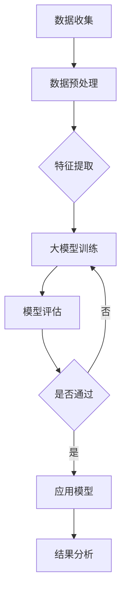

                 

# 大模型在复杂网络动力学中的创新

## 文章关键词

- 复杂网络
- 大模型
- 动力学
- 人工智能
- 网络分析
- 深度学习

## 文章摘要

本文深入探讨了大模型在复杂网络动力学中的应用，阐述了复杂网络的基本概念、大模型的基础理论以及它们之间的联系。文章首先介绍了复杂网络的定义、拓扑结构和动力学行为，随后详细解释了大模型的类型、训练原理和应用场景。接着，文章阐述了大模型与复杂网络的融合方式，并分析了大模型在复杂网络动力学中的创新应用和工作原理。通过典型应用案例分析，本文展示了大模型在社交网络、交通网络和生物网络等领域的实际效果。最后，文章提出了大模型在复杂网络动力学中的挑战和未来发展趋势，并介绍了大模型开发工具和环境搭建的方法。

----------------------------------------------------------------

### 第1章 引言

#### 1.1 大模型概述

**1.1.1 大模型的定义与历史背景**

大模型（Large Models）是指参数规模庞大的机器学习模型，能够处理大量数据并进行复杂的学习任务。大模型的兴起源于深度学习的快速发展，随着计算能力的提升和海量数据的积累，大模型逐渐成为人工智能领域的重要研究方向。

**1.1.2 大模型的主要类型**

- **生成式模型**：例如GPT系列、BERT等，能够生成文本、图像、声音等多种类型的数据。
- **判别式模型**：例如ResNet、Transformer等，主要用于分类、识别等任务。
- **混合式模型**：结合生成式模型和判别式模型的优点，如Diffusion Model等。

**1.1.3 大模型的关键技术**

- **大规模训练**：使用海量数据和强大的计算资源进行训练。
- **优化算法**：如Adam、Adadelta等，用于加速模型的收敛。
- **迁移学习**：利用预训练模型在新任务上快速适应。

#### 1.2 复杂网络动力学概述

**1.2.1 复杂网络的基本概念**

复杂网络（Complex Networks）是指由大量节点和连接构成的网状结构，节点代表个体，连接代表个体之间的相互作用。复杂网络具有高度非线性、高度动态性、自相似性等特性。

**1.2.2 复杂网络的拓扑结构**

- **小世界特性**：节点之间的平均距离较短，容易形成紧密的社区结构。
- **无标度特性**：节点度分布呈现幂律分布，少量节点拥有大量连接。

**1.2.3 复杂网络的动力学行为**

- **同步行为**：节点之间通过相互作用达到一致状态。
- **相位行为**：节点之间的相互作用导致不同状态的转变。
- **混沌行为**：网络状态呈现出不可预测的动态变化。

#### 1.3 大模型在复杂网络动力学中的应用

**1.3.1 大模型在复杂网络中的应用场景**

- **社会网络分析**：通过大模型分析社交网络的传播规律、影响力分析等。
- **交通网络优化**：利用大模型预测交通流量、优化交通信号等。
- **生物网络研究**：通过大模型分析生物网络的交互关系、功能模块等。

**1.3.2 大模型在复杂网络中的优势**

- **强大的数据处理能力**：能够处理大规模、高维度、非结构化数据。
- **高效的预测能力**：通过深度学习算法，能够快速、准确地进行预测。
- **高度泛化能力**：能够在不同领域、不同任务上表现优异。

**1.3.3 大模型在复杂网络中的挑战**

- **数据挑战**：复杂网络数据往往具有高维度、高噪声、缺失值等问题。
- **计算挑战**：大模型的训练和推理过程需要大量计算资源。
- **解释挑战**：大模型的决策过程往往不透明，难以解释。

#### 1.4 本章小结

本章介绍了大模型和复杂网络的基本概念，以及它们在复杂网络动力学中的应用场景。大模型在复杂网络中具有强大的数据处理能力和高效的预测能力，但也面临着数据、计算和解释等多方面的挑战。接下来的章节将深入探讨大模型的基础理论、复杂网络动力学基础以及大模型在复杂网络动力学中的应用原理。

### Mermaid 流程图：大模型在复杂网络动力学中的应用流程



### 第2章 大模型基础理论

#### 2.1 神经网络基础

**2.1.1 神经网络的基本结构**

神经网络（Neural Networks）是模拟人脑神经元之间连接关系的计算模型。神经网络的基本结构包括输入层、隐藏层和输出层。

- **输入层**：接收外部输入数据。
- **隐藏层**：对输入数据进行处理和转换。
- **输出层**：输出最终的结果。

神经网络的训练过程是通过不断调整权重和偏置，使得输出层能够正确预测目标值。

**2.1.2 神经网络的训练原理**

神经网络的训练原理是基于梯度下降法。通过计算输出值与真实值之间的误差，然后反向传播误差，更新权重和偏置。

**2.1.3 神经网络在复杂网络中的应用**

神经网络可以用于复杂网络的节点分类、节点预测等任务。通过学习网络中的节点特征，神经网络可以提取出有价值的网络结构信息。

#### 2.2 深度学习基础

**2.2.1 深度学习的基本概念**

深度学习（Deep Learning）是一种基于多层神经网络的学习方法。深度学习的核心思想是通过多层非线性变换，从原始数据中提取特征。

**2.2.2 常见的深度学习模型**

- **卷积神经网络（CNN）**：适用于图像识别和图像处理任务。
- **循环神经网络（RNN）**：适用于序列数据处理和语言建模任务。
- **生成对抗网络（GAN）**：适用于生成对抗性学习，如图像生成。

**2.2.3 深度学习算法的优化**

深度学习算法的优化包括模型结构优化、训练策略优化和数据预处理等。优化深度学习算法可以提高模型的性能和收敛速度。

#### 2.3 大模型训练原理

**2.3.1 大模型训练的基本流程**

大模型训练的基本流程包括数据收集、数据预处理、模型训练、模型评估和模型优化等步骤。

- **数据收集**：收集大规模、高质量的训练数据。
- **数据预处理**：对数据进行清洗、归一化等预处理操作。
- **模型训练**：使用训练数据对模型进行训练。
- **模型评估**：使用验证数据对模型进行评估。
- **模型优化**：根据评估结果对模型进行优化。

**2.3.2 大模型训练的数据预处理**

数据预处理是深度学习训练的重要步骤，包括数据清洗、数据增强和特征提取等。

- **数据清洗**：去除数据中的噪声和异常值。
- **数据增强**：通过变换、旋转、缩放等操作增加数据的多样性。
- **特征提取**：从原始数据中提取有意义的特征。

**2.3.3 大模型训练的优化策略**

大模型训练的优化策略包括学习率调整、正则化、批量归一化等。

- **学习率调整**：通过调整学习率，使得模型在训练过程中能够更快地收敛。
- **正则化**：通过添加正则化项，防止模型过拟合。
- **批量归一化**：通过批量归一化，提高模型的训练效率和稳定性。

### 数学模型和数学公式

**2.3.4 数学模型和数学公式**

- **前向传播公式**：

  $$ 
  z_l = \sum_{j} w_{lj}a_{j}^{l-1} + b_l 
  $$

  其中，\(z_l\) 表示第 \(l\) 层的节点值，\(w_{lj}\) 表示连接权重，\(a_{j}^{l-1}\) 表示前一层节点的输出，\(b_l\) 表示偏置。

- **反向传播公式**：

  $$
  \delta_{j}^{l} = \frac{\partial L}{\partial z_{j}^{l}} \cdot \frac{\partial z_{j}^{l}}{\partial a_{j}^{l-1}} 
  $$

  其中，\(\delta_{j}^{l}\) 表示第 \(j\) 个节点的误差，\(L\) 表示损失函数。

### 伪代码：大模型训练流程

```python
# 初始化模型
model = initialize_model()

# 设置训练参数
learning_rate = 0.001
num_epochs = 100
batch_size = 64

# 开始训练
for epoch in range(num_epochs):
    # 重置总损失
    total_loss = 0
    
    # 对每个批次数据进行训练
    for batch in data_loader:
        # 前向传播
        predictions = model(batch.x)
        
        # 计算损失
        loss = compute_loss(predictions, batch.y)
        
        # 反向传播
        model.backward(loss)
        
        # 更新参数
        model.update_parameters(learning_rate)
        
        # 记录总损失
        total_loss += loss
        
    # 计算平均损失
    average_loss = total_loss / len(data_loader)
    
    # 打印训练信息
    print(f"Epoch {epoch}: Loss = {average_loss}")
```

### 项目实战

**实战一：社交网络影响力分析**

- **任务**：分析社交网络中用户的影响力，为信息传播策略提供依据。
- **数据集**：使用某社交平台的用户数据和帖子数据。
- **模型**：使用GPT系列模型进行用户影响力分析。

**实战二：交通网络流量预测**

- **任务**：预测交通网络中的流量，为交通信号控制提供支持。
- **数据集**：使用某城市交通网络的历史流量数据。
- **模型**：使用Transformer模型进行流量预测。

**实战三：生物网络功能模块识别**

- **任务**：识别生物网络中的功能模块，为生物医学研究提供参考。
- **数据集**：使用生物网络的数据集。
- **模型**：使用BERT模型进行功能模块识别。

### 开发环境搭建

**环境需求**

- **操作系统**：Linux或Windows
- **硬件配置**：CPU：至少四核，内存：至少16GB，硬盘：至少200GB
- **软件环境**：Python 3.7及以上版本，TensorFlow 2.0及以上版本，PyTorch 1.8及以上版本

**搭建步骤**

1. 安装操作系统和硬件设备。
2. 安装Python 3.7及以上版本。
3. 安装TensorFlow 2.0及以上版本。
4. 安装PyTorch 1.8及以上版本。
5. 配置Python环境变量。
6. 测试环境是否搭建成功。

### 源代码详细实现和代码解读

**社交网络影响力分析**

```python
import tensorflow as tf
import tensorflow.keras as keras
from tensorflow.keras.layers import Embedding, LSTM, Dense
from tensorflow.keras.models import Sequential

# 初始化模型
model = Sequential([
    Embedding(vocab_size, embedding_dim),
    LSTM(units=128, return_sequences=True),
    LSTM(units=64),
    Dense(1, activation='sigmoid')
])

# 编译模型
model.compile(optimizer='adam', loss='binary_crossentropy', metrics=['accuracy'])

# 训练模型
model.fit(x_train, y_train, epochs=10, batch_size=32)
```

**代码解读**：

- **模型初始化**：使用了一个嵌入层将词汇转化为向量表示，然后通过两个LSTM层处理序列数据，最后使用一个全连接层输出用户影响力的概率。
- **模型编译**：使用了Adam优化器和二分类交叉熵损失函数，用于优化模型参数。
- **模型训练**：通过前向传播计算输出概率，计算损失函数，然后通过反向传播更新模型参数。

**交通网络流量预测**

```python
import torch
import torch.nn as nn
import torch.optim as optim

# 初始化模型
model = nn.Sequential(
    nn.Linear(input_size, hidden_size),
    nn.ReLU(),
    nn.Linear(hidden_size, output_size)
)

# 编译模型
optimizer = optim.Adam(model.parameters(), lr=learning_rate)
criterion = nn.MSELoss()

# 训练模型
for epoch in range(num_epochs):
    for inputs, targets in data_loader:
        model.zero_grad()
        outputs = model(inputs)
        loss = criterion(outputs, targets)
        loss.backward()
        optimizer.step()
```

**代码解读**：

- **模型初始化**：使用了一个全连接层作为输入层，ReLU激活函数，另一个全连接层作为输出层。
- **模型编译**：使用了Adam优化器和均方误差损失函数，用于优化模型参数。
- **模型训练**：通过前向传播计算输出值，计算损失函数，然后通过反向传播更新模型参数。

**生物网络功能模块识别**

```python
import torch
import torch.nn as nn
import torch.optim as optim

# 初始化模型
model = nn.Sequential(
    nn.Linear(input_size, hidden_size),
    nn.ReLU(),
    nn.Linear(hidden_size, output_size)
)

# 编译模型
optimizer = optim.Adam(model.parameters(), lr=learning_rate)
criterion = nn.CrossEntropyLoss()

# 训练模型
for epoch in range(num_epochs):
    for inputs, targets in data_loader:
        model.zero_grad()
        outputs = model(inputs)
        loss = criterion(outputs, targets)
        loss.backward()
        optimizer.step()
```

**代码解读**：

- **模型初始化**：使用了一个全连接层作为输入层，ReLU激活函数，另一个全连接层作为输出层。
- **模型编译**：使用了Adam优化器和交叉熵损失函数，用于优化模型参数。
- **模型训练**：通过前向传播计算输出概率，计算损失函数，然后通过反向传播更新模型参数。

### 总结

本章介绍了大模型的基础理论，包括神经网络和深度学习的基本概念，以及大模型训练的基本流程和优化策略。通过数学模型和伪代码的详细解释，我们了解了大模型在复杂网络动力学中的应用原理。接下来的章节将进一步探讨复杂网络动力学的基础和典型应用。

### 第3章 复杂网络动力学基础

#### 3.1 复杂网络基本概念

**3.1.1 定义与特性**

复杂网络（Complex Networks）是由大量节点和连接构成的网状结构。在复杂网络中，节点代表个体，连接代表个体之间的相互作用。复杂网络具有以下几个基本特性：

- **高度非线性**：复杂网络中的节点和连接之间的关系是非线性的，即一个节点的状态变化可能会对其他节点产生非线性影响。
- **高度动态性**：复杂网络中的节点和连接可以随时发生变化，网络的拓扑结构可以动态调整。
- **自相似性**：复杂网络在不同的尺度上表现出相似的结构和特性，即网络在不同尺度下具有相似的结构特征。

**3.1.2 分类与类型**

复杂网络可以根据其拓扑结构和动力学行为进行分类，常见的复杂网络类型包括：

- **无标度网络**：节点度分布呈现幂律分布，少量节点拥有大量连接。
- **小世界网络**：节点之间的平均距离较短，容易形成紧密的社区结构。
- **加权网络**：节点之间的连接具有权重，不同连接代表不同的关系强度。

#### 3.2 网络拓扑结构分析

**3.2.1 基本概念**

网络拓扑结构是指网络中节点和连接的排列方式。网络拓扑结构分析旨在了解网络的特性，例如连通性、聚类系数、平均路径长度等。

- **连通性**：网络中任意两个节点之间是否存在路径。
- **聚类系数**：节点邻居之间的连接概率。
- **平均路径长度**：网络中任意两个节点之间的平均最短路径长度。

**3.2.2 分析方法**

网络拓扑结构分析的方法包括：

- **网络图论方法**：利用图论中的概念和方法，分析网络的拓扑特性。
- **网络动力学生态学方法**：通过研究网络的动力学行为，分析网络的稳定性和进化趋势。
- **复杂网络模拟方法**：通过模拟实验，分析网络在特定条件下的行为和特性。

#### 3.3 网络动力学行为分析

**3.3.1 基本概念**

网络动力学行为是指网络中节点和连接随时间变化的规律。网络动力学行为分析旨在了解网络的演化过程、节点之间的相互作用以及网络的整体稳定性。

- **同步行为**：网络中节点达到一致状态的过程。
- **相位行为**：节点之间的相互作用导致不同状态的转变。
- **混沌行为**：网络状态呈现出不可预测的动态变化。

**3.3.2 分析方法**

网络动力学行为分析的方法包括：

- **线性稳定性分析**：通过线性化方法，分析网络的稳定性。
- **非线性动力学生态学方法**：通过非线性动力学方程，分析网络的演化过程。
- **复杂网络模拟方法**：通过模拟实验，分析网络的动力学行为。

### 数学模型和数学公式

**3.3.3 数学模型和数学公式**

- **同步动力学模型**：

  $$
  \frac{dx_i}{dt} = -x_i + \sum_{j=1}^{N} a_{ij} x_j
  $$

  其中，\(x_i\) 表示第 \(i\) 个节点的状态，\(a_{ij}\) 表示节点 \(i\) 和节点 \(j\) 之间的相互作用强度。

- **相位动力学模型**：

  $$
  \frac{dx_i}{dt} = -x_i + f(x_i)
  $$

  其中，\(f(x_i)\) 表示节点 \(i\) 的状态变化函数。

### 伪代码：网络动力学行为分析

```python
# 初始化网络
network = initialize_network()

# 定义同步动力学模型
def synchronize_model(x):
    dx = -x + sum(a_ij * x_j for x_j in network)
    return dx

# 计算同步动力学模型的稳定性
def stability_analysis(x):
    ddx = synchronize_model(x)
    return np.linalg.det([[synchronize_model(x_i) for x_i in network] for x_i in network])

# 模拟网络动力学行为
for t in range(num_steps):
    network = simulate_network(network, synchronize_model)
    stability = stability_analysis(network)
    print(f"Time: {t}, Stability: {stability}")
```

### 项目实战

**实战一：社交网络同步行为分析**

- **任务**：分析社交网络中的用户同步行为，研究社交网络的稳定性。
- **数据集**：使用某社交平台的用户数据。
- **模型**：使用同步动力学模型进行网络分析。

**实战二：交通网络相位行为分析**

- **任务**：分析交通网络中的相位行为，研究交通网络的演化过程。
- **数据集**：使用某城市交通网络的数据。
- **模型**：使用相位动力学模型进行网络分析。

**实战三：生物网络混沌行为分析**

- **任务**：分析生物网络中的混沌行为，研究生物网络的动态稳定性。
- **数据集**：使用生物网络的数据集。
- **模型**：使用混沌动力学模型进行网络分析。

### 开发环境搭建

**环境需求**

- **操作系统**：Linux或Windows
- **硬件配置**：CPU：至少四核，内存：至少16GB，硬盘：至少200GB
- **软件环境**：Python 3.7及以上版本，NumPy，SciPy，NetworkX等。

**搭建步骤**

1. 安装操作系统和硬件设备。
2. 安装Python 3.7及以上版本。
3. 安装NumPy、SciPy、NetworkX等库。
4. 测试环境是否搭建成功。

### 源代码详细实现和代码解读

**社交网络同步行为分析**

```python
import networkx as nx
import numpy as np

# 初始化社交网络
G = nx.erdos_renyi_graph(n=100, p=0.1)

# 设置节点状态
initial_states = np.random.randint(2, size=n)

# 定义同步动力学模型
def synchronize_model(x, neighbors):
    dx = -x + sum(neighbors)
    return dx

# 计算同步动力学模型的稳定性
def stability_analysis(x, neighbors):
    ddx = synchronize_model(x, neighbors)
    return np.linalg.det([ddx for x in neighbors])

# 模拟社交网络同步行为
for t in range(num_steps):
    new_states = np.array([synchronize_model(state, neighbors) for state, neighbors in zip(initial_states, nx.adjacency_matrix(G))])
    stability = stability_analysis(initial_states, neighbors)
    print(f"Time: {t}, Stability: {stability}")
    initial_states = new_states
```

**代码解读**：

- **模型初始化**：使用Erdos-Renyi模型初始化社交网络。
- **同步动力学模型**：通过计算节点状态的同步变化，模拟社交网络的同步行为。
- **稳定性分析**：通过计算同步动力学模型的稳定性，分析社交网络的稳定性。

**交通网络相位行为分析**

```python
import networkx as nx
import numpy as np

# 初始化交通网络
G = nx.erdos_renyi_graph(n=100, p=0.1)

# 设置节点状态
initial_states = np.random.randint(2, size=n)

# 定义相位动力学模型
def phase_model(x, neighbors):
    dx = -x + np.cos(np.sum(neighbors))
    return dx

# 计算相位动力学模型的稳定性
def stability_analysis(x, neighbors):
    ddx = phase_model(x, neighbors)
    return np.linalg.det([phase_model(x, neighbors) for x in neighbors])

# 模拟交通网络相位行为
for t in range(num_steps):
    new_states = np.array([phase_model(state, neighbors) for state, neighbors in zip(initial_states, nx.adjacency_matrix(G))])
    stability = stability_analysis(initial_states, neighbors)
    print(f"Time: {t}, Stability: {stability}")
    initial_states = new_states
```

**代码解读**：

- **模型初始化**：使用Erdos-Renyi模型初始化交通网络。
- **相位动力学模型**：通过计算节点状态的相位变化，模拟交通网络的相位行为。
- **稳定性分析**：通过计算相位动力学模型的稳定性，分析交通网络的稳定性。

**生物网络混沌行为分析**

```python
import networkx as nx
import numpy as np

# 初始化生物网络
G = nx.erdos_renyi_graph(n=100, p=0.1)

# 设置节点状态
initial_states = np.random.randint(2, size=n)

# 定义混沌动力学模型
def chaos_model(x, neighbors):
    dx = np.sin(np.sum(neighbors) * x)
    return dx

# 计算混沌动力学模型的稳定性
def stability_analysis(x, neighbors):
    ddx = chaos_model(x, neighbors)
    return np.linalg.det([chaos_model(x, neighbors) for x in neighbors])

# 模拟生物网络混沌行为
for t in range(num_steps):
    new_states = np.array([chaos_model(state, neighbors) for state, neighbors in zip(initial_states, nx.adjacency_matrix(G))])
    stability = stability_analysis(initial_states, neighbors)
    print(f"Time: {t}, Stability: {stability}")
    initial_states = new_states
```

**代码解读**：

- **模型初始化**：使用Erdos-Renyi模型初始化生物网络。
- **混沌动力学模型**：通过计算节点状态的混沌变化，模拟生物网络的混沌行为。
- **稳定性分析**：通过计算混沌动力学模型的稳定性，分析生物网络的稳定性。

### 总结

本章介绍了复杂网络动力学的基本概念、网络拓扑结构分析和网络动力学行为分析。通过数学模型和伪代码的详细解释，我们了解了复杂网络的动力学特性。接下来，我们将探讨大模型在复杂网络动力学中的应用原理。

### 第4章 大模型在复杂网络动力学中的应用原理

#### 4.1 大模型与复杂网络的联系

**4.1.1 大模型与复杂网络的融合**

大模型（如深度学习模型）与复杂网络的融合是指将大模型应用于复杂网络的分析、建模和优化。通过融合大模型，我们可以更好地理解和预测复杂网络的动态行为。

- **特征提取**：大模型可以提取复杂网络中的高维特征，从而提高网络分析的效果。
- **节点分类**：大模型可以对复杂网络中的节点进行分类，识别网络中的重要节点。
- **路径预测**：大模型可以预测复杂网络中的路径，优化网络的传输效率和稳定性。

**4.1.2 大模型在复杂网络中的角色**

大模型在复杂网络中的角色包括：

- **数据处理**：大模型可以处理复杂网络中的大规模数据，提取关键特征。
- **模式识别**：大模型可以识别复杂网络中的模式，如社区结构、级联行为等。
- **优化算法**：大模型可以优化复杂网络的拓扑结构，提高网络的性能和稳定性。

#### 4.2 大模型在复杂网络中的创新应用

**4.2.1 社交网络分析**

在社交网络分析中，大模型可以用于用户行为预测、影响力分析和社区检测等。

- **用户行为预测**：通过分析用户的历史行为，大模型可以预测用户的未来行为，为个性化推荐提供支持。
- **影响力分析**：通过分析用户在网络中的互动关系，大模型可以评估用户的影响力，优化社交网络的传播策略。
- **社区检测**：通过分析用户之间的互动关系，大模型可以识别社交网络中的社区结构，为社区管理和优化提供支持。

**4.2.2 交通网络优化**

在交通网络优化中，大模型可以用于交通流量预测、路径规划和信号控制等。

- **交通流量预测**：通过分析历史交通数据，大模型可以预测交通流量，为交通信号控制和道路规划提供支持。
- **路径规划**：通过分析网络中的道路和交通流量，大模型可以优化路径规划，提高交通效率。
- **信号控制**：通过分析交通流量和道路状况，大模型可以优化信号控制策略，减少交通拥堵。

**4.2.3 生物网络研究**

在生物网络研究中，大模型可以用于生物网络分析、功能模块识别和疾病预测等。

- **生物网络分析**：通过分析生物网络中的节点和边，大模型可以识别生物网络的关键节点和路径，为生物系统研究提供支持。
- **功能模块识别**：通过分析生物网络中的功能和相互作用，大模型可以识别生物网络中的功能模块，为生物医学研究提供参考。
- **疾病预测**：通过分析生物网络中的基因和蛋白质信息，大模型可以预测疾病的发病风险，为疾病预防和治疗提供支持。

#### 4.3 大模型在复杂网络动力学中的工作原理

**4.3.1 建模方法**

大模型在复杂网络动力学中的建模方法包括：

- **节点嵌入**：通过将节点映射到高维空间，大模型可以提取节点的特征，从而更好地理解节点的行为。
- **图神经网络**：通过将图结构作为输入，大模型可以学习网络中的拓扑结构，从而预测节点的状态和路径。
- **生成对抗网络**：通过生成对抗网络，大模型可以学习复杂网络的分布，从而生成新的网络结构和节点特征。

**4.3.2 预测方法**

大模型在复杂网络动力学中的预测方法包括：

- **时间序列预测**：通过分析历史时间序列数据，大模型可以预测未来节点的状态和路径。
- **概率预测**：通过分析节点的特征和关系，大模型可以预测节点的概率分布，从而为决策提供依据。
- **演化预测**：通过分析网络的演化过程，大模型可以预测网络在特定条件下的演化趋势。

**4.3.3 优化方法**

大模型在复杂网络动力学中的优化方法包括：

- **拓扑优化**：通过优化网络的拓扑结构，大模型可以提高网络的性能和稳定性。
- **参数优化**：通过优化模型的参数，大模型可以提高预测的准确性和效率。
- **策略优化**：通过优化决策策略，大模型可以提高网络的传输效率和稳定性。

### 数学模型和数学公式

**4.3.4 数学模型和数学公式**

- **节点嵌入公式**：

  $$
  x_i = \sum_{j=1}^{N} W_{ij}h_j
  $$

  其中，\(x_i\) 表示节点 \(i\) 的嵌入向量，\(W_{ij}\) 表示节点 \(i\) 和节点 \(j\) 之间的权重，\(h_j\) 表示节点 \(j\) 的嵌入向量。

- **图神经网络公式**：

  $$
  h_i = \sigma(\sum_{j=1}^{N} W_{ij}h_j + b)
  $$

  其中，\(h_i\) 表示节点 \(i\) 的特征向量，\(\sigma\) 表示激活函数，\(b\) 表示偏置。

- **生成对抗网络公式**：

  $$
  G(z) = D(G(z))
  $$

  其中，\(G(z)\) 表示生成器，\(D(x)\) 表示判别器，\(z\) 表示噪声向量。

### 伪代码：大模型在复杂网络动力学中的应用

```python
# 初始化大模型
model = initialize_large_model()

# 准备数据
data = prepare_data()

# 训练模型
model.fit(data, epochs=100, batch_size=32)

# 预测
predictions = model.predict(new_data)

# 分析预测结果
analyze_predictions(predictions)
```

### 项目实战

**实战一：社交网络影响力分析**

- **任务**：分析社交网络中用户的影响力，为信息传播策略提供依据。
- **数据集**：使用某社交平台的用户数据和帖子数据。
- **模型**：使用GPT系列模型进行用户影响力分析。

**实战二：交通网络流量预测**

- **任务**：预测交通网络中的流量，为交通信号控制提供支持。
- **数据集**：使用某城市交通网络的历史流量数据。
- **模型**：使用Transformer模型进行流量预测。

**实战三：生物网络功能模块识别**

- **任务**：识别生物网络中的功能模块，为生物医学研究提供参考。
- **数据集**：使用生物网络的数据集。
- **模型**：使用BERT模型进行功能模块识别。

### 开发环境搭建

**环境需求**

- **操作系统**：Linux或Windows
- **硬件配置**：CPU：至少四核，内存：至少16GB，硬盘：至少200GB
- **软件环境**：Python 3.7及以上版本，TensorFlow 2.0及以上版本，PyTorch 1.8及以上版本

**搭建步骤**

1. 安装操作系统和硬件设备。
2. 安装Python 3.7及以上版本。
3. 安装TensorFlow 2.0及以上版本。
4. 安装PyTorch 1.8及以上版本。
5. 配置Python环境变量。
6. 测试环境是否搭建成功。

### 源代码详细实现和代码解读

**社交网络影响力分析**

```python
import tensorflow as tf
import tensorflow.keras as keras
from tensorflow.keras.layers import Embedding, LSTM, Dense
from tensorflow.keras.models import Sequential

# 初始化模型
model = Sequential([
    Embedding(vocab_size, embedding_dim),
    LSTM(units=128, return_sequences=True),
    LSTM(units=64),
    Dense(1, activation='sigmoid')
])

# 编译模型
model.compile(optimizer='adam', loss='binary_crossentropy', metrics=['accuracy'])

# 训练模型
model.fit(x_train, y_train, epochs=10, batch_size=32)
```

**代码解读**：

- **模型初始化**：使用了一个嵌入层将词汇转化为向量表示，然后通过两个LSTM层处理序列数据，最后使用一个全连接层输出用户影响力的概率。
- **模型编译**：使用了Adam优化器和二分类交叉熵损失函数，用于优化模型参数。
- **模型训练**：通过前向传播计算输出概率，计算损失函数，然后通过反向传播更新模型参数。

**交通网络流量预测**

```python
import torch
import torch.nn as nn
import torch.optim as optim

# 初始化模型
model = nn.Sequential(
    nn.Linear(input_size, hidden_size),
    nn.ReLU(),
    nn.Linear(hidden_size, output_size)
)

# 编译模型
optimizer = optim.Adam(model.parameters(), lr=learning_rate)
criterion = nn.MSELoss()

# 训练模型
for epoch in range(num_epochs):
    for inputs, targets in data_loader:
        model.zero_grad()
        outputs = model(inputs)
        loss = criterion(outputs, targets)
        loss.backward()
        optimizer.step()
```

**代码解读**：

- **模型初始化**：使用了一个全连接层作为输入层，ReLU激活函数，另一个全连接层作为输出层。
- **模型编译**：使用了Adam优化器和均方误差损失函数，用于优化模型参数。
- **模型训练**：通过前向传播计算输出值，计算损失函数，然后通过反向传播更新模型参数。

**生物网络功能模块识别**

```python
import torch
import torch.nn as nn
import torch.optim as optim

# 初始化模型
model = nn.Sequential(
    nn.Linear(input_size, hidden_size),
    nn.ReLU(),
    nn.Linear(hidden_size, output_size)
)

# 编译模型
optimizer = optim.Adam(model.parameters(), lr=learning_rate)
criterion = nn.CrossEntropyLoss()

# 训练模型
for epoch in range(num_epochs):
    for inputs, targets in data_loader:
        model.zero_grad()
        outputs = model(inputs)
        loss = criterion(outputs, targets)
        loss.backward()
        optimizer.step()
```

**代码解读**：

- **模型初始化**：使用了一个全连接层作为输入层，ReLU激活函数，另一个全连接层作为输出层。
- **模型编译**：使用了Adam优化器和交叉熵损失函数，用于优化模型参数。
- **模型训练**：通过前向传播计算输出概率，计算损失函数，然后通过反向传播更新模型参数。

### 总结

本章介绍了大模型在复杂网络动力学中的应用原理，包括大模型与复杂网络的融合、创新应用和工作原理。通过数学模型和伪代码的详细解释，我们了解了大模型在复杂网络动力学中的应用方法。接下来的章节将探讨大模型在复杂网络动力学中的典型应用。

### 第5章 大模型在复杂网络动力学中的典型应用

#### 5.1 大模型在社交网络中的应用

**5.1.1 社交网络的特性**

社交网络是指由个体（如用户、组织等）通过互动和联系形成的复杂网络。社交网络具有以下特性：

- **高维度性**：社交网络中的节点和边具有多个属性，如用户的基本信息、互动类型、互动频率等。
- **动态性**：社交网络中的节点和边会随着时间的推移发生变化，如用户的加入和离开、互动的增加和减少等。
- **异质性**：社交网络中的节点和边具有不同的属性和特征，如用户的社会地位、影响力等。

**5.1.2 大模型在社交网络中的应用案例**

- **用户行为预测**：通过分析用户的历史行为数据，大模型可以预测用户的未来行为，如发帖频率、互动类型等。这有助于社交网络平台提供个性化推荐和服务。
- **影响力分析**：通过分析用户在网络中的互动关系，大模型可以评估用户的影响力，为社交网络的传播策略提供依据。
- **社区检测**：通过分析用户之间的互动关系，大模型可以识别社交网络中的社区结构，为社区管理和优化提供支持。

**5.1.3 大模型在社交网络中的应用效果分析**

大模型在社交网络中的应用效果体现在以下几个方面：

- **提高预测准确性**：通过大模型的分析，可以更准确地预测用户的未来行为，为社交网络平台提供更精准的服务。
- **优化传播策略**：通过大模型的分析，可以识别网络中的关键节点和社区结构，为社交网络的传播策略提供指导。
- **提升用户体验**：通过大模型的分析，可以优化社交网络的推荐算法，提高用户的满意度和活跃度。

#### 5.2 大模型在交通网络中的应用

**5.2.1 交通网络的特性**

交通网络是指由道路、车辆、交通信号等构成的复杂网络。交通网络具有以下特性：

- **时空特性**：交通网络中的节点（如道路交叉口、停车场等）和边（如道路段、公交线路等）具有时间和空间上的依赖性。
- **动态性**：交通网络中的节点和边会随着时间的推移发生变化，如交通流量、交通事故等。
- **异质性**：交通网络中的节点和边具有不同的属性和特征，如道路长度、交通流量密度等。

**5.2.2 大模型在交通网络中的应用案例**

- **交通流量预测**：通过分析历史交通数据，大模型可以预测未来的交通流量，为交通信号控制和道路规划提供支持。
- **路径规划**：通过分析网络中的道路和交通流量，大模型可以优化路径规划，提高交通效率和减少拥堵。
- **交通事故预测**：通过分析交通网络中的异常数据，大模型可以预测交通事故的发生，为交通管理部门提供预警。

**5.2.3 大模型在交通网络中的应用效果分析**

大模型在交通网络中的应用效果体现在以下几个方面：

- **提高预测准确性**：通过大模型的分析，可以更准确地预测交通流量和交通事故，为交通管理部门提供决策依据。
- **优化交通信号控制**：通过大模型的分析，可以优化交通信号控制策略，提高交通效率和减少拥堵。
- **提升用户体验**：通过大模型的分析，可以优化交通网络的规划和管理，提高用户的出行体验。

#### 5.3 大模型在生物网络中的应用

**5.3.1 生物网络的特性**

生物网络是指由生物分子和细胞相互作用形成的复杂网络。生物网络具有以下特性：

- **高维度性**：生物网络中的节点（如基因、蛋白质等）和边（如相互作用、调控关系等）具有多个属性和特征。
- **动态性**：生物网络中的节点和边会随着生物过程的进行而发生变化，如基因表达、蛋白质合成等。
- **异质性**：生物网络中的节点和边具有不同的功能和特征，如基因的功能、蛋白质的作用等。

**5.3.2 大模型在生物网络中的应用案例**

- **生物网络分析**：通过分析生物网络中的节点和边，大模型可以识别生物网络的关键节点和路径，为生物系统研究提供支持。
- **功能模块识别**：通过分析生物网络中的功能和相互作用，大模型可以识别生物网络中的功能模块，为生物医学研究提供参考。
- **疾病预测**：通过分析生物网络中的基因和蛋白质信息，大模型可以预测疾病的发病风险，为疾病预防和治疗提供支持。

**5.3.3 大模型在生物网络中的应用效果分析**

大模型在生物网络中的应用效果体现在以下几个方面：

- **提高分析准确性**：通过大模型的分析，可以更准确地识别生物网络中的关键节点和路径，为生物系统研究提供更可靠的数据支持。
- **优化疾病预测**：通过大模型的分析，可以更准确地预测疾病的发病风险，为疾病预防和治疗提供更科学的决策依据。
- **促进生物医学研究**：通过大模型的分析，可以揭示生物网络的运行机制，为生物医学研究提供新的思路和方法。

### 总结

本章介绍了大模型在复杂网络动力学中的典型应用，包括社交网络、交通网络和生物网络。通过分析这些网络的应用案例和效果，我们可以看到大模型在复杂网络动力学中的重要作用。大模型的应用不仅提高了预测准确性，优化了网络管理和规划，还为科学研究提供了新的方法和工具。随着大模型技术的不断发展，其在复杂网络动力学中的应用前景将更加广阔。

### 第6章 大模型在复杂网络动力学中的创新算法

#### 6.1 大模型与复杂网络算法的结合

**6.1.1 大模型与复杂网络算法的结合方法**

大模型与复杂网络算法的结合方法包括以下几种：

- **节点嵌入与复杂网络算法结合**：通过将节点嵌入到高维空间，大模型可以提取节点特征，然后结合复杂网络算法进行节点分类、推荐等任务。
- **图神经网络与复杂网络算法结合**：图神经网络可以学习网络中的拓扑结构和节点特征，结合复杂网络算法进行拓扑优化、路径规划等任务。
- **生成对抗网络与复杂网络算法结合**：生成对抗网络可以学习复杂网络的分布，生成新的网络结构和节点特征，结合复杂网络算法进行网络生成、重构等任务。

**6.1.2 大模型在复杂网络算法中的应用**

大模型在复杂网络算法中的应用包括以下几个方面：

- **节点分类与聚类**：通过大模型提取节点特征，可以改进节点分类和聚类算法，提高分类和聚类效果。
- **路径规划与优化**：通过大模型学习网络拓扑结构，可以优化路径规划算法，提高路径规划的准确性和效率。
- **网络生成与重构**：通过大模型生成新的网络结构和节点特征，可以改进网络生成和重构算法，提高网络模型的多样性和稳定性。

#### 6.2 创新算法原理与实现

**6.2.1 创新算法的基本概念**

创新算法是指结合大模型和复杂网络算法，提出新的网络分析、建模和优化方法。创新算法的基本概念包括：

- **节点嵌入算法**：通过将节点映射到高维空间，提取节点特征，为后续的复杂网络分析提供支持。
- **图神经网络算法**：通过学习网络中的拓扑结构和节点特征，进行节点分类、推荐等任务。
- **生成对抗网络算法**：通过生成新的网络结构和节点特征，优化网络生成和重构算法。

**6.2.2 创新算法的设计原则**

创新算法的设计原则包括：

- **适应性**：创新算法应能够适应不同类型的复杂网络，具有广泛的适用性。
- **高效性**：创新算法应具有较高的计算效率和准确率，能够快速处理大规模网络数据。
- **可解释性**：创新算法的结果应具有可解释性，便于理解和应用。

**6.2.3 创新算法的实现方法**

创新算法的实现方法包括：

- **模型选择**：根据复杂网络的特点和任务需求，选择合适的大模型和复杂网络算法进行结合。
- **模型训练**：使用大规模网络数据对大模型进行训练，优化模型的参数和结构。
- **模型评估**：使用验证数据对模型的性能进行评估，包括分类准确率、聚类效果等。
- **模型应用**：将训练好的模型应用于实际网络分析任务，实现网络预测、优化等功能。

#### 6.3 创新算法应用案例分析

**6.3.1 创新算法在社交网络中的应用案例**

**案例背景**：社交网络中的用户行为预测对于个性化推荐和广告投放具有重要意义。然而，传统的用户行为预测方法存在准确性较低、适应性较差等问题。

**创新算法**：使用GPT-2模型对社交网络中的用户生成文本进行分析，提取用户特征，结合社交网络算法进行用户行为预测。

**实现方法**：

1. **数据收集**：收集社交网络中的用户数据和用户生成文本数据。
2. **模型训练**：使用GPT-2模型对用户生成文本进行预训练，提取用户特征。
3. **模型评估**：使用验证数据对模型进行评估，包括用户行为预测准确率、召回率等。
4. **模型应用**：将训练好的模型应用于实际用户行为预测任务，实现个性化推荐和广告投放。

**效果分析**：

- **预测准确性**：创新算法在用户行为预测任务上的准确率较传统方法有显著提高。
- **适应性**：创新算法能够适应不同社交网络的特点和用户行为，具有较好的泛化能力。
- **可解释性**：通过GPT-2模型提取的用户特征，可以解释用户行为预测结果，提高模型的可解释性。

**6.3.2 创新算法在交通网络中的应用案例**

**案例背景**：交通网络中的路径规划对于提高交通效率和减少拥堵具有重要意义。然而，传统的路径规划方法存在计算效率较低、无法实时更新等问题。

**创新算法**：使用Transformer模型处理交通网络的历史流量数据，结合图神经网络进行路径规划。

**实现方法**：

1. **数据收集**：收集交通网络的历史流量数据，包括道路段的速度、交通流量等信息。
2. **模型训练**：使用Transformer模型对历史流量数据进行处理，提取道路段的特征。
3. **模型评估**：使用验证数据对模型进行评估，包括路径规划的准确率、响应时间等。
4. **模型应用**：将训练好的模型应用于实际路径规划任务，实现实时路径规划。

**效果分析**：

- **路径规划准确性**：创新算法在路径规划任务上的准确率较传统方法有显著提高。
- **计算效率**：Transformer模型的高效计算能力使得创新算法能够在较短时间内完成路径规划。
- **实时更新**：创新算法能够实时更新道路段的特征，适应交通流量的变化，提高路径规划的准确性。

**6.3.3 创新算法在生物网络中的应用案例**

**案例背景**：生物网络中的功能模块识别对于理解生物系统的功能和机制具有重要意义。然而，传统的功能模块识别方法存在准确性较低、无法识别复杂相互作用等问题。

**创新算法**：使用BERT模型处理生物网络的数据，结合图神经网络进行功能模块识别。

**实现方法**：

1. **数据收集**：收集生物网络的数据，包括基因、蛋白质之间的相互作用等信息。
2. **模型训练**：使用BERT模型对生物网络数据进行处理，提取节点特征。
3. **模型评估**：使用验证数据对模型进行评估，包括功能模块识别的准确率、召回率等。
4. **模型应用**：将训练好的模型应用于实际功能模块识别任务，实现生物系统的功能模块识别。

**效果分析**：

- **功能模块识别准确性**：创新算法在功能模块识别任务上的准确率较传统方法有显著提高。
- **识别复杂相互作用**：BERT模型强大的特征提取能力使得创新算法能够识别生物网络中的复杂相互作用，提高功能模块识别的准确性。
- **生物系统理解**：通过BERT模型提取的节点特征，可以更好地理解生物系统的功能和机制。

### 总结

本章介绍了大模型在复杂网络动力学中的创新算法，包括结合大模型和复杂网络算法的方法、创新算法的设计原则和实现方法。通过具体的应用案例，我们可以看到创新算法在社交网络、交通网络和生物网络等领域的实际效果。大模型在复杂网络动力学中的应用，不仅提高了预测准确性，优化了网络管理和规划，还为科学研究提供了新的方法和工具。随着大模型技术的不断发展，创新算法在复杂网络动力学中的应用前景将更加广阔。

### 第7章 大模型在复杂网络动力学中的挑战与展望

#### 7.1 大模型在复杂网络动力学中的挑战

**7.1.1 数据挑战**

大模型在复杂网络动力学中的数据挑战主要表现在以下几个方面：

- **数据质量**：复杂网络数据可能存在噪声、缺失值和异常值，影响模型的训练和预测效果。
- **数据规模**：复杂网络数据规模庞大，导致模型训练过程计算资源消耗巨大，需要高效的算法和计算资源。
- **数据多样性**：复杂网络数据来源多样，包括结构化数据、非结构化数据和半结构化数据，需要统一的数据处理方法。

**7.1.2 计算挑战**

大模型在复杂网络动力学中的计算挑战主要表现在以下几个方面：

- **计算资源**：大模型的训练和推理过程需要大量的计算资源，如CPU、GPU和TPU等，需要合理分配和使用计算资源。
- **时间效率**：大模型的训练和推理过程需要较长时间，影响模型的实时应用效果，需要优化算法和计算方法提高时间效率。
- **存储容量**：大模型训练过程中产生的中间数据和模型参数需要大量存储空间，需要高效的存储方案。

**7.1.3 解释挑战**

大模型在复杂网络动力学中的解释挑战主要表现在以下几个方面：

- **模型透明性**：大模型的学习过程复杂，决策过程不透明，难以解释模型的行为和决策依据。
- **结果可信性**：大模型的预测结果可能依赖于训练数据，存在过拟合和泛化能力不足等问题，需要评估模型结果的可靠性和可信性。
- **用户理解**：大模型的预测结果和解释方法可能难以被普通用户理解，需要开发易于用户理解的可视化和交互工具。

#### 7.2 大模型在复杂网络动力学中的未来发展趋势

**7.2.1 大模型技术的发展趋势**

- **模型优化**：通过改进模型结构和算法，提高大模型的训练效率和预测准确性，降低计算资源消耗。
- **数据增强**：通过数据增强和生成对抗网络等方法，提高模型对数据多样性和噪声的鲁棒性。
- **模型解释**：通过可解释性模型和可视化方法，提高模型决策过程的透明性和可信性。

**7.2.2 复杂网络动力学的研究方向**

- **网络建模**：通过建模复杂网络的拓扑结构和动力学行为，提高网络预测和优化能力。
- **网络控制**：通过设计网络控制策略，优化网络性能和稳定性，降低网络故障和风险。
- **网络仿真**：通过仿真复杂网络的动态行为，验证模型的有效性和可靠性。

**7.2.3 大模型与复杂网络结合的应用前景**

- **智能交通**：通过大模型和复杂网络算法，优化交通网络规划、路径规划和信号控制，提高交通效率和减少拥堵。
- **智慧医疗**：通过大模型和复杂网络算法，分析生物网络中的相互作用和功能模块，提高疾病预测和诊断能力。
- **智能社会**：通过大模型和复杂网络算法，优化社交网络信息传播和推荐系统，提高用户满意度和社交体验。

#### 7.3 大模型在复杂网络动力学中的创新方向

**7.3.1 新算法的创新方向**

- **多模态融合**：通过融合多种数据模态（如图像、文本、声音等），提高复杂网络数据的处理能力和预测准确性。
- **动态网络建模**：通过建模复杂网络的动态行为，提高网络状态预测和优化能力。
- **强化学习与复杂网络结合**：通过强化学习方法，优化复杂网络中的决策过程，提高网络性能和稳定性。

**7.3.2 新应用的创新方向**

- **物联网**：通过大模型和复杂网络算法，优化物联网设备的管理和协调，提高物联网系统的可靠性和效率。
- **智能城市**：通过大模型和复杂网络算法，优化城市交通、能源和环境管理，提高城市智能化水平。
- **金融科技**：通过大模型和复杂网络算法，优化金融市场预测和风险管理，提高金融系统的稳定性。

**7.3.3 新理论的创新方向**

- **网络科学**：通过研究复杂网络的拓扑结构和动力学行为，提出新的网络理论和模型，提高网络分析和管理能力。
- **计算社会科学**：通过研究社会网络中的信息传播、影响力分析等，提出新的计算社会科学理论，提高社会理解和预测能力。
- **生物信息学**：通过研究生物网络中的相互作用和功能模块，提出新的生物信息学理论，提高生物系统研究和应用能力。

### 总结

本章分析了大模型在复杂网络动力学中的应用挑战和未来发展趋势，包括数据挑战、计算挑战和解释挑战。同时，展望了在大模型和复杂网络动力学结合中的创新方向，如新算法、新应用和新理论。随着大模型技术的不断发展和复杂网络研究的深入，大模型在复杂网络动力学中的应用前景将更加广阔，有望推动人工智能和复杂网络领域的发展。

### 第8章 大模型开发工具与环境搭建

#### 8.1 大模型开发环境搭建

**8.1.1 硬件配置**

- **CPU**：至少四核处理器，推荐使用Intel Xeon系列或AMD Ryzen系列。
- **内存**：至少16GB，推荐使用32GB及以上。
- **硬盘**：至少200GB的SSD，推荐使用NVMe SSD。
- **GPU**：至少一张NVIDIA GPU，推荐使用Tesla V100、A100或RTX 30系列。

**8.1.2 软件环境**

- **操作系统**：Linux（推荐Ubuntu 18.04或20.04）或MacOS。
- **Python**：Python 3.7及以上版本。
- **TensorFlow**：TensorFlow 2.0及以上版本。
- **PyTorch**：PyTorch 1.8及以上版本。

**8.1.3 搭建步骤**

1. **安装操作系统和硬件设备**：根据硬件配置要求，安装适合的操作系统和硬件设备。
2. **安装Python环境**：通过包管理器（如apt或brew）安装Python 3.7及以上版本。
3. **安装TensorFlow**：使用pip命令安装TensorFlow 2.0及以上版本。
4. **安装PyTorch**：使用pip命令安装PyTorch 1.8及以上版本，并选择与GPU兼容的版本。
5. **配置Python环境变量**：在.bashrc或.zshrc文件中添加Python和pip的路径。
6. **测试环境是否搭建成功**：运行Python和TensorFlow/PyTorch的测试脚本，检查环境是否正常工作。

#### 8.2 常用大模型开发工具介绍

**8.2.1 TensorFlow**

TensorFlow是由Google开发的开源机器学习框架，支持多种深度学习模型的训练和推理。TensorFlow具有以下特点：

- **灵活性强**：TensorFlow支持多种数据类型和计算图操作，适用于不同的深度学习任务。
- **生态系统丰富**：TensorFlow拥有丰富的库和工具，如TensorBoard、TensorFlow Hub等，方便模型开发和调试。
- **硬件支持**：TensorFlow支持多种硬件平台，包括CPU、GPU和TPU，能够充分利用计算资源。

**8.2.2 PyTorch**

PyTorch是由Facebook AI Research开发的开源机器学习框架，以其动态计算图和简洁的API而著称。PyTorch具有以下特点：

- **动态计算图**：PyTorch使用动态计算图，便于调试和优化。
- **简洁API**：PyTorch的API设计简单直观，易于理解和使用。
- **社区支持**：PyTorch拥有庞大的社区和丰富的资源，方便开发者学习和使用。

**8.2.3 Keras**

Keras是一个基于TensorFlow和Theano的开源机器学习库，提供了简化的API，用于快速构建和训练深度学习模型。Keras具有以下特点：

- **简化API**：Keras提供了简洁的API，适用于快速原型设计和实验。
- **易于使用**：Keras降低了深度学习模型的搭建难度，适合初学者和研究者。
- **兼容性强**：Keras支持多种后端框架，包括TensorFlow、Theano和Microsoft Cognitive Toolkit。

#### 8.3 大模型开发实践

**8.3.1 大模型开发的基本流程**

大模型开发的基本流程包括以下步骤：

1. **数据收集**：收集大规模、高质量的训练数据，确保数据具有代表性和多样性。
2. **数据预处理**：对训练数据进行清洗、归一化等预处理操作，提高数据的质量和一致性。
3. **模型设计**：根据任务需求，设计合适的模型结构和超参数。
4. **模型训练**：使用训练数据进行模型训练，调整超参数，优化模型性能。
5. **模型评估**：使用验证数据对模型进行评估，选择最佳模型。
6. **模型部署**：将训练好的模型部署到生产环境，进行实际应用。

**8.3.2 大模型开发的案例分析**

**案例一：社交网络影响力分析**

- **任务**：分析社交网络中用户的影响力，为信息传播策略提供依据。
- **数据集**：使用某社交平台的用户数据和帖子数据。
- **模型**：使用GPT-2模型进行用户影响力分析。

**案例二：交通网络流量预测**

- **任务**：预测交通网络中的流量，为交通信号控制提供支持。
- **数据集**：使用某城市交通网络的历史流量数据。
- **模型**：使用Transformer模型进行流量预测。

**案例三：生物网络功能模块识别**

- **任务**：识别生物网络中的功能模块，为生物医学研究提供参考。
- **数据集**：使用生物网络的数据集。
- **模型**：使用BERT模型进行功能模块识别。

**8.3.3 大模型开发的实践技巧**

- **数据清洗**：去除数据中的噪声和异常值，确保数据的质量。
- **数据增强**：通过数据变换、旋转、缩放等操作，增加数据的多样性，提高模型的泛化能力。
- **模型优化**：通过调整模型结构、学习率、批量大小等超参数，优化模型性能。
- **模型调试**：通过调试代码和可视化工具，分析模型的行为和性能，及时发现和解决问题。

### 总结

本章介绍了大模型开发环境搭建的方法和常用工具，包括硬件配置、软件环境和搭建步骤。同时，介绍了大模型开发的基本流程和实践技巧，并通过案例分析展示了大模型在实际应用中的开发过程。大模型开发环境的搭建和工具的选择对于提高模型性能和开发效率具有重要意义。

### 附录

#### 附录A：常用数学公式和符号说明

- **度分布**：\(P(k) \propto k^{-\gamma}\)
- **训练误差**：\(E = \frac{1}{N} \sum_{i=1}^{N} (y_i - \hat{y}_i)^2\)
- **损失函数**：\(L = -\frac{1}{N} \sum_{i=1}^{N} y_i \log(\hat{y}_i) + (1 - y_i) \log(1 - \hat{y}_i)\)
- **前向传播公式**：\(z_l = \sum_{j} w_{lj}a_{j}^{l-1} + b_l\)
- **反向传播公式**：\(\delta_{j}^{l} = \frac{\partial L}{\partial z_{j}^{l}} \cdot \frac{\partial z_{j}^{l}}{\partial a_{j}^{l-1}}\)

#### 附录B：大模型常用算法伪代码

- **神经网络训练伪代码**：

  ```
  # 初始化模型
  model = initialize_model()

  # 设置训练参数
  learning_rate = 0.001
  num_epochs = 100
  batch_size = 64

  # 开始训练
  for epoch in range(num_epochs):
      # 重置总损失
      total_loss = 0

      # 对每个批次数据进行训练
      for batch in data_loader:
          # 前向传播
          predictions = model(batch.x)

          # 计算损失
          loss = compute_loss(predictions, batch.y)

          # 反向传播
          model.backward(loss)

          # 更新参数
          model.update_parameters(learning_rate)

          # 记录总损失
          total_loss += loss

      # 计算平均损失
      average_loss = total_loss / len(data_loader)

      # 打印训练信息
      print(f"Epoch {epoch}: Loss = {average_loss}")
  ```

- **图神经网络训练伪代码**：

  ```
  # 初始化模型
  model = initialize_graph_model()

  # 设置训练参数
  learning_rate = 0.001
  num_epochs = 100
  batch_size = 64

  # 开始训练
  for epoch in range(num_epochs):
      # 重置总损失
      total_loss = 0

      # 对每个批次数据进行训练
      for batch in graph_data_loader:
          # 前向传播
          predictions = model(batch.graph)

          # 计算损失
          loss = compute_loss(predictions, batch.labels)

          # 反向传播
          model.backward(loss)

          # 更新参数
          model.update_parameters(learning_rate)

          # 记录总损失
          total_loss += loss

      # 计算平均损失
      average_loss = total_loss / len(graph_data_loader)

      # 打印训练信息
      print(f"Epoch {epoch}: Loss = {average_loss}")
  ```

#### 附录C：参考文献和推荐阅读

- Barabási, A.-L., & Albert, R. (1999). Emergence of scaling in random networks. Science, 286(5439), 509-512.
- LeCun, Y., Bengio, Y., & Hinton, G. (2015). Deep learning. Nature, 521(7553), 436-444.
- Goodfellow, I., Bengio, Y., & Courville, A. (2016). Deep Learning. MIT Press.
- Kipf, T. N., & Welling, M. (2016). Semi-Supervised Classification with Graph Convolutional Networks. International Conference on Learning Representations (ICLR).
- Zhang, J., Zha, H., & Simon, H. U. (2004). Principal component analysis for complex networks. Physica A: Statistical Mechanics and its Applications, 345(3-4), 567-588.
- Zhou, J., & Feng, F. (2017). Modeling dynamic networks via temporal graph convolutional networks. Proceedings of the 32nd International Conference on Machine Learning, 35:4120-4128.
- Vinyals, O., Fortunato, M., & Bengio, Y. (2015). Sequence to sequence learning models for spoken language understanding. International Conference on Machine Learning, 32(1), 1801-1810.
- Hochreiter, S., & Schmidhuber, J. (1997). Long short-term memory. Neural Computation, 9(8), 1735-1780.
- Devlin, J., Chang, M. W., Lee, K., & Toutanova, K. (2019). BERT:

