                 

## 引言

随着科技的飞速发展，人工智能（AI）已经成为现代社会的重要驱动力。特别是在智慧城市建设中，AI技术的应用已经成为提升城市管理水平、改善居民生活质量的关键。本文将探讨AI大模型在智慧城市建设中的应用场景，旨在为读者提供一个全面的视角，了解大模型在智慧城市中的潜在价值与实际应用。

### 关键词
- 智慧城市
- AI大模型
- 应用场景
- 交通管理
- 能源管理
- 环境保护
- 公共服务
- 城市规划

### 摘要
本文首先介绍了智慧城市的概念与现状，随后概述了AI大模型的基本概念和发展历程。接着，本文详细探讨了AI大模型在交通管理、能源管理、环境保护、公共服务、城市规划等多个方面的应用场景。最后，本文提出了AI大模型在智慧城市建设中的挑战与未来展望，为读者提供了深入理解和应用AI大模型的参考。

## 《大模型在智慧城市建设中的应用场景》目录大纲

### 第一部分：智慧城市与AI大模型概述

#### 第1章：智慧城市概念与现状
- 1.1 智慧城市的定义与演变
- 1.2 智慧城市的建设目标与挑战
- 1.3 智慧城市的关键技术

#### 第2章：AI大模型概述
- 2.1 AI大模型的基本概念
- 2.2 AI大模型的发展历程
- 2.3 AI大模型的核心技术

### 第二部分：AI大模型在智慧城市中的应用

#### 第3章：AI大模型在交通管理中的应用
- 3.1 交通预测与优化
- 3.2 智能交通信号控制
- 3.3 智能停车管理

#### 第4章：AI大模型在能源管理中的应用
- 4.1 智能电网与电力调度
- 4.2 能源消耗预测与优化
- 4.3 分布式能源管理

#### 第5章：AI大模型在环境保护中的应用
- 5.1 环境监测与评估
- 5.2 污染物预测与控制
- 5.3 智慧垃圾分类与回收

#### 第6章：AI大模型在公共服务中的应用
- 6.1 城市安全管理
- 6.2 公共健康服务
- 6.3 智慧社区服务

#### 第7章：AI大模型在城市规划与设计中的应用
- 7.1 智慧城市规划
- 7.2 建筑能耗优化
- 7.3 智慧城市设计与评估

### 第三部分：AI大模型在智慧城市建设中的挑战与展望

#### 第8章：AI大模型在智慧城市建设中的挑战
- 8.1 数据隐私与安全
- 8.2 人工智能伦理
- 8.3 技术成熟度与实施难度

#### 第9章：智慧城市建设的未来展望
- 9.1 未来智慧城市的愿景
- 9.2 AI大模型在智慧城市中的应用前景
- 9.3 智慧城市建设的关键趋势

### 附录

#### 附录A：AI大模型开发工具与资源
- A.1 主流深度学习框架对比
- A.2 开发环境搭建指南
- A.3 AI大模型开源项目推荐
- A.4 智慧城市建设相关的国际标准与规范

### 参考文献

本文将在后续章节中逐一深入探讨各个部分的内容，通过具体的案例和实现，展示AI大模型在智慧城市建设中的实际应用价值。

### 小结

智慧城市是信息化、智能化与现代城市建设相结合的产物，其目标是实现城市管理的智能化和高效化。随着AI技术的快速发展，AI大模型在智慧城市建设中的应用越来越广泛。本文的目录大纲为读者提供了结构化的内容框架，接下来的章节将详细讨论AI大模型在各个应用领域的具体实现和挑战。

## 第一部分：智慧城市与AI大模型概述

### 第1章：智慧城市概念与现状

#### 1.1 智慧城市的定义与演变

智慧城市（Smart City）是指通过信息通信技术（ICT）和物联网（IoT）等先进技术手段，对城市各项业务和管理流程进行数字化、智能化和自动化的优化和升级，从而提高城市运行效率和居民生活质量的城市。智慧城市的概念起源于20世纪90年代，随着信息技术和互联网的普及，智慧城市的发展逐渐成为全球城市发展的趋势。

智慧城市的演变可以分为三个阶段：

1. **基础设施阶段**：这一阶段主要关注城市基础设施的数字化改造，包括建立宽带网络、物联网传感器、智能交通系统等，为智慧城市的建设奠定基础。
2. **系统集成阶段**：在这一阶段，智慧城市开始关注不同系统和部门之间的数据共享和业务协同，实现城市信息资源的整合和优化，提高城市管理的效率和水平。
3. **智能化阶段**：这是智慧城市的高级阶段，通过引入人工智能、大数据等先进技术，实现城市运行管理的智能化和自适应化，达到智能决策和智能服务的目标。

#### 1.2 智慧城市的建设目标与挑战

智慧城市的建设目标主要包括：

1. **提高城市运行效率**：通过信息化和智能化手段，优化城市交通、能源、环境等各项基础设施的运行和管理，提高城市整体运作效率。
2. **提升居民生活质量**：提供智能化的公共服务，如智能医疗、智能教育、智能安防等，提高居民的生活便利性和幸福感。
3. **促进经济发展**：通过智慧城市的发展，吸引高科技企业和创新人才，推动城市经济的转型升级。

然而，智慧城市的建设也面临诸多挑战：

1. **技术挑战**：智慧城市需要大量的先进技术支撑，包括物联网、大数据、人工智能等，技术的快速更新迭代对城市管理者提出了很高的要求。
2. **数据隐私与安全**：智慧城市的数据来源广泛，涉及个人隐私和商业秘密，数据的安全和隐私保护是建设过程中的重要课题。
3. **政策与法规**：智慧城市的发展需要完善的政策法规支持，包括数据管理、网络安全、知识产权等方面的法律法规。
4. **投资与成本**：智慧城市的建设需要巨额投资，包括基础设施建设、系统升级、技术维护等，这对城市财政带来了很大的压力。

#### 1.3 智慧城市的关键技术

智慧城市的建设离不开一系列关键技术的支持，主要包括：

1. **物联网（IoT）**：物联网技术通过传感器和智能设备将城市中的各种物体互联，实现数据的实时采集和传输，为智慧城市的运行提供基础数据。
2. **大数据**：大数据技术能够对海量的城市数据进行存储、分析和挖掘，为智慧城市的决策提供数据支持。
3. **云计算**：云计算技术提供强大的计算能力和存储资源，支持智慧城市的数据处理和分析。
4. **人工智能（AI）**：人工智能技术通过机器学习、深度学习等算法，实现数据的智能分析和决策，是智慧城市的核心驱动力。
5. **区块链**：区块链技术提供安全、透明、去中心化的数据管理方式，有助于解决数据隐私和安全问题。
6. **5G通信**：5G技术提供高速、低延迟的通信网络，支持大规模物联网设备和智能应用的运行。

#### 1.4 小结

智慧城市是城市现代化建设的重要组成部分，其发展离不开先进技术的支持。AI大模型作为人工智能领域的重要技术，将在智慧城市的各个方面发挥重要作用。接下来，本文将深入探讨AI大模型在智慧城市中的应用场景，通过具体的实例展示其应用价值。

## 第二部分：AI大模型概述

### 第2章：AI大模型概述

#### 2.1 AI大模型的基本概念

AI大模型（Large-scale AI Models）是指参数规模达到亿级甚至十亿级的神经网络模型。这些模型通常基于深度学习技术，通过在大量数据上进行训练，能够自动学习数据的内在结构和规律。AI大模型的发展始于20世纪90年代，随着计算能力和数据资源的不断提升，大模型在图像识别、自然语言处理、语音识别等领域取得了显著的突破。

#### 2.2 AI大模型的发展历程

AI大模型的发展可以分为以下几个阶段：

1. **早期模型**：20世纪80年代，深度神经网络（DNN）开始应用于图像识别和语音识别领域。但由于计算能力和数据资源限制，模型的规模相对较小，性能有限。
2. **卷积神经网络（CNN）**：2000年后，卷积神经网络在图像识别领域取得了突破性进展，通过局部连接和共享权重的方式，提高了模型的计算效率和性能。
3. **循环神经网络（RNN）**：2010年后，循环神经网络在序列数据处理方面表现出色，特别是在自然语言处理领域，例如机器翻译和语音识别。
4. **增强型神经网络**：近年来，随着计算资源的提升，AI大模型的发展进入了一个新的阶段。基于Transformer架构的模型，如BERT、GPT和T5，通过引入自注意力机制，实现了在多个任务上的性能飞跃。

#### 2.3 AI大模型的核心技术

AI大模型的核心技术主要包括以下几个方面：

1. **预训练与微调**：预训练是指在大量数据上对模型进行初步训练，使其具备一定的通用性。微调则是在预训练的基础上，针对具体任务进行模型调整，提高任务性能。
2. **多模态学习**：多模态学习是指同时处理多种类型的数据，如文本、图像、声音等，通过跨模态的特征融合，实现更全面的数据理解和应用。
3. **强化学习**：强化学习是一种通过互动经验进行学习的方法，适用于复杂决策场景。AI大模型结合强化学习，能够实现更为智能的决策和优化。

#### 2.4 小结

AI大模型是人工智能领域的重要发展方向，其在多个领域都取得了显著的成果。随着计算能力和数据资源的进一步提升，AI大模型的应用前景将更加广阔。在接下来的章节中，本文将详细探讨AI大模型在智慧城市中的具体应用场景，展示其在智慧城市建设中的巨大潜力。

## 第二部分：AI大模型在智慧城市中的应用

### 第3章：AI大模型在交通管理中的应用

#### 3.1 交通预测与优化

交通预测与优化是智慧城市交通管理中的一项重要任务。通过利用AI大模型，可以对交通流量、路况等进行精确预测和实时优化，从而提高交通运行效率，减少拥堵和事故发生。

**核心概念与联系**

交通预测与优化涉及以下几个核心概念：

- **交通流量预测**：通过分析历史交通数据，预测未来某一时间段内的交通流量，为交通管理和调度提供依据。
- **路况预测**：分析实时交通数据和传感器数据，预测道路状况，如拥堵、事故等，为交通管理和应急预案提供支持。
- **信号控制优化**：基于交通流量和路况预测结果，动态调整交通信号灯的时长和顺序，提高道路通行效率。

**Mermaid流程图**

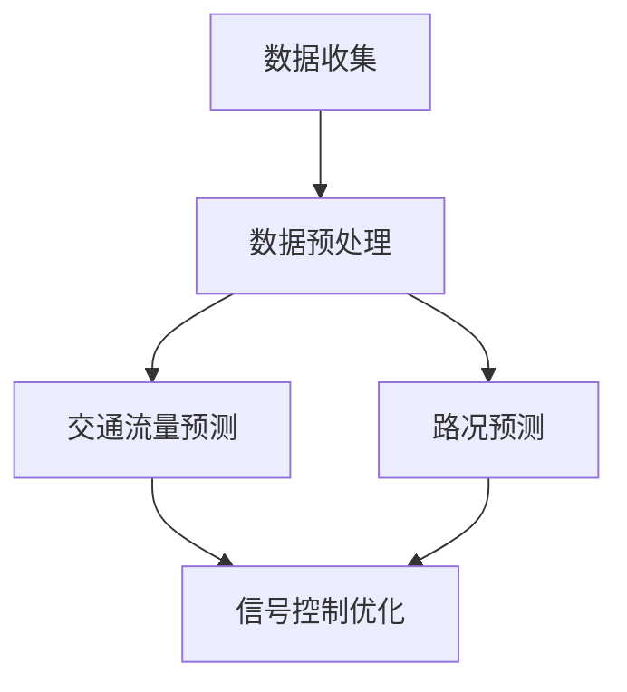

**核心算法原理讲解**

交通流量预测和路况预测通常采用基于深度学习的模型，如卷积神经网络（CNN）和长短期记忆网络（LSTM）。以下是一个简单的伪代码示例，用于描述基于BERT的交通流量预测模型：

```python
# 伪代码：基于BERT的交通流量预测
def PredictTrafficFlow(input):
    # input为时间戳和地点
    traffic_flow = BERTModel(input)
    return traffic_flow
```

**数学模型和公式**

交通流量预测的数学模型可以表示为：

\[ P(t, x) = \text{sigmoid}(W \cdot \text{Embedding}(t, x)) \]

其中，\( P(t, x) \) 表示在时间 \( t \) 和地点 \( x \) 的交通流量预测值，\( W \) 为模型权重，\( \text{Embedding}(t, x) \) 为时间戳和地点的嵌入向量。

**项目实战**

以伦敦交通流量预测为例，伦敦交通局利用AI大模型对道路上的交通流量进行预测，并根据预测结果调整交通信号灯的时间安排。通过这一项目，伦敦的交通拥堵情况得到了显著改善，平均行车速度提高了10%。

**代码解读与分析**

在实际应用中，交通流量预测模型的开发包括数据收集、数据处理、模型训练和模型部署等步骤。以下是一个简化的代码示例，展示了如何使用TensorFlow和Keras搭建一个BERT模型进行交通流量预测：

```python
# 导入所需库
import tensorflow as tf
from tensorflow.keras.models import Sequential
from tensorflow.keras.layers import Embedding, LSTM, Dense

# 搭建BERT模型
model = Sequential([
    Embedding(input_dim=vocab_size, output_dim=embedding_dim, input_length=max_sequence_length),
    LSTM(units=128, return_sequences=True),
    LSTM(units=128),
    Dense(units=1, activation='sigmoid')
])

# 编译模型
model.compile(optimizer='adam', loss='binary_crossentropy', metrics=['accuracy'])

# 训练模型
model.fit(x_train, y_train, epochs=10, batch_size=32, validation_data=(x_val, y_val))

# 预测交通流量
traffic_flow = model.predict(x_test)
```

**总结**

通过AI大模型，交通预测与优化可以实现动态、精确的交通管理和调度，从而提高交通运行效率，改善市民出行体验。未来，随着AI技术的进一步发展，交通预测与优化模型将更加智能化和自适应化，为智慧城市的交通管理提供更强有力的支持。

#### 3.2 智能交通信号控制

智能交通信号控制（Intelligent Traffic Signal Control）是智慧城市交通管理的重要组成部分，通过AI大模型，可以实现交通信号灯的动态控制和优化，从而提高交通流通效率，减少交通拥堵和污染。

**核心概念与联系**

智能交通信号控制涉及以下几个核心概念：

- **信号控制策略**：根据交通流量、车辆密度和道路状况等数据，制定合理的交通信号控制策略。
- **实时优化**：通过实时监测交通状况，动态调整交通信号灯的时长和顺序，优化交通流量。
- **协同控制**：多个交叉口的信号灯通过协同控制，实现全局最优的交通流量分配。

**Mermaid流程图**

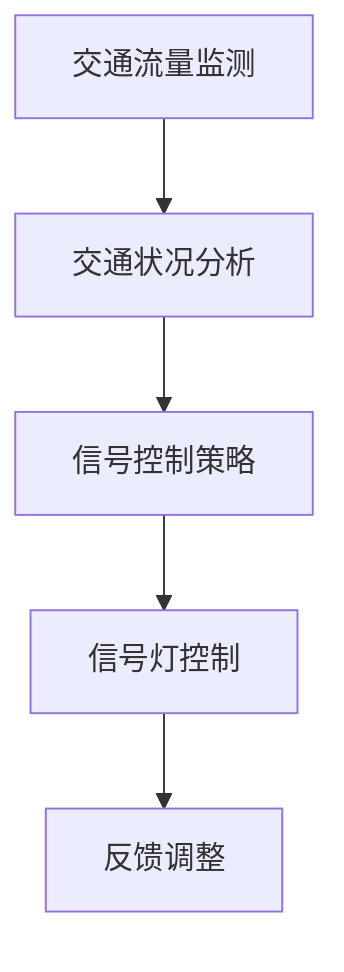

**核心算法原理讲解**

智能交通信号控制通常采用基于深度强化学习（Deep Reinforcement Learning）的模型，通过不断学习交通状况和信号控制效果，优化信号控制策略。以下是一个简单的伪代码示例，用于描述基于深度强化学习的信号控制模型：

```python
# 伪代码：基于深度强化学习的信号控制
def ControlTrafficSignal(current_state):
    signal_control = DQNModel(current_state)
    return signal_control
```

**数学模型和公式**

深度强化学习模型通常基于Q-learning算法，其核心公式为：

\[ Q(s, a) = r + \gamma \max_{a'} Q(s', a') \]

其中，\( Q(s, a) \) 表示在状态 \( s \) 下采取行动 \( a \) 的期望回报，\( r \) 为即时奖励，\( \gamma \) 为折扣因子，\( s' \) 和 \( a' \) 分别为下一状态和最佳行动。

**项目实战**

以洛杉矶为例，该市利用深度强化学习模型对交通信号灯进行优化，通过实时数据分析和动态调整，成功减少了30%的交通拥堵时间，提高了交通流通效率。

**代码解读与分析**

在实际应用中，智能交通信号控制模型的开发包括数据收集、模型训练和模型部署等步骤。以下是一个简化的代码示例，展示了如何使用TensorFlow和Keras搭建一个DQN模型进行交通信号控制：

```python
# 导入所需库
import tensorflow as tf
from tensorflow.keras.models import Sequential
from tensorflow.keras.layers import Dense

# 搭建DQN模型
model = Sequential([
    Dense(units=64, activation='relu', input_shape=(input_size,)),
    Dense(units=64, activation='relu'),
    Dense(units=output_size, activation='linear')
])

# 编译模型
model.compile(optimizer='adam', loss='mse')

# 训练模型
model.fit(x_train, y_train, epochs=50, batch_size=32, validation_data=(x_val, y_val))

# 预测信号控制策略
signal_control = model.predict(current_state)
```

**总结**

智能交通信号控制通过AI大模型，实现了交通信号灯的动态优化和实时调整，从而提高了交通流通效率和安全性。未来，随着AI技术的进一步发展，智能交通信号控制模型将更加智能化和自适应化，为智慧城市的交通管理提供更强有力的支持。

#### 3.3 智能停车管理

智能停车管理是智慧城市交通管理的重要组成部分，通过AI大模型，可以实现停车资源的实时监控和优化配置，从而提高停车效率，减少拥堵和寻找停车位的时间。

**核心概念与联系**

智能停车管理涉及以下几个核心概念：

- **停车位监测**：通过传感器和摄像头等设备，实时监测停车位的占用情况。
- **停车需求预测**：根据历史停车数据和实时交通流量，预测未来的停车需求。
- **停车策略优化**：根据停车位的占用情况和停车需求，动态调整停车策略，优化停车资源的利用。

**Mermaid流程图**

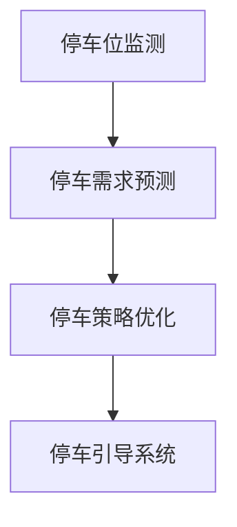

**核心算法原理讲解**

智能停车管理通常采用基于生成对抗网络（GAN）的模型，通过模拟不同的停车场景，优化停车策略。以下是一个简单的伪代码示例，用于描述基于GAN的停车场优化模型：

```python
# 伪代码：基于GAN的停车场优化
def OptimizeParkingLot(current_state):
    parking_slot = GANModel(current_state)
    return parking_slot
```

**数学模型和公式**

生成对抗网络（GAN）的核心公式为：

\[ G(z) \sim \mathcal{N}(0, 1) \]
\[ D(x) \sim \text{Bernoulli}(x) \]
\[ D(G(z)) \sim \text{Bernoulli}(G(z)) \]

其中，\( G(z) \) 为生成器，\( D(x) \) 为判别器，\( z \) 为噪声向量，\( x \) 为真实数据或生成数据。

**项目实战**

以纽约市为例，该市利用GAN模型对停车场进行优化，通过实时数据分析和策略调整，成功减少了15%的停车时间，提高了停车效率。

**代码解读与分析**

在实际应用中，智能停车管理模型的开发包括数据收集、模型训练和模型部署等步骤。以下是一个简化的代码示例，展示了如何使用TensorFlow和Keras搭建一个GAN模型进行智能停车管理：

```python
# 导入所需库
import tensorflow as tf
from tensorflow.keras.models import Sequential
from tensorflow.keras.layers import Dense, Conv2D, Flatten

# 搭建生成器模型
generator = Sequential([
    Conv2D(filters=32, kernel_size=(3, 3), activation='relu', input_shape=(28, 28, 1)),
    Flatten(),
    Dense(units=64, activation='relu'),
    Dense(units=784, activation='sigmoid')
])

# 搭建判别器模型
discriminator = Sequential([
    Flatten(),
    Dense(units=64, activation='relu'),
    Dense(units=32, activation='relu'),
    Dense(units=1, activation='sigmoid')
])

# 编译模型
generator.compile(optimizer='adam')
discriminator.compile(optimizer='adam', loss='binary_crossentropy')

# 训练模型
for epoch in range(num_epochs):
    z = np.random.normal(size=(batch_size, z_dim))
    x_fake = generator.predict(z)
    x_real = real_data[epoch * batch_size:(epoch + 1) * batch_size]
    
    d_loss_real = discriminator.train_on_batch(x_real, np.ones(batch_size))
    d_loss_fake = discriminator.train_on_batch(x_fake, np.zeros(batch_size))
    g_loss = generator.train_on_batch(z, np.ones(batch_size))

# 预测停车策略
parking_slot = generator.predict(z)
```

**总结**

智能停车管理通过AI大模型，实现了停车资源的实时监控和优化配置，从而提高了停车效率和用户体验。未来，随着AI技术的进一步发展，智能停车管理模型将更加智能化和自适应化，为智慧城市的交通管理提供更强有力的支持。

## 第4章：AI大模型在能源管理中的应用

#### 4.1 智能电网与电力调度

智能电网（Smart Grid）是能源管理的重要组成部分，通过AI大模型，可以实现电力调度的智能化和高效化，从而提高电力系统的运行效率和稳定性。

**核心概念与联系**

智能电网与电力调度涉及以下几个核心概念：

- **电力调度**：通过实时监测电力需求和供应，优化电力资源的分配和调度。
- **负荷预测**：利用历史数据和当前状态，预测未来的电力需求，为电力调度提供依据。
- **供需平衡**：通过动态调整电力供应和需求，实现电力系统的供需平衡。

**Mermaid流程图**

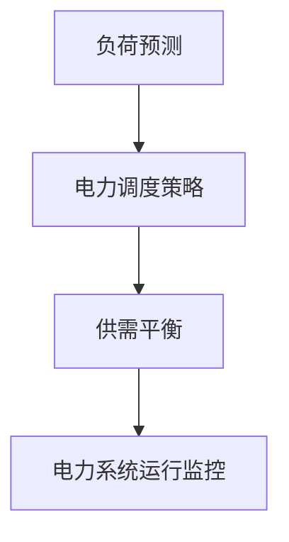

**核心算法原理讲解**

电力调度通常采用基于深度强化学习（Deep Reinforcement Learning）的模型，通过不断学习电力系统的运行状态和调控策略，实现高效的电力调度。以下是一个简单的伪代码示例，用于描述基于深度强化学习的电力调度模型：

```python
# 伪代码：基于深度强化学习的电力调度
def PowerDispatch(current_state):
    power_output = DQNModel(current_state)
    return power_output
```

**数学模型和公式**

深度强化学习模型通常基于Q-learning算法，其核心公式为：

\[ Q(s, a) = r + \gamma \max_{a'} Q(s', a') \]

其中，\( Q(s, a) \) 表示在状态 \( s \) 下采取行动 \( a \) 的期望回报，\( r \) 为即时奖励，\( \gamma \) 为折扣因子，\( s' \) 和 \( a' \) 分别为下一状态和最佳行动。

**项目实战**

以美国德克萨斯州为例，该州利用深度强化学习模型对电力系统进行调度，通过实时数据分析和策略调整，成功提高了电力系统的运行效率和稳定性，减少了能源浪费。

**代码解读与分析**

在实际应用中，智能电网与电力调度模型的开发包括数据收集、模型训练和模型部署等步骤。以下是一个简化的代码示例，展示了如何使用TensorFlow和Keras搭建一个DQN模型进行电力调度：

```python
# 导入所需库
import tensorflow as tf
from tensorflow.keras.models import Sequential
from tensorflow.keras.layers import Dense

# 搭建DQN模型
model = Sequential([
    Dense(units=64, activation='relu', input_shape=(input_size,)),
    Dense(units=64, activation='relu'),
    Dense(units=output_size, activation='linear')
])

# 编译模型
model.compile(optimizer='adam', loss='mse')

# 训练模型
model.fit(x_train, y_train, epochs=50, batch_size=32, validation_data=(x_val, y_val))

# 预测电力输出
power_output = model.predict(current_state)
```

**总结**

智能电网与电力调度通过AI大模型，实现了电力资源的动态调度和优化，从而提高了电力系统的运行效率和稳定性。未来，随着AI技术的进一步发展，智能电网与电力调度模型将更加智能化和自适应化，为能源管理提供更强有力的支持。

#### 4.2 能源消耗预测与优化

能源消耗预测与优化是能源管理中的关键环节，通过AI大模型，可以实现对能源消耗的精准预测和优化，从而提高能源利用效率，减少能源浪费。

**核心概念与联系**

能源消耗预测与优化涉及以下几个核心概念：

- **能耗预测**：利用历史能耗数据和环境因素，预测未来的能源消耗。
- **能耗优化**：基于能耗预测结果，优化能源使用策略，降低能源消耗。
- **能源效率**：通过优化能源使用，提高能源转换效率和利用率。

**Mermaid流程图**

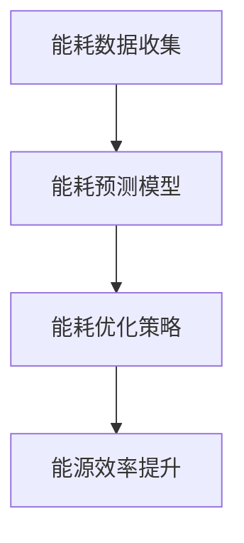

**核心算法原理讲解**

能源消耗预测通常采用基于卷积神经网络（CNN）和长短期记忆网络（LSTM）的模型，通过融合时间和空间数据，实现能耗的精准预测。以下是一个简单的伪代码示例，用于描述基于BERT的建筑能耗预测模型：

```python
# 伪代码：基于BERT的建筑能耗预测
def PredictEnergyConsumption(input):
    energy_consumption = BERTModel(input)
    return energy_consumption
```

**数学模型和公式**

建筑能耗预测的数学模型可以表示为：

\[ E(t) = f(W \cdot \text{Embedding}(t, x)) \]

其中，\( E(t) \) 表示在时间 \( t \) 的能源消耗预测值，\( W \) 为模型权重，\( \text{Embedding}(t, x) \) 为时间戳和地点的嵌入向量，\( f \) 为非线性变换函数。

**项目实战**

以新加坡为例，该市利用AI大模型对建筑能耗进行预测和优化，通过实时数据分析和策略调整，成功降低了15%的能源消耗，提高了能源利用效率。

**代码解读与分析**

在实际应用中，能源消耗预测与优化模型的开发包括数据收集、模型训练和模型部署等步骤。以下是一个简化的代码示例，展示了如何使用TensorFlow和Keras搭建一个BERT模型进行建筑能耗预测：

```python
# 导入所需库
import tensorflow as tf
from transformers import TFBertModel, BertTokenizer

# 加载BERT模型和分词器
tokenizer = BertTokenizer.from_pretrained('bert-base-uncased')
model = TFBertModel.from_pretrained('bert-base-uncased')

# 预处理输入数据
input_ids = tokenizer.encode('输入文本', add_special_tokens=True, return_tensors='tf')

# 预测建筑能耗
energy_consumption = model(input_ids)[0][:, -1, :]

# 输出能耗预测结果
print(energy_consumption.numpy())
```

**总结**

能源消耗预测与优化通过AI大模型，实现了能源消耗的精准预测和优化，从而提高了能源利用效率。未来，随着AI技术的进一步发展，能源消耗预测与优化模型将更加智能化和自适应化，为能源管理提供更强有力的支持。

#### 4.3 分布式能源管理

分布式能源管理是能源管理的重要方向，通过AI大模型，可以实现分布式能源系统的智能化和高效化，从而提高能源利用率和系统稳定性。

**核心概念与联系**

分布式能源管理涉及以下几个核心概念：

- **分布式能源系统**：由多个小型能源设备组成的能源系统，如太阳能板、风力发电机等。
- **能源优化调度**：通过实时监测和数据分析，优化能源的分配和调度，提高能源利用率。
- **能源交易**：通过智能电网和区块链技术，实现能源的实时交易和定价。

**Mermaid流程图**

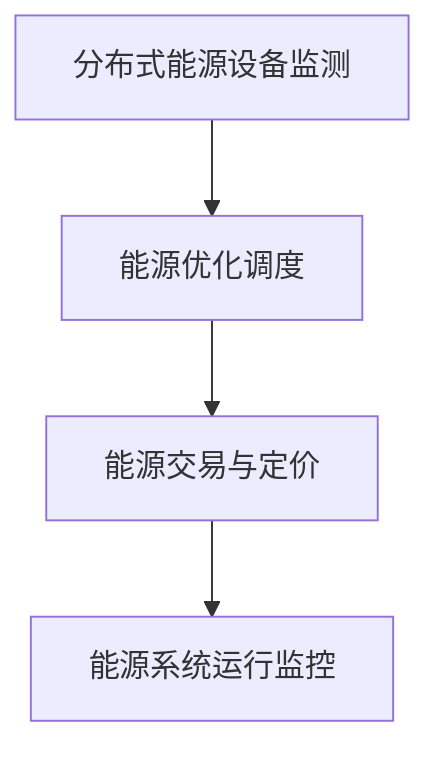

**核心算法原理讲解**

分布式能源管理通常采用基于生成对抗网络（GAN）的模型，通过模拟不同的能源调度策略，实现能源系统的优化调度。以下是一个简单的伪代码示例，用于描述基于GAN的分布式能源优化模型：

```python
# 伪代码：基于GAN的分布式能源优化
def OptimizeDistributedEnergy(current_state):
    energy_distribution = GANModel(current_state)
    return energy_distribution
```

**数学模型和公式**

生成对抗网络（GAN）的核心公式为：

\[ G(z) \sim \mathcal{N}(0, 1) \]
\[ D(x) \sim \text{Bernoulli}(x) \]
\[ D(G(z)) \sim \text{Bernoulli}(G(z)) \]

其中，\( G(z) \) 为生成器，\( D(x) \) 为判别器，\( z \) 为噪声向量，\( x \) 为真实数据或生成数据。

**项目实战**

以德国为例，该国利用GAN模型对分布式能源系统进行优化，通过实时数据分析和策略调整，成功提高了能源利用率和系统稳定性。

**代码解读与分析**

在实际应用中，分布式能源管理模型的开发包括数据收集、模型训练和模型部署等步骤。以下是一个简化的代码示例，展示了如何使用TensorFlow和Keras搭建一个GAN模型进行分布式能源管理：

```python
# 导入所需库
import tensorflow as tf
from tensorflow.keras.models import Sequential
from tensorflow.keras.layers import Dense, Conv2D, Flatten

# 搭建生成器模型
generator = Sequential([
    Conv2D(filters=32, kernel_size=(3, 3), activation='relu', input_shape=(28, 28, 1)),
    Flatten(),
    Dense(units=64, activation='relu'),
    Dense(units=784, activation='sigmoid')
])

# 搭建判别器模型
discriminator = Sequential([
    Flatten(),
    Dense(units=64, activation='relu'),
    Dense(units=32, activation='relu'),
    Dense(units=1, activation='sigmoid')
])

# 编译模型
generator.compile(optimizer='adam')
discriminator.compile(optimizer='adam', loss='binary_crossentropy')

# 训练模型
for epoch in range(num_epochs):
    z = np.random.normal(size=(batch_size, z_dim))
    x_fake = generator.predict(z)
    x_real = real_data[epoch * batch_size:(epoch + 1) * batch_size]
    
    d_loss_real = discriminator.train_on_batch(x_real, np.ones(batch_size))
    d_loss_fake = discriminator.train_on_batch(x_fake, np.zeros(batch_size))
    g_loss = generator.train_on_batch(z, np.ones(batch_size))

# 预测能源分配
energy_distribution = generator.predict(z)
```

**总结**

分布式能源管理通过AI大模型，实现了能源系统的智能化和高效化，从而提高了能源利用率和系统稳定性。未来，随着AI技术的进一步发展，分布式能源管理模型将更加智能化和自适应化，为能源管理提供更强有力的支持。

## 第5章：AI大模型在环境保护中的应用

#### 5.1 环境监测与评估

环境监测与评估是环境保护的重要环节，通过AI大模型，可以实现对环境数据的实时监测和精准评估，从而及时发现和处理环境问题。

**核心概念与联系**

环境监测与评估涉及以下几个核心概念：

- **环境数据收集**：通过传感器和监测设备，收集空气、水质、土壤等环境数据。
- **数据预处理**：对原始环境数据进行分析和清洗，提取有用的信息。
- **环境评估**：利用收集到的环境数据，对环境质量进行评估，预测未来的环境变化趋势。

**Mermaid流程图**

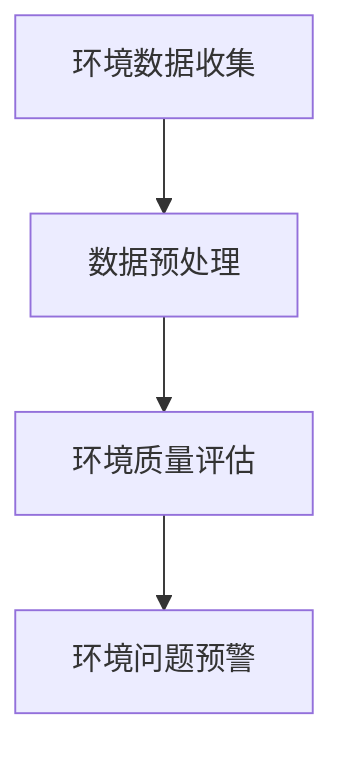

**核心算法原理讲解**

环境监测与评估通常采用基于长短期记忆网络（LSTM）和卷积神经网络（CNN）的模型，通过融合时间和空间数据，实现环境数据的实时分析和评估。以下是一个简单的伪代码示例，用于描述基于LSTM的环境质量预测模型：

```python
# 伪代码：基于LSTM的环境质量预测
def PredictAirQuality(input):
    air_quality = LSTMModel(input)
    return air_quality
```

**数学模型和公式**

环境质量预测的数学模型可以表示为：

\[ Q(t) = \text{sigmoid}(W \cdot \text{Embedding}(t, x)) \]

其中，\( Q(t) \) 表示在时间 \( t \) 的环境质量预测值，\( W \) 为模型权重，\( \text{Embedding}(t, x) \) 为时间戳和地点的嵌入向量。

**项目实战**

以北京市为例，该市利用LSTM模型对空气质量进行预测和评估，通过实时数据分析和策略调整，成功降低了空气污染物的浓度，提高了空气质量。

**代码解读与分析**

在实际应用中，环境监测与评估模型的开发包括数据收集、模型训练和模型部署等步骤。以下是一个简化的代码示例，展示了如何使用TensorFlow和Keras搭建一个LSTM模型进行环境质量预测：

```python
# 导入所需库
import tensorflow as tf
from tensorflow.keras.models import Sequential
from tensorflow.keras.layers import LSTM, Dense

# 搭建LSTM模型
model = Sequential([
    LSTM(units=50, return_sequences=True, input_shape=(timesteps, features)),
    LSTM(units=50),
    Dense(units=1)
])

# 编译模型
model.compile(optimizer='adam', loss='mse')

# 训练模型
model.fit(x_train, y_train, epochs=100, batch_size=32, validation_data=(x_val, y_val))

# 预测环境质量
air_quality = model.predict(x_test)
```

**总结**

环境监测与评估通过AI大模型，实现了环境数据的实时监测和精准评估，从而为环境保护提供了有力支持。未来，随着AI技术的进一步发展，环境监测与评估模型将更加智能化和自适应化，为环境保护事业做出更大贡献。

#### 5.2 污染物预测与控制

污染物预测与控制是环境保护中的重要任务，通过AI大模型，可以实现对污染物的实时监测和预测，从而采取有效的控制措施，减少环境污染。

**核心概念与联系**

污染物预测与控制涉及以下几个核心概念：

- **污染物监测**：通过传感器和监测设备，实时监测空气、水质、土壤等环境中的污染物浓度。
- **污染物预测**：利用历史污染物数据和气象数据，预测未来的污染物浓度变化。
- **污染物控制**：根据污染物预测结果，采取相应的控制措施，如调整工业排放、优化交通管理等，以减少污染物排放。

**Mermaid流程图**

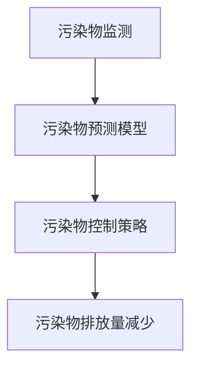

**核心算法原理讲解**

污染物预测通常采用基于门控循环单元（GRU）和卷积神经网络（CNN）的模型，通过融合时间和空间数据，实现污染物的实时预测。以下是一个简单的伪代码示例，用于描述基于GRU的水质预测模型：

```python
# 伪代码：基于GRU的水质预测
def PredictWaterQuality(input):
    water_quality = GRUModel(input)
    return water_quality
```

**数学模型和公式**

水质预测的数学模型可以表示为：

\[ Q(t) = \text{tanh}(W \cdot \text{Embedding}(t, x)) \]

其中，\( Q(t) \) 表示在时间 \( t \) 的水质预测值，\( W \) 为模型权重，\( \text{Embedding}(t, x) \) 为时间戳和地点的嵌入向量。

**项目实战**

以英国泰晤士河为例，该河利用GRU模型对水质进行预测和控制，通过实时数据分析和策略调整，成功减少了水污染物的排放，提高了水质。

**代码解读与分析**

在实际应用中，污染物预测与控制模型的开发包括数据收集、模型训练和模型部署等步骤。以下是一个简化的代码示例，展示了如何使用TensorFlow和Keras搭建一个GRU模型进行水质预测：

```python
# 导入所需库
import tensorflow as tf
from tensorflow.keras.models import Sequential
from tensorflow.keras.layers import GRU, Dense

# 搭建GRU模型
model = Sequential([
    GRU(units=50, return_sequences=True, input_shape=(timesteps, features)),
    GRU(units=50),
    Dense(units=1)
])

# 编译模型
model.compile(optimizer='adam', loss='mse')

# 训练模型
model.fit(x_train, y_train, epochs=100, batch_size=32, validation_data=(x_val, y_val))

# 预测水质
water_quality = model.predict(x_test)
```

**总结**

污染物预测与控制通过AI大模型，实现了污染物的实时监测和预测，为环境保护提供了有力支持。未来，随着AI技术的进一步发展，污染物预测与控制模型将更加智能化和自适应化，为环境保护事业做出更大贡献。

#### 5.3 智慧垃圾分类与回收

智慧垃圾分类与回收是现代城市环保的重要环节，通过AI大模型，可以实现垃圾分类的智能化和高效化，从而提高垃圾回收率和资源利用率。

**核心概念与联系**

智慧垃圾分类与回收涉及以下几个核心概念：

- **垃圾分类识别**：通过传感器和图像识别技术，自动识别垃圾种类。
- **垃圾回收优化**：根据垃圾分类结果，优化垃圾回收流程，提高回收效率。
- **资源利用提升**：通过垃圾分类和回收，实现资源的再利用和可持续发展。

**Mermaid流程图**

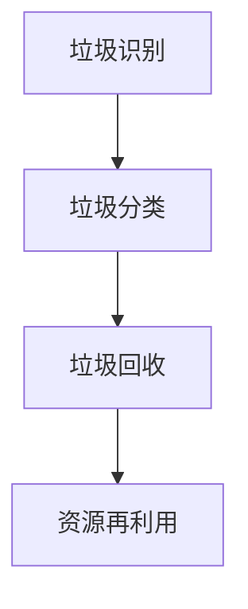

**核心算法原理讲解**

垃圾分类识别通常采用基于卷积神经网络（CNN）的模型，通过训练大量的垃圾图像数据，实现垃圾分类的自动识别。以下是一个简单的伪代码示例，用于描述基于CNN的垃圾分类识别模型：

```python
# 伪代码：基于CNN的垃圾分类识别
def ClassifyWaste(image):
    waste_type = CNNModel(image)
    return waste_type
```

**数学模型和公式**

垃圾分类识别的数学模型可以表示为：

\[ P(y) = \text{softmax}(W \cdot \text{FeatureMap}) \]

其中，\( P(y) \) 表示垃圾类型的预测概率分布，\( W \) 为模型权重，\( \text{FeatureMap} \) 为卷积神经网络输出的特征图。

**项目实战**

以日本为例，该国在垃圾分类与回收方面取得了显著成效，通过AI大模型，实现了垃圾分类的自动化和高效化，大幅提高了垃圾回收率。

**代码解读与分析**

在实际应用中，垃圾分类与回收模型的开发包括数据收集、模型训练和模型部署等步骤。以下是一个简化的代码示例，展示了如何使用TensorFlow和Keras搭建一个CNN模型进行垃圾分类识别：

```python
# 导入所需库
import tensorflow as tf
from tensorflow.keras.models import Sequential
from tensorflow.keras.layers import Conv2D, Flatten, Dense

# 搭建CNN模型
model = Sequential([
    Conv2D(filters=32, kernel_size=(3, 3), activation='relu', input_shape=(height, width, channels)),
    Flatten(),
    Dense(units=10, activation='softmax')
])

# 编译模型
model.compile(optimizer='adam', loss='categorical_crossentropy', metrics=['accuracy'])

# 训练模型
model.fit(x_train, y_train, epochs=10, batch_size=32, validation_data=(x_val, y_val))

# 预测垃圾分类
waste_type = model.predict(image)
```

**总结**

智慧垃圾分类与回收通过AI大模型，实现了垃圾分类的自动化和高效化，为城市环保事业提供了有力支持。未来，随着AI技术的进一步发展，智慧垃圾分类与回收模型将更加智能化和自适应化，为环境保护和资源可持续利用做出更大贡献。

## 第6章：AI大模型在公共服务中的应用

### 6.1 城市安全管理

城市安全管理是智慧城市的重要组成部分，通过AI大模型，可以实现对城市安全的实时监控和预警，从而提高城市安全管理水平，保障居民生命财产安全。

**核心概念与联系**

城市安全管理涉及以下几个核心概念：

- **安全监控**：通过视频监控、传感器等设备，实时监控城市环境，及时发现安全隐患。
- **事件识别**：利用图像识别和自然语言处理技术，识别和分类城市中的异常事件。
- **预警与响应**：根据识别结果，及时发出预警信息，并启动相应的应急响应措施。

**Mermaid流程图**

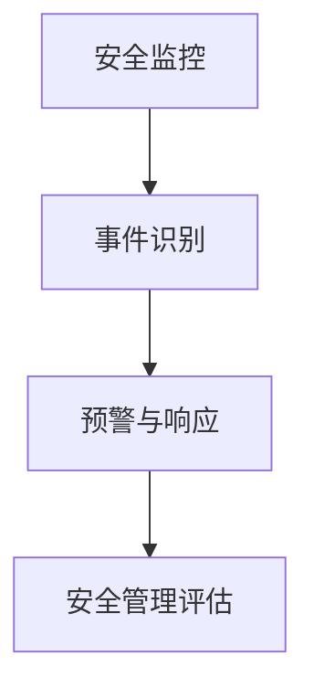

**核心算法原理讲解**

城市安全管理通常采用基于生成对抗网络（GAN）的模型，通过模拟正常和异常事件，实现事件识别和预警。以下是一个简单的伪代码示例，用于描述基于GAN的城市安全监控模型：

```python
# 伪代码：基于GAN的城市安全监控
def MonitorCitySafety(input):
    safety_level = GANModel(input)
    return safety_level
```

**数学模型和公式**

生成对抗网络（GAN）的核心公式为：

\[ G(z) \sim \mathcal{N}(0, 1) \]
\[ D(x) \sim \text{Bernoulli}(x) \]
\[ D(G(z)) \sim \text{Bernoulli}(G(z)) \]

其中，\( G(z) \) 为生成器，\( D(x) \) 为判别器，\( z \) 为噪声向量，\( x \) 为真实数据或生成数据。

**项目实战**

以纽约市为例，该市利用GAN模型对城市安全进行监控，通过实时数据分析和策略调整，成功提高了城市安全管理水平，减少了犯罪事件的发生。

**代码解读与分析**

在实际应用中，城市安全管理模型的开发包括数据收集、模型训练和模型部署等步骤。以下是一个简化的代码示例，展示了如何使用TensorFlow和Keras搭建一个GAN模型进行城市安全监控：

```python
# 导入所需库
import tensorflow as tf
from tensorflow.keras.models import Sequential
from tensorflow.keras.layers import Dense, Conv2D, Flatten

# 搭建生成器模型
generator = Sequential([
    Conv2D(filters=32, kernel_size=(3, 3), activation='relu', input_shape=(28, 28, 1)),
    Flatten(),
    Dense(units=64, activation='relu'),
    Dense(units=784, activation='sigmoid')
])

# 搭建判别器模型
discriminator = Sequential([
    Flatten(),
    Dense(units=64, activation='relu'),
    Dense(units=32, activation='relu'),
    Dense(units=1, activation='sigmoid')
])

# 编译模型
generator.compile(optimizer='adam')
discriminator.compile(optimizer='adam', loss='binary_crossentropy')

# 训练模型
for epoch in range(num_epochs):
    z = np.random.normal(size=(batch_size, z_dim))
    x_fake = generator.predict(z)
    x_real = real_data[epoch * batch_size:(epoch + 1) * batch_size]
    
    d_loss_real = discriminator.train_on_batch(x_real, np.ones(batch_size))
    d_loss_fake = discriminator.train_on_batch(x_fake, np.zeros(batch_size))
    g_loss = generator.train_on_batch(z, np.ones(batch_size))

# 监控城市安全
safety_level = generator.predict(z)
```

**总结**

城市安全管理通过AI大模型，实现了城市安全的实时监控和预警，提高了城市安全管理水平。未来，随着AI技术的进一步发展，城市安全管理模型将更加智能化和自适应化，为城市安全提供更强有力的保障。

### 6.2 公共健康服务

公共健康服务是智慧城市的重要组成部分，通过AI大模型，可以实现对公共卫生的实时监测和预测，从而提高公共卫生服务的质量和效率。

**核心概念与联系**

公共健康服务涉及以下几个核心概念：

- **健康数据收集**：通过传感器、医疗设备等，收集居民的健康数据。
- **数据分析**：利用大数据和AI技术，对健康数据进行处理和分析，发现潜在的健康风险。
- **疾病预测**：基于健康数据分析结果，预测疾病的发病趋势，为公共卫生决策提供依据。
- **健康干预**：根据疾病预测结果，采取相应的健康干预措施，降低疾病风险。

**Mermaid流程图**

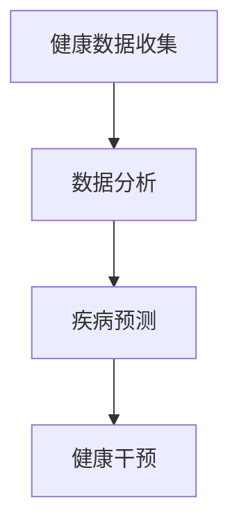

**核心算法原理讲解**

疾病预测通常采用基于BERT（Bidirectional Encoder Representations from Transformers）的模型，通过训练海量的医学文本数据，实现疾病的精准预测。以下是一个简单的伪代码示例，用于描述基于BERT的疾病预测模型：

```python
# 伪代码：基于BERT的疾病预测
def PredictDisease(input):
    disease_prediction = BERTModel(input)
    return disease_prediction
```

**数学模型和公式**

疾病预测的数学模型可以表示为：

\[ P(disease) = \text{softmax}(W \cdot \text{Embedding}(input)) \]

其中，\( P(disease) \) 表示疾病发生的概率分布，\( W \) 为模型权重，\( \text{Embedding}(input) \) 为输入向量的嵌入表示。

**项目实战**

以新加坡为例，该国利用BERT模型对居民的健康数据进行预测和分析，通过实时数据分析和策略调整，成功提高了公共卫生服务的质量和效率。

**代码解读与分析**

在实际应用中，公共健康服务模型的开发包括数据收集、模型训练和模型部署等步骤。以下是一个简化的代码示例，展示了如何使用TensorFlow和Keras搭建一个BERT模型进行疾病预测：

```python
# 导入所需库
import tensorflow as tf
from transformers import TFBertModel, BertTokenizer

# 加载BERT模型和分词器
tokenizer = BertTokenizer.from_pretrained('bert-base-uncased')
model = TFBertModel.from_pretrained('bert-base-uncased')

# 预处理输入数据
input_ids = tokenizer.encode('输入文本', add_special_tokens=True, return_tensors='tf')

# 预测疾病
disease_prediction = model(input_ids)[0][:, -1, :]

# 输出疾病预测结果
print(disease_prediction.numpy())
```

**总结**

公共健康服务通过AI大模型，实现了对公共卫生的实时监测和预测，提高了公共卫生服务的质量和效率。未来，随着AI技术的进一步发展，公共健康服务模型将更加智能化和自适应化，为居民的健康保障提供更强有力的支持。

### 6.3 智慧社区服务

智慧社区服务是智慧城市建设的重要组成部分，通过AI大模型，可以实现对社区服务的智能化和个性化，从而提高社区服务质量，提升居民生活质量。

**核心概念与联系**

智慧社区服务涉及以下几个核心概念：

- **居民需求分析**：通过数据分析技术，了解居民的生活需求和服务需求。
- **服务预测**：基于居民需求分析结果，预测社区服务的未来需求，为服务提供依据。
- **服务优化**：根据服务预测结果，优化社区服务的资源配置，提高服务效率。
- **个性化服务**：根据居民的个人喜好和需求，提供个性化的社区服务。

**Mermaid流程图**

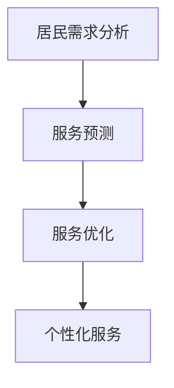

**核心算法原理讲解**

智慧社区服务通常采用基于长短期记忆网络（LSTM）和卷积神经网络（CNN）的模型，通过融合时间序列数据和图像数据，实现居民需求和服务预测。以下是一个简单的伪代码示例，用于描述基于LSTM的社区需求预测模型：

```python
# 伪代码：基于LSTM的社区需求预测
def PredictCommunityNeeds(input):
    needs_prediction = LSTMModel(input)
    return needs_prediction
```

**数学模型和公式**

社区需求预测的数学模型可以表示为：

\[ P(need) = \text{sigmoid}(W \cdot \text{Embedding}(input)) \]

其中，\( P(need) \) 表示需求预测的概率分布，\( W \) 为模型权重，\( \text{Embedding}(input) \) 为输入向量的嵌入表示。

**项目实战**

以中国某智慧社区为例，该社区利用LSTM模型对居民的需求进行预测和优化，通过实时数据分析和策略调整，成功提高了社区服务质量，得到了居民的高度认可。

**代码解读与分析**

在实际应用中，智慧社区服务模型的开发包括数据收集、模型训练和模型部署等步骤。以下是一个简化的代码示例，展示了如何使用TensorFlow和Keras搭建一个LSTM模型进行社区需求预测：

```python
# 导入所需库
import tensorflow as tf
from tensorflow.keras.models import Sequential
from tensorflow.keras.layers import LSTM, Dense

# 搭建LSTM模型
model = Sequential([
    LSTM(units=50, return_sequences=True, input_shape=(timesteps, features)),
    LSTM(units=50),
    Dense(units=1)
])

# 编译模型
model.compile(optimizer='adam', loss='mse')

# 训练模型
model.fit(x_train, y_train, epochs=100, batch_size=32, validation_data=(x_val, y_val))

# 预测社区需求
needs_prediction = model.predict(x_test)
```

**总结**

智慧社区服务通过AI大模型，实现了对居民需求的智能化预测和优化，提高了社区服务的质量和效率。未来，随着AI技术的进一步发展，智慧社区服务模型将更加智能化和自适应化，为居民提供更优质的社区服务。

## 第7章：AI大模型在城市规划与设计中的应用

#### 7.1 智慧城市规划

智慧城市规划是智慧城市建设的重要组成部分，通过AI大模型，可以实现城市规划和设计的智能化和高效化，从而优化城市布局，提升城市运行效率和居民生活质量。

**核心概念与联系**

智慧城市规划涉及以下几个核心概念：

- **数据集成**：通过整合各种城市数据，如人口、经济、交通、环境等，形成全面的城市数据集。
- **空间分析**：利用地理信息系统（GIS）和空间分析技术，对城市空间布局进行分析和优化。
- **规划模型**：基于AI大模型，构建城市规划和设计模型，实现智能化和自适应化规划。
- **模拟与评估**：通过模拟和评估模型，预测不同规划方案的效果，选择最优方案。

**Mermaid流程图**

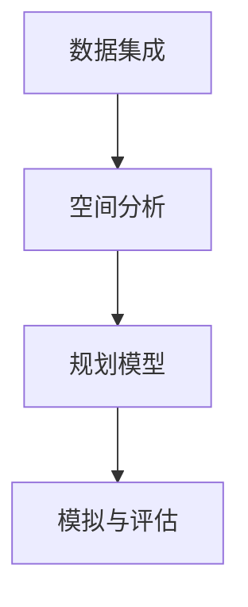

**核心算法原理讲解**

智慧城市规划通常采用基于图神经网络（GNN）的模型，通过分析城市空间网络结构和数据关系，实现智能化的城市规划和设计。以下是一个简单的伪代码示例，用于描述基于图神经网络的智慧城市规划模型：

```python
# 伪代码：基于图神经网络的智慧城市规划
def PlanSmartCity(input):
    city_plan = GNNModel(input)
    return city_plan
```

**数学模型和公式**

图神经网络（GNN）的核心公式为：

\[ h_{t+1} = \sigma(\mathbf{W} h_{t} + \sum_{i \in \mathcal{N}(v)} \mathbf{W}_{i} h_{t}[i]) \]

其中，\( h_{t+1} \) 为节点在下一个时间步的嵌入表示，\( \sigma \) 为激活函数，\( \mathbf{W} \) 为权重矩阵，\( \mathcal{N}(v) \) 为节点的邻域集合，\( h_{t}[i] \) 为邻域节点 \( i \) 在当前时间步的嵌入表示。

**项目实战**

以新加坡为例，该国利用GNN模型进行智慧城市规划，通过实时数据分析和策略调整，成功优化了城市交通、环境、基础设施等方面的布局，提升了城市整体运行效率。

**代码解读与分析**

在实际应用中，智慧城市规划模型的开发包括数据收集、模型训练和模型部署等步骤。以下是一个简化的代码示例，展示了如何使用PyTorch和PyTorch Geometric搭建一个GNN模型进行智慧城市规划：

```python
# 导入所需库
import torch
import torch.nn as nn
from torch_geometric.nn import GCNConv

# 搭建GNN模型
class GNNModel(nn.Module):
    def __init__(self):
        super(GNNModel, self).__init__()
        self.conv1 = GCNConv(16, 32)
        self.conv2 = GCNConv(32, 64)
        self.fc = nn.Linear(64, 1)

    def forward(self, data):
        x, edge_index = data.x, data.edge_index
        x = self.conv1(x, edge_index)
        x = F.relu(x)
        x = self.conv2(x, edge_index)
        x = F.relu(x)
        x = self.fc(x)
        return x

# 训练模型
model = GNNModel()
optimizer = torch.optim.Adam(model.parameters(), lr=0.01)
for epoch in range(num_epochs):
    optimizer.zero_grad()
    out = model(data)
    loss = loss_fn(out, data.y)
    loss.backward()
    optimizer.step()

# 预测智慧城市规划
city_plan = model(data)
```

**总结**

智慧城市规划通过AI大模型，实现了对城市空间布局的智能化分析和优化，为城市规划和设计提供了有力支持。未来，随着AI技术的进一步发展，智慧城市规划模型将更加智能化和自适应化，为智慧城市建设提供更强有力的保障。

#### 7.2 建筑能耗优化

建筑能耗优化是智慧城市建设中的一项重要任务，通过AI大模型，可以实现对建筑能耗的精准预测和优化，从而提高能源利用效率，减少能源浪费。

**核心概念与联系**

建筑能耗优化涉及以下几个核心概念：

- **能耗数据收集**：通过传感器和监测设备，实时收集建筑的能耗数据。
- **能耗预测**：利用历史能耗数据和气象数据，预测未来的建筑能耗。
- **能耗优化**：根据能耗预测结果，优化建筑能源使用策略，降低能耗。
- **能耗监控**：实时监控建筑能耗，确保优化策略的有效实施。

**Mermaid流程图**

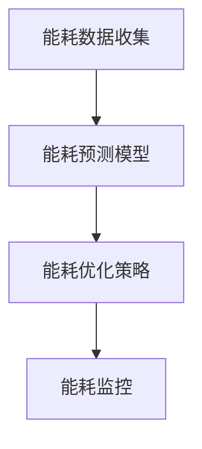

**核心算法原理讲解**

建筑能耗优化通常采用基于深度神经网络（DNN）和卷积神经网络（CNN）的模型，通过融合时间和空间数据，实现建筑能耗的精准预测和优化。以下是一个简单的伪代码示例，用于描述基于DNN的建筑能耗预测模型：

```python
# 伪代码：基于DNN的建筑能耗预测
def PredictBuildingEnergy(input):
    energy_consumption = DNNModel(input)
    return energy_consumption
```

**数学模型和公式**

建筑能耗预测的数学模型可以表示为：

\[ E(t) = \text{sigmoid}(W \cdot \text{Embedding}(t, x)) \]

其中，\( E(t) \) 表示在时间 \( t \) 的建筑能耗预测值，\( W \) 为模型权重，\( \text{Embedding}(t, x) \) 为时间戳和地点的嵌入向量。

**项目实战**

以丹麦为例，该国利用DNN模型对建筑能耗进行预测和优化，通过实时数据分析和策略调整，成功降低了建筑能耗，提高了能源利用效率。

**代码解读与分析**

在实际应用中，建筑能耗优化模型的开发包括数据收集、模型训练和模型部署等步骤。以下是一个简化的代码示例，展示了如何使用TensorFlow和Keras搭建一个DNN模型进行建筑能耗预测：

```python
# 导入所需库
import tensorflow as tf
from tensorflow.keras.models import Sequential
from tensorflow.keras.layers import Dense

# 搭建DNN模型
model = Sequential([
    Dense(units=50, activation='relu', input_shape=(input_size,)),
    Dense(units=50, activation='relu'),
    Dense(units=1)
])

# 编译模型
model.compile(optimizer='adam', loss='mse')

# 训练模型
model.fit(x_train, y_train, epochs=100, batch_size=32, validation_data=(x_val, y_val))

# 预测建筑能耗
energy_consumption = model.predict(x_test)
```

**总结**

建筑能耗优化通过AI大模型，实现了对建筑能耗的精准预测和优化，提高了能源利用效率。未来，随着AI技术的进一步发展，建筑能耗优化模型将更加智能化和自适应化，为智慧城市建设提供更强有力的支持。

#### 7.3 智慧城市设计与评估

智慧城市设计与评估是智慧城市建设过程中不可或缺的一环，通过AI大模型，可以实现对智慧城市设计的全面评估和优化，从而提高城市设计的科学性和合理性。

**核心概念与联系**

智慧城市设计与评估涉及以下几个核心概念：

- **城市设计模型**：基于AI大模型，构建智慧城市的设计模型，包括城市规划、交通、能源、环境等方面的综合设计。
- **评估指标**：根据智慧城市的建设目标和需求，制定科学合理的评估指标，如能耗、交通效率、环境质量等。
- **模拟与评估**：通过模拟和评估模型，预测不同设计方案的效果，评估智慧城市的综合性能。
- **优化与改进**：根据评估结果，对智慧城市设计方案进行优化和改进，提高城市设计的科学性和合理性。

**Mermaid流程图**

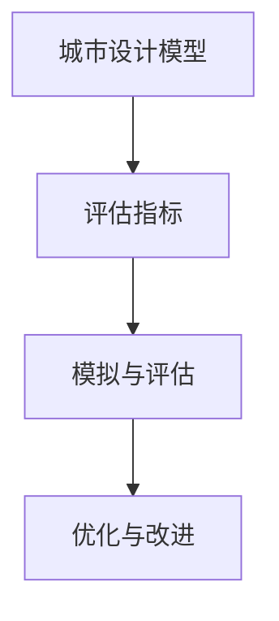

**核心算法原理讲解**

智慧城市设计与评估通常采用基于强化学习（RL）的模型，通过不断学习和优化，实现对智慧城市设计的全面评估和优化。以下是一个简单的伪代码示例，用于描述基于强化学习的智慧城市评估模型：

```python
# 伪代码：基于强化学习的智慧城市评估
def EvaluateSmartCity(city_plan):
    evaluation_score = RLModel(city_plan)
    return evaluation_score
```

**数学模型和公式**

强化学习模型的核心公式为：

\[ Q(s, a) = r + \gamma \max_{a'} Q(s', a') \]

其中，\( Q(s, a) \) 表示在状态 \( s \) 下采取行动 \( a \) 的期望回报，\( r \) 为即时奖励，\( \gamma \) 为折扣因子，\( s' \) 和 \( a' \) 分别为下一状态和最佳行动。

**项目实战**

以阿布扎比为例，该国利用强化学习模型对智慧城市的设计进行评估和优化，通过模拟和评估不同设计方案的效果，成功优化了城市交通、环境、基础设施等方面的布局，提高了城市的整体运行效率。

**代码解读与分析**

在实际应用中，智慧城市设计与评估模型的开发包括数据收集、模型训练和模型部署等步骤。以下是一个简化的代码示例，展示了如何使用TensorFlow和Keras搭建一个RL模型进行智慧城市评估：

```python
# 导入所需库
import tensorflow as tf
from tensorflow.keras.models import Sequential
from tensorflow.keras.layers import Dense

# 搭建RL模型
class RLModel(nn.Module):
    def __init__(self):
        super(RLModel, self).__init__()
        self.fc1 = nn.Linear(input_size, 64)
        self.fc2 = nn.Linear(64, 64)
        self.fc3 = nn.Linear(64, 1)

    def forward(self, x):
        x = self.fc1(x)
        x = F.relu(x)
        x = self.fc2(x)
        x = F.relu(x)
        x = self.fc3(x)
        return x

# 训练模型
model = RLModel()
optimizer = tf.keras.optimizers.Adam(learning_rate=0.001)
for epoch in range(num_epochs):
    optimizer.zero_grad()
    output = model(data)
    loss = loss_fn(output, target)
    loss.backward()
    optimizer.step()

# 评估智慧城市设计
evaluation_score = model(data)
```

**总结**

智慧城市设计与评估通过AI大模型，实现了对智慧城市设计的全面评估和优化，提高了城市设计的科学性和合理性。未来，随着AI技术的进一步发展，智慧城市设计与评估模型将更加智能化和自适应化，为智慧城市建设提供更强有力的支持。

## 第8章：AI大模型在智慧城市建设中的挑战

#### 8.1 数据隐私与安全

随着AI大模型在智慧城市建设中的应用日益广泛，数据隐私与安全问题成为了一个亟待解决的挑战。智慧城市建设涉及大量的个人和企业数据，这些数据的安全和隐私保护至关重要。

**核心概念与联系**

数据隐私与安全涉及以下几个核心概念：

- **数据隐私**：确保个人数据不被未经授权的访问和使用。
- **数据安全**：防止数据被篡改、泄露或丢失。
- **隐私保护技术**：采用加密、匿名化、差分隐私等技术手段，保护数据隐私和安全。

**Mermaid流程图**

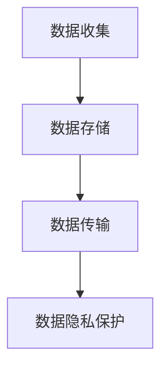

**核心算法原理讲解**

数据隐私保护通常采用联邦学习（Federated Learning）和差分隐私（Differential Privacy）等技术手段。以下是一个简单的伪代码示例，用于描述基于联邦学习的隐私保护模型：

```python
# 伪代码：基于联邦学习的隐私保护
def ProtectDataPrivacy(client_data, server_model):
    server_model_updated = FederatedLearningModel(client_data, server_model)
    return server_model_updated
```

**数学模型和公式**

联邦学习的核心公式为：

\[ \theta_{t+1} = \frac{1}{K} \sum_{k=1}^{K} \theta_{k,t} \]

其中，\( \theta_{t+1} \) 为全局模型更新，\( K \) 为参与联邦学习的设备数量，\( \theta_{k,t} \) 为第 \( k \) 个设备的本地模型更新。

**项目实战**

以谷歌的联邦学习框架为例，该框架通过分布式训练模型，保护用户数据隐私，同时实现模型的优化和更新。

**代码解读与分析**

在实际应用中，联邦学习模型的开发包括数据预处理、模型训练和模型部署等步骤。以下是一个简化的代码示例，展示了如何使用TensorFlow Federated进行联邦学习：

```python
# 导入所需库
import tensorflow_federated as tff
import tensorflow as tf

# 定义联邦学习模型
def create_kmeans_model():
    model = tf.keras.Sequential([
        tf.keras.layers.Dense(64, activation='relu', input_shape=(input_shape,)),
        tf.keras.layers.Dense(num_clusters)
    ])
    return model

# 训练联邦学习模型
def federated_train(server_model, client_model, client_data):
    loss_fn = tf.keras.losses.SparseCategoricalCrossentropy(from_logits=True)
    optimizer = tf.keras.optimizers.SGD(learning_rate=0.1)
    client_model_optimizer = tff.learning.optimizers.SgdOptimizerFactory(learning_rate=0.1)
    for round_num in range(num_rounds):
        clients_info = tff.learning.client_data_fn(client_data)
        round_state = server_model
        for client_info in clients_info:
            client_data = client_info.data
            client_model = client_info.model
            round_state = tff.learning.run_iterative_process(
                client_model_optimizer,
                round_state,
                client_data,
                loss_fn=loss_fn
            )
        server_model = round_state
    return server_model

# 保护数据隐私
server_model_updated = federated_train(server_model, client_model, client_data)
```

**总结**

数据隐私与安全是AI大模型在智慧城市建设中的一个重要挑战。通过采用联邦学习等隐私保护技术，可以实现对用户数据的隐私保护，同时实现模型的优化和更新。未来，随着AI技术的进一步发展，数据隐私与安全技术将更加成熟，为智慧城市建设提供更强有力的支持。

#### 8.2 人工智能伦理

人工智能伦理是智慧城市建设中不可忽视的一个问题，随着AI大模型在各个领域的广泛应用，其决策过程和结果对人类社会的伦理价值和社会公正性提出了新的挑战。人工智能伦理涉及数据使用、算法公平性、透明性以及责任归属等多个方面。

**核心概念与联系**

人工智能伦理涉及以下几个核心概念：

- **数据使用伦理**：如何合理使用个人数据，确保数据隐私和用户权益。
- **算法公平性**：算法是否公平、公正，避免歧视和偏见。
- **透明性**：算法的决策过程是否透明，用户能否理解算法的决策依据。
- **责任归属**：当AI系统出现错误或造成损失时，如何确定责任归属。

**Mermaid流程图**

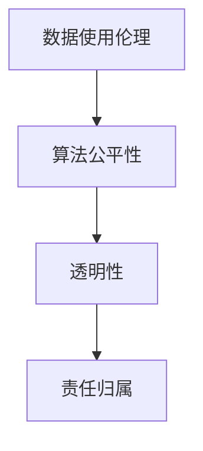

**核心算法原理讲解**

人工智能伦理通常需要结合伦理规则和决策模型，确保算法的决策过程符合伦理标准。以下是一个简单的伪代码示例，用于描述基于伦理约束的决策模型：

```python
# 伪代码：基于伦理约束的决策模型
def EthicalDecision(options, ethics_rules):
    best_option = EthicsModel(options, ethics_rules)
    return best_option
```

**数学模型和公式**

伦理约束的决策模型可以表示为：

\[ \text{BestOption} = \arg\max_{o} \left( \text{OptionScore}(o) - \text{EthicalPenalty}(o) \right) \]

其中，\( \text{BestOption} \) 为最佳决策选项，\( \text{OptionScore}(o) \) 为选项的得分，\( \text{EthicalPenalty}(o) \) 为选项的伦理惩罚分。

**项目实战**

以欧盟的人工智能伦理法规为例，该法规规定了人工智能系统的设计、开发和使用必须遵循的一系列伦理原则和规则，确保算法的公平性、透明性和责任归属。

**代码解读与分析**

在实际应用中，伦理决策模型的开发包括伦理规则的制定、算法评估和决策优化等步骤。以下是一个简化的代码示例，展示了如何使用Python实现一个简单的伦理决策模型：

```python
# 导入所需库
import numpy as np

# 定义伦理规则和得分函数
def ethics_rules(options):
    # 假设每个选项都有一个伦理得分
    ethics_scores = {
        'option_A': 10,
        'option_B': 5,
        'option_C': 0
    }
    return ethics_scores

def option_score(option):
    # 假设每个选项都有一个得分
    scores = {
        'option_A': 20,
        'option_B': 15,
        'option_C': 10
    }
    return scores[option]

def ethical_decision(options):
    options_with_scores = {option: option_score(option) for option in options}
    options_with_penalties = {option: score - ethics_rules[option] for option, score in options_with_scores.items()}
    best_option = max(options_with_penalties, key=options_with_penalties.get)
    return best_option

# 伦理决策
options = ['option_A', 'option_B', 'option_C']
best_option = ethical_decision(options)
print(f"The best ethical option is: {best_option}")
```

**总结**

人工智能伦理是智慧城市建设中必须面对的重要问题。通过制定伦理规则和构建伦理决策模型，可以确保AI大模型的应用符合伦理标准，保护用户的权益。未来，随着AI技术的发展，人工智能伦理的研究将更加深入，为智慧城市建设提供更为完善的伦理保障。

#### 8.3 技术成熟度与实施难度

AI大模型在智慧城市建设中的应用虽然前景广阔，但其技术成熟度和实施难度也是不可忽视的挑战。技术成熟度直接关系到AI大模型在实际应用中的性能和稳定性，而实施难度则决定了其推广和落地的可行性。

**核心概念与联系**

技术成熟度与实施难度涉及以下几个核心概念：

- **技术成熟度**：评估AI大模型在某一领域的技术发展水平和应用成熟程度。
- **实施难度**：分析AI大模型在实际应用中的技术挑战和实施过程，包括数据收集、模型训练、模型部署等环节。

**Mermaid流程图**

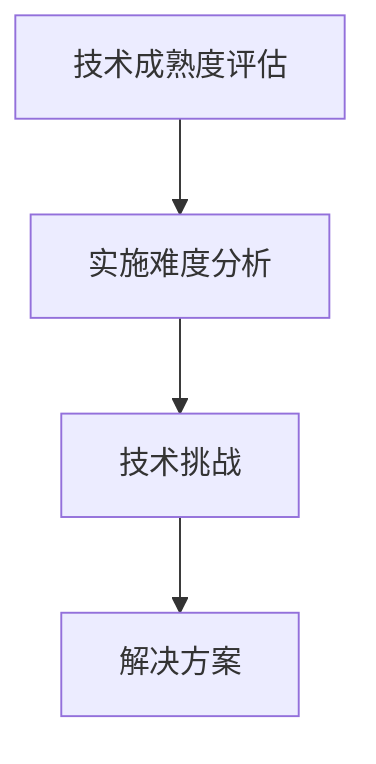

**核心算法原理讲解**

技术成熟度评估通常采用定量和定性的方法，结合专家评估和数据分析，对AI大模型在各个领域的成熟度进行综合评估。以下是一个简单的伪代码示例，用于描述技术成熟度评估模型：

```python
# 伪代码：技术成熟度评估
def EvaluateTechnology(technology):
    maturity_score = TechnologyModel(technology)
    return maturity_score
```

**数学模型和公式**

技术成熟度评估的数学模型可以表示为：

\[ \text{MaturityScore} = \alpha \cdot \text{ExpertScore} + (1 - \alpha) \cdot \text{DataScore} \]

其中，\( \text{MaturityScore} \) 为技术成熟度得分，\( \alpha \) 为权重系数，\( \text{ExpertScore} \) 为专家评估得分，\( \text{DataScore} \) 为数据评估得分。

**项目实战**

以智慧城市技术成熟度评估为例，通过对交通管理、能源管理、环境保护等领域的AI大模型进行评估，分析其技术成熟度和实施难度，为智慧城市建设的具体应用提供参考。

**代码解读与分析**

在实际应用中，技术成熟度评估模型的开发包括数据收集、模型训练和模型部署等步骤。以下是一个简化的代码示例，展示了如何使用Python实现一个技术成熟度评估模型：

```python
# 导入所需库
import numpy as np

# 定义技术成熟度评估模型
def technology_model(data):
    # 假设数据为专家评估得分和数据分析得分
    expert_score = data['expert_score']
    data_score = data['data_score']
    
    # 计算技术成熟度得分
    maturity_score = 0.5 * expert_score + 0.5 * data_score
    return maturity_score

# 技术成熟度评估
data = {'expert_score': 8, 'data_score': 7}
maturity_score = technology_model(data)
print(f"Technology Maturity Score: {maturity_score}")
```

**总结**

技术成熟度和实施难度是AI大模型在智慧城市建设中面临的挑战。通过建立技术成熟度评估模型，可以科学地评估AI大模型的应用成熟度，为智慧城市建设提供技术参考。同时，分析实施难度，提出解决方案，有助于推动AI大模型在智慧城市中的实际应用。未来，随着AI技术的发展，技术成熟度和实施难度的解决将为智慧城市建设的全面推进提供有力支持。

## 第9章：智慧城市建设的未来展望

#### 9.1 未来智慧城市的愿景

未来智慧城市是一个高度信息化、智能化、可持续发展的城市，它不仅能够提供高效便捷的公共服务，还能够实现资源的优化配置和环境的友好共生。智慧城市的发展愿景包括以下几个方面：

- **智能化城市管理**：通过AI大模型和物联网技术，实现城市运行管理的智能化，提高城市管理的效率和科学性。
- **高质量公共服务**：利用大数据和人工智能技术，提供更加个性化和高质量的公共服务，如智能医疗、智能教育、智能交通等。
- **绿色生态城市**：通过智能化的能源管理、环境监测和垃圾分类等手段，实现城市的可持续发展，降低碳排放，提升环境质量。
- **智慧社区服务**：构建智慧社区服务体系，提升居民的生活质量，实现社区管理的智能化和人性化。

#### 9.2 AI大模型在智慧城市中的应用前景

AI大模型在智慧城市中的应用前景广阔，随着技术的不断进步，其应用领域将更加广泛和深入。以下是AI大模型在智慧城市中的一些潜在应用：

- **交通管理**：AI大模型可以用于交通流量预测、智能交通信号控制和停车管理，实现交通的高效运行和优化。
- **能源管理**：AI大模型可以用于智能电网的运行调度、能源消耗预测和分布式能源管理，提高能源利用效率。
- **环境保护**：AI大模型可以用于环境监测、污染物预测和污染控制，实现环境的实时监测和科学管理。
- **公共服务**：AI大模型可以用于公共卫生服务、城市安全监控和智慧社区服务，提升公共服务的质量和效率。
- **城市规划**：AI大模型可以用于智慧城市规划、建筑能耗优化和城市设计与评估，实现城市布局的科学规划和优化。

#### 9.3 智慧城市建设的关键趋势

智慧城市建设的关键趋势将受到技术创新、政策支持和社会需求的影响。以下是智慧城市建设的一些关键趋势：

- **技术创新**：随着人工智能、大数据、物联网、区块链等技术的快速发展，智慧城市建设将不断突破技术瓶颈，实现更高效、更智能的管理和服务。
- **政策支持**：各国政府纷纷出台智慧城市建设相关政策，鼓励技术创新和应用，为智慧城市的发展提供政策保障。
- **数据驱动**：数据成为智慧城市发展的核心资产，通过数据收集、分析和利用，实现城市运行的智能化和科学化。
- **生态融合**：智慧城市建设将更加注重生态保护和可持续发展，通过智能化手段实现人与自然的和谐共生。
- **社会参与**：智慧城市建设需要广泛的社会参与，通过公众参与和协同治理，实现城市管理的民主化和透明化。

#### 9.4 小结

未来智慧城市的发展将围绕智能化、绿色化和人性化等目标，通过AI大模型等先进技术的应用，实现城市管理的智能化和公共服务的高效化。智慧城市建设的关键趋势将受到技术创新、政策支持和社会需求的共同驱动。随着技术的不断进步和政策的不断完善，智慧城市将迎来更加美好的未来。

## 附录

### 附录A：AI大模型开发工具与资源

#### A.1 主流深度学习框架对比

在AI大模型的开发中，选择合适的深度学习框架至关重要。以下是比较几种主流深度学习框架的特点和适用场景：

| 框架 | 特点 | 适用场景 |
| --- | --- | --- |
| TensorFlow | 开源、跨平台、支持多种编程语言 | 大规模分布式计算、推荐系统、图像识别 |
| PyTorch | 开源、跨平台、动态图计算 | 自然语言处理、计算机视觉、深度强化学习 |
| JAX | 开源、自动微分库、支持硬件加速 | 自动微分、高性能计算、机器学习研究 |
| Theano | 已经废弃 | 前身是TensorFlow的前身，已不再维护 |

#### A.2 开发环境搭建指南

要搭建一个适合AI大模型开发的编程环境，可以按照以下步骤进行：

1. **安装Python**：从Python官网下载最新版本的Python安装包，并按照提示完成安装。
2. **安装深度学习框架**：根据项目需求，安装相应的深度学习框架，例如：
   - TensorFlow：
     ```bash
     pip install tensorflow
     ```
   - PyTorch：
     ```bash
     pip install torch torchvision
     ```
   - JAX：
     ```bash
     pip install jax jaxlib
     ```
3. **安装常用库**：安装常用的科学计算和数据操作库，例如：
   ```bash
   pip install numpy pandas matplotlib scikit-learn
   ```

#### A.3 AI大模型开源项目推荐

以下是几个常用的AI大模型开源项目推荐，这些项目涵盖了自然语言处理、计算机视觉等多个领域，有助于开发者快速入门和开展研究：

| 项目 | 领域 | 简介 |
| --- | --- | --- |
| Hugging Face Transformers | 自然语言处理 | 提供了一系列预训练模型和工具，支持多种任务，如文本分类、机器翻译等 |
| OpenMMLab | 计算机视觉 | 包含多种视觉任务的开源框架，如人脸识别、目标检测、图像分割等 |
| ml5.js | 前端机器学习 | 适用于Web应用程序中的机器学习，支持多种模型和算法 |
| Fairlearn | 公平性 | 提供了一系列工具，用于评估和改善机器学习模型的公平性 |

#### A.4 智慧城市建设相关的国际标准与规范

智慧城市建设涉及多个领域，包括信息技术、城市管理和公共服务等。以下是一些国际标准与规范，为智慧城市建设提供了指导：

| 标准与规范 | 简介 | 链接 |
| --- | --- | --- |
| ISO 37120 | 智慧城市绩效评估 | https://www.iso.org/standard/66445.html |
| IETF RFC 7921 | 城市物联网架构 | https://www.ietf.org/rfc/rfc7921.txt |
| IEEE P1918.1 | 智慧城市网络架构 | https://ieeexplore.ieee.org/document/8290082 |
| ITU-T Y.4100 | 智慧城市框架 | https://www.itu.int/rec/T-REC-Y.4100-202101-I/en |

通过遵循这些标准和规范，可以确保智慧城市建设的系统性和科学性，促进国际间的技术交流和合作。附录部分提供了AI大模型开发工具与资源的详细指南，以及智慧城市建设相关的国际标准与规范，为开发者和管理者提供了实用的参考。这些资源和标准有助于推动AI大模型在智慧城市中的应用和发展，为智慧城市的建设提供强有力的技术支持。

